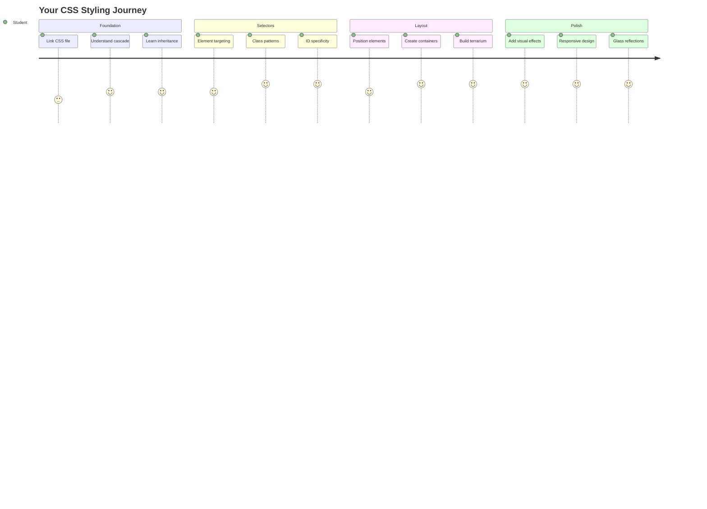
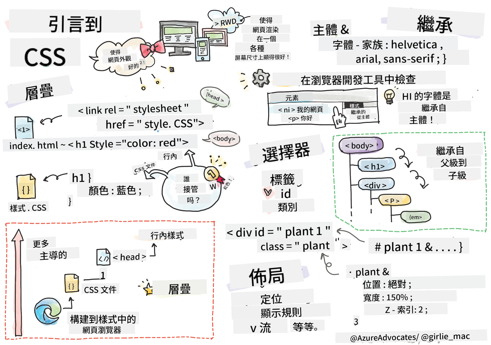
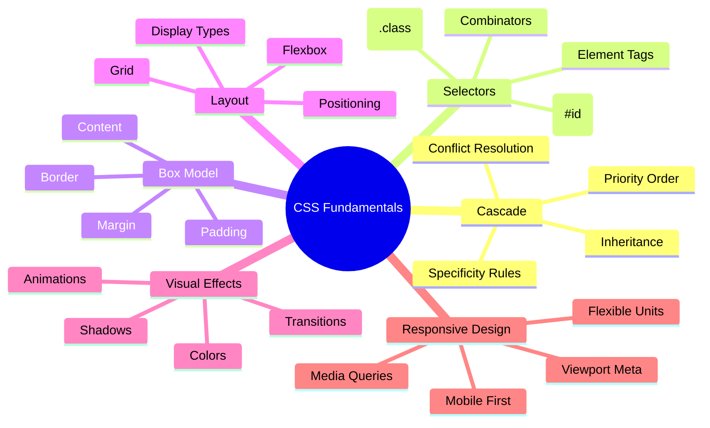
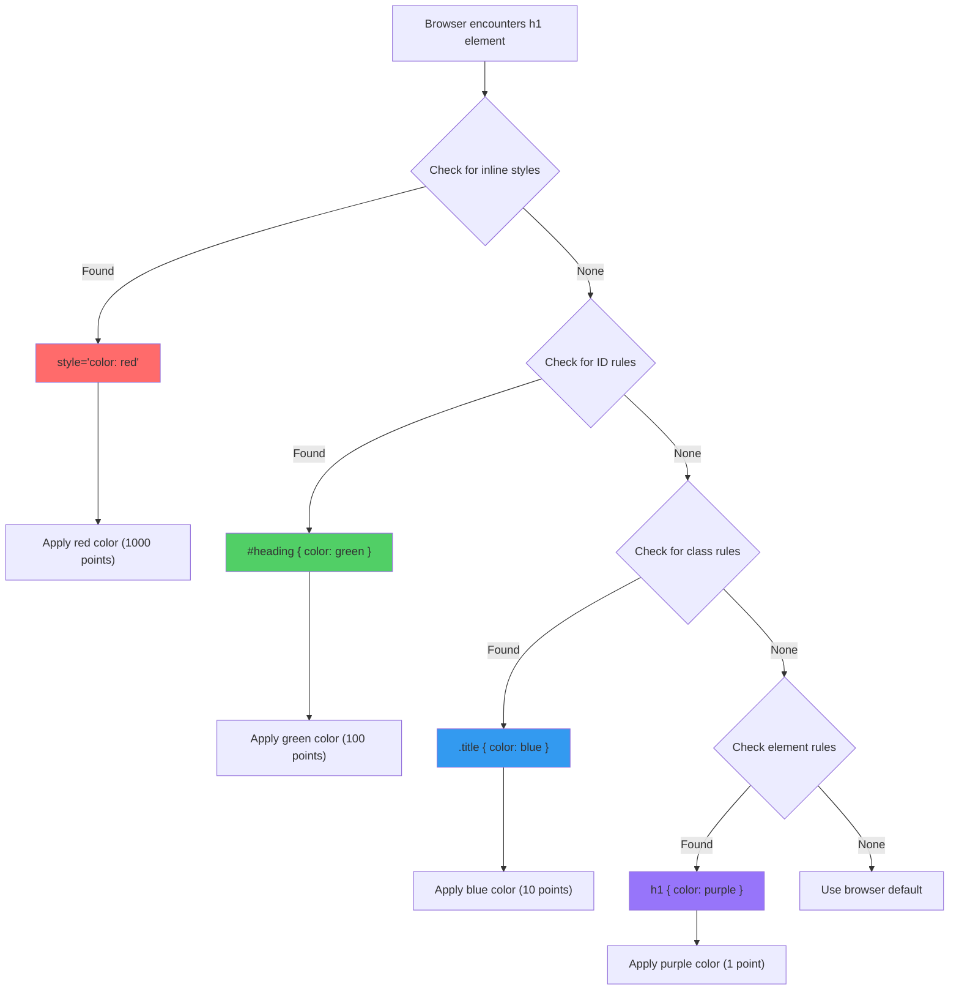
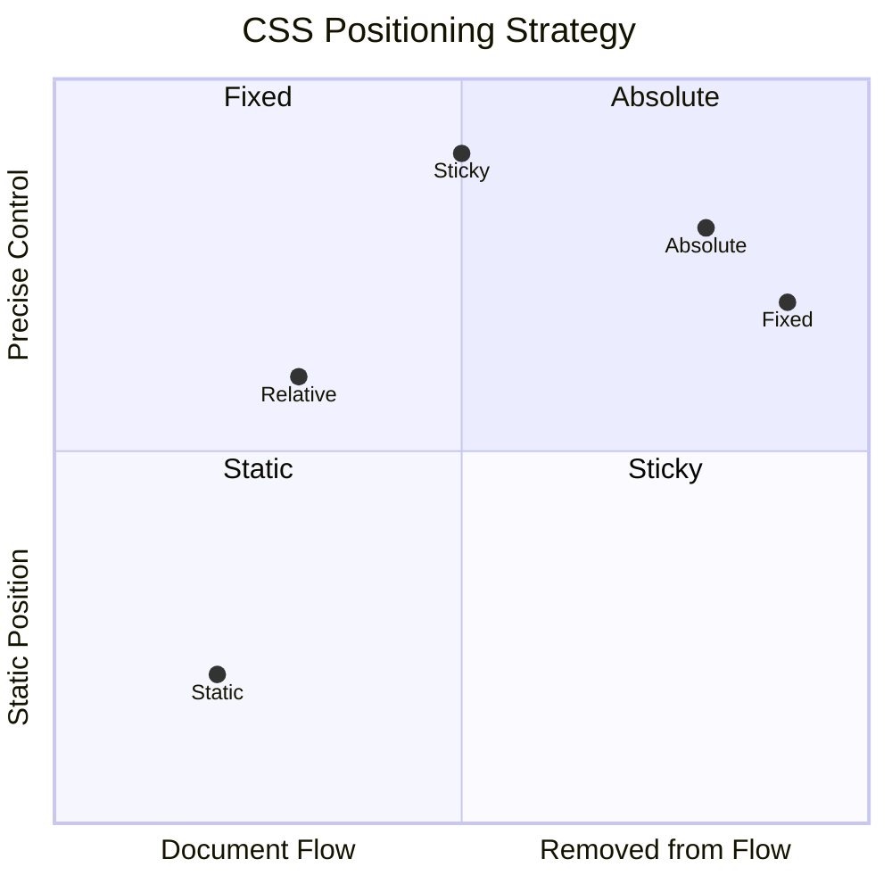
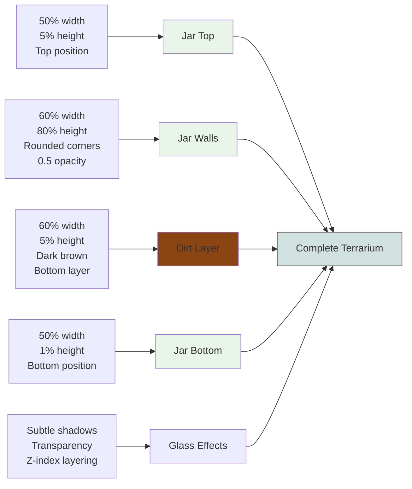
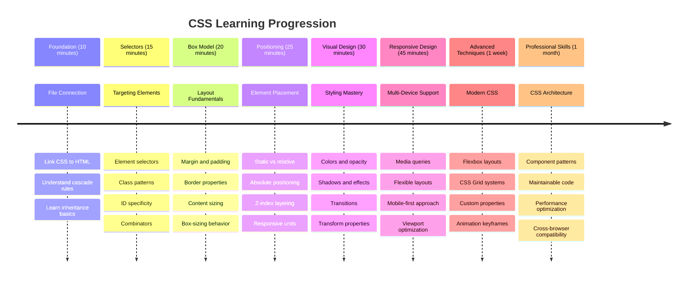

<!--
CO_OP_TRANSLATOR_METADATA:
{
  "original_hash": "e39f3a4e3bcccf94639e3af1248f8a4d",
  "translation_date": "2025-11-03T23:45:28+00:00",
  "source_file": "3-terrarium/2-intro-to-css/README.md",
  "language_code": "mo"
}
-->
# 微型生態瓶專案第二部分：CSS入門




> 手繪筆記由 [Tomomi Imura](https://twitter.com/girlie_mac) 提供

還記得你的HTML微型生態瓶看起來非常基本嗎？CSS就是用來將這個簡單的結構轉變成視覺上更吸引人的東西。

如果說HTML像是建造房子的框架，那麼CSS就是讓房子有家的感覺的一切——油漆顏色、家具擺放、燈光以及房間之間的流動感。想想凡爾賽宮如何從一個簡單的狩獵小屋開始，通過精心的裝飾和布局，變成世界上最宏偉的建築之一。

今天，我們將把你的微型生態瓶從功能性轉變為精緻的作品。你將學習如何精確地定位元素，讓布局適應不同的屏幕尺寸，並創造出讓網站更具吸引力的視覺效果。

在本課程結束時，你將看到如何通過策略性的CSS樣式設計大幅提升你的專案。讓我們為你的微型生態瓶增添一些風格吧。



## 課前測驗

[課前測驗](https://ff-quizzes.netlify.app/web/quiz/17)

## CSS入門

CSS通常被認為只是“讓東西變得漂亮”，但它的用途遠不止於此。CSS就像電影的導演——你不僅控制所有事物的外觀，還控制它們的移動、交互反應以及如何適應不同情況。

現代CSS功能非常強大。你可以編寫代碼，讓布局自動適應手機、平板電腦和桌面電腦。你可以創造流暢的動畫，引導用戶的注意力到需要的地方。當一切協同工作時，效果可能非常驚人。

> 💡 **專業提示**：CSS不斷演進，擁有新的功能和能力。在使用新CSS功能於生產專案之前，請隨時檢查 [CanIUse.com](https://caniuse.com) 以確認瀏覽器的支持情況。

**在本課程中，我們將完成以下目標：**
- **創建** 使用現代CSS技術的完整視覺設計，為你的微型生態瓶增添風格
- **探索** 基本概念，例如層疊、繼承和CSS選擇器
- **實現** 響應式定位和布局策略
- **構建** 使用CSS形狀和樣式設計微型生態瓶容器

### 前置條件

你應該已完成上一課中微型生態瓶的HTML結構，並準備好進行樣式設計。

> 📺 **影片資源**：查看這段有幫助的影片教學
>
> [](https://www.youtube.com/watch?v=6yIdOIV9p1I)

### 設置你的CSS文件

在開始設計樣式之前，我們需要將CSS連接到HTML。這個連接告訴瀏覽器在哪裡找到微型生態瓶的樣式指令。

在你的微型生態瓶文件夾中，創建一個名為`style.css`的新文件，然後在HTML文檔的`<head>`部分中鏈接它：

```html
<link rel="stylesheet" href="./style.css" />
```

**這段代碼的作用：**
- **創建** HTML和CSS文件之間的連接
- **告訴** 瀏覽器加載並應用`style.css`中的樣式
- **使用** `rel="stylesheet"`屬性指定這是一個CSS文件
- **引用** 文件路徑`href="./style.css"`

## 理解CSS層疊

是否曾經想過為什麼CSS被稱為“層疊樣式表”？樣式像瀑布一樣層層疊加，有時會相互衝突。

想像一下軍事指揮結構——一個將軍的命令可能是“所有士兵穿綠色制服”，但對你的部隊的具體命令可能是“穿藍色禮服參加儀式”。更具體的指令優先於一般指令。CSS遵循類似的邏輯，理解這種層次結構可以讓調試變得更加容易。

### 嘗試層疊優先級

讓我們通過創建樣式衝突來看看層疊的作用。首先，向你的`<h1>`標籤添加內聯樣式：

```html
<h1 style="color: red">My Terrarium</h1>
```

**這段代碼的作用：**
- **直接應用** 紅色到`<h1>`元素，使用內聯樣式
- **使用** `style`屬性直接在HTML中嵌入CSS
- **創建** 對此特定元素的最高優先級樣式規則

接下來，將以下規則添加到你的`style.css`文件中：

```css
h1 {
  color: blue;
}
```

**在上述代碼中，我們：**
- **定義** 一個CSS規則，針對所有`<h1>`元素
- **設置** 文本顏色為藍色，使用外部樣式表
- **創建** 與內聯樣式相比優先級較低的規則

✅ **知識檢查**：你的網頁應用中顯示的是哪種顏色？為什麼這種顏色會勝出？你能想到哪些情況下可能需要覆蓋樣式？



> 💡 **CSS優先級順序（從高到低）：**
> 1. **內聯樣式**（style屬性）
> 2. **ID**（#myId）
> 3. **類**（.myClass）和屬性
> 4. **元素選擇器**（h1, div, p）
> 5. **瀏覽器默認樣式**

## CSS繼承的應用

CSS的繼承就像基因遺傳——元素會從其父元素繼承某些屬性。如果你在`body`元素上設置字體，所有內部文本都會自動使用相同的字體。這就像哈布斯堡家族的獨特下巴特徵，跨越幾代人傳承下來，而不需要為每個個體單獨指定。

然而，並非所有屬性都會被繼承。像字體和顏色這樣的文本樣式會被繼承，但像邊距和邊框這樣的布局屬性則不會。就像孩子可能會遺傳父母的外貌特徵，但不一定會繼承他們的穿衣風格。

### 觀察字體繼承

讓我們通過在`<body>`元素上設置字體來觀察繼承的作用：

```css
body {
  font-family: 'Segoe UI', Tahoma, Geneva, Verdana, sans-serif;
}
```

**這段代碼的作用：**
- **設置** 整個頁面的字體，通過針對`<body>`元素
- **使用** 字體堆疊和備選選項，以提高瀏覽器兼容性
- **應用** 現代系統字體，讓不同操作系統的外觀更佳
- **確保** 所有子元素繼承此字體，除非特別覆蓋

打開瀏覽器的開發者工具（F12），導航到“元素”選項卡，檢查你的`<h1>`元素。你會看到它繼承了`body`的字體：


✅ **實驗時間**：嘗試在`<body>`上設置其他可繼承屬性，例如`color`、`line-height`或`text-align`。你的標題和其他元素會發生什麼變化？

> 📝 **可繼承屬性包括**：`color`、`font-family`、`font-size`、`line-height`、`text-align`、`visibility`
>
> **不可繼承屬性包括**：`margin`、`padding`、`border`、`width`、`height`、`position`

### 🔄 **教學檢查**
**CSS基礎理解**：在進入選擇器之前，確保你能：
- ✅ 解釋層疊和繼承的區別
- ✅ 預測在特異性衝突中哪個樣式會勝出
- ✅ 確定哪些屬性會從父元素繼承
- ✅ 正確連接CSS文件到HTML

**快速測試**：如果你有以下樣式，`<div class="special">`中的`<h1>`會是什麼顏色？
```css
div { color: blue; }
.special { color: green; }
h1 { color: red; }
```
*答案：紅色（元素選擇器直接針對h1）*

## 掌握CSS選擇器

CSS選擇器是你用來針對特定元素進行樣式設計的方式。它們就像給出精確的指令——與其說“那棟房子”，不如說“楓樹街上有紅色門的藍色房子”。

CSS提供了不同的方式來精確定位，選擇合適的選擇器就像選擇適合的工具。有時你需要設計整個街區的每扇門，有時只需要設計一扇特定的門。

### 元素選擇器（標籤）

元素選擇器通過標籤名稱來定位HTML元素。它們非常適合設置全局樣式，適用於整個頁面：

```css
body {
  font-family: 'Segoe UI', Tahoma, Geneva, Verdana, sans-serif;
  margin: 0;
  padding: 0;
}

h1 {
  color: #3a241d;
  text-align: center;
  font-size: 2.5rem;
  margin-bottom: 1rem;
}
```

**理解這些樣式：**
- **設置** 整個頁面的統一排版，使用`body`選擇器
- **移除** 瀏覽器默認的邊距和填充，以便更好地控制
- **設計** 所有標題元素的顏色、對齊和間距
- **使用** `rem`單位進行可擴展、可訪問的字體大小設置

雖然元素選擇器非常適合一般樣式設計，但你需要更具體的選擇器來設計微型生態瓶中的個別組件，例如植物。

### 用於唯一元素的ID選擇器

ID選擇器使用`#`符號，定位具有特定`id`屬性的元素。由於ID在頁面中必須是唯一的，它們非常適合設計個別的特殊元素，例如我們的左右植物容器。

讓我們為微型生態瓶的側邊容器創建樣式，這些容器是植物的居住地：

```css
#left-container {
  background-color: #f5f5f5;
  width: 15%;
  left: 0;
  top: 0;
  position: absolute;
  height: 100vh;
  padding: 1rem;
  box-sizing: border-box;
}

#right-container {
  background-color: #f5f5f5;
  width: 15%;
  right: 0;
  top: 0;
  position: absolute;
  height: 100vh;
  padding: 1rem;
  box-sizing: border-box;
}
```

**這段代碼的作用：**
- **定位** 容器在屏幕的最左和最右邊，使用`absolute`定位
- **使用** `vh`（視窗高度）單位，讓高度響應屏幕尺寸
- **應用** `box-sizing: border-box`，使填充包含在總寬度內
- **移除** 零值中的不必要`px`單位，讓代碼更簡潔
- **設置** 柔和的背景色，比刺眼的灰色更舒適

✅ **代碼質量挑戰**：注意這段CSS違反了DRY（不要重複自己）原則。你能否使用ID和類進行重構？

**改進方法：**
```html
<div id="left-container" class="container"></div>
<div id="right-container" class="container"></div>
```

```css
.container {
  background-color: #f5f5f5;
  width: 15%;
  top: 0;
  position: absolute;
  height: 100vh;
  padding: 1rem;
  box-sizing: border-box;
}

#left-container {
  left: 0;
}

#right-container {
  right: 0;
}
```

### 用於可重複樣式的類選擇器

類選擇器使用`.`符號，非常適合在多個元素上應用相同的樣式。與ID不同，類可以在整個HTML中重複使用，非常適合一致的樣式模式。

在我們的微型生態瓶中，每個植物需要相似的樣式，但也需要單獨的定位。我們將使用類的組合來實現共享樣式，並使用ID進行獨特的定位。

**以下是每個植物的HTML結構：**
```html
<div class="plant-holder">
  
</div>
```

**關鍵元素解釋：**
- **使用** `class="plant-holder"` 為所有植物容器提供一致的樣式
- **應用** `class="plant"` 為共享的圖片樣式和行為
- **包含** 獨特的`id="plant1"`，用於單獨定位和JavaScript交互
- **提供** 描述性alt文字，方便屏幕閱讀器使用

現在將以下樣式添加到你的`style.css`文件中：

```css
.plant-holder {
  position: relative;
  height: 13%;
  left: -0.6rem;
}

.plant {
  position: absolute;
  max-width: 150%;
  max-height: 150%;
  z-index: 2;
  transition: transform 0.3s ease;
}

.plant:hover {
  transform: scale(1.05);
}
```

**分解這些樣式：**
- **創建** 植物容器的相對定位，以建立定位上下文
- **設置** 每個植物容器的高度為13%，確保所有植物垂直排列且不需要滾動
- **稍微向左移動** 容器，以便更好地將植物居中於其容器內
- **允許** 植物通過`max-width`和`max-height`屬性進行響應式縮放
- **使用** `z-index`，使植物層疊在微型生態瓶的其他元素之上
- **添加** 柔和的懸停效果，通過CSS過渡提升用戶交互體驗

✅ **批判性思考**：為什麼我們需要同時使用`.plant-holder`和`.plant`選擇器？如果我們只使用其中一個會發生什麼？

> 💡 **設計模式**：容器（`.plant-holder`）控制布局和定位，而內容（`.plant`）控制外觀和縮放。這種分離使代碼更易於維護和靈活。

## 理解CSS定位

CSS定位就像是舞台劇的導演——你指導每個演員站在哪裡以及如何在舞台上移動。有些演員遵循標準的隊形，而有些則需要特定的定位以達到戲劇效果。

一旦你理解了定位，許多布局挑戰就會變得易於處理。需要一個在用戶滾動時始終位於頂部的導航欄？定位可以解決這個問題。想要一個出現在特定位置的提示框？這也是定位的作用。

### 五種定位值



| 定位值 | 行為 | 使用場景 |
|--------|------|----------|
| `static` | 默認流，忽略top/left/right/bottom | 正常文檔布局 |
| `relative` | 相對於其正常位置進行定位 | 小幅調整，創建定位上下文 |
| `absolute` | 相對於最近的定位祖先進行定位 | 精確放置、覆蓋層 |
| `fixed` | 相對於視窗進行定位 | 導航欄、浮動元素 |
| `sticky` | 根據滾動在相對和固定之間切換 | 滾動時固定的標題 |

### 微型生態瓶中的定位

我們的微型生態瓶使用了定位類型的策略性組合來創建所需的布局：

```css
/* Container positioning */
.container {
  position: absolute; /* Removes from normal flow */
  /* ... other styles ... */
}

/* Plant holder positioning */
.plant-holder {
  position: relative; /* Creates positioning context */
  /* ... other styles ... */
}

/* Plant positioning */
.plant {
  position: absolute; /* Allows precise placement within holder */
  /* ... other styles ... */
}
```

**理解定位策略：**
- **絕對容器** 從正常文檔流中移除，並固定在屏幕邊緣
- **相對植物容器** 創建定位上下文，同時保持在文檔流中
- **絕對植物** 可以在其相對容器內精確定位
- **這種組合** 允許植物垂直堆疊，同時可以單獨定位

> 🎯 **為什麼這很重要**：植物元素需要絕對定位，以便在下一課中實現可拖動功能。絕對定位將它們從正常布局流中移除，使得拖放交互成為可能。

✅ **實驗時間**：嘗試更改定位值並觀察結果：
- 如果將`.container`從`absolute`改為`relative`，會發生什麼？
- 如果 `.plant-holder` 使用 `absolute` 而不是 `relative`，佈局會如何改變？
- 當你將 `.plant` 切換到 `relative` 定位時會發生什麼？

### 🔄 **教學檢查**
**CSS 定位精通**：停下來確認你的理解：
- ✅ 你能解釋為什麼植物需要使用 `absolute` 定位來進行拖放嗎？
- ✅ 你理解相對容器如何創建定位上下文嗎？
- ✅ 為什麼側邊容器使用 `absolute` 定位？
- ✅ 如果完全移除定位聲明會發生什麼？

**現實世界的連結**：思考 CSS 定位如何反映現實世界的佈局：
- **Static**：書架上的書（自然順序）
- **Relative**：稍微移動一本書但保持其位置
- **Absolute**：在特定頁面放置書籤
- **Fixed**：翻頁時始終可見的便利貼

## 使用 CSS 建造玻璃瓶

現在我們將僅使用 CSS 建造一個玻璃瓶——不需要圖片或圖形軟件。

使用定位和透明度創造逼真的玻璃、陰影和深度效果，展示了 CSS 的視覺能力。這種技術類似於包豪斯運動中的建築師如何使用簡單的幾何形狀創造出複雜而美麗的結構。一旦你理解了這些原則，你就能識別許多網頁設計背後的 CSS 技術。



### 創建玻璃瓶的組件

讓我們逐步建造玻璃瓶。每個部分都使用 `absolute` 定位和基於百分比的尺寸來實現響應式設計：

```css
.jar-walls {
  height: 80%;
  width: 60%;
  background: #d1e1df;
  border-radius: 1rem;
  position: absolute;
  bottom: 0.5%;
  left: 20%;
  opacity: 0.5;
  z-index: 1;
  box-shadow: inset 0 0 2rem rgba(0, 0, 0, 0.1);
}

.jar-top {
  width: 50%;
  height: 5%;
  background: #d1e1df;
  position: absolute;
  bottom: 80.5%;
  left: 25%;
  opacity: 0.7;
  z-index: 1;
  border-radius: 0.5rem 0.5rem 0 0;
}

.jar-bottom {
  width: 50%;
  height: 1%;
  background: #d1e1df;
  position: absolute;
  bottom: 0;
  left: 25%;
  opacity: 0.7;
  border-radius: 0 0 0.5rem 0.5rem;
}

.dirt {
  width: 60%;
  height: 5%;
  background: #3a241d;
  position: absolute;
  border-radius: 0 0 1rem 1rem;
  bottom: 1%;
  left: 20%;
  opacity: 0.7;
  z-index: -1;
}
```

**理解玻璃瓶的構造：**
- **使用** 基於百分比的尺寸以實現跨所有屏幕尺寸的響應式縮放
- **定位** 元素為絕對位置以精確堆疊和對齊
- **應用** 不同的透明度值以創造玻璃的透明效果
- **實現** `z-index` 層次，使植物看起來在瓶子內部
- **添加** 微妙的盒子陰影和精緻的圓角以更逼真的外觀

### 使用百分比進行響應式設計

注意所有尺寸都使用百分比而不是固定的像素值：

**為什麼這很重要：**
- **確保** 玻璃瓶在任何屏幕尺寸上都能按比例縮放
- **保持** 瓶子組件之間的視覺關係
- **提供** 從手機到大型桌面顯示器的一致體驗
- **允許** 設計在不破壞視覺佈局的情況下進行調整

### CSS 單位的應用

我們使用 `rem` 單位來設置圓角，這些單位相對於根字體大小進行縮放。這樣可以創造出更具可訪問性的設計，尊重用戶的字體偏好。了解更多 [CSS 相對單位](https://www.w3.org/TR/css-values-3/#font-relative-lengths) 的官方規範。

✅ **視覺實驗**：嘗試修改這些值並觀察效果：
- 將瓶子的透明度從 0.5 改為 0.8——這如何影響玻璃的外觀？
- 將泥土顏色從 `#3a241d` 改為 `#8B4513`——這對視覺效果有什麼影響？
- 將泥土的 `z-index` 改為 2——這對層次結構有什麼影響？

### 🔄 **教學檢查**
**CSS 視覺設計理解**：確認你對 CSS 視覺設計的掌握：
- ✅ 百分比尺寸如何創造響應式設計？
- ✅ 為什麼透明度能創造玻璃的透明效果？
- ✅ `z-index` 在元素層次中扮演什麼角色？
- ✅ 圓角值如何創造瓶子的形狀？

**設計原則**：注意我們如何從簡單形狀構建複雜的視覺效果：
1. **矩形** → **圓角矩形** → **瓶子組件**
2. **平面顏色** → **透明度** → **玻璃效果**
3. **單個元素** → **層次組合** → **3D 外觀**

---

## GitHub Copilot Agent 挑戰 🚀

使用 Agent 模式完成以下挑戰：

**描述：** 創建一個 CSS 動畫，使玻璃瓶中的植物輕輕地左右搖擺，模擬自然微風效果。這將幫助你練習 CSS 動畫、變換和關鍵幀，同時增強玻璃瓶的視覺吸引力。

**提示：** 添加 CSS 關鍵幀動畫，使玻璃瓶中的植物輕輕地左右搖擺。創建一個搖擺動畫，使每棵植物稍微向左和向右旋轉（2-3 度），持續 3-4 秒，並將其應用到 `.plant` 類。確保動畫無限循環並具有自然運動的緩動功能。

了解更多 [Agent 模式](https://code.visualstudio.com/blogs/2025/02/24/introducing-copilot-agent-mode) 的信息。

## 🚀 挑戰：添加玻璃反射效果

準備好用逼真的玻璃反射效果來增強你的玻璃瓶嗎？這項技術將為設計增添深度和真實感。

你將創建微妙的高光，模擬光線如何在玻璃表面反射。這種方法類似於文藝復興時期的畫家如 Jan van Eyck 如何使用光線和反射使繪製的玻璃看起來具有三維效果。以下是你的目標：


**你的挑戰：**
- **創建** 微妙的白色或淺色橢圓形作為玻璃反射效果
- **將它們** 策略性地放置在瓶子的左側
- **應用** 適當的透明度和模糊效果以實現逼真的光線反射
- **使用** `border-radius` 創造有機的氣泡狀形狀
- **嘗試** 使用漸變或盒子陰影以增強真實感

## 課後測驗

[課後測驗](https://ff-quizzes.netlify.app/web/quiz/18)

## 擴展你的 CSS 知識

CSS 起初可能感覺很複雜，但理解這些核心概念能為更高級的技術打下堅實基礎。

**你的下一個 CSS 學習領域：**
- **Flexbox** - 簡化元素的對齊和分佈
- **CSS Grid** - 提供創建複雜佈局的強大工具
- **CSS Variables** - 減少重複並提高可維護性
- **響應式設計** - 確保網站在不同屏幕尺寸上表現良好

### 互動學習資源

通過以下有趣的互動遊戲練習這些概念：
- 🐸 [Flexbox Froggy](https://flexboxfroggy.com/) - 通過有趣的挑戰掌握 Flexbox
- 🌱 [Grid Garden](https://codepip.com/games/grid-garden/) - 通過種植虛擬胡蘿蔔學習 CSS Grid
- 🎯 [CSS Battle](https://cssbattle.dev/) - 通過編碼挑戰測試你的 CSS 技能

### 進一步學習

要全面了解 CSS 基礎，完成此 Microsoft Learn 模組：[使用 CSS 為 HTML 應用程式設計樣式](https://docs.microsoft.com/learn/modules/build-simple-website/4-css-basics/?WT.mc_id=academic-77807-sagibbon)

### ⚡ **你可以在接下來的 5 分鐘內完成的事情**
- [ ] 打開 DevTools 並使用元素面板檢查任何網站的 CSS 樣式
- [ ] 創建一個簡單的 CSS 文件並將其鏈接到 HTML 頁面
- [ ] 嘗試使用不同的方法更改顏色：十六進制、RGB 和命名顏色
- [ ] 通過向 div 添加內邊距和外邊距練習盒模型

### 🎯 **你可以在接下來的一小時內完成的事情**
- [ ] 完成課後測驗並回顧 CSS 基礎
- [ ] 使用字體、顏色和間距設計你的 HTML 頁面
- [ ] 使用 Flexbox 或 Grid 創建一個簡單的佈局
- [ ] 嘗試使用 CSS 過渡效果創造平滑效果
- [ ] 使用媒體查詢練習響應式設計

### 📅 **你的 CSS 一週冒險**
- [ ] 完成玻璃瓶樣式作業並展現創意
- [ ] 通過構建照片庫佈局掌握 CSS Grid
- [ ] 學習 CSS 動畫使你的設計栩栩如生
- [ ] 探索 CSS 預處理器如 Sass 或 Less
- [ ] 學習設計原則並將其應用到你的 CSS 中
- [ ] 分析並重現你在線上找到的有趣設計

### 🌟 **你的 CSS 一個月設計精通**
- [ ] 建立完整的響應式網站設計系統
- [ ] 學習 CSS-in-JS 或像 Tailwind 這樣的實用優先框架
- [ ] 通過改進 CSS 為開源項目做出貢獻
- [ ] 掌握高級 CSS 概念，如 CSS 自定義屬性和容器
- [ ] 使用模塊化 CSS 創建可重用的組件庫
- [ ] 指導其他人學習 CSS 並分享設計知識

## 🎯 你的 CSS 精通時間表



### 🛠️ 你的 CSS 工具包摘要

完成本課程後，你現在擁有：
- **層疊理解**：了解樣式如何繼承和覆蓋
- **選擇器精通**：使用元素、類和 ID 精確定位
- **定位技能**：戰略性地放置和分層元素
- **視覺設計**：創造玻璃效果、陰影和透明度
- **響應式技術**：基於百分比的佈局適應任何屏幕
- **代碼組織**：乾淨、可維護的 CSS 結構
- **現代實踐**：使用相對單位和可訪問的設計模式

**下一步：** 你的玻璃瓶現在已經有了結構（HTML）和樣式（CSS）。最後一課將使用 JavaScript 添加互動性！

## 作業

[CSS 重構](assignment.md)

---

**免責聲明**：  
本文件已使用 AI 翻譯服務 [Co-op Translator](https://github.com/Azure/co-op-translator) 進行翻譯。雖然我們致力於提供準確的翻譯，但請注意，自動翻譯可能包含錯誤或不準確之處。原始文件的母語版本應被視為權威來源。對於關鍵信息，建議使用專業人工翻譯。我們對因使用此翻譯而產生的任何誤解或誤釋不承擔責任。