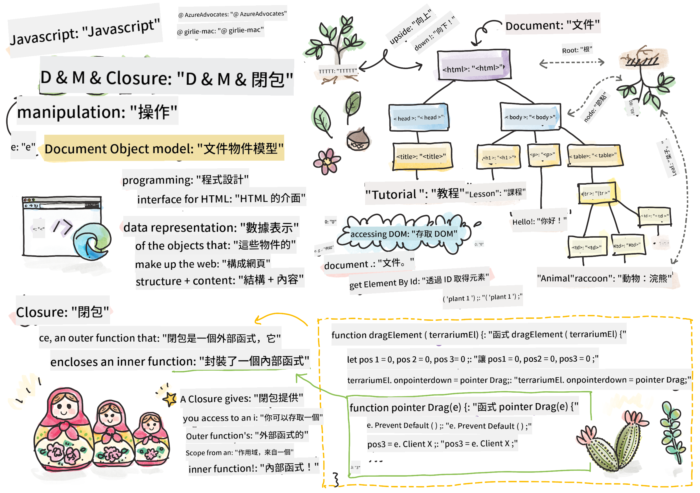
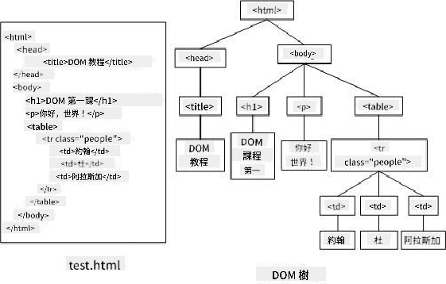
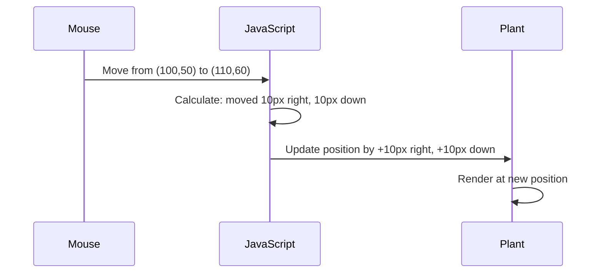

<!--
CO_OP_TRANSLATOR_METADATA:
{
  "original_hash": "bc93f6285423033ebf5b8abeb5282888",
  "translation_date": "2025-10-22T22:44:28+00:00",
  "source_file": "3-terrarium/3-intro-to-DOM-and-closures/README.md",
  "language_code": "mo"
}
-->
# 微型生態瓶項目第三部分：DOM 操作與 JavaScript 閉包


> [Tomomi Imura](https://twitter.com/girlie_mac) 的手繪筆記

歡迎來到網頁開發中最有趣的部分之一——讓事物變得互動！文檔對象模型（DOM）就像是 HTML 和 JavaScript 之間的橋樑，今天我們將利用它讓你的微型生態瓶活起來。當 Tim Berners-Lee 創建第一個網頁瀏覽器時，他設想了一個可以動態和互動的網絡世界——DOM 使這一願景成為可能。

我們還將探討 JavaScript 閉包，這一概念乍聽可能有些令人生畏。可以將閉包想像成創建“記憶口袋”，讓你的函數能夠記住重要信息。就像微型生態瓶中的每棵植物都有自己的數據記錄來追蹤其位置一樣。完成本課程後，你將理解它們的自然性和實用性。

以下是我們要構建的內容：一個用戶可以隨意拖放植物的微型生態瓶。你將學習 DOM 操作技術，這些技術支持從拖放文件上傳到互動遊戲的一切。讓我們讓你的微型生態瓶活起來吧。

## 課前測驗

[課前測驗](https://ff-quizzes.netlify.app/web/quiz/19)

## 理解 DOM：通往互動網頁的入口

文檔對象模型（DOM）是 JavaScript 與 HTML 元素通信的方式。當你的瀏覽器加載 HTML 頁面時，它會在內存中創建該頁面的結構化表示——這就是 DOM。可以將其想像成一個家譜，每個 HTML 元素都是 JavaScript 可以訪問、修改或重新排列的家庭成員。

DOM 操作將靜態頁面轉變為互動網站。每次你看到按鈕在懸停時改變顏色、內容在不刷新頁面的情況下更新，或者可以拖動的元素，這些都是 DOM 操作的成果。



> DOM 的表示以及引用它的 HTML 標記。來源：[Olfa Nasraoui](https://www.researchgate.net/publication/221417012_Profile-Based_Focused_Crawler_for_Social_Media-Sharing_Websites)

**以下是 DOM 的強大之處：**
- **提供**一種結構化的方式來訪問頁面上的任何元素
- **支持**無需刷新頁面即可動態更新內容
- **允許**實時響應用戶交互，例如點擊和拖動
- **創建**現代互動網頁應用的基礎

## JavaScript 閉包：創建有組織且強大的代碼

[JavaScript 閉包](https://developer.mozilla.org/docs/Web/JavaScript/Closures) 就像給函數自己的私人工作空間，並具有持久的記憶功能。想像達爾文在加拉帕戈斯群島上的雀鳥如何根據其特定環境發展出專門的喙——閉包的工作方式類似，創建專門的函數，即使其父函數已完成，仍能“記住”其特定上下文。

在我們的微型生態瓶中，閉包幫助每棵植物獨立記住自己的位置。這種模式在專業的 JavaScript 開發中隨處可見，因此理解它是一個非常有價值的概念。

> 💡 **理解閉包**：閉包是 JavaScript 中的一個重要主題，許多開發者在使用它多年後才完全掌握其理論方面。今天，我們專注於實際應用——你將看到閉包在我們構建互動功能時自然地出現。隨著你看到它如何解決實際問題，理解也會逐漸加深。


> DOM 的表示以及引用它的 HTML 標記。來源：[Olfa Nasraoui](https://www.researchgate.net/publication/221417012_Profile-Based_Focused_Crawler_for_Social_Media-Sharing_Websites)

在本課程中，我們將完成我們的互動微型生態瓶項目，創建允許用戶在頁面上操作植物的 JavaScript。

## 開始之前：為成功做好準備

你需要使用之前微型生態瓶課程中的 HTML 和 CSS 文件——我們即將讓那個靜態設計變得互動。如果你是第一次加入，先完成那些課程將提供重要的背景知識。

以下是我們要構建的內容：
- **流暢的拖放功能**，適用於所有微型生態瓶植物
- **坐標追蹤**，讓植物記住它們的位置
- **完整的互動界面**，使用原生 JavaScript
- **乾淨、有組織的代碼**，使用閉包模式

## 設置你的 JavaScript 文件

讓我們創建一個 JavaScript 文件，使你的微型生態瓶變得互動。

**步驟 1：創建你的腳本文件**

在你的微型生態瓶文件夾中，創建一個名為 `script.js` 的新文件。

**步驟 2：將 JavaScript 連接到你的 HTML**

在你的 `index.html` 文件的 `<head>` 部分添加以下腳本標籤：

```html
<script src="./script.js" defer></script>
```

**為什麼 `defer` 屬性很重要：**
- **確保**你的 JavaScript 等待所有 HTML 加載完成
- **防止** JavaScript 尋找尚未準備好的元素時出現錯誤
- **保證**所有植物元素都可供交互使用
- **比將腳本放在頁面底部提供更好的性能**

> ⚠️ **重要提示**：`defer` 屬性可以防止常見的時間問題。如果沒有它，JavaScript 可能會在 HTML 元素加載完成之前嘗試訪問它們，導致錯誤。

---

## 將 JavaScript 連接到你的 HTML 元素

在我們使元素可拖動之前，JavaScript 需要在 DOM 中定位它們。可以將這比作圖書館的目錄系統——一旦你有了目錄號碼，你就可以找到你需要的書並訪問其所有內容。

我們將使用 `document.getElementById()` 方法來建立這些連接。這就像擁有一個精確的歸檔系統——你提供一個 ID，它就能精確定位你需要的 HTML 元素。

### 為所有植物啟用拖動功能

將以下代碼添加到你的 `script.js` 文件中：

```javascript
// Enable drag functionality for all 14 plants
dragElement(document.getElementById('plant1'));
dragElement(document.getElementById('plant2'));
dragElement(document.getElementById('plant3'));
dragElement(document.getElementById('plant4'));
dragElement(document.getElementById('plant5'));
dragElement(document.getElementById('plant6'));
dragElement(document.getElementById('plant7'));
dragElement(document.getElementById('plant8'));
dragElement(document.getElementById('plant9'));
dragElement(document.getElementById('plant10'));
dragElement(document.getElementById('plant11'));
dragElement(document.getElementById('plant12'));
dragElement(document.getElementById('plant13'));
dragElement(document.getElementById('plant14'));
```

**這段代碼完成了以下工作：**
- **定位** DOM 中每個植物元素，使用其唯一的 ID
- **檢索**每個 HTML 元素的 JavaScript 引用
- **傳遞**每個元素到 `dragElement` 函數（我們接下來會創建）
- **準備**每個植物進行拖放交互
- **連接**你的 HTML 結構到 JavaScript 功能

> 🎯 **為什麼使用 ID 而不是類？** ID 為特定元素提供唯一標識符，而 CSS 類旨在為元素組設計樣式。當 JavaScript 需要操作單個元素時，ID 提供了我們所需的精確性和性能。

> 💡 **專業提示**：注意我們如何單獨為每個植物調用 `dragElement()`。這種方法確保每個植物都獲得自己的獨立拖動行為，這對於流暢的用戶交互至關重要。

---

## 構建拖動元素閉包

現在我們將創建拖動功能的核心：一個管理每個植物拖動行為的閉包。這個閉包將包含多個內部函數，它們共同作用以跟蹤鼠標移動並更新元素位置。

閉包非常適合這項任務，因為它們允許我們創建在函數調用之間持續的“私有”變量，為每個植物提供自己的獨立坐標追蹤系統。

### 使用簡單示例理解閉包

讓我用一個簡單的示例來演示閉包的概念：

```javascript
function createCounter() {
    let count = 0; // This is like a private variable
    
    function increment() {
        count++; // The inner function remembers the outer variable
        return count;
    }
    
    return increment; // We're giving back the inner function
}

const myCounter = createCounter();
console.log(myCounter()); // 1
console.log(myCounter()); // 2
```

**在這個閉包模式中發生了什麼：**
- **創建**一個僅存在於此閉包中的私有 `count` 變量
- **內部函數**可以訪問並修改外部變量（閉包機制）
- **當我們返回**內部函數時，它保持與該私有數據的連接
- **即使在**`createCounter()` 執行完成後，`count` 仍然存在並記住其值

### 為什麼閉包非常適合拖動功能

對於我們的微型生態瓶，每棵植物需要記住其當前位置坐標。閉包提供了完美的解決方案：

**對我們項目的主要好處：**
- **保持**每個植物獨立的私有位置變量
- **保存**拖動事件之間的坐標數據
- **防止**不同可拖動元素之間的變量衝突
- **創建**乾淨、有組織的代碼結構

> 🎯 **學習目標**：你不需要現在就掌握閉包的每個方面。專注於了解它們如何幫助我們組織代碼並維持拖動功能的狀態。

### 創建 dragElement 函數

現在讓我們構建處理所有拖動邏輯的主要函數。將此函數添加到你的植物元素聲明之後：

```javascript
function dragElement(terrariumElement) {
    // Initialize position tracking variables
    let pos1 = 0,  // Previous mouse X position
        pos2 = 0,  // Previous mouse Y position  
        pos3 = 0,  // Current mouse X position
        pos4 = 0;  // Current mouse Y position
    
    // Set up the initial drag event listener
    terrariumElement.onpointerdown = pointerDrag;
}
```

**理解位置追蹤系統：**
- **`pos1` 和 `pos2`**：存儲舊鼠標位置和新鼠標位置之間的差異
- **`pos3` 和 `pos4`**：跟蹤當前鼠標坐標
- **`terrariumElement`**：我們正在使其可拖動的特定植物元素
- **`onpointerdown`**：用戶開始拖動時觸發的事件

**以下是閉包模式的工作原理：**
- **創建**每個植物元素的私有位置變量
- **在拖動生命周期中**保持這些變量
- **確保**每個植物獨立追蹤自己的坐標
- **通過**`dragElement` 函數提供乾淨的接口

### 為什麼使用指針事件？

你可能會想知道為什麼我們使用 `onpointerdown` 而不是更熟悉的 `onclick`。以下是原因：

| 事件類型 | 最適合 | 缺點 |
|----------|--------|------|
| `onclick` | 簡單的按鈕點擊 | 無法處理拖動（僅限點擊和釋放） |
| `onpointerdown` | 鼠標和觸摸 | 較新，但目前支持良好 |
| `onmousedown` | 僅限桌面鼠標 | 無法支持移動用戶 |

**為什麼指針事件非常適合我們的構建：**
- **無論是鼠標、手指還是觸控筆**都能很好地工作
- **在筆記本電腦、平板電腦或手機上**感覺一致
- **處理**實際的拖動動作（不僅僅是點擊完成）
- **創建**用戶期望的流暢體驗

> 💡 **未來保障**：指針事件是處理用戶交互的現代方式。你不需要為鼠標和觸摸分別編寫代碼，兩者都能免費獲得。是不是很棒？

---

## pointerDrag 函數：捕捉拖動的開始

當用戶按下植物（無論是鼠標點擊還是手指觸摸）時，`pointerDrag` 函數就會啟動。該函數捕捉初始坐標並設置拖動系統。

在 `dragElement` 閉包內，將此函數添加到 `terrariumElement.onpointerdown = pointerDrag;` 之後：

```javascript
function pointerDrag(e) {
    // Prevent default browser behavior (like text selection)
    e.preventDefault();
    
    // Capture the initial mouse/touch position
    pos3 = e.clientX;  // X coordinate where drag started
    pos4 = e.clientY;  // Y coordinate where drag started
    
    // Set up event listeners for the dragging process
    document.onpointermove = elementDrag;
    document.onpointerup = stopElementDrag;
}
```

**逐步解析，以下是發生的事情：**
- **防止**可能干擾拖動的默認瀏覽器行為
- **記錄**用戶開始拖動手勢的精確坐標
- **建立**持續拖動移動的事件監聽器
- **準備**系統跟蹤鼠標/手指在整個文檔上的移動

### 理解事件防止

`e.preventDefault()` 行是流暢拖動的關鍵：

**如果不防止，瀏覽器可能：**
- **選擇**拖動過程中的文本
- **觸發**右鍵拖動時的上下文菜單
- **干擾**我們的自定義拖動行為
- **在拖動操作期間**創建視覺假象

> 🔍 **實驗**：完成本課程後，嘗試移除 `e.preventDefault()`，看看它如何影響拖動體驗。你會很快理解為什麼這行代碼是必不可少的！

### 坐標追蹤系統

`e.clientX` 和 `e.clientY` 屬性為我們提供精確的鼠標/觸摸坐標：

| 屬性 | 測量內容 | 用途 |
|------|----------|------|
| `clientX` | 相對於視口的水平位置 | 跟蹤左右移動 |
| `clientY` | 相對於視口的垂直位置 | 跟蹤上下移動 |

**理解這些坐標：**
- **提供**像素級精確定位信息
- **實時更新**用戶移動指針時的數據
- **在不同屏幕大小和縮放級別下**保持一致
- **支持**流暢、響應式的拖動交互

### 設置文檔級事件監聽器

注意我們如何將移動和停止事件附加到整個 `document`，而不是僅僅是植物元素：

```javascript
document.onpointermove = elementDrag;
document.onpointerup = stopElementDrag;
```

**為什麼附加到文檔：**
- **即使鼠標離開植物元素**也能繼續跟蹤
- **防止**用戶快速移動時拖動中斷
- **提供**整個屏幕上的流暢拖動
- **處理**指針移出瀏覽器窗口的邊緣情況

> ⚡ **性能提示**：當拖動停止時，我們將清理這些文檔級監聽器，以避免內存泄漏和性能問題。

## 完成拖動系統：移動和清理

現在我們將添加兩個剩餘的函數，處理實際的拖動移動以及拖動停止時的清理工作。這些函數共同作用，創建流暢、響應式的植物移動體驗。

### elementDrag 函數：追蹤移動

在 `pointerDrag` 的結束大括號之後添加 `elementDrag` 函數：

```javascript
function elementDrag(e) {
    // Calculate the distance moved since the last event
    pos1 = pos3 - e.clientX;  // Horizontal distance moved
    pos2 = pos4 - e.clientY;  // Vertical distance moved
    
    // Update the current position tracking
    pos3 = e.clientX;  // New current X position
    pos4 = e.clientY;  // New current Y position
    
    // Apply the movement to the element's position
    terrariumElement.style.top = (terrariumElement.offsetTop - pos2) + 'px';
    terrariumElement.style.left = (terrariumElement.offsetLeft - pos1) + 'px';
}
```

**理解坐標數學：**
- **`pos1` 和 `pos2`**：計算鼠標自上次更新以來移動的距離
- **`pos3` 和 `pos4`**：儲存目前滑鼠位置以進行下一次計算
- **`offsetTop` 和 `offsetLeft`**：獲取元素在頁面上的當前位置
- **減法邏輯**：根據滑鼠移動的距離移動元素

**以下是移動計算的詳細分解：**
1. **測量**舊滑鼠位置與新滑鼠位置之間的差距
2. **計算**根據滑鼠移動距離需要移動元素的量
3. **即時更新**元素的 CSS 位置屬性
4. **儲存**新位置作為下一次移動計算的基準

### 數學公式的視覺化表示



### stopElementDrag 函數：清理工作

在 `elementDrag` 的結尾大括號後添加清理函數：

```javascript
function stopElementDrag() {
    // Remove the document-level event listeners
    document.onpointerup = null;
    document.onpointermove = null;
}
```

**為什麼清理工作很重要：**
- **防止**殘留的事件監聽器導致記憶體洩漏
- **停止**當使用者釋放植物時的拖曳行為
- **允許**其他元素獨立拖曳
- **重置**系統以進行下一次拖曳操作

**如果沒有清理會發生什麼：**
- 即使拖曳停止，事件監聽器仍然在運行
- 未使用的監聽器累積會導致性能下降
- 與其他元素交互時可能出現意外行為
- 瀏覽器資源浪費在不必要的事件處理上

### 理解 CSS 位置屬性

我們的拖曳系統操作了兩個關鍵的 CSS 屬性：

| 屬性 | 控制內容 | 使用方式 |
|------|----------|----------|
| `top` | 與頂部邊緣的距離 | 拖曳過程中的垂直定位 |
| `left` | 與左側邊緣的距離 | 拖曳過程中的水平定位 |

**關於偏移屬性的關鍵見解：**
- **`offsetTop`**：與定位父元素頂部的當前距離
- **`offsetLeft`**：與定位父元素左側的當前距離
- **定位上下文**：這些值是相對於最近的定位祖先元素
- **即時更新**：當我們修改 CSS 屬性時，值會立即改變

> 🎯 **設計理念**：這個拖曳系統設計非常靈活——沒有「放置區域」或限制。使用者可以將植物放置在任何地方，完全掌控自己的微型生態瓶設計。

## 整合：完整的拖曳系統

恭喜！你已經使用原生 JavaScript 建立了一個複雜的拖曳系統。你的完整 `dragElement` 函數現在包含了一個強大的閉包，管理以下功能：

**你的閉包完成了什麼：**
- **獨立維護**每個植物的私有位置變數
- **處理**完整的拖曳生命周期，從開始到結束
- **提供**全屏範圍內流暢、響應的移動
- **正確清理**資源以防止記憶體洩漏
- **創造**直觀且富有創意的微型生態瓶設計介面

### 測試你的互動式微型生態瓶

現在測試你的互動式微型生態瓶！在瀏覽器中打開你的 `index.html` 文件並嘗試以下功能：

1. **點擊並按住**任意植物開始拖曳
2. **移動滑鼠或手指**，觀察植物平滑地跟隨
3. **釋放**植物，將其放置在新位置
4. **嘗試**不同的排列方式，探索介面

🥇 **成就**：你已經使用專業開發者每天使用的核心概念，創建了一個完全互動的網頁應用程式。這個拖曳功能使用了與文件上傳、看板系統以及許多其他互動介面相同的原理。


---

## GitHub Copilot Agent 挑戰 🚀

使用 Agent 模式完成以下挑戰：

**描述：** 增強微型生態瓶專案，添加一個重置功能，能夠以平滑動畫的方式將所有植物返回到原始位置。

**提示：** 創建一個重置按鈕，當按下時，所有植物會使用 CSS 過渡效果在 1 秒內平滑地返回到頁面加載時的原始側邊欄位置。該函數應在頁面加載時儲存原始位置，並在按下重置按鈕時平滑地將植物移回那些位置。

了解更多 [agent mode](https://code.visualstudio.com/blogs/2025/02/24/introducing-copilot-agent-mode)。

## 🚀 額外挑戰：擴展你的技能

準備好讓你的微型生態瓶更上一層樓了嗎？嘗試實現以下增強功能：

**創意擴展：**
- **雙擊**植物以將其置於最前方（z-index 操作）
- **添加視覺反饋**，例如在植物上方懸停時顯示微光
- **實現邊界**，防止植物被拖曳到微型生態瓶外部
- **創建保存功能**，使用 localStorage 記住植物位置
- **添加音效**，在拾取和放置植物時播放聲音

> 💡 **學習機會**：每個挑戰都將教你更多關於 DOM 操作、事件處理和使用者體驗設計的知識。

## 課後測驗

[課後測驗](https://ff-quizzes.netlify.app/web/quiz/20)

## 回顧與自學：深化理解

你已掌握 DOM 操作和閉包的基礎，但總有更多可以探索的內容！以下是一些擴展知識和技能的途徑。

### 替代的拖曳方法

我們使用了指針事件以獲得最大的靈活性，但網頁開發提供了多種方法：

| 方法 | 最適合 | 學習價值 |
|------|--------|----------|
| [HTML 拖曳 API](https://developer.mozilla.org/docs/Web/API/HTML_Drag_and_Drop_API) | 文件上傳、正式拖曳區域 | 理解瀏覽器的原生功能 |
| [觸控事件](https://developer.mozilla.org/docs/Web/API/Touch_events) | 移動端特定交互 | 移動端優先的開發模式 |
| CSS `transform` 屬性 | 平滑動畫 | 性能優化技術 |

### 高級 DOM 操作主題

**學習旅程的下一步：**
- **事件委派**：高效處理多個元素的事件
- **交叉觀察器**：檢測元素進入/離開視窗
- **變更觀察器**：監視 DOM 結構的變化
- **Web Components**：創建可重用、封裝的 UI 元素
- **虛擬 DOM 概念**：理解框架如何優化 DOM 更新

### 持續學習的必備資源

**技術文檔：**
- [MDN 指針事件指南](https://developer.mozilla.org/docs/Web/API/Pointer_events) - 全面的指針事件參考
- [W3C 指針事件規範](https://www.w3.org/TR/pointerevents1/) - 官方標準文檔
- [JavaScript 閉包深入探討](https://developer.mozilla.org/docs/Web/JavaScript/Closures) - 高級閉包模式

**瀏覽器兼容性：**
- [CanIUse.com](https://caniuse.com/) - 檢查功能在各瀏覽器中的支持情況
- [MDN 瀏覽器兼容性數據](https://github.com/mdn/browser-compat-data) - 詳細的兼容性信息

**練習機會：**
- **構建**一個使用類似拖曳機制的拼圖遊戲
- **創建**一個帶有拖曳任務管理功能的看板
- **設計**一個可拖曳照片排列的圖片庫
- **嘗試**移動端界面的觸控手勢

> 🎯 **學習策略**：鞏固這些概念的最佳方式是通過練習。嘗試構建不同的可拖曳界面——每個專案都會教你一些關於使用者交互和 DOM 操作的新知識。

## 作業

[進一步練習 DOM](assignment.md)

---

**免責聲明**：  
此文件已使用 AI 翻譯服務 [Co-op Translator](https://github.com/Azure/co-op-translator) 進行翻譯。儘管我們努力確保翻譯的準確性，但請注意，自動翻譯可能包含錯誤或不準確之處。原始文件的母語版本應被視為權威來源。對於關鍵信息，建議使用專業人工翻譯。我們對因使用此翻譯而引起的任何誤解或誤釋不承擔責任。