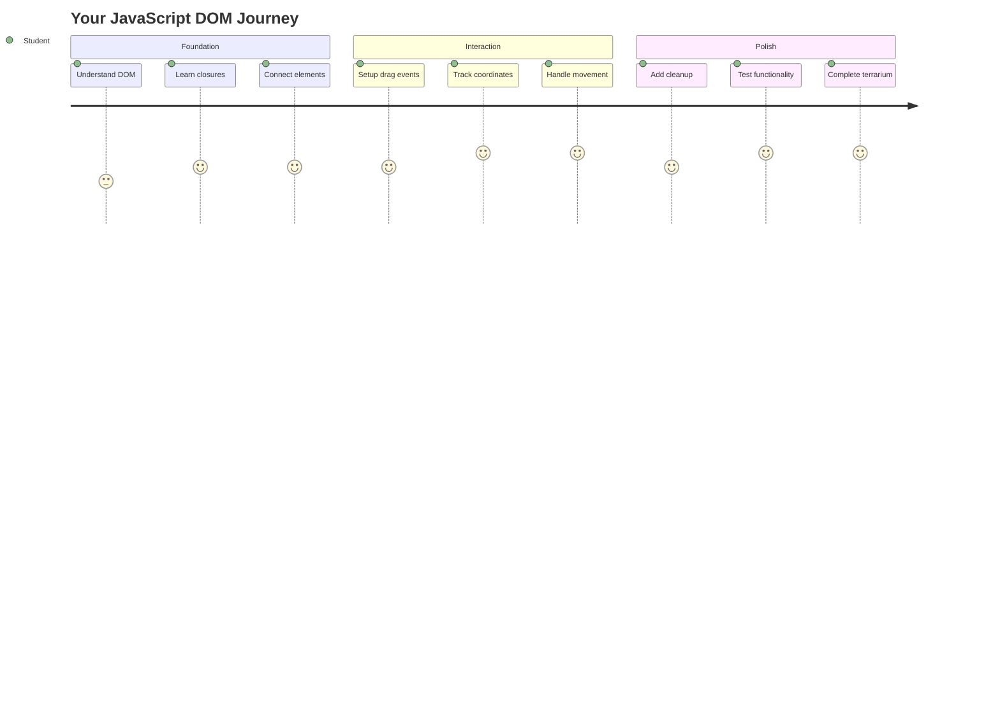
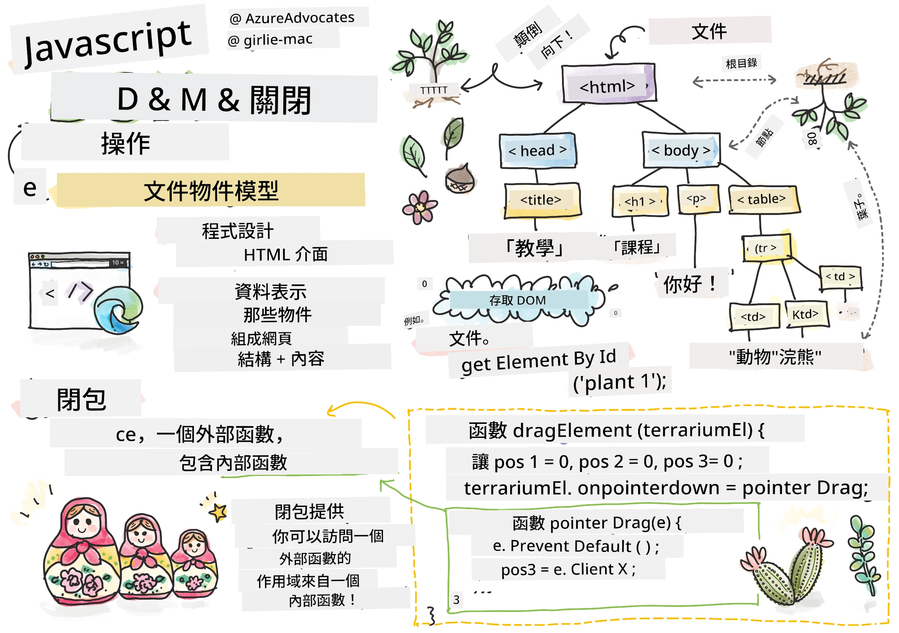
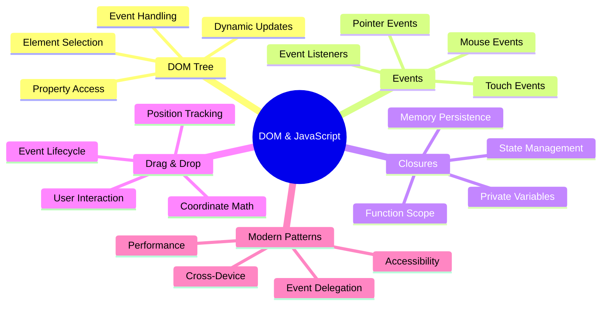
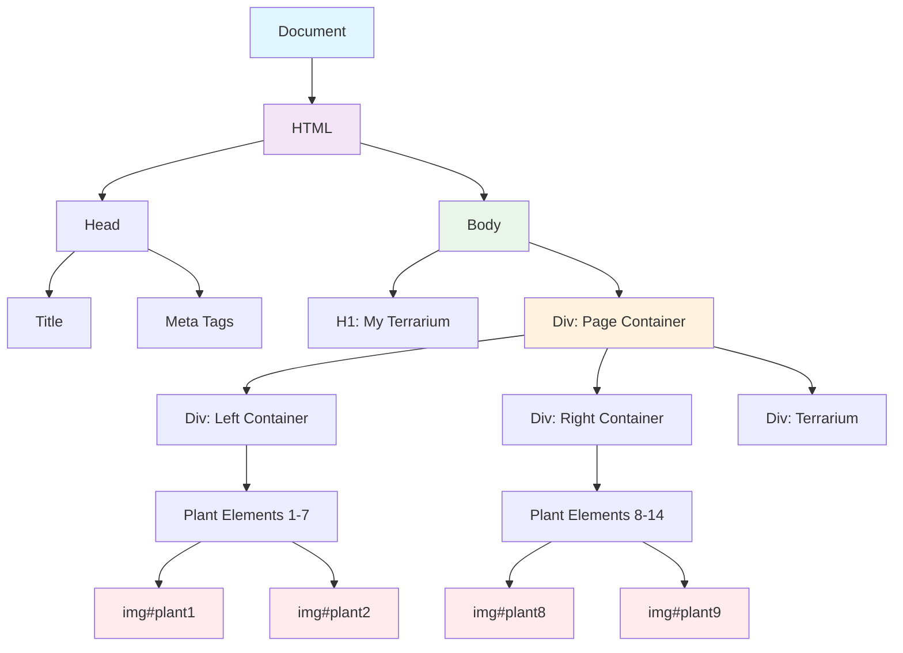
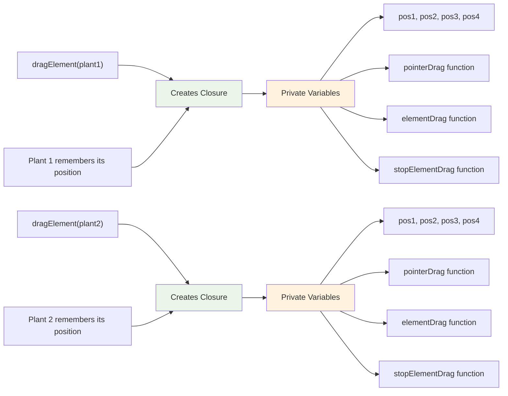
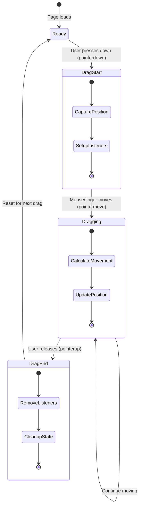
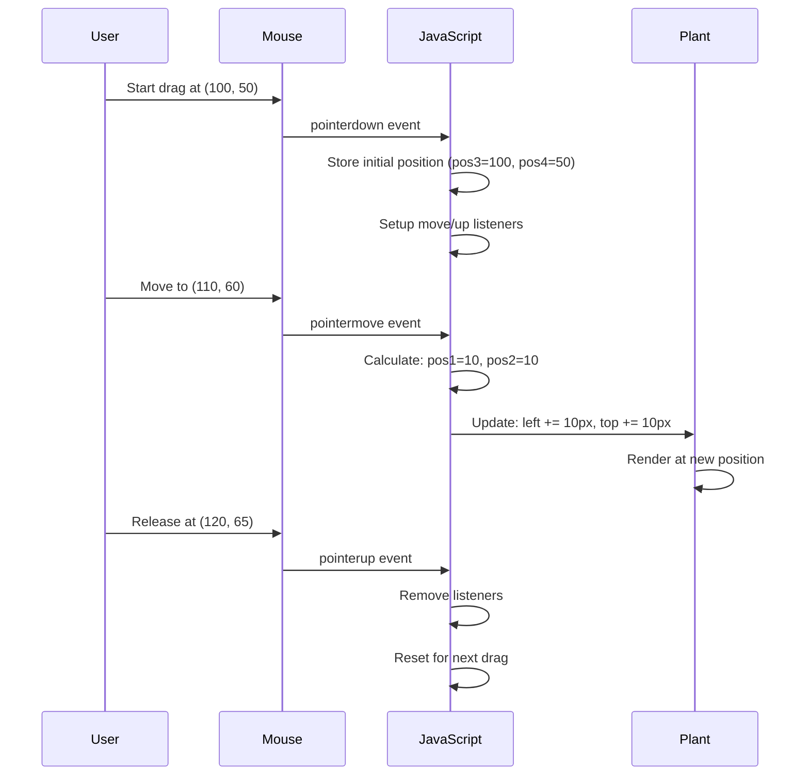
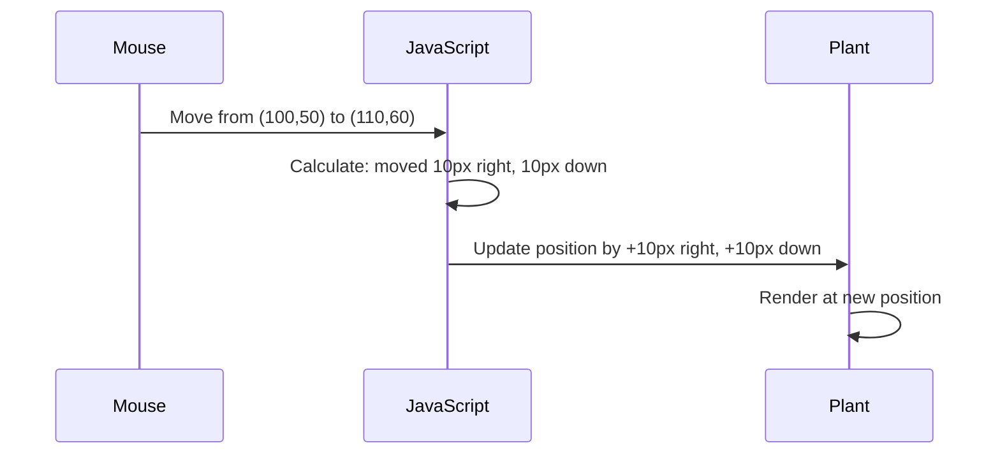
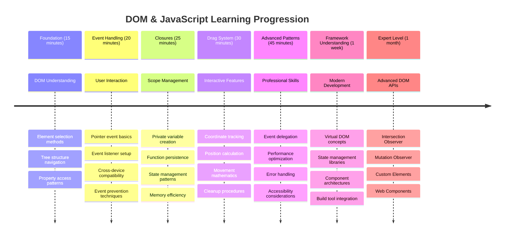

<!--
CO_OP_TRANSLATOR_METADATA:
{
  "original_hash": "973e48ad87d67bf5bb819746c9f8e302",
  "translation_date": "2025-11-03T23:44:37+00:00",
  "source_file": "3-terrarium/3-intro-to-DOM-and-closures/README.md",
  "language_code": "mo"
}
-->
# 微型生態瓶項目第三部分：DOM 操作與 JavaScript 閉包




> 手繪筆記由 [Tomomi Imura](https://twitter.com/girlie_mac) 提供

歡迎來到網頁開發中最有趣的部分之一——讓網頁變得互動！文檔物件模型（DOM）就像是 HTML 和 JavaScript 之間的橋樑，今天我們將利用它讓你的微型生態瓶活起來。當 Tim Berners-Lee 創建第一個網頁瀏覽器時，他設想了一個可以動態和互動的網頁世界，而 DOM 使這一願景成為可能。

我們還將探討 JavaScript 的閉包，雖然一開始可能聽起來有些複雜，但可以把閉包想像成創建“記憶口袋”，讓你的函數能記住重要的信息。就像微型生態瓶中的每一株植物都有自己的數據記錄來追蹤位置一樣。到本課程結束時，你將理解閉包的自然性和實用性。

以下是我們要構建的內容：一個用戶可以隨意拖放植物的微型生態瓶。你將學習 DOM 操作技術，這些技術支持從拖放文件上傳到互動遊戲的所有功能。讓我們一起讓你的微型生態瓶活起來吧！



## 課前測驗

[課前測驗](https://ff-quizzes.netlify.app/web/quiz/19)

## 理解 DOM：通往互動網頁的入口

文檔物件模型（DOM）是 JavaScript 與 HTML 元素溝通的方式。當你的瀏覽器加載 HTML 頁面時，它會在內存中創建該頁面的結構化表示——這就是 DOM。可以把它想像成一棵家譜樹，每個 HTML 元素都是 JavaScript 可以訪問、修改或重新排列的家庭成員。

DOM 操作將靜態頁面轉變為互動網站。每當你看到按鈕在懸停時改變顏色、內容在不刷新頁面的情況下更新，或者可以拖動的元素，這些都是 DOM 操作的成果。




> DOM 的表示及其引用的 HTML 標記。來源：[Olfa Nasraoui](https://www.researchgate.net/publication/221417012_Profile-Based_Focused_Crawler_for_Social_Media-Sharing_Websites)

**DOM 的強大之處在於：**
- **提供** 一種結構化方式來訪問頁面上的任何元素
- **支持** 無需刷新頁面即可動態更新內容
- **允許** 實時響應用戶交互，例如點擊和拖動
- **構建** 現代互動網頁應用的基礎

## JavaScript 閉包：創建有組織且強大的代碼

[JavaScript 閉包](https://developer.mozilla.org/docs/Web/JavaScript/Closures) 就像給函數自己的私人工作空間，並擁有持久的記憶。想像達爾文在加拉帕戈斯群島上的雀鳥，每隻雀鳥根據其特定環境發展出專門的喙——閉包的工作方式類似，創建專門的函數，能“記住”其特定的上下文，即使其父函數已經執行完畢。

在我們的微型生態瓶中，閉包幫助每株植物獨立記住自己的位置。這種模式在專業的 JavaScript 開發中隨處可見，因此理解它是一項非常有價值的技能。



> 💡 **理解閉包**：閉包是 JavaScript 中的重要主題，許多開發者在使用多年後才完全掌握其理論方面。今天，我們專注於實際應用——你將看到閉包在構建我們的互動功能時自然地出現。隨著你了解它如何解決實際問題，理解也會逐漸加深。


> DOM 的表示及其引用的 HTML 標記。來源：[Olfa Nasraoui](https://www.researchgate.net/publication/221417012_Profile-Based_Focused_Crawler_for_Social_Media-Sharing_Websites)

在本課程中，我們將完成我們的互動微型生態瓶項目，創建允許用戶在頁面上操作植物的 JavaScript。

## 開始之前：為成功做好準備

你需要使用之前微型生態瓶課程中的 HTML 和 CSS 文件——我們即將讓靜態設計變得互動。如果你是第一次加入，先完成那些課程將提供重要的背景知識。

以下是我們將要構建的內容：
- **流暢的拖放功能**，適用於所有微型生態瓶植物
- **坐標追蹤**，讓植物記住它們的位置
- **完整的互動界面**，使用原生 JavaScript
- **乾淨、有組織的代碼**，使用閉包模式

## 設置你的 JavaScript 文件

讓我們創建一個 JavaScript 文件，使你的微型生態瓶變得互動。

**步驟 1：創建你的腳本文件**

在你的微型生態瓶文件夾中，創建一個名為 `script.js` 的新文件。

**步驟 2：將 JavaScript 連接到你的 HTML**

在你的 `index.html` 文件的 `<head>` 部分添加以下腳本標籤：

```html
<script src="./script.js" defer></script>
```

**為什麼 `defer` 屬性很重要：**
- **確保** 你的 JavaScript 等待所有 HTML 加載完成
- **防止** JavaScript 在 HTML 元素尚未準備好時嘗試訪問它們，導致錯誤
- **保證** 所有植物元素都可供交互使用
- **提供** 比將腳本放在頁面底部更好的性能

> ⚠️ **重要提示**：`defer` 屬性可以防止常見的時間問題。如果沒有它，JavaScript 可能會在 HTML 元素加載之前嘗試訪問它們，導致錯誤。

---

## 將 JavaScript 連接到你的 HTML 元素

在我們使元素可拖動之前，JavaScript 需要在 DOM 中定位它們。可以把這想像成圖書館的編目系統——一旦你有了編目號碼，就可以找到你需要的書並訪問其所有內容。

我們將使用 `document.getElementById()` 方法來建立這些連接。這就像擁有一個精確的歸檔系統——你提供一個 ID，它就能精確定位你需要的 HTML 元素。

### 為所有植物啟用拖動功能

將以下代碼添加到你的 `script.js` 文件中：

```javascript
// Enable drag functionality for all 14 plants
dragElement(document.getElementById('plant1'));
dragElement(document.getElementById('plant2'));
dragElement(document.getElementById('plant3'));
dragElement(document.getElementById('plant4'));
dragElement(document.getElementById('plant5'));
dragElement(document.getElementById('plant6'));
dragElement(document.getElementById('plant7'));
dragElement(document.getElementById('plant8'));
dragElement(document.getElementById('plant9'));
dragElement(document.getElementById('plant10'));
dragElement(document.getElementById('plant11'));
dragElement(document.getElementById('plant12'));
dragElement(document.getElementById('plant13'));
dragElement(document.getElementById('plant14'));
```

**這段代碼完成了以下工作：**
- **定位** DOM 中的每個植物元素，使用其唯一的 ID
- **檢索** 每個 HTML 元素的 JavaScript 引用
- **傳遞** 每個元素到 `dragElement` 函數（我們將接下來創建）
- **準備** 每株植物進行拖放交互
- **連接** 你的 HTML 結構到 JavaScript 功能

> 🎯 **為什麼使用 ID 而不是類名？** ID 提供了特定元素的唯一標識符，而 CSS 類名是為了設計一組元素而設計的。當 JavaScript 需要操作單個元素時，ID 提供了我們所需的精確性和性能。

> 💡 **專業提示**：注意我們如何為每株植物單獨調用 `dragElement()`。這種方法確保每株植物都能獲得自己的獨立拖動行為，這對於流暢的用戶交互至關重要。

### 🔄 **教學檢查點**
**DOM 連接理解**：在進入拖動功能之前，確認你能夠：
- ✅ 解釋 `document.getElementById()` 如何定位 HTML 元素
- ✅ 理解為什麼我們為每株植物使用唯一的 ID
- ✅ 描述 `defer` 屬性在腳本標籤中的作用
- ✅ 認識到 JavaScript 和 HTML 如何通過 DOM 連接

**快速自測**：如果兩個元素有相同的 ID 會發生什麼？為什麼 `getElementById()` 只返回一個元素？
*答案：ID 應該是唯一的；如果重複，只有第一個元素會被返回*

---

## 構建拖動元素閉包

現在我們將創建拖動功能的核心：一個管理每株植物拖動行為的閉包。這個閉包將包含多個內部函數，它們共同工作以追蹤鼠標移動並更新元素位置。

閉包非常適合這項任務，因為它允許我們創建“私有”變量，這些變量在函數調用之間保持不變，讓每株植物擁有自己的獨立坐標追蹤系統。

### 用簡單例子理解閉包

讓我用一個簡單的例子來展示閉包的概念：

```javascript
function createCounter() {
    let count = 0; // This is like a private variable
    
    function increment() {
        count++; // The inner function remembers the outer variable
        return count;
    }
    
    return increment; // We're giving back the inner function
}

const myCounter = createCounter();
console.log(myCounter()); // 1
console.log(myCounter()); // 2
```

**這個閉包模式中發生了什麼：**
- **創建** 一個僅存在於此閉包中的私有 `count` 變量
- **內部函數** 可以訪問並修改外部變量（閉包機制）
- **當我們返回** 內部函數時，它保持與私有數據的連接
- **即使** `createCounter()` 執行完畢，`count` 仍然存在並記住其值

### 為什麼閉包非常適合拖動功能

對於我們的微型生態瓶，每株植物需要記住其當前位置坐標。閉包提供了完美的解決方案：

**對我們項目的主要好處：**
- **保持** 每株植物的私有位置變量獨立
- **保存** 拖動事件之間的坐標數據
- **防止** 不同可拖動元素之間的變量衝突
- **創建** 乾淨、有組織的代碼結構

> 🎯 **學習目標**：你不需要現在完全掌握閉包的每個方面。重點是了解它們如何幫助我們組織代碼並維持拖動功能的狀態。



### 創建 dragElement 函數

現在讓我們構建處理所有拖動邏輯的主函數。將此函數添加到你的植物元素聲明之後：

```javascript
function dragElement(terrariumElement) {
    // Initialize position tracking variables
    let pos1 = 0,  // Previous mouse X position
        pos2 = 0,  // Previous mouse Y position  
        pos3 = 0,  // Current mouse X position
        pos4 = 0;  // Current mouse Y position
    
    // Set up the initial drag event listener
    terrariumElement.onpointerdown = pointerDrag;
}
```

**理解位置追蹤系統：**
- **`pos1` 和 `pos2`**：存儲舊鼠標位置和新鼠標位置之間的差異
- **`pos3` 和 `pos4`**：追蹤當前鼠標坐標
- **`terrariumElement`**：我們正在使其可拖動的特定植物元素
- **`onpointerdown`**：用戶開始拖動時觸發的事件

**閉包模式的工作原理：**
- **創建** 每株植物元素的私有位置變量
- **保持** 這些變量在整個拖動生命周期中
- **確保** 每株植物獨立追蹤自己的坐標
- **提供** 通過 `dragElement` 函數的乾淨接口

### 為什麼使用指針事件？

你可能會想，為什麼我們使用 `onpointerdown` 而不是更熟悉的 `onclick`。以下是原因：

| 事件類型 | 最適合 | 缺點 |
|----------|--------|------|
| `onclick` | 簡單的按鈕點擊 | 無法處理拖動（僅限點擊和釋放） |
| `onpointerdown` | 鼠標和觸摸 | 新技術，但目前已廣泛支持 |
| `onmousedown` | 僅限桌面鼠標 | 無法支持移動用戶 |

**為什麼指針事件非常適合我們的項目：**
- **無論是** 使用鼠標、手指，甚至是觸控筆都能很好地工作
- **在筆記本電腦、平板電腦或手機上** 都有相同的感覺
- **處理** 實際的拖動動作（不僅僅是點擊完成）
- **創建** 用戶期望的流暢體驗

> 💡 **未來適應性**：指針事件是處理用戶交互的現代方式。你不需要為鼠標和觸摸分別編寫代碼，兩者都能輕鬆支持。是不是很棒？

### 🔄 **教學檢查點**
**事件處理理解**：暫停確認你對事件的理解：
- ✅ 為什麼我們使用指針事件而不是鼠標事件？
- ✅ 閉包變量如何在函數調用之間保持不變？
- ✅ `preventDefault()` 在流暢拖動中起什麼作用？
- ✅ 為什麼我們將監聽器附加到文檔而不是單個元素？

**現實世界的聯繫**：想想你每天使用的拖放界面：
- **文件上傳**：將文件拖到瀏覽器窗口
- **看板**：在列之間移動任務
- **圖片庫**：重新排列照片順序
- **移動界面**：在觸摸屏上滑動和拖動

---

## pointerDrag 函數：捕捉拖動的開始

當用戶按下植物（無論是鼠標點擊還是手指觸摸）時，`pointerDrag` 函數就會啟動。此函數捕捉初始坐標並設置拖動系統。

將此函數添加到你的 `dragElement` 閉包中，緊接著 `terrariumElement.onpointerdown = pointerDrag;` 這一行之後：

```javascript
function pointerDrag(e) {
    // Prevent default browser behavior (like text selection)
    e.preventDefault();
    
    // Capture the initial mouse/touch position
    pos3 = e.clientX;  // X coordinate where drag started
    pos4 = e.clientY;  // Y coordinate where drag started
    
    // Set up event listeners for the dragging process
    document.onpointermove = elementDrag;
    document.onpointerup = stopElementDrag;
}
```

**一步步解析，以下是發生的事情：**
- **防止** 可能干擾拖動的默認瀏覽器行為
- **記錄** 用戶開始拖動手勢的精確坐標
- **建立** 整個文檔的拖動移動事件監聽器
- **準備** 系統追蹤鼠標/手指在整個文檔中的移動

### 理解事件防止

`e.preventDefault()` 行對流暢拖動至關重要：

**如果不防止，瀏覽器可能：**
- **選擇** 拖動過程中的文本
- **觸發** 右鍵拖動時的上下文菜單
- **干擾** 我們的自定義拖動行為
- **創建** 拖動操作期間的視覺假象

> 🔍 **實驗**：完成本課程後，嘗試移除 `e.preventDefault()`，看看它如何影響拖動體驗。你會很快理解為什麼這行代碼是必不可少的！

### 坐標追蹤系統

`e.clientX` 和 `e.clientY` 屬性為我們提供精確的鼠標/觸摸坐標：

| 屬性 | 測量內容 | 使用場景 |
|------|----------|----------|
| `clientX` | 相對於視口的水平位置 | 追蹤左右移動 |
| `clientY` | 相對於視口的垂直位置 | 追蹤上下移動 |
**了解這些座標：**
- **提供**像素級精確的定位資訊
- **即時更新**，隨著使用者移動指針而改變
- **在不同螢幕尺寸和縮放級別下保持一致**
- **實現**流暢、響應式的拖曳互動

### 設置文件級事件監聽器

注意我們如何將移動和停止事件附加到整個 `document`，而不是僅僅附加到植物元素：

```javascript
document.onpointermove = elementDrag;
document.onpointerup = stopElementDrag;
```

**為什麼要附加到 document：**
- **即使滑鼠離開植物元素也能繼續追蹤**
- **防止**使用者快速移動時拖曳中斷
- **提供**整個螢幕範圍內的流暢拖曳
- **處理**滑鼠指針移出瀏覽器窗口的邊界情況

> ⚡ **效能注意事項**：當拖曳停止時，我們會清理這些文件級監聽器，以避免記憶體洩漏和效能問題。

## 完成拖曳系統：移動和清理

現在我們將添加兩個剩餘的函數，分別處理實際的拖曳移動以及拖曳停止時的清理工作。這些函數共同作用，創造出流暢、響應的植物移動效果，讓您的微型花園更加生動。

### elementDrag 函數：追蹤移動

在 `pointerDrag` 的結束大括號之後添加 `elementDrag` 函數：

```javascript
function elementDrag(e) {
    // Calculate the distance moved since the last event
    pos1 = pos3 - e.clientX;  // Horizontal distance moved
    pos2 = pos4 - e.clientY;  // Vertical distance moved
    
    // Update the current position tracking
    pos3 = e.clientX;  // New current X position
    pos4 = e.clientY;  // New current Y position
    
    // Apply the movement to the element's position
    terrariumElement.style.top = (terrariumElement.offsetTop - pos2) + 'px';
    terrariumElement.style.left = (terrariumElement.offsetLeft - pos1) + 'px';
}
```

**理解座標數學：**
- **`pos1` 和 `pos2`**：計算滑鼠自上次更新以來移動的距離
- **`pos3` 和 `pos4`**：儲存當前滑鼠位置以供下一次計算
- **`offsetTop` 和 `offsetLeft`**：獲取元素在頁面上的當前位置
- **減法邏輯**：根據滑鼠移動的距離移動元素



**以下是移動計算的分解：**
1. **測量**舊滑鼠位置和新滑鼠位置之間的差距
2. **計算**根據滑鼠移動距離需要移動元素的量
3. **即時更新**元素的 CSS 位置屬性
4. **儲存**新位置作為下一次移動計算的基準

### 數學的視覺化表示



### stopElementDrag 函數：清理工作

在 `elementDrag` 的結束大括號之後添加清理函數：

```javascript
function stopElementDrag() {
    // Remove the document-level event listeners
    document.onpointerup = null;
    document.onpointermove = null;
}
```

**為什麼清理很重要：**
- **防止**殘留事件監聽器導致記憶體洩漏
- **停止**使用者釋放植物時的拖曳行為
- **允許**其他元素獨立拖曳
- **重置**系統以進行下一次拖曳操作

**如果不進行清理會發生什麼：**
- 即使拖曳停止，事件監聽器仍然在運行
- 隨著未使用的監聽器累積，效能下降
- 與其他元素交互時可能出現意外行為
- 瀏覽器資源浪費在不必要的事件處理上

### 理解 CSS 位置屬性

我們的拖曳系統操作了兩個關鍵的 CSS 屬性：

| 屬性 | 控制的內容 | 我們如何使用它 |
|------|------------|----------------|
| `top` | 與頂部邊緣的距離 | 拖曳過程中的垂直定位 |
| `left` | 與左側邊緣的距離 | 拖曳過程中的水平定位 |

**關於偏移屬性的關鍵見解：**
- **`offsetTop`**：與定位父元素頂部的當前距離
- **`offsetLeft`**：與定位父元素左側的當前距離
- **定位上下文**：這些值是相對於最近的定位祖先元素的
- **即時更新**：當我們修改 CSS 屬性時，值會立即改變

> 🎯 **設計理念**：這個拖曳系統特意設計得非常靈活——沒有「放置區域」或限制。使用者可以將植物放置在任何地方，完全掌控微型花園的設計。

## 整合所有功能：完整的拖曳系統

恭喜！您剛剛使用原生 JavaScript 建立了一個複雜的拖曳系統。您完整的 `dragElement` 函數現在包含了一個強大的閉包，能夠管理：

**您的閉包完成的功能：**
- **維持**每個植物的獨立位置變數
- **處理**從開始到結束的完整拖曳生命週期
- **提供**整個螢幕範圍內流暢、響應的移動
- **正確清理**資源以防止記憶體洩漏
- **創造**直觀、創意的微型花園設計介面

### 測試您的互動式微型花園

現在測試您的互動式微型花園！在瀏覽器中打開您的 `index.html` 文件並嘗試功能：

1. **點擊並按住**任意植物開始拖曳
2. **移動滑鼠或手指**，觀察植物流暢地跟隨
3. **釋放**植物以將其放置在新位置
4. **嘗試**不同的排列方式，探索介面

🥇 **成就**：您已使用專業開發者每天使用的核心概念創建了一個完全互動的網頁應用程式。這種拖曳功能使用了文件上傳、看板板塊等許多互動介面的相同原理。

### 🔄 **教學檢查**
**完整系統理解**：驗證您對完整拖曳系統的掌握：
- ✅ 閉包如何為每個植物維持獨立狀態？
- ✅ 為什麼座標計算數學對流暢移動是必要的？
- ✅ 如果忘記清理事件監聽器會發生什麼？
- ✅ 此模式如何擴展到更複雜的互動？

**程式碼品質反思**：檢查您的完整解決方案：
- **模組化設計**：每個植物都有自己的閉包實例
- **事件效能**：正確設置和清理監聽器
- **跨設備支援**：適用於桌面和移動設備
- **效能意識**：無記憶體洩漏或冗餘計算


---

## GitHub Copilot Agent 挑戰 🚀

使用 Agent 模式完成以下挑戰：

**描述：** 增強微型花園專案，添加一個重置功能，能夠以流暢動畫將所有植物返回原始位置。

**提示：** 創建一個重置按鈕，當按下時，使用 CSS 過渡效果將所有植物平滑地移回頁面載入時儲存的原始側邊欄位置，過渡時間為 1 秒。

了解更多 [agent mode](https://code.visualstudio.com/blogs/2025/02/24/introducing-copilot-agent-mode)。

## 🚀 額外挑戰：擴展您的技能

準備好讓您的微型花園更上一層樓？嘗試實現以下增強功能：

**創意擴展：**
- **雙擊**植物以將其置於最前方（z-index 操作）
- **添加視覺反饋**，例如懸停植物時的微光效果
- **實現邊界**，防止植物被拖曳到微型花園外
- **創建保存功能**，使用 localStorage 記住植物位置
- **添加音效**，在拾取和放置植物時播放

> 💡 **學習機會**：每個挑戰都將教您新的 DOM 操作、事件處理和使用者體驗設計方面的知識。

## 課後測驗

[課後測驗](https://ff-quizzes.netlify.app/web/quiz/20)

## 回顧與自學：深化理解

您已掌握 DOM 操作和閉包的基礎，但總有更多可以探索！以下是擴展知識和技能的途徑。

### 替代的拖曳方法

我們使用了指針事件以獲得最大靈活性，但網頁開發提供了多種方法：

| 方法 | 最適合 | 學習價值 |
|------|--------|----------|
| [HTML 拖曳 API](https://developer.mozilla.org/docs/Web/API/HTML_Drag_and_Drop_API) | 文件上傳、正式拖曳區域 | 理解原生瀏覽器功能 |
| [觸控事件](https://developer.mozilla.org/docs/Web/API/Touch_events) | 移動設備特定互動 | 移動優先開發模式 |
| CSS `transform` 屬性 | 流暢動畫 | 效能優化技術 |

### 高級 DOM 操作主題

**學習旅程的下一步：**
- **事件委派**：高效處理多個元素的事件
- **交叉觀察器**：檢測元素進入/離開視窗
- **變更觀察器**：監控 DOM 結構的變化
- **Web Components**：創建可重用的封裝 UI 元素
- **虛擬 DOM 概念**：理解框架如何優化 DOM 更新

### 持續學習的必備資源

**技術文檔：**
- [MDN 指針事件指南](https://developer.mozilla.org/docs/Web/API/Pointer_events) - 全面的指針事件參考
- [W3C 指針事件規範](https://www.w3.org/TR/pointerevents1/) - 官方標準文檔
- [JavaScript 閉包深入探討](https://developer.mozilla.org/docs/Web/JavaScript/Closures) - 高級閉包模式

**瀏覽器相容性：**
- [CanIUse.com](https://caniuse.com/) - 檢查功能在各瀏覽器中的支援情況
- [MDN 瀏覽器相容性數據](https://github.com/mdn/browser-compat-data) - 詳細的相容性資訊

**練習機會：**
- **構建**一個使用類似拖曳機制的拼圖遊戲
- **創建**一個帶有拖曳任務管理功能的看板板塊
- **設計**一個可拖曳照片排列的圖片庫
- **嘗試**移動界面的觸控手勢

> 🎯 **學習策略**：鞏固這些概念的最佳方式是通過練習。嘗試構建不同的可拖曳介面——每個專案都會教您一些新的使用者互動和 DOM 操作知識。

### ⚡ **接下來 5 分鐘內可以做的事情**
- [ ] 打開瀏覽器開發者工具，在控制台輸入 `document.querySelector('body')`
- [ ] 嘗試使用 `innerHTML` 或 `textContent` 更改網頁的文字
- [ ] 為網頁上的任意按鈕或連結添加點擊事件監聽器
- [ ] 使用 Elements 面板檢查 DOM 樹結構

### 🎯 **這一小時內可以完成的事情**
- [ ] 完成課後測驗並回顧 DOM 操作概念
- [ ] 創建一個響應使用者點擊的互動式網頁
- [ ] 使用不同的事件類型（點擊、滑鼠懸停、按鍵）練習事件處理
- [ ] 構建一個簡單的待辦事項清單或計數器，使用 DOM 操作
- [ ] 探索 HTML 元素與 JavaScript 對象之間的關係

### 📅 **您的一周 JavaScript 旅程**
- [ ] 完成具有拖曳功能的互動式微型花園專案
- [ ] 掌握事件委派以進行高效事件處理
- [ ] 學習事件循環和非同步 JavaScript
- [ ] 通過構建具有私有狀態的模組來練習閉包
- [ ] 探索現代 DOM API，例如交叉觀察器
- [ ] 構建無需使用框架的互動式元件

### 🌟 **您的一個月 JavaScript 精通計劃**
- [ ] 使用原生 JavaScript 創建一個複雜的單頁應用程式
- [ ] 學習現代框架（React、Vue 或 Angular），並與原生 DOM 進行比較
- [ ] 為開源 JavaScript 專案做出貢獻
- [ ] 掌握高級概念，例如 Web Components 和自定義元素
- [ ] 使用最佳的 DOM 模式構建高效能的網頁應用程式
- [ ] 教授他人 DOM 操作和 JavaScript 基礎知識

## 🎯 您的 JavaScript DOM 精通時間表



### 🛠️ 您的 JavaScript 工具包摘要

完成本課程後，您現在擁有：
- **DOM 精通**：元素選擇、屬性操作和樹結構導航
- **事件專業知識**：使用指針事件處理跨設備互動
- **閉包理解**：私有狀態管理和函數持久性
- **互動系統**：從零開始完成拖曳功能的實現
- **效能意識**：正確的事件清理和記憶體管理
- **現代模式**：專業開發中使用的程式碼組織技術
- **使用者體驗**：創建直觀、響應式的介面

**獲得的專業技能**：您已使用與以下功能相同的技術構建功能：
- **Trello/看板板塊**：卡片在列之間的拖曳
- **文件上傳系統**：拖曳文件處理
- **圖片庫**：照片排列介面
- **移動應用程式**：基於觸控的互動模式

**下一步**：您已準備好探索現代框架，例如 React、Vue 或 Angular，這些框架基於這些基本的 DOM 操作概念！

## 作業

[進一步學習 DOM](assignment.md)

---

**免責聲明**：  
本文件已使用 AI 翻譯服務 [Co-op Translator](https://github.com/Azure/co-op-translator) 進行翻譯。儘管我們努力確保準確性，但請注意，自動翻譯可能包含錯誤或不準確之處。原始文件的母語版本應被視為權威來源。對於關鍵信息，建議使用專業人工翻譯。我們對因使用此翻譯而引起的任何誤解或誤釋不承擔責任。