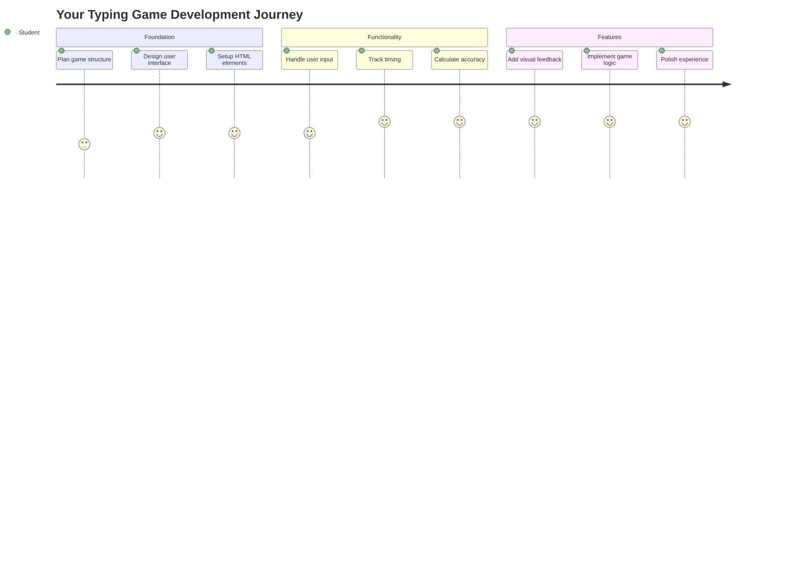
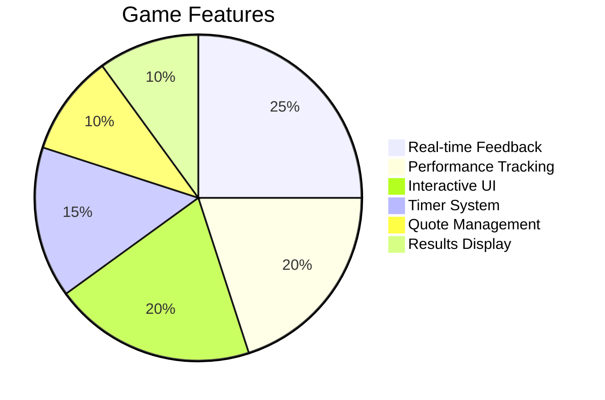
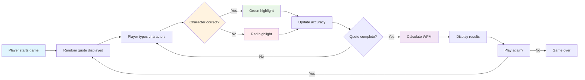
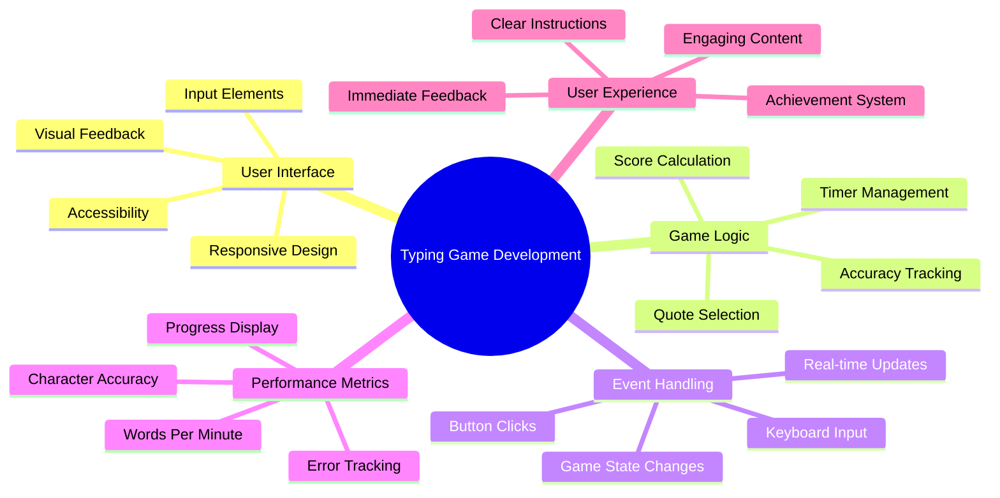
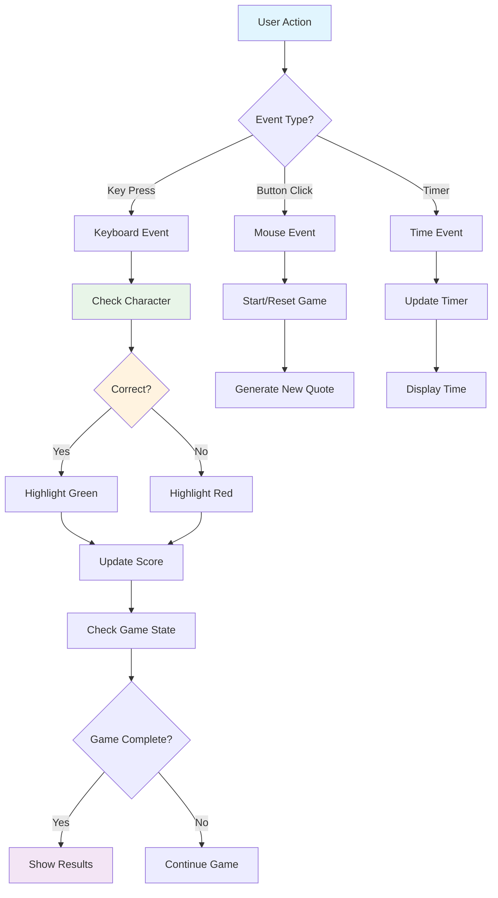
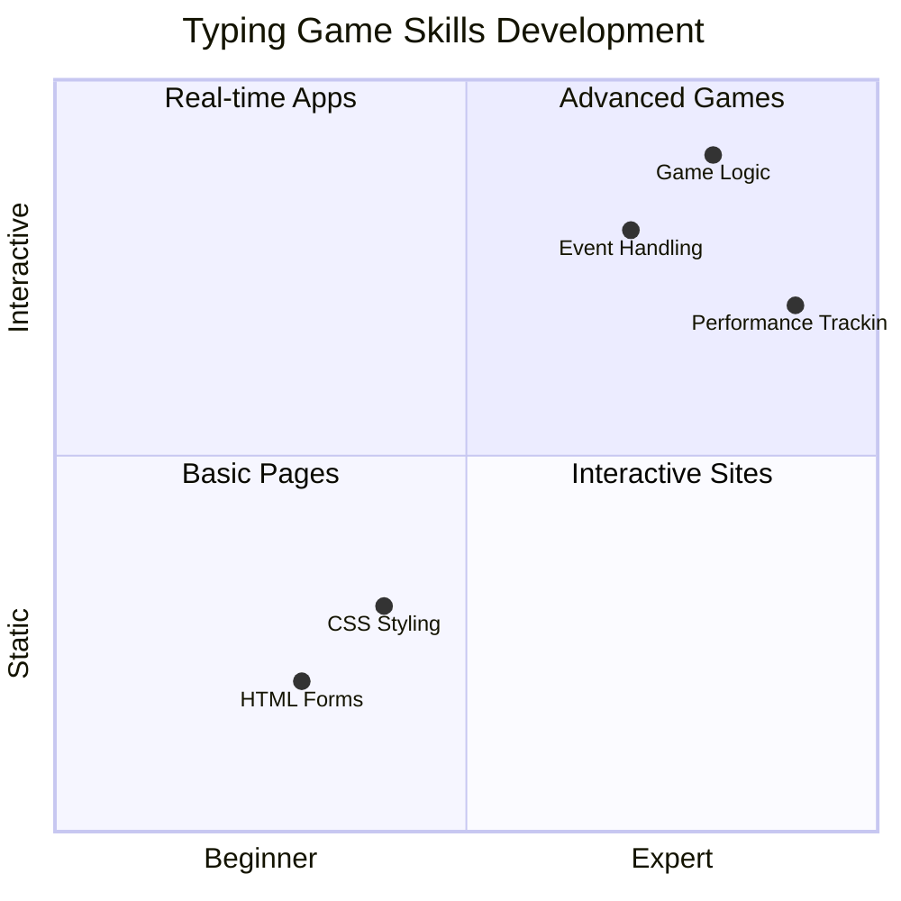
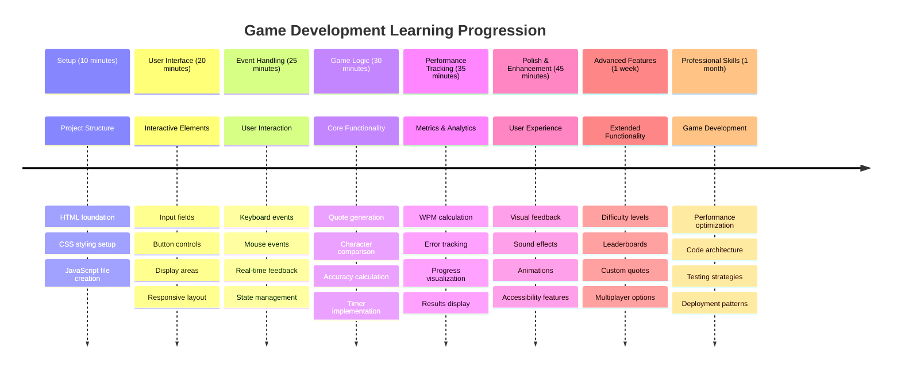

<!--
CO_OP_TRANSLATOR_METADATA:
{
  "original_hash": "efa2ab875b8bb5a7883816506da6b6d2",
  "translation_date": "2025-11-03T23:50:37+00:00",
  "source_file": "4-typing-game/README.md",
  "language_code": "mo"
}
-->
# 事件驅動程式設計 - 建立一個打字遊戲

## 簡介

每個開發者都知道但很少提起的一件事是：打字快是一種超能力！🚀 想想看——你能夠更快地將想法從腦海中傳遞到程式編輯器，創造力就能更順暢地流動。這就像在你的思維和螢幕之間建立了一條直接的管道。

想知道提升這項技能的最佳方法之一嗎？沒錯——我們要來製作一個遊戲！

> 讓我們一起創建一個超棒的打字遊戲吧！

準備好將你學到的 JavaScript、HTML 和 CSS 技能派上用場了嗎？我們將製作一個打字遊戲，挑戰你輸入來自傳奇偵探 [福爾摩斯](https://en.wikipedia.org/wiki/Sherlock_Holmes) 的隨機名言。這個遊戲會追蹤你的打字速度和準確性——相信我，這比你想像的還要上癮！

## 你需要知道的基礎知識

在我們開始之前，請確保你對以下概念感到熟悉（如果需要快速複習也沒關係——我們都經歷過！）：

- 創建文字輸入框和按鈕控制
- CSS 和使用類別設置樣式  
- JavaScript 基礎
  - 創建陣列
  - 生成隨機數
  - 獲取當前時間

如果對這些概念感到有些生疏，完全沒問題！有時候，最好的學習方式就是直接投入一個專案，邊做邊學。

### 🔄 **教學檢查**
**基礎評估**：在開始開發之前，確保你了解：
- ✅ HTML 表單和輸入元素的工作原理
- ✅ CSS 類別和動態樣式
- ✅ JavaScript 事件監聽器和處理程序
- ✅ 陣列操作和隨機選擇
- ✅ 時間測量和計算

**快速自我測試**：你能解釋這些概念如何在互動遊戲中協同工作嗎？
- **事件** 在用戶與元素互動時觸發
- **處理程序** 處理這些事件並更新遊戲狀態
- **CSS** 為用戶操作提供視覺反饋
- **計時** 使性能測量和遊戲進程成為可能

## 讓我們開始製作吧！

[使用事件驅動程式設計創建打字遊戲](./typing-game/README.md)

### ⚡ **接下來 5 分鐘內可以做的事**
- [ ] 打開瀏覽器控制台，嘗試使用 `addEventListener` 監聽鍵盤事件
- [ ] 創建一個簡單的 HTML 頁面，包含一個輸入框，測試打字檢測
- [ ] 通過比較輸入的文字和目標文字來練習字串操作
- [ ] 試驗使用 `setTimeout` 來理解計時功能

### 🎯 **這一小時內可以完成的事**
- [ ] 完成課後測驗並理解事件驅動程式設計
- [ ] 建立一個基礎版的打字遊戲，實現文字驗證功能
- [ ] 為正確和錯誤的打字添加視覺反饋
- [ ] 實現基於速度和準確性的簡單計分系統
- [ ] 使用 CSS 美化你的遊戲，讓它更吸引人

### 📅 **一週內的遊戲開發計劃**
- [ ] 完成具有所有功能和細節的完整打字遊戲
- [ ] 添加不同難度級別，包含不同複雜度的單詞
- [ ] 實現用戶統計追蹤（每分鐘字數、準確率等）
- [ ] 添加音效和動畫，提升用戶體驗
- [ ] 讓你的遊戲對行動裝置友好，支援觸控設備
- [ ] 將你的遊戲上傳到網路，收集用戶的反饋

### 🌟 **一個月的互動開發計劃**
- [ ] 開發多個遊戲，探索不同的互動模式
- [ ] 學習遊戲循環、狀態管理和性能優化
- [ ] 參與開源遊戲開發專案
- [ ] 掌握高級計時概念和流暢動畫
- [ ] 創建一個展示各種互動應用的作品集
- [ ] 指導其他對遊戲開發和用戶互動感興趣的人

## 🎯 你的打字遊戲精通時間表

### 🛠️ 你的遊戲開發工具包總結

完成這個專案後，你將掌握：
- **事件驅動程式設計**：能夠響應用戶輸入的互動式用戶界面
- **即時反饋**：即時的視覺和性能更新
- **性能測量**：精確的計時和計分系統
- **遊戲狀態管理**：控制應用程式流程和用戶體驗
- **互動設計**：創建引人入勝、令人上癮的用戶體驗
- **現代 Web API**：利用瀏覽器功能實現豐富的互動
- **無障礙設計模式**：為所有用戶創建包容性的設計

**實際應用**：這些技能可以直接應用於：
- **網頁應用程式**：任何互動式界面或儀表板
- **教育軟體**：學習平台和技能評估工具
- **生產力工具**：文字編輯器、IDE 和協作軟體
- **遊戲產業**：瀏覽器遊戲和互動娛樂
- **行動開發**：基於觸控的界面和手勢操作

**下一步**：你已經準備好探索高級遊戲框架、即時多人系統或複雜的互動應用程式！

## 鳴謝

由 [Christopher Harrison](http://www.twitter.com/geektrainer) 用 ♥️ 編寫

---

**免責聲明**：  
本文件已使用 AI 翻譯服務 [Co-op Translator](https://github.com/Azure/co-op-translator) 進行翻譯。儘管我們努力確保翻譯的準確性，但請注意，自動翻譯可能包含錯誤或不準確之處。原始文件的母語版本應被視為權威來源。對於關鍵信息，建議使用專業人工翻譯。我們對因使用此翻譯而產生的任何誤解或誤釋不承擔責任。