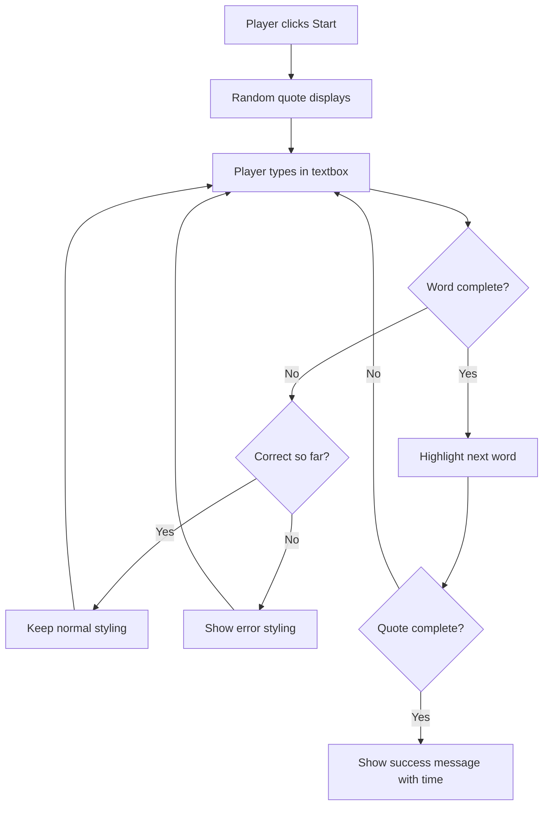
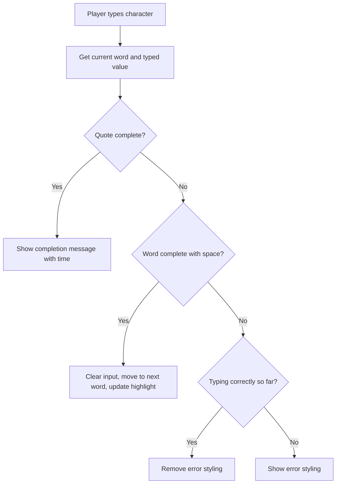

<!--
CO_OP_TRANSLATOR_METADATA:
{
  "original_hash": "e6b75e5b8caae906473a8a09d77b7121",
  "translation_date": "2025-10-22T22:51:30+00:00",
  "source_file": "4-typing-game/typing-game/README.md",
  "language_code": "mo"
}
-->
# 使用事件創建遊戲

你是否曾經好奇過網站是如何知道你點擊按鈕或在文本框中輸入文字的？這就是事件驅動編程的魔力！學習這項基本技能的最佳方式莫過於建造一些有趣且實用的東西——例如一個能對你的每次按鍵做出反應的打字速度遊戲。

你將親眼看到網頁瀏覽器如何與你的 JavaScript 代碼“對話”。每次你點擊、輸入或移動鼠標時，瀏覽器都會向你的代碼發送小消息（我們稱之為事件），而你可以決定如何回應！

在完成這個項目後，你將創建一個真正的打字遊戲，能追蹤你的速度和準確性。更重要的是，你將理解驅動每個互動式網站的基本概念。讓我們開始吧！

## 課前測驗

[課前測驗](https://ff-quizzes.netlify.app/web/quiz/21)

## 事件驅動編程

想想你最喜歡的應用程序或網站——是什麼讓它感覺如此生動和響應迅速？這一切都與它如何對你的操作做出反應有關！每次點擊、滑動或按鍵都會創建我們稱之為“事件”的東西，而這正是網頁開發的真正魔力所在。

網頁編程的有趣之處在於：我們永遠不知道用戶什麼時候會點擊按鈕或開始在文本框中輸入。他們可能會立即點擊，可能會等五分鐘，或者可能根本不點擊！這種不可預測性意味著我們需要以不同的方式思考如何編寫代碼。

與其像食譜一樣從上到下運行代碼，我們更傾向於編寫代碼，讓它耐心等待某些事情發生。這類似於19世紀的電報操作員，他們會坐在機器旁，準備在電報線上收到消息的那一刻做出回應。

那麼什麼是“事件”？簡單來說，它就是某件事情的發生！當你點擊按鈕——這是一個事件。當你輸入一個字母——這是一個事件。當你移動鼠標——這又是一個事件。

事件驅動編程讓我們能設置代碼來監聽並回應。我們創建特殊的函數，稱為 **事件監聽器**，它們耐心等待特定的事情發生，然後在事件發生時立即採取行動。

把事件監聽器想像成代碼的門鈴。你設置門鈴（`addEventListener()`），告訴它要聽什麼聲音（例如“click”或“keypress”），然後指定當有人按門鈴時應該發生什麼（你的自定義函數）。

**事件監聽器的工作原理如下：**
- **監聽**特定的用戶操作，例如點擊、按鍵或鼠標移動
- **執行**指定事件發生時的自定義代碼
- **立即回應**用戶交互，創造流暢的體驗
- **處理**同一元素上的多個事件，使用不同的監聽器

> **NOTE:** 值得注意的是，創建事件監聽器有多種方式。你可以使用匿名函數，也可以創建命名函數。你可以使用各種快捷方式，例如設置 `click` 屬性，或者使用 `addEventListener()`。在我們的練習中，我們將重點放在使用 `addEventListener()` 和匿名函數上，因為這可能是網頁開發者最常用的技術。它也是最靈活的，因為 `addEventListener()` 適用於所有事件，並且事件名稱可以作為參數提供。

### 常見事件

雖然網頁瀏覽器提供了數十種不同的事件供你監聽，但大多數交互式應用程序僅依賴少數幾個基本事件。理解這些核心事件將為你構建複雜的用戶交互奠定基礎。

在創建應用程序時，你可以監聽[數十種事件](https://developer.mozilla.org/docs/Web/Events)。基本上，用戶在頁面上做的任何事情都會觸發事件，這讓你擁有很大的權力來確保他們獲得你期望的體驗。幸運的是，你通常只需要少數幾個事件。以下是一些常見的事件（包括我們在創建遊戲時會使用的兩個事件）：

| 事件 | 描述 | 常見用途 |
|------|------|---------|
| `click` | 用戶點擊了某個元素 | 按鈕、鏈接、交互元素 |
| `contextmenu` | 用戶點擊了右鍵 | 自定義右鍵菜單 |
| `select` | 用戶選中了某些文本 | 文本編輯、複製操作 |
| `input` | 用戶輸入了一些文本 | 表單驗證、即時搜索 |

**理解這些事件類型：**
- **觸發**當用戶與頁面上的特定元素交互時
- **提供**通過事件對象獲取用戶操作的詳細信息
- **使能**創建響應式、交互式的網頁應用程序
- **在不同瀏覽器和設備上**保持一致性

## 創建遊戲

現在你已經了解了事件的工作原理，讓我們通過構建一些有用的東西來實踐這些知識。我們將創建一個打字速度遊戲，展示事件處理的同時幫助你發展一項重要的開發者技能。

我們將創建一個遊戲來探索 JavaScript 中事件的工作原理。我們的遊戲將測試玩家的打字技能，而這是所有開發者應該具備的一項非常重要的技能。有趣的是，我們今天使用的 QWERTY 鍵盤布局實際上是在19世紀70年代為打字機設計的——而良好的打字技能對於今天的程序員來說仍然非常重要！遊戲的基本流程如下：



**我們的遊戲將如何運作：**
- **開始**時，玩家點擊開始按鈕並顯示一個隨機的句子
- **追蹤**玩家的打字進度，逐字實時更新
- **突出顯示**當前的單詞以引導玩家的注意力
- **提供**即時的打字錯誤視覺反饋
- **計算**並顯示完成句子所需的總時間

讓我們一起構建這個遊戲，並學習事件！

### 文件結構

在開始編碼之前，讓我們先整理一下！從一開始就擁有一個乾淨的文件結構可以幫助你避免後續的麻煩，並使你的項目更專業。😊

我們將保持簡單，只使用三個文件：`index.html` 用於頁面結構，`script.js` 用於所有遊戲邏輯，`style.css` 用於美化外觀。這是驅動大多數網頁的經典三件套！

**通過打開控制台或終端窗口並輸入以下命令來創建一個新文件夾：**

```bash
# Linux or macOS
mkdir typing-game && cd typing-game

# Windows
md typing-game && cd typing-game
```

**這些命令的作用：**
- **創建**一個名為 `typing-game` 的新目錄，用於存放項目文件
- **自動進入**新創建的目錄
- **設置**一個乾淨的工作空間，用於遊戲開發

**打開 Visual Studio Code：**

```bash
code .
```

**此命令的作用：**
- **啟動** Visual Studio Code 並定位到當前目錄
- **打開**你的項目文件夾
- **提供**所有開發工具的訪問權限

**在 Visual Studio Code 中向文件夾添加以下三個文件：**
- `index.html` - 包含遊戲的結構和內容
- `script.js` - 處理所有遊戲邏輯和事件監聽器
- `style.css` - 定義視覺外觀和樣式

## 創建用戶界面

現在讓我們構建遊戲的舞台！可以把這想像成設計一個太空船的控制面板——我們需要確保玩家需要的一切都在他們期望的位置。

讓我們來想想遊戲實際需要什麼。如果你在玩一個打字遊戲，你希望在屏幕上看到什麼？以下是我們需要的內容：

| UI 元素 | 目的 | HTML 元素 |
|---------|------|----------|
| 句子顯示 | 顯示需要輸入的文本 | `<p>`，`id="quote"` |
| 消息區域 | 顯示狀態和成功消息 | `<p>`，`id="message"` |
| 文本輸入框 | 玩家輸入句子的地方 | `<input>`，`id="typed-value"` |
| 開始按鈕 | 開始遊戲 | `<button>`，`id="start"` |

**理解 UI 結構：**
- **邏輯地組織**內容，從上到下
- **分配**唯一的 ID 給元素，以便 JavaScript 定位
- **提供**清晰的視覺層次結構，提升用戶體驗
- **包含**語義化的 HTML 元素，提升可訪問性

每個元素都需要 ID，以便我們能在 JavaScript 中操作它們。我們還會添加對 CSS 和 JavaScript 文件的引用。

創建一個名為 `index.html` 的新文件。添加以下 HTML：

```html
<!-- inside index.html -->
<html>
<head>
  <title>Typing game</title>
  <link rel="stylesheet" href="style.css">
</head>
<body>
  <h1>Typing game!</h1>
  <p>Practice your typing skills with a quote from Sherlock Holmes. Click **start** to begin!</p>
  <p id="quote"></p> <!-- This will display our quote -->
  <p id="message"></p> <!-- This will display any status messages -->
  <div>
    <input type="text" aria-label="current word" id="typed-value" /> <!-- The textbox for typing -->
    <button type="button" id="start">Start</button> <!-- To start the game -->
  </div>
  <script src="script.js"></script>
</body>
</html>
```

**解析這個 HTML 結構的作用：**
- **在 `<head>` 中鏈接** CSS 樣式表，用於樣式設置
- **創建**清晰的標題和用戶指導
- **設置**帶有特定 ID 的佔位段落，用於動態內容
- **包含**帶有可訪問性屬性的輸入框
- **提供**一個開始按鈕來觸發遊戲
- **在末尾加載** JavaScript 文件，提升性能

### 啟動應用程序

在開發過程中頻繁測試你的應用程序有助於及早發現問題，並實時查看進展。Live Server 是一個非常有用的工具，它會在你保存更改時自動刷新瀏覽器，使開發更加高效。

最好以迭代的方式開發，看看效果如何。讓我們啟動應用程序。Visual Studio Code 有一個很棒的擴展名叫 [Live Server](https://marketplace.visualstudio.com/items?itemName=ritwickdey.LiveServer&WT.mc_id=academic-77807-sagibbon)，它既能在本地托管你的應用程序，又能在你保存文件時刷新瀏覽器。

**通過點擊鏈接並點擊安裝來安裝 [Live Server](https://marketplace.visualstudio.com/items?itemName=ritwickdey.LiveServer&WT.mc_id=academic-77807-sagibbon)：**

**安裝過程中發生的事情：**
- **提示**你的瀏覽器打開 Visual Studio Code
- **引導**你完成擴展安裝過程
- **可能需要**重啟 Visual Studio Code 以完成設置

**安裝完成後，在 Visual Studio Code 中按 Ctrl-Shift-P（或 Cmd-Shift-P）打開命令面板：**

**理解命令面板：**
- **提供**快速訪問所有 VS Code 命令
- **在輸入時搜索**命令
- **提供**快捷鍵，提升開發速度

**輸入 "Live Server: Open with Live Server"：**

**Live Server 的作用：**
- **啟動**一個本地開發服務器，用於你的項目
- **自動刷新**瀏覽器，當你保存文件時
- **從本地 URL 提供**你的文件（通常是 `localhost:5500`）

**打開瀏覽器並導航到 `https://localhost:5500`：**

你現在應該能看到你創建的頁面！讓我們添加一些功能。

## 添加 CSS

現在讓我們讓頁面看起來更好！自從計算機早期以來，視覺反饋對於用戶界面至關重要。在1980年代，研究人員發現即時視覺反饋能顯著提升用戶性能並減少錯誤。這正是我們要創造的。

我們的遊戲需要清楚地展示正在發生的事情。玩家應該立即知道他們應該輸入哪個單詞，如果他們犯了錯誤，應該立即看到。讓我們創建一些簡單但有效的樣式：

創建一個名為 `style.css` 的新文件，並添加以下語法。

```css
/* inside style.css */
.highlight {
  background-color: yellow;
}

.error {
  background-color: lightcoral;
  border: red;
}
```

**理解這些 CSS 類：**
- **用黃色背景突出顯示**當前單詞，提供清晰的視覺指導
- **用淺珊瑚色背景**信號打字錯誤
- **提供即時反饋**而不打斷用戶的打字流程
- **使用對比色**提升可訪問性和清晰的視覺溝通

✅ 關於 CSS，你可以根據自己的喜好設計頁面。花點時間讓頁面看起來更吸引人：

- 選擇不同的字體
- 為標題添加顏色
- 調整元素大小

## JavaScript

現在是最有趣的部分！🎉 我們已經有了 HTML 結構和 CSS 樣式，但現在我們的遊戲就像一輛漂亮的汽車卻沒有引擎。JavaScript 將成為那個引擎——它使一切真正運作並對玩家的操作做出反應。

這是你將看到你的創作活靈活現的地方。我們將一步步地完成這個過程，確保不會感到壓力：

| 步驟 | 目的 | 你將學到什麼 |
|------|------|-------------|
| [創建常量](../../../../4-typing-game/typing-game) | 設置句子和 DOM 引用 | 變量管理和 DOM 選擇 |
| [事件監聽器啟動遊戲](../../../../4-typing-game/typing-game) | 處理遊戲初始化 | 事件處理和 UI 更新 |
| [事件監聽器處理打字](../../../../4-typing-game/typing-game) | 實時處理用戶輸入 | 輸入驗證和動態反饋 |

**這種結構化方法幫助你：**
- **組織**代碼成為邏輯且易於管理的部分
- **逐步構建**功能，便於調試
- **理解**應用程序的不同部分如何協同工作
- **創建**可重用的模式，用於未來的項目

但首先，創建一個名為 `script.js` 的新文件。

### 添加常量

在我們進入操作之前，讓我們先收集所有資源！就像 NASA 任務控制在發射前設置所有監控系統一樣，提前準備好所有東西會更容易。這能幫助我們避免後續的麻煩並防止打字錯誤。

以下是我們需要先設置的內容：

| 資料類型 | 目的 | 示例 |
|-----------|------|------|
| 引言陣列 | 儲存遊戲中所有可能的引言 | `['引言 1', '引言 2', ...]` |
| 單字陣列 | 將當前引言分解成個別單字 | `['當', '你', '擁有', ...]` |
| 單字索引 | 追蹤玩家正在輸入的單字 | `0, 1, 2, 3...` |
| 開始時間 | 計算得分所需的經過時間 | `Date.now()` |

**我們還需要引用到 UI 元素：**
| 元素 | ID | 用途 |
|------|----|------|
| 文字輸入框 | `typed-value` | 玩家輸入的地方 |
| 引言顯示區 | `quote` | 顯示需要輸入的引言 |
| 訊息區域 | `message` | 顯示狀態更新 |

```javascript
// inside script.js
// all of our quotes
const quotes = [
    'When you have eliminated the impossible, whatever remains, however improbable, must be the truth.',
    'There is nothing more deceptive than an obvious fact.',
    'I ought to know by this time that when a fact appears to be opposed to a long train of deductions it invariably proves to be capable of bearing some other interpretation.',
    'I never make exceptions. An exception disproves the rule.',
    'What one man can invent another can discover.',
    'Nothing clears up a case so much as stating it to another person.',
    'Education never ends, Watson. It is a series of lessons, with the greatest for the last.',
];
// store the list of words and the index of the word the player is currently typing
let words = [];
let wordIndex = 0;
// the starting time
let startTime = Date.now();
// page elements
const quoteElement = document.getElementById('quote');
const messageElement = document.getElementById('message');
const typedValueElement = document.getElementById('typed-value');
```

**拆解這段設定程式碼的功能：**
- **儲存**一個福爾摩斯引言的陣列，使用 `const`，因為引言內容不會改變
- **初始化**追蹤變數，使用 `let`，因為這些值會在遊戲過程中更新
- **取得** DOM 元素的引用，使用 `document.getElementById()` 以便快速存取
- **建立**所有遊戲功能的基礎，使用清晰且具描述性的變數名稱
- **邏輯整理**相關的資料和元素，方便日後維護程式碼

✅ 快來為你的遊戲新增更多引言吧！

> 💡 **專業提示**：我們可以隨時使用 `document.getElementById()` 來取得元素。由於我們會經常引用這些元素，因此使用常數可以避免字串拼寫錯誤。像 [Vue.js](https://vuejs.org/) 或 [React](https://reactjs.org/) 這樣的框架可以幫助你更好地集中管理程式碼。
>
**為什麼這種方法如此有效：**
- **避免**多次引用元素時的拼寫錯誤
- **提升**程式碼的可讀性，使用具描述性的常數名稱
- **增強**IDE 的自動完成和錯誤檢查功能
- **方便**未來若元素 ID 變更時進行重構

花點時間觀看一段關於使用 `const`、`let` 和 `var` 的影片

[](https://youtube.com/watch?v=JNIXfGiDWM8 "變數類型")

> 🎥 點擊上方圖片觀看有關變數的影片。

### 新增開始邏輯

這是所有功能開始運作的地方！🚀 你即將撰寫第一個真正的事件監聽器，看到你的程式碼因按鈕點擊而做出反應，會讓人感到非常滿足。

想想看：某個地方的玩家即將點擊「開始」按鈕，而你的程式碼需要準備好迎接他們。我們無法預測他們何時會點擊——可能是立刻，也可能是喝完咖啡之後——但當他們點擊時，你的遊戲就會開始運作。

當使用者點擊 `start` 時，我們需要選擇一個引言，設置使用者介面，並初始化當前單字和計時的追蹤。以下是你需要新增的 JavaScript，我們會在程式碼塊後進行討論。

```javascript
// at the end of script.js
document.getElementById('start').addEventListener('click', () => {
  // get a quote
  const quoteIndex = Math.floor(Math.random() * quotes.length);
  const quote = quotes[quoteIndex];
  // Put the quote into an array of words
  words = quote.split(' ');
  // reset the word index for tracking
  wordIndex = 0;

  // UI updates
  // Create an array of span elements so we can set a class
  const spanWords = words.map(function(word) { return `<span>${word} </span>`});
  // Convert into string and set as innerHTML on quote display
  quoteElement.innerHTML = spanWords.join('');
  // Highlight the first word
  quoteElement.childNodes[0].className = 'highlight';
  // Clear any prior messages
  messageElement.innerText = '';

  // Setup the textbox
  // Clear the textbox
  typedValueElement.value = '';
  // set focus
  typedValueElement.focus();
  // set the event handler

  // Start the timer
  startTime = new Date().getTime();
});
```

**讓我們將程式碼分成邏輯部分進行解析：**

**📊 單字追蹤設置：**
- **選擇**一個隨機引言，使用 `Math.floor()` 和 `Math.random()` 來增加多樣性
- **轉換**引言為個別單字的陣列，使用 `split(' ')`
- **重置** `wordIndex` 為 0，因為玩家從第一個單字開始
- **準備**遊戲狀態，為新的一輪做好準備

**🎨 UI 設置與顯示：**
- **建立**一個 `<span>` 元素的陣列，將每個單字包裹起來以便單獨設置樣式
- **合併**這些 span 元素成一個字串，以便高效更新 DOM
- **高亮顯示**第一個單字，新增 `highlight` CSS 類別
- **清除**之前的遊戲訊息，提供乾淨的開始畫面

**⌨️ 文字框準備：**
- **清除**輸入框中的任何現有文字
- **設置焦點**到文字框，讓玩家可以立即開始輸入
- **準備**輸入區域，迎接新的遊戲回合

**⏱️ 計時器初始化：**
- **記錄**當前時間戳，使用 `new Date().getTime()`
- **確保**能準確計算打字速度和完成時間
- **開始**遊戲回合的效能追蹤

### 新增打字邏輯

這是我們處理遊戲核心的地方！如果一開始覺得有點多，別擔心——我們會逐步解析每個部分，最後你會發現這一切都很有邏輯。

我們在這裡構建的功能相當精密：每次有人輸入一個字母，我們的程式碼都會檢查他們輸入的內容，給予反饋，並決定接下來的動作。這有點像 1970 年代早期的文字處理器，例如 WordStar，為打字員提供即時反饋。

```javascript
// at the end of script.js
typedValueElement.addEventListener('input', () => {
  // Get the current word
  const currentWord = words[wordIndex];
  // get the current value
  const typedValue = typedValueElement.value;

  if (typedValue === currentWord && wordIndex === words.length - 1) {
    // end of sentence
    // Display success
    const elapsedTime = new Date().getTime() - startTime;
    const message = `CONGRATULATIONS! You finished in ${elapsedTime / 1000} seconds.`;
    messageElement.innerText = message;
  } else if (typedValue.endsWith(' ') && typedValue.trim() === currentWord) {
    // end of word
    // clear the typedValueElement for the new word
    typedValueElement.value = '';
    // move to the next word
    wordIndex++;
    // reset the class name for all elements in quote
    for (const wordElement of quoteElement.childNodes) {
      wordElement.className = '';
    }
    // highlight the new word
    quoteElement.childNodes[wordIndex].className = 'highlight';
  } else if (currentWord.startsWith(typedValue)) {
    // currently correct
    // highlight the next word
    typedValueElement.className = '';
  } else {
    // error state
    typedValueElement.className = 'error';
  }
});
```

**理解打字邏輯流程：**

此函數使用瀑布式方法，從最具體的條件檢查到最一般的條件。讓我們逐一解析每個情境：



**🏁 引言完成（情境 1）：**
- **檢查**輸入的值是否與當前單字匹配，且是否已到最後一個單字
- **計算**經過時間，通過用當前時間減去開始時間
- **轉換**毫秒為秒，通過除以 1,000
- **顯示**完成訊息，包含完成時間

**✅ 單字完成（情境 2）：**
- **偵測**當輸入以空格結尾時的單字完成
- **驗證**修剪後的輸入是否完全匹配當前單字
- **清除**輸入框中的文字，準備下一個單字
- **前進**到下一個單字，通過增加 `wordIndex`
- **更新**視覺高亮，移除所有類別並高亮新的單字

**📝 打字進行中（情境 3）：**
- **驗證**當前單字是否以已輸入的部分開頭
- **移除**任何錯誤樣式，顯示輸入正確
- **允許**玩家繼續輸入而不受干擾

**❌ 錯誤狀態（情境 4）：**
- **觸發**當輸入的文字與預期的單字開頭不匹配時
- **套用**錯誤的 CSS 類別，提供即時的視覺反饋
- **幫助**玩家快速識別並修正錯誤

## 測試你的應用程式

看看你完成了什麼！🎉 你剛剛從零開始構建了一個真正可運行的打字遊戲，使用事件驅動的程式設計。花點時間好好欣賞一下——這可不是一件小事！

現在進入測試階段！它是否如預期運作？我們是否漏掉了什麼？事實是：如果一開始有些地方不完美，那是完全正常的。即使是有經驗的開發者也經常在程式碼中發現錯誤。這是開發過程的一部分！

點擊 `start`，然後開始打字吧！它應該看起來像我們之前看到的動畫。


**在你的應用程式中需要測試的內容：**
- **確認**點擊開始後會顯示隨機引言
- **驗證**打字時正確高亮顯示當前單字
- **檢查**輸入錯誤時是否出現錯誤樣式
- **確保**完成單字後高亮正確移動到下一個單字
- **測試**完成引言後是否顯示完成訊息和時間

**常見的除錯提示：**
- **檢查**瀏覽器控制台（F12）是否有 JavaScript 錯誤
- **確認**所有檔案名稱完全匹配（區分大小寫）
- **確保**Live Server 正在運行並正確刷新
- **測試**不同的引言以驗證隨機選擇功能是否正常

---

## GitHub Copilot Agent 挑戰 🎮

使用 Agent 模式完成以下挑戰：

**描述：** 擴展打字遊戲，實現一個根據玩家表現調整難度的系統。此挑戰將幫助你練習高級事件處理、數據分析和動態 UI 更新。

**提示：** 為打字遊戲創建一個難度調整系統，該系統需：
1. 追蹤玩家的打字速度（每分鐘字數）和準確率
2. 自動調整至三個難度級別：簡單（簡單引言）、中等（當前引言）、困難（帶有標點符號的複雜引言）
3. 在 UI 上顯示當前難度級別和玩家統計數據
4. 實現連勝計數器，連續三次表現良好後提高難度
5. 添加視覺反饋（顏色、動畫），以指示難度變化

新增必要的 HTML 元素、CSS 樣式和 JavaScript 函數來實現此功能。包括適當的錯誤處理，並確保遊戲保持可訪問性，使用適當的 ARIA 標籤。

了解更多關於 [agent 模式](https://code.visualstudio.com/blogs/2025/02/24/introducing-copilot-agent-mode) 的資訊。

## 🚀 挑戰

準備好將你的打字遊戲提升到下一個層次了嗎？嘗試實現這些進階功能，深入了解事件處理和 DOM 操作：

**新增更多功能：**

| 功能 | 描述 | 你將練習的技能 |
|------|------|---------------|
| **輸入控制** | 在完成後禁用 `input` 事件監聽器，並在按下按鈕時重新啟用 | 事件管理和狀態控制 |
| **UI 狀態管理** | 在玩家完成引言後禁用文字框 | DOM 屬性操作 |
| **模態對話框** | 顯示一個模態對話框，包含成功訊息 | 高級 UI 模式和可訪問性 |
| **高分系統** | 使用 `localStorage` 儲存高分 | 瀏覽器儲存 API 和數據持久性 |

**實現提示：**
- **研究** `localStorage.setItem()` 和 `localStorage.getItem()` 用於持久儲存
- **練習**動態新增和移除事件監聽器
- **探索**HTML 對話框元素或 CSS 模態模式
- **考慮**在禁用和啟用表單控制時的可訪問性

## 課後測驗

[課後測驗](https://ff-quizzes.netlify.app/web/quiz/22)

## 回顧與自學

閱讀 [瀏覽器提供的所有事件](https://developer.mozilla.org/docs/Web/Events)，並考慮在什麼情境下使用每一個事件。

## 作業

[創建一個新的鍵盤遊戲](assignment.md)

---

**免責聲明**：  
本文件已使用 AI 翻譯服務 [Co-op Translator](https://github.com/Azure/co-op-translator) 進行翻譯。儘管我們致力於提供準確的翻譯，請注意自動翻譯可能包含錯誤或不準確之處。原始文件的母語版本應被視為權威來源。對於關鍵信息，建議使用專業人工翻譯。我們對因使用此翻譯而引起的任何誤解或誤釋不承擔責任。