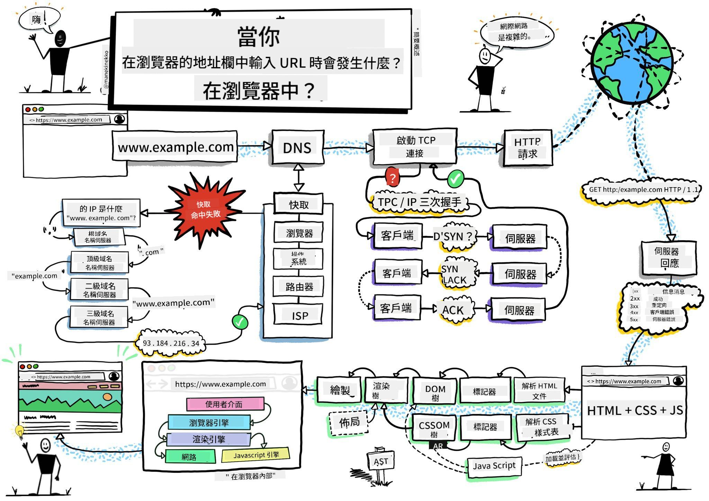
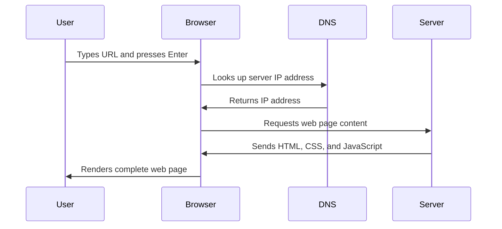
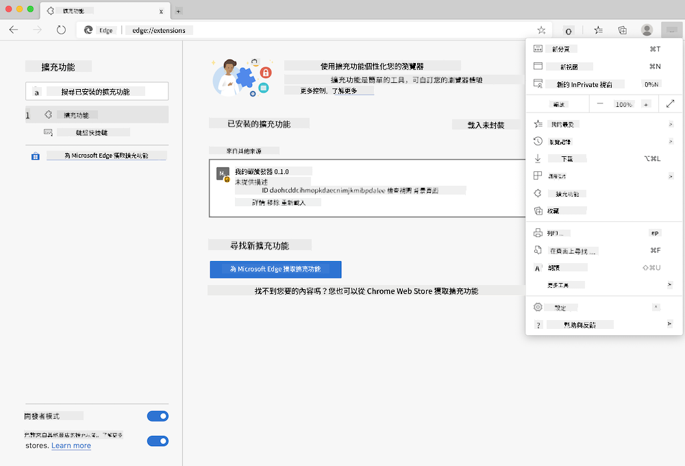
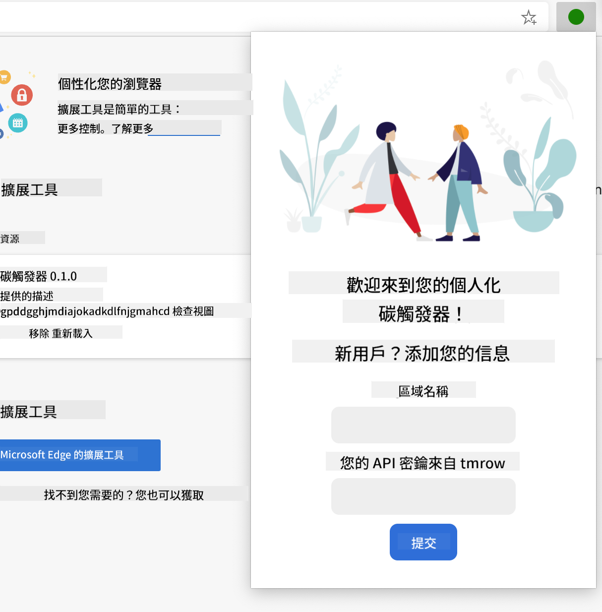
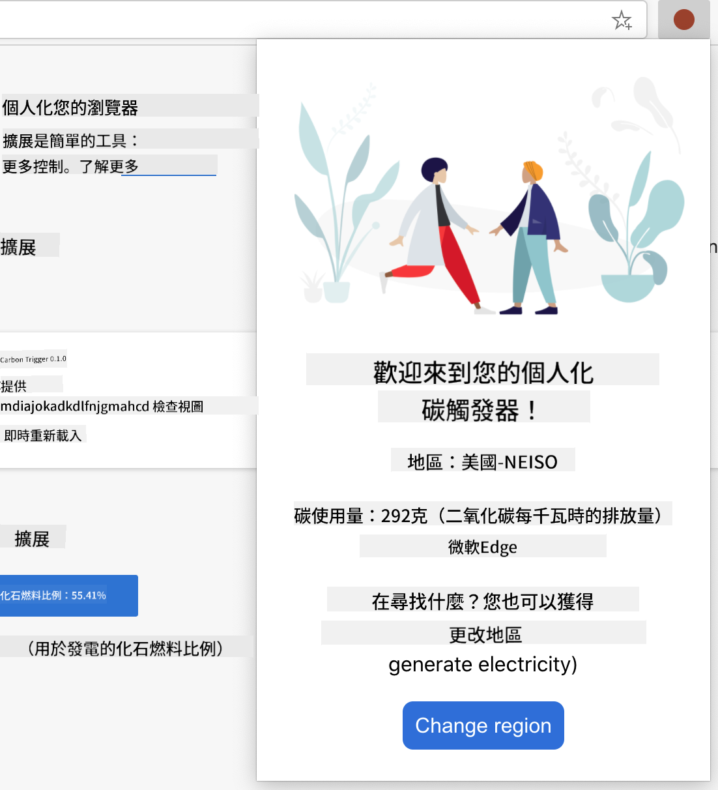

<!--
CO_OP_TRANSLATOR_METADATA:
{
  "original_hash": "33a875c522f237a2026e4653240dfc07",
  "translation_date": "2025-10-22T22:57:14+00:00",
  "source_file": "5-browser-extension/1-about-browsers/README.md",
  "language_code": "mo"
}
-->
# 瀏覽器擴充功能專案第1部分：關於瀏覽器的一切


> 手繪筆記由 [Wassim Chegham](https://dev.to/wassimchegham/ever-wondered-what-happens-when-you-type-in-a-url-in-an-address-bar-in-a-browser-3dob) 提供

## 課前測驗

[課前測驗](https://ff-quizzes.netlify.app/web/quiz/23)

### 簡介

瀏覽器擴充功能是增強網頁瀏覽體驗的小型應用程式。就像 Tim Berners-Lee 最初對互動式網路的願景一樣，擴充功能將瀏覽器的功能擴展到簡單的文件檢視之外。從保護帳戶安全的密碼管理器到幫助設計師挑選完美色彩的取色器，擴充功能解決了日常瀏覽中的挑戰。

在我們開始建立您的第一個擴充功能之前，讓我們先了解瀏覽器的運作原理。就像 Alexander Graham Bell 在發明電話之前需要了解聲音傳輸一樣，了解瀏覽器的基本原理將幫助您創建與現有瀏覽器系統無縫整合的擴充功能。

在本課結束時，您將了解瀏覽器的架構，並開始建立您的第一個擴充功能。

## 了解網頁瀏覽器

網頁瀏覽器本質上是一個複雜的文件解釋器。當您在地址欄輸入 "google.com" 時，瀏覽器會執行一系列複雜的操作——從全球伺服器請求內容，再解析並渲染代碼，最終呈現出您看到的互動式網頁。

這個過程類似於 Tim Berners-Lee 在1990年設計的第一個網頁瀏覽器 WorldWideWeb，目的是讓超連結文件對所有人都可訪問。

✅ **一點歷史**：第一個瀏覽器名為 'WorldWideWeb'，由 Sir Timothy Berners-Lee 在1990年創建。


> 一些早期的瀏覽器，圖片來源 [Karen McGrane](https://www.slideshare.net/KMcGrane/week-4-ixd-history-personal-computing)

### 瀏覽器如何處理網頁內容

從輸入 URL 到看到網頁的過程涉及幾個協調的步驟，這些步驟在幾秒鐘內完成：



**這個過程完成了以下任務：**
- **將**人類可讀的 URL 通過 DNS 查詢轉換為伺服器的 IP 地址
- **建立**與網頁伺服器的安全連接，使用 HTTP 或 HTTPS 協議
- **請求**伺服器上的特定網頁內容
- **接收**來自伺服器的 HTML 標記、CSS 樣式和 JavaScript 代碼
- **渲染**所有內容，呈現出您看到的互動式網頁

### 瀏覽器核心功能

現代瀏覽器提供了許多功能，擴充功能開發者可以利用這些功能：

| 功能 | 目的 | 擴充功能機會 |
|------|------|-------------|
| **渲染引擎** | 顯示 HTML、CSS 和 JavaScript | 修改內容、注入樣式 |
| **JavaScript 引擎** | 執行 JavaScript 代碼 | 自定義腳本、API 互動 |
| **本地存儲** | 本地保存數據 | 用戶偏好設置、緩存數據 |
| **網路堆疊** | 處理網頁請求 | 請求監控、數據分析 |
| **安全模型** | 保護用戶免受惡意內容影響 | 內容過濾、安全增強 |

**了解這些功能有助於您：**
- **識別**您的擴充功能可以增加最大價值的地方
- **選擇**適合擴充功能功能的瀏覽器 API
- **設計**與瀏覽器系統高效協作的擴充功能
- **確保**您的擴充功能遵循瀏覽器的安全最佳實踐

### 跨瀏覽器開發考量

不同的瀏覽器在實現標準時可能會有些許差異，這類似於不同的程式語言可能以不同方式處理相同的算法。Chrome、Firefox 和 Safari 各自具有獨特的特性，開發者在開發擴充功能時必須考慮這些特性。

> 💡 **專業提示**：使用 [caniuse.com](https://www.caniuse.com) 檢查不同瀏覽器對網頁技術的支援情況。這對於規劃擴充功能的功能非常有幫助！

**擴充功能開發的關鍵考量：**
- **測試**您的擴充功能在 Chrome、Firefox 和 Edge 瀏覽器中的表現
- **適應**不同的瀏覽器擴充功能 API 和清單格式
- **處理**不同的性能特性和限制
- **提供**針對可能無法使用的瀏覽器特定功能的替代方案

✅ **分析洞察**：您可以通過在網頁開發專案中安裝分析套件來確定用戶偏好的瀏覽器。這些數據有助於您優先考慮首先支援哪些瀏覽器。

## 了解瀏覽器擴充功能

瀏覽器擴充功能通過直接向瀏覽器介面添加功能來解決常見的網頁瀏覽挑戰。與其需要單獨的應用程式或複雜的工作流程，擴充功能提供了即時訪問工具和功能的方式。

這個概念類似於早期計算機先驅如 Douglas Engelbart 所設想的通過技術增強人類能力——擴充功能增強了瀏覽器的基本功能。

**流行的擴充功能類別及其優勢：**
- **生產力工具**：任務管理器、筆記應用和時間追蹤器幫助您保持組織有序
- **安全增強**：密碼管理器、廣告攔截器和隱私工具保護您的數據
- **開發者工具**：代碼格式化工具、取色器和調試工具簡化開發過程
- **內容增強**：閱讀模式、視頻下載器和截圖工具改善您的網頁體驗

✅ **反思問題**：您最喜歡的瀏覽器擴充功能是什麼？它們執行哪些特定任務，如何改善您的瀏覽體驗？

## 安裝和管理擴充功能

了解擴充功能的安裝過程有助於您預測用戶在安裝您的擴充功能時的體驗。安裝過程在現代瀏覽器中是標準化的，但介面設計上可能略有不同。



> **重要**：在測試您自己的擴充功能時，請確保開啟開發者模式並允許來自其他商店的擴充功能。

### 開發擴充功能的安裝過程

當您開發和測試自己的擴充功能時，請按照以下工作流程進行：

```bash
# Step 1: Build your extension
npm run build
```

**此命令完成的任務：**
- **編譯**您的源代碼為瀏覽器可用的文件
- **打包**JavaScript 模組為優化的包
- **生成**最終的擴充功能文件到 `/dist` 資料夾
- **準備**您的擴充功能進行安裝和測試

**步驟2：導航到瀏覽器擴充功能**
1. **打開**瀏覽器的擴充功能管理頁面
2. **點擊**右上角的 "設置和更多" 按鈕（`...` 圖標）
3. **選擇**下拉菜單中的 "擴充功能"

**步驟3：加載您的擴充功能**
- **對於新安裝**：選擇 `load unpacked` 並選擇您的 `/dist` 資料夾
- **對於更新**：點擊已安裝擴充功能旁的 `reload`
- **對於測試**：啟用 "開發者模式" 以訪問額外的調試功能

### 生產環境擴充功能安裝

> ✅ **注意**：這些開發指導專為您自己構建的擴充功能而設。要安裝已發布的擴充功能，請訪問官方瀏覽器擴充功能商店，例如 [Microsoft Edge Add-ons store](https://microsoftedge.microsoft.com/addons/Microsoft-Edge-Extensions-Home)。

**了解區別：**
- **開發安裝**允許您在開發過程中測試未發布的擴充功能
- **商店安裝**提供經過審核的已發布擴充功能，並自動更新
- **側載**允許從官方商店外安裝擴充功能（需要開發者模式）

## 建立您的碳足跡擴充功能

我們將創建一個瀏覽器擴充功能，顯示您所在地區能源使用的碳足跡。此專案展示了基本的擴充功能開發概念，同時創建了一個實用的環保工具。

這種方法遵循了 John Dewey 的教育理論中證明有效的 "學習中做" 原則——將技術技能與有意義的現實應用相結合。

### 專案需求

在開始開發之前，讓我們收集所需的資源和依賴項：

**所需的 API 訪問：**
- **[CO2 Signal API key](https://www.co2signal.com/)**：輸入您的電子郵件地址以獲取免費的 API 密鑰
- **[地區代碼](http://api.electricitymap.org/v3/zones)**：使用 [Electricity Map](https://www.electricitymap.org/map) 查找您的地區代碼（例如，波士頓使用 'US-NEISO'）

**開發工具：**
- **[Node.js 和 NPM](https://www.npmjs.com)**：用於安裝專案依賴項的套件管理工具
- **[起始代碼](../../../../5-browser-extension/start)**：下載 `start` 資料夾以開始開發

✅ **了解更多**：通過這個 [全面的學習模組](https://docs.microsoft.com/learn/modules/create-nodejs-project-dependencies/?WT.mc_id=academic-77807-sagibbon) 提升您的套件管理技能

### 了解專案結構

了解專案結構有助於高效地組織開發工作。就像亞歷山大圖書館為了方便知識檢索而組織一樣，良好的代碼結構使開發更高效：

```
project-root/
├── dist/                    # Built extension files
│   ├── manifest.json        # Extension configuration
│   ├── index.html           # User interface markup
│   ├── background.js        # Background script functionality
│   └── main.js              # Compiled JavaScript bundle
└── src/                     # Source development files
    └── index.js             # Your main JavaScript code
```

**分解每個文件的功能：**
- **`manifest.json`**：**定義**擴充功能的元數據、權限和入口點
- **`index.html`**：**創建**用戶點擊擴充功能時顯示的用戶介面
- **`background.js`**：**處理**背景任務和瀏覽器事件監聽器
- **`main.js`**：**包含**構建過程後的最終 JavaScript 文件
- **`src/index.js`**：**存放**主要開發代碼，最終編譯為 `main.js`

> 💡 **組織提示**：將您的 API 密鑰和地區代碼存放在安全的筆記中，以便在開發過程中輕鬆參考。您需要這些值來測試擴充功能的功能。

✅ **安全提示**：切勿將 API 密鑰或敏感憑據提交到您的代碼庫。我們將在後續步驟中向您展示如何安全地處理這些內容。

## 創建擴充功能介面

現在我們將構建用戶介面組件。該擴充功能採用兩屏設計：一個用於初始設置的配置屏幕，另一個用於數據顯示的結果屏幕。

這遵循了自計算機早期以來在介面設計中使用的漸進披露原則——以邏輯順序揭示信息和選項，避免讓用戶感到不知所措。

### 擴充功能視圖概述

**設置視圖** - 首次用戶配置：


**結果視圖** - 碳足跡數據顯示：


### 構建配置表單

設置表單在首次使用時收集用戶配置數據。一旦配置，這些信息將保存在瀏覽器存儲中以供未來會話使用。

在 `/dist/index.html` 文件中，添加以下表單結構：

```html
<form class="form-data" autocomplete="on">
    <div>
        <h2>New? Add your Information</h2>
    </div>
    <div>
        <label for="region">Region Name</label>
        <input type="text" id="region" required class="region-name" />
    </div>
    <div>
        <label for="api">Your API Key from tmrow</label>
        <input type="text" id="api" required class="api-key" />
    </div>
    <button class="search-btn">Submit</button>
</form>
```

**此表單完成的功能：**
- **創建**具有適當標籤和輸入關聯的語義表單結構
- **啟用**瀏覽器自動完成功能以改善用戶體驗
- **要求**使用 `required` 屬性在提交前填寫所有字段
- **組織**輸入，使用描述性類名便於樣式設置和 JavaScript 定位
- **提供**清晰的指導，幫助首次設置擴充功能的用戶

### 構建結果顯示

接下來，創建顯示碳足跡數據的結果區域。在表單下方添加以下 HTML：

```html
<div class="result">
    <div class="loading">loading...</div>
    <div class="errors"></div>
    <div class="data"></div>
    <div class="result-container">
        <p><strong>Region: </strong><span class="my-region"></span></p>
        <p><strong>Carbon Usage: </strong><span class="carbon-usage"></span></p>
        <p><strong>Fossil Fuel Percentage: </strong><span class="fossil-fuel"></span></p>
    </div>
    <button class="clear-btn">Change region</button>
</div>
```

**分解此結構提供的功能：**
- **`loading`**：**顯示**在 API 數據獲取期間的加載消息
- **`errors`**：**顯示**API 調用失敗或數據無效時的錯誤消息
- **`data`**：**保存**開發過程中的原始數據以進行調試
- **`result-container`**：**向用戶呈現**格式化的碳足跡信息
- **`clear-btn`**：**允許**用戶更改地區並重新配置擴充功能

### 設置構建過程

現在讓我們安裝專案依賴項並測試構建過程：

```bash
npm install
```

**此安裝過程完成的功能：**
- **下載**Webpack 和 `package.json` 中指定的其他開發依賴項
- **配置**構建工具鏈以編譯現代 JavaScript
- **準備**開發環境以進行擴充功能構建和測試
- **啟用**代碼打包、優化和跨瀏覽器兼容性功能

> 💡 **構建過程洞察**：Webpack 將您的源代碼從 `/src/index.js` 打包到 `/dist/main.js`。此過程優化您的代碼以用於生產環境，並確保瀏覽器兼容性。

### 測試您的進度

此時，您可以測試您的擴充功能：

1. **運行**構建命令以編譯您的代碼
2. **加載**擴充功能到瀏覽器中，使用開發者模式
3. **驗證**表單是否正確顯示且外觀專業
4. **檢查**所有表單元素是否對齊且功能正常

**您已完成的內容：**
- **構建**了擴充功能的基礎 HTML 結構
- **創建**了配置和結果介面，並使用了適當的語義標記
- **設置**了使用行業標準工具的現代開發工作流程
- **為**添加互動式 JavaScript 功能打下基礎

您已完成瀏覽器擴充功能開發的第一階段。就像萊特兄弟在實現飛行之前需要了解空氣動力學一樣，了解這些基礎概念為您在下一課中構建更複雜的互動功能做好了準備。

## GitHub Copilot Agent 挑戰 🚀

使用 Agent 模式完成以下挑戰：
**描述：** 增強瀏覽器擴充功能，新增表單驗證及使用者回饋功能，以改善使用者在輸入 API 金鑰及地區代碼時的使用體驗。

**提示：** 建立 JavaScript 驗證函數，檢查 API 金鑰欄位是否至少包含 20 個字元，以及地區代碼是否符合正確格式（例如 'US-NEISO'）。透過改變輸入框的邊框顏色提供視覺回饋，對於有效輸入顯示綠色，無效輸入顯示紅色。此外，新增一個切換功能以顯示/隱藏 API 金鑰，確保安全性。

了解更多關於 [agent mode](https://code.visualstudio.com/blogs/2025/02/24/introducing-copilot-agent-mode) 的資訊。

## 🚀 挑戰

瀏覽瀏覽器擴充功能商店並安裝一個擴充功能到你的瀏覽器。你可以用有趣的方式檢視其檔案。你發現了什麼？

## 課後測驗

[課後測驗](https://ff-quizzes.netlify.app/web/quiz/24)

## 回顧與自學

在本課程中，你學到了一些關於網頁瀏覽器歷史的知識；利用這個機會，了解萬維網的發明者如何設想其用途，並閱讀更多關於其歷史的內容。一些有用的網站包括：

[網頁瀏覽器的歷史](https://www.mozilla.org/firefox/browsers/browser-history/)

[網頁的歷史](https://webfoundation.org/about/vision/history-of-the-web/)

[Tim Berners-Lee 的訪談](https://www.theguardian.com/technology/2019/mar/12/tim-berners-lee-on-30-years-of-the-web-if-we-dream-a-little-we-can-get-the-web-we-want)

## 作業

[重新設計你的擴充功能](assignment.md)

---

**免責聲明**：  
本文件已使用 AI 翻譯服務 [Co-op Translator](https://github.com/Azure/co-op-translator) 進行翻譯。儘管我們致力於提供準確的翻譯，請注意自動翻譯可能包含錯誤或不準確之處。原始文件的母語版本應被視為權威來源。對於關鍵信息，建議使用專業人工翻譯。我們對因使用此翻譯而引起的任何誤解或誤釋不承擔責任。