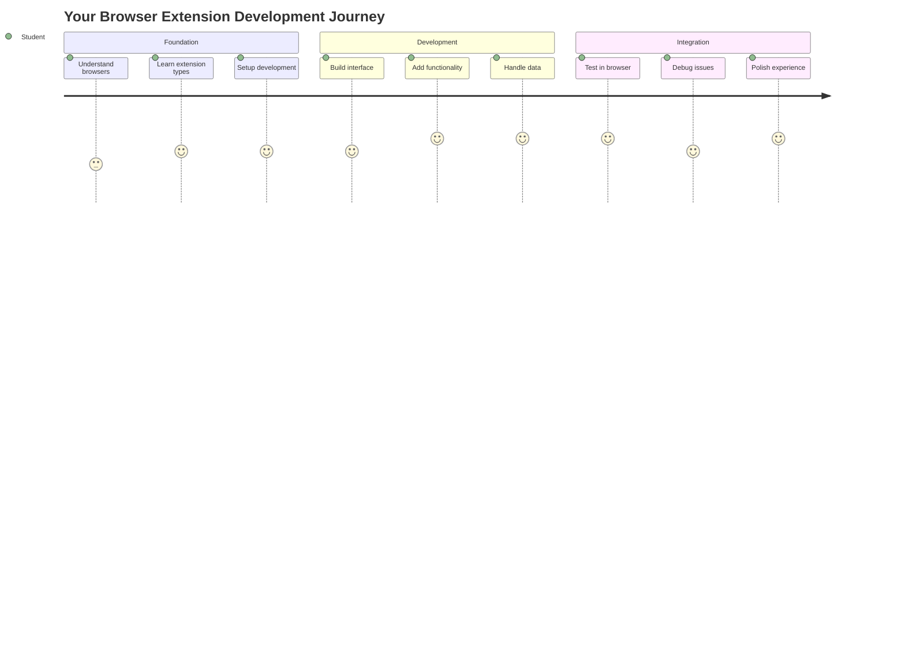
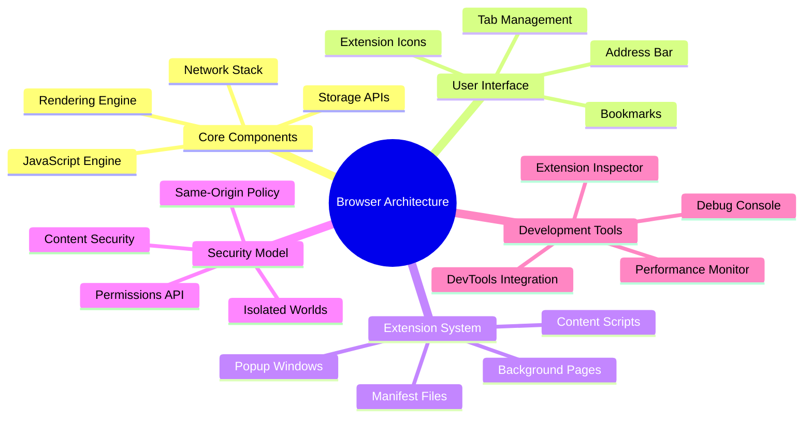
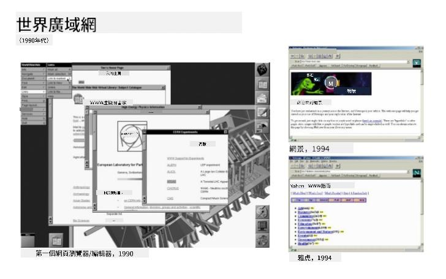
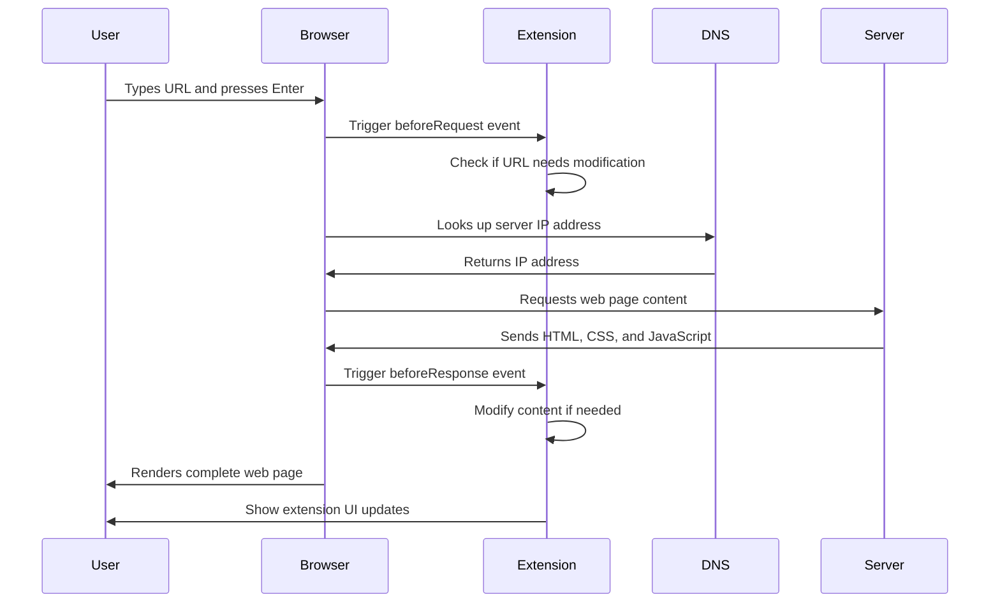
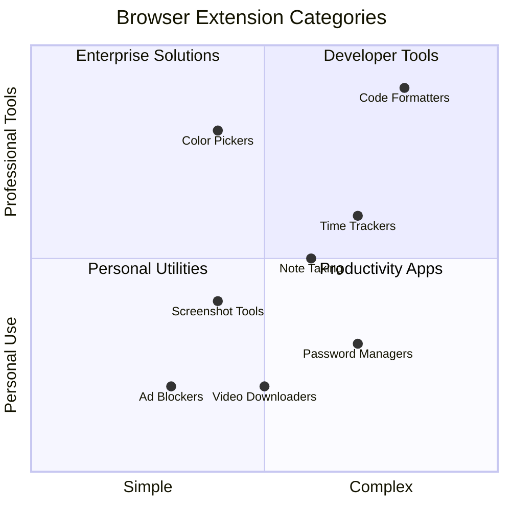
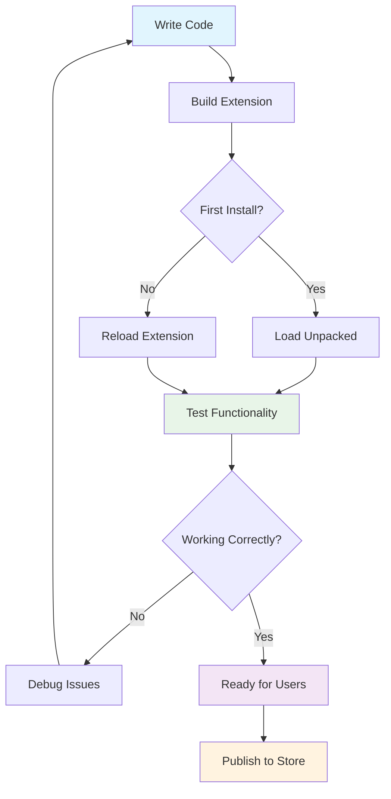
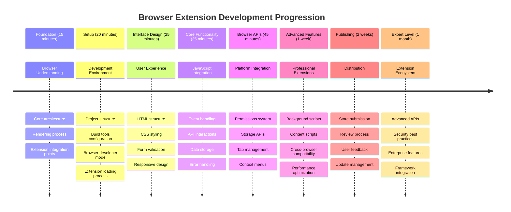

<!--
CO_OP_TRANSLATOR_METADATA:
{
  "original_hash": "00aa85715e1efd4930c17a23e3012e69",
  "translation_date": "2025-11-03T23:56:49+00:00",
  "source_file": "5-browser-extension/1-about-browsers/README.md",
  "language_code": "mo"
}
-->
# 瀏覽器擴充功能專案第一部分：關於瀏覽器的一切




> 手繪筆記由 [Wassim Chegham](https://dev.to/wassimchegham/ever-wondered-what-happens-when-you-type-in-a-url-in-an-address-bar-in-a-browser-3dob) 提供

## 課前測驗

[課前測驗](https://ff-quizzes.netlify.app/web/quiz/23)

### 簡介

瀏覽器擴充功能是增強網頁瀏覽體驗的小型應用程式。就像 Tim Berners-Lee 最初對互動式網路的願景一樣，擴充功能擴展了瀏覽器的功能，超越了簡單的文件檢視。從保護帳戶安全的密碼管理器到幫助設計師抓取完美色彩的色彩選擇器，擴充功能解決了日常瀏覽的挑戰。

在我們開始建立您的第一個擴充功能之前，先來了解瀏覽器的運作原理。就像 Alexander Graham Bell 在發明電話之前需要了解聲音傳輸一樣，了解瀏覽器的基本原理將幫助您創建能與現有瀏覽器系統無縫整合的擴充功能。

在本課程結束時，您將了解瀏覽器架構並開始建立您的第一個擴充功能。



## 了解網頁瀏覽器

網頁瀏覽器本質上是一個複雜的文件解釋器。當您在地址欄輸入 "google.com" 時，瀏覽器會執行一系列複雜的操作——從全球伺服器請求內容，到解析並渲染代碼成為您看到的互動式網頁。

這個過程類似於 Tim Berners-Lee 在 1990 年設計的第一個網頁瀏覽器 WorldWideWeb，旨在讓超連結文件對每個人都可訪問。

✅ **一點歷史**：第一個瀏覽器名為 'WorldWideWeb'，由 Timothy Berners-Lee 爵士於 1990 年創建。


> 一些早期的瀏覽器，圖片來源 [Karen McGrane](https://www.slideshare.net/KMcGrane/week-4-ixd-history-personal-computing)

### 瀏覽器如何處理網頁內容

從輸入 URL 到看到網頁的過程涉及幾個協調的步驟，這些步驟在幾秒鐘內完成：



**這個過程完成了以下工作：**
- **轉換** 人類可讀的 URL 為伺服器的 IP 地址，通過 DNS 查詢
- **建立** 使用 HTTP 或 HTTPS 協議與網頁伺服器的安全連接
- **請求** 從伺服器獲取特定網頁內容
- **接收** 伺服器提供的 HTML 標記、CSS 樣式和 JavaScript 代碼
- **渲染** 所有內容成為您看到的互動式網頁

### 瀏覽器核心功能

現代瀏覽器提供了許多擴充功能開發者可以利用的功能：

| 功能 | 目的 | 擴充功能機會 |
|------|------|-------------|
| **渲染引擎** | 顯示 HTML、CSS 和 JavaScript | 修改內容、注入樣式 |
| **JavaScript 引擎** | 執行 JavaScript 代碼 | 自定義腳本、API 交互 |
| **本地存儲** | 本地保存數據 | 用戶偏好、緩存數據 |
| **網路堆疊** | 處理網頁請求 | 請求監控、數據分析 |
| **安全模型** | 保護用戶免受惡意內容影響 | 內容過濾、安全增強 |

**了解這些功能有助於您：**
- **識別** 您的擴充功能可以增加最大價值的地方
- **選擇** 適合擴充功能功能的瀏覽器 API
- **設計** 與瀏覽器系統高效協作的擴充功能
- **確保** 您的擴充功能遵循瀏覽器安全最佳實踐

### 跨瀏覽器開發考量

不同的瀏覽器以略有不同的方式實現標準，類似於不同的程式語言可能以不同方式處理相同的算法。Chrome、Firefox 和 Safari 各自具有獨特的特性，開發者在開發擴充功能時必須考慮這些特性。

> 💡 **專業提示**：使用 [caniuse.com](https://www.caniuse.com) 檢查不同瀏覽器是否支持某些網頁技術。這在規劃擴充功能的功能時非常有用！

**擴充功能開發的關鍵考量：**
- **測試** 您的擴充功能在 Chrome、Firefox 和 Edge 瀏覽器上的表現
- **適應** 不同瀏覽器的擴充功能 API 和清單格式
- **處理** 不同的性能特性和限制
- **提供** 瀏覽器特定功能的備選方案，應對可能不可用的情況

✅ **分析洞察**：您可以通過在網頁開發專案中安裝分析套件來確定用戶偏好的瀏覽器。這些數據幫助您優先支持最受歡迎的瀏覽器。

## 了解瀏覽器擴充功能

瀏覽器擴充功能通過直接添加功能到瀏覽器介面來解決常見的網頁瀏覽挑戰。擴充功能提供了即時訪問工具和功能，而不需要單獨的應用程式或複雜的工作流程。

這個概念類似於早期計算機先驅如 Douglas Engelbart 所設想的通過技術增強人類能力——擴充功能增強了瀏覽器的基本功能。



**流行的擴充功能類別及其好處：**
- **生產力工具**：任務管理器、筆記應用程式和時間追蹤器幫助您保持組織性
- **安全增強**：密碼管理器、廣告攔截器和隱私工具保護您的數據
- **開發者工具**：代碼格式化工具、色彩選擇器和調試工具簡化開發過程
- **內容增強**：閱讀模式、視頻下載器和截圖工具改善您的網頁體驗

✅ **反思問題**：您最喜歡的瀏覽器擴充功能是什麼？它們執行哪些特定任務，如何改善您的瀏覽體驗？

### 🔄 **教學檢查**
**瀏覽器架構理解**：在進入擴充功能開發之前，確保您能夠：
- ✅ 解釋瀏覽器如何處理網頁請求並渲染內容
- ✅ 識別瀏覽器架構的主要組成部分
- ✅ 理解擴充功能如何與瀏覽器功能整合
- ✅ 認識保護用戶的安全模型

**快速自我測試**：您能追溯從輸入 URL 到看到網頁的路徑嗎？
1. **DNS 查詢** 將 URL 轉換為 IP 地址
2. **HTTP 請求** 從伺服器獲取內容
3. **解析** 處理 HTML、CSS 和 JavaScript
4. **渲染** 顯示最終網頁
5. **擴充功能** 可以在多個步驟中修改內容

## 安裝和管理擴充功能

了解擴充功能的安裝過程有助於您預測用戶在安裝您的擴充功能時的體驗。安裝過程在現代瀏覽器中是標準化的，介面設計略有不同。


> **重要**：在測試您自己的擴充功能時，請確保開啟開發者模式並允許來自其他商店的擴充功能。

### 開發擴充功能安裝過程

當您開發和測試自己的擴充功能時，請遵循以下工作流程：



```bash
# Step 1: Build your extension
npm run build
```

**此命令完成的工作：**
- **編譯** 您的源代碼為瀏覽器可用的文件
- **打包** JavaScript 模塊為優化的包
- **生成** 最終的擴充功能文件到 `/dist` 文件夾
- **準備** 您的擴充功能進行安裝和測試

**步驟 2：導航到瀏覽器擴充功能**
1. **打開** 瀏覽器的擴充功能管理頁面
2. **點擊** 右上角的 "設置和更多" 按鈕（`...` 圖標）
3. **選擇** 下拉菜單中的 "擴充功能"

**步驟 3：加載您的擴充功能**
- **對於新安裝**：選擇 `load unpacked` 並選擇您的 `/dist` 文件夾
- **對於更新**：點擊已安裝擴充功能旁邊的 `reload`
- **對於測試**：啟用 "開發者模式" 以訪問額外的調試功能

### 正式擴充功能安裝

> ✅ **注意**：這些開發指令專門針對您自己建立的擴充功能。要安裝已發布的擴充功能，請訪問官方瀏覽器擴充功能商店，例如 [Microsoft Edge 附加元件商店](https://microsoftedge.microsoft.com/addons/Microsoft-Edge-Extensions-Home)。

**理解差異：**
- **開發安裝** 允許您在開發期間測試未發布的擴充功能
- **商店安裝** 提供經過審核的已發布擴充功能，並自動更新
- **側載** 允許從官方商店外安裝擴充功能（需要開發者模式）

## 建立您的碳足跡擴充功能

我們將創建一個瀏覽器擴充功能，顯示您所在地區能源使用的碳足跡。此專案展示了基本的擴充功能開發概念，同時創建了一個實用的環保工具。

這種方法遵循 "學以致用" 的原則，自 John Dewey 的教育理論以來已被證明有效——結合技術技能與有意義的現實應用。

### 專案需求

在開始開發之前，讓我們收集所需的資源和依賴項：

**所需 API 訪問：**
- **[CO2 Signal API key](https://www.co2signal.com/)**：輸入您的電子郵件地址以獲取免費 API 密鑰
- **[地區代碼](http://api.electricitymap.org/v3/zones)**：使用 [Electricity Map](https://www.electricitymap.org/map) 查找您的地區代碼（例如，波士頓使用 'US-NEISO'）

**開發工具：**
- **[Node.js 和 NPM](https://www.npmjs.com)**：用於安裝專案依賴項的套件管理工具
- **[起始代碼](../../../../5-browser-extension/start)**：下載 `start` 文件夾以開始開發

✅ **了解更多**：通過此 [全面的學習模組](https://docs.microsoft.com/learn/modules/create-nodejs-project-dependencies/?WT.mc_id=academic-77807-sagibbon) 增強您的套件管理技能

### 理解專案結構

理解專案結構有助於高效組織開發工作。就像亞歷山大圖書館為了方便知識檢索而組織一樣，良好的代碼結構使開發更高效：

```
project-root/
├── dist/                    # Built extension files
│   ├── manifest.json        # Extension configuration
│   ├── index.html           # User interface markup
│   ├── background.js        # Background script functionality
│   └── main.js              # Compiled JavaScript bundle
├── src/                     # Source development files
│   └── index.js             # Your main JavaScript code
├── package.json             # Project dependencies and scripts
└── webpack.config.js        # Build configuration
```

**分解每個文件的功能：**
- **`manifest.json`**：**定義**擴充功能的元數據、權限和入口點
- **`index.html`**：**創建**用戶點擊擴充功能時出現的介面
- **`background.js`**：**處理**背景任務和瀏覽器事件監聽器
- **`main.js`**：**包含**編譯後的最終 JavaScript
- **`src/index.js`**：**存放**主要開發代碼，最終編譯為 `main.js`

> 💡 **組織提示**：將您的 API 密鑰和地區代碼存放在安全的筆記中，以便在開發期間輕鬆參考。您需要這些值來測試擴充功能的功能。

✅ **安全提示**：切勿將 API 密鑰或敏感憑證提交到您的代碼庫。我們將在接下來的步驟中展示如何安全地處理這些信息。

## 建立擴充功能介面

現在我們將建立用戶介面組件。該擴充功能使用兩個屏幕的方式：一個用於初始設置的配置屏幕，另一個用於顯示數據的結果屏幕。

這遵循自計算機早期以來在介面設計中使用的漸進披露原則——以邏輯順序揭示信息和選項，避免讓用戶感到不知所措。

### 擴充功能視圖概述

**設置視圖** - 初次使用者配置：


**結果視圖** - 顯示碳足跡數據：


### 建立配置表單

設置表單在初次使用時收集用戶配置數據。一旦配置完成，這些信息將保存在瀏覽器存儲中以供未來使用。

在 `/dist/index.html` 文件中，添加以下表單結構：

```html
<form class="form-data" autocomplete="on">
    <div>
        <h2>New? Add your Information</h2>
    </div>
    <div>
        <label for="region">Region Name</label>
        <input type="text" id="region" required class="region-name" />
    </div>
    <div>
        <label for="api">Your API Key from tmrow</label>
        <input type="text" id="api" required class="api-key" />
    </div>
    <button class="search-btn">Submit</button>
</form>
```

**此表單完成的工作：**
- **創建** 具有適當標籤和輸入關聯的語義表單結構
- **啟用** 瀏覽器自動完成功能以改善用戶體驗
- **要求** 使用 `required` 屬性在提交之前填寫所有字段
- **組織** 輸入，使用描述性類名便於樣式和 JavaScript 定位
- **提供** 清晰的指示，幫助首次設置擴充功能的用戶

### 建立結果顯示

接下來，創建顯示碳足跡數據的結果區域。在表單下方添加以下 HTML：

```html
<div class="result">
    <div class="loading">loading...</div>
    <div class="errors"></div>
    <div class="data"></div>
    <div class="result-container">
        <p><strong>Region: </strong><span class="my-region"></span></p>
        <p><strong>Carbon Usage: </strong><span class="carbon-usage"></span></p>
        <p><strong>Fossil Fuel Percentage: </strong><span class="fossil-fuel"></span></p>
    </div>
    <button class="clear-btn">Change region</button>
</div>
```

**分解此結構提供的功能：**
- **`loading`**：**顯示**在 API 數據獲取期間的加載消息
- **`errors`**：**顯示** API 調用失敗或數據無效時的錯誤消息
- **`data`**：**保存**開發期間的原始數據以進行調試
- **`result-container`**：**呈現**格式化的碳足跡信息給用戶
- **`clear-btn`**：**允許**用戶更改地區並重新配置擴充功能

### 設置構建過程

現在讓我們安裝專案依賴項並測試構建過程：

```bash
npm install
```

**此安裝過程完成的工作：**
- **下載** Webpack 和 `package.json` 中指定的其他開發依賴項
- **配置** 構建工具鏈以編譯現代 JavaScript
- **準備** 開發環境以進行擴充功能的構建和測試
- **啟用** 代碼打包、優化和跨瀏覽器兼容功能

> 💡 **構建過程洞察**：Webpack 將您的源代碼從 `/src/index.js` 打包到 `/dist/main.js`。此過程優化您的代碼以供生產使用並確保瀏覽器兼容性。

### 測試您的進度

此時，您可以測試您的擴充功能：
1. **執行**建置指令以編譯您的程式碼  
2. **載入**擴充功能到您的瀏覽器，並啟用開發者模式  
3. **確認**表單顯示正確且外觀專業  
4. **檢查**所有表單元素是否對齊且功能正常  

**您已完成的事項：**  
- **建立**擴充功能的基礎 HTML 結構  
- **創建**具有適當語意標記的設定和結果介面  
- **設置**使用業界標準工具的現代開發工作流程  
- **準備**添加互動式 JavaScript 功能的基礎  

### 🔄 **教學進度檢查**  
**擴充功能開發進度**：在繼續之前確認您的理解：  
- ✅ 您能否解釋專案結構中每個檔案的用途？  
- ✅ 您是否了解建置過程如何轉換您的原始碼？  
- ✅ 為什麼我們要將設定和結果分成不同的 UI 區塊？  
- ✅ 表單結構如何支持可用性和無障礙性？  

**開發工作流程理解**：您現在應該能夠：  
1. **修改**擴充功能介面的 HTML 和 CSS  
2. **執行**建置指令以編譯您的更改  
3. **重新載入**瀏覽器中的擴充功能以測試更新  
4. **除錯**使用瀏覽器開發者工具解決問題  

您已完成瀏覽器擴充功能開發的第一階段。就像萊特兄弟在實現飛行之前需要了解空氣動力學一樣，理解這些基礎概念能為您在下一課程中建立更複雜的互動功能做好準備。

## GitHub Copilot Agent 挑戰 🚀  

使用 Agent 模式完成以下挑戰：  

**描述：** 增強瀏覽器擴充功能，添加表單驗證和用戶反饋功能，以改善輸入 API 金鑰和地區代碼時的用戶體驗。  

**提示：** 創建 JavaScript 驗證函數，檢查 API 金鑰欄位是否至少包含 20 個字元，以及地區代碼是否符合正確格式（例如 'US-NEISO'）。通過改變輸入框邊框顏色（有效輸入為綠色，無效輸入為紅色）來提供視覺反饋。此外，添加一個切換功能以顯示/隱藏 API 金鑰以確保安全性。  

了解更多關於 [agent mode](https://code.visualstudio.com/blogs/2025/02/24/introducing-copilot-agent-mode) 的資訊。

## 🚀 挑戰  

瀏覽瀏覽器擴充功能商店並安裝一個擴充功能到您的瀏覽器。您可以用有趣的方式檢查其檔案。您發現了什麼？

## 課後測驗  

[課後測驗](https://ff-quizzes.netlify.app/web/quiz/24)

## 回顧與自學  

在本課程中，您學習了一些關於網頁瀏覽器歷史的知識；趁此機會了解萬維網的發明者如何設想其用途，並閱讀更多相關歷史。以下是一些有用的網站：  

[網頁瀏覽器的歷史](https://www.mozilla.org/firefox/browsers/browser-history/)  

[網頁的歷史](https://webfoundation.org/about/vision/history-of-the-web/)  

[Tim Berners-Lee 的訪談](https://www.theguardian.com/technology/2019/mar/12/tim-berners-lee-on-30-years-of-the-web-if-we-dream-a-little-we-can-get-the-web-we-want)  

### ⚡ **接下來 5 分鐘內可以做的事情**  
- [ ] 打開 Chrome/Edge 擴充功能頁面 (chrome://extensions) 並探索您已安裝的擴充功能  
- [ ] 查看瀏覽器的開發者工具網路標籤，並載入一個網頁  
- [ ] 嘗試查看網頁原始碼 (Ctrl+U) 以了解 HTML 結構  
- [ ] 檢查任意網頁元素並在開發者工具中修改其 CSS  

### 🎯 **您可以在接下來的一小時內完成的事情**  
- [ ] 完成課後測驗並了解瀏覽器基礎知識  
- [ ] 創建一個基本的 manifest.json 檔案以用於瀏覽器擴充功能  
- [ ] 建立一個簡單的 "Hello World" 擴充功能，顯示彈出視窗  
- [ ] 測試在開發者模式下載入您的擴充功能  
- [ ] 探索目標瀏覽器的擴充功能文件  

### 📅 **您的一週擴充功能開發旅程**  
- [ ] 完成一個具有實際用途的功能性瀏覽器擴充功能  
- [ ] 學習內容腳本、背景腳本和彈出視窗的互動  
- [ ] 掌握瀏覽器 API，例如儲存、標籤和訊息傳遞  
- [ ] 設計用戶友好的擴充功能介面  
- [ ] 在不同的網站和場景中測試您的擴充功能  
- [ ] 將您的擴充功能發佈到瀏覽器的擴充功能商店  

### 🌟 **您的一個月瀏覽器開發旅程**  
- [ ] 建立多個解決不同用戶問題的擴充功能  
- [ ] 學習進階瀏覽器 API 和安全最佳實踐  
- [ ] 貢獻開源瀏覽器擴充功能專案  
- [ ] 掌握跨瀏覽器相容性和漸進式增強技術  
- [ ] 為其他開發者創建擴充功能開發工具和模板  
- [ ] 成為幫助其他開發者的瀏覽器擴充功能專家  

## 🎯 您的瀏覽器擴充功能精通時間表  


  
### 🛠️ 您的擴充功能開發工具包摘要  

完成本課程後，您現在擁有：  
- **瀏覽器架構知識**：了解渲染引擎、安全模型和擴充功能整合  
- **開發環境**：現代工具鏈，包括 Webpack、NPM 和除錯功能  
- **UI/UX 基礎**：具有漸進式顯示模式的語意 HTML 結構  
- **安全意識**：了解瀏覽器權限和安全開發實踐  
- **跨瀏覽器概念**：相容性考量和測試方法的知識  
- **API 整合**：與外部數據源合作的基礎  
- **專業工作流程**：業界標準的開發和測試程序  

**實際應用：** 這些技能直接適用於：  
- **網頁開發**：單頁應用程式和漸進式網頁應用程式  
- **桌面應用程式**：Electron 和基於網頁的桌面軟體  
- **行動開發**：混合應用程式和基於網頁的行動解決方案  
- **企業工具**：內部生產力應用程式和工作流程自動化  
- **開源**：貢獻瀏覽器擴充功能專案和網頁標準  

**下一步：** 您已準備好添加互動功能，使用瀏覽器 API，並創建能解決實際用戶問題的擴充功能！

## 作業  

[重新設計您的擴充功能](assignment.md)  

---

**免責聲明**：  
本文件已使用 AI 翻譯服務 [Co-op Translator](https://github.com/Azure/co-op-translator) 進行翻譯。儘管我們努力確保翻譯的準確性，但請注意，自動翻譯可能包含錯誤或不準確之處。原始文件的母語版本應被視為權威來源。對於關鍵信息，建議使用專業人工翻譯。我們對因使用此翻譯而產生的任何誤解或誤釋不承擔責任。