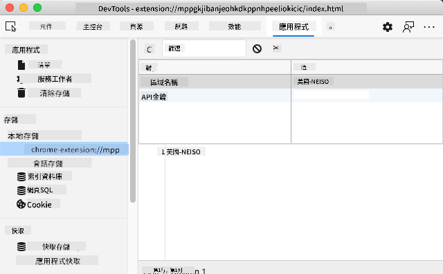

<!--
CO_OP_TRANSLATOR_METADATA:
{
  "original_hash": "8c8cd4af6086cc1d47e1d43aa4983d20",
  "translation_date": "2025-10-22T22:56:33+00:00",
  "source_file": "5-browser-extension/2-forms-browsers-local-storage/README.md",
  "language_code": "mo"
}
-->
# 瀏覽器擴充功能專案第二部分：呼叫 API，使用本地存儲

## 課前測驗

[課前測驗](https://ff-quizzes.netlify.app/web/quiz/25)

## 介紹

還記得你開始建立的瀏覽器擴充功能嗎？目前你已經有了一個外觀不錯的表單，但它基本上是靜態的。今天，我們將通過連接真實數據並賦予它記憶功能來讓它變得更加生動。

想想阿波羅任務控制電腦——它們不僅僅顯示固定的信息。它們不斷與航天器通信，更新遙測數據，並記住關鍵的任務參數。今天我們要構建的就是這種動態行為。你的擴充功能將連接到互聯網，抓取真實的環境數據，並記住你的設置以供下次使用。

API 整合可能聽起來很複雜，但實際上只是教你的程式碼如何與其他服務通信。無論你是獲取天氣數據、社交媒體動態，還是像今天我們要做的那樣獲取碳足跡信息，這一切都是關於建立這些數字連接。我們還將探索瀏覽器如何持久化信息——類似於圖書館使用卡片目錄來記住書籍的位置。

在本課結束時，你將擁有一個能夠抓取真實數據、存儲使用者偏好並提供流暢體驗的瀏覽器擴充功能。讓我們開始吧！

✅ 按照適當文件中的編號段落，了解應將程式碼放置在哪裡。

## 設置擴充功能中需要操作的元素

在 JavaScript 操作介面之前，它需要引用特定的 HTML 元素。就像望遠鏡需要指向特定的星星一樣——在伽利略研究木星的衛星之前，他必須先定位並聚焦在木星本身。

在你的 `index.js` 文件中，我們將創建一些 `const` 變數來捕捉每個重要表單元素的引用。這類似於科學家標記他們的設備——而不是每次都在整個實驗室中搜索，他們可以直接訪問所需的東西。

```javascript
// form fields
const form = document.querySelector('.form-data');
const region = document.querySelector('.region-name');
const apiKey = document.querySelector('.api-key');

// results
const errors = document.querySelector('.errors');
const loading = document.querySelector('.loading');
const results = document.querySelector('.result-container');
const usage = document.querySelector('.carbon-usage');
const fossilfuel = document.querySelector('.fossil-fuel');
const myregion = document.querySelector('.my-region');
const clearBtn = document.querySelector('.clear-btn');
```

**這段程式碼的作用：**
- 使用 `document.querySelector()` 和 CSS 類選擇器**捕捉**表單元素
- **創建**指向地區名稱和 API 金鑰輸入字段的引用
- **建立**與顯示碳使用數據的結果元素的連接
- **設置**對 UI 元素（如加載指示器和錯誤消息）的訪問
- **存儲**每個元素的引用到 `const` 變數中，以便在程式碼中輕鬆重用

## 添加事件監聽器

現在我們將讓你的擴充功能對使用者操作做出響應。事件監聽器是你的程式碼監控使用者交互的方式。可以將它們想像成早期電話交換機中的操作員——他們監聽來電，並在有人想要建立連接時接通正確的電路。

```javascript
form.addEventListener('submit', (e) => handleSubmit(e));
clearBtn.addEventListener('click', (e) => reset(e));
init();
```

**理解這些概念：**
- **附加**一個提交監聽器到表單，當使用者按下 Enter 或點擊提交時觸發
- **連接**一個點擊監聽器到清除按鈕，用於重置表單
- **傳遞**事件對象 `(e)` 到處理函數以進行額外控制
- **立即調用** `init()` 函數以設置擴充功能的初始狀態

✅ 注意這裡使用的簡潔箭頭函數語法。這種現代 JavaScript 方法比傳統函數表達式更簡潔，但兩者都同樣有效！

## 建立初始化和重置函數

讓我們為你的擴充功能創建初始化邏輯。`init()` 函數就像船的導航系統檢查其儀器——它確定當前狀態並相應地調整介面。它檢查是否有人之前使用過你的擴充功能，並加載他們之前的設置。

`reset()` 函數為使用者提供了一個全新的開始——類似於科學家在實驗之間重置儀器以確保數據的純潔性。

```javascript
function init() {
	// Check if user has previously saved API credentials
	const storedApiKey = localStorage.getItem('apiKey');
	const storedRegion = localStorage.getItem('regionName');

	// Set extension icon to generic green (placeholder for future lesson)
	// TODO: Implement icon update in next lesson

	if (storedApiKey === null || storedRegion === null) {
		// First-time user: show the setup form
		form.style.display = 'block';
		results.style.display = 'none';
		loading.style.display = 'none';
		clearBtn.style.display = 'none';
		errors.textContent = '';
	} else {
		// Returning user: load their saved data automatically
		displayCarbonUsage(storedApiKey, storedRegion);
		results.style.display = 'none';
		form.style.display = 'none';
		clearBtn.style.display = 'block';
	}
}

function reset(e) {
	e.preventDefault();
	// Clear stored region to allow user to choose a new location
	localStorage.removeItem('regionName');
	// Restart the initialization process
	init();
}
```

**以下是這裡發生的事情：**
- **檢索**瀏覽器本地存儲中的 API 金鑰和地區
- **檢查**這是第一次使用者（沒有存儲的憑據）還是回訪使用者
- **顯示**新使用者的設置表單，隱藏其他介面元素
- **自動加載**已保存的數據以供回訪使用者使用，並顯示重置選項
- **管理**基於可用數據的使用者介面狀態

**關於本地存儲的關鍵概念：**
- **持久化**瀏覽器會話之間的數據（與會話存儲不同）
- 使用 `getItem()` 和 `setItem()` **存儲**數據作為鍵值對
- 當某個鍵沒有數據時，**返回** `null`
- 提供一種簡單的方法來記住使用者偏好和設置

> 💡 **理解瀏覽器存儲**：[LocalStorage](https://developer.mozilla.org/docs/Web/API/Window/localStorage) 就像給你的擴充功能提供持久記憶。想想古代亞歷山大圖書館如何存儲卷軸——即使學者離開並返回，信息仍然可用。
>
> **主要特點：**
> - **持久化**數據，即使你關閉瀏覽器
> - **存活**電腦重啟和瀏覽器崩潰
> - **提供**大量存儲空間以存儲使用者偏好
> - **提供**即時訪問，無需網絡延遲

> **重要注意事項**：你的瀏覽器擴充功能有自己獨立的本地存儲，與普通網頁分開。這提供了安全性並防止與其他網站發生衝突。

你可以通過打開瀏覽器開發者工具 (F12)，導航到 **Application** 標籤，並展開 **Local Storage** 部分來查看存儲的數據。



> ⚠️ **安全考量**：在生產應用中，將 API 金鑰存儲在 LocalStorage 中存在安全風險，因為 JavaScript 可以訪問這些數據。出於學習目的，這種方法是可以的，但真正的應用應使用安全的伺服器端存儲來保存敏感憑據。

## 處理表單提交

現在我們將處理當有人提交表單時會發生什麼。默認情況下，瀏覽器在表單提交時會重新加載頁面，但我們將攔截此行為以創建更流暢的體驗。

這種方法類似於任務控制如何處理航天器通信——而不是每次傳輸都重置整個系統，它們在處理新信息的同時保持連續運行。

創建一個函數來捕捉表單提交事件並提取使用者的輸入：

```javascript
function handleSubmit(e) {
	e.preventDefault();
	setUpUser(apiKey.value, region.value);
}
```

**在上面，我們已經：**
- **防止**默認的表單提交行為，避免頁面刷新
- **提取**使用者輸入的 API 金鑰和地區字段的值
- **將**表單數據傳遞給 `setUpUser()` 函數進行處理
- **保持**單頁應用行為，避免頁面重新加載

✅ 記住你的 HTML 表單字段包含 `required` 屬性，因此瀏覽器會自動驗證使用者在此函數運行之前提供了 API 金鑰和地區。

## 設置使用者偏好

`setUpUser` 函數負責保存使用者憑據並啟動第一次 API 調用。這創造了一個從設置到顯示結果的流暢過渡。

```javascript
function setUpUser(apiKey, regionName) {
	// Save user credentials for future sessions
	localStorage.setItem('apiKey', apiKey);
	localStorage.setItem('regionName', regionName);
	
	// Update UI to show loading state
	loading.style.display = 'block';
	errors.textContent = '';
	clearBtn.style.display = 'block';
	
	// Fetch carbon usage data with user's credentials
	displayCarbonUsage(apiKey, regionName);
}
```

**逐步解析這裡發生的事情：**
- **保存** API 金鑰和地區名稱到本地存儲以供未來使用
- **顯示**加載指示器以通知使用者正在抓取數據
- **清除**顯示中的任何先前錯誤消息
- **顯示**清除按鈕，供使用者稍後重置其設置
- **啟動** API 調用以抓取真實的碳使用數據

此函數通過在一個協調的操作中管理數據持久性和使用者介面更新，創造了一個無縫的使用者體驗。

## 顯示碳使用數據

現在我們將通過 API 將你的擴充功能連接到外部數據源。這將你的擴充功能從一個獨立工具轉變為能夠訪問來自互聯網的實時信息。

**理解 API**

[API](https://www.webopedia.com/TERM/A/API.html) 是不同應用之間通信的方式。可以將它們想像成 19 世紀連接遙遠城市的電報系統——操作員會向遠程站點發送請求並接收所需信息的響應。每次你查看社交媒體、向語音助手提問或使用配送應用，API 都在促進這些數據交換。

**關於 REST API 的關鍵概念：**
- **REST** 代表“表述性狀態轉移”
- **使用**標準 HTTP 方法（GET、POST、PUT、DELETE）與數據交互
- **返回**可預測格式的數據，通常是 JSON
- **提供**一致的基於 URL 的端點以進行不同類型的請求

✅ 我們將使用的 [CO2 Signal API](https://www.co2signal.com/) 提供來自全球電網的實時碳強度數據。這幫助使用者了解其電力使用的環境影響！

> 💡 **理解非同步 JavaScript**：[`async` 關鍵字](https://developer.mozilla.org/docs/Web/JavaScript/Reference/Statements/async_function) 使你的程式碼能夠同時處理多個操作。當你向伺服器請求數據時，你不希望整個擴充功能凍結——這就像空中交通管制在等待一架飛機回應時停止所有操作。
>
> **主要好處：**
> - **保持**擴充功能的響應性，同時數據加載
> - **允許**其他程式碼在網絡請求期間繼續執行
> - **改善**程式碼可讀性，相比傳統的回調模式
> - **支持**網絡問題的優雅錯誤處理

這裡有一段關於 `async` 的快速視頻：

[](https://youtube.com/watch?v=YwmlRkrxvkk "管理 Promise 的 Async 和 Await")

> 🎥 點擊上方圖片觀看關於 async/await 的視頻。

創建函數以抓取並顯示碳使用數據：

```javascript
// Modern fetch API approach (no external dependencies needed)
async function displayCarbonUsage(apiKey, region) {
	try {
		// Fetch carbon intensity data from CO2 Signal API
		const response = await fetch('https://api.co2signal.com/v1/latest', {
			method: 'GET',
			headers: {
				'auth-token': apiKey,
				'Content-Type': 'application/json'
			},
			// Add query parameters for the specific region
			...new URLSearchParams({ countryCode: region }) && {
				url: `https://api.co2signal.com/v1/latest?countryCode=${region}`
			}
		});

		// Check if the API request was successful
		if (!response.ok) {
			throw new Error(`API request failed: ${response.status}`);
		}

		const data = await response.json();
		const carbonData = data.data;

		// Calculate rounded carbon intensity value
		const carbonIntensity = Math.round(carbonData.carbonIntensity);

		// Update the user interface with fetched data
		loading.style.display = 'none';
		form.style.display = 'none';
		myregion.textContent = region.toUpperCase();
		usage.textContent = `${carbonIntensity} grams (grams CO₂ emitted per kilowatt hour)`;
		fossilfuel.textContent = `${carbonData.fossilFuelPercentage.toFixed(2)}% (percentage of fossil fuels used to generate electricity)`;
		results.style.display = 'block';

		// TODO: calculateColor(carbonIntensity) - implement in next lesson

	} catch (error) {
		console.error('Error fetching carbon data:', error);
		
		// Show user-friendly error message
		loading.style.display = 'none';
		results.style.display = 'none';
		errors.textContent = 'Sorry, we couldn\'t fetch data for that region. Please check your API key and region code.';
	}
}
```

**解析這裡發生的事情：**
- **使用**現代的 `fetch()` API，而不是像 Axios 這樣的外部庫，提供更簡潔、無依賴的程式碼
- **實現**正確的錯誤檢查，使用 `response.ok` 及早捕捉 API 失敗
- **處理**非同步操作，使用 `async/await` 提供更可讀的程式碼流程
- **使用** `auth-token` 標頭進行 CO2 Signal API 的身份驗證
- **解析** JSON 響應數據並提取碳強度信息
- **更新**多個 UI 元素，顯示格式化的環境數據
- **提供**使用者友好的錯誤消息，當 API 調用失敗時

**展示的現代 JavaScript 關鍵概念：**
- 使用 `${}` 語法的 **模板字面值**，提供簡潔的字符串格式化
- 使用 try/catch 塊進行 **錯誤處理**，提供穩健的應用
- 使用 **Async/await** 模式，優雅地處理網絡請求
- 使用 **對象解構**，從 API 響應中提取特定數據
- 使用 **方法鏈接**，進行多個 DOM 操作

✅ 此函數展示了幾個重要的網頁開發概念——與外部伺服器通信、處理身份驗證、處理數據、更新介面以及優雅地管理錯誤。這些是專業開發人員經常使用的基本技能。

🎉 **你已完成的成果：** 你已創建了一個瀏覽器擴充功能，能夠：
- **連接**到互聯網並檢索真實的環境數據
- **持久化**使用者設置，跨會話保存
- **優雅地處理**錯誤，而不是崩潰
- **提供**流暢、專業的使用者體驗

通過運行 `npm run build` 並在瀏覽器中刷新你的擴充功能來測試你的作品。現在你擁有了一個功能齊全的碳足跡追蹤器。下一課將添加動態圖標功能以完成擴充功能。

---

## GitHub Copilot Agent 挑戰 🚀

使用 Agent 模式完成以下挑戰：

**描述：** 通過添加錯誤處理改進和使用者體驗功能來增強瀏覽器擴充功能。此挑戰將幫助你練習使用現代 JavaScript 模式處理 API、本地存儲和 DOM 操作。

**提示：** 創建一個增強版的 displayCarbonUsage 函數，包含以下功能：1）對失敗的 API 調用進行指數回退的重試機制，2）在進行 API 調用之前對地區代碼進行輸入驗證，3）帶有進度指示器的加載動畫，4）在本地存儲中緩存 API 響應並設置過期時間戳（緩存 30 分鐘），5）顯示來自之前 API 調用的歷史數據。此外，添加適當的 TypeScript 風格 JSDoc 註解以記錄所有函數參數和返回類型。

了解更多關於 [Agent 模式](https://code.visualstudio.com/blogs/2025/02/24/introducing-copilot-agent-mode) 的信息。

## 🚀 挑戰

通過探索可用於網頁開發的大量基於瀏覽器的 API，擴展你對 API 的理解。選擇以下瀏覽器 API 之一並建立一個小型演示：

- [地理定位 API](https://developer.mozilla.org/docs/Web/API/Geolocation_API) - 獲取使用者的當前位置
- [通知 API](https://developer.mozilla.org/docs/Web/API/Notifications_API) - 發送桌面通知
- [HTML 拖放 API](https://developer.mozilla.org/docs/Web/API/HTML_Drag_and_Drop_API) - 創建交互式拖放介面
- [網頁存儲 API](https://developer.mozilla.org/docs/Web/API/Web_Storage_API) - 高級本地存儲技術
- [Fetch API](https://developer.mozilla.org/docs/Web/API/Fetch_API) - XMLHttpRequest 的現代替代方案

**研究問題考慮：**
- 此 API 解決了哪些現實世界的問題？
- 該 API 如何處理錯誤和邊界情況？
- 使用此 API 時有哪些安全考量？
- 此 API 在不同瀏覽器中的支持程度如何？

在研究之後，確定哪些特徵使 API 對開發者友好且可靠。

## 課後測驗

[課後測驗](https://ff-quizzes.netlify.app/web/quiz/26)

## 回顧與自學
您在本課程中學習了 LocalStorage 和 API，這兩者對專業的網頁開發者來說都非常有用。您能想到這兩者如何協同工作嗎？試著思考一下，您會如何設計一個網站來存儲供 API 使用的項目。

## 作業

[採用一個 API](assignment.md)

---

**免責聲明**：  
本文件已使用 AI 翻譯服務 [Co-op Translator](https://github.com/Azure/co-op-translator) 進行翻譯。儘管我們努力確保準確性，但請注意，自動翻譯可能包含錯誤或不準確之處。原始文件的母語版本應被視為權威來源。對於關鍵信息，建議使用專業人工翻譯。我們對因使用此翻譯而引起的任何誤解或誤釋不承擔責任。