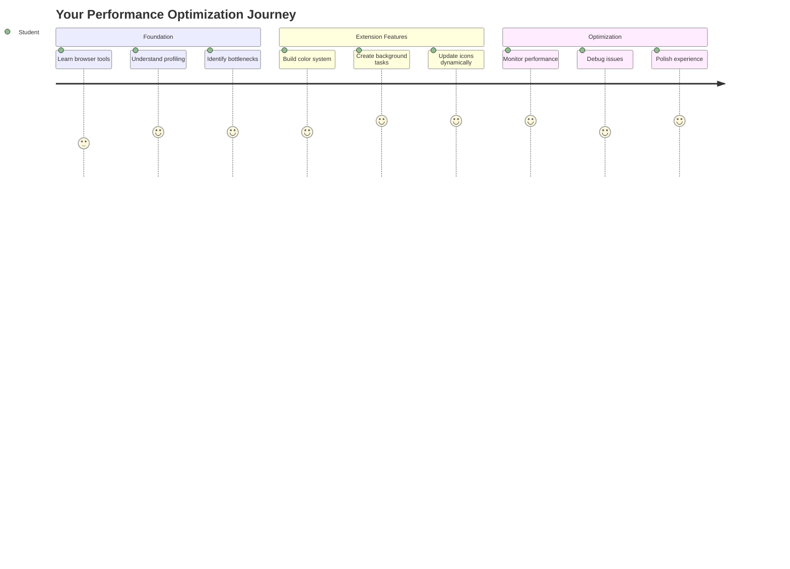
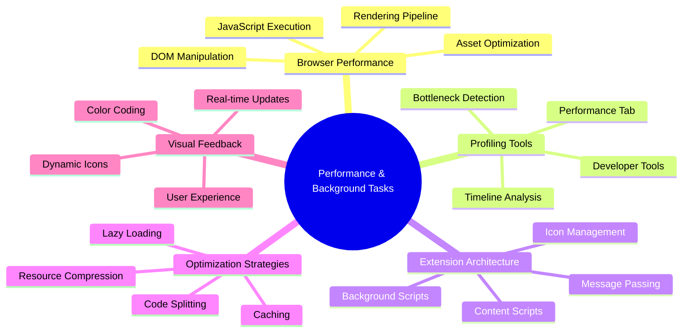
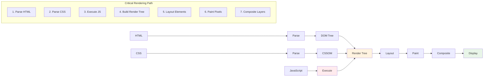
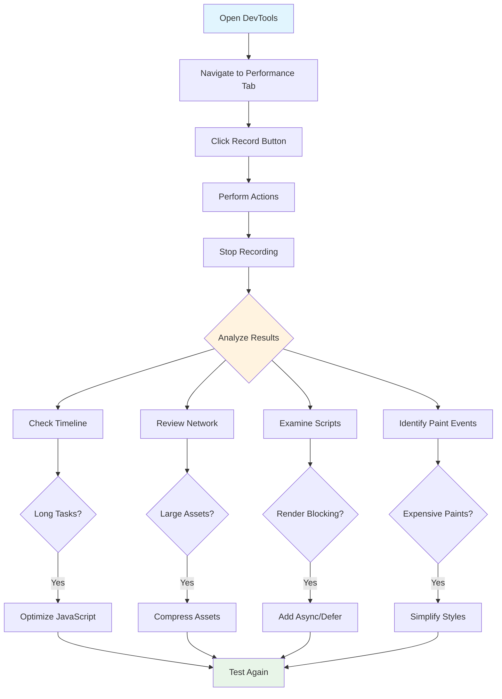
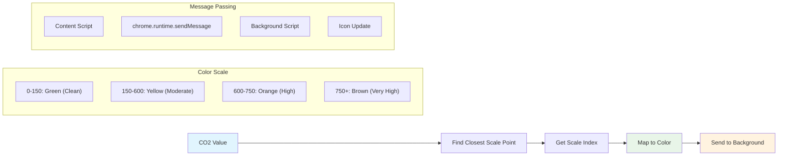
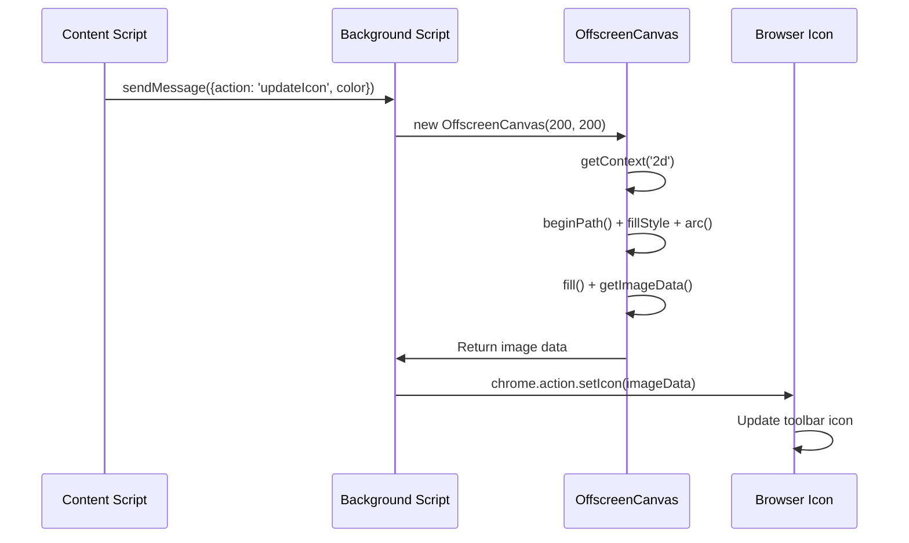
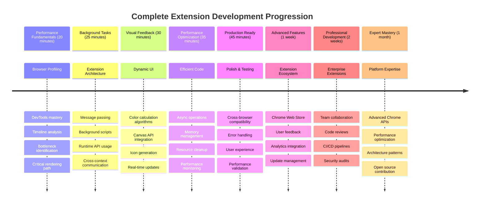

<!--
CO_OP_TRANSLATOR_METADATA:
{
  "original_hash": "b275fed2c6fc90d2b9b6661a3225faa2",
  "translation_date": "2025-11-03T23:55:24+00:00",
  "source_file": "5-browser-extension/3-background-tasks-and-performance/README.md",
  "language_code": "mo"
}
-->
# 瀏覽器擴充功能專案第三部分：了解背景任務與效能



是否曾經好奇為什麼有些瀏覽器擴充功能感覺快速且反應靈敏，而有些卻顯得遲鈍？秘密就在於幕後發生的事情。當使用者在您的擴充功能介面中點擊時，背景處理程序正在悄悄地管理數據抓取、圖示更新以及系統資源。

這是我們瀏覽器擴充功能系列的最後一課，我們將讓您的碳足跡追蹤器運行得更加流暢。您將添加動態圖示更新，並學習如何在效能問題成為麻煩之前發現它們。這就像調整賽車一樣——小小的優化可以對整體運行產生巨大影響。

完成後，您將擁有一個精緻的擴充功能，並了解將普通網頁應用程式與卓越應用程式區分開來的效能原則。讓我們深入瀏覽器優化的世界吧。

## 課前測驗

[課前測驗](https://ff-quizzes.netlify.app/web/quiz/27)

### 簡介

在之前的課程中，您建立了一個表單，將其連接到 API，並解決了非同步數據抓取的問題。您的擴充功能已經初具雛形。

現在我們需要添加最後的修飾——例如根據碳數據改變擴充功能圖示的顏色。這讓我想起 NASA 必須優化阿波羅太空船上的每個系統。他們不能浪費任何一個周期或記憶體，因為效能關乎生命安全。雖然我們的瀏覽器擴充功能並沒有那麼重要，但相同的原則適用——高效的程式碼能創造更好的使用者體驗。



## 網頁效能基礎

當您的程式碼運行高效時，人們能夠真正*感受到*差異。您是否曾經有過網頁瞬間加載或動畫流暢運行的時刻？這就是良好效能的作用。

效能不僅僅是速度——它還關乎於創造自然流暢而非笨重和令人沮喪的網頁體驗。在計算機的早期，Grace Hopper 曾經在她的桌子上放了一根大約一英尺長的電線，來展示光在一納秒內能走多遠。這是她解釋為什麼每一微秒在計算中都很重要的方式。讓我們來探索幫助您找出拖慢速度的偵測工具。

> 「網站效能關乎兩件事：網頁加載的速度，以及其上的程式碼運行的速度。」——[Zack Grossbart](https://www.smashingmagazine.com/2012/06/javascript-profiling-chrome-developer-tools/)

如何讓您的網站在各種設備、各種使用者和各種情況下都能快速運行，這個主題自然是非常廣泛的。以下是一些在建立標準網頁專案或瀏覽器擴充功能時需要記住的要點。

優化網站的第一步是了解幕後實際發生的事情。幸運的是，您的瀏覽器內建了強大的偵測工具。



在 Edge 中打開開發者工具，點擊右上角的三個點，然後進入「更多工具 > 開發者工具」。或者使用鍵盤快捷鍵：Windows 上按 `Ctrl` + `Shift` + `I`，Mac 上按 `Option` + `Command` + `I`。進入後，點擊「效能」標籤——這是您進行調查的地方。

**以下是您的效能偵測工具包：**
- **打開**開發者工具（作為開發者，您會經常使用它！）
- **進入**效能標籤——將其視為您的網頁應用程式的健身追蹤器
- **點擊**記錄按鈕，觀察您的網頁運行情況
- **研究**結果，找出拖慢速度的原因

讓我們來試試看。打開一個網站（Microsoft.com 是個不錯的選擇），然後點擊「記錄」按鈕。現在刷新網頁，觀察分析器捕捉到的所有活動。停止記錄後，您將看到瀏覽器如何「腳本化」、「渲染」和「繪製」網站的詳細分解。這讓我想起了任務控制中心在火箭發射期間監控每個系統的方式——您可以獲得實時的數據，了解每件事情的發生時間和過程。


✅ [Microsoft 文件](https://docs.microsoft.com/microsoft-edge/devtools-guide/performance/?WT.mc_id=academic-77807-sagibbon) 有更多詳細資訊，供您深入了解。

> 專業提示：在測試之前清除瀏覽器快取，以查看您的網站對首次訪問者的效能表現——通常與重複訪問者的表現有很大不同！

選擇剖析時間線的元素，放大網頁加載過程中發生的事件。

通過選擇剖析時間線的一部分並查看摘要窗格，獲得網頁效能的快照：


檢查事件日誌窗格，查看是否有任何事件超過 15 毫秒：


✅ 熟悉您的分析器！在此網站上打開開發者工具，看看是否有任何瓶頸。哪個資產加載最慢？最快？



## 剖析時需要注意的事項

運行分析器只是開始——真正的技能在於了解那些色彩斑斕的圖表實際在告訴您什麼。別擔心，您會逐漸掌握如何解讀它們。經驗豐富的開發者已經學會在問題完全爆發之前發現警告信號。

讓我們來談談常見的嫌疑犯——那些往往會悄悄潛入網頁專案的效能問題製造者。就像瑪麗·居里在她的實驗室中必須仔細監測輻射水平一樣，我們需要留意某些模式，這些模式表明問題正在醞釀。及早發現這些問題將為您（以及您的使用者）節省大量的麻煩。

**資產大小**：隨著時間的推移，網站變得越來越「重」，其中大部分額外的負擔來自圖片。就像我們在數位行李箱中塞進越來越多的東西一樣。

✅ 查看 [Internet Archive](https://httparchive.org/reports/page-weight) 了解網頁大小隨時間增長的情況——非常有啟發性。

**以下是保持資產優化的方法：**
- **壓縮**圖片！像 WebP 這樣的現代格式可以大幅減少文件大小
- **提供**適合每個設備的圖片大小——不需要將巨大的桌面圖片發送到手機
- **壓縮**您的 CSS 和 JavaScript——每個字節都很重要
- **使用**延遲加載，讓圖片僅在使用者實際滾動到它們時下載

**DOM 遍歷**：瀏覽器必須根據您編寫的程式碼構建其文件物件模型，因此為了良好的網頁效能，應保持標籤的最小化，只使用和樣式化網頁所需的部分。舉例來說，僅在某一頁面需要使用的樣式不需要包含在主樣式表中。

**DOM 優化的關鍵策略：**
- **最小化** HTML 元素的數量和嵌套層級
- **移除**未使用的 CSS 規則並有效整合樣式表
- **組織** CSS 以僅加載每頁所需的內容
- **結構化** HTML，使其語義化以便瀏覽器更好地解析

**JavaScript**：每個 JavaScript 開發者都應該注意「渲染阻塞」腳本，這些腳本必須在 DOM 被遍歷和繪製到瀏覽器之前加載完成。考慮在內嵌腳本中使用 `defer`（如在 Terrarium 模組中所做）。

**現代 JavaScript 優化技術：**
- **使用** `defer` 屬性在 DOM 解析後加載腳本
- **實施**代碼分割以僅加載必要的 JavaScript
- **應用**延遲加載非關鍵功能
- **最小化**使用繁重的庫和框架

✅ 在 [網站速度測試網站](https://www.webpagetest.org/) 上嘗試一些網站，了解用於確定網站效能的常見檢查。

### 🔄 **教學檢查**
**效能理解**：在建立擴充功能功能之前，確保您能夠：
- ✅ 解釋從 HTML 到像素的關鍵渲染路徑
- ✅ 識別網頁應用程式中的常見效能瓶頸
- ✅ 使用瀏覽器開發者工具剖析網頁效能
- ✅ 理解資產大小和 DOM 複雜性如何影響速度

**快速自我測試**：當您有渲染阻塞的 JavaScript 時會發生什麼？
*答案：瀏覽器必須下載並執行該腳本，然後才能繼續解析 HTML 並渲染網頁*

**真實世界效能影響**：
- **100 毫秒延遲**：使用者會注意到速度變慢
- **1 秒延遲**：使用者開始失去注意力
- **3+ 秒延遲**：40% 的使用者放棄網頁
- **移動網絡**：效能更加重要

現在您已經了解瀏覽器如何渲染您提供的資產，讓我們來看看完成擴充功能所需的最後幾件事：

### 建立計算顏色的函數

現在我們將建立一個函數，將數值數據轉換為有意義的顏色。可以將其想像成一個交通燈系統——綠色代表清潔能源，紅色代表高碳強度。

此函數將從我們的 API 中獲取二氧化碳數據，並確定最能代表環境影響的顏色。這類似於科學家使用熱圖中的顏色編碼來可視化複雜的數據模式——從海洋溫度到恆星形成。讓我們將此添加到 `/src/index.js` 中，就在我們之前設置的那些 `const` 變數之後：



```javascript
function calculateColor(value) {
	// Define CO2 intensity scale (grams per kWh)
	const co2Scale = [0, 150, 600, 750, 800];
	// Corresponding colors from green (clean) to dark brown (high carbon)
	const colors = ['#2AA364', '#F5EB4D', '#9E4229', '#381D02', '#381D02'];

	// Find the closest scale value to our input
	const closestNum = co2Scale.sort((a, b) => {
		return Math.abs(a - value) - Math.abs(b - value);
	})[0];
	
	console.log(`${value} is closest to ${closestNum}`);
	
	// Find the index for color mapping
	const num = (element) => element > closestNum;
	const scaleIndex = co2Scale.findIndex(num);

	const closestColor = colors[scaleIndex];
	console.log(scaleIndex, closestColor);

	// Send color update message to background script
	chrome.runtime.sendMessage({ action: 'updateIcon', value: { color: closestColor } });
}
```

**讓我們分解這個巧妙的小函數：**
- **設置**兩個陣列——一個用於二氧化碳水平，另一個用於顏色（綠色代表清潔，棕色代表污染！）
- **找到**最接近我們實際二氧化碳值的匹配項，使用一些巧妙的陣列排序
- **抓取**匹配的顏色，使用 findIndex() 方法
- **發送**消息到 Chrome 的背景腳本，告訴它我們選擇的顏色
- **使用**模板字面值（那些反引號）進行更清晰的字串格式化
- **保持**所有內容有序，使用 const 聲明

`chrome.runtime` [API](https://developer.chrome.com/extensions/runtime) 就像擴充功能的神經系統——它處理所有幕後的通信和任務：

> 「使用 chrome.runtime API 來檢索背景頁面，返回有關 manifest 的詳細資訊，並監聽和響應應用程式或擴充功能生命週期中的事件。您還可以使用此 API 將 URL 的相對路徑轉換為完全限定的 URL。」

**為什麼 Chrome Runtime API 如此方便：**
- **允許**擴充功能的不同部分相互通信
- **處理**背景工作而不會凍結使用者介面
- **管理**擴充功能的生命週期事件
- **使**腳本之間的消息傳遞變得非常簡單

✅ 如果您正在為 Edge 開發此瀏覽器擴充功能，可能會驚訝於您正在使用 Chrome API。新版的 Edge 瀏覽器版本基於 Chromium 瀏覽器引擎，因此您可以利用這些工具。

```mermaid
architecture-beta
    group browser(logos:chrome)[Browser]
    
    service popup(logos:html5)[Popup UI] in browser
    service content(logos:javascript)[Content Script] in browser
    service background(database)[Background Script] in browser
    service api(logos:api)[External API] in browser
    
    popup:R -- L:content
    content:R -- L:background
    background:T -- B:api
    content:T -- B:api
    
    junction junctionCenter in browser
    popup:R -- L:junctionCenter
    junctionCenter:R -- L:background
```



> **專業提示**：如果您想剖析瀏覽器擴充功能，請直接從擴充功能內部啟動開發者工具，因為它是自己的獨立瀏覽器實例。這樣可以讓您訪問特定於擴充功能的效能指標。

### 設置預設圖示顏色

在我們開始抓取真實數據之前，讓我們給擴充功能設置一個起始點。沒有人喜歡盯著一個空白或看起來壞掉的圖示。我們將從綠色開始，讓使用者在安裝擴充功能的那一刻就知道它正在運行。

在您的 `init()` 函數中，設置預設的綠色圖示：

```javascript
chrome.runtime.sendMessage({
	action: 'updateIcon',
	value: {
		color: 'green',
	},
});
```

**此初始化完成的工作：**
- **設置**中性綠色作為預設狀態
- **提供**擴充功能加載時的即時視覺反饋
- **建立**與背景腳本的通信模式
- **確保**使用者在數據加載之前看到功能正常的擴充功能

### 呼叫函數，執行呼叫

現在讓我們將所有內容連接在一起，這樣當新的二氧化碳數據進來時，您的圖示會自動更新為正確的顏色。這就像在電子設備中連接最後的電路——突然間所有的單個元件都能作為一個系統運作。

在您從 API 獲取二氧化碳數據之後，添加以下代碼：

```javascript
// After retrieving CO2 data from the API
// let CO2 = data.data[0].intensity.actual;
calculateColor(CO2);
```

**此整合完成的工作：**
- **連接** API 數據流與視覺指示系統
- **自動觸發**圖示更新，當新數據到達時
- **確保**基於當前碳強度的即時視覺反饋
- **保持**數據抓取與顯示邏輯之間的關注點分離

最後，在 `/dist/background.js` 中，添加這些背景操作呼叫的監聽器：

```javascript
// Listen for messages from the content script
chrome.runtime.onMessage.addListener(function (msg, sender, sendResponse) {
	if (msg.action === 'updateIcon') {
		chrome.action.setIcon({ imageData: drawIcon(msg.value) });
	}
});

// Draw dynamic icon using Canvas API
// Borrowed from energy lollipop extension - nice feature!
function drawIcon(value) {
	// Create an offscreen canvas for better performance
	const canvas = new OffscreenCanvas(200, 200);
	const context = canvas.getContext('2d');

	// Draw a colored circle representing carbon intensity
	context.beginPath();
	context.fillStyle = value.color;
	context.arc(100, 100, 50, 0, 2 * Math.PI);
	context.fill();

	// Return the image data for the browser icon
	return context.getImageData(50, 50, 100, 100);
}
```

**此背景腳本的功能：**
- **監聽**來自主腳本的消息（就像接待員接電話）
- **處理**那些「updateIcon」請求以更改工具列圖示
- **使用** Canvas API 動態創建新圖示
- **繪製**一個簡單的彩色圓圈，顯示當前碳強度
- **更新**您的瀏覽器工具列，顯示最新的圖示
- **使用** OffscreenCanvas 以確保流暢的效能（不阻塞 UI）

✅ 您將在 [太空遊戲課程](../../6-space-game/2-drawing-to-canvas/README.md) 中學到更多有關 Canvas API 的知識。



### 🔄 **教學檢查**
**完整擴充功能理解**：驗證您對整個系統的掌握：
- ✅ 擴充功能腳本之間的消息傳遞如何運作？
- ✅ 為什麼我們使用 OffscreenCanvas 而不是普通 Canvas 來提升效能？
- ✅ Chrome Runtime API 在擴展架構中扮演什麼角色？
- ✅ 顏色計算算法如何將數據映射到視覺反饋？

**性能考量**：您的擴展現在展示了以下特性：
- **高效消息傳遞**：腳本上下文之間的清晰溝通
- **優化渲染**：使用 OffscreenCanvas 防止 UI 阻塞
- **即時更新**：根據實時數據動態更改圖標
- **內存管理**：正確的清理和資源處理

**測試您的擴展：**
- **構建**所有內容，使用 `npm run build`
- **重新加載**您的擴展到瀏覽器中（別忘了這一步）
- **打開**您的擴展，觀察圖標如何變色
- **檢查**它如何響應來自世界各地的真實碳數據

現在，您可以一眼看出是否適合洗衣服，或者是否應該等待更清潔的能源。您剛剛構建了一個真正有用的工具，並在此過程中學到了有關瀏覽器性能的知識。

## GitHub Copilot Agent 挑戰 🚀

使用 Agent 模式完成以下挑戰：

**描述**：通過添加一個功能來跟蹤和顯示擴展不同組件的加載時間，增強瀏覽器擴展的性能監控能力。

**提示**：為瀏覽器擴展創建一個性能監控系統，測量並記錄從 API 獲取 CO2 數據、計算顏色以及更新圖標所需的時間。添加一個名為 `performanceTracker` 的函數，使用 Performance API 測量這些操作，並在瀏覽器控制台中顯示帶有時間戳和持續時間指標的結果。

了解更多有關 [agent mode](https://code.visualstudio.com/blogs/2025/02/24/introducing-copilot-agent-mode) 的信息。

## 🚀 挑戰

這是一個有趣的偵探任務：挑選一些已存在多年的開源網站（例如 Wikipedia、GitHub 或 Stack Overflow），深入研究它們的提交歷史。您能否發現它們在哪些地方進行了性能改進？哪些問題反覆出現？

**您的調查方法**：
- **搜索**提交消息中的詞語，例如 "optimize"、"performance" 或 "faster"
- **尋找**模式——它們是否不斷修復相同類型的問題？
- **識別**導致網站速度變慢的常見原因
- **分享**您的發現——其他開發者可以從真實案例中學習

## 課後測驗

[課後測驗](https://ff-quizzes.netlify.app/web/quiz/28)

## 回顧與自學

考慮訂閱 [性能新聞簡報](https://perf.email/)

通過瀏覽器的性能工具選項卡，研究瀏覽器如何衡量網頁性能。您是否發現任何主要差異？

### ⚡ **接下來的五分鐘內可以做什麼**
- [ ] 打開瀏覽器任務管理器（Chrome 中按 Shift+Esc）查看擴展資源使用情況
- [ ] 使用 DevTools 性能選項卡記錄並分析網頁性能
- [ ] 檢查瀏覽器的擴展頁面，查看哪些擴展影響啟動時間
- [ ] 嘗試暫時禁用擴展，查看性能差異

### 🎯 **接下來的一小時內可以完成什麼**
- [ ] 完成課後測驗並理解性能概念
- [ ] 為您的瀏覽器擴展實現背景腳本
- [ ] 學習使用 browser.alarms 進行高效的背景任務
- [ ] 練習內容腳本與背景腳本之間的消息傳遞
- [ ] 測量並優化您的擴展資源使用情況

### 📅 **您的一周性能提升之旅**
- [ ] 完成一個具有背景功能的高性能瀏覽器擴展
- [ ] 掌握服務工作者和現代擴展架構
- [ ] 實現高效的數據同步和緩存策略
- [ ] 學習擴展性能的高級調試技術
- [ ] 優化您的擴展功能和資源效率
- [ ] 為擴展性能場景創建全面的測試

### 🌟 **您的一個月優化精通之旅**
- [ ] 構建企業級瀏覽器擴展，實現最佳性能
- [ ] 學習 Web Workers、Service Workers 和現代網頁性能
- [ ] 為專注於性能優化的開源項目做出貢獻
- [ ] 掌握瀏覽器內部結構和高級調試技術
- [ ] 創建性能監控工具和最佳實踐指南
- [ ] 成為性能專家，幫助優化網頁應用程序

## 🎯 您的瀏覽器擴展精通時間表



### 🛠️ 您的完整擴展開發工具包

完成這三部曲後，您已掌握：
- **瀏覽器架構**：深入了解擴展如何與瀏覽器系統集成
- **性能分析**：使用開發者工具識別並修復瓶頸的能力
- **異步編程**：使用現代 JavaScript 模式進行響應式、非阻塞操作
- **API 集成**：外部數據獲取，包含身份驗證和錯誤處理
- **視覺設計**：動態 UI 更新和基於 Canvas 的圖形生成
- **消息傳遞**：擴展架構中的腳本間通信
- **用戶體驗**：加載狀態、錯誤處理和直觀交互
- **生產技能**：測試、調試和優化以進行實際部署

**真實應用**：您的擴展開發技能直接適用於：
- **漸進式網頁應用**：類似的架構和性能模式
- **Electron 桌面應用**：使用網頁技術的跨平台應用
- **移動混合應用**：使用 Cordova/PhoneGap 開發的網頁 API
- **企業網頁應用**：複雜的儀表板和生產力工具
- **Chrome DevTools 擴展**：高級開發工具和調試
- **網頁 API 集成**：任何與外部服務通信的應用

**職業影響**：您現在可以：
- **構建**從概念到部署的生產級瀏覽器擴展
- **優化**使用行業標準分析工具的網頁應用性能
- **架構**具有適當關注點分離的可擴展系統
- **調試**複雜的異步操作和跨上下文通信
- **貢獻**開源擴展項目和瀏覽器標準

**下一步機會**：
- **Chrome Web Store 開發者**：為數百萬用戶發布擴展
- **網頁性能工程師**：專注於優化和用戶體驗
- **瀏覽器平台開發者**：參與瀏覽器引擎開發
- **擴展框架創建者**：構建幫助其他開發者的工具
- **開發者關係**：通過教學和內容創作分享知識

🌟 **成就解鎖**：您已構建了一個完整、功能齊全的瀏覽器擴展，展示了專業開發實踐和現代網頁標準！

## 作業

[分析網站性能](assignment.md)

---

**免責聲明**：  
本文件已使用 AI 翻譯服務 [Co-op Translator](https://github.com/Azure/co-op-translator) 進行翻譯。儘管我們努力確保翻譯的準確性，但請注意，自動翻譯可能包含錯誤或不準確之處。原始文件的母語版本應被視為權威來源。對於關鍵信息，建議使用專業人工翻譯。我們對因使用此翻譯而引起的任何誤解或誤釋不承擔責任。