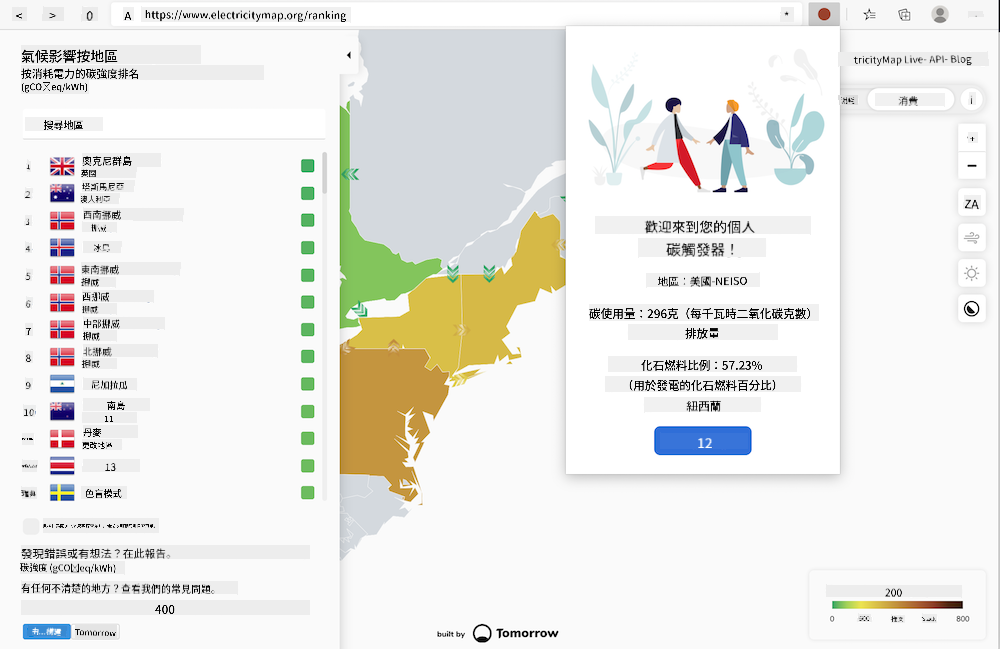
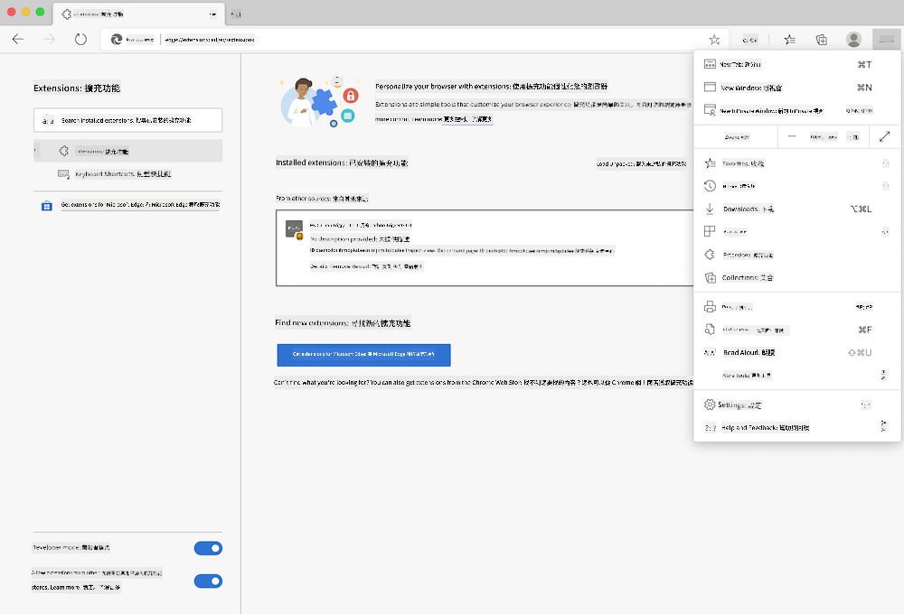

<!--
CO_OP_TRANSLATOR_METADATA:
{
  "original_hash": "3f5e6821e0febccfc5d05e7c944d9e3d",
  "translation_date": "2025-08-26T00:01:04+00:00",
  "source_file": "5-browser-extension/solution/translation/README.ja.md",
  "language_code": "mo"
}
-->
# 碳觸發瀏覽器擴充功能：完成的程式碼

使用 tmrow 的 C02 Signal API 來追蹤電力使用情況，並在瀏覽器中顯示您所在地區的電力使用量作為提醒。透過這個瀏覽器擴充功能，您可以根據這些資訊來判斷自己的行動。



## 開始使用

您需要先安裝 [npm](https://npmjs.com)。將這段程式碼下載到您電腦上的一個資料夾中。

安裝所有必要的套件。

```
npm install
```

使用 webpack 來建置擴充功能。

```
npm run build
```

若要安裝到 Edge，請在瀏覽器右上角的「三點」選單中找到「擴充功能」面板。從那裡選擇「Load Unpacked」，然後載入新的擴充功能。在提示中打開「dist」資料夾，擴充功能就會被載入。要使用此功能，您需要 CO2 Signal API 的 API 金鑰 ([在這裡透過電子郵件獲取](https://www.co2signal.com/) - 在該頁面的框中輸入您的電子郵件)，以及 [Electricity Map](https://www.electricitymap.org/map) 對應的 [您所在地區的代碼](http://api.electricitymap.org/v3/zones)（例如，在波士頓，使用 'US-NEISO'）。



在擴充介面中輸入 API 金鑰和地區代碼後，瀏覽器擴充工具列中的彩色圓點會隨之變化，反映您所在地區的能源使用情況，並提示您進行哪些活動是適合的。這個「圓點」系統的概念靈感來自於加州排放量的 [Energy Lollipop 擴充功能](https://energylollipop.com/)。

**免責聲明**：  
本文件已使用 AI 翻譯服務 [Co-op Translator](https://github.com/Azure/co-op-translator) 進行翻譯。雖然我們致力於提供準確的翻譯，但請注意，自動翻譯可能包含錯誤或不準確之處。原始文件的母語版本應被視為權威來源。對於關鍵信息，建議使用專業人工翻譯。我們對因使用此翻譯而引起的任何誤解或誤釋不承擔責任。