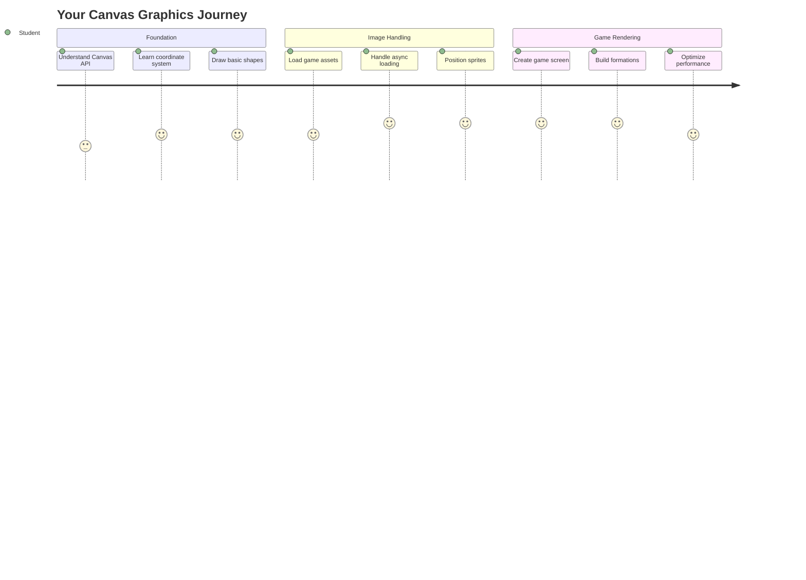
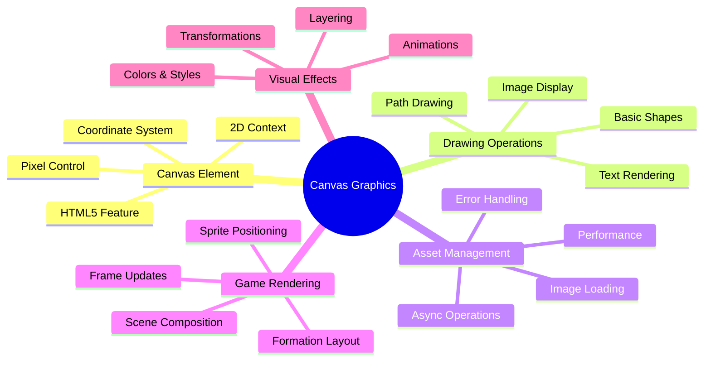
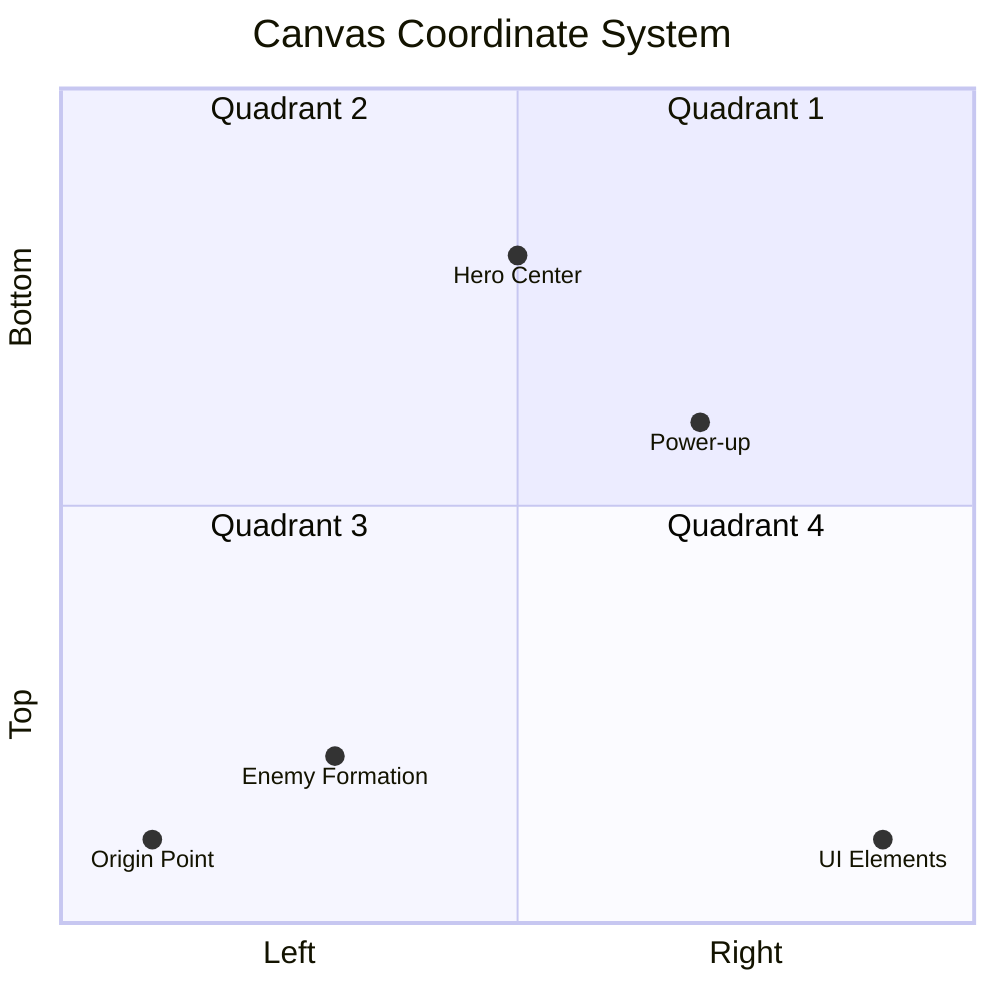
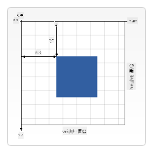
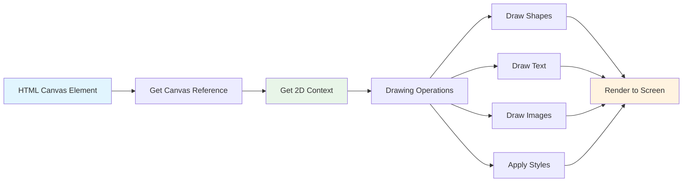
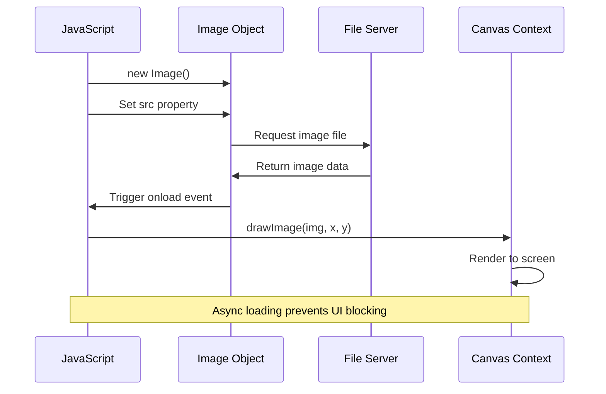
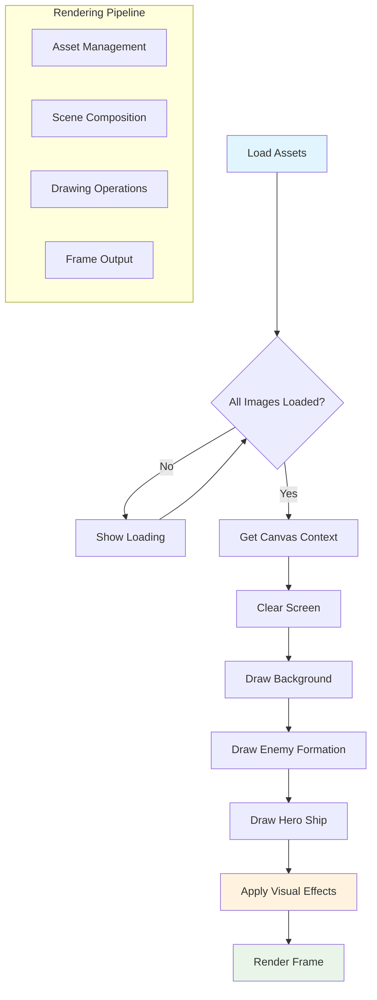
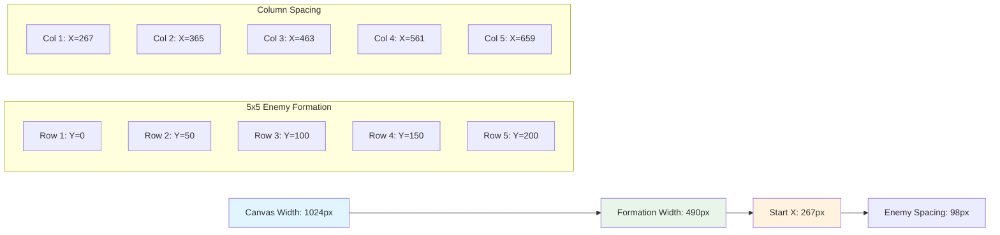
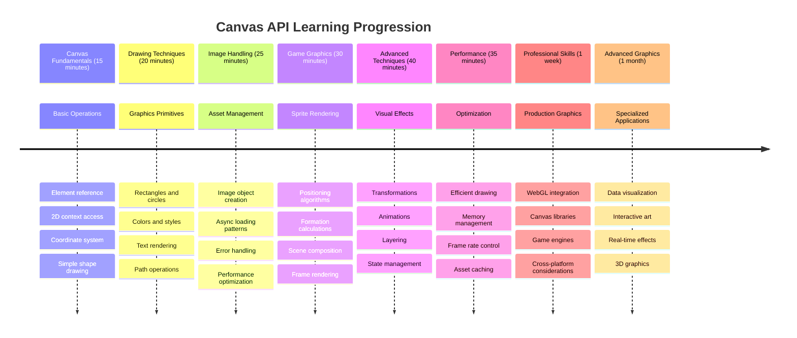

<!--
CO_OP_TRANSLATOR_METADATA:
{
  "original_hash": "7994743c5b21fdcceb36307916ef249a",
  "translation_date": "2025-11-03T23:52:25+00:00",
  "source_file": "6-space-game/2-drawing-to-canvas/README.md",
  "language_code": "mo"
}
-->
# 建立太空遊戲第二部分：將英雄和怪物繪製到 Canvas



Canvas API 是網頁開發中最強大的功能之一，能夠直接在瀏覽器中創建動態、互動式的圖形。在本課程中，我們將把空白的 HTML `<canvas>` 元素轉變成充滿英雄和怪物的遊戲世界。將 Canvas 想像成你的數位畫板，程式碼在這裡化為視覺效果。

我們將基於上一課所學的內容，深入探討視覺方面的內容。你將學習如何載入和顯示遊戲精靈（sprites），精確定位元素，並為你的太空遊戲創建視覺基礎。這將連接靜態網頁和動態互動體驗之間的橋樑。

在本課程結束時，你將擁有完整的遊戲場景，英雄飛船正確地定位，敵人陣型準備迎戰。你將了解現代遊戲如何在瀏覽器中渲染圖形，並獲得創建自己互動式視覺體驗的技能。讓我們一起探索 Canvas 圖形，讓你的太空遊戲栩栩如生！



## 課前測驗

[課前測驗](https://ff-quizzes.netlify.app/web/quiz/31)

## Canvas 是什麼？

那麼，究竟什麼是 `<canvas>` 元素呢？它是 HTML5 為在網頁瀏覽器中創建動態圖形和動畫的解決方案。與靜態的圖片或影片不同，Canvas 讓你可以對螢幕上出現的每個像素進行控制。這使得它成為遊戲、數據可視化和互動藝術的完美工具。可以將它想像成一個可編程的繪圖表面，JavaScript 就是你的畫筆。

預設情況下，Canvas 元素在頁面上看起來像是一個空白的透明矩形。但這正是它的潛力所在！當你使用 JavaScript 繪製形狀、載入圖片、創建動畫並讓元素響應使用者互動時，它的真正威力才會展現。這類似於 1960 年代貝爾實驗室的早期電腦圖形先驅們如何編程每個像素來創建第一批數位動畫。

✅ 閱讀 [更多關於 Canvas API 的內容](https://developer.mozilla.org/docs/Web/API/Canvas_API) 在 MDN。

以下是它通常的宣告方式，作為頁面 body 的一部分：

```html
<canvas id="myCanvas" width="200" height="100"></canvas>
```

**這段程式碼的作用：**
- **設置** `id` 屬性，以便你可以在 JavaScript 中引用這個特定的 Canvas 元素
- **定義** Canvas 的寬度（以像素為單位），以控制其水平大小
- **確定** Canvas 的高度（以像素為單位），以決定其垂直尺寸

## 繪製簡單幾何圖形

現在你已經了解了 Canvas 元素是什麼，讓我們來探索如何在上面繪圖！Canvas 使用的座標系統可能讓你想起數學課，但在電腦圖形中有一個重要的不同之處。

Canvas 使用笛卡爾座標系統，具有 x 軸（水平）和 y 軸（垂直）來定位你繪製的所有內容。但這裡有一個關鍵的不同：與數學課上的座標系統不同，原點 `(0,0)` 是從左上角開始的，x 值向右增加，y 值向下增加。這種方法可以追溯到早期電腦顯示器，電子束從上到下掃描，使左上角成為自然的起點。




> 圖片來源：[MDN](https://developer.mozilla.org/docs/Web/API/Canvas_API/Tutorial/Drawing_shapes)

要在 Canvas 元素上繪圖，你需要遵循三個步驟，這是所有 Canvas 圖形的基礎。一旦你多次完成這些步驟，它就會變得非常自然：



1. **從 DOM 中獲取 Canvas 元素的引用**（就像其他 HTML 元素一樣）
2. **獲取 2D 渲染上下文**——這提供了所有的繪圖方法
3. **開始繪圖！** 使用上下文的內建方法創建你的圖形

以下是程式碼的示例：

```javascript
// Step 1: Get the canvas element
const canvas = document.getElementById("myCanvas");

// Step 2: Get the 2D rendering context
const ctx = canvas.getContext("2d");

// Step 3: Set fill color and draw a rectangle
ctx.fillStyle = 'red';
ctx.fillRect(0, 0, 200, 200); // x, y, width, height
```

**逐步解析：**
- 我們 **獲取** Canvas 元素，使用其 ID 並將其存儲在變數中
- 我們 **獲取** 2D 渲染上下文——這是我們的繪圖工具包
- 我們 **告訴** Canvas 我們想用紅色填充，使用 `fillStyle` 屬性
- 我們 **繪製** 一個矩形，從左上角 (0,0) 開始，寬度和高度均為 200 像素

✅ Canvas API 主要專注於 2D 圖形，但你也可以在網站上繪製 3D 元素；為此，你可以使用 [WebGL API](https://developer.mozilla.org/docs/Web/API/WebGL_API)。

你可以使用 Canvas API 繪製各種內容，例如：

- **幾何形狀**，我們已展示如何繪製矩形，但還有更多可以繪製的內容。
- **文字**，你可以使用任何字體和顏色繪製文字。
- **圖片**，你可以基於圖片資源（例如 .jpg 或 .png）繪製圖片。

✅ 試試看！你已經知道如何繪製矩形，能否在頁面上繪製一個圓形？看看 CodePen 上一些有趣的 Canvas 繪圖。這裡有一個[特別令人印象深刻的例子](https://codepen.io/dissimulate/pen/KrAwx)。

### 🔄 **教學檢查**
**Canvas 基礎理解**：在進入圖片載入之前，確保你能：
- ✅ 解釋 Canvas 座標系統與數學座標系統的不同之處
- ✅ 理解 Canvas 繪圖操作的三步驟過程
- ✅ 確認 2D 渲染上下文提供了什麼功能
- ✅ 描述 `fillStyle` 和 `fillRect` 如何協同工作

**快速自測**：如何在位置 (100, 50) 繪製一個半徑為 25 的藍色圓形？
```javascript
ctx.fillStyle = 'blue';
ctx.beginPath();
ctx.arc(100, 50, 25, 0, 2 * Math.PI);
ctx.fill();
```

**你現在知道的 Canvas 繪圖方法：**
- **fillRect()**：繪製填充矩形
- **fillStyle**：設置顏色和圖案
- **beginPath()**：開始新的繪圖路徑
- **arc()**：創建圓形和曲線

## 載入並繪製圖片資源

繪製基本形狀對於入門很有幫助，但大多數遊戲需要真正的圖片！精靈（sprites）、背景和紋理是讓遊戲具有視覺吸引力的關鍵。在 Canvas 上載入並顯示圖片的方式與繪製幾何形狀不同，但一旦理解過程就很簡單。

我們需要創建一個 `Image` 對象，載入圖片檔案（這是非同步的，意味著它會在背景中進行），然後在圖片準備好後將其繪製到 Canvas 上。這種方法確保你的圖片能正確顯示，而不會在載入時阻塞應用程式。



### 基本圖片載入

```javascript
const img = new Image();
img.src = 'path/to/my/image.png';
img.onload = () => {
  // Image loaded and ready to be used
  console.log('Image loaded successfully!');
};
```

**這段程式碼的作用：**
- 我們 **創建** 一個全新的 Image 對象來保存精靈或紋理
- 我們 **指定** 要載入的圖片檔案，通過設置來源路徑
- 我們 **監聽** 載入事件，以便確切知道圖片何時可以使用

### 更好的圖片載入方式

以下是一種更健全的圖片載入方式，專業開發者常用。我們將圖片載入包裝在基於 Promise 的函數中——這種方法在 ES6 標準化 JavaScript Promise 後變得流行，使你的程式碼更有條理，並能優雅地處理錯誤：

```javascript
function loadAsset(path) {
  return new Promise((resolve, reject) => {
    const img = new Image();
    img.src = path;
    img.onload = () => {
      resolve(img);
    };
    img.onerror = () => {
      reject(new Error(`Failed to load image: ${path}`));
    };
  });
}

// Modern usage with async/await
async function initializeGame() {
  try {
    const heroImg = await loadAsset('hero.png');
    const monsterImg = await loadAsset('monster.png');
    // Images are now ready to use
  } catch (error) {
    console.error('Failed to load game assets:', error);
  }
}
```

**我們在這裡做了什麼：**
- **包裝**所有圖片載入邏輯到 Promise 中，以便更好地處理
- **添加**錯誤處理，實際告訴我們何時出現問題
- **使用**現代的 async/await 語法，因為它更易於閱讀
- **包含** try/catch 塊，以優雅地處理任何載入問題

一旦你的圖片載入完成，將它們繪製到 Canvas 上其實非常簡單：

```javascript
async function renderGameScreen() {
  try {
    // Load game assets
    const heroImg = await loadAsset('hero.png');
    const monsterImg = await loadAsset('monster.png');

    // Get canvas and context
    const canvas = document.getElementById("myCanvas");
    const ctx = canvas.getContext("2d");

    // Draw images to specific positions
    ctx.drawImage(heroImg, canvas.width / 2, canvas.height / 2);
    ctx.drawImage(monsterImg, 0, 0);
  } catch (error) {
    console.error('Failed to render game screen:', error);
  }
}
```

**逐步解析：**
- 我們 **非同步載入**英雄和怪物圖片
- 我們 **獲取** Canvas 元素並獲取所需的 2D 渲染上下文
- 我們 **定位**英雄圖片到中心位置，使用簡單的座標計算
- 我們 **放置**怪物圖片到左上角，開始敵人陣型
- 我們 **捕捉**載入或渲染過程中可能發生的任何錯誤



## 現在是開始建立你的遊戲的時候了

現在我們將把所有內容結合起來，創建你的太空遊戲的視覺基礎。你已經對 Canvas 基礎和圖片載入技術有了扎實的理解，因此這部分的實作將指導你建立一個完整的遊戲畫面，並正確地定位精靈。

### 建立什麼

你將建立一個包含 Canvas 元素的網頁。它應該渲染一個 `1024*768` 的黑色螢幕。我們已經為你提供了兩張圖片：

- 英雄飛船

   

- 5×5 怪物

   

### 建議的開發步驟

找到在 `your-work` 子資料夾中為你準備的起始檔案。你的專案結構應包含：

```bash
your-work/
├── assets/
│   ├── enemyShip.png
│   └── player.png
├── index.html
├── app.js
└── package.json
```

**你正在使用的內容：**
- **遊戲精靈**存放在 `assets/` 資料夾中，保持一切井然有序
- **主要 HTML 檔案**設置 Canvas 元素並準備好一切
- **JavaScript 檔案**，你將在其中編寫所有遊戲渲染的程式碼
- **package.json**，設置開發伺服器以便本地測試

在 Visual Studio Code 中打開此資料夾開始開發。你需要一個本地開發環境，安裝了 Visual Studio Code、NPM 和 Node.js。如果你的電腦尚未設置 `npm`，[這裡是安裝方法](https://www.npmjs.com/get-npm)。

通過導航到 `your-work` 資料夾啟動你的開發伺服器：

```bash
cd your-work
npm start
```

**這個命令的作用：**
- **啟動**本地伺服器，位於 `http://localhost:5000`，以便測試你的遊戲
- **提供**所有檔案，確保瀏覽器能正確載入它們
- **監控**檔案的變更，讓你能順利開發
- **提供**專業的開發環境以測試所有內容

> 💡 **注意**：你的瀏覽器初始會顯示空白頁面——這是正常的！隨著你添加程式碼，刷新瀏覽器即可看到變更。這種迭代開發方法類似於 NASA 建造阿波羅導航電腦的方式——在整合到更大的系統之前測試每個元件。

### 添加程式碼

在 `your-work/app.js` 中添加所需程式碼以完成以下任務：

1. **繪製黑色背景的 Canvas**
   > 💡 **方法**：在 `/app.js` 中找到 TODO，添加兩行程式碼。設置 `ctx.fillStyle` 為黑色，然後使用 `ctx.fillRect()` 從 (0,0) 開始，使用 Canvas 的尺寸。簡單！

2. **載入遊戲紋理**
   > 💡 **方法**：使用 `await loadAsset()` 載入玩家和敵人圖片。將它們存儲在變數中，以便稍後使用。記住——它們不會顯示，直到你實際繪製它們！

3. **在中心底部位置繪製英雄飛船**
   > 💡 **方法**：使用 `ctx.drawImage()` 定位你的英雄。對於 x 座標，嘗試使用 `canvas.width / 2 - 45` 來居中，對於 y 座標使用 `canvas.height - canvas.height / 4` 將其放置在底部區域。

4. **繪製 5×5 的敵人飛船陣型**
   > 💡 **方法**：找到 `createEnemies` 函數並設置嵌套迴圈。你需要進行一些間距和定位的計算，但不用擔心——我會向你展示具體方法！

首先，建立常數以正確佈局敵人陣型：

```javascript
const ENEMY_TOTAL = 5;
const ENEMY_SPACING = 98;
const FORMATION_WIDTH = ENEMY_TOTAL * ENEMY_SPACING;
const START_X = (canvas.width - FORMATION_WIDTH) / 2;
const STOP_X = START_X + FORMATION_WIDTH;
```

**這些常數的作用：**
- 我們 **設置** 每行和每列有 5 個敵人（漂亮的 5×5 網格）
- 我們 **定義** 每個敵人之間的間距，以免看起來太擁擠
- 我們 **計算** 整個陣型的寬度
- 我們 **確定** 開始和結束的位置，使陣型看起來居中



然後，創建嵌套迴圈以繪製敵人陣型：

```javascript
for (let x = START_X; x < STOP_X; x += ENEMY_SPACING) {
  for (let y = 0; y < 50 * 5; y += 50) {
    ctx.drawImage(enemyImg, x, y);
  }
}
```

**這個嵌套迴圈的作用：**
- 外層迴圈 **從左到右** 移動整個陣型
- 內層迴圈 **從上到下** 創建整齊的行
- 我們 **繪製** 每個敵人精靈到我們計算的精確 x,y 座標
- 一切都保持 **均勻間距**，看起來專業且有條理

### 🔄 **教學檢查**
**遊戲渲染掌握**：確認你對完整渲染系統的理解：
- ✅ 非同步圖片載入如何防止遊戲啟動時的 UI 阻塞？
- ✅ 為什麼我們使用常數計算敵人陣型位置，而不是硬編碼？
- ✅ 2D 渲染上下文在繪圖操作中扮演什麼角色？
- ✅ 嵌套迴圈如何創建有組織的精靈陣型？

**效能考量**：你的遊戲現在展示了：
- **高效的資源載入**：基於 Promise 的圖片管理
- **有組織的渲染**：結構化的繪圖操作
- **數學定位**：計算精靈的擺放位置
- **錯誤處理**：優雅的故障管理

**視覺程式設計概念**：你已學會：
- **座標系統**：將數學轉換為螢幕位置
- **精靈管理**：載入並顯示遊戲圖形
- **隊形演算法**：有組織的佈局數學模式
- **非同步操作**：使用現代 JavaScript 提供流暢的使用者體驗

## 結果

完成的結果應該看起來像這樣：


## 解決方案

請先嘗試自己解決，但如果卡住了，可以查看[解決方案](../../../../6-space-game/2-drawing-to-canvas/solution/app.js)

---

## GitHub Copilot Agent 挑戰 🚀

使用 Agent 模式完成以下挑戰：

**描述**：使用您學到的 Canvas API 技術，增強您的太空遊戲畫布，添加視覺效果和互動元素。

**提示**：建立一個名為 `enhanced-canvas.html` 的新檔案，畫布上顯示背景中動畫的星星、英雄飛船的脈動生命條，以及緩慢向下移動的敵方飛船。包含 JavaScript 程式碼，使用隨機位置和透明度繪製閃爍的星星，實現根據生命值變化顏色的生命條（綠色 > 黃色 > 紅色），並使敵方飛船以不同速度向下移動。

了解更多有關 [agent mode](https://code.visualstudio.com/blogs/2025/02/24/introducing-copilot-agent-mode) 的資訊。

## 🚀 挑戰

您已經學習了使用以 2D 為主的 Canvas API 進行繪圖；現在看看 [WebGL API](https://developer.mozilla.org/docs/Web/API/WebGL_API)，嘗試繪製一個 3D 物件。

## 課後測驗

[課後測驗](https://ff-quizzes.netlify.app/web/quiz/32)

## 回顧與自學

透過[閱讀相關內容](https://developer.mozilla.org/docs/Web/API/Canvas_API)了解更多有關 Canvas API 的知識。

### ⚡ **接下來的5分鐘可以做什麼**
- [ ] 打開瀏覽器控制台，使用 `document.createElement('canvas')` 建立一個畫布元素
- [ ] 嘗試使用畫布上下文中的 `fillRect()` 繪製矩形
- [ ] 使用 `fillStyle` 屬性嘗試不同的顏色
- [ ] 使用 `arc()` 方法繪製一個簡單的圓形

### 🎯 **接下來的一小時可以完成什麼**
- [ ] 完成課後測驗並理解畫布的基本原理
- [ ] 建立一個具有多種形狀和顏色的畫布繪圖應用程式
- [ ] 實現圖像載入和精靈渲染功能以用於您的遊戲
- [ ] 建立一個簡單的動畫，使物件在畫布上移動
- [ ] 練習畫布的縮放、旋轉和平移等變換技術

### 📅 **您的一週畫布學習計劃**
- [ ] 完成太空遊戲，並添加精美的圖形和精靈動畫
- [ ] 掌握進階畫布技術，例如漸層、圖案和合成
- [ ] 使用畫布建立互動式視覺化工具以呈現數據
- [ ] 學習畫布的優化技術以確保流暢的性能
- [ ] 建立一個具有多種工具的繪圖或繪畫應用程式
- [ ] 探索創意編程模式和使用畫布進行生成藝術

### 🌟 **您的一個月圖形掌握計劃**
- [ ] 使用 Canvas 2D 和 WebGL 建立複雜的視覺應用程式
- [ ] 學習圖形編程概念和著色器基礎
- [ ] 為開源圖形庫和視覺化工具做出貢獻
- [ ] 掌握圖形密集型應用程式的性能優化
- [ ] 建立有關畫布編程和計算機圖形的教育內容
- [ ] 成為幫助他人創建視覺體驗的圖形編程專家

## 🎯 您的畫布圖形掌握時間表



### 🛠️ 您的畫布圖形工具包摘要

完成本課程後，您現在擁有：
- **Canvas API 掌握**：完全理解2D圖形編程
- **座標數學**：精確的定位和佈局演算法
- **資產管理**：專業的圖像載入和錯誤處理
- **渲染管線**：場景組成的結構化方法
- **遊戲圖形**：精靈定位和隊形計算
- **非同步編程**：現代 JavaScript 模式以提供流暢性能
- **視覺編程**：將數學概念轉化為螢幕圖形

**實際應用**：您的 Canvas 技能直接適用於：
- **數據視覺化**：圖表、圖形和互動式儀表板
- **遊戲開發**：2D遊戲、模擬和互動式體驗
- **數字藝術**：創意編程和生成藝術項目
- **UI/UX設計**：自定義圖形和互動元素
- **教育軟體**：視覺學習工具和模擬
- **網頁應用程式**：動態圖形和即時視覺化

**獲得的專業技能**：您現在可以：
- **建立** 自定義圖形解決方案而無需外部庫
- **優化** 渲染性能以提供流暢的使用者體驗
- **調試** 使用瀏覽器開發工具解決複雜的視覺問題
- **設計** 使用數學原理構建可擴展的圖形系統
- **整合** Canvas 圖形與現代網頁應用程式框架

**您已掌握的 Canvas API 方法**：
- **元素管理**：getElementById, getContext
- **繪圖操作**：fillRect, drawImage, fillStyle
- **資產載入**：Image 物件, Promise 模式
- **數學定位**：座標計算, 隊形演算法

**下一步**：您已準備好添加動畫、使用者互動、碰撞檢測，或探索 WebGL 進行3D圖形！

🌟 **成就解鎖**：您已使用基本的 Canvas API 技術建立了一個完整的遊戲渲染系統！

## 作業

[玩轉 Canvas API](assignment.md)

---

**免責聲明**：  
本文件已使用 AI 翻譯服務 [Co-op Translator](https://github.com/Azure/co-op-translator) 進行翻譯。儘管我們致力於提供準確的翻譯，但請注意，自動翻譯可能包含錯誤或不準確之處。原始文件的母語版本應被視為權威來源。對於關鍵信息，建議使用專業人工翻譯。我們對因使用此翻譯而引起的任何誤解或誤釋不承擔責任。