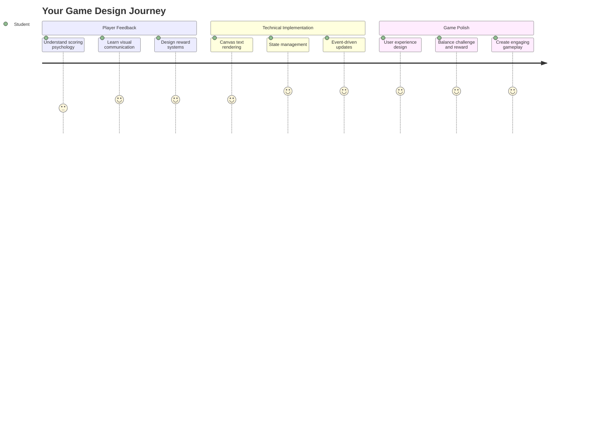
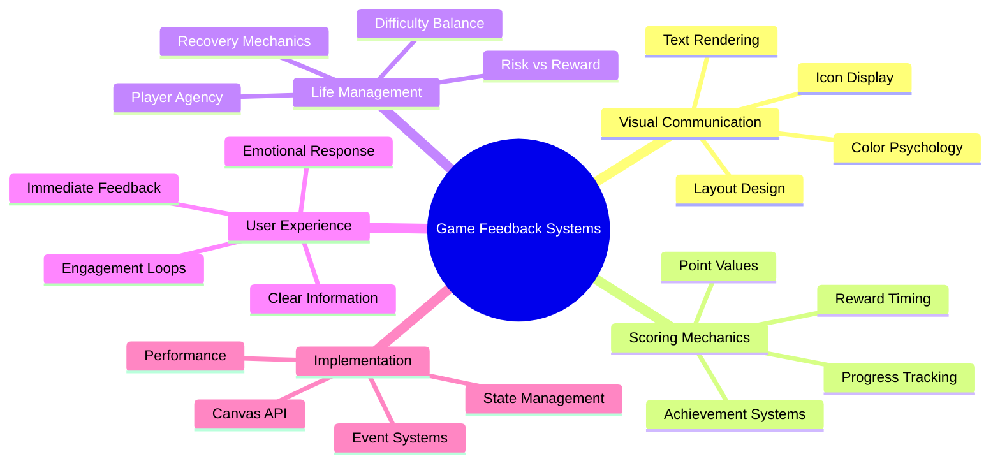
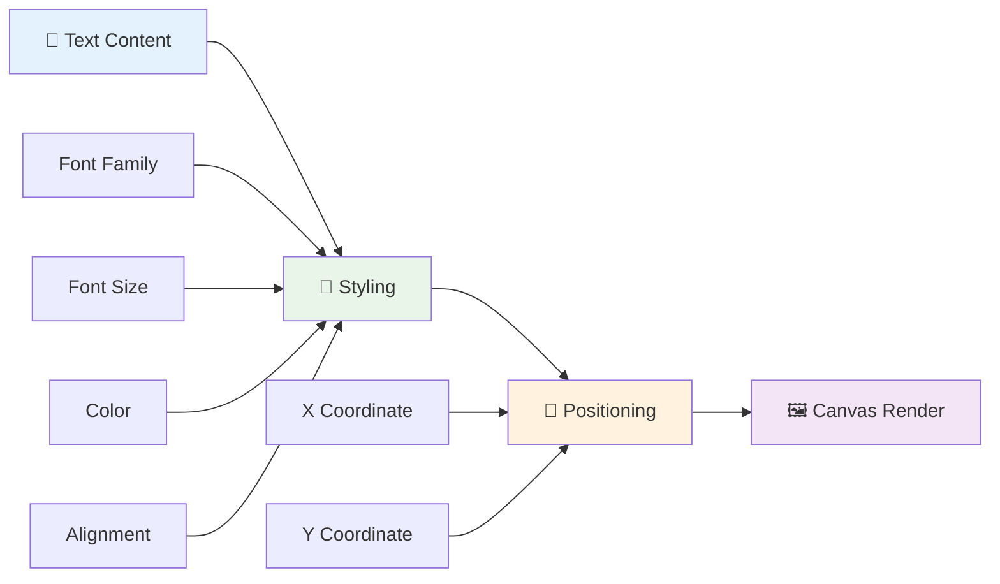
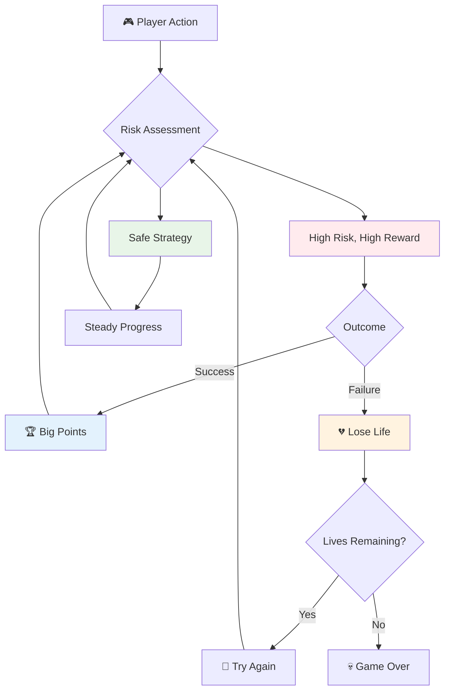
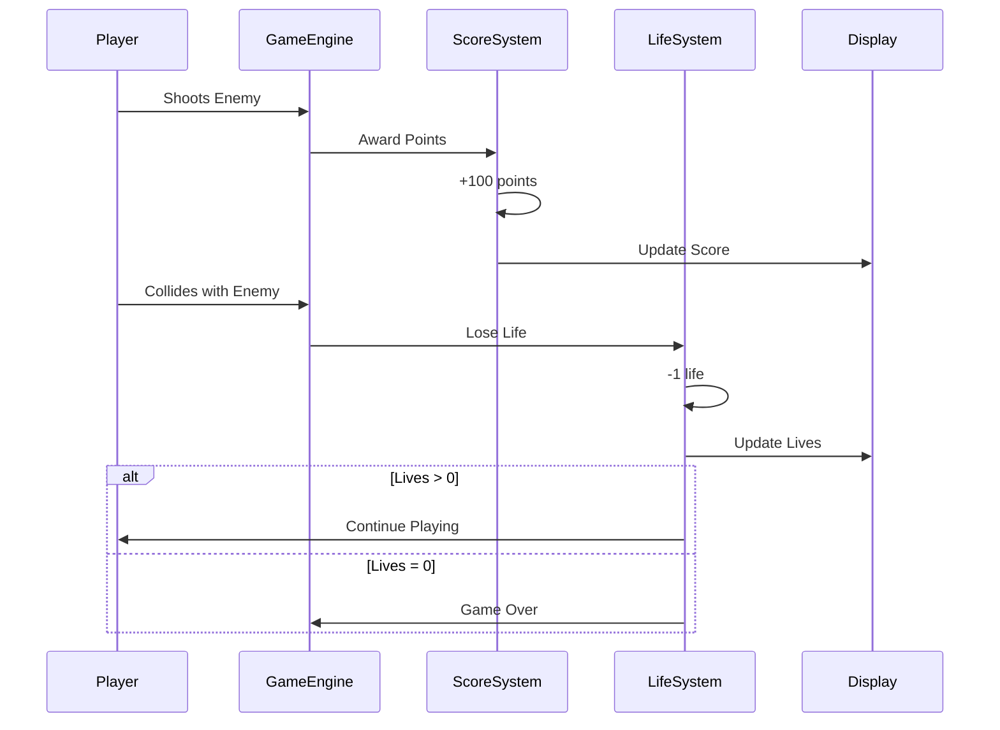
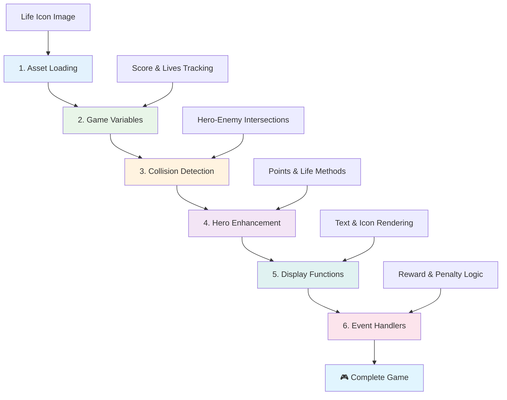
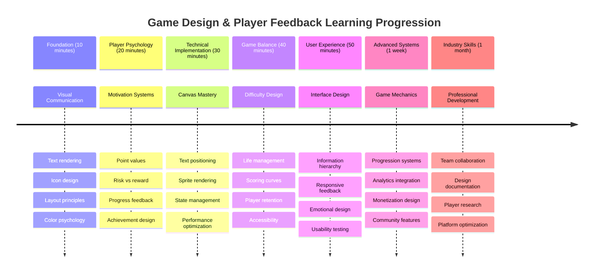

<!--
CO_OP_TRANSLATOR_METADATA:
{
  "original_hash": "2ed9145a16cf576faa2a973dff84d099",
  "translation_date": "2025-11-03T23:54:59+00:00",
  "source_file": "6-space-game/5-keeping-score/README.md",
  "language_code": "mo"
}
-->
# 建造太空遊戲第五部分：得分與生命



## 課前測驗

[課前測驗](https://ff-quizzes.netlify.app/web/quiz/37)

準備好讓你的太空遊戲更像一個真正的遊戲了嗎？讓我們加入得分系統和生命管理——這些核心機制使早期的街機遊戲如《太空侵略者》從簡單的演示變成了令人上癮的娛樂。這是讓你的遊戲真正可玩的一步。



## 在螢幕上繪製文字——你的遊戲之聲

為了顯示你的得分，我們需要學習如何在畫布上渲染文字。`fillText()` 方法是你的主要工具——這是經典街機遊戲用來顯示得分和狀態信息的相同技術。



你可以完全掌控文字的外觀：

```javascript
ctx.font = "30px Arial";
ctx.fillStyle = "red";
ctx.textAlign = "right";
ctx.fillText("show this on the screen", 0, 0);
```

✅ 深入了解 [在畫布上添加文字](https://developer.mozilla.org/docs/Web/API/Canvas_API/Tutorial/Drawing_text)——你可能會驚訝於自己能在字體和樣式上有多大的創意！

## 生命——不僅僅是一個數字

在遊戲設計中，「生命」代表玩家的容錯空間。這個概念可以追溯到彈珠機，玩家可以使用多個球進行遊戲。在早期的電子遊戲如《小行星》中，生命讓玩家有機會冒險並從錯誤中學習。



視覺表現非常重要——使用飛船圖標而不是僅僅顯示「生命：3」能立即產生視覺上的識別效果，就像早期街機機台使用圖像來跨越語言障礙進行溝通一樣。

## 建立你的遊戲獎勵系統

現在我們將實現核心的反饋系統，這些系統能讓玩家保持投入：



- **得分系統**：每摧毀一艘敵方飛船可獲得 100 分（整數更容易讓玩家心算）。得分顯示在左下角。
- **生命計數器**：你的英雄從三條生命開始——這是早期街機遊戲為了平衡挑戰與可玩性而設立的標準。每次與敵人碰撞會損失一條生命。我們將使用飛船圖標在右下角顯示剩餘生命 。

## 開始建造！

首先，設置你的工作空間。導航到 `your-work` 子文件夾中的文件。你應該能看到以下文件：

```bash
-| assets
  -| enemyShip.png
  -| player.png
  -| laserRed.png
-| index.html
-| app.js
-| package.json
```

要測試你的遊戲，請從 `your_work` 文件夾啟動開發伺服器：

```bash
cd your-work
npm start
```

這會在 `http://localhost:5000` 上運行一個本地伺服器。在瀏覽器中打開此地址以查看你的遊戲。使用方向鍵測試控制並嘗試射擊敵人以驗證一切是否正常運行。



### 開始編碼！

1. **獲取所需的視覺資源**。將 `solution/assets/` 文件夾中的 `life.png` 資源複製到你的 `your-work` 文件夾中。然後將 lifeImg 添加到你的 window.onload 函數中：

    ```javascript
    lifeImg = await loadTexture("assets/life.png");
    ```

1. 別忘了將 `lifeImg` 添加到你的資源列表中：

    ```javascript
    let heroImg,
    ...
    lifeImg,
    ...
    eventEmitter = new EventEmitter();
    ```
  
2. **設置你的遊戲變數**。添加一些代碼來追蹤你的總得分（從 0 開始）和剩餘生命（從 3 開始）。我們將在螢幕上顯示這些信息，讓玩家隨時了解自己的狀態。

3. **實現碰撞檢測**。擴展你的 `updateGameObjects()` 函數以檢測敵人與英雄碰撞的情況：

    ```javascript
    enemies.forEach(enemy => {
        const heroRect = hero.rectFromGameObject();
        if (intersectRect(heroRect, enemy.rectFromGameObject())) {
          eventEmitter.emit(Messages.COLLISION_ENEMY_HERO, { enemy });
        }
      })
    ```

4. **為你的英雄添加生命和得分追蹤功能**。 
   1. **初始化計數器**。在你的 `Hero` 類中的 `this.cooldown = 0` 下設置生命和得分：

        ```javascript
        this.life = 3;
        this.points = 0;
        ```

   1. **向玩家顯示這些值**。創建函數以在螢幕上繪製這些值：

        ```javascript
        function drawLife() {
          // TODO, 35, 27
          const START_POS = canvas.width - 180;
          for(let i=0; i < hero.life; i++ ) {
            ctx.drawImage(
              lifeImg, 
              START_POS + (45 * (i+1) ), 
              canvas.height - 37);
          }
        }
        
        function drawPoints() {
          ctx.font = "30px Arial";
          ctx.fillStyle = "red";
          ctx.textAlign = "left";
          drawText("Points: " + hero.points, 10, canvas.height-20);
        }
        
        function drawText(message, x, y) {
          ctx.fillText(message, x, y);
        }

        ```

   1. **將所有功能整合到你的遊戲循環中**。在 `updateGameObjects()` 之後，將這些函數添加到你的 window.onload 函數中：

        ```javascript
        drawPoints();
        drawLife();
        ```

### 🔄 **教學檢查**
**遊戲設計理解**：在實現後果之前，確保你理解：
- ✅ 視覺反饋如何向玩家傳達遊戲狀態
- ✅ 為什麼一致的 UI 元素位置能提高可用性
- ✅ 得分值和生命管理背後的心理學
- ✅ 畫布文字渲染與 HTML 文字的不同之處

**快速自我測試**：為什麼街機遊戲通常使用整數作為得分值？
*答案：整數更容易讓玩家心算，並創造令人滿意的心理回報*

**用戶體驗原則**：你現在正在應用：
- **視覺層次**：重要信息突出顯示
- **即時反饋**：玩家行動的即時更新
- **認知負荷**：簡單、清晰的信息呈現
- **情感設計**：創造與玩家聯繫的圖標和顏色

1. **實現遊戲後果和獎勵**。現在我們將添加使玩家行動有意義的反饋系統：

   1. **碰撞會損失生命**。每次你的英雄撞上敵人，你都應該損失一條生命。
   
      將此方法添加到你的 `Hero` 類中：

        ```javascript
        decrementLife() {
          this.life--;
          if (this.life === 0) {
            this.dead = true;
          }
        }
        ```

   2. **射擊敵人可獲得得分**。每次成功擊中可獲得 100 分，為準確射擊提供即時正面反饋。

      擴展你的 Hero 類，添加此增量方法：
    
        ```javascript
          incrementPoints() {
            this.points += 100;
          }
        ```

        現在將這些函數連接到你的碰撞事件中：

        ```javascript
        eventEmitter.on(Messages.COLLISION_ENEMY_LASER, (_, { first, second }) => {
           first.dead = true;
           second.dead = true;
           hero.incrementPoints();
        })

        eventEmitter.on(Messages.COLLISION_ENEMY_HERO, (_, { enemy }) => {
           enemy.dead = true;
           hero.decrementLife();
        });
        ```

✅ 對使用 JavaScript 和 Canvas 製作的其他遊戲感到好奇嗎？探索一下——你可能會驚訝於能實現的效果！

在實現這些功能後，測試你的遊戲以查看完整的反饋系統是否正常運行。你應該能在右下角看到生命圖標，在左下角看到得分，並觀察碰撞如何減少生命，而成功射擊如何增加得分。

你的遊戲現在擁有了早期街機遊戲的基本機制——明確的目標、即時反饋，以及玩家行動的有意義後果。

### 🔄 **教學檢查**
**完整的遊戲設計系統**：驗證你對玩家反饋系統的掌握：
- ✅ 得分機制如何創造玩家的動機和參與感？
- ✅ 為什麼視覺一致性對於用戶界面設計很重要？
- ✅ 生命系統如何平衡挑戰與玩家保留率？
- ✅ 即時反饋在創造令人滿意的遊戲體驗中扮演什麼角色？

**系統整合**：你的反饋系統展示了：
- **用戶體驗設計**：清晰的視覺溝通和信息層次
- **事件驅動架構**：對玩家行動的即時更新
- **狀態管理**：有效追蹤和顯示動態遊戲數據
- **畫布掌握**：文字渲染和精確的圖像定位
- **遊戲心理學**：理解玩家的動機和參與感

**專業模式**：你已經實現了：
- **MVC 架構**：分離遊戲邏輯、數據和呈現
- **觀察者模式**：事件驅動的遊戲狀態更新
- **組件設計**：可重用的渲染和邏輯函數
- **性能優化**：高效的遊戲循環渲染

### ⚡ **接下來的五分鐘你可以做什麼**
- [ ] 嘗試不同的字體大小和顏色來顯示得分
- [ ] 嘗試更改得分值，看看如何影響遊戲感受
- [ ] 添加 console.log 語句來追蹤得分和生命的變化
- [ ] 測試邊界情況，例如生命耗盡或達到高分

### 🎯 **這一小時你可以完成什麼**
- [ ] 完成課後測驗並理解遊戲設計心理學
- [ ] 為得分和失去生命添加音效
- [ ] 使用 localStorage 實現高分系統
- [ ] 為不同的敵人類型設置不同的得分值
- [ ] 添加視覺效果，例如失去生命時的螢幕震動

### 📅 **你的週長遊戲設計旅程**
- [ ] 完成完整的太空遊戲，並完善反饋系統
- [ ] 實現高級得分機制，例如連擊加成
- [ ] 添加成就和可解鎖內容
- [ ] 創建難度進程和平衡系統
- [ ] 設計菜單和遊戲結束界面的用戶界面
- [ ] 研究其他遊戲以理解參與機制

### 🌟 **你的月長遊戲開發精通**
- [ ] 建造具有複雜進程系統的完整遊戲
- [ ] 學習遊戲分析和玩家行為測量
- [ ] 參與開源遊戲開發項目
- [ ] 掌握高級遊戲設計模式和盈利策略
- [ ] 創建有關遊戲設計和用戶體驗的教育內容
- [ ] 建立展示遊戲設計和開發技能的作品集

## 🎯 你的遊戲設計精通時間表



### 🛠️ 你的遊戲設計工具包摘要

完成本課程後，你已掌握：
- **玩家心理學**：理解動機、風險/回報和參與循環
- **視覺溝通**：使用文字、圖標和佈局進行有效的 UI 設計
- **反饋系統**：對玩家行動和遊戲事件的即時反應
- **狀態管理**：高效追蹤和顯示動態遊戲數據
- **畫布文字渲染**：專業的文字顯示及樣式和定位
- **事件整合**：將用戶行動與有意義的遊戲後果相連
- **遊戲平衡**：設計難度曲線和玩家進程系統

**現實應用**：你的遊戲設計技能直接適用於：
- **用戶界面設計**：創造吸引人且直觀的界面
- **產品開發**：理解用戶動機和反饋循環
- **教育技術**：遊戲化和學習參與系統
- **數據可視化**：使複雜信息易於理解且吸引人
- **移動應用開發**：保留機制和用戶體驗設計
- **營銷技術**：理解用戶行為和轉化優化

**獲得的專業技能**：你現在可以：
- **設計**能激勵和吸引用戶的用戶體驗
- **實現**有效引導用戶行為的反饋系統
- **平衡**互動系統中的挑戰和可及性
- **創造**適用於不同用戶群體的視覺溝通
- **分析**用戶行為並改進設計

**掌握的遊戲開發概念**：
- **玩家動機**：理解驅動參與和保留的因素
- **視覺設計**：創造清晰、有吸引力且功能性的界面
- **系統整合**：連接多個遊戲系統以提供一致的體驗
- **性能優化**：高效的渲染和狀態管理
- **可及性**：為不同技能水平和玩家需求設計

**下一步**：你已準備好探索高級遊戲設計模式、實現分析系統或研究遊戲盈利和玩家保留策略！

🌟 **成就解鎖**：你已使用專業遊戲設計原則建造了一個完整的玩家反饋系統！

---

## GitHub Copilot Agent 挑戰 🚀

使用 Agent 模式完成以下挑戰：

**描述：** 增強太空遊戲的得分系統，實現高分功能並加入持久存儲和額外得分機制。

**提示：** 創建一個高分系統，將玩家的最高得分保存到 localStorage。為連續擊殺敵人（連擊系統）添加額外得分，並為不同的敵人類型設置不同的得分值。當玩家達到新的高分時，顯示視覺指示器，並在遊戲螢幕上顯示當前的高分。

## 🚀 挑戰

你現在擁有一個具有得分和生命功能的完整遊戲。思考還有哪些額外功能可以提升玩家體驗。

## 課後測驗

[課後測驗](https://ff-quizzes.netlify.app/web/quiz/38)

## 回顧與自學

想要探索更多嗎？研究不同的遊戲得分和生命系統方法。有一些令人驚嘆的遊戲引擎，例如 [PlayFab](https://playfab.com)，可以處理得分、排行榜和玩家進程。整合這樣的工具如何能讓你的遊戲更上一層樓？

## 作業

[建造一個得分遊戲](assignment.md)

---

**免責聲明**：  
本文件已使用 AI 翻譯服務 [Co-op Translator](https://github.com/Azure/co-op-translator) 進行翻譯。儘管我們致力於提供準確的翻譯，請注意自動翻譯可能包含錯誤或不準確之處。原始文件的母語版本應被視為權威來源。對於關鍵信息，建議使用專業人工翻譯。我們對因使用此翻譯而引起的任何誤解或誤釋不承擔責任。