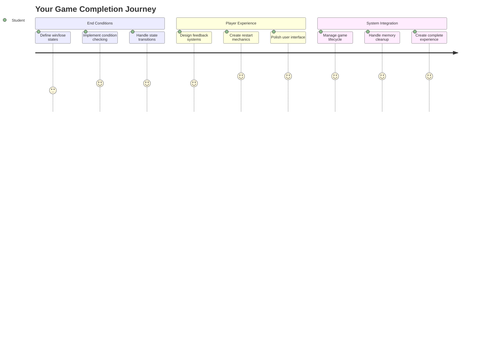
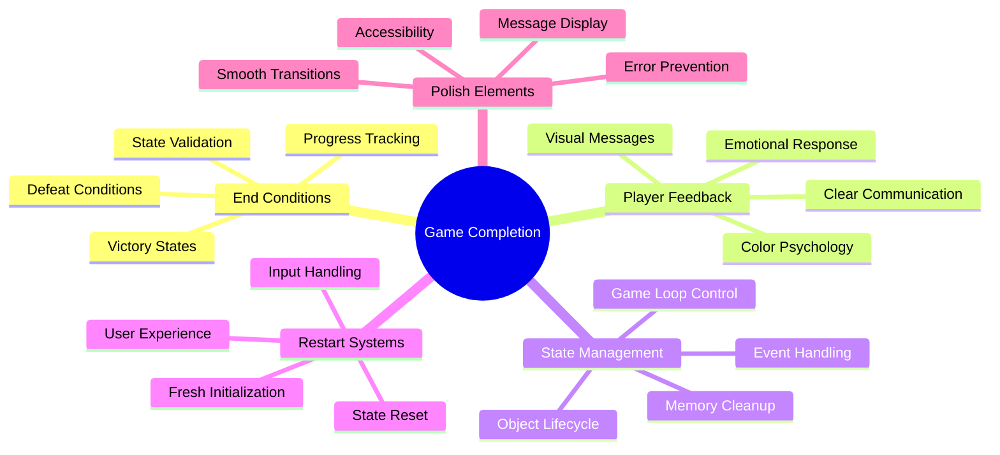
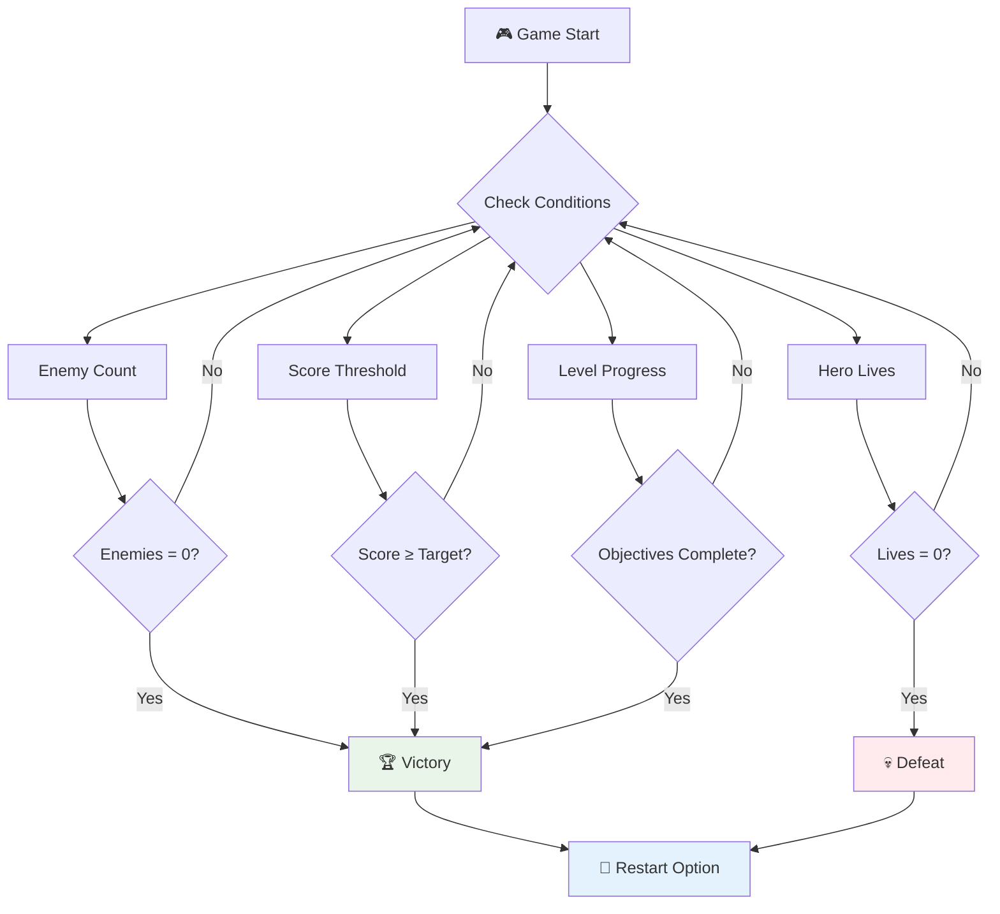
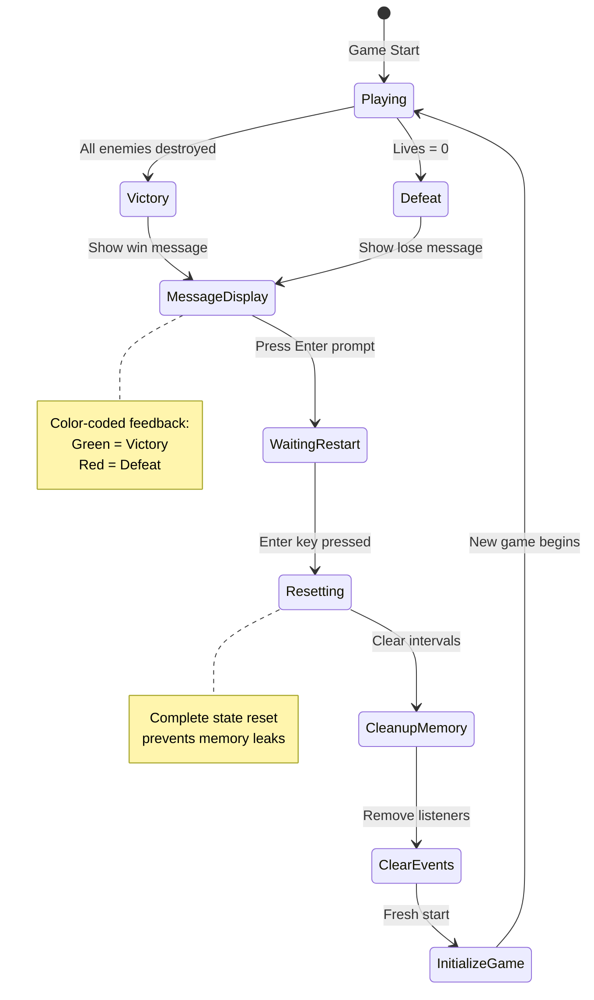
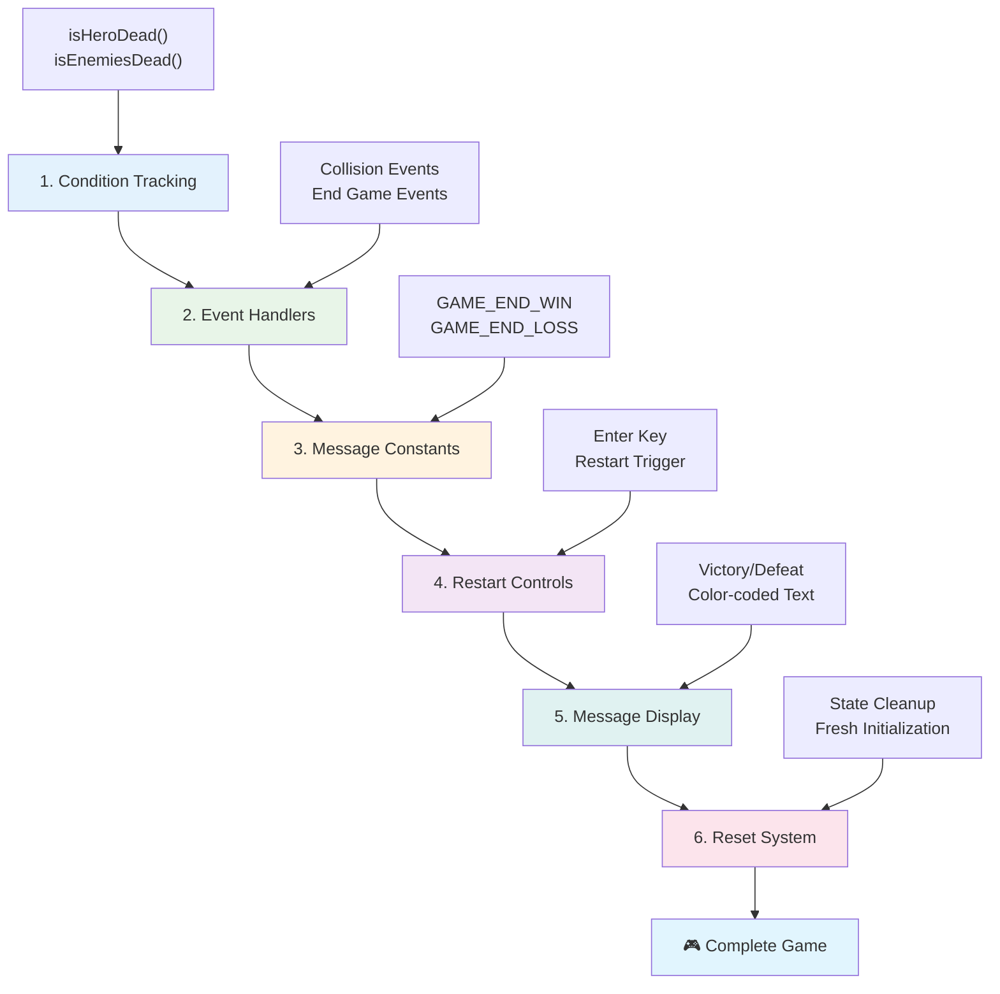
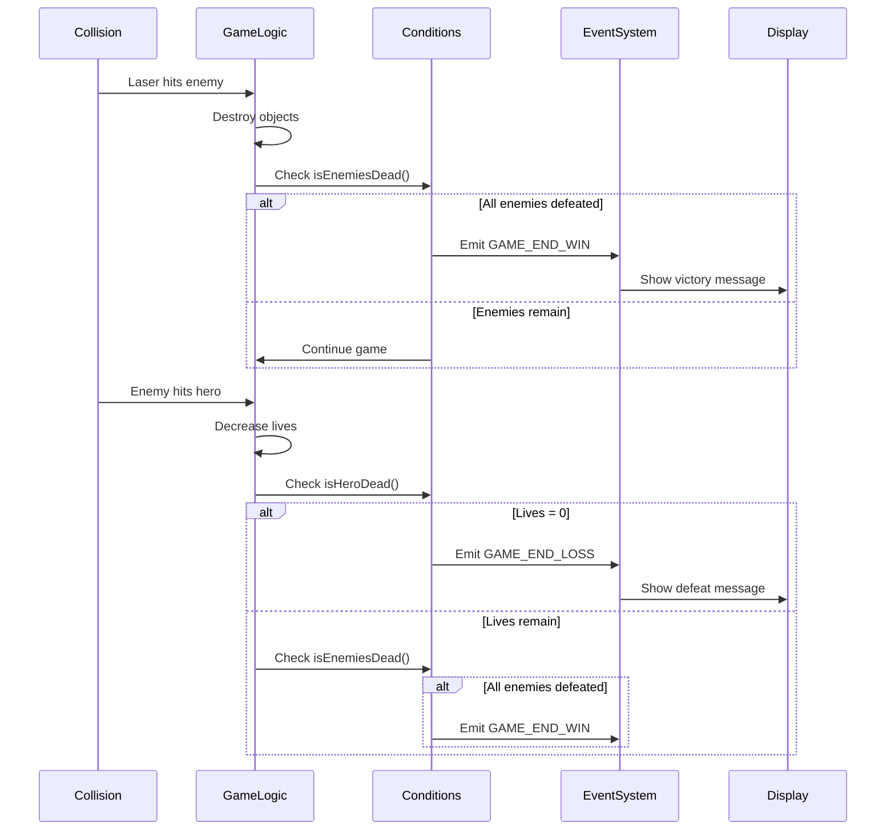
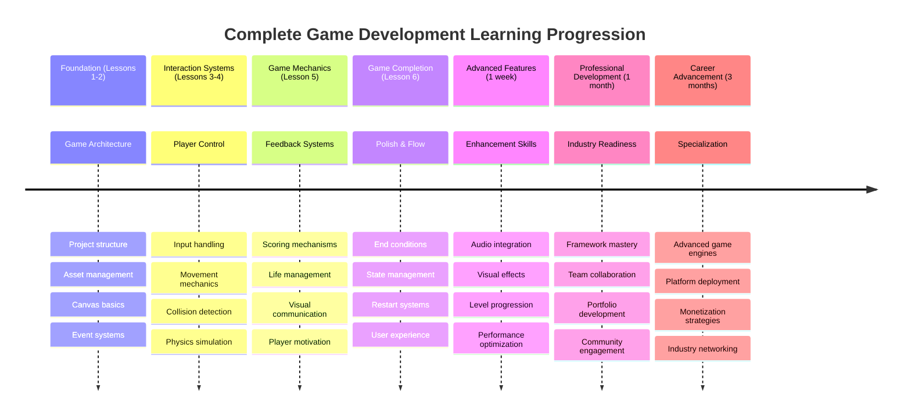

<!--
CO_OP_TRANSLATOR_METADATA:
{
  "original_hash": "a4b78043f4d64bf3ee24e0689b8b391d",
  "translation_date": "2025-11-03T23:53:02+00:00",
  "source_file": "6-space-game/6-end-condition/README.md",
  "language_code": "mo"
}
-->
# 建造太空遊戲第六部分：結束與重新開始



每個偉大的遊戲都需要明確的結束條件和流暢的重新開始機制。你已經打造了一款令人印象深刻的太空遊戲，擁有移動、戰鬥和得分功能——現在是時候加入最後的元素，讓它感覺更加完整。

目前你的遊戲可以無限運行，就像 NASA 在 1977 年發射的旅行者探測器一樣，幾十年後仍在太空中旅行。雖然這對於太空探索來說是可以接受的，但遊戲需要明確的結束點才能創造令人滿意的體驗。

今天，我們將實現適當的勝負條件和重新開始系統。在本課程結束時，你將擁有一款精緻的遊戲，玩家可以完成並重玩，就像那些定義遊戲媒介的經典街機遊戲一樣。



## 課前測驗

[課前測驗](https://ff-quizzes.netlify.app/web/quiz/39)

## 理解遊戲結束條件

你的遊戲應該在什麼時候結束？這個基本問題自早期街機時代以來就影響了遊戲設計。吃豆人會在你被鬼抓住或清除所有豆子時結束，而太空侵略者則在外星人到達底部或你摧毀所有外星人時結束。

作為遊戲創作者，你需要定義勝利和失敗的條件。對於我們的太空遊戲，以下是一些經過驗證的方式，可以創造出引人入勝的遊戲體驗：



- **摧毀 `N` 艘敵方飛船**：如果你將遊戲分成不同的關卡，通常需要摧毀 `N` 艘敵方飛船才能完成一個關卡。
- **你的飛船被摧毀**：有些遊戲會在你的飛船被摧毀時結束。另一種常見的方式是引入生命的概念。每次你的飛船被摧毀時會扣除一條生命，當所有生命耗盡時，你就輸了。
- **收集 `N` 分**：另一種常見的結束條件是收集一定的分數。如何獲得分數取決於你，但通常會為各種活動分配分數，比如摧毀敵方飛船或收集敵方飛船被摧毀後掉落的物品。
- **完成一個關卡**：這可能涉及多種條件，例如摧毀 `X` 艘敵方飛船、收集 `Y` 分數，或者收集特定物品。

## 實現遊戲重新開始功能

好的遊戲通過流暢的重新開始機制鼓勵玩家反覆遊玩。當玩家完成遊戲（或遭遇失敗）時，他們通常希望立即再次嘗試——無論是為了打破自己的得分記錄還是提高表現。



俄羅斯方塊完美地展示了這一點：當你的方塊堆到頂部時，你可以立即開始新遊戲，而不需要導航複雜的菜單。我們將構建一個類似的重新開始系統，乾淨地重置遊戲狀態，讓玩家迅速回到遊戲中。

✅ **反思**：想想你玩過的遊戲。它們在什麼條件下結束？如何提示你重新開始？什麼樣的重新開始體驗感覺流暢而非令人沮喪？

## 你將構建的內容

你將實現最終的功能，將你的項目轉變為完整的遊戲體驗。這些元素使精緻的遊戲與基本的原型區分開來。

**今天我們要添加的內容：**

1. **勝利條件**：摧毀所有敵人並獲得應有的慶祝（你值得擁有！）
2. **失敗條件**：生命耗盡並面對失敗畫面
3. **重新開始機制**：按下 Enter 鍵立即重新開始——因為一局永遠不夠
4. **狀態管理**：每次都清空狀態——不會有上局遊戲留下的敵人或奇怪的故障

## 開始準備

讓我們準備你的開發環境。你應該已經準備好之前課程中的所有太空遊戲文件。

**你的項目應該看起來像這樣：**

```bash
-| assets
  -| enemyShip.png
  -| player.png
  -| laserRed.png
  -| life.png
-| index.html
-| app.js
-| package.json
```

**啟動你的開發伺服器：**

```bash
cd your-work
npm start
```

**這個命令：**
- 在 `http://localhost:5000` 上運行本地伺服器
- 正確地提供你的文件
- 當你進行更改時自動刷新

在瀏覽器中打開 `http://localhost:5000` 並確認你的遊戲正在運行。你應該能夠移動、射擊並與敵人互動。一旦確認，我們就可以進行實現了。

> 💡 **專業提示**：為了避免在 Visual Studio Code 中出現警告，請在文件的頂部聲明 `gameLoopId` 為 `let gameLoopId;`，而不是在 `window.onload` 函數內聲明。這符合現代 JavaScript 變數聲明的最佳實踐。



## 實現步驟

### 步驟 1：創建結束條件追蹤函數

我們需要函數來監控遊戲應該何時結束。就像國際空間站上的傳感器不斷監控關鍵系統一樣，這些函數將持續檢查遊戲狀態。

```javascript
function isHeroDead() {
  return hero.life <= 0;
}

function isEnemiesDead() {
  const enemies = gameObjects.filter((go) => go.type === "Enemy" && !go.dead);
  return enemies.length === 0;
}
```

**以下是底層的運作方式：**
- **檢查**我們的英雄是否失去所有生命（糟糕！）
- **計算**還有多少敵人活著並且活躍
- **返回**當戰場上沒有敵人時的 `true`
- **使用**簡單的 true/false 邏輯保持直觀
- **篩選**所有遊戲物件以找到倖存者

### 步驟 2：更新事件處理器以支持結束條件

現在我們將把這些條件檢查與遊戲的事件系統連接起來。每次發生碰撞時，遊戲都會評估是否觸發結束條件。這為關鍵遊戲事件創造了即時反饋。



```javascript
eventEmitter.on(Messages.COLLISION_ENEMY_LASER, (_, { first, second }) => {
    first.dead = true;
    second.dead = true;
    hero.incrementPoints();

    if (isEnemiesDead()) {
      eventEmitter.emit(Messages.GAME_END_WIN);
    }
});

eventEmitter.on(Messages.COLLISION_ENEMY_HERO, (_, { enemy }) => {
    enemy.dead = true;
    hero.decrementLife();
    if (isHeroDead())  {
      eventEmitter.emit(Messages.GAME_END_LOSS);
      return; // loss before victory
    }
    if (isEnemiesDead()) {
      eventEmitter.emit(Messages.GAME_END_WIN);
    }
});

eventEmitter.on(Messages.GAME_END_WIN, () => {
    endGame(true);
});
  
eventEmitter.on(Messages.GAME_END_LOSS, () => {
  endGame(false);
});
```

**這裡發生了什麼：**
- **激光擊中敵人**：兩者都消失，你獲得分數，我們檢查你是否獲勝
- **敵人擊中你**：你失去一條生命，我們檢查你是否還活著
- **智能排序**：我們先檢查失敗（沒人想要同時贏和輸！）
- **即時反應**：一旦發生重要事件，遊戲就會知道

### 步驟 3：添加新的消息常量

你需要向 `Messages` 常量對象添加新的消息類型。這些常量有助於保持一致性並防止事件系統中的拼寫錯誤。

```javascript
GAME_END_LOSS: "GAME_END_LOSS",
GAME_END_WIN: "GAME_END_WIN",
```

**在上面，我們：**
- **添加**了遊戲結束事件的常量以保持一致性
- **使用**描述性名稱清楚地指示事件目的
- **遵循**現有的消息類型命名規範

### 步驟 4：實現重新開始控制

現在你將添加鍵盤控制，允許玩家重新開始遊戲。Enter 鍵是一個自然的選擇，因為它通常與確認操作和開始新遊戲相關聯。

**將 Enter 鍵檢測添加到現有的 keydown 事件監聽器：**

```javascript
else if(evt.key === "Enter") {
   eventEmitter.emit(Messages.KEY_EVENT_ENTER);
}
```

**添加新的消息常量：**

```javascript
KEY_EVENT_ENTER: "KEY_EVENT_ENTER",
```

**你需要知道的：**
- **擴展**現有的鍵盤事件處理系統
- **使用** Enter 鍵作為重新開始的觸發器，提供直觀的用戶體驗
- **發送**自定義事件，遊戲的其他部分可以監聽
- **保持**與其他鍵盤控制相同的模式

### 步驟 5：創建消息顯示系統

你的遊戲需要清楚地向玩家傳達結果。我們將創建一個消息系統，使用彩色文字顯示勝利和失敗狀態，類似於早期電腦系統的終端界面，其中綠色表示成功，紅色表示錯誤。

**創建 `displayMessage()` 函數：**

```javascript
function displayMessage(message, color = "red") {
  ctx.font = "30px Arial";
  ctx.fillStyle = color;
  ctx.textAlign = "center";
  ctx.fillText(message, canvas.width / 2, canvas.height / 2);
}
```

**逐步解析，以下是發生的事情：**
- **設置**字體大小和字體家族以確保文字清晰可讀
- **應用**顏色參數，默認為紅色以顯示警告
- **將文字**水平和垂直居中顯示在畫布上
- **使用**現代 JavaScript 的默認參數提供靈活的顏色選項
- **利用**畫布 2D 上下文直接渲染文字

**創建 `endGame()` 函數：**

```javascript
function endGame(win) {
  clearInterval(gameLoopId);

  // Set a delay to ensure any pending renders complete
  setTimeout(() => {
    ctx.clearRect(0, 0, canvas.width, canvas.height);
    ctx.fillStyle = "black";
    ctx.fillRect(0, 0, canvas.width, canvas.height);
    if (win) {
      displayMessage(
        "Victory!!! Pew Pew... - Press [Enter] to start a new game Captain Pew Pew",
        "green"
      );
    } else {
      displayMessage(
        "You died !!! Press [Enter] to start a new game Captain Pew Pew"
      );
    }
  }, 200)  
}
```

**此函數的作用：**
- **凍結**所有事物——不再有移動的飛船或激光
- **稍作停頓**（200 毫秒）以完成最後一幀的繪製
- **清空**屏幕並將其塗黑以營造戲劇效果
- **顯示**不同的消息給勝利者和失敗者
- **用顏色區分**消息——綠色代表好消息，紅色代表...嗯，不太好的消息
- **告訴**玩家如何重新進入遊戲

### 🔄 **教學檢查點**
**遊戲狀態管理**：在實現重置功能之前，請確保你理解：
- ✅ 結束條件如何創造明確的遊戲目標
- ✅ 為什麼視覺反饋對玩家理解至關重要
- ✅ 適當清理在防止內存洩漏中的重要性
- ✅ 事件驅動架構如何實現乾淨的狀態轉換

**快速自測**：如果在重置過程中未清除事件監聽器會發生什麼？
*答案：內存洩漏和重複的事件處理器導致不可預測的行為*

**遊戲設計原則**：你現在正在實現：
- **明確的目標**：玩家清楚地知道什麼定義了成功和失敗
- **即時反饋**：遊戲狀態變化立即傳達
- **用戶控制**：玩家可以在準備好時重新開始
- **系統可靠性**：適當的清理防止錯誤和性能問題

### 步驟 6：實現遊戲重置功能

重置系統需要完全清理當前的遊戲狀態並初始化新的遊戲會話。這確保玩家能夠在沒有前一局遊戲遺留數據的情況下重新開始。

**創建 `resetGame()` 函數：**

```javascript
function resetGame() {
  if (gameLoopId) {
    clearInterval(gameLoopId);
    eventEmitter.clear();
    initGame();
    gameLoopId = setInterval(() => {
      ctx.clearRect(0, 0, canvas.width, canvas.height);
      ctx.fillStyle = "black";
      ctx.fillRect(0, 0, canvas.width, canvas.height);
      drawPoints();
      drawLife();
      updateGameObjects();
      drawGameObjects(ctx);
    }, 100);
  }
}
```

**讓我們理解每個部分：**
- **檢查**當前是否有遊戲循環正在運行，然後再進行重置
- **清除**現有的遊戲循環以停止所有當前的遊戲活動
- **移除**所有事件監聽器以防止內存洩漏
- **重新初始化**遊戲狀態，使用新的物件和變數
- **啟動**一個新的遊戲循環，包含所有必要的遊戲功能
- **保持**相同的 100 毫秒間隔以確保一致的遊戲性能

**將 Enter 鍵事件處理器添加到你的 `initGame()` 函數：**

```javascript
eventEmitter.on(Messages.KEY_EVENT_ENTER, () => {
  resetGame();
});
```

**將 `clear()` 方法添加到你的 EventEmitter 類：**

```javascript
clear() {
  this.listeners = {};
}
```

**需要記住的關鍵點：**
- **將** Enter 鍵按下與重置遊戲功能連接
- **在遊戲初始化期間**註冊此事件監聽器
- **提供**在遊戲之間清除所有事件監聽器的簡便方法
- **防止**內存洩漏，通過在遊戲之間清除事件處理器
- **重置**監聽器對象為空狀態以進行新的初始化

## 恭喜！🎉

👽 💥 🚀 你已成功從零開始構建了一款完整的遊戲。就像 1970 年代創造第一批視頻遊戲的程序員一樣，你已將代碼行轉化為具有適當遊戲機制和用戶反饋的互動體驗。🚀 💥 👽

**你已完成：**
- **實現**完整的勝負條件並提供用戶反饋
- **創建**流暢的重新開始系統以支持持續遊玩
- **設計**清晰的遊戲狀態視覺傳達
- **管理**複雜的遊戲狀態轉換和清理
- **組裝**所有組件成為一款完整可玩的遊戲

### 🔄 **教學檢查點**
**完整的遊戲開發系統**：慶祝你掌握了完整的遊戲開發週期：
- ✅ 結束條件如何創造令人滿意的玩家體驗？
- ✅ 為什麼適當的狀態管理對遊戲穩定性至關重要？
- ✅ 視覺反饋如何增強玩家的理解？
- ✅ 重新開始系統在玩家留存中扮演什麼角色？

**系統掌握**：你的完整遊戲展示了：
- **全棧遊戲開發**：從圖形到輸入到狀態管理
- **專業架構**：事件驅動系統，具有適當的清理
- **用戶體驗設計**：清晰的反饋和直觀的控制
- **性能優化**：高效的渲染和內存管理
- **精緻與完整性**：使遊戲感覺完成的所有細節

**行業準備技能**：你已實現：
- **遊戲循環架構**：具有一致性能的實時系統
- **事件驅動編程**：可擴展的解耦系統
- **狀態管理**：複雜的數據處理和生命周期管理
- **用戶界面設計**：清晰的溝通和響應式控制
- **測試與調試**：迭代開發和問題解決

### ⚡ **你可以在接下來的 5 分鐘內完成的事情**
- [ ] 玩你的完整遊戲並測試所有勝利和失敗條件
- [ ] 嘗試不同的結束條件參數
- [ ] 嘗試添加 console.log 語句來追蹤遊戲狀態變化
- [ ] 與朋友分享你的遊戲並收集反饋

### 🎯 **你可以在接下來的一小時內完成的事情**
- [ ] 完成課後測驗並反思你的遊戲開發旅程
- [ ] 為勝利和失敗狀態添加音效
- [ ] 實現額外的結束條件，例如時間限制或額外目標
- [ ] 創建不同的難度級別，增加敵人數量
- [ ] 使用更好的字體和顏色來完善視覺呈現

### 📅 **你的週長遊戲開發精通計劃**
- [ ] 完成具有多個關卡和進度的增強版太空遊戲
- [ ] 添加高級功能，例如能量提升、不同類型的敵人和特殊武器
- [ ] 創建具有持久存儲的高分系統
- [ ] 設計菜單、設置和遊戲選項的用戶界面
- [ ] 優化性能以適應不同的設備和瀏覽器
- [ ] 將你的遊戲部署到線上並與社群分享
### 🌟 **你的月度遊戲開發職業生涯**
- [ ] 建立多款完整遊戲，探索不同的類型和機制
- [ ] 學習高級遊戲開發框架，例如 Phaser 或 Three.js
- [ ] 參與開源遊戲開發項目
- [ ] 研究遊戲設計原則和玩家心理
- [ ] 創建展示你遊戲開發技能的作品集
- [ ] 與遊戲開發社群建立聯繫並持續學習

## 🎯 你的完整遊戲開發精通時間表



### 🛠️ 你的完整遊戲開發工具包摘要

完成整個太空遊戲系列後，你已經掌握了：
- **遊戲架構**：事件驅動系統、遊戲循環和狀態管理
- **圖形編程**：Canvas API、精靈渲染和視覺效果
- **輸入系統**：鍵盤操作、碰撞檢測和響應式控制
- **遊戲設計**：玩家反饋、進度系統和吸引力機制
- **性能優化**：高效渲染、內存管理和幀率控制
- **用戶體驗**：清晰的溝通、直觀的控制和細節打磨
- **專業模式**：乾淨的代碼、調試技術和項目組織

**實際應用**：你的遊戲開發技能可以直接應用於：
- **互動式網頁應用**：動態界面和實時系統
- **數據可視化**：動畫圖表和互動式圖形
- **教育技術**：遊戲化和吸引人的學習體驗
- **移動開發**：觸控交互和性能優化
- **模擬軟件**：物理引擎和實時建模
- **創意產業**：互動藝術、娛樂和數字體驗

**獲得的專業技能**：你現在可以：
- **架構** 從零開始設計複雜的互動系統
- **調試** 使用系統化方法解決實時應用問題
- **優化** 性能以提供流暢的用戶體驗
- **設計** 吸引人的用戶界面和交互模式
- **協作** 在技術項目中有效地進行代碼組織

**掌握的遊戲開發概念**：
- **實時系統**：遊戲循環、幀率管理和性能優化
- **事件驅動架構**：解耦系統和消息傳遞
- **狀態管理**：複雜數據處理和生命周期管理
- **用戶界面編程**：Canvas 圖形和響應式設計
- **遊戲設計理論**：玩家心理和吸引力機制

**下一步**：你已準備好探索高級遊戲框架、3D 圖形、多玩家系統，或轉向專業遊戲開發角色！

🌟 **成就解鎖**：你已完成完整的遊戲開發旅程，並從零開始建立了一個專業品質的互動體驗！

**歡迎加入遊戲開發社群！** 🎮✨

## GitHub Copilot Agent 挑戰 🚀

使用 Agent 模式完成以下挑戰：

**描述**：通過實現一個關卡進程系統，提升太空遊戲的難度並添加額外功能。

**提示**：創建一個多關卡的太空遊戲系統，每個關卡都有更多的敵方飛船，速度和生命值逐漸增加。添加一個隨關卡提升的得分倍數，並實現隨機出現的強化道具（例如快速射擊或護盾），當敵人被摧毀時出現。包括關卡完成獎勵，並在屏幕上顯示當前關卡以及現有的得分和生命值。

了解更多 [agent mode](https://code.visualstudio.com/blogs/2025/02/24/introducing-copilot-agent-mode) 的信息。

## 🚀 可選增強挑戰

**為你的遊戲添加音效**：通過實現音效來提升遊戲體驗！考慮添加以下音效：

- **激光射擊** 當玩家開火時
- **敵人摧毀** 當飛船被擊中時
- **英雄受傷** 當玩家受到攻擊時
- **勝利音樂** 當遊戲獲勝時
- **失敗音效** 當遊戲失敗時

**音效實現範例**：

```javascript
// Create audio objects
const laserSound = new Audio('assets/laser.wav');
const explosionSound = new Audio('assets/explosion.wav');

// Play sounds during game events
function playLaserSound() {
  laserSound.currentTime = 0; // Reset to beginning
  laserSound.play();
}
```

**你需要知道的內容**：
- **創建** 不同音效的 Audio 對象
- **重置** `currentTime` 以允許快速連續播放音效
- **處理** 瀏覽器自動播放政策，通過用戶交互觸發音效
- **管理** 音效的音量和時間以提升遊戲體驗

> 💡 **學習資源**：探索這個 [音效沙盒](https://www.w3schools.com/jsref/tryit.asp?filename=tryjsref_audio_play) 來了解如何在 JavaScript 遊戲中實現音效。

## 課後測驗

[課後測驗](https://ff-quizzes.netlify.app/web/quiz/40)

## 回顧與自學

你的作業是創建一個全新的樣本遊戲，因此請探索一些有趣的遊戲，看看你可能會構建什麼類型的遊戲。

## 作業

[構建樣本遊戲](assignment.md)

---

**免責聲明**：  
本文件已使用 AI 翻譯服務 [Co-op Translator](https://github.com/Azure/co-op-translator) 進行翻譯。儘管我們努力確保準確性，但請注意，自動翻譯可能包含錯誤或不準確之處。原始文件的母語版本應被視為權威來源。對於關鍵信息，建議使用專業人工翻譯。我們對因使用此翻譯而產生的任何誤解或誤釋不承擔責任。