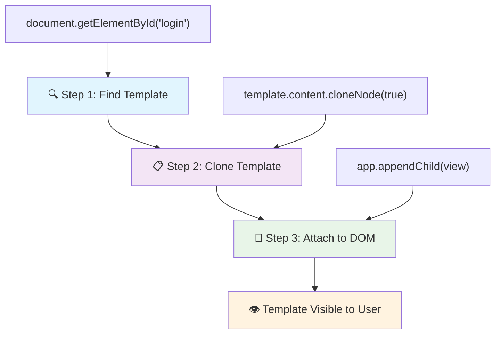
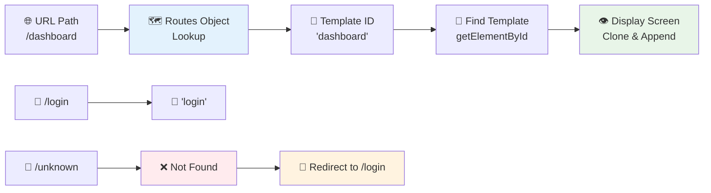
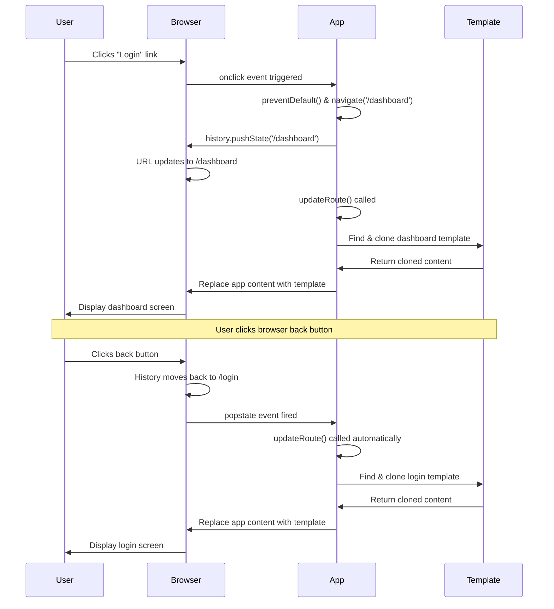

<!--
CO_OP_TRANSLATOR_METADATA:
{
  "original_hash": "5d259f6962464ad91e671083aa0398f4",
  "translation_date": "2025-10-22T22:49:17+00:00",
  "source_file": "7-bank-project/1-template-route/README.md",
  "language_code": "mo"
}
-->
# 建立銀行應用程式第一部分：網頁應用程式中的 HTML 模板與路由

當阿波羅 11 號的導航電腦在 1969 年引導登月時，它需要在不同的程式之間切換，而不需要重新啟動整個系統。現代的網頁應用程式也採用類似的方式運作——它們改變您所看到的內容，而不需要從頭重新載入所有內容。這種方式創造了使用者今日所期望的流暢、快速的使用體驗。

與傳統網站每次互動都需要重新載入整個頁面不同，現代網頁應用程式僅更新需要更改的部分。這種方式就像任務控制中心在保持持續通信的同時在不同顯示器之間切換，創造了我們所期待的流暢體驗。

以下是兩者之間的顯著差異：

| 傳統多頁應用程式 | 現代單頁應用程式 |
|------------------|------------------|
| **導航** | 每個畫面都需要重新載入整個頁面 | 即時內容切換 |
| **效能** | 由於需要下載完整的 HTML，速度較慢 | 部分更新，速度更快 |
| **使用者體驗** | 頁面閃爍，體驗不流暢 | 流暢，類似應用程式的過渡效果 |
| **資料共享** | 頁面之間的資料共享困難 | 狀態管理更容易 |
| **開發** | 需要維護多個 HTML 文件 | 單一 HTML 文件，使用動態模板 |

**理解演進：**
- **傳統應用程式**需要伺服器請求來完成每次的導航操作
- **現代單頁應用程式 (SPA)** 僅需載入一次，並使用 JavaScript 動態更新內容
- **使用者期望**現在更偏好即時、無縫的互動
- **效能優勢**包括減少頻寬使用和更快的響應速度

在本課程中，我們將建立一個銀行應用程式，擁有多個無縫流暢切換的畫面。就像科學家使用可重新配置的模組化儀器進行不同的實驗一樣，我們將使用 HTML 模板作為可重複使用的元件，根據需要顯示。

您將學習使用 HTML 模板（用於不同畫面的可重複使用藍圖）、JavaScript 路由（切換畫面的系統）以及瀏覽器的歷史 API（確保返回按鈕正常運作）。這些是 React、Vue 和 Angular 等框架使用的基本技術。

完成課程後，您將擁有一個展示專業單頁應用程式原則的銀行應用程式。

## 課前測驗

[課前測驗](https://ff-quizzes.netlify.app/web/quiz/41)

### 您需要準備什麼

我們需要一個本地網頁伺服器來測試我們的銀行應用程式——別擔心，這並不難！如果您尚未設置，只需安裝 [Node.js](https://nodejs.org)，然後在您的專案資料夾中執行 `npx lite-server`。這個方便的指令會啟動一個本地伺服器，並自動在瀏覽器中打開您的應用程式。

### 準備工作

在您的電腦上建立一個名為 `bank` 的資料夾，並在其中建立一個名為 `index.html` 的文件。我們將從這個 HTML [樣板](https://en.wikipedia.org/wiki/Boilerplate_code)開始：

```html
<!DOCTYPE html>
<html lang="en">
  <head>
    <meta charset="UTF-8">
    <meta name="viewport" content="width=device-width, initial-scale=1.0">
    <title>Bank App</title>
  </head>
  <body>
    <!-- This is where you'll work -->
  </body>
</html>
```

**這個樣板提供了以下內容：**
- **建立**具有正確 DOCTYPE 聲明的 HTML5 文件結構
- **配置**字符編碼為 UTF-8，以支援國際文本
- **啟用**響應式設計，使用 viewport meta 標籤以適應行動裝置
- **設置**描述性標題，顯示在瀏覽器標籤上
- **創建**乾淨的 body 區域，我們將在其中構建應用程式

> 📁 **專案結構預覽**
> 
> **完成本課程後，您的專案將包含：**
> ```
> bank/
> ├── index.html      <!-- Main HTML with templates -->
> ├── app.js          <!-- Routing and navigation logic -->
> └── style.css       <!-- (Optional for future lessons) -->
> ```
> 
> **文件職責：**
> - **index.html**：包含所有模板並提供應用程式結構
> - **app.js**：處理路由、導航和模板管理
> - **模板**：定義登入、儀表板及其他畫面的使用者介面

---

## HTML 模板

模板解決了網頁開發中的一個基本問題。當古騰堡在 1440 年代發明活字印刷時，他意識到與其雕刻整個頁面，不如創建可重複使用的字母塊，並根據需要排列它們。HTML 模板基於相同的原理——與其為每個畫面創建單獨的 HTML 文件，不如定義可重複使用的結構，並在需要時顯示它們。

將模板想像成應用程式不同部分的藍圖。就像建築師創建一個藍圖並多次使用它，而不是重新繪製相同的房間，我們只需創建一次模板，並根據需要進行實例化。瀏覽器會將這些模板隱藏起來，直到 JavaScript 將它們激活。

如果您想為網頁創建多個畫面，一種解決方案是為每個要顯示的畫面創建一個 HTML 文件。然而，這種解決方案存在一些不便：

- 切換畫面時需要重新載入整個 HTML，可能會很慢。
- 在不同畫面之間共享資料很困難。

另一種方法是僅使用一個 HTML 文件，並使用 `<template>` 元素定義多個 [HTML 模板](https://developer.mozilla.org/docs/Web/HTML/Element/template)。模板是一個可重複使用的 HTML 區塊，瀏覽器不會顯示它，必須在運行時使用 JavaScript 實例化。

### 開始構建

我們將創建一個具有兩個主要畫面的銀行應用程式：登入頁面和儀表板。首先，讓我們在 HTML 的 body 中添加一個佔位元素——這是所有不同畫面將顯示的地方：

```html
<div id="app">Loading...</div>
```

**理解這個佔位符：**
- **創建**一個 ID 為 "app" 的容器，所有畫面將顯示在此處
- **顯示**一個加載訊息，直到 JavaScript 初始化第一個畫面
- **提供**一個動態內容的單一掛載點
- **使得**可以使用 `document.getElementById()` 從 JavaScript 中輕鬆定位

> 💡 **專業提示**：由於此元素的內容將被替換，我們可以放置一個加載訊息或指示器，顯示應用程式正在加載。

接下來，讓我們在 HTML 中添加登入頁面的模板。現在，我們只需要在其中放置一個標題和一個包含導航連結的區段。

```html
<template id="login">
  <h1>Bank App</h1>
  <section>
    <a href="/dashboard">Login</a>
  </section>
</template>
```

**解析這個登入模板：**
- **定義**一個具有唯一標識符 "login" 的模板，供 JavaScript 定位
- **包含**一個主要標題，建立應用程式的品牌形象
- **包含**一個語義化的 `<section>` 元素，用於分組相關內容
- **提供**一個導航連結，將使用者導向儀表板

接著，我們將為儀表板頁面添加另一個 HTML 模板。此頁面將包含不同的區段：

- 一個包含標題和登出連結的標頭
- 銀行帳戶的當前餘額
- 一個交易列表，顯示在表格中

```html
<template id="dashboard">
  <header>
    <h1>Bank App</h1>
    <a href="/login">Logout</a>
  </header>
  <section>
    Balance: 100$
  </section>
  <section>
    <h2>Transactions</h2>
    <table>
      <thead>
        <tr>
          <th>Date</th>
          <th>Object</th>
          <th>Amount</th>
        </tr>
      </thead>
      <tbody></tbody>
    </table>
  </section>
</template>
```

**理解儀表板的每個部分：**
- **結構化**頁面，使用語義化的 `<header>` 元素包含導航
- **一致顯示**應用程式標題，增強品牌形象
- **提供**一個登出連結，導向回登入畫面
- **顯示**專用區域中的當前帳戶餘額
- **使用**結構化的 HTML 表格組織交易資料
- **定義**表格標題，包含日期、項目和金額欄位
- **保留**表格主體空白，以便稍後動態插入內容

> 💡 **專業提示**：在創建 HTML 模板時，如果您想查看它的外觀，可以通過使用 `<!-- -->` 註解掉 `<template>` 和 `</template>` 行。

✅ 為什麼我們在模板上使用 `id` 屬性？是否可以使用其他屬性，例如 class？

## 使用 JavaScript 讓模板活起來

現在我們需要讓模板變得有功能。就像 3D 列印機將數位藍圖轉化為實物一樣，JavaScript 將我們隱藏的模板轉化為使用者可以看到和使用的可互動元素。

這個過程遵循三個一致的步驟，構成了現代網頁開發的基礎。一旦您理解了這個模式，您就能在許多框架和庫中識別出它。

如果您在瀏覽器中嘗試目前的 HTML 文件，您會發現它停留在顯示 `Loading...`。這是因為我們需要添加一些 JavaScript 代碼來實例化並顯示 HTML 模板。

實例化模板通常分為三個步驟：

1. 在 DOM 中檢索模板元素，例如使用 [`document.getElementById`](https://developer.mozilla.org/docs/Web/API/Document/getElementById)。
2. 使用 [`cloneNode`](https://developer.mozilla.org/docs/Web/API/Node/cloneNode) 克隆模板元素。
3. 使用 [`appendChild`](https://developer.mozilla.org/docs/Web/API/Node/appendChild) 將其附加到可見元素的 DOM 下。



**過程的視覺分解：**
- **步驟 1**：定位 DOM 結構中的隱藏模板
- **步驟 2**：創建一個可安全修改的工作副本
- **步驟 3**：將副本插入到可見的頁面區域
- **結果**：一個使用者可以互動的功能性畫面

✅ 為什麼我們需要在附加到 DOM 之前克隆模板？如果跳過這一步會發生什麼？

### 任務

在您的專案資料夾中創建一個名為 `app.js` 的新文件，並在 HTML 的 `<head>` 區段中導入該文件：

```html
<script src="app.js" defer></script>
```

**理解這個腳本導入：**
- **連結** JavaScript 文件到我們的 HTML 文件
- **使用** `defer` 屬性，確保腳本在 HTML 解析完成後運行
- **啟用**對所有 DOM 元素的訪問，因為它們在腳本執行前已完全載入
- **遵循**現代腳本加載和效能的最佳實踐

現在在 `app.js` 中，我們將創建一個新函數 `updateRoute`：

```js
function updateRoute(templateId) {
  const template = document.getElementById(templateId);
  const view = template.content.cloneNode(true);
  const app = document.getElementById('app');
  app.innerHTML = '';
  app.appendChild(view);
}
```

**逐步解析發生的事情：**
- **定位**模板元素，使用其唯一的 ID
- **創建**模板內容的深層副本，使用 `cloneNode(true)`
- **找到**顯示內容的應用程式容器
- **清除**應用程式容器中的任何現有內容
- **插入**克隆的模板內容到可見的 DOM 中

現在使用其中一個模板調用此函數，並查看結果。

```js
updateRoute('login');
```

**此函數調用的作用：**
- **激活**登入模板，通過傳遞其 ID 作為參數
- **演示**如何以程式化方式在不同的應用程式畫面之間切換
- **顯示**登入畫面，取代 "Loading..." 訊息

✅ 此代碼 `app.innerHTML = '';` 的目的是什麼？如果沒有它會發生什麼？

## 創建路由

路由本質上是將 URL 與正確的內容連接起來。想像早期的電話接線員如何使用接線板連接電話——他們會接收來電請求並將其路由到正確的目的地。網頁路由的工作方式類似，接收 URL 請求並確定要顯示的內容。

傳統上，網頁伺服器通過為不同的 URL 提供不同的 HTML 文件來處理這一過程。由於我們正在構建一個單頁應用程式，我們需要使用 JavaScript 自行處理這個路由。這種方式使我們能更好地控制使用者體驗和效能。



**理解路由流程：**
- **URL 變更**會觸發我們路由配置中的查詢
- **有效路由**映射到特定的模板 ID 以進行渲染
- **無效路由**觸發回退行為，防止出現錯誤狀態
- **模板渲染**遵循我們之前學到的三步驟過程

在談論網頁應用程式時，我們稱 *路由* 為將 **URL** 映射到應顯示的特定畫面的意圖。在具有多個 HTML 文件的網站上，這是自動完成的，因為文件路徑會反映在 URL 上。例如，假設您的專案資料夾中有以下文件：

```
mywebsite/index.html
mywebsite/login.html
mywebsite/admin/index.html
```

如果您以 `mywebsite` 作為根目錄創建一個網頁伺服器，URL 映射將是：

```
https://site.com            --> mywebsite/index.html
https://site.com/login.html --> mywebsite/login.html
https://site.com/admin/     --> mywebsite/admin/index.html
```

然而，對於我們的網頁應用程式，我們使用的是包含所有畫面的單一 HTML 文件，因此這種預設行為對我們沒有幫助。我們必須手動創建這個映射，並使用 JavaScript 更新顯示的模板。

### 任務

我們將使用一個簡單的物件來實現 [映射](https://en.wikipedia.org/wiki/Associative_array) URL 路徑與我們的模板之間的關係。在您的 `app.js` 文件頂部添加此物件。

```js
const routes = {
  '/login': { templateId: 'login' },
  '/dashboard': { templateId: 'dashboard' },
};
```

**理解這個路由配置：**
- **定義** URL 路徑與模板標識符之間的映射
- **使用**物件語法，其中鍵是 URL 路徑，值包含模板資訊
- **啟用**輕鬆查詢任何給定 URL 應顯示的模板
- **提供**未來添加新路由的可擴展結構

現在讓我們稍微修改一下 `updateRoute` 函數。與其直接將 `templateId` 作為參數傳遞，我們希望先查看當前的 URL，然後使用我們的映射來獲取對應的模板 ID 值。我們可以使用 [`window.location.pathname`](https://developer.mozilla.org/docs/Web/API/Location/pathname) 來僅獲取 URL 的路徑部分。

```js
function updateRoute() {
  const path = window.location.pathname;
  const route = routes[path];

  const template = document.getElementById(route.templateId);
  const view = template.content.cloneNode(true);
  const app = document.getElementById('app');
  app.innerHTML = '';
  app.appendChild(view);
}
```

**解析此處發生的事情：**
- **提取**瀏覽器 URL 中的當前路徑，使用 `window.location.pathname`
- **查詢**我們的路由物件中的對應路由配置
- **檢索**路由配置中的模板 ID
- **遵循**之前的模板渲染過程
- **創建**一個響應 URL 變更的動態系統

在這裡，我們將聲明的路由映射到相應的模板。您可以嘗試通過在瀏覽器中手動更改 URL 來檢查其是否正常工作。
✅ 如果在 URL 中輸入未知的路徑會發生什麼？我們該如何解決？

## 添加導航功能

在建立路由後，使用者需要一種方式來在應用程式中進行導航。傳統網站在點擊連結時會重新載入整個頁面，但我們希望在不刷新頁面的情況下更新 URL 和內容。這樣可以創造出更流暢的使用體驗，類似於桌面應用程式在不同視圖之間切換的方式。

我們需要協調兩件事：更新瀏覽器的 URL，讓使用者可以收藏頁面並分享連結；以及顯示適當的內容。如果正確實現，這將創造出現代應用程式所期望的無縫導航體驗。

> 🏗️ **架構洞察**：導航系統元件
>
> **你正在構建的內容：**
> - **🔄 URL 管理**：在不重新載入頁面的情況下更新瀏覽器地址欄
> - **📋 模板系統**：根據當前路由動態切換內容  
> - **📚 歷史整合**：維持瀏覽器的返回/前進按鈕功能
> - **🛡️ 錯誤處理**：為無效或缺失的路由提供優雅的回退機制
>
> **元件如何協同工作：**
> - **監聽**導航事件（點擊、歷史變更）
> - **更新**URL 使用 History API
> - **渲染**新路由的適當模板
> - **維持**整個過程中的流暢使用者體驗

我們應用程式的下一步是添加在頁面之間導航的可能性，而不需要手動更改 URL。這意味著兩件事：

1. 更新當前 URL  
2. 根據新 URL 更新顯示的模板  

我們已經通過 `updateRoute` 函數處理了第二部分，因此我們需要弄清楚如何更新當前的 URL。

我們需要使用 JavaScript，特別是 [`history.pushState`](https://developer.mozilla.org/docs/Web/API/History/pushState)，它允許在不重新載入 HTML 的情況下更新 URL 並在瀏覽歷史中創建新條目。

> ⚠️ **重要提示**：雖然 HTML 錨點元素 [`<a href>`](https://developer.mozilla.org/docs/Web/HTML/Element/a) 本身可以用來創建指向不同 URL 的超連結，但它默認會使瀏覽器重新載入 HTML。在使用自定義 JavaScript 處理路由時，需要使用 `preventDefault()` 函數來防止這種行為。

### 任務

讓我們創建一個新函數，用於在應用程式中進行導航：

```js
function navigate(path) {
  window.history.pushState({}, path, path);
  updateRoute();
}
```
  
**理解這個導航函數：**
- **更新**瀏覽器的 URL 到新路徑，使用 `history.pushState`  
- **添加**新條目到瀏覽器的歷史堆疊，以支持正確的返回/前進按鈕  
- **觸發**`updateRoute()` 函數以顯示相應的模板  
- **維持**單頁應用程式的體驗，無需頁面刷新  

此方法首先根據給定的路徑更新當前 URL，然後更新模板。屬性 `window.location.origin` 返回 URL 的根目錄，允許我們從給定的路徑重建完整的 URL。

現在我們有了這個函數，可以解決當路徑與任何定義的路由不匹配時出現的問題。我們將通過添加一個回退到現有路由的機制來修改 `updateRoute` 函數，以防找不到匹配。

```js
function updateRoute() {
  const path = window.location.pathname;
  const route = routes[path];

  if (!route) {
    return navigate('/login');
  }

  const template = document.getElementById(route.templateId);
  const view = template.content.cloneNode(true);
  const app = document.getElementById('app');
  app.innerHTML = '';
  app.appendChild(view);
}
```
  
**需要記住的關鍵點：**
- **檢查**當前路徑是否存在路由  
- **重定向**到登入頁面，當訪問無效路由時  
- **提供**防止導航中斷的回退機制  
- **確保**使用者即使輸入錯誤的 URL 也能看到有效的畫面  

如果找不到路由，我們現在會重定向到 `login` 頁面。

現在讓我們創建一個函數，用於在點擊連結時獲取 URL，並防止瀏覽器的默認連結行為：

```js
function onLinkClick(event) {
  event.preventDefault();
  navigate(event.target.href);
}
```
  
**分解這個點擊處理器：**
- **防止**瀏覽器的默認連結行為，使用 `preventDefault()`  
- **提取**目標 URL 從被點擊的連結元素  
- **調用**我們的自定義導航函數，而不是重新載入頁面  
- **維持**流暢的單頁應用程式體驗  

```html
<a href="/dashboard" onclick="onLinkClick(event)">Login</a>
...
<a href="/login" onclick="onLinkClick(event)">Logout</a>
```
  
**這個 onclick 綁定的作用：**
- **連接**每個連結到我們的自定義導航系統  
- **傳遞**點擊事件到我們的 `onLinkClick` 函數進行處理  
- **啟用**無需頁面刷新流暢的導航  
- **維持**使用者可以收藏或分享的正確 URL 結構  

[`onclick`](https://developer.mozilla.org/docs/Web/API/GlobalEventHandlers/onclick) 屬性將 `click` 事件綁定到 JavaScript 代碼，這裡是調用 `navigate()` 函數。

試著點擊這些連結，你現在應該能夠在應用程式的不同畫面之間進行導航。

✅ `history.pushState` 方法是 HTML5 標準的一部分，並在[所有現代瀏覽器](https://caniuse.com/?search=pushState)中實現。如果你正在為舊版瀏覽器構建網頁應用程式，可以使用一個技巧來代替此 API：在路徑前使用 [hash (`#`)](https://en.wikipedia.org/wiki/URI_fragment)，你可以實現基於常規錨點導航的路由，且不會刷新頁面，因為它的目的是在頁面內創建內部連結。

## 讓返回和前進按鈕正常工作

返回和前進按鈕是網頁瀏覽的基本功能，就像 NASA 任務控制員在太空任務中回顧之前的系統狀態一樣。使用者期望這些按鈕能正常工作，當它們無法正常運作時，會破壞預期的瀏覽體驗。

我們的單頁應用程式需要額外的配置來支持這一點。瀏覽器維持了一個歷史堆疊（我們已經使用 `history.pushState` 添加到其中），但當使用者通過這個歷史進行導航時，我們的應用程式需要響應，並相應地更新顯示的內容。


  
**關鍵交互點：**
- **使用者操作**通過點擊或瀏覽器按鈕觸發導航  
- **應用程式攔截**連結點擊以防止頁面刷新  
- **歷史 API**管理 URL 更改和瀏覽器歷史堆疊  
- **模板**提供每個畫面的內容結構  
- **事件監聽器**確保應用程式對所有導航類型做出響應  

使用 `history.pushState` 會在瀏覽器的導航歷史中創建新條目。你可以通過按住瀏覽器的*返回按鈕*來檢查，它應該顯示如下內容：


如果你嘗試多次點擊返回按鈕，你會看到當前 URL 發生了變化，歷史也被更新，但顯示的模板保持不變。

這是因為應用程式不知道每次歷史變更時需要調用 `updateRoute()`。如果你查看 [`history.pushState` 的文檔](https://developer.mozilla.org/docs/Web/API/History/pushState)，你會看到當狀態改變時 - 意味著我們移動到不同的 URL - [`popstate`](https://developer.mozilla.org/docs/Web/API/Window/popstate_event) 事件會被觸發。我們將利用這一點來解決這個問題。

### 任務

為了確保當瀏覽器歷史變更時顯示的模板得到更新，我們將在 `app.js` 文件的底部附加一個新函數，該函數會調用 `updateRoute()`：

```js
window.onpopstate = () => updateRoute();
updateRoute();
```
  
**理解這個歷史整合：**
- **監聽**當使用者使用瀏覽器按鈕導航時觸發的 `popstate` 事件  
- **使用**箭頭函數以簡潔的語法聲明事件處理器  
- **自動調用**`updateRoute()`，每當歷史狀態改變時  
- **初始化**應用程式，當頁面首次加載時調用 `updateRoute()`  
- **確保**無論使用者如何導航，都能顯示正確的模板  

> 💡 **專業提示**：我們在這裡使用了[箭頭函數](https://developer.mozilla.org/docs/Web/JavaScript/Reference/Functions/Arrow_functions)來聲明 `popstate` 事件處理器以簡化語法，但普通函數也可以正常工作。

這裡有一段關於箭頭函數的回顧影片：

[](https://youtube.com/watch?v=OP6eEbOj2sc "箭頭函數")

> 🎥 點擊上方圖片觀看有關箭頭函數的影片。

現在嘗試使用瀏覽器的返回和前進按鈕，檢查這次顯示的路由是否正確更新。

---

## GitHub Copilot Agent 挑戰 🚀

使用 Agent 模式完成以下挑戰：

**描述：** 增強銀行應用程式，通過為無效路由實現錯誤處理和 404 頁面模板，改善使用者在導航到不存在的頁面時的使用體驗。

**提示：** 創建一個新的 HTML 模板，id 為 "not-found"，顯示一個用戶友好的 404 錯誤頁面並添加樣式。然後修改 JavaScript 路由邏輯，當使用者導航到無效 URL 時顯示此模板，並添加一個 "返回首頁" 按鈕，導航回登入頁面。

了解更多有關 [agent mode](https://code.visualstudio.com/blogs/2025/02/24/introducing-copilot-agent-mode) 的資訊。

## 🚀 挑戰

為此應用程式添加一個新模板和路由，顯示應用程式的製作人員名單。

**挑戰目標：**
- **創建**一個具有適當內容結構的新 HTML 模板  
- **添加**新路由到你的路由配置物件  
- **包含**到製作人員名單頁面的導航連結  
- **測試**所有導航是否正確運作  

## 課後測驗

[課後測驗](https://ff-quizzes.netlify.app/web/quiz/42)

## 回顧與自學

路由是網頁開發中出乎意料的棘手部分，特別是當網頁從頁面刷新行為轉向單頁應用程式的頁面刷新行為時。閱讀一些關於 [Azure Static Web App 服務如何處理路由](https://docs.microsoft.com/azure/static-web-apps/routes/?WT.mc_id=academic-77807-sagibbon) 的文章。你能解釋為什麼文檔中描述的一些決策是必要的嗎？

**額外學習資源：**
- **探索**像 React Router 和 Vue Router 等流行框架如何實現客戶端路由  
- **研究**基於 hash 的路由和 History API 路由的區別  
- **學習**伺服器端渲染（SSR）及其如何影響路由策略  
- **調查**漸進式網頁應用程式（PWAs）如何處理路由和導航  

## 作業

[改進路由](assignment.md)

---

**免責聲明**：  
本文件已使用 AI 翻譯服務 [Co-op Translator](https://github.com/Azure/co-op-translator) 進行翻譯。儘管我們努力確保翻譯的準確性，但請注意，自動翻譯可能包含錯誤或不準確之處。原始文件的母語版本應被視為權威來源。對於關鍵信息，建議使用專業人工翻譯。我們對因使用此翻譯而引起的任何誤解或誤釋不承擔責任。