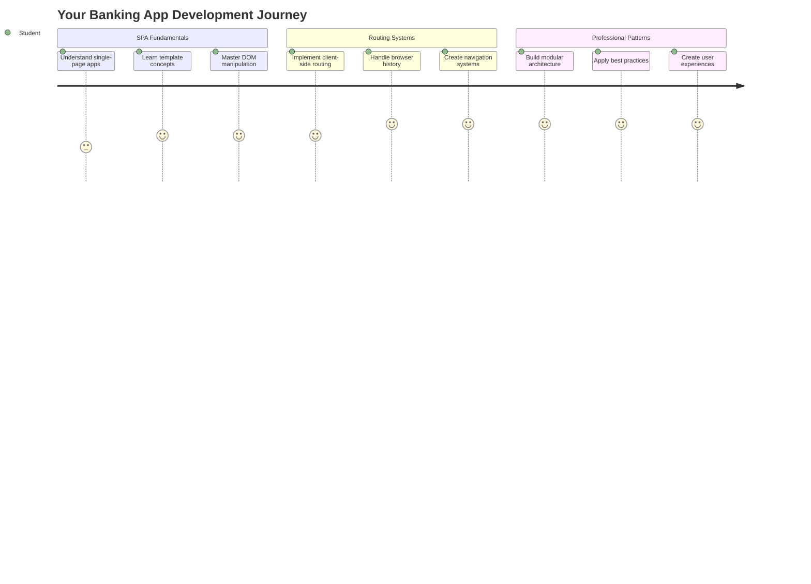
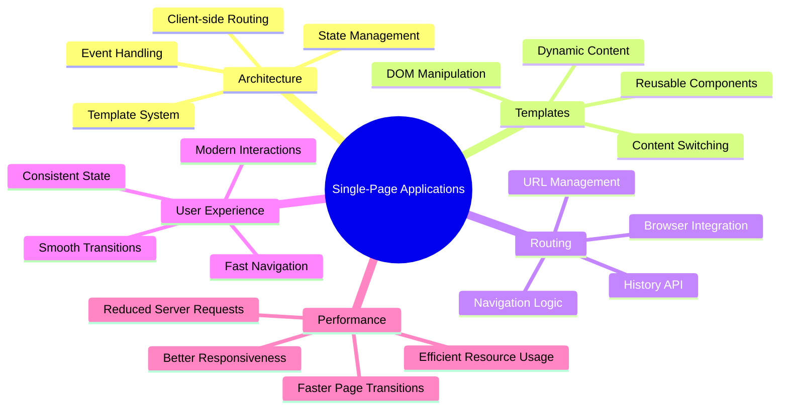
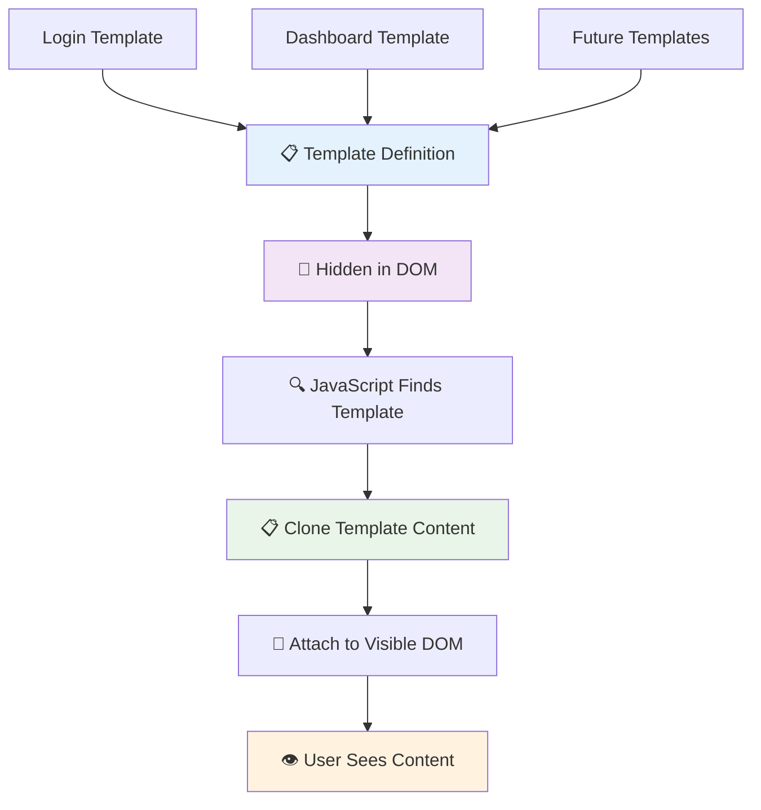
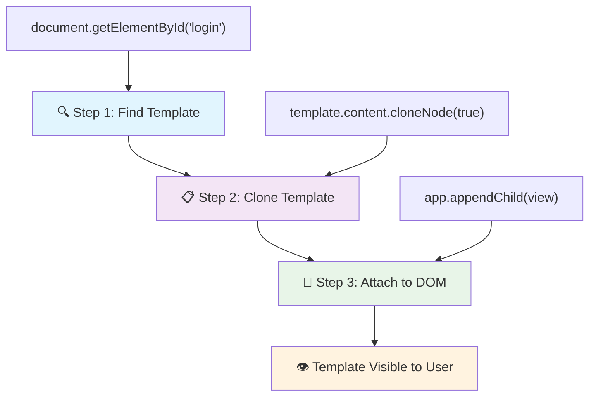
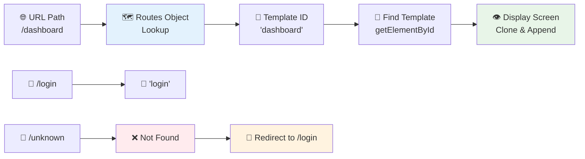
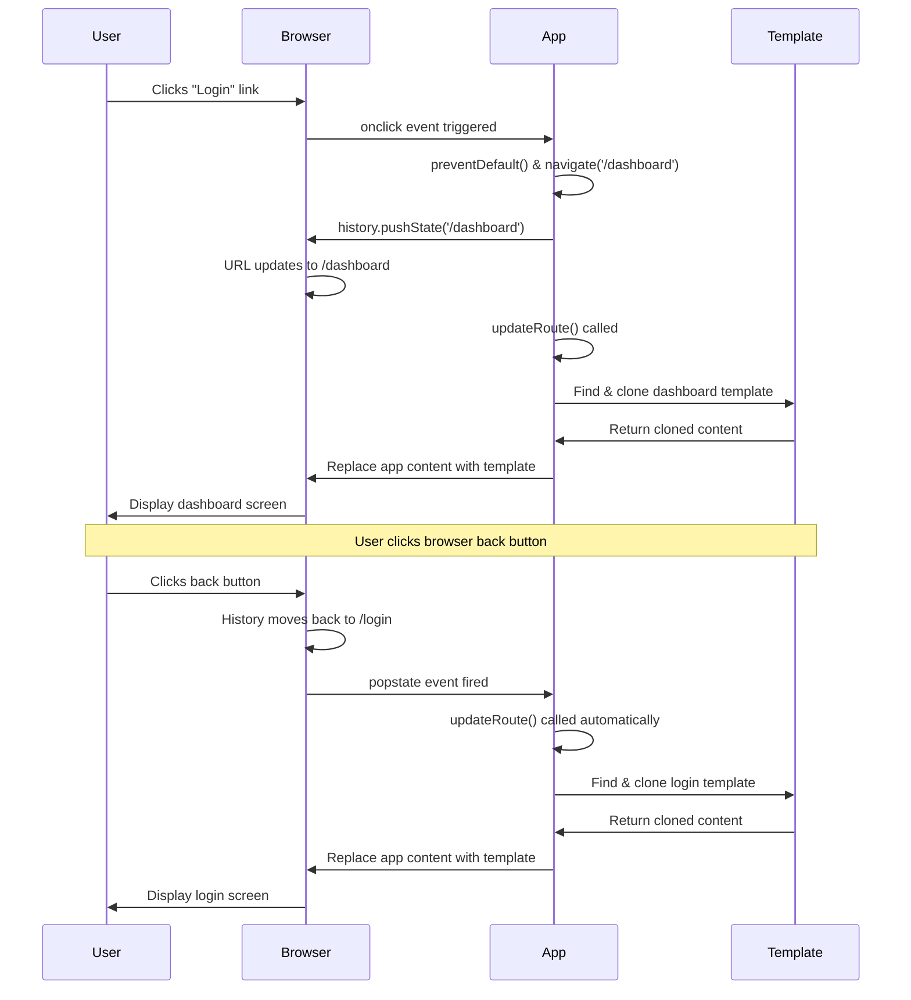
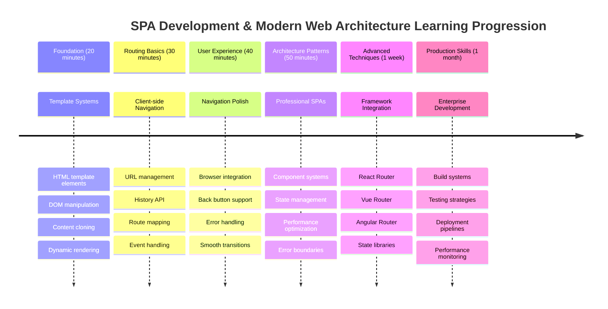

<!--
CO_OP_TRANSLATOR_METADATA:
{
  "original_hash": "351678bece18f07d9daa987a881fb062",
  "translation_date": "2025-11-03T23:48:39+00:00",
  "source_file": "7-bank-project/1-template-route/README.md",
  "language_code": "mo"
}
-->
# 建立銀行應用程式第一部分：網頁應用中的 HTML 模板與路由



當阿波羅 11 號的導航電腦在 1969 年飛往月球時，它需要在不同的程式之間切換，而不需要重新啟動整個系統。現代的網頁應用程式也採用類似的方式——它們只改變你看到的部分，而不需要重新載入所有內容。這種方式創造了使用者今天所期望的流暢、快速的體驗。

與傳統網站每次互動都需要重新載入整個頁面不同，現代網頁應用程式只更新需要改變的部分。這種方式就像任務控制中心在保持持續通訊的同時切換不同的顯示畫面，創造了我們所期待的流暢體驗。

以下是兩者之間的顯著差異：

| 傳統多頁應用程式 | 現代單頁應用程式 |
|------------------|------------------|
| **導航** | 每個畫面都需要重新載入整個頁面 | 即時內容切換 |
| **效能** | 由於需要下載完整的 HTML，速度較慢 | 部分更新，速度更快 |
| **使用者體驗** | 頁面閃爍，體驗不流暢 | 流暢，類似應用程式的過渡效果 |
| **資料共享** | 頁面之間的資料共享困難 | 狀態管理更容易 |
| **開發** | 需要維護多個 HTML 文件 | 單一 HTML 文件，使用動態模板 |

**了解演進過程：**
- **傳統應用程式**需要每次導航操作都向伺服器發送請求
- **現代單頁應用程式 (SPA)** 只需載入一次，並使用 JavaScript 動態更新內容
- **使用者期望**現在更偏好即時、無縫的互動
- **效能優勢**包括減少頻寬使用和更快的響應速度

在這堂課中，我們將建立一個銀行應用程式，擁有多個畫面並能流暢切換。就像科學家使用可重新配置的模組化儀器進行不同的實驗一樣，我們將使用 HTML 模板作為可重複使用的元件，根據需要顯示。

你將學習使用 HTML 模板（不同畫面的可重複使用藍圖）、JavaScript 路由（切換畫面的系統）以及瀏覽器的歷史 API（確保返回按鈕正常運作）。這些都是像 React、Vue 和 Angular 等框架所使用的基本技術。

完成後，你將擁有一個展示專業單頁應用程式原則的銀行應用程式。



## 課前測驗

[課前測驗](https://ff-quizzes.netlify.app/web/quiz/41)

### 你需要準備什麼

我們需要一個本地網頁伺服器來測試我們的銀行應用程式——別擔心，這比聽起來簡單！如果你還沒有設置好，只需安裝 [Node.js](https://nodejs.org) 並在你的專案資料夾中執行 `npx lite-server`。這個方便的指令會啟動一個本地伺服器，並自動在瀏覽器中打開你的應用程式。

### 準備工作

在你的電腦上建立一個名為 `bank` 的資料夾，並在其中建立一個名為 `index.html` 的文件。我們將從這個 HTML [樣板](https://en.wikipedia.org/wiki/Boilerplate_code) 開始：

```html
<!DOCTYPE html>
<html lang="en">
  <head>
    <meta charset="UTF-8">
    <meta name="viewport" content="width=device-width, initial-scale=1.0">
    <title>Bank App</title>
  </head>
  <body>
    <!-- This is where you'll work -->
  </body>
</html>
```

**這個樣板提供了以下功能：**
- **建立**具有正確 DOCTYPE 聲明的 HTML5 文件結構
- **配置**字符編碼為 UTF-8，以支援國際文字
- **啟用**響應式設計，使用 viewport meta 標籤來適應行動裝置
- **設置**在瀏覽器標籤中顯示的描述性標題
- **創建**一個乾淨的 body 區域，我們將在其中構建應用程式

> 📁 **專案結構預覽**
> 
> **完成這堂課後，你的專案將包含：**
> ```
> bank/
> ├── index.html      <!-- Main HTML with templates -->
> ├── app.js          <!-- Routing and navigation logic -->
> └── style.css       <!-- (Optional for future lessons) -->
> ```
> 
> **文件職責：**
> - **index.html**：包含所有模板並提供應用程式結構
> - **app.js**：負責路由、導航和模板管理
> - **模板**：定義登入頁面、儀表板和其他畫面的 UI

---

## HTML 模板

模板解決了網頁開發中的一個基本問題。當古騰堡在 1440 年代發明活字印刷時，他意識到與其雕刻整個頁面，不如創建可重複使用的字母塊，並根據需要排列它們。HTML 模板採用相同的原理——與其為每個畫面創建單獨的 HTML 文件，不如定義可重複使用的結構，並在需要時顯示它們。



將模板想像成應用程式不同部分的藍圖。就像建築師創建一個藍圖並多次使用它，而不是重複繪製相同的房間，我們只需創建一次模板，並根據需要實例化它們。瀏覽器會將這些模板隱藏，直到 JavaScript 將它們激活。

如果你想為網頁創建多個畫面，一種解決方案是為每個要顯示的畫面創建一個 HTML 文件。然而，這種解決方案有一些不便之處：

- 切換畫面時需要重新載入整個 HTML，速度可能較慢。
- 在不同畫面之間共享資料很困難。

另一種方法是只使用一個 HTML 文件，並使用 `<template>` 元素定義多個 [HTML 模板](https://developer.mozilla.org/docs/Web/HTML/Element/template)。模板是一個可重複使用的 HTML 區塊，瀏覽器不會顯示它，必須使用 JavaScript 在運行時實例化。

### 開始構建

我們將創建一個銀行應用程式，包含兩個主要畫面：登入頁面和儀表板。首先，讓我們在 HTML 的 body 中添加一個佔位元素——這是所有不同畫面將顯示的地方：

```html
<div id="app">Loading...</div>
```

**理解這個佔位元素：**
- **創建**一個 ID 為 "app" 的容器，所有畫面將顯示在此處
- **顯示**一個加載訊息，直到 JavaScript 初始化第一個畫面
- **提供**一個動態內容的單一掛載點
- **方便**使用 `document.getElementById()` 從 JavaScript 中進行定位

> 💡 **專業提示**：由於此元素的內容將被替換，我們可以放置一個加載訊息或指示器，顯示應用程式加載時的狀態。

接下來，讓我們在 HTML 中添加登入頁面的模板。現在，我們只需要在其中放置一個標題和一個包含導航連結的區塊。

```html
<template id="login">
  <h1>Bank App</h1>
  <section>
    <a href="/dashboard">Login</a>
  </section>
</template>
```

**拆解這個登入模板：**
- **定義**一個具有唯一識別碼 "login" 的模板，供 JavaScript 定位
- **包含**一個主標題，建立應用程式的品牌形象
- **包含**一個語義化的 `<section>` 元素，用於分組相關內容
- **提供**一個導航連結，將使用者導向儀表板

然後，我們將添加另一個 HTML 模板，用於儀表板頁面。此頁面將包含不同的區塊：

- 一個包含標題和登出連結的標頭
- 銀行帳戶的當前餘額
- 一個交易列表，顯示在表格中

```html
<template id="dashboard">
  <header>
    <h1>Bank App</h1>
    <a href="/login">Logout</a>
  </header>
  <section>
    Balance: 100$
  </section>
  <section>
    <h2>Transactions</h2>
    <table>
      <thead>
        <tr>
          <th>Date</th>
          <th>Object</th>
          <th>Amount</th>
        </tr>
      </thead>
      <tbody></tbody>
    </table>
  </section>
</template>
```

**理解儀表板的每個部分：**
- **使用語義化的 `<header>` 元素** 結構化頁面，包含導航
- **一致顯示** 應用程式標題以建立品牌形象
- **提供** 一個登出連結，導回登入畫面
- **顯示** 銀行帳戶的當前餘額，放在專用區塊中
- **使用結構化的 HTML 表格** 組織交易資料
- **定義** 表格標題，包含日期、對象和金額欄位
- **保留** 表格主體空白，以便稍後動態注入內容

> 💡 **專業提示**：在創建 HTML 模板時，如果你想查看它的外觀，可以將 `<template>` 和 `</template>` 行用 `<!-- -->` 註解掉。

### 🔄 **教學檢查**
**模板系統理解**：在實現 JavaScript 之前，確保你理解：
- ✅ 模板與普通 HTML 元素的區別
- ✅ 為什麼模板在 JavaScript 激活之前保持隱藏
- ✅ 模板中語義化 HTML 結構的重要性
- ✅ 模板如何實現可重複使用的 UI 元件

**快速自測**：如果你移除 HTML 中的 `<template>` 標籤會發生什麼？
*答案：內容會立即顯示，並失去模板功能*

**架構優勢**：模板提供：
- **可重複使用性**：一次定義，多次使用
- **效能**：無冗餘的 HTML 解析
- **可維護性**：集中化的 UI 結構
- **靈活性**：動態內容切換

✅ 為什麼我們在模板上使用 `id` 屬性？是否可以使用其他方式，例如類別？

## 使用 JavaScript 讓模板活起來

現在我們需要讓模板變得功能化。就像 3D 列印機將數位藍圖轉化為實體物件一樣，JavaScript 將我們隱藏的模板轉化為使用者可以看到和使用的可互動元素。

這個過程遵循三個一致的步驟，形成了現代網頁開發的基礎。一旦你理解了這個模式，你會在許多框架和庫中認識到它。

如果你在瀏覽器中嘗試目前的 HTML 文件，你會發現它停留在顯示 `Loading...`。這是因為我們需要添加一些 JavaScript 代碼來實例化並顯示 HTML 模板。

實例化模板通常分為三個步驟：

1. 在 DOM 中檢索模板元素，例如使用 [`document.getElementById`](https://developer.mozilla.org/docs/Web/API/Document/getElementById)。
2. 使用 [`cloneNode`](https://developer.mozilla.org/docs/Web/API/Node/cloneNode) 克隆模板元素。
3. 使用 [`appendChild`](https://developer.mozilla.org/docs/Web/API/Node/appendChild) 將其附加到可見的 DOM 元素下。



**過程的視覺分解：**
- **步驟 1** 定位 DOM 結構中的隱藏模板
- **步驟 2** 創建一個可以安全修改的工作副本
- **步驟 3** 將副本插入到可見的頁面區域
- **結果** 是一個使用者可以互動的功能畫面

✅ 為什麼我們需要在附加到 DOM 之前克隆模板？如果跳過這一步會發生什麼？

### 任務

在你的專案資料夾中創建一個名為 `app.js` 的新文件，並在 HTML 的 `<head>` 部分導入該文件：

```html
<script src="app.js" defer></script>
```

**理解這個腳本導入：**
- **連結** JavaScript 文件到 HTML 文件
- **使用** `defer` 屬性確保腳本在 HTML 解析完成後運行
- **使** 所有 DOM 元素可用，因為它們在腳本執行前已完全載入
- **遵循** 現代腳本加載和效能的最佳實踐

現在在 `app.js` 中，我們將創建一個新函數 `updateRoute`：

```js
function updateRoute(templateId) {
  const template = document.getElementById(templateId);
  const view = template.content.cloneNode(true);
  const app = document.getElementById('app');
  app.innerHTML = '';
  app.appendChild(view);
}
```

**逐步解析發生了什麼：**
- **定位** 使用唯一 ID 的模板元素
- **使用 `cloneNode(true)`** 創建模板內容的深層副本
- **找到** 顯示內容的應用程式容器
- **清除** 應用程式容器中的任何現有內容
- **插入** 克隆的模板內容到可見的 DOM 中

現在用其中一個模板調用這個函數，看看結果。

```js
updateRoute('login');
```

**這個函數調用的作用：**
- **激活** 登入模板，通過傳遞其 ID 作為參數
- **展示** 如何以程式化方式在不同的應用程式畫面之間切換
- **顯示** 登入畫面，取代 "Loading..." 訊息

✅ 這段代碼 `app.innerHTML = '';` 的目的是什麼？如果沒有它會發生什麼？

## 創建路由

路由本質上是將 URL 與正確的內容連接起來。想像早期的電話接線員如何使用交換機連接電話——他們會接收來電請求並將其路由到正確的目的地。網頁路由的工作方式類似，接收 URL 請求並確定要顯示的內容。



傳統上，網頁伺服器通過為不同的 URL 提供不同的 HTML 文件來處理這一過程。由於我們正在構建一個單頁應用程式，我們需要使用 JavaScript 自行處理這個路由。這種方法使我們能夠更好地控制使用者體驗和效能。


**理解路由流程：**
- **URL 變更** 觸發我們的路由配置查詢
- **有效路由** 映射到特定的模板 ID 進行渲染
- **無效路由** 觸發回退行為以防止出現錯誤狀態
- **模板渲染** 遵循我們之前學到的三步驟過程

在談到網頁應用程式時，我們稱 *路由* 為將 **URL** 映射到應顯示的特定畫面的意圖。在擁有多個 HTML 文件的網站上，這是自動完成的，因為文件路徑會反映在 URL 上。例如，假設你的專案資料夾中有以下文件：

```
mywebsite/index.html
mywebsite/login.html
mywebsite/admin/index.html
```

如果你以 `mywebsite` 作為根目錄創建一個網頁伺服器，URL 映射將是：

```
https://site.com            --> mywebsite/index.html
https://site.com/login.html --> mywebsite/login.html
https://site.com/admin/     --> mywebsite/admin/index.html
```

然而，對於我們的網頁應用程式，我們使用的是一個包含所有畫面的單一 HTML 文件，因此這種預設行為對我們沒有幫助。我們必須手動創建這個映射，並使用 JavaScript 更新顯示的模板。

### 任務

我們將使用一個簡單的物件來實現 [映射](https://en.wikipedia.org/wiki/Associative_array) URL 路徑與我們的模板之間的關係。將此物件添加到你的 `app.js` 文件的頂部。

```js
const routes = {
  '/login': { templateId: 'login' },
  '/dashboard': { templateId: 'dashboard' },
};
```

**理解這個路由配置：**
- **定義** URL 路徑與模板識別碼之間的映射
- **使用** 物件語法，其中鍵是 URL 路徑，值包含模板資訊
- **啟用** 簡單的查詢，確定要顯示的模板
- **提供** 一個可擴展的結構，方便未來添加新路由
現在讓我們稍微修改一下 `updateRoute` 函數。與其直接將 `templateId` 作為參數傳遞，我們希望先從當前的 URL 中檢索它，然後使用我們的映射來獲取相應的模板 ID 值。我們可以使用 [`window.location.pathname`](https://developer.mozilla.org/docs/Web/API/Location/pathname) 來僅獲取 URL 中的路徑部分。

```js
function updateRoute() {
  const path = window.location.pathname;
  const route = routes[path];

  const template = document.getElementById(route.templateId);
  const view = template.content.cloneNode(true);
  const app = document.getElementById('app');
  app.innerHTML = '';
  app.appendChild(view);
}
```

**以下是此處發生的事情的分解：**
- **提取**瀏覽器 URL 中的當前路徑，使用 `window.location.pathname`
- **查找**我們的 routes 對象中的相應路由配置
- **檢索**路由配置中的模板 ID
- **遵循**與之前相同的模板渲染過程
- **創建**一個響應 URL 更改的動態系統

在這裡，我們將聲明的路由映射到相應的模板。您可以通過在瀏覽器中手動更改 URL 來嘗試它是否正常工作。

✅ 如果您在 URL 中輸入未知路徑會發生什麼？我們如何解決這個問題？

## 添加導航功能

在建立路由後，使用者需要一種方式在應用中進行導航。傳統網站在點擊鏈接時會重新加載整個頁面，但我們希望在不刷新頁面的情況下更新 URL 和內容。這樣可以創造出類似桌面應用程序切換不同視圖的流暢體驗。

我們需要協調兩件事：更新瀏覽器的 URL，讓使用者可以收藏頁面並分享鏈接；顯示相應的內容。正確實現後，這將創造出現代應用程序所期望的無縫導航體驗。



### 🔄 **教學檢查**
**單頁應用架構**：驗證您對完整系統的理解：
- ✅ 客戶端路由與傳統服務端路由有何不同？
- ✅ 為什麼 History API 對於正確的 SPA 導航至關重要？
- ✅ 模板如何在不重新加載頁面的情況下實現動態內容？
- ✅ 事件處理在攔截導航中扮演什麼角色？

**系統整合**：您的 SPA 展示了：
- **模板管理**：可重用的 UI 元件，支持動態內容
- **客戶端路由**：URL 管理，無需服務器請求
- **事件驅動架構**：響應式導航和使用者交互
- **瀏覽器整合**：支持正確的歷史記錄和前進/後退按鈕
- **性能優化**：快速切換和減少服務器負載

**專業模式**：您已實現：
- **模型-視圖分離**：模板與應用邏輯分離
- **狀態管理**：URL 狀態與顯示內容同步
- **漸進增強**：JavaScript 增強基本 HTML 功能
- **使用者體驗**：流暢的應用程序式導航，無需刷新頁面

> 💡 **架構洞察**：導航系統組件
>
> **您正在構建的內容：**
> - **🔄 URL 管理**：在不重新加載頁面的情況下更新瀏覽器地址欄
> - **📋 模板系統**：根據當前路由動態切換內容  
> - **📚 歷史整合**：維護瀏覽器前進/後退按鈕功能
> - **🛡️ 錯誤處理**：為無效或缺失路由提供優雅的回退機制
>
> **組件如何協同工作：**
> - **監聽**導航事件（點擊、歷史更改）
> - **更新**URL，使用 History API
> - **渲染**新路由的相應模板
> - **保持**整個過程中的流暢使用者體驗

我們應用的下一步是添加在不手動更改 URL 的情況下在頁面之間導航的可能性。這意味著兩件事：

1. 更新當前 URL
2. 根據新 URL 更新顯示的模板

我們已經通過 `updateRoute` 函數處理了第二部分，因此我們需要弄清楚如何更新當前 URL。

我們需要使用 JavaScript，特別是 [`history.pushState`](https://developer.mozilla.org/docs/Web/API/History/pushState)，它允許更新 URL 並在瀏覽歷史中創建新條目，而不重新加載 HTML。

> ⚠️ **重要提示**：雖然 HTML 錨元素 [`<a href>`](https://developer.mozilla.org/docs/Web/HTML/Element/a) 本身可以用來創建指向不同 URL 的超鏈接，但它默認會使瀏覽器重新加載 HTML。在使用自定義 JavaScript 處理路由時，需要使用 preventDefault() 函數來防止此行為。

### 任務

讓我們創建一個新函數，用於在應用中導航：

```js
function navigate(path) {
  window.history.pushState({}, path, path);
  updateRoute();
}
```

**理解此導航函數：**
- **更新**瀏覽器的 URL 到新路徑，使用 `history.pushState`
- **添加**新條目到瀏覽器的歷史堆棧，以支持正確的前進/後退按鈕
- **觸發** `updateRoute()` 函數以顯示相應的模板
- **保持**單頁應用體驗，無需刷新頁面

此方法首先根據給定的路徑更新當前 URL，然後更新模板。屬性 `window.location.origin` 返回 URL 根，允許我們從給定路徑重建完整 URL。

現在我們有了這個函數，我們可以解決當路徑不匹配任何定義的路由時的問題。我們將通過添加回退到現有路由之一來修改 `updateRoute` 函數。

```js
function updateRoute() {
  const path = window.location.pathname;
  const route = routes[path];

  if (!route) {
    return navigate('/login');
  }

  const template = document.getElementById(route.templateId);
  const view = template.content.cloneNode(true);
  const app = document.getElementById('app');
  app.innerHTML = '';
  app.appendChild(view);
}
```

**需要記住的關鍵點：**
- **檢查**當前路徑是否存在路由
- **重定向**到登錄頁面，當訪問無效路由時
- **提供**防止導航中斷的回退機制
- **確保**即使 URL 不正確，使用者也能看到有效的屏幕

如果找不到路由，我們現在將重定向到 `login` 頁面。

現在讓我們創建一個函數，用於在點擊鏈接時獲取 URL，並防止瀏覽器的默認鏈接行為：

```js
function onLinkClick(event) {
  event.preventDefault();
  navigate(event.target.href);
}
```

**分解此點擊處理器：**
- **防止**瀏覽器的默認鏈接行為，使用 `preventDefault()`
- **提取**目標 URL，從被點擊的鏈接元素中
- **調用**我們的自定義導航函數，而不是重新加載頁面
- **保持**流暢的單頁應用體驗

```html
<a href="/dashboard" onclick="onLinkClick(event)">Login</a>
...
<a href="/login" onclick="onLinkClick(event)">Logout</a>
```

**此 onclick 綁定完成的功能：**
- **連接**每個鏈接到我們的自定義導航系統
- **傳遞**點擊事件到我們的 `onLinkClick` 函數進行處理
- **啟用**無需刷新頁面的流暢導航
- **保持**使用者可以收藏或分享的正確 URL 結構

[`onclick`](https://developer.mozilla.org/docs/Web/API/GlobalEventHandlers/onclick) 屬性將 `click` 事件綁定到 JavaScript 代碼，這裡是調用 `navigate()` 函數。

嘗試點擊這些鏈接，您現在應該能夠在應用的不同屏幕之間進行導航。

✅ `history.pushState` 方法是 HTML5 標準的一部分，並在[所有現代瀏覽器](https://caniuse.com/?search=pushState)中實現。如果您正在為舊瀏覽器構建 Web 應用，有一個可以替代此 API 的技巧：使用[哈希 (`#`)](https://en.wikipedia.org/wiki/URI_fragment) 在路徑之前，您可以實現基於常規錨導航的路由，且不重新加載頁面，因為它的目的是在頁面內創建內部鏈接。

## 使前進和後退按鈕正常工作

前進和後退按鈕是網頁瀏覽的基本功能，就像 NASA 任務控制員可以回顧以前的系統狀態一樣。使用者期望這些按鈕能正常工作，當它們不能正常工作時，會破壞預期的瀏覽體驗。

我們的單頁應用需要額外配置以支持這一點。瀏覽器維護了一個歷史堆棧（我們已經使用 `history.pushState` 添加到其中），但當使用者通過此歷史導航時，我們的應用需要響應，並相應地更新顯示的內容。


**關鍵交互點：**
- **使用者操作**通過點擊或瀏覽器按鈕觸發導航
- **應用攔截**鏈接點擊以防止頁面重新加載
- **歷史 API**管理 URL 更改和瀏覽器歷史堆棧
- **模板**提供每個屏幕的內容結構
- **事件監聽器**確保應用響應所有導航類型

使用 `history.pushState` 創建瀏覽器導航歷史中的新條目。您可以通過按住瀏覽器的*後退按鈕*來檢查，它應顯示如下內容：


如果您嘗試多次點擊後退按鈕，您會看到當前 URL 發生了變化，歷史記錄已更新，但顯示的模板保持不變。

這是因為應用程序不知道我們需要在每次歷史更改時調用 `updateRoute()`。如果您查看 [`history.pushState` 文檔](https://developer.mozilla.org/docs/Web/API/History/pushState)，您可以看到如果狀態更改——意味著我們移動到不同的 URL——[`popstate`](https://developer.mozilla.org/docs/Web/API/Window/popstate_event) 事件會被觸發。我們將使用它來修復此問題。

### 任務

為了確保當瀏覽器歷史更改時顯示的模板得到更新，我們將附加一個新函數來調用 `updateRoute()`。我們將在 `app.js` 文件的底部完成此操作：

```js
window.onpopstate = () => updateRoute();
updateRoute();
```

**理解此歷史整合：**
- **監聽**使用者通過瀏覽器按鈕導航時的 `popstate` 事件
- **使用**箭頭函數，簡化事件處理器語法
- **自動調用** `updateRoute()`，每當歷史狀態更改時
- **初始化**應用程序，當頁面首次加載時調用 `updateRoute()`
- **確保**無論使用者如何導航，都顯示正確的模板

> 💡 **專業提示**：我們在這裡使用了[箭頭函數](https://developer.mozilla.org/docs/Web/JavaScript/Reference/Functions/Arrow_functions)來聲明 `popstate` 事件處理器以簡化代碼，但普通函數也可以正常工作。

這裡有一段關於箭頭函數的視頻：

[](https://youtube.com/watch?v=OP6eEbOj2sc "箭頭函數")

> 🎥 點擊上方圖片觀看有關箭頭函數的視頻。

現在嘗試使用瀏覽器的前進和後退按鈕，檢查這次顯示的路由是否正確更新。

### ⚡ **您可以在接下來的 5 分鐘內完成的事情**
- [ ] 測試您的銀行應用的導航功能，使用瀏覽器的前進/後退按鈕
- [ ] 嘗試在地址欄中手動輸入不同的 URL，測試路由功能
- [ ] 打開瀏覽器開發者工具，檢查模板如何被克隆到 DOM 中
- [ ] 嘗試添加 console.log 語句，追蹤路由流程

### 🎯 **您可以在接下來的 1 小時內完成的事情**
- [ ] 完成課後測驗，理解 SPA 架構概念
- [ ] 添加 CSS 樣式，使您的銀行應用模板看起來更專業
- [ ] 實現 404 錯誤頁面挑戰，提供正確的錯誤處理
- [ ] 創建 credits 頁面挑戰，添加額外的路由功能
- [ ] 添加加載狀態和模板切換之間的過渡效果

### 📅 **您的一周 SPA 開發旅程**
- [ ] 完成完整的銀行應用，包括表單、數據管理和持久化
- [ ] 添加高級路由功能，例如路由參數和嵌套路由
- [ ] 實現導航守衛和基於身份驗證的路由
- [ ] 創建可重用的模板元件和元件庫
- [ ] 添加動畫和過渡效果，提升使用者體驗
- [ ] 將您的 SPA 部署到託管平台，並正確配置路由

### 🌟 **您的一月前端架構精通之旅**
- [ ] 使用現代框架（如 React、Vue 或 Angular）構建複雜的 SPA
- [ ] 學習高級狀態管理模式和庫
- [ ] 掌握 SPA 開發的構建工具和開發工作流程
- [ ] 實現漸進式 Web 應用功能和離線功能
- [ ] 研究大型 SPA 的性能優化技術
- [ ] 為開源 SPA 項目做出貢獻，分享您的知識

## 🎯 您的單頁應用精通時間表



### 🛠️ 您的 SPA 開發工具包摘要

完成本課程後，您已掌握：
- **模板架構**：可重用的 HTML 元件，支持動態內容渲染
- **客戶端路由**：URL 管理和導航，無需刷新頁面
- **瀏覽器整合**：使用歷史 API 和前進/後退按鈕支持
- **事件驅動系統**：導航處理和使用者交互管理
- **DOM 操作**：模板克隆、內容切換和元素管理
- **錯誤處理**：為無效路由和缺失內容提供優雅的回退機制
- **性能模式**：高效的內容加載和渲染策略

**實際應用場景**：您的 SPA 開發技能直接適用於：
- **現代 Web 應用**：React、Vue、Angular 和其他框架開發
- **漸進式 Web 應用**：支持離線功能的應用，提供類似應用的體驗
- **企業儀表板**：具有多視圖的複雜業務應用
- **電子商務平台**：產品目錄、購物車和結帳流程
- **內容管理**：動態內容創建和編輯界面
- **移動開發**：使用 Web 技術的混合應用

**獲得的專業技能**：您現在可以：
- **架構設計** 單頁應用程式，確保關注點分離
- **實現** 隨著應用程式複雜度擴展的客戶端路由系統
- **除錯** 使用瀏覽器開發工具解決複雜的導航流程問題
- **優化** 通過高效的模板管理提升應用程式性能
- **設計** 具有原生感和響應性的使用者體驗

**掌握的前端開發概念**：
- **元件架構**：可重用的UI模式和模板系統
- **狀態同步**：URL狀態管理和瀏覽器歷史記錄
- **事件驅動編程**：使用者互動處理和導航
- **性能優化**：高效的DOM操作和內容加載
- **使用者體驗設計**：流暢的過渡效果和直觀的導航

**下一步**：你已準備好探索現代前端框架、高級狀態管理，或構建複雜的企業應用程式！

🌟 **成就解鎖**：你已經建立了基於現代網頁架構模式的專業單頁應用程式基礎！

---

## GitHub Copilot Agent 挑戰 🚀

使用 Agent 模式完成以下挑戰：

**描述**：增強銀行應用程式，實現錯誤處理和404頁面模板，改善使用者在導航到不存在的頁面時的體驗。

**提示**：創建一個新的HTML模板，id為 "not-found"，顯示一個友好的404錯誤頁面並添加樣式。然後修改JavaScript路由邏輯，當使用者導航到無效URL時顯示此模板，並添加一個 "返回首頁" 按鈕，導航回登入頁面。

了解更多關於 [agent mode](https://code.visualstudio.com/blogs/2025/02/24/introducing-copilot-agent-mode) 的資訊。

## 🚀 挑戰

新增一個新模板和路由，用於顯示此應用程式的製作人員名單的第三個頁面。

**挑戰目標**：
- **創建** 一個新的HTML模板，具有適當的內容結構
- **新增** 新的路由到你的路由配置物件
- **包含** 到製作人員頁面的導航連結以及返回的連結
- **測試** 確保所有導航功能正常運作，並與瀏覽器歷史記錄兼容

## 課後測驗

[課後測驗](https://ff-quizzes.netlify.app/web/quiz/42)

## 回顧與自學

路由是網頁開發中意外困難的一部分，特別是當網頁從頁面刷新行為轉向單頁應用程式的頁面刷新時。閱讀一些關於 [Azure Static Web App服務如何處理路由](https://docs.microsoft.com/azure/static-web-apps/routes/?WT.mc_id=academic-77807-sagibbon) 的內容。你能解釋為什麼文件中描述的一些決策是必要的嗎？

**額外學習資源**：
- **探索** 流行框架如React Router和Vue Router如何實現客戶端路由
- **研究** 基於哈希的路由和歷史API路由的差異
- **學習** 伺服器端渲染（SSR）及其如何影響路由策略
- **調查** 漸進式網頁應用程式（PWAs）如何處理路由和導航

## 作業

[改進路由](assignment.md)

---

**免責聲明**：  
本文件已使用 AI 翻譯服務 [Co-op Translator](https://github.com/Azure/co-op-translator) 進行翻譯。雖然我們致力於提供準確的翻譯，但請注意，自動翻譯可能包含錯誤或不準確之處。原始文件的母語版本應被視為權威來源。對於關鍵信息，建議使用專業人工翻譯。我們對因使用此翻譯而引起的任何誤解或誤釋不承擔責任。