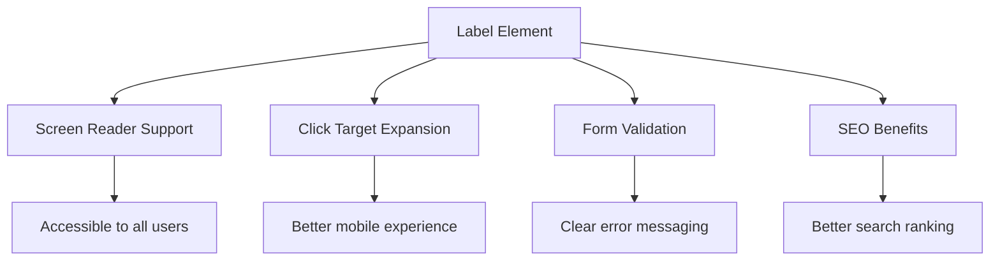
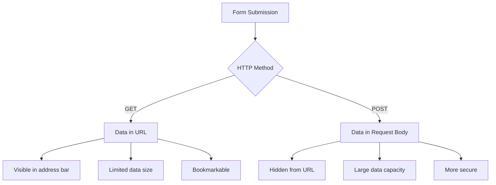
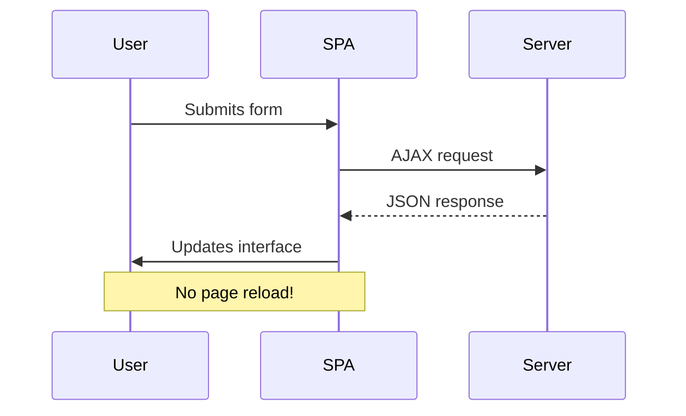
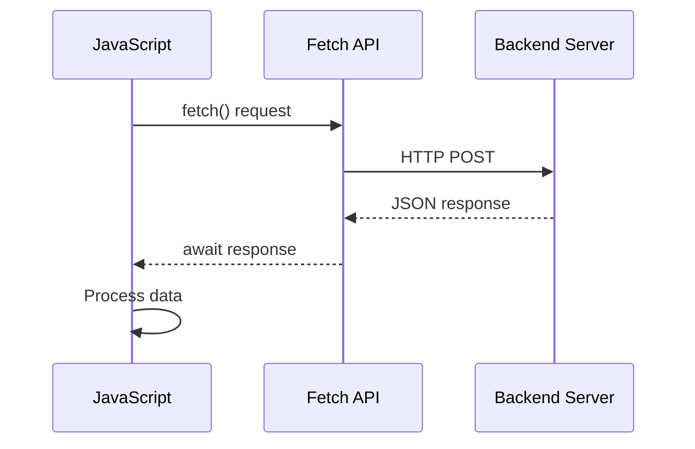
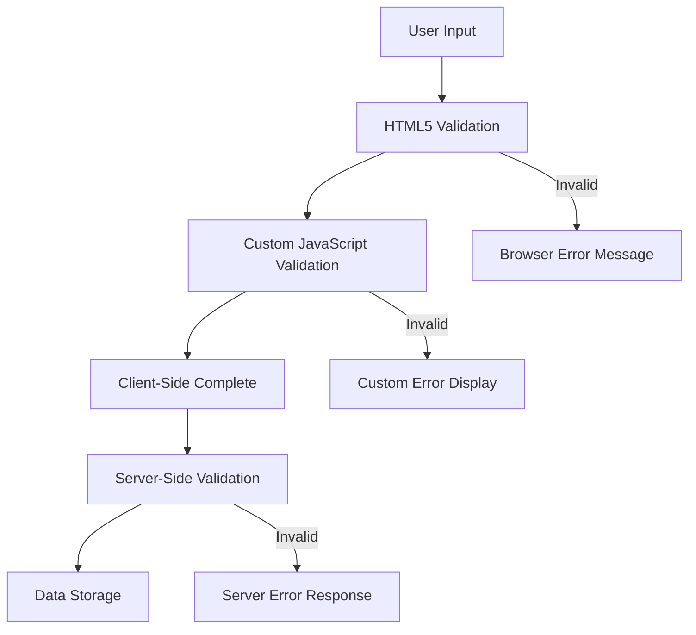
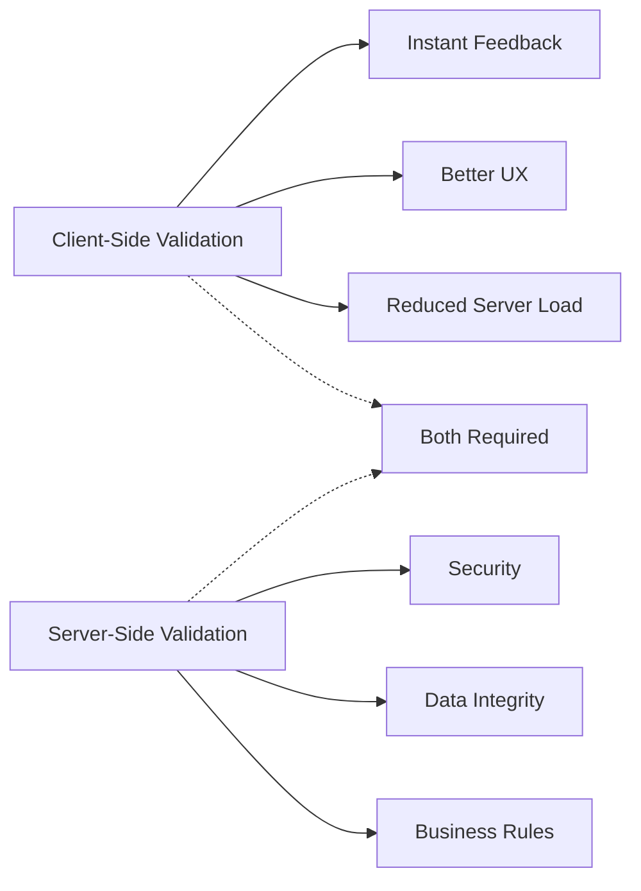

<!--
CO_OP_TRANSLATOR_METADATA:
{
  "original_hash": "b24f28fc46dd473aa9080f174182adde",
  "translation_date": "2025-10-22T22:50:09+00:00",
  "source_file": "7-bank-project/2-forms/README.md",
  "language_code": "mo"
}
-->
# 建立銀行應用程式第二部分：建立登入和註冊表單

## 課前測驗

[課前測驗](https://ff-quizzes.netlify.app/web/quiz/43)

你是否曾經在網上填寫表單時，因為電子郵件格式不正確而被拒絕？或者在點擊提交後丟失了所有信息？我們都遇到過這些令人沮喪的情況。

表單是用戶與應用程式功能之間的橋樑。就像空中交通管制員使用謹慎的協議來引導飛機安全到達目的地一樣，設計良好的表單可以提供清晰的反饋並防止代價高昂的錯誤。相反，設計不良的表單可能會像繁忙機場中的溝通不良一樣迅速趕走用戶。

在本課程中，我們將把你的靜態銀行應用程式轉變為互動式應用程式。你將學習如何建立能夠驗證用戶輸入、與伺服器通信並提供有用反饋的表單。可以將其視為構建控制介面，讓用戶能夠導航你的應用程式功能。

完成本課程後，你將擁有一個完整的登入和註冊系統，並具備引導用戶成功而非挫敗的驗證功能。

## 先決條件

在我們開始建立表單之前，讓我們確保你已正確設置好所有內容。本課程從上一課程結束的地方開始，因此如果你跳過了前面的內容，可能需要先回去完成基本設置。

### 必需的設置

| 組件 | 狀態 | 描述 |
|------|------|------|
| [HTML 模板](../1-template-route/README.md) | ✅ 必需 | 你的基本銀行應用程式結構 |
| [Node.js](https://nodejs.org) | ✅ 必需 | 用於伺服器的 JavaScript 運行時 |
| [銀行 API 伺服器](../api/README.md) | ✅ 必需 | 用於數據存儲的後端服務 |

> 💡 **開發提示**：你將同時運行兩個獨立的伺服器——一個用於前端銀行應用程式，另一個用於後端 API。這種設置模仿了前端和後端服務獨立運行的真實世界開發環境。

### 伺服器配置

**你的開發環境將包括：**
- **前端伺服器**：提供你的銀行應用程式（通常使用埠 `3000`）
- **後端 API 伺服器**：處理數據存儲和檢索（埠 `5000`）
- **兩個伺服器**可以同時運行而不會發生衝突

**測試你的 API 連接：**
```bash
curl http://localhost:5000/api
# Expected response: "Bank API v1.0.0"
```

**如果你看到 API 版本的回應，那麼你已準備好繼續！**

---

## 理解 HTML 表單和控件

HTML 表單是用戶與你的網頁應用程式溝通的方式。可以將它們想像成 19 世紀連接遙遠地點的電報系統——它們是用戶意圖與應用程式回應之間的通信協議。精心設計的表單可以捕捉錯誤、引導輸入格式並提供有用的建議。

現代表單比基本的文字輸入要複雜得多。HTML5 引入了專門的輸入類型，可以自動處理電子郵件驗證、數字格式和日期選擇。這些改進不僅有助於提高可訪問性，還能改善移動用戶的體驗。

### 基本表單元素

**每個表單都需要的構建塊：**

```html
<!-- Basic form structure -->
<form id="userForm" method="POST">
  <label for="username">Username</label>
  <input id="username" name="username" type="text" required>
  
  <button type="submit">Submit</button>
</form>
```

**這段代碼的作用：**
- **創建**一個具有唯一標識符的表單容器
- **指定**數據提交的 HTTP 方法
- **關聯**標籤與輸入框以提高可訪問性
- **定義**一個提交按鈕來處理表單

### 現代輸入類型和屬性

| 輸入類型 | 用途 | 使用範例 |
|----------|------|----------|
| `text` | 一般文字輸入 | `<input type="text" name="username">` |
| `email` | 電子郵件驗證 | `<input type="email" name="email">` |
| `password` | 隱藏文字輸入 | `<input type="password" name="password">` |
| `number` | 數字輸入 | `<input type="number" name="balance" min="0">` |
| `tel` | 電話號碼 | `<input type="tel" name="phone">` |

> 💡 **現代 HTML5 優勢**：使用特定的輸入類型可以提供自動驗證、適合的移動鍵盤以及更好的可訪問性支持，無需額外的 JavaScript！

### 按鈕類型和行為

```html
<!-- Different button behaviors -->
<button type="submit">Save Data</button>     <!-- Submits the form -->
<button type="reset">Clear Form</button>    <!-- Resets all fields -->
<button type="button">Custom Action</button> <!-- No default behavior -->
```

**每種按鈕類型的作用：**
- **提交按鈕**：觸發表單提交並將數據發送到指定的端點
- **重置按鈕**：將所有表單字段恢復到初始狀態
- **普通按鈕**：不提供默認行為，需要自定義 JavaScript 來實現功能

> ⚠️ **重要提示**：`<input>` 元素是自閉合的，不需要閉合標籤。現代最佳實踐是寫 `<input>` 而不加斜線。

### 建立你的登入表單

現在讓我們建立一個實用的登入表單，展示現代 HTML 表單的實踐。我們將從基本結構開始，逐步增強其可訪問性功能和驗證。

```html
<template id="login">
  <h1>Bank App</h1>
  <section>
    <h2>Login</h2>
    <form id="loginForm" novalidate>
      <div class="form-group">
        <label for="username">Username</label>
        <input id="username" name="user" type="text" required 
               autocomplete="username" placeholder="Enter your username">
      </div>
      <button type="submit">Login</button>
    </form>
  </section>
</template>
```

**這段代碼的作用：**
- **使用**語義化的 HTML5 元素構建表單
- **使用**具有有意義類別的 `div` 容器來分組相關元素
- **通過**`for` 和 `id` 屬性關聯標籤與輸入框
- **包含**現代屬性如 `autocomplete` 和 `placeholder` 以改善用戶體驗
- **添加**`novalidate` 以使用 JavaScript 而非瀏覽器默認方式進行驗證

### 標籤的重要性

**標籤對現代網頁開發的重要性：**



**正確標籤的作用：**
- **使**屏幕閱讀器能清晰地播報表單字段
- **擴大**可點擊區域（點擊標籤可聚焦輸入框）
- **改善**移動端可用性，提供更大的觸控目標
- **支持**表單驗證，提供有意義的錯誤信息
- **增強**SEO，為表單元素提供語義化意義

> 🎯 **可訪問性目標**：每個表單輸入框都應有相關的標籤。這個簡單的做法使你的表單對所有人，包括殘障用戶，都更易於使用，並改善所有用戶的體驗。

### 建立註冊表單

註冊表單需要更詳細的信息來創建完整的用戶帳戶。讓我們使用現代 HTML5 功能和增強的可訪問性來構建它。

```html
<hr/>
<h2>Register</h2>
<form id="registerForm" novalidate>
  <div class="form-group">
    <label for="user">Username</label>
    <input id="user" name="user" type="text" required 
           autocomplete="username" placeholder="Choose a username">
  </div>
  
  <div class="form-group">
    <label for="currency">Currency</label>
    <input id="currency" name="currency" type="text" value="$" 
           required maxlength="3" placeholder="USD, EUR, etc.">
  </div>
  
  <div class="form-group">
    <label for="description">Account Description</label>
    <input id="description" name="description" type="text" 
           maxlength="100" placeholder="Personal savings, checking, etc.">
  </div>
  
  <div class="form-group">
    <label for="balance">Starting Balance</label>
    <input id="balance" name="balance" type="number" value="0" 
           min="0" step="0.01" placeholder="0.00">
  </div>
  
  <button type="submit">Create Account</button>
</form>
```

**在上述代碼中，我們：**
- **將**每個字段組織在容器 div 中以便更好地進行樣式設計和佈局
- **添加**適當的 `autocomplete` 屬性以支持瀏覽器自動填充
- **包含**有用的佔位符文本以引導用戶輸入
- **設置**合理的默認值使用 `value` 屬性
- **應用**驗證屬性如 `required`、`maxlength` 和 `min`
- **使用**`type="number"` 為餘額字段提供小數支持

### 探索輸入類型和行為

**現代輸入類型提供了增強的功能：**

| 功能 | 優勢 | 範例 |
|------|------|------|
| `type="number"` | 移動端的數字鍵盤 | 更方便的餘額輸入 |
| `step="0.01"` | 小數精度控制 | 支持貨幣中的分 |
| `autocomplete` | 瀏覽器自動填充 | 更快的表單完成 |
| `placeholder` | 上下文提示 | 引導用戶期望 |

> 🎯 **可訪問性挑戰**：嘗試僅使用鍵盤導航表單！使用 `Tab` 移動字段，`Space` 選擇框，`Enter` 提交。這種體驗可以幫助你了解屏幕閱讀器用戶如何與表單交互。

## 理解表單提交方法

當有人填寫你的表單並點擊提交時，這些數據需要發送到某個地方——通常是伺服器來保存它們。有幾種不同的方式可以實現這一點，了解哪種方式最適合可以幫助你避免後續的麻煩。

讓我們來看看當有人點擊提交按鈕時實際發生了什麼。

### 表單的默認行為

首先，讓我們觀察基本表單提交的情況：

**測試你當前的表單：**
1. 點擊表單中的 *註冊* 按鈕
2. 觀察瀏覽器地址欄的變化
3. 注意頁面如何重新加載以及數據如何出現在 URL 中


### HTTP 方法比較



**理解差異：**

| 方法 | 使用情境 | 數據位置 | 安全等級 | 大小限制 |
|------|----------|----------|----------|----------|
| `GET` | 搜索查詢、篩選器 | URL 參數 | 低（可見） | 約 2000 字符 |
| `POST` | 用戶帳戶、敏感數據 | 請求正文 | 高（隱藏） | 無實際限制 |

**理解基本差異：**
- **GET**：將表單數據附加到 URL 作為查詢參數（適合搜索操作）
- **POST**：將數據包含在請求正文中（對敏感信息至關重要）
- **GET 的限制**：大小限制、數據可見、持久的瀏覽器歷史記錄
- **POST 的優勢**：大容量數據、隱私保護、支持文件上傳

> 💡 **最佳實踐**：使用 `GET` 用於搜索表單和篩選器（數據檢索），使用 `POST` 用於用戶註冊、登入和數據創建。

### 配置表單提交

讓我們配置你的註冊表單，以使用 POST 方法正確地與後端 API 通信：

```html
<form id="registerForm" action="//localhost:5000/api/accounts" 
      method="POST" novalidate>
```

**這段配置的作用：**
- **指向**表單提交到你的 API 端點
- **使用**POST 方法進行安全的數據傳輸
- **包含**`novalidate` 以使用 JavaScript 進行驗證

### 測試表單提交

**按照以下步驟測試你的表單：**
1. **填寫**註冊表單的相關信息
2. **點擊**"創建帳戶"按鈕
3. **觀察**瀏覽器中的伺服器回應


**你應該看到：**
- **瀏覽器重定向**到 API 端點 URL
- **JSON 回應**包含你新創建的帳戶數據
- **伺服器確認**帳戶已成功創建

> 🧪 **實驗時間**：嘗試使用相同的用戶名再次註冊。你會得到什麼回應？這有助於你了解伺服器如何處理重複數據和錯誤情況。

### 理解 JSON 回應

**當伺服器成功處理你的表單時：**
```json
{
  "user": "john_doe",
  "currency": "$",
  "description": "Personal savings",
  "balance": 100,
  "id": "unique_account_id"
}
```

**此回應確認：**
- **創建**一個具有指定數據的新帳戶
- **分配**一個唯一標識符以供未來參考
- **返回**所有帳戶信息以進行驗證
- **指示**成功存儲到數據庫

## 使用 JavaScript 處理現代表單

傳統的表單提交會導致整頁重新加載，就像早期的太空任務需要完全系統重置來進行航向修正一樣。這種方式會中斷用戶體驗並丟失應用程式狀態。

JavaScript 表單處理就像現代航天器使用的連續導航系統——在不丟失導航上下文的情況下進行即時調整。我們可以攔截表單提交，提供即時反饋，優雅地處理錯誤，並根據伺服器回應更新介面，同時保持用戶在應用程式中的位置。

### 為什麼避免頁面重新加載？



**使用 JavaScript 表單處理的好處：**
- **保持**應用程式狀態和用戶上下文
- **提供**即時反饋和加載指示
- **啟用**動態錯誤處理和驗證
- **創建**流暢的類似應用程式的用戶體驗
- **允許**基於伺服器回應的條件邏輯

### 從傳統表單過渡到現代表單

**傳統方法的挑戰：**
- **重定向**用戶離開你的應用程式
- **丟失**當前應用程式狀態和上下文
- **需要**為簡單操作進行整頁重新加載
- **提供**有限的用戶反饋控制

**現代 JavaScript 方法的優勢：**
- **保持**用戶在你的應用程式內
- **維持**所有應用程式狀態和數據
- **啟用**即時驗證和反饋
- **支持**漸進式增強和可訪問性

### 實現 JavaScript 表單處理

讓我們用現代 JavaScript 事件處理來替代傳統的表單提交：

```html
<!-- Remove the action attribute and add event handling -->
<form id="registerForm" method="POST" novalidate>
```

**將註冊邏輯添加到你的 `app.js` 文件：**

```javascript
// Modern event-driven form handling
function register() {
  const registerForm = document.getElementById('registerForm');
  const formData = new FormData(registerForm);
  const data = Object.fromEntries(formData);
  const jsonData = JSON.stringify(data);
  
  console.log('Form data prepared:', data);
}

// Attach event listener when the page loads
document.addEventListener('DOMContentLoaded', () => {
  const registerForm = document.getElementById('registerForm');
  registerForm.addEventListener('submit', (event) => {
    event.preventDefault(); // Prevent default form submission
    register();
  });
});
```

**這段代碼的作用：**
- **阻止**使用 `event.preventDefault()` 的默認表單提交
- **檢索**表單元素，使用現代 DOM 選擇
- **提取**表單數據，使用強大的 `FormData` API
- **將**FormData 轉換為普通對象，使用 `Object.fromEntries()`
- **序列化**數據為 JSON 格式以進行伺服器通信
- **記錄**處理後的數據以進行調試和驗證

### 理解 FormData API

**FormData API 提供強大的表單處理功能：**

```javascript
// Example of what FormData captures
const formData = new FormData(registerForm);

// FormData automatically captures:
// {
//   "user": "john_doe",
//   "currency": "$", 
//   "description": "Personal account",
//   "balance": "100"
// }
```

**FormData API 的優勢：**
- **全面收集**：捕獲所有表單元素，包括文字、文件和複雜輸入
- **類型感知**：自動處理不同的輸入類型，無需自定義編碼
- **高效**：通過單一 API 調用消除手動字段收集
- **適應性**：隨著表單結構的演變保持功能

### 創建伺服器通信函數

現在讓我們使用現代 JavaScript 模式構建一個強大的函數來與你的 API 伺服器通信：

```javascript
async function createAccount(account) {
  try {
    const response = await fetch('//localhost:5000/api/accounts', {
      method: 'POST',
      headers: { 
        'Content-Type': 'application/json',
        'Accept': 'application/json'
      },
      body: account
    });
    
    // Check if the response was successful
    if (!response.ok) {
      throw new Error(`HTTP error! status: ${response.status}`);
    }
    
    return await response.json();
  } catch (error) {
    console.error('Account creation failed:', error);
    return { error: error.message || 'Network error occurred' };
  }
}
```

**理解異步 JavaScript：**



**這段現代實現的作用：**
- **使用**`async/await` 實現可讀的異步代碼
- **包含**使用 try/catch 塊的正確錯誤處理
- **檢查**回應狀態後再處理數據
- **設置**適當的標頭以進行 JSON 通信
- **提供**詳細的錯誤訊息以便進行除錯  
- **返回**一致的數據結構以處理成功和錯誤情況  

### 現代 Fetch API 的力量  

**Fetch API 相較於舊方法的優勢：**  

| 功能 | 優勢 | 實現方式 |  
|------|------|----------|  
| 基於 Promise | 簡潔的異步代碼 | `await fetch()` |  
| 請求自定義 | 完整的 HTTP 控制 | Headers、methods、body |  
| 響應處理 | 靈活的數據解析 | `.json()`、`.text()`、`.blob()` |  
| 錯誤處理 | 全面的錯誤捕捉 | Try/catch blocks |  

> 🎥 **了解更多**：[Async/Await 教學](https://youtube.com/watch?v=YwmlRkrxvkk) - 理解現代網頁開發中的異步 JavaScript 模式。  

**伺服器通信的關鍵概念：**  
- **異步函數**允許在等待伺服器響應時暫停執行  
- **Await 關鍵字**使異步代碼看起來像同步代碼  
- **Fetch API**提供現代化、基於 Promise 的 HTTP 請求  
- **錯誤處理**確保您的應用程序能夠優雅地應對網絡問題  

### 完成註冊功能  

讓我們將所有內容結合起來，完成一個完整的、可用於生產環境的註冊功能：  

```javascript
async function register() {
  const registerForm = document.getElementById('registerForm');
  const submitButton = registerForm.querySelector('button[type="submit"]');
  
  try {
    // Show loading state
    submitButton.disabled = true;
    submitButton.textContent = 'Creating Account...';
    
    // Process form data
    const formData = new FormData(registerForm);
    const jsonData = JSON.stringify(Object.fromEntries(formData));
    
    // Send to server
    const result = await createAccount(jsonData);
    
    if (result.error) {
      console.error('Registration failed:', result.error);
      alert(`Registration failed: ${result.error}`);
      return;
    }
    
    console.log('Account created successfully!', result);
    alert(`Welcome, ${result.user}! Your account has been created.`);
    
    // Reset form after successful registration
    registerForm.reset();
    
  } catch (error) {
    console.error('Unexpected error:', error);
    alert('An unexpected error occurred. Please try again.');
  } finally {
    // Restore button state
    submitButton.disabled = false;
    submitButton.textContent = 'Create Account';
  }
}
```
  
**此增強的實現包括：**  
- **提供**表單提交過程中的視覺反饋  
- **禁用**提交按鈕以防止重複提交  
- **優雅地處理**預期和非預期的錯誤  
- **顯示**用戶友好的成功和錯誤訊息  
- **在成功註冊後重置**表單  
- **無論結果如何都恢復**UI狀態  

### 測試您的實現  

**打開瀏覽器開發者工具並測試註冊功能：**  

1. **打開**瀏覽器控制台 (F12 → Console 標籤)  
2. **填寫**註冊表單  
3. **點擊**"創建帳戶"  
4. **觀察**控制台消息和用戶反饋  

  

**您應該看到：**  
- **加載狀態**顯示在提交按鈕上  
- **控制台日誌**顯示有關過程的詳細信息  
- **成功消息**在帳戶創建成功時顯示  
- **表單在成功提交後自動重置**  

> 🔒 **安全考量**：目前，數據通過 HTTP 傳輸，這在生產環境中並不安全。在實際應用中，請始終使用 HTTPS 來加密數據傳輸。了解更多關於 [HTTPS 安全性](https://en.wikipedia.org/wiki/HTTPS) 以及它對保護用戶數據的重要性。  

## 全面的表單驗證  

表單驗證可以防止用戶在提交後才發現錯誤的令人沮喪的體驗。就像國際空間站上的多重冗餘系統一樣，有效的驗證需要多層次的安全檢查。  

最佳方法是結合瀏覽器級別的驗證以提供即時反饋、JavaScript 驗證以增強用戶體驗，以及伺服器端驗證以確保安全性和數據完整性。這種冗餘性既能提高用戶滿意度，也能保護系統。  

### 理解驗證層次  


  
**多層次驗證策略：**  
- **HTML5 驗證**：即時的瀏覽器檢查  
- **JavaScript 驗證**：自定義邏輯和用戶體驗  
- **伺服器驗證**：最終的安全性和數據完整性檢查  
- **漸進增強**：即使 JavaScript 被禁用也能正常工作  

### HTML5 驗證屬性  

**您可以使用的現代驗證工具：**  

| 屬性 | 用途 | 使用範例 | 瀏覽器行為 |  
|------|------|----------|------------|  
| `required` | 必填字段 | `<input required>` | 防止空白提交 |  
| `minlength`/`maxlength` | 文本長度限制 | `<input maxlength="20">` | 強制字符限制 |  
| `min`/`max` | 數值範圍 | `<input min="0" max="1000">` | 驗證數字範圍 |  
| `pattern` | 自定義正則表達式規則 | `<input pattern="[A-Za-z]+">` | 匹配特定格式 |  
| `type` | 數據類型驗證 | `<input type="email">` | 格式特定驗證 |  

### CSS 驗證樣式  

**為驗證狀態創建視覺反饋：**  

```css
/* Valid input styling */
input:valid {
  border-color: #28a745;
  background-color: #f8fff9;
}

/* Invalid input styling */
input:invalid {
  border-color: #dc3545;
  background-color: #fff5f5;
}

/* Focus states for better accessibility */
input:focus:valid {
  box-shadow: 0 0 0 0.2rem rgba(40, 167, 69, 0.25);
}

input:focus:invalid {
  box-shadow: 0 0 0 0.2rem rgba(220, 53, 69, 0.25);
}
```
  
**這些視覺提示的作用：**  
- **綠色邊框**：表示驗證成功，就像任務控制中心的綠燈  
- **紅色邊框**：表示需要注意的驗證錯誤  
- **焦點高亮**：為當前輸入位置提供清晰的視覺上下文  
- **一致的樣式**：建立用戶可以學習的可預測界面模式  

> 💡 **專業提示**：使用 `:valid` 和 `:invalid` CSS 偽類，為用戶在輸入時提供即時的視覺反饋，創造一個響應式且有幫助的界面。  

### 實現全面的驗證  

讓我們通過強大的驗證來增強您的註冊表單，提供卓越的用戶體驗和數據質量：  

```html
<form id="registerForm" method="POST" novalidate>
  <div class="form-group">
    <label for="user">Username <span class="required">*</span></label>
    <input id="user" name="user" type="text" required 
           minlength="3" maxlength="20" 
           pattern="[a-zA-Z0-9_]+" 
           autocomplete="username"
           title="Username must be 3-20 characters, letters, numbers, and underscores only">
    <small class="form-text">Choose a unique username (3-20 characters)</small>
  </div>
  
  <div class="form-group">
    <label for="currency">Currency <span class="required">*</span></label>
    <input id="currency" name="currency" type="text" required 
           value="$" maxlength="3" 
           pattern="[A-Z$€£¥₹]+" 
           title="Enter a valid currency symbol or code">
    <small class="form-text">Currency symbol (e.g., $, €, £)</small>
  </div>
  
  <div class="form-group">
    <label for="description">Account Description</label>
    <input id="description" name="description" type="text" 
           maxlength="100" 
           placeholder="Personal savings, checking, etc.">
    <small class="form-text">Optional description (up to 100 characters)</small>
  </div>
  
  <div class="form-group">
    <label for="balance">Starting Balance</label>
    <input id="balance" name="balance" type="number" 
           value="0" min="0" step="0.01" 
           title="Enter a positive number for your starting balance">
    <small class="form-text">Initial account balance (minimum $0.00)</small>
  </div>
  
  <button type="submit">Create Account</button>
</form>
```
  
**理解增強的驗證：**  
- **結合**必填字段指示器和有幫助的描述  
- **包含**`pattern`屬性以進行格式驗證  
- **提供**`title`屬性以提高可訪問性和工具提示  
- **添加**輔助文本以指導用戶輸入  
- **使用**語義化 HTML 結構以提高可訪問性  

### 高級驗證規則  

**每個驗證規則的作用：**  

| 字段 | 驗證規則 | 用戶收益 |  
|------|----------|----------|  
| 用戶名 | `required`、`minlength="3"`、`maxlength="20"`、`pattern="[a-zA-Z0-9_]+"` | 確保有效且唯一的標識符 |  
| 貨幣 | `required`、`maxlength="3"`、`pattern="[A-Z$€£¥₹]+"` | 接受常見的貨幣符號 |  
| 餘額 | `min="0"`、`step="0.01"`、`type="number"` | 防止負餘額 |  
| 描述 | `maxlength="100"` | 合理的長度限制 |  

### 測試驗證行為  

**嘗試以下驗證場景：**  
1. **提交**表單時必填字段為空  
2. **輸入**少於 3 個字符的用戶名  
3. **嘗試**在用戶名字段中輸入特殊字符  
4. **輸入**負餘額  

  

**您將觀察到：**  
- **瀏覽器顯示**原生驗證消息  
- **樣式根據**`:valid` 和 `:invalid` 狀態發生變化  
- **表單提交**在所有驗證通過之前被阻止  
- **焦點自動**移動到第一個無效字段  

### 客戶端驗證與伺服器端驗證  


  
**為什麼需要兩層驗證：**  
- **客戶端驗證**：提供即時反饋並改善用戶體驗  
- **伺服器端驗證**：確保安全性並處理複雜的業務規則  
- **結合方法**：創建穩健、用戶友好且安全的應用程序  
- **漸進增強**：即使 JavaScript 被禁用也能正常工作  

> 🛡️ **安全提醒**：絕不能僅依賴客戶端驗證！惡意用戶可以繞過客戶端檢查，因此伺服器端驗證對於安全性和數據完整性至關重要。  

---

---

## GitHub Copilot Agent 挑戰 🚀  

使用 Agent 模式完成以下挑戰：  

**描述：** 使用全面的客戶端驗證和用戶反饋增強註冊表單。此挑戰將幫助您練習表單驗證、錯誤處理以及通過交互式反饋改善用戶體驗。  

**提示：** 為註冊表單創建完整的驗證系統，包括：1) 用戶輸入時每個字段的即時驗證反饋，2) 每個輸入字段下方顯示自定義驗證消息，3) 密碼確認字段及匹配驗證，4) 視覺指示器（例如有效字段的綠色勾選和無效字段的紅色警告），5) 只有當所有驗證通過時，提交按鈕才會啟用。使用 HTML5 驗證屬性、CSS 進行驗證狀態樣式設計，以及 JavaScript 實現交互行為。  

了解更多關於 [agent mode](https://code.visualstudio.com/blogs/2025/02/24/introducing-copilot-agent-mode) 的信息。  

## 🚀 挑戰  

在 HTML 中顯示錯誤消息，提示用戶已存在。  

以下是一個經過一些樣式設計後的最終登錄頁面示例：  

  

## 課後測驗  

[課後測驗](https://ff-quizzes.netlify.app/web/quiz/44)  

## 回顧與自學  

開發者在表單構建方面非常有創意，尤其是在驗證策略方面。通過瀏覽 [CodePen](https://codepen.com) 了解不同的表單流程；看看您是否能找到一些有趣且鼓舞人心的表單。  

## 作業  

[設計您的銀行應用程式](assignment.md)  

---

**免責聲明**：  
本文件已使用 AI 翻譯服務 [Co-op Translator](https://github.com/Azure/co-op-translator) 進行翻譯。儘管我們努力確保準確性，但請注意，自動翻譯可能包含錯誤或不準確之處。原始文件的母語版本應被視為權威來源。對於關鍵信息，建議使用專業人工翻譯。我們對因使用此翻譯而產生的任何誤解或誤釋不承擔責任。