<!--
CO_OP_TRANSLATOR_METADATA:
{
  "original_hash": "7cbdbd132d39a2bb493e85bc2a9387cc",
  "translation_date": "2025-11-03T23:49:37+00:00",
  "source_file": "7-bank-project/2-forms/README.md",
  "language_code": "mo"
}
-->
# 建立銀行應用程式第2部分：建立登入和註冊表單

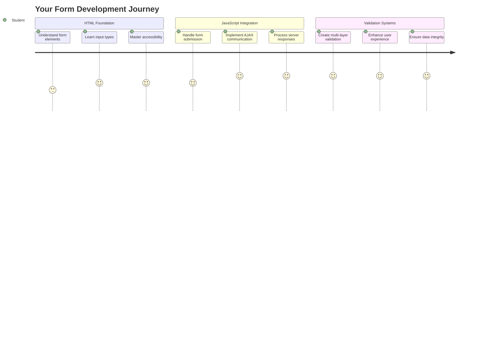

## 課前測驗

[課前測驗](https://ff-quizzes.netlify.app/web/quiz/43)

你是否曾經在網上填寫表單時，因為電子郵件格式不正確而被拒絕？或者在點擊提交後丟失了所有信息？我們都遇到過這些令人沮喪的情況。

表單是用戶與應用程式功能之間的橋樑。就像空中交通管制員使用謹慎的協議來引導飛機安全到達目的地一樣，設計良好的表單能提供清晰的反饋並防止代價高昂的錯誤。相反，設計不良的表單可能會像繁忙機場中的溝通不暢一樣迅速趕走用戶。

在本課程中，我們將把你的靜態銀行應用程式轉變為一個互動式應用程式。你將學習如何建立能驗證用戶輸入、與伺服器通信並提供有用反饋的表單。可以將其視為建立控制介面，讓用戶能夠導航你的應用程式功能。

完成後，你將擁有一個完整的登入和註冊系統，並具備引導用戶成功而非沮喪的驗證功能。

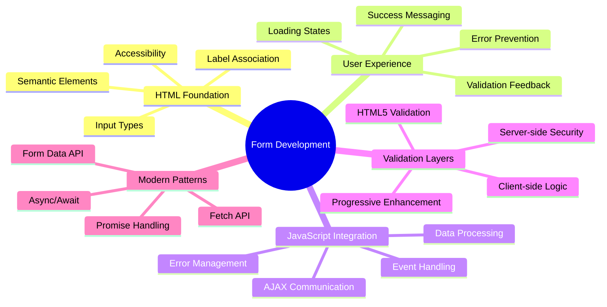

## 先決條件

在開始建立表單之前，讓我們確保你已正確設置好所有內容。本課程從上一課程結束的地方開始，因此如果你跳過了前面的部分，可能需要先回去完成基本設置。

### 必要設置

| 組件 | 狀態 | 描述 |
|------|------|------|
| [HTML模板](../1-template-route/README.md) | ✅ 必需 | 你的基本銀行應用程式結構 |
| [Node.js](https://nodejs.org) | ✅ 必需 | 伺服器的JavaScript運行環境 |
| [銀行API伺服器](../api/README.md) | ✅ 必需 | 用於數據存儲的後端服務 |

> 💡 **開發提示**：你將同時運行兩個獨立的伺服器——一個用於前端銀行應用程式，另一個用於後端API。這種設置模擬了前端和後端服務獨立運行的真實世界開發環境。

### 伺服器配置

**你的開發環境將包括：**
- **前端伺服器**：提供你的銀行應用程式（通常使用端口`3000`）
- **後端API伺服器**：處理數據存儲和檢索（端口`5000`）
- **兩個伺服器**可以同時運行且不會衝突

**測試你的API連接：**
```bash
curl http://localhost:5000/api
# Expected response: "Bank API v1.0.0"
```

**如果你看到API版本響應，說明你已準備好繼續！**

---

## 理解HTML表單和控件

HTML表單是用戶與你的網頁應用程式溝通的方式。可以將它們比作19世紀連接遙遠地點的電報系統——它們是用戶意圖與應用程式響應之間的通信協議。精心設計的表單能捕捉錯誤、引導輸入格式並提供有用的建議。

現代表單比基本的文字輸入要複雜得多。HTML5引入了專門的輸入類型，能自動處理電子郵件驗證、數字格式和日期選擇等功能。這些改進不僅提升了可訪問性，還改善了移動用戶的使用體驗。

### 基本表單元素

**每個表單都需要的構建塊：**

```html
<!-- Basic form structure -->
<form id="userForm" method="POST">
  <label for="username">Username</label>
  <input id="username" name="username" type="text" required>
  
  <button type="submit">Submit</button>
</form>
```

**這段代碼的作用：**
- **創建**一個具有唯一標識符的表單容器
- **指定**提交數據的HTTP方法
- **關聯**標籤與輸入框以提高可訪問性
- **定義**提交按鈕以處理表單

### 現代輸入類型和屬性

| 輸入類型 | 用途 | 使用範例 |
|----------|------|----------|
| `text` | 一般文字輸入 | `<input type="text" name="username">` |
| `email` | 電子郵件驗證 | `<input type="email" name="email">` |
| `password` | 隱藏文字輸入 | `<input type="password" name="password">` |
| `number` | 數字輸入 | `<input type="number" name="balance" min="0">` |
| `tel` | 電話號碼 | `<input type="tel" name="phone">` |

> 💡 **現代HTML5優勢**：使用特定的輸入類型可以提供自動驗證、適合的移動鍵盤以及更好的可訪問性支持，無需額外的JavaScript！

### 按鈕類型和行為

```html
<!-- Different button behaviors -->
<button type="submit">Save Data</button>     <!-- Submits the form -->
<button type="reset">Clear Form</button>    <!-- Resets all fields -->
<button type="button">Custom Action</button> <!-- No default behavior -->
```

**每種按鈕類型的作用：**
- **提交按鈕**：觸發表單提交並將數據發送到指定的端點
- **重置按鈕**：將所有表單字段恢復到初始狀態
- **普通按鈕**：不提供默認行為，需要自定義JavaScript來實現功能

> ⚠️ **重要提示**：`<input>`元素是自閉合的，不需要閉合標籤。現代最佳實踐是使用`<input>`而不加斜杠。

### 建立你的登入表單

現在讓我們創建一個實用的登入表單，展示現代HTML表單的實踐。我們將從基本結構開始，逐步增強其可訪問性功能和驗證。

```html
<template id="login">
  <h1>Bank App</h1>
  <section>
    <h2>Login</h2>
    <form id="loginForm" novalidate>
      <div class="form-group">
        <label for="username">Username</label>
        <input id="username" name="user" type="text" required 
               autocomplete="username" placeholder="Enter your username">
      </div>
      <button type="submit">Login</button>
    </form>
  </section>
</template>
```

**分解這段代碼的作用：**
- **使用語義化HTML5元素**來構建表單
- **使用`div`容器和有意義的類名**來分組相關元素
- **使用`for`和`id`屬性**關聯標籤與輸入框
- **包含現代屬性**如`autocomplete`和`placeholder`以提升用戶體驗
- **添加`novalidate`**以使用JavaScript而非瀏覽器默認方式進行驗證

### 正確標籤的力量

**為什麼標籤對現代網頁開發至關重要：**

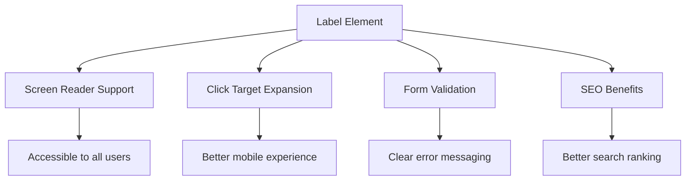

**正確標籤的作用：**
- **使屏幕閱讀器能清晰地播報表單字段**
- **擴大可點擊區域（點擊標籤可聚焦到輸入框）**
- **改善移動端使用體驗，提供更大的觸控目標**
- **支持表單驗證，提供有意義的錯誤信息**
- **通過為表單元素提供語義意義來提升SEO**

> 🎯 **可訪問性目標**：每個表單輸入框都應有一個關聯的標籤。這個簡單的做法使你的表單對所有人都可用，包括有殘疾的用戶，並改善所有用戶的使用體驗。

### 建立註冊表單

註冊表單需要更詳細的信息來創建完整的用戶帳戶。讓我們使用現代HTML5功能和增強的可訪問性來構建它。

```html
<hr/>
<h2>Register</h2>
<form id="registerForm" novalidate>
  <div class="form-group">
    <label for="user">Username</label>
    <input id="user" name="user" type="text" required 
           autocomplete="username" placeholder="Choose a username">
  </div>
  
  <div class="form-group">
    <label for="currency">Currency</label>
    <input id="currency" name="currency" type="text" value="$" 
           required maxlength="3" placeholder="USD, EUR, etc.">
  </div>
  
  <div class="form-group">
    <label for="description">Account Description</label>
    <input id="description" name="description" type="text" 
           maxlength="100" placeholder="Personal savings, checking, etc.">
  </div>
  
  <div class="form-group">
    <label for="balance">Starting Balance</label>
    <input id="balance" name="balance" type="number" value="0" 
           min="0" step="0.01" placeholder="0.00">
  </div>
  
  <button type="submit">Create Account</button>
</form>
```

**在上述代碼中，我們：**
- **將每個字段組織在容器div中**以便更好地進行樣式和佈局
- **添加適當的`autocomplete`屬性**以支持瀏覽器自動填充
- **包含有用的佔位符文本**以引導用戶輸入
- **使用`value`屬性設置合理的默認值**
- **應用驗證屬性**如`required`、`maxlength`和`min`
- **使用`type="number"`**為餘額字段提供小數支持

### 探索輸入類型和行為

**現代輸入類型提供了增強的功能：**

| 功能 | 優勢 | 範例 |
|------|------|------|
| `type="number"` | 移動端的數字鍵盤 | 更方便的餘額輸入 |
| `step="0.01"` | 控制小數精度 | 支持貨幣中的分 |
| `autocomplete` | 瀏覽器自動填充 | 更快的表單完成 |
| `placeholder` | 上下文提示 | 引導用戶期望 |

> 🎯 **可訪問性挑戰**：嘗試僅使用鍵盤導航表單！使用`Tab`移動字段，使用`Space`選擇框，使用`Enter`提交。這種體驗能幫助你理解屏幕閱讀器用戶如何與表單互動。

### 🔄 **教學檢查點**
**表單基礎理解**：在實現JavaScript之前，確保你理解：
- ✅ 語義化HTML如何創建可訪問的表單結構
- ✅ 為什麼輸入類型對移動鍵盤和驗證很重要
- ✅ 標籤與表單控件之間的關係
- ✅ 表單屬性如何影響瀏覽器的默認行為

**快速自測**：如果在沒有JavaScript處理的情況下提交表單會發生什麼？
*答案：瀏覽器執行默認提交，通常重定向到action URL*

**HTML5表單的好處**：現代表單提供：
- **內建驗證**：自動檢查電子郵件和數字格式
- **移動優化**：適合不同輸入類型的鍵盤
- **可訪問性**：屏幕閱讀器支持和鍵盤導航
- **漸進增強**：即使JavaScript被禁用也能正常工作

## 理解表單提交方法

當有人填寫你的表單並點擊提交時，這些數據需要發送到某個地方——通常是伺服器來保存它。有幾種不同的方式可以實現，了解哪種方式最適合可以幫助你避免後續的麻煩。

讓我們來看看當有人點擊提交按鈕時實際發生了什麼。

### 表單的默認行為

首先，讓我們觀察基本表單提交的情況：

**測試你當前的表單：**
1. 點擊表單中的*註冊*按鈕
2. 觀察瀏覽器地址欄的變化
3. 注意頁面如何重新加載以及數據如何出現在URL中


### HTTP方法比較

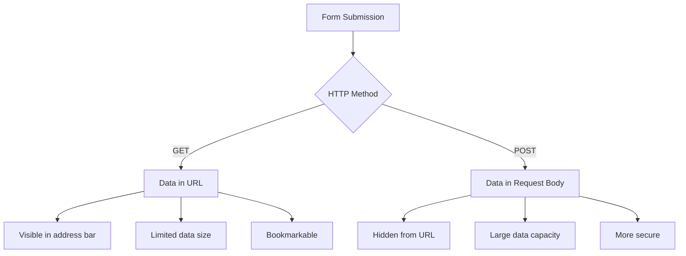

**理解差異：**

| 方法 | 使用場景 | 數據位置 | 安全等級 | 大小限制 |
|------|----------|----------|----------|----------|
| `GET` | 搜索查詢、篩選器 | URL參數 | 低（可見） | 約2000字符 |
| `POST` | 用戶帳戶、敏感數據 | 請求正文 | 高（隱藏） | 無實際限制 |

**理解基本差異：**
- **GET**：將表單數據附加到URL作為查詢參數（適合搜索操作）
- **POST**：將數據包含在請求正文中（對敏感信息至關重要）
- **GET的限制**：大小限制、數據可見、持久的瀏覽器歷史
- **POST的優勢**：大數據容量、隱私保護、支持文件上傳

> 💡 **最佳實踐**：使用`GET`進行搜索表單和篩選（數據檢索），使用`POST`進行用戶註冊、登入和數據創建。

### 配置表單提交

讓我們配置你的註冊表單以正確地與後端API通信，使用POST方法：

```html
<form id="registerForm" action="//localhost:5000/api/accounts" 
      method="POST" novalidate>
```

**這段配置的作用：**
- **指導**表單提交到你的API端點
- **使用**POST方法進行安全的數據傳輸
- **包含**`novalidate`以使用JavaScript進行驗證

### 測試表單提交

**按照以下步驟測試你的表單：**
1. **填寫**註冊表單信息
2. **點擊**"創建帳戶"按鈕
3. **觀察**瀏覽器中的伺服器響應

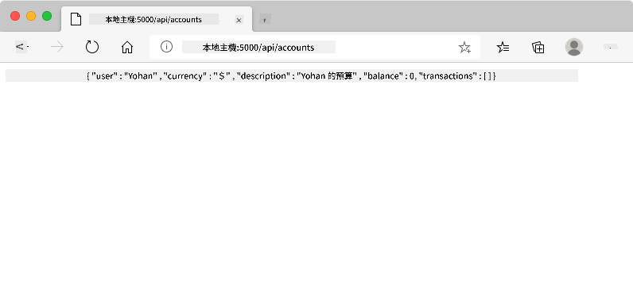

**你應該看到：**
- **瀏覽器重定向**到API端點URL
- **JSON響應**包含你新創建的帳戶數據
- **伺服器確認**帳戶已成功創建

> 🧪 **實驗時間**：嘗試使用相同的用戶名再次註冊。你會得到什麼響應？這有助於你理解伺服器如何處理重複數據和錯誤情況。

### 理解JSON響應

**當伺服器成功處理你的表單時：**
```json
{
  "user": "john_doe",
  "currency": "$",
  "description": "Personal savings",
  "balance": 100,
  "id": "unique_account_id"
}
```

**此響應確認：**
- **創建**一個包含指定數據的新帳戶
- **分配**一個唯一標識符以供未來參考
- **返回**所有帳戶信息以供驗證
- **表明**數據已成功存儲到數據庫

## 使用JavaScript進行現代表單處理

傳統的表單提交會導致整頁重新加載，就像早期的太空任務需要完全系統重置來進行航向修正一樣。這種方式會中斷用戶體驗並丟失應用程式狀態。

JavaScript表單處理就像現代航天器使用的連續導航系統——在不丟失導航上下文的情況下進行實時調整。我們可以攔截表單提交，提供即時反饋，優雅地處理錯誤，並根據伺服器響應更新界面，同時保持用戶在應用程式中的位置。

### 為什麼避免頁面重新加載？

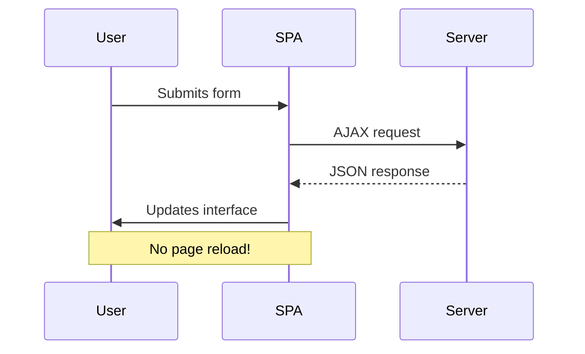

**使用JavaScript表單處理的好處：**
- **保持**應用程式狀態和用戶上下文
- **提供**即時反饋和加載指示器
- **支持**動態錯誤處理和驗證
- **創建**流暢的類似應用程式的用戶體驗
- **允許**基於伺服器響應的條件邏輯

### 從傳統表單過渡到現代表單

**傳統方法的挑戰：**
- **重定向**用戶離開你的應用程式
- **丟失**當前應用程式狀態和上下文
- **需要**為簡單操作進行整頁重新加載
- **提供**有限的用戶反饋控制

**現代JavaScript方法的優勢：**
- **保持**用戶在你的應用程式內
- **維持**所有應用程式狀態和數據
- **支持**即時驗證和反饋
- **支持**漸進增強和可訪問性

### 實現JavaScript表單處理

讓我們用現代JavaScript事件處理來替代傳統的表單提交：

```html
<!-- Remove the action attribute and add event handling -->
<form id="registerForm" method="POST" novalidate>
```

**將註冊邏輯添加到你的`app.js`文件：**

```javascript
// Modern event-driven form handling
function register() {
  const registerForm = document.getElementById('registerForm');
  const formData = new FormData(registerForm);
  const data = Object.fromEntries(formData);
  const jsonData = JSON.stringify(data);
  
  console.log('Form data prepared:', data);
}

// Attach event listener when the page loads
document.addEventListener('DOMContentLoaded', () => {
  const registerForm = document.getElementById('registerForm');
  registerForm.addEventListener('submit', (event) => {
    event.preventDefault(); // Prevent default form submission
    register();
  });
});
```

**分解這段代碼的作用：**
- **使用`event.preventDefault()`**阻止默認表單提交
- **使用現代DOM選擇**檢索表單元素
- **使用強大的`FormData`API**提取表單數據
- **使用`Object.fromEntries()`**將FormData轉換為普通對象
- **將數據序列化為JSON格式**以便與伺服器通信
- **記錄**處理後的數據以進行調試和驗證

### 理解FormData API

**FormData API提供強大的表單處理功能：**
```javascript
// Example of what FormData captures
const formData = new FormData(registerForm);

// FormData automatically captures:
// {
//   "user": "john_doe",
//   "currency": "$", 
//   "description": "Personal account",
//   "balance": "100"
// }
```

**FormData API 的優勢：**
- **全面收集**：捕捉所有表單元素，包括文字、檔案和複雜輸入
- **類型感知**：自動處理不同的輸入類型，無需自訂程式碼
- **高效性**：透過單一 API 呼叫，省去手動收集欄位的麻煩
- **適應性**：隨著表單結構的演變，仍能保持功能正常

### 建立伺服器通訊函數

現在讓我們使用現代 JavaScript 模式來建立一個穩健的函數，用於與 API 伺服器進行通訊：

```javascript
async function createAccount(account) {
  try {
    const response = await fetch('//localhost:5000/api/accounts', {
      method: 'POST',
      headers: { 
        'Content-Type': 'application/json',
        'Accept': 'application/json'
      },
      body: account
    });
    
    // Check if the response was successful
    if (!response.ok) {
      throw new Error(`HTTP error! status: ${response.status}`);
    }
    
    return await response.json();
  } catch (error) {
    console.error('Account creation failed:', error);
    return { error: error.message || 'Network error occurred' };
  }
}
```

**理解非同步 JavaScript：**

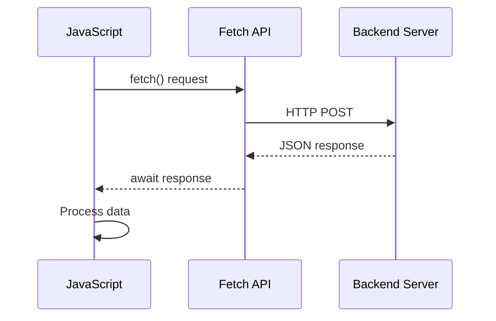

**此現代實現的功能：**
- **使用** `async/await` 使非同步程式碼更易讀
- **包含** 使用 try/catch 區塊的正確錯誤處理
- **檢查** 回應狀態後再處理資料
- **設定** 適當的標頭以進行 JSON 通訊
- **提供** 詳細的錯誤訊息以便除錯
- **回傳** 一致的資料結構以處理成功和錯誤情況

### 現代 Fetch API 的威力

**Fetch API 相較於舊方法的優勢：**

| 功能 | 優點 | 實現方式 |
|------|------|----------|
| 基於 Promise | 簡潔的非同步程式碼 | `await fetch()` |
| 請求自訂化 | 完整的 HTTP 控制 | 標頭、方法、主體 |
| 回應處理 | 彈性資料解析 | `.json()`、`.text()`、`.blob()` |
| 錯誤處理 | 全面的錯誤捕捉 | Try/catch 區塊 |

> 🎥 **了解更多**：[Async/Await 教學](https://youtube.com/watch?v=YwmlRkrxvkk) - 理解現代網頁開發中的非同步 JavaScript 模式。

**伺服器通訊的關鍵概念：**
- **非同步函數**允許在等待伺服器回應時暫停執行
- **Await 關鍵字**使非同步程式碼看起來像同步程式碼
- **Fetch API**提供現代化、基於 Promise 的 HTTP 請求
- **錯誤處理**確保應用程式能優雅地應對網路問題

### 完成註冊函數

讓我們將所有內容整合，建立一個完整的、可用於生產環境的註冊函數：

```javascript
async function register() {
  const registerForm = document.getElementById('registerForm');
  const submitButton = registerForm.querySelector('button[type="submit"]');
  
  try {
    // Show loading state
    submitButton.disabled = true;
    submitButton.textContent = 'Creating Account...';
    
    // Process form data
    const formData = new FormData(registerForm);
    const jsonData = JSON.stringify(Object.fromEntries(formData));
    
    // Send to server
    const result = await createAccount(jsonData);
    
    if (result.error) {
      console.error('Registration failed:', result.error);
      alert(`Registration failed: ${result.error}`);
      return;
    }
    
    console.log('Account created successfully!', result);
    alert(`Welcome, ${result.user}! Your account has been created.`);
    
    // Reset form after successful registration
    registerForm.reset();
    
  } catch (error) {
    console.error('Unexpected error:', error);
    alert('An unexpected error occurred. Please try again.');
  } finally {
    // Restore button state
    submitButton.disabled = false;
    submitButton.textContent = 'Create Account';
  }
}
```

**此增強實現包括：**
- **提供**表單提交過程中的視覺回饋
- **禁用**提交按鈕以防止重複提交
- **優雅地處理**預期和非預期的錯誤
- **顯示**使用者友好的成功和錯誤訊息
- **重置**表單以完成成功註冊後的操作
- **恢復**UI 狀態，不論結果如何

### 測試您的實現

**開啟瀏覽器開發工具並測試註冊功能：**

1. **開啟**瀏覽器主控台 (F12 → Console 標籤)
2. **填寫**註冊表單
3. **點擊**「建立帳戶」
4. **觀察**主控台訊息和使用者回饋

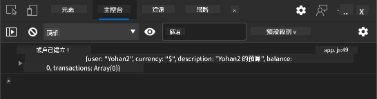

**您應該看到：**
- **加載狀態**出現在提交按鈕上
- **主控台日誌**顯示有關過程的詳細資訊
- **成功訊息**在帳戶建立成功時出現
- **表單自動重置**在成功提交後

> 🔒 **安全考量**：目前資料透過 HTTP 傳輸，這在生產環境中並不安全。在實際應用中，請務必使用 HTTPS 加密資料傳輸。了解更多 [HTTPS 安全性](https://en.wikipedia.org/wiki/HTTPS) 及其對保護使用者資料的重要性。

### 🔄 **教學檢查**
**現代 JavaScript 整合**：驗證您對非同步表單處理的理解：
- ✅ `event.preventDefault()` 如何改變表單的預設行為？
- ✅ 為什麼 FormData API 比手動收集欄位更高效？
- ✅ 非同步/等待模式如何改善程式碼的可讀性？
- ✅ 錯誤處理在使用者體驗中扮演什麼角色？

**系統架構**：您的表單處理展示了：
- **事件驅動程式設計**：表單響應使用者操作而無需重新載入頁面
- **非同步通訊**：伺服器請求不會阻塞使用者介面
- **錯誤處理**：網路請求失敗時的優雅降級
- **狀態管理**：UI 更新反映伺服器回應
- **漸進增強**：基本功能正常運作，JavaScript 提供增強功能

**專業模式**：您已實現：
- **單一職責**：函數具有明確且專注的目的
- **錯誤邊界**：Try/catch 區塊防止應用程式崩潰
- **使用者回饋**：加載狀態和成功/錯誤訊息
- **資料轉換**：FormData 轉換為 JSON 以進行伺服器通訊

## 全面表單驗證

表單驗證可防止使用者在提交後才發現錯誤的挫折感。就像國際太空站上的多重冗餘系統一樣，有效的驗證採用多層次的安全檢查。

最佳方法結合了瀏覽器級驗證以提供即時回饋、JavaScript 驗證以增強使用者體驗，以及伺服器端驗證以確保安全性和資料完整性。這種冗餘性既能滿足使用者需求，又能保護系統。

### 理解驗證層級

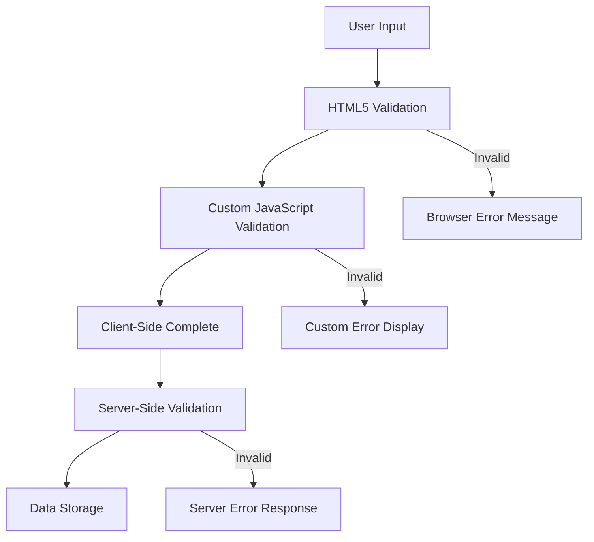

**多層次驗證策略：**
- **HTML5 驗證**：即時的瀏覽器檢查
- **JavaScript 驗證**：自訂邏輯和使用者體驗
- **伺服器驗證**：最終的安全性和資料完整性檢查
- **漸進增強**：即使 JavaScript 被禁用也能正常運作

### HTML5 驗證屬性

**您可使用的現代驗證工具：**

| 屬性 | 目的 | 使用範例 | 瀏覽器行為 |
|------|------|----------|------------|
| `required` | 必填欄位 | `<input required>` | 防止空白提交 |
| `minlength`/`maxlength` | 文字長度限制 | `<input maxlength="20">` | 強制字元限制 |
| `min`/`max` | 數值範圍 | `<input min="0" max="1000">` | 驗證數值範圍 |
| `pattern` | 自訂正則規則 | `<input pattern="[A-Za-z]+">` | 匹配特定格式 |
| `type` | 資料類型驗證 | `<input type="email">` | 格式特定驗證 |

### CSS 驗證樣式

**為驗證狀態創建視覺回饋：**

```css
/* Valid input styling */
input:valid {
  border-color: #28a745;
  background-color: #f8fff9;
}

/* Invalid input styling */
input:invalid {
  border-color: #dc3545;
  background-color: #fff5f5;
}

/* Focus states for better accessibility */
input:focus:valid {
  box-shadow: 0 0 0 0.2rem rgba(40, 167, 69, 0.25);
}

input:focus:invalid {
  box-shadow: 0 0 0 0.2rem rgba(220, 53, 69, 0.25);
}
```

**這些視覺提示的作用：**
- **綠色邊框**：表示成功驗證，就像控制中心的綠燈
- **紅色邊框**：提示需要注意的驗證錯誤
- **焦點高亮**：提供清晰的視覺上下文以顯示當前輸入位置
- **一致的樣式**：建立可預測的介面模式，讓使用者能學習

> 💡 **專業提示**：使用 `:valid` 和 `:invalid` CSS 偽類，提供即時的視覺回饋，讓使用者在輸入時獲得響應式且有幫助的介面。

### 實現全面驗證

讓我們增強您的註冊表單，提供卓越的使用者體驗和資料品質：

```html
<form id="registerForm" method="POST" novalidate>
  <div class="form-group">
    <label for="user">Username <span class="required">*</span></label>
    <input id="user" name="user" type="text" required 
           minlength="3" maxlength="20" 
           pattern="[a-zA-Z0-9_]+" 
           autocomplete="username"
           title="Username must be 3-20 characters, letters, numbers, and underscores only">
    <small class="form-text">Choose a unique username (3-20 characters)</small>
  </div>
  
  <div class="form-group">
    <label for="currency">Currency <span class="required">*</span></label>
    <input id="currency" name="currency" type="text" required 
           value="$" maxlength="3" 
           pattern="[A-Z$€£¥₹]+" 
           title="Enter a valid currency symbol or code">
    <small class="form-text">Currency symbol (e.g., $, €, £)</small>
  </div>
  
  <div class="form-group">
    <label for="description">Account Description</label>
    <input id="description" name="description" type="text" 
           maxlength="100" 
           placeholder="Personal savings, checking, etc.">
    <small class="form-text">Optional description (up to 100 characters)</small>
  </div>
  
  <div class="form-group">
    <label for="balance">Starting Balance</label>
    <input id="balance" name="balance" type="number" 
           value="0" min="0" step="0.01" 
           title="Enter a positive number for your starting balance">
    <small class="form-text">Initial account balance (minimum $0.00)</small>
  </div>
  
  <button type="submit">Create Account</button>
</form>
```

**理解增強的驗證：**
- **結合**必填欄位指示器和有用的描述
- **包含** `pattern` 屬性以進行格式驗證
- **提供** `title` 屬性以提高可訪問性和工具提示
- **添加**輔助文字以指導使用者輸入
- **使用**語義化 HTML 結構以提高可訪問性

### 高級驗證規則

**每個驗證規則的作用：**

| 欄位 | 驗證規則 | 使用者益處 |
|------|----------|------------|
| 使用者名稱 | `required`, `minlength="3"`, `maxlength="20"`, `pattern="[a-zA-Z0-9_]+"` | 確保有效且唯一的識別符 |
| 貨幣 | `required`, `maxlength="3"`, `pattern="[A-Z$€£¥₹]+"` | 接受常見的貨幣符號 |
| 餘額 | `min="0"`, `step="0.01"`, `type="number"` | 防止負餘額 |
| 描述 | `maxlength="100"` | 合理的長度限制 |

### 測試驗證行為

**嘗試以下驗證場景：**
1. **提交**空白必填欄位的表單
2. **輸入**少於 3 個字元的使用者名稱
3. **嘗試**在使用者名稱欄位中輸入特殊字元
4. **輸入**負餘額金額


**您將觀察到：**
- **瀏覽器顯示**原生驗證訊息
- **樣式根據** `:valid` 和 `:invalid` 狀態變化
- **表單提交**在所有驗證通過之前被阻止
- **焦點自動**移動到第一個無效欄位

### 客戶端與伺服器端驗證

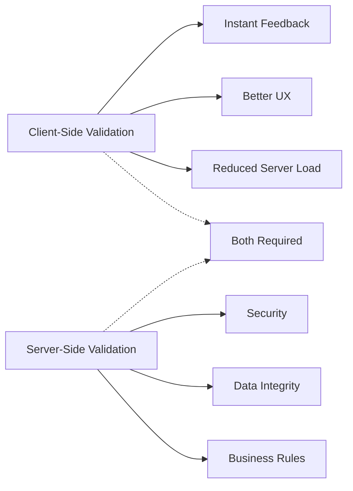

**為什麼需要兩層驗證：**
- **客戶端驗證**：提供即時回饋並改善使用者體驗
- **伺服器端驗證**：確保安全性並處理複雜的業務規則
- **結合方法**：創建穩健、使用者友好且安全的應用程式
- **漸進增強**：即使 JavaScript 被禁用也能正常運作

> 🛡️ **安全提醒**：絕不要僅依賴客戶端驗證！惡意使用者可以繞過客戶端檢查，因此伺服器端驗證對於安全性和資料完整性至關重要。

### ⚡ **您可以在接下來的 5 分鐘內完成的事情**
- [ ] 使用無效資料測試您的表單以查看驗證訊息
- [ ] 嘗試在禁用 JavaScript 的情況下提交表單以查看 HTML5 驗證
- [ ] 開啟瀏覽器開發工具並檢查發送到伺服器的表單資料
- [ ] 嘗試不同的輸入類型以查看行動裝置鍵盤的變化

### 🎯 **您可以在這一小時內完成的事情**
- [ ] 完成課後測驗並理解表單處理概念
- [ ] 實現具有即時回饋的全面驗證挑戰
- [ ] 添加 CSS 樣式以創建專業外觀的表單
- [ ] 為重複的使用者名稱和伺服器錯誤創建錯誤處理
- [ ] 添加密碼確認欄位並進行匹配驗證

### 📅 **您的一週表單精通旅程**
- [ ] 完成具有高級表單功能的完整銀行應用程式
- [ ] 實現檔案上傳功能，用於個人資料照片或文件
- [ ] 添加多步表單，帶有進度指示器和狀態管理
- [ ] 創建根據使用者選擇而動態調整的表單
- [ ] 實現表單自動保存和恢復功能，以改善使用者體驗
- [ ] 添加高級驗證，例如電子郵件驗證和電話號碼格式化

### 🌟 **您的一個月前端開發精通之旅**
- [ ] 建立具有條件邏輯和工作流程的複雜表單應用程式
- [ ] 學習表單庫和框架以快速開發
- [ ] 精通可訪問性指南和包容性設計原則
- [ ] 為全球表單實現國際化和本地化
- [ ] 創建可重用的表單元件庫和設計系統
- [ ] 為開源表單專案做出貢獻並分享最佳實踐

## 🎯 您的表單開發精通時間表

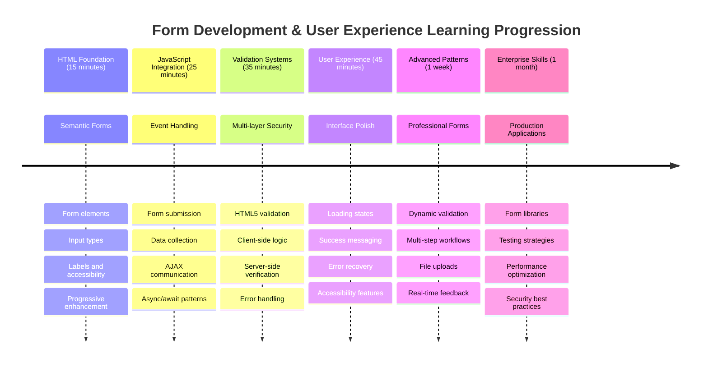

### 🛠️ 您的表單開發工具包摘要

完成本課程後，您已掌握：
- **HTML5 表單**：語義結構、輸入類型和可訪問性功能
- **JavaScript 表單處理**：事件管理、資料收集和 AJAX 通訊
- **驗證架構**：多層次驗證以確保安全性和使用者體驗
- **非同步程式設計**：現代 Fetch API 和 async/await 模式
- **錯誤管理**：全面的錯誤處理和使用者回饋系統
- **使用者體驗設計**：加載狀態、成功訊息和錯誤恢復
- **漸進增強**：表單在所有瀏覽器和功能中均可正常運作

**實際應用**：您的表單開發技能直接適用於：
- **電子商務應用程式**：結帳流程、帳戶註冊和付款表單
- **企業軟體**：資料輸入系統、報告介面和工作流程應用程式
- **內容管理**：出版平台、使用者生成內容和管理介面
- **金融應用程式**：銀行介面、投資平台和交易系統
- **醫療系統**：患者入口網站、預約安排和病歷表單
- **教育平台**：課程註冊、評估工具和學習管理

**獲得的專業技能**：您現在可以：
- **設計**可訪問的表單，適用於所有使用者，包括殘障人士
- **實現**安全的表單驗證，防止資料損壞和安全漏洞
- **創建**響應式使用者介面，提供清晰的回饋和指導
- **除錯**使用瀏覽器開發工具和網路分析解決複雜的表單互動
- **優化**表單效能，透過高效的資料處理和驗證策略

**掌握的前端開發概念**：
- **事件驅動架構**：使用者互動處理和響應系統
- **非同步程式設計**：非阻塞伺服器通訊和錯誤處理
- **資料驗證**：客戶端和伺服器端的安全性和完整性檢查
- **使用者體驗設計**：直觀的介面，引導使用者成功
- **可訪問性工程**：包容性設計，適用於多樣化的使用者需求

**下一步**：您已準備好探索高級表單庫、實現複雜的驗證規則或建立企業級資料收集系統！

🌟 **成就解鎖**：您已建立一個完整的表單處理系統，具備專業的驗證、錯誤處理和使用者體驗模式！

---

---

## GitHub Copilot Agent 挑戰 🚀

使用 Agent 模式完成以下挑戰：

**描述：** 增強註冊表單，實現全面的客戶端驗證和使用者回饋。此挑戰將幫助您練習表單驗證、錯誤處理以及透過互動回饋改善使用者體驗。
**提示：** 為註冊表單建立完整的表單驗證系統，包括：1) 使用者輸入時每個欄位的即時驗證回饋，2) 每個輸入欄位下方顯示自訂的驗證訊息，3) 密碼確認欄位需進行匹配驗證，4) 視覺指示（例如有效欄位顯示綠色勾勾，無效欄位顯示紅色警告），5) 只有當所有驗證通過時，提交按鈕才會啟用。使用 HTML5 驗證屬性、CSS 來設計驗證狀態，以及 JavaScript 來實現互動行為。

了解更多關於 [agent mode](https://code.visualstudio.com/blogs/2025/02/24/introducing-copilot-agent-mode) 的資訊。

## 🚀 挑戰

如果使用者已存在，請在 HTML 中顯示錯誤訊息。

以下是添加一些 CSS 樣式後，最終登入頁面的範例：

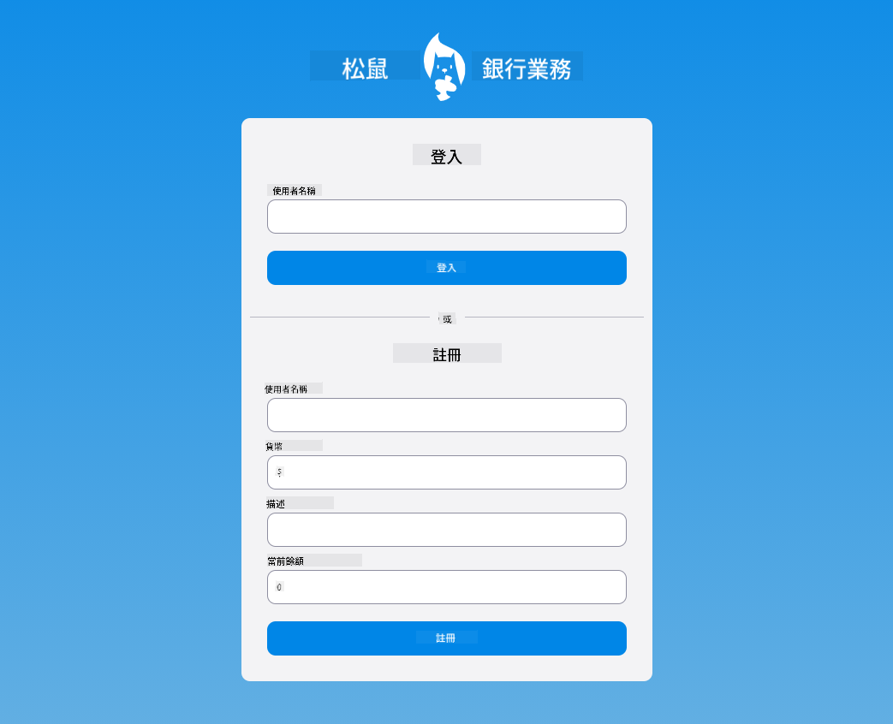

## 課後測驗

[課後測驗](https://ff-quizzes.netlify.app/web/quiz/44)

## 回顧與自學

開發者在表單構建方面非常有創意，尤其是在驗證策略上。透過瀏覽 [CodePen](https://codepen.com) 來了解不同的表單流程；你能找到一些有趣且具啟發性的表單嗎？

## 作業

[設計你的銀行應用程式](assignment.md)

---

**免責聲明**：  
本文件已使用 AI 翻譯服務 [Co-op Translator](https://github.com/Azure/co-op-translator) 進行翻譯。儘管我們努力確保準確性，但請注意，自動翻譯可能包含錯誤或不準確之處。原始文件的母語版本應被視為權威來源。對於關鍵信息，建議使用專業人工翻譯。我們對因使用此翻譯而引起的任何誤解或誤釋不承擔責任。