<!--
CO_OP_TRANSLATOR_METADATA:
{
  "original_hash": "86ee5069f27ea3151389d8687c95fac9",
  "translation_date": "2025-11-03T23:47:37+00:00",
  "source_file": "7-bank-project/3-data/README.md",
  "language_code": "mo"
}
-->
# 建立銀行應用程式第三部分：獲取和使用數據的方法

想像《星際迷航》中企業號的電腦——當皮卡德艦長詢問船隻狀態時，信息會立即顯示出來，而不需要整個界面關閉並重新構建。這種無縫的信息流正是我們在這裡通過動態數據獲取所要構建的。

目前，你的銀行應用程式就像一份印刷的報紙——信息豐富但靜態。我們將把它轉變成更像 NASA 的任務控制中心，數據能夠持續流動並實時更新，而不會中斷用戶的工作流程。

你將學習如何與伺服器進行異步通信，處理不同時間到達的數據，並將原始信息轉化為對用戶有意義的內容。這就是演示軟體和生產就緒軟體之間的差別。

## ⚡ 接下來的 5 分鐘你可以做什麼

**忙碌開發者的快速入門路徑**

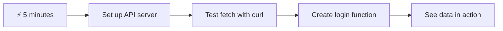

- **第 1-2 分鐘**：啟動你的 API 伺服器（`cd api && npm start`）並測試連接
- **第 3 分鐘**：使用 fetch 創建一個基本的 `getAccount()` 函數
- **第 4 分鐘**：將登錄表單連接到 `action="javascript:login()"`
- **第 5 分鐘**：測試登錄並觀察帳戶數據出現在控制台中

**快速測試命令**：
```bash
# Verify API is running
curl http://localhost:5000/api

# Test account data fetch
curl http://localhost:5000/api/accounts/test
```

**為什麼這很重要**：在 5 分鐘內，你將看到異步數據獲取的魔力，這是每個現代網頁應用程式的動力基礎。這是讓應用程式感覺響應迅速且充滿活力的基石。

## 🗺️ 通過數據驅動的網頁應用程式的學習旅程

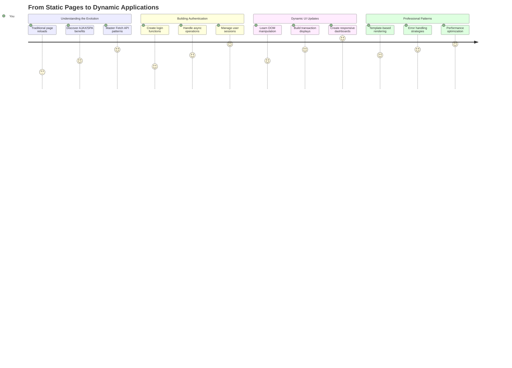

**你的學習目標**：在本課程結束時，你將了解現代網頁應用程式如何動態地獲取、處理和顯示數據，從而創造出我們期望的專業應用程式的無縫用戶體驗。

## 課前測驗

[課前測驗](https://ff-quizzes.netlify.app/web/quiz/45)

### 先決條件

在深入了解數據獲取之前，請確保你已準備好以下組件：

- **上一課程**：完成 [登錄和註冊表單](../2-forms/README.md)——我們將在此基礎上進行構建
- **本地伺服器**：安裝 [Node.js](https://nodejs.org) 並 [運行伺服器 API](../api/README.md) 以提供帳戶數據
- **API 連接**：使用以下命令測試你的伺服器連接：

```bash
curl http://localhost:5000/api
# Expected response: "Bank API v1.0.0"
```

此快速測試可確保所有組件正常通信：
- 驗證 Node.js 在你的系統上正確運行
- 確認你的 API 伺服器處於活動狀態並響應
- 驗證你的應用程式能夠連接到伺服器（就像在任務開始前檢查無線電聯絡）

## 🧠 數據管理生態系統概述

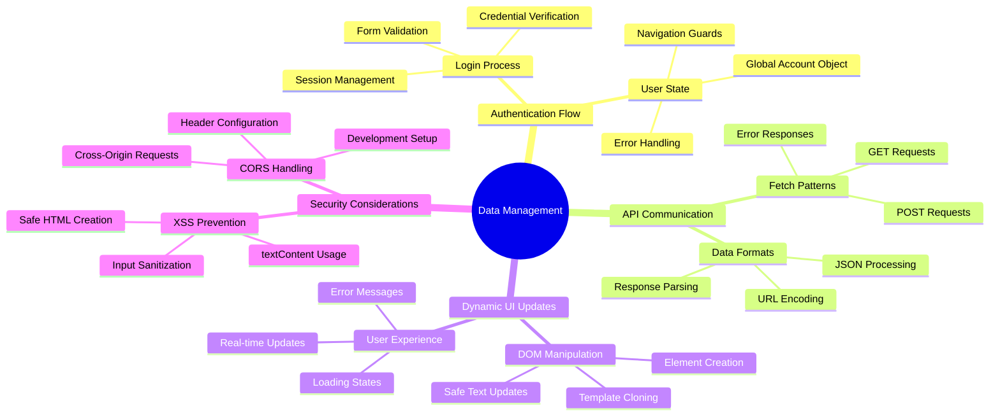

**核心原則**：現代網頁應用程式是數據協調系統——它們在用戶界面、伺服器 API 和瀏覽器安全模型之間進行協調，以創造無縫、響應迅速的體驗。

---

## 理解現代網頁應用程式中的數據獲取

過去二十年來，網頁應用程式處理數據的方式發生了巨大變化。理解這種演變將幫助你了解為什麼像 AJAX 和 Fetch API 這樣的現代技術如此強大，以及它們為什麼成為網頁開發者的必備工具。

讓我們來探索傳統網站的工作方式與我們今天構建的動態響應式應用程式的區別。

### 傳統多頁應用程式 (MPA)

在網頁的早期，每次點擊就像在老式電視上換頻道——屏幕會變空白，然後慢慢調到新內容。這是早期網頁應用程式的現實，每次交互都意味著完全重建整個頁面。

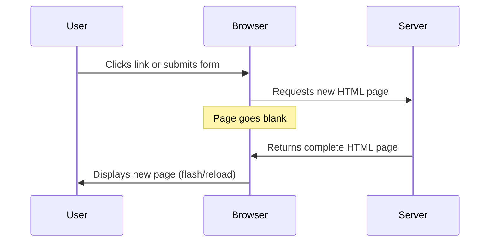

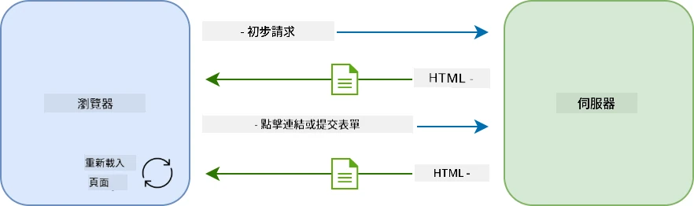

**為什麼這種方法感覺很笨重：**
- 每次點擊都意味著完全重建整個頁面
- 用戶的思路會被那些煩人的頁面閃爍中斷
- 你的網絡連接需要反覆下載相同的頁眉和頁腳
- 應用程式感覺更像是在翻閱文件櫃，而不是使用軟體

### 現代單頁應用程式 (SPA)

AJAX（異步 JavaScript 和 XML）完全改變了這種範式。就像國際空間站的模塊化設計，宇航員可以更換單個組件而不需要重建整個結構，AJAX 允許我們更新網頁的特定部分，而不需要重新加載所有內容。儘管名稱中提到了 XML，但我們今天主要使用 JSON，但核心原則仍然是：僅更新需要更改的部分。

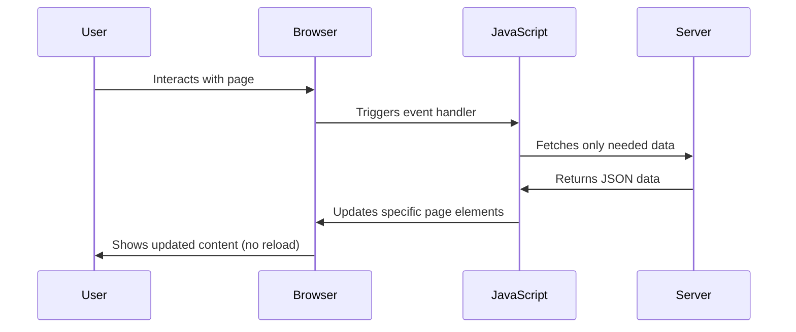


**為什麼 SPA 感覺更好：**
- 只有實際更改的部分會被更新（聰明吧？）
- 不再有令人不快的中斷——用戶可以保持流暢的使用體驗
- 更少的數據在網絡上傳輸，意味著加載速度更快
- 一切感覺快速且響應迅速，就像手機上的應用程式一樣

### 現代 Fetch API 的演變

現代瀏覽器提供了 [`Fetch` API](https://developer.mozilla.org/docs/Web/API/Fetch_API)，它取代了舊的 [`XMLHttpRequest`](https://developer.mozilla.org/docs/Web/API/XMLHttpRequest/Using_XMLHttpRequest)。就像操作電報和使用電子郵件的區別，Fetch API 使用 promises 來實現更清晰的異步代碼，並自然地處理 JSON。

| 功能 | XMLHttpRequest | Fetch API |
|------|----------------|-----------|
| **語法** | 複雜的基於回調 | 清晰的基於 promise |
| **JSON 處理** | 需要手動解析 | 內建 `.json()` 方法 |
| **錯誤處理** | 錯誤信息有限 | 提供全面的錯誤細節 |
| **現代支持** | 與舊版兼容 | 支持 ES6+ 的 promises 和 async/await |

> 💡 **瀏覽器兼容性**：好消息——Fetch API 在所有現代瀏覽器中都能正常工作！如果你對特定版本感到好奇，[caniuse.com](https://caniuse.com/fetch) 提供了完整的兼容性信息。
> 
**總結：**
- 在 Chrome、Firefox、Safari 和 Edge 中表現良好（基本上涵蓋了所有用戶使用的瀏覽器）
- 只有 Internet Explorer 需要額外的幫助（坦白說，是時候放棄 IE 了）
- 為我們稍後使用的優雅的 async/await 模式做好了完美準備

### 實現用戶登錄和數據檢索

現在，讓我們實現登錄系統，將你的銀行應用程式從靜態顯示轉變為功能性應用程式。就像安全軍事設施中使用的身份驗證協議一樣，我們將驗證用戶憑據，然後提供訪問其特定數據的權限。

我們將逐步構建，從基本身份驗證開始，然後添加數據獲取功能。

#### 第一步：創建登錄函數基礎

打開你的 `app.js` 文件，添加一個新的 `login` 函數。這將處理用戶身份驗證過程：

```javascript
async function login() {
  const loginForm = document.getElementById('loginForm');
  const user = loginForm.user.value;
}
```

**讓我們來分解一下：**
- 那個 `async` 關鍵字？它告訴 JavaScript「嘿，這個函數可能需要等待一些事情」
- 我們從頁面中抓取表單（沒什麼花哨的，只是通過 ID 找到它）
- 然後我們提取用戶輸入的用戶名
- 這裡有個小技巧：你可以通過表單控件的 `name` 屬性訪問任何表單輸入——不需要額外的 getElementById 調用！

> 💡 **表單訪問模式**：每個表單控件都可以通過其名稱（在 HTML 中使用 `name` 屬性設置）作為表單元素的屬性進行訪問。這提供了一種清晰、可讀的方式來獲取表單數據。

#### 第二步：創建帳戶數據獲取函數

接下來，我們將創建一個專用函數來從伺服器檢索帳戶數據。這遵循與你的註冊函數相同的模式，但重點是數據檢索：

```javascript
async function getAccount(user) {
  try {
    const response = await fetch('//localhost:5000/api/accounts/' + encodeURIComponent(user));
    return await response.json();
  } catch (error) {
    return { error: error.message || 'Unknown error' };
  }
}
```

**這段代碼完成了以下工作：**
- **使用**現代 `fetch` API 以異步方式請求數據
- **構建**帶有用戶名參數的 GET 請求 URL
- **應用** `encodeURIComponent()` 以安全處理 URL 中的特殊字符
- **轉換**響應為 JSON 格式以便於數據操作
- **優雅處理**錯誤，返回錯誤對象而不是崩潰

> ⚠️ **安全提示**：`encodeURIComponent()` 函數處理 URL 中的特殊字符。就像海軍通信中使用的編碼系統一樣，它確保你的消息完全按照預期到達，防止像 "#" 或 "&" 這樣的字符被誤解。
> 
**為什麼這很重要：**
- 防止特殊字符破壞 URL
- 防止 URL 操作攻擊
- 確保伺服器接收到預期的數據
- 遵循安全編碼實踐

#### 理解 HTTP GET 請求

有件事可能會讓你感到驚訝：當你使用 `fetch` 而不添加任何額外選項時，它會自動創建一個 [`GET`](https://developer.mozilla.org/docs/Web/HTTP/Methods/GET) 請求。這對我們正在做的事情非常合適——向伺服器請求「嘿，我可以查看這個用戶的帳戶數據嗎？」

將 GET 請求想像成禮貌地向圖書館借書——你是在請求查看已存在的東西。而 POST 請求（我們在註冊時使用）更像是提交一本新書以添加到收藏中。

| GET 請求 | POST 請求 |
|----------|-----------|
| **目的** | 檢索現有數據 | 向伺服器發送新數據 |
| **參數** | 在 URL 路徑/查詢字符串中 | 在請求正文中 |
| **緩存** | 可以被瀏覽器緩存 | 通常不被緩存 |
| **安全性** | 在 URL/日誌中可見 | 隱藏在請求正文中 |

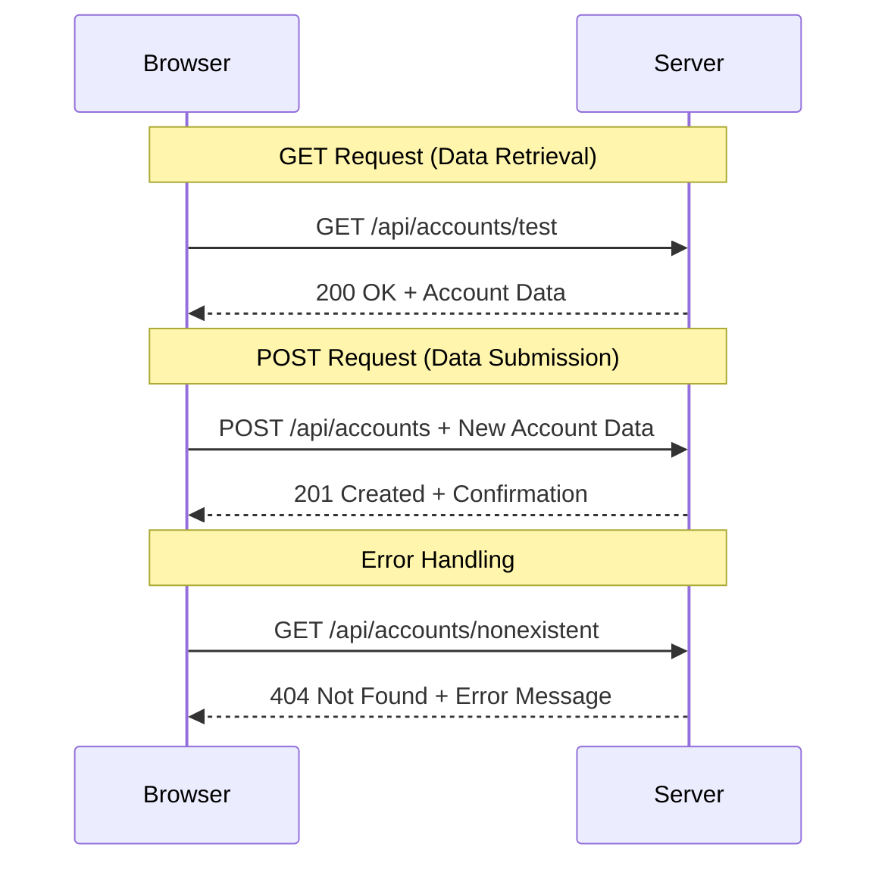

#### 第三步：整合所有功能

現在到了令人滿意的部分——讓我們將你的帳戶獲取函數與登錄過程連接起來。這是所有事情都能完美結合的地方：

```javascript
async function login() {
  const loginForm = document.getElementById('loginForm');
  const user = loginForm.user.value;
  const data = await getAccount(user);

  if (data.error) {
    return console.log('loginError', data.error);
  }

  account = data;
  navigate('/dashboard');
}
```

此函數遵循清晰的順序：
- 從表單輸入中提取用戶名
- 從伺服器請求用戶的帳戶數據
- 處理過程中發生的任何錯誤
- 存儲帳戶數據並在成功後導航到儀表板

> 🎯 **Async/Await 模式**：由於 `getAccount` 是一個異步函數，我們使用 `await` 關鍵字來暫停執行，直到伺服器響應。這可以防止代碼在數據未定義的情況下繼續執行。

#### 第四步：為你的數據創建一個存放地

你的應用程式需要一個地方來記住加載後的帳戶信息。將這行代碼添加到你的 `app.js` 文件的頂部：

```javascript
// This holds the current user's account data
let account = null;
```

**為什麼我們需要這個：**
- 使帳戶數據可以從應用程式的任何地方訪問
- 使用 `null` 作為初始值表示「目前還沒有人登錄」
- 在有人成功登錄或註冊時更新
- 作為單一的真實來源——不會混淆誰已登錄

#### 第五步：連接你的表單

現在，讓我們將你的全新登錄函數連接到 HTML 表單。像這樣更新你的表單標籤：

```html
<form id="loginForm" action="javascript:login()">
  <!-- Your existing form inputs -->
</form>
```

**這個小改動的作用：**
- 阻止表單執行其默認的「重新加載整個頁面」行為
- 改為調用你的自定義 JavaScript 函數
- 保持一切流暢且像單頁應用程式一樣
- 讓你完全控制用戶點擊「登錄」時的行為

#### 第六步：增強你的註冊函數

為了保持一致性，更新你的 `register` 函數，使其也能存儲帳戶數據並導航到儀表板：

```javascript
// Add these lines at the end of your register function
account = result;
navigate('/dashboard');
```

**此增強提供：**
- **無縫**從註冊到儀表板的過渡
- **一致**的登錄和註冊流程用戶體驗
- **即時**在成功註冊後訪問帳戶數據

#### 測試你的實現

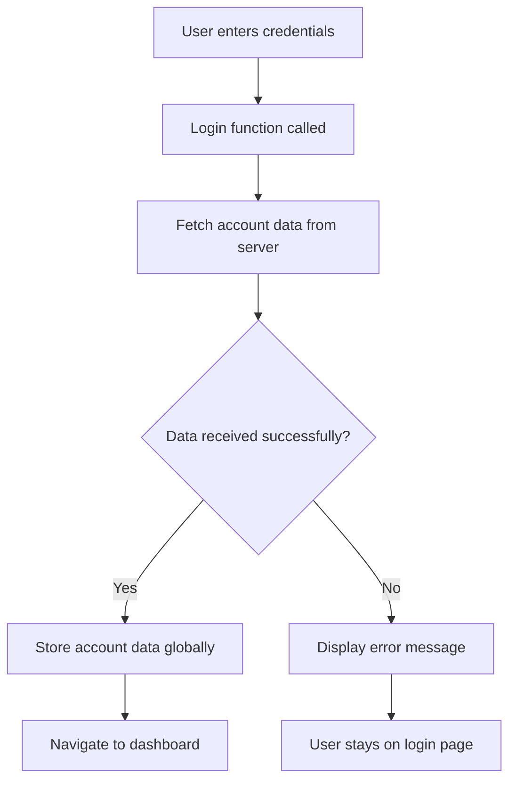

**是時候試試看了：**
1. 創建一個新帳戶以確保一切正常
2. 嘗試使用相同的憑據登錄
3. 如果有任何問題，查看瀏覽器的控制台（按 F12）
4. 確保成功登錄後進入儀表板

如果某些地方不正常，別慌！大多數問題都是簡單的修復，比如拼寫錯誤或忘記啟動 API 伺服器。

#### 關於跨源通信的簡短說明

你可能會想：「我的網頁應用程式如何與這個 API 伺服器通信，當它們運行在不同的端口上？」這是一個很好的問題！這涉及到每個網頁開發者最終都會遇到的問題。

> 🔒 **跨源安全性**：瀏覽器強制執行「同源策略」，以防止不同域之間未授權的通信。就像五角大樓的檢查系統一樣，它們在允許數據傳輸之前驗證通信是否被授權。
> 
**在我們的設置中：**
- 你的網頁應用程式運行在 `localhost:3000`（開發伺服器）
- 你的 API 伺服器運行在 `localhost:5000`（後端伺服器）
- API 伺服器包含 [CORS 標頭](https://developer.mozilla.org/docs/Web/HTTP/CORS)，明確授權來自你的網頁應用程式的通信

此配置模仿了前端和後端應用程式通常運行在不同伺服器上的真實世界開發。

> 📚 **了解更多**：通過這個全面的 [Microsoft Learn 模組](https://docs.microsoft.com/learn/modules/use-apis-discover-museum-art/?WT.mc_id=academic-77807-sagibbon) 深入了解 API 和數據獲取。

## 讓你的數據在 HTML 中活起來

現在，我們將通過 DOM 操作使獲取的數據對用戶可見。就像在暗室中沖洗照片的過程一樣，我們將無形的數據轉化為用戶可以看到和交互的內容。
DOM 操作是一種技術，能將靜態網頁轉變為根據使用者互動和伺服器回應更新內容的動態應用程式。

### 選擇合適的工具

當你使用 JavaScript 更新 HTML 時，有多種選擇可供使用。可以將這些選項想像成工具箱中的不同工具——每種工具都適合特定的工作：

| 方法 | 適合用途 | 使用時機 | 安全等級 |
|------|----------|----------|----------|
| `textContent` | 安全地顯示使用者資料 | 任何需要顯示文字的時候 | ✅ 非常安全 |
| `createElement()` + `append()` | 建立複雜的佈局 | 創建新區塊或清單 | ✅ 非常安全 |
| `innerHTML` | 設定 HTML 內容 | ⚠️ 儘量避免使用 | ❌ 風險較高 |

#### 安全顯示文字的方法：textContent

[`textContent`](https://developer.mozilla.org/docs/Web/API/Node/textContent) 屬性是顯示使用者資料的最佳選擇。它就像是網頁的保安，能阻擋所有有害內容：

```javascript
// The safe, reliable way to update text
const balanceElement = document.getElementById('balance');
balanceElement.textContent = account.balance;
```

**使用 textContent 的好處：**
- 將所有內容視為純文字（防止執行腳本）
- 自動清除現有內容
- 簡單高效地更新文字
- 提供內建的安全性，防止惡意內容

#### 創建動態 HTML 元素

對於更複雜的內容，可以結合使用 [`document.createElement()`](https://developer.mozilla.org/docs/Web/API/Document/createElement) 和 [`append()`](https://developer.mozilla.org/docs/Web/API/ParentNode/append) 方法：

```javascript
// Safe way to create new elements
const transactionItem = document.createElement('div');
transactionItem.className = 'transaction-item';
transactionItem.textContent = `${transaction.date}: ${transaction.description}`;
container.append(transactionItem);
```

**理解這種方法：**
- **程式化地創建**新的 DOM 元素
- **完全控制**元素屬性和內容
- **允許**建立複雜的嵌套元素結構
- **保持安全性**，將結構與內容分離

> ⚠️ **安全考量**：雖然 [`innerHTML`](https://developer.mozilla.org/docs/Web/API/Element/innerHTML) 在許多教學中出現，但它可能執行嵌入的腳本。就像 CERN 的安全協議防止未授權的程式碼執行一樣，使用 `textContent` 和 `createElement` 是更安全的選擇。
> 
**使用 innerHTML 的風險：**
- 會執行使用者資料中的 `<script>` 標籤
- 容易受到程式碼注入攻擊
- 可能導致安全漏洞
- 我們使用的安全替代方法提供了相同的功能

### 讓錯誤更友善地呈現給使用者

目前，登入錯誤僅顯示在瀏覽器的控制台中，使用者無法看到。就像飛行員的內部診斷系統與乘客信息系統的區別一樣，我們需要通過適當的渠道向使用者傳達重要信息。

實現可見的錯誤訊息能讓使用者立即了解問題所在以及如何解決。

#### 步驟 1：新增錯誤訊息顯示區域

首先，讓我們在 HTML 中為錯誤訊息新增一個容器。將其添加到登入按鈕之前，這樣使用者自然就能看到：

```html
<!-- This is where error messages will appear -->
<div id="loginError" role="alert"></div>
<button>Login</button>
```

**這裡發生了什麼：**
- 我們創建了一個空的容器，直到需要時才顯示
- 它的位置設置在使用者點擊「登入」後自然會注意到的地方
- `role="alert"` 是一個很好的設置，能告訴輔助技術「嘿，這很重要！」
- 獨特的 `id` 讓我們的 JavaScript 更容易定位

#### 步驟 2：創建一個方便的輔助函數

讓我們創建一個小型的工具函數，可以更新任何元素的文字。這是一個「一次編寫，隨處使用」的函數，能節省你的時間：

```javascript
function updateElement(id, text) {
  const element = document.getElementById(id);
  element.textContent = text;
}
```

**函數的好處：**
- 簡單的介面，只需提供元素 ID 和文字內容
- 安全地定位並更新 DOM 元素
- 可重複使用的模式，減少程式碼重複
- 在應用程式中保持一致的更新行為

#### 步驟 3：在使用者可見的地方顯示錯誤

現在，讓我們用一些使用者可以看到的內容替換掉隱藏的控制台訊息。更新你的登入函數：

```javascript
// Instead of just logging to console, show the user what's wrong
if (data.error) {
  return updateElement('loginError', data.error);
}
```

**這個小改動帶來了巨大的改變：**
- 錯誤訊息會顯示在使用者的視線範圍內
- 不再有神秘的靜默失敗
- 使用者能立即獲得可操作的反饋
- 你的應用程式開始顯得專業且貼心

現在，當你使用無效帳號進行測試時，會在頁面上看到有用的錯誤訊息！


#### 步驟 4：注重無障礙設計

我們之前添加的 `role="alert"` 不僅僅是裝飾！這個小屬性創建了一個 [Live Region](https://developer.mozilla.org/docs/Web/Accessibility/ARIA/ARIA_Live_Regions)，能立即向螢幕閱讀器宣告變更：

```html
<div id="loginError" role="alert"></div>
```

**為什麼這很重要：**
- 螢幕閱讀器使用者能立即聽到錯誤訊息
- 無論使用者如何瀏覽，所有人都能獲得相同的重要信息
- 這是一種簡單的方法，讓你的應用程式適合更多人使用
- 展現你對創建包容性體驗的重視

這些小細節能讓普通開發者成為優秀的開發者！

### 🎯 教學檢查：認證模式

**暫停並反思**：你剛剛實現了一個完整的認證流程。這是網頁開發中的基礎模式。

**快速自我評估**：
- 你能解釋為什麼我們使用 async/await 進行 API 呼叫嗎？
- 如果忘記使用 `encodeURIComponent()` 會發生什麼？
- 我們的錯誤處理如何改善使用者體驗？

**與現實世界的連結**：你在這裡學到的模式（非同步資料獲取、錯誤處理、使用者反饋）被應用於每個主要的網頁應用程式中，從社交媒體平台到電子商務網站。你正在建立生產級的技能！

**挑戰問題**：你會如何修改這個認證系統以處理多個使用者角色（例如客戶、管理員、出納員）？思考需要的資料結構和 UI 變更。

#### 步驟 5：將相同模式應用於註冊

為了保持一致性，請在註冊表單中實現相同的錯誤處理：

1. **新增**一個錯誤顯示元素到你的註冊 HTML：
```html
<div id="registerError" role="alert"></div>
```

2. **更新**你的註冊函數以使用相同的錯誤顯示模式：
```javascript
if (data.error) {
  return updateElement('registerError', data.error);
}
```

**一致的錯誤處理的好處：**
- **提供**所有表單一致的使用者體驗
- **減少**使用者的認知負擔，使用熟悉的模式
- **簡化**維護，使用可重複使用的程式碼
- **確保**應用程式整體符合無障礙標準

## 創建你的動態儀表板

現在，我們將把你的靜態儀表板轉變為一個動態介面，顯示真實的帳戶資料。就像印刷的航班時刻表與機場的即時出發顯示屏之間的差異一樣，我們正在從靜態信息轉向即時響應的顯示。

使用你學到的 DOM 操作技術，我們將創建一個儀表板，能自動更新並顯示當前的帳戶信息。

### 了解你的資料

在開始構建之前，讓我們先看看伺服器返回的資料類型。當某人成功登入時，你會收到以下的豐富信息：

```json
{
  "user": "test",
  "currency": "$",
  "description": "Test account",
  "balance": 75,
  "transactions": [
    { "id": "1", "date": "2020-10-01", "object": "Pocket money", "amount": 50 },
    { "id": "2", "date": "2020-10-03", "object": "Book", "amount": -10 },
    { "id": "3", "date": "2020-10-04", "object": "Sandwich", "amount": -5 }
  ]
}
```

**這個資料結構提供：**
- **`user`**：用於個性化體驗（例如「歡迎回來，Sarah！」）
- **`currency`**：確保正確顯示金額
- **`description`**：帳戶的友好名稱
- **`balance`**：重要的當前餘額
- **`transactions`**：包含所有詳細信息的完整交易記錄

這些資料足以構建一個專業的銀行儀表板！

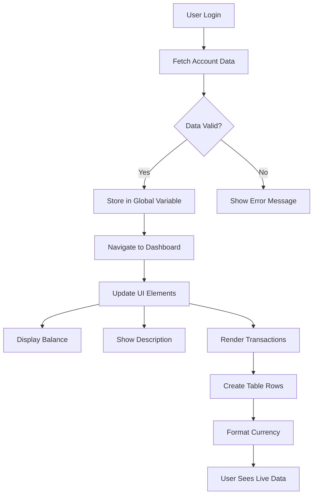

> 💡 **小提示**：想立即看到你的儀表板運作嗎？使用帳號 `test` 登入——它已預載了範例資料，讓你能看到所有功能運作，而無需先創建交易。
> 
**測試帳號的好處：**
- 已預載真實的範例資料
- 完美展示交易的顯示方式
- 非常適合測試你的儀表板功能
- 省去手動創建測試資料的麻煩

### 創建儀表板顯示元素

讓我們一步步構建你的儀表板介面，從帳戶摘要信息開始，然後逐步添加更複雜的功能，例如交易清單。

#### 步驟 1：更新你的 HTML 結構

首先，用 JavaScript 可填充的動態佔位元素替換靜態的「餘額」部分：

```html
<section>
  Balance: <span id="balance"></span><span id="currency"></span>
</section>
```

接著，新增一個帳戶描述的區域。由於這部分充當儀表板內容的標題，請使用語義化的 HTML：

```html
<h2 id="description"></h2>
```

**理解 HTML 結構：**
- **使用**單獨的 `<span>` 元素分別控制餘額和貨幣
- **應用**唯一的 ID 到每個元素，方便 JavaScript 定位
- **遵循**語義化 HTML，使用 `<h2>` 作為帳戶描述
- **創建**螢幕閱讀器和 SEO 的邏輯層次結構

> ✅ **無障礙設計洞察**：帳戶描述作為儀表板內容的標題，因此使用語義化的標題標記。了解更多關於[標題結構](https://www.nomensa.com/blog/2017/how-structure-headings-web-accessibility)如何影響無障礙性。你能否識別頁面上其他可能受益於標題標籤的元素？

#### 步驟 2：創建儀表板更新函數

現在，創建一個函數，用真實的帳戶資料填充你的儀表板：

```javascript
function updateDashboard() {
  if (!account) {
    return navigate('/login');
  }

  updateElement('description', account.description);
  updateElement('balance', account.balance.toFixed(2));
  updateElement('currency', account.currency);
}
```

**逐步解析這個函數的功能：**
- **驗證**帳戶資料是否存在
- **重定向**未認證的使用者回到登入頁面
- **使用**可重複使用的 `updateElement` 函數更新帳戶描述
- **格式化**餘額，始終顯示兩位小數
- **顯示**適當的貨幣符號

> 💰 **金錢格式化**：那個 [`toFixed(2)`](https://developer.mozilla.org/docs/Web/JavaScript/Reference/Global_Objects/Number/toFixed) 方法非常有用！它確保你的餘額看起來像真實的金錢——「75.00」而不是僅僅「75」。你的使用者會感謝看到熟悉的貨幣格式。

#### 步驟 3：確保你的儀表板更新

為了確保每次有人訪問時，儀表板都能刷新顯示最新的資料，我們需要將其與你的導航系統掛鉤。如果你完成了[第一課的作業](../1-template-route/assignment.md)，這應該會感到熟悉。如果沒有，也不用擔心——以下是你需要的內容：

將以下內容添加到你的 `updateRoute()` 函數的末尾：

```javascript
if (typeof route.init === 'function') {
  route.init();
}
```

然後更新你的路由，包含儀表板初始化：

```javascript
const routes = {
  '/login': { templateId: 'login' },
  '/dashboard': { templateId: 'dashboard', init: updateDashboard }
};
```

**這個巧妙的設置能做到：**
- 檢查路由是否有特殊的初始化程式碼
- 在路由加載時自動執行該程式碼
- 確保儀表板始終顯示最新的資料
- 保持你的路由邏輯乾淨且有組織

#### 測試你的儀表板

實施這些更改後，測試你的儀表板：

1. **使用測試帳號登入**
2. **驗證**你是否被重定向到儀表板
3. **檢查**帳戶描述、餘額和貨幣是否正確顯示
4. **嘗試登出並重新登入**，確保資料正確刷新

現在，當使用者登入時，你的儀表板應該顯示基於使用者資料的動態帳戶信息！

## 使用模板構建智能交易清單

與其手動為每筆交易創建 HTML，我們將使用模板自動生成一致的格式。就像太空船製造中的標準化元件，模板能確保每個交易列遵循相同的結構和外觀。

這種技術能有效地從少量交易擴展到數千筆交易，同時保持一致的性能和呈現。

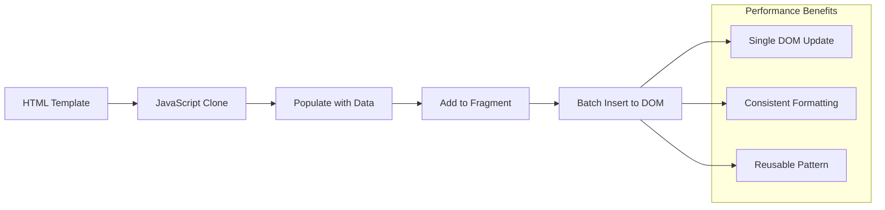

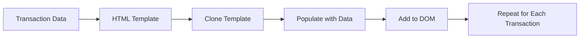

### 步驟 1：創建交易模板

首先，在 HTML `<body>` 中新增一個可重複使用的交易列模板：

```html
<template id="transaction">
  <tr>
    <td></td>
    <td></td>
    <td></td>
  </tr>
</template>
```

**理解 HTML 模板：**
- **定義**單個表格列的結構
- **保持**隱藏，直到用 JavaScript 克隆並填充
- **包含**三個單元格，用於日期、描述和金額
- **提供**一致格式的可重複使用模式

### 步驟 2：為動態內容準備表格

接下來，為表格主體添加一個 `id`，以便 JavaScript 可以輕鬆定位：

```html
<tbody id="transactions"></tbody>
```

**這樣做的目的：**
- **創建**一個清晰的目標，用於插入交易列
- **分離**表格結構與動態內容
- **啟用**輕鬆清除和重新填充交易資料

### 步驟 3：構建交易列工廠函數

現在，創建一個函數，將交易資料轉換為 HTML 元素：

```javascript
function createTransactionRow(transaction) {
  const template = document.getElementById('transaction');
  const transactionRow = template.content.cloneNode(true);
  const tr = transactionRow.querySelector('tr');
  tr.children[0].textContent = transaction.date;
  tr.children[1].textContent = transaction.object;
  tr.children[2].textContent = transaction.amount.toFixed(2);
  return transactionRow;
}
```

**解析這個工廠函數：**
- **通過 ID 獲取**模板元素
- **克隆**模板內容以安全操作
- **選擇**克隆內容中的表格列
- **填充**每個單元格的交易資料
- **格式化**金額以顯示正確的小數位
- **返回**完成的列，準備插入

### 步驟 4：高效生成多個交易列

將以下程式碼添加到你的 `updateDashboard()` 函數中，以顯示所有交易：

```javascript
const transactionsRows = document.createDocumentFragment();
for (const transaction of account.transactions) {
  const transactionRow = createTransactionRow(transaction);
  transactionsRows.appendChild(transactionRow);
}
updateElement('transactions', transactionsRows);
```

**理解這種高效方法：**
- **創建**一個文件片段以批量執行 DOM 操作
- **迭代**帳戶資料中的所有交易
- **使用工廠函數生成**每筆交易的列
- **收集**所有列到片段中，然後一次性添加到 DOM
- **執行**單次 DOM 更新，而不是多次個別插入
> ⚡ **效能優化**: [`document.createDocumentFragment()`](https://developer.mozilla.org/docs/Web/API/Document/createDocumentFragment) 的運作方式就像波音公司的組裝過程——零件在主線外準備好，然後作為完整單元安裝。這種批次處理方法通過一次插入操作取代多次個別操作，從而最大限度地減少 DOM 的重排。

### 第五步：增強更新函數以處理混合內容

你的 `updateElement()` 函數目前僅處理文字內容。請更新它以同時處理文字和 DOM 節點：

```javascript
function updateElement(id, textOrNode) {
  const element = document.getElementById(id);
  element.textContent = ''; // Removes all children
  element.append(textOrNode);
}
```

**此更新的主要改進：**
- **清除**現有內容後再添加新內容
- **接受**文字字串或 DOM 節點作為參數
- **使用**[`append()`](https://developer.mozilla.org/docs/Web/API/ParentNode/append)方法以提高靈活性
- **保持**與現有基於文字的使用方式的向後兼容性

### 測試你的儀表板

是時候見證成果了！讓我們看看你的動態儀表板如何運作：

1. 使用 `test` 帳戶登錄（它已準備好範例數據）
2. 進入你的儀表板
3. 檢查交易行是否以正確格式顯示
4. 確保日期、描述和金額都顯示正常

如果一切正常，你應該能在儀表板上看到一個完全功能的交易列表！🎉

**你已完成的成就：**
- 建立了一個可擴展的儀表板，能處理任意數量的數據
- 創建了可重用的模板以保持一致的格式
- 實現了高效的 DOM 操作技術
- 開發了可媲美生產級銀行應用的功能

你已成功將靜態網頁轉變為動態網應用。

### 🎯 教學檢查：動態內容生成

**架構理解**：你已實現了一個複雜的數據到 UI 的管道，這與 React、Vue 和 Angular 等框架使用的模式相似。

**掌握的關鍵概念**：
- **基於模板的渲染**：創建可重用的 UI 元件
- **文檔片段**：優化 DOM 效能
- **安全的 DOM 操作**：防止安全漏洞
- **數據轉換**：將伺服器數據轉換為用戶界面

**行業連結**：這些技術構成了現代前端框架的基礎。React 的虛擬 DOM、Vue 的模板系統和 Angular 的元件架構都基於這些核心概念。

**反思問題**：你會如何擴展此系統以處理即時更新（例如新交易自動出現）？可以考慮使用 WebSockets 或 Server-Sent Events。

---

## 📈 你的數據管理精通時間線

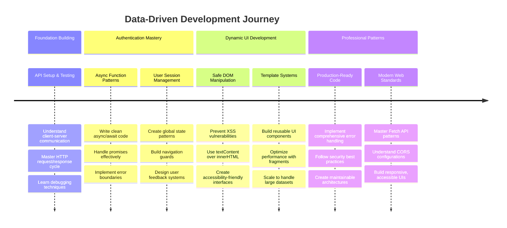

**🎓 畢業里程碑**：你已成功使用現代 JavaScript 模式構建了一個完整的數據驅動網應用。這些技能可直接應用於使用 React、Vue 或 Angular 等框架。

**🔄 下一級能力**：
- 準備探索基於這些概念的前端框架
- 準備實現 WebSockets 的即時功能
- 能夠構建具有離線功能的漸進式網應用
- 為學習高級狀態管理模式奠定基礎

## GitHub Copilot Agent 挑戰 🚀

使用 Agent 模式完成以下挑戰：

**描述**：增強銀行應用，實現交易搜索和篩選功能，允許用戶根據日期範圍、金額或描述查找特定交易。

**提示**：為銀行應用創建搜索功能，包括：1）一個搜索表單，包含日期範圍（起始/結束）、最小/最大金額和交易描述關鍵字的輸入欄位，2）一個 `filterTransactions()` 函數，用於根據搜索條件篩選 account.transactions 陣列，3）更新 `updateDashboard()` 函數以顯示篩選結果，4）添加一個“清除篩選”按鈕以重置視圖。使用現代 JavaScript 陣列方法如 `filter()`，並處理空搜索條件的邊界情況。

了解更多關於 [agent mode](https://code.visualstudio.com/blogs/2025/02/24/introducing-copilot-agent-mode) 的信息。

## 🚀 挑戰

準備好讓你的銀行應用更上一層樓了嗎？讓它看起來和感覺像是你真正想使用的東西。以下是一些激發創意的想法：

**讓它更美觀**：添加 CSS 樣式，將你的功能性儀表板轉變為視覺上吸引人的界面。考慮乾淨的線條、良好的間距，甚至一些微妙的動畫。

**讓它更具響應性**：嘗試使用[媒體查詢](https://developer.mozilla.org/docs/Web/CSS/Media_Queries)創建一個[響應式設計](https://developer.mozilla.org/docs/Web/Progressive_web_apps/Responsive/responsive_design_building_blocks)，在手機、平板電腦和桌面上都能良好運行。你的用戶會感激你！

**添加一些特色**：考慮用顏色標記交易（收入用綠色，支出用紅色），添加圖標，或創建懸停效果，使界面感覺更具互動性。

以下是一個精美儀表板的示例：


不必完全匹配此設計——將其作為靈感，創造屬於你的風格！

## 課後測驗

[課後測驗](https://ff-quizzes.netlify.app/web/quiz/46)

## 作業

[重構並註解你的代碼](assignment.md)

---

**免責聲明**：  
本文件已使用 AI 翻譯服務 [Co-op Translator](https://github.com/Azure/co-op-translator) 進行翻譯。雖然我們致力於提供準確的翻譯，但請注意，自動翻譯可能包含錯誤或不準確之處。原始文件的母語版本應被視為權威來源。對於關鍵信息，建議使用專業人工翻譯。我們對因使用此翻譯而引起的任何誤解或誤釋不承擔責任。