<!--
CO_OP_TRANSLATOR_METADATA:
{
  "original_hash": "2c1164912414820c8efd699b43f64954",
  "translation_date": "2025-10-22T22:47:54+00:00",
  "source_file": "7-bank-project/3-data/README.md",
  "language_code": "mo"
}
-->
# 建立銀行應用程式第三部分：資料的獲取與使用方法

想像《星際迷航》中企業號的電腦——當皮卡德艦長詢問船艦狀態時，資訊會立即顯示，而不需要整個介面關閉並重新建構。這種流暢的資訊流正是我們透過動態資料獲取所要建立的。

目前你的銀行應用程式就像一份印刷的報紙——雖然資訊豐富，但卻是靜態的。我們將把它轉變成類似於NASA的任務控制中心，資料能夠持續流動並即時更新，而不會中斷使用者的工作流程。

你將學習如何以非同步方式與伺服器溝通，處理不同時間到達的資料，並將原始資訊轉化為對使用者有意義的內容。這就是展示版軟體與生產就緒軟體之間的差異。

## 課前測驗

[課前測驗](https://ff-quizzes.netlify.app/web/quiz/45)

### 先決條件

在深入資料獲取之前，請確保你已準備好以下元件：

- **前一課程**：完成[登入與註冊表單](../2-forms/README.md)——我們將在此基礎上進行構建
- **本地伺服器**：安裝 [Node.js](https://nodejs.org) 並[運行伺服器 API](../api/README.md)以提供帳戶資料
- **API 連接**：使用以下指令測試你的伺服器連接：

```bash
curl http://localhost:5000/api
# Expected response: "Bank API v1.0.0"
```

此快速測試可確保所有元件正常通信：
- 驗證你的系統上 Node.js 是否運行正常
- 確認你的 API 伺服器是否活躍並回應
- 驗證你的應用程式是否能夠連接伺服器（就像任務開始前檢查無線電聯絡）

---

## 理解現代網頁應用程式中的資料獲取

過去二十年來，網頁應用程式處理資料的方式發生了巨大變化。理解這種演變將幫助你了解為什麼像 AJAX 和 Fetch API 這樣的現代技術如此強大，以及它們為什麼成為網頁開發者的必備工具。

讓我們來探索傳統網站的運作方式與我們今天構建的動態響應式應用程式之間的差異。

### 傳統多頁應用程式 (MPA)

在網頁的早期，每次點擊就像在老式電視上換頻道——螢幕會變空白，然後慢慢調到新內容。這就是早期網頁應用程式的現實，每次互動都意味著完全重新建構整個頁面。


**為什麼這種方式感覺很笨重：**
- 每次點擊都需要完全重新建構整個頁面
- 使用者的思路會被那些煩人的頁面閃爍中斷
- 你的網路連接需要重複下載相同的頁眉和頁腳
- 應用程式感覺更像是在翻閱檔案櫃，而不是使用軟體

### 現代單頁應用程式 (SPA)

AJAX（非同步 JavaScript 和 XML）完全改變了這種模式。就像國際太空站的模組化設計，宇航員可以更換單個元件而不需要重建整個結構，AJAX 允許我們更新網頁的特定部分，而不需要重新載入整個頁面。儘管名稱中提到 XML，但我們今天主要使用 JSON，但核心原則仍然是：僅更新需要更改的部分。


**為什麼 SPA 感覺更好：**
- 只有實際更改的部分會被更新（聰明吧？）
- 不再有令人不安的中斷——使用者可以保持專注
- 更少的資料通過網路傳輸，載入速度更快
- 一切感覺都很流暢和響應迅速，就像手機上的應用程式一樣

### 現代 Fetch API 的演進

現代瀏覽器提供了 [`Fetch` API](https://developer.mozilla.org/docs/Web/API/Fetch_API)，取代了舊的 [`XMLHttpRequest`](https://developer.mozilla.org/docs/Web/API/XMLHttpRequest/Using_XMLHttpRequest)。就像操作電報與使用電子郵件的區別，Fetch API 使用 promises 來實現更簡潔的非同步程式碼，並自然地處理 JSON。

| 功能 | XMLHttpRequest | Fetch API |
|------|----------------|-----------|
| **語法** | 複雜的基於回調 | 簡潔的基於 promise |
| **JSON 處理** | 需要手動解析 | 內建 `.json()` 方法 |
| **錯誤處理** | 錯誤資訊有限 | 提供全面的錯誤細節 |
| **現代支援** | 與舊版相容 | 支援 ES6+ 的 promise 和 async/await |

> 💡 **瀏覽器相容性**：好消息——Fetch API 在所有現代瀏覽器中都能正常運作！如果你對特定版本感到好奇，[caniuse.com](https://caniuse.com/fetch) 提供完整的相容性資訊。
> 
**重點：**
- 在 Chrome、Firefox、Safari 和 Edge 中表現良好（基本上涵蓋了所有使用者）
- 只有 Internet Explorer 需要額外的支援（老實說，是時候放棄 IE 了）
- 為我們稍後使用的優雅 async/await 模式做好了完美準備

### 實現使用者登入與資料獲取

現在讓我們實現登入系統，將你的銀行應用程式從靜態顯示轉變為功能性應用程式。就像安全的軍事設施使用的身份驗證協議一樣，我們將驗證使用者憑證，然後提供訪問其特定資料的權限。

我們將逐步構建，從基本身份驗證開始，然後添加資料獲取功能。

#### 步驟 1：建立登入功能基礎

打開你的 `app.js` 文件，新增一個 `login` 函數。這將處理使用者的身份驗證過程：

```javascript
async function login() {
  const loginForm = document.getElementById('loginForm');
  const user = loginForm.user.value;
}
```

**讓我們來分解一下：**
- 那個 `async` 關鍵字？它告訴 JavaScript「嘿，這個函數可能需要等待一些事情」
- 我們從頁面中抓取表單（沒什麼特別的，只是通過 ID 找到它）
- 然後我們提取使用者輸入的使用者名稱
- 這裡有個小技巧：你可以通過表單輸入的 `name` 屬性來訪問任何表單輸入——不需要額外的 getElementById 調用！

> 💡 **表單訪問模式**：每個表單控件都可以通過其名稱（在 HTML 中使用 `name` 屬性設置）作為表單元素的屬性來訪問。這提供了一種清晰、易讀的方式來獲取表單資料。

#### 步驟 2：建立帳戶資料獲取函數

接下來，我們將建立一個專用函數，從伺服器檢索帳戶資料。這遵循與你的註冊函數相同的模式，但重點是資料獲取：

```javascript
async function getAccount(user) {
  try {
    const response = await fetch('//localhost:5000/api/accounts/' + encodeURIComponent(user));
    return await response.json();
  } catch (error) {
    return { error: error.message || 'Unknown error' };
  }
}
```

**這段程式碼完成了以下工作：**
- **使用**現代 `fetch` API 非同步請求資料
- **構建**帶有使用者名稱參數的 GET 請求 URL
- **應用** `encodeURIComponent()` 安全處理 URL 中的特殊字元
- **轉換**回應為 JSON 格式，便於資料操作
- **優雅地處理**錯誤，返回錯誤物件而不是崩潰

> ⚠️ **安全提示**：`encodeURIComponent()` 函數處理 URL 中的特殊字元。就像海軍通信中使用的編碼系統一樣，它確保你的訊息準確無誤地到達，防止像 "#" 或 "&" 這樣的字元被誤解。
> 
**為什麼這很重要：**
- 防止特殊字元破壞 URL
- 防止 URL 操作攻擊
- 確保伺服器接收到預期的資料
- 遵循安全編碼實踐

#### 理解 HTTP GET 請求

以下是可能會讓你驚訝的事情：當你使用 `fetch` 而沒有任何額外選項時，它會自動建立 [`GET`](https://developer.mozilla.org/docs/Web/HTTP/Methods/GET) 請求。這對我們正在做的事情非常完美——向伺服器請求「嘿，我可以查看這個使用者的帳戶資料嗎？」

將 GET 請求想像成禮貌地向圖書館借書——你是在請求查看已存在的資料。而 POST 請求（我們在註冊時使用）更像是提交一本新書以加入收藏。

| GET 請求 | POST 請求 |
|----------|-----------|
| **目的** | 檢索現有資料 | 向伺服器發送新資料 |
| **參數** | 在 URL 路徑/查詢字串中 | 在請求正文中 |
| **快取** | 瀏覽器可以快取 | 通常不快取 |
| **安全性** | 在 URL/日誌中可見 | 隱藏在請求正文中 |

#### 步驟 3：整合所有功能

現在到了令人滿意的部分——讓我們將你的帳戶獲取函數與登入過程連接起來。這是所有事情融會貫通的地方：

```javascript
async function login() {
  const loginForm = document.getElementById('loginForm');
  const user = loginForm.user.value;
  const data = await getAccount(user);

  if (data.error) {
    return console.log('loginError', data.error);
  }

  account = data;
  navigate('/dashboard');
}
```

此函數遵循清晰的順序：
- 從表單輸入中提取使用者名稱
- 向伺服器請求使用者的帳戶資料
- 處理過程中發生的任何錯誤
- 儲存帳戶資料並在成功後導航到儀表板

> 🎯 **Async/Await 模式**：由於 `getAccount` 是一個非同步函數，我們使用 `await` 關鍵字來暫停執行，直到伺服器回應。這防止程式碼在資料未定義的情況下繼續執行。

#### 步驟 4：為你的資料創建存放地

你的應用程式需要一個地方來記住載入的帳戶資訊。想像這就像你的應用程式的短期記憶——一個可以隨時存放當前使用者資料的地方。在你的 `app.js` 文件頂部新增以下行：

```javascript
// This holds the current user's account data
let account = null;
```

**為什麼我們需要這個：**
- 使帳戶資料在應用程式的任何地方都可以訪問
- 從 `null` 開始表示「目前還沒有人登入」
- 在有人成功登入或註冊時更新
- 作為單一的真實來源——不會混淆誰已登入

#### 步驟 5：連接你的表單

現在讓我們將你的全新登入功能連接到 HTML 表單。像這樣更新你的表單標籤：

```html
<form id="loginForm" action="javascript:login()">
  <!-- Your existing form inputs -->
</form>
```

**這個小改動的作用：**
- 阻止表單執行其預設的「重新載入整個頁面」行為
- 改為調用你的自定義 JavaScript 函數
- 保持一切流暢且符合單頁應用程式的風格
- 讓你完全掌控使用者點擊「登入」時的行為

#### 步驟 6：增強你的註冊功能

為了保持一致性，更新你的 `register` 函數，使其也能儲存帳戶資料並導航到儀表板：

```javascript
// Add these lines at the end of your register function
account = result;
navigate('/dashboard');
```

**此增強提供：**
- **流暢**地從註冊過渡到儀表板
- **一致**的使用者體驗，適用於登入和註冊流程
- **即時**訪問成功註冊後的帳戶資料

#### 測試你的實現

```mermaid
flowchart TD
    A[User enters credentials] --> B[Login function called]
    B --> C[Fetch account data from server]
    C --> D{Data received successfully?}
    D -->|Yes| E[Store account data globally]
    D -->|No| F[Display error message]
    E --> G[Navigate to dashboard]
    F --> H[User stays on login page]
```



**是時候試試看了：**
1. 創建一個新帳戶以確保一切正常運作
2. 嘗試使用相同的憑證登入
3. 如果有任何問題，查看瀏覽器的控制台（按 F12）
4. 確保成功登入後進入儀表板

如果有任何問題，不要驚慌！大多數問題都是簡單的修正，例如拼寫錯誤或忘記啟動 API 伺服器。

#### 關於跨來源通信的簡短說明

你可能會想：「我的網頁應用程式如何與這個 API 伺服器通信，當它們運行在不同的端口上？」好問題！這涉及到每個網頁開發者最終都會遇到的問題。

> 🔒 **跨來源安全性**：瀏覽器強制執行「同源政策」，以防止不同域之間未經授權的通信。就像五角大樓的檢查系統一樣，它們在允許資料傳輸之前驗證通信是否獲得授權。
> 
**在我們的設置中：**
- 你的網頁應用程式運行在 `localhost:3000`（開發伺服器）
- 你的 API 伺服器運行在 `localhost:5000`（後端伺服器）
- API 伺服器包含 [CORS 標頭](https://developer.mozilla.org/docs/Web/HTTP/CORS)，明確授權來自你的網頁應用程式的通信

此配置模仿了前端和後端應用程式通常運行在不同伺服器上的真實世界開發。

> 📚 **深入了解**：通過這個全面的[Microsoft Learn API 模組](https://docs.microsoft.com/learn/modules/use-apis-discover-museum-art/?WT.mc_id=academic-77807-sagibbon)深入了解 API 和資料獲取。

## 在 HTML 中讓你的資料活起來

現在我們將通過 DOM 操作使獲取的資料對使用者可見。就像在暗房中沖洗照片的過程一樣，我們將不可見的資料轉化為使用者可以看到和互動的內容。

DOM 操作是一種技術，可以將靜態網頁轉化為基於使用者互動和伺服器回應而更新內容的動態應用程式。

### 選擇合適的工具

當涉及到使用 JavaScript 更新你的 HTML 時，你有幾個選擇。可以將它們想像成工具箱中的不同工具——每個工具都適合特定的工作：

| 方法 | 適合的用途 | 使用時機 | 安全等級 |
|------|------------|----------|----------|
| `textContent` | 安全顯示使用者資料 | 任何顯示文字的時候 | ✅ 非常安全 |
| `createElement()` + `append()` | 建立複雜佈局 | 創建新區塊/列表 | ✅ 非常安全 |
| `innerHTML` | 設置 HTML 內容 | ⚠️ 儘量避免使用 | ❌ 風險較高 |

#### 安全顯示文字的方法：textContent

[`textContent`](https://developer.mozilla.org/docs/Web/API/Node/textContent) 屬性是你在顯示使用者資料時的最佳夥伴。它就像你的網頁的保鏢——任何有害的內容都無法通過：

```javascript
// The safe, reliable way to update text
const balanceElement = document.getElementById('balance');
balanceElement.textContent = account.balance;
```

**textContent 的好處：**
- 將所有內容視為純文字（防止腳本執行）
- 自動清除現有內容
- 對於簡單的文字更新非常高效
- 提供內建的安全性，防止惡意內容

#### 創建動態 HTML 元素
對於更複雜的內容，可以將[`document.createElement()`](https://developer.mozilla.org/docs/Web/API/Document/createElement)與[`append()`](https://developer.mozilla.org/docs/Web/API/ParentNode/append)方法結合使用：

```javascript
// Safe way to create new elements
const transactionItem = document.createElement('div');
transactionItem.className = 'transaction-item';
transactionItem.textContent = `${transaction.date}: ${transaction.description}`;
container.append(transactionItem);
```

**理解這種方法：**
- **創建**新的 DOM 元素，並以程式化方式操作
- **保持**對元素屬性和內容的完全控制
- **允許**構建複雜的嵌套元素結構
- **保護**安全性，將結構與內容分離

> ⚠️ **安全考量**：雖然[`innerHTML`](https://developer.mozilla.org/docs/Web/API/Element/innerHTML)在許多教程中出現，但它可能執行嵌入的腳本。就像歐洲核子研究中心（CERN）的安全協議防止未授權的代碼執行一樣，使用`textContent`和`createElement`提供了更安全的替代方案。
> 
**使用 innerHTML 的風險：**
- 會執行用戶數據中的`<script>`標籤
- 容易受到代碼注入攻擊
- 可能導致安全漏洞
- 我們使用的更安全替代方案提供了相同的功能

### 讓錯誤信息更友好

目前，登錄錯誤僅顯示在瀏覽器控制台中，對用戶來說是不可見的。就像飛行員的內部診斷與乘客信息系統的區別一樣，我們需要通過適當的渠道傳達重要信息。

實現可見的錯誤信息可以讓用戶立即了解問題所在以及如何解決。

#### 步驟 1：添加錯誤信息顯示區域

首先，讓我們在 HTML 中為錯誤信息提供一個位置。將其添加到登錄按鈕之前，這樣用戶自然就能看到：

```html
<!-- This is where error messages will appear -->
<div id="loginError" role="alert"></div>
<button>Login</button>
```

**這裡發生了什麼：**
- 我們創建了一個空的容器，直到需要時才顯示
- 它的位置設置在用戶點擊“登錄”後自然會注意到的地方
- `role="alert"`對於屏幕閱讀器來說是一個很好的設置——它告訴輔助技術“嘿，這很重要！”
- 獨特的`id`使我們的 JavaScript 更容易定位

#### 步驟 2：創建一個方便的輔助函數

讓我們創建一個小型的工具函數，可以更新任何元素的文本。這是一個“寫一次，到處使用”的函數，能節省你的時間：

```javascript
function updateElement(id, text) {
  const element = document.getElementById(id);
  element.textContent = text;
}
```

**函數的好處：**
- 簡單的接口，只需要元素 ID 和文本內容
- 安全地定位並更新 DOM 元素
- 可重用的模式，減少代碼重複
- 在應用程序中保持一致的更新行為

#### 步驟 3：在用戶可見的地方顯示錯誤

現在，讓我們用一些用戶可以真正看到的內容來替換隱藏的控制台消息。更新你的登錄函數：

```javascript
// Instead of just logging to console, show the user what's wrong
if (data.error) {
  return updateElement('loginError', data.error);
}
```

**這個小改動帶來了巨大的改變：**
- 錯誤信息出現在用戶正在查看的地方
- 不再有神秘的靜默失敗
- 用戶能夠立即獲得可操作的反饋
- 你的應用程序開始顯得專業且周到

現在，當你用無效的帳戶進行測試時，你會在頁面上看到一條有用的錯誤信息！


#### 步驟 4：包容性與無障礙設計

我們之前添加的`role="alert"`不僅僅是裝飾！這個小屬性創建了一個[即時區域](https://developer.mozilla.org/docs/Web/Accessibility/ARIA/ARIA_Live_Regions)，可以立即向屏幕閱讀器宣布更改：

```html
<div id="loginError" role="alert"></div>
```

**為什麼這很重要：**
- 屏幕閱讀器用戶在錯誤信息出現時立即聽到提示
- 無論用戶如何瀏覽，每個人都能獲得相同的重要信息
- 這是一種簡單的方法，讓你的應用程序適合更多人使用
- 顯示你關注創造包容性體驗

這些小細節讓優秀的開發者與卓越的開發者區分開來！

#### 步驟 5：將相同的模式應用於註冊

為了保持一致性，在你的註冊表單中實現相同的錯誤處理：

1. **添加**一個錯誤顯示元素到你的註冊 HTML：
```html
<div id="registerError" role="alert"></div>
```

2. **更新**你的註冊函數以使用相同的錯誤顯示模式：
```javascript
if (data.error) {
  return updateElement('registerError', data.error);
}
```

**一致的錯誤處理的好處：**
- **提供**所有表單一致的用戶體驗
- **減少**認知負擔，使用熟悉的模式
- **簡化**維護，使用可重用的代碼
- **確保**應用程序的無障礙標準得到滿足

## 創建你的動態儀表板

現在，我們將把你的靜態儀表板轉變為顯示真實帳戶數據的動態界面。就像印刷的航班時刻表與機場的實時出發信息屏幕之間的區別一樣，我們正在從靜態信息轉向實時、響應式顯示。

使用你學到的 DOM 操作技術，我們將創建一個儀表板，能自動更新當前的帳戶信息。

### 了解你的數據

在開始構建之前，讓我們先看看你的服務器返回的數據類型。當某人成功登錄時，你可以使用以下信息：

```json
{
  "user": "test",
  "currency": "$",
  "description": "Test account",
  "balance": 75,
  "transactions": [
    { "id": "1", "date": "2020-10-01", "object": "Pocket money", "amount": 50 },
    { "id": "2", "date": "2020-10-03", "object": "Book", "amount": -10 },
    { "id": "3", "date": "2020-10-04", "object": "Sandwich", "amount": -5 }
  ]
}
```

**這個數據結構提供：**
- **`user`**：用於個性化體驗（“歡迎回來，Sarah！”）
- **`currency`**：確保正確顯示金額
- **`description`**：帳戶的友好名稱
- **`balance`**：至關重要的當前餘額
- **`transactions`**：包含所有詳細信息的完整交易記錄

你需要的一切都在這裡，足以構建一個專業的銀行儀表板！

> 💡 **專業提示**：想立即看到你的儀表板運行效果嗎？登錄時使用用戶名`test`——它預先加載了示例數據，這樣你就可以在不需要先創建交易的情況下看到所有功能。

**為什麼測試帳戶很方便：**
- 已經加載了真實的示例數據
- 非常適合查看交易顯示效果
- 非常適合測試你的儀表板功能
- 省去了手動創建虛擬數據的麻煩

### 創建儀表板顯示元素

讓我們一步步構建你的儀表板界面，從帳戶摘要信息開始，然後逐步添加更複雜的功能，比如交易列表。

#### 步驟 1：更新你的 HTML 結構

首先，用動態佔位符元素替換靜態的“餘額”部分，讓你的 JavaScript 可以填充：

```html
<section>
  Balance: <span id="balance"></span><span id="currency"></span>
</section>
```

接下來，添加一個帳戶描述的部分。由於這充當儀表板內容的標題，請使用語義化 HTML：

```html
<h2 id="description"></h2>
```

**理解 HTML 結構：**
- **使用**單獨的`<span>`元素分開餘額和貨幣，便於單獨控制
- **應用**唯一的 ID 到每個元素，便於 JavaScript 定位
- **遵循**語義化 HTML，使用`<h2>`作為帳戶描述
- **創建**屏幕閱讀器和 SEO 的邏輯層次結構

> ✅ **無障礙設計洞察**：帳戶描述作為儀表板內容的標題，因此使用語義化的標題標記。了解更多關於[標題結構](https://www.nomensa.com/blog/2017/how-structure-headings-web-accessibility)如何影響無障礙性。你能否識別頁面上其他可能受益於標題標籤的元素？

#### 步驟 2：創建儀表板更新函數

現在，創建一個函數，用真實的帳戶數據填充你的儀表板：

```javascript
function updateDashboard() {
  if (!account) {
    return navigate('/login');
  }

  updateElement('description', account.description);
  updateElement('balance', account.balance.toFixed(2));
  updateElement('currency', account.currency);
}
```

**逐步解析這個函數的作用：**
- **驗證**帳戶數據是否存在，然後繼續
- **重定向**未經身份驗證的用戶回到登錄頁面
- **使用**可重用的`updateElement`函數更新帳戶描述
- **格式化**餘額，始終顯示兩位小數
- **顯示**適當的貨幣符號

> 💰 **金額格式化**：那個[`toFixed(2)`](https://developer.mozilla.org/docs/Web/JavaScript/Reference/Global_Objects/Number/toFixed)方法非常有用！它確保你的餘額看起來像真實的金錢——“75.00”而不是僅僅“75”。你的用戶會感激看到熟悉的貨幣格式。

#### 步驟 3：確保你的儀表板更新

為了確保每次有人訪問時，儀表板都能刷新為最新數據，我們需要將其與你的導航系統掛鉤。如果你完成了[第 1 課的作業](../1-template-route/assignment.md)，這應該感覺很熟悉。如果沒有，也不用擔心——以下是你需要的：

將此代碼添加到你的`updateRoute()`函數的末尾：

```javascript
if (typeof route.init === 'function') {
  route.init();
}
```

然後更新你的路由以包含儀表板初始化：

```javascript
const routes = {
  '/login': { templateId: 'login' },
  '/dashboard': { templateId: 'dashboard', init: updateDashboard }
};
```

**這個巧妙的設置作用：**
- 檢查路由是否有特殊的初始化代碼
- 在路由加載時自動運行該代碼
- 確保你的儀表板始終顯示最新的數據
- 保持你的路由邏輯清晰有序

#### 測試你的儀表板

實施這些更改後，測試你的儀表板：

1. **使用**測試帳戶登錄
2. **驗證**你是否被重定向到儀表板
3. **檢查**帳戶描述、餘額和貨幣是否正確顯示
4. **嘗試登出並重新登錄**以確保數據正確刷新

你的儀表板現在應該顯示基於登錄用戶數據的動態帳戶信息！

## 使用模板構建智能交易列表

與其手動為每筆交易創建 HTML，我們將使用模板自動生成一致的格式。就像航天器製造中的標準化組件，模板確保每個交易行都遵循相同的結構和外觀。

這種技術可以有效地擴展，從少量交易到數千筆交易，保持一致的性能和展示。


### 步驟 1：創建交易模板

首先，在你的 HTML`<body>`中添加一個可重用的交易行模板：

```html
<template id="transaction">
  <tr>
    <td></td>
    <td></td>
    <td></td>
  </tr>
</template>
```

**理解 HTML 模板：**
- **定義**單個表格行的結構
- **保持**隱形，直到用 JavaScript 克隆並填充
- **包含**三個單元格，用於日期、描述和金額
- **提供**一致格式的可重用模式

### 步驟 2：為動態內容準備表格

接下來，為你的表格主體添加一個`id`，以便 JavaScript 可以輕鬆定位：

```html
<tbody id="transactions"></tbody>
```

**這樣做的目的：**
- **創建**一個清晰的目標，用於插入交易行
- **分離**表格結構與動態內容
- **使得**交易數據的清除和重新填充更加容易

### 步驟 3：構建交易行工廠函數

現在，創建一個函數，將交易數據轉換為 HTML 元素：

```javascript
function createTransactionRow(transaction) {
  const template = document.getElementById('transaction');
  const transactionRow = template.content.cloneNode(true);
  const tr = transactionRow.querySelector('tr');
  tr.children[0].textContent = transaction.date;
  tr.children[1].textContent = transaction.object;
  tr.children[2].textContent = transaction.amount.toFixed(2);
  return transactionRow;
}
```

**解析這個工廠函數：**
- **通過 ID**檢索模板元素
- **克隆**模板內容以安全操作
- **選擇**克隆內容中的表格行
- **填充**每個單元格的交易數據
- **格式化**金額以顯示正確的小數位
- **返回**完成的行，準備插入

### 步驟 4：高效生成多個交易行

將此代碼添加到你的`updateDashboard()`函數中，以顯示所有交易：

```javascript
const transactionsRows = document.createDocumentFragment();
for (const transaction of account.transactions) {
  const transactionRow = createTransactionRow(transaction);
  transactionsRows.appendChild(transactionRow);
}
updateElement('transactions', transactionsRows);
```

**理解這種高效方法：**
- **創建**一個文檔片段以批量執行 DOM 操作
- **迭代**帳戶數據中的所有交易
- **使用**工廠函數為每筆交易生成一行
- **收集**所有行到片段中，然後添加到 DOM
- **執行**一次 DOM 更新，而不是多次單獨插入

> ⚡ **性能優化**：[`document.createDocumentFragment()`](https://developer.mozilla.org/docs/Web/API/Document/createDocumentFragment)就像波音的裝配過程——組件在主線外準備好，然後作為一個完整的單元安裝。這種批量方法通過執行一次插入而不是多次單獨操作來最小化 DOM 重排。

### 步驟 5：改進更新函數以支持混合內容

你的`updateElement()`函數目前僅處理文本內容。更新它以同時處理文本和 DOM 節點：

```javascript
function updateElement(id, textOrNode) {
  const element = document.getElementById(id);
  element.textContent = ''; // Removes all children
  element.append(textOrNode);
}
```

**此更新的主要改進：**
- **清除**現有內容，然後添加新內容
- **接受**文本字符串或 DOM 節點作為參數
- **使用**[`append()`](https://developer.mozilla.org/docs/Web/API/ParentNode/append)方法以提高靈活性
- **保持**與現有基於文本的用法的向後兼容性

### 測試你的儀表板

是時候見證成果了！讓我們看看你的動態儀表板的運行效果：

1. 使用`test`帳戶登錄（它已準備好示例數據）
2. 進入你的儀表板
3. 檢查交易行是否以正確的格式顯示
4. 確保日期、描述和金額都顯示正確

如果一切正常，你應該會在儀表板上看到一個功能齊全的交易列表！ 🎉

**你已完成的成就：**
- 構建了一個可擴展的儀表板，適用於任何數量的數據
- 創建了可重用的模板以確保一致的格式
- 實現了高效的 DOM 操作技術
- 開發了與生產級銀行應用程序相媲美的功能

你已成功將靜態網頁轉變為動態網絡應用程序。

---

## GitHub Copilot Agent 挑戰 🚀

使用 Agent 模式完成以下挑戰：

**描述：** 增強銀行應用程序，實現交易搜索和篩選功能，允許用戶根據日期範圍、金額或描述查找特定交易。
**提示：** 為銀行應用程式建立搜尋功能，包括：1) 一個搜尋表單，包含日期範圍（起始/結束）、最低/最高金額，以及交易描述關鍵字的輸入欄位，2) 一個 `filterTransactions()` 函數，用於根據搜尋條件篩選 account.transactions 陣列，3) 更新 `updateDashboard()` 函數以顯示篩選後的結果，4) 添加一個「清除篩選」按鈕以重置視圖。使用現代 JavaScript 陣列方法如 `filter()`，並處理空搜尋條件的邊界情況。

了解更多關於 [agent mode](https://code.visualstudio.com/blogs/2025/02/24/introducing-copilot-agent-mode) 的資訊。

## 🚀 挑戰

準備好讓你的銀行應用程式更上一層樓了嗎？讓我們把它打造成一個你真正想要使用的工具。以下是一些激發創意的想法：

**讓它更美觀**：添加 CSS 樣式，將你的功能型儀表板轉變為視覺上吸引人的界面。考慮乾淨的線條、良好的間距，甚至一些細微的動畫效果。

**讓它更具響應性**：嘗試使用 [媒體查詢](https://developer.mozilla.org/docs/Web/CSS/Media_Queries) 來創建一個 [響應式設計](https://developer.mozilla.org/docs/Web/Progressive_web_apps/Responsive/responsive_design_building_blocks)，使其在手機、平板和桌面上都能完美運行。你的使用者會感激不盡！

**添加一些特色**：考慮為交易添加顏色標記（收入用綠色，支出用紅色）、添加圖示，或創建懸停效果，使界面更具互動性。

以下是一個精美儀表板的範例：


不需要完全匹配這個範例——將其作為靈感，創造屬於你的設計！

## 課後測驗

[課後測驗](https://ff-quizzes.netlify.app/web/quiz/46)

## 作業

[重構並添加註解到你的程式碼](assignment.md)

---

**免責聲明**：  
本文件已使用 AI 翻譯服務 [Co-op Translator](https://github.com/Azure/co-op-translator) 進行翻譯。儘管我們努力確保翻譯的準確性，但請注意，自動翻譯可能包含錯誤或不準確之處。原始文件的母語版本應被視為權威來源。對於關鍵信息，建議使用專業人工翻譯。我們對因使用此翻譯而引起的任何誤解或誤釋不承擔責任。