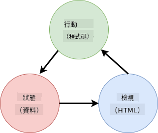
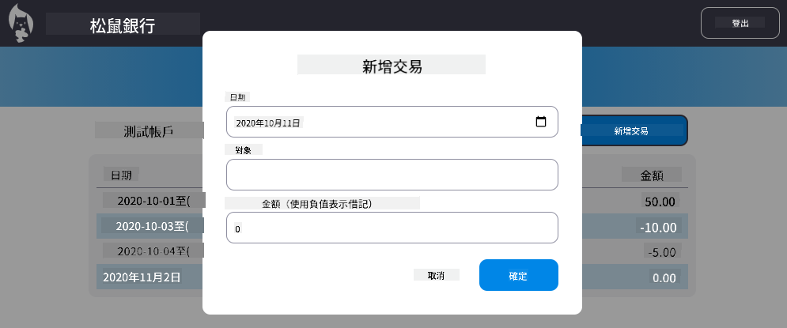

<!--
CO_OP_TRANSLATOR_METADATA:
{
  "original_hash": "b46acf79da8550d76445eed00b06c878",
  "translation_date": "2025-10-03T12:49:52+00:00",
  "source_file": "7-bank-project/4-state-management/README.md",
  "language_code": "mo"
}
-->
# 建立銀行應用程式第4部分：狀態管理概念

## 課前測驗

[課前測驗](https://ff-quizzes.netlify.app/web/quiz/47)

### 簡介

隨著網頁應用程式的成長，追蹤所有資料流變得越來越困難。哪些程式碼獲取資料，哪些頁面使用資料，資料需要在哪裡以及何時更新……很容易導致程式碼混亂且難以維護。尤其是當需要在應用程式的不同頁面之間共享資料時，例如使用者資料。*狀態管理*的概念一直存在於各種程式中，但隨著網頁應用程式的複雜性不斷增加，現在在開發過程中成為一個關鍵點。

在這最後一部分，我們將重新檢視我們建立的應用程式，重新思考如何管理狀態，支持瀏覽器在任何時候刷新，並在使用者會話之間持續保存資料。

### 先決條件

您需要完成本課程的[資料擷取](../3-data/README.md)部分。此外，您需要安裝 [Node.js](https://nodejs.org) 並[在本地運行伺服器 API](../api/README.md)，以便管理帳戶資料。

您可以通過在終端執行以下命令來測試伺服器是否正常運行：

```sh
curl http://localhost:5000/api
# -> should return "Bank API v1.0.0" as a result
```

---

## 重新思考狀態管理

在[上一課程](../3-data/README.md)中，我們在應用程式中引入了一個基本的狀態概念，使用全域變數 `account` 來保存當前登入使用者的銀行資料。然而，我們目前的實現存在一些缺陷。嘗試在儀表板頁面刷新，會發生什麼？

目前程式碼有三個問題：

- 狀態未持久化，瀏覽器刷新會將您帶回登入頁面。
- 有多個函數修改狀態。隨著應用程式的增長，這可能使追蹤更改變得困難，並且容易忘記更新某些部分。
- 狀態未清理，因此當您點擊*登出*時，帳戶資料仍然存在，即使您已回到登入頁面。

我們可以逐一更新程式碼來解決這些問題，但這會導致更多的程式碼重複，使應用程式更複雜且難以維護。或者，我們可以暫停幾分鐘，重新思考我們的策略。

> 我們真正試圖解決的問題是什麼？

[狀態管理](https://en.wikipedia.org/wiki/State_management)的核心在於找到一個良好的方法來解決以下兩個特定問題：

- 如何使應用程式中的資料流易於理解？
- 如何確保狀態資料始終與使用者介面保持同步（反之亦然）？

一旦解決了這些問題，您可能面臨的其他問題要麼已經解決，要麼變得更容易解決。有許多可能的方法可以解決這些問題，但我們將採用一種常見的解決方案，即**集中化資料及其更改方式**。資料流將如下所示：



> 我們在此不會涵蓋資料自動觸發視圖更新的部分，因為它涉及到更高級的[反應式程式設計](https://en.wikipedia.org/wiki/Reactive_programming)概念。如果您有興趣深入研究，這是一個很好的後續主題。

✅ 市面上有許多不同方法的狀態管理庫，[Redux](https://redux.js.org) 是一個受歡迎的選擇。了解其使用的概念和模式通常是學習大型網頁應用程式可能面臨的問題以及如何解決這些問題的好方法。

### 任務

我們將從一些重構開始。替換 `account` 宣告：

```js
let account = null;
```

改為：

```js
let state = {
  account: null
};
```

這個想法是將我們的應用程式資料*集中化*到一個單一的狀態物件中。我們目前在狀態中只有 `account`，因此變化不大，但這為未來的擴展奠定了基礎。

我們還需要更新使用它的函數。在 `register()` 和 `login()` 函數中，將 `account = ...` 替換為 `state.account = ...`;

在 `updateDashboard()` 函數的頂部，添加以下行：

```js
const account = state.account;
```

這次重構本身並未帶來太多改進，但其目的是為接下來的更改奠定基礎。

## 追蹤資料變更

現在我們已經設置了 `state` 物件來存儲資料，下一步是集中更新。目標是更容易追蹤任何更改及其發生的時間。

為了避免對 `state` 物件進行更改，考慮將其設為[*不可變*](https://en.wikipedia.org/wiki/Immutable_object)是一個良好的做法，這意味著它完全不能被修改。這也意味著如果您想更改其中的任何內容，必須創建一個新的狀態物件。通過這樣做，您可以防止潛在的[副作用](https://en.wikipedia.org/wiki/Side_effect_(computer_science))，並為應用程式的新功能（例如實現撤銷/重做）開啟可能性，同時使調試更容易。例如，您可以記錄對狀態所做的每次更改，並保留更改的歷史記錄，以了解錯誤的來源。

在 JavaScript 中，您可以使用 [`Object.freeze()`](https://developer.mozilla.org/docs/Web/JavaScript/Reference/Global_Objects/Object/freeze) 創建物件的不可變版本。如果您嘗試對不可變物件進行更改，將會引發異常。

✅ 您知道*淺層*和*深層*不可變物件的區別嗎？您可以在[這裡](https://developer.mozilla.org/docs/Web/JavaScript/Reference/Global_Objects/Object/freeze#What_is_shallow_freeze)閱讀相關內容。

### 任務

讓我們創建一個新的 `updateState()` 函數：

```js
function updateState(property, newData) {
  state = Object.freeze({
    ...state,
    [property]: newData
  });
}
```

在此函數中，我們創建了一個新的狀態物件，並使用[*展開運算符 (`...`)*](https://developer.mozilla.org/docs/Web/JavaScript/Reference/Operators/Spread_syntax#Spread_in_object_literals)從之前的狀態中複製資料。然後，我們使用[方括號表示法](https://developer.mozilla.org/docs/Web/JavaScript/Guide/Working_with_Objects#Objects_and_properties) `[property]` 覆蓋狀態物件的特定屬性。最後，我們使用 `Object.freeze()` 鎖定物件以防止修改。目前狀態中僅存儲 `account` 屬性，但使用此方法，您可以在狀態中添加任意多的屬性。

我們還需要更新 `state` 的初始化，以確保初始狀態也是不可變的：

```js
let state = Object.freeze({
  account: null
});
```

之後，更新 `register` 函數，將 `state.account = result;` 替換為：

```js
updateState('account', result);
```

對 `login` 函數進行相同的更新，將 `state.account = data;` 替換為：

```js
updateState('account', data);
```

現在我們將趁機修復使用者點擊*登出*時帳戶資料未清除的問題。

創建一個新的函數 `logout()`：

```js
function logout() {
  updateState('account', null);
  navigate('/login');
}
```

在 `updateDashboard()` 中，將重定向 `return navigate('/login');` 替換為 `return logout()`;

嘗試註冊新帳戶，登出並再次登入，檢查是否一切正常。

> 提示：您可以通過在 `updateState()` 的底部添加 `console.log(state)` 並打開瀏覽器開發工具中的控制台來查看所有狀態更改。

## 持久化狀態

大多數網頁應用程式需要持久化資料才能正常運作。所有關鍵資料通常存儲在資料庫中，並通過伺服器 API 訪問，例如我們的使用者帳戶資料。但有時，將某些資料存儲在瀏覽器中的客戶端應用程式中也是有益的，這可以改善使用者體驗或提高加載性能。

當您想在瀏覽器中持久化資料時，有幾個重要問題需要問自己：

- *資料是否敏感？* 您應避免在客戶端存儲任何敏感資料，例如使用者密碼。
- *您需要保存這些資料多久？* 您是僅計劃在當前會話中訪問這些資料，還是希望永久保存？

根據您的需求，有多種方法可以在網頁應用程式中存儲資訊。例如，您可以使用 URL 存儲搜尋查詢，並使其可在使用者之間共享。您還可以使用 [HTTP cookies](https://developer.mozilla.org/docs/Web/HTTP/Cookies) 如果需要與伺服器共享資料，例如[身份驗證](https://en.wikipedia.org/wiki/Authentication)資訊。

另一個選擇是使用瀏覽器的多種 API 之一來存儲資料。其中有兩個特別有趣：

- [`localStorage`](https://developer.mozilla.org/docs/Web/API/Window/localStorage)：一個[鍵值存儲](https://en.wikipedia.org/wiki/Key%E2%80%93value_database)，允許跨不同會話持久化特定於當前網站的資料。存儲在其中的資料永不過期。
- [`sessionStorage`](https://developer.mozilla.org/docs/Web/API/Window/sessionStorage)：此方法與 `localStorage` 的工作方式相同，但存儲的資料在會話結束（瀏覽器關閉時）時會被清除。

請注意，這兩個 API 只允許存儲[字串](https://developer.mozilla.org/docs/Web/JavaScript/Reference/Global_Objects/String)。如果您想存儲複雜物件，則需要使用 [`JSON.stringify()`](https://developer.mozilla.org/docs/Web/JavaScript/Reference/Global_Objects/JSON/stringify) 將其序列化為 [JSON](https://developer.mozilla.org/docs/Web/JavaScript/Reference/Global_Objects/JSON) 格式。

✅ 如果您想創建一個不依賴伺服器的網頁應用程式，也可以使用 [`IndexedDB` API](https://developer.mozilla.org/docs/Web/API/IndexedDB_API) 在客戶端創建資料庫。這適用於高級使用案例或需要存儲大量資料的情況，因為它使用起來更為複雜。

### 任務

我們希望使用者在明確點擊*登出*按鈕之前保持登入狀態，因此我們將使用 `localStorage` 存儲帳戶資料。首先，定義一個用於存儲資料的鍵。

```js
const storageKey = 'savedAccount';
```

然後在 `updateState()` 函數的末尾添加以下行：

```js
localStorage.setItem(storageKey, JSON.stringify(state.account));
```

有了這個，使用者帳戶資料將被持久化並始終保持最新，因為我們之前已集中化了所有狀態更新。這是我們開始從之前的重構中受益的地方 🙂。

由於資料已保存，我們還需要在應用程式加載時恢復它。由於我們開始有更多的初始化程式碼，創建一個新的 `init` 函數可能是一個好主意，並將之前的程式碼也包含在 `app.js` 的底部：

```js
function init() {
  const savedAccount = localStorage.getItem(storageKey);
  if (savedAccount) {
    updateState('account', JSON.parse(savedAccount));
  }

  // Our previous initialization code
  window.onpopstate = () => updateRoute();
  updateRoute();
}

init();
```

在這裡，我們檢索保存的資料，如果有任何資料，我們相應地更新狀態。重要的是在更新路由*之前*執行此操作，因為在頁面更新期間可能有程式碼依賴於狀態。

我們還可以將*儀表板*頁面設為應用程式的默認頁面，因為我們現在正在持久化帳戶資料。如果未找到資料，儀表板會負責重定向到*登入*頁面。在 `updateRoute()` 中，將回退 `return navigate('/login');` 替換為 `return navigate('/dashboard');`。

現在登入應用程式並嘗試刷新頁面。您應該停留在儀表板上。通過這次更新，我們已解決所有初始問題...

## 刷新資料

...但我們可能也創造了一個新問題。糟糕！

使用 `test` 帳戶進入儀表板，然後在終端執行以下命令以創建新交易：

```sh
curl --request POST \
     --header "Content-Type: application/json" \
     --data "{ \"date\": \"2020-07-24\", \"object\": \"Bought book\", \"amount\": -20 }" \
     http://localhost:5000/api/accounts/test/transactions
```

現在嘗試在瀏覽器中刷新儀表板頁面。會發生什麼？您是否看到新的交易？

由於 `localStorage`，狀態被無限期持久化，但這也意味著在您登出應用程式並再次登入之前，它永遠不會更新！

解決此問題的一種可能策略是每次加載儀表板時重新加載帳戶資料，以避免資料過時。

### 任務

創建一個新的函數 `updateAccountData`：

```js
async function updateAccountData() {
  const account = state.account;
  if (!account) {
    return logout();
  }

  const data = await getAccount(account.user);
  if (data.error) {
    return logout();
  }

  updateState('account', data);
}
```

此方法檢查我們當前是否已登入，然後從伺服器重新加載帳戶資料。

創建另一個名為 `refresh` 的函數：

```js
async function refresh() {
  await updateAccountData();
  updateDashboard();
}
```

此函數更新帳戶資料，然後負責更新儀表板頁面的 HTML。這是我們需要在儀表板路由加載時調用的函數。使用以下程式碼更新路由定義：

```js
const routes = {
  '/login': { templateId: 'login' },
  '/dashboard': { templateId: 'dashboard', init: refresh }
};
```

現在嘗試重新加載儀表板，它應顯示更新的帳戶資料。

---

## 🚀 挑戰

現在我們每次加載儀表板時都重新加載帳戶資料，您認為我們是否仍需要持久化*所有帳戶*資料？

嘗試一起合作更改 `localStorage` 中保存和加載的內容，只包括應用程式正常運作所需的絕對必要資料。

## 課後測驗
[課後測驗](https://ff-quizzes.netlify.app/web/quiz/48)

## 作業

[實作「新增交易」對話框](assignment.md)

以下是完成作業後的範例結果：



---

**免責聲明**：  
本文檔已使用AI翻譯服務 [Co-op Translator](https://github.com/Azure/co-op-translator) 進行翻譯。我們致力於提供準確的翻譯，但請注意，自動化翻譯可能包含錯誤或不準確之處。應以原始語言的文件作為權威來源。對於關鍵信息，建議尋求專業人工翻譯。我們對因使用此翻譯而產生的任何誤解或錯誤解讀概不負責。