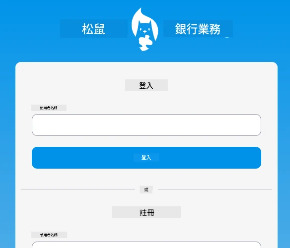

<!--
CO_OP_TRANSLATOR_METADATA:
{
  "original_hash": "830359535306594b448db6575ce5cdee",
  "translation_date": "2025-08-26T00:02:50+00:00",
  "source_file": "7-bank-project/README.md",
  "language_code": "mo"
}
-->
# :dollar: 建立銀行

在這個專案中，你將學習如何建立一個虛構的銀行。這些課程包含了如何設計網頁應用程式的佈局和路由、建立表單、管理狀態，以及從 API 獲取銀行數據的教學。

|  |  |
|--------------------------------|--------------------------------|

## 課程

1. [網頁應用程式中的 HTML 模板與路由](1-template-route/README.md)
2. [建立登入與註冊表單](2-forms/README.md)
3. [獲取與使用數據的方法](3-data/README.md)
4. [狀態管理的概念](4-state-management/README.md)

### 致謝

這些課程由 [Yohan Lasorsa](https://twitter.com/sinedied) 用 :hearts: 編寫。

如果你有興趣學習如何建立這些課程中使用的 [伺服器 API](/7-bank-project/api/README.md)，可以觀看 [這系列影片](https://aka.ms/NodeBeginner)（特別是第 17 到 21 部影片）。

你也可以查看 [這個互動式學習教程](https://aka.ms/learn/express-api)。

**免責聲明**：  
本文件已使用 AI 翻譯服務 [Co-op Translator](https://github.com/Azure/co-op-translator) 進行翻譯。儘管我們努力確保翻譯的準確性，但請注意，自動翻譯可能包含錯誤或不準確之處。原始文件的母語版本應被視為權威來源。對於關鍵信息，建議使用專業人工翻譯。我們對因使用此翻譯而引起的任何誤解或錯誤解釋不承擔責任。