<!--
CO_OP_TRANSLATOR_METADATA:
{
  "original_hash": "a9a3bcc037a447e2d8994d99e871cd9f",
  "translation_date": "2025-11-03T23:37:02+00:00",
  "source_file": "8-code-editor/1-using-a-code-editor/README.md",
  "language_code": "mo"
}
-->
# 使用程式碼編輯器：掌握 VSCode.dev

還記得《駭客任務》中 Neo 必須連接到巨大的電腦終端才能進入數位世界嗎？今天的網頁開發工具完全相反——強大的功能隨時隨地都能使用。VSCode.dev 是一款基於瀏覽器的程式碼編輯器，能讓任何有網路連接的設備都擁有專業的開發工具。

就像印刷術讓書籍不再僅限於修道院的抄寫員，VSCode.dev 讓程式碼編寫變得更加普及。你可以在圖書館的電腦、學校的實驗室，或任何可以使用瀏覽器的地方進行工作。無需安裝，沒有「我需要特定的設置」的限制。

在這堂課結束時，你將了解如何使用 VSCode.dev，直接在瀏覽器中打開 GitHub 儲存庫，並使用 Git 進行版本控制——這些都是專業開發者每天依賴的技能。

## ⚡ 5 分鐘內你可以做什麼

**忙碌開發者的快速入門路徑**


- **第 1 分鐘**：進入 [vscode.dev](https://vscode.dev) - 無需安裝
- **第 2 分鐘**：使用 GitHub 登錄以連接你的儲存庫
- **第 3 分鐘**：嘗試 URL 技巧：將任何儲存庫 URL 中的 `github.com` 替換為 `vscode.dev/github`
- **第 4 分鐘**：創建一個新檔案並觀察語法高亮自動運作
- **第 5 分鐘**：通過原始碼控制面板進行更改並提交

**快速測試 URL**：
```
# Transform this:
github.com/microsoft/Web-Dev-For-Beginners

# Into this:
vscode.dev/github/microsoft/Web-Dev-For-Beginners
```

**為什麼這很重要**：在 5 分鐘內，你將體驗到隨時隨地使用專業工具進行編碼的自由。這代表了開發的未來——可訪問、強大且即時。

## 🗺️ 雲端開發的學習旅程

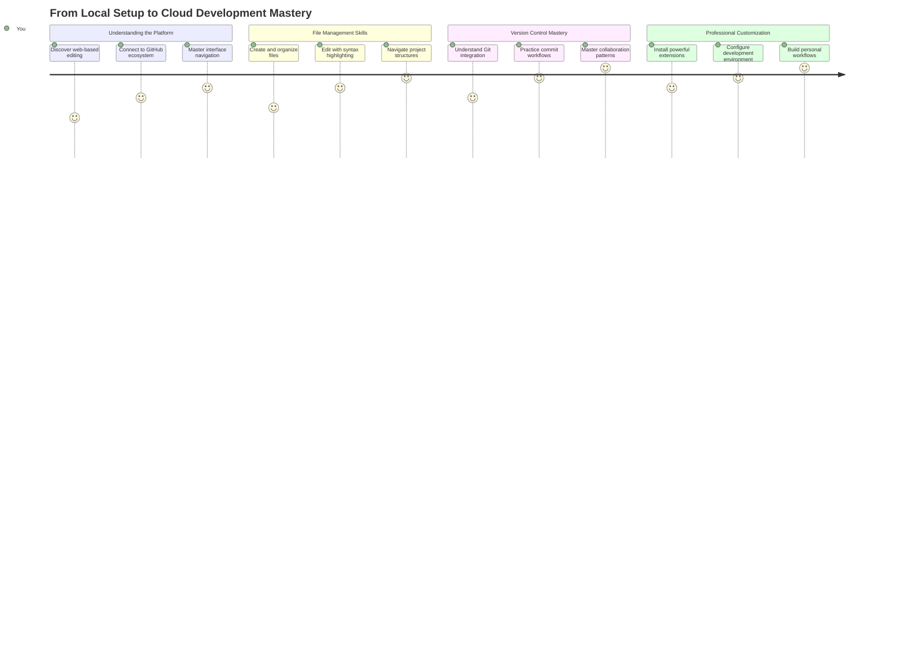

**你的學習目標**：在這堂課結束時，你將掌握一個專業的雲端開發環境，能在任何設備上工作，使用與大型科技公司開發者相同的工具進行編碼。

## 你將學到什麼

在我們一起學習之後，你將能夠：

- 像使用第二個家一樣熟練地操作 VSCode.dev——找到你需要的一切而不迷路
- 在瀏覽器中立即打開任何 GitHub 儲存庫並開始編輯（這真的很神奇！）
- 使用 Git 像專業人士一樣追蹤你的更改並保存進度
- 使用擴展功能提升編輯器的效率，讓編碼更快更有趣
- 自信地創建和組織專案檔案

## 你需要準備什麼

需求非常簡單：

- 一個免費的 [GitHub 帳戶](https://github.com)（如果需要，我們會指導你創建）
- 基本的網頁瀏覽器使用知識
- GitHub 基礎課程提供了有用的背景知識，但不是必須的

> 💡 **GitHub 新手？** 創建帳戶是免費的，只需幾分鐘。就像圖書館卡讓你能夠借閱全球的書籍，GitHub 帳戶讓你能夠訪問互聯網上的程式碼儲存庫。

## 🧠 雲端開發生態系統概述

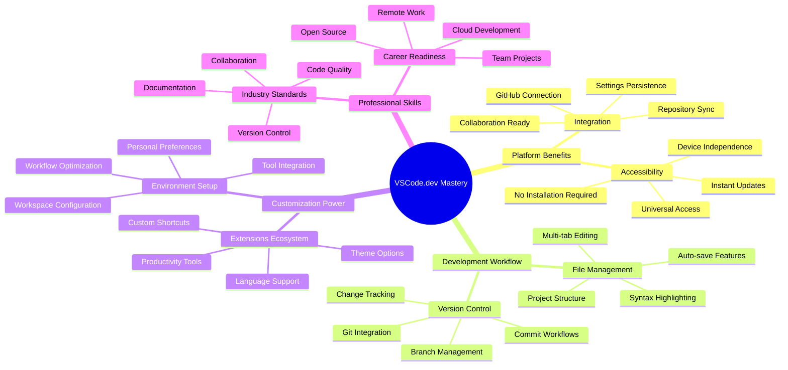

**核心原則**：基於雲端的開發環境代表了編碼的未來——提供專業級工具，具有可訪問性、協作性和平台獨立性。

## 為什麼基於網頁的程式碼編輯器很重要

在互聯網出現之前，不同大學的科學家無法輕易分享研究成果。然後在 1960 年代出現了 ARPANET，連接了遠距離的電腦。基於網頁的程式碼編輯器遵循了相同的原則——無論你的地理位置或設備如何，都能使用強大的工具。

程式碼編輯器是你的開發工作空間，讓你可以撰寫、編輯和組織程式碼檔案。與簡單的文字編輯器不同，專業的程式碼編輯器提供語法高亮、錯誤檢測和專案管理功能。

VSCode.dev 將這些功能帶到你的瀏覽器中：

**基於網頁編輯的優勢：**

| 功能 | 描述 | 實際效益 |
|------|------|----------|
| **平台獨立性** | 在任何有瀏覽器的設備上運行 | 無縫切換不同電腦工作 |
| **無需安裝** | 通過網頁 URL 訪問 | 避免軟體安裝限制 |
| **自動更新** | 始終運行最新版本 | 無需手動更新即可獲得新功能 |
| **儲存庫整合** | 與 GitHub 直接連接 | 無需本地檔案管理即可編輯程式碼 |

**實際影響：**
- 在不同環境中保持工作連續性
- 無論操作系統如何，界面一致
- 即時協作能力
- 減少本地存儲需求

## 探索 VSCode.dev

就像瑪麗·居里的實驗室在簡單的空間中包含了精密的設備，VSCode.dev 將專業的開發工具打包到瀏覽器界面中。這款網頁應用程式提供了與桌面程式碼編輯器相同的核心功能。

首先在瀏覽器中進入 [vscode.dev](https://vscode.dev)。界面無需下載或系統安裝即可加載——這是雲端計算原則的直接應用。

### 連接你的 GitHub 帳戶

就像亞歷山大·格拉漢姆·貝爾的電話連接了遙遠的地點，連接你的 GitHub 帳戶將 VSCode.dev 與你的程式碼儲存庫連接起來。當系統提示使用 GitHub 登錄時，建議接受此連接。

**GitHub 整合提供：**
- 在編輯器中直接訪問你的儲存庫
- 設置和擴展在不同設備間同步
- 儲存到 GitHub 的工作流程更流暢
- 個性化的開發環境

### 熟悉你的新工作空間

一切加載完成後，你會看到一個設計簡潔的工作空間，旨在讓你專注於重要的事情——你的程式碼！

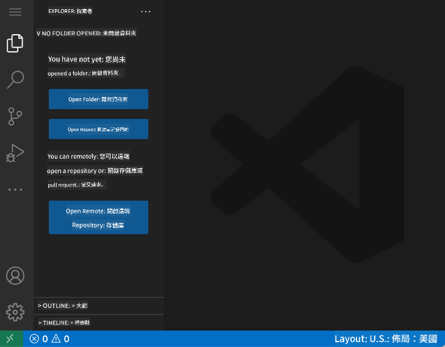

**以下是你的工作空間導覽：**
- **活動欄**（左側的那條）：你的主要導航，包括 Explorer 📁、Search 🔍、Source Control 🌿、Extensions 🧩 和 Settings ⚙️
- **側邊欄**（旁邊的面板）：根據你選擇的內容顯示相關資訊
- **編輯區域**（中間的大空間）：這是魔法發生的地方——你的主要編碼區域

**花點時間探索：**
- 點擊活動欄上的圖標，看看每個圖標的功能
- 注意側邊欄如何更新以顯示不同資訊——很酷吧？
- Explorer 視圖（📁）可能是你花最多時間的地方，所以要熟悉它

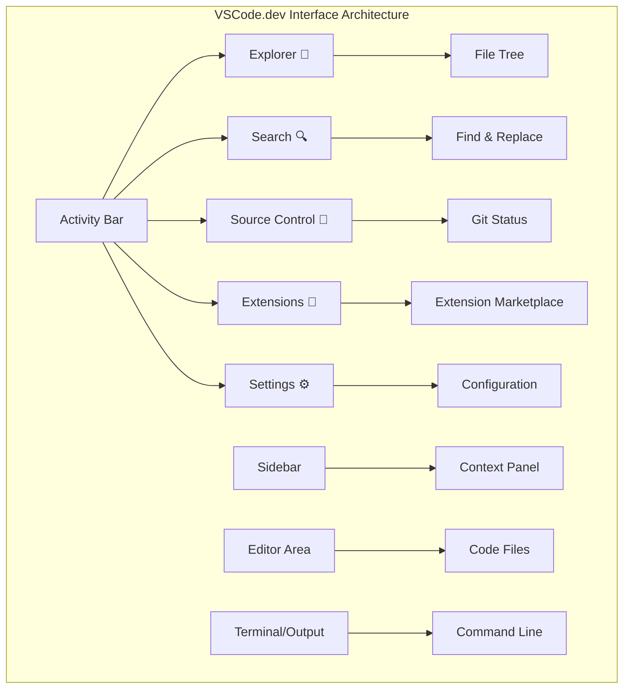

## 打開 GitHub 儲存庫

在互聯網出現之前，研究人員必須親自前往圖書館才能獲取文件。GitHub 儲存庫的運作方式類似——它們是遠端存儲的程式碼集合。VSCode.dev 消除了在本地機器下載儲存庫後再進行編輯的傳統步驟。

此功能使得可以立即訪問任何公共儲存庫以進行查看、編輯或貢獻。以下是打開儲存庫的兩種方法：

### 方法 1：點擊操作方式

當你剛開始使用 VSCode.dev 並希望打開特定儲存庫時，這是最簡單直接的方法：

**操作步驟：**

1. 如果你還未進入，請前往 [vscode.dev](https://vscode.dev)
2. 在歡迎界面上找到「Open Remote Repository」按鈕並點擊

   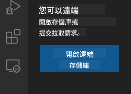

3. 貼上任何 GitHub 儲存庫 URL（試試這個：`https://github.com/microsoft/Web-Dev-For-Beginners`）
4. 按下 Enter，見證奇蹟！

**專業提示 - 命令面板快捷鍵：**

想感受像程式碼巫師一樣的感覺嗎？試試這個鍵盤快捷鍵：Ctrl+Shift+P（Mac 上為 Cmd+Shift+P）打開命令面板：

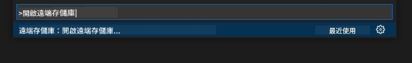

**命令面板就像一個搜索引擎，能找到你能做的一切：**
- 輸入「open remote」，它會幫你找到儲存庫打開器
- 它記住你最近打開的儲存庫（非常方便！）
- 一旦習慣了，你會感覺自己編碼速度如閃電
- 它基本上是 VSCode.dev 的「Hey Siri，但用於編碼」

### 方法 2：URL 修改技巧

就像 HTTP 和 HTTPS 使用不同的協議但保持相同的域名結構，VSCode.dev 使用了一種與 GitHub 地址系統相似的 URL 模式。任何 GitHub 儲存庫 URL 都可以修改為直接在 VSCode.dev 中打開。

**URL 轉換模式：**

| 儲存庫類型 | GitHub URL | VSCode.dev URL |
|------------|------------|----------------|
| **公共儲存庫** | `github.com/microsoft/Web-Dev-For-Beginners` | `vscode.dev/github/microsoft/Web-Dev-For-Beginners` |
| **個人專案** | `github.com/your-username/my-project` | `vscode.dev/github/your-username/my-project` |
| **任何可訪問的儲存庫** | `github.com/their-username/awesome-repo` | `vscode.dev/github/their-username/awesome-repo` |

**實施方法：**
- 將 `github.com` 替換為 `vscode.dev/github`
- 保持 URL 的其他部分不變
- 適用於任何可公開訪問的儲存庫
- 提供即時編輯訪問

> 💡 **改變生活的小技巧**：將你最喜歡的儲存庫的 VSCode.dev 版本加入書籤。我有一些書籤，比如「編輯我的作品集」和「修復文檔」，它們可以直接帶我進入編輯模式！

**應該使用哪種方法？**
- **界面方式**：適合探索或記不住具體儲存庫名稱時使用
- **URL 技巧**：當你確切知道要去哪裡時，這是快速訪問的完美選擇

### 🎯 教學檢查點：雲端開發訪問

**暫停並反思**：你剛剛學到了兩種通過網頁瀏覽器訪問程式碼儲存庫的方法。這代表了開發方式的根本轉變。

**快速自我評估**：
- 你能解釋為什麼基於網頁的編輯消除了傳統的「開發環境設置」嗎？
- URL 修改技巧相比本地 git 克隆有什麼優勢？
- 這種方法如何改變你對開源專案的貢獻方式？

**現實世界連結**：像 GitHub、GitLab 和 Replit 這樣的大公司已經將它們的開發平台建立在這些以雲端為先的原則之上。你正在學習全球專業開發團隊使用的相同工作流程。

**挑戰問題**：雲端開發如何改變學校教授編碼的方式？考慮設備需求、軟體管理和協作可能性。

## 處理檔案和專案

現在你已經打開了一個儲存庫，讓我們開始創建吧！VSCode.dev 提供了你所需的一切工具來創建、編輯和組織你的程式碼檔案。把它想像成你的數位工作坊——每個工具都在你需要的地方。

讓我們深入了解日常任務，這些任務將構成你大部分的編碼工作流程。

### 創建新檔案

就像在建築師的辦公室中組織藍圖一樣，VSCode.dev 中的檔案創建遵循結構化的方式。系統支持所有標準的網頁開發檔案類型。

**檔案創建過程：**

1. 在 Explorer 側邊欄中導航到目標文件夾
2. 將滑鼠懸停在文件夾名稱上，顯示「新檔案」圖標 (📄+)
3. 輸入檔案名，包括適當的副檔名（例如 `style.css`、`script.js`、`index.html`）
4. 按下 Enter 創建檔案

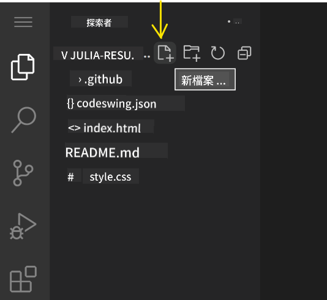

**命名規則：**
- 使用描述性名稱來指示檔案用途
- 包含檔案副檔名以正確顯示語法高亮
- 在專案中保持一致的命名模式
- 使用小寫字母和連字符代替空格

### 編輯和保存檔案

這是最有趣的部分！VSCode.dev 的編輯器充滿了有助於讓編碼變得流暢和直觀的功能。就像有一個非常聰明的寫作助手，但專門用於程式碼。

**你的編輯工作流程：**

1. 點擊 Explorer 中的任何檔案以在主區域中打開
2. 開始輸入，觀察 VSCode.dev 如何用顏色、建議和錯誤檢測幫助你
3. 使用 Ctrl+S（Windows/Linux）或 Cmd+S（Mac）保存你的工作——雖然它也會自動保存！

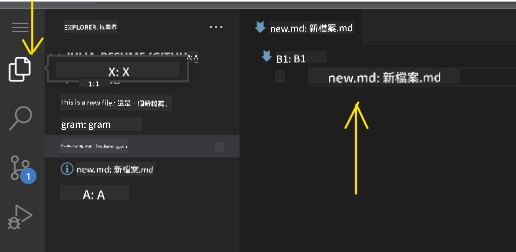

**編碼時發生的酷炫事情：**
- 你的程式碼會被美麗地著色，便於閱讀
- VSCode.dev 在你輸入時提供建議（像自動校正，但更聰明）
- 它在你保存之前就能捕捉到拼寫錯誤和錯誤
- 你可以像瀏覽器中的標籤一樣打開多個檔案
- 所有內容都會在背景中自動保存

> ⚠️ **快速提示**：即使有自動保存功能，按下 Ctrl+S 或 Cmd+S 仍然是一個好習慣。它能立即保存所有內容並觸發一些額外的有用功能，比如錯誤檢查。

### 使用 Git 進行版本控制

就像考古學家詳細記錄挖掘層一樣，Git 會隨時間追蹤你的程式碼更改。這個系統保存了專案歷史，並使你能夠在需要時恢復到以前的版本。VSCode.dev 包含了整合的 Git 功能。

**原始碼控制界面：**

1. 通過活動欄中的 🌿 圖標進入原始碼控制面板
2. 修改過的檔案會出現在「更改」部分
3. 顏色編碼指示更改類型：綠色表示新增，紅色表示刪除

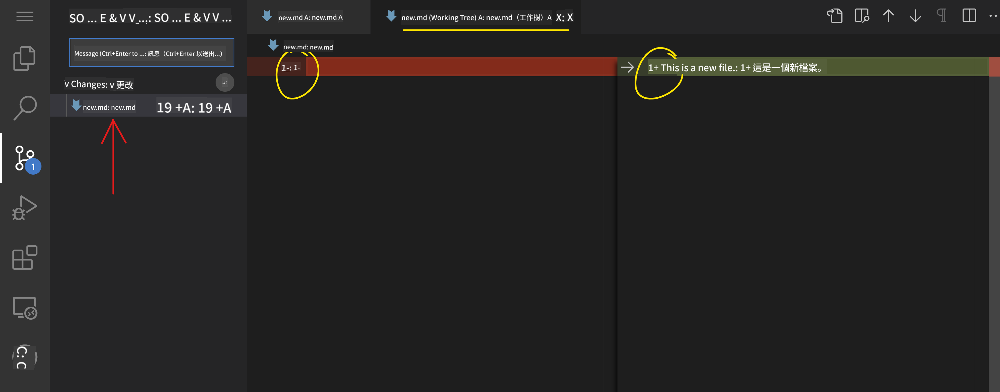

**保存你的工作（提交工作流程）：**

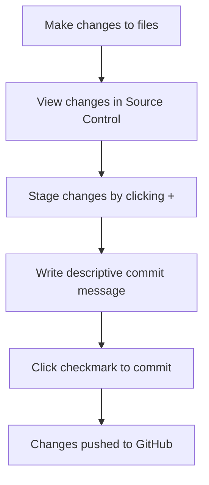

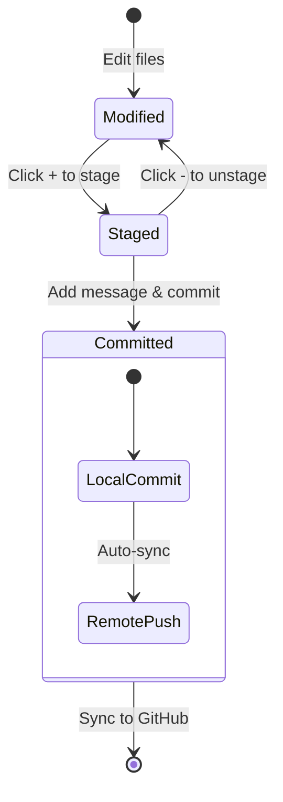

**以下是你的逐步操作流程：**
- 點擊你想保存的檔案旁邊的「+」圖標（這是「暫存」它們的步驟）
- 仔細檢查你對所有已暫存的更改是否滿意  
- 寫一段簡短的說明，解釋你做了什麼（這就是你的 "提交訊息"）  
- 點擊核對按鈕，將所有內容保存到 GitHub  
- 如果你對某些事情改變了主意，可以使用撤銷圖示來放棄更改  

**撰寫良好的提交訊息（其實很簡單！）：**  
- 只需描述你做了什麼，例如 "新增聯絡表單" 或 "修復導航問題"  
- 保持簡短明瞭——想像成推文的長度，而不是寫篇文章  
- 以動作詞開頭，例如 "新增"、"修復"、"更新" 或 "移除"  
- **良好的範例**： "新增響應式導航選單"、"修復行動版佈局問題"、"更新顏色以提升可讀性"  

> 💡 **快速導航提示**：使用左上角的漢堡選單 (☰) 回到你的 GitHub 儲存庫，查看你已提交的更改。這就像是你的編輯環境和 GitHub 專案主頁之間的傳送門！

## 使用擴展功能提升效能

就像工匠的工作坊擁有專門的工具來完成不同的任務一樣，VSCode.dev 可以透過擴展功能進行自訂，增加特定的能力。這些由社群開發的插件解決了常見的開發需求，例如程式碼格式化、即時預覽以及增強的 Git 整合。

擴展市場提供了數千種由全球開發者創建的免費工具。每個擴展都解決了特定的工作流程挑戰，讓你能夠建立一個符合自己需求和偏好的個性化開發環境。

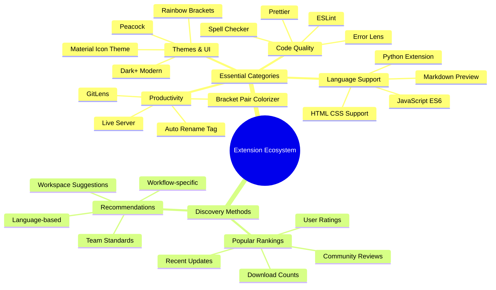
  
### 找到適合你的擴展

擴展市場組織得非常好，因此你不會迷失在尋找所需工具的過程中。它的設計旨在幫助你發現特定工具以及那些你甚至不知道存在的酷東西！

**進入擴展市場的方法：**  
1. 點擊活動欄中的擴展圖示 (🧩)  
2. 隨意瀏覽或搜索特定內容  
3. 點擊任何看起來有趣的項目以了解更多資訊  

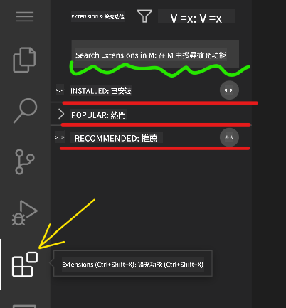  

**你會在裡面看到什麼：**  

| 區域 | 內容 | 為什麼有幫助 |  
|----------|---------|----------|  
| **已安裝** | 你已添加的擴展 | 你的個人編程工具箱 |  
| **熱門** | 大家喜愛的擴展 | 大多數開發者推薦的工具 |  
| **推薦** | 為你的專案提供的智能建議 | VSCode.dev 的貼心推薦 |  

**瀏覽的便利性：**  
- 每個擴展都顯示評分、下載次數和真實用戶評論  
- 你可以看到截圖和清晰的功能描述  
- 每個擴展都清楚標示了兼容性資訊  
- 還會推薦相似的擴展，方便你進行比較  

### 安裝擴展（非常簡單！）

為你的編輯器新增功能就像點擊一個按鈕一樣簡單。擴展安裝只需幾秒鐘，並立即開始運作——無需重啟，也不需要等待。

**你只需做以下幾步：**  
1. 搜索你想要的擴展（例如搜索 "live server" 或 "prettier"）  
2. 點擊看起來不錯的擴展以查看更多細節  
3. 閱讀它的功能並查看評分  
4. 點擊藍色的 "安裝" 按鈕，完成！  

  

**幕後發生的事情：**  
- 擴展會自動下載並設置好  
- 新功能會立即出現在你的介面中  
- 所有功能立即開始運作（真的很快！）  
- 如果你已登入，擴展會同步到所有設備  

**一些我推薦的入門擴展：**  
- **Live Server**：即時查看你的網站隨著程式碼更新的效果（非常神奇！）  
- **Prettier**：自動讓你的程式碼看起來乾淨又專業  
- **Auto Rename Tag**：修改一個 HTML 標籤時，對應的標籤也會同步更新  
- **Bracket Pair Colorizer**：為括號配色，讓你不會迷失在程式碼中  
- **GitLens**：為你的 Git 功能提供大量有用資訊，讓其更強大  

### 自訂你的擴展

大多數擴展都附帶可調整的設定，讓你可以根據自己的喜好進行調整。就像調整汽車的座椅和後視鏡一樣，每個人都有自己的偏好！

**調整擴展設定：**  
1. 在擴展面板中找到你已安裝的擴展  
2. 找到其名稱旁邊的小齒輪圖示 (⚙️)，然後點擊它  
3. 從下拉選單中選擇 "擴展設定"  
4. 調整設定，直到符合你的工作流程需求  

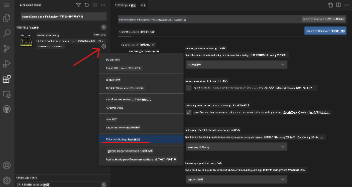  

**你可能想調整的常見設定：**  
- 程式碼的格式化方式（例如使用 Tab 還是空格、行長度等）  
- 觸發不同操作的快捷鍵  
- 擴展應作用於哪些檔案類型  
- 開啟或關閉特定功能以保持介面簡潔  

### 管理你的擴展

隨著你發現更多有趣的擴展，你可能希望保持你的擴展集合整潔並運行流暢。VSCode.dev 讓管理變得非常簡單。

**你的擴展管理選項：**  

| 你可以做什麼 | 什麼時候有幫助 | 專業提示 |  
|--------|---------|----------|  
| **停用** | 測試某擴展是否引起問題 | 比卸載更好，因為你可能會想要恢復使用 |  
| **卸載** | 完全移除不需要的擴展 | 保持你的環境乾淨且快速 |  
| **更新** | 獲取最新功能和錯誤修復 | 通常會自動更新，但值得檢查 |  

**我喜歡的擴展管理方式：**  
- 每隔幾個月，我會檢查已安裝的擴展，移除不再使用的  
- 我保持擴展更新，以獲得最新的改進和安全修復  
- 如果某些功能似乎變慢，我會暫時停用擴展，看看是否是某個擴展的問題  
- 當擴展有重大更新時，我會閱讀更新說明——有時會有很酷的新功能！  

> ⚠️ **效能提示**：擴展很棒，但太多可能會拖慢速度。專注於那些真正讓你的工作更輕鬆的擴展，不要害怕卸載那些你從未使用過的。

### 🎯 教學檢查：開發環境自訂

**架構理解**：你已學會如何使用社群創建的擴展來自訂專業的開發環境。這反映了企業開發團隊如何建立標準化的工具鏈。  

**掌握的關鍵概念**：  
- **擴展發現**：找到解決特定開發挑戰的工具  
- **環境配置**：根據個人或團隊偏好自訂工具  
- **效能優化**：在功能性和系統效能之間取得平衡  
- **社群合作**：利用全球開發者社群創建的工具  

**產業連結**：擴展生態系統支持主要的開發平台，例如 VS Code、Chrome DevTools 和現代 IDE。了解如何評估、安裝和配置擴展是專業開發工作流程的必要技能。  

**反思問題**：如果要為一個由 10 名開發者組成的團隊設置標準化的開發環境，你會如何著手？請考慮一致性、效能和個人偏好。

## 📈 你的雲端開發技能進階時間表

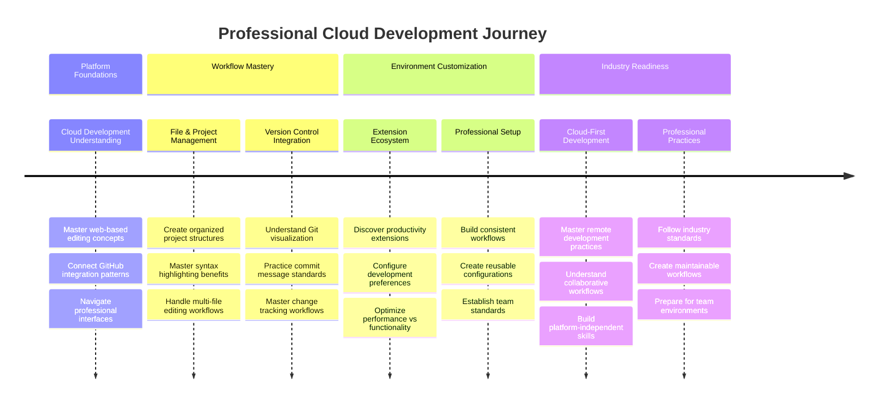
  
**🎓 畢業里程碑**：你已成功掌握雲端開發技能，使用與主要科技公司專業開發者相同的工具和工作流程。這些技能代表了軟體開發的未來。  

**🔄 下一階段能力：**  
- 準備探索進階的雲端開發平台（如 Codespaces、GitPod）  
- 準備在分散式開發團隊中工作  
- 能夠為全球的開源專案做出貢獻  
- 為現代 DevOps 和持續整合實踐奠定基礎  

## GitHub Copilot Agent 挑戰 🚀

就像 NASA 為太空任務採用的系統化方法一樣，這項挑戰涉及在完整的工作流程場景中系統地應用 VSCode.dev 技能。

**目標：** 展示你對 VSCode.dev 的熟練掌握，建立一個完整的網頁開發工作流程。

**專案要求：** 使用 Agent 模式協助，完成以下任務：  
1. 分叉一個現有的儲存庫或創建一個新的  
2. 建立一個包含 HTML、CSS 和 JavaScript 檔案的功能性專案結構  
3. 安裝並配置三個增強開發的擴展  
4. 使用描述性提交訊息練習版本控制  
5. 嘗試建立和修改功能分支  
6. 在 README.md 檔案中記錄過程和學習心得  

這項練習將所有 VSCode.dev 概念整合到一個實際的工作流程中，可應用於未來的開發專案。

了解更多 [Agent 模式](https://code.visualstudio.com/blogs/2025/02/24/introducing-copilot-agent-mode)。

## 作業

是時候真正測試這些技能了！我有一個動手專案，讓你練習我們所涵蓋的所有內容：[使用 VSCode.dev 建立履歷網站](./assignment.md)

這個作業將引導你在瀏覽器中完全建立一個專業的履歷網站。你將使用我們探索過的所有 VSCode.dev 功能，完成後，你不僅會擁有一個外觀精美的網站，還會對新的工作流程充滿信心。

## 繼續探索並提升你的技能

你已經打下了堅實的基礎，但還有更多酷炫的東西等著你去發掘！以下是一些資源和建議，幫助你將 VSCode.dev 技能提升到下一個層次：

**值得收藏的官方文件：**  
- [VSCode Web 文件](https://code.visualstudio.com/docs/editor/vscode-web?WT.mc_id=academic-0000-alfredodeza) – 瀏覽器編輯的完整指南  
- [GitHub Codespaces](https://docs.github.com/en/codespaces) – 當你需要更強大的雲端功能時  

**接下來可以嘗試的酷炫功能：**  
- **快捷鍵**：學習讓你感覺像是編程高手的快捷鍵組合  
- **工作區設定**：為不同類型的專案設置不同的環境  
- **多根工作區**：同時處理多個儲存庫（非常方便！）  
- **終端整合**：直接在瀏覽器中使用命令列工具  

**練習的想法：**  
- 加入一些開源專案並使用 VSCode.dev 貢獻——這是回饋社群的好方法！  
- 嘗試不同的擴展，找到最適合你的設置  
- 為你最常建立的網站類型創建專案模板  
- 練習 Git 工作流程，例如分支和合併——這些技能在團隊專案中非常重要  

---

**你已經掌握了基於瀏覽器的開發！** 🎉 就像便攜式儀器的發明使科學家能夠在偏遠地區進行研究一樣，VSCode.dev 讓專業的編程可以在任何連接網路的設備上進行。

這些技能反映了當前的行業實踐——許多專業開發者因其靈活性和可訪問性而使用雲端開發環境。你已經學會了一種可以從個人專案擴展到大型團隊合作的工作流程。

將這些技術應用到你的下一個開發專案中吧！ 🚀

---

**免責聲明**：  
本文件已使用 AI 翻譯服務 [Co-op Translator](https://github.com/Azure/co-op-translator) 進行翻譯。儘管我們努力確保翻譯的準確性，但請注意，自動翻譯可能包含錯誤或不準確之處。原始文件的母語版本應被視為權威來源。對於關鍵信息，建議使用專業人工翻譯。我們對因使用此翻譯而引起的任何誤解或誤釋不承擔責任。