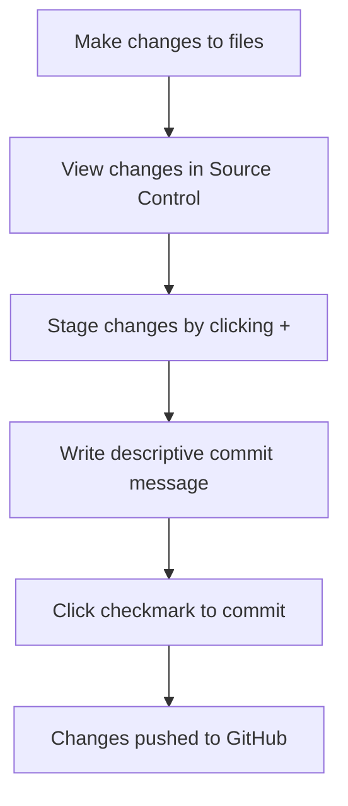

<!--
CO_OP_TRANSLATOR_METADATA:
{
  "original_hash": "cfd4a15974168ca426d50c67682ab9d4",
  "translation_date": "2025-10-22T22:36:00+00:00",
  "source_file": "8-code-editor/1-using-a-code-editor/README.md",
  "language_code": "mo"
}
-->
# 使用程式碼編輯器：精通 VSCode.dev

還記得《駭客任務》中 Neo 必須連接到一台巨大的電腦終端才能進入數字世界嗎？如今的網頁開發工具完全相反——強大的功能隨時隨地都能使用。VSCode.dev 是一款基於瀏覽器的程式碼編輯器，能讓任何有網路連接的設備都能使用專業的開發工具。

就像印刷術讓書籍不再僅僅是修道院抄寫員的專利一樣，VSCode.dev 讓程式碼編寫變得更加普及。你可以在圖書館的電腦上、學校的實驗室裡，或者任何可以使用瀏覽器的地方進行工作。無需安裝，沒有「我需要特定的設置」的限制。

在這節課結束時，你將能夠了解如何使用 VSCode.dev，直接在瀏覽器中打開 GitHub 儲存庫，並使用 Git 進行版本控制——這些都是專業開發者每天依賴的技能。

## 你將學到什麼

完成這節課後，你將能夠：

- 像使用第二個家一樣熟練地操作 VSCode.dev——輕鬆找到所需的一切，不再迷失方向
- 直接在瀏覽器中打開任何 GitHub 儲存庫並立即開始編輯（這真的很神奇！）
- 使用 Git 像專業人士一樣追蹤你的更改並保存進度
- 使用擴展功能提升編輯器的效率，讓程式碼編寫更快速、更有趣
- 自信地創建和組織專案文件

## 你需要準備什麼

需求非常簡單：

- 一個免費的 [GitHub 帳戶](https://github.com)（如果需要，我們會指導你如何創建）
- 基本的網頁瀏覽器使用知識
- GitHub 基礎課程提供了有用的背景知識，但不是必須的

> 💡 **GitHub 新手？** 創建帳戶是免費的，只需幾分鐘。就像圖書館卡能讓你借閱全球的書籍一樣，GitHub 帳戶能讓你接觸到互聯網上的程式碼儲存庫。

## 為什麼網頁版程式碼編輯器很重要

在互聯網出現之前，不同大學的科學家無法輕易分享研究成果。然後在 1960 年代，ARPANET 出現了，連接了遠距離的電腦。網頁版程式碼編輯器遵循了相同的原則——無論你身處何地或使用什麼設備，都能使用強大的工具。

程式碼編輯器是你的開發工作空間，讓你可以撰寫、編輯和組織程式碼文件。與簡單的文字編輯器不同，專業的程式碼編輯器提供語法高亮、錯誤檢測和專案管理功能。

VSCode.dev 將這些功能帶到了瀏覽器中：

**網頁版編輯的優勢：**

| 功能 | 描述 | 實際效益 |
|------|------|----------|
| **平台獨立性** | 在任何有瀏覽器的設備上運行 | 無縫切換不同電腦工作 |
| **無需安裝** | 通過網頁 URL 訪問 | 避免軟體安裝限制 |
| **自動更新** | 始終運行最新版本 | 無需手動更新即可獲得新功能 |
| **儲存庫整合** | 與 GitHub 直接連接 | 無需本地文件管理即可編輯程式碼 |

**實際影響：**
- 在不同環境中的工作連續性
- 無論操作系統如何，界面始終一致
- 即時協作能力
- 減少本地存儲需求

## 探索 VSCode.dev

就像瑪麗·居里的實驗室在相對簡單的空間中包含了精密的設備一樣，VSCode.dev 將專業的開發工具打包到瀏覽器界面中。這款網頁應用提供了與桌面程式碼編輯器相同的核心功能。

首先，打開瀏覽器並進入 [vscode.dev](https://vscode.dev)。界面會在無需下載或系統安裝的情況下加載——這是雲端計算原則的直接應用。

### 連接你的 GitHub 帳戶

就像亞歷山大·格拉漢姆·貝爾的電話連接了遙遠的地點一樣，連接你的 GitHub 帳戶可以將 VSCode.dev 與你的程式碼儲存庫連接起來。當系統提示你使用 GitHub 登錄時，建議接受此連接。

**GitHub 整合提供：**
- 在編輯器中直接訪問你的儲存庫
- 在不同設備間同步設置和擴展
- 簡化保存到 GitHub 的工作流程
- 個性化的開發環境

### 熟悉你的新工作空間

一旦所有內容加載完成，你會看到一個設計精美的工作空間，旨在讓你專注於最重要的事情——你的程式碼！

**以下是你的工作空間導覽：**
- **活動欄**（左側的那條）：你的主要導航工具，包括 Explorer 📁、Search 🔍、Source Control 🌿、Extensions 🧩 和 Settings ⚙️
- **側邊欄**（旁邊的面板）：根據你選擇的內容顯示相關信息
- **編輯區域**（中間的大空間）：這是魔法發生的地方——你的主要程式碼編輯區

**花點時間探索：**
- 點擊活動欄上的圖標，看看每個圖標的功能
- 注意側邊欄如何根據選擇的內容更新信息——很酷吧？
- Explorer 視圖（📁）可能是你花最多時間的地方，所以熟悉它吧

## 打開 GitHub 儲存庫

在互聯網出現之前，研究人員必須親自前往圖書館才能獲取文獻。GitHub 儲存庫的工作原理類似——它們是遠程存儲的程式碼集合。VSCode.dev 消除了在本地機器下載儲存庫後再進行編輯的傳統步驟。

這項功能使得可以立即訪問任何公共儲存庫以進行查看、編輯或貢獻。以下是打開儲存庫的兩種方法：

### 方法 1：點擊操作方式

當你剛開始使用 VSCode.dev 並想打開特定儲存庫時，這是最簡單的方式，非常適合初學者：

**操作步驟：**

1. 如果你還沒進入 [vscode.dev](https://vscode.dev)，先進入該網站
2. 在歡迎頁面上找到「Open Remote Repository」按鈕並點擊

   

3. 粘貼任何 GitHub 儲存庫 URL（試試這個：`https://github.com/microsoft/Web-Dev-For-Beginners`）
4. 按下 Enter，見證奇蹟！

**專業提示 - 命令面板快捷鍵：**

想感覺像個程式碼巫師嗎？試試這個鍵盤快捷鍵：Ctrl+Shift+P（或 Mac 上的 Cmd+Shift+P）打開命令面板：

**命令面板就像一個搜索引擎，能找到你能做的一切：**
- 輸入「open remote」，它會幫你找到儲存庫打開器
- 它會記住你最近打開的儲存庫（非常方便！）
- 一旦你習慣了它，你會感覺自己像在以光速編程
- 它基本上是 VSCode.dev 的「嘿 Siri，但用於程式碼」

### 方法 2：URL 修改技巧

就像 HTTP 和 HTTPS 使用不同的協議但保持相同的域名結構一樣，VSCode.dev 使用了一種與 GitHub 地址系統相似的 URL 模式。任何 GitHub 儲存庫 URL 都可以修改為直接在 VSCode.dev 中打開。

**URL 轉換模式：**

| 儲存庫類型 | GitHub URL | VSCode.dev URL |
|------------|------------|----------------|
| **公共儲存庫** | `github.com/microsoft/Web-Dev-For-Beginners` | `vscode.dev/github/microsoft/Web-Dev-For-Beginners` |
| **個人專案** | `github.com/your-username/my-project` | `vscode.dev/github/your-username/my-project` |
| **任何可訪問的儲存庫** | `github.com/their-username/awesome-repo` | `vscode.dev/github/their-username/awesome-repo` |

**實施方法：**
- 將 `github.com` 替換為 `vscode.dev/github`
- 保持 URL 的其他部分不變
- 適用於任何可公開訪問的儲存庫
- 提供即時編輯訪問

> 💡 **改變生活的小技巧**：將你最喜歡的儲存庫的 VSCode.dev 版本加入書籤。我有像「編輯我的作品集」和「修復文檔」這樣的書籤，可以直接進入編輯模式！

**應該使用哪種方法？**
- **界面方式**：適合探索或記不住具體儲存庫名稱時使用
- **URL 技巧**：當你確切知道要去的地方時，這是快速訪問的完美選擇

## 處理文件和專案

現在你已經打開了一個儲存庫，讓我們開始創建吧！VSCode.dev 提供了你所需的一切來創建、編輯和組織程式碼文件。把它想像成你的數字工作坊——每個工具都在你需要的地方。

讓我們深入了解構成大部分程式碼工作流程的日常任務。

### 創建新文件

就像建築師的辦公室裡組織藍圖一樣，VSCode.dev 中的文件創建遵循結構化的方式。系統支持所有標準的網頁開發文件類型。

**文件創建過程：**

1. 在 Explorer 側邊欄中導航到目標文件夾
2. 將鼠標懸停在文件夾名稱上，顯示「新文件」圖標（📄+）
3. 輸入文件名，包括適當的擴展名（例如 `style.css`、`script.js`、`index.html`）
4. 按 Enter 創建文件

**命名規則：**
- 使用描述性名稱，表明文件用途
- 包含文件擴展名以便正確的語法高亮
- 在整個專案中遵循一致的命名模式
- 使用小寫字母和連字符代替空格

### 編輯和保存文件

這是最有趣的部分！VSCode.dev 的編輯器充滿了有助於使程式碼編寫流暢和直觀的功能。就像有一個非常聰明的寫作助手，但專門用於程式碼。

**你的編輯工作流程：**

1. 點擊 Explorer 中的任意文件，將其打開到主區域
2. 開始輸入，看看 VSCode.dev 如何用顏色、建議和錯誤檢測幫助你
3. 使用 Ctrl+S（Windows/Linux）或 Cmd+S（Mac）保存你的工作——不過它也會自動保存！

**編程時發生的酷炫事情：**
- 你的程式碼會被漂亮地用顏色標記，便於閱讀
- VSCode.dev 在你輸入時提供補全建議（就像自動校正，但更智能）
- 它在你保存之前就能捕捉到拼寫錯誤和錯誤
- 你可以像瀏覽器一樣在多個文件中打開標籤
- 所有內容都會在背景中自動保存

> ⚠️ **快速提示**：即使有自動保存功能，養成按 Ctrl+S 或 Cmd+S 的習慣仍然很好。它能立即保存所有內容並觸發一些額外的有用功能，比如錯誤檢查。

### 使用 Git 進行版本控制

就像考古學家詳細記錄挖掘層一樣，Git 會隨時間推移追蹤你的程式碼更改。這個系統保存了專案的歷史記錄，並在需要時讓你能夠回到之前的版本。VSCode.dev 包含了集成的 Git 功能。

**版本控制界面：**

1. 通過活動欄上的 🌿 圖標進入 Source Control 面板
2. 修改過的文件會出現在「Changes」部分
3. 顏色編碼指示更改類型：綠色表示新增，紅色表示刪除

**保存你的工作（提交工作流程）：**

**以下是你的逐步操作：**
- 點擊文件旁邊的「+」圖標（這是「暫存」它們）
- 仔細檢查你是否對所有暫存的更改感到滿意
- 寫一個簡短的備註說明你做了什麼（這是你的「提交訊息」）
- 點擊勾選按鈕將所有內容保存到 GitHub
- 如果你改變了主意，可以使用撤銷圖標丟棄更改

**撰寫良好的提交訊息（其實很簡單！）：**
- 只需描述你做了什麼，比如「新增聯絡表單」或「修復導航問題」
- 簡短明了——想想推文的長度，而不是寫篇文章
- 用行動詞開頭，比如「新增」、「修復」、「更新」或「移除」
- **良好的範例**：新增響應式導航菜單、修復移動端佈局問題、更新顏色以提高可訪性

> 💡 **快速導航提示**：使用左上角的漢堡菜單（☰）跳回你的 GitHub 儲存庫，查看你在線提交的更改。這就像在你的編輯環境和 GitHub 上的專案主頁之間的傳送門！

## 使用擴展功能增強功能

就像工匠的工作坊包含針對不同任務的專業工具一樣，VSCode.dev 可以通過擴展功能進行自定義，添加特定的功能。這些由社群開發的插件解決了常見的開發需求，例如程式碼格式化、即時預覽和增強的 Git 整合。

擴展市場提供了數千種由全球開發者創建的免費工具。每個擴展都解決了特定的工作流程挑戰，讓你能夠構建適合自己需求和偏好的個性化開發環境。

### 找到適合你的擴展

擴展市場組織得非常好，你不會迷失在尋找所需工具的過程中。它旨在幫助你發現特定工具以及你甚至不知道存在的酷炫功能！

**進入擴展市場：**

1. 點擊活動欄上的 Extensions 圖標（🧩）
2. 瀏覽或搜索特定的內容
3. 點擊任何看起來有趣的項目以了解更多信息

**你會在裡面看到什麼：**

| 部分 | 內容 | 為什麼有用 |
|------|------|----------|
| **已安裝** | 你已添加的擴展 | 你的個人程式碼工具箱 |
| **熱門** | 大家喜愛的擴展 | 大多數開發者推薦的工具 |
| **推薦** | 根據你的專案提供的智能建議 | VSCode.dev 的貼心推薦 |

**讓瀏覽變得簡單的原因：**
- 每個擴充功能都顯示評分、下載次數和真實用戶的評論
- 你可以看到截圖和清晰的描述，了解每個擴充功能的功能
- 所有內容都清楚標示了相容性資訊
- 還會推薦類似的擴充功能，方便你比較選擇

### 安裝擴充功能（超簡單！）

為你的編輯器新增功能就像點擊一個按鈕那麼簡單。擴充功能只需幾秒鐘就能安裝完成並立即開始運作——無需重啟，也不用等待。

**你只需要這樣做：**

1. 搜尋你需要的功能（試試搜尋 "live server" 或 "prettier"）
2. 點擊看起來不錯的擴充功能以查看更多細節
3. 閱讀它的功能介紹並查看評分
4. 點擊藍色的 "Install" 按鈕，完成！

**幕後發生的事情：**
- 擴充功能會自動下載並設置好
- 新功能會立即出現在你的介面中
- 所有功能馬上就能使用（真的很快！）
- 如果你已登入，擴充功能會同步到你的所有設備

**推薦你可以先試試的幾個擴充功能：**
- **Live Server**：在你編碼時即時查看網站更新（這個超神奇！）
- **Prettier**：自動讓你的程式碼看起來乾淨又專業
- **Auto Rename Tag**：修改一個 HTML 標籤時，對應的標籤也會自動更新
- **Bracket Pair Colorizer**：為括號添加顏色標記，讓你不會迷失
- **GitLens**：為你的 Git 功能提供大量有用資訊，讓它更強大

### 自訂你的擴充功能

大多數擴充功能都附帶可調整的設定，讓它們能完全符合你的需求。就像調整汽車的座椅和後視鏡一樣——每個人都有自己的偏好！

**調整擴充功能設定：**

1. 在擴充功能面板中找到你已安裝的擴充功能
2. 找到它名稱旁邊的小齒輪圖示 (⚙️)，然後點擊
3. 從下拉選單中選擇 "Extension Settings"
4. 根據你的工作流程調整設定，直到感覺剛剛好

**你可能想調整的常見設定：**
- 程式碼的格式（例如使用 Tab 還是空格、行長等）
- 觸發不同操作的鍵盤快捷鍵
- 擴充功能應作用於哪些檔案類型
- 開啟或關閉特定功能，保持介面簡潔

### 管理你的擴充功能

當你發現越來越多有趣的擴充功能時，你會希望保持你的擴充功能集合整潔並運行流暢。VSCode.dev 讓管理變得非常簡單。

**你的擴充功能管理選項：**

| 可執行的操作 | 適用情境 | 專家提示 |
|--------|---------|----------|
| **停用** | 測試某個擴充功能是否引起問題 | 如果可能會再次使用，比卸載更好 |
| **卸載** | 完全移除不需要的擴充功能 | 保持環境整潔和快速 |
| **更新** | 獲取最新功能和錯誤修復 | 通常會自動更新，但值得檢查一下 |

**我喜歡這樣管理擴充功能：**
- 每隔幾個月，我會檢查已安裝的擴充功能，移除不再使用的
- 我保持擴充功能更新，以獲得最新的改進和安全修復
- 如果感覺速度變慢，我會暫時停用一些擴充功能，看看是否有影響
- 當擴充功能有重大更新時，我會閱讀更新說明——有時會有很酷的新功能！

> ⚠️ **性能提示**：擴充功能很棒，但太多可能會拖慢速度。專注於那些真正讓你生活更輕鬆的擴充功能，不要害怕卸載那些你從未使用過的。

## GitHub Copilot Agent 挑戰 🚀

就像 NASA 在太空任務中使用的結構化方法一樣，這個挑戰涉及在完整的工作流程場景中系統地應用 VSCode.dev 技能。

**目標：** 展示使用 VSCode.dev 建立全面網頁開發工作流程的熟練程度。

**項目要求：** 使用 Agent 模式協助，完成以下任務：
1. Fork 一個現有的倉庫或創建一個新倉庫
2. 建立包含 HTML、CSS 和 JavaScript 文件的功能性項目結構
3. 安裝並配置三個能提升開發效率的擴充功能
4. 使用描述性提交訊息進行版本控制
5. 練習建立和修改功能分支
6. 在 README.md 文件中記錄過程和學習心得

這項練習將所有 VSCode.dev 概念整合到一個實際的工作流程中，未來可以應用於開發項目。

了解更多 [agent mode](https://code.visualstudio.com/blogs/2025/02/24/introducing-copilot-agent-mode) 的資訊。

## 作業

是時候真正測試這些技能了！我有一個動手項目，讓你可以練習我們所涵蓋的所有內容：[使用 VSCode.dev 建立一個履歷網站](./assignment.md)

這個作業將引導你在瀏覽器中完全建立一個專業的履歷網站。你將使用我們探索過的所有 VSCode.dev 功能，完成後，你不僅會擁有一個外觀精美的網站，還會對你的新工作流程充滿信心。

## 繼續探索並提升你的技能

你現在已經有了堅實的基礎，但還有更多酷炫的東西等著你去發掘！以下是一些資源和想法，幫助你將 VSCode.dev 技能提升到下一個層次：

**值得收藏的官方文件：**
- [VSCode Web Documentation](https://code.visualstudio.com/docs/editor/vscode-web?WT.mc_id=academic-0000-alfredodeza) – 瀏覽器編輯的完整指南
- [GitHub Codespaces](https://docs.github.com/en/codespaces) – 當你需要更強大的雲端功能時

**接下來可以嘗試的酷炫功能：**
- **鍵盤快捷鍵**：學習那些讓你感覺像是編程高手的快捷鍵組合
- **工作區設定**：為不同類型的項目設置不同的環境
- **多根工作區**：同時處理多個倉庫（非常方便！）
- **終端整合**：直接在瀏覽器中使用命令行工具

**練習的想法：**
- 加入一些開源項目並使用 VSCode.dev 貢獻——這是回饋社群的好方法！
- 嘗試不同的擴充功能，找到最適合你的配置
- 為你最常建立的網站類型創建項目模板
- 練習 Git 工作流程，例如分支和合併——這些技能在團隊項目中非常重要

---

**你已經掌握了基於瀏覽器的開發！** 🎉 就像便攜式儀器的發明使科學家能夠在偏遠地區進行研究一樣，VSCode.dev 讓你能夠在任何連接網路的設備上進行專業編程。

這些技能反映了當前的行業實踐——許多專業開發者使用基於雲端的開發環境，因為它們靈活且易於訪問。你已經學會了一種可以從個人項目擴展到大型團隊合作的工作流程。

將這些技術應用到你的下一個開發項目吧！ 🚀

---

**免責聲明**：  
本文件已使用 AI 翻譯服務 [Co-op Translator](https://github.com/Azure/co-op-translator) 進行翻譯。儘管我們致力於提供準確的翻譯，請注意自動翻譯可能包含錯誤或不準確之處。原始文件的母語版本應被視為權威來源。對於關鍵信息，建議使用專業人工翻譯。我們對因使用此翻譯而引起的任何誤解或誤釋不承擔責任。