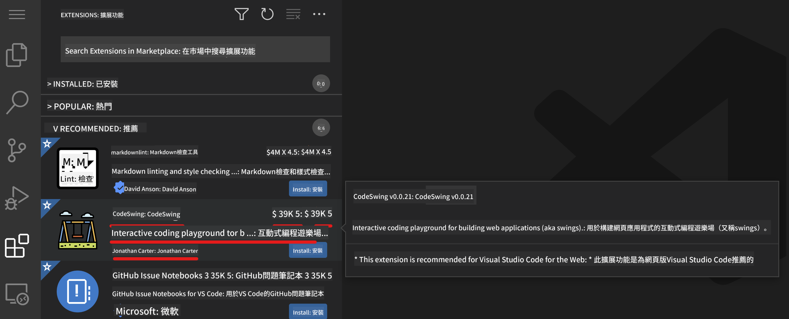

<!--
CO_OP_TRANSLATOR_METADATA:
{
  "original_hash": "1ba61d96a11309a2a6ea507496dcf7e5",
  "translation_date": "2025-08-28T23:41:47+00:00",
  "source_file": "8-code-editor/1-using-a-code-editor/README.md",
  "language_code": "mo"
}
-->
# 使用程式碼編輯器

本課程介紹如何使用 [VSCode.dev](https://vscode.dev) 這款基於網頁的程式碼編輯器，讓您可以在不需要安裝任何軟體的情況下修改程式碼並參與專案。

<!----
TODO: 添加一張可選的圖片

> Sketchnote by [Author name](https://example.com)
---->

<!---
## 課前測驗
[課前測驗](https://ff-quizzes.netlify.app/web/quiz/3)
---->

## 學習目標

在本課程中，您將學習如何：

- 在程式碼專案中使用程式碼編輯器
- 使用版本控制追蹤變更
- 自訂編輯器以進行開發

### 先決條件

在開始之前，您需要先在 [GitHub](https://github.com) 建立一個帳戶。如果您尚未建立帳戶，請前往 [GitHub](https://github.com/) 註冊。

### 簡介

程式碼編輯器是撰寫程式和協作現有程式碼專案的重要工具。一旦您了解編輯器的基本功能及如何使用其特性，便能在撰寫程式碼時靈活運用。

## 開始使用 VSCode.dev

[VSCode.dev](https://vscode.dev) 是一款基於網頁的程式碼編輯器。您不需要安裝任何軟體，只需像開啟其他網站一樣使用它。要開始使用編輯器，請開啟以下連結：[https://vscode.dev](https://vscode.dev)。如果您尚未登入 [GitHub](https://github.com/)，請按照提示登入或建立新帳戶後再登入。

載入後，畫面應該看起來像這張圖片：


主要有三個區域，從左到右分別是：

1. _活動列_，包含一些圖示，例如放大鏡 🔎、齒輪 ⚙️ 等。
2. 展開的活動列，預設為 _檔案總管_，稱為 _側邊欄_。
3. 最右側的程式碼區域。

點擊每個圖示以顯示不同的選單。完成後，點擊 _檔案總管_ 回到初始位置。

當您開始撰寫程式碼或修改現有程式碼時，這些操作都會在右側最大的區域進行。您也可以在此區域查看現有程式碼，接下來我們將進一步探討。

## 開啟 GitHub 儲存庫

首先，您需要開啟一個 GitHub 儲存庫。有多種方式可以開啟儲存庫，本節將介紹兩種方法，讓您可以開始進行修改。

### 1. 使用編輯器

使用編輯器本身開啟遠端儲存庫。如果您前往 [VSCode.dev](https://vscode.dev)，會看到一個 _"開啟遠端儲存庫"_ 按鈕：


您也可以使用指令面板。指令面板是一個輸入框，您可以輸入任何指令或動作的關鍵字來找到相應的指令。使用左上方的選單，選擇 _檢視_，然後點擊 _指令面板_，或使用以下快捷鍵：Ctrl-Shift-P（MacOS 上為 Command-Shift-P）。


開啟選單後，輸入 _開啟遠端儲存庫_，然後選擇第一個選項。您參與的儲存庫或最近開啟的儲存庫將顯示出來。您也可以使用完整的 GitHub URL 來選擇儲存庫。將以下 URL 貼入輸入框：

```
https://github.com/microsoft/Web-Dev-For-Beginners
```

✅ 如果成功，您將看到該儲存庫的所有檔案載入到文字編輯器中。

### 2. 使用 URL

您也可以直接使用 URL 來載入儲存庫。例如，目前儲存庫的完整 URL 是 [https://github.com/microsoft/Web-Dev-For-Beginners](https://github.com/microsoft/Web-Dev-For-Beginners)，但您可以將 GitHub 網域替換為 `VSCode.dev/github`，直接載入儲存庫。結果 URL 為 [https://vscode.dev/github/microsoft/Web-Dev-For-Beginners](https://vscode.dev/github/microsoft/Web-Dev-For-Beginners)。

## 編輯檔案

當您在瀏覽器或 vscode.dev 中開啟儲存庫後，下一步就是更新或修改專案。

### 1. 建立新檔案

您可以在現有資料夾中建立檔案，也可以在根目錄/資料夾中建立檔案。要建立新檔案，請開啟您希望儲存檔案的位置/目錄，然後選擇活動列 _(左側)_ 的 _'新檔案 ...'_ 圖示，命名檔案後按下 Enter。


### 2. 編輯並儲存儲存庫中的檔案

使用 vscode.dev 非常適合快速更新專案，而不需要在本地端載入任何軟體。
要更新程式碼，點擊活動列上的 '檔案總管' 圖示以查看儲存庫中的檔案和資料夾。
選擇一個檔案以在程式碼區域中開啟，進行修改並儲存。


完成專案更新後，選擇 _`版本控制`_ 圖示，該圖示包含您對儲存庫所做的所有新變更。

要查看您對專案所做的變更，選擇展開的活動列中 `變更` 資料夾中的檔案。這將開啟一個 '工作樹'，讓您直觀地查看檔案的變更。紅色表示刪除，綠色表示新增。


如果您對所做的變更感到滿意，將滑鼠移至 `變更` 資料夾並點擊 `+` 按鈕以暫存變更。暫存表示準備將變更提交到 GitHub。

如果您對某些變更不滿意並希望捨棄它們，將滑鼠移至 `變更` 資料夾並選擇 `撤銷` 圖示。

接著，輸入 `提交訊息` _(描述您對專案所做的變更)_，點擊 `勾選圖示` 以提交並推送您的變更。

完成專案工作後，選擇左上方的 `漢堡選單圖示` 返回 github.com 上的儲存庫。


## 使用擴充功能

在 VSCode 中安裝擴充功能可以新增功能並自訂開發環境，提升開發工作流程。這些擴充功能可以支援多種程式語言，通常分為通用擴充功能或語言專屬擴充功能。

要瀏覽所有可用的擴充功能列表，點擊活動列上的 _`擴充功能圖示`_，並在標示為 _'在 Marketplace 中搜尋擴充功能'_ 的文字框中輸入擴充功能名稱。
您將看到一個擴充功能列表，每個擴充功能包含 **名稱、發行者名稱、一句話描述、下載次數** 和 **星級評分**。



您也可以透過展開 _`已安裝資料夾`_ 查看所有已安裝的擴充功能，透過 _`熱門資料夾`_ 查看大多數開發者使用的熱門擴充功能，或透過 _`推薦資料夾`_ 查看基於您最近開啟的檔案或工作空間的推薦擴充功能。


### 1. 安裝擴充功能

要安裝擴充功能，請在搜尋框中輸入擴充功能名稱，點擊它以在展開的活動列中查看更多資訊。

您可以點擊展開的活動列中的 _藍色安裝按鈕_ 安裝擴充功能，或在程式碼區域中選擇擴充功能以載入更多資訊後使用安裝按鈕。


### 2. 自訂擴充功能

安裝擴充功能後，您可能需要根據偏好修改其行為並進行自訂。要執行此操作，選擇擴充功能圖示，您的擴充功能將出現在 _已安裝資料夾_ 中，點擊 _**齒輪圖示**_ 並導航至 _擴充功能設定_。


### 3. 管理擴充功能

安裝並使用擴充功能後，vscode.dev 提供多種選項以根據不同需求管理擴充功能。例如，您可以選擇：

- **停用：** _(當您暫時不需要擴充功能但不想完全卸載時，可以停用它)_

    選擇展開的活動列中的已安裝擴充功能 > 點擊齒輪圖示 > 選擇 '停用' 或 '停用（工作空間）' **或** 在程式碼區域中開啟擴充功能並點擊藍色停用按鈕。

- **卸載：** 選擇展開的活動列中的已安裝擴充功能 > 點擊齒輪圖示 > 選擇 '卸載' **或** 在程式碼區域中開啟擴充功能並點擊藍色卸載按鈕。

---

## 作業

[使用 vscode.dev 建立履歷網站](https://github.com/microsoft/Web-Dev-For-Beginners/blob/main/8-code-editor/1-using-a-code-editor/assignment.md)

<!----
## 課後測驗
[課後測驗](https://ff-quizzes.netlify.app/web/quiz/4)
---->

## 回顧與自學

閱讀更多關於 [VSCode.dev](https://code.visualstudio.com/docs/editor/vscode-web?WT.mc_id=academic-0000-alfredodeza) 及其其他功能的資訊。

---

**免責聲明**：  
本文件已使用 AI 翻譯服務 [Co-op Translator](https://github.com/Azure/co-op-translator) 進行翻譯。儘管我們努力確保翻譯的準確性，但請注意，自動翻譯可能包含錯誤或不準確之處。原始文件的母語版本應被視為權威來源。對於關鍵信息，建議使用專業人工翻譯。我們對因使用此翻譯而引起的任何誤解或錯誤解釋不承擔責任。