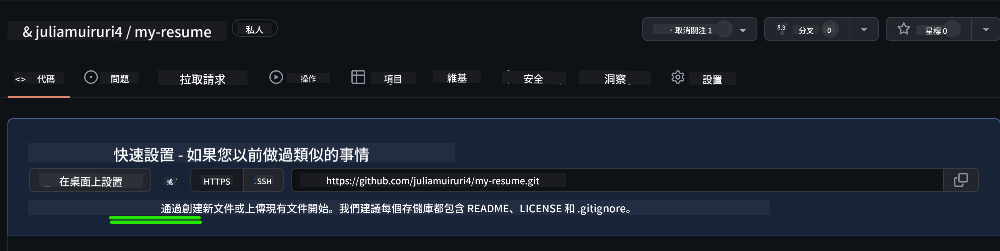
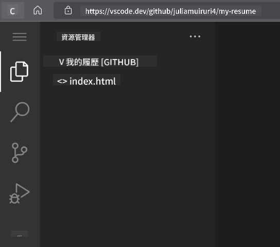

<!--
CO_OP_TRANSLATOR_METADATA:
{
  "original_hash": "bd3aa6d2b879c30ea496c43aec1c49ed",
  "translation_date": "2025-08-28T23:42:14+00:00",
  "source_file": "8-code-editor/1-using-a-code-editor/assignment.md",
  "language_code": "mo"
}
-->
# 使用 vscode.dev 建立履歷網站

_當面試官要求你的履歷時，你可以直接給他們一個網址，這有多酷呢？_ 😎

## 目標

完成這個任務後，你將學會：

- 建立一個網站來展示你的履歷

### 先決條件

1. 一個 GitHub 帳號。如果你還沒有，請前往 [GitHub](https://github.com/) 註冊一個帳號。

## 步驟

**步驟 1：** 建立一個新的 GitHub 儲存庫，命名為 `my-resume`

**步驟 2：** 在你的儲存庫中建立一個 `index.html` 檔案。我們需要在 github.com 上新增至少一個檔案，因為空的儲存庫無法在 vscode.dev 中開啟。

點擊 `creating a new file` 連結，輸入檔案名稱 `index.html`，然後選擇 `Commit new file` 按鈕。



**步驟 3：** 開啟 [VSCode.dev](https://vscode.dev)，選擇 `Open Remote Repository` 按鈕。

複製剛剛為你的履歷網站建立的儲存庫網址，並將其貼到輸入框中：

_將 `your-username` 替換為你的 GitHub 使用者名稱_

```
https://github.com/your-username/my-resume
```

✅ 如果成功，你將在瀏覽器中的文字編輯器看到你的專案和 `index.html` 檔案。



**步驟 4：** 開啟 `index.html` 檔案，將以下程式碼貼到你的編輯區域並儲存。

<details>
    <summary><b>負責履歷網站內容的 HTML 程式碼。</b></summary>
    
        <html>

            <head>
                <link href="style.css" rel="stylesheet">
                <link rel="stylesheet" href="https://cdnjs.cloudflare.com/ajax/libs/font-awesome/5.15.4/css/all.min.css">
                <title>Your Name Goes Here!</title>
            </head>
            <body>
                <header id="header">
                    <!-- 履歷標題，包含你的名字和職稱 -->
                    <h1>Your Name Goes Here!</h1>
                    <hr>
                    Your Role!
                    <hr>
                </header>
                <main>
                    <article id="mainLeft">
                        <section>
                            <h2>聯絡方式</h2>
                            <!-- 聯絡資訊，包括社群媒體 -->
                            <p>
                                <i class="fa fa-envelope" aria-hidden="true"></i>
                                <a href="mailto:username@domain.top-level domain">在這裡填寫你的電子郵件</a>
                            </p>
                            <p>
                                <i class="fab fa-github" aria-hidden="true"></i>
                                <a href="github.com/yourGitHubUsername">在這裡填寫你的 GitHub 使用者名稱！</a>
                            </p>
                            <p>
                                <i class="fab fa-linkedin" aria-hidden="true"></i>
                                <a href="linkedin.com/yourLinkedInUsername">在這裡填寫你的 LinkedIn 使用者名稱！</a>
                            </p>
                        </section>
                        <section>
                            <h2>技能</h2>
                            <!-- 你的技能 -->
                            <ul>
                                <li>技能 1！</li>
                                <li>技能 2！</li>
                                <li>技能 3！</li>
                                <li>技能 4！</li>
                            </ul>
                        </section>
                        <section>
                            <h2>教育背景</h2>
                            <!-- 你的教育背景 -->
                            <h3>在這裡填寫你的課程！</h3>
                            <p>
                                在這裡填寫你的學校名稱！
                            </p>
                            <p>
                                開始 - 結束日期
                            </p>
                        </section>            
                    </article>
                    <article id="mainRight">
                        <section>
                            <h2>關於我</h2>
                            <!-- 關於你 -->
                            <p>在這裡寫一段關於自己的簡介！</p>
                        </section>
                        <section>
                            <h2>工作經驗</h2>
                            <!-- 你的工作經驗 -->
                            <h3>職位名稱</h3>
                            <p>
                                在這裡填寫組織名稱 | 開始月份 – 結束月份
                            </p>
                            <ul>
                                    <li>任務 1 - 描述你做了什麼！</li>
                                    <li>任務 2 - 描述你做了什麼！</li>
                                    <li>描述你的貢獻成果/影響</li>
                                    
                            </ul>
                            <h3>職位名稱 2</h3>
                            <p>
                                在這裡填寫組織名稱 | 開始月份 – 結束月份
                            </p>
                            <ul>
                                    <li>任務 1 - 描述你做了什麼！</li>
                                    <li>任務 2 - 描述你做了什麼！</li>
                                    <li>描述你的貢獻成果/影響</li>
                                    
                            </ul>
                        </section>
                    </article>
                </main>
            </body>
        </html>
</details>

將你的履歷細節替換掉 HTML 程式碼中的 _佔位文字_。

**步驟 5：** 將滑鼠移到 My-Resume 資料夾上，點擊 `New File ...` 圖示，並在你的專案中建立兩個新檔案：`style.css` 和 `codeswing.json`。

**步驟 6：** 開啟 `style.css` 檔案，將以下程式碼貼上並儲存。

<details>
        <summary><b>用於格式化網站佈局的 CSS 程式碼。</b></summary>
            
            body {
                font-family: 'Segoe UI', Tahoma, Geneva, Verdana, sans-serif;
                font-size: 16px;
                max-width: 960px;
                margin: auto;
            }
            h1 {
                font-size: 3em;
                letter-spacing: .6em;
                padding-top: 1em;
                padding-bottom: 1em;
            }

            h2 {
                font-size: 1.5em;
                padding-bottom: 1em;
            }

            h3 {
                font-size: 1em;
                padding-bottom: 1em;
            }
            main { 
                display: grid;
                grid-template-columns: 40% 60%;
                margin-top: 3em;
            }
            header {
                text-align: center;
                margin: auto 2em;
            }

            section {
                margin: auto 1em 4em 2em;
            }

            i {
                margin-right: .5em;
            }

            p {
                margin: .2em auto
            }

            hr {
                border: none;
                background-color: lightgray;
                height: 1px;
            }

            h1, h2, h3 {
                font-weight: 100;
                margin-bottom: 0;
            }
            #mainLeft {
                border-right: 1px solid lightgray;
            }
            
</details>

**步驟 6：** 開啟 `codeswing.json` 檔案，將以下程式碼貼上並儲存。

    {
    "scripts": [],
    "styles": []
    }

**步驟 7：** 安裝 `Codeswing extension` 以在編輯區域中預覽履歷網站。

點擊活動欄上的 _`Extensions`_ 圖示，輸入 Codeswing。點擊展開活動欄上的 _藍色安裝按鈕_ 或在選擇擴展後於編輯區域出現的安裝按鈕進行安裝。安裝完成後，觀察你的編輯區域，看看專案的變化 😃。


安裝擴展後，你的畫面應該會顯示如下。


如果你對所做的更改感到滿意，將滑鼠移到 `Changes` 資料夾上，點擊 `+` 按鈕以暫存更改。

輸入提交訊息 _(描述你對專案所做的更改)_，然後點擊 `check` 提交更改。完成專案後，選擇左上角的漢堡選單圖示返回 GitHub 上的儲存庫。

恭喜 🎉 你已經在幾個步驟內使用 vscode.dev 建立了你的履歷網站。

## 🚀 挑戰

開啟一個你有權限進行更改的遠端儲存庫，更新一些檔案。接下來，嘗試建立一個包含更改的新分支並提交 Pull Request。

## 回顧與自學

閱讀更多關於 [VSCode.dev](https://code.visualstudio.com/docs/editor/vscode-web?WT.mc_id=academic-0000-alfredodeza) 及其其他功能的資訊。

---

**免責聲明**：  
本文件已使用 AI 翻譯服務 [Co-op Translator](https://github.com/Azure/co-op-translator) 進行翻譯。儘管我們努力確保翻譯的準確性，但請注意，自動翻譯可能包含錯誤或不準確之處。原始文件的母語版本應被視為權威來源。對於關鍵信息，建議使用專業人工翻譯。我們對因使用此翻譯而引起的任何誤解或誤釋不承擔責任。