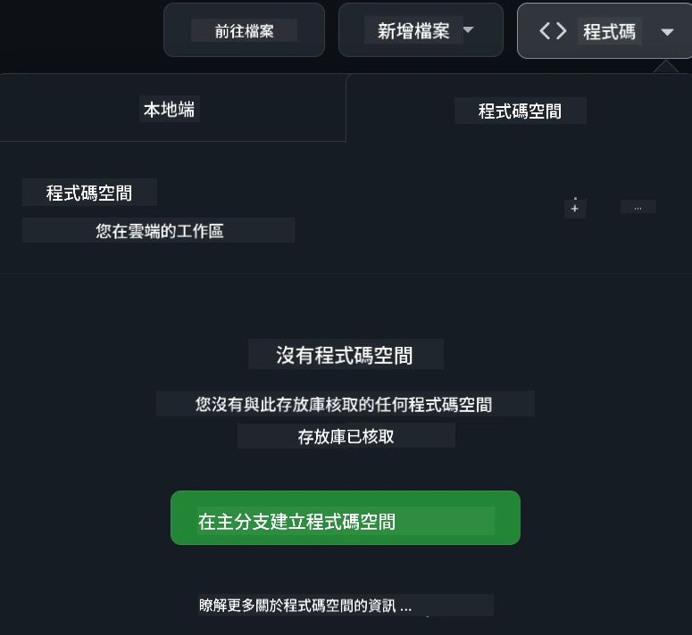

<!--
CO_OP_TRANSLATOR_METADATA:
{
  "original_hash": "fea3a0fceb8ad86fd640c09cf63a2aac",
  "translation_date": "2026-01-06T12:03:31+00:00",
  "source_file": "README.md",
  "language_code": "mo"
}
-->
[](https://github.com/microsoft/Web-Dev-For-Beginners/blob/master/LICENSE)
[](https://GitHub.com/microsoft/Web-Dev-For-Beginners/graphs/contributors/)
[](https://GitHub.com/microsoft/Web-Dev-For-Beginners/issues/)
[](https://GitHub.com/microsoft/Web-Dev-For-Beginners/pulls/)
[](http://makeapullrequest.com)

[](https://GitHub.com/microsoft/Web-Dev-For-Beginners/watchers/)
[](https://GitHub.com/microsoft/Web-Dev-For-Beginners/network/)
[](https://GitHub.com/microsoft/Web-Dev-For-Beginners/stargazers/)

[](https://discord.gg/nTYy5BXMWG)

# 初學者網頁開發 - 課程大綱

與我們由 Microsoft Cloud Advocates 推出的 12 週全面課程，一同學習網頁開發基礎。24 節課涵蓋 JavaScript、CSS 和 HTML，透過實作項目，例如生態瓶、瀏覽器擴充功能及太空遊戲來深入學習。參與測驗、討論及實務作業。透過有效的專案導向教學法，提升技能並優化知識吸收。即刻啟動你的程式設計旅程！

加入 Azure AI Foundry Discord 社群

[](https://discord.gg/nTYy5BXMWG)

跟著以下步驟開始使用這些資源：
1. **分支此儲存庫**：點擊 [](https://GitHub.com/microsoft/Web-Dev-For-Beginners/fork)
2. **克隆儲存庫**：   `git clone https://github.com/microsoft/Web-Dev-For-Beginners.git`
3. [**加入 Azure AI Foundry Discord，與專家及其他開發者交流**](https://discord.com/invite/ByRwuEEgH4)

### 🌐 多語言支援

#### 透過 GitHub 動作支援（自動且持續更新）

<!-- CO-OP TRANSLATOR LANGUAGES TABLE START -->
[阿拉伯語](../ar/README.md) | [孟加拉語](../bn/README.md) | [保加利亞語](../bg/README.md) | [緬甸語 (Myanmar)](../my/README.md) | [中文 (簡體)](../zh/README.md) | [中文 (繁體，香港)](../hk/README.md) | [中文 (繁體，澳門)](./README.md) | [中文 (繁體，台灣)](../tw/README.md) | [克羅地亞語](../hr/README.md) | [捷克語](../cs/README.md) | [丹麥語](../da/README.md) | [荷蘭語](../nl/README.md) | [愛沙尼亞語](../et/README.md) | [芬蘭語](../fi/README.md) | [法語](../fr/README.md) | [德語](../de/README.md) | [希臘語](../el/README.md) | [希伯來語](../he/README.md) | [印地語](../hi/README.md) | [匈牙利語](../hu/README.md) | [印尼語](../id/README.md) | [義大利語](../it/README.md) | [日語](../ja/README.md) | [坎納達語](../kn/README.md) | [韓語](../ko/README.md) | [立陶宛語](../lt/README.md) | [馬來語](../ms/README.md) | [馬拉雅拉姆語](../ml/README.md) | [馬拉地語](../mr/README.md) | [尼泊爾語](../ne/README.md) | [尼日利亞混合語](../pcm/README.md) | [挪威語](../no/README.md) | [波斯語 (Farsi)](../fa/README.md) | [波蘭語](../pl/README.md) | [葡萄牙語 (巴西)](../br/README.md) | [葡萄牙語 (葡萄牙)](../pt/README.md) | [旁遮普語 (Gurmukhi)](../pa/README.md) | [羅馬尼亞語](../ro/README.md) | [俄語](../ru/README.md) | [塞爾維亞語 (西里爾字母)](../sr/README.md) | [斯洛伐克語](../sk/README.md) | [斯洛文尼亞語](../sl/README.md) | [西班牙語](../es/README.md) | [斯瓦希里語](../sw/README.md) | [瑞典語](../sv/README.md) | [他加祿語 (菲律賓語)](../tl/README.md) | [泰米爾語](../ta/README.md) | [泰盧固語](../te/README.md) | [泰語](../th/README.md) | [土耳其語](../tr/README.md) | [烏克蘭語](../uk/README.md) | [烏爾都語](../ur/README.md) | [越南語](../vi/README.md)

> **喜歡本機端克隆？**

> 此儲存庫包含 50 多種語言翻譯，會顯著增加下載大小。若想不包含翻譯克隆，請使用稀疏檢出：
> ```bash
> git clone --filter=blob:none --sparse https://github.com/microsoft/Web-Dev-For-Beginners.git
> cd Web-Dev-For-Beginners
> git sparse-checkout set --no-cone '/*' '!translations' '!translated_images'
> ```
> 這讓你可以更快速下載，並取得完成課程所需的所有內容。
<!-- CO-OP TRANSLATOR LANGUAGES TABLE END -->

**若您希望支持其他翻譯語言，請參閱此 [列表](https://github.com/Azure/co-op-translator/blob/main/getting_started/supported-languages.md)**

[](https://open.vscode.dev/microsoft/Web-Dev-For-Beginners)

#### 🧑‍🎓 _你是學生嗎？_

造訪 [**學生中心頁面**](https://docs.microsoft.com/learn/student-hub/?WT.mc_id=academic-77807-sagibbon)，你會找到初學者資源、學生包，甚至可獲取免費證書兌換券。這是想收藏並不時查看的頁面，因為我們每月都會更換內容。

### 📣 公告 - 新增 GitHub Copilot Agent 模式挑戰！

新增挑戰，請在大多數章節尋找 "GitHub Copilot Agent Challenge 🚀"。這是使用 GitHub Copilot 及 Agent 模式來完成的新挑戰。如果你以前沒用過 Agent 模式，它不僅能生成文字，還能建立和編輯檔案、執行命令等。

### 📣 公告 - _使用生成式 AI 建構的新專案_

新增 AI 助理專案，快來看看 [專案](./9-chat-project/README.md)

### 📣 公告 - _針對 JavaScript 的全新生成式 AI 課程_

別錯過我們的生成式 AI 新課程！

造訪 [https://aka.ms/genai-js-course](https://aka.ms/genai-js-course) 開始學習！


- 課程涵蓋從基礎到 RAG。
- 使用 GenAI 及配套應用與歷史人物互動。
- 趣味且引人入勝的故事，讓你時光旅行！


每節課附有作業、知識檢核及挑戰，引導你學習如下主題：
- 提示及提示工程
- 文字與影像應用生成
- 搜尋應用

造訪 [https://aka.ms/genai-js-course](../../[https:/aka.ms/genai-js-course) 開始學習！


## 🌱 入門指南

> **教師們**，我們提供了 [使用此課程的建議](for-teachers.md)。歡迎您在 [討論區](https://github.com/microsoft/Web-Dev-For-Beginners/discussions/categories/teacher-corner) 提出意見！

**[學習者](https://aka.ms/student-page/?WT.mc_id=academic-77807-sagibbon)**，每節課從課前測驗開始，接著閱讀教材，完成各項活動，並透過課後測驗檢視理解程度。

為提升學習體驗，建議與同儕一同合作專案！歡迎於我們的 [討論區](https://github.com/microsoft/Web-Dev-For-Beginners/discussions) 參與討論，我們的版主團隊會協助回答問題。

為進一步學習，我們強烈推薦探索 [Microsoft Learn](https://learn.microsoft.com/users/wirelesslife/collections/p1ddcy5jwy0jkm?WT.mc_id=academic-77807-sagibbon) 提供的更多教材。

### 📋 環境設置

本課程已備妥開發環境！你可以選擇在 [Codespace](https://github.com/features/codespaces/)（瀏覽器即用、無需安裝環境）中執行課程，或在電腦本機使用像 [Visual Studio Code](https://code.visualstudio.com/?WT.mc_id=academic-77807-sagibbon) 的文字編輯器。

#### 建立你的儲存庫
為方便儲存你的作業，建議建立此儲存庫的個人副本。可點擊頁面頂端的 **Use this template** 按鈕，在你的 GitHub 帳號中建立此課程副本。

請依以下步驟操作：
1. **分支儲存庫**：點擊本頁右上角的「Fork」按鈕。
2. **克隆儲存庫**：   `git clone https://github.com/microsoft/Web-Dev-For-Beginners.git`

#### 在 Codespace 執行課程

在你建立的儲存庫副本中，點擊 **Code** 按鈕並選擇 **Open with Codespaces**。這將為你建立一個新的 Codespace 工作區。



#### 在本機電腦執行課程

要在電腦本機執行此課程，你需要文字編輯器、瀏覽器與命令列工具。我們的第一堂課，[程式語言與工具入門](../../1-getting-started-lessons/1-intro-to-programming-languages)，會介紹各種工具選擇，讓你挑選最合適的。

我們推薦使用 [Visual Studio Code](https://code.visualstudio.com/?WT.mc_id=academic-77807-sagibbon) 作為編輯器，它也內建有 [終端機](https://code.visualstudio.com/docs/terminal/basics/?WT.mc_id=academic-77807-sagibbon)。你可以在此下載 Visual Studio Code [連結](https://code.visualstudio.com/?WT.mc_id=academic-77807-sagibbon)。


1. 將你的儲存庫克隆到電腦。點擊 **Code** 按鈕並複製 URL：

    [CodeSpace](./images/createcodespace.png)
然後，在 [Visual Studio Code](https://code.visualstudio.com/?WT.mc_id=academic-77807-sagibbon) 內開啟 [終端機](https://code.visualstudio.com/docs/terminal/basics/?WT.mc_id=academic-77807-sagibbon) 並執行以下指令，將 `<your-repository-url>` 換成你剛才複製的 URL：

    ```bash 
    git clone <your-repository-url>
    ```

2. 在 Visual Studio Code 中打開資料夾。你可以透過點擊 **檔案** > **打開資料夾**，然後選擇你剛剛克隆的資料夾來達成。

> 推薦的 Visual Studio Code 擴充套件：
>
> * [Live Server](https://marketplace.visualstudio.com/items?itemName=ritwickdey.LiveServer&WT.mc_id=academic-77807-sagibbon) - 在 Visual Studio Code 中預覽 HTML 頁面
> * [Copilot](https://marketplace.visualstudio.com/items?itemName=GitHub.copilot&WT.mc_id=academic-77807-sagibbon) - 協助你更快撰寫程式碼

## 📂 每課包括：

- 選擇性速寫筆記
- 選擇性補充影片
- 課前熱身小測驗
- 書面課程
- 對專案基礎的課程，包含建立專案步驟指南
- 知識檢測
- 挑戰
- 補充閱讀資料
- 作業
- [課後測驗](https://ff-quizzes.netlify.app/web/)

> **關於測驗的說明**：所有測驗皆包含在 Quiz-app 資料夾中，共 48 個測驗，每個有三題問題。它們可在 [此處](https://ff-quizzes.netlify.app/web/) 取得，測驗應用程式可在本機運行或部署至 Azure；請遵循 `quiz-app` 資料夾中的說明。

## 🗃️ 課程列表

|     |                       專案名稱                       |                            教授概念                             | 學習目標                                                                                                                 |                                                         連結課程                                                          |         作者          |
| :-: | :--------------------------------------------------: | :--------------------------------------------------------------: | ------------------------------------------------------------------------------------------------------------------------ | :--------------------------------------------------------------------------------------------------------------------------: | :-------------------: |
| 01  |                     起步準備                        |           程式設計及工具簡介                                     | 了解大多數程式語言的基本原理與支援專業開發者的軟體工具                                                                  | [程式語言及工具簡介](./1-getting-started-lessons/1-intro-to-programming-languages/README.md)                                |         Jasmine       |
| 02  |                     起步準備                        |             GitHub 基礎，含團隊合作                             | 瞭解如何在專案中使用 GitHub，及如何與他人協作程式碼庫                                                                    |                            [GitHub 簡介](./1-getting-started-lessons/2-github-basics/README.md)                                |          Floor        |
| 03  |                     起步準備                        |                             無障礙設計                          | 了解網頁無障礙設計的基本知識                                                                                             |                       [無障礙設計基礎](./1-getting-started-lessons/3-accessibility/README.md)                                 |       Christopher     |
| 04  |                        JS 基礎                       |                         JavaScript 資料型別                      | JavaScript 資料型別的基礎知識                                                                                             |                                       [資料型別](./2-js-basics/1-data-types/README.md)                                      |         Jasmine       |
| 05  |                        JS 基礎                       |                         函數與方法                               | 學習使用函數及方法來管理應用程式的邏輯流                                                                                   |                              [函數與方法](./2-js-basics/2-functions-methods/README.md)                                   | Jasmine 和 Christopher |
| 06  |                        JS 基礎                       |                        使用 JS 做出決策                          | 學習如何使用決策製作方法來建立程式中的條件                                                                                 |                                 [決策製作](./2-js-basics/3-making-decisions/README.md)                                  |         Jasmine       |
| 07  |                        JS 基礎                       |                          陣列與迴圈                             | 使用 JavaScript 的陣列與迴圈處理資料                                                                                       |                                   [陣列與迴圈](./2-js-basics/4-arrays-loops/README.md)                                |         Jasmine       |
| 08  |       [Terrarium](./3-terrarium/solution/README.md)       |                         HTML 實作                               | 建立 HTML 以建立線上生態瓶，重點為佈局建構                                                                                 |                                 [HTML 入門](./3-terrarium/1-intro-to-html/README.md)                                   |           Jen         |
| 09  |       [Terrarium](./3-terrarium/solution/README.md)       |                         CSS 實作                                | 建立 CSS 以美化線上生態瓶，重點為 CSS 基礎含響應式設計                                                                     |                                  [CSS 入門](./3-terrarium/2-intro-to-css/README.md)                                   |           Jen         |
| 10  |            [Terrarium](./3-terrarium/solution/README.md)            |                 JavaScript閉包、DOM 操作                        | 建立 JavaScript 使生態瓶具備拖放功能，重點為閉包與 DOM 操作                                                               |                  [JavaScript 閉包、DOM 操作](./3-terrarium/3-intro-to-DOM-and-closures/README.md)                        |           Jen         |
| 11  |          [Typing Game](./4-typing-game/solution/README.md)          |                          建造打字遊戲                           | 了解如何使用鍵盤事件驅動 JavaScript 應用邏輯                                                                                |                                [事件驅動程式設計](./4-typing-game/typing-game/README.md)                                |       Christopher     |
| 12  | [Green Browser Extension](./5-browser-extension/solution/README.md) |                         瀏覽器運作                             | 了解瀏覽器運作原理、歷史，並建立瀏覽器擴充功能的初步結構                                                                   |                               [瀏覽器介紹](./5-browser-extension/1-about-browsers/README.md)                                |           Jen         |
| 13  | [Green Browser Extension](./5-browser-extension/solution/README.md) | 建立表單、呼叫 API 與本地儲存變數                              | 使用 JavaScript 為瀏覽器擴充功能實作呼叫 API，並使用本地儲存變數                                                             |                [API、表單與本地儲存](./5-browser-extension/2-forms-browsers-local-storage/README.md)                      |           Jen         |
| 14  | [Green Browser Extension](./5-browser-extension/solution/README.md) |          瀏覽器背景程序、網頁效能                              | 使用瀏覽器背景程序管理擴充功能圖示；學習網頁效能及優化                                                                      |             [背景任務與效能](./5-browser-extension/3-background-tasks-and-performance/README.md)                         |           Jen         |
| 15  |           [Space Game](./6-space-game/solution/README.md)           |             進階 JavaScript 遊戲開發                          | 了解繼承(類別與組合)以及發布/訂閱模式，用以準備構建遊戲                                                                      |                      [進階遊戲開發簡介](./6-space-game/1-introduction/README.md)                                         |          Chris        |
| 16  |           [Space Game](./6-space-game/solution/README.md)           |                           Canvas 繪圖                           | 認識用於繪製螢幕元素的 Canvas API                                                                                            |                                [Canvas 繪圖](./6-space-game/2-drawing-to-canvas/README.md)                                |          Chris        |
| 17  |           [Space Game](./6-space-game/solution/README.md)           |                   螢幕元素移動                                 | 探索如何使用直角坐標與 Canvas API 使元素產生動作                                                                            |                           [移動螢幕元素](./6-space-game/3-moving-elements-around/README.md)                           |          Chris        |
| 18  |           [Space Game](./6-space-game/solution/README.md)           |                          碰撞偵測                              | 讓元素碰撞並互動，使用按鍵觸發並提供冷卻功能以確保遊戲效能                                                                  |                              [碰撞偵測](./6-space-game/4-collision-detection/README.md)                              |          Chris        |
| 19  |           [Space Game](./6-space-game/solution/README.md)           |                             計分                                  | 根據遊戲狀態與表現執行數學運算                                                                                                |                                    [計分](./6-space-game/5-keeping-score/README.md)                                    |          Chris        |
| 20  |           [Space Game](./6-space-game/solution/README.md)           |                      遊戲結束與重新開始                        | 了解遊戲結束與重新開始的流程，包括清理資源與重設變數                                                                          |                                [結束條件](./6-space-game/6-end-condition/README.md)                                  |          Chris        |
| 21  |         [Banking App](./7-bank-project/solution/README.md)          |                 HTML 範本與網頁路由                             | 學習透過路由與 HTML 範本建立多頁網站架構                                                                                      |                            [HTML 範本與路由](./7-bank-project/1-template-route/README.md)                              |          Yohan        |
| 22  |         [Banking App](./7-bank-project/solution/README.md)          |                  建立登入與註冊表單                            | 了解建構表單及驗證流程                                                                                                        |                                           [表單](./7-bank-project/2-forms/README.md)                                |          Yohan        |
| 23  |         [Banking App](./7-bank-project/solution/README.md)          |                   取得與使用資料的方法                         | 瞭解資料在應用中的流動方式，如何取得、儲存及處置                                                                             |                                            [資料](./7-bank-project/3-data/README.md)                               |          Yohan        |
| 24  |         [Banking App](./7-bank-project/solution/README.md)          |                      狀態管理概念                             | 學習程式化管理應用保持狀態的方法                                                                                              |                                [狀態管理](./7-bank-project/4-state-management/README.md)                            |          Yohan        |
| 25 | [Browser/VScode Code](../../8-code-editor) | 使用 VScode | 瞭解如何使用程式碼編輯器 | [使用 VScode 程式碼編輯器](./8-code-editor/1-using-a-code-editor/README.md) | Chris |
| 26 | [AI Assistants](./9-chat-project/README.md) | 使用 AI | 學習如何建立自己的 AI 助手 | [AI 助手專案](./9-chat-project/README.md) | Chris |

## 🏫 教學法

我們的課程設計遵循兩個主要教學原則：
* 專案導向學習
* 頻繁測驗

本計畫教授 JavaScript、HTML 及 CSS 的基礎，以及當代網頁開發者使用的最新工具與技術。學生將有機會實作打字遊戲、虛擬生態瓶、環保瀏覽器擴充功能、太空侵略者風格遊戲以及企業銀行應用。結束系列課程後，學生將擁有紮實的網頁開發知識。

> 🎓 你可以在 Microsoft Learn 上以 [學習路徑](https://docs.microsoft.com/learn/paths/web-development-101/?WT.mc_id=academic-77807-sagibbon) 方式學習本課程的前幾堂課！

透過確保內容與專案對應，學習過程更具吸引力且能有效提升概念記憶。我們也撰寫了數個 JavaScript 基礎入門課程搭配 "[JavaScript 初學者系列](https://channel9.msdn.com/Series/Beginners-Series-to-JavaScript/?WT.mc_id=academic-77807-sagibbon)" 影片，其中部分作者參與編寫本課程。

此外，上課前的低壓測驗設立學習主題意向，課後測驗則協助加強記憶。課程設計富彈性且有趣，可以全部或部分進修。專案由簡入繁，12 週課程結束時達到高複雜度水準。

我們有意避免引介 JavaScript 框架，專注培養成為網頁開發者所需的基礎技能。完成本課程後，建議可通過另一系列影片學習 Node.js：[Node.js 初學者系列](https://channel9.msdn.com/Series/Beginners-Series-to-Nodejs/?WT.mc_id=academic-77807-sagibbon)。

> 請參閱我們的 [行為準則](CODE_OF_CONDUCT.md) 與 [貢獻指南](CONTRIBUTING.md)。我們歡迎您的建設性回饋！

## 🧭 離線存取

你可以使用 [Docsify](https://docsify.js.org/#/) 離線瀏覽本文件。Fork 本儲存庫，並在本機安裝 [Docsify](https://docsify.js.org/#/quickstart)，然後在本儲存庫根目錄輸入 `docsify serve`。網站將在你本機的 3000 埠啟動：`localhost:3000`。

## 📘 PDF

所有課程的 PDF 可在 [此處](https://microsoft.github.io/Web-Dev-For-Beginners/pdf/readme.pdf) 下載。

## 🎒 其他課程
我哋嘅團隊仲有其他課程！睇下：

<!-- CO-OP TRANSLATOR OTHER COURSES START -->
### LangChain
[](https://aka.ms/langchain4j-for-beginners)
[](https://aka.ms/langchainjs-for-beginners?WT.mc_id=m365-94501-dwahlin)

---

### Azure / Edge / MCP / Agents
[](https://github.com/microsoft/AZD-for-beginners?WT.mc_id=academic-105485-koreyst)
[](https://github.com/microsoft/edgeai-for-beginners?WT.mc_id=academic-105485-koreyst)
[](https://github.com/microsoft/mcp-for-beginners?WT.mc_id=academic-105485-koreyst)
[](https://github.com/microsoft/ai-agents-for-beginners?WT.mc_id=academic-105485-koreyst)

---

### Generative AI Series
[](https://github.com/microsoft/generative-ai-for-beginners?WT.mc_id=academic-105485-koreyst)
[-9333EA?style=for-the-badge&labelColor=E5E7EB&color=9333EA)](https://github.com/microsoft/Generative-AI-for-beginners-dotnet?WT.mc_id=academic-105485-koreyst)
[-C084FC?style=for-the-badge&labelColor=E5E7EB&color=C084FC)](https://github.com/microsoft/generative-ai-for-beginners-java?WT.mc_id=academic-105485-koreyst)
[-E879F9?style=for-the-badge&labelColor=E5E7EB&color=E879F9)](https://github.com/microsoft/generative-ai-with-javascript?WT.mc_id=academic-105485-koreyst)

---

### Core Learning
[](https://aka.ms/ml-beginners?WT.mc_id=academic-105485-koreyst)
[](https://aka.ms/datascience-beginners?WT.mc_id=academic-105485-koreyst)
[](https://aka.ms/ai-beginners?WT.mc_id=academic-105485-koreyst)
[](https://github.com/microsoft/Security-101?WT.mc_id=academic-96948-sayoung)
[](https://aka.ms/webdev-beginners?WT.mc_id=academic-105485-koreyst)
[](https://aka.ms/iot-beginners?WT.mc_id=academic-105485-koreyst)
[](https://github.com/microsoft/xr-development-for-beginners?WT.mc_id=academic-105485-koreyst)

---

### Copilot Series
[](https://aka.ms/GitHubCopilotAI?WT.mc_id=academic-105485-koreyst)
[](https://github.com/microsoft/mastering-github-copilot-for-dotnet-csharp-developers?WT.mc_id=academic-105485-koreyst)
[](https://github.com/microsoft/CopilotAdventures?WT.mc_id=academic-105485-koreyst)
<!-- CO-OP TRANSLATOR OTHER COURSES END -->

## 獲得協助

如果你遇到困難或對建立 AI 應用程式有任何問題，歡迎加入其他學習者及有經驗嘅開發者嘅討論，傾下 MCP。呢個社群十分支持，歡迎發問，並且自由分享知識。

[](https://discord.gg/nTYy5BXMWG)

如果你喺建立過程中有產品反饋或錯誤，請瀏覽：

[](https://aka.ms/foundry/forum)

## 許可證

本存放庫係採用 MIT 許可證。詳情請見 [LICENSE](../../LICENSE) 檔案。

---

<!-- CO-OP TRANSLATOR DISCLAIMER START -->
**免責聲明**：
本文件係使用人工智能翻譯服務 [Co-op Translator](https://github.com/Azure/co-op-translator) 所翻譯。雖然我哋致力於確保翻譯準確，但請注意，自動翻譯可能包含錯誤或不準確之處。原始文件嘅本地語言版本應視為權威來源。對於重要資訊，建議採用專業人類翻譯。我哋不對因使用本翻譯所引致嘅任何誤解或誤讀承擔責任。
<!-- CO-OP TRANSLATOR DISCLAIMER END -->