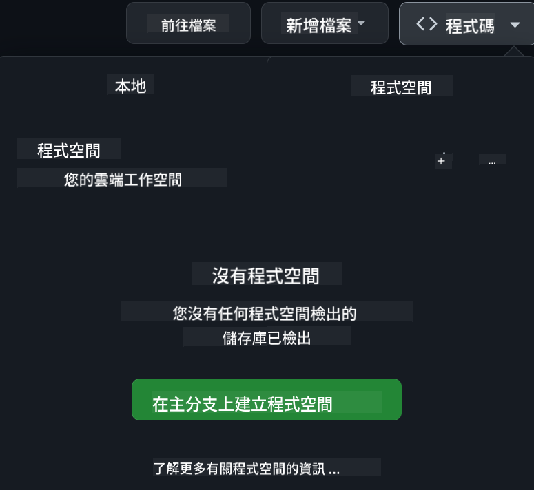

<!--
CO_OP_TRANSLATOR_METADATA:
{
  "original_hash": "63e29f5a308b533df9d70336bbb2e2b8",
  "translation_date": "2025-11-25T17:32:39+00:00",
  "source_file": "README.md",
  "language_code": "mo"
}
-->
[](https://github.com/microsoft/Web-Dev-For-Beginners/blob/master/LICENSE)  
[](https://GitHub.com/microsoft/Web-Dev-For-Beginners/graphs/contributors/)  
[](https://GitHub.com/microsoft/Web-Dev-For-Beginners/issues/)  
[](https://GitHub.com/microsoft/Web-Dev-For-Beginners/pulls/)  
[](http://makeapullrequest.com)  

[](https://GitHub.com/microsoft/Web-Dev-For-Beginners/watchers/)  
[](https://GitHub.com/microsoft/Web-Dev-For-Beginners/network/)  
[](https://GitHub.com/microsoft/Web-Dev-For-Beginners/stargazers/)  

[](https://discord.gg/nTYy5BXMWG)  

# 初學者網頁開發課程 - 一個完整的課程  

透過 Microsoft Cloud Advocates 提供的 12 週完整課程，學習網頁開發的基礎知識。24 節課程涵蓋 JavaScript、CSS 和 HTML，並透過實作專案如玻璃花園、瀏覽器擴展和太空遊戲來學習。參與測驗、討論和實際作業，提升技能並加強知識記憶。立即開始你的程式設計旅程吧！  

加入 Azure AI Foundry Discord 社群  

[](https://discord.gg/nTYy5BXMWG)  

按照以下步驟開始使用這些資源：  
1. **Fork 此儲存庫**：點擊 [](https://GitHub.com/microsoft/Web-Dev-For-Beginners/fork)  
2. **Clone 此儲存庫**：`git clone https://github.com/microsoft/Web-Dev-For-Beginners.git`  
3. [**加入 Azure AI Foundry Discord，與專家和其他開發者交流**](https://discord.com/invite/ByRwuEEgH4)  

### 🌐 多語言支援  

#### 透過 GitHub Action 支援（自動化且隨時更新）  

[Arabic](../ar/README.md) | [Bengali](../bn/README.md) | [Bulgarian](../bg/README.md) | [Burmese (Myanmar)](../my/README.md) | [Chinese (Simplified)](../zh/README.md) | [Chinese (Traditional, Hong Kong)](../hk/README.md) | [Chinese (Traditional, Macau)](./README.md) | [Chinese (Traditional, Taiwan)](../tw/README.md) | [Croatian](../hr/README.md) | [Czech](../cs/README.md) | [Danish](../da/README.md) | [Dutch](../nl/README.md) | [Estonian](../et/README.md) | [Finnish](../fi/README.md) | [French](../fr/README.md) | [German](../de/README.md) | [Greek](../el/README.md) | [Hebrew](../he/README.md) | [Hindi](../hi/README.md) | [Hungarian](../hu/README.md) | [Indonesian](../id/README.md) | [Italian](../it/README.md) | [Japanese](../ja/README.md) | [Korean](../ko/README.md) | [Lithuanian](../lt/README.md) | [Malay](../ms/README.md) | [Marathi](../mr/README.md) | [Nepali](../ne/README.md) | [Norwegian](../no/README.md) | [Persian (Farsi)](../fa/README.md) | [Polish](../pl/README.md) | [Portuguese (Brazil)](../br/README.md) | [Portuguese (Portugal)](../pt/README.md) | [Punjabi (Gurmukhi)](../pa/README.md) | [Romanian](../ro/README.md) | [Russian](../ru/README.md) | [Serbian (Cyrillic)](../sr/README.md) | [Slovak](../sk/README.md) | [Slovenian](../sl/README.md) | [Spanish](../es/README.md) | [Swahili](../sw/README.md) | [Swedish](../sv/README.md) | [Tagalog (Filipino)](../tl/README.md) | [Tamil](../ta/README.md) | [Thai](../th/README.md) | [Turkish](../tr/README.md) | [Ukrainian](../uk/README.md) | [Urdu](../ur/README.md) | [Vietnamese](../vi/README.md)  

**如果你希望支援更多語言，請參考 [這裡](https://github.com/Azure/co-op-translator/blob/main/getting_started/supported-languages.md)**  

[](https://open.vscode.dev/microsoft/Web-Dev-For-Beginners)  

#### 🧑‍🎓 _你是學生嗎？_  

造訪 [**學生中心頁面**](https://docs.microsoft.com/learn/student-hub/?WT.mc_id=academic-77807-sagibbon)，你可以找到初學者資源、學生套件，甚至有機會獲得免費證書兌換券。這是你應該收藏並定期查看的頁面，因為我們每月都會更新內容。  

### 📣 公告 - 新的 GitHub Copilot Agent 模式挑戰等你完成！  

新增挑戰，請在大多數章節中尋找 "GitHub Copilot Agent Challenge 🚀"。這是一個使用 GitHub Copilot 和 Agent 模式完成的新挑戰。如果你還沒使用過 Agent 模式，它不僅能生成文字，還能創建和編輯檔案、執行指令等。  

### 📣 公告 - _使用生成式 AI 建立新專案_  

新增 AI 助理專案，查看 [專案](./09-chat-project/README.md)  

### 📣 公告 - _新的生成式 AI 課程_  

我們剛剛發布了新的 JavaScript 生成式 AI 課程！  

造訪 [https://aka.ms/genai-js-course](https://aka.ms/genai-js-course) 開始學習！  

  

- 課程涵蓋從基礎到 RAG 的所有內容。  
- 使用 GenAI 和我們的伴侶應用程式與歷史人物互動。  
- 有趣且引人入勝的敘事，你將進行時光旅行！  

  

每節課都包含一個作業、一個知識檢查和一個挑戰，幫助你學習以下主題：  
- 提示和提示工程  
- 文字和圖片應用程式生成  
- 搜索應用程式  

造訪 [https://aka.ms/genai-js-course](https://aka.ms/genai-js-course) 開始學習！  

## 🌱 開始學習  

> **教師們**，我們已經 [提供了一些建議](for-teachers.md) 關於如何使用這份課程。我們非常期待你在 [討論論壇](https://github.com/microsoft/Web-Dev-For-Beginners/discussions/categories/teacher-corner) 中的反饋！  

**[學習者](https://aka.ms/student-page/?WT.mc_id=academic-77807-sagibbon)**，每節課從課前測驗開始，接著閱讀課程內容，完成各種活動，並透過課後測驗檢查你的理解。  

為了提升學習體驗，與同儕一起合作完成專案吧！我們鼓勵在 [討論論壇](https://github.com/microsoft/Web-Dev-For-Beginners/discussions) 中進行討論，我們的版主團隊將隨時回答你的問題。  

為了進一步學習，我們強烈建議探索 [Microsoft Learn](https://learn.microsoft.com/users/wirelesslife/collections/p1ddcy5jwy0jkm?WT.mc_id=academic-77807-sagibbon) 以獲取更多學習資源。  

### 📋 設置你的環境  

這份課程已經準備好開發環境！開始時，你可以選擇在 [Codespace](https://github.com/features/codespaces/)（_基於瀏覽器，無需安裝的環境_）中運行課程，或者在你的電腦上使用如 [Visual Studio Code](https://code.visualstudio.com/?WT.mc_id=academic-77807-sagibbon) 的文字編輯器。  

#### 建立你的儲存庫  
為了方便保存你的學習進度，建議你建立這份儲存庫的副本。你可以點擊頁面頂部的 **Use this template** 按鈕，這將在你的 GitHub 帳戶中建立一個包含課程副本的新儲存庫。  

按照以下步驟：  
1. **Fork 此儲存庫**：點擊頁面右上角的 "Fork" 按鈕。  
2. **Clone 此儲存庫**：`git clone https://github.com/microsoft/Web-Dev-For-Beginners.git`  

#### 在 Codespace 中運行課程  

在你建立的儲存庫副本中，點擊 **Code** 按鈕並選擇 **Open with Codespaces**。這將為你創建一個新的 Codespace 以供學習使用。  

  

#### 在本地電腦上運行課程  

要在本地電腦上運行課程，你需要一個文字編輯器、一個瀏覽器和一個命令行工具。我們的第一節課 [程式語言與工具介紹](../../1-getting-started-lessons/1-intro-to-programming-languages) 將引導你了解各種工具選項，幫助你選擇最適合你的工具。  

我們推薦使用 [Visual Studio Code](https://code.visualstudio.com/?WT.mc_id=academic-77807-sagibbon) 作為編輯器，它還內建 [終端機](https://code.visualstudio.com/docs/terminal/basics/?WT.mc_id=academic-77807-sagibbon)。你可以在 [這裡](https://code.visualstudio.com/?WT.mc_id=academic-77807-sagibbon) 下載 Visual Studio Code。  

1. 將你的儲存庫克隆到電腦上。你可以點擊 **Code** 按鈕並複製 URL：  

    [CodeSpace](./images/createcodespace.png)  

    然後，在 [Visual Studio Code](https://code.visualstudio.com/?WT.mc_id=academic-77807-sagibbon) 的 [終端機](https://code.visualstudio.com/docs/terminal/basics/?WT.mc_id=academic-77807-sagibbon) 中運行以下指令，將 `<your-repository-url>` 替換為你剛剛複製的 URL：  

    ```bash 
    git clone <your-repository-url>
    ```
  
2. 在 Visual Studio Code 中打開資料夾。你可以點擊 **File** > **Open Folder**，然後選擇你剛剛克隆的資料夾。  

> 推薦的 Visual Studio Code 擴展：  
>  
> * [Live Server](https://marketplace.visualstudio.com/items?itemName=ritwickdey.LiveServer&WT.mc_id=academic-77807-sagibbon) - 在 Visual Studio Code 中預覽 HTML 頁面  
> * [Copilot](https://marketplace.visualstudio.com/items?itemName=GitHub.copilot&WT.mc_id=academic-77807-sagibbon) - 幫助你更快撰寫程式碼

## 📂 每堂課包括：

- 可選的手繪筆記
- 可選的補充影片
- 課前熱身測驗
- 書面課程
- 對於專案型課程，提供逐步指導如何完成專案
- 知識檢查
- 挑戰
- 補充閱讀
- 作業
- [課後測驗](https://ff-quizzes.netlify.app/web/)

> **關於測驗的說明**：所有測驗都包含在 Quiz-app 資料夾中，共有 48 個測驗，每個測驗包含三個問題。你可以在 [這裡](https://ff-quizzes.netlify.app/web/) 找到測驗應用程式，該應用程式可以在本地運行或部署到 Azure；請按照 `quiz-app` 資料夾中的指示操作。

## 🗃️ 課程

|     |                       專案名稱                       |                            教授概念                             | 學習目標                                                                                                                 |                                                         相關課程連結                                                          |         作者          |
| :-: | :--------------------------------------------------: | :------------------------------------------------------------: | ----------------------------------------------------------------------------------------------------------------------- | :--------------------------------------------------------------------------------------------------------------------------: | :-------------------: |
| 01  |                     入門篇                      |           程式設計簡介及工具介紹           | 學習大多數程式語言的基本原理，以及幫助專業開發者完成工作的軟件工具 | [程式語言與工具介紹](./1-getting-started-lessons/1-intro-to-programming-languages/README.md) |         Jasmine         |
| 02  |                     入門篇                      |             GitHub 基礎，包含團隊合作             | 學習如何在專案中使用 GitHub，如何與他人協作管理程式碼                                                    |                            [GitHub 基礎介紹](./1-getting-started-lessons/2-github-basics/README.md)                             |          Floor          |
| 03  |                     入門篇                      |                             無障礙設計                              | 學習網頁無障礙設計的基本知識                                                                                               |                       [無障礙設計基礎](./1-getting-started-lessons/3-accessibility/README.md)                       |       Christopher       |
| 04  |                        JS 基礎                         |                         JavaScript 資料類型                          | JavaScript 資料類型的基礎知識                                                                                                 |                                       [資料類型](./2-js-basics/1-data-types/README.md)                                        |         Jasmine         |
| 05  |                        JS 基礎                         |                         函數與方法                          | 學習函數與方法，管理應用程式的邏輯流程                                                             |                              [函數與方法](./2-js-basics/2-functions-methods/README.md)                               | Jasmine 和 Christopher |
| 06  |                        JS 基礎                         |                        使用 JS 做決策                        | 學習如何使用決策方法在程式碼中創建條件                                                           |                                 [做決策](./2-js-basics/3-making-decisions/README.md)                                  |         Jasmine         |
| 07  |                        JS 基礎                         |                            陣列與迴圈                            | 使用 JavaScript 中的陣列與迴圈處理資料                                                                                 |                                   [陣列與迴圈](./2-js-basics/4-arrays-loops/README.md)                                    |         Jasmine         |
| 08  |       [生態瓶](./3-terrarium/solution/README.md)       |                            HTML 實踐                            | 建立 HTML 來創建一個線上生態瓶，專注於佈局設計                                                         |                                 [HTML 簡介](./3-terrarium/1-intro-to-html/README.md)                                 |           Jen           |
| 09  |       [生態瓶](./3-terrarium/solution/README.md)       |                            CSS 實踐                             | 建立 CSS 來設計線上生態瓶，專注於 CSS 基礎，包括讓頁面響應式                     |                                  [CSS 簡介](./3-terrarium/2-intro-to-css/README.md)                                  |           Jen           |
| 10  |            [生態瓶](./3-terrarium/solution/README.md)            |                 JavaScript 閉包與 DOM 操作                  | 建立 JavaScript 讓生態瓶具備拖放功能，專注於閉包與 DOM 操作             |                  [JavaScript 閉包與 DOM 操作](./3-terrarium/3-intro-to-DOM-and-closures/README.md)                   |           Jen           |
| 11  |          [打字遊戲](./4-typing-game/solution/README.md)          |                          建立一個打字遊戲                           | 學習如何使用鍵盤事件來驅動 JavaScript 應用程式的邏輯                                                          |                                [事件驅動程式設計](./4-typing-game/typing-game/README.md)                                |       Christopher       |
| 12  | [綠色瀏覽器擴展](./5-browser-extension/solution/README.md) |                         瀏覽器操作                          | 學習瀏覽器的運作方式、歷史，以及如何搭建瀏覽器擴展的基本架構                               |                               [關於瀏覽器](./5-browser-extension/1-about-browsers/README.md)                                |           Jen           |
| 13  | [綠色瀏覽器擴展](./5-browser-extension/solution/README.md) | 建立表單、調用 API 並將變數存儲於本地存儲 | 建立瀏覽器擴展的 JavaScript 元素，使用本地存儲的變數調用 API                      |                [API、表單與本地存儲](./5-browser-extension/2-forms-browsers-local-storage/README.md)                 |           Jen           |
| 14  | [綠色瀏覽器擴展](./5-browser-extension/solution/README.md) |          瀏覽器背景進程與網頁效能          | 使用瀏覽器的背景進程管理擴展的圖標；學習網頁效能及一些優化方法   |             [背景任務與效能](./5-browser-extension/3-background-tasks-and-performance/README.md)              |           Jen           |
| 15  |           [太空遊戲](./6-space-game/solution/README.md)           |             更進階的 JavaScript 遊戲開發             | 學習使用類別與組合的繼承，以及 Pub/Sub 模式，為開發遊戲做準備              |                      [進階遊戲開發簡介](./6-space-game/1-introduction/README.md)                       |          Chris          |
| 16  |           [太空遊戲](./6-space-game/solution/README.md)           |                           繪製到畫布                            | 學習使用 Canvas API，將元素繪製到螢幕上                                                                       |                                [繪製到畫布](./6-space-game/2-drawing-to-canvas/README.md)                                |          Chris          |
| 17  |           [太空遊戲](./6-space-game/solution/README.md)           |                   在螢幕上移動元素                    | 探索如何使用笛卡爾座標與 Canvas API 讓元素移動                                            |                           [移動元素](./6-space-game/3-moving-elements-around/README.md)                           |          Chris          |
| 18  |           [太空遊戲](./6-space-game/solution/README.md)           |                          碰撞檢測                           | 使用按鍵讓元素碰撞並相互反應，並提供冷卻功能以確保遊戲效能    |                              [碰撞檢測](./6-space-game/4-collision-detection/README.md)                              |          Chris          |
| 19  |           [太空遊戲](./6-space-game/solution/README.md)           |                             計分                              | 根據遊戲的狀態與效能進行數學計算                                                                |                                    [計分](./6-space-game/5-keeping-score/README.md)                                    |          Chris          |
| 20  |           [太空遊戲](./6-space-game/solution/README.md)           |                     結束與重啟遊戲                     | 學習如何結束與重啟遊戲，包括清理資產與重置變數值                              |                                [結束條件](./6-space-game/6-end-condition/README.md)                                 |          Chris          |
| 21  |         [銀行應用程式](./7-bank-project/solution/README.md)          |                 網頁應用程式中的 HTML 模板與路由                 | 學習如何使用路由與 HTML 模板搭建多頁網站的架構                             |                            [HTML 模板與路由](./7-bank-project/1-template-route/README.md)                             |          Yohan          |
| 22  |         [銀行應用程式](./7-bank-project/solution/README.md)          |                  建立登入與註冊表單                   | 學習如何建立表單與處理驗證流程                                                                          |                                           [表單](./7-bank-project/2-forms/README.md)                                           |          Yohan          |
| 23  |         [銀行應用程式](./7-bank-project/solution/README.md)          |                   獲取與使用資料的方法                   | 學習資料如何在應用程式中流動、獲取、存儲與處理                                                 |                                            [資料](./7-bank-project/3-data/README.md)                                            |          Yohan          |
| 24  |         [銀行應用程式](./7-bank-project/solution/README.md)          |                      狀態管理概念                      | 學習應用程式如何保留狀態以及如何以程式方式管理它                                                              |                                [狀態管理](./7-bank-project/4-state-management/README.md)                                |          Yohan          |
| 25 | [瀏覽器/VScode 編輯器](../../8-code-editor) | 使用 VScode | 學習如何使用程式碼編輯器| [使用 VScode 編輯器](./8-code-editor/1-using-a-code-editor/README.md) | Chris |
| 26 | [AI 助手](./9-chat-project/README.md) | 使用 AI | 學習如何建立自己的 AI 助手 | [AI 助手專案](./9-chat-project/README.md) | Chris |

## 🏫 教學法

我們的課程設計基於兩個關鍵教學原則：
* 專案導向學習
* 頻繁測驗

本課程教授 JavaScript、HTML 和 CSS 的基礎知識，以及當今網頁開發者使用的最新工具與技術。學生將有機會透過建立打字遊戲、虛擬生態瓶、環保瀏覽器擴展、太空侵略者風格遊戲以及商業銀行應用程式來獲得實作經驗。完成課程後，學生將對網頁開發有扎實的理解。

> 🎓 你可以在 Microsoft Learn 上以 [學習路徑](https://docs.microsoft.com/learn/paths/web-development-101/?WT.mc_id=academic-77807-sagibbon) 的形式學習本課程的前幾堂課！

透過確保內容與專案相符，學習過程對學生來說更具吸引力，並能增強概念的記憶。我們還撰寫了幾個 JavaScript 基礎的入門課程來介紹概念，並搭配 "[JavaScript 初學者系列](https://channel9.msdn.com/Series/Beginners-Series-to-JavaScript/?WT.mc_id=academic-77807-sagibbon)" 的影片教學，其中一些作者也參與了本課程的編寫。

此外，課前的低壓力測驗能讓學生專注於學習主題，而課後的第二次測驗則能進一步鞏固記憶。本課程設計靈活有趣，可以整體學習或部分學習。專案從簡單開始，並在 12 週的課程結束時逐漸變得複雜。

我們有意避免介紹 JavaScript 框架，以專注於成為網頁開發者所需的基本技能，完成本課程後，下一步可以透過另一系列影片學習 Node.js："[Node.js 初學者系列](https://channel9.msdn.com/Series/Beginners-Series-to-Nodejs/?WT.mc_id=academic-77807-sagibbon)"。

> 請參閱我們的 [行為準則](CODE_OF_CONDUCT.md) 和 [貢獻指南](CONTRIBUTING.md)。我們歡迎你的建設性反饋！

## 🧭 離線存取

你可以使用 [Docsify](https://docsify.js.org/#/) 離線運行此文件。Fork 此 repo，並在本地機器上 [安裝 Docsify](https://docsify.js.org/#/quickstart)，然後在此 repo 的根目錄中輸入 `docsify serve`。網站將在本地端的 3000 埠上運行：`localhost:3000`。

## 📘 PDF

所有課程的 PDF 可在 [這裡](https://microsoft.github.io/Web-Dev-For-Beginners/pdf/readme.pdf) 找到。

## 🎒 其他課程

我們的團隊還製作了其他課程！請查看：

### Azure / Edge / MCP / Agents
[](https://github.com/microsoft/AZD-for-beginners?WT.mc_id=academic-105485-koreyst)
[](https://github.com/microsoft/edgeai-for-beginners?WT.mc_id=academic-105485-koreyst)  
[](https://github.com/microsoft/mcp-for-beginners?WT.mc_id=academic-105485-koreyst)  
[](https://github.com/microsoft/ai-agents-for-beginners?WT.mc_id=academic-105485-koreyst)  

---

### 生成式 AI 系列  
[](https://github.com/microsoft/generative-ai-for-beginners?WT.mc_id=academic-105485-koreyst)  
[-9333EA?style=for-the-badge&labelColor=E5E7EB&color=9333EA)](https://github.com/microsoft/Generative-AI-for-beginners-dotnet?WT.mc_id=academic-105485-koreyst)  
[-C084FC?style=for-the-badge&labelColor=E5E7EB&color=C084FC)](https://github.com/microsoft/generative-ai-for-beginners-java?WT.mc_id=academic-105485-koreyst)  
[-E879F9?style=for-the-badge&labelColor=E5E7EB&color=E879F9)](https://github.com/microsoft/generative-ai-with-javascript?WT.mc_id=academic-105485-koreyst)  

---

### 核心學習  
[](https://aka.ms/ml-beginners?WT.mc_id=academic-105485-koreyst)  
[](https://aka.ms/datascience-beginners?WT.mc_id=academic-105485-koreyst)  
[](https://aka.ms/ai-beginners?WT.mc_id=academic-105485-koreyst)  
[](https://github.com/microsoft/Security-101?WT.mc_id=academic-96948-sayoung)  
[](https://aka.ms/webdev-beginners?WT.mc_id=academic-105485-koreyst)  
[](https://aka.ms/iot-beginners?WT.mc_id=academic-105485-koreyst)  
[](https://github.com/microsoft/xr-development-for-beginners?WT.mc_id=academic-105485-koreyst)  

---

### Copilot 系列  
[](https://aka.ms/GitHubCopilotAI?WT.mc_id=academic-105485-koreyst)  
[](https://github.com/microsoft/mastering-github-copilot-for-dotnet-csharp-developers?WT.mc_id=academic-105485-koreyst)  
[](https://github.com/microsoft/CopilotAdventures?WT.mc_id=academic-105485-koreyst)  

## 尋求幫助  

如果您在建立 AI 應用程式時遇到困難或有任何疑問，歡迎加入學習者和有經驗的開發者的討論。這是一個支持性的社群，問題受到歡迎，知識自由分享。  

[](https://discord.gg/nTYy5BXMWG)  

如果您有產品反饋或在建構過程中遇到錯誤，請訪問：  

[](https://aka.ms/foundry/forum)  

## 授權  

此存儲庫採用 MIT 授權。請參閱 [LICENSE](../../LICENSE) 文件以獲取更多資訊。  

---

<!-- CO-OP TRANSLATOR DISCLAIMER START -->
**免責聲明**：  
此文件已使用 AI 翻譯服務 [Co-op Translator](https://github.com/Azure/co-op-translator) 翻譯。我們致力於提供準確的翻譯，但請注意，自動翻譯可能包含錯誤或不準確之處。應以原文文件作為權威來源。對於關鍵資訊，建議尋求專業人工翻譯。我們對因使用此翻譯而引起的任何誤解或誤釋不承擔責任。
<!-- CO-OP TRANSLATOR DISCLAIMER END -->