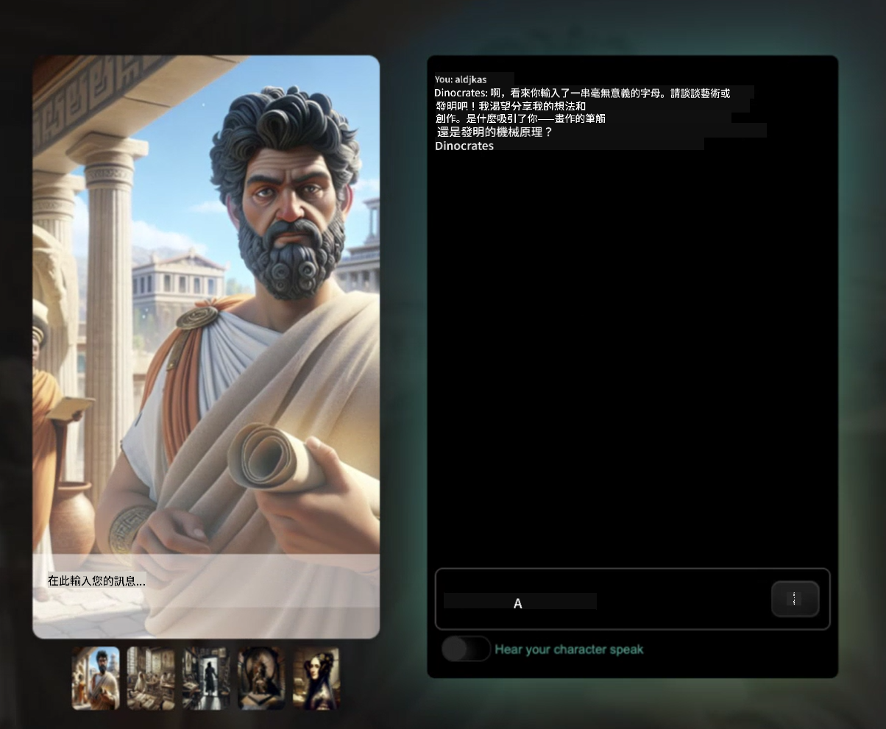

<!--
CO_OP_TRANSLATOR_METADATA:
{
  "original_hash": "efa251c5fc089367f0a81c572874afca",
  "translation_date": "2025-08-28T02:45:13+00:00",
  "source_file": "README.md",
  "language_code": "mo"
}
-->
[](https://github.com/microsoft/Web-Dev-For-Beginners/blob/master/LICENSE)  
[](https://GitHub.com/microsoft/Web-Dev-For-Beginners/graphs/contributors/)  
[](https://GitHub.com/microsoft/Web-Dev-For-Beginners/issues/)  
[](https://GitHub.com/microsoft/Web-Dev-For-Beginners/pulls/)  
[](http://makeapullrequest.com)  

[](https://GitHub.com/microsoft/Web-Dev-For-Beginners/watchers/)  
[](https://GitHub.com/microsoft/Web-Dev-For-Beginners/network/)  
[](https://GitHub.com/microsoft/Web-Dev-For-Beginners/stargazers/)  

[](https://discord.gg/zxKYvhSnVp?WT.mc_id=academic-000002-leestott)  

[](https://open.vscode.dev/microsoft/Web-Dev-For-Beginners)  

[](https://discord.com/invite/ByRwuEEgH4)  

按照以下步驟開始使用這些資源：  
1. **分叉此倉庫**：點擊 [](https://GitHub.com/microsoft/Web-Dev-For-Beginners/fork)  
2. **克隆此倉庫**：`git clone https://github.com/microsoft/Web-Dev-For-Beginners.git`  
3. [**加入 Azure AI Foundry Discord，與專家和其他開發者交流**](https://discord.com/invite/ByRwuEEgH4)  

# 初學者的網頁開發課程 - 一套完整的課程  

透過 Microsoft Cloud Advocates 提供的 12 週完整課程，學習網頁開發的基礎知識。24 節課程涵蓋 JavaScript、CSS 和 HTML，並通過實作專案如生態瓶、瀏覽器擴展和太空遊戲來學習。參與測驗、討論和實際作業，提升技能並加深知識記憶。立即開始你的程式設計旅程吧！  

#### 🧑‍🎓 _你是學生嗎？_  

造訪 [**學生中心頁面**](https://docs.microsoft.com/learn/student-hub/?WT.mc_id=academic-77807-sagibbon)，你可以找到初學者資源、學生套件，甚至有機會獲得免費證書兌換券。這是你想要收藏並定期查看的頁面，因為我們每月都會更新內容。  

### 📣 公告 - _全新課程_ 關於 JavaScript 的生成式 AI 已經發布  

不要錯過我們的全新生成式 AI 課程！  

造訪 [https://aka.ms/genai-js-course](https://aka.ms/genai-js-course) 開始學習！  

  

- 課程涵蓋從基礎到 RAG 的所有內容。  
- 使用 GenAI 和我們的配套應用程式與歷史人物互動。  
- 有趣且引人入勝的敘事，你將進行時光旅行！  

  

每節課包含一個作業、一個知識檢查和一個挑戰，幫助你學習以下主題：  
- 提示設計與提示工程  
- 文本與圖像應用程式生成  
- 搜索應用程式  

造訪 [https://aka.ms/genai-js-course](https://aka.ms/genai-js-course) 開始學習！  

## 🌱 開始使用  

> **教師們**，我們已[提供一些建議](for-teachers.md)關於如何使用這套課程。我們期待你在[討論區](https://github.com/microsoft/Web-Dev-For-Beginners/discussions/categories/teacher-corner)中的反饋！  

**[學習者](https://aka.ms/student-page/?WT.mc_id=academic-77807-sagibbon)**，每節課從課前測驗開始，接著閱讀課程材料，完成各種活動，並通過課後測驗檢查你的理解。  

為了提升學習體驗，與同儕一起合作完成專案吧！我們鼓勵在[討論區](https://github.com/microsoft/Web-Dev-For-Beginners/discussions)中進行討論，我們的版主團隊將隨時回答你的問題。  

為了進一步學習，我們強烈建議探索 [Microsoft Learn](https://learn.microsoft.com/users/wirelesslife/collections/p1ddcy5jwy0jkm?WT.mc_id=academic-77807-sagibbon) 以獲取更多學習資源。  

### 📋 設置你的環境  

這套課程已準備好開發環境！開始時，你可以選擇在 [Codespace](https://github.com/features/codespaces/)（_基於瀏覽器，無需安裝的環境_）中運行課程，或者在本地電腦上使用如 [Visual Studio Code](https://code.visualstudio.com/?WT.mc_id=academic-77807-sagibbon) 的文本編輯器。  

#### 建立你的倉庫  
為了方便保存你的工作，建議你建立這個倉庫的副本。你可以點擊頁面頂部的 **Use this template** 按鈕，這將在你的 GitHub 帳戶中創建一個包含課程副本的新倉庫。  

按照以下步驟：  
1. **分叉此倉庫**：點擊頁面右上角的 "Fork" 按鈕。  
2. **克隆此倉庫**：`git clone https://github.com/microsoft/Web-Dev-For-Beginners.git`  

#### 在 Codespace 中運行課程  

在你創建的倉庫副本中，點擊 **Code** 按鈕並選擇 **Open with Codespaces**。這將為你創建一個新的 Codespace 以便進行工作。  

[!Codespace](../..)./images/createcodespace.png)  

#### 在本地電腦上運行課程  

若要在本地電腦上運行此課程，你需要一個文本編輯器、一個瀏覽器和一個命令行工具。我們的第一節課 [程式語言與工具介紹](../../1-getting-started-lessons/1-intro-to-programming-languages) 將引導你了解這些工具的各種選項，幫助你選擇最適合自己的工具。  

我們推薦使用 [Visual Studio Code](https://code.visualstudio.com/?WT.mc_id=academic-77807-sagibbon) 作為編輯器，它還內建了 [終端](https://code.visualstudio.com/docs/terminal/basics/?WT.mc_id=academic-77807-sagibbon)。你可以在[這裡](https://code.visualstudio.com/?WT.mc_id=academic-77807-sagibbon)下載 Visual Studio Code。  

1. 將倉庫克隆到你的電腦。你可以點擊 **Code** 按鈕並複製 URL：  

    [!CodeSpace](./images/createcodespace.png)  

    然後，在 [Visual Studio Code](https://code.visualstudio.com/?WT.mc_id=academic-77807-sagibbon) 的 [終端](https://code.visualstudio.com/docs/terminal/basics/?WT.mc_id=academic-77807-sagibbon) 中運行以下命令，將 `<your-repository-url>` 替換為你剛剛複製的 URL：  

    ```bash 
    git clone <your-repository-url>
    ```  

2. 在 Visual Studio Code 中打開文件夾。你可以點擊 **File** > **Open Folder**，然後選擇你剛剛克隆的文件夾。  

> 推薦的 Visual Studio Code 擴展：  
>  
> * [Live Server](https://marketplace.visualstudio.com/items?itemName=ritwickdey.LiveServer&WT.mc_id=academic-77807-sagibbon) - 在 Visual Studio Code 中預覽 HTML 頁面  
> * [Copilot](https://marketplace.visualstudio.com/items?itemName=GitHub.copilot&WT.mc_id=academic-77807-sagibbon) - 幫助你更快地編寫程式碼  

## 📂 每節課包含：  

- 可選的手繪筆記  
- 可選的補充影片  
- 課前熱身測驗  
- 書面課程  
- 專案型課程的分步指南  
- 知識檢查  
- 挑戰  
- 補充閱讀  
- 作業  
- [課後測驗](https://ff-quizzes.netlify.app/)  

> **關於測驗的說明**：所有測驗都包含在 Quiz-app 文件夾中，共有 48 個測驗，每個測驗包含三個問題。測驗可在 [這裡](https://ff-quizzes.netlify.app/) 使用，測驗應用程式可以在本地運行或部署到 Azure；請參考 `quiz-app` 文件夾中的說明。  

## 🗃️ 課程  

|     |                       專案名稱                       |                            教學概念                             | 學習目標                                                                                                                 |                                                         連結課程                                                          |         作者          |  
| :-: | :--------------------------------------------------: | :------------------------------------------------------------: | ----------------------------------------------------------------------------------------------------------------------- | :----------------------------------------------------------------------------------------------------------------------: | :-------------------: |  
| 01  |                     入門篇                          |           程式語言與工具介紹                                   | 學習大多數程式語言的基本原理，以及幫助專業開發者完成工作的軟體工具                                                     | [程式語言與工具介紹](./1-getting-started-lessons/1-intro-to-programming-languages/README.md)                              |         Jasmine       |  
| 02  |                     入門篇                          |             GitHub 基礎與團隊合作                              | 學習如何在專案中使用 GitHub，以及如何與他人協作管理程式碼                                                              | [GitHub 基礎](./1-getting-started-lessons/2-github-basics/README.md)                                                      |          Floor        |  
| 03  |                     入門篇                          |                             無障礙設計                         | 學習網頁無障礙設計的基本知識                                                                                           | [無障礙設計基礎](./1-getting-started-lessons/3-accessibility/README.md)                                                  |       Christopher     |  
| 04  |                        JS 基礎                      |                         JavaScript 資料類型                   | 學習 JavaScript 資料類型的基礎知識                                                                                     | [資料類型](./2-js-basics/1-data-types/README.md)                                                                         |         Jasmine       |  
| 05  |                        JS 基礎                      |                         函數與方法                             | 學習如何使用函數與方法來管理應用程式的邏輯流程                                                                         | [函數與方法](./2-js-basics/2-functions-methods/README.md)                                                                | Jasmine 和 Christopher |  
| 06  |                        JS 基礎                      |                        使用 JS 做出決策                        | 學習如何在程式碼中使用條件語句進行決策                                                                                 | [做出決策](./2-js-basics/3-making-decisions/README.md)                                                                   |         Jasmine       |  
| 07  |                        JS 基礎                      |                            陣列與迴圈                          | 使用 JavaScript 的陣列與迴圈來處理資料                                                                                 | [陣列與迴圈](./2-js-basics/4-arrays-loops/README.md)                                                                     |         Jasmine       |  
| 08  |       [生態瓶](./3-terrarium/solution/README.md)     |                            HTML 實作                           | 建立 HTML 來創建線上生態瓶，專注於建立頁面佈局                                                                         | [HTML 入門](./3-terrarium/1-intro-to-html/README.md)                                                                      |           Jen         |  
| 09  |       [生態瓶](./3-terrarium/solution/README.md)     |                            CSS 實作                            | 建立 CSS 來設計線上生態瓶，專注於 CSS 的基礎知識，包括使頁面響應式                                                     | [CSS 入門](./3-terrarium/2-intro-to-css/README.md)                                                                       |           Jen         |  
| 10  |            [Terrarium](./3-terrarium/solution/README.md)            |                 JavaScript 閉包與 DOM 操作                  | 建立 JavaScript 使生態瓶具備拖放功能，重點在於閉包與 DOM 操作             |                  [JavaScript 閉包與 DOM 操作](./3-terrarium/3-intro-to-DOM-and-closures/README.md)                   |           Jen           |
| 11  |          [Typing Game](./4-typing-game/solution/README.md)          |                          建立打字遊戲                           | 學習如何使用鍵盤事件來驅動 JavaScript 應用程式的邏輯                                                          |                                [事件驅動程式設計](./4-typing-game/typing-game/README.md)                                |       Christopher       |
| 12  | [Green Browser Extension](./5-browser-extension/solution/README.md) |                         瀏覽器操作                          | 學習瀏覽器的運作方式、歷史，以及如何搭建瀏覽器擴展的基本元素                               |                               [關於瀏覽器](./5-browser-extension/1-about-browsers/README.md)                                |           Jen           |
| 13  | [Green Browser Extension](./5-browser-extension/solution/README.md) | 建立表單、調用 API 並將變數存儲於本地存儲 | 建立瀏覽器擴展的 JavaScript 元素，使用本地存儲中的變數來調用 API                      |                [API、表單與本地存儲](./5-browser-extension/2-forms-browsers-local-storage/README.md)                 |           Jen           |
| 14  | [Green Browser Extension](./5-browser-extension/solution/README.md) |          瀏覽器中的背景處理與網頁效能          | 使用瀏覽器的背景處理來管理擴展的圖標；學習網頁效能以及一些優化方法   |             [背景任務與效能](./5-browser-extension/3-background-tasks-and-performance/README.md)              |           Jen           |
| 15  |           [Space Game](./6-space-game/solution/README.md)           |             更進階的 JavaScript 遊戲開發             | 學習使用類別與組合的繼承，以及 Pub/Sub 模式，為建立遊戲做準備              |                      [進階遊戲開發介紹](./6-space-game/1-introduction/README.md)                       |          Chris          |
| 16  |           [Space Game](./6-space-game/solution/README.md)           |                           繪製到畫布                            | 學習如何使用 Canvas API 在螢幕上繪製元素                                                                       |                                [繪製到畫布](./6-space-game/2-drawing-to-canvas/README.md)                                |          Chris          |
| 17  |           [Space Game](./6-space-game/solution/README.md)           |                   在螢幕上移動元素                    | 探索如何使用笛卡爾座標與 Canvas API 讓元素產生移動                                            |                           [移動元素](./6-space-game/3-moving-elements-around/README.md)                           |          Chris          |
| 18  |           [Space Game](./6-space-game/solution/README.md)           |                          碰撞檢測                           | 使用按鍵讓元素碰撞並相互反應，並提供冷卻功能以確保遊戲效能    |                              [碰撞檢測](./6-space-game/4-collision-detection/README.md)                              |          Chris          |
| 19  |           [Space Game](./6-space-game/solution/README.md)           |                             計分                              | 根據遊戲的狀態與效能進行數學計算                                                                |                                    [計分](./6-space-game/5-keeping-score/README.md)                                    |          Chris          |
| 20  |           [Space Game](./6-space-game/solution/README.md)           |                     結束與重啟遊戲                     | 學習如何結束與重啟遊戲，包括清理資產與重置變數值                              |                                [結束條件](./6-space-game/6-end-condition/README.md)                                 |          Chris          |
| 21  |         [Banking App](./7-bank-project/solution/README.md)          |                 網頁應用中的 HTML 模板與路由                 | 學習如何使用路由與 HTML 模板來搭建多頁網站的架構                             |                            [HTML 模板與路由](./7-bank-project/1-template-route/README.md)                             |          Yohan          |
| 22  |         [Banking App](./7-bank-project/solution/README.md)          |                  建立登入與註冊表單                   | 學習如何建立表單並處理驗證邏輯                                                                          |                                           [表單](./7-bank-project/2-forms/README.md)                                           |          Yohan          |
| 23  |         [Banking App](./7-bank-project/solution/README.md)          |                   獲取與使用數據的方法                   | 學習數據如何在應用中流動，如何獲取、存儲與處理數據                                                 |                                            [數據](./7-bank-project/3-data/README.md)                                            |          Yohan          |
| 24  |         [Banking App](./7-bank-project/solution/README.md)          |                      狀態管理概念                      | 學習應用如何保留狀態以及如何以程式方式管理狀態                                                              |                                [狀態管理](./7-bank-project/4-state-management/README.md)                                |          Yohan          |


## 🏫 教學法

我們的課程設計基於兩個關鍵教學原則：
* 專案導向學習
* 頻繁的小測驗

本課程教授 JavaScript、HTML 和 CSS 的基礎知識，以及當今網頁開發者使用的最新工具與技術。學生將有機會透過建立打字遊戲、虛擬生態瓶、環保瀏覽器擴展、太空侵略者風格的遊戲，以及商業銀行應用程式來獲得實作經驗。到課程結束時，學生將對網頁開發有扎實的理解。

> 🎓 您可以在 Microsoft Learn 上以 [學習路徑](https://docs.microsoft.com/learn/paths/web-development-101/?WT.mc_id=academic-77807-sagibbon) 的形式學習本課程的前幾節課！

透過確保內容與專案相符，學習過程對學生來說更具吸引力，並能增強概念的記憶。我們還撰寫了幾個 JavaScript 基礎課程作為入門，並搭配 "[JavaScript 初學者系列](https://channel9.msdn.com/Series/Beginners-Series-to-JavaScript/?WT.mc_id=academic-77807-sagibbon)" 視頻教程中的影片，其中一些作者也參與了本課程的編寫。

此外，課前的小測驗能幫助學生專注於學習主題，而課後的第二次測驗則能進一步鞏固記憶。本課程設計靈活有趣，可以完整學習或選擇部分內容。專案從簡單開始，並在 12 週的課程週期內逐漸變得複雜。

我們有意避免引入 JavaScript 框架，以便專注於成為網頁開發者所需的基本技能，完成本課程後，下一步可以學習 Node.js，透過另一系列視頻 "[Node.js 初學者系列](https://channel9.msdn.com/Series/Beginners-Series-to-Nodejs/?WT.mc_id=academic-77807-sagibbon)" 進一步提升。

> 請參閱我們的 [行為準則](CODE_OF_CONDUCT.md) 和 [貢獻指南](CONTRIBUTING.md)。我們歡迎您的建設性反饋！


## 🧭 離線訪問

您可以使用 [Docsify](https://docsify.js.org/#/) 離線運行此文檔。Fork 此 repo，並在本地機器上 [安裝 Docsify](https://docsify.js.org/#/quickstart)，然後在此 repo 的根目錄中輸入 `docsify serve`。網站將在本地端的 3000 埠上提供服務：`localhost:3000`。

## 📘 PDF

所有課程的 PDF 可在 [此處](https://microsoft.github.io/Web-Dev-For-Beginners/pdf/readme.pdf) 找到。


## 🎒 其他課程

我們的團隊還製作了其他課程！查看以下內容：

- [生成式 AI 初學者課程](https://aka.ms/genai-beginners)
- [生成式 AI 初學者課程 .NET](https://github.com/microsoft/Generative-AI-for-beginners-dotnet)
- [使用 JavaScript 的生成式 AI](https://github.com/microsoft/generative-ai-with-javascript)
- [使用 Java 的生成式 AI](https://github.com/microsoft/Generative-AI-for-beginners-java)
- [AI 初學者課程](https://aka.ms/ai-beginners)
- [數據科學初學者課程](https://aka.ms/datascience-beginners)
- [機器學習初學者課程](https://aka.ms/ml-beginners)
- [網路安全初學者課程](https://github.com/microsoft/Security-101)
- [網頁開發初學者課程](https://aka.ms/webdev-beginners)
- [物聯網初學者課程](https://aka.ms/iot-beginners)
- [XR 開發初學者課程](https://github.com/microsoft/xr-development-for-beginners)
- [精通 GitHub Copilot 的智能應用](https://github.com/microsoft/Mastering-GitHub-Copilot-for-Paired-Programming)
- [精通 GitHub Copilot 的 C#/.NET 開發者課程](https://github.com/microsoft/mastering-github-copilot-for-dotnet-csharp-developers)
- [選擇您的 Copilot 冒險](https://github.com/microsoft/CopilotAdventures)

## 授權

此存儲庫採用 MIT 授權。更多資訊請參閱 [LICENSE](../../LICENSE) 文件。

---

**免責聲明**：  
本文件已使用 AI 翻譯服務 [Co-op Translator](https://github.com/Azure/co-op-translator) 進行翻譯。雖然我們致力於提供準確的翻譯，但請注意，自動翻譯可能包含錯誤或不準確之處。原始文件的母語版本應被視為權威來源。對於關鍵資訊，建議尋求專業人工翻譯。我們對因使用此翻譯而引起的任何誤解或錯誤解釋不承擔責任。