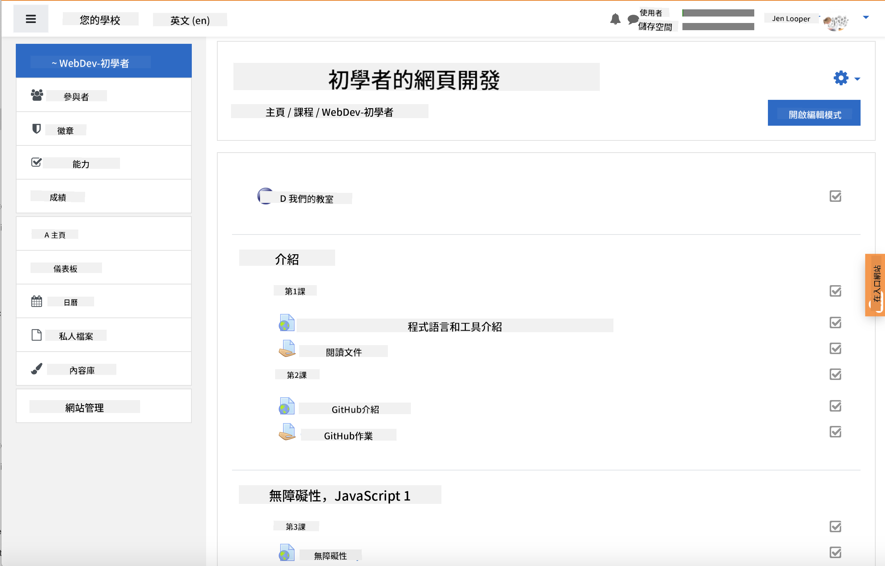
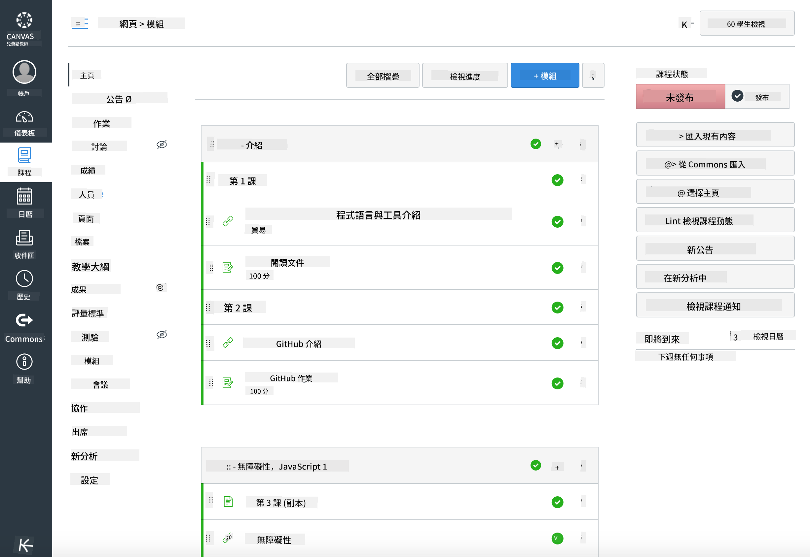

<!--
CO_OP_TRANSLATOR_METADATA:
{
  "original_hash": "75cb51f7ca9ea0b097ef4a1287e9290c",
  "translation_date": "2025-08-25T20:55:52+00:00",
  "source_file": "for-teachers.md",
  "language_code": "mo"
}
-->
## 給教育工作者

想在您的課堂上使用這份課程嗎？請隨意使用！

事實上，您可以直接在 GitHub 上使用它，透過 GitHub Classroom 來實現。

要做到這一點，請先 fork 這個倉庫。您需要為每一課創建一個倉庫，因此需要將每個文件夾提取到一個單獨的倉庫中。這樣，[GitHub Classroom](https://classroom.github.com/classrooms) 就可以分別處理每一課。

這些[完整的指導說明](https://github.blog/2020-03-18-set-up-your-digital-classroom-with-github-classroom/)將幫助您了解如何設置您的課堂。

## 在 Moodle、Canvas 或 Blackboard 中使用

這份課程在這些學習管理系統中運行良好！使用 [Moodle 上傳文件](../../../../../../../teaching-files/webdev-moodle.mbz) 來獲取完整內容，或者試試 [Common Cartridge 文件](../../../../../../../teaching-files/webdev-common-cartridge.imscc)，其中包含部分內容。Moodle Cloud 不支持完整的 Common Cartridge 匯出，因此建議使用 Moodle 下載文件，該文件可以上傳到 Canvas 中。請告訴我們如何改進這個體驗。

  
> Moodle 課堂中的課程內容

  
> Canvas 中的課程內容

## 直接使用這個倉庫

如果您希望直接使用目前的倉庫，而不使用 GitHub Classroom，也完全可以。您需要與學生溝通，告訴他們一起學習哪一課。

在線上課程（如 Zoom、Teams 或其他工具）中，您可以為測驗設置分組討論室，並指導學生為學習做好準備。然後邀請學生參加測驗，並在特定時間將答案作為 "issues" 提交。對於作業，您也可以採用相同的方式，讓學生在公開的環境中協作完成。

如果您更喜歡私密的方式，可以要求學生逐課 fork 這份課程到他們自己的 GitHub 私人倉庫，並授予您訪問權限。然後，他們可以私下完成測驗和作業，並通過 classroom repo 的 issues 提交給您。

在在線課堂中，有很多方法可以讓這份課程發揮作用。請告訴我們哪種方式最適合您！

## 請分享您的想法！

我們希望這份課程能夠滿足您和您學生的需求。請在 [Teacher corner](https://github.com/microsoft/Web-Dev-For-Beginners/discussions/categories/teacher-corner) 與我們聯繫，並開啟一個 [**新 issue**](https://github.com/microsoft/Web-Dev-For-Beginners/issues/new/choose) 來提交任何需求、問題或反饋。

**免責聲明**：  
本文件已使用 AI 翻譯服務 [Co-op Translator](https://github.com/Azure/co-op-translator) 進行翻譯。雖然我們致力於提供準確的翻譯，但請注意，自動翻譯可能包含錯誤或不準確之處。原始文件的母語版本應被視為權威來源。對於關鍵資訊，建議使用專業人工翻譯。我們對因使用此翻譯而引起的任何誤解或誤釋不承擔責任。