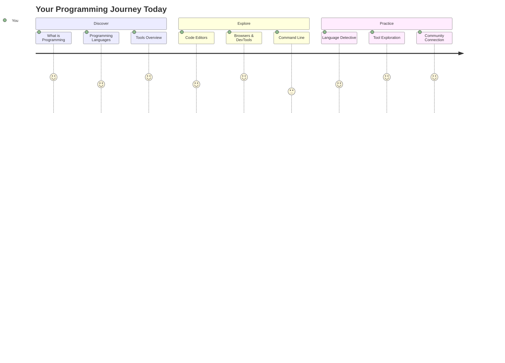
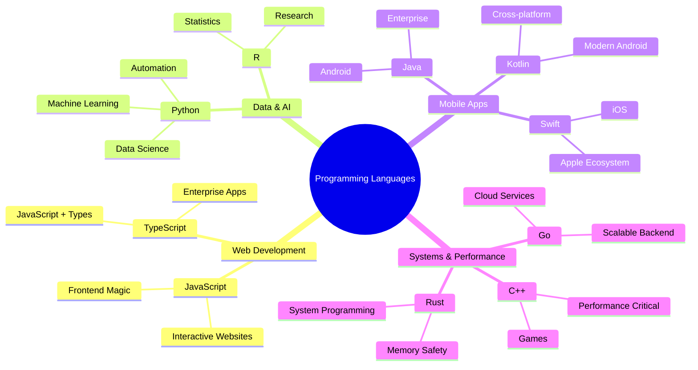
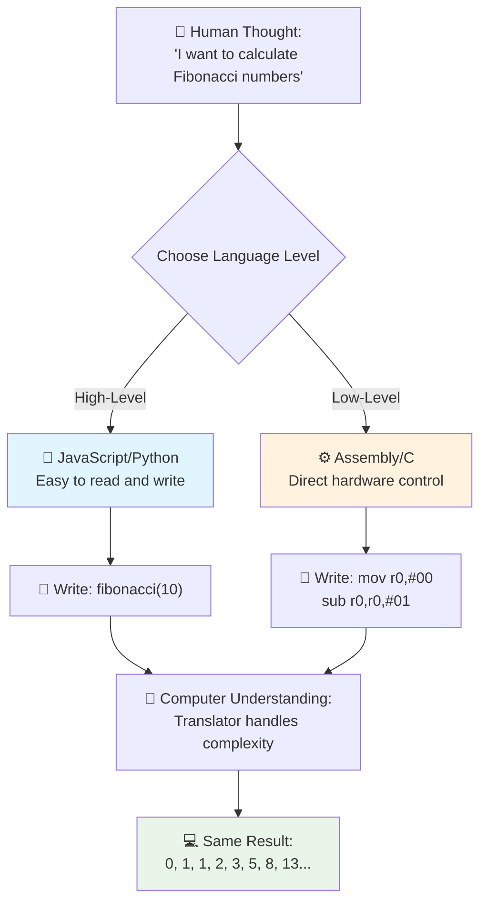
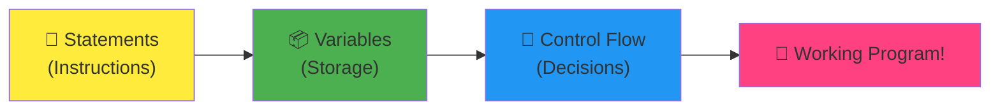
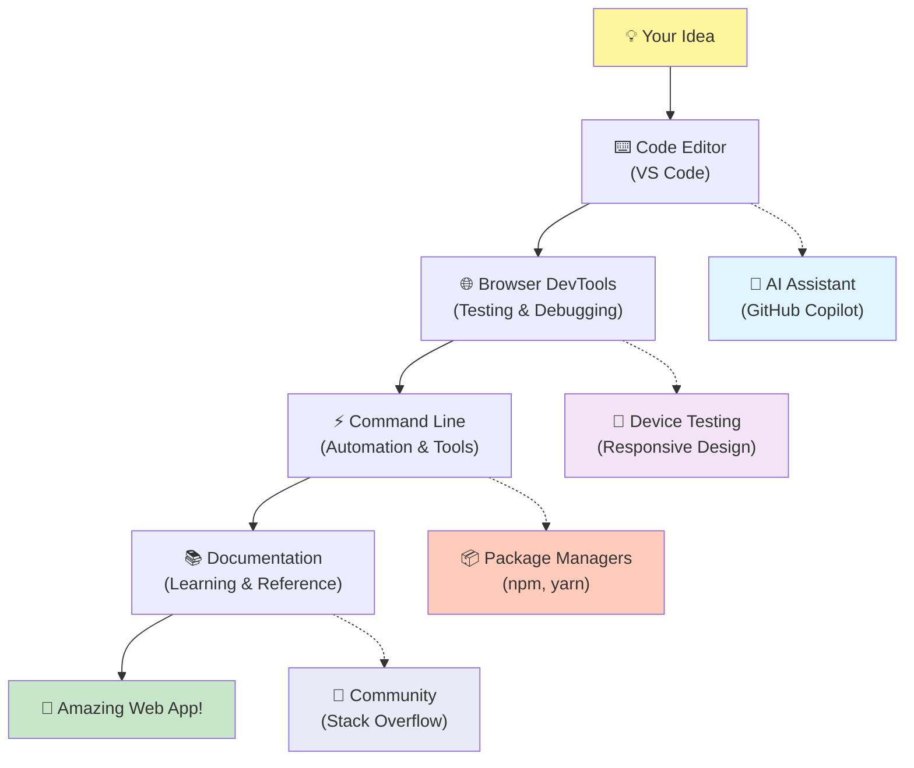
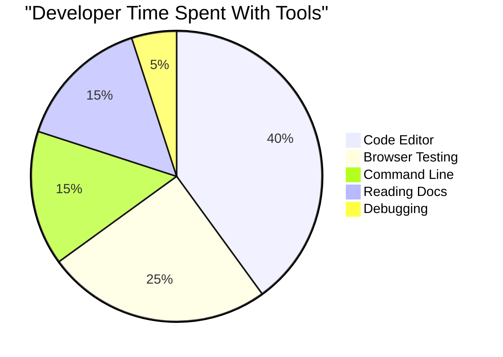
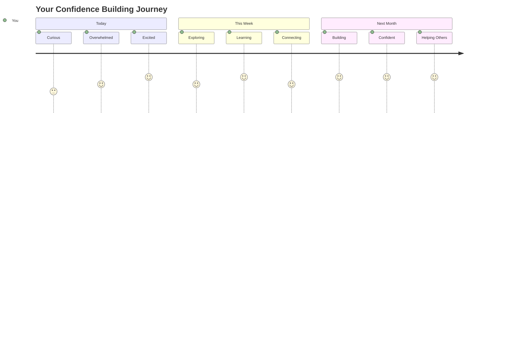

<!--
CO_OP_TRANSLATOR_METADATA:
{
  "original_hash": "d45ddcc54eb9232a76d08328b09d792e",
  "translation_date": "2025-11-03T14:20:19+00:00",
  "source_file": "1-getting-started-lessons/1-intro-to-programming-languages/README.md",
  "language_code": "mr"
}
-->
# प्रोग्रामिंग भाषा आणि आधुनिक डेव्हलपर टूल्सची ओळख

नमस्कार, भविष्यातील डेव्हलपर! 👋 तुम्हाला एक गोष्ट सांगू का जी मला रोज रोमांचित करते? तुम्ही आता शोध घेणार आहात की प्रोग्रामिंग ही फक्त संगणकांबद्दल नाही, तर तुमच्या सर्वात वेड्या कल्पना प्रत्यक्षात आणण्यासाठी सुपरपॉवर्स मिळवण्याबद्दल आहे!

तुम्हाला तो क्षण आठवतो का जेव्हा तुम्ही तुमचा आवडता अ‍ॅप वापरत असता आणि सगळं अगदी परफेक्ट वाटतं? जेव्हा तुम्ही एखाद्या बटणावर टॅप करता आणि काहीतरी जादूई घडतं ज्यामुळे तुम्हाला वाटतं "अरे वा, त्यांनी हे कसं केलं?" तर, तुमच्यासारखाच कोणी तरी – कदाचित रात्री २ वाजता त्यांच्या आवडत्या कॉफी शॉपमध्ये तिसऱ्या एस्प्रेसोसोबत बसून – त्या जादूची निर्मिती करणारा कोड लिहिला. आणि आता तुम्हाला आश्चर्य वाटेल: या धड्याच्या शेवटी, तुम्हाला केवळ त्यांनी हे कसे केले ते समजेलच नाही तर तुम्हाला स्वतःच ते करण्याची इच्छा होईल!

पहा, जर तुम्हाला प्रोग्रामिंग सध्या थोडं कठीण वाटत असेल तर ते मी पूर्णपणे समजू शकतो. जेव्हा मी सुरुवात केली, तेव्हा मला खरंच वाटलं की तुम्हाला काही प्रकारचा गणिताचा तज्ज्ञ असायला हवा किंवा तुम्ही पाच वर्षांचे असल्यापासून कोडिंग करत असायला हवे. पण माझं मत पूर्णपणे बदललं तेव्हा मला समजलं की प्रोग्रामिंग ही नवीन भाषा शिकण्यासारखीच आहे. तुम्ही "नमस्कार" आणि "धन्यवाद" पासून सुरुवात करता, मग कॉफी ऑर्डर करण्यापर्यंत पोहोचता, आणि नंतर तुम्ही गहन तत्त्वज्ञानात्मक चर्चा करू लागता! फक्त या बाबतीत, तुम्ही संगणकांशी संवाद साधत आहात, आणि प्रामाणिकपणे? ते सर्वात संयमी संवाद भागीदार आहेत – ते तुमच्या चुका कधीच न्याय करत नाहीत आणि ते नेहमी पुन्हा प्रयत्न करण्यास उत्सुक असतात!

आज, आपण आधुनिक वेब डेव्हलपमेंट शक्य होण्यासाठी आणि गंभीरपणे व्यसनाधीन होण्यासाठी अविश्वसनीय टूल्स एक्सप्लोर करणार आहोत. मी ज्या एडिटर्स, ब्राउझर्स आणि वर्कफ्लोजबद्दल बोलतोय, तेच टूल्स Netflix, Spotify आणि तुमच्या आवडत्या इंडी अ‍ॅप स्टुडिओचे डेव्हलपर्स दररोज वापरतात. आणि आता तुम्हाला आनंदाने नाचायला लावणारा भाग: या व्यावसायिक-ग्रेड, उद्योग-मानक टूल्सपैकी बहुतेक पूर्णपणे मोफत आहेत!


> स्केच नोट [Tomomi Imura](https://twitter.com/girlie_mac) यांनी तयार केले आहे



## पाहूया तुम्हाला आधीच काय माहित आहे!

मजेदार गोष्टींमध्ये उडी मारण्यापूर्वी, मला उत्सुकता आहे – तुम्हाला या प्रोग्रामिंग जगाबद्दल आधीच काय माहित आहे? आणि ऐका, जर तुम्ही या प्रश्नांकडे पाहत असाल आणि विचार करत असाल "मला याबद्दल काहीच माहिती नाही," तर ते फक्त ठीकच नाही, तर परफेक्ट आहे! याचा अर्थ तुम्ही अगदी योग्य ठिकाणी आहात. या क्विझला वर्कआउटच्या आधी स्ट्रेचिंगसारखे समजा – आपण फक्त त्या मेंदूच्या स्नायूंना गरम करत आहोत!

[प्री-लेसन क्विझ घ्या](https://forms.office.com/r/dru4TE0U9n?origin=lprLink)


## आपण एकत्र जाणार असलेल्या साहसाची झलक

ठीक आहे, मी आज आपण एक्सप्लोर करणार आहोत याबद्दल खरोखर उत्साहाने उडत आहे! खरंच, मला तुमचा चेहरा पाहायला आवडेल जेव्हा काही संकल्पना क्लिक होतील. आपण एकत्र घेत असलेल्या अविश्वसनीय प्रवासाची झलक येथे आहे:

- **प्रोग्रामिंग म्हणजे काय (आणि ते का सर्वात थंड गोष्ट आहे!)** – आपण शोधणार आहोत की कोड हा अक्षरशः अदृश्य जादू आहे जो तुमच्याभोवती सर्वकाही चालवतो, त्या अलार्मपासून जो कसा तरी जाणतो की सोमवार सकाळ आहे ते Netflix वर तुमच्यासाठी परिपूर्ण शिफारसी तयार करणाऱ्या अल्गोरिदमपर्यंत
- **प्रोग्रामिंग भाषा आणि त्यांचे अद्भुत व्यक्तिमत्त्व** – कल्पना करा की तुम्ही अशा पार्टीत प्रवेश करत आहात जिथे प्रत्येक व्यक्तीला पूर्णपणे वेगळ्या सुपरपॉवर्स आणि समस्या सोडवण्याचे मार्ग आहेत. प्रोग्रामिंग भाषा जग असेच आहे, आणि तुम्हाला त्यांना भेटायला आवडेल!
- **डिजिटल जादू घडवणारे मूलभूत घटक** – यांना अंतिम क्रिएटिव्ह LEGO सेट समजा. एकदा तुम्हाला हे तुकडे कसे एकत्र बसतात हे समजले की तुम्हाला कळेल की तुम्ही अक्षरशः तुमच्या कल्पनेने स्वप्न पाहिलेली कोणतीही गोष्ट तयार करू शकता
- **व्यावसायिक टूल्स जे तुम्हाला जादूगाराचा जादूई काठी मिळाल्यासारखे वाटतील** – मी नाट्यमय होत नाही – ही टूल्स तुम्हाला खरोखर सुपरपॉवर्स असल्यासारखे वाटतील, आणि सर्वात चांगली गोष्ट? तीच टूल्स प्रोफेशनल्स वापरतात!

> 💡 **एक गोष्ट लक्षात ठेवा**: आज सर्वकाही लक्षात ठेवण्याचा प्रयत्न करू नका! सध्या, मला फक्त तुम्हाला काय शक्य आहे याबद्दल उत्साह वाटावा अशी इच्छा आहे. आपण एकत्र सराव करत असताना तपशील नैसर्गिकरित्या चिकटतील – खरी शिकवण अशीच होते!

> तुम्ही हा धडा [Microsoft Learn](https://docs.microsoft.com/learn/modules/web-development-101/introduction-programming/?WT.mc_id=academic-77807-sagibbon) वर घेऊ शकता!

## तर प्रोग्रामिंग नेमकं *काय* आहे?

ठीक आहे, आपण लाखो डॉलरचा प्रश्न सोडवूया: प्रोग्रामिंग म्हणजे नेमकं काय?

मी तुम्हाला एक कथा सांगतो जी माझा विचार पूर्णपणे बदलून टाकली. गेल्या आठवड्यात, मी माझ्या आईला आमच्या नवीन स्मार्ट टीव्ही रिमोटचा वापर कसा करायचा ते समजावून सांगण्याचा प्रयत्न करत होतो. मी असे म्हणताना स्वतःला पकडले, "लाल बटण दाबा, पण मोठे लाल बटण नाही, डाव्या बाजूला असलेले छोटे लाल बटण... नाही, तुमचा दुसरा डावा... ठीक आहे, आता दोन सेकंदांसाठी धरून ठेवा, एक नाही, तीन नाही..." ओळखीच वाटतंय ना? 😅

हेच प्रोग्रामिंग आहे! ही एक कला आहे ज्यामध्ये तुम्ही अत्यंत तपशीलवार, पायरी-पायरीने सूचना देत असता अशा गोष्टीला जी खूप शक्तिशाली आहे पण तिला सर्वकाही परिपूर्णपणे सांगितले गेले पाहिजे. फक्त तुमच्या आईला समजावून सांगण्याऐवजी (जी विचारू शकते "कोणते लाल बटण?!"), तुम्ही संगणकाला समजावून सांगत असता (जो फक्त तुम्ही सांगितले तेच करतो, जरी तुम्ही जे सांगितले ते नेमके तुम्हाला म्हणायचे होते ते नसले तरी).

जेव्हा मी हे प्रथम शिकले तेव्हा मला जेव्हा कळले तेव्हा माझे मन उडाले: संगणक प्रत्यक्षात त्यांच्या मुळात खूप सोपे आहेत. त्यांना अक्षरशः फक्त दोन गोष्टी समजतात – 1 आणि 0, जे मूलत: "होय" आणि "नाही" किंवा "चालू" आणि "बंद" आहे. एवढंच! पण जिथे जादू होते तिथे – आपल्याला 1s आणि 0s मध्ये बोलण्याची गरज नाही जणू आपण The Matrix मध्ये आहोत. तिथे **प्रोग्रामिंग भाषा** मदतीला येतात. त्या तुमच्या सामान्य मानवी विचारांना संगणकाच्या भाषेत रूपांतरित करणारा जगातील सर्वोत्तम अनुवादक असल्यासारखे आहेत.

आणि येथे एक गोष्ट जी मला दररोज सकाळी उठल्यावर खरोखर रोमांचित करते: तुमच्या जीवनातील अक्षरशः *सर्वकाही* डिजिटल एखाद्या तुमच्यासारख्या व्यक्तीने सुरू केले, कदाचित त्यांच्या पायजामामध्ये कॉफीचा कप घेऊन, त्यांच्या लॅपटॉपवर कोड टाइप करत. तो Instagram फिल्टर जो तुम्हाला निर्दोष दिसायला लावतो? कोणीतरी तो कोड केला. ती शिफारस जी तुम्हाला तुमचा नवीन आवडता गाणं ऐकायला लावते? एखाद्या डेव्हलपरने तो अल्गोरिदम तयार केला. तो अ‍ॅप जो तुम्हाला मित्रांसोबत डिनर बिल्स विभाजित करण्यात मदत करतो? होय, कोणीतरी विचार केला "हे त्रासदायक आहे, मी हे ठीक करू शकतो" आणि मग... त्यांनी ते केले!

जेव्हा तुम्ही प्रोग्रामिंग शिकता, तेव्हा तुम्ही फक्त नवीन कौशल्य मिळवत नाही – तुम्ही समस्या सोडवणाऱ्या या अविश्वसनीय समुदायाचा भाग बनत आहात जो त्यांचा दिवस "मी काहीतरी तयार करू शकतो का जे एखाद्याचा दिवस थोडा चांगला बनवेल?" विचार करण्यात घालवतो. प्रामाणिकपणे, त्यापेक्षा थंड काही आहे का?

✅ **मजेदार तथ्य शोधा**: तुम्हाला मोकळ्या वेळेत शोधण्यासाठी काहीतरी खूप छान सांगतो – तुम्हाला कोण वाटतं जगातील पहिला संगणक प्रोग्रामर होता? मी तुम्हाला एक हिंट देतो: ते तुम्ही अपेक्षित करत असाल असे नाही! या व्यक्तीमागील कथा अत्यंत आकर्षक आहे आणि दाखवते की प्रोग्रामिंग नेहमीच सर्जनशील समस्या सोडवणे आणि बॉक्सच्या बाहेर विचार करणे याबद्दल आहे.

### 🧠 **चेक-इन वेळ: तुम्हाला कसे वाटते?**

**थोडा वेळ घ्या आणि विचार करा:**
- "संगणकांना सूचना देणे" ही कल्पना आता तुम्हाला समजते का?
- तुम्ही प्रोग्रामिंगसह स्वयंचलित करू इच्छित असलेल्या दैनंदिन कामाचा विचार करू शकता का?
- या संपूर्ण प्रोग्रामिंग गोष्टीबद्दल तुमच्या मनात कोणते प्रश्न आहेत?

> **लक्षात ठेवा**: काही संकल्पना सध्या अस्पष्ट वाटणे पूर्णपणे सामान्य आहे. प्रोग्रामिंग शिकणे ही नवीन भाषा शिकण्यासारखी आहे – तुमच्या मेंदूला त्या न्यूरल पथ तयार करण्यासाठी वेळ लागतो. तुम्ही उत्तम करत आहात!

## प्रोग्रामिंग भाषा म्हणजे जादूचे वेगवेगळे स्वाद

ठीक आहे, हे विचित्र वाटेल, पण माझ्यासोबत राहा – प्रोग्रामिंग भाषा वेगवेगळ्या प्रकारच्या संगीतासारख्या आहेत. विचार करा: तुम्हाला जाझ आहे, जे गुळगुळीत आणि इम्प्रोव्हायझेशनल आहे, रॉक जे शक्तिशाली आणि सरळ आहे, क्लासिकल जे मोहक आणि संरचित आहे, आणि हिप-हॉप जे सर्जनशील आणि अभिव्यक्त आहे. प्रत्येक शैलीला स्वतःचा मूड आहे, स्वतःचा उत्साही चाहत्यांचा समुदाय आहे, आणि प्रत्येक वेगवेगळ्या मूड्स आणि प्रसंगांसाठी परिपूर्ण आहे.

प्रोग्रामिंग भाषा अगदी तशाच प्रकारे काम करतात! तुम्ही मोठ्या प्रमाणात हवामान डेटा क्रंच करण्यासाठी वापरलेली भाषा आणि मजेदार मोबाइल गेम तयार करण्यासाठी वापरलेली भाषा एकसारखी नसते, जसे तुम्ही योगा क्लासमध्ये डेथ मेटल वाजवणार नाही (ठीक आहे, बहुतेक योगा क्लासमध्ये तरी नाही! 😄).

पण जेव्हा मी याबद्दल विचार करतो तेव्हा माझे मन पूर्णपणे उडते: या भाषा तुमच्यासोबत बसलेल्या जगातील सर्वात संयमी, प्रतिभावान दुभाष्यासारख्या आहेत. तुम्ही तुमच्या मानवी मेंदूसाठी नैसर्गिक वाटेल अशा प्रकारे तुमच्या कल्पना व्यक्त करू शकता, आणि ते सर्व अत्यंत जटिल काम हाताळतात जे संगणक प्रत्यक्षात बोलतात त्या 1s आणि 0s मध्ये अनुवादित करण्याचे आहे. हे असे आहे जणू तुमच्याजवळ एक मित्र आहे जो "मानवी सर्जनशीलता" आणि "संगणक तर्कशास्त्र" या दोन्ही गोष्टींमध्ये परिपूर्ण आहे – आणि त्यांना कधीच थकवा येत नाही, कधीच कॉफी ब्रेकची गरज नसते, आणि तुम्ही एकच प्रश्न दोनदा विचारल्याबद्दल कधीच न्याय करत नाहीत!

### लोकप्रिय प्रोग्रामिंग भाषा आणि त्यांचे उपयोग



| भाषा | सर्वोत्तम उपयोग | ती लोकप्रिय का आहे |
|------|----------------|--------------------|
| **JavaScript** | वेब डेव्हलपमेंट, युजर इंटरफेस | ब्राउझर्समध्ये चालते आणि इंटरॅक्टिव्ह वेबसाइट्स चालवते |
| **Python** | डेटा सायन्स, ऑटोमेशन, AI | वाचायला आणि शिकायला सोपी, शक्तिशाली लायब्ररी |
| **Java** | एंटरप्राइज अ‍ॅप्स, अँड्रॉइड अ‍ॅप्स | प्लॅटफॉर्म-स्वतंत्र, मोठ्या सिस्टमसाठी मजबूत |
| **C#** | विंडोज अ‍ॅप्स, गेम डेव्हलपमेंट | मजबूत Microsoft इकोसिस्टम सपोर्ट |
| **Go** | क्लाउड सर्व्हिसेस, बॅकएंड सिस्टम्स | वेगवान, सोपी, आधुनिक संगणनासाठी डिझाइन केलेली |

### उच्च-स्तरीय vs. निम्न-स्तरीय भाषा

ठीक आहे, हे प्रामाणिकपणे ते संकल्पना होते ज्याने मला सुरुवातीला गोंधळात टाकले, म्हणून मी शेवटी मला समजलेली उपमा शेअर करतो – आणि मला खरोखर आशा आहे की ती तुम्हाला मदत करेल!

कल्पना करा की तुम्ही अशा देशात भेट देत आहात जिथे तुम्हाला भाषा बोलता येत नाही, आणि तुम्हाला अत्यंत गरजेने जवळचा बाथरूम शोधायचा आहे (आपण सर्व तिथे गेलो आहोत, बरोबर? 😅):

- **निम्न-स्तरीय प्रोग्रामिंग** म्हणजे स्थानिक बोलीभाषा इतकी चांगली शिकणे की तुम्ही कोपऱ्यावर फळ विकणाऱ्या आजीशी सांस्कृतिक संदर्भ, स्थानिक शब्द आणि फक्त तेथे वाढलेल्या व्यक्तीला समजतील अशा अंतर्गत विनोदांचा वापर करून गप्पा मारू शकता. खूप प्रभावी आणि अविश्वसनीयपणे कार्यक्षम... जर तुम्ही प्रवाही असाल तर! पण तुम्ही फक्त बाथरूम शोधण्याचा प्रयत्न करत असाल तर खूपच गोंधळात टाकणारे.

- **उच्च-स्तरीय प्रोग्रामिंग** म्हणजे तुमच्याकडे तो अद्भुत स्थानिक मित्र आहे जो तुम्हाला फक्त समजतो. तुम्ही "मला खरोखर बाथरूम शोधायचा आहे" असे साध्या इंग्रजीत सांगू शकता, आणि ते सर्व सांस्कृतिक अनुवाद हाताळतात आणि तुम्हाला अशा प्रकारे दिशा देतात जी तुमच्या गैर-स्थानिक मेंदूसाठी परिपूर्ण अर्थ देतात.

प्रोग्रामिंगच्या दृष्टीने:
- **निम्न-स्तरीय भाषा** (जसे Assembly किंवा C) तुम्हाला संगणकाच्या वास्तविक हार्डवेअरशी अविश्वसनीय तपशीलवार संवाद साधू देतात, पण तुम्हाला मशीनसारखे विचार करावे लागते, जे... ठीक आहे, आपण फक्त म्हणूया की ते एक मोठे मानसिक बदल आहे!
- **उच्च-स्तरीय भाषा** (जसे JavaScript, Python, किंवा C#) तुम्हाला मानवी विचार करण्यास परवानगी देतात तर ते सर्व मशीन-स्पीक मागे हाताळतात. याशिवाय, त्यांच्याकडे अशा अविश्वसनीय स्वागतार्ह समुदाय आहेत जे नवीन असण्याचा अनुभव लक्षात ठेवतात आणि खरोखर मदत करू इच्छितात!

तुम्ही कोणत्या भाषांपासून सुरुवात करावी असे मी सुचवणार आहे? 😉 उच्च-स्तरीय भाषा म्हणजे प्रशिक्षण चाकांसारखे आहेत जे तुम्हाला कधीच काढून टाकायचे वाटत नाही कारण ते संपूर्ण अनुभव खूपच आनंददायक बनवतात!



### उच्च-स्तरीय भाषा अधिक मैत्रीपूर्ण का आहेत हे मी तुम्हाला दाखवतो

ठीक आहे, मी तुम्हाला काहीतरी दाखवणार आहे जे उच्च-स्तरीय भाषांवर प्रेम करण्याचे कारण परिपूर्णपणे दर्शवते, पण आधी – मला तुमच्याकडून काहीतरी वचन हवे आहे. जेव्हा तुम्ही पहिला कोड उदाहरण पाहता, तेव्हा घाबरू नका! ते घ
- **टिप्पण्या**: उच्च-स्तरीय प्रोग्रामिंग भाषांमध्ये स्पष्ट स्पष्टीकरण देणाऱ्या टिप्पण्या लिहिण्याचा प्रोत्साहन दिला जातो, ज्यामुळे कोड स्वतःच दस्तऐवजीकरणासारखा वाटतो.
- **रचना**: JavaScript चा तर्कशुद्ध प्रवाह मानवी विचारसरणीशी जुळतो, जसे समस्या चरण-दर-चरण सोडवणे.
- **देखभाल**: वेगवेगळ्या गरजांसाठी JavaScript ची आवृत्ती अपडेट करणे सोपे आणि स्पष्ट आहे.

✅ **फिबोनाची अनुक्रमाबद्दल**: हा अप्रतिम संख्यात्मक नमुना (जिथे प्रत्येक संख्या मागील दोन संख्यांच्या बेरीजसारखी असते: 0, 1, 1, 2, 3, 5, 8...) अक्षरशः *निसर्गात सर्वत्र* दिसतो! तुम्हाला तो सूर्यफुलांच्या वर्तुळांमध्ये, पाइनकोनच्या नमुन्यांमध्ये, नॉटिलस शंखाच्या वक्रांमध्ये, आणि झाडांच्या फांद्या कशा वाढतात यामध्येही सापडेल. गणित आणि कोड कसे निसर्गाच्या सौंदर्य निर्माण करण्याच्या नमुन्यांना समजून घेण्यास आणि पुन्हा तयार करण्यास मदत करू शकतात हे खरोखर आश्चर्यकारक आहे!

## जादू घडवणारे मूलभूत घटक

ठीक आहे, आता तुम्ही प्रोग्रामिंग भाषांचे प्रत्यक्षात कसे दिसते ते पाहिले आहे, चला प्रत्येक प्रोग्राममध्ये असलेल्या मूलभूत तुकड्यांचे विश्लेषण करूया. यांना तुमच्या आवडत्या रेसिपीच्या आवश्यक घटकांसारखे समजा – एकदा तुम्हाला प्रत्येकाचा उपयोग समजला की, तुम्ही कोणत्याही भाषेत कोड वाचू आणि लिहू शकता!

हे प्रोग्रामिंगच्या व्याकरणासारखे आहे. शाळेत तुम्ही नाम, क्रियापद, आणि वाक्य कसे तयार करायचे ते शिकले होते का? प्रोग्रामिंगचे स्वतःचे व्याकरण आहे, आणि प्रामाणिकपणे सांगायचे तर, इंग्रजी व्याकरणापेक्षा ते अधिक तर्कसंगत आणि सोपे आहे! 😄

### स्टेटमेंट्स: चरण-दर-चरण सूचना

चला **स्टेटमेंट्स** पासून सुरुवात करूया – हे तुमच्या संगणकाशी संवादातील वैयक्तिक वाक्यांसारखे आहेत. प्रत्येक स्टेटमेंट संगणकाला एक विशिष्ट गोष्ट करण्यास सांगते, जसे की दिशा देणे: "इथे डावीकडे वळा," "लाल दिव्यावर थांबा," "त्या जागेत पार्क करा."

स्टेटमेंट्सबद्दल मला आवडते ते म्हणजे ते सहसा वाचण्यास सोपे असतात. हे पहा:

```javascript
// Basic statements that perform single actions
const userName = "Alex";                    
console.log("Hello, world!");              
const sum = 5 + 3;                         
```

**या कोडने काय केले आहे:**
- **घोषणा करा**: वापरकर्त्याचे नाव साठवण्यासाठी स्थिर व्हेरिएबल तयार करा
- **प्रदर्शित करा**: कन्सोल आउटपुटवर अभिवादन संदेश
- **गणना करा**: गणितीय ऑपरेशनचा परिणाम साठवा

```javascript
// Statements that interact with web pages
document.title = "My Awesome Website";      
document.body.style.backgroundColor = "lightblue";
```

**चरण-दर-चरण काय घडते:**
- **वेबपेजचे शीर्षक बदला** जे ब्राउझर टॅबमध्ये दिसते
- **पृष्ठाच्या पार्श्वभूमीचा रंग बदला**

### व्हेरिएबल्स: तुमच्या प्रोग्रामचे मेमरी सिस्टम

ठीक आहे, **व्हेरिएबल्स** शिकवणे माझ्या आवडत्या संकल्पनांपैकी एक आहे कारण ते तुम्ही दररोज वापरत असलेल्या गोष्टींसारखे आहेत!

तुमच्या फोनच्या संपर्क यादीबद्दल विचार करा. तुम्ही प्रत्येकाचा फोन नंबर लक्षात ठेवत नाही – त्याऐवजी, तुम्ही "आई," "सर्वात चांगला मित्र," किंवा "पिझ्झा प्लेस जो रात्री २ वाजेपर्यंत डिलिव्हरी करतो" असे नाव सेव्ह करता आणि तुमचा फोन प्रत्यक्ष नंबर लक्षात ठेवतो. व्हेरिएबल्स अगदी तसेच काम करतात! ते लेबल असलेल्या कंटेनरसारखे आहेत जिथे तुमचा प्रोग्राम माहिती साठवू शकतो आणि नंतर अर्थपूर्ण नाव वापरून ती परत मिळवू शकतो.

यात खरोखर छान गोष्ट आहे: प्रोग्राम चालू असताना व्हेरिएबल्स बदलू शकतात (म्हणूनच त्यांना "व्हेरिएबल्स" म्हणतात – पाहा त्यांनी काय केले!). जसे तुम्ही त्या पिझ्झा प्लेसचा संपर्क अपडेट करू शकता जेव्हा तुम्हाला त्यापेक्षा चांगले ठिकाण सापडते, तसेच प्रोग्राम नवीन माहिती शिकत असताना किंवा परिस्थिती बदलत असताना व्हेरिएबल्स अपडेट होऊ शकतात!

मला तुम्हाला हे किती सोपे असते ते दाखवू द्या:

```javascript
// Step 1: Creating basic variables
const siteName = "Weather Dashboard";        
let currentWeather = "sunny";               
let temperature = 75;                       
let isRaining = false;                      
```

**या संकल्पना समजून घ्या:**
- **स्थिर मूल्ये साठवा** `const` व्हेरिएबल्समध्ये (जसे साइटचे नाव)
- **`let` वापरा** जेव्हा मूल्ये प्रोग्राममध्ये बदलू शकतात
- **वेगवेगळ्या डेटा प्रकारांना असाइन करा**: स्ट्रिंग्स (मजकूर), संख्या, आणि बूलियन (सत्य/असत्य)
- **वर्णनात्मक नावे निवडा** जी प्रत्येक व्हेरिएबलमध्ये काय आहे ते स्पष्ट करतात

```javascript
// Step 2: Working with objects to group related data
const weatherData = {                       
  location: "San Francisco",
  humidity: 65,
  windSpeed: 12
};
```

**वरीलमध्ये आम्ही:**
- **ऑब्जेक्ट तयार केला** संबंधित हवामान माहिती एकत्रित करण्यासाठी
- **एकाच व्हेरिएबल नावाखाली** अनेक डेटा तुकडे व्यवस्थित केले
- **की-वॅल्यू जोड्या वापरल्या** प्रत्येक माहितीचा तुकडा स्पष्टपणे लेबल करण्यासाठी

```javascript
// Step 3: Using and updating variables
console.log(`${siteName}: Today is ${currentWeather} and ${temperature}°F`);
console.log(`Wind speed: ${weatherData.windSpeed} mph`);

// Updating changeable variables
currentWeather = "cloudy";                  
temperature = 68;                          
```

**प्रत्येक भाग समजून घेऊया:**
- **माहिती प्रदर्शित करा** टेम्पलेट लिटरल्स वापरून `${}` सिंटॅक्ससह
- **ऑब्जेक्ट प्रॉपर्टीज ऍक्सेस करा** डॉट नोटेशन (`weatherData.windSpeed`) वापरून
- **`let` ने घोषित केलेल्या व्हेरिएबल्स अपडेट करा** बदलत्या परिस्थितीचे प्रतिबिंबित करण्यासाठी
- **अनेक व्हेरिएबल्स एकत्र करा** अर्थपूर्ण संदेश तयार करण्यासाठी

```javascript
// Step 4: Modern destructuring for cleaner code
const { location, humidity } = weatherData; 
console.log(`${location} humidity: ${humidity}%`);
```

**तुम्हाला काय माहित असणे आवश्यक आहे:**
- **ऑब्जेक्टमधून विशिष्ट प्रॉपर्टीज काढा** डीस्ट्रक्चरिंग असाइनमेंट वापरून
- **नवीन व्हेरिएबल्स आपोआप तयार करा** ऑब्जेक्ट कीसारख्या नावांसह
- **कोड सोपा करा** पुनरावृत्ती डॉट नोटेशन टाळून

### कंट्रोल फ्लो: तुमच्या प्रोग्रामला विचार करायला शिकवा

ठीक आहे, इथे प्रोग्रामिंग खरोखर आश्चर्यकारक होते! **कंट्रोल फ्लो** म्हणजे तुमच्या प्रोग्रामला हुशार निर्णय घेण्यास शिकवणे, अगदी तुम्ही दररोज विचार न करता करत असलेल्या गोष्टींसारखे.

कल्पना करा: आज सकाळी तुम्ही कदाचित असे काहीतरी केले असेल "जर पाऊस पडत असेल तर छत्री घेईन. जर थंडी असेल तर जॅकेट घालीन. जर उशीर होत असेल तर नाश्ता टाळीन आणि वाटेत कॉफी घेईन." तुमचा मेंदू नैसर्गिकरित्या ही if-then लॉजिक दररोज डझनभर वेळा अनुसरतो!

यामुळे प्रोग्राम्स हुशार आणि जिवंत वाटतात, फक्त काही कंटाळवाण्या, अंदाजानुसार स्क्रिप्टचे अनुसरण करण्याऐवजी. ते प्रत्यक्षात परिस्थिती पाहू शकतात, काय घडत आहे ते मूल्यांकन करू शकतात, आणि योग्य प्रतिसाद देऊ शकतात. हे तुमच्या प्रोग्रामला अनुकूल होण्यास आणि निवडी करण्यास मेंदू देण्यासारखे आहे!

हे किती सुंदरपणे कार्य करते ते पाहायचे आहे का? मला तुम्हाला दाखवू द्या:

```javascript
// Step 1: Basic conditional logic
const userAge = 17;

if (userAge >= 18) {
  console.log("You can vote!");
} else {
  const yearsToWait = 18 - userAge;
  console.log(`You'll be able to vote in ${yearsToWait} year(s).`);
}
```

**या कोडने काय केले आहे:**
- **तपासा** की वापरकर्त्याचे वय मतदानाच्या अटींना पूर्ण करते का
- **वेगवेगळे कोड ब्लॉक्स चालवा** अटींच्या निकालावर आधारित
- **गणना करा** आणि मतदानाच्या पात्रतेसाठी किती वेळ बाकी आहे ते प्रदर्शित करा (जर वय १८ पेक्षा कमी असेल)
- **प्रत्येक परिस्थितीसाठी विशिष्ट, उपयुक्त अभिप्राय द्या**

```javascript
// Step 2: Multiple conditions with logical operators
const userAge = 17;
const hasPermission = true;

if (userAge >= 18 && hasPermission) {
  console.log("Access granted: You can enter the venue.");
} else if (userAge >= 16) {
  console.log("You need parent permission to enter.");
} else {
  console.log("Sorry, you must be at least 16 years old.");
}
```

**इथे काय घडते ते समजून घ्या:**
- **अनेक अटी एकत्र करा** `&&` (आणि) ऑपरेटर वापरून
- **अटींची श्रेणी तयार करा** `else if` वापरून अनेक परिस्थितींसाठी
- **सर्व शक्य परिस्थिती हाताळा** अंतिम `else` स्टेटमेंटसह
- **प्रत्येक वेगळ्या परिस्थितीसाठी स्पष्ट, कृतीक्षम अभिप्राय द्या**

```javascript
// Step 3: Concise conditional with ternary operator
const votingStatus = userAge >= 18 ? "Can vote" : "Cannot vote yet";
console.log(`Status: ${votingStatus}`);
```

**तुम्हाला लक्षात ठेवायचे आहे:**
- **टर्नरी ऑपरेटर (`? :`) वापरा** सोप्या दोन-पर्याय अटींसाठी
- **अटी प्रथम लिहा**, त्यानंतर `?`, मग सत्य परिणाम, मग `:`, मग असत्य परिणाम
- **हा नमुना लागू करा** जेव्हा तुम्हाला अटींवर आधारित मूल्ये असाइन करायची असतात

```javascript
// Step 4: Handling multiple specific cases
const dayOfWeek = "Tuesday";

switch (dayOfWeek) {
  case "Monday":
  case "Tuesday":
  case "Wednesday":
  case "Thursday":
  case "Friday":
    console.log("It's a weekday - time to work!");
    break;
  case "Saturday":
  case "Sunday":
    console.log("It's the weekend - time to relax!");
    break;
  default:
    console.log("Invalid day of the week");
}
```

**हा कोड खालील गोष्टी साध्य करतो:**
- **व्हेरिएबल मूल्य अनेक विशिष्ट प्रकरणांशी जुळवा**
- **समान प्रकरणे एकत्र करा** (सप्ताहाचे दिवस विरुद्ध शनिवार व रविवार)
- **जुळणारे कोड ब्लॉक चालवा** जेव्हा जुळणारे मूल्य सापडते
- **अप्रत्याशित मूल्ये हाताळण्यासाठी `default` केस समाविष्ट करा**
- **`break` स्टेटमेंट्स वापरा** पुढील प्रकरणाकडे जाणे टाळण्यासाठी

> 💡 **वास्तविक जीवनातील उपमा**: कंट्रोल फ्लोला जगातील सर्वात संयमी जीपीएससारखे समजा जे तुम्हाला दिशा देत आहे. ते म्हणू शकते "जर मेन स्ट्रीटवर ट्रॅफिक असेल तर हायवे घ्या. जर हायवेवर बांधकाम चालू असेल तर सुंदर मार्गाने जा." प्रोग्राम्स अचूकपणे याच प्रकारच्या सशर्त लॉजिकचा वापर करतात, वेगवेगळ्या परिस्थितींना हुशारीने प्रतिसाद देण्यासाठी आणि नेहमी वापरकर्त्यांना सर्वोत्तम अनुभव देण्यासाठी.

### 🎯 **संकल्पना तपासणी: मूलभूत घटकांची पारंगतता**

**चला पाहूया की तुम्ही मूलभूत गोष्टींमध्ये कसे आहात:**
- तुम्ही तुमच्या स्वतःच्या शब्दांत व्हेरिएबल आणि स्टेटमेंटमधील फरक स्पष्ट करू शकता का?
- तुम्ही if-then निर्णय वापरण्यासाठी वास्तविक जीवनातील परिस्थिती विचार करू शकता का (जसे की आमचे मतदानाचे उदाहरण)?
- प्रोग्रामिंग लॉजिकबद्दल तुम्हाला आश्चर्य वाटलेली एक गोष्ट कोणती आहे?

**जलद आत्मविश्वास वाढवणारा उपाय:**


✅ **पुढे काय येत आहे**: आम्ही या संकल्पनांमध्ये अधिक खोलवर जाऊन एक अविश्वसनीय प्रवास सुरू ठेवणार आहोत! सध्या, फक्त तुमच्यातील उत्साहावर लक्ष केंद्रित करा आणि पुढे येणाऱ्या सर्व अद्भुत शक्यतांबद्दल विचार करा. विशिष्ट कौशल्ये आणि तंत्रे सराव करताना नैसर्गिकरित्या तुमच्या लक्षात राहतील – मी वचन देतो की हे अपेक्षेपेक्षा खूप मजेदार असेल!

## व्यापाराचे साधन

ठीक आहे, आता मी खूप उत्साहित आहे, मी स्वतःला थांबवू शकत नाही! 🚀 आपण अशा अविश्वसनीय साधनांबद्दल बोलणार आहोत ज्यामुळे तुम्हाला डिजिटल स्पेसशिपची चावी मिळाल्यासारखे वाटेल.

तुम्हाला माहित आहे का की शेफकडे त्या परिपूर्ण संतुलित सुरी असतात ज्या त्यांच्या हातांचा विस्तार वाटतात? किंवा संगीतकाराकडे ती एक गिटार असते जी ते स्पर्श करताच गाते? बरं, विकसकांकडे आमच्या स्वतःच्या जादुई साधनांचा एक प्रकार आहे, आणि येथे काय आहे जे तुमचे मन पूर्णपणे उडवून देईल – त्यापैकी बहुतेक पूर्णपणे मोफत आहेत!

मी तुम्हाला हे सांगण्यासाठी खूप उत्सुक आहे कारण त्यांनी सॉफ्टवेअर कसे तयार करायचे यामध्ये पूर्णपणे क्रांती केली आहे. आम्ही AI-संचालित कोडिंग सहाय्यकांबद्दल बोलत आहोत जे तुमचा कोड लिहिण्यास मदत करू शकतात (मी खोटे बोलत नाही!), क्लाउड वातावरण जिथे तुम्ही अक्षरशः कुठूनही Wi-Fi सह संपूर्ण अनुप्रयोग तयार करू शकता, आणि डिबगिंग टूल्स इतके परिष्कृत आहेत की ते तुमच्या प्रोग्रामसाठी एक्स-रे व्हिजनसारखे आहेत.

आणि येथे एक भाग आहे जो अजूनही मला रोमांचित करतो: हे "नवशिक्या साधने" नाहीत जे तुम्ही वापरणे थांबवाल. Google, Netflix, आणि तुम्हाला आवडणाऱ्या इंडी अॅप स्टुडिओमध्ये विकसक सध्या वापरत आहेत तीच व्यावसायिक-ग्रेड साधने आहेत. तुम्हाला ती वापरताना खूप प्रोफेशनल वाटेल!



### कोड एडिटर्स आणि IDEs: तुमचे नवीन डिजिटल मित्र

चला कोड एडिटर्सबद्दल बोलूया – हे तुमचे नवीन आवडते ठिकाण बनणार आहेत! त्यांना तुमचे वैयक्तिक कोडिंग अभयारण्य समजा जिथे तुम्ही तुमची डिजिटल निर्मिती तयार करण्यात आणि परिपूर्ण करण्यात तुमचा जास्त वेळ घालवाल.

पण आधुनिक एडिटर्सबद्दल जे खरोखर जादुई आहे ते म्हणजे ते फक्त फॅन्सी टेक्स्ट एडिटर्स नाहीत. ते तुमच्याबरोबर २४/७ बसलेले सर्वात हुशार, सहायक कोडिंग मार्गदर्शक असतात. ते तुमच्या टायपोला तुम्हाला कळण्याआधीच पकडतात, सुधारणा सुचवतात ज्या तुम्हाला हुशार वाटतात, तुम्हाला प्रत्येक कोडचा तुकडा काय करतो ते समजून घेण्यास मदत करतात, आणि त्यापैकी काही तुमच्या विचारांवर अंदाज लावू शकतात आणि तुमचे विचार पूर्ण करण्याची ऑफर देतात!

मी पहिल्यांदा ऑटो-कम्प्लिशन शोधले तेव्हा मला अक्षरशः भविष्यामध्ये जगत असल्यासारखे वाटले. तुम्ही काहीतरी टाइप करायला सुरुवात करता, आणि तुमचा एडिटर म्हणतो, "अरे, तुम्ही नेमके काय हवे आहे ते करणाऱ्या फंक्शनबद्दल विचार करत होता का?" हे तुमच्या कोडिंग मित्रासारखे मन वाचणारे आहे!

**हे एडिटर्स इतके अविश्वसनीय का आहेत?**

आधुनिक कोड एडिटर्स उत्पादकता वाढवण्यासाठी प्रभावी वैशिष्ट्यांची श्रेणी देतात:

| वैशिष्ट्य | काय करते | कसे मदत करते |
|---------|--------------|--------------|
| **सिंटॅक्स हायलाइटिंग** | तुमच्या कोडचे वेगवेगळे भाग रंगीत करते | कोड वाचणे सोपे करते आणि चुका शोधणे सोपे करते |
| **ऑटो-कम्प्लिशन** | टाइप करताना कोड सुचवते | कोडिंग वेगवान करते आणि टायपो कमी करते |
| **डिबगिंग टूल्स** | चुका शोधण्यात आणि दुरुस्त करण्यात मदत करते | तासभर त्रुटी शोधण्याचा वेळ वाचवते |
| **एक्सटेंशन्स** | विशेष वैशिष्ट्ये जोडा | कोणत्याही तंत्रज्ञानासाठी तुमचा एडिटर सानुकूलित करा |
| **AI सहाय्यक** | कोड आणि स्पष्टीकरण सुचवते | शिक्षण आणि उत्पादकता वेगवान करते |

> 🎥 **व्हिडिओ संसाधन**: ही साधने कशी कार्य करतात ते पाहायचे आहे? [टूल्स ऑफ द ट्रेड व्हिडिओ](https://youtube.com/watch?v=69WJeXGBdxg) comprehensive overview साठी पहा.

#### वेब डेव्हलपमेंटसाठी शिफारस केलेले एडिटर्स

**[Visual Studio Code](https://code.visualstudio.com/?WT.mc_id=academic-77807-sagibbon)** (फ्री)
- वेब डेव्हलपर्समध्ये सर्वाधिक लोकप्रिय
- उत्कृष्ट एक्सटेंशन इकोसिस्टम
- बिल्ट-इन टर्मिनल आणि Git इंटिग्रेशन
- **मस्ट-हॅव एक्सटेंशन्स**:
  - [GitHub Copilot](https://marketplace.visualstudio.com/items?itemName=GitHub.copilot) - AI-संचालित कोड सुचवणारे
  - [Live Share](https://marketplace.visualstudio.com/items?itemName=MS-vsliveshare.vsliveshare) - रिअल-टाइम सहयोग
  - [Prettier](https://marketplace.visualstudio.com/items?itemName=es
पहिल्यांदा मला कोणीतरी ब्राउझर DevTools दाखवले, तेव्हा मी तीन तास फक्त क्लिक करत बसलो आणि म्हणत होतो, "थांबा, हे सुद्धा करू शकते?!" तुम्ही प्रत्यक्षात कोणतीही वेबसाइट रिअल-टाइममध्ये संपादित करू शकता, प्रत्येक गोष्ट किती वेगाने लोड होते ते पाहू शकता, तुमची साइट वेगवेगळ्या डिव्हाइसवर कशी दिसते ते तपासू शकता आणि अगदी प्रोफेशनलप्रमाणे JavaScript डिबग करू शकता. हे पूर्णपणे आश्चर्यकारक आहे!

**ब्राउझर का तुमचे गुप्त शस्त्र आहेत:**

वेबसाइट किंवा वेब अॅप्लिकेशन तयार करताना, तुम्हाला ते वास्तविक जगात कसे दिसते आणि वागते ते पाहणे आवश्यक आहे. ब्राउझर तुमचे काम फक्त दाखवत नाहीत तर कार्यक्षमता, ऍक्सेसिबिलिटी आणि संभाव्य समस्यांबद्दल तपशीलवार फीडबॅक देखील देतात.

#### ब्राउझर डेव्हलपर टूल्स (DevTools)

आधुनिक ब्राउझरमध्ये व्यापक विकास साधनांचा समावेश आहे:

| टूल श्रेणी | काय करते | उदाहरण वापर केस |
|------------|-----------|------------------|
| **एलिमेंट इन्स्पेक्टर** | HTML/CSS रिअल-टाइममध्ये पाहा आणि संपादित करा | स्टाइलिंग समायोजित करा आणि त्वरित परिणाम पहा |
| **कन्सोल** | एरर मेसेजेस पाहा आणि JavaScript तपासा | समस्या डिबग करा आणि कोडवर प्रयोग करा |
| **नेटवर्क मॉनिटर** | संसाधने कशी लोड होतात ते ट्रॅक करा | कार्यक्षमता आणि लोडिंग वेळा ऑप्टिमाइझ करा |
| **ऍक्सेसिबिलिटी चेकर** | समावेशक डिझाइनसाठी चाचणी करा | तुमची साइट सर्व वापरकर्त्यांसाठी कार्य करते याची खात्री करा |
| **डिव्हाइस सिम्युलेटर** | वेगवेगळ्या स्क्रीन साइजवर प्रीव्ह्यू करा | अनेक डिव्हाइसशिवाय रिस्पॉन्सिव्ह डिझाइन तपासा |

#### विकासासाठी शिफारस केलेले ब्राउझर

- **[Chrome](https://developers.google.com/web/tools/chrome-devtools/)** - विस्तृत दस्तऐवजीकरणासह उद्योग-मानक DevTools
- **[Firefox](https://developer.mozilla.org/docs/Tools)** - उत्कृष्ट CSS ग्रिड आणि ऍक्सेसिबिलिटी टूल्स
- **[Edge](https://docs.microsoft.com/microsoft-edge/devtools-guide-chromium/?WT.mc_id=academic-77807-sagibbon)** - Chromium वर आधारित Microsoft चे डेव्हलपर संसाधने

> ⚠️ **महत्त्वाची चाचणी टिप**: तुमच्या वेबसाइट्सची अनेक ब्राउझरमध्ये नेहमीच चाचणी करा! Chrome मध्ये उत्तम प्रकारे कार्य करणारे Safari किंवा Firefox मध्ये वेगळे दिसू शकते. व्यावसायिक डेव्हलपर्स सर्व प्रमुख ब्राउझरमध्ये चाचणी घेतात जेणेकरून वापरकर्त्यांचा अनुभव सुसंगत राहील.

### कमांड लाइन टूल्स: डेव्हलपर सुपरपॉवर्ससाठी तुमचा प्रवेशद्वार

ठीक आहे, कमांड लाइनबद्दल प्रामाणिकपणे बोलूया, कारण मी तुम्हाला हे सांगू इच्छितो की मी हे पूर्णपणे समजतो. जेव्हा मी प्रथम ते पाहिले – फक्त एक भयानक काळा स्क्रीन आणि ब्लिंकिंग टेक्स्ट – मी अक्षरशः विचार केला, "नाही, अजिबात नाही! हे 1980 च्या हॅकर चित्रपटासारखे दिसते, आणि मी यासाठी पुरेसा हुशार नाही!" 😅

पण मला तेव्हा कोणी सांगितले असते असे मला वाटते, आणि मी तुम्हाला आत्ता सांगत आहे: कमांड लाइन भीतीदायक नाही – प्रत्यक्षात तुमच्या संगणकाशी थेट संवाद साधण्यासारखे आहे. हे असे आहे की तुम्ही तुमच्या आवडत्या स्थानिक रेस्टॉरंटमध्ये जात आहात जिथे शेफला तुमच्या आवडीची अचूक माहिती आहे आणि तुम्ही फक्त "मला काहीतरी अप्रतिम सरप्राईज द्या" असे म्हणता तेव्हा तो काहीतरी परिपूर्ण बनवतो.

कमांड लाइन ही जागा आहे जिथे डेव्हलपर्स जादूगारासारखे वाटण्यासाठी जातात. तुम्ही काही जादूई शब्द टाइप करता (ठीक आहे, ते फक्त कमांड आहेत, पण ते जादूई वाटतात!), एंटर दाबा, आणि BOOM – तुम्ही संपूर्ण प्रोजेक्ट स्ट्रक्चर तयार केले आहे, जगभरातील शक्तिशाली टूल्स स्थापित केले आहेत, किंवा तुमचे अॅप इंटरनेटवर लाखो लोकांना पाहण्यासाठी तैनात केले आहे. तुम्हाला त्या शक्तीचा पहिला स्वाद मिळाल्यावर, ते खरोखरच व्यसनाधीन आहे!

**कमांड लाइन तुमचे आवडते टूल का बनेल:**

ग्राफिकल इंटरफेस अनेक कार्यांसाठी उत्कृष्ट आहेत, परंतु कमांड लाइन ऑटोमेशन, अचूकता आणि वेगात उत्कृष्ट आहे. अनेक विकास साधने प्रामुख्याने कमांड लाइन इंटरफेसद्वारे कार्य करतात आणि त्यांचा कार्यक्षमतेने वापर करणे शिकणे तुमची उत्पादकता लक्षणीयरीत्या सुधारू शकते.

```bash
# Step 1: Create and navigate to project directory
mkdir my-awesome-website
cd my-awesome-website
```

**हा कोड काय करतो:**
- **नवीन डिरेक्टरी तयार करा** "my-awesome-website" नावाची तुमच्या प्रोजेक्टसाठी
- **नेव्हिगेट करा** नव्याने तयार केलेल्या डिरेक्टरीमध्ये काम सुरू करण्यासाठी

```bash
# Step 2: Initialize project with package.json
npm init -y

# Install modern development tools
npm install --save-dev vite prettier eslint
npm install --save-dev @eslint/js
```

**पायरी-पायरीने, येथे काय घडत आहे:**
- **नवीन Node.js प्रोजेक्ट सुरू करा** `npm init -y` वापरून डिफॉल्ट सेटिंगसह
- **Vite इंस्टॉल करा** आधुनिक बिल्ड टूल म्हणून जलद विकास आणि उत्पादन बिल्डसाठी
- **Prettier जोडा** स्वयंचलित कोड फॉरमॅटिंगसाठी आणि ESLint कोड गुणवत्ता तपासण्यासाठी
- **`--save-dev` फ्लॅग वापरा** हे विकास-फक्त डिपेंडन्सी म्हणून चिन्हांकित करण्यासाठी

```bash
# Step 3: Create project structure and files
mkdir src assets
echo '<!DOCTYPE html><html><head><title>My Site</title></head><body><h1>Hello World</h1></body></html>' > index.html

# Start development server
npx vite
```

**वरीलमध्ये, आम्ही:**
- **आमचा प्रोजेक्ट व्यवस्थित केला** स्रोत कोड आणि अॅसेट्ससाठी स्वतंत्र फोल्डर्स तयार करून
- **मूलभूत HTML फाइल तयार केली** योग्य डॉक्युमेंट स्ट्रक्चरसह
- **Vite विकास सर्व्हर सुरू केला** लाइव्ह रीलोडिंग आणि हॉट मॉड्यूल रिप्लेसमेंटसाठी

#### वेब विकासासाठी आवश्यक कमांड लाइन टूल्स

| टूल | उद्देश | तुम्हाला का आवश्यक आहे |
|-----|--------|-------------------------|
| **[Git](https://git-scm.com/)** | व्हर्जन कंट्रोल | बदल ट्रॅक करा, इतरांसोबत सहयोग करा, तुमचे काम बॅकअप करा |
| **[Node.js & npm](https://nodejs.org/)** | JavaScript रनटाइम आणि पॅकेज मॅनेजमेंट | ब्राउझरच्या बाहेर JavaScript चालवा, आधुनिक विकास साधने इंस्टॉल करा |
| **[Vite](https://vitejs.dev/)** | बिल्ड टूल आणि डेव्ह सर्व्हर | हॉट मॉड्यूल रिप्लेसमेंटसह जलद विकास |
| **[ESLint](https://eslint.org/)** | कोड गुणवत्ता | तुमच्या JavaScript मधील समस्या स्वयंचलितपणे शोधा आणि दुरुस्त करा |
| **[Prettier](https://prettier.io/)** | कोड फॉरमॅटिंग | तुमचा कोड सातत्यपूर्णपणे फॉरमॅटेड आणि वाचनीय ठेवा |

#### प्लॅटफॉर्म-विशिष्ट पर्याय

**Windows:**
- **[Windows Terminal](https://docs.microsoft.com/windows/terminal/?WT.mc_id=academic-77807-sagibbon)** - आधुनिक, वैशिष्ट्यपूर्ण टर्मिनल
- **[PowerShell](https://docs.microsoft.com/powershell/?WT.mc_id=academic-77807-sagibbon)** 💻 - शक्तिशाली स्क्रिप्टिंग वातावरण
- **[Command Prompt](https://docs.microsoft.com/windows-server/administration/windows-commands/?WT.mc_id=academic-77807-sagibbon)** 💻 - पारंपरिक Windows कमांड लाइन

**macOS:**
- **[Terminal](https://support.apple.com/guide/terminal/)** 💻 - अंगभूत टर्मिनल अॅप्लिकेशन
- **[iTerm2](https://iterm2.com/)** - प्रगत वैशिष्ट्यांसह सुधारित टर्मिनल

**Linux:**
- **[Bash](https://www.gnu.org/software/bash/)** 💻 - मानक Linux शेल
- **[KDE Konsole](https://docs.kde.org/trunk5/en/konsole/konsole/index.html)** - प्रगत टर्मिनल एम्युलेटर

> 💻 = ऑपरेटिंग सिस्टमवर प्री-इंस्टॉल केलेले

> 🎯 **शिकण्याचा मार्ग**: `cd` (डिरेक्टरी बदला), `ls` किंवा `dir` (फाइल्सची यादी), आणि `mkdir` (फोल्डर तयार करा) यासारख्या मूलभूत कमांड्ससह प्रारंभ करा. `npm install`, `git status`, आणि `code .` (VS Code मध्ये वर्तमान डिरेक्टरी उघडते) यासारख्या आधुनिक वर्कफ्लो कमांड्ससह सराव करा. तुम्ही अधिक आरामदायक झाल्यावर, तुम्ही नैसर्गिकरित्या अधिक प्रगत कमांड्स आणि ऑटोमेशन तंत्रे शिकाल.

### दस्तऐवजीकरण: तुमचा नेहमी उपलब्ध असलेला शिकवणारा मार्गदर्शक

ठीक आहे, मी तुम्हाला एक छोटासा गुपित सांगतो ज्यामुळे तुम्हाला सुरुवातीला असलेल्या भीतीबद्दल खूप चांगले वाटेल: सर्वात अनुभवी डेव्हलपर्स त्यांचा मोठा वेळ दस्तऐवजीकरण वाचण्यात घालवतात. आणि ते असे नाही की त्यांना काय करायचे आहे ते माहित नाही – प्रत्यक्षात ते शहाणपणाचे लक्षण आहे!

दस्तऐवजीकरण म्हणजे जगातील सर्वात संयमी, ज्ञानवान शिक्षकांशी 24/7 प्रवेश असणे. रात्री 2 वाजता समस्येत अडकलात? दस्तऐवजीकरण तुमच्यासाठी आहे, गरज असलेले उत्तर देण्यासाठी. काही नवीन वैशिष्ट्य शिकायचे आहे का ज्याबद्दल प्रत्येकजण बोलत आहे? दस्तऐवजीकरण तुमच्या पाठीशी आहे, चरण-दर-चरण उदाहरणांसह. काहीतरी का कार्य करते ते समजून घेण्याचा प्रयत्न करत आहात? तुम्ही अंदाज लावला – दस्तऐवजीकरण ते स्पष्ट करण्यासाठी तयार आहे ज्यामुळे ते शेवटी क्लिक करते!

**खऱ्या जादूचा भाग येथे आहे:**

व्यावसायिक डेव्हलपर्स त्यांचा मोठा वेळ दस्तऐवजीकरण वाचण्यात घालवतात – कारण त्यांना काय करायचे आहे ते माहित नाही म्हणून नाही, तर वेब विकासाचा परिसर इतक्या वेगाने विकसित होत आहे की अद्ययावत राहण्यासाठी सतत शिकणे आवश्यक आहे. उत्कृष्ट दस्तऐवजीकरण तुम्हाला काहीतरी कसे वापरायचे आहे हे समजून घेण्यास मदत करते, परंतु ते कधी आणि का वापरायचे आहे हे देखील समजून घेण्यास मदत करते.

#### आवश्यक दस्तऐवजीकरण संसाधने

**[Mozilla Developer Network (MDN)](https://developer.mozilla.org/docs/Web)**
- वेब तंत्रज्ञान दस्तऐवजीकरणासाठी सुवर्ण मानक
- HTML, CSS, आणि JavaScript साठी व्यापक मार्गदर्शिका
- ब्राउझर सुसंगततेची माहिती समाविष्ट करते
- व्यावहारिक उदाहरणे आणि इंटरएक्टिव्ह डेमो वैशिष्ट्यीकृत

**[Web.dev](https://web.dev)** (Google द्वारे)
- आधुनिक वेब विकास सर्वोत्तम पद्धती
- कार्यक्षमता ऑप्टिमायझेशन मार्गदर्शिका
- ऍक्सेसिबिलिटी आणि समावेशक डिझाइन तत्त्वे
- वास्तविक प्रकल्पांमधील केस स्टडीज

**[Microsoft Developer Documentation](https://docs.microsoft.com/microsoft-edge/#microsoft-edge-for-developers)**
- Edge ब्राउझर विकास संसाधने
- प्रोग्रेसिव्ह वेब अॅप मार्गदर्शिका
- क्रॉस-प्लॅटफॉर्म विकास अंतर्दृष्टी

**[Frontend Masters Learning Paths](https://frontendmasters.com/learn/)**
- संरचित शिक्षण अभ्यासक्रम
- उद्योग तज्ञांकडून व्हिडिओ कोर्सेस
- हाताळण्यायोग्य कोडिंग सराव

> 📚 **अभ्यास धोरण**: दस्तऐवजीकरण लक्षात ठेवण्याचा प्रयत्न करू नका – त्याऐवजी, ते कार्यक्षमतेने नेव्हिगेट करणे शिका. वारंवार वापरल्या जाणाऱ्या संदर्भांचे बुकमार्क करा आणि विशिष्ट माहिती पटकन शोधण्यासाठी शोध फंक्शन्स वापरण्याचा सराव करा.

### 🔧 **टूल मास्टरी चेक: तुम्हाला काय आकर्षित करते?**

**थोडा वेळ घ्या विचार करण्यासाठी:**
- कोणते टूल तुम्हाला सर्वात आधी वापरून पाहण्याची उत्सुकता आहे? (यात चुकीचे उत्तर नाही!)
- कमांड लाइन अजूनही भीतीदायक वाटते का, की तुम्हाला त्याबद्दल उत्सुकता आहे?
- तुमच्या आवडत्या वेबसाइट्सच्या पडद्यामागे डोकावण्यासाठी ब्राउझर DevTools वापरण्याची कल्पना तुम्ही करू शकता का?



> **मजेदार अंतर्दृष्टी**: बहुतेक डेव्हलपर्स त्यांचा सुमारे 40% वेळ त्यांच्या कोड एडिटरमध्ये घालवतात, परंतु लक्षात घ्या की चाचणी, शिकणे आणि समस्या सोडवण्यासाठी किती वेळ जातो. प्रोग्रामिंग फक्त कोड लिहिण्याबद्दल नाही – ते अनुभव तयार करण्याबद्दल आहे!

✅ **विचार करण्यासाठी खाद्य**: येथे काही मनोरंजक विचार करण्यासारखे आहे – वेबसाइट्स तयार करण्यासाठी (विकास) साधने डिझाइन करण्यासाठी (डिझाइन) साधनांपेक्षा वेगळी कशी असतील असे तुम्हाला वाटते? हे सुंदर घर डिझाइन करणाऱ्या आर्किटेक्ट आणि प्रत्यक्षात ते बांधणाऱ्या कंत्राटदारामधील फरकासारखे आहे. दोन्ही महत्त्वाचे आहेत, परंतु त्यांना वेगवेगळ्या टूलबॉक्सची आवश्यकता आहे! वेबसाइट्स कशा जिवंत होतात याचे मोठे चित्र पाहण्यासाठी ही प्रकारची विचारसरणी तुम्हाला खरोखर मदत करेल.

## GitHub Copilot Agent Challenge 🚀

Agent मोड वापरून खालील आव्हान पूर्ण करा:

**वर्णन:** आधुनिक कोड एडिटर किंवा IDE च्या वैशिष्ट्यांचा शोध घ्या आणि वेब डेव्हलपर म्हणून तुमच्या वर्कफ्लोमध्ये ते कसे सुधारणा करू शकतात ते दाखवा.

**प्रॉम्प्ट:** Visual Studio Code, WebStorm किंवा क्लाउड-आधारित IDE यासारखा कोड एडिटर किंवा IDE निवडा. तीन वैशिष्ट्ये किंवा एक्सटेंशन्स सूचीबद्ध करा जी तुम्हाला कोड लिहिणे, डिबग करणे किंवा अधिक कार्यक्षमतेने देखभाल करण्यात मदत करतात. प्रत्येकासाठी, ते तुमच्या वर्कफ्लोला कसे फायदेशीर ठरते याचे संक्षिप्त स्पष्टीकरण द्या.

---

## 🚀 आव्हान

**ठीक आहे, डिटेक्टिव्ह, तुमच्या पहिल्या केससाठी तयार आहात का?**

आता तुमच्याकडे हा अप्रतिम पाया आहे, माझ्याकडे एक साहस आहे जे तुम्हाला प्रोग्रामिंग जग किती विविध आणि आकर्षक आहे हे पाहण्यास मदत करेल. आणि ऐका – हे अजून कोड लिहिण्याबद्दल नाही, त्यामुळे त्याबद्दल कोणताही दबाव नाही! तुम्ही तुमच्या पहिल्या रोमांचक केसवर असलेल्या प्रोग्रामिंग भाषा डिटेक्टिव्हसारखे विचार करा!

**तुमचे मिशन, तुम्ही स्वीकारण्याचा निर्णय घेतल्यास:**
1. **भाषा एक्सप्लोरर बना**: पूर्णपणे वेगळ्या विश्वातील तीन प्रोग्रामिंग भाषा निवडा – कदाचित एक जी वेबसाइट्स तयार करते, एक जी मोबाइल अॅप्स तयार करते, आणि एक जी वैज्ञानिकांसाठी डेटा क्रंच करते. प्रत्येक भाषेत लिहिलेल्या समान सोप्या कार्याचे उदाहरण शोधा. मी वचन देतो की ते एकाच गोष्टीसाठी किती वेगळे दिसू शकते हे पाहून तुम्ही पूर्णपणे आश्चर्यचकित व्हाल!

2. **त्यांची उत्पत्ती कथा शोधा**: प्रत्येक भाषा विशेष का आहे? येथे एक छान तथ्य आहे – प्रत्येक प्रोग्रामिंग भाषा तयार केली गेली कारण कोणीतरी विचार केला, "तुम्हाला माहित आहे काय? हे विशिष्ट समस्या सोडवण्यासाठी चांगला मार्ग असला पाहिजे." तुम्ही त्या समस्यांचे काय होते ते शोधू शकता का? या कथांपैकी काही खरोखरच आकर्षक आहेत!

3. **समुदायांना भेटा**: प्रत्येक भाषेचा समुदाय किती स्वागतार्ह आणि उत्साही आहे ते पहा. काहींमध्ये लाखो डेव्हलपर्स आहेत जे ज्ञान सामायिक करतात आणि एकमेकांना मदत करतात, तर काही लहान आहेत पण अविश्वसनीयपणे घट्ट विणलेले आणि सहायक आहेत. तुम्हाला या समुदायांचे वेगवेगळे व्यक्त
## पुनरावलोकन आणि स्व-अभ्यास

**वेळ घ्या, शोधा आणि मजा करा!**

आज तुम्ही खूप काही शिकलेत, आणि त्याचा अभिमान बाळगा! आता मजेदार भाग सुरू होतो – ज्या विषयांनी तुमची उत्सुकता वाढवली त्यांचा शोध घ्या. लक्षात ठेवा, हे गृहपाठ नाही – ही एक साहस आहे!

**तुमच्या आवडीच्या गोष्टींमध्ये खोलवर जा:**

**प्रोग्रामिंग भाषांमध्ये हाताळणी करा:**
- तुमच्या लक्षात आलेल्या 2-3 भाषांच्या अधिकृत वेबसाइट्सला भेट द्या. प्रत्येकाची स्वतःची शैली आणि कथा आहे!
- [CodePen](https://codepen.io/), [JSFiddle](https://jsfiddle.net/), किंवा [Replit](https://replit.com/) सारख्या ऑनलाइन कोडिंग प्लेग्राउंडवर प्रयत्न करा. प्रयोग करण्यास घाबरू नका – तुम्ही काहीही बिघडवू शकत नाही!
- तुमच्या आवडत्या भाषेची निर्मिती कशी झाली याबद्दल वाचा. खरंच, काही कथा खूपच रोचक आहेत आणि त्या तुम्हाला भाषांचा कार्यप्रणाली समजून घेण्यास मदत करतील.

**तुमच्या नवीन साधनांशी परिचित व्हा:**
- Visual Studio Code डाउनलोड करा जर तुम्ही अजून केले नसेल – ते मोफत आहे आणि तुम्हाला नक्कीच आवडेल!
- Extensions मार्केटप्लेसमध्ये काही मिनिटे ब्राउझ करा. हे तुमच्या कोड एडिटरसाठी अ‍ॅप स्टोअर सारखे आहे!
- तुमच्या ब्राउझरचे Developer Tools उघडा आणि फक्त क्लिक करा. सर्वकाही समजून घेण्याची चिंता करू नका – फक्त काय आहे ते ओळखून घ्या.

**समुदायात सामील व्हा:**
- [Dev.to](https://dev.to/), [Stack Overflow](https://stackoverflow.com/), किंवा [GitHub](https://github.com/) वर काही डेव्हलपर समुदायांचे अनुसरण करा. प्रोग्रामिंग समुदाय नवशिक्यांसाठी खूप स्वागतार्ह आहे!
- YouTube वर काही नवशिक्यांसाठी उपयुक्त कोडिंग व्हिडिओ पहा. खूप चांगले निर्माते आहेत जे सुरुवातीला कसे वाटते हे लक्षात ठेवतात.
- स्थानिक मीटअप्स किंवा ऑनलाइन समुदायांमध्ये सामील होण्याचा विचार करा. विश्वास ठेवा, डेव्हलपर्स नवशिक्यांना मदत करायला खूप आवडतात!

> 🎯 **ऐका, मला तुम्हाला हे लक्षात ठेवायला सांगायचं आहे**: तुम्हाला एका रात्रीत कोडिंग मास्टर बनण्याची अपेक्षा नाही! सध्या, तुम्ही फक्त या अद्भुत नवीन जगाशी परिचित होत आहात ज्याचा तुम्ही भाग होणार आहात. वेळ घ्या, प्रवासाचा आनंद घ्या, आणि लक्षात ठेवा – तुम्ही ज्या प्रत्येक डेव्हलपरचे कौतुक करता ते एकदा तुमच्यासारखेच होते, उत्साही आणि कदाचित थोडेसे गोंधळलेले. हे पूर्णपणे सामान्य आहे, आणि याचा अर्थ तुम्ही योग्य दिशेने जात आहात.


## असाइनमेंट

[डॉक्स वाचा](assignment.md)

> 💡 **तुमच्या असाइनमेंटसाठी एक छोटीशी प्रेरणा**: मला खूप आवडेल की तुम्ही काही नवीन साधनांचा शोध घ्यावा ज्यांचा आपण अद्याप उल्लेख केला नाही! आपण आधीच चर्चा केलेल्या एडिटर्स, ब्राउझर्स आणि कमांड लाइन टूल्स वगळा – विकासाच्या अद्भुत साधनांचे एक संपूर्ण विश्व आहे जे शोधण्याची वाट पाहत आहे. सक्रियपणे देखभाल केली जाणारी आणि जिवंत, उपयुक्त समुदाय असलेली साधने शोधा (यामध्ये सर्वोत्तम ट्यूटोरियल्स आणि सर्वात सहायक लोक असतात जेव्हा तुम्हाला अडचण येते आणि मदतीसाठी एखाद्या मैत्रीपूर्ण व्यक्तीची गरज असते).

---

## 🚀 तुमचा प्रोग्रामिंग प्रवासाचा टाइमलाइन

### ⚡ **पुढील 5 मिनिटांत तुम्ही काय करू शकता**
- [ ] तुमच्या लक्षात आलेल्या 2-3 प्रोग्रामिंग भाषांच्या वेबसाइट्स बुकमार्क करा
- [ ] Visual Studio Code डाउनलोड करा जर तुम्ही अजून केले नसेल
- [ ] तुमच्या ब्राउझरचे DevTools (F12) उघडा आणि कोणत्याही वेबसाइटवर क्लिक करा
- [ ] एक प्रोग्रामिंग समुदायात सामील व्हा (Dev.to, Reddit r/webdev, किंवा Stack Overflow)

### ⏰ **तुमच्या एका तासात तुम्ही काय साध्य करू शकता**
- [ ] पोस्ट-लेसन क्विझ पूर्ण करा आणि तुमच्या उत्तरांवर विचार करा
- [ ] GitHub Copilot एक्सटेंशनसह VS Code सेट करा
- [ ] दोन वेगवेगळ्या प्रोग्रामिंग भाषांमध्ये ऑनलाइन "Hello World" उदाहरण प्रयत्न करा
- [ ] YouTube वर "डे इन द लाइफ ऑफ अ डेव्हलपर" व्हिडिओ पहा
- [ ] तुमच्या प्रोग्रामिंग भाषेच्या शोधकार्याची सुरुवात करा (चॅलेंजमधून)

### 📅 **तुमचा आठवडाभराचा प्रवास**
- [ ] असाइनमेंट पूर्ण करा आणि 3 नवीन विकास साधनांचा शोध घ्या
- [ ] सोशल मीडियावर 5 डेव्हलपर्स किंवा प्रोग्रामिंग अकाउंट्सचे अनुसरण करा
- [ ] CodePen किंवा Replit वर काही छोटेसे तयार करण्याचा प्रयत्न करा (जरी "Hello, [तुमचे नाव]!" असेल तरी!)
- [ ] एखाद्या डेव्हलपरच्या कोडिंग प्रवासाबद्दल एक ब्लॉग पोस्ट वाचा
- [ ] व्हर्च्युअल मीटअपमध्ये सामील व्हा किंवा प्रोग्रामिंग टॉक पहा
- [ ] तुमच्या निवडलेल्या भाषेचे ऑनलाइन ट्यूटोरियल्ससह शिकण्यास सुरुवात करा

### 🗓️ **तुमचा महिनाभराचा परिवर्तन**
- [ ] तुमचा पहिला छोटा प्रोजेक्ट तयार करा (जरी एक साधा वेबपेज असला तरी!)
- [ ] ओपन-सोर्स प्रोजेक्टमध्ये योगदान द्या (डॉक्युमेंटेशन सुधारण्यापासून सुरुवात करा)
- [ ] एखाद्याला मार्गदर्शन करा जो फक्त त्याचा प्रोग्रामिंग प्रवास सुरू करत आहे
- [ ] तुमची डेव्हलपर पोर्टफोलिओ वेबसाइट तयार करा
- [ ] स्थानिक डेव्हलपर समुदाय किंवा अभ्यास गटांशी संपर्क साधा
- [ ] तुमच्या पुढील शिकण्याच्या टप्प्याचे नियोजन सुरू करा

### 🎯 **अंतिम विचार तपासणी**

**पुढे जाण्यापूर्वी, एक क्षण साजरा करा:**
- आज प्रोग्रामिंगबद्दल तुम्हाला काय उत्साहित वाटले?
- कोणते साधन किंवा संकल्पना तुम्ही प्रथम शोधू इच्छिता?
- तुम्हाला हा प्रोग्रामिंग प्रवास सुरू करण्याबद्दल कसे वाटते?
- तुम्ही सध्या एखाद्या डेव्हलपरला कोणता प्रश्न विचारू इच्छिता?



> 🌟 **लक्षात ठेवा**: प्रत्येक तज्ञ एकदा नवशिक्या होता. प्रत्येक वरिष्ठ डेव्हलपरने एकदा तुमच्यासारखेच वाटले – उत्साही, कदाचित थोडेसे गोंधळलेले, आणि काय शक्य आहे याबद्दल नक्कीच उत्सुक. तुम्ही अद्भुत कंपनीत आहात, आणि हा प्रवास अविश्वसनीय होणार आहे. प्रोग्रामिंगच्या अद्भुत जगात तुमचे स्वागत आहे! 🎉

---

**अस्वीकरण**:  
हा दस्तऐवज AI भाषांतर सेवा [Co-op Translator](https://github.com/Azure/co-op-translator) वापरून भाषांतरित करण्यात आला आहे. आम्ही अचूकतेसाठी प्रयत्नशील असलो तरी, कृपयास लक्षात ठेवा की स्वयंचलित भाषांतरे त्रुटी किंवा अचूकतेच्या अभावाने युक्त असू शकतात. मूळ भाषेतील दस्तऐवज हा अधिकृत स्रोत मानला जावा. महत्त्वाच्या माहितीसाठी, व्यावसायिक मानवी भाषांतराची शिफारस केली जाते. या भाषांतराचा वापर करून उद्भवलेल्या कोणत्याही गैरसमज किंवा चुकीच्या अर्थासाठी आम्ही जबाबदार नाही.