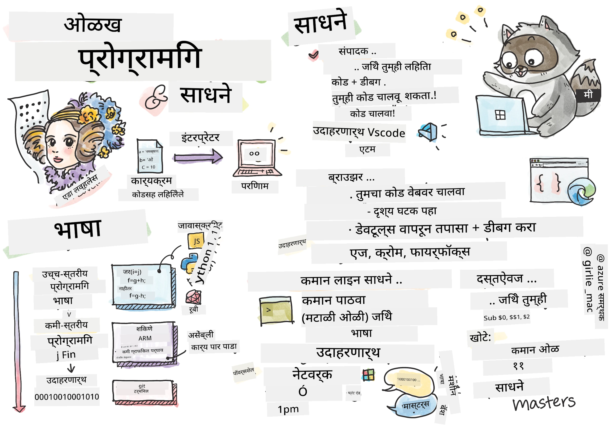
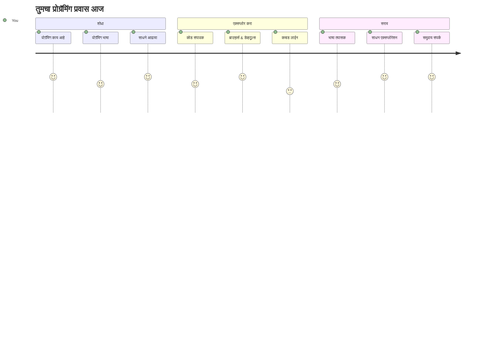
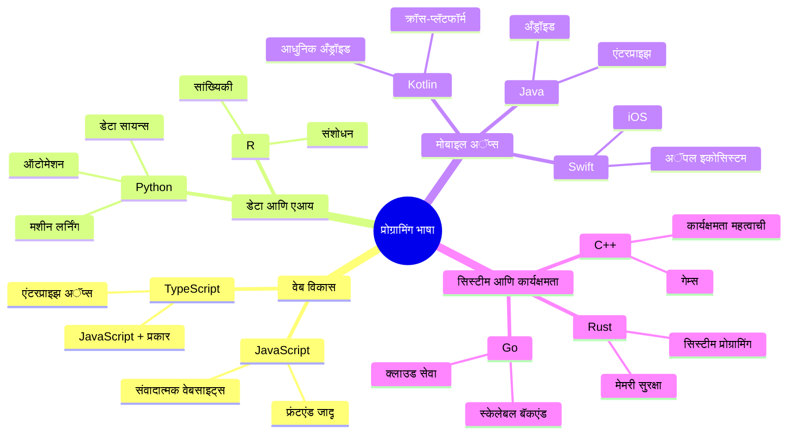
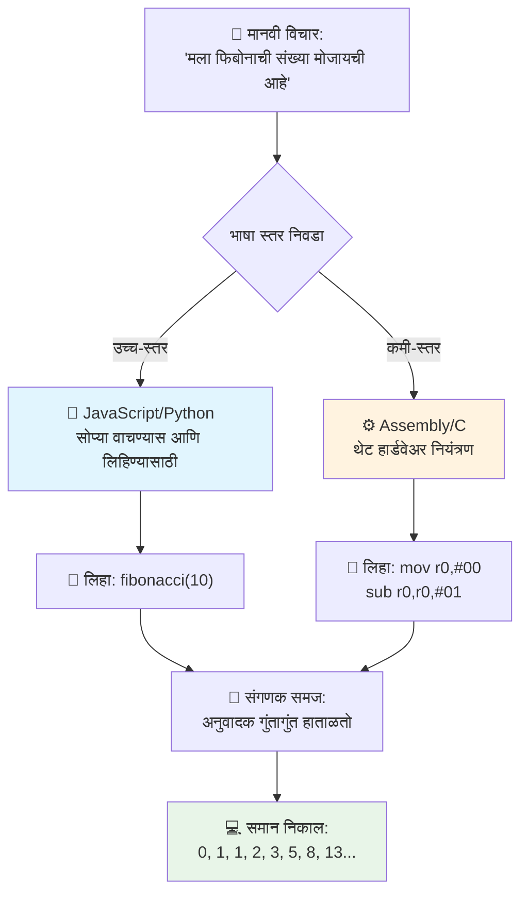
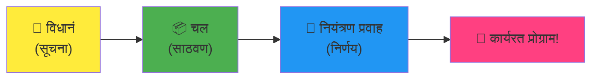
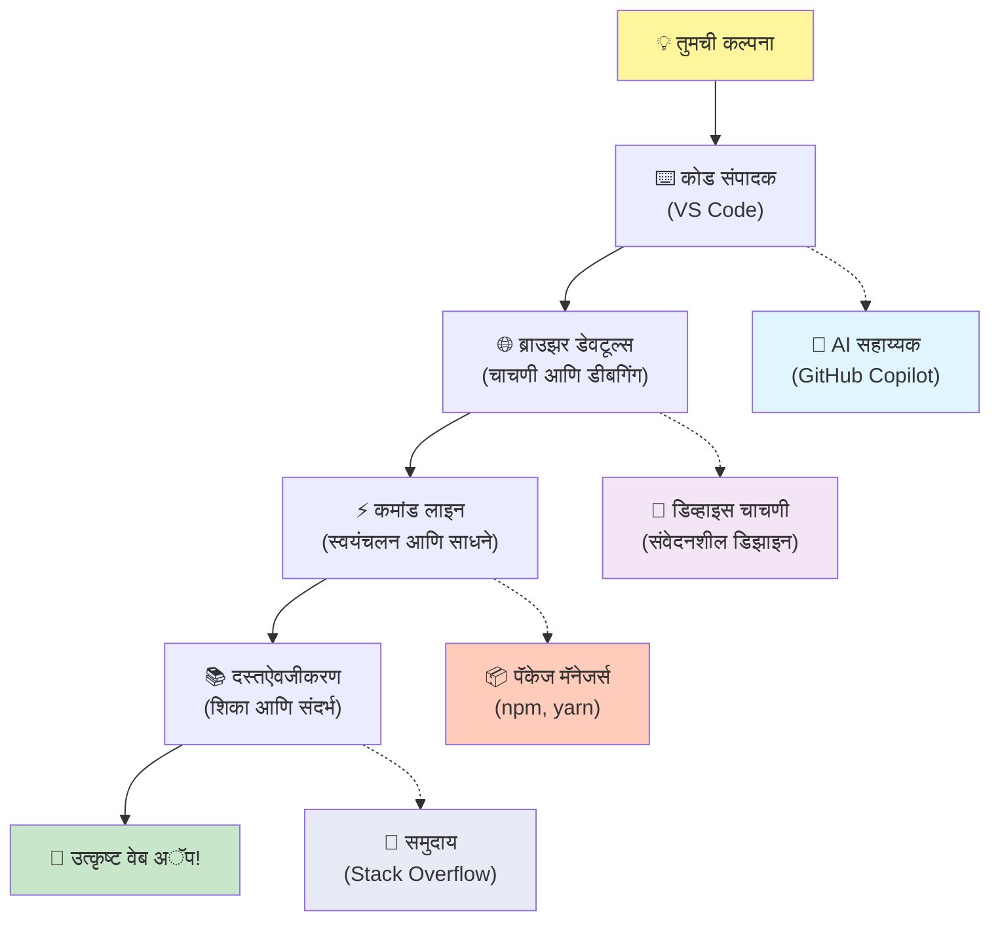
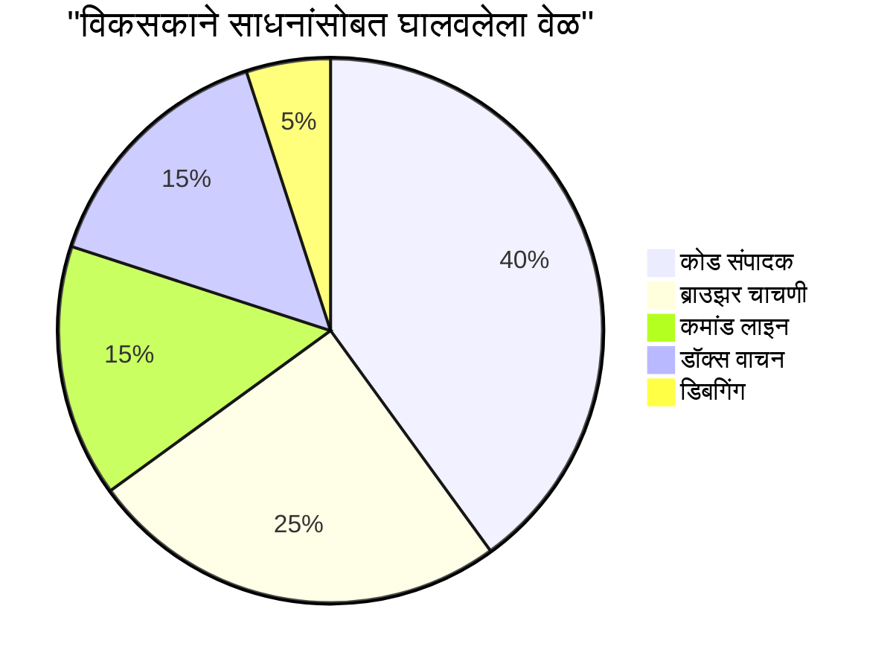
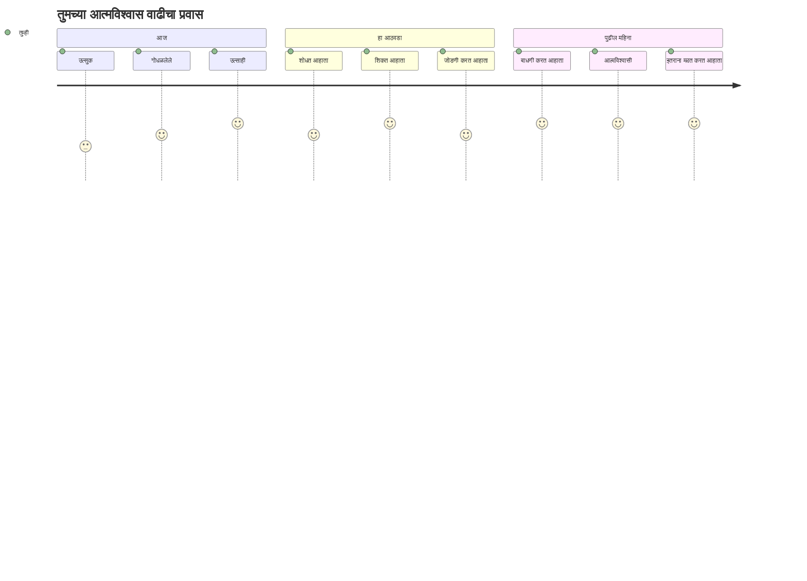

# प्रोग्रामिंग भाषांमध्ये आणि आधुनिक विकासक साधनेपरिचय

हॅलो, भविष्याचा विकासक! 👋 मला तुला काहीतरी सांगायला हरकत नाही का जी मला दररोज थंडी देत राहते? तू शोधणार आहेस की प्रोग्रामिंग फक्त संगणकांबद्दल नाही – हे खर्या सुपरपॉवर्ससारखे आहेत जे तूझ्या सर्वात धाडसी कल्पनांना जिवंत करण्यासाठी!

तुला त्यावेळ माहिती आहे का जेव्हा तू आपले आवडते अ‍ॅप वापरत असतोस आणि सर्व काही पूर्णपणे योग्य बसते? जेव्हा तू एका बटणावर टॅप करतोस आणि काहीतरी जादूई घडते जी तुला "वा, त्यांनी हे कसं केलं?" असं वाटतं? ठीक आहे, तुझ्यासारखाच कोणी तरी – कदाचित रात्री २ वाजता त्यांच्या आवडत्या कॉफी शॉपमध्ये बसलेला आणि त्याचा तिसरा एस्प्रेसो घेतलेला – त्या जादूची कोड लिहिली. आणि सोबतच एक गोष्ट जी तुझं मन उडवून टाकेल: या धड्याच्या शेवटी तू फक्त कसं केलं ते समजून घेत नाहीस, पण ते स्वतः करून पाहू इच्छितशील!

पाहा, मला पूर्णपणे समजते जर सध्या प्रोग्रामिंगत थोडी भीती वाटत असेल. मी जेव्हा सुरुवात केली, तेव्हा मला खरतर वाटायचं की तुला कोणताही गणिताचा हुशार असावा किंवा पाच वर्षे वयाच्या पासूनच कोडिंग करायचं असावं. पण एक गोष्ट जी माझा दृष्टिकोन पूर्णपणे बदलली: प्रोग्रामिंग म्हणजे अगदी नवीन भाषेत संवाद शिकण्यासारखे आहे. आपण "नमस्कार" आणि "धन्यवाद" पासून सुरुवात करतो, मग कॉफी ऑर्डर करायला शिकतो, आणि काही वेळाने तुला खोल तत्त्वज्ञानातील चर्चा करणारा होतो! पण इथे, आपण संगणकांशी संभाषण करीत आहोत, आणि खरतर? ते सर्वात संयमी संवाद भागीदार आहेत – ते कधीही तुझ्या चुका न्याय करत नाहीत आणि नेहमी पुन्हा प्रयत्न करण्यासाठी उत्सुक असतात!

आज, आपण आधुनिक वेब डेव्हलपमेंट शक्य करणारी अविश्वसनीय साधने पाहणार आहोत जी केवळ शक्य नाही, तर अगदी लत लागणारी आहेत. मला म्हणायचं आहे त्या तंतोतंत एडिटर्स, ब्राउझर्स आणि वर्कफ्लो ज्यांचा वापर नेटफ्लिक्स, स्पॉटिफाय, आणि तुझ्या आवडत्या इंडी अ‍ॅप स्टुडिओ मधील विकासक दररोज करतात. आणि एक गोष्ट जी तुला आनंदाने नाचायला लावेल: जास्तीत जास्त या व्यावसायिक दर्जाच्या, उद्योग-मानक साधनांचा वापर पूर्णपणे मोफत आहे!


> स्केचनोट [Tomomi Imura](https://twitter.com/girlie_mac) यांनी


```mermaid
journey
    title तुमचा प्रोग्रॅमिंग प्रवास आज
    section शोधा
      प्रोग्रॅमिंग काय आहे: 5: You
      प्रोग्रॅमिंग भाषा: 4: You
      साधने आढावा: 5: You
    section एक्सप्लोर करा
      कोड संपादक: 4: You
      ब्राउझर्स & डेव्हटूल्स: 5: You
      कमांड लाईन: 3: You
    section सराव
      भाषा तपासक: 4: You
      साधन एक्सप्लोरेशन: 5: You
      समुदाय संपर्क: 5: You
```
## आपण आधीपासून काय जाणतो ते पाहूया!

आम्ही मजेशीर गोष्टींमध्ये उडी मारण्याआधी, मला कुतूहल आहे – तुला या प्रोग्रामिंग जगाबद्दल आधीपासून काय माहिती आहे? आणि ऐक, जर तुला या प्रश्नांकडे बघून वाटत असेल की "मला या सर्वांबद्दल काहीही कल्पना नाही," म्हणजे ते फक्त ठीक नाही, तर परिपूर्ण आहे! याचा अर्थ तुला अगदी योग्य ठिकाणी आलो आहेस. या क्विझला व्यायामापूर्वीच्या स्ट्रेचिंगसारखा समज – आपण फक्त त्या मेंदूतील स्नायूंना गरम करतोय!

[प्री-लेसन क्विझ घ्या](https://ff-quizzes.netlify.app/web/)


## आपण एकत्र प्रवासाला निघणार आहोत

ठीक आहे, मला खरंच खूप उत्सुकता आहे आपण आज काय शोधणार आहोत याबद्दल! खरंच, मला हवंय की काही संकल्पना कशा क्लिक्स करतात ते मी तुझं फेस पाहू शकू. आपण एकत्र सुरू करणार आहोत हा अविश्वसनीय प्रवास:

- **प्रोग्रामिंग म्हणजे काय (आणि तो का सर्वात छान गोष्ट आहे!)** – आपण शोधणार आहोत की कोड खरंच अदृश्य जादू कशी आहे जी तुझ्या आजूबाजूची सगळी काही चालवते, त्या अलार्मपासून ज्याला कळतं की सोमवार सकाळ आहे तो पर्यंत ते अल्गोरिदम जो तुझ्या नेटफ्लिक्स शिफारसींना परिपूर्ण बनवतो
- **प्रोग्रामिंग भाषा आणि त्यांची आश्चर्यकारक व्यक्तिमत्त्वे** – कल्पना कर की तू एका पार्टीत जात आहेस जिथे प्रत्येक व्यक्तीकडे पूर्णपणे वेगवेगळे सुपरपॉवर्स आणि समस्या सोडवण्याचे मार्ग आहेत. तशाच प्रकारे प्रोग्रामिंग भाषांचा जग आहे, आणि तुला त्यांना भेटायला आवडेल!
- **डिजिटल जादू घडवणारे मूलभूत घटक** – याला अंतिम क्रिएटिव LEGO सेट समजा. जेव्हा तुला हे तुकडे कसे बसतात हे समजेल, तेव्हा तुला कळेल की तू तुझ्या कल्पनेत जे काही हवा ते तयार करू शकतोस
- **व्यावसायिक साधने ज्यामुळे तुला जणू काही जादूगाराची छडी मिळाल्यासारखे वाटेल** – मी अतिशयोक्ती करत नाही – ही साधने खरंच तुला सुपरपॉवर्समुळे भासतील, आणि सर्वोत्तम भाग? तीच साधने प्रोफेशनल्स वापरतात!

> 💡 **मग काय आहे:** आज सगळं लक्षात ठेवायचा विचार करू नकोस! सध्या मला फक्त तुला शक्यतांची झळ लागावीशी वाटते. तपशील आपोआप चिकटतील कारण आपण एकत्र सराव करू – खरं शिकण्याचं तसं होतं!

> तू हा धडा [Microsoft Learn](https://learn.microsoft.com/en-us/learn/modules/web-development-101/introduction-programming/?WT.mc_id=academic-77807-sagibbon) वरही घेऊ शकतोस!

## मग प्रोग्रामिंग म्हणजे नेमके काय?

ठीक आहे, चल millionaire-question हाताळूया: प्रोग्रामिंग म्हणजे खरोखर काय?

मी तुला एक गोष्ट सांगतो जी माझा दृष्टिकोन पूर्णपणे बदलली. गेल्या आठवड्यात, मी माझ्या आईला नवीन स्मार्ट टिव्ही रिमोट कसा वापरायचा हे समजावून देण्याचा प्रयत्न करीत होतो. मी स्वतःला म्हणत असल्याचे पकडले – "लाल बटण दाबा, पण मोठा लाल नाही, डाव्या बाजूचा लहान लाल बटण... नाही, तुझा दुसरा डावा... ठीक आहे, आता दोन सेकंद धरा, एक नाही, तीन नाही..." ऐकायला ओळखीचं वाटतं? 😅

तेच प्रोग्रामिंग आहे! हे काहीतरी अतिशय सविस्तर, पाऊलंदरपाऊल सूचना देण्याचं कलाज्ञान आहे ज्याला फारशा शक्ती असते, पण प्रत्येक गोष्ट पूर्णपणे व्यक्त करावी लागते. फक्त तुला तुझ्या आईला (जी विचारू शकते "कोणता लाल बटण?!") समजवत नाही, तुला संगणकाला समजावून द्यायचं असतं (जो अगदी तुझ्या शब्दामध्ये काय आहे तेच करतो, जरी तुझं म्हणणं अगदी तसं नसेल तरी).

जेव्हा मी हे प्रथम शिकलं तेव्हा माझा मन फटका बसला: संगणक खरच अशा सोप्या आहेत. त्यांना फक्त दोन गोष्टी समजतात – १ आणि ०, ज्याचा अर्थ "होय" आणि "नाही" किंवा "चालू" आणि "बंद" इतका आहे. इतकंच! पण इथे जादू येते – आपल्याला 1 आणि 0 मध्ये बोलायची गरज नाही जसा मॅट्रिक्समध्ये म्हणतात. मग येतात **प्रोग्रामिंग भाषा**. त्या अशा आहेत जणू सर्वोत्तम अनुवादक जे तुझ्या साध्या मानवी विचारांना संगणकाच्या भाषेत रूपांतर करतात.

आणि दररोज सकाळी उठताना जी गोष्ट अजूनही मला थंडी देते: तुझ्या आयुष्यातील सर्व डिजिटल गोष्टी कुणीतरी तुझ्यासारखा, कदाचित पायजाम्यात बसून कप कॉफी घेत, न्याहाळताना संगणकावर कोड लिहीत असलेला नेमका कोणी तरी सुरू केलं. त्या इंस्टाग्राम फिल्टरने ज्यामुळे तू परिपूर्ण दिसतोस? कोणीतरी तो कोड लिहिला. जिच्यामुळे तुला आवडता नवीन गाण्याकडे नेलेल्या शिफारशीचा अल्गोरिदम? एक विकासक तयार केला. ज्यामुळे तू मित्रांबरोबर जेवणाच्या बिलांचे विभाजन करू शकतोस असा अ‍ॅप? होय, कोणीतरी विचार केला "हे त्रासदायक आहे, मी नक्कीच हे सोडवू शकतो" आणि मग... त्यांनी केलं!

जेव्हा तू प्रोग्रामिंग शिकतोस, तर तू फक्त नवीन कौशल्य उचलत नाहीस – तू अशा कम्युनिटीचा भाग होतोस ज्यांचे दिवस विचार करीत टिकतात, "जर मी काहीतरी तयार करू शकलो तर कोणाचाही दिवस थोडासा सुधारू शकेल?" खरं सांगायचं तर, त्यापेक्षा काही थंड नसतं!

✅ **मजेदार तथ्य शोधणे**: जेव्हा तुला वेळ मिळेल तेव्हा काहीतरी अगदी छान शोधा – जगातील पहिला संगणक प्रोग्रामर कोण होता? मी तुला एक हिंट देतो: ते जे तुला वाटतं तितके नाही! त्या व्यक्तीच्या कथा अत्यंत रोमांचक आहे आणि दाखवते की प्रोग्रामिंग नेहमीच क्रिएटिव समस्या सोडवण्याबद्दल आणि चौकटीच्या बाहेर विचार करण्याबद्दल आहे.

### 🧠 **तू कसा/कशी वाटतेस?**

**एक क्षण विचार कर:**
- "संगणकांना सूचना देण्याचा" विचार तूझ्या मनाला आता समजतो का?
- कोणतं रोजचं काम तुला प्रोग्रामिंगद्वारे स्वयंचलित करायचं आहे का?
- ह्या संपूर्ण प्रोग्रामिंगबद्दल कोणते प्रश्न तुझ्या मनात येत आहेत?

> **लक्षात ठेवा**: जर काही संकल्पना सध्या अस्पष्ट वाटत असतील तर ते अगदी सामान्य आहे. प्रोग्रामिंग शिकणं म्हणजे नवीन भाषा शिकण्यासारखं आहे – मेंदूला त्या न्यूरल मार्ग तयार करण्यासाठी वेळ लागतो. तू फारच छान करत आहेस!

## प्रोग्रामिंग भाषा म्हणजे जादूच्या वेगवेगळ्या चवांसारख्या आहेत

ठीक आहे, थोडं विचित्र वाटेल पण माझ्याशी राहा – प्रोग्रामिंग भाषा म्हणजे वेगवेगळे संगीत प्रकारासारखे आहेत. विचार कर: तुझ्याकडे जॅझ आहे, जी मृदू आणि पूर्वग्रहशून्य आहे, रॉक जी शक्तिशाली आणि थेट आहे, क्लासिकल जी सुंदर आणि संरचित आहे, आणि हिप-हॉप जी क्रिएटिव आणि अभिव्यक्तीपूर्ण आहे. प्रत्येक शैलीची स्वतःची झलक, प्रेक्षकांची स्वतंत्र समुदाय असते, आणि प्रत्येक वेगवेगळ्या मूड आणि प्रसंगासाठी योग्य आहे.

प्रोग्रामिंग भाषा देखील अगदी त्याचप्रमाणे काम करतात! तू मजेदार मोबाइल गेम बनवण्यासाठी तोच भाषा वापरशील अशी नाही जी तुला जलवायूचा मोठा डेटा प्रक्रिया करण्यासाठी हवा आहे, तसंच तुला योगा वर्गात डेथ मेटल वाजवायचं नाही (बरं, बरेच योगा वर्ग नव्हेच! 😄).

पण मला विचारलं की प्रत्येक वेळी माझा मन उद्ध्वस्त होतो : या भाषांमुळे तुला असा समज येतो की जणू तुला जगातील सर्वात संयमी, बुद्धिमान भाषांतरकर्ता साथ दिलीये. तू आपले विचार तुझ्या मानवी मेंदूप्रमाणे सहज व्यक्त करू शकतोस, आणि ते संगणक भाषा, म्हणजे 1 आणि 0 मध्ये फार गुंतागुंतीचं काम करतात. ते जणू तुझा एक मित्र आहे जो दर दोन भाषांमध्ये प्रवीण आहे – आणि कधी थकून जात नाही, कधी कॉफी ब्रेक घेण्याची गरज नाही आणि तुझ्या समान प्रश्नासाठी कधीही न्याय करत नाही!

### लोकप्रिय प्रोग्रामिंग भाषा आणि त्यांचा वापर


```mermaid
mindmap
  root((प्रोग्रामिंग भाषा))
    वेब विकास
      JavaScript
        फ्रंटएंड जादू
        संवादात्मक वेबसाइट्स
      TypeScript
        JavaScript + प्रकार
        एंटरप्राइझ अॅप्स
    डेटा आणि एआय
      Python
        डेटा सायन्स
        मशीन लर्निंग
        ऑटोमेशन
      R
        सांख्यिकी
        संशोधन
    मोबाइल अॅप्स
      Java
        अँड्रॉइड
        एंटरप्राइझ
      Swift
        iOS
        अॅपल इकोसिस्टम
      Kotlin
        आधुनिक अँड्रॉइड
        क्रॉस-प्लॅटफॉर्म
    सिस्टीम आणि कार्यक्षमता
      C++
        गेम्स
        कार्यक्षमता महत्वाची
      Rust
        मेमरी सुरक्षा
        सिस्टीम प्रोग्रामिंग
      Go
        क्लाउड सेवा
        स्केलेबल बॅकएंड
```
| भाषा | सर्वोत्तम वापर | का लोकप्रिय आहे |
|----------|----------|------------------|
| **JavaScript** | वेब विकास, वापरकर्ता इंटरफेस | ब्राउझरमध्ये चालते आणि संवादात्मक वेबसाइट्ससाठी पॉवर देते |
| **Python** | डेटा सायन्स, ऑटोमेशन, AI | वाचायला आणि शिकायला सोपे, शक्तिशाली लायब्ररी |
| **Java** | एंटरप्राइज अ‍ॅप्लिकेशन्स, अँड्रॉइड अ‍ॅप्स | प्लॅटफॉर्म-स्वतंत्र, मोठ्या सिस्टमसाठी मजबूत |
| **C#** | विंडोज अ‍ॅप्लिकेशन्स, गेम विकास | मजबूत मायक्रोसॉफ्ट इकोसिस्टम समर्थन |
| **Go** | क्लाउड सेवा, बॅकएंड सिस्टम | जलद, सोपी, आधुनिक संगणना साठी डिझाइन केलेली |

### उच्च-स्तरीय vs. कमी-स्तरीय भाषा

ठीक आहे, ही खरंच संकल्पना आहे जी माझा मेंदू तुटला जेव्हा मी सुरुवात केली, त्यामुळे मी तुला analogue सांगणार आहे जी मला अखेरीस समजली – आणि मला आशा आहे की तुला देखील उपयोग होईल!

कल्पना कर की तू एका देशात आहेस जिथे तुझा भाषा येत नाही आणि तुला अत्यंत त्वरीत जवळचा स्वच्छतागृह शोधायचं आहे (आपण सर्व तिथे असलो आहोत, बरोबर? 😅):

- **कमी-स्तरीय प्रोग्रामिंग** तशी आहे जणू तुला तेथील स्थानिक बोली इतकी प्रभावितपणे शिकायची की तू फळ विकणारी आजीशी सांस्कृतिक संदर्भ, स्थानिक स्लँग, आणि आतल्या मजेशीर गोष्टी वापरून बोलू शकतोस ज्यांना फक्त तेथील लोकच समजू शकतात. अतिशय कौतुकास्पद आणि अत्यंत कार्यक्षम... जर आपण प्रवीण आहोत तर! पण केवळ शौचालय शोधण्याचा प्रयत्न करताना अगदीच अवघड.

- **उच्च-स्तरीय प्रोग्रामिंग** जणू तेच अद्भुत स्थानिक मित्र आहे जो तुला सहज समजतो. तू "मला खरोखर शौचालय सापडायला हवं" इंग्रजीत सांगू शकतोस, आणि तो समजावून सांस्कृतिक भाषांतर करून तुला असा वाटेल की ते तुझ्या स्थानिक न कोट्याशी मेंदूला समजून घेण्या प्रमाणे आहे.

प्रोग्रामिंगत:
- **कमी-स्तरीय भाषा** (Assembly किंवा C सारख्या) तुला संगणक हार्डवेअरशी अतिशय सविस्तर संभाषण करण्याची मुभा देतात, पण तुला मशीन सारखा विचार करावा लागतो, जो... म्हणायला तर मोठा मानसिक बदल आहे!
- **उच्च-स्तरीय भाषा** (JavaScript, Python, किंवा C# सारख्या) तुला मानवी विचारांप्रमाणे विचार करण्यास मुभा देतात, पण त्या मागे संगणक भाषा सांभाळतात. शिवाय, त्या अत्यंत स्वागतार्ह समुदायांनी भरलेल्या असतात जे नवीन असण्याचा अनुभव लक्षात ठेवतात आणि खरी मदत करतात!

अंदाज लाव कोणत्या भाषा तुला सुरू करण्यास सुचवणार? 😉 उच्च-स्तरीय भाषा जणू प्रशिक्षण चाकांसारख्या आहेत, ज्यांना कधीही दूर काढायचं वाटत नाही कारण त्या अनुभव अजूनही आनंददायी करतात!


```mermaid
flowchart TB
    A["👤 मानवी विचार:<br/>'मला फिबोनाची संख्या मोजायची आहे'"] --> B{भाषा स्तर निवडा}
    
    B -->|उच्च-स्तर| C["🌟 JavaScript/Python<br/>सोप्या वाचण्यास आणि लिहिण्यासाठी"]
    B -->|कमी-स्तर| D["⚙️ Assembly/C<br/>थेट हार्डवेअर नियंत्रण"]
    
    C --> E["📝 लिहा: fibonacci(10)"]
    D --> F["📝 लिहा: mov r0,#00<br/>sub r0,r0,#01"]
    
    E --> G["🤖 संगणक समज:<br/>अनुवादक गुंतागुंत हाताळतो"]
    F --> G
    
    G --> H["💻 समान निकाल:<br/>0, 1, 1, 2, 3, 5, 8, 13..."]
    
    style C fill:#e1f5fe
    style D fill:#fff3e0
    style H fill:#e8f5e8
```
### मी तुला दाखवतो का उच्च-स्तरीय भाषा का अधिक मित्रत्वाची आहेत

ठीक आहे, मी तुला काहीतरी दाखवणार आहे जे पूर्णतः दाखवते की मी उच्च-स्तरीय भाषा का आवडल्या, पण आधी – तुझी एक वचन पाहिजे. जेव्हा तू त्या पहिल्या कोड उदाहरणाला पाहशील, घाबरायची गरज नाही! ती थोडी भयंकर दिसायला हवीच आहे. तेच मुद्दा आहे!

आपण दोन्ही पूर्णपणे वेगळ्या शैलींमध्ये लिहिलेले एकच काम पाहणार आहोत. दोन्ही Fibonacci सिक्वेन्स तयार करतात – ही अशी सुंदर गणिती पद्धत आहे जिथे प्रत्येक संख्या मागील दोन संख्यांचा बेरीज असते: 0, 1, 1, 2, 3, 5, 8, 13... (मजेदार तथ्य: तुला ही पद्धत निसर्गात प्रत्येक ठिकाणी सापडेल – सुर्यफुलाच्या बियांच्या सर्पिल, पाइनकॉन्सचे नमुने, अगदी आकाशगंगांमध्ये फॉर्म कसे होतात!)

वेगळेपणा पाहायला तयार आहेस? चला तर!

**उच्च-स्तरीय भाषा (JavaScript) – मानवी-मित्रत्व:**

```javascript
// पाऊल 1: मूलभूत फिबोनॅची सेटअप
const fibonacciCount = 10;
let current = 0;
let next = 1;

console.log('Fibonacci sequence:');
```

**हा कोड काय करतो:**
- **संदेश देतो** एक ठराविक संख्या Fibonacci अल्गोरिदमसाठी किती नंबर पाहिजे ते
- **चालू आणि पुढच्या नंबरसाठी** दोन व्हेरिएबल्स सुरू करतो
- **सुरुवातीचे मूल्य सेट करतो** (0 आणि 1) जे Fibonacci नमुना ठरवतात
- **आउटपुट ओळखण्यासाठी** शीर्षक संदेश दाखवतो

```javascript
// टप्पा 2: लूपसह अनुक्रम तयार करा
for (let i = 0; i < fibonacciCount; i++) {
  console.log(`Position ${i + 1}: ${current}`);
  
  // अनुक्रमातील पुढचा संख्या गणना करा
  const sum = current + next;
  current = next;
  next = sum;
}
```

**येथे काय घडते तुटकपणे:**
- **फॉर लूपने** सिक्वेन्समधील प्रत्येक स्थानावर जाऊन काम करतो
- **प्रती संख्या आणि पद** टेम्पलेट लिटरल फॉरमॅटिंग वापरून दाखवतो
- **पुढील संख्या** सध्याच्या आणि पुढच्या जोडून काढतो
- **व्हेरिएबल्स अद्यतनित** करून पुढील फेरफटका सुरू करतो

```javascript
// पायरी 3: आधुनिक कार्यात्मक दृष्टीकोन
const generateFibonacci = (count) => {
  const sequence = [0, 1];
  
  for (let i = 2; i < count; i++) {
    sequence[i] = sequence[i - 1] + sequence[i - 2];
  }
  
  return sequence;
};

// वापराचे उदाहरण
const fibSequence = generateFibonacci(10);
console.log(fibSequence);
```

**वर दिलेल्या कोडमध्ये आपण:**
- **आधुनिक अॅरो फंक्शन सिंटॅक्स वापरून** पुन्हा वापरता येणार्या फंक्शन तयार केलं
- **पूर्ण सिक्वेन्स संग्रहित करण्यासाठी** अ‍ॅरे तयार केली, एकेक करून दाखवण्याऐवजी
- **अ‍ॅरे इंडेक्सिंग वापरली** प्रत्येक नवीन नंबर मागील संख्यांवरून काढण्यासाठी
- **पूर्ण सिक्वेन्स परत केली** ज्यामुळे अन्य भागांत लवचिक वापर होतो

**कमी-स्तरीय भाषा (ARM Assembly) – संगणक-मित्रत्व:**

```assembly
 area ascen,code,readonly
 entry
 code32
 adr r0,thumb+1
 bx r0
 code16
thumb
 mov r0,#00
 sub r0,r0,#01
 mov r1,#01
 mov r4,#10
 ldr r2,=0x40000000
back add r0,r1
 str r0,[r2]
 add r2,#04
 mov r3,r0
 mov r0,r1
 mov r1,r3
 sub r4,#01
 cmp r4,#00
 bne back
 end
```

JavaScript आवृत्ती इंग्रजी सूचनांसारखी वाचते, तर Assembly आवृत्ती संगणकाच्या प्रोसेसरवर थेट नियंत्रण ठेवणाऱ्या अस्पष्ट कमांड वापरते. दोन्ही सारखं काम करतात, पण उच्च-स्तरीय भाषा मनुष्यांसाठी समजायला, लिहायला आणि देखभाल करायला much सोपी आहे.

**तुला दिसणारे मुख्य फरक:**
- **वाचनियता**: JavaScript मध्ये `fibonacciCount` सारखी वर्णनात्मक नावे वापरली जातात तर Assembly मध्ये `r0`, `r1` सारखी अस्पष्ट लेबल्स वापरली जातात  
- **टिप्पण्या**: उच्च-स्तरीय भाषा स्वयं-डॉक्यूमेंटिंग कोडसाठी स्पष्ट करणाऱ्या टिप्पण्यांना प्रोत्साहन देतात  
- **रचना**: JavaScript ची लॉजिकली प्रवाह मानवी विचारप्रक्रियेप्रमाणे टप्प्याटप्प्यावर समस्या सोडवते  
- **देखभाल**: JavaScript आवृत्ती विविध आवश्यकतांसाठी अद्ययावत करणे सोपे आणि स्पष्ट असते  

✅ **फिबोनाक्की अनुक्रमाबद्दल**: हा अत्यंत सुंदर संख्या नमुना (जिथे प्रत्येक संख्या त्याच्या मागील दोन संख्यांच्या बेरीज इतकी असते: 0, 1, 1, 2, 3, 5, 8...) निसर्गात खरंच *सर्वत्र* दिसतो! तुम्हाला तो सूर्यमुखीच्या सर्पिलात, पाइनकोनच्या नमुन्यांमध्ये, नॉटिलस शेल्सच्या वाकलेल्या भागांमध्ये, आणि अगदी झाडांच्या फांद्यांच्या वाढीतही सापडेल. मॅथ आणि कोड कसे आम्हाला निसर्गाने वापरलेले नमुने समजून घेण्यात आणि पुनरुत्पादन करण्यात मदत करतात हे पाहणे खरंच आवडेल!

## जादू घडवणारे मूलभूत घटक

ठीक आहे, आता तुम्ही पाहिले की प्रोग्रामिंग भाषा कशा दिसतात, तर चला मूलभूत भागांचे विश्लेषण करू या जे अक्षरशः प्रत्येक प्रकाशित कार्यक्रमात असतात. यांना तुमच्या आवडत्या कृतीच्या आवश्यक घटकांप्रमाणे समजा – एकदा तुम्हाला प्रत्येकाचा अर्थ कळेल की तुम्ही प्रामुख्याने कोणत्याही भाषेत कोड वाचू आणि लिहू शकाल!

हे प्रोग्रामिंगच्या व्याकरणाचे शिक्षण घेण्याइतकेच आहे. शाळेत जेव्हा तुम्ही नाम, क्रियापद आणि वाक्यं कशी बांधायची हे शिकायचे त्यावेळी लक्षात ठेवा? प्रोग्रामिंगमध्ये देखील त्याचे स्वतःचे व्याकरण असते, आणि वास्तवात, ते इंग्रजी व्याकरणापेक्षा जास्त तार्किक आणि माफक आहे! 😄

### विधानं: टप्प्याटप्प्याने सूचना

चला **विधानांपासून** सुरुवात करूया – हे तुमच्या संगणकाशी संवादात वेगवेगळ्या वाक्यांसारखे आहेत. प्रत्येक विधान संगणकाला एक विशिष्ट गोष्ट करण्यास सांगते, जसे की मार्गदर्शन देणे: "इथे डावीकडे वळा," "लाल दिव्यावर थांबा," "त्या जागी पार्क करा."

मला विधानांविषयी जे आवडते ते म्हणजे त्यांची वाचनियता. हे पहा:

```javascript
// मूलभूत विधान जे एकल क्रिया करतात
const userName = "Alex";                    
console.log("Hello, world!");              
const sum = 5 + 3;                         
```

**हा कोड काय करतो:**
- वापरकर्त्याचे नाव साठवण्यासाठी एक स्थिर चल जाहीर करा  
- कन्सोल आउटपुटवर स्वागत संदेश दर्शवा  
- गणिती क्रियेचा निकाल काढा आणि साठवा  

```javascript
// वेब पृष्ठांशी संवाद साधणाऱ्या विधानां
document.title = "My Awesome Website";      
document.body.style.backgroundColor = "lightblue";
```

**टप्प्याटप्प्याने काय घडते ते:**
- ब्राउझर टॅबमध्ये दिसणारे वेबपेज शीर्षक बदला  
- पूर्ण पेज बॉडीचा पार्श्वभूमी रंग बदला  

### चल (Variables): तुमच्या प्रोग्रामची मेमरी प्रणाली

ठीक आहे, **चल** ही संकल्पना मला शिकवायला अत्यंत आवडते कारण ती तुम्ही दररोज वापरत असलेल्या गोष्टींसारखीच आहे!

तुमच्या फोनच्या संपर्क यादीचा विचार करा. तुम्ही प्रत्येकाचा फोन नंबर लक्षात ठेवत नाही – त्याऐवजी "आई," "सर्वात चांगला मित्र," किंवा "रात्री 2 पर्यंत डिलिव्हर करणारा पिझ्झा ठिकाण" यांना नावे देऊन साठवता आणि तुमचा फोन नंबर्स लक्षात ठेवतो. चल अगदी असेच कार्य करतात! ते लेबल केलेले कंटेनरसारखे आहेत जिथे तुमचा प्रोग्राम माहिती साठवू शकतो आणि नंतर ती नावाने परत घेऊ शकतो.

खरंच छान म्हणजे: चल प्रोग्राम चालू असताना बदलू शकतात (त्याच नावाप्रमाणे – "variable" म्हणजे बदलणारे). जसे तुम्ही नवीन चांगल्या पिझ्झा प्लेसचा शोध लागल्यावर तो संपर्क अपडेट करता, तसंच प्रोग्राममध्ये माहिती बदलल्यावर चल अपडेट होत असतात!

हे किती सुंदर सोपे आहे ते पाहा:

```javascript
// टप्पा 1: मूलभूत चल तयार करणे
const siteName = "Weather Dashboard";        
let currentWeather = "sunny";               
let temperature = 75;                       
let isRaining = false;                      
```

**या संकल्पनांची समज:**
- `const` मध्ये स्थिर मूल्ये साठवा (जसे की साइटचे नाव)  
- प्रोग्राममध्ये बदल होणाऱ्या मूल्यांसाठी `let` वापरा  
- वेगळ्या प्रकारचे डेटा वापरा: स्ट्रिंग्स (मजकूर), संख्या, आणि बुलेयन (बरोबर/चूक)  
- प्रत्येक चलाचा अर्थ स्पष्ट करणारी वर्णनात्मक नावे निवडा  

```javascript
// टप्पा २: संबंधित डेटा गटबद्ध करण्यासाठी ऑब्जेक्ट्ससह कार्य करणे
const weatherData = {                       
  location: "San Francisco",
  humidity: 65,
  windSpeed: 12
};
```

**वर दिलेल्यात:**
- संबंधित हवामान माहिती एका वस्तूमध्ये बनवली  
- अनेक डेटा तुकडे एका चलाखाली संघटित केले  
- प्रत्येक माहिती तुकड्याला स्पष्ट लेबल देण्यासाठी की-वॅल्यू जोड्या वापरल्या  

```javascript
// टप्पा 3: चल वेरियेबल्सचा वापर आणि अपडेट करणे
console.log(`${siteName}: Today is ${currentWeather} and ${temperature}°F`);
console.log(`Wind speed: ${weatherData.windSpeed} mph`);

// बदलणाऱ्या वेरियेबल्सचे अपडेट करणे
currentWeather = "cloudy";                  
temperature = 68;                          
```

**प्रत्येक भाग समजून घेऊया:**
- `${}` सिंटॅक्ससह टेम्पलेट लिटरल वापरून माहिती दर्शवा  
- डॉट नोटेशन (`weatherData.windSpeed`) वापरून ऑब्जेक्टच्या गुणधर्मांपर्यंत प्रवेश करा  
- `let` च्या माध्यमातून घोषित केलेल्या चलांना बदलून परिस्थिती दर्शवा  
- अनेक चल एकत्र करून अर्थपूर्ण संदेश तयार करा  

```javascript
// पायरी 4: स्वच्छ कोडसाठी आधुनिक विघटन
const { location, humidity } = weatherData; 
console.log(`${location} humidity: ${humidity}%`);
```

**जे तुम्हाला माहित असावे:**
- वस्तूतील विशिष्ट गुणधर्म डीस्ट्रक्चर्स असाइनमेंटने काढा  
- वस्तूच्या की-नावांसारखी नवी चल आपोआप तयार करा  
- कोडला डॉट नोटेशनच्या पुनरावृत्तीमुळे त्रास टाळण्यासाठी सोपे करा  

### नियंत्रण प्रवाह: तुमच्या प्रोग्रामला विचार करायला शिकवणे

ठीक आहे, इथे प्रोग्रामिंग अगदीच मनाला भिडणारी होते! **नियंत्रण प्रवाह** म्हणजे तुमच्या प्रोग्रामला बुद्धिमान निर्णय घेण्यास शिकवणे, जसे तुम्ही रोज कित्येक वेळा अजून विचार न करता करता.

कल्पना करा: आज सकाळी तुम्ही असं विचारलं असेल "जर पाऊस पडत असेल तर मी छत्री घेईन. जर थंडी असेल तर मी जॅकेट घालीन. जर उशीरा झालो तर नाश्ता वगळून कॉफी घेऊन निघेल." तुमचे मेंदू दररोज अशा if-then लॉजिकचे कित्येक वेळा पालन करत असतो!

हेच प्रोग्राम्सना बुद्धिमान आणि जिवंत बनवते, केवळ कंटाळवाणा स्क्रिप्ट नाकारून. ते परिस्थिती पाहू शकतात, घडत असलेले तपासू शकतात, आणि योग्य प्रतिसाद देऊ शकतात. म्हणजेच तुमच्या प्रोग्रामला असे मेंदू देणे जे परिस्थितीनुसार जुळून घेऊ शकते आणि निर्णय घेते!

हे कसे काम करते ते पाहूया:

```javascript
// पायरी 1: मूलभूत अटीसंबंधी लॉजिक
const userAge = 17;

if (userAge >= 18) {
  console.log("You can vote!");
} else {
  const yearsToWait = 18 - userAge;
  console.log(`You'll be able to vote in ${yearsToWait} year(s).`);
}
```

**हा कोड काय करतो:**
- वापरकर्त्याचे वय मतदान पात्रतेसाठी तपासा  
- अटीच्या निकालावर आधारित वेगवेगळे कोड ब्लॉक्स चालवा  
- १८ पेक्षा कमी असल्यास मतदान पात्र अस्तित्व होईपर्यंत किती वेळ लागेल ते काढा आणि दाखवा  
- प्रत्येक परिस्थितीसाठी विशेष आणि उपयुक्त अभिप्राय द्या  

```javascript
// पाऊल 2: लॉजिकल ऑपरेटर्ससह अनेक अटी
const userAge = 17;
const hasPermission = true;

if (userAge >= 18 && hasPermission) {
  console.log("Access granted: You can enter the venue.");
} else if (userAge >= 16) {
  console.log("You need parent permission to enter.");
} else {
  console.log("Sorry, you must be at least 16 years old.");
}
```

**येथे काय घडते ते समजावून सांगतो:**
- `&&` (आणि) ऑपरेटर वापरून अनेक अटी एकत्र करा  
- एकापेक्षा अधिक परिस्थितीसाठी `else if` वापरून श्रेणी तयार करा  
- अंतिम `else` विधानाने सर्व शक्य पर्याय हाताळा  
- प्रत्येक वेगळी परिस्थिती समजेल असा स्पष्ट अभिप्राय द्या  

```javascript
// पाऊल 3: तर्नरी ऑपरेटरसह संक्षिप्त अटीतत्त्व
const votingStatus = userAge >= 18 ? "Can vote" : "Cannot vote yet";
console.log(`Status: ${votingStatus}`);
```

**हे लक्षात ठेवा:**
- सोप्या दोन-पर्यायाच्या परिस्थितीसाठी टर्नरी ऑपरेटर (`? :`) वापरा  
- प्रथम अट लिहा, नंतर `?`, नंतर खरे झालेले निकाल, नंतर `:`, नंतर खोटे झालेले निकाल  
- अटीवरून मूल्ये देण्यासाठी हा नमुना वापरा  

```javascript
// पायरी 4: अनेक विशिष्ट प्रकरणे हाताळणे
const dayOfWeek = "Tuesday";

switch (dayOfWeek) {
  case "Monday":
  case "Tuesday":
  case "Wednesday":
  case "Thursday":
  case "Friday":
    console.log("It's a weekday - time to work!");
    break;
  case "Saturday":
  case "Sunday":
    console.log("It's the weekend - time to relax!");
    break;
  default:
    console.log("Invalid day of the week");
}
```

**हा कोड खालील काम करतो:**
- चलाच्या मूल्याचा विविध विशेष प्रकरणांशी जुळवून पहा  
- सारख्या प्रकरणांना (साप्ताहिक दिवस विरुद्ध आठवड्याचा शेवट) गटबद्ध करा  
- जुळणारी प्रकरणे आढळल्यावर योग्य कोड ब्लॉक चालवा  
- अपरीक्षित मूल्यांसाठी `default` प्रकरण वापरा  
- पुढील प्रकरणाकडे न जाण्यासाठी `break` विधानांचा वापर करा  

> 💡 **वास्तविक जगातील स्वरूप**: नियंत्रण प्रवाह असा समजा जणू जगातील सर्वात संयमी GPS तुम्हाला मार्गदर्शन देते. ते म्हणेल "जर मेन स्ट्रीटवर ट्राफिक असेल तर हायवे घ्या. जर हायवेवर बांधकाम चालले असेल तर नयनरम्य मार्गाचा वापर करा." प्रोग्राम देखील अशीच शर्तीय लॉजिक वापरून वेगवेगळ्या परिस्थितींना बुद्धिमत्तेने प्रतिसाद देतात आणि नेहमी वापरकर्त्यांना सर्वोत्तम अनुभव देतात.

### 🎯 **संकल्पना तपासणी: मूलभूत घटकांचे प्रभुत्व**

**मूलभूत गोष्टी कशा करीत आहात ते पाहूया:**
- चल आणि विधान यांत फरक तुम्हाला स्वतःच्या शब्दांत स्पष्ट करता येईल का?  
- एखाद्या वास्तविक परिस्थितीचा विचार करा जिथे तुम्ही if-then निर्णय वापराल (जसे मतदान उदाहरण)  
- प्रोग्रामिंग लॉजिक विषयी तुमच्या आवडत्या काही आश्चर्यकारक बाबी कोणत्या?  

**त्वरित आत्मविश्वास वाढवणारा:**

```mermaid
flowchart LR
    A["📝 विधानं<br/>(सूचना)"] --> B["📦 चल<br/>(साठवण)"] --> C["🔀 नियंत्रण प्रवाह<br/>(निर्णय)"] --> D["🎉 कार्यरत प्रोग्राम!"]
    
    style A fill:#ffeb3b
    style B fill:#4caf50
    style C fill:#2196f3
    style D fill:#ff4081
```
✅ **पुढे काय येणार आहे**: आपण या संकल्पनांमध्ये अधिक खोलवर जाऊन हा अद्भुत प्रवास एकत्र सुरू ठेवणार आहोत! सध्या, फक्त या सर्व अप्रतिम शक्यता याबद्दल तुम्हाला उत्साह वाटण्यावर लक्ष केंद्रित करा. विशिष्ट कौशल्ये आणि तंत्रे आपण एकत्र सराव करत राहिल्याने नैसर्गिकपणे येतील – मी आश्वस्त आहे की हे तुम्हाला अपेक्षित असलेल्या पेक्षा खूपच मजेदार ठरणार आहे!

## व्यापारासाठी उपकरणे

ठीक आहे, इथे मला एवढा उत्साह येतो की मी कंट्रोल करू शकत नाही! 🚀 आपण आता अशा अद्भुत उपकरणांबद्दल बोलणार आहोत ज्या वापरून तुम्हाला जणू एखाद्या डिजिटल स्पेसशिपच्या किल्या सोपवलेल्या वाटतील.

तुम्हाला माहिती आहे का, शेफकडे कसे परफेक्ट बैलन्स असलेले छुरी असतात जणू त्यांच्या हातांचीच वाढ? किंवा संगीतकाराकडे एक अशी गिटार असते जी स्पर्श करताच गायन सुरू करते? ठीक तशी, विकासकांकडेही अशाच जादूई उपकरणांची आवृत्ती आहे, आणि यामध्ये तुम्हाला काय आश्चर्य वाटेल ते म्हणजे बहुतांश उपकरणे पूर्णपणे मोफत आहेत!

मी खुर्चीत उडायचा त्रास करीत आहे कारण मला हे तुमच्याशी वाटण्याची संधी मिळाली आहे, कारण हे पूर्णपणे कायमाग प्रकाशी असलेल्या सॉफ्टवेअर निर्मितीचा धोरण बदलले आहेत. आपण AI-संचालित कोडिंग सहाय्यकांचे बोलत आहोत जे तुमचा कोड लिहितात (मी खरंच गंमत करत नाही!), क्लाऊड वातावरण जिथे तुम्ही कुठूनही Wi-Fi सह पूर्ण अ‍ॅप्लिकेशन्स तयार करू शकता, आणि डिबगिंग साधने जी इतकी प्रगत आहेत की तुम्हाला तुमच्या प्रोग्रामसाठी एक्स-रे दृष्टिकोन मिळतो.

आणि हेच भाग आहे की ज्याने मला अजूनही अंगावर थरकाप येतो: ही "प्रारंभिक उपकरणे" नाहीत ज्यांना तुम्ही लवकर सोडाल. हीच व्यावसायिक दर्जाची उपकरणे आहेत जी गुगल, नेटफ्लिक्स, आणि तुमच्या आवडत्या इंडी अॅप स्टुडिओतील विकासक सध्या वापरत आहेत. ती वापरताना तुम्हाला स्वतःला खासगी आणि प्रोफेशनल वाटेल!


```mermaid
graph TD
    A["💡 तुमची कल्पना"] --> B["⌨️ कोड संपादक<br/>(VS Code)"] 
    B --> C["🌐 ब्राउझर डेवटूल्स<br/>(चाचणी आणि डीबगिंग)"]
    C --> D["⚡ कमांड लाइन<br/>(स्वयंचलन आणि साधने)"]
    D --> E["📚 दस्तऐवजीकरण<br/>(शिका आणि संदर्भ)"]
    E --> F["🚀 उत्कृष्ट वेब अॅप!"]
    
    B -.-> G["🤖 AI सहाय्यक<br/>(GitHub Copilot)"]
    C -.-> H["📱 डिव्हाइस चाचणी<br/>(संवेदनशील डिझाइन)"]
    D -.-> I["📦 पॅकेज मॅनेजर्स<br/>(npm, yarn)"]
    E -.-> J["👥 समुदाय<br/>(Stack Overflow)"]
    
    style A fill:#fff59d
    style F fill:#c8e6c9
    style G fill:#e1f5fe
    style H fill:#f3e5f5
    style I fill:#ffccbc
    style J fill:#e8eaf6
```
### कोड संपादक आणि IDE: तुमचे नवीन डिजिटल मित्र

कोड संपादकांबद्दल बोलू या – हे खरंच तुमचे नवीन आवडते ठिकाणे बनणार आहेत जिथे तुम्ही बहुतेक वेळ आपली डिजिटल क्रिएशन्स तयार आणि सुधाराल.

पण आधुनिक संपादकांमध्ये खरंच जादूपूर्ण बाब ही आहे की ते केवळ छान टेक्स्ट एडिटर्स नाहीत. ते जणू २४/७ तुमच्या जवळ बसलेले एक हुशार, सहायक कोडिंग गुरु आहेत. ते तुमच्या टायपो आधीच पकडतात, सुधारणा सुचवतात ज्याने तुम्ही हुशार दिसता, प्रत्येक कोडचे काम समजावतात, आणि काही वेळा ते तुम्ही काय टाईप करणार आहात ते आधीच ओळखून तुमच्या विचार पूर्ण करायला मदत करतात!

मला पहिल्यांदा ऑटो-कंप्लिशन सापडल्यावर वाटलं जणू मी भविष्याकडे झेपलोय. तुम्ही काही टाईप करू लागले, आणि तुमचा संपादक म्हणाला, "अरे, तुम्हाला या फंक्शनची गरज होती का जे थेट हे काम करते?" जणू तुमचा मनवाचक असलेल्या कोडिंग मित्रासारखा!

**हे संपादक इतके अद्भुत का आहेत?**

आधुनिक कोड संपादक उत्पादनक्षमता वाढवणाऱ्या प्रभावी वैशिष्ट्यांनी परिपूर्ण आहेत:

| वैशिष्ट्य | ते काय करते | यामुळे काय होतो |
|---------|--------------|--------------|
| **सिंटॅक्स हायलाइटिंग** | तुमच्या कोडमधील वेगवेगळे भाग रंगीत करतो | कोड वाचणे आणि चुका शोधणे सोपे होते |
| **ऑटो-कंप्लिशन** | टाईप करत असताना कोड सुचवते | कोड लवकर लिहिता येतो आणि टायपो कमी होतात |
| **डिबगिंग साधने** | चुका शोधतात आणि दुरुस्त करतात | तांत्रिक समस्या सोडवण्यासाठी वेळ वाचतो |
| **विस्तार** | विशेष वैशिष्ट्ये जोडतात | कोणत्याही तंत्रज्ञानासाठी संपादक सानुकूल करा |
| **AI सहाय्यक** | कोड आणि समजावणी सुचवतात | शिकणे आणि उत्पादनक्षमता वाढवते |

> 🎥 **व्हिडिओ साधन**: तुम्हाला हे उपकरणे प्रत्यक्ष कशी काम करतात हे पाहायचे आहे का? [Tools of the Trade video](https://youtube.com/watch?v=69WJeXGBdxg) हा संपूर्ण आढावा बघा.

#### वेब विकासासाठी शिफारस केलेले संपादक

**[Visual Studio Code](https://code.visualstudio.com/?WT.mc_id=academic-77807-sagibbon)** (मुफ्त)
- वेब विकासकांमध्ये सर्वात लोकप्रिय  
- उत्कृष्ट विस्तार इकोसिस्टम  
- अंगभूत टर्मिनल आणि Git एकत्रीकरण  
- **आवश्यक विस्तार**:  
  - [GitHub Copilot](https://marketplace.visualstudio.com/items?itemName=GitHub.copilot) - AI-संचालित कोड सूचना  
  - [Live Share](https://marketplace.visualstudio.com/items?itemName=MS-vsliveshare.vsliveshare) - रिअल-टाइम सहकार्य  
  - [Prettier](https://marketplace.visualstudio.com/items?itemName=esbenp.prettier-vscode) - आपोआप कोड स्वरूपन  
  - [Code Spell Checker](https://marketplace.visualstudio.com/items?itemName=streetsidesoftware.code-spell-checker) - कोडमधील टायपो शोधते  

**[JetBrains WebStorm](https://www.jetbrains.com/webstorm/)** (पेड, विद्यार्थींसाठी मोफत)
- प्रगत डिबगिंग आणि चाचणी साधने  
- बुद्धिमान कोड पूर्णता  
- अंगभूत व्हर्जन नियंत्रण  

**क्लाउड-आधारित IDEs** (विविध किंमती)
- [GitHub Codespaces](https://github.com/features/codespaces) - तुमच्या ब्राउझरमध्ये पूर्ण VS Code  
- [Replit](https://replit.com/) - शिकण्यासाठी आणि कोड शेअर करण्यासाठी उत्तम  
- [StackBlitz](https://stackblitz.com/) - तत्काळ, पूर्ण-स्टॅक वेब विकास  

> 💡 **सुरुवातीचा Tipp**: Visual Studio Code पासून सुरुवात करा – हा मोफत आहे, उद्योगात मोठ्या प्रमाणावर वापरला जातो, आणि त्याची मोठी समुदाय मदतनीस तयार करतो.

### वेब ब्राऊझर: तुमची गुप्त विकास प्रयोगशाळा

ठीक आहे, तयार व्हा तुमचे मन पूर्णपणे धक्कादायक होण्यासाठी! तुम्ही कसे ब्राउझर वापरता सोशल मीडिया स्क्रोल करण्यासाठी आणि व्हिडिओ पाहण्यासाठी? पण, यामध्ये लाम्बा गुप्त विकास प्रयोगशाळा लपलेली आहे ज्याची तुम्ही नेहमी वाट पहात होतात की तुम्ही ती शोधाल!

प्रत्येक वेळी तुम्ही एखाद्या वेबपृष्ठावर उजवीक्लिक करू आणि "Inspect Element" निवडता, तुम्ही अशा विकासक साधनांच्या लपलेल्या जगात प्रवेश करता जे खरंच काही महागड्या सॉफ्टवेअरसारखे शक्तिशाली आहेत ज्यासाठी मी पूर्वी शेकडो डॉलर्स दिले. जणू तुमच्या जुना सामान्य स्वयंपाकघराच्या मागे एक व्यावसायिक शेफची प्रयोगशाळा लपलेली आहे हे शोधल्यासारखे आहे!
जेव्हा पहिल्यांदा कुणीतरी मला ब्राउझर डेव्हटूल्स दाखवले, तेव्हा मी फक्त तीन तास क्लिक करत बसलो आणि म्हणालो, "थांब, हे देखील करू शकतो का?!" तुम्ही प्रत्यक्षात कोणतीही वेबसाइट रिअल-टाइममध्ये संपादित करू शकता, नेमकं पाहू शकता सगळं किती वेगाने लोड होतंय, वेगवेगळ्या डिव्हाइसेसवर तुमची साइट कशी दिसते हे तपासू शकता, आणि जावास्क्रिप्ट एखाद्या प्रो प्रमाणेच डीबग करू शकता. हे अगदीच दिमाखदार आहे!

**ब्राउझर्स तुमचा गुप्त शस्त्र का आहेत याचे कारण:**

जेव्हा तुम्ही वेबसाइट किंवा वेब अॅप्लिकेशन तयार करता, तेव्हा तुम्हाला ते वास्तविक जगात कसे दिसते आणि कसे वागतंय ते पहायचं असतं. ब्राउझर्स तुमचं काम फक्त दाखवत नाहीत, तर परफॉर्मन्स, प्रवेशक्षमता, आणि संभाव्य अडचणींबाबत सविस्तर फीडबॅकसुद्धा देतात.

#### ब्राउझर डेव्हलपर टूल्स (DevTools)

आधुनिक ब्राउझर्समध्ये सविस्तर विकास साधने असतात:

| साधन श्रेणी | काय करते | वापराचा उदाहरण प्रकरण |
|--------------|-----------|------------------------|
| **एलिमेंट इन्स्पेक्टर** | HTML/CSS रिअल-टाइममध्ये पाहा व संपादित करा | तत्काळ परिणाम पाहण्यासाठी स्टायलिंग समायोजित करा |
| **कन्सोल** | त्रुटी संदेश पहा आणि जावास्क्रिप्ट तपासा | समस्या डीबग करा आणि कोडसह प्रयोग करा |
| **नेटवर्क मॉनिटर** | संसाधने कशी लोड होतात ते ट्रॅक करा | कार्यक्षमता आणि लोडिंग वेळेचे ऑप्टिमायझेशन करा |
| **अॅक्सेसिबिलिटी चेकर** | सर्वसमावेशक डिझाइन तपासा | सुनिश्चित करा की तुमची साइट सर्व वापरकर्त्यांसाठी कार्य करते |
| **डिव्हाइस सिम्युलेटर** | वेगवेगळ्या स्क्रीन आकारांवर प्रीव्ह्यू करा | अनेक उपकरणांशिवाय उत्तरदायी डिझाइन तपासा |

#### विकासासाठी शिफारस केलेले ब्राउझर्स

- **[Chrome](https://developers.google.com/web/tools/chrome-devtools/)** - उद्योगमानक DevTools आणि विस्तृत दस्तऐवजांसहित
- **[Firefox](https://developer.mozilla.org/docs/Tools)** - उत्कृष्ट CSS Grid आणि प्रवेशक्षमता साधने
- **[Edge](https://docs.microsoft.com/microsoft-edge/devtools-guide-chromium/?WT.mc_id=academic-77807-sagibbon)** - Chromium वर आधारित मायक्रोसॉफ्टच्या डेव्हलपर संसाधनांसह

> ⚠️ **महत्त्वाचा चाचणीचा सल्ला**: नेहमी तुमच्या वेबसाइट्स अनेक ब्राउझर्समध्ये तपासा! जे Chrome मध्ये परफेक्ट काम करतं, ते Safari किंवा Firefox मध्ये वेगळं दिसू शकतं. व्यावसायिक विकसित करणारे सर्व प्रमुख ब्राउझर्समध्ये तपासतात जेणेकरून एकसारखा वापरकर्ता अनुभव मिळेल.


### कमांड लाइन साधने: डेव्हलपर सुपरपॉवर्सचा तुमच्यासाठी प्रवेशद्वार

ठीक आहे, कमांड लाईनबद्दल एकदम प्रामाणिक क्षण घेऊया, कारण मला तुमच्याकडे हे खरेपणाने सांगायचं आहे. जेव्हा मी प्रथम ते पाहिलं – फक्त काळा भय PSTक स्क्रीन ज्यावर मजकूर टिंबती – तेव्हा मी खरंच विचार केला, "नाही, अगदी नाही! हे काहीतरी 1980 च्या हॅकर चित्रपटाप्रमाणे वाटतंय, आणि मी यासाठी कदाचित पर्याप्त हुशार नाही!" 😅

पण मला तेव्हाच कुणीतरी सांगितलं असतं आणि माझं तुम्हाला सध्यातरी सांगत आहे: कमांड लाईन भीतीदायक नाही – ती प्रत्यक्षात तुमच्या संगणकाशी थेट संवाद साधण्यासारखी आहे. याला हे समजा की, अन्न ऑर्डर करणं एक सुंदर अॅपसह (चित्रे आणि मेन्यूसह) तर सोपं आहे, परंतु तुमच्या आवडत्या स्थानिक रेस्टॉरंटमध्ये जाता, जिथे शेफ जाणतो काय तुम्हाला खूप आवडतं आणि फक्त "मला काहीतरी अजूबा करा" असं म्हटल्यावर उत्कृष्ट काहीतरी बनवून देतो.

कमांड लाईन ही ती जागा आहे जिथे विकसक स्वतःला पूर्ण जादूगारसारखं वाटतात. तुम्ही काही जादूच्या शब्दांसारखे कमांड टाईप करता, एंटर दाबता, आणि बूम – तुमच्याकडे पूर्ण प्रोजेक्ट स्ट्रक्चर तयार होतं, जगभरातून बलशाली साधने इंस्टॉल करता, किंवा तुमची अॅप इन्टरनेटवर प्रकाशीत करता. एकदा तुम्हाला ती शक्ती चाखायला मिळाली की, ती प्रामाणिकपणे खूप सवयीची होते!

**कमांड लाईन तुमचं आवडतं साधन का बनेल:**

ग्राफिकल इंटरफेसेस अनेक कामांसाठी छान आहेत, पण कमांड लाईन ऑटोमेशन, अचूकता आणि वेग यामध्ये उत्कृष्ट आहे. अनेक विकास साधने प्राथमिकरीत्या कमांड लाईन इंटरफेसद्वारे कार्य करतात, आणि त्यांचा कार्यक्षम वापर शिकल्यास तुमची उत्पादकता नाटकीयरीत्या सुधारू शकते.

```bash
# पायरी 1: प्रोजेक्ट डिरेक्टरी तयार करा आणि त्यात जा
mkdir my-awesome-website
cd my-awesome-website
```
  
**हा कोड काय करतो:**  
- **नवीन डिरेक्टरी तयार करा "my-awesome-website" नावाची प्रोजेक्टसाठी**  
- **तयार केलेल्या नवीन डिरेक्टरीमध्ये जा आणि काम सुरू करा**  

```bash
# पाउल २: package.json सह प्रकल्प प्रारंभ करा
npm init -y

# आधुनिक विकास साधने स्थापित करा
npm install --save-dev vite prettier eslint
npm install --save-dev @eslint/js
```
  
**पायरीने पायरी काय घडत आहे:**  
- `npm init -y` वापरून डिफॉल्ट सेटिंग्जसह नवीन Node.js प्रोजेक्ट प्रारंभ करा  
- वेगवान विकास आणि प्रोडक्शन बिल्डसाठी Vite इन्स्टॉल करा  
- ऑटोमॅटिक कोड फॉरमॅटिंगसाठी Prettier आणि कोड गुणवत्ता तपासणीसाठी ESLint जोडा  
- `--save-dev` फ्लॅग वापरून हे फक्त डेव्हलपमेंटसाठी आवश्यक dependency म्हणून सेट करा  

```bash
# टप्पा 3: प्रकल्प रचना आणि फाइल्स तयार करा
mkdir src assets
echo '<!DOCTYPE html><html><head><title>My Site</title></head><body><h1>Hello World</h1></body></html>' > index.html

# विकास सर्व्हर सुरू करा
npx vite
```
  
**वर दिलेल्या मध्ये आपण:**  
- स्रोत कोड आणि मालमत्ता यासाठी स्वतंत्र फोल्डर्स तयार करून प्रोजेक्ट चे आयोजन केले  
- योग्य दस्तऐवज संरचनेसह एक मूलभूत HTML फाइल तयार केली  
- लाईव्ह रीलोडिंग आणि हॉट मॉड्यूल रिव्हर्साठी Vite विकास सर्व्हर सुरू केला  

#### वेब विकासासाठी आवश्यक कमांड लाईन साधने

| साधन | उद्देश | तुम्हाला का हवं आहे |
|-------|--------|---------------------|
| **[Git](https://git-scm.com/)** | आवृत्ती नियंत्रण | बदल ट्रॅक करा, इतरांसह सहकार्य करा, तुमचं काम बॅकअप करा |
| **[Node.js & npm](https://nodejs.org/)** | जावास्क्रिप्ट रनटाइम आणि पॅकेज मॅनेजमेंट | ब्राउझरशिवाय जावास्क्रिप्ट चालवा, आधुनिक विकास साधने इन्स्टॉल करा |
| **[Vite](https://vitejs.dev/)** | बिल्ड टूल आणि डेव सर्व्हर | अतिशय वेगवान विकास आणि हॉट मॉड्यूल पुनर्स्थापना |
| **[ESLint](https://eslint.org/)** | कोड गुणवत्ता | तुमच्या जावास्क्रिप्टमधील समस्या आपोआप शोधा आणि दुरुस्त करा |
| **[Prettier](https://prettier.io/)** | कोड फॉरमॅटिंग | तुमचा कोड सातत्यपूर्ण फॉरमॅटिंगसह आणि वाचनीय ठेवा |

#### प्लॅटफॉर्म-विशिष्ट पर्याय

**Windows:**  
- **[Windows Terminal](https://docs.microsoft.com/windows/terminal/?WT.mc_id=academic-77807-sagibbon)** - आधुनिक, सुविधा-समृद्ध टर्मिनल  
- **[PowerShell](https://docs.microsoft.com/powershell/?WT.mc_id=academic-77807-sagibbon)** 💻 - शक्तिशाली स्क्रिप्टिंग वातावरण  
- **[Command Prompt](https://learn.microsoft.com/windows-server/administration/windows-commands/windows-commands)** 💻 - पारंपरिक विंडोज कमांड लाइन  

**macOS:**  
- **[Terminal](https://support.apple.com/guide/terminal/)** 💻 - अंगभूत टर्मिनल अॅप्लिकेशन  
- **[iTerm2](https://iterm2.com/)** - प्रगत वैशिष्ट्यांसह सुधारित टर्मिनल  

**Linux:**  
- **[Bash](https://www.gnu.org/software/bash/)** 💻 - मानक लिनक्स शेल  
- **[KDE Konsole](https://docs.kde.org/trunk5/en/konsole/konsole/index.html)** - प्रगत टर्मिनल एमुलेटर  

> 💻 = ऑपरेटिंग सिस्टमवर प्री-इन्स्टॉल केलेले

> 🎯 **शिकण्याचा मार्ग:** `cd` (डिरेक्टरी बदला), `ls` किंवा `dir` (फाइल्सची यादी करा), आणि `mkdir` (फोल्डर तयार करा) यांसारख्या मूलभूत कमांडपासून सुरूवात करा. `npm install`, `git status`, आणि `code .` (वरच्या डिरेक्टरीमध्ये VS Code उघडा) सारख्या आधुनिक वर्कफ्लो कमांड्सने सराव करा. जसजसं तुम्हाला गती येईल तसतसं अधिक प्रगत कमांड्स आणि ऑटोमेशन वापरणे सहज जाईल.


### दस्तऐवज: तुमचा नेहमी उपलब्ध असलेला शिक्षण गुरु

ठीक आहे, मला तुम्हाला एक लहान गुपित सांगेन जे तुम्हाला सुरुवात करणाऱ्यांसाठी खूपच चांगलं वाटेल: सर्वात अनुभवी विकसक देखील त्यांच्या वेळेचा मोठा भाग दस्तऐवज वाचण्यात घालवतात. आणि हे असं नाही की त्यांना काय करायचं हे कळत नाही – हे तर ज्ञानाचं द्योतक आहे!

दस्तऐवज मानून चला की ते जगातील सर्वात संयमी, ज्ञानवान शिक्षक आहेत जे 24/7 उपलब्ध आहेत. सकाळी 2 वाजता एखाद्या समस्येमध्ये अडकलात? दस्तऐवज तुम्हाला गरम आभासी मिठी देतो आणि नेमकं हवं असलेलं उत्तर देतो. एखाद्या नवीन वैशिष्ट्याबद्दल जाणून घ्यायचं आहे ज्याबद्दल सर्वजण बोलत आहेत? दस्तऐवज तुमच्या सहाय्यासाठी आहे सोप्या टप्प्यांतील उदाहरणांसह. काही कारणाने एखादी गोष्ट कशी कार्य करते ते समजून घ्यायचं आहे? तुम्ही बरोबर अंदाज लावला – दस्तऐवज तयार आहे ते अगदी स्पष्टपणे समजावून सांगण्यासाठी!

माझा दृष्टीकोन पूर्णपणे बदललेल्या गोष्टींपैकी एक: वेब विकासाचा थरार अतिशय वेगाने वाढतो, आणि कोणीही (मी म्हणतो, अगदी कोणीही नाही!) सर्व काही डोक्यात ठेवत नाही. मी 15+ वर्षे अनुभव असलेल्या ज्येष्ठ विकसकांना मूलभूत सिंटॅक्स चेक करताना पाहिलं, आणि तुम्हाला माहीत आहे का? तसं काही लाजेचं नसून अगदी हुशारीचं आहे! पूर्ण स्मृतीची गरज नाही – तर विश्वसनीय उत्तरं त्वरीत शोधणे आणि त्यांचा योग्य वापर करण्याची कला महत्त्वाची आहे.

**खरा जादू या ठिकाणी सुरू होते:**

व्यावसायिक विकसक त्यांचा वेळ भरभरून दस्तऐवज वाचण्यासाठी खर्च करतात – कारण वेब विकास क्षेत्र इतक्या वेगाने बदलतं की सतत शिकत राहणं आवश्यक आहे. उत्तम दस्तऐवज तुम्हाला फक्त *कसं* वापरायचं तेच नव्हे तर *का* आणि *केव्हा* वापरायचं ते देखील शिकवतो.

#### आवश्यक दस्तऐवज स्त्रोत

**[Mozilla Developer Network (MDN)](https://developer.mozilla.org/docs/Web)**  
- वेब तंत्रज्ञान दस्तऐवजासाठी सुवर्ण मानक  
- HTML, CSS आणि जावास्क्रिप्टसाठी सविस्तर मार्गदर्शक  
- ब्राउझर सुसंगतता माहिती समाविष्ट  
- व्यावहारिक उदाहरणे आणि इंटरऐक्टिव्ह डेमो  

**[Web.dev](https://web.dev)** (Google कडून)  
- आधुनिक वेब विकास सर्वोत्तम सराव  
- कार्यक्षमता ऑप्टिमायझेशन गाइड्स  
- प्रवेशक्षमता आणि समावेशक डिझाइन तत्त्वे  
- वास्तविक प्रोजेक्ट्सचे केस स्टडीज  

**[Microsoft Developer Documentation](https://docs.microsoft.com/microsoft-edge/#microsoft-edge-for-developers)**  
- Edge ब्राउझर विकास संसाधने  
- प्रोग्रेसिव्ह वेब अॅप मार्गदर्शक  
- क्रॉस-प्लॅटफॉर्म विकास अंतर्दृष्टी  

**[Frontend Masters Learning Paths](https://frontendmasters.com/learn/)**  
- संरचित शिकण्याच्या योजना  
- उद्योग तज्ञांकडून व्हिडिओ कोर्सेस  
- प्रायोगिक कोडिंग सराव  

> 📚 **अभ्यास रणनीती:** दस्तऐवजांची गाठ बांधण्याचा प्रयत्न करू नका – त्याऐवजी त्याचा कार्यक्षम मार्ग शोधा. वारंवार वापरल्या जाणार्‍या संदर्भांची बुकमार्क करा आणि वेगाने विशिष्ट माहिती शोधण्यासाठी सर्च फंक्शन्स वापरून सराव करा.

### 🔧 **साधन मास्टरी तपासणी: तुम्हाला काय भावतं?**

**एका क्षणासाठी विचार करा:**  
- तुम्हाला प्रथम कोणती साधन वापरून पाहायची आहे? (चुकीचं उत्तर नाही!)  
- कमांड लाईन अजूनही भीतीदायक वाटते का, किंवा त्याबद्दल कुतूहल आहे का?  
- तुम्हाला ब्राउझर डेव्हटूल्स वापरून तुमच्या आवडत्या वेबसाइट्सच्या मागच्या बाजूवर तोंड घालायचंय असं वाटतं का?


```mermaid
pie title "विकसकाने साधनांसोबत घालवलेला वेळ"
    "कोड संपादक" : 40
    "ब्राउझर चाचणी" : 25
    "कमांड लाइन" : 15
    "डॉक्स वाचन" : 15
    "डिबगिंग" : 5
```  
> **मजेशीर अंतर्दृष्टी:** बहुतेक विकसक त्यांच्या कोड एडिटरमध्ये सुमारे 40% वेळ घालवतात, पण लक्षात घ्या की किती वेळ चाचणी, शिकणे, आणि समस्या सोडवण्यात जातं. प्रोग्रामिंग म्हणजे फक्त कोड लिहिणं नाही – ते अनुभव तयार करणं आहे!

✅ **विचार करण्यासाठी:** एका विषयावर थोडं विचार करा – वेबसाइट तयार करण्यासाठी वापरली जाणारी साधने (विकास) आणि त्यांना कसं दिसावं हे डिझाइन करण्यासाठी वापरली जाणारी साधने (डिझाइन) यामध्ये कसं भिन्नता असू शकते? ते अगदी एखादा आर्किटेक्ट जो सुंदर घर डिझाइन करतो आणि ठेकेदार जो ते वास्तवात बांधतो यासारखं आहे. दोन्ही महत्त्वाचे आहेत, पण त्यांना भिन्न साधनसंपदा लागते! असं विचार करणं तुम्हाला वेबसाइट्स कशा तयार होतात हे मोठ्या प्रमाणावर समजून घेण्यास खूप मदत करेल.

## GitHub Copilot Agent Challenge 🚀

Agent मोड वापरून पुढील आव्हान पूर्ण करा:

**वर्णन:** आधुनिक कोड एडिटर किंवा IDE चे वैशिष्ट्ये तपासा आणि दाखवा की ते वेब डेव्हलपर म्हणून तुमचा वर्कफ्लो कसा सुधारू शकते.

**प्रॉम्प्ट:** कोड एडिटर किंवा IDE निवडा (जसे Visual Studio Code, WebStorm, किंवा क्लाउड-आधारित IDE). तीन वैशिष्ट्ये किंवा विस्तारांची यादी करा जी तुम्हाला कोड अधिक प्रभावी रीतीने लिहिण्यास, डीबग करण्यास, किंवा देखभाल करण्यास मदत करतात. प्रत्येकासाठी त्याच्या लाभांची थोडक्यात माहिती द्या.

---

## 🚀 आव्हान

**ठीक आहे, डिटेक्टिव्ह, तुमच्या पहिल्या केससाठी तयार आहात का?**

आता तुम्हाला ही जबरदस्त पायाभूत माहिती मिळाली आहे, माझ्याकडे एक साहस आहे जे तुम्हाला दाखवेल की प्रोग्रामिंग जग किती विचित्र आणि आकर्षक आहे. आणि ऐका – हे अजून कोड लिहिण्याबाबत नाही, तर तुम्ही स्वतःला तुमच्या पहिल्या रोमांचक केसवर प्रोग्रामिंग भाषा गुप्तहेर समजा!

**तुमचं मिशन, जर तुम्ही स्वीकारलं, तर:**  
1. **भाषा शोधक व्हा:** पूर्णपणे वेगवेगळ्या विश्वातील तीन प्रोग्रामिंग भाषा निवडा – कदाचित एक वेबसाइट्स तयार करणारी, एक मोबाइल अॅप्ससाठी, आणि एक शास्त्रज्ञांसाठी डेटाचे विश्लेषण करणारी. प्रत्येक भाषेमध्ये समान सोपं कार्य लिहिलेली उदाहरणे शोधा. मी वचन देतो तुम्हाला अचंबित होईल की ते किती वेगवेगळे दिसू शकतात, तरी करत असलेलं काम अगदी सारखं आहे!  
2. **त्यांच्या उद्गम कथा शोधा:** प्रत्येक भाषा खास का आहे? एक मजेशीर तथ्य आहे – प्रत्येक प्रोग्रामिंग भाषा तयार केली गेली कारण कोणीतरी म्हणाला, "मला माहित आहे का? या विशिष्ट समस्येचं उत्तर अधिक चांगलं कसं करणार?" तुम्ही त्या समस्यांचा शोध घेऊ शकता का? काही कथा अगदीच आकर्षक आहेत!  
3. **समुदायांची भेट घ्या:** पाहा प्रत्येक भाषेचा समुदाय किती स्वागतार्ह आणि उत्साही आहे. काही ठिकाणी लाखो विकसक ज्ञान शेअर करतात आणि एकमेकांना मदत करतात, तर काही लहान पण अतिशय घट्ट आणि समर्थ आहेत. तुम्हाला वेगवेगळ्या समुदायांच्या व्यक्तिमत्त्वांचा आनंद येईल!  
4. **तुमच्या अंतर्मनाला ऐका:** सध्या कोणती भाषा तुमच्यासाठी सुलभ वाटते? "परिपूर्ण" निवड करण्याचा ताण नका! खरं तर इथे चुकीचं उत्तर नाही, आणि तुम्ही नंतर सहज इतर भाषाही शोधू शकता.

**बोनस गुप्तहेर काम:** पाहा कोणत्या प्रमुख वेबसाइट्स किंवा अॅप्स प्रत्येक भाषेत तयार झाले आहेत का तुम्हाला कळेल. मला खात्री आहे की तुम्हाला आश्चर्य वाटेल Instagram, Netflix, किंवा तो मोबाइल गेम ज्यातून तुम्ही सुटता येत नाही यामागच्या शक्तीची माहिती कशी आहे!

> 💡 **लक्षात ठेवा:** आज तुम्ही कोणत्याही भाषेत तज्ञ होण्याचा प्रयत्न करत नाहीत. तुम्ही फक्त परिसर ओळखत आहात की लगेच कुठे रुंजी घालायची हे ठरवायचं आहे. तुमचा वेळ घ्या, मजा करा, आणि तुमच्या कुतूहलाला मार्गदर्शन करा!

## चला साजरा करूया तुम्ही काय काय शोधले आहे!

अरे वा, तुम्ही आज इतकी जबरदस्त माहिती आत्मसात केली आहे! मला खरंच आनंद आहे पाहुन की या आकर्षक प्रवासात तुम्ही कितपत गोष्टी शिकल्या आहेत. आणि लक्षात ठेवा – ही कसोटी नाही जिथं सगळं पूर्ण करायचं आहे. ही एक उत्सव आहे सगळ्या थरारक गोष्टींची ज्यांना तुम्ही या विश्वात उतरायला तयार आहात!

[पॉस्ट-लेसन क्विझ करा](https://ff-quizzes.netlify.app/web/)

## पुनरावलोकन आणि स्वयं-अभ्यास

**तुमचा वेळ घ्या, आणि मजा करा!**
तुम्ही आज बरेच काही गाठले आहे, आणि हे नक्कीच अभिमानास्पद आहे! आता मजेशीर टप्पा येतो – त्या विषयांचा शोध घेणे ज्यांनी तुमची उत्सुकता वाढवली. लक्षात ठेवा, हे गृहपाठ नाही – ही एक साहस आहे!

**तुम्हाला काय आवडते त्यात अधिक खोलवर जाणे:**

**प्रोग्रामिंग भाषांसह थेट काम करा:**
- २-३ अशा भाषांच्या अधिकृत वेबसाइट्सना भेट द्या ज्यांनी तुमचे लक्ष वेधले आहे. प्रत्येकाची स्वतःची खास व्यक्तिमत्व आणि कथा आहे!
- काही ऑनलाइन कोडिंग प्लेग्राउंड वापरून पहा जसे की [CodePen](https://codepen.io/), [JSFiddle](https://jsfiddle.net/), किंवा [Replit](https://replit.com/). प्रयोग करण्यास घाबरू नका – तुम्ही काहीही तुटवू शकत नाही!
- तुमच्या आवडत्या भाषेचा इतिहास वाचा. खरंच, काही या भाषांच्या उत्पत्तीच्या कथा खूप मनोरंजक आहेत आणि त्यातून तुम्हाला समजेल की भाषा कशी काम करते.

**तुमच्या नवीन साधनांशी सवयी करा:**
- Visual Studio Code डाउनलोड करा जर तुम्ही अजून केले नसेल तर – ते मोफत आहे आणि तुम्हाला ते नक्कीच आवडेल!
- काही मिनिटे Extensions मार्केटप्लेस ब्राउज करा. हे तुमच्या कोड एडिटरसाठी अ‍ॅप स्टोअर सारखे आहे!
- तुमच्या ब्राउझरचे Developer Tools उघडा आणि थोडेफार क्लिक करा. सगळं समजून घेण्याची गरज नाही – फक्त ते काय आहे ते ओळखा.

**समुदायात सामील व्हा:**
- काही डेव्हलपर कम्युनिटींचे अनुसरण करा जसे कि [Dev.to](https://dev.to/), [Stack Overflow](https://stackoverflow.com/), किंवा [GitHub](https://github.com/). प्रोग्रामिंग समुदाय नवशिक्यांसाठी खूप स्वागतार्ह आहे!
- यूट्यूबवर सुरुवात करणाऱ्यांसाठी असलेल्या कोडिंग व्हिडिओज पहा. अनेक उत्तम निर्माते आहेत जे सुरुवात कशी असते हे लक्षात ठेवतात.
- स्थानिक मिटिंग्स किंवा ऑनलाइन समुदायात सहभागी होण्याचा विचार करा. खरोखरच, डेव्हलपर नवीन लोकांना मदत करण्यात आनंदी असतात!

> 🎯 **ऐका, हे लक्षात ठेवा**: तुम्हाला एकदम जादूगार म्हणून प्रोग्रामर होण्याची गरज नाही! सध्या तुम्ही फक्त या अद्भुत नव्या जगाशी परिचित होत आहात ज्याचा भाग होणार आहात. तुमचा वेळ घ्या, प्रवासाचा आनंद घ्या आणि लक्षात ठेवा – प्रत्येक प्रोग्रामर ज्याचा तुम्हाला आदर आहे तो नेहमीच तुमच्यासारखाच होता, उत्साहित पण कदाचित थोडा घाबरलेला. हे पूर्णपणे स्वाभाविक आहे, आणि याचा अर्थ तुम्ही योग्य मार्गावर आहात!

## Assignment

[Reading the Docs](assignment.md)

> 💡 **तुमच्या असाइनमेंटसाठी एक छोटासा प्रोत्साहन**: मला नक्कीच आवडेल की तुम्ही काही नवीन साधने तपासून पहाल जे आपण अजून कधीही वापरले नाहीत! आपण आधीच ज्या एडिटर्स, ब्राउझर्स आणि कमांड लाइन टूल्सबद्दल बोललो त्यांना सोडून द्या – तिथे असे अनेक आश्चर्यकारक विकास साधने आहेत ज्यांची वाट पाहत आहेत. असे टूल्स शोधा जे नियमितपणे देखभाल केली जातात आणि त्यांचे समुदाय सक्रिय आणि मदतशील आहेत (असे लोक जे अंतिमतः अडचणीत परतले तर मदत करायला तयार असतात).

---

## 🚀 तुमचा प्रोग्रामिंग प्रवास कालक्रम

### ⚡ **पुढच्या ५ मिनिटांत तुम्ही काय करू शकता**
- [ ] त्यातील २-३ प्रोग्रामिंग भाषा वेबसाइट्स बुकमार्क करा ज्यांनी तुमच्या लक्षात आले
- [ ] Visual Studio Code डाउनलोड करा जर अजून केले नसेल तर
- [ ] तुमच्या ब्राउझरचे DevTools (F12) उघडा आणि कोणत्याही वेबसाइटवर क्लिक करा
- [ ] एक प्रोग्रामिंग कम्युनिटीमध्ये सामील व्हा (Dev.to, Reddit r/webdev, किंवा Stack Overflow)

### ⏰ **या तासात तुम्ही काय साध्य करू शकता**
- [ ] लेसन नंतरचे क्विझ पूर्ण करा आणि तुमच्या उत्तरांवर विचार करा
- [ ] VS Code मध्ये GitHub Copilot एक्स्टेंशन सेटअप करा
- [ ] दोन वेगवेगळ्या प्रोग्रामिंग भाषांमध्ये ऑनलाइन "Hello World" उदाहरण वापरून पहा
- [ ] युट्युबवर "Day in the Life of a Developer" व्हिडिओ पहा
- [ ] तुमचे प्रोग्रामिंग भाषा शोधकार्य सुरू करा (चॅलेंजमधून)

### 📅 **तुमचा आठवडाभरचा साहस**
- [ ] असाइनमेंट पूर्ण करा आणि ३ नवीन विकास साधने तपासा
- [ ] सामाजिक माध्यमांवर ५ प्रोग्रामर किंवा प्रोग्रामिंग खाते फॉलो करा
- [ ] CodePen किंवा Replit मध्ये काहीतरी लहान तयार करून पहा (फक्त "Hello, [तुमचे नाव]!" पण चालेल)
- [ ] एखाद्या प्रोग्रामरचे ब्लॉग पोस्ट वाचा जिथे त्यांनी त्यांचा कोडिंग प्रवास लिहिला आहे
- [ ] एका वर्चुअल मिटिंग मध्ये सहभागी व्हा किंवा प्रोग्रामिंग टॉक पाहा
- [ ] ऑनलाइन ट्यूटोरियल्ससह तुमची निवडलेली भाषा शिकायला सुरुवात करा

### 🗓️ **तुमचा महिनाभराचा बदल**
- [ ] तुमचा पहिला छोटा प्रोजेक्ट तयार करा (सोप्या वेबपेजसुद्धा चालतील!)
- [ ] ओपन-सोर्स प्रोजेक्टला योगदान द्या (प्रारंभ दस्तऐवजीकरण सुधारण्यापासून करा)
- [ ] एखाद्यास प्रोग्रामिंग प्रवास सुरू केलेल्याला मार्गदर्शन करा
- [ ] तुमची प्रोग्रामर पोर्टफोलिओ वेबस्काईट तयार करा
- [ ] स्थानिक प्रोग्रामर समुदाय किंवा स्टडी ग्रुपशी संपर्क करा
- [ ] तुमच्या पुढील शिक्षणाच्या टप्प्याची योजना करा

### 🎯 **अंतिम विचार तपासणी**

**पुढे जाण्यापूर्वी थोडा आनंद साजरा करा:**
- आज प्रोग्रामिंग विषयी कोणती गोष्ट तुम्हाला सर्वात जास्त आनंद दिली?
- कोणते टूल किंवा संकल्पना तुम्हाला आधी तपासायचे आहे?
- या प्रोग्रामिंग प्रवासाची सुरुवात करून तुम्हाला कसे वाटते?
- सध्या तुम्हाला एका प्रोग्रामरला काय प्रश्न विचारायचे आहे?


```mermaid
journey
    title तुमच्या आत्मविश्वास वाढीचा प्रवास
    section आज
      उत्सुक: 3: तुम्ही
      गोंधळलेले: 4: तुम्ही
      उत्साही: 5: तुम्ही
    section हा आठवडा
      शोधत आहाता: 4: तुम्ही
      शिकत आहाता: 5: तुम्ही
      जोडणी करत आहाता: 4: तुम्ही
    section पुढील महिना
      बांधणी करत आहाता: 5: तुम्ही
      आत्मविश्वासी: 5: तुम्ही
      इतरांना मदत करत आहाता: 5: तुम्ही
```
> 🌟 **लक्षात ठेवा**: प्रत्येक तज्ञ कधी तरी नवशिक्या होते. प्रत्येक वरिष्ठ डेव्हलपर कधी तरी तुमच्यासारखा होता – उत्साहित, कदाचित थोडा घाबरलेला, आणि नक्कीच काय शक्य आहे याबद्दल उत्सुक. तुम्ही अद्भुत सहवासात आहात, आणि हा प्रवास भव्य होणार आहे. प्रोग्रामिंगच्या अद्भुत जगात तुमचं स्वागत आहे! 🎉

---

<!-- CO-OP TRANSLATOR DISCLAIMER START -->
**अस्वीकरण**:
हा दस्तऐवज AI अनुवाद सेवा [Co-op Translator](https://github.com/Azure/co-op-translator) च्या सहाय्याने अनुवादित केलेला आहे. आम्ही अचूकतेसाठी प्रयत्नशील असलो तरी, कृपया लक्षात घ्या की स्वयंचलित अनुवादांमध्ये चुका किंवा अचूकतेत त्रुटी असू शकतात. मूळ दस्तऐवज त्याच्या नैसर्गिक भाषेमध्ये हा अधिकृत स्रोत मानला जावा. महत्त्वाच्या माहिती साठी व्यावसायिक मानवी अनुवाद करणे शिफारसीय आहे. या अनुवादाच्या वापरामुळे उद्भवू शकणाऱ्या कोणत्याही गैरसमजुती किंवा चुकीच्या अर्थलाभासाठी आम्ही जबाबदार नाही.
<!-- CO-OP TRANSLATOR DISCLAIMER END -->