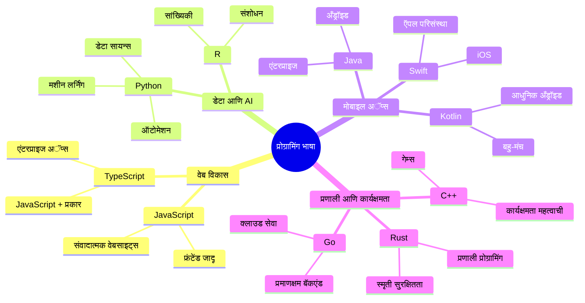
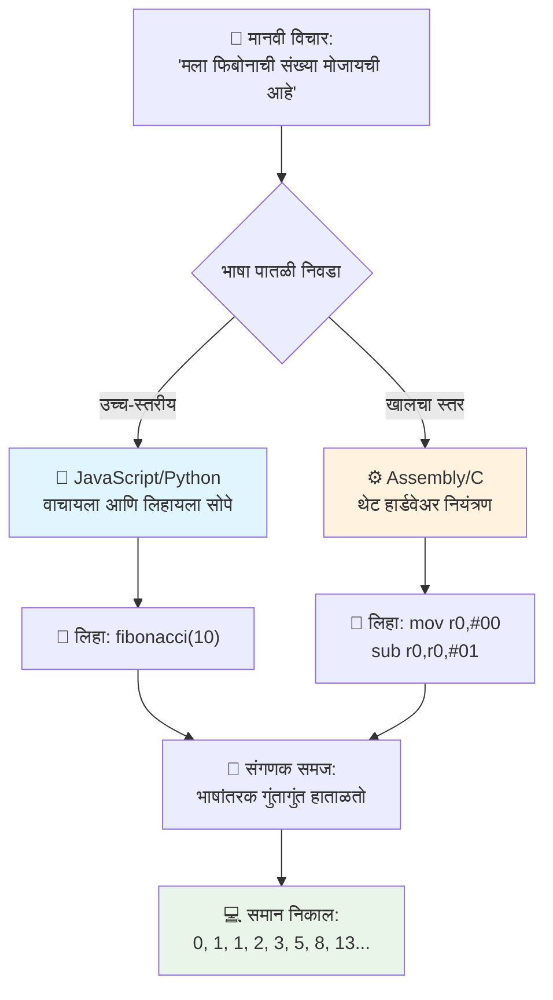
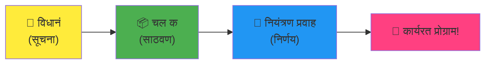
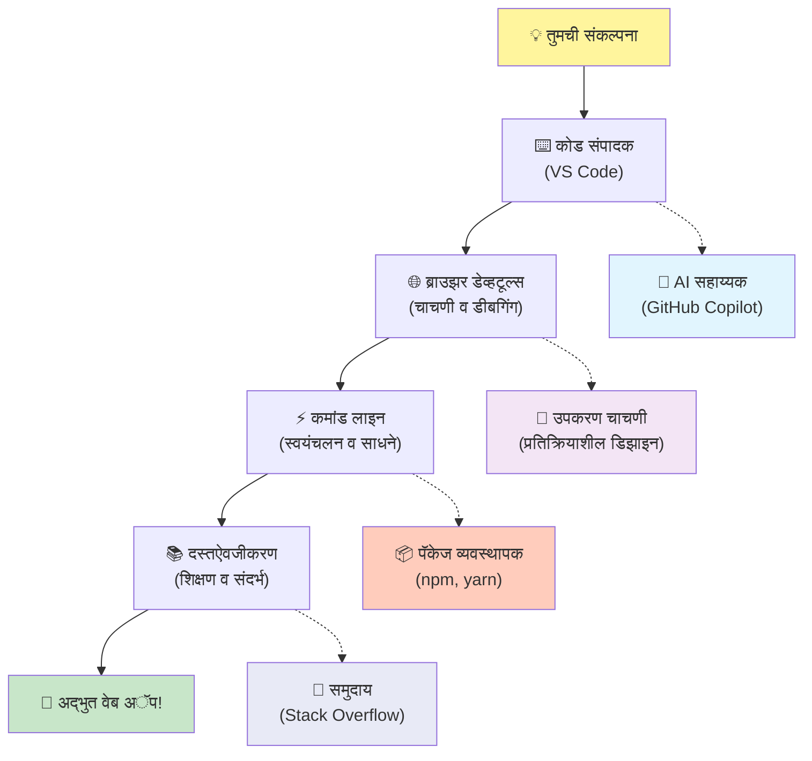
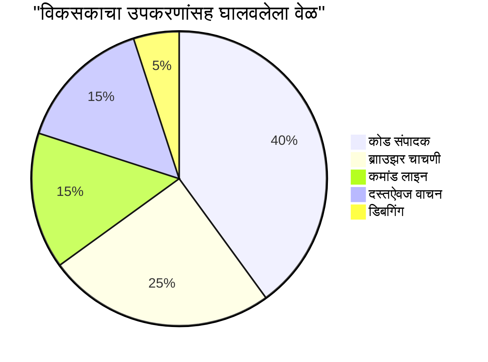
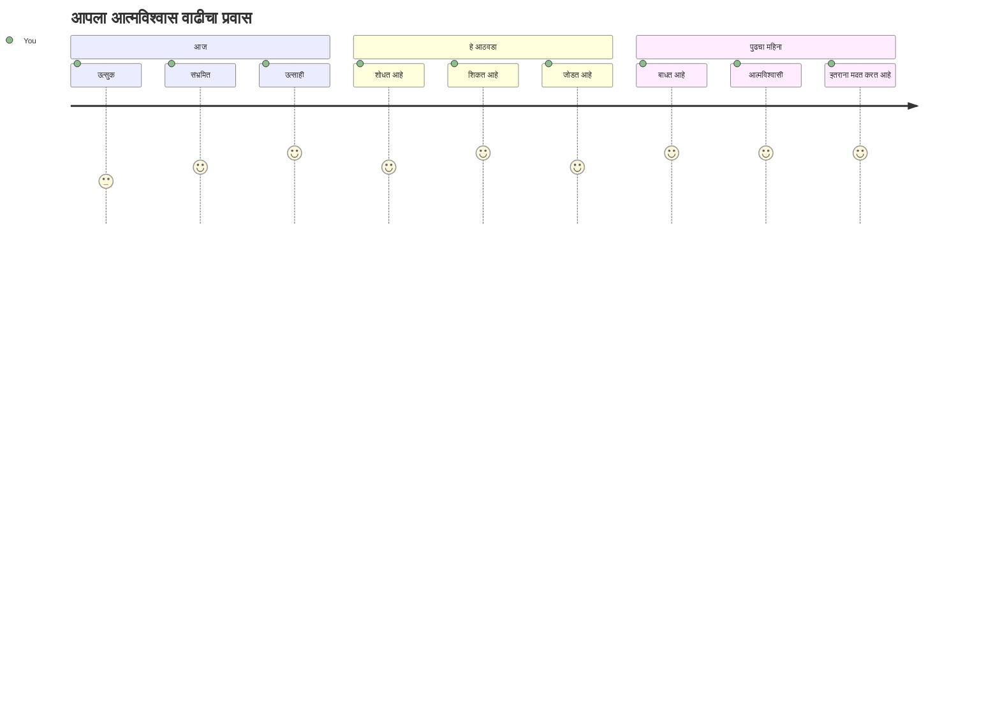

# प्रोग्रामिंग भाषा आणि आधुनिक डेव्हलपर साधनांची ओळख

हाय, भावी डेव्हलपर! 👋 मला तुला काहीतरी सांगू का जे मला दररोज थरकापून टाकते? तुला लवकरच कळेल की प्रोग्रामिंग हे फक्त संगणकांबद्दल नाही – तर ही खरी सुपरपॉवर आहे ज्यामुळे तू आपल्या कल्पनांना जिवंत करू शकतोस!

तू जेव्हा तुझा आवडता अ‍ॅप वापरत असतोस आणि सर्व काही परफेक्ट बसते तेव्हा तुला तो क्षण आठवतो का? जेव्हा तू एखाद्या बटणावर टॅप करतोस आणि एखादी जादू घडते जिचं तू विचार करतोस "वा, त्यांनी ते कसं केलं?" बरं, त्या जादूचा कोड मी किंवा तूसारखा कोणीतरी लिहिला आहे – कदाचित २ वाजता कॉफी शॉपमध्ये बसून तिसर्‍या एस्प्रेसो सोबत! आणि हेच गमतीदार आहे: या धड्याच्या शेवटी तू फक्त समजून घेणार नाहीस की त्यांनी कसं केलं, तर स्वतः प्रयत्न करण्याची तीव्र इच्छा होईल!

बघ, मला माहिती आहे, प्रोग्रामिंग सध्या अवघड वाटत असेल. मी जेव्हा सुरुवात केली तेव्हा मला वाटायचं की गणितात मस्तच तज्ञ असावा किंवा पाच वर्षांच्या वयापासूनच कोडिंग करत असावं लागेल. पण काहीतरी बदललं: प्रोग्रामिंग म्हणजे नवीन भाषा शिकण्यासारखं आहे. तू "हॅलो" आणि "थँक यू" पासून सुरुवात करतोस, मग कॉफी कशी मागायची यावर येतोस, आणि लवकरच गप्पा मोठ्या खोलवर चालायला लागतात! इथे तू संगणकांशी संवाद करतोस, आणि ते खूप धीर धरून ऐकणारे असतात – कुठल्याही चुका पाहून कधीही रागवत नाहीत आणि नेहमी पुन्हा प्रयत्न करायला तयार असतात!

आज आपण आधुनिक वेब डेव्हलपमेंट सुलभ आणि अत्यंत आकर्षक बनणार्‍या अविश्वसनीय साधनांचा अभ्यास करणार आहोत. मी म्हणतोय नेमके असेच एडिटर्स, ब्राउझर्स आणि कार्यप्रवाह ज्यांचा वापर Netflix, Spotify आणि तुझ्या आवडत्या इंडी अ‍ॅप स्टुडिओमध्ये दररोज केला जातो. आणि ही बाब तुला आनंदाने नाचायला लावणार आहे: बहुतेक व्यावसायिक दर्जाच्या औद्योगिक प्रमाणित साधनांवर संपूर्णपणे मोफत उपलब्ध आहेत!


> स्केच नोट [टोमोमी इमुरा](https://twitter.com/girlie_mac) यांनी


```mermaid
journey
    title तुमचा प्रोग्रामिंग प्रवास आज
    section शोधा
      प्रोग्रामिंग म्हणजे काय: 5: You
      प्रोग्रामिंग भाषा: 4: You
      उपकरणांचा आढावा: 5: You
    section अन्वेषण करा
      कोड संपादक: 4: You
      ब्राउझर आणि डेव्हटूल्स: 5: You
      कमांड लाइन: 3: You
    section सराव करा
      भाषा शोधक: 4: You
      उपकरणांचा अन्वेषण: 5: You
      समुदाय कनेक्शन: 5: You
```
## चला पाहूया, तुला आधीपासून काय माहित आहे!

मजेशीर गोष्टींकडे उडी मारण्याआधी, मला कुतूहल आहे – तुला या प्रोग्रामिंग जगाबद्दल आधीपासून काय माहित आहे? आणि ऐका, जर तुला या प्रश्नांकडे बघत "मला याबद्दल खरंच काहीच कल्पना नाही," असं वाटत असेल, तर ते बिलकुल ठीक आहे, अगदी परफेक्ट आहे! म्हणजे तू नक्कीच योग्य ठिकाणी आहेस. या क्विझला व्यायामापूर्वीच्या स्ट्रेचिंगसारखं समजा – आपण केवळ आपल्या मेंदूच्या स्नायूंना गरम करत आहोत!

[प्रि-लेसन क्विझ घ्या](https://ff-quizzes.netlify.app/web/)

## आपण एकत्र जाणार आहोत अशी साहसी यात्रा

ठीक आहे, मी खरोखरच उत्सुक आहे आपण आज काय शिकणार आहोत याबद्दल! खरंच, तुला आश्चर्य वाटेल जेव्हा काही संकल्पना तुझ्या मनात बसतील तेव्हा तुझा चेहरा कसा दिसेल. आपण एकत्र जाणार आहोत अशा अद्भुत प्रवासात:

- **प्रोग्रामिंग म्हणजे काय खरं तर (आणि हे का अतिशय छान आहे!)** – आपण शोधणार आहोत की कोड हे खरंच न दिसणं जादूचं सार आहे, जे तुझ्या आजूबाजूच्या प्रत्येक गोष्टींना ऊर्जा देतं, त्या अलार्मपासून ज्याला कळतं सोमवार आहे, तेथून ते अल्गोरिदमपर्यंत जो थेट तुझ्या Netflix शिफारशी अचूक बनवतो
- **प्रोग्रामिंग भाषा आणि त्यांची अद्भुत वैयक्तिक वैशिष्ट्ये** – एक पार्टीसमोर उभे राहण्यासारखं, जिथे प्रत्येक व्यक्तीकडे वेगळ्या प्रकारच्या सुपरपॉवर्स आणि समस्यांना सोडवण्याच्या पद्धती असतात. प्रोग्रामिंग भाषांचा एक असाच जग आहे, आणि तू त्यांच्याशी भेटायला तयार राह!
- **डिजिटल जादू घडवणारे मूलभूत घटक** – हे एका अतिशय क्रिएटिव्ह LEGO सेटसारखे आहेत. जेव्हा तुला कळेल की ही तुकडे कसे जुळवायचे, तेव्हा तू खरंच काहीही बांधू शकतोस जो तुझ्या कल्पनेत आला!
- **प्रोफेशनल टूल्स जे तुला जणू काही जादूगाराची छडी हातात दिल्यासारखा अनुभव देतील** – मी दृश्यमानपणे ड्रॅमॅटिक नाही आहे – ही साधने खरंच तुला सुपरपॉवरसारखा वाटतील, आणि तीच भारी गोष्ट आहे की हेच टूल्स प्रोफेशनल्स वापरतात!

> 💡 **महत्त्वाचं:** आज सगळं लक्षात ठेवण्याचा विचार करूही नकोस! सध्या, मला तुला फक्त शक्यतांचा उत्साह वाटावा एव्हा हवं आहे. तपशील नैसर्गिकपणे चिकटतील जेव्हा आपण एकत्र सराव करू – तसंच खरी शिकवण होते!

> हा धडा [Microsoft Learn](https://learn.microsoft.com/en-us/learn/modules/web-development-101/introduction-programming/?WT.mc_id=academic-77807-sagibbon) वरही घेऊ शकतो!

## मग प्रोग्रामिंग म्हणजे काय?

बरं, चला हा लाखो डॉलर्सचा प्रश्न सोडवूया: प्रोग्रामिंग खरतर काय आहे?

मी एक गोष्ट सांगतो ज्यामुळे माझं याबद्दलचं विचार पूर्णपणे बदलला. गेल्या आठवड्यात मी माझ्या आईला आमच्या नवीन स्मार्ट टीव्ही रिमोट वापरायला सांगायचं प्रयत्न करत होतो. मी स्वतःला म्हणत होतो "लाल बटण दाब, पण मोठं लाल बटण नाही, डावीकडील छोटं लाल बटण... नाही, तुझा दुसरा डावा... ठीक आहे, आता ते दोन सेकंद धर, एक नाही, तीन नाही..." तुला हे सवयिनसारखं वाटलं का? 😅

तेच आहे प्रोग्रामिंग! अतिशय तपशीलवार, चरण-दर-चरण सूचनांचा कला, जे खूप सामर्थ्यशाली असलेल्या घटकाला दिल्या जातात पण सगळं अचूक लिहावं लागतं. आईला सांगण्याऐवजी (जी विचारू शकते "कोणतं लाल बटन?!"), आपण संगणकाला सांगतो (जो फक्त तेच करतो जे आपण सांगतो, जरी ते कदाचित आपण म्हणाल ते नसेल तरी).

जेव्हा मी हे प्रथम शिकलो तेव्हा मला खरंच भास झालं: संगणक其实 बेसिकली फार सोपे असतात. ते फक्त दोन गोष्टी समजतात – १ आणि ०, म्हणजे "हो" आणि "नाही" किंवा "ऑन" आणि "ऑफ". इतकंच! पण जादू येथे सुरू होते – आम्हाला १ आणि ० मध्ये बोलायची गरज नाही जणू आपण मेट्रिक्समध्ये आहोत. या ठिकाणी **प्रोग्रामिंग भाषा** मदतीला येतात. त्या जणू असा जगातील सर्वोत्तम भाषांतरकार आहेत जे आपले मानवी विचार संगणकांच्या भाषेत रूपांतरित करतात.

आणि ही गोष्ट जी दररोज सकाळी मला थरकत राहते: तुझ्या आयुष्यातील सर्व डिजिटल गोष्टी नेमक्या तुझ्यासारख्या कोणीतरी कोडिंग करत बनवल्या. तो Instagram फिल्टर जो तुला फॉललेस बनवतो? कोणी तो कोड केलेला. ती शिफारस जी तुला तुझा आवडता नवीन गाण्याकडे नेते? एक डेव्हलपरने ती अल्गोरिदम तयार केली. जी अ‍ॅप ज्यामुळे मित्रांमध्ये जेवणाचे बिल वाटायला मदत होते? होय, कोणीतरी विचार केला "हे कंटाळवाणं आहे, मी नक्की याला ठीक करू शकतो" आणि मग... त्यांनी काय केलं!

जेव्हा तू प्रोग्रामिंग शिकतोस, तू फक्त एक नवीन कौशल्य घेत नाहीस – तू या भव्य समस्यांवर मात करण्याऱ्या समुदायाचा भाग बनतोस ज्यांचे दिवस "जर मी काहीतरी तयार केला तर एखाद्याचा दिवस थोडासा अधिक उजळ होईल का?" म्हणून विचार करत जातात. खरंच, यापेक्षा छान काही असू शकतं का?

✅ **मजेशीर साचणी शोध:** जेव्हा तुला काही वेळ मिळेल तेव्हा ही गोष्ट शोध – जगातील पहिला संगणक प्रोग्रामर कोण होता? मी तुला एक हिन्ट देतो: तो कदाचित तुझ्या अपेक्षेप्रमाणे नसेल! त्या व्यक्तीचा कथानक खूप रोचक आहे आणि दाखवतो की प्रोग्रामिंग नेहमीच सर्जनशील समस्या सोडवण्याविषयी आणि वेगळ्या दृष्टीकोनातून विचार करण्याविषयी आहे.

### 🧠 **चेक-इन वेळ: तू कसा/कशी वाटत आहेस?**

**काही वेळ स्वतःशी विचार कर:**
- "संगणकांना सूचना देणे" ही कल्पना आता तुला समजते का?
- दिवसेंदिवस करावयाचे कोणते काम तुझ्या दृष्टीने प्रोग्रामिंगने स्वयंचलित करता येईल का?
- या संपूर्ण प्रोग्रामिंग विषयावर तुला काय प्रश्न मनात येत आहेत?

> **लक्षात ठेव:** काही संकल्पना सध्या अस्पष्ट वाटणे अगदी सामान्य आहे. प्रोग्रामिंग शिकणं म्हणजे नवीन भाषा शिकण्यासारखं आहे – तुझे मेंदू त्या न्यूरल मार्गांना तयार करण्यासाठी वेळ घेतो. तू मस्त करत आहेस!

## प्रोग्रामिंग भाषा म्हणजे वेगवेगळ्या प्रकारच्या जादू सारख्या आहेत

ठीक आहे, हे थोडं वेगळं वाटेल पण माझ्या सोबत राहा – प्रोग्रामिंग भाषा म्हणजे वेगवेगळ्या प्रकारच्या संगीतासारखं आहे. विचार कर: तुझ्याकडे जाझ आहे, जी मृदू आणि तात्काळ संगीत स्वरूपाची आहे, रॉक जी शक्तिशाली आणि सरळ असते, क्लासिकल जी सुंदर आणि रचित आहे, आणि हिप-हॉप जी क्रिएटिव्ह आणि अभिव्यक्तीशील आहे. प्रत्येक शैलीची स्वतःची अदा, त्या समुदायातील चाहत्यांची पट्टी, आणि प्रत्येक काहीही भिन्न मूड किंवा प्रसंगी पूर्णपणे योग्य असते.

प्रोग्रामिंग भाषा तसा कार्य करतात! एक वेगळी भाषा तेव्हा वापरली जाते जेव्हा तू मजेदार मोबाइल गेम बनवतोस आणि दुसरी भाषा मोठ्या प्रमाणातील हवामान डेटा प्रक्रिया करण्यासाठी वापरतोस, जसं आपल्याला योगा वर्गात डेथ मेटल बजवायचं नाही (बऱ्याच योगा वर्गांमध्ये तरी! 😄).

पण जेव्हा मी याबद्दल विचार करतो तेव्हा मला नेहमीच आश्चर्य वाटतं: या भाषा जणू सर्वात धीर धरून, प्रतिभावान अनुवादक अंगावर बसलेले आहेत. तू आपल्या नैसर्गिक मानवी मेंदूने विचार करू शकतोस आणि ते प्रचंड क्लिष्ट 1s आणि 0s मध्ये अनुवाद करतात जे संगणक स्पष्टपणे बोलतात. जणू तुझा सखा आहे जो दोन्ही "माणूस क्रिएटिव्हिटी" आणि "संगणकाचे तर्कशास्त्र" मध्ये पारंगत आहे – आणि तो/ती कधी थकते नाही, कधी कॉफी ब्रेक बाजूला ठेवत नाही आणि दोन वेळा विचारल्यावर कधीही तुझ्यावर खटाटोण करत नाही!

### लोकप्रिय प्रोग्रामिंग भाषा आणि त्यांचे उपयोग


```mermaid
mindmap
  root((प्रोग्रामिंग भाषा))
    वेब विकास
      JavaScript
        फ्रंटेंड जादू
        संवादात्मक वेबसाइट्स
      TypeScript
        JavaScript + प्रकार
        एंटरप्राइज अॅप्स
    डेटा आणि AI
      Python
        डेटा सायन्स
        मशीन लर्निंग
        ऑटोमेशन
      R
        सांख्यिकी
        संशोधन
    मोबाइल अॅप्स
      Java
        अँड्रॉइड
        एंटरप्राइज
      Swift
        iOS
        ऍपल परिसंस्था
      Kotlin
        आधुनिक अँड्रॉइड
        बहु-मंच
    प्रणाली आणि कार्यक्षमता
      C++
        गेम्स
        कार्यक्षमता महत्वाची
      Rust
        स्मृती सुरक्षितता
        प्रणाली प्रोग्रामिंग
      Go
        क्लाउड सेवा
        प्रमाणक्षम बॅकएंड
```
| भाषा | सर्वोत्तम वापर | का ही लोकप्रिय आहे |
|----------|---------------------|-------------------------|
| **JavaScript** | वेब डेव्हलपमेंट, वापरकर्ता इंटरफेस | ब्राउझरमध्ये चालतं आणि इंटरऍक्टिव्ह वेबसाईटना सामर्थ्य देतं |
| **Python** | डेटा सायन्स, ऑटोमेशन, AI | शिकायला आणि वाचायला सोपी, सामर्थ्यशाली लायब्ररी |
| **Java** | उद्योग अनुप्रयोग, अँड्रॉइड अ‍ॅप्स | प्लॅटफॉर्म-स्वतंत्र, मोठ्या सिस्टमसाठी मजबूत |
| **C#** | विंडोज अनुप्रयोग, गेम डेव्हलपमेंट | स्ट्रॉंग मायक्रोसॉफ्ट इकोसिस्टम सपोर्ट |
| **Go** | क्लाउड सेवा, बॅकएंड सिस्टम्स | जलद, साधी, आधुनिक संगणनासाठी डिझाइन केलेली |

### उच्च-स्तरीय vs. नीच-स्तरीय भाषा

ठीक आहे, हा खरंच मला एवढा गुंतवणारा विषय होता जेव्हा मी सुरुवात केली, म्हणून मी ती रूपक थोडक्यात शेअर करतो जी मला मग समजली – आणि मला आशा आहे ती तुलाही समजेल!

कल्पना कर की तू एका देशात आहेस जिथे भाषा तुझी नाही आणि तुला गर्दीतली जवळची शौचालय शोधायचं आहे (आपण सगळ्यांनी कधीतरी असं अनुभवलंय, बरोबर ना? 😅):

- **नीच-स्तरीय प्रोग्रामिंग** म्हणजे त्या देशातील स्थानिक बोली इतकी चांगली शिकणे की तिथल्या आजीला फळ विकणाऱ्या लोकांशी सांस्कृतिक संदर्भ, स्थानिक बोल चाल आणि त्यांचं खास विनोद वापरून गप्पा मारायला हरकत नाही. खूप प्रभावी आणि कार्यक्षम... जर तुला ती भाषा येत असेल तर! पण शौचालय शोधायचं होतं तर फारच भयंकर वाटेल.

- **उच्च-स्तरीय प्रोग्रामिंग** म्हणजे तो उत्तम स्थानिक मित्र ज्याला फक्त तुला हवं ते समजतं. तू "मला लगेच शौचालय हवं आहे" इंग्रजीत बोलतोस आणि तो सर्व सांस्कृतिक अनुवाद करतो आणि तुला मार्गदर्शन सोप्या भाषेत करतो.

प्रोग्रामिंग टर्म्समध्ये:
- **नीच-स्तरीय भाषा** (Assembly किंवा C सारखी) तुला संगणकाच्या हार्डवेअरशी अत्यंत तपशीलवार संवाद साधू देतात, पण तुला मशीनसारखं विचार करणं लागतं, जे... बरं, मोठा मेंदूचा बदल आहे!
- **उच्च-स्तरीय भाषा** (JavaScript, Python, किंवा C# सारख्या) तुला माणूस म्हणून विचार करायला देतात आणि तो संगणकांचा कान आणि आवाज होतात. तसेच, यांच्याकडे सध्या अनुभव नसलेल्या लोकांना मदत करण्यासाठी आनंदी समुदाय असतो ज्याला माहित असतं नवख्या असण्याचा अनुभव कसा असतो!

काय वाटतं, मी तुला कोणत्या भाषांसह सुरुवात करण्याचा सल्ला देणार? 😉 उच्च-स्तरीय भाषा जणू ट्रेनींग व्हील्स प्रमाणे आहेत जे तू कधीही काढायचं इच्छित नाहीस कारण ते संपूर्ण अनुभव खूप मजेशीर करतात!


```mermaid
flowchart TB
    A["👤 मानवी विचार:<br/>'मला फिबोनाची संख्या मोजायची आहे'"] --> B{भाषा पातळी निवडा}
    
    B -->|उच्च-स्तरीय| C["🌟 JavaScript/Python<br/>वाचायला आणि लिहायला सोपे"]
    B -->|खालचा स्तर| D["⚙️ Assembly/C<br/>थेट हार्डवेअर नियंत्रण"]
    
    C --> E["📝 लिहा: fibonacci(10)"]
    D --> F["📝 लिहा: mov r0,#00<br/>sub r0,r0,#01"]
    
    E --> G["🤖 संगणक समज:<br/>भाषांतरक गुंतागुंत हाताळतो"]
    F --> G
    
    G --> H["💻 समान निकाल:<br/>0, 1, 1, 2, 3, 5, 8, 13..."]
    
    style C fill:#e1f5fe
    style D fill:#fff3e0
    style H fill:#e8f5e8
```
### तुला दाखवतो की उच्च-स्तरीय भाषा का जास्त स्नेही आहेत

ठीक आहे, मी तुला काही दाखवणार आहे जे मला उच्च-स्तरीय भाषा का आवडल्या हे समजावेल, पण आधी एक वचन दे – जेव्हा तुझा पहिला कोड्स हे दाखवेल, घाबरू नकोस! हे थोडं भयंकर दिसावं असं मला वाटतं आणि हेच मुद्दा आहे!

आपण दोन वेगळ्या शैलींमध्ये लिहिलेला तोच फिबोनाची अनुक्रम पाहणार आहोत – तो एक सुंदर गणितीय क्रम आहे जिथे प्रत्येक संख्या मागच्या दोन संख्यांचा योग आहे: 0, 1, 1, 2, 3, 5, 8, 13... (मजेशीर गोष्ट: तू हा क्रम निसर्गात सर्वत्र पाहशील – सूर्यफुलाच्या बिया, कंसाच्या नमुन्यात, अगदी आकाशगंगांच्या निर्मितीतही!)

तयार आहेस फरक पाहायला? चल!

**उच्च-स्तरीय भाषा (JavaScript) – माणसासाठी सुलभ:**

```javascript
// टप्पा 1: मूलभूत फिबोनॅची सेटअप
const fibonacciCount = 10;
let current = 0;
let next = 1;

console.log('Fibonacci sequence:');
```

**हा कोड काय करतो:**
- **घोषणा** करतो की आपल्याला किती फिबोनाची संख्या तयार करायच्या आहेत
- **दोन व्हेरिएबल्स** सुरू करतो जे चालू आणि पुढच्या संख्यांवर लक्ष ठेवतात
- **सुरुवातीच्या मूल्यांना सेट** करतो (0 आणि 1) जे फिबोनाची पॅटर्न निश्चित करतात
- **हेडर संदेश** प्रदर्शित करतो जे आपल्या आउटपुटची ओळख पटवतो

```javascript
// टप्पा 2: लूपसह अनुक्रम तयार करा
for (let i = 0; i < fibonacciCount; i++) {
  console.log(`Position ${i + 1}: ${current}`);
  
  // अनुक्रमातील पुढचा क्रमांक गणना करा
  const sum = current + next;
  current = next;
  next = sum;
}
```

**येथे काय घडत आहे याचे विश्लेषण:**
- `for` लूप वापरून अनुक्रमातील प्रत्येक स्थानावर फेरफटका मारतो
- टेम्प्लेट लिटरल फॉरमॅटिंगने प्रत्येक संख्या त्याच्या स्थानासहित दर्शवितो
- चालू आणि पुढच्या मूल्यांच्या बेरीजने पुढची फिबोनाची संख्या गणना करतो
- आपले ट्रॅकिंग व्हेरिएबल्स पुढील फेरफटक्यासाठी अपडेट करतो

```javascript
// पाऊल 3: आधुनिक कार्यात्मक पध्दत
const generateFibonacci = (count) => {
  const sequence = [0, 1];
  
  for (let i = 2; i < count; i++) {
    sequence[i] = sequence[i - 1] + sequence[i - 2];
  }
  
  return sequence;
};

// वापराचे उदाहरण
const fibSequence = generateFibonacci(10);
console.log(fibSequence);
```

**वर उल्लेखलेल्या मध्ये आपण:**
- आधुनिक अ‍ॅरो फंक्शन सिंटॅक्स वापरून पुनर्वापर करण्यार्‍या फंक्शनची निर्मिती केली
- संपूर्ण अनुक्रम साठवण्यासाठी एक ऍरे तयार केला, एकेका नंबरला वेगळं प्रदर्शित न करता
- मागील मूल्यांचा वापर करून प्रत्येक नवीन नंबर गणकासाठी ऍरे इंडेक्सिंग केली
- आमच्या प्रोग्रामच्या इतर भागांत लवचिक वापरासाठी संपूर्ण अनुक्रम परत केला

**नीच-स्तरीय भाषा (ARM Assembly) – संगणकासाठी सुसंगत:**

```assembly
 area ascen,code,readonly
 entry
 code32
 adr r0,thumb+1
 bx r0
 code16
thumb
 mov r0,#00
 sub r0,r0,#01
 mov r1,#01
 mov r4,#10
 ldr r2,=0x40000000
back add r0,r1
 str r0,[r2]
 add r2,#04
 mov r3,r0
 mov r0,r1
 mov r1,r3
 sub r4,#01
 cmp r4,#00
 bne back
 end
```

पाहा, JavaScript आवृत्ती जवळजवळ इंग्रजी निर्देशांसारखी वाचते, तर Assembly आवृत्तीमध्ये गूढ आज्ञा आहेत ज्या थेट संगणकाच्या प्रोसेसरवर नियंत्रण ठेवतात. दोन्ही एकच काम करतात, पण उच्च-स्तरीय भाषा मानवी समजण्यासाठी, लिहिण्यासाठी आणि राखण्या साठी सोपी आहे.

**मुख्य फरक जे तुला लक्षात येतील:**
- **वाचनीयता**: JavaScript मध्ये सारखे नाव   `fibonacciCount` वापरले जाते, तर Assembly मध्ये गूढ टॅग्ज जसे `r0`, `r1` वापरले जातात  
- **टिप्पण्या**: उच्च-स्तरीय भाषा स्पष्टीकरणात्मक टिप्पणी प्रोत्साहित करतात ज्यामुळे कोड स्वतःचा दस्तऐवज बनतो  
- **रचना**: JavaScript चे तर्कशास्त्रीय प्रवाह माणसांच्या विचारप्रक्रियेप्रमाणे क्रमवारीतल्या टप्यांनुसार जुळतो  
- **देखभाल**: वेगवेगळ्या गरजांसाठी JavaScript आवृत्ती अद्यतन करणे सोपे आणि स्पष्ट असते  

✅ **फिबोनाची अनुक्रमाबद्दल**: हा अत्यंत सुंदर संख्या नमुना (जिथे प्रत्येक संख्या दोन मागील संख्या बेरीज असते: 0, 1, 1, 2, 3, 5, 8...) निसर्गात अक्षरशः *सर्वत्र* दिसतो! तुम्हाला तो सूर्यफूलांच्या वर्तुळात, देवदाराच्या कळीच्या नमुन्यात, नॉटिलस शंखाच्या वाकण्यात, आणि अगदी वृक्षांच्या फांद्यांच्या वाढीतही दिसेल. गणित आणि कोड कसे आपणास निसर्गात वापरलेल्या नमुन्यांना समजून घेण्यास आणि पुनरुज्जीवित करण्यास मदत करतात हे पाहणं खूप आश्चर्यकारक आहे!  

## जादू घडवणारे मूलभूत घटक  

ठीक आहे, आता तुम्ही प्रोग्रामिंग भाषा कसे दिसतात ते पाहिलात, तर चला अक्षरशः प्रत्येक कोडमध्ये असणाऱ्या मूलभूत तुकड्यांचा तफावत करुया. हे तुमच्या आवडत्या रेसिपीमधल्या आवश्यक घटकांसारखे समजा – जेव्हा तुम्हाला ते काय करतात हे समजेल, तेव्हा तुम्ही कुठल्याही भाषेमध्ये कोड वाचू आणि लिहू शकाल!  

हे प्रोग्रामिंगची व्याकरण शिकण्यासारखे आहे. आठवा शाळेत जेव्हा तुम्ही नाम, क्रियापद, आणि वाक्य कसे तयार करायचे ते शिकलात? प्रोग्रामिंगचेही स्वतःचे व्याकरण आहे, आणि खरंच ते इंग्रजी व्याकरणापेक्षा खूप अधिक तर्कशुद्ध आणि मोकळे आहे! 😄  

### विधान: टप्प्यानुसार सूचना  

चला **विधानांपासून** सुरुवात करूया – हे तुमच्या संगणकाशी संवादातील वैयक्तिक वाक्यांसारखे आहेत. प्रत्येक विधान संगणकाला एक विशिष्ट काम करण्यास सांगते, जसे "येथे डावीकडे वळा," "लाल दिव्यावर थांबा," "त्या जागी पार्क करा."  

मला विधानांबद्दल जे आवडते ते म्हणजे त्यांची वाचनीयता. हा पहा:  

```javascript
// मूलभूत विधान जी एकल क्रिया करतात
const userName = "Alex";                    
console.log("Hello, world!");              
const sum = 5 + 3;                         
```
  
**हा कोड काय करतो:**  
- वापरकर्त्याचे नाव संग्रहित करण्यासाठी एक स्थिर चल जाहीर करा  
- कन्सोल आउटपुटमध्ये अभिवादन संदेश दर्शवा  
- एक गणितीय क्रिया करून निकाल संग्रहित करा  

```javascript
// वेब पृष्ठांशी संवाद साधणारे स्टेटमेंट्स
document.title = "My Awesome Website";      
document.body.style.backgroundColor = "lightblue";
```
  
**टप्प्यानुसार काय घडत आहे:**  
- ब्राउझर टॅबमधील वेबपेज शीर्षक बदला  
- संपूर्ण पृष्ठाच्या पार्श्वभूमीचा रंग बदला  

### चल (Variables): तुमच्या प्रोग्रॅमची स्मृती प्रणाली  

ठीक आहे, **चल** हा माझ्या शिकवायच्या आवडत्या संकल्पनांपैकी एक आहे कारण ते रोज तुम्ही वापरत असलेल्या गोष्टींसारखे आहेत!  

तुमच्या फोनच्या संपर्क यादीबद्दल विचार करा. तुम्ही प्रत्येकाचा फोन नंबर लक्षात ठेवत नाही – त्याऐवजी "आई," "सर्वोत्तम मित्र," किंवा "रात्री २ वाजेपर्यंत पिझ्झा देणारे ठिकाण" अशी नावे संग्रहित करता आणि फोन वास्तविक नंबर लक्षात ठेवतो. चलही अगदी तसेच कार्य करतात! ते लेबल केलेले कंटेनरसारखे असतात जेथे तुमच्या प्रोग्रॅमला माहिती संग्रहित करता येते आणि नंतर नाव वापरून ती परत मिळवू शकतो.  

हे खूपच छान आहे: चल प्रोग्रॅम चालू असताना बदलू शकतात (म्हणून त्यांना "variables" म्हणतात – समजले का?). जसे तुम्ही नवीन काहीतरी शोधल्यावर पिझ्झा पॅलेसचा संपर्क अपडेट करता तसेच, चल नवीन माहिती मिळाल्यावर किंवा परिस्थिती बदलल्यावर अपडेट होतील!  

हे कसे सोपे आणि सुंदर आहे ते दाखवू:  

```javascript
// टप्पा 1: मूलभूत चल तयार करणे
const siteName = "Weather Dashboard";        
let currentWeather = "sunny";               
let temperature = 75;                       
let isRaining = false;                      
```
  
**ही संकल्पना समजून घ्या:**  
- `const` मध्ये अपरिवर्तनीय मूल्य संग्रहित करा (जसे साइट नाव)  
- जे बदलू शकतात अशा मूल्यांसाठी `let` वापरा  
- भिन्न डेटा प्रकार सांगा: स्ट्रिंग (टेक्स्ट), संख्या, आणि बुलियन (खरे/खोटे)  
- वर्णनात्मक नावे निवडा जी प्रत्येक चलात काय आहे ते स्पष्ट करतात  

```javascript
// पाऊल 2: संबंधित डेटाला गटबद्ध करण्यासाठी ऑब्जेक्टसह काम करणे
const weatherData = {                       
  location: "San Francisco",
  humidity: 65,
  windSpeed: 12
};
```
  
**वरील मध्ये, आम्ही:**  
- संबंधित हवामान माहिती एकत्र करण्यासाठी एक ऑब्जेक्ट तयार केला  
- अनेक डेटा तुकडे एका चलाखाली आयोजित केले  
- प्रत्येक माहितीचा स्पष्ट लेबल करणारे की-वॅल्यू जोडले  

```javascript
// टप्पा 3: बदलणाऱ्या चलांचा वापर आणि अद्यतन करणे
console.log(`${siteName}: Today is ${currentWeather} and ${temperature}°F`);
console.log(`Wind speed: ${weatherData.windSpeed} mph`);

// बदलण्यायोग्य चल अद्यतनित करणे
currentWeather = "cloudy";                  
temperature = 68;                          
```
  
**प्रत्येक भाग समजून घेऊ:**  
- `${}` टेम्पलेट लिटरल्स वापरून माहिती दर्शवा  
- डॉट नोटेशन (`weatherData.windSpeed`) वापरून ऑब्जेक्टच्या गुणधर्मांपर्यंत पोहोचा  
- `let` मध्ये जाहीर केलेले चल अद्यतनित करा जे बदलत्या परिस्थिती दर्शवते  
- अनेक चल एकत्र करून अर्थपूर्ण संदेश तयार करा  

```javascript
// चरण ४: स्वच्छ कोडसाठी आधुनिक विघटन
const { location, humidity } = weatherData; 
console.log(`${location} humidity: ${humidity}%`);
```
  
**तुम्हाला काय माहिती असणे आवश्यक आहे:**  
- ऑब्जेक्टमधून विशिष्ट गुणधर्म डेस्ट्रक्चरिंग असाइनमेंट वापरून काढा  
- ऑब्जेक्ट कींसारखी नावे असणारे नवीन चल स्वयंचलितपणे तयार करा  
- पुनरावृत्ती होणारे डॉट नोटेशन टाळून कोड सुलभ करा  

### नियंत्रण प्रवाह: तुमच्या प्रोग्रामला विचार करायला शिकवा  

ठीक आहे, प्रोग्रामिंग खरोखरच आश्चर्यकारक ठरत आहे! **कंट्रोल फ्लो** म्हणजे तुमच्या प्रोग्रामला हुशार निर्णय घ्यायला शिकवणे, अगदी तुम्ही दिवसेंदिवस न विचारता जे करत असता तसंच.  

या कल्पनेचा विचार करा: आज सकाळी कदाचित तुम्ही "जर पाऊस येत असेल तर मी छत्री घेईन. जर थंडी असेल तर जॅकेट घालीन. जर उशीर झाला तर नाश्ता सोडून कॉफी घेईन" असं ठरवलं असेल. तुमचा मेंदू रोज शेकडो वेळा या if-then लॉजिकचा वापर करतो!  

हेच प्रोग्राम्सना हुशार आणि जिवंत वाटण्यास कारणीभूत ठरते, फक्त कंटाळवाणा, पूर्वकल्पित स्क्रिप्ट प्रमाणे नाही. ते प्रत्यक्षात परिस्थिती बघून, काय सुरू आहे ते मूल्यांकन करून, योग्य प्रतिसाद देतात. जणू एखाद्या मेंदूची भुमिका तुमच्या प्रोग्रामला दिली आहे जो परिस्थितीनुसार निर्णय घेतो!  

हे कसे सुंदर काम करते ते बघूया:  

```javascript
// टप्पा 1: मूलभूत सशर्त तर्कशास्त्र
const userAge = 17;

if (userAge >= 18) {
  console.log("You can vote!");
} else {
  const yearsToWait = 18 - userAge;
  console.log(`You'll be able to vote in ${yearsToWait} year(s).`);
}
```
  
**हा कोड काय करतो:**  
- वापरकर्त्याच्या वयाची मतदानासाठी पात्रता तपासा  
- अटीच्या परिणामानुसार विविध कोड ब्लॉक्स चालवा  
- १८ पेक्षा कमी असल्यास मतदान पात्र होईपर्यंत किती वेळ लागेल हे गणना करा आणि दर्शवा  
- प्रत्येक परिस्थितीसाठी विशेष, उपयुक्त अभिप्राय द्या  

```javascript
// टप्पा 2: लॉजिकल ऑपरेटरसह अनेक अटी
const userAge = 17;
const hasPermission = true;

if (userAge >= 18 && hasPermission) {
  console.log("Access granted: You can enter the venue.");
} else if (userAge >= 16) {
  console.log("You need parent permission to enter.");
} else {
  console.log("Sorry, you must be at least 16 years old.");
}
```
  
**येथे काय घडते ते तपासूया:**  
- `&&` (आणि) ऑपरेटर वापरून अनेक अटी एकत्र करा  
- अनेक परिस्थितींसाठी `else if` ने अटींचे श्रेणीकरण करा  
- अंतिम `else` विधानाद्वारे सर्व शक्य परिस्थिती हाताळा  
- प्रत्येक वेगवेगळ्या परिस्थितीसाठी स्पष्ट आणि कृतीक्षम अभिप्राय द्या  

```javascript
// पाऊल 3: टर्नरी ऑपरेटरसह संक्षिप्त अटीसंगत विधान
const votingStatus = userAge >= 18 ? "Can vote" : "Cannot vote yet";
console.log(`Status: ${votingStatus}`);
```
  
**लक्षात ठेवा:**  
- सोप्या दोन पर्यायांसाठी टर्नरी ऑपरेटर (`? :`) वापरा  
- प्रथम अट लिहा, त्यानंतर `?`, योग्य परिणाम, `:` आणि नकारात्मक परिणाम लिहा  
- मूल्ये अटींवर आधारित असाइन करताना हा नमुना वापरा  

```javascript
// पाऊल ४: अनेक विशिष्ट प्रकरणांचे हाताळणी
const dayOfWeek = "Tuesday";

switch (dayOfWeek) {
  case "Monday":
  case "Tuesday":
  case "Wednesday":
  case "Thursday":
  case "Friday":
    console.log("It's a weekday - time to work!");
    break;
  case "Saturday":
  case "Sunday":
    console.log("It's the weekend - time to relax!");
    break;
  default:
    console.log("Invalid day of the week");
}
```
  
**हा कोड काय साध्य करतो:**  
- चल मूल्य अनेक विशिष्ट प्रकरणांशी जुळवा  
- समान प्रकरणे (कार्यदिवस विरुद्ध विकेंड) एकत्र करा  
- जुळणारी कोड ब्लॉक चालवा  
- अनपेक्षित मूल्ये हाताळण्यासाठी `default` केस समाविष्ट करा  
- पुढील प्रकरणाकडे जाण्यास `break` वापरा  

> 💡 **खरेदारी जीवनातील उपमा:** नियंत्रण प्रवाह म्हणजे जगातील आनंदी GPS जसे तुम्हाला दिशा सांगत असते. "जर मेन स्ट्रीटवर ट्राफिक असेल तर महामार्ग घ्या. जर रस्त्यावरील बांधकामामुळे महामार्ग आवरला असेल तर नयनरम्य मार्ग वापरा." प्रोग्राम्सही याच प्रकारची अटींची लॉजिक वापरतात वेगवेगळ्या परिस्थितींसाठी हुशार प्रतिसाद देण्यासाठी आणि वापरकर्त्यांना सर्वोत्तम अनुभव देण्यासाठी.  

### 🎯 **संकल्पना तपासणी: मूलभूत घटकांची प्रावीण्य**  

**बघूया तुम्ही मूलभूत गोष्टी कशा करत आहात:**  
- स्वतःच्या शब्दांत चल आणि विधान यातील फरक तुम्ही कसा स्पष्ट कराल?  
- एक खरेदारी जीवनातील उदाहरण जोडा, जिथे तुम्ही if-then निर्णय वापराल (जसे मतदान उदाहरणात दिलेले)  
- प्रोग्रामिंग लॉजिकमध्ये कोणती गोष्ट तुम्हाला आश्चर्यचकित केले?  

**त्वरित आत्मविश्वास वाढवण्यासाठी:**  

```mermaid
flowchart LR
    A["📝 विधानं<br/>(सूचना)"] --> B["📦 चल क<br/>(साठवण)"] --> C["🔀 नियंत्रण प्रवाह<br/>(निर्णय)"] --> D["🎉 कार्यरत प्रोग्राम!"]
    
    style A fill:#ffeb3b
    style B fill:#4caf50
    style C fill:#2196f3
    style D fill:#ff4081
```  
✅ **पुढे काय येणार आहे:** आपण या संकल्पनांमध्ये खोलवर जाऊन एक अप्रतिम सफर सुरू करणार आहोत! आत्ता फक्त या सर्व आश्चर्यजनक शक्यता पाहून उत्साहित व्हा. आम्ही एकत्र सराव केल्याने विशेष कौशल्ये आणि तंत्र आत्मसात होतील – मला विश्वास आहे की हे अपेक्षेपेक्षा खूपच मजेशीर ठरेल!  

## कामातील साधने  

ठीक आहे, खरं म्हणजे इथे मला इतकी उत्सुकता होते की मी स्वतःला रोखू शकत नाही! 🚀 आपण त्या अद्भुत साधनांविषयी बोलणार आहोत जे तुम्हाला डिजिटल अंतराळयानाची चावी दिली गेली असल्याचा अनुभव देतील.  

तुम्हाला माहित आहे का, शेफकडे तशा परिपूर्ण संतुलित छुरी असतात ज्या त्यांच्या हातांची पुढील वाढ वाटतात? संगीतज्ञाकडे एक गिटार होत असतो जो स्पर्श करताच गाण्याची सुरुवात करतो? असंच काहीसे विकसकांकडे देखील आहे, आणि अजून काय इतर ज्ञानापेक्षा जास्त आहे — त्यातील बहुतेक पूर्णपणे मोफत!  

मी या साधने तुम्हाला सांगताना खूप उत्साहित आहे कारण त्यामुळे आपण सॉफ्टवेअर तयार करण्याचा मार्ग पूर्णपणे बदलला आहे. आपण AI-चालित कोडिंग सहाय्यकांबद्दल बोलत आहोत जे तुमचा कोड लिहण्यास मदत करतात (खरंच!), क्लाऊड वातावरणांमध्ये जिथून तुम्ही कुठूनही Wi-Fi वापरून संपूर्ण अनुप्रयोग तयार करू शकता, आणि तसेच इतक्या प्रगत डिबगिंग साधनांसारखे जे तुमच्या प्रोग्रामसाठी X-ray दृष्टी देतात.  

आणि हा भाग पण आहे जो अजूनही मला घाम घालतो: हे "नविन शिकणाऱ्यांचे" साधने नाहीत, जे तुम्ही लगेच सोडून द्याल. हे अगदी तेच व्यावसायिक दर्जाचे साधने आहेत जे Google, Netflix, आणि तुम्हाला आवडणाऱ्या त्या इंडी ऍप स्टुडिओमध्ये आताच वापरले जात आहेत. तुम्हाला हे वापरतांना एकदम प्रोसेसिंग अनुभव मिळेल!  


```mermaid
graph TD
    A["💡 तुमची संकल्पना"] --> B["⌨️ कोड संपादक<br/>(VS Code)"] 
    B --> C["🌐 ब्राउझर डेव्हटूल्स<br/>(चाचणी व डीबगिंग)"]
    C --> D["⚡ कमांड लाइन<br/>(स्वयंचलन व साधने)"]
    D --> E["📚 दस्तऐवजीकरण<br/>(शिक्षण व संदर्भ)"]
    E --> F["🚀 अद्भुत वेब अॅप!"]
    
    B -.-> G["🤖 AI सहाय्यक<br/>(GitHub Copilot)"]
    C -.-> H["📱 उपकरण चाचणी<br/>(प्रतिक्रियाशील डिझाइन)"]
    D -.-> I["📦 पॅकेज व्यवस्थापक<br/>(npm, yarn)"]
    E -.-> J["👥 समुदाय<br/>(Stack Overflow)"]
    
    style A fill:#fff59d
    style F fill:#c8e6c9
    style G fill:#e1f5fe
    style H fill:#f3e5f5
    style I fill:#ffccbc
    style J fill:#e8eaf6
```  
### कोड संपादक आणि IDE: तुमचे नवीन डिजिटल मित्र  

आता आपण कोड संपादकांबद्दल बोलूया – हे खरंच तुमचे नवीन आवडते ठिकाण होणार आहेत! हे तुमचे खास कोडिंग मंदिर आहे जिथे तुम्ही तुमचे संपूर्ण वेळ घालवून तुमचे डिजिटल सर्जनशील काम तयार कराल आणि सुधाराल.  

पण आधुनिक संपादकांच्या अद्भुत बाबी हे की ते फक्त सुंदर टेक्स्ट एडिटर नाहीत. ते तुमच्या बाजूला असलेला एक हुशार, मदत करणारा कोडिंग गुरु सारखा आहेत जो २४×७ काम करत राहतो. ते तुमच्या टायपिंगच्या चुका आगाऊ पकडतात, सुचवतात ज्यामुळे तुम्ही एक प्रतिभाशाली दिसता, समजावून सांगतात की प्रत्येक कोडचा भाग काय करतो, आणि काही तर तुम्ही काय टाइप करणार आहात हे अगोदरच ओळखून तुमची मदत करतात!  

मला आठवतं जेव्हा मी पहिल्यांदा ऑटो-कम्प्लीशन सापडली – मला वाटले मी भल्या काळात आहे. तुम्ही काही टाइप करता आणि संपादक म्हणतो, "अरे, तुम्हाला ही फंक्शन हवी होती का? ती अगदी तुमच्या गरजेनुसार आहे." जणू तुम्हाला वाचणारं मन असलेला कोडिंग मित्र सोबत आहे!  

**हे संपादक इतके अद्भुत का आहेत?**  

आधुनिक कोड संपादक उत्पादनक्षमता वाढवण्यासाठी या वैशिष्ट्यांची श्रीमंती देतातः  

| वैशिष्ट्य | काय करतो | कसे मदत करते |  
|---------|--------------|--------------|  
| **सिंटॅक्स हायलाइटिंग** | कोडच्या वेगवेगळ्या भागांना रंगवतो | कोड वाचायला आणि चुका शोधायला सोपे करते |  
| **ऑटो-कंप्लीशन** | टाइपिंग दरम्यान कोड सुचवतो | कोडिंग गती वाढवतो आणि टायपो कमी करतो |  
| **डिबगिंग साधने** | चुका शोधण्यात मदत करतात | समस्या सोडवण्यात वेळ वाचवतो |  
| **एक्सटेंशन्स** | विशेष वैशिष्ट्ये वाढवतात | कोणत्याही तंत्रज्ञानासाठी संपादक सानुकूल करा |  
| **AI सहाय्यक** | कोड आणि स्पष्टीकरणे सुचवतात | शिक्षण आणि उत्पादनक्षमता वेगाने वाढवतो |  

> 🎥 **व्हिडिओ स्रोत**: हे साधने प्रत्यक्षात कशी कार्य करतात ते पाहायचे आहे का? या [Tools of the Trade व्हिडिओ](https://youtube.com/watch?v=69WJeXGBdxg) मध्ये संपूर्ण अवलोकन पहा.  

#### वेब विकासासाठी शिफारस केलेले संपादक  

**[Visual Studio Code](https://code.visualstudio.com/?WT.mc_id=academic-77807-sagibbon)** (मुफत)  
- वेब डेव्हलपर्समध्ये सर्वाधिक लोकप्रिय  
- उत्कृष्ट एक्सटेंशन परिसंस्था  
- अंगभूत टर्मिनल आणि Git समाकलन  
- **आवश्यक एक्सटेंशन्स:**  
  - [GitHub Copilot](https://marketplace.visualstudio.com/items?itemName=GitHub.copilot) - AI-चालित कोड सुचने  
  - [Live Share](https://marketplace.visualstudio.com/items?itemName=MS-vsliveshare.vsliveshare) - रिअल-टाइम सहकार्य  
  - [Prettier](https://marketplace.visualstudio.com/items?itemName=esbenp.prettier-vscode) - स्वयंचलित कोड फॉरमॅटिंग  
  - [Code Spell Checker](https://marketplace.visualstudio.com/items?itemName=streetsidesoftware.code-spell-checker) - तुमच्या कोडमधील टायपो पकडते  

**[JetBrains WebStorm](https://www.jetbrains.com/webstorm/)** (सशुल्क, विद्यार्थ्यांसाठी मोफत)  
- प्रगत डिबगिंग आणि चाचणी साधने  
- बुद्धिमान कोड पूर्णता  
- अंगभूत आवृत्ती नियंत्रण  

**क्लाऊड-आधारित IDEs** (वेगवेगळी किंमती)  
- [GitHub Codespaces](https://github.com/features/codespaces) - तुमच्या ब्राउझरमध्ये पूर्ण VS Code  
- [Replit](https://replit.com/) - शिकण्यासाठी आणि कोड शेअर करण्यासाठी छान  
- [StackBlitz](https://stackblitz.com/) - त्वरित, पूर्ण-स्टॅक वेब विकास  

> 💡 **प्रारंभ करण्याचा सल्ला:** Visual Studio Code पासून सुरुवात करा – हे मोफत आहे, उद्योगात खूप वापरले जाते, आणि मोठ्या प्रमाणात समुदाय उपयुक्त ट्युटोरियल आणि एक्सटेंशन्स तयार करतो.  

### वेब ब्राउझर: तुमची गुप्त विकास प्रयोगशाळा  

ठीक आहे, तयार व्हा तुमचे मन पूर्णपणे विस्मित होण्यासाठी! तुम्ही सोशल मिडिया ब्राउझ करण्यासाठी आणि व्हिडिओ पाहण्यासाठी ब्राउझर वापरत आहात हे समजतेच. पण ते इतकी जबरदस्त गुप्त विकास प्रयोगशाळा लपवून ठेवत होते की त्याचा तुम्हाला कधीच अंदाज नव्हता!  

प्रत्येकवेळी तुम्ही वेबपेजवर राईट-क्लिक करून "Inspect Element" निवडता, तुम्ही प्रत्यक्षात अशी विकासक साधने उघडत आहात जे काही महागड्या सॉफ्टवेअरपेक्षाही जास्त सामर्थ्यशाली आहेत ज्यासाठी मी पूर्वी शंभरोण्णची फी भरत होतो. जणू तुमच्या निमित्तानं तुमच्या जुन्या घरातील स्वयंपाकघराच्या मागे व्यावसायिक स्वयंपाकशाळा उघडली गेली आहे!
पहिल्यांदा कोणीतरी मला ब्राउझर DevTools दाखवले तेव्हा मी फक्त तीन तास क्लिक करत होतो आणि म्हणत होतो "थांब, हे पण करू शकतो का?!" तुम्ही प्रत्यक्षात कोणतीही वेबसाइट रिअल-टाइममध्ये एडिट करू शकता, अचूक पाहू शकता की सगळं किती वेगाने लोड होतंय, तुमची साइट वेगवेगळ्या उपकरणांवर कशी दिसते ते टेस्ट करू शकता, आणि अगदी प्रो प्रमाणे JavaScript देखील डीबग करू शकता. हे अगदीच दिमाखदारीचे आहे!

**म्हणूनच ब्राउझर तुमचं गुपित अस्त्र आहेत:**

जेव्हा तुम्ही वेबसाइट किंवा वेब अ‍ॅप्लिकेशन तयार करता, तेव्हा त्याचा रिअल वर्ल्ड मध्ये कसा दिसतो आणि कसा वागतो हे पाहणं गरजेचं असतं. ब्राउझर केवळ तुमचं काम दाखवत नाहीत तर कामगिरी, प्रवेशयोग्यता आणि संभाव्य समस्या यावर सखोल अभिप्राय देखील देतात.

#### ब्राउझर डेव्हलपर टूल्स (DevTools)

आधुनिक ब्राउझरमध्ये संपूर्ण विकास साधनसंच समाविष्ट असतात:

| टूल श्रेणी | ते काय करतात | उदाहरण वापर प्रकरण |
|------------|--------------|--------------------|
| **एलिमेंट इन्स्पेक्टर** | HTML/CSS रिअल-टाइममध्ये पहा आणि संपादित करा | ताबडतोब परिणाम पाहण्यासाठी स्टाइलिंग समायोजित करा |
| **कन्सोल** | त्रुटी संदेश पहा आणि JavaScript टेस्ट करा | समस्या डीबग करा आणि कोडसह प्रयोग करा |
| **नेटवर्क मॉनिटर** | संसाधने कशी लोड होतात ते ट्रॅक करा | कामगिरी आणि लोडिंग वेळ ऑप्टिमाइझ करा |
| **अ‍ॅक्सेसिबिलिटी चेकर** | सर्वसमावेशक डिझाइनसाठी टेस्ट करा | तुमची साइट सर्व वापरकर्त्यांसाठी योग्य आहे ना याची खात्री करा |
| **डिवाइस सिम्मुलेटर** | वेगवेगळ्या स्क्रीन आकारांवर प्रिव्ह्यू करा | एकापेक्षा जास्त उपकरणे न वापरता प्रतिसादक डिझाइन टेस्ट करा |

#### विकासासाठी शिफारस केलेले ब्राउझर

- **[Chrome](https://developers.google.com/web/tools/chrome-devtools/)** - उद्योगमानक DevTools विस्तृत दस्तऐवजीकरणासह
- **[Firefox](https://developer.mozilla.org/docs/Tools)** - उत्कृष्ट CSS ग्रिड आणि प्रवेशयोग्यता साधने
- **[Edge](https://docs.microsoft.com/microsoft-edge/devtools-guide-chromium/?WT.mc_id=academic-77807-sagibbon)** - Microsoft च्या डेव्हलपर संसाधनांसह Chromium आधारित

> ⚠️ **महत्त्वाचा टेस्टिंग टीप**: नेहमी तुमच्या वेबसाइट्स अनेक ब्राउझरमध्ये टेस्ट करा! Chrome मध्ये ज्याप्रकारे काम करतं ते Safari किंवा Firefox मध्ये वेगळं दिसू शकतं. व्यावसायिक डेव्हलपर संपूर्ण मुख्य ब्राउझरवर टेस्ट करतात ज्यामुळे एकसारखा वापरकर्ता अनुभव मिळतो.


### कमांड लाइन टूल्स: तुमच्या डेव्हलपर सुपरपॉवर्सचे प्रवेशद्वार

ठीक आहे, आत्ता कमांड लाईनबद्दल पार प्रामाणिकपणे बोलूया, कारण मला तुझ्याकडून हे ऐकायचंय – ज्यांना खरोखरच समजतात त्यांच्या तोंडून. जेव्हा मी पहिल्यांदा ते पाहिलं – फक्त हा भयानक काळा स्क्रीन ज्यावर टप टपणारा मजकूर होता – मी खरंच विचारत होतो, "नाही, नक्की नाही! हे काही 1980 च्या दशकाच्या हॅकर चित्रपटातील भाग वाटतंय, आणि मी अजिबात त्यासाठी तयार नाही!" 😅

पण मला पाहिजे होतं की कोणीतरी त्या काळी मला सांगीतलं असतं, आणि आत्ता तुला सांगतोय: कमांड लाइन भयानक नाही – ती तुमच्या संगणकाशी थेट संवाद साधण्यासारखी आहे. कल्पना कर की जेवण ऑर्डर करण्यासाठी सुंदर चित्र आणि मेन्यू असलेल्या अ‍ॅपद्वारे करणे (जे सोपं आणि सुबक आहे) आणि दुसरे म्हणजे तुझ्या आवडत्या स्थानिक रेस्टॉरंटमध्ये जाणे जिथे शेफला तुझ्या आवडीनुसार नेमकं काय हवं ते माहिती असतं आणि तू फक्त "मला काही आश्चर्यकारक द्या" म्हणाल्यास तो त्वरित काहीतरी परफेक्ट बनवून देतो.

कमांड लाइन ही जागा आहे जिथे डेव्हलपर पूर्ण जादूटोणा वाटण्यासाठी जातात. तुम्ही काही जादुई शब्दं टाइप करता (ठीक आहे, ते फक्त कमांड्स आहेत, पण जादूशीर वाटतात!), एंटर दाबता, आणि धडाम – तुम्ही संपूर्ण प्रोजेक्ट स्ट्रक्चर्स तयार केलेत, जगभरातून सामर्थ्यवान टूल्स इन्स्टॉल केलेत, किंवा तुमचं अॅप इंटरनेटवर अनेक लोकांसाठी डिप्लॉय केलंय. एकदा त्याचा स्वाद घेतल्यावर, खरंच वेड लावणारा अनुभव होतो!

**कमांड लाइन तुमचं आवडतं टूल बनेल याचे कारण:**

ग्राफिकल इंटरफेस बरेच कामे साठी छान असतात, पण कमांड लाइन स्वयंचलन, अचूकता आणि वेग यामध्ये उत्कृष्ट आहे. अनेक विकास साधने प्रामुख्याने कमांड लाइन इंटरफेसद्वारे काम करतात, आणि त्याचा प्रभावी वापर शिकल्याने तुमची उत्पादकता मोठ्या प्रमाणात वाढू शकते.

```bash
# टप्पा 1: प्रकल्प संचिका तयार करा आणि त्यात जा
mkdir my-awesome-website
cd my-awesome-website
```

**हा कोड काय करतो:**
- **"my-awesome-website" नावाचा नवीन निर्देशिका तयार करा** तुमच्या प्रोजेक्टसाठी
- **नवीन तयार केलेल्या निर्देशिकेत जा** आणि काम सुरू करा

```bash
# टप्पा 2: package.json सह प्रकल्प प्रारंभ करा
npm init -y

# आधुनिक विकास साधने स्थापित करा
npm install --save-dev vite prettier eslint
npm install --save-dev @eslint/js
```

**टप्प्याटप्प्याने काय होत आहे:**
- `npm init -y` वापरून डिफॉल्ट सेटिंग्जनसह नवीन Node.js प्रोजेक्ट प्रारंभ करा
- वेगवान विकास आणि उत्पादन बिल्डसाठी Vite हे आधुनिक बिल्ड टूल इन्स्टॉल करा
- कोड फॉरमॅटिंगसाठी Prettier व कोड गुणवत्ता तपासणीसाठी ESLint जोडा
- `--save-dev` फ्लॅग वापरून हे डेव्हलपमेंट-ओनली अवलंबित्व म्हणून चिन्हांकित करा

```bash
# पाऊल 3: प्रकल्पाची रचना आणि फायली तयार करा
mkdir src assets
echo '<!DOCTYPE html><html><head><title>My Site</title></head><body><h1>Hello World</h1></body></html>' > index.html

# विकास सर्व्हर सुरू करा
npx vite
```

**वरील मध्ये आपण:**
- स्त्रोत कोड व सामग्रीसाठी स्वतंत्र फोल्डर्स तयार करून प्रोजेक्ट आयोजित केला आहे
- योग्य डॉक्युमेंट स्ट्रक्चरसह एक मूलभूत HTML फाईल तयार केली आहे
- Vite विकास सर्व्हर सुरू केला आहे ज्यामुळे लाइव रीलोडिंग व हॉट मॉड्यूल रिप्लेसमेंट शक्य होते

#### वेब विकासासाठी आवश्यक कमांड लाइन टूल्स

| टूल | उद्दिष्ट | का आवश्यक आहे |
|------|---------|-----------------|
| **[Git](https://git-scm.com/)** | आवृत्ती नियंत्रण | बदल ट्रॅक करा, सहकार्य करा, तुमचं काम बॅकअप ठेवा |
| **[Node.js & npm](https://nodejs.org/)** | JavaScript रनटाइम आणि पॅकेज व्यवस्थापन | ब्राउझर बाहेर JavaScript चालवा, आधुनिक विकास टूल्स इन्स्टॉल करा |
| **[Vite](https://vitejs.dev/)** | बिल्ड टूल आणि विकास सर्व्हर | खूपच वेगवान विकास हॉट मॉड्यूल रिप्लेसमेंटसह |
| **[ESLint](https://eslint.org/)** | कोड गुणवत्ता | तुमच्या JavaScript मधील समस्या स्वयंचलित शोधा व दुरुस्त करा |
| **[Prettier](https://prettier.io/)** | कोड फॉरमॅटिंग | तुमचा कोड नेहमी सुसंगत स्वरूपात आणि वाचनीय ठेवा |

#### प्लॅटफॉर्म-विशिष्ट पर्याय

**Windows:**
- **[Windows Terminal](https://docs.microsoft.com/windows/terminal/?WT.mc_id=academic-77807-sagibbon)** - आधुनिक, फिचर-समृद्ध टर्मिनल
- **[PowerShell](https://docs.microsoft.com/powershell/?WT.mc_id=academic-77807-sagibbon)** 💻 - सामर्थ्यशाली स्क्रिप्टिंग वातावरण
- **[Command Prompt](https://docs.microsoft.com/windows-server/administration/windows-commands/?WT.mc_id=academic-77807-sagibbon)** 💻 - पारंपारिक Windows कमांड लाइन

**macOS:**
- **[Terminal](https://support.apple.com/guide/terminal/)** 💻 - अंगभूत टर्मिनल अॅप्लिकेशन
- **[iTerm2](https://iterm2.com/)** - प्रगत वैशिष्ट्यांसह सुधारित टर्मिनल

**Linux:**
- **[Bash](https://www.gnu.org/software/bash/)** 💻 - मानक Linux शेल
- **[KDE Konsole](https://docs.kde.org/trunk5/en/konsole/konsole/index.html)** - प्रगत टर्मिनल एमुलेटर

> 💻 = ऑपरेटिंग सिस्टिमवर आधीच इन्स्टॉल केलेले

> 🎯 **शिकण्याचा मार्ग**: `cd` (डिरेक्टरी बदला), `ls` किंवा `dir` (फायली यादी करा), आणि `mkdir` (फोल्डर तयार करा) सारख्या मूलभूत कमांडने सुरू करा. `npm install`, `git status`, आणि `code .` (सध्याच्या डिरेक्टरीतील VS Code उघडा) सारख्या आधुनिक वर्कफ्लो कमांड्सचे सराव करा. अधिक सोयीस्कर झाल्यावर, तुम्ही नैसर्गिकरित्या अधिक प्रगत कमांड्स आणि स्वयंचलन तंत्र शिकलात.

### डोक्युमेंटेशन: तुमचा सदैव उपलब्ध शिक्षण गुरु

ठीक आहे, मला एक छोटीशी गुपित सांगू द्या जी तुम्हाला सुरुवातीस खूप मदत करेल: सर्वोत्तम अनुभवी डेव्हलपरदेखील त्यांचा बराच वेळ डोक्युमेंटेशन वाचण्यात घालवतात. आणि ते त्यांच्या न जाण्यामुळे नाही – हे शहाणपणाचं चिन्ह आहे!

डोक्युमेंटेशन म्हणजे जगातील सर्वात संयमी, ज्ञानवान शिक्षकांकडे २४/७ प्रवेश असल्यासारखं आहे. सकाळी २ वाजता कुठल्या अडचणीत अडकला? डोक्युमेंटेशन थंडगार आभासी आलिंगन देत अचूक उत्तर देते. कुठल्या नवीन आणि छान वैशिष्ट्याबद्दल शिकायचंय का? डोक्युमेंटेशन ठोस उदाहरणांसह तुमचा पाठलाग करते. विशिष्ट गोष्ट का काम करते हे समजून घ्यायचंय का? डोक्युमेंटेशन तो एकदम सोप्या पद्धतीने समजावून सांगते!

माझा दृष्टीकोन पूर्णपणे बदलणारी गोष्ट: वेब विकासाचा जग फारच वेगाने बदलत असतो, आणि कुणीही (खरोखर कुणीही नाही!) सगळं लक्षात ठेऊन चालवत नाही. मी १५+ वर्षांच्या अनुभवी सिनिअर डेव्हलपरना मूलभूत सिंटॅक्स सर्च करताना पाहिलंय, आणि ठरवलंय का? हे लाजिरवाणं नाही – हे हुशारी आहे! हे अक्षरशः स्मृतीवर नव्हे, तर जलद आणि विश्वासार्ह उत्तरे कुठे शोधायची आणि कशा वापरायची हे जाणण्यात आहे.

**जिथे खरी जादू होते:**

व्यावसायिक डेव्हलपर बराच वेळ डोक्युमेंटेशन वाचण्यात घालवतात – कारण ते त्यांच्या कामातील सध्याच्या ट्रेंडसह राहण्यासाठी सातत्याने शिकत राहायचं आहे. उत्कृष्ट डोक्युमेंटेशन तुम्हाला फक्त *कसे* वापरायचं हेच नाही तर *का* आणि *केव्हा* वापरायचं हेही समजावून सांगते.

#### आवश्यक डोक्युमेंटेशन संसाधने

**[Mozilla Developer Network (MDN)](https://developer.mozilla.org/docs/Web)**
- वेब तंत्रज्ञानासाठी सुवर्ण मानक
- HTML, CSS, आणि JavaScript साठी सखोल मार्गदर्शक
- ब्राउझर सुसंगततेची माहिती समाविष्ट
- व्यावहारिक उदाहरणे आणि संवादात्मक डेमो

**[Web.dev](https://web.dev)** (Google कडून)
- आधुनिक वेब विकास सर्वोत्तम सराव
- कामगिरी ऑप्टिमायझेशन मार्गदर्शक
- प्रवेशयोग्यता आणि समावेशक डिझाइन तत्त्वे
- खऱ्या प्रकल्पांवरील केस स्टडीज

**[Microsoft Developer Documentation](https://docs.microsoft.com/microsoft-edge/#microsoft-edge-for-developers)**
- Edge ब्राउझर विकास संसाधने
- प्रोग्रेसिव्ह वेब अ‍ॅप मार्गदर्शक
- मल्टी-प्लॅटफॉर्म विकास अंतर्दृष्टी

**[Frontend Masters Learning Paths](https://frontendmasters.com/learn/)**
- संरचित शिक्षण अभ्यासक्रम
- उद्योग तज्ञांकडून व्हिडिओ कोर्सेस
- हँड्स-ऑन कोडिंग सराव

> 📚 **अभ्यास धोरण**: डोक्युमेंटेशन स्मृतिपटू होऊ नका – त्याऐवजी ती प्रभावीपणे कशी शोधायची ते शिका. वारंवार वापरल्या जाणाऱ्या संदर्भांना बुकमार्क करा आणि विशिष्ट माहिती पटकन शोधण्यासाठी सर्च फंक्शनचा सराव करा.

### 🔧 **टूल मास्टरी तपासणी: काय तुम्हाला भावलं?**

**एक मिनिट थांबा आणि विचार करा:**
- तुम्ही कोणत्या टूलला प्रथम वापरायला उत्सुक आहात? (चुकलेली उत्तरे नाहीत!)
- कमांड लाइन अजून भितीदायक वाटते का, की तुम्ही त्यात रस घेऊ लागलात?
- तुम्ही ब्राउझर DevTools वापरून तुमच्या आवडत्या वेबसाइटच्या आतल्या बाजूला जवळून पाहू शकता का?


```mermaid
pie title "विकसकाचा उपकरणांसह घालवलेला वेळ"
    "कोड संपादक" : 40
    "ब्रााउझर चाचणी" : 25
    "कमांड लाइन" : 15
    "दस्तऐवज वाचन" : 15
    "डिबगिंग" : 5
```
> **मजेदार माहिती:** बहुतांश डेव्हलपर त्यांचा सुमारे ४०% वेळ कोड एडिटरमध्ये घालवतात, पण त्याला असं पाहिलं गेलं पाहिजे की किती वेळ टेस्टिंग, शिक्षण आणि समस्यांचे निराकरण करतात. प्रोग्रामिंग फक्त कोड लिहिण्याबाबत नाही – ते अनुभव तयार करण्याबाबत आहे!

✅ **विचार करण्यासाठी:** तुम्हाला काय वाटतं, वेबसाइट बांधण्यासाठी वापरल्या जाणाऱ्या टूल्स (विकास) आणि त्यांच्या देखावे कसे असावेत यासाठी वापरल्या जाणाऱ्या टूल्स (डिझाइन) यामध्ये काय फरक आहे? हे तसंच आहे म्हणून, ज्याने सुंदर घर डिझाइन केलं आणि जो कॉन्ट्रॅक्टर त्याला प्रत्यक्ष बांधतो त्यामध्ये फरक आहे. दोन्ही महत्त्वाचे आहेत, पण त्यांना वेगळ्या टूलबॉक्सची गरज आहे! असं विचार केल्याने तुम्हाला वेबसाईट तयार होण्याचा मोठा दृष्टीकोन मिळेल.

## GitHub Copilot Agent Challenge 🚀

Agent मोड वापरून पुढील आव्हान पूर्ण करा:

**वर्णन:** आधुनिक कोड एडिटर किंवा IDE ची वैशिष्ट्ये एक्सप्लोर करा आणि वेब डेव्हलपर म्हणून तुमचा वर्कफ्लो कसा सुधारेल हे दाखवा.

**प्रॉम्प्ट:** कोणत्या तरी कोड एडिटर किंवा IDE (उदा. Visual Studio Code, WebStorm, किंवा क्लाउड-आधारित IDE) निवडा. तीन वैशिष्ट्ये किंवा एक्सटेंशन्स यादी करा ज्यामुळे तुम्हाला कोड लवकर लिहिता, डीबग करता किंवा मेंटेन करता येतो. प्रत्येकासाठी, तुमच्या वर्कफ्लोला कसा फायदा होतो याचे थोडक्यात स्पष्टीकरण द्या.

---

## 🚀 आव्हान

**ठीक आहे, तपासणीसाठी तयार आहेस का?**

आता जे जमलेले आहे ते वापरून मला एक साहस आहे जे तुम्हाला दाखवेल की प्रोग्रामिंग जग किती विविध आणि आकर्षक आहे. आणि ऐक – अजून कोड लिहायचं नाही आहे, त्यामुळे चिंता नाही! स्वतःला एक प्रोग्रामिंग भाषा तपासणी करणारा जण समजा ज्याचा पहिला सहजगत्या रोचक प्रकरण आहे!

**तुमची मोहिम, जर तुम्हाला स्वीकारायची असेल:**
1. **भाषा अन्वेषक बना**: पूर्ण वेगळ्या त्रिपक्षीय जगातून तीन प्रोग्रामिंग भाषा निवडा – कदाचित एक वेबसाइट बनवते, एक मोबाइल अ‍ॅप तयार करते, आणि एक वैज्ञानिकांसाठी डेटा प्रक्रिया करते. त्याच सोप्या टास्कचे प्रत्येक भाषेमध्ये उदाहरणं शोधा. मला खात्री आहे, तुम्हाला किती वेगळं कव्हर आहे हे पाहून आश्चर्य वाटेल!

2. **त्यांच्या मूळ कथा शोधा**: प्रत्येक भाषा खास का आहे? एक छान तथ्य आहे – प्रत्येक प्रोग्रामिंग भाषा कोणीतरी म्हणाल्यामुळे तयार झाली की, "हो, ह्या विशिष्ट समस्येचं ठीक करण्याचा आणखी एक चांगला मार्ग असायला हवा." तुम्ही काय होतं हे ओळखू शकता का? काही कथा खरोखरच रोचक आहेत!

3. **समुदायांना भेटा**: प्रत्येक भाषेचा समुदाय कसा स्वागतयोग्य आणि उत्साही आहे ते पहा. काही कडे लाखो डेव्हलपर ज्ञान वाटतात आणि मदत करतात, काही लहान पण अतिशय घट्ट आणि पाठबळ देणारे असतात. तुम्हाला विविध समुदायांचे व्यक्तिमत्त्वे पाहून खूप आनंद होईल!

4. **आपल्या आतल्या भावना ऐका**: सध्या कोणती भाषा तुम्हाला सर्वात सुलभ वाटते? "परफेक्ट" निवड करण्याचा ताण घालू नका – फक्त तुमच्या अंतर्ज्ञानावर विश्वास ठेवा! खरंतर चुकलेला पर्याय नाही, आणि नंतर तुम्ही इतरही एक्सप्लोर करू शकता.

**बोनस तपासणी काम:** पाहा, कोणत्या प्रमुख वेबसाइट्स किंवा अॅप्स कोणत्या भाषांमध्ये तयार आहेत. मला खात्री आहे की तुम्हाला आश्चर्य वाटेल Instagram, Netflix, किंवा तो मोबाइल गेम जो तुम्ही थांबवू शकत नाही, हे कुठल्या भाषेमुळे काम करते हे जाणून!

> 💡 **लक्षात ठेवा:** तुम्ही आज कोणत्याही भाषेत तज्ञ होण्याचा प्रयत्न करत नाही. तुम्ही फक्त इतरत्र जाऊन स्टेशन लावण्यापूर्वी परिसर ओळखता आहात. वेळ घ्या, मजा करा, आणि तुमची कुतूहलता मार्गदर्शन करू दे!

## चला तुम्ही काय शोधलं त्याचं साजरा करूया!

अरे वा, आज तू खूप आश्चर्यकारक माहिती आत्मसात केली आहेस! मला खरच उत्सुकता आहे की या अद्भुत प्रवासातले किती काही तुझ्या मनात राहिले. आणि लक्षात ठेव – ही परीक्षा नाही जिथे तुझं सगळं परिपूर्ण असावं लागेल. ही यात्रा आहे साजरी करण्याची, त्या साऱ्या छान गोष्टींची ज्यांच्याबद्दल तुम्ही शिकलात या रोचक जगात!

[पॉस्ट-लेसन क्विझ द्या](https://ff-quizzes.netlify.app/web/)

## पुनरावलोकन आणि स्वाध्याय

**तुमचा वेळ घेऊन एक्सप्लोर करा आणि मजा करा!**
आज तुम्ही खूप काही शिकलात, आणि त्याचा अभिमान असायला हवा! आता मजेदार टप्पा येतो – ज्या विषयांनी तुमची उत्सुकता वाढवली त्या विषयांचा शोध घेण्याचा. लक्षात ठेवा, हे गृहकार्य नाही – ही एक साहसकथा आहे!

**तुमचे आवडते विषय अधिक खोलवर जाणून घ्या:**

**प्रोग्रामिंग भाषांसोबत हाताळणी करा:**
- तुमचे लक्ष वेधून घेतलेल्या २-३ भाषांच्या अधिकृत वेबसाइट्सला भेट द्या. प्रत्येकाची वेगळी व्यक्तिमत्त्व आणि कथा आहे!
- [CodePen](https://codepen.io/), [JSFiddle](https://jsfiddle.net/), किंवा [Replit](https://replit.com/) सारख्या ऑनलाईन कोडिंग प्लेग्राउंड्सचा वापर करा. प्रयोग करण्यास घाबरू नका – काहीच खराब होणार नाही!
- तुमच्या आवडत्या भाषेची उगमकथा वाचा. खरंच, काही कथा खूप रोमांचक असतात आणि त्यातून तुम्हाला समजू शकते की भाषा का आणि कशी काम करतात.

**तुमचे नवीन साधनं जाणून घ्या:**
- Visual Studio Code डाउनलोड करा, जर आधी केले नसेल तर – हे फ्री आहे आणि तुम्हाला नक्कीच आवडेल!
- एक्सटेंशन्स मार्केटप्लेस थोडा वेळ बघा. हे तुमच्या कोड एडिटरसाठी अ‍ॅप स्टोअर सारखं आहे!
- तुमच्या ब्राउझरचे Developer Tools उघडा आणि फक्त क्लिक करा. सर्वकाही समजून घेण्याची गरज नाही – फक्त तेथे काय आहे ते जाणून घ्या.

**समुदायात सामील व्हा:**
- [Dev.to](https://dev.to/), [Stack Overflow](https://stackoverflow.com/), किंवा [GitHub](https://github.com/) वरील काही डेव्हलपर समुदायांना फॉलो करा. प्रोग्रामिंग समुदाय नवखे सदस्यांना खूप स्वागत करतो!
- YouTube वर काही सुरुवातीच्या सोप्या कोडिंग व्हिडिओज पहा. अनेक छान क्रिएटर्स आहेत जे सुरुवातीला असतानाचा अनुभव लक्षात ठेवतात.
- स्थानिक मीटअप्स किंवा ऑनलाइन समुदायात सहभागी होण्याचा विचार करा. विश्वास ठेवा, डेव्हलपर नवख्या लोकांना मदत करणं आवडतात!

> 🎯 **असं लक्षात ठेवा**: तुम्हाला एका रात्रीत कोडिंगचा तज्ञ व्हायचे अपेक्षित नाही! सध्या, तुम्ही फक्त या अद्भुत नव्या जगाशी ओळख होत आहात. वेळ घ्या, प्रवासाचा आनंद घ्या, आणि लक्षात ठेवा – प्रत्येक डेव्हलपर ज्याला तुम्ही कौतुक करता तोही एकवेळी तुमच्याच स्थितीत बसून उत्साहित आणि थोडा संभ्रमित झाला होता. हे पूर्णपणे सामान्य आहे, आणि याचा अर्थ तुम्ही बरोबर करत आहात!

## Assignment

[Reading the Docs](assignment.md)

> 💡 **तुमच्या असाइनमेंटसाठी एक सूचक टिप**: आम्ही अजून न वापरलेली काही साधने तुम्ही एक्सप्लोर केलीत तर छान वाटेल! आधीच सांगितलेल्या एडिटर्स, ब्राउझर्स आणि कमांड लाइन साधनांपासून दूर राहा – विकासासाठी अशी एक विशाल आणि आश्चर्यकारक दुनिया आहे जिथे बर्‍याच अद्भुत साधने आहेत. अशा साधनांचा शोध घ्या ज्यांचा सतत देखभाल होतो आणि ज्यांच्या समुदायांमध्ये उत्साहपूर्ण लोक असतात (अशा समुदायांकडे चांगली ट्यूटोरियल्स आणि मदत करण्यासाठी लोक असतात जेव्हा तुम्हाला अडचण येते).

---

## 🚀 तुमच्या प्रोग्रामिंग प्रवासाचा टाइमलाइन

### ⚡ **पुढील ५ मिनिटांत तुम्ही काय करू शकता**
- [ ] तुम्हाला आवडलेल्या २-३ प्रोग्रामिंग भाषांच्या वेबसाइट्स जतन करा
- [ ] Visual Studio Code डाउनलोड करा जर आधी केले नसेल तर
- [ ] तुमच्या ब्राउझरचे DevTools (F12) उघडा आणि कोणत्याही वेबसाइटवर क्लिक करा
- [ ] एक प्रोग्रामिंग समुदायात सामील व्हा (Dev.to, Reddit r/webdev, किंवा Stack Overflow)

### ⏰ **या तासात तुम्ही काय साध्य करू शकता**
- [ ] पोस्ट-लेसन क्विझ पूर्ण करा आणि तुमच्या उत्तरांचा विचार करा
- [ ] GitHub Copilot एक्सटेंशनसह VS Code सेट करा
- [ ] दोन वेगवेगळ्या प्रोग्रामिंग भाषांमध्ये ऑनलाइन "Hello World" उदाहरण प्रयत्न करा
- [ ] YouTube वर "डे इन द लाइफ ऑफ अ डेव्हलपर" व्हिडिओ पाहा
- [ ] तुमचा प्रोग्रामिंग भाषा शोध कार्य सुरू करा (चॅलेंजमधून)

### 📅 **तुमचा आठवडाभराचा साहस**
- [ ] असाइनमेंट पूर्ण करा आणि ३ नवीन विकास साधने एक्सप्लोर करा
- [ ] सोशल मीडियावर ५ डेव्हलपर किंवा प्रोग्रामिंग अकाउंट फॉलो करा
- [ ] CodePen किंवा Replit मध्ये काहीतरी छोटं तयार करा (फक्त "Hello, [तुमचं नाव]!" पण चालेल!)
- [ ] कोणत्याही डेव्हलपरच्या कोडिंग प्रवासावरील ब्लॉग पोस्ट वाचा
- [ ] एक व्हर्च्युअल मीटअप किंवा प्रोग्रामिंग टॉक पाहा
- [ ] ऑनलाईन ट्युटोरियल्ससोबत तुमची निवडलेली भाषा शिकायला सुरुवात करा

### 🗓️ **तुमचा महिनाभराचा रूपांतर**
- [ ] तुमचा पहिला लहान प्रोजेक्ट तयार करा (सोप्या वेबपेजसुद्धा चालेल!)
- [ ] एखाद्या ओपन-सोर्स प्रोजेक्टमध्ये योगदान द्या (प्रारंभ डॉक्स सुधारण्याने करा)
- [ ] ज्याने सुरुवात केली आहे अशा कोणाला मेंटर करा
- [ ] तुमची डेव्हलपर पोर्टफोलिओ वेबसाईट तयार करा
- [ ] स्थानिक डेव्हलपर समुदाय किंवा अभ्यास गटांशी संपर्क करा
- [ ] पुढील शिक्षण टप्प्याचे नियोजन करा

### 🎯 **अंतिम विचारमंथन तपासणी**

**पुढे जाण्याआधी, थोडा वेळ साजरा करा:**
- आज प्रोग्रामिंगमध्ये काय गोष्ट तुम्हाला उत्साहित केली?
- कोणत्याही साधनाशी किंवा संकल्पनेस पहिल्यांदा अभ्यासायचे आहे?
- या प्रोग्रामिंग प्रवासाची सुरुवात करताना तुम्हाला कसा वाटतो?
- तुम्हाला सध्या कोणता प्रश्न एका डेव्हलपरला विचारायचा आहे?


```mermaid
journey
    title आपला आत्मविश्वास वाढीचा प्रवास
    section आज
      उत्सुक: 3: You
      संभ्रमित: 4: You
      उत्साही: 5: You
    section हे आठवडा
      शोधत आहे: 4: You
      शिकत आहे: 5: You
      जोडत आहे: 4: You
    section पुढचा महिना
      बांधत आहे: 5: You
      आत्मविश्वासी: 5: You
      इतरांना मदत करत आहे: 5: You
```
> 🌟 **लक्षात ठेवा**: प्रत्येक तज्ञ एक वेळेकाळी नवशिक्या होता. प्रत्येक जुन्या डेव्हलपरला सध्या तुमच्यासारखेच वाटत होते – उत्साहाने भरलेला, कदाचित थोडा संभ्रमित पण निश्चितच काय शक्य आहे याबद्दल उत्सुक. तुम्ही अद्भुत सेवेत आहात, आणि हा प्रवास अविश्वसनीय असेल. प्रोग्रामिंगच्या अद्भुत दुनियेत स्वागत आहे! 🎉

---

<!-- CO-OP TRANSLATOR DISCLAIMER START -->
**सूचना**:
हा दस्तऐवज AI अनुवाद सेवा [Co-op Translator](https://github.com/Azure/co-op-translator) वापरून अनुवादित केला आहे. आम्ही अचूकतेसाठी प्रयत्नशील असलो तरी, कृपया लक्षात ठेवा की स्वयंचलित अनुवादांमध्ये चुका किंवा अचूकतेत त्रुटी असू शकतात. मूळ दस्तऐवज त्याच्या मूळ भाषेत अधिकृत स्रोत म्हणून मानले पाहिजे. महत्त्वाची माहिती असल्यास, व्यावसायिक मानवी अनुवाद घेणे शिफारस केले आहे. या अनुवादाच्या वापरामुळे होणाऱ्या कोणत्याही गैरसमजुती किंवा चुकीच्या अर्थव्याप्तीसाठी आम्ही जबाबदार आहोत असे नाही.
<!-- CO-OP TRANSLATOR DISCLAIMER END -->