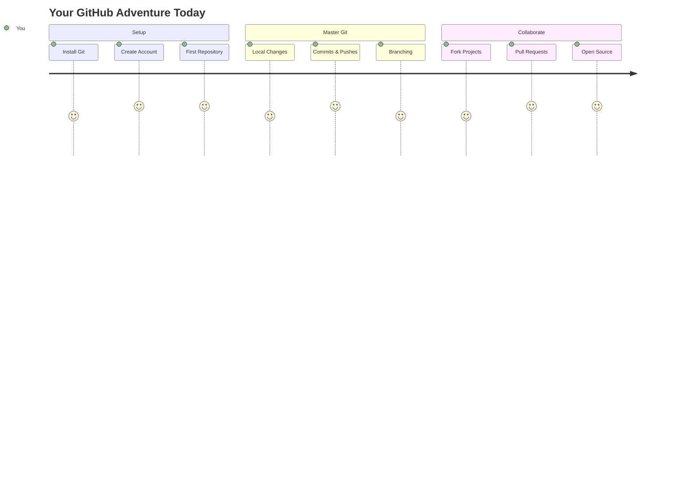
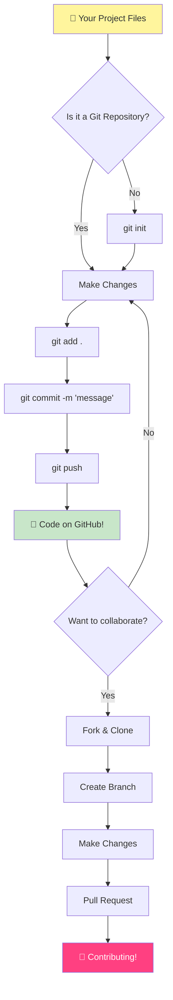
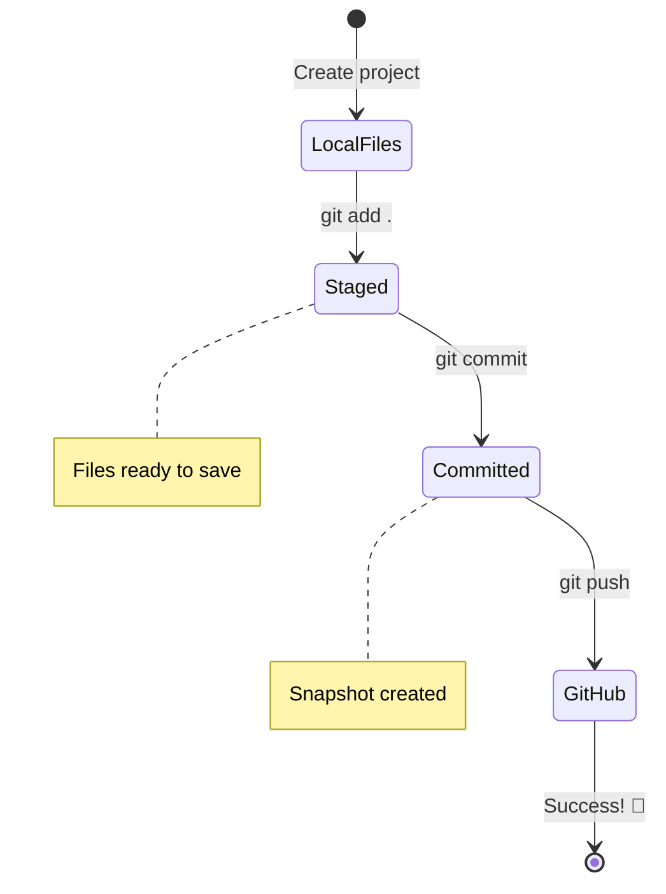
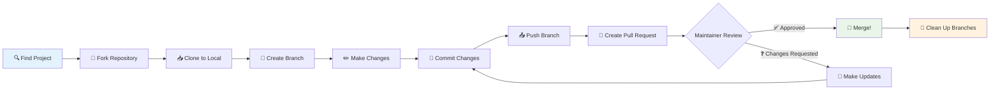
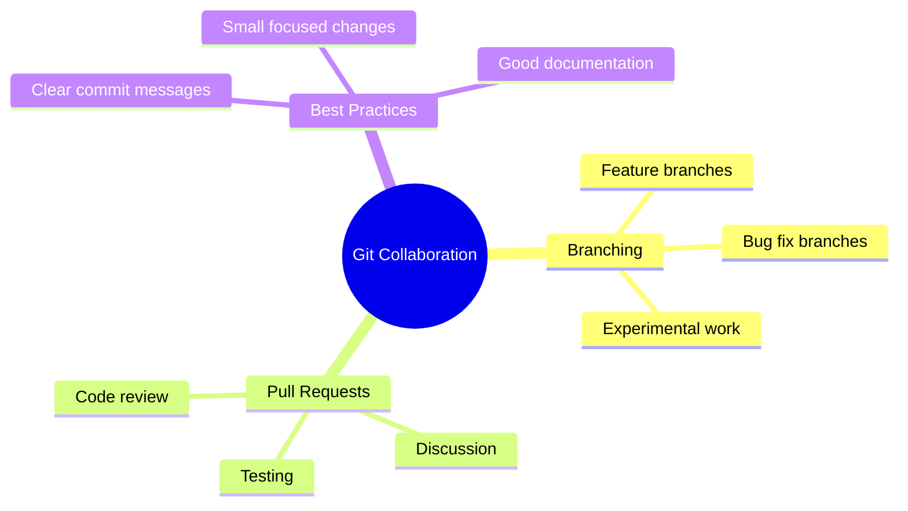

<!--
CO_OP_TRANSLATOR_METADATA:
{
  "original_hash": "0fe3ff66299b447f1c8cb34dcbf0c5ef",
  "translation_date": "2025-11-03T14:27:43+00:00",
  "source_file": "1-getting-started-lessons/2-github-basics/README.md",
  "language_code": "mr"
}
-->
# GitHub परिचय

नमस्कार, भविष्यातील विकसक! 👋 जगभरातील लाखो कोडर्समध्ये सामील होण्यासाठी तयार आहात का? तुम्हाला GitHub ची ओळख करून देताना मला खूप आनंद होत आहे – हे प्रोग्रामर्ससाठी सोशल मीडिया प्लॅटफॉर्मसारखे आहे, फक्त इथे तुम्ही तुमच्या जेवणाचे फोटो शेअर करण्याऐवजी कोड शेअर करता आणि एकत्रितपणे अप्रतिम गोष्टी तयार करता!

मला जे खरोखर आश्चर्यचकित करते ते म्हणजे: तुमच्या फोनवरील प्रत्येक अॅप, तुम्ही भेट देणारी प्रत्येक वेबसाइट आणि तुम्ही वापरण्यास शिकणारी बहुतेक साधने GitHub सारख्या प्लॅटफॉर्मवर सहकार्य करणाऱ्या विकसकांच्या टीमद्वारे तयार केली गेली आहेत. तुम्हाला आवडणारे संगीत अॅप? तुमच्यासारख्या कोणीतरी त्यात योगदान दिले आहे. तुम्ही खेळत असलेला गेम? होय, कदाचित GitHub सहकार्याने तयार केलेला. आणि आता तुम्ही त्या अद्भुत समुदायाचा भाग बनण्यास शिकणार आहात!

मला माहित आहे की सुरुवातीला हे थोडेसे जास्त वाटू शकते – मी माझ्या पहिल्या GitHub पेजकडे पाहत असताना "हे सगळं काय आहे?" असे विचार करत होतो. पण गोष्ट अशी आहे: प्रत्येक विकसक नेमके तिथून सुरुवात करतो जिथे तुम्ही आत्ता आहात. या धड्याच्या शेवटी, तुमच्याकडे तुमचे स्वतःचे GitHub रिपॉझिटरी असेल (ते म्हणजे क्लाउडमधील तुमच्या वैयक्तिक प्रोजेक्टचे प्रदर्शन), आणि तुम्हाला तुमचे काम कसे जतन करायचे, इतरांसोबत कसे शेअर करायचे आणि लाखो लोक वापरत असलेल्या प्रोजेक्ट्समध्ये कसे योगदान द्यायचे हे माहित असेल.

आपण हा प्रवास एकत्रितपणे, एक पाऊल एकावेळी घेणार आहोत. घाई नाही, दबाव नाही – फक्त तुम्ही, मी आणि काही खूप छान साधने जी तुमचे नवीन मित्र बनणार आहेत!


> स्केच नोट [Tomomi Imura](https://twitter.com/girlie_mac) यांच्याकडून



## प्री-लेक्चर क्विझ
[प्री-लेक्चर क्विझ](https://ff-quizzes.netlify.app)

## परिचय

आम्ही खरोखर रोमांचक गोष्टींमध्ये जाण्यापूर्वी, तुमचा संगणक GitHub च्या जादूसाठी तयार करूया! हे तुमच्या कलात्मक साहित्याचे आयोजन करण्यासारखे आहे – एक उत्कृष्ट कलाकृती तयार करण्यापूर्वी योग्य साधने तयार असणे सर्व काही अधिक गुळगुळीत आणि खूप मजेदार बनवते.

मी तुम्हाला प्रत्येक सेटअप चरण वैयक्तिकरित्या मार्गदर्शन करणार आहे, आणि मी वचन देतो की ते पहिल्या दृष्टीक्षेपात जितके भयावह दिसते तितके नाही. काहीतरी लगेच क्लिक होत नसेल तर, ते पूर्णपणे सामान्य आहे! मी माझे पहिले विकास वातावरण सेट करत होतो आणि असे वाटले की मी प्राचीन लिपी वाचण्याचा प्रयत्न करत आहे. प्रत्येक विकसक नेमके तिथेच होता जिथे तुम्ही आत्ता आहात, विचार करत की ते योग्य करत आहेत का. स्पॉयलर अलर्ट: जर तुम्ही शिकत असाल तर तुम्ही आधीच योग्य करत आहात! 🌟

या धड्यात, आपण कव्हर करू:

- तुमच्या मशीनवर केलेल्या कामाचा मागोवा घेणे
- इतरांसोबत प्रोजेक्ट्सवर काम करणे
- ओपन सोर्स सॉफ्टवेअरमध्ये योगदान कसे द्यावे

### पूर्वतयारी

तुमचा संगणक GitHub च्या जादूसाठी तयार करूया! काळजी करू नका – हा सेटअप तुम्हाला फक्त एकदाच करावा लागेल, आणि मग तुम्ही तुमच्या संपूर्ण कोडिंग प्रवासासाठी तयार असाल.

ठीक आहे, आपण पाया सुरू करूया! प्रथम, आपल्याला तपासावे लागेल की Git आधीच तुमच्या संगणकावर आहे का. Git मूलत: एक सुपर-स्मार्ट सहाय्यक असण्यासारखे आहे जो तुम्ही तुमच्या कोडमध्ये केलेला प्रत्येक बदल लक्षात ठेवतो – दर दोन सेकंदांनी Ctrl+S दाबण्यापेक्षा खूप चांगले (आपण सर्व तिथे होतो!).

तुमच्या टर्मिनलमध्ये हा जादुई आदेश टाइप करून पाहूया की Git आधीच स्थापित आहे का:
`git --version`

जर Git अजून तिथे नसेल, तर काळजी करू नका! फक्त [Git डाउनलोड करा](https://git-scm.com/downloads) आणि ते मिळवा. एकदा तुम्ही ते स्थापित केले की, आम्हाला Git ला योग्य प्रकारे तुमची ओळख करून द्यावी लागेल:

> 💡 **पहिल्यांदा सेटअप**: हे आदेश Git ला सांगतात की तुम्ही कोण आहात. ही माहिती तुम्ही केलेल्या प्रत्येक कमिटशी जोडली जाईल, त्यामुळे तुम्ही सार्वजनिकपणे शेअर करण्यास आरामदायक असलेले नाव आणि ईमेल निवडा.

```bash
git config --global user.name "your-name"
git config --global user.email "your-email"
```

Git आधीच कॉन्फिगर केले आहे का ते तपासण्यासाठी तुम्ही टाइप करू शकता:
```bash
git config --list
```

तुमच्याकडे GitHub खाते, कोड एडिटर (जसे की Visual Studio Code) असणे आवश्यक आहे आणि तुम्हाला तुमचे टर्मिनल (किंवा: कमांड प्रॉम्प्ट) उघडावे लागेल.

[github.com](https://github.com/) वर जा आणि खाते तयार करा जर तुम्ही आधीच केले नसेल, किंवा लॉग इन करा आणि तुमची प्रोफाइल भरा.

💡 **आधुनिक टिप**: [SSH keys](https://docs.github.com/en/authentication/connecting-to-github-with-ssh) सेट अप करण्याचा विचार करा किंवा पासवर्डशिवाय सोप्या प्रमाणीकरणासाठी [GitHub CLI](https://cli.github.com/) वापरा.

✅ GitHub हा जगातील एकमेव कोड रिपॉझिटरी नाही; इतरही आहेत, पण GitHub सर्वात प्रसिद्ध आहे.

### तयारी

तुमच्याकडे तुमच्या स्थानिक मशीनवर (लॅपटॉप किंवा पीसी) कोड प्रोजेक्टसह एक फोल्डर आणि GitHub वर एक सार्वजनिक रिपॉझिटरी असणे आवश्यक आहे, जे इतरांच्या प्रोजेक्ट्समध्ये योगदान कसे द्यावे याचे उदाहरण म्हणून काम करेल.

### तुमचा कोड सुरक्षित ठेवणे

चला थोड्या वेळासाठी सुरक्षा बद्दल बोलूया – पण काळजी करू नका, आम्ही तुम्हाला घाबरवणाऱ्या गोष्टींनी भरून टाकणार नाही! या सुरक्षा पद्धती तुमची कार किंवा तुमचे घर लॉक करण्यासारख्या आहेत. ते सोपे सवयी आहेत ज्या दुसऱ्या स्वभावासारख्या बनतात आणि तुमचे कठोर परिश्रम सुरक्षित ठेवतात.

आम्ही तुम्हाला सुरुवातीपासूनच GitHub सह काम करण्याचे आधुनिक, सुरक्षित मार्ग दाखवू. अशा प्रकारे, तुम्ही चांगल्या सवयी विकसित कराल ज्या तुमच्या कोडिंग करिअरमध्ये तुम्हाला चांगल्या प्रकारे सेवा देतील.

GitHub सह काम करताना, सुरक्षा सर्वोत्तम पद्धतींचे पालन करणे महत्त्वाचे आहे:

| सुरक्षा क्षेत्र | सर्वोत्तम पद्धत | का महत्त्वाचे आहे |
|-----------------|-----------------|--------------------|
| **प्रमाणीकरण** | SSH keys किंवा Personal Access Tokens वापरा | पासवर्ड कमी सुरक्षित आहेत आणि त्यांना हळूहळू बंद केले जात आहे |
| **दोन-घटक प्रमाणीकरण** | तुमच्या GitHub खात्यावर 2FA सक्षम करा | खात्याच्या संरक्षणासाठी अतिरिक्त स्तर जोडते |
| **रिपॉझिटरी सुरक्षा** | संवेदनशील माहिती कधीही कमिट करू नका | API keys आणि पासवर्ड सार्वजनिक रिपॉझिटरीमध्ये कधीही असू नयेत |
| **डिपेंडेंसी व्यवस्थापन** | Dependabot अपडेट्ससाठी सक्षम करा | तुमच्या डिपेंडेंसी सुरक्षित आणि अद्ययावत ठेवते |

> ⚠️ **महत्त्वाची सुरक्षा आठवण**: API keys, पासवर्ड किंवा इतर संवेदनशील माहिती कोणत्याही रिपॉझिटरीमध्ये कधीही कमिट करू नका. संवेदनशील डेटा संरक्षित करण्यासाठी environment variables आणि `.gitignore` फाइल्स वापरा.

**आधुनिक प्रमाणीकरण सेटअप:**

```bash
# Generate SSH key (modern ed25519 algorithm)
ssh-keygen -t ed25519 -C "your_email@example.com"

# Set up Git to use SSH
git remote set-url origin git@github.com:username/repository.git
```

> 💡 **प्रो टिप**: SSH keys पासवर्ड वारंवार टाइप करण्याची गरज दूर करतात आणि पारंपरिक प्रमाणीकरण पद्धतींपेक्षा अधिक सुरक्षित असतात.

---

## तुमचा कोड प्रोप्रमाणे व्यवस्थापित करा

ठीक आहे, आता गोष्टी खरोखर रोमांचक होणार आहेत! 🎉 आम्ही तुमचा कोड प्रोप्रमाणे ट्रॅक आणि व्यवस्थापित कसा करायचा ते शिकणार आहोत, आणि प्रामाणिकपणे सांगायचे तर, हे शिकवणे माझ्या आवडत्या गोष्टींपैकी एक आहे कारण हे खूप गेम-चेंजर आहे.

कल्पना करा: तुम्ही एक अद्भुत कथा लिहित आहात, आणि तुम्हाला प्रत्येक ड्राफ्ट, प्रत्येक उत्कृष्ट संपादन आणि प्रत्येक "थांबा, हे तर अप्रतिम आहे!" क्षणाचा मागोवा ठेवायचा आहे. Git तुमच्या कोडसाठी नेमके हेच करते! हे सर्व काही लक्षात ठेवणारे सर्वात अविश्वसनीय टाइम-ट्रॅव्हलिंग नोटबुक असण्यासारखे आहे – प्रत्येक कीस्ट्रोक, प्रत्येक बदल, प्रत्येक "अरे, हे सगळं बिघडलं" क्षण जो तुम्ही त्वरित पूर्ववत करू शकता.

मी प्रामाणिकपणे सांगतो – सुरुवातीला हे थोडेसे जास्त वाटू शकते. जेव्हा मी सुरुवात केली, तेव्हा मला वाटले "मी फक्त माझ्या फाइल्स सामान्यपणे का जतन करू शकत नाही?" पण यावर माझा विश्वास ठेवा: एकदा Git तुम्हाला समजला (आणि तो समजेल!), तुम्हाला एक प्रकाशाचा क्षण येईल जिथे तुम्ही विचार कराल "मी कधीही याशिवाय कोड कसा लिहिला?" हे असे आहे जसे तुम्ही उडू शकता हे शोधणे जेव्हा तुम्ही तुमच्या आयुष्यभर चालत होता!

समजा तुमच्याकडे स्थानिक स्तरावर काही कोड प्रोजेक्टसह एक फोल्डर आहे आणि तुम्हाला git - व्हर्जन कंट्रोल सिस्टम वापरून तुमच्या प्रगतीचा मागोवा सुरू करायचा आहे. काही लोक git वापरण्याची तुलना तुमच्या भविष्यातील स्वतःसाठी प्रेमपत्र लिहिण्याशी करतात. तुमचे कमिट संदेश दिवस, आठवडे किंवा महिने नंतर वाचताना तुम्हाला आठवेल की तुम्ही निर्णय का घेतला, किंवा बदल "रोलबॅक" करा - म्हणजे, जेव्हा तुम्ही चांगले "कमिट संदेश" लिहिता.



### कार्य: तुमचे पहिले रिपॉझिटरी तयार करा!

> 🎯 **तुमचे मिशन (आणि मला तुमच्यासाठी खूप उत्साह आहे!)**: आपण एकत्रितपणे तुमचे पहिले GitHub रिपॉझिटरी तयार करणार आहोत! येथे आपले काम पूर्ण झाल्यावर, तुमच्याकडे तुमच्या कोडसाठी इंटरनेटवर तुमचा स्वतःचा कोपरा असेल, आणि तुम्ही तुमचा पहिला "कमिट" केला असेल (ते म्हणजे तुमचे काम खूप स्मार्ट पद्धतीने जतन करणे). 
>
> हे खरोखर एक विशेष क्षण आहे – तुम्ही विकसकांच्या जागतिक समुदायात अधिकृतपणे सामील होणार आहात! माझे पहिले रिपॉझिटरी तयार करण्याचा थरार मला अजूनही आठवतो आणि विचार केला "वा, मी खरोखर हे करत आहे!"

चला हे साहस एकत्रितपणे, चरण-दर-चरण पार करूया. प्रत्येक भागासाठी तुमचा वेळ घ्या – घाई करण्यासाठी कोणतेही बक्षीस नाही, आणि मी वचन देतो की प्रत्येक चरण अर्थपूर्ण होईल. लक्षात ठेवा, तुम्ही प्रशंसा करत असलेला प्रत्येक कोडिंग सुपरस्टार एकदा नेमके तिथे बसला होता जिथे तुम्ही आहात, त्यांचे पहिले रिपॉझिटरी तयार करण्याच्या तयारीत. किती छान आहे ना?

> व्हिडिओ पहा
> 
> [](https://www.youtube.com/watch?v=9R31OUPpxU4)

**चला हे एकत्र करूया:**

1. **GitHub वर तुमचे रिपॉझिटरी तयार करा**. GitHub.com वर जा आणि तो तेजस्वी हिरवा **नवीन** बटण (किंवा वरच्या उजव्या कोपऱ्यातील **+** चिन्ह) शोधा. त्यावर क्लिक करा आणि **नवीन रिपॉझिटरी** निवडा.

   येथे काय करायचे:
   1. तुमच्या रिपॉझिटरीला नाव द्या – ते तुमच्यासाठी अर्थपूर्ण असले पाहिजे!
   1. तुम्हाला हवे असल्यास वर्णन जोडा (यामुळे इतरांना तुमचा प्रोजेक्ट कशाबद्दल आहे हे समजण्यास मदत होते)
   1. तुम्हाला ते सार्वजनिक (सर्वांना दिसणारे) किंवा खाजगी (फक्त तुमच्यासाठी) हवे आहे का ते ठरवा
   1. README फाइल जोडण्यासाठी बॉक्स तपासण्याची मी शिफारस करतो – ते तुमच्या प्रोजेक्टचे फ्रंट पेज आहे
   1. **रिपॉझिटरी तयार करा** वर क्लिक करा आणि साजरा करा – तुम्ही तुमचे पहिले रिपॉझिटरी तयार केले! 🎉

2. **तुमच्या प्रोजेक्ट फोल्डरकडे जा**. आता तुमचे टर्मिनल उघडूया (काळजी करू नका, ते दिसते तितके भयानक नाही!). आपल्याला आपल्या संगणकाला सांगावे लागेल की आपले प्रोजेक्ट फाइल्स कुठे आहेत. हा आदेश टाइप करा:

   ```bash
   cd [name of your folder]
   ```

   **आम्ही येथे काय करत आहोत:**
   - आम्ही मूलत: सांगत आहोत "अरे संगणका, मला माझ्या प्रोजेक्ट फोल्डरमध्ये घेऊन जा"
   - हे तुमच्या डेस्कटॉपवर विशिष्ट फोल्डर उघडण्यासारखे आहे, पण आम्ही ते मजकूर आदेशांसह करत आहोत
   - `[name of your folder]` च्या जागी तुमच्या प्रोजेक्ट फोल्डरचे वास्तविक नाव बदला

3. **तुमच्या फोल्डरला Git रिपॉझिटरीमध्ये बदला**. येथे जादू घडते! टाइप करा:

   ```bash
   git init
   ```

   **येथे काय घडले (खूप छान गोष्टी!):**
   - Git ने तुमच्या प्रोजेक्टमध्ये एक लपलेला `.git` फोल्डर तयार केला – तुम्हाला ते दिसणार नाही, पण ते तिथे आहे!
   - तुमचा नियमित फोल्डर आता एक "रिपॉझिटरी" आहे जो तुम्ही केलेला प्रत्येक बदल ट्रॅक करू शकतो
   - हे तुमच्या फोल्डरला सर्व काही लक्षात ठेवण्यासाठी सुपरपॉवर देण्यासारखे आहे

4. **काय चालले आहे ते तपासा**. चला पाहूया की Git सध्या तुमच्या प्रोजेक्टबद्दल काय विचार करत आहे:

   ```bash
   git status
   ```

   **Git तुम्हाला काय सांगत आहे ते समजून घेणे:**
   
   तुम्हाला असे काहीतरी दिसू शकते:

   ```output
   Changes not staged for commit:
   (use "git add <file>..." to update what will be committed)
   (use "git restore <file>..." to discard changes in working directory)

        modified:   file.txt
        modified:   file2.txt
   ```

   **घाबरू नका! याचा अर्थ असा आहे:**
   - **लाल** रंगातील फाइल्स म्हणजे फाइल्स ज्यामध्ये बदल आहेत पण जतन करण्यासाठी तयार नाहीत
   - **हिरव्या** रंगातील फाइल्स (जेव्हा तुम्ही त्यांना पाहता) जतन करण्यासाठी तयार आहेत
   - Git तुम्हाला पुढे काय करता येईल याबद्दल नेमके सांगून मदत करत आहे

   > 💡 **प्रो टिप**: `git status` आदेश तुमचा सर्वोत्तम मित्र आहे! तुम्हाला गोंधळ वाटत असताना ते वापरा. हे Git ला विचारण्यासारखे आहे "अरे, सध्या काय परिस्थिती आहे?"

5. **तुमच्या फाइल्स जतन करण्यासाठी तयार करा** (याला "स्टेजिंग" म्हणतात):

   ```bash
   git add .
   ```

   **आम्ही काय केले:**
   - आम्ही Git ला सांगितले "अरे, मी माझ्या पुढील जतनामध्ये माझ्या सर्व फाइल्स समाविष्ट करू इच्छित आहे"
   - `.` म्हणजे "या फोल्डरमधील सर्व काही"
   - आता तुमच्या फाइल्स "स्टेज केलेल्या" आहेत आणि पुढील चरणासाठी तयार आहेत

   **तुम्हाला अधिक निवडक व्हायचे आहे का?** तुम्ही फक्त विशिष्ट फाइल्स जोडू शकता:

   ```bash
   git add [file or folder name]
   ```

   **तुम्हाला असे का करायचे आहे?**
   - कधी कधी तुम्हाला संबंधित बदल एकत्रितपणे जतन करायचे असतात
   - हे तुमचे काम तार्किक तुकड्यांमध्ये आयोजित करण्यात मदत करते
   - काय बदलले आणि कधी हे समजणे सोपे बनवते

   **तुमचे मन बदलले?** काळजी करू नका! तुम्ही फाइल्स अशा प्रकारे अनस्टेज करू शकता:

   ```bash
   # Unstage everything
   git reset
   
   # Unstage just one file
   git reset [file name]
   ```

   काळ
**आपण काय केलं:**
- आपण आपल्या स्थानिक प्रकल्प आणि GitHub रेपॉजिटरी यांच्यात कनेक्शन तयार केलं
- "Origin" हा फक्त तुमच्या GitHub रेपॉजिटरीसाठी एक टोपणनाव आहे – जसं तुम्ही तुमच्या फोनमध्ये एखाद्या संपर्काला जतन करता
- आता तुमचा स्थानिक Git जाणतो की तुमचा कोड शेअर करण्यासाठी कुठे पाठवायचा आहे

💡 **सोपं मार्ग**: जर तुमच्याकडे GitHub CLI इन्स्टॉल असेल, तर तुम्ही हे एका कमांडने करू शकता:
   ```bash
   gh repo create my-repo --public --push --source=.
   ```

8. **तुमचा कोड GitHub वर पाठवा** (मोठा क्षण!):

   ```bash
   git push -u origin main
   ```

   **🚀 हेच ते! तुम्ही तुमचा कोड GitHub वर अपलोड करत आहात!**

   **काय घडतंय:**
   - तुमचे commits तुमच्या संगणकावरून GitHub कडे जात आहेत
   - `-u` फ्लॅग एक कायमस्वरूपी कनेक्शन सेट करतो ज्यामुळे भविष्यातील पुश करणे सोपे होते
   - "main" हा तुमच्या प्राथमिक शाखेचे नाव आहे (मुख्य फोल्डरसारखे)
   - यानंतर, तुम्ही फक्त `git push` टाइप करून भविष्यातील अपलोड करू शकता!

   💡 **लहान टिप**: जर तुमच्या शाखेचं नाव काहीतरी वेगळं असेल (जसं "master"), तर ते नाव वापरा. तुम्ही `git branch --show-current` वापरून तपासू शकता.

9. **तुमचा नवीन दैनंदिन कोडिंग रिदम** (आता हे व्यसन होईल!):

   आता पासून, जेव्हा तुम्ही तुमच्या प्रकल्पात बदल कराल, तेव्हा तुम्हाला हा सोपा तीन-स्टेप डान्स करायचा आहे:

   ```bash
   git add .
   git commit -m "describe what you changed"
   git push
   ```

   **हे तुमचं कोडिंग हार्टबीट बनेल:**
   - तुमच्या कोडमध्ये काही अप्रतिम बदल करा ✨
   - `git add` ने त्यांना स्टेज करा ("हे Git, या बदलांकडे लक्ष द्या!")
   - `git commit` आणि एक वर्णनात्मक संदेशासह त्यांना सेव्ह करा (भविष्यातील तुम्ही तुमचे आभार मानाल!)
   - `git push` वापरून त्यांना जगासोबत शेअर करा 🚀
   - पुन्हा करा – खरंच, हे श्वास घेण्याइतकं नैसर्गिक होईल!

   मला हा वर्कफ्लो खूप आवडतो कारण हे व्हिडिओ गेममध्ये अनेक सेव्ह पॉइंट्स असण्यासारखं आहे. तुम्हाला एखादा बदल आवडला? Commit करा! काही धोकादायक प्रयत्न करायचं आहे? हरकत नाही – जर काही चुकलं तर तुम्ही नेहमी तुमच्या शेवटच्या commit वर परत जाऊ शकता!

   > 💡 **टिप**: तुम्हाला `.gitignore` फाइलचा अवलंब करायचा असेल, ज्यामुळे तुम्हाला ट्रॅक करायच्या नसलेल्या फाइल्स GitHub वर दिसणार नाहीत - जसं की, तुमच्या फोल्डरमध्ये असलेली नोट्स फाइल जी सार्वजनिक रेपॉजिटरीमध्ये असण्याची गरज नाही. तुम्ही `.gitignore` फाइल्ससाठी टेम्पलेट्स [.gitignore templates](https://github.com/github/gitignore) येथे शोधू शकता किंवा [gitignore.io](https://www.toptal.com/developers/gitignore) वापरून एक तयार करू शकता.

### 🧠 **पहिल्या रेपॉजिटरी चेक-इन: कसं वाटलं?**

**थोडा वेळ साजरा करा आणि विचार करा:**
- तुमचा कोड पहिल्यांदा GitHub वर दिसल्यावर कसं वाटलं?
- कोणता टप्पा सर्वात गोंधळात टाकणारा वाटला, आणि कोणता आश्चर्यकारकपणे सोपा वाटला?
- तुम्ही `git add`, `git commit`, आणि `git push` यामधील फरक स्वतःच्या शब्दांत समजावून सांगू शकता का?



> **लक्षात ठेवा**: अनुभवी डेव्हलपर्ससुद्धा कधी कधी अचूक कमांड्स विसरतात. हा वर्कफ्लो सवयीचा होण्यासाठी सराव लागतो - तुम्ही खूप चांगलं करत आहात!

#### आधुनिक Git वर्कफ्लो

या आधुनिक पद्धतींचा अवलंब करण्याचा विचार करा:

- **Conventional Commits**: `feat:`, `fix:`, `docs:` यासारख्या प्रमाणित कमिट संदेश स्वरूपाचा वापर करा. अधिक जाणून घ्या [conventionalcommits.org](https://www.conventionalcommits.org/) येथे.
- **Atomic commits**: प्रत्येक कमिट एकच तर्कसंगत बदल दर्शवेल याची खात्री करा.
- **Frequent commits**: मोठ्या, क्वचित होणाऱ्या कमिट्सच्या तुलनेत वर्णनात्मक संदेशांसह वारंवार कमिट करा.

#### कमिट संदेश

एक उत्कृष्ट Git कमिट विषय ओळ खालील वाक्य पूर्ण करते:
जर लागू केले, तर हा कमिट <तुमचा विषय इथे> करेल.

विषयासाठी आज्ञार्थी, वर्तमानकाळाचा वापर करा: "change" नाही "changed" किंवा "changes". 
विषयाप्रमाणेच, शरीरात (पर्यायी) देखील आज्ञार्थी, वर्तमानकाळाचा वापर करा. शरीरात बदलासाठी प्रेरणा समाविष्ट करावी आणि मागील वर्तनाशी याची तुलना करावी. तुम्ही `का` समजावत आहात, `कसे` नाही.

✅ काही वेळ काढून GitHub वर सर्फ करा. तुम्हाला एक खूप चांगला कमिट संदेश सापडतो का? तुम्हाला एक खूपच साधा सापडतो का? कमिट संदेशात कोणती माहिती सर्वात महत्त्वाची आणि उपयुक्त वाटते?

## इतरांसोबत काम करणे (मजेदार भाग!)

तुमची टोपी धरून ठेवा कारण इथेच GitHub पूर्णपणे जादुई बनतो! 🪄 तुम्ही तुमचा स्वतःचा कोड व्यवस्थापित करण्यात निपुण झाला आहात, पण आता आपण माझ्या आवडत्या भागात प्रवेश करतो – जगभरातील अद्भुत लोकांसोबत सहकार्य करणे.

कल्पना करा: तुम्ही उद्या सकाळी उठता आणि पाहता की टोकियोमधील कोणीतरी तुमचा कोड सुधारला आहे. मग बर्लिनमधील कोणीतरी तुम्हाला अडचणीत टाकणारा बग दुरुस्त करतो. दुपारपर्यंत, साओ पाउलोमधील एक डेव्हलपर तुम्हाला कधीही विचारात न आलेली एक नवीन वैशिष्ट्य जोडतो. हे विज्ञानकथा नाही – हे फक्त GitHub विश्वातील एक सामान्य मंगळवार आहे!

मला खूप उत्साह येतो कारण तुम्ही आता शिकत असलेल्या सहकार्य कौशल्यांमुळे? हेच ते अचूक वर्कफ्लो आहेत जे Google, Microsoft, आणि तुमच्या आवडत्या स्टार्टअप्समधील टीम्स दररोज वापरतात. तुम्ही फक्त एक छान साधन शिकत नाही आहात – तुम्ही संपूर्ण सॉफ्टवेअर जगाला एकत्र काम करण्यास सक्षम करणारी गुप्त भाषा शिकत आहात.

खरंच, जेव्हा तुम्हाला तुमचा पहिला pull request merge झाल्याचा आनंद होतो, तेव्हा तुम्हाला समजेल की डेव्हलपर्स ओपन सोर्सबद्दल इतके उत्साही का होतात. हे जगातील सर्वात मोठ्या, सर्वात सर्जनशील टीम प्रोजेक्टचा भाग असल्यासारखं आहे!

> व्हिडिओ पहा
>
> [](https://www.youtube.com/watch?v=bFCM-PC3cu8)

GitHub वर गोष्टी ठेवण्याचं मुख्य कारण म्हणजे इतर डेव्हलपर्ससोबत सहकार्य करणे शक्य होणे.



तुमच्या रेपॉजिटरीमध्ये, `Insights > Community` ला जा आणि तुमचा प्रकल्प शिफारस केलेल्या समुदाय मानकांशी कसा तुलना करतो ते पहा.

तुमची रेपॉजिटरी व्यावसायिक आणि स्वागतार्ह दिसावी असं वाटतंय? तुमच्या रेपॉजिटरीमध्ये जा आणि `Insights > Community` वर क्लिक करा. ही छान वैशिष्ट्य तुम्हाला दाखवते की तुमचा प्रकल्प GitHub समुदायाच्या "चांगल्या रेपॉजिटरी पद्धतींशी" कसा तुलना करतो.

> 🎯 **तुमचा प्रकल्प चमकवा**: चांगल्या प्रकारे आयोजित केलेली रेपॉजिटरी आणि चांगल्या दस्तऐवजांसह, जणू काही स्वच्छ, स्वागतार्ह दुकानासारखी असते. हे लोकांना तुमच्या कामाबद्दल काळजी आहे हे सांगते आणि इतरांना योगदान देण्याची इच्छा निर्माण करते!

**एक उत्कृष्ट रेपॉजिटरी कशी बनवायची:**

| काय जोडायचं | का महत्त्वाचं आहे | तुमच्यासाठी काय करतो |
|--------------|-------------------|-----------------------|
| **वर्णन** | पहिलं छाप महत्त्वाचं आहे! | लोकांना लगेच कळतं की तुमचा प्रकल्प काय करतो |
| **README** | तुमच्या प्रकल्पाचं मुख्य पान | नवीन अभ्यागतांसाठी एक मैत्रीपूर्ण मार्गदर्शक |
| **Contributing Guidelines** | मदतीचं स्वागत दाखवतं | लोकांना नेमकं कळतं की ते तुम्हाला कसं मदत करू शकतात |
| **Code of Conduct** | एक मैत्रीपूर्ण जागा तयार करते | प्रत्येकाला सहभागी होण्यासाठी स्वागतार्ह वाटतं |
| **License** | कायदेशीर स्पष्टता | इतरांना तुमचा कोड कसा वापरायचा हे कळतं |
| **Security Policy** | जबाबदारपणाचं प्रदर्शन | व्यावसायिक पद्धती दाखवते |

> 💡 **प्रो टिप**: GitHub या सर्व फाइल्ससाठी टेम्पलेट्स प्रदान करतो. नवीन रेपॉजिटरी तयार करताना, या फाइल्स आपोआप तयार करण्यासाठी बॉक्सेस तपासा.

**आधुनिक GitHub वैशिष्ट्ये शोधा:**

🤖 **ऑटोमेशन आणि CI/CD:**
- **GitHub Actions** स्वयंचलित चाचणी आणि तैनातीसाठी
- **Dependabot** स्वयंचलित डिपेंडन्सी अपडेट्ससाठी

💬 **समुदाय आणि प्रकल्प व्यवस्थापन:**
- **GitHub Discussions** समस्यांपलीकडे समुदाय संभाषणांसाठी
- **GitHub Projects** कानबान-शैली प्रकल्प व्यवस्थापनासाठी
- **Branch protection rules** कोड गुणवत्ता मानक लागू करण्यासाठी

हे सर्व संसाधने नवीन टीम सदस्यांना onboard करण्यासाठी फायदेशीर ठरतील. आणि हेच ते प्रकार आहेत जे नवीन योगदानकर्ते तुमचा कोड पाहण्याआधी पाहतात, हे शोधण्यासाठी की तुमचा प्रकल्प त्यांचा वेळ खर्च करण्यासाठी योग्य आहे का.

✅ README फाइल्स, जरी तयार करण्यात वेळ लागतो, तरीही व्यस्त मेंटेनर्सकडून अनेकदा दुर्लक्षित केल्या जातात. तुम्हाला एखाद्या विशेषतः वर्णनात्मक README चं उदाहरण सापडतं का? लक्षात ठेवा: [चांगल्या README तयार करण्यासाठी काही साधने](https://www.makeareadme.com/) आहेत जी तुम्हाला वापरायला आवडतील.

### कार्य: काही कोड मर्ज करा

Contributing दस्तऐवज लोकांना प्रकल्पात योगदान देण्यास मदत करतो. यात तुम्ही कोणत्या प्रकारच्या योगदानाची अपेक्षा करता आणि प्रक्रिया कशी कार्य करते हे स्पष्ट केलं जातं. योगदानकर्त्यांना GitHub वर तुमच्या रेपॉजिटरीमध्ये योगदान देण्यासाठी काही टप्पे पार करावे लागतील:

1. **तुमची रेपॉजिटरी Fork करणे**. तुम्हाला कदाचित लोकांना तुमचा प्रकल्प _fork_ करायला सांगायचं असेल. Forking म्हणजे त्यांच्या GitHub प्रोफाइलवर तुमच्या रेपॉजिटरीची प्रत तयार करणे.
1. **Clone**. त्यानंतर ते प्रकल्प त्यांच्या स्थानिक मशीनवर clone करतील.
1. **शाखा तयार करा**. तुम्हाला त्यांना त्यांच्या कामासाठी एक _शाखा_ तयार करायला सांगायचं आहे.
1. **त्यांचा बदल एका क्षेत्रावर केंद्रित करा**. योगदानकर्त्यांना एकावेळी एका गोष्टीवर लक्ष केंद्रित करण्यास सांगा - अशा प्रकारे त्यांचे काम _merge_ होण्याची शक्यता जास्त आहे. कल्पना करा की त्यांनी एक बग फिक्स लिहिला, एक नवीन वैशिष्ट्य जोडले, आणि अनेक चाचण्या अपडेट केल्या - काय होईल जर तुम्हाला, किंवा तुम्ही फक्त 2 पैकी 3, किंवा 1 पैकी 3 बदल लागू करू शकता?

✅ अशा परिस्थितीची कल्पना करा जिथे शाखा चांगला कोड लिहिण्यासाठी आणि पाठवण्यासाठी विशेषतः महत्त्वाच्या असतात. तुम्हाला कोणते उपयोग प्रकरणे सुचतात?

> लक्षात ठेवा, तुम्हाला जगात पाहायचा आहे तो बदल व्हा, आणि तुमच्या स्वतःच्या कामासाठीही शाखा तयार करा. तुम्ही केलेले कोणतेही कमिट्स तुम्ही सध्या "चेक आउट" केलेल्या शाखेत केले जातील. `git status` वापरून ती कोणती शाखा आहे ते पहा.

चला एक योगदानकर्ता वर्कफ्लो पाहू. गृहीत धरा की योगदानकर्त्याने आधीच रेपॉजिटरी _fork_ आणि _clone_ केली आहे, त्यामुळे त्यांच्याकडे स्थानिक मशीनवर काम करण्यासाठी Git रेपो तयार आहे:

1. **शाखा तयार करा**. `git branch` कमांड वापरून एक शाखा तयार करा जी ते योगदान देऊ इच्छित असलेल्या बदलांचा समावेश करेल:

   ```bash
   git branch [branch-name]
   ```

   > 💡 **आधुनिक दृष्टिकोन**: तुम्ही एका कमांडमध्ये नवीन शाखा तयार करू शकता आणि त्यावर स्विच करू शकता:
   ```bash
   git switch -c [branch-name]
   ```

1. **कामाच्या शाखेत स्विच करा**. निर्दिष्ट शाखेत स्विच करा आणि `git switch` सह कार्यरत निर्देशिका अपडेट करा:

   ```bash
   git switch [branch-name]
   ```

   > 💡 **आधुनिक टिप**: शाखा बदलताना `git switch` हे `git checkout` चे आधुनिक पर्याय आहे. हे अधिक स्पष्ट आणि नवशिक्यांसाठी सुरक्षित आहे.

1. **काम करा**. या टप्प्यावर तुम्हाला तुमचे बदल जोडायचे आहेत. खालील कमांडसह Git ला त्याबद्दल सांगायला विसरू नका:

   ```bash
   git add .
   git commit -m "my changes"
   ```

   > ⚠️ **कमिट संदेश गुणवत्ता**: तुमच्या कमिटला चांगलं नाव द्या, तुमच्यासाठी आणि तुम्ही मदत करत असलेल्या रेपोच्या मेंटेनरसाठी. तुम्ही काय बदललं याबद्दल विशिष्ट व्हा!

1. **तुमचं काम `main` शाखेसोबत एकत्र करा**. एका टप्प्यावर तुम्ही काम पूर्ण करता आणि तुमचं काम `main` शाखेसोबत एकत्र करायचं असतं. दरम्यान `main` शाखा बदलली असेल, त्यामुळे खालील कमांडसह ती आधी नवीनतम स्थितीत अपडेट करा:

   ```bash
   git switch main
   git pull
   ```

   या टप्प्यावर तुम्हाला खात्री करायची आहे की कोणतेही _conflicts_, जिथे Git सहजपणे _combine_ करू शकत नाही, ते तुमच्या कार्यरत शाखेत होतात. म्हणून खालील कमांड्स चालवा:

   ```bash
   git switch [branch_name]
   git merge main
   ```

   `git merge main` कमांड `main` मधील सर्व बदल तुमच्या शाखेत आणेल. आशा आहे की तुम्ही फक्त पुढे जाऊ शकता. जर नाही, तर VS Code तुम्हाला सांगेल की Git कुठे _गोंधळलेला_ आहे आणि तुम्ही प्रभावित फाइल्स बदलून योग्य सामग्री निवडू शकता.

   💡 **आधुनिक पर्याय**: स्वच्छ इतिहासासाठी `git rebase` वापरण्याचा विचार करा:
   ```bash
   git rebase main
   ```
   हे तुमचे कमिट्स नवीनतम main शाखेच्या वर पुन्हा प्ले करते, एक रेषीय इतिहास तयार करते.

1. **तुमचं काम GitHub वर पाठवा**. तुमचं काम GitHub वर पाठवणं म्हणजे दोन गोष्टी. तुमची शाखा तुमच्या forked रेपॉजिटरीवर पुश करा आणि नंतर एक PR (Pull Request) उघडा.

   ```bash
   git push --set-upstream origin [branch-name]
   ```

   वरील कमांड तुमच्या forked रेपॉजिटरीवर शाखा तयार करते.

### 🤝 **सहकार्य कौशल्य तपासणी: इतरांसोबत काम करण्यासाठी तयार आहात का?**

**सहकार्याबद्दल तुमचं कसं वाटतंय ते पाहूया:**
- Forking आणि pull requests ची कल्पना आता तुम्हाला समजली का?
- शाखांसोबत काम करण्याबद्दल तुम्हाला कोणती गोष्ट अधिक सराव करायची आहे?
- इतरांच्या प्रकल्पात योगदान देण्याबद्दल तुम्हाला कितपत आत्मविश्वास वाटतो?



> **आत्मविश्वास वाढवणारा**: तुम्ही ज्या प्रत्येक डेव्हलपरचं कौतुक करता, ते कधी ना कधी त्यांच्या पहिल्या pull request बद्दल चिंतित होते. GitHub समुदाय नवशिक्यांसाठी खूप स्वागतार्ह आहे!

1. **PR उघडा**. पुढे, तुम्हाला PR उघडायचं आहे. तुम्ही GitHub वर forked रेपॉजिटरीकडे जाऊन हे करू शकता. GitHub वर तुम्हाला एक सूचना दिसेल जिथे विचारलं जाईल की तुम्हाला नवीन PR तयार कराय
1. **स्वच्छता करा**. PR यशस्वीपणे मर्ज केल्यानंतर स्वच्छता करणे चांगली पद्धत मानली जाते. तुम्हाला तुमची स्थानिक शाखा आणि GitHub वर पुश केलेली शाखा दोन्ही स्वच्छ करायची असते. प्रथम, खालील कमांडसह ती स्थानिक स्तरावर हटवा:

   ```bash
   git branch -d [branch-name]
   ```

   नंतर GitHub वर फोर्क केलेल्या रेपोच्या पृष्ठावर जा आणि तुम्ही नुकतीच पुश केलेली रिमोट शाखा हटवा.

`Pull request` हा शब्द थोडा विचित्र वाटतो कारण प्रत्यक्षात तुम्हाला तुमचे बदल प्रोजेक्टमध्ये पुश करायचे असतात. परंतु मेंटेनर (प्रोजेक्ट मालक) किंवा कोर टीमला तुमचे बदल प्रोजेक्टच्या "main" शाखेसोबत मर्ज करण्यापूर्वी विचार करणे आवश्यक असते, त्यामुळे तुम्ही प्रत्यक्षात मेंटेनरकडून बदलाचा निर्णय मागत आहात.

पुल रिक्वेस्ट ही एक जागा आहे जिथे शाखेवर केलेल्या बदलांची तुलना आणि चर्चा केली जाते, त्यात पुनरावलोकने, टिप्पण्या, एकत्रित चाचण्या आणि बरेच काही समाविष्ट असते. एक चांगला पुल रिक्वेस्ट साधारणपणे कमिट मेसेजसारखेच नियम पाळतो. तुम्ही तुमच्या कामाने एखाद्या समस्येचे निराकरण केले असल्यास, तुम्ही इश्यू ट्रॅकरमधील इश्यूचा संदर्भ जोडू शकता. हे `#` नंतर तुमच्या इश्यूचा क्रमांक वापरून केले जाते. उदाहरणार्थ `#97`.

🤞 बोटं क्रॉस करा की सर्व चेक्स पास होतील आणि प्रोजेक्ट मालक तुमचे बदल प्रोजेक्टमध्ये मर्ज करतील 🤞

तुमच्या स्थानिक कार्यरत शाखेत GitHub वरच्या संबंधित रिमोट शाखेतील सर्व नवीन कमिट्स अपडेट करा:

`git pull`

## ओपन सोर्समध्ये योगदान देणे (तुमची प्रभाव टाकण्याची संधी!)

तुम्ही काहीतरी असे करण्यासाठी तयार आहात जे तुमच्या मनाला पूर्णपणे उडवून देईल? 🤯 चला ओपन सोर्स प्रोजेक्ट्समध्ये योगदान देण्याबद्दल बोलूया – आणि हे तुमच्यासोबत शेअर करताना मला खूप उत्साह वाटतो!

ही तुमची संधी आहे काहीतरी खरोखरच असामान्य गोष्टीचा भाग बनण्याची. कल्पना करा की तुम्ही दररोज लाखो डेव्हलपर्स वापरत असलेल्या टूल्समध्ये सुधारणा करत आहात किंवा तुमच्या मित्रांना आवडणाऱ्या अॅपमधील बग दुरुस्त करत आहात. हे फक्त स्वप्न नाही – ओपन सोर्स योगदान याबद्दलच आहे!

मला प्रत्येक वेळी याचा विचार करताना रोमांच का येतो: तुम्ही शिकत असलेल्या प्रत्येक टूल – तुमचा कोड एडिटर, आपण एक्सप्लोर करणार असलेले फ्रेमवर्क, अगदी तुम्ही वाचत असलेला ब्राउझर – हे सर्व एखाद्या व्यक्तीने त्यांच्या पहिल्या योगदानासह सुरू केले. तुमच्या आवडत्या VS Code एक्सटेंशनचा तो प्रतिभावान डेव्हलपर? ते एकदा नवशिके होते ज्यांनी "create pull request" क्लिक केले होते, अगदी तुम्ही आता करणार आहात तसे.

आणि सर्वात सुंदर भाग म्हणजे: ओपन सोर्स समुदाय म्हणजे इंटरनेटचा सर्वात मोठा गट आलिंगन आहे. बहुतेक प्रोजेक्ट्स नवशिक्यांसाठी सक्रियपणे शोध घेतात आणि "good first issue" टॅग असलेल्या इश्यूज विशेषतः तुमच्यासारख्या लोकांसाठी असतात! मेंटेनर्स नवीन योगदानकर्ते पाहून खरोखरच उत्साहित होतात कारण त्यांना स्वतःचे पहिले पाऊल आठवते.

```mermaid
flowchart TD
    A[🔍 Explore GitHub] --> B[🏷️ Find "good first issue"]
    B --> C[📖 Read Contributing Guidelines]
    C --> D[🍴 Fork Repository]
    D --> E[💻 Set Up Local Environment]
    E --> F[🌿 Create Feature Branch]
    F --> G[✨ Make Your Contribution]
    G --> H[🧪 Test Your Changes]
    H --> I[📝 Write Clear Commit]
    I --> J[📤 Push & Create PR]
    J --> K[💬 Engage with Feedback]
    K --> L[🎉 Merged! You're a Contributor!]
    L --> M[🌟 Find Next Issue]
    
    style A fill:#e1f5fe
    style L fill:#c8e6c9
    style M fill:#fff59d
```

तुम्ही येथे कोड शिकत नाही आहात – तुम्ही बिल्डर्सच्या जागतिक कुटुंबात सामील होण्यासाठी तयार होत आहात जे दररोज उठून विचार करतात "डिजिटल जग थोडं चांगलं कसं बनवता येईल?" क्लबमध्ये स्वागत आहे! 🌟

प्रथम, GitHub वर तुम्हाला आवडणारा आणि ज्यामध्ये तुम्हाला बदल करायचा आहे असा रेपॉजिटरी (किंवा **repo**) शोधा. तुम्हाला त्याची सामग्री तुमच्या मशीनवर कॉपी करायची असेल.

✅ 'नवशिक्यांसाठी अनुकूल' रेपो शोधण्याचा एक चांगला मार्ग म्हणजे [टॅग 'good-first-issue' द्वारे शोधा](https://github.blog/2020-01-22-browse-good-first-issues-to-start-contributing-to-open-source/).


कोड कॉपी करण्याचे अनेक मार्ग आहेत. एक मार्ग म्हणजे HTTPS, SSH किंवा GitHub CLI (कमांड लाइन इंटरफेस) वापरून रेपॉजिटरीची सामग्री "क्लोन" करणे.

तुमचा टर्मिनल उघडा आणि रेपॉजिटरी क्लोन करा:
```bash
# Using HTTPS
git clone https://github.com/ProjectURL

# Using SSH (requires SSH key setup)
git clone git@github.com:username/repository.git

# Using GitHub CLI
gh repo clone username/repository
```

प्रोजेक्टवर काम करण्यासाठी, योग्य फोल्डरमध्ये स्विच करा:
`cd ProjectURL`

तुम्ही संपूर्ण प्रोजेक्ट उघडू शकता:
- **[GitHub Codespaces](https://github.com/features/codespaces)** - GitHub चा क्लाउड डेव्हलपमेंट वातावरण, ब्राउझरमध्ये VS Code सह
- **[GitHub Desktop](https://desktop.github.com/)** - Git ऑपरेशन्ससाठी GUI अॅप्लिकेशन  
- **[GitHub.dev](https://github.dev)** - कोणत्याही GitHub रेपोवर `.` की प्रेस करा आणि ब्राउझरमध्ये VS Code उघडा
- **VS Code** GitHub Pull Requests एक्सटेंशनसह

शेवटी, तुम्ही कोड झिप केलेल्या फोल्डरमध्ये डाउनलोड करू शकता.

### GitHub बद्दल काही अधिक मनोरंजक गोष्टी

तुम्ही GitHub वर कोणत्याही सार्वजनिक रेपॉजिटरीला स्टार, वॉच आणि/किंवा "fork" करू शकता. तुम्ही तुमच्या स्टार केलेल्या रेपॉजिटरी टॉप-राइट ड्रॉप-डाउन मेनूमध्ये शोधू शकता. हे बुकमार्किंगसारखे आहे, पण कोडसाठी.

प्रोजेक्ट्समध्ये इश्यू ट्रॅकर असतो, मुख्यतः GitHub वर "Issues" टॅबमध्ये, जोपर्यंत वेगळे सांगितले नाही, जिथे लोक प्रोजेक्टशी संबंधित समस्यांवर चर्चा करतात. आणि Pull Requests टॅब ही जागा आहे जिथे लोक प्रगतीपथावर असलेल्या बदलांवर चर्चा आणि पुनरावलोकन करतात.

प्रोजेक्ट्समध्ये फोरम, मेलिंग लिस्ट्स किंवा Slack, Discord किंवा IRC सारख्या चॅट चॅनेलमध्ये चर्चा असू शकते.

🔧 **आधुनिक GitHub वैशिष्ट्ये**:
- **GitHub Discussions** - समुदाय संभाषणांसाठी अंगभूत फोरम
- **GitHub Sponsors** - मेंटेनर्सना आर्थिक मदत करा  
- **Security tab** - असुरक्षितता अहवाल आणि सुरक्षा सल्लागार
- **Actions tab** - स्वयंचलित वर्कफ्लो आणि CI/CD पाइपलाइन्स पहा
- **Insights tab** - योगदानकर्ते, कमिट्स आणि प्रोजेक्टच्या आरोग्याबद्दल विश्लेषण
- **Projects tab** - GitHub चे अंगभूत प्रोजेक्ट व्यवस्थापन टूल्स

✅ तुमच्या नवीन GitHub रेपोभोवती एक नजर टाका आणि काही गोष्टी करून पहा, जसे की सेटिंग्ज संपादित करणे, तुमच्या रेपोमध्ये माहिती जोडणे, प्रोजेक्ट तयार करणे (जसे की Kanban बोर्ड), आणि ऑटोमेशनसाठी GitHub Actions सेट करणे. तुम्ही खूप काही करू शकता!

---

## 🚀 आव्हान 

ठीक आहे, तुमच्या नवीन GitHub सुपरपॉवर्सची चाचणी घेण्याची वेळ आली आहे! 🚀 येथे एक आव्हान आहे जे सर्वकाही सर्वात समाधानकारक मार्गाने क्लिक करेल:

तुमच्या मित्राला (किंवा त्या कुटुंबातील सदस्याला जो नेहमी विचारतो की तुम्ही या "कॉम्प्युटर गोष्टी"सह काय करत आहात) पकडा आणि एकत्र एक सहयोगी कोडिंग साहस सुरू करा! येथे खरी जादू घडते – एक प्रोजेक्ट तयार करा, त्यांना ते फोर्क करू द्या, काही शाखा तयार करा आणि तुम्ही प्रोफेशनल्ससारखे बदल मर्ज करा.

मी खोटं बोलणार नाही – तुम्ही कदाचित एखाद्या वेळी हसाल (विशेषतः जेव्हा तुम्ही दोघे एकाच ओळीत बदल करण्याचा प्रयत्न करता), कदाचित गोंधळून जाल, परंतु तुम्हाला नक्कीच ते अद्भुत "अरे वा!" क्षण मिळतील ज्यामुळे सर्व शिक्षण सार्थक वाटेल. शिवाय, एखाद्या दुसऱ्या व्यक्तीसोबत पहिला यशस्वी मर्ज शेअर करण्यामध्ये काहीतरी खास आहे – हे तुम्ही किती पुढे आला आहात याचा एक छोटासा उत्सव आहे!

तुमच्याकडे अजून कोडिंग साथीदार नाही? काही हरकत नाही! GitHub समुदाय नवीन लोकांसाठी खूप स्वागतार्ह आहे ज्यांना नवीन असल्याचे कसे वाटते हे आठवते. "good first issue" लेबल असलेल्या रेपॉजिटरी शोधा – ते मूलतः म्हणत आहेत "अरे नवशिक्यांनो, आमच्यासोबत शिका!" हे किती छान आहे?

## पोस्ट-लेक्चर क्विझ
[पोस्ट-लेक्चर क्विझ](https://ff-quizzes.netlify.app/web/en/)

## पुनरावलोकन आणि शिकत राहा

व्वा! 🎉 पाहा तुम्ही – तुम्ही GitHub मूलभूत गोष्टी जिंकल्या आहेत जसे की एक पूर्ण चॅम्पियन! जर तुमचा मेंदू सध्या थोडा भरलेला वाटत असेल, तर ते पूर्णपणे सामान्य आहे आणि प्रामाणिकपणे एक चांगले लक्षण आहे. तुम्ही नुकतेच असे टूल्स शिकले आहेत ज्यामुळे मला सुरुवातीला काही आठवडे लागले.

Git आणि GitHub खूप शक्तिशाली आहेत (म्हणजे, खरोखर शक्तिशाली), आणि मला माहित असलेल्या प्रत्येक डेव्हलपरला – ज्यांना आता जादूगार वाटतात – सराव करावा लागला आणि ते सर्व क्लिक होण्यापूर्वी थोडेसे गोंधळले. तुम्ही हा धडा पूर्ण केला आहे याचा अर्थ असा आहे की तुम्ही डेव्हलपरच्या टूलकिटमधील सर्वात महत्त्वाच्या टूल्समध्ये प्रभुत्व मिळवण्याच्या मार्गावर आहात.

तुम्हाला सराव करण्यात आणि आणखी आश्चर्यकारक बनवण्यात मदत करण्यासाठी येथे काही उत्कृष्ट संसाधने आहेत:

- [ओपन सोर्स सॉफ्टवेअरमध्ये योगदान देण्याचा मार्गदर्शक](https://opensource.guide/how-to-contribute/#how-to-submit-a-contribution) – फरक करण्यासाठी तुमचा रोडमॅप
- [Git चीटशीट](https://training.github.com/downloads/github-git-cheat-sheet/) – जलद संदर्भासाठी हे सोबत ठेवा!

आणि लक्षात ठेवा: सराव प्रगती करतो, परिपूर्णता नाही! तुम्ही Git आणि GitHub जितके अधिक वापराल तितके अधिक नैसर्गिक वाटेल. GitHub ने काही आश्चर्यकारक इंटरएक्टिव कोर्सेस तयार केले आहेत जे तुम्हाला सुरक्षित वातावरणात सराव करू देतात:

- [GitHub ची ओळख](https://github.com/skills/introduction-to-github)
- [Markdown वापरून संवाद साधा](https://github.com/skills/communicate-using-markdown)  
- [GitHub Pages](https://github.com/skills/github-pages)
- [मर्ज कॉन्फ्लिक्ट्स व्यवस्थापित करणे](https://github.com/skills/resolve-merge-conflicts)

**साहसी वाटत आहे? या आधुनिक टूल्स तपासा:**
- [GitHub CLI दस्तऐवज](https://cli.github.com/manual/) – जेव्हा तुम्हाला कमांड-लाइन जादूगारासारखे वाटते
- [GitHub Codespaces दस्तऐवज](https://docs.github.com/en/codespaces) – क्लाउडमध्ये कोड करा!
- [GitHub Actions दस्तऐवज](https://docs.github.com/en/actions) – सर्व गोष्टी स्वयंचलित करा
- [Git सर्वोत्तम पद्धती](https://www.atlassian.com/git/tutorials/comparing-workflows) – तुमच्या वर्कफ्लो गेमला स्तरावर आणा 

## GitHub Copilot Agent Challenge 🚀

Agent मोड वापरून खालील आव्हान पूर्ण करा:

**वर्णन:** तुम्ही या धड्यात शिकलेल्या संपूर्ण GitHub वर्कफ्लोचे प्रदर्शन करणारा सहयोगी वेब डेव्हलपमेंट प्रोजेक्ट तयार करा. हे आव्हान तुम्हाला रेपॉजिटरी तयार करणे, सहयोगी वैशिष्ट्ये आणि आधुनिक Git वर्कफ्लो वास्तविक-जगातील परिस्थितीत सराव करण्यास मदत करेल.

**प्रॉम्प्ट:** "Web Development Resources" प्रोजेक्टसाठी एक नवीन सार्वजनिक GitHub रेपॉजिटरी तयार करा. रेपॉजिटरीमध्ये HTML, CSS, JavaScript इत्यादी श्रेणींनुसार उपयुक्त वेब डेव्हलपमेंट टूल्स आणि संसाधनांची यादी असलेली चांगल्या प्रकारे संरचित README.md फाइल समाविष्ट असावी. रेपॉजिटरीला योग्य समुदाय मानकांसह सेट करा ज्यामध्ये परवाना, योगदान मार्गदर्शक तत्त्वे आणि आचारसंहिता समाविष्ट आहे. CSS संसाधने जोडण्यासाठी एक शाखा आणि JavaScript संसाधने जोडण्यासाठी दुसरी शाखा तयार करा. प्रत्येक शाखेत वर्णनात्मक कमिट मेसेजसह कमिट्स करा, नंतर बदल मुख्य शाखेत मर्ज करण्यासाठी पुल रिक्वेस्ट तयार करा. इश्यूज, डिस्कशन्स सारख्या GitHub वैशिष्ट्यांना सक्षम करा आणि स्वयंचलित चेकसाठी मूलभूत GitHub Actions वर्कफ्लो सेट करा.

## असाइनमेंट 

तुमचे मिशन, तुम्ही स्वीकारण्यास तयार असल्यास: GitHub Skills वर [GitHub ची ओळख](https://github.com/skills/introduction-to-github) कोर्स पूर्ण करा. हा इंटरएक्टिव कोर्स तुम्हाला सुरक्षित, मार्गदर्शित वातावरणात तुम्ही शिकलेल्या प्रत्येक गोष्टीचा सराव करू देईल. शिवाय, तुम्ही पूर्ण केल्यावर तुम्हाला एक छान बॅज मिळेल! 🏅

**अधिक आव्हानांसाठी तयार आहात?**
- तुमच्या GitHub खात्यासाठी SSH प्रमाणीकरण सेट करा (आता पासवर्ड नाही!)
- तुमच्या दैनंदिन Git ऑपरेशन्ससाठी GitHub CLI वापरून पहा
- GitHub Actions वर्कफ्लो असलेला रेपॉजिटरी तयार करा
- GitHub Codespaces एक्सप्लोर करा आणि क्लाउड-बेस्ड एडिटरमध्ये हा रेपॉजिटरी उघडा

---

## 🚀 तुमचा GitHub मास्टरी टाइमलाइन

### ⚡ **पुढील 5 मिनिटांत तुम्ही काय करू शकता**
- [ ] या रेपॉजिटरीला आणि तुम्हाला आवडणाऱ्या 3 इतर प्रोजेक्ट्सना स्टार करा
- [ ] तुमच्या GitHub खात्यावर दोन-फॅक्टर प्रमाणीकरण सेट करा
- [ ] तुमच्या पहिल्या रेपॉजिटरीसाठी एक साधा README तयार करा
- [ ] तुम्हाला प्रेरणा देणाऱ्या 5 डेव्हलपर्सना फॉलो करा

### 🎯 **तुम्ही या तासात काय साध्य करू शकता**
- [ ] पोस्ट-लेसन क्विझ पूर्ण करा आणि तुमच्या GitHub प्रवासाचा विचार करा
- [ ] SSH कीज सेट करा GitHub प्रमाणीकरणासाठी पासवर्डशिवाय
- [ ] एक उत्कृष्ट कमिट मेसेजसह तुमचा पहिला अर्थपूर्ण कमिट तयार करा
- [ ] GitHub च्या "Explore" टॅबमध्ये ट्रेंडिंग प्रोजेक्ट्स शोधा
- [ ] रेपॉजिटरी फोर्क करण्याचा सराव करा आणि एक छोटा बदल करा

### 📅 **तुमचा आठवडाभराचा GitHub साहस**
- [ ] GitHub Skills कोर्सेस पूर्ण करा (GitHub ची ओळख, Markdown)
- [ ] ओपन सोर्स प्रोजेक्टमध्ये तुमचा पहिला पुल रिक्वेस्ट करा
- [ ] तुमचे काम दाखवण्यासाठी GitHub Pages साइट सेट करा
- [ ] तुम्हाला आवडणाऱ्या प्रोजेक्ट्सवर GitHub डिस्कशन्समध्ये सामील व्हा
- [ ] योग्य समुदाय मानकांसह रेपॉजिटरी तयार करा (README, License, इ.)
- [ ] क्लाउड-बेस्ड डेव्हलपमेंटसाठी GitHub Codespaces वापरून पहा

### 🌟 **तुमचा महिनाभराचा परिवर्तन**
- [ ] 3 वेगवेगळ्या ओपन सोर्स प्रोजेक्ट्समध्ये योगदान द्या
- [ ] GitHub वर नवीन व्यक्तीला मार्गदर्शन करा (पुढे जा!)
- [ ] GitHub Actions सह स्वयंचलित वर्कफ्लो सेट करा
- [ ] तुमच्या GitHub योगदानांचे प्रदर्शन करणारे पोर्टफोलिओ तयार करा
- [ ] Hacktoberfest किंवा तत्सम समुदाय कार्यक्रमांमध्ये सहभागी व्हा
- [ ] इतर लोक योगदान देत असलेल्या तुमच्या स्वतःच्या प्रोजेक्टचे मेंटेनर बना

### 🎓 **GitHub मास्टरी अंतिम तपासणी**

**तुम्ही किती पुढे आला आहात याचा उत्सव करा:**
- GitHub वापरण्याबद्दल तुमची आवडती गोष्ट

---

**अस्वीकरण**:  
हा दस्तऐवज AI भाषांतर सेवा [Co-op Translator](https://github.com/Azure/co-op-translator) वापरून भाषांतरित करण्यात आला आहे. आम्ही अचूकतेसाठी प्रयत्नशील असलो तरी, कृपयास लक्षात ठेवा की स्वयंचलित भाषांतरे त्रुटी किंवा अचूकतेच्या अभावाने युक्त असू शकतात. मूळ भाषेतील दस्तऐवज हा अधिकृत स्रोत मानला जावा. महत्त्वाच्या माहितीसाठी, व्यावसायिक मानवी भाषांतराची शिफारस केली जाते. या भाषांतराचा वापर करून उद्भवलेल्या कोणत्याही गैरसमज किंवा चुकीच्या अर्थासाठी आम्ही जबाबदार राहणार नाही.