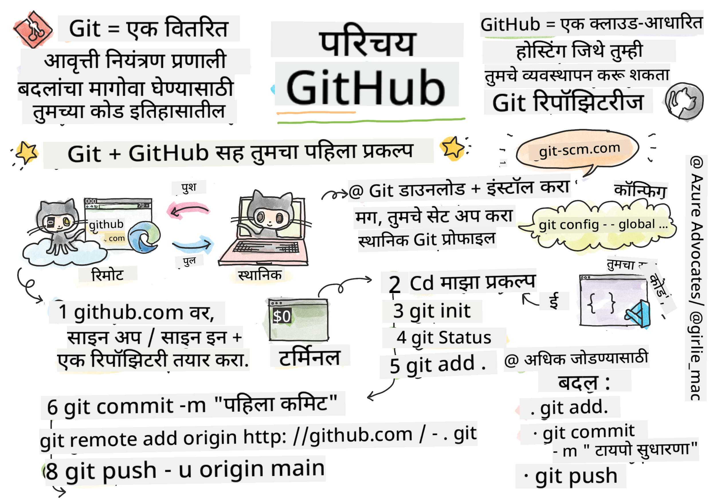
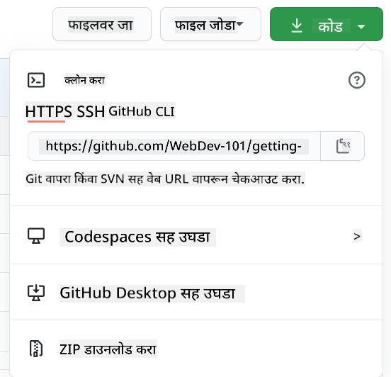

<!--
CO_OP_TRANSLATOR_METADATA:
{
  "original_hash": "acad15f3164cd6348e065ff38619aae9",
  "translation_date": "2025-10-22T16:02:05+00:00",
  "source_file": "1-getting-started-lessons/2-github-basics/README.md",
  "language_code": "mr"
}
-->
# GitHub परिचय

नमस्कार, भविष्यातील विकसक! 👋 जगभरातील लाखो कोडर्समध्ये सामील होण्यासाठी तयार आहात का? तुम्हाला GitHub ची ओळख करून देताना मला खूप आनंद होत आहे – हे प्रोग्रामर्ससाठी सोशल मीडिया प्लॅटफॉर्मसारखे आहे, फक्त येथे तुम्ही तुमच्या लंचचे फोटो शेअर करण्याऐवजी कोड शेअर करता आणि एकत्रितपणे अप्रतिम गोष्टी तयार करता!

माझ्या मनाला खरोखरच आश्चर्य वाटते: तुमच्या फोनवरील प्रत्येक अॅप, तुम्ही भेट दिलेली प्रत्येक वेबसाइट आणि तुम्ही वापरण्यास शिकाल अशी बहुतेक साधने GitHub सारख्या प्लॅटफॉर्मवर सहकार्य करणाऱ्या विकसकांच्या टीमद्वारे तयार केली गेली आहेत. तुम्हाला आवडणारे संगीत अॅप? तुमच्यासारख्या कोणीतरी त्यात योगदान दिले आहे. तुम्ही खेळत असलेला गेम? होय, कदाचित GitHub सहकार्याने तयार केलेला. आणि आता तुम्ही त्या अद्भुत समुदायाचा भाग होण्याचे शिकणार आहात!

मला माहित आहे की सुरुवातीला हे थोडे जास्त वाटू शकते – मी माझ्या पहिल्या GitHub पेजकडे पाहत होतो आणि "याचा अर्थ काय आहे?" असे विचार करत होतो. पण गोष्ट अशी आहे: प्रत्येक विकसक नेमके तिथून सुरुवात करतो जिथे तुम्ही आत्ता आहात. या धड्याच्या शेवटी, तुमच्याकडे तुमचे स्वतःचे GitHub रिपॉझिटरी असेल (ते क्लाउडमधील तुमच्या वैयक्तिक प्रकल्पाचे प्रदर्शन आहे) आणि तुम्हाला तुमचे काम कसे जतन करायचे, इतरांसोबत कसे शेअर करायचे आणि लाखो लोक वापरत असलेल्या प्रकल्पांमध्ये कसे योगदान द्यायचे हे माहित असेल.

आपण एकत्रितपणे हा प्रवास करू, एक पाऊल एकावेळी. घाई नाही, दबाव नाही – फक्त तुम्ही, मी आणि काही खरोखरच छान साधने जी तुमचे नवीन सर्वोत्तम मित्र बनणार आहेत!


> स्केच नोट [Tomomi Imura](https://twitter.com/girlie_mac) द्वारे

## पूर्व-व्याख्यान प्रश्नमंजुषा
[पूर्व-व्याख्यान प्रश्नमंजुषा](https://ff-quizzes.netlify.app)

## परिचय

आम्ही खरोखर रोमांचक गोष्टींमध्ये डुबकी मारण्यापूर्वी, तुमचा संगणक काही GitHub जादूसाठी तयार करूया! याला तुम्ही तुमची कलाकृती तयार करण्यापूर्वी तुमचे कला साहित्य व्यवस्थित करण्यासारखे समजा – योग्य साधने तयार असल्याने सर्व काही अधिक गुळगुळीत आणि खूप मजेदार होते.

मी तुम्हाला प्रत्येक सेटअप चरण वैयक्तिकरित्या मार्गदर्शन करणार आहे आणि मी वचन देतो की ते पहिल्या दृष्टीक्षेपात जितके भयावह दिसते तितके नाही. काहीतरी लगेच क्लिक होत नसेल तर ते पूर्णपणे सामान्य आहे! मी माझे पहिले विकास वातावरण सेट करत होतो आणि प्राचीन हायड्रोग्लिफ्स वाचण्याचा प्रयत्न करत असल्यासारखे वाटत होते. प्रत्येक विकसक नेमके तिथेच होता जिथे तुम्ही आत्ता आहात, विचार करत आहे की ते योग्य करत आहेत का. स्पॉयलर अलर्ट: तुम्ही शिकत असाल तर तुम्ही आधीच योग्य करत आहात! 🌟

या धड्यात, आपण कव्हर करू:

- तुमच्या मशीनवर केलेले काम ट्रॅक करणे
- इतरांसोबत प्रकल्पांवर काम करणे
- ओपन सोर्स सॉफ्टवेअरमध्ये योगदान कसे द्यावे

### पूर्वतयारी

तुमचा संगणक काही GitHub जादूसाठी तयार करूया! काळजी करू नका – हा सेटअप तुम्हाला फक्त एकदाच करावा लागेल आणि मग तुम्ही तुमच्या संपूर्ण कोडिंग प्रवासासाठी तयार व्हाल.

ठीक आहे, आपण पाया सुरू करूया! प्रथम, आपल्याला तपासावे लागेल की Git आधीच तुमच्या संगणकावर आहे का. Git मूलत: एक सुपर-स्मार्ट सहाय्यक असण्यासारखे आहे जो तुम्ही तुमच्या कोडमध्ये केलेले प्रत्येक बदल लक्षात ठेवतो – दर दोन सेकंदांनी Ctrl+S दाबण्यापेक्षा चांगले (आपण सर्व तिथे होतो!).

Git आधीच स्थापित आहे का ते पाहण्यासाठी तुमच्या टर्मिनलमध्ये हा जादुई आदेश टाइप करा:
`git --version`

जर Git अद्याप तिथे नसेल, तर चिंता करू नका! फक्त [Git डाउनलोड करा](https://git-scm.com/downloads) वर जा आणि ते मिळवा. एकदा तुम्ही ते स्थापित केले की, आपल्याला Git ची योग्य ओळख करून द्यावी लागेल:

> 💡 **पहिल्यांदा सेटअप**: हे आदेश Git ला सांगतात की तुम्ही कोण आहात. ही माहिती तुम्ही केलेल्या प्रत्येक कमिटशी जोडली जाईल, त्यामुळे तुम्ही सार्वजनिकपणे शेअर करण्यास आरामदायक असलेले नाव आणि ईमेल निवडा.

```bash
git config --global user.name "your-name"
git config --global user.email "your-email"
```

Git आधीच कॉन्फिगर केले आहे का ते तपासण्यासाठी तुम्ही टाइप करू शकता:
```bash
git config --list
```

तुमच्याकडे GitHub खाते, कोड एडिटर (जसे की Visual Studio Code) असणे आवश्यक आहे आणि तुम्हाला तुमचे टर्मिनल (किंवा: कमांड प्रॉम्प्ट) उघडावे लागेल.

[github.com](https://github.com/) वर जा आणि खाते तयार करा जर तुम्ही आधीच केले नसेल, किंवा लॉग इन करा आणि तुमची प्रोफाइल भरा.

💡 **आधुनिक टिप**: [SSH कीज](https://docs.github.com/en/authentication/connecting-to-github-with-ssh) सेटअप करण्याचा विचार करा किंवा पासवर्डशिवाय सोप्या प्रमाणीकरणासाठी [GitHub CLI](https://cli.github.com/) वापरा.

✅ GitHub हा जगातील एकमेव कोड रिपॉझिटरी नाही; इतरही आहेत, पण GitHub सर्वात प्रसिद्ध आहे.

### तयारी

तुमच्या स्थानिक मशीन (लॅपटॉप किंवा पीसी) वर कोड प्रोजेक्टसह एक फोल्डर आणि GitHub वर एक सार्वजनिक रिपॉझिटरी आवश्यक आहे, जे इतरांच्या प्रकल्पांमध्ये योगदान कसे द्यावे याचे उदाहरण म्हणून काम करेल.

### तुमचा कोड सुरक्षित ठेवणे

चला थोड्या वेळासाठी सुरक्षा बद्दल बोलूया – पण काळजी करू नका, आम्ही तुम्हाला भितीदायक गोष्टींनी गोंधळात टाकणार नाही! या सुरक्षा पद्धती तुमची कार किंवा तुमचे घर लॉक करण्यासारख्या आहेत. ते सोपे सवयी आहेत ज्या दुसऱ्या स्वभाव बनतात आणि तुमचे कठोर परिश्रम सुरक्षित ठेवतात.

आम्ही तुम्हाला सुरुवातीपासून GitHub सह काम करण्याचे आधुनिक, सुरक्षित मार्ग दाखवू. अशा प्रकारे, तुम्ही चांगल्या सवयी विकसित कराल ज्या तुमच्या कोडिंग करिअरमध्ये तुम्हाला चांगल्या प्रकारे सेवा देतील.

GitHub सह काम करताना, सुरक्षा सर्वोत्तम पद्धतींचे पालन करणे महत्त्वाचे आहे:

| सुरक्षा क्षेत्र | सर्वोत्तम पद्धत | का महत्त्वाचे आहे |
|------------------|------------------|--------------------|
| **प्रमाणीकरण** | SSH कीज किंवा वैयक्तिक प्रवेश टोकन वापरा | पासवर्ड कमी सुरक्षित आहेत आणि टप्प्याटप्प्याने बंद केले जात आहेत |
| **दोन-घटक प्रमाणीकरण** | तुमच्या GitHub खात्यावर 2FA सक्षम करा | खात्याचे अतिरिक्त संरक्षण जोडते |
| **रिपॉझिटरी सुरक्षा** | संवेदनशील माहिती कधीही कमिट करू नका | API कीज आणि पासवर्ड सार्वजनिक रिपॉझिटरीमध्ये कधीही असू नयेत |
| **डिपेंडेंसी व्यवस्थापन** | Dependabot अद्यतनांसाठी सक्षम करा | तुमच्या डिपेंडेंसी सुरक्षित आणि अद्ययावत ठेवते |

> ⚠️ **महत्त्वाची सुरक्षा आठवण**: API कीज, पासवर्ड किंवा इतर संवेदनशील माहिती कोणत्याही रिपॉझिटरीमध्ये कधीही कमिट करू नका. संवेदनशील डेटा संरक्षित करण्यासाठी पर्यावरणीय व्हेरिएबल्स आणि `.gitignore` फाइल्स वापरा.

**आधुनिक प्रमाणीकरण सेटअप:**

```bash
# Generate SSH key (modern ed25519 algorithm)
ssh-keygen -t ed25519 -C "your_email@example.com"

# Set up Git to use SSH
git remote set-url origin git@github.com:username/repository.git
```

> 💡 **प्रो टिप**: SSH कीज वारंवार पासवर्ड टाइप करण्याची गरज दूर करतात आणि पारंपरिक प्रमाणीकरण पद्धतींपेक्षा अधिक सुरक्षित आहेत.

---

## तुमचा कोड प्रोप्रमाणे व्यवस्थापित करा

ठीक आहे, आता गोष्टी खरोखरच रोमांचक होतात! 🎉 आपण तुमचा कोड प्रोप्रमाणे ट्रॅक आणि व्यवस्थापित कसा करायचा ते शिकणार आहोत आणि प्रामाणिकपणे, हे शिकवणे माझ्या आवडत्या गोष्टींपैकी एक आहे कारण हे खूप गेम-चेंजर आहे.

कल्पना करा: तुम्ही एक अद्भुत कथा लिहित आहात आणि तुम्हाला प्रत्येक मसुदा, प्रत्येक उत्कृष्ट संपादन आणि प्रत्येक "थांबा, ते विलक्षण आहे!" क्षण ट्रॅक करायचा आहे. Git तुमच्या कोडसाठी नेमके तेच करते! हे सर्वकाही लक्षात ठेवणारे सर्वात अविश्वसनीय टाइम-ट्रॅव्हलिंग नोटबुक असण्यासारखे आहे – प्रत्येक कीस्ट्रोक, प्रत्येक बदल, प्रत्येक "अरे, ते सर्व काही तोडले" क्षण जो तुम्ही त्वरित पूर्ववत करू शकता.

मी प्रामाणिकपणे सांगतो – सुरुवातीला हे थोडे जास्त वाटू शकते. जेव्हा मी सुरुवात केली तेव्हा मला वाटले "मी माझ्या फाइल्स सामान्यपणे का जतन करू शकत नाही?" पण यावर माझा विश्वास ठेवा: एकदा Git तुमच्यासाठी क्लिक केल्यावर (आणि ते होईल!), तुम्हाला एक प्रकाशाचा क्षण येईल जिथे तुम्ही विचार कराल "मी कधीही याशिवाय कोड कसा लिहिला?" हे असे आहे जसे तुम्हाला उडता येते हे शोधणे जेव्हा तुम्ही तुमच्या आयुष्यात सर्वत्र चालत असता!

समजा तुमच्याकडे स्थानिक स्तरावर काही कोड प्रोजेक्टसह एक फोल्डर आहे आणि तुम्हाला git - व्हर्जन कंट्रोल सिस्टम वापरून तुमची प्रगती ट्रॅक करायची आहे. काही लोक git वापरण्याची तुलना तुमच्या भविष्यातील स्वतःसाठी प्रेम पत्र लिहिण्याशी करतात. तुमच्या कमिट संदेशांना काही दिवस, आठवडे किंवा महिने नंतर वाचताना तुम्हाला आठवेल की तुम्ही निर्णय का घेतला, किंवा "रोलबॅक" बदल – म्हणजे, जेव्हा तुम्ही चांगले "कमिट संदेश" लिहिता.

### कार्य: तुमचे पहिले रिपॉझिटरी तयार करा!

> 🎯 **तुमचे मिशन (आणि मला तुमच्यासाठी खूप उत्साह आहे!)**: आपण एकत्रितपणे तुमचे पहिले GitHub रिपॉझिटरी तयार करणार आहोत! येथे आपण संपविल्यानंतर, तुमच्या कोडचे जिथे वास्तव्य आहे ते तुमच्या इंटरनेटचा स्वतःचा छोटासा कोपरा असेल आणि तुम्ही तुमचे पहिले "कमिट" केले असेल (ते विकसक भाषेत तुमचे काम खूप स्मार्ट पद्धतीने जतन करण्यासाठी आहे).
>
> हे प्रामाणिकपणे खूप खास क्षण आहे – तुम्ही विकसकांच्या जागतिक समुदायात अधिकृतपणे सामील होणार आहात! मी माझे पहिले रिपॉझिटरी तयार करण्याचा थरार अजूनही लक्षात ठेवतो आणि विचार केला "वा, मी खरोखरच हे करत आहे!"

चला एकत्रितपणे हे साहस पार करूया, चरण-दर-चरण. प्रत्येक भागासाठी तुमचा वेळ घ्या – घाई करण्यासाठी कोणतेही बक्षीस नाही आणि मी वचन देतो की प्रत्येक चरण अर्थपूर्ण होईल. लक्षात ठेवा, तुम्ही प्रशंसा करत असलेला प्रत्येक कोडिंग सुपरस्टार एकदा नेमके तिथे बसला होता जिथे तुम्ही आहात, त्यांचे पहिले रिपॉझिटरी तयार करण्याच्या तयारीत. किती छान आहे ना?

> व्हिडिओ पहा
> 
> [](https://www.youtube.com/watch?v=9R31OUPpxU4)

**चला हे एकत्र करूया:**

1. **GitHub वर तुमचे रिपॉझिटरी तयार करा**. GitHub.com वर जा आणि तो चमकदार हिरवा **नवीन** बटन (किंवा वरच्या उजव्या कोपऱ्यातील **+** चिन्ह) शोधा. त्यावर क्लिक करा आणि **नवीन रिपॉझिटरी** निवडा.

   येथे काय करायचे आहे:
   1. तुमच्या रिपॉझिटरीला नाव द्या – ते तुमच्यासाठी अर्थपूर्ण ठेवा!
   1. तुम्हाला हवे असल्यास वर्णन जोडा (यामुळे इतरांना तुमचा प्रकल्प काय आहे हे समजण्यास मदत होते)
   1. तुम्हाला ते सार्वजनिक (सर्वांना दिसेल) किंवा खाजगी (फक्त तुमच्यासाठी) हवे आहे का ते ठरवा
   1. README फाइल जोडण्यासाठी बॉक्स तपासण्याची शिफारस करतो – हे तुमच्या प्रोजेक्टचे फ्रंट पेज आहे
   1. **रिपॉझिटरी तयार करा** वर क्लिक करा आणि साजरा करा – तुम्ही तुमचे पहिले रिपॉझिटरी तयार केले आहे! 🎉

2. **तुमच्या प्रोजेक्ट फोल्डरवर जा**. आता तुमचे टर्मिनल उघडूया (काळजी करू नका, ते दिसते तितके भयानक नाही!). आपल्याला आपल्या संगणकाला सांगावे लागेल की आपले प्रोजेक्ट फाइल्स कुठे आहेत. हा आदेश टाइप करा:

   ```bash
   cd [name of your folder]
   ```

   **आम्ही येथे काय करत आहोत:**
   - आम्ही मूलत: म्हणत आहोत "अरे संगणका, मला माझ्या प्रोजेक्ट फोल्डरकडे घेऊन जा"
   - हे तुमच्या डेस्कटॉपवरील विशिष्ट फोल्डर उघडण्यासारखे आहे, परंतु आम्ही ते मजकूर आदेशांसह करत आहोत
   - `[तुमच्या फोल्डरचे नाव]` वास्तविक प्रोजेक्ट फोल्डरच्या नावाने बदला

3. **तुमच्या फोल्डरला Git रिपॉझिटरीमध्ये बदला**. येथे जादू घडते! टाइप करा:

   ```bash
   git init
   ```

   **आम्ही काय केले (खूप छान गोष्ट!):**
   - Git ने तुमच्या प्रोजेक्टमध्ये एक लपलेला `.git` फोल्डर तयार केला – तुम्हाला तो दिसणार नाही, पण तो तिथे आहे!
   - तुमचा नियमित फोल्डर आता एक "रिपॉझिटरी" आहे जो तुम्ही केलेला प्रत्येक बदल ट्रॅक करू शकतो
   - हे तुमच्या फोल्डरला सर्वकाही लक्षात ठेवण्यासाठी सुपरपॉवर देण्यासारखे आहे

4. **काय चालले आहे ते तपासा**. चला पाहूया की Git सध्या तुमच्या प्रोजेक्टबद्दल काय विचार करतो:

   ```bash
   git status
   ```

   **Git तुम्हाला काय सांगत आहे ते समजून घेणे:**
   
   तुम्हाला असे काही दिसू शकते:

   ```output
   Changes not staged for commit:
   (use "git add <file>..." to update what will be committed)
   (use "git restore <file>..." to discard changes in working directory)

        modified:   file.txt
        modified:   file2.txt
   ```

   **घाबरू नका! याचा अर्थ काय आहे:**
   - **लाल रंगातील फाइल्स** म्हणजे फाइल्स ज्यामध्ये बदल आहेत पण जतन करण्यासाठी तयार नाहीत
   - **हिरव्या रंगातील फाइल्स** (जेव्हा तुम्ही त्यांना पाहता) जतन करण्यासाठी तयार आहेत
   - Git तुम्हाला पुढे काय करता येईल याबद्दल नेमके सांगून उपयुक्त ठरत आहे

   > 💡 **प्रो टिप**: `git status` आदेश तुमचा सर्वोत्तम मित्र आहे! तुम्हाला गोंधळ वाटत असल्यास ते वापरा. हे Git ला विचारण्यासारखे आहे "अरे, सध्या काय परिस्थिती आहे?"

5. **तुमच्या फाइल्स जतन करण्यासाठी तयार करा** (याला "स्टेजिंग" म्हणतात):

   ```bash
   git add .
   ```

   **आम्ही काय केले:**
   - आम्ही Git ला सांगितले "अरे, मी माझ्या पुढील जतनामध्ये माझ्या सर्व फाइल्स समाविष्ट करू इच्छितो"
   - `.` म्हणजे "या फोल्डरमधील सर्वकाही"
   - आता तुमच्या फाइल्स "स्टेज" झाल्या आहेत आणि पुढील चरणासाठी तयार आहेत

   **अधिक निवडक व्हायचे आहे?** तुम्ही फक्त विशिष्ट फाइल्स जोडू शकता:

   ```bash
   git add [file or folder name]
   ```

   **तुम्हाला हे का करायचे आहे?**
   - कधी कधी तुम्हाला संबंधित बदल एकत्रितपणे जतन करायचे असतात
   - हे तुम्हाला तुमचे काम तार्किक भागांमध्ये व्यवस्थित करण्यात मदत करते
   - काय बदलले आणि कधी बदलले हे समजणे सोपे करते

   **तुमचे मत बदलले?** काळजी करू नका! तुम्ही फाइल्स अशा प्रकारे अनस्टेज करू शकता:

   ```bash
   # Unstage everything
   git reset
   
   # Unstage just one file
   git reset [file name]
   ```

   काळजी करू नका – यामुळे तुमचे काम हटवले जात नाही, फक्त फाइल्स "जतन करण्य
   - आम्ही तुमच्या स्थानिक प्रोजेक्ट आणि GitHub रेपॉझिटरीमध्ये कनेक्शन तयार केले आहे.
   - "Origin" हे तुमच्या GitHub रेपॉझिटरीसाठी फक्त एक टोपणनाव आहे – जसे की फोनमध्ये संपर्क जोडणे.
   - आता तुमचा स्थानिक Git तयार आहे, जेव्हा तुम्ही तुमचा कोड शेअर करण्यासाठी तयार असाल तेव्हा तो कोठे पाठवायचा हे त्याला माहीत आहे.

   💡 **सोपा मार्ग**: जर तुमच्याकडे GitHub CLI इंस्टॉल असेल, तर तुम्ही हे एका कमांडमध्ये करू शकता:
   ```bash
   gh repo create my-repo --public --push --source=.
   ```

8. **तुमचा कोड GitHub वर पाठवा** (महत्त्वाचा क्षण!):

   ```bash
   git push -u origin main
   ```

   **🚀 हेच ते! तुम्ही तुमचा कोड GitHub वर अपलोड करत आहात!**
   
   **काय होत आहे:**
   - तुमचे commits तुमच्या संगणकावरून GitHub वर जात आहेत.
   - `-u` फ्लॅग एक कायमस्वरूपी कनेक्शन सेट करते जेणेकरून भविष्यातील पुश करणे सोपे होईल.
   - "main" हे तुमच्या प्राथमिक शाखेचे नाव आहे (जसे मुख्य फोल्डर).
   - यानंतर, भविष्यातील अपलोडसाठी तुम्ही फक्त `git push` टाइप करू शकता!

   💡 **लवकर टिप**: जर तुमची शाखा "master" सारखी काहीतरी वेगळ्या नावाने असेल, तर ते नाव वापरा. तुम्ही `git branch --show-current` वापरून तपासू शकता.

9. **तुमचा नवीन रोजचा कोडिंग रिदम** (इथेच मजा सुरू होते!):

   आता पुढे, जेव्हा तुम्ही तुमच्या प्रोजेक्टमध्ये बदल कराल, तुम्हाला हा सोपा तीन-स्टेप डान्स करायचा आहे:

   ```bash
   git add .
   git commit -m "describe what you changed"
   git push
   ```

   **हे तुमचे कोडिंग हार्टबीट बनते:**
   - तुमच्या कोडमध्ये काही अप्रतिम बदल करा ✨
   - `git add` ने त्यांना स्टेज करा ("हे Git, या बदलांकडे लक्ष द्या!")
   - `git commit` आणि एक वर्णनात्मक संदेशासह त्यांना सेव्ह करा (भविष्यातील तुम्ही तुमचे आभार मानाल!)
   - `git push` वापरून ते जगासोबत शेअर करा 🚀
   - पुन्हा करा – खरंच, हे श्वास घेण्याइतके नैसर्गिक बनते!

   मला हा वर्कफ्लो आवडतो कारण हे व्हिडिओ गेममध्ये अनेक सेव्ह पॉइंट्स असण्यासारखे आहे. तुम्हाला आवडलेला बदल केला? Commit करा! काहीतरी धोकादायक प्रयत्न करायचे आहे? काही हरकत नाही – जर गोष्टी बिघडल्या तर तुम्ही नेहमी तुमच्या शेवटच्या commit वर परत जाऊ शकता!

   > 💡 **टिप**: तुम्हाला `.gitignore` फाइल स्वीकारायची इच्छा असू शकते जेणेकरून तुम्ही ट्रॅक करू इच्छित नसलेल्या फाइल्स GitHub वर दिसणार नाहीत - जसे की नोट्स फाइल जी तुम्ही त्याच फोल्डरमध्ये ठेवता पण सार्वजनिक रेपॉझिटरीमध्ये त्याचे स्थान नाही. तुम्ही `.gitignore` फाइल्ससाठी टेम्पलेट्स [.gitignore templates](https://github.com/github/gitignore) येथे शोधू शकता किंवा [gitignore.io](https://www.toptal.com/developers/gitignore) वापरून एक तयार करू शकता.

#### आधुनिक Git वर्कफ्लो

या आधुनिक पद्धती स्वीकारण्याचा विचार करा:

- **Conventional Commits**: `feat:`, `fix:`, `docs:` इत्यादीसारख्या प्रमाणित commit संदेश स्वरूपाचा वापर करा. अधिक जाणून घ्या [conventionalcommits.org](https://www.conventionalcommits.org/) येथे.
- **Atomic commits**: प्रत्येक commit एकच तर्कसंगत बदल दर्शवतो.
- **Frequent commits**: मोठ्या, क्वचितच होणाऱ्या commits ऐवजी वर्णनात्मक संदेशांसह वारंवार commit करा.

#### Commit संदेश

एक उत्कृष्ट Git commit विषय ओळ खालील वाक्य पूर्ण करते:
जर लागू केले, तर हा commit <तुमचा विषय इथे> करेल.

विषयासाठी, आज्ञार्थी, वर्तमानकाळाचा वापर करा: "change" "changed" किंवा "changes" नाही. 
विषयासारखेच, शरीरात (पर्यायी) देखील आज्ञार्थी, वर्तमानकाळाचा वापर करा. शरीरात बदलासाठी प्रेरणा समाविष्ट करावी आणि मागील वर्तनाशी तुलना करावी. तुम्ही `का` स्पष्ट करत आहात, `कसे` नाही.

✅ GitHub वर थोडे फिरा. तुम्हाला खरोखरच उत्कृष्ट commit संदेश सापडतो का? तुम्हाला खूपच कमी माहिती असलेला संदेश सापडतो का? commit संदेशामध्ये कोणती माहिती सर्वात महत्त्वाची आणि उपयुक्त आहे असे तुम्हाला वाटते?

## इतरांसोबत काम करणे (मजेदार भाग!)

तुमची टोपी धरून ठेवा कारण इथेच GitHub पूर्णपणे जादुई बनते! 🪄 तुम्ही तुमचा स्वतःचा कोड व्यवस्थापित करण्यात पारंगत झाला आहात, पण आता आम्ही माझा सर्वात आवडता भाग – जगभरातील आश्चर्यकारक लोकांसोबत सहयोग करणे – यामध्ये डुबकी मारत आहोत.

कल्पना करा: तुम्ही उद्या उठता आणि पाहता की टोकियोमधील कोणीतरी तुमचा कोड सुधारला आहे, जेव्हा तुम्ही झोपले होते. मग बर्लिनमधील कोणीतरी तुम्हाला अडचणीत टाकणारी बग दुरुस्त करते. दुपारपर्यंत, साओ पाउलोमधील एक विकसक तुम्ही कधी विचार केला नाही असा एक फिचर जोडतो. हे विज्ञान कल्पनारम्य नाही – हे फक्त GitHub विश्वातील मंगळवार आहे!

मला खरोखरच उत्साहित करणारी गोष्ट म्हणजे तुम्ही शिकत असलेल्या सहयोग कौशल्य? हे अगदी तेच वर्कफ्लो आहेत जे Google, Microsoft आणि तुमच्या आवडत्या स्टार्टअप्समधील टीम्स दररोज वापरतात. तुम्ही फक्त एक छान साधन शिकत नाही आहात – तुम्ही गुप्त भाषा शिकत आहात जी संपूर्ण सॉफ्टवेअर जगाला एकत्र काम करण्यास सक्षम करते.

खरंच, जेव्हा तुम्ही तुमचा पहिला pull request merge होण्याचा आनंद अनुभवता, तेव्हा तुम्हाला समजेल की विकसक ओपन सोर्सबद्दल इतके उत्साही का होतात. हे जगातील सर्वात मोठ्या, सर्वात सर्जनशील टीम प्रोजेक्टचा भाग असल्यासारखे आहे!

> व्हिडिओ पहा
>
> [](https://www.youtube.com/watch?v=bFCM-PC3cu8)

GitHub वर गोष्टी ठेवण्याचे मुख्य कारण म्हणजे इतर विकसकांसोबत सहयोग करणे शक्य करणे.

तुमच्या रेपॉझिटरीमध्ये, `Insights > Community` वर जा आणि तुमचा प्रोजेक्ट शिफारस केलेल्या समुदाय मानकांशी कसा तुलना करतो ते पहा.

तुमची रेपॉझिटरी व्यावसायिक आणि स्वागतार्ह दिसण्यासाठी इच्छुक आहात? तुमच्या रेपॉझिटरीकडे जा आणि `Insights > Community` वर क्लिक करा. ही छान सुविधा तुम्हाला दाखवते की GitHub समुदाय "चांगल्या रेपॉझिटरी पद्धती" मानतो त्यांच्याशी तुमचा प्रोजेक्ट कसा तुलना करतो.

> 🎯 **तुमचा प्रोजेक्ट चमकदार बनवणे**: चांगल्या प्रकारे आयोजित केलेली रेपॉझिटरी चांगल्या दस्तऐवजीकरणासह स्वच्छ, स्वागतार्ह स्टोअरफ्रंटसारखी आहे. हे लोकांना तुमच्या कामाची काळजी आहे हे सांगते आणि इतरांना योगदान देण्याची इच्छा निर्माण करते!

**एक रेपॉझिटरी उत्कृष्ट बनवण्यासाठी काय आवश्यक आहे:**

| काय जोडायचे | का महत्त्वाचे आहे | तुमच्यासाठी काय करते |
|-------------|-------------------|---------------------|
| **Description** | पहिली छाप महत्त्वाची आहे! | लोकांना त्वरित कळते की तुमचा प्रोजेक्ट काय करतो |
| **README** | तुमच्या प्रोजेक्टचे मुख्य पृष्ठ | नवीन अभ्यागतांसाठी एक मैत्रीपूर्ण मार्गदर्शकासारखे |
| **Contributing Guidelines** | तुम्ही मदत स्वागत करता हे दाखवते | लोकांना नक्की कळते की ते तुम्हाला कसे मदत करू शकतात |
| **Code of Conduct** | एक मैत्रीपूर्ण जागा तयार करते | प्रत्येकजण सहभागी होण्यासाठी स्वागतार्ह वाटतो |
| **License** | कायदेशीर स्पष्टता | इतरांना तुमचा कोड कसा वापरायचा हे कळते |
| **Security Policy** | तुम्ही जबाबदार आहात हे दाखवते | व्यावसायिक पद्धती दर्शवते |

> 💡 **प्रो टिप**: GitHub या सर्व फाइल्ससाठी टेम्पलेट्स प्रदान करते. नवीन रेपॉझिटरी तयार करताना, या फाइल्स स्वयंचलितपणे तयार करण्यासाठी बॉक्स तपासा.

**आधुनिक GitHub वैशिष्ट्ये एक्सप्लोर करा:**

🤖 **ऑटोमेशन आणि CI/CD:**
- **GitHub Actions** स्वयंचलित चाचणी आणि तैनातीसाठी
- **Dependabot** स्वयंचलित dependency अपडेटसाठी

💬 **समुदाय आणि प्रोजेक्ट व्यवस्थापन:**
- **GitHub Discussions** समस्यांपलीकडे समुदाय संभाषणांसाठी
- **GitHub Projects** कानबन-शैली प्रोजेक्ट व्यवस्थापनासाठी
- **Branch protection rules** कोड गुणवत्ता मानके लागू करण्यासाठी

हे सर्व संसाधने नवीन टीम सदस्यांना ऑनबोर्डिंगसाठी फायदेशीर ठरतील. आणि हीच ती गोष्टी आहेत ज्याकडे नवीन योगदानकर्ते तुमचा कोड पाहण्याआधी लक्ष देतात, हे शोधण्यासाठी की तुमचा प्रोजेक्ट त्यांचा वेळ घालवण्यासाठी योग्य ठिकाण आहे का.

✅ README फाइल्स, जरी त्यांना तयार करण्यासाठी वेळ लागतो, व्यस्त देखभाल करणाऱ्यांकडून अनेकदा दुर्लक्षित केल्या जातात. तुम्हाला विशेषतः वर्णनात्मक README फाइलचा एक उदाहरण सापडते का? लक्षात ठेवा: [चांगल्या README तयार करण्यासाठी काही साधने](https://www.makeareadme.com/) आहेत जी तुम्हाला वापरायची इच्छा असू शकते.

### कार्य: काही कोड merge करा

Contributing दस्तऐवज लोकांना प्रोजेक्टमध्ये योगदान देण्यास मदत करतो. हे स्पष्ट करते की तुम्ही कोणत्या प्रकारचे योगदान शोधत आहात आणि प्रक्रिया कशी कार्य करते. योगदानकर्त्यांना GitHub वर तुमच्या रेपॉझिटरीमध्ये योगदान देण्यासाठी काही चरणांमधून जावे लागेल:

1. **तुमची रेपॉझिटरी fork करणे** तुम्हाला कदाचित लोकांना तुमचा प्रोजेक्ट _fork_ करायचा असेल. Forking म्हणजे त्यांच्या GitHub प्रोफाइलवर तुमच्या रेपॉझिटरीची प्रत तयार करणे.
1. **Clone**. त्यानंतर ते प्रोजेक्ट त्यांच्या स्थानिक मशीनवर clone करतील.
1. **शाखा तयार करा**. तुम्हाला त्यांना त्यांच्या कामासाठी एक _शाखा_ तयार करण्यास सांगायचे आहे.
1. **त्यांचा बदल एका क्षेत्रावर केंद्रित करा**. योगदानकर्त्यांना एकावेळी एका गोष्टीवर लक्ष केंद्रित करण्यास सांगा - अशा प्रकारे तुम्ही त्यांचे काम _merge_ करण्याची शक्यता जास्त आहे. कल्पना करा त्यांनी बग फिक्स लिहिली, नवीन फिचर जोडले आणि अनेक चाचण्या अपडेट केल्या - काय असेल जर तुम्हाला, किंवा तुम्ही फक्त 3 पैकी 2 किंवा 1 बदल लागू करू शकता?

✅ शाखा चांगला कोड लिहिण्यासाठी आणि शिप करण्यासाठी विशेषतः महत्त्वाच्या असलेल्या परिस्थितीची कल्पना करा. तुम्ही कोणते उपयोग प्रकरणे विचार करू शकता?

> लक्षात ठेवा, तुम्ही जगात पाहू इच्छित असलेल्या बदलाचे प्रतीक बना आणि तुमच्या स्वतःच्या कामासाठी शाखा तयार करा. तुम्ही केलेले कोणतेही commits तुम्ही सध्या "चेक आउट" केलेल्या शाखेवर केले जातील. `git status` वापरून ती कोणती शाखा आहे ते पहा.

चला योगदानकर्ता वर्कफ्लो पाहूया. गृहीत धरा की योगदानकर्त्याने आधीच रेपॉझिटरी _fork_ आणि _clone_ केली आहे त्यामुळे त्यांच्याकडे स्थानिक मशीनवर काम करण्यासाठी Git रेपॉझिटरी तयार आहे:

1. **शाखा तयार करा**. `git branch` कमांड वापरून शाखा तयार करा जी ते योगदान देण्याचा विचार करत असलेल्या बदलांचा समावेश करेल:

   ```bash
   git branch [branch-name]
   ```

   > 💡 **आधुनिक दृष्टिकोन**: तुम्ही एका कमांडमध्ये नवीन शाखा तयार करू शकता आणि त्यावर स्विच करू शकता:
   ```bash
   git switch -c [branch-name]
   ```

1. **कामाच्या शाखेवर स्विच करा**. निर्दिष्ट शाखेवर स्विच करा आणि `git switch` वापरून कार्यरत निर्देशिका अपडेट करा:

   ```bash
   git switch [branch-name]
   ```

   > 💡 **आधुनिक टिप**: शाखा बदलताना `git switch` हे `git checkout` चे आधुनिक पर्याय आहे. हे स्पष्ट आणि सुरक्षीत आहे.

1. **काम करा**. या टप्प्यावर तुम्हाला तुमचे बदल जोडायचे आहेत. खालील कमांडसह Git ला त्याबद्दल सांगायला विसरू नका:

   ```bash
   git add .
   git commit -m "my changes"
   ```

   > ⚠️ **Commit संदेश गुणवत्ता**: तुमच्या commit ला चांगले नाव द्या, तुमच्यासाठी आणि तुम्ही मदत करत असलेल्या रेपॉझिटरीच्या देखभालकर्त्यासाठी. तुम्ही काय बदलले याबद्दल विशिष्ट रहा!

1. **तुमचे काम `main` शाखेसोबत एकत्र करा**. काही वेळाने तुम्ही काम पूर्ण केले आहे आणि तुम्हाला तुमचे काम `main` शाखेसोबत एकत्र करायचे आहे. दरम्यान `main` शाखा बदलली असू शकते त्यामुळे खालील कमांडसह ती प्रथम नवीनतमवर अपडेट करा:

   ```bash
   git switch main
   git pull
   ```

   या टप्प्यावर तुम्हाला खात्री करायची आहे की कोणतेही _conflicts_, ज्या परिस्थितीत Git सहजपणे _combine_ करू शकत नाही, तुमच्या कार्यरत शाखेत होतात. म्हणून खालील कमांड चालवा:

   ```bash
   git switch [branch_name]
   git merge main
   ```

   `git merge main` कमांड `main` मधील सर्व बदल तुमच्या शाखेत आणेल. आशा आहे की तुम्ही फक्त पुढे जाऊ शकता. जर तसे नसेल, तर VS Code तुम्हाला सांगेल की Git _गोंधळलेला_ आहे आणि तुम्ही प्रभावित फाइल्स बदलून सर्वात अचूक सामग्री सांगू शकता.

   💡 **आधुनिक पर्याय**: स्वच्छ इतिहासासाठी `git rebase` वापरण्याचा विचार करा:
   ```bash
   git rebase main
   ```
   हे तुमचे commits नवीनतम main शाखेच्या वर पुन्हा प्ले करते, एक रेखीय इतिहास तयार करते.

1. **तुमचे काम GitHub वर पाठवा**. तुमचे काम GitHub वर पाठवणे म्हणजे दोन गोष्टी. तुमची शाखा तुमच्या रेपॉझिटरीवर पुश करणे आणि नंतर PR, Pull Request उघडणे.

   ```bash
   git push --set-upstream origin [branch-name]
   ```

   वरील कमांड तुमच्या forked रेपॉझिटरीवर शाखा तयार करते.

1. **PR उघडा**. पुढे, तुम्हाला PR उघडायचा आहे. तुम्ही GitHub वर forked रेपॉझिटरीवर नेव्हिगेट करून ते करता. GitHub वर तुम्हाला एक सूचक दिसेल जिथे ते विचारते की तुम्हाला नवीन PR तयार करायचा आहे का, तुम्ही त्यावर क्लिक करता आणि तुम्हाला एक इंटरफेसवर नेले जाते जिथे तुम्ही commit संदेश शीर्षक बदलू शकता, त्याला अधिक योग्य वर्णन देऊ शकता. आता तुम्ही fork केलेल्या रेपॉझिटरीचा देखभालकर्ता हा PR पाहील आणि _बोटे क्रॉस करून_ ते तुमचा PR _merge_ करतील. तुम्ही आता योगदानकर्ता आहात, याय :)

   💡 **आधुनिक टिप**: तुम्ही GitHub CLI वापरून PR देखील तयार करू शकता:
   ```bash
   gh pr create --title "Your PR title" --body "Description of changes"
   ```

   🔧 **PR साठी सर्वोत्तम पद्धती**:
   - संबंधित समस्यांना "Fixes #123" सारख्या कीवर्डसह लिंक करा.
   - UI बदलांसाठी स्क्रीनशॉट जोडा.
   - विशिष्ट पुनरावलोकनकर्त्यांची विनंती करा.
   - काम चालू असलेल्या draft PR वापरा.
   - पुनरावलोकनाची विनंती करण्यापूर्वी सर्व CI तपासण्या पास झाल्या आहेत याची खात्री करा.

1. **स्वच्छता करा**. तुम्ही यशस्वीरित्या PR merge केल्यानंतर _स्वच्छता_ करणे चांगली पद्धत मानली जाते. तुम्हाला तुमची स्थानिक शाखा आणि तुम्ही GitHub वर पुश केलेली शाखा साफ करायची आहे. प्रथम खालील कमांडसह ती स्थानिकपणे हटवा:

   ```bash
   git branch -d [branch-name]
   ```

   नंतर GitHub पृष्ठावर forked रेपॉझिटरीसाठी जा आणि तुम्ही त्यावर पुश केलेली remote शाखा काढा.

`Pull request` हा शब्द मूर्ख वाटतो कारण खरं तर तुम्हाला तुमचे बदल प्रोजेक्टमध्ये पुश करायचे आहेत. पण देखभालकर्ता (प्रोजेक्ट मालक) किंवा कोर टीमला प्रोज
🤞सर्व चाचण्या यशस्वी होतील आणि प्रकल्प मालक तुमचे बदल प्रकल्पात समाविष्ट करतील अशी आशा आहे🤞

तुमच्या स्थानिक शाखेत GitHub वरील संबंधित रिमोट शाखेतील सर्व नवीन कमिट्ससह अद्यतन करा:

`git pull`

## ओपन सोर्समध्ये योगदान द्या (तुमची प्रभाव टाकण्याची संधी!)

तुम्ही काहीतरी जबरदस्त अनुभवायला तयार आहात का? 🤯 चला ओपन सोर्स प्रकल्पांमध्ये योगदान देण्याबद्दल बोलूया – आणि हे तुमच्यासोबत शेअर करताना मला खूप उत्साह वाटतो!

हे तुमच्यासाठी काहीतरी विलक्षण गोष्टीचा भाग होण्याची संधी आहे. कल्पना करा, दररोज लाखो विकसक वापरत असलेल्या साधनांमध्ये सुधारणा करणे किंवा तुमच्या मित्रांना आवडणाऱ्या अॅपमधील बग दुरुस्त करणे. हे फक्त स्वप्न नाही – हेच ओपन सोर्स योगदान आहे!

मला नेहमीच रोमांचक वाटते: तुम्ही शिकत असलेल्या प्रत्येक साधनाने – तुमचा कोड एडिटर, आपण एक्सप्लोर करणार असलेले फ्रेमवर्क, अगदी तुम्ही वाचत असलेला ब्राउझर – एखाद्या व्यक्तीने सुरुवात केली होती, ज्याने त्यांचे पहिले योगदान दिले होते. तुमच्या आवडत्या VS Code एक्सटेंशन तयार करणारा तो प्रतिभावान विकसक? ते एकदा नवशिक्या होते, ज्यांनी "create pull request" वर क्लिक केले होते, अगदी तुम्ही करणार आहात तसे.

आणि सर्वात सुंदर भाग म्हणजे: ओपन सोर्स समुदाय म्हणजे इंटरनेटचा सर्वात मोठा गट आलिंगन आहे. बहुतेक प्रकल्प नवशिक्यांसाठी सक्रियपणे शोध घेतात आणि "good first issue" टॅग असलेल्या समस्या ठेवतात, विशेषतः तुमच्यासारख्या लोकांसाठी! मेंटेनर्स नवीन योगदानकर्त्यांना पाहून खरोखर उत्साहित होतात कारण त्यांना त्यांच्या स्वतःच्या पहिल्या पायऱ्या आठवतात.

तुम्ही इथे फक्त कोड शिकत नाही – तुम्ही बिल्डर्सच्या जागतिक कुटुंबात सामील होण्यासाठी तयार होत आहात जे दररोज उठून विचार करतात "डिजिटल जग थोडं चांगलं कसं बनवता येईल?" क्लबमध्ये तुमचं स्वागत आहे! 🌟

सर्वप्रथम, GitHub वर तुम्हाला आवडणाऱ्या आणि ज्यामध्ये तुम्हाला बदल करायचा आहे अशा रिपॉझिटरी (किंवा **repo**) शोधूया. तुम्हाला त्याची सामग्री तुमच्या मशीनवर कॉपी करायची असेल.

✅ 'नवशिक्या-अनुकूल' रिपॉझिटरी शोधण्याचा एक चांगला मार्ग म्हणजे [टॅग 'good-first-issue' ने शोधा](https://github.blog/2020-01-22-browse-good-first-issues-to-start-contributing-to-open-source/).



कोड कॉपी करण्याचे अनेक मार्ग आहेत. एक मार्ग म्हणजे HTTPS, SSH किंवा GitHub CLI (कमांड लाइन इंटरफेस) वापरून रिपॉझिटरीची सामग्री "क्लोन" करणे.

तुमचा टर्मिनल उघडा आणि रिपॉझिटरी क्लोन करा:
```bash
# Using HTTPS
git clone https://github.com/ProjectURL

# Using SSH (requires SSH key setup)
git clone git@github.com:username/repository.git

# Using GitHub CLI
gh repo clone username/repository
```

प्रकल्पावर काम करण्यासाठी, योग्य फोल्डरमध्ये जा:
`cd ProjectURL`

तुम्ही संपूर्ण प्रकल्प उघडू शकता:
- **[GitHub Codespaces](https://github.com/features/codespaces)** - GitHub चा क्लाउड डेव्हलपमेंट वातावरण, ब्राउझरमध्ये VS Code सह
- **[GitHub Desktop](https://desktop.github.com/)** - Git ऑपरेशन्ससाठी GUI अॅप्लिकेशन  
- **[GitHub.dev](https://github.dev)** - कोणत्याही GitHub रिपॉझिटरीवर `.` की प्रेस करा आणि ब्राउझरमध्ये VS Code उघडा
- **VS Code** GitHub Pull Requests एक्सटेंशनसह

शेवटी, तुम्ही कोड झिप केलेल्या फोल्डरमध्ये डाउनलोड करू शकता.

### GitHub बद्दल काही अधिक मनोरंजक गोष्टी

तुम्ही GitHub वर कोणत्याही सार्वजनिक रिपॉझिटरीला स्टार, वॉच आणि/किंवा "fork" करू शकता. तुमच्या स्टार केलेल्या रिपॉझिटरी तुम्हाला टॉप-राइट ड्रॉप-डाउन मेनूमध्ये सापडतील. हे बुकमार्किंगसारखे आहे, पण कोडसाठी.

प्रकल्पांमध्ये एक इश्यू ट्रॅकर असतो, मुख्यतः GitHub वर "Issues" टॅबमध्ये, जोपर्यंत अन्यथा सूचित केले जात नाही, जिथे लोक प्रकल्पाशी संबंधित समस्यांवर चर्चा करतात. आणि Pull Requests टॅब हा आहे जिथे लोक प्रगतीपथावर असलेल्या बदलांवर चर्चा आणि पुनरावलोकन करतात.

प्रकल्पांमध्ये फोरम, मेलिंग लिस्ट किंवा Slack, Discord किंवा IRC सारख्या चॅट चॅनेलमध्ये चर्चा देखील असू शकते.

🔧 **आधुनिक GitHub वैशिष्ट्ये**:
- **GitHub Discussions** - समुदाय चर्चेसाठी अंगभूत फोरम
- **GitHub Sponsors** - मेंटेनर्सना आर्थिक मदत करा  
- **Security tab** - असुरक्षितता अहवाल आणि सुरक्षा सल्लागार
- **Actions tab** - स्वयंचलित वर्कफ्लो आणि CI/CD पाइपलाइन पहा
- **Insights tab** - योगदानकर्ते, कमिट्स आणि प्रकल्पाच्या आरोग्याबद्दल विश्लेषण
- **Projects tab** - GitHub चे अंगभूत प्रकल्प व्यवस्थापन साधने

✅ तुमच्या नवीन GitHub रिपॉझिटरीचा शोध घ्या आणि काही गोष्टी करून पहा, जसे की सेटिंग्ज संपादित करणे, तुमच्या रिपॉझिटरीमध्ये माहिती जोडणे, प्रकल्प तयार करणे (जसे की Kanban बोर्ड), आणि GitHub Actions सेट करणे. तुम्ही खूप काही करू शकता!

---

## 🚀 आव्हान 

ठीक आहे, आता तुमच्या नवीन GitHub कौशल्यांची चाचणी घेण्याची वेळ आली आहे! 🚀 हे आव्हान तुम्हाला सर्वकाही समजून घेण्यास मदत करेल:

तुमच्या मित्राला (किंवा त्या कुटुंबातील सदस्याला जो नेहमी विचारतो की तुम्ही या "कॉम्प्युटर गोष्टी"सह काय करत आहात) पकडा आणि एकत्र एक सहकार्यात्मक कोडिंग साहस सुरू करा! इथे खरी जादू घडते – एक प्रकल्प तयार करा, त्यांना ते fork करू द्या, काही शाखा तयार करा आणि तुम्ही प्रोफेशनल्ससारखे बदल मर्ज करा.

मी खोटं बोलणार नाही – तुम्ही कदाचित हसाल (विशेषतः जेव्हा तुम्ही दोघे एकाच ओळीत बदल करण्याचा प्रयत्न कराल), कदाचित गोंधळून जाल, पण तुम्हाला नक्कीच काही आश्चर्यकारक "अरे वा!" क्षण मिळतील जे सर्व शिकण्यासारखे आहेत. शिवाय, कोणासोबत पहिला यशस्वी मर्ज शेअर करण्यामध्ये काहीतरी खास आहे – हे तुम्ही किती पुढे आला आहात याचा एक छोटासा उत्सव आहे!

तुमच्याकडे अजून कोडिंग साथीदार नाही? काही हरकत नाही! GitHub समुदायात खूप स्वागतार्ह लोक आहेत ज्यांना नवीन असण्याचा अनुभव आहे. "good first issue" लेबल असलेल्या रिपॉझिटरी शोधा – ते मूलतः म्हणत आहेत "अरे नवशिक्या, आमच्यासोबत शिकायला या!" किती छान आहे ना?

## पोस्ट-लेक्चर क्विझ
[पोस्ट-लेक्चर क्विझ](https://ff-quizzes.netlify.app/web/en/)

## पुनरावलोकन आणि शिकत राहा

व्वा! 🎉 पाहा तुम्ही – तुम्ही GitHub मूलभूत गोष्टी जिंकल्या आहेत जसे की एकदम चॅम्पियन! जर तुमचा मेंदू सध्या थोडा भरलेला वाटत असेल, तर ते पूर्णपणे सामान्य आहे आणि प्रामाणिकपणे एक चांगले लक्षण आहे. तुम्ही नुकतेच असे साधने शिकली आहेत ज्यामुळे मला सुरुवातीला काही आठवडे लागले होते.

Git आणि GitHub खूप शक्तिशाली आहेत (म्हणजे, खरोखर शक्तिशाली), आणि मी ओळखत असलेल्या प्रत्येक विकसकाला – ज्यांना आता जादूगार वाटतात – ते सर्व क्लिक होण्यापूर्वी सराव करावा लागला आणि थोडे गोंधळले होते. तुम्ही हा धडा पूर्ण केला आहे याचा अर्थ तुम्ही विकसकाच्या टूलकिटमधील सर्वात महत्त्वाच्या साधनांमध्ये प्रभुत्व मिळवण्याच्या मार्गावर आहात.

तुम्हाला सराव करण्यासाठी आणि आणखी उत्कृष्ट होण्यासाठी काही विलक्षण संसाधने येथे आहेत:

- [ओपन सोर्स सॉफ्टवेअरमध्ये योगदान देण्याचा मार्गदर्शक](https://opensource.guide/how-to-contribute/#how-to-submit-a-contribution) – फरक करण्याचा तुमचा रोडमॅप
- [Git चीटशीट](https://training.github.com/downloads/github-git-cheat-sheet/) – जलद संदर्भासाठी हे सोबत ठेवा!

आणि लक्षात ठेवा: सराव प्रगती करतो, परिपूर्णता नाही! तुम्ही Git आणि GitHub जितके अधिक वापराल, तेवढे अधिक नैसर्गिक होईल. GitHub ने काही आश्चर्यकारक इंटरएक्टिव कोर्सेस तयार केले आहेत जे तुम्हाला सुरक्षित वातावरणात सराव करू देतात:

- [GitHub ची ओळख](https://github.com/skills/introduction-to-github)
- [Markdown वापरून संवाद साधा](https://github.com/skills/communicate-using-markdown)  
- [GitHub Pages](https://github.com/skills/github-pages)
- [मर्ज कॉन्फ्लिक्ट्स व्यवस्थापित करणे](https://github.com/skills/resolve-merge-conflicts)

**साहसी वाटत आहे? या आधुनिक साधनांचा वापर करून पहा:**
- [GitHub CLI दस्तऐवज](https://cli.github.com/manual/) – जेव्हा तुम्हाला कमांड-लाइन जादूगारासारखे वाटायचे असेल
- [GitHub Codespaces दस्तऐवज](https://docs.github.com/en/codespaces) – क्लाउडमध्ये कोड करा!
- [GitHub Actions दस्तऐवज](https://docs.github.com/en/actions) – सर्व गोष्टी स्वयंचलित करा
- [Git सर्वोत्तम पद्धती](https://www.atlassian.com/git/tutorials/comparing-workflows) – तुमच्या वर्कफ्लो गेमला स्तरावर आणा 

## GitHub Copilot Agent Challenge 🚀

Agent मोड वापरून खालील आव्हान पूर्ण करा:

**वर्णन:** तुम्ही या धड्यात शिकलेल्या संपूर्ण GitHub वर्कफ्लोचे प्रदर्शन करणारा सहकार्यात्मक वेब डेव्हलपमेंट प्रकल्प तयार करा. हे आव्हान तुम्हाला रिपॉझिटरी तयार करणे, सहकार्यात्मक वैशिष्ट्ये आणि आधुनिक Git वर्कफ्लो वास्तविक-जगातील परिस्थितीत सराव करण्यास मदत करेल.

**प्रॉम्प्ट:** "Web Development Resources" प्रकल्पासाठी एक नवीन सार्वजनिक GitHub रिपॉझिटरी तयार करा. रिपॉझिटरीमध्ये HTML, CSS, JavaScript इत्यादी श्रेणींनुसार उपयुक्त वेब डेव्हलपमेंट साधने आणि संसाधने सूचीबद्ध करणारी चांगल्या प्रकारे संरचित README.md फाइल समाविष्ट असावी. परवाना, योगदान मार्गदर्शक तत्त्वे आणि आचारसंहिता यासह योग्य समुदाय मानकांसह रिपॉझिटरी सेट करा. CSS संसाधने जोडण्यासाठी एक शाखा आणि JavaScript संसाधने जोडण्यासाठी दुसरी शाखा तयार करा. प्रत्येक शाखेत वर्णनात्मक कमिट संदेशांसह कमिट करा, नंतर बदल मुख्य शाखेत मर्ज करण्यासाठी Pull Requests तयार करा. Issues, Discussions सारख्या GitHub वैशिष्ट्यांना सक्षम करा आणि स्वयंचलित तपासणीसाठी GitHub Actions वर्कफ्लो सेट करा.

## असाइनमेंट 

तुमचे मिशन, तुम्ही स्वीकारण्याचा निर्णय घेतल्यास: GitHub Skills वर [GitHub ची ओळख](https://github.com/skills/introduction-to-github) कोर्स पूर्ण करा. हा इंटरएक्टिव कोर्स तुम्हाला शिकलेल्या प्रत्येक गोष्टीचा सराव सुरक्षित, मार्गदर्शित वातावरणात करू देईल. शिवाय, तुम्ही पूर्ण केल्यावर तुम्हाला एक छान बॅज मिळेल! 🏅

**अधिक आव्हानांसाठी तयार आहात?**
- तुमच्या GitHub खात्यासाठी SSH प्रमाणीकरण सेट करा (आता पासवर्ड नाही!)
- तुमच्या दैनंदिन Git ऑपरेशन्ससाठी GitHub CLI वापरून पहा
- GitHub Actions वर्कफ्लो असलेली रिपॉझिटरी तयार करा
- GitHub Codespaces एक्सप्लोर करा आणि हीच रिपॉझिटरी क्लाउड-आधारित एडिटरमध्ये उघडा

लक्षात ठेवा: प्रत्येक तज्ञ एकदा नवशिक्या होता. तुम्ही हे करू शकता! 💪

---

**अस्वीकरण**:  
हा दस्तऐवज AI भाषांतर सेवा [Co-op Translator](https://github.com/Azure/co-op-translator) वापरून भाषांतरित करण्यात आला आहे. आम्ही अचूकतेसाठी प्रयत्नशील असलो तरी, कृपयास लक्षात ठेवा की स्वयंचलित भाषांतरे त्रुटी किंवा अचूकतेच्या अभावाने युक्त असू शकतात. मूळ भाषेतील दस्तऐवज हा अधिकृत स्रोत मानला जावा. महत्त्वाच्या माहितीसाठी, व्यावसायिक मानवी भाषांतराची शिफारस केली जाते. या भाषांतराचा वापर करून उद्भवलेल्या कोणत्याही गैरसमज किंवा चुकीच्या अर्थासाठी आम्ही जबाबदार राहणार नाही.