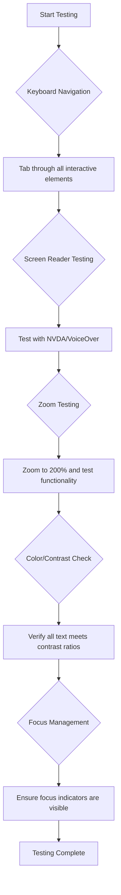

<!--
CO_OP_TRANSLATOR_METADATA:
{
  "original_hash": "300c1562e01f21065ae0b8e9d9181a86",
  "translation_date": "2025-10-20T21:18:18+00:00",
  "source_file": "1-getting-started-lessons/3-accessibility/README.md",
  "language_code": "mr"
}
-->
# प्रवेशयोग्य वेबपृष्ठ तयार करणे


> स्केच नोट [Tomomi Imura](https://twitter.com/girlie_mac) यांच्याकडून

## व्याख्यानपूर्व प्रश्नमंजुषा
[व्याख्यानपूर्व प्रश्नमंजुषा](https://ff-quizzes.netlify.app/web/)

> वेबची ताकद त्याच्या सार्वत्रिकतेत आहे. अपंगत्व असलेल्या प्रत्येक व्यक्तीला प्रवेश मिळणे ही एक महत्त्वाची बाब आहे.
>
> \- सर टिमोथी बर्नर्स-ली, W3C संचालक आणि वर्ल्ड वाइड वेबचे शोधक

वेब प्रवेशयोग्यता ही फक्त एक चांगली सुविधा नाही—ती एक मूलभूत तत्त्व आहे जी इंटरनेटला खऱ्या अर्थाने सार्वत्रिक बनवते. जेव्हा तुम्ही प्रवेशयोग्य वेबसाइट्स तयार करता, तेव्हा तुम्ही फक्त अपंग व्यक्तींना मदत करत नाही, तर तुम्ही सर्वांसाठी चांगले अनुभव निर्माण करता. जसे व्हीलचेअरसाठी डिझाइन केलेले कर्ब कट्स बेबी स्ट्रोलर, सामान किंवा सायकल चालवणाऱ्या लोकांना मदत करतात, तसेच प्रवेशयोग्य वेब डिझाइन कार्य करते.

या धड्यात, तुम्ही अशा वेबसाइट्स तयार करण्याचे तंत्र शिकाल ज्या सर्वांसाठी कार्य करतात, त्यांच्या क्षमतेची किंवा वेब ब्राउझ करण्यासाठी वापरलेल्या तंत्रज्ञानाची पर्वा न करता. तुम्ही आधुनिक वेब मानकांमध्ये समाविष्ट केलेल्या व्यावहारिक तंत्रांचा अभ्यास कराल, प्रवेशयोग्यता चाचणीसाठी शक्तिशाली साधने शोधाल आणि प्रवेशयोग्यतेमुळे सर्व वापरकर्त्यांसाठी वापरण्यायोग्यता कशी वाढते हे समजून घ्याल.

या धड्याच्या शेवटी, तुम्हाला तुमच्या विकास प्रक्रियेच्या पहिल्या दिवसापासून प्रवेशयोग्यता नैसर्गिकरित्या समाविष्ट करण्याचे ज्ञान आणि साधने मिळतील. विचारपूर्वक डिझाइन निवडी वेबला जगभरातील अब्जावधी वापरकर्त्यांसाठी कसे खुले करू शकतात ते शोधूया.

> तुम्ही [Microsoft Learn](https://docs.microsoft.com/learn/modules/web-development-101/accessibility/?WT.mc_id=academic-77807-sagibbon) वर हा धडा घेऊ शकता!

## सहाय्यक तंत्रज्ञान समजून घेणे

प्रवेशयोग्य वेबसाइट्स तयार करण्यापूर्वी, वेबवर वेगवेगळ्या क्षमतेच्या लोक कसे नेव्हिगेट करतात हे समजून घेऊया. तुमच्या डिझाइन आणि विकास निवडींबद्दल माहितीपूर्ण निर्णय घेण्यासाठी हे ज्ञान उपयुक्त ठरेल.

सहाय्यक तंत्रज्ञान ही विशेष साधने आहेत जी अपंग व्यक्तींना डिजिटल सामग्रीशी संवाद साधण्यास मदत करतात. ही साधने कशी कार्य करतात हे समजून घेणे खऱ्या अर्थाने प्रवेशयोग्य वेब अनुभव तयार करण्यासाठी आवश्यक आहे.

### स्क्रीन रीडर्स

[स्क्रीन रीडर्स](https://en.wikipedia.org/wiki/Screen_reader) ही आश्चर्यकारक सहाय्यक तंत्रज्ञान आहेत जी डिजिटल मजकूर भाषण किंवा ब्रेल आउटपुटमध्ये रूपांतरित करतात. प्रामुख्याने दृष्टिहीन व्यक्तींसाठी वापरले जात असले तरी, ते डिस्लेक्सिया सारख्या शिकण्याच्या अडचणी असलेल्या वापरकर्त्यांना देखील मदत करतात.

स्क्रीन रीडरला वेबसाठी व्हॉइस कथनकर्ता म्हणून विचार करा. ते सामग्री तार्किक क्रमाने मोठ्याने वाचते, बटणे आणि दुव्यांसारख्या परस्परसंवादी घटकांची घोषणा करते आणि कार्यक्षम नेव्हिगेशनसाठी कीबोर्ड शॉर्टकट प्रदान करते. तथापि, स्क्रीन रीडर्स फक्त वेबसाइट्स योग्य संरचनेसह आणि अर्थपूर्ण सामग्रीसह तयार केल्यास प्रभावीपणे कार्य करू शकतात.

**प्लॅटफॉर्मवर लोकप्रिय स्क्रीन रीडर्स:**
- **Windows**: [NVDA](https://www.nvaccess.org/about-nvda/) (मोफत आणि सर्वाधिक लोकप्रिय), [JAWS](https://webaim.org/articles/jaws/), [Narrator](https://support.microsoft.com/windows/complete-guide-to-narrator-e4397a0d-ef4f-b386-d8ae-c172f109bdb1/?WT.mc_id=academic-77807-sagibbon) (इन-बिल्ट)
- **macOS/iOS**: [VoiceOver](https://support.apple.com/guide/voiceover/welcome/10) (इन-बिल्ट आणि अत्यंत सक्षम)
- **Android**: [TalkBack](https://support.google.com/accessibility/android/answer/6283677) (इन-बिल्ट)
- **Linux**: [Orca](https://wiki.gnome.org/Projects/Orca) (मोफत आणि ओपन-सोर्स)

**स्क्रीन रीडर्स वेब सामग्री कशी नेव्हिगेट करतात:**

स्क्रीन रीडर्स अनुभवी वापरकर्त्यांसाठी ब्राउझिंग कार्यक्षम बनवणाऱ्या अनेक नेव्हिगेशन पद्धती प्रदान करतात:
- **क्रमिक वाचन**: शीर्ष ते तळापर्यंत सामग्री वाचते, जसे पुस्तक वाचणे
- **लँडमार्क नेव्हिगेशन**: पृष्ठ विभागांमध्ये उड्या मारणे (हेडर, नेव्ह, मुख्य, फूटर)
- **हेडिंग नेव्हिगेशन**: पृष्ठ संरचना समजण्यासाठी हेडिंग्जमध्ये उड्या मारणे
- **लिंक यादी**: जलद प्रवेशासाठी सर्व दुव्यांची यादी तयार करणे
- **फॉर्म नियंत्रण**: इनपुट फील्ड्स आणि बटणांमध्ये थेट नेव्हिगेट करणे

> 💡 **विकसकांसाठी अंतर्दृष्टी**: 68% स्क्रीन रीडर वापरकर्ते मुख्यतः हेडिंग्जद्वारे नेव्हिगेट करतात ([WebAIM सर्वेक्षण](https://webaim.org/projects/screenreadersurvey9/#finding)). म्हणून योग्य हेडिंग संरचना अत्यंत महत्त्वाची आहे!

### तुमची चाचणी कार्यप्रवाह तयार करणे

प्रभावी प्रवेशयोग्यता चाचणीसाठी स्वयंचलित साधने आणि मॅन्युअल पडताळणी दोन्ही आवश्यक आहेत. येथे सर्वाधिक समस्या पकडणारा एक प्रणालीबद्ध दृष्टिकोन आहे:

**आवश्यक मॅन्युअल चाचणी कार्यप्रवाह:**



**चाचणी तपासणी सूची चरण-दर-चरण:**
1. **कीबोर्ड नेव्हिगेशन**: फक्त Tab, Shift+Tab, Enter, Space आणि Arrow की वापरा
2. **स्क्रीन रीडर चाचणी**: NVDA, VoiceOver किंवा Narrator सक्षम करा आणि डोळे बंद करून नेव्हिगेट करा
3. **झूम चाचणी**: 200% आणि 400% झूम स्तरांवर चाचणी करा
4. **रंग विरोधाभास पडताळणी**: सर्व मजकूर आणि UI घटक तपासा
5. **फोकस इंडिकेटर चाचणी**: सर्व परस्परसंवादी घटकांमध्ये दृश्यमान फोकस स्टेट्स आहेत याची खात्री करा

✅ **Lighthouse सह प्रारंभ करा**: तुमच्या ब्राउझरच्या DevTools उघडा, Lighthouse प्रवेशयोग्यता ऑडिट चालवा आणि नंतर तुमच्या मॅन्युअल चाचणी फोकस क्षेत्रांचे मार्गदर्शन करण्यासाठी परिणामांचा वापर करा.

### झूम आणि वाढीव साधने

अनेक वापरकर्ते सामग्री वाचनीय बनवण्यासाठी वाढीवर अवलंबून असतात. यामध्ये कमी दृष्टी असलेले लोक, वृद्ध व्यक्ती आणि अगदी तेजस्वी सूर्यप्रकाशात किंवा तात्पुरत्या दृष्टी समस्यांसह वापरकर्ते यांचा समावेश आहे. आधुनिक झूम तंत्रज्ञान साध्या प्रतिमा स्केलिंगच्या पलीकडे विकसित झाले आहे.

झूम कसे कार्य करते हे समजून घेणे तुम्हाला प्रतिसादात्मक डिझाइन तयार करण्यात मदत करते जे कोणत्याही वाढीच्या पातळीवर कार्यक्षम आणि सुंदर राहते.

**आधुनिक ब्राउझर झूम क्षमता:**
- **पृष्ठ झूम**: सर्व सामग्री प्रमाणानुसार स्केल करते (मजकूर, प्रतिमा, लेआउट) - ही प्राधान्य दिलेली पद्धत आहे
- **फक्त मजकूर झूम**: मूळ लेआउट राखून फॉन्ट आकार वाढवते
- **पिंच-टू-झूम**: तात्पुरत्या वाढीसाठी मोबाइल गेस्चर समर्थन
- **ब्राउझर समर्थन**: सर्व आधुनिक ब्राउझर 500% पर्यंत झूम समर्थन देतात ज्यामुळे कार्यक्षमता बिघडत नाही

**विशेष वाढीव सॉफ्टवेअर:**
- **Windows**: [Magnifier](https://support.microsoft.com/windows/use-magnifier-to-make-things-on-the-screen-easier-to-see-414948ba-8b1c-d3bd-8615-0e5e32204198) (इन-बिल्ट), [ZoomText](https://www.freedomscientific.com/training/zoomtext/getting-started/)
- **macOS/iOS**: [Zoom](https://www.apple.com/accessibility/mac/vision/) (इन-बिल्ट आणि प्रगत वैशिष्ट्यांसह)

> ⚠️ **डिझाइन विचार**: WCAG ची आवश्यकता आहे की सामग्री 200% पर्यंत झूम केल्यावर कार्यक्षम राहावी. या स्तरावर, आडव्या स्क्रोलिंग किमान असावी आणि सर्व परस्परसंवादी घटक प्रवेशयोग्य राहावेत.

✅ **तुमचे प्रतिसादात्मक डिझाइन तपासा**: तुमचा ब्राउझर 200% आणि 400% पर्यंत झूम करा. तुमचा लेआउट सुंदरपणे अनुकूल होतो का? तुम्ही अजूनही सर्व कार्यक्षमता अत्यधिक स्क्रोलिंगशिवाय प्रवेश करू शकता का?

## आधुनिक प्रवेशयोग्यता चाचणी साधने

आता तुम्हाला सहाय्यक तंत्रज्ञान कसे कार्य करते हे समजले आहे, चला त्या साधनांचा अभ्यास करूया जी तुम्हाला प्रवेशयोग्य वेबसाइट्स तयार करण्यात आणि चाचणी घेण्यात मदत करतात. स्वयंचलित चाचणी आणि मॅन्युअल पडताळणी एकत्र करणे तुम्हाला खात्री देते की तुमची साइट्स सर्वांसाठी कार्यक्षम आहेत.

आधुनिक प्रवेशयोग्यता चाचणी व्यापक दृष्टिकोन अनुसरण करते: स्वयंचलित साधने स्पष्ट समस्या पकडतात, तर मॅन्युअल चाचणी वास्तविक-जगातील वापरण्यायोग्यता सुनिश्चित करते.

### रंग विरोधाभास चाचणी

रंग विरोधाभास ही सर्वात सामान्य प्रवेशयोग्यता समस्या आहे, परंतु ती सोडवणे देखील सर्वात सोपे आहे. चांगला विरोधाभास सर्वांना फायदेशीर ठरतो—दृष्टीदोष असलेल्या वापरकर्त्यांपासून तेजस्वी सूर्यप्रकाशात स्क्रीन पाहणाऱ्या लोकांपर्यंत.

**WCAG विरोधाभास आवश्यकता:**

| मजकूर प्रकार | WCAG AA (किमान) | WCAG AAA (वाढीव) |
|--------------|------------------|------------------|
| **सामान्य मजकूर** (18pt पेक्षा कमी) | 4.5:1 विरोधाभास गुणोत्तर | 7:1 विरोधाभास गुणोत्तर |
| **मोठा मजकूर** (18pt+ किंवा 14pt+ ठळक) | 3:1 विरोधाभास गुणोत्तर | 4.5:1 विरोधाभास गुणोत्तर |
| **UI घटक** (बटणे, फॉर्म बॉर्डर) | 3:1 विरोधाभास गुणोत्तर | 3:1 विरोधाभास गुणोत्तर |

**आवश्यक चाचणी साधने:**
- [Colour Contrast Analyser](https://www.tpgi.com/color-contrast-checker/) - रंग पिकरसह डेस्कटॉप अ‍ॅप
- [WebAIM Contrast Checker](https://webaim.org/resources/contrastchecker/) - वेब-आधारित त्वरित अभिप्रायासह
- [Stark](https://www.getstark.co/) - Figma, Sketch, Adobe XD साठी डिझाइन टूल प्लगइन
- [Accessible Colors](https://accessible-colors.com/) - प्रवेशयोग्य रंग पॅलेट शोधा

✅ **चांगले रंग पॅलेट तयार करा**: तुमच्या ब्रँड रंगांसह प्रारंभ करा आणि प्रवेशयोग्य भिन्नता तयार करण्यासाठी विरोधाभास तपासणीचा वापर करा. तुमच्या डिझाइन सिस्टमच्या प्रवेशयोग्य रंग टोकन म्हणून याची नोंद करा.

### व्यापक प्रवेशयोग्यता ऑडिटिंग

सर्वात प्रभावी प्रवेशयोग्यता चाचणी अनेक दृष्टिकोन एकत्रित करते. एकही साधन सर्वकाही पकडत नाही, त्यामुळे विविध पद्धतींसह चाचणी दिनचर्या तयार करणे व्यापक कव्हरेज सुनिश्चित करते.

**ब्राउझर-आधारित चाचणी (DevTools मध्ये समाविष्ट):**
- **Chrome/Edge**: Lighthouse प्रवेशयोग्यता ऑडिट + प्रवेशयोग्यता पॅनेल
- **Firefox**: प्रवेशयोग्यता निरीक्षक तपशीलवार ट्री दृश्यासह
- **Safari**: Web Inspector मधील ऑडिट टॅब VoiceOver सिम्युलेशनसह

**व्यावसायिक चाचणी विस्तार:**
- [axe DevTools](https://www.deque.com/axe/devtools/) - उद्योग-मानक स्वयंचलित चाचणी
- [WAVE](https://wave.webaim.org/extension/) - त्रुटी हायलाइटिंगसह व्हिज्युअल अभिप्राय
- [Accessibility Insights](https://accessibilityinsights.io/) - Microsoft चे व्यापक चाचणी संच

**कमांड-लाइन आणि CI/CD एकत्रीकरण:**
- [axe-core](https://github.com/dequelabs/axe-core) - स्वयंचलित चाचणीसाठी JavaScript लायब्ररी
- [Pa11y](https://pa11y.org/) - कमांड-लाइन प्रवेशयोग्यता चाचणी साधन
- [Lighthouse CI](https://github.com/GoogleChrome/lighthouse-ci) - स्वयंचलित प्रवेशयोग्यता स्कोअरिंग

> 🎯 **चाचणी उद्दिष्ट**: 95+ चा Lighthouse प्रवेशयोग्यता स्कोअर तुमचा आधार म्हणून ठेवा. लक्षात ठेवा, स्वयंचलित साधने फक्त 30-40% प्रवेशयोग्यता समस्या पकडतात—मॅन्युअल चाचणी अजूनही आवश्यक आहे!

## सुरुवातीपासून प्रवेशयोग्यता तयार करणे

वेब प्रवेशयोग्यतेसाठी सर्वात प्रभावी दृष्टिकोन म्हणजे पहिल्या दिवसापासून तुमच्या पाया मध्ये ते समाविष्ट करणे. नंतर प्रवेशयोग्यता समाविष्ट करणे केवळ अधिक महाग आणि वेळखाऊ नाही—ते अनेकदा खराब वापरकर्ता अनुभव निर्माण करते.

प्रवेशयोग्यतेला घर बांधण्यासारखे समजा: बांधकाम पूर्ण झाल्यानंतर रॅम्प्स आणि रुंद दरवाजे जोडण्याऐवजी सुरुवातीच्या वास्तुशास्त्रीय योजनांमध्ये व्हीलचेअर प्रवेशयोग्यता समाविष्ट करणे खूप सोपे आहे.

### POUR तत्त्वे: तुमचा प्रवेशयोग्यता पाया

वेब सामग्री प्रवेशयोग्यता मार्गदर्शक तत्त्वे (WCAG) POUR म्हणून ओळखल्या जाणाऱ्या चार मूलभूत तत्त्वांवर आधारित आहेत. ही तत्त्वे विविध क्षमते आणि तंत्रज्ञान असलेल्या वापरकर्त्यांसाठी सामग्री प्रवेशयोग्य बनवण्यासाठी एक फ्रेमवर्क प्रदान करतात.

POUR समजून घेणे तुम्हाला प्रवेशयोग्यता निर्णय घेण्यास मदत करते जे सर्वांसाठी समावेशक अनुभव निर्माण करतात.

**🔍 जाणवण्यायोग्य**: माहिती वापरकर्त्यांच्या उपलब्ध संवेदनांद्वारे जाणवण्यायोग्य मार्गांनी सादर केली पाहिजे

- नॉन-टेक्स्ट सामग्रीसाठी मजकूर पर्याय प्रदान करा (प्रतिमा, व्हिडिओ, ऑडिओ)
- सर्व मजकूर आणि UI घटकांसाठी पुरेसा रंग विरोधाभास सुनिश्चित करा
- मल्टिमीडिया सामग्रीसाठी कॅप्शन आणि ट्रान्सक्रिप्ट ऑफर करा
- सामग्री 200% पर्यंत आकारात बदलल्यावर कार्यक्षम राहील याची खात्री करा
- माहिती देण्यासाठी फक्त रंगावर अवलंबून न राहता एकाधिक संवेदनात्मक वैशिष्ट्ये वापरा

**🎮 ऑपरेबल**: सर्व इंटरफेस घटक उपलब्ध इनपुट पद्धतींद्वारे ऑपरेट करण्यायोग्य असले पाहिजेत

- सर्व कार्यक्षमता कीबोर्ड नेव्हिगेशनद्वारे प्रवेशयोग्य बनवा
- वापरकर्त्यांना सामग्री वाचण्यासाठी आणि संवाद साधण्यासाठी पुरेसा वेळ द्या
- झटक्यांचा किंवा व्हेस्टिब्युलर डिसऑर्डरचा कारणीभूत असलेली सामग्री टाळा
- स्पष्ट संरचना आणि लँडमार्कसह वापरकर्त्यांना कार्यक्षमतेने नेव्हिगेट करण्यात मदत करा
- परस्परसंवादी घटकांमध्ये पुरेसे लक्ष्य आकार (किमान 44px) सुनिश्चित करा

**📖 समजण्यायोग्य**: माहिती आणि UI ऑपरेशन स्पष्ट आणि समजण्यायोग्य असले पाहिजे

- तुमच्या प्रेक्षकांसाठी योग्य स्पष्ट, साधी भाषा वापरा
- सामग्री अंदाजानुसार आणि सुसंगत पद्धतीने दिसते आणि कार्य करते याची खात्री करा
- वापरकर्ता इनपुटसाठी स्पष्ट सूचना आणि त्रुटी संदेश प्रदान करा
- फॉर्ममधील चुका समजून घेण्यास आणि सुधारण्यास वापरकर्त्यांना मदत करा
- तार्किक वाचन क्रम आणि माहिती श्रेणीसह सामग्री आयोजित करा

**💪 मजबूत**: सामग्री विविध तंत्रज्ञान आणि सहाय्यक उपकरणांवर विश्वासार्ह
### फोकस इंडिकेटर्स आणि संवादात्मक डिझाइन

फोकस इंडिकेटर्स हे डिजिटल कर्सरप्रमाणे असतात—ते कीबोर्ड वापरणाऱ्या वापरकर्त्यांना पृष्ठावर कुठे आहेत हे दाखवतात. चांगल्या प्रकारे डिझाइन केलेले फोकस इंडिकेटर्स सर्वांसाठी अनुभव सुधारतात, संवाद स्पष्ट आणि अंदाजे बनवतात.

**आधुनिक फोकस इंडिकेटर सर्वोत्तम पद्धती:**

```css
/* Enhanced focus styles that work across browsers */
button:focus-visible {
  outline: 2px solid #0066cc;
  outline-offset: 2px;
  box-shadow: 0 0 0 4px rgba(0, 102, 204, 0.25);
}

/* Remove focus outline for mouse users, preserve for keyboard users */
button:focus:not(:focus-visible) {
  outline: none;
}

/* Focus-within for complex components */
.card:focus-within {
  box-shadow: 0 0 0 3px rgba(74, 144, 164, 0.5);
  border-color: #4A90A4;
}

/* Ensure focus indicators meet contrast requirements */
.custom-focus:focus-visible {
  outline: 3px solid #ffffff;
  outline-offset: 2px;
  box-shadow: 0 0 0 6px #000000;
}
```

**फोकस इंडिकेटर आवश्यकता:**
- **दृश्यमानता**: सभोवतालच्या घटकांशी किमान 3:1 कॉन्ट्रास्ट रेशो असणे आवश्यक आहे
- **रुंदी**: संपूर्ण घटकाभोवती किमान 2px जाडी असणे आवश्यक आहे
- **सातत्य**: फोकस दुसऱ्या ठिकाणी हलवले जाईपर्यंत दृश्यमान राहावे
- **भिन्नता**: इतर UI स्थितींपेक्षा दृश्यात्मकदृष्ट्या वेगळे असणे आवश्यक आहे

> 💡 **डिझाइन टिप**: उत्कृष्ट फोकस इंडिकेटर्स अनेकदा दृश्यता सुनिश्चित करण्यासाठी outline, box-shadow आणि रंग बदलांचा संयोजन वापरतात.

✅ **फोकस इंडिकेटर्सचे ऑडिट करा**: तुमच्या वेबसाइटवर टॅब करा आणि कोणते घटक स्पष्ट फोकस इंडिकेटर्स आहेत ते नोंदवा. काही पाहणे कठीण आहे किंवा पूर्णपणे गायब आहेत का?

### सेमॅंटिक HTML: अॅक्सेसिबिलिटीचा पाया

सेमॅंटिक HTML म्हणजे सहाय्यक तंत्रज्ञानासाठी स्पष्ट रोडमॅप प्रदान करणे. जेव्हा तुम्ही योग्य HTML घटक त्यांच्या उद्दिष्टासाठी वापरता, तेव्हा तुम्ही स्क्रीन रीडर्स, कीबोर्ड्स आणि इतर साधनांना वापरकर्त्यांना प्रभावीपणे नेव्हिगेट करण्यात मदत करण्यासाठी आवश्यक माहिती देत असता.

सेमॅंटिक HTML म्हणजे व्यवस्थित श्रेणी आणि चिन्हांसह चांगल्या प्रकारे आयोजित केलेल्या ग्रंथालय आणि पुस्तके यादृच्छिकपणे विखुरलेल्या गोदामातील फरक आहे. दोघांमध्ये समान माहिती असते, परंतु एकच खरोखर वापरण्यायोग्य असते.

**अॅक्सेसिबल पृष्ठ संरचनेचे बांधकाम ब्लॉक्स:**

```html
<!-- Landmark elements provide page navigation structure -->
<header>
  <h1>Your Site Name</h1>
  <nav aria-label="Main navigation">
    <ul>
      <li><a href="/home">Home</a></li>
      <li><a href="/about">About</a></li>
      <li><a href="/services">Services</a></li>
    </ul>
  </nav>
</header>

<main>
  <article>
    <header>
      <h1>Article Title</h1>
      <p>Published on <time datetime="2024-10-14">October 14, 2024</time></p>
    </header>
    
    <section>
      <h2>First Section</h2>
      <p>Content that relates to this section...</p>
    </section>
    
    <section>
      <h2>Second Section</h2>
      <p>More related content...</p>
    </section>
  </article>
  
  <aside>
    <h2>Related Links</h2>
    <nav aria-label="Related articles">
      <ul>
        <li><a href="/related-1">First related article</a></li>
        <li><a href="/related-2">Second related article</a></li>
      </ul>
    </nav>
  </aside>
</main>

<footer>
  <p>&copy; 2024 Your Site Name. All rights reserved.</p>
  <nav aria-label="Footer links">
    <ul>
      <li><a href="/privacy">Privacy Policy</a></li>
      <li><a href="/contact">Contact Us</a></li>
    </ul>
  </nav>
</footer>
```

**सेमॅंटिक HTML अॅक्सेसिबिलिटी कशी बदलते:**

| सेमॅंटिक घटक | उद्देश | स्क्रीन रीडर लाभ |
|------------------|---------|----------------------|
| `<header>` | पृष्ठ किंवा विभाग शीर्षलेख | "बॅनर लँडमार्क" - शीर्षस्थानी जलद नेव्हिगेशन |
| `<nav>` | नेव्हिगेशन लिंक | "नेव्हिगेशन लँडमार्क" - नेव्हिगेशन विभागांची यादी |
| `<main>` | प्राथमिक पृष्ठ सामग्री | "मुख्य लँडमार्क" - थेट सामग्रीवर जा |
| `<article>` | स्वयंपूर्ण सामग्री | लेखाच्या सीमा घोषित करते |
| `<section>` | थीम असलेले सामग्री गट | सामग्री संरचना प्रदान करते |
| `<aside>` | संबंधित साइडबार सामग्री | "पूरक लँडमार्क" |
| `<footer>` | पृष्ठ किंवा विभाग फूट | "कंटेंटइन्फो लँडमार्क" |

**सेमॅंटिक HTMLसह स्क्रीन रीडर सुपरपॉवर्स:**
- **लँडमार्क नेव्हिगेशन**: प्रमुख पृष्ठ विभागांमध्ये त्वरित उडी घ्या
- **हेडिंग आउटलाइन**: तुमच्या हेडिंग संरचनेतून सामग्रीची सूची तयार करा
- **घटक यादी**: सर्व लिंक, बटणे किंवा फॉर्म नियंत्रणांची यादी तयार करा
- **संदर्भ जागरूकता**: सामग्री विभागांमधील संबंध समजून घ्या

> 🎯 **जलद चाचणी**: लँडमार्क शॉर्टकट (NVDA/JAWS मध्ये D लँडमार्कसाठी, H हेडिंगसाठी, K लिंकसाठी) वापरून स्क्रीन रीडरसह तुमच्या साइटवर नेव्हिगेट करण्याचा प्रयत्न करा. नेव्हिगेशन अर्थपूर्ण आहे का?

✅ **तुमची सेमॅंटिक संरचना तपासा**: तुमच्या ब्राउझरच्या DevTools मधील अॅक्सेसिबिलिटी पॅनेल वापरून अॅक्सेसिबिलिटी ट्री पहा आणि तुमचे मार्कअप तर्कसंगत संरचना तयार करते याची खात्री करा.

### हेडिंग हायरार्की: तर्कसंगत सामग्रीची रूपरेषा तयार करणे

हेडिंग्स अॅक्सेसिबल सामग्री संरचनेचा कणा आहेत. स्क्रीन रीडर वापरकर्ते तुमच्या सामग्रीला समजून घेण्यासाठी आणि नेव्हिगेट करण्यासाठी हेडिंग्सवर मोठ्या प्रमाणावर अवलंबून असतात—हे तुमच्या पृष्ठासाठी तपशीलवार सामग्रीची सूची प्रदान करण्यासारखे आहे.

**हेडिंग हायरार्की नियम:**
कधीही हेडिंग स्तर वगळू नका. नेहमी `<h1>` ते `<h2>` ते `<h3>` अशा तर्कसंगतपणे प्रगती करा. हेडिंग्सला दस्तऐवजातील रूपरेषा संरचनेसारखे विचार करा.

**परिपूर्ण हेडिंग संरचना उदाहरण:**

```html
<!-- ✅ Excellent: Logical, hierarchical progression -->
<main>
  <h1>Complete Guide to Web Accessibility</h1>
  
  <section>
    <h2>Understanding Screen Readers</h2>
    <p>Introduction to screen reader technology...</p>
    
    <h3>Popular Screen Reader Software</h3>
    <p>NVDA, JAWS, and VoiceOver comparison...</p>
    
    <h3>Testing with Screen Readers</h3>
    <p>Step-by-step testing instructions...</p>
  </section>
  
  <section>
    <h2>Color and Contrast Guidelines</h2>
    <p>Designing with sufficient contrast...</p>
    
    <h3>WCAG Contrast Requirements</h3>
    <p>Understanding the different contrast levels...</p>
    
    <h3>Testing Tools and Techniques</h3>
    <p>Tools for verifying contrast ratios...</p>
  </section>
</main>
```

```html
<!-- ❌ Problematic: Skipping levels, inconsistent structure -->
<h1>Page Title</h1>
<h3>Subsection</h3> <!-- Skipped h2 -->
<h2>This should come before h3</h2>
<h1>Another main heading?</h1> <!-- Multiple h1s -->
```

**हेडिंग सर्वोत्तम पद्धती:**
- **प्रत्येक पृष्ठासाठी एक `<h1>`**: सामान्यतः तुमचे मुख्य पृष्ठ शीर्षक किंवा प्राथमिक सामग्री शीर्षक
- **तर्कसंगत प्रगती**: स्तर कधीही वगळू नका (h1 → h2 → h3, h1 → h3 नाही)
- **वर्णनात्मक सामग्री**: हेडिंग्स संदर्भाशिवाय वाचल्यावर अर्थपूर्ण बनवा
- **CSS सह दृश्यात्मक शैली**: स्वरूपासाठी CSS वापरा, संरचनेसाठी HTML स्तर

**स्क्रीन रीडर नेव्हिगेशन आकडेवारी:**
- 68% स्क्रीन रीडर वापरकर्ते हेडिंग्सद्वारे नेव्हिगेट करतात ([WebAIM सर्वेक्षण](https://webaim.org/projects/screenreadersurvey9/#finding))
- वापरकर्त्यांना तर्कसंगत हेडिंग रूपरेषा अपेक्षित आहे
- हेडिंग्स पृष्ठ संरचना समजून घेण्याचा सर्वात जलद मार्ग प्रदान करतात

> 💡 **प्रो टिप**: "HeadingsMap" सारख्या ब्राउझर एक्सटेंशनचा वापर करून तुमची हेडिंग संरचना व्हिज्युअलाइझ करा. हे चांगल्या प्रकारे आयोजित केलेल्या सामग्रीच्या सूचीसारखे वाचले पाहिजे.

✅ **तुमची हेडिंग संरचना तपासा**: स्क्रीन रीडरच्या हेडिंग नेव्हिगेशन (NVDA मध्ये H की) वापरून तुमच्या हेडिंग्समधून उडी घ्या. प्रगती तुमच्या सामग्रीची कथा तर्कसंगतपणे सांगते का?

### प्रगत दृश्य अॅक्सेसिबिलिटी तंत्र

कॉन्फ्रास्ट आणि रंगाच्या मूलभूत गोष्टींपलीकडे, काही परिष्कृत तंत्र आहेत जे खरोखर समावेशक दृश्य अनुभव तयार करण्यात मदत करतात. हे पद्धती सुनिश्चित करतात की तुमची सामग्री विविध दृश्य परिस्थिती आणि सहाय्यक तंत्रज्ञानावर कार्य करते.

**आवश्यक दृश्य संवाद धोरणे:**

- **मल्टी-मोडल फीडबॅक**: दृश्यात्मक, मजकूरात्मक आणि कधीकधी ऑडिओ संकेतांचे संयोजन करा
- **प्रोग्रेसिव्ह डिस्क्लोजर**: माहिती पचवण्यायोग्य तुकड्यांमध्ये सादर करा
- **सुसंगत संवाद पॅटर्न**: परिचित UI परंपरा वापरा
- **प्रतिसादात्मक टायपोग्राफी**: उपकरणांमध्ये मजकूर योग्य प्रकारे स्केल करा
- **लोडिंग आणि त्रुटी स्थिती**: सर्व वापरकर्ता क्रियांसाठी स्पष्ट फीडबॅक प्रदान करा

**अॅक्सेसिबिलिटी सुधारण्यासाठी CSS युटिलिटीज:**

```css
/* Screen reader only text - visually hidden but accessible */
.sr-only {
  position: absolute;
  width: 1px;
  height: 1px;
  padding: 0;
  margin: -1px;
  overflow: hidden;
  clip: rect(0, 0, 0, 0);
  white-space: nowrap;
  border: 0;
}

/* Skip link for keyboard navigation */
.skip-link {
  position: absolute;
  top: -40px;
  left: 6px;
  background: #000000;
  color: #ffffff;
  padding: 8px 16px;
  text-decoration: none;
  border-radius: 4px;
  font-weight: bold;
  transition: top 0.3s ease;
  z-index: 1000;
}

.skip-link:focus {
  top: 6px;
}

/* Reduced motion respect */
@media (prefers-reduced-motion: reduce) {
  .skip-link {
    transition: none;
  }
  
  * {
    animation-duration: 0.01ms !important;
    animation-iteration-count: 1 !important;
    transition-duration: 0.01ms !important;
  }
}

/* High contrast mode support */
@media (prefers-contrast: high) {
  .button {
    border: 2px solid;
  }
}
```

> 🎯 **अॅक्सेसिबिलिटी पॅटर्न**: "स्किप लिंक" कीबोर्ड वापरकर्त्यांसाठी आवश्यक आहे. हे तुमच्या पृष्ठावरील पहिले फोकस करण्यायोग्य घटक असावे आणि थेट मुख्य सामग्री क्षेत्रावर उडी मारावी.

✅ **स्किप नेव्हिगेशन लागू करा**: तुमच्या पृष्ठांवर स्किप लिंक जोडा आणि पृष्ठ लोड झाल्यावर टॅब दाबून त्यांची चाचणी करा. ते दिसले पाहिजे आणि तुम्हाला मुख्य सामग्रीवर उडी मारण्याची परवानगी दिली पाहिजे.

## अर्थपूर्ण लिंक मजकूर तयार करणे

लिंक्स वेबचे महामार्ग आहेत, परंतु खराब प्रकारे लिहिलेला लिंक मजकूर अपंग वापरकर्त्यांसाठी अडथळे निर्माण करतो. उत्कृष्ट लिंक मजकूर तुमची सामग्री सर्वांसाठी स्कॅन करण्यायोग्य आणि नेव्हिगेट करण्यायोग्य बनवतो.

स्क्रीन रीडर्स पृष्ठावरील सर्व लिंक्स काढून टाकू शकतात आणि त्यांना यादी म्हणून सादर करू शकतात—कल्पना करा की तुमच्या लिंक्स एका निर्देशिकेसारख्या दिसतात. प्रत्येक लिंक सभोवतालच्या संदर्भाशिवाय अर्थपूर्ण वाटेल का?

### लिंक नेव्हिगेशन पॅटर्न समजून घेणे

स्क्रीन रीडर्स चांगल्या प्रकारे लिहिलेल्या लिंक मजकुरावर आधारित शक्तिशाली लिंक नेव्हिगेशन वैशिष्ट्ये ऑफर करतात:

**लिंक नेव्हिगेशन पद्धती:**
- **क्रमिक वाचन**: लिंक मजकुराचा प्रवाह म्हणून संदर्भात वाचला जातो
- **लिंक यादी निर्मिती**: सर्व पृष्ठ लिंक्स शोधण्यायोग्य निर्देशिकेत संकलित
- **जलद नेव्हिगेशन**: कीबोर्ड शॉर्टकट वापरून लिंक्समध्ये उडी घ्या (NVDA मध्ये K)
- **शोध कार्यक्षमता**: अंशतः मजकूर टाइप करून विशिष्ट लिंक्स शोधा

**संदर्भ का महत्त्वाचा आहे:**
जेव्हा स्क्रीन रीडर वापरकर्ते लिंक यादी तयार करतात, तेव्हा त्यांना असे काहीतरी दिसते:
- "Download report"
- "Learn more"
- "Click here"
- "Privacy policy"
- "Click here"

यापैकी फक्त दोन लिंक्स संदर्भाशिवाय उपयुक्त माहिती प्रदान करतात!

> 📊 **वापरकर्ता प्रभाव**: स्क्रीन रीडर वापरकर्ते पृष्ठ सामग्री त्वरीत समजून घेण्यासाठी लिंक यादी स्कॅन करतात. सामान्य लिंक मजकूर त्यांना प्रत्येक लिंकच्या संदर्भावर परत नेव्हिगेट करण्यास भाग पाडतो, त्यांच्या ब्राउझिंग अनुभवाला लक्षणीयपणे धीमा करतो.

### सामान्य लिंक मजकूर चुका टाळा

काय कार्य करत नाही ते समजून घेणे विद्यमान सामग्रीतील अॅक्सेसिबिलिटी समस्या ओळखण्यात आणि सुधारण्यात मदत करते.

**❌ संदर्भ प्रदान न करणारा सामान्य लिंक मजकूर:**

```html
<!-- Meaningless when read from a link list -->
<p>Our sustainability efforts are detailed in our recent report. 
   <a href="/sustainability-2024.pdf">Click here</a> to view it.</p>

<!-- Repeated generic text throughout the page -->
<div class="article-card">
  <h3>Web Accessibility Guide</h3>
  <p>Learn the fundamentals...</p>
  <a href="/accessibility-guide">Read more</a>
</div>
<div class="article-card">
  <h3>Color Contrast Tips</h3>
  <p>Improve your design...</p>
  <a href="/color-contrast">Read more</a>
</div>

<!-- URLs as link text (difficult for screen readers to announce) -->
<p>Visit https://www.w3.org/WAI/WCAG21/quickref/ for WCAG guidelines.</p>

<!-- Vague action words -->
<a href="/contact">Go</a> | <a href="/about">See</a> | <a href="/help">View</a>
```

**हे पॅटर्न का अयशस्वी होतात:**
- **"Click here"** वापरकर्त्यांना गंतव्यस्थानाबद्दल काहीही सांगत नाही
- **"Read more"** अनेक वेळा पुनरावृत्ती केल्याने गोंधळ निर्माण होतो
- **कच्चे URLs** स्क्रीन रीडर्ससाठी स्पष्टपणे उच्चारणे कठीण आहे
- **एकच शब्द** जसे "Go" किंवा "See" वर्णनात्मक संदर्भाचा अभाव आहे

### उत्कृष्ट लिंक मजकूर लिहिणे

वर्णनात्मक लिंक मजकूर सर्वांसाठी फायदेशीर आहे—दृष्टी असलेले वापरकर्ते लिंक्स त्वरीत स्कॅन करू शकतात आणि स्क्रीन रीडर वापरकर्ते गंतव्यस्थान त्वरित समजू शकतात.

**✅ स्पष्ट, वर्णनात्मक लिंक मजकूर उदाहरणे:**

```html
<!-- Descriptive text that explains the destination -->
<p>Our comprehensive <a href="/sustainability-2024.pdf">2024 sustainability report (PDF, 2.1MB)</a> details our environmental initiatives.</p>

<!-- Specific, unique link text for each card -->
<div class="article-card">
  <h3>Web Accessibility Guide</h3>
  <p>Learn the fundamentals of inclusive design...</p>
  <a href="/accessibility-guide">Read our complete web accessibility guide</a>
</div>
<div class="article-card">
  <h3>Color Contrast Tips</h3>
  <p>Improve your design with better color choices...</p>
  <a href="/color-contrast">Explore color contrast best practices</a>
</div>

<!-- Meaningful text instead of raw URLs -->
<p>The <a href="https://www.w3.org/WAI/WCAG21/quickref/">WCAG 2.1 Quick Reference guide</a> provides comprehensive accessibility guidelines.</p>

<!-- Descriptive action links -->
<a href="/contact">Contact our support team</a> | 
<a href="/about">About our company</a> | 
<a href="/help">Get help with your account</a>
```

**लिंक मजकूर सर्वोत्तम पद्धती:**
- **विशिष्ट व्हा**: "Download the quarterly financial report" vs. "Download"
- **फाइल प्रकार आणि आकार समाविष्ट करा**: "(PDF, 1.2MB)" डाउनलोड करण्यायोग्य फाइलसाठी
- **लिंक्स बाहेरून उघडल्यास उल्लेख करा**: "(opens in new window)" योग्य असल्यास
- **सक्रिय भाषा वापरा**: "Contact us" vs. "Contact page"
- **संक्षिप्त ठेवा**: शक्य असल्यास 2-8 शब्दांचा प्रयत्न करा

### प्रगत लिंक अॅक्सेसिबिलिटी पॅटर्न

कधीकधी दृश्यात्मक डिझाइन मर्यादा किंवा तांत्रिक आवश्यकता विशेष उपायांची आवश्यकता असते. येथे सामान्य आव्हानात्मक परिस्थितींसाठी परिष्कृत तंत्र आहेत:

**वाढीव संदर्भासाठी ARIA वापरणे:**

```html
<!-- When button text must be short but needs more context -->
<a href="/report.pdf" 
   aria-label="Download 2024 annual financial report, PDF format, 2.3MB">
  Download Report
</a>

<!-- When the full context comes from surrounding content -->
<h3 id="sustainability-heading">Sustainability Initiative</h3>
<p>Our efforts to reduce environmental impact...</p>
<a href="/sustainability-details" 
   aria-labelledby="sustainability-heading"
   aria-describedby="sustainability-summary">
  Learn more
</a>
<p id="sustainability-summary">Detailed breakdown of our 2024 environmental goals and achievements</p>
```

**फाइल प्रकार आणि बाह्य गंतव्ये दर्शवित आहे:**

```html
<!-- Method 1: Include information in visible link text -->
<a href="/annual-report.pdf">
  Download our 2024 annual report (PDF, 2.3MB)
</a>

<!-- Method 2: Use screen reader-only text for file details -->
<a href="/annual-report.pdf">
  Download our 2024 annual report
  <span class="sr-only">(PDF format, 2.3MB)</span>
</a>

<!-- Method 3: External link indication -->
<a href="https://example.com" 
   target="_blank" 
   aria-describedby="external-link-warning">
  Visit external resource
</a>
<span id="external-link-warning" class="sr-only">
  (opens in new window)
</span>

<!-- Method 4: Using CSS for visual indicators -->
<a href="https://example.com" class="external-link">
  External resource
</a>
```

```css
/* Visual indicator for external links */
.external-link::after {
  content: " ↗";
  font-size: 0.8em;
  color: #666;
}

/* Screen reader announcement for external links */
.external-link::before {
  content: "External link: ";
  position: absolute;
  left: -10000px;
  width: 1px;
  height: 1px;
  overflow: hidden;
}
```

> ⚠️ **महत्त्वाचे**: जेव्हा `target="_blank"` वापरले जाते, तेव्हा नेहमी वापरकर्त्यांना कळवा की लिंक नवीन विंडो किंवा टॅबमध्ये उघडते. अनपेक्षित नेव्हिगेशन बदल गोंधळात टाकू शकतो.

✅ **तुमच्या लिंक संदर्भाची चाचणी करा**: तुमच्या ब्राउझरच्या डेव्हलपर टूल्सचा वापर करून तुमच्या पृष्ठावरील सर्व लिंक्सची यादी तयार करा. तुम्हाला कोणत्याही सभोवतालच्या संदर्भाशिवाय प्रत्येक लिंकचा उद्देश समजतो का?

## ARIA: HTML अॅक्सेसिबिलिटीला सुपरचार्ज करणे

[Accessible Rich Internet Applications (ARIA)](https://developer.mozilla.org/docs/Web/Accessibility/ARIA) हे तुमच्या जटिल वेब अनुप्रयोग आणि सहाय्यक तंत्रज्ञानामध्ये सार्वत्रिक अनुवादकासारखे आहे. जेव्हा HTML एकट्याने तुमच्या संवादात्मक घटकांचा पूर्ण अर्थ व्यक्त करू शकत नाही, तेव्हा ARIA अंतर भरते.

ARIA म्हणजे तुमच्या HTMLमध्ये उपयुक्त टिप्पण्या जोडणे—जसे की नाटकाच्या स्क्रिप्टमधील स्टेज डायरेक्शन जे अभिनेत्यांना त्यांच्या भूमिका आणि संबंध समजून घेण्यास मदत करतात.

**ARIAचा मूलभूत नियम**: प्रथम सेमॅंटिक HTML वापरा, नंतर ARIA. ARIA ने सुधारणा आणि स्पष्टता आणावी, योग्य HTML संरचनेची जागा घेऊ नये.

### धोरणात्मक ARIA अंमलबजावणी

ARIA शक्तिशाली आहे, परंतु मोठ्या शक्तीसह जबाबदारी येते. चुकीचे ARIA अॅक्सेसिबिलिटीला अजून वाईट बनवू शकते. येथे कधी आणि कसे प्रभावीपणे वापरायचे ते आहे:

**✅ ARIA वापरा जेव्हा:**
- सानुकूल संवादात्मक विजेट्स तयार करणे (अॅकॉर्डियन, टॅब, कॅरोसेल)
- पृष्ठ रीलोड न करता बदलणारी डायनॅमिक सामग्री तयार करणे
- जटिल UI संबंधांसाठी अतिरिक्त संदर्भ प्रदान करणे
- लोडिंग स्टेट्स किंवा लाइव्ह कंटेंट अपडेट्स दर्शविणे
- सानुकूल नियंत्रणांसह अॅपसारख्या इंटरफेस तयार करणे

**❌ ARIA टाळा जेव्हा:**
- मानक HTML घटक आधीच आवश्यक सेमॅंटिक्स प्रदान करतात
- तुम्हाला ते योग्य प्रकारे अंमलात आणायचे कसे माहित नाही
- सेमॅंटिक HTMLद्वारे आधीच प्रदान केलेली माहिती डुप्लिकेट करते
- तुम्ही वास्तविक सहाय्यक तंत्रज्ञानासह चाचणी केली नाही

> 🎯 **ARIA गोल्डन नियम**: "सेमॅंटिक्स बदलू नका जोपर्यंत तुम्हाला ते पूर्णपणे करणे आवश्यक नाही, कीबोर्ड अॅक्सेसिबिलिटी नेहमी सुनिश्चित करा आणि वास्तविक सहाय्यक तंत्रज्ञानासह चाचणी करा."

**ARIAच्या पाच श्रेणी:**

1. **Roles**: हा घटक काय आहे? (`button`, `tab`, `dialog`)
2. **Properties**: त्याची वैशिष्ट्ये काय आहेत? (`aria-required`, `aria-haspopup`)
3. **States**: त्याची सध्याची स्थिती काय आहे? (`aria-expanded`, `aria-checked`)
4. **Landmarks**: पृष्ठ संरचनेत ते कुठे आहे? (`banner`, `navigation`, `main`)
5. **Live regions**: बदल कसे घोषित केले पाहिजेत? (`aria-live`, `aria-atomic`)

### आधुनिक वेब अॅप्ससाठी आवश्यक ARIA पॅटर्न

हे पॅटर्न संवादात्मक वेब अनुप्रयोगांमधील सर्वात सामान्य अॅक्सेसिबिलिटी आव्हाने सोडवतात:

**घटकांचे नाव आणि वर्णन करणे:**

```html
<!-- aria-label: Provides accessible name when visible text isn't sufficient -->
<button aria-label="Close newsletter subscription dialog">×</button>

<!-- aria-labelledby: References existing text as the accessible name -->
<section aria-labelledby="news-heading">
  <h2 id="news-heading">Latest News</h2>
  <!-- news content -->
</section>

<!-- aria-describedby: Links to additional descriptive text -->
<input type="password" 
       aria-describedby="pwd-requirements pwd-strength"
       required>
<div id="pwd-requirements">
  Password must contain at least 8 characters, including uppercase, lowercase, and numbers.
</div>
<div id="pwd-strength" aria-live="polite">
  <!-- Dynamic password strength indicator -->
</div>
```

**डायनॅमिक सामग्रीसाठी लाइव्ह क्षेत्रे:**

```html
<!-- Polite announcements (don't interrupt current speech) -->
<div aria-live="polite" id="status-updates">
  <!-- Status messages appear here -->
</div>

<!-- Assertive announcements (interrupt and announce immediately) -->
<div aria-live="assertive" id="urgent-alerts">
  <!-- Error messages and critical alerts -->
</div>

<!-- Loading states with live regions -->
<button id="submit-btn" aria-describedby="loading-status">
  Submit Application
</button>
<div id="loading-status" aria-live="polite" aria-atomic="true">
  <!-- "Processing your application..." appears here -->
</div>
```

**संवादात्मक विजेट उदाहरण (अॅकॉर्डियन):**

```html
<div class="accordion">
  <h3>
    <button aria-expanded="false" 
            aria-controls="panel-1" 
            id="accordion-trigger-1"
            class="accordion-trigger">
      Accessibility Guidelines
    </button>
  </h3>
  <div id="panel-1" 
       role="region"
       aria-labelledby="accordion-trigger-1" 
       hidden>
    <p>WCAG 2.1 provides comprehensive guidelines...</p>
  </div>
</div>
```

```javascript
// JavaScript to manage accordion state
function toggleAccordion(trigger) {
  const panel = document.getElementById(trigger.getAttribute('aria-controls'));
  const isExpanded = trigger.getAttribute('aria-expanded') === 'true';
  
  // Toggle states
  trigger.setAttribute('aria-expanded', !isExpanded);
  panel.hidden = isExpanded;
  
  // Announce change to screen readers
  const status = document.getElementById('status-updates');
  status.textContent = isExpanded ? 'Section collapsed' : 'Section expanded';
}
```

### ARIA अंमलबजावणी सर्वोत्तम पद्धती

ARIA शक्तिशाली आहे परंतु काळजीपूर्वक अंमलबजावणी आवश्यक आहे. या मार्गदर्शक तत्त्वांचे पालन केल्याने तुमचे ARIA अॅक्सेसिबिलिटी सुधारण्यास मदत करते, अडथळा आणत नाही:

**🛡️ मुख्य
**कार्यात्मक प्रतिमा** - बटणे किंवा नियंत्रण म्हणून कार्य करतात:
```html
<button>
  
</button>
```

**जटिल प्रतिमा** - चार्ट, आकृत्या, माहितीपट:
```html

<div id="chart-description">
  <p>Detailed description: Sales data shows a steady increase across all quarters...</p>
</div>
```

### व्हिडिओ आणि ऑडिओ प्रवेशयोग्यता

**व्हिडिओसाठी आवश्यकताः**
- **कॅप्शन**: बोललेल्या सामग्रीचा आणि ध्वनी प्रभावांचा मजकूर आवृत्ती
- **ऑडिओ वर्णन**: अंध वापरकर्त्यांसाठी दृश्य घटकांचे वर्णन
- **ट्रान्सक्रिप्ट्स**: सर्व ऑडिओ आणि व्हिज्युअल सामग्रीची संपूर्ण मजकूर आवृत्ती

```html
<video controls>
  <source src="video.mp4" type="video/mp4">
  <track kind="captions" src="captions.vtt" srclang="en" label="English">
  <track kind="descriptions" src="descriptions.vtt" srclang="en" label="Audio descriptions">
</video>
```

**ऑडिओसाठी आवश्यकताः**
- **ट्रान्सक्रिप्ट्स**: सर्व बोललेल्या सामग्रीची मजकूर आवृत्ती
- **दृश्य संकेत**: फक्त ऑडिओ सामग्रीसाठी, दृश्य संकेत प्रदान करा

### आधुनिक प्रतिमा तंत्र

**डेकोरेटिव्ह प्रतिमांसाठी CSS वापरणे:**
```css
.hero-section {
  background-image: url('decorative-hero.jpg');
  /* Decorative images in CSS don't need alt text */
}
```

**प्रवेशयोग्यतेसह प्रतिसादक्षम प्रतिमा:**
```html
<picture>
  <source media="(min-width: 800px)" srcset="large-chart.png">
  <source media="(min-width: 400px)" srcset="medium-chart.png">
  
</picture>
```

✅ **प्रतिमा प्रवेशयोग्यता तपासा**: स्क्रीन रीडर वापरून प्रतिमांसह पृष्ठ नेव्हिगेट करा. तुम्हाला सामग्री समजण्यासाठी पुरेशी माहिती मिळत आहे का?

## कीबोर्ड नेव्हिगेशन आणि फोकस व्यवस्थापन

अनेक वापरकर्ते केवळ कीबोर्ड नेव्हिगेशनवर अवलंबून असतात. तुमची साइट कीबोर्ड इनपुटसह उत्तम प्रकारे कार्य करते याची खात्री करणे प्रवेशयोग्यतेसाठी आवश्यक आहे.

### आवश्यक कीबोर्ड नेव्हिगेशन पॅटर्न

**मानक कीबोर्ड संवाद:**
- **Tab**: परस्परसंवादी घटकांमधून पुढे फोकस हलवा
- **Shift + Tab**: फोकस मागे हलवा
- **Enter**: बटणे आणि दुवे सक्रिय करा
- **Space**: बटणे सक्रिय करा, चेकबॉक्स तपासा
- **Arrow keys**: घटक गटांमध्ये नेव्हिगेट करा (रेडिओ बटणे, मेनू)
- **Escape**: मोडाल्स, ड्रॉपडाउन बंद करा किंवा ऑपरेशन्स रद्द करा

### फोकस व्यवस्थापनासाठी सर्वोत्तम पद्धती

**दृश्यमान फोकस निर्देशक:**
```css
/* Ensure focus is always visible */
button:focus-visible {
  outline: 2px solid #4A90A4;
  outline-offset: 2px;
}

/* Custom focus styles for different components */
.card:focus-within {
  box-shadow: 0 0 0 3px rgba(74, 144, 164, 0.5);
}
```

**प्रभावी नेव्हिगेशनसाठी स्किप लिंक:**
```html
<a href="#main-content" class="skip-link">Skip to main content</a>
<a href="#navigation" class="skip-link">Skip to navigation</a>

<nav id="navigation">
  <!-- navigation content -->
</nav>
<main id="main-content">
  <!-- main content -->
</main>
```

**योग्य टॅब क्रम:**
```html
<!-- Use semantic HTML for natural tab order -->
<form>
  <label for="name">Name:</label>
  <input type="text" id="name" tabindex="0">
  
  <label for="email">Email:</label>
  <input type="email" id="email" tabindex="0">
  
  <button type="submit" tabindex="0">Submit</button>
</form>
```

### मोडाल्समध्ये फोकस ट्रॅपिंग

मोडाल डायलॉग उघडताना, फोकस मोडालमध्येच अडकले पाहिजे:

```javascript
// Modern focus trap implementation
function trapFocus(element) {
  const focusableElements = element.querySelectorAll(
    'button, [href], input, select, textarea, [tabindex]:not([tabindex="-1"])'
  );
  
  const firstElement = focusableElements[0];
  const lastElement = focusableElements[focusableElements.length - 1];

  element.addEventListener('keydown', (e) => {
    if (e.key === 'Tab') {
      if (e.shiftKey && document.activeElement === firstElement) {
        e.preventDefault();
        lastElement.focus();
      } else if (!e.shiftKey && document.activeElement === lastElement) {
        e.preventDefault();
        firstElement.focus();
      }
    }
    
    if (e.key === 'Escape') {
      closeModal();
    }
  });
  
  // Focus first element when modal opens
  firstElement.focus();
}
```

✅ **कीबोर्ड नेव्हिगेशन तपासा**: फक्त Tab की वापरून तुमच्या वेबसाइटवर नेव्हिगेट करण्याचा प्रयत्न करा. तुम्ही सर्व परस्परसंवादी घटकांपर्यंत पोहोचू शकता का? फोकस क्रम तार्किक आहे का? फोकस निर्देशक स्पष्टपणे दृश्यमान आहेत का?

## फॉर्म प्रवेशयोग्यता

फॉर्म वापरकर्त्यांच्या संवादासाठी महत्त्वाचे आहेत आणि प्रवेशयोग्यतेसाठी विशेष लक्ष देणे आवश्यक आहे.

### लेबल आणि फॉर्म नियंत्रण संघटना

**प्रत्येक फॉर्म नियंत्रणासाठी लेबल आवश्यक आहे:**
```html
<!-- Explicit labeling (preferred) -->
<label for="username">Username:</label>
<input type="text" id="username" name="username" required>

<!-- Implicit labeling -->
<label>
  Password:
  <input type="password" name="password" required>
</label>

<!-- Using aria-label when visual label isn't desired -->
<input type="search" aria-label="Search products" placeholder="Search...">
```

### त्रुटी हाताळणी आणि सत्यापन

**प्रवेशयोग्य त्रुटी संदेश:**
```html
<label for="email">Email Address:</label>
<input type="email" id="email" name="email" 
       aria-describedby="email-error" 
       aria-invalid="true" required>
<div id="email-error" role="alert">
  Please enter a valid email address
</div>
```

**फॉर्म सत्यापनासाठी सर्वोत्तम पद्धती:**
- अमान्य फील्ड दर्शविण्यासाठी `aria-invalid` वापरा
- स्पष्ट, विशिष्ट त्रुटी संदेश प्रदान करा
- महत्त्वाच्या त्रुटी घोषणांसाठी `role="alert"` वापरा
- त्रुटी त्वरित आणि फॉर्म सबमिशनवर दर्शवा

### फील्डसेट्स आणि गटबद्धीकरण

**संबंधित फॉर्म नियंत्रण गटबद्ध करा:**
```html
<fieldset>
  <legend>Shipping Address</legend>
  <label for="street">Street Address:</label>
  <input type="text" id="street" name="street">
  
  <label for="city">City:</label>
  <input type="text" id="city" name="city">
</fieldset>

<fieldset>
  <legend>Preferred Contact Method</legend>
  <input type="radio" id="contact-email" name="contact" value="email">
  <label for="contact-email">Email</label>
  
  <input type="radio" id="contact-phone" name="contact" value="phone">
  <label for="contact-phone">Phone</label>
</fieldset>
```

## तुमचा प्रवेशयोग्यता प्रवास: मुख्य मुद्दे

अभिनंदन! तुम्ही खऱ्या अर्थाने समावेशक वेब अनुभव तयार करण्याचे मूलभूत ज्ञान मिळवले आहे. वेब प्रवेशयोग्यता केवळ अनुपालनाबद्दल नाही—हे लोक डिजिटल सामग्रीशी संवाद साधण्याच्या विविध मार्गांना ओळखण्याबद्दल आणि त्या सुंदर गुंतागुंतीसाठी डिझाइन करण्याबद्दल आहे.

**🎯 तुमच्या प्रवेशयोग्यता साधनांमध्ये आता समाविष्ट आहे:**

| मुख्य तत्त्व | अंमलबजावणी | परिणाम |
|----------------|----------------|---------|
| **सामान्य HTML पाया** | योग्य HTML घटक त्यांच्या इच्छित उद्देशासाठी वापरा | स्क्रीन रीडर कार्यक्षमतेने नेव्हिगेट करू शकतात, कीबोर्ड स्वयंचलितपणे कार्य करतात |
| **समावेशक व्हिज्युअल डिझाइन** | पुरेसा कॉन्ट्रास्ट, अर्थपूर्ण रंग वापर, दृश्यमान फोकस निर्देशक | कोणत्याही प्रकाश परिस्थितीत सर्वांसाठी स्पष्ट |
| **वर्णनात्मक सामग्री** | अर्थपूर्ण लिंक मजकूर, alt मजकूर, हेडिंग्ज | वापरकर्त्यांना दृश्य संदर्भाशिवाय सामग्री समजते |
| **कीबोर्ड प्रवेशयोग्यता** | टॅब क्रम, कीबोर्ड शॉर्टकट, फोकस व्यवस्थापन | मोटर प्रवेशयोग्यता आणि पॉवर वापरकर्ता कार्यक्षमता |
| **ARIA सुधारणा** | सामरिक वापराने सामान्य समस्यांचे निराकरण | जटिल अनुप्रयोग सहाय्यक तंत्रज्ञानासह कार्य करतात |
| **व्यापक चाचणी** | स्वयंचलित साधने + मॅन्युअल सत्यापन + वास्तविक वापरकर्ता चाचणी | वापरकर्त्यांवर परिणाम होण्यापूर्वी समस्या शोधा |

**🚀 तुमचे पुढील पायऱ्या:**

1. **तुमच्या कार्यप्रवाहात प्रवेशयोग्यता तयार करा**: चाचणी तुमच्या विकास प्रक्रियेचा नैसर्गिक भाग बनवा
2. **खऱ्या वापरकर्त्यांकडून शिका**: सहाय्यक तंत्रज्ञान वापरणाऱ्या लोकांकडून अभिप्राय मिळवा
3. **सध्याच्या तंत्रज्ञानाशी जुळवा**: नवीन तंत्रज्ञान आणि मानकांसह प्रवेशयोग्यता तंत्र विकसित होते
4. **समावेशासाठी वकिली करा**: तुमचे ज्ञान सामायिक करा आणि प्रवेशयोग्यता टीमची प्राथमिकता बनवा

> 💡 **लक्षात ठेवा**: प्रवेशयोग्यता मर्यादा अनेकदा नाविन्यपूर्ण, मोहक उपाय तयार करतात जे सर्वांना फायदेशीर ठरतात. कर्ब कट्स, कॅप्शन आणि व्हॉइस कंट्रोल्स हे सर्व प्रवेशयोग्यता वैशिष्ट्ये म्हणून सुरू झाले आणि मुख्य प्रवाहातील सुधारणा बनले.

**व्यवसायाचा मुद्दा स्पष्ट आहे**: प्रवेशयोग्य वेबसाइट्स अधिक वापरकर्त्यांपर्यंत पोहोचतात, शोध इंजिनमध्ये चांगले स्थान मिळवतात, कमी देखभाल खर्च करतात आणि कायदेशीर जोखमी टाळतात. परंतु अधिक महत्त्वाचे म्हणजे, प्रवेशयोग्य वेबसाइट्स वेबच्या सर्वोत्तम मूल्यांचे प्रतीक आहेत—उघडपणा, समावेशकता आणि माहितीचा समान प्रवेश.

तुम्ही आता भविष्यातील समावेशक वेब तयार करण्यासाठी सज्ज आहात. तुम्ही तयार केलेली प्रत्येक प्रवेशयोग्य साइट इंटरनेटला सर्वांसाठी अधिक स्वागतार्ह जागा बनवते.

## अतिरिक्त संसाधने

या आवश्यक संसाधनांसह तुमच्या प्रवेशयोग्यता शिक्षण प्रवासाला पुढे चालू ठेवा:

**📚 अधिकृत मानके आणि मार्गदर्शक तत्त्वे:**
- [WCAG 2.1 मार्गदर्शक तत्त्वे](https://www.w3.org/WAI/WCAG21/quickref/) - अधिकृत प्रवेशयोग्यता मानक जलद संदर्भासह
- [ARIA ऑथरिंग प्रॅक्टिसेस गाइड](https://w3c.github.io/aria-practices/) - परस्परसंवादी विजेट्ससाठी व्यापक नमुने
- [WebAIM मार्गदर्शक तत्त्वे](https://webaim.org/) - व्यावहारिक, सुरुवातीसाठी अनुकूल प्रवेशयोग्यता मार्गदर्शन

**🛠️ साधने आणि चाचणी संसाधने:**
- [axe DevTools](https://www.deque.com/axe/devtools/) - उद्योग-मानक प्रवेशयोग्यता चाचणी
- [A11y प्रोजेक्ट चेकलिस्ट](https://www.a11yproject.com/checklist/) - चरण-दर-चरण प्रवेशयोग्यता सत्यापन
- [Accessibility Insights](https://accessibilityinsights.io/) - मायक्रोसॉफ्टचे व्यापक चाचणी संच
- [Color Oracle](https://colororacle.org/) - डिझाइन चाचणीसाठी रंग अंधत्व सिम्युलेटर

**🎓 शिक्षण आणि समुदाय:**
- [WebAIM स्क्रीन रीडर सर्वेक्षण](https://webaim.org/projects/screenreadersurvey9/) - वास्तविक वापरकर्त्यांच्या प्राधान्ये आणि वर्तन
- [Inclusive Components](https://inclusive-components.design/) - आधुनिक प्रवेशयोग्य घटक नमुने
- [A11y Coffee](https://a11y.coffee/) - जलद प्रवेशयोग्यता टिप्स आणि अंतर्दृष्टी
- [Web Accessibility Initiative (WAI)](https://www.w3.org/WAI/) - W3C चे व्यापक प्रवेशयोग्यता संसाधने

**🎥 हाताळणी शिक्षण:**
- [Accessibility Developer Guide](https://www.accessibility-developer-guide.com/) - व्यावहारिक अंमलबजावणी मार्गदर्शन
- [Deque University](https://dequeuniversity.com/) - व्यावसायिक प्रवेशयोग्यता प्रशिक्षण अभ्यासक्रम

## GitHub Copilot Agent Challenge 🚀

Agent मोड वापरून खालील आव्हान पूर्ण करा:

**वर्णन:** योग्य फोकस व्यवस्थापन, ARIA गुणधर्म आणि कीबोर्ड नेव्हिगेशन नमुने दर्शविणारे प्रवेशयोग्य मोडाल डायलॉग घटक तयार करा.

**प्रॉम्प्ट:** HTML, CSS आणि JavaScript सह संपूर्ण मोडाल डायलॉग घटक तयार करा ज्यामध्ये: योग्य फोकस ट्रॅपिंग, ESC कीने बंद करणे, बाहेर क्लिक करून बंद करणे, स्क्रीन रीडरसाठी ARIA गुणधर्म आणि दृश्यमान फोकस निर्देशक समाविष्ट आहेत. मोडालमध्ये योग्य लेबल्स आणि त्रुटी हाताळणीसह फॉर्म असावा. घटक WCAG 2.1 AA मानकांचे पालन करतो याची खात्री करा.


## 🚀 आव्हान

हा HTML घ्या आणि तुम्ही शिकलेल्या रणनीतींनुसार तो शक्य तितका प्रवेशयोग्य बनवा.

```html
<!DOCTYPE html>
<html lang="en">
  <head>
    <meta charset="UTF-8">
    <meta name="viewport" content="width=device-width, initial-scale=1.0">
    <title>Turtle Ipsum - The World's Premier Turtle Fan Club</title>
    <link href='../assets/style.css' rel='stylesheet' type='text/css'>
  </head>
  <body>
    <header class="site-header">
      <h1 class="site-title">Turtle Ipsum</h1>
      <p class="site-subtitle">The World's Premier Turtle Fan Club</p>
    </header>
    
    <nav class="main-nav" aria-label="Main navigation">
      <h2 class="nav-header">Resources</h2>
      <ul class="nav-list">
        <li><a href="https://www.youtube.com/watch?v=CMNry4PE93Y">"I like turtles" video</a></li>
        <li><a href="https://en.wikipedia.org/wiki/Turtle">Basic turtle information</a></li>
        <li><a href="https://en.wikipedia.org/wiki/Turtles_(chocolate)">Chocolate turtles candy</a></li>
      </ul>
    </nav>
    
    <main class="main-content">
      <article>
        <h1>Welcome to Turtle Ipsum</h1>
        <p class="intro">
          <a href="/about">Learn more about our turtle community</a> and discover fascinating facts about these amazing creatures.
        </p>
        <p class="article-text">
          Turtle ipsum dolor sit amet, consectetur adipiscing elit, sed do eiusmod tempor incididunt ut labore et dolore magna aliqua. Ut enim ad minim veniam, quis nostrud exercitation ullamco laboris nisi ut aliquip ex ea commodo consequat. Duis aute irure dolor in reprehenderit in voluptate velit esse cillum dolore eu fugiat nulla pariatur. Excepteur sint occaecat cupidatat non proident, sunt in culpa qui officia deserunt mollit anim id est laborum.
        </p>
      </article>
    </main>
    
    <footer class="footer">
      <section class="newsletter-signup">
        <h2>Stay Updated</h2>
        <button type="button" onclick="showNewsletterForm()">Sign up for turtle news</button>
      </section>
      
      <nav class="footer-nav" aria-label="Footer navigation">
        <h2>Site Pages</h2>
        <ul>
          <li><a href="../">Home</a></li>
          <li><a href="../semantic">Semantic HTML example</a></li>
        </ul>
      </nav>
      
      <p class="footer-copyright">&copy; 2024 Instrument. All rights reserved.</p>
    </footer>
  </body>
</html>
```

**केलेल्या मुख्य सुधारणा:**
- योग्य सामर्थ्यपूर्ण HTML संरचना जोडली
- हेडिंग श्रेणी सुधारली (एकच h1, तार्किक प्रगती)
- "click here" ऐवजी अर्थपूर्ण लिंक मजकूर जोडला
- नेव्हिगेशनसाठी योग्य ARIA लेबल्स समाविष्ट केली
- lang गुणधर्म आणि योग्य meta टॅग्स जोडले
- परस्परसंवादी घटकांसाठी button घटक वापरला
- योग्य लँडमार्कसह फूटर सामग्री संरचित केली

## पोस्ट-लेक्चर क्विझ
[पोस्ट-लेक्चर क्विझ](https://ff-quizzes.netlify.app/web/en/)

## पुनरावलोकन आणि स्व-अभ्यास

अनेक सरकारांकडे प्रवेशयोग्यता आवश्यकता संबंधित कायदे आहेत. तुमच्या देशाच्या प्रवेशयोग्यता कायद्यांबद्दल वाचा. काय समाविष्ट आहे आणि काय नाही? एक उदाहरण म्हणजे [हा सरकारी वेबसाइट](https://accessibility.blog.gov.uk/).

## असाइनमेंट
 
[एक गैर-प्रवेशयोग्य वेबसाइटचे विश्लेषण करा](assignment.md)

क्रेडिट्स: [Turtle Ipsum](https://github.com/Instrument/semantic-html-sample) Instrument द्वारे

---

**अस्वीकरण**:  
हा दस्तऐवज AI भाषांतर सेवा [Co-op Translator](https://github.com/Azure/co-op-translator) वापरून भाषांतरित करण्यात आला आहे. आम्ही अचूकतेसाठी प्रयत्नशील असलो तरी कृपया लक्षात ठेवा की स्वयंचलित भाषांतरे त्रुटी किंवा अचूकतेच्या अभावाने युक्त असू शकतात. मूळ भाषेतील दस्तऐवज हा अधिकृत स्रोत मानला जावा. महत्त्वाच्या माहितीसाठी व्यावसायिक मानवी भाषांतराची शिफारस केली जाते. या भाषांतराचा वापर करून उद्भवलेल्या कोणत्याही गैरसमज किंवा चुकीच्या अर्थासाठी आम्ही जबाबदार राहणार नाही.