<!--
CO_OP_TRANSLATOR_METADATA:
{
  "original_hash": "7f2c48e04754724123ea100a822765e5",
  "translation_date": "2025-11-03T14:24:00+00:00",
  "source_file": "1-getting-started-lessons/3-accessibility/README.md",
  "language_code": "mr"
}
-->
# प्रवेशयोग्य वेबपृष्ठ तयार करणे

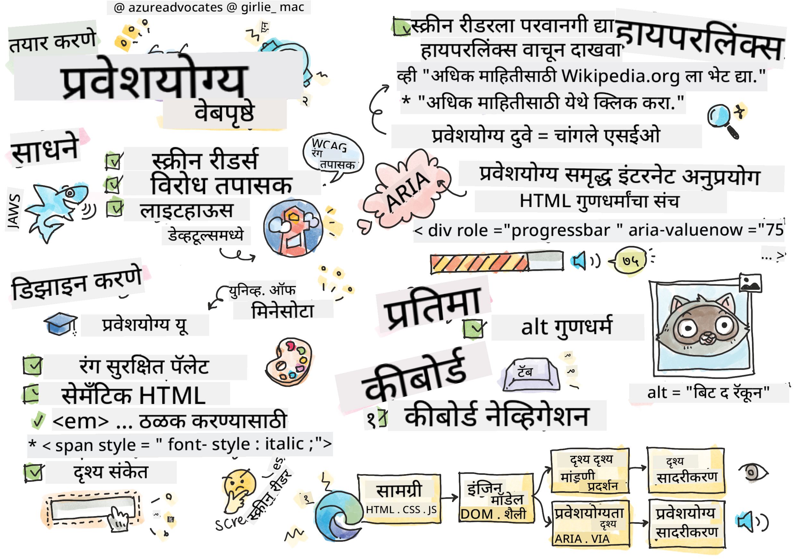
> स्केच नोट [Tomomi Imura](https://twitter.com/girlie_mac) यांनी तयार केले आहे

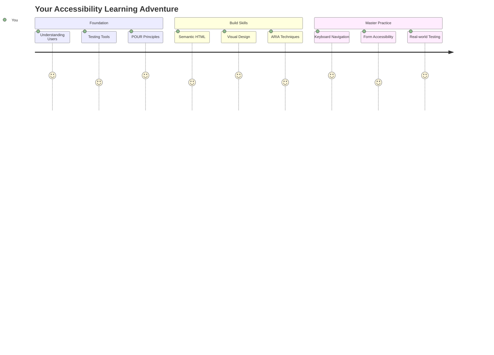

## व्याख्यानपूर्व प्रश्नमंजुषा
[व्याख्यानपूर्व प्रश्नमंजुषा](https://ff-quizzes.netlify.app/web/)

> वेबची ताकद त्याच्या सार्वत्रिकतेत आहे. अपंगत्व असलेल्या प्रत्येक व्यक्तीला प्रवेश मिळणे ही एक महत्त्वाची बाब आहे.
>
> \- सर टिमोथी बर्नर्स-ली, W3C संचालक आणि वर्ल्ड वाइड वेबचे शोधक

हे ऐकून तुम्हाला आश्चर्य वाटेल: जेव्हा तुम्ही प्रवेशयोग्य वेबसाइट्स तयार करता, तेव्हा तुम्ही फक्त अपंग व्यक्तींना मदत करत नाही—तुम्ही प्रत्यक्षात वेब सर्वांसाठी चांगले बनवत आहात!

तुम्ही कधी रस्त्याच्या कोपऱ्यावर असलेल्या उतारांवर लक्ष दिले आहे का? ते मूळतः व्हीलचेअरसाठी डिझाइन केले गेले होते, परंतु आता ते बेबी स्ट्रोलर, डिलिव्हरी कामगार, प्रवासी आणि सायकलस्वार यांना देखील मदत करतात. प्रवेशयोग्य वेब डिझाइन नेमके असेच कार्य करते—ज्या उपाययोजना एका गटाला मदत करतात त्या अनेकांना फायदेशीर ठरतात. खूप छान, नाही का?

या धड्यात, आपण अशा वेबसाइट्स तयार करण्याचा शोध घेणार आहोत ज्या प्रत्येकासाठी कार्य करतात, मग ते वेब कसेही ब्राउझ करत असले तरी. तुम्ही वेब मानकांमध्ये आधीच समाविष्ट असलेल्या व्यावहारिक तंत्रांचा शोध घेणार आहात, चाचणी साधनांसह प्रत्यक्ष अनुभव घेणार आहात आणि प्रवेशयोग्यता तुमच्या साइट्स सर्व वापरकर्त्यांसाठी अधिक वापरण्यायोग्य कशी बनवते ते पाहणार आहात.

या धड्याच्या शेवटी, तुम्हाला प्रवेशयोग्यता तुमच्या विकास कार्यप्रवाहाचा नैसर्गिक भाग बनवण्याचा आत्मविश्वास मिळेल. विचारपूर्वक डिझाइन निवडी वेबला अब्जावधी वापरकर्त्यांसाठी कसे खुले करू शकतात हे शोधण्यासाठी तयार आहात? चला सुरुवात करूया!

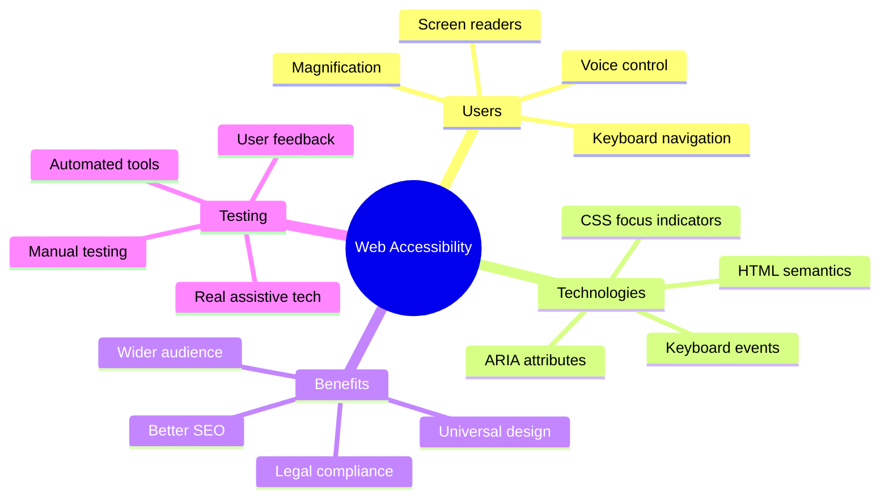

> तुम्ही हा धडा [Microsoft Learn](https://docs.microsoft.com/learn/modules/web-development-101/accessibility/?WT.mc_id=academic-77807-sagibbon) वर घेऊ शकता!

## सहाय्यक तंत्रज्ञान समजून घेणे

कोडिंगमध्ये उडी घेण्यापूर्वी, वेगवेगळ्या क्षमतेच्या लोक वेबचा प्रत्यक्षात कसा अनुभव घेतात हे समजून घेण्यासाठी थोडा वेळ घ्या. हे फक्त सिद्धांत नाही—या वास्तविक-जगातील नेव्हिगेशन पद्धती समजून घेणे तुम्हाला खूप चांगला विकसक बनवेल!

सहाय्यक तंत्रज्ञान हे आश्चर्यकारक साधने आहेत जी अपंगत्व असलेल्या लोकांना वेबसाइट्सशी संवाद साधण्यास मदत करतात ज्यामुळे तुम्हाला आश्चर्य वाटेल. एकदा तुम्हाला या तंत्रज्ञानाचा उपयोग कसा करायचा हे समजले की, प्रवेशयोग्य वेब अनुभव तयार करणे अधिक अंतर्ज्ञानी होते. हे एखाद्याच्या दृष्टीकोनातून तुमचा कोड पाहण्यास शिकण्यासारखे आहे.

### स्क्रीन रीडर्स

[स्क्रीन रीडर्स](https://en.wikipedia.org/wiki/Screen_reader) ही अत्यंत प्रगत तंत्रज्ञानाची साधने आहेत जी डिजिटल मजकूराचे भाषण किंवा ब्रेल आउटपुटमध्ये रूपांतर करतात. जरी ते प्रामुख्याने दृष्टिहीन लोक वापरतात, तरी ते डिस्लेक्सिया सारख्या शिकण्याच्या अडचणी असलेल्या वापरकर्त्यांसाठी देखील खूप उपयुक्त आहेत.

मी स्क्रीन रीडरला एखाद्या खूप हुशार कथाकथनकारासारखे समजतो जो तुम्हाला पुस्तक वाचून दाखवतो. तो मजकूर तार्किक क्रमाने मोठ्याने वाचतो, "बटण" किंवा "लिंक" सारख्या परस्परसंवादी घटकांची घोषणा करतो आणि पृष्ठाभोवती उडी मारण्यासाठी कीबोर्ड शॉर्टकट प्रदान करतो. पण गोष्ट अशी आहे—स्क्रीन रीडर्स त्यांचे जादू फक्त तेव्हा करू शकतात जेव्हा आपण योग्य रचना आणि अर्थपूर्ण सामग्रीसह वेबसाइट्स तयार करतो. येथे तुम्ही विकसक म्हणून मदत करू शकता!

**प्लॅटफॉर्मवर लोकप्रिय स्क्रीन रीडर्स:**
- **Windows**: [NVDA](https://www.nvaccess.org/about-nvda/) (फ्री आणि सर्वाधिक लोकप्रिय), [JAWS](https://webaim.org/articles/jaws/), [Narrator](https://support.microsoft.com/windows/complete-guide-to-narrator-e4397a0d-ef4f-b386-d8ae-c172f109bdb1/?WT.mc_id=academic-77807-sagibbon) (इन-बिल्ट)
- **macOS/iOS**: [VoiceOver](https://support.apple.com/guide/voiceover/welcome/10) (इन-बिल्ट आणि अत्यंत सक्षम)
- **Android**: [TalkBack](https://support.google.com/accessibility/android/answer/6283677) (इन-बिल्ट)
- **Linux**: [Orca](https://wiki.gnome.org/Projects/Orca) (फ्री आणि ओपन-सोर्स)

**स्क्रीन रीडर्स वेब सामग्री कशी नेव्हिगेट करतात:**

स्क्रीन रीडर्स अनेक नेव्हिगेशन पद्धती प्रदान करतात ज्यामुळे अनुभवी वापरकर्त्यांसाठी ब्राउझिंग अधिक कार्यक्षम होते:
- **क्रमिक वाचन**: मजकूर वरून खाली वाचतो, जसे पुस्तक वाचणे
- **लँडमार्क नेव्हिगेशन**: पृष्ठ विभागांमध्ये उडी मारणे (हेडर, नेव्ह, मुख्य, फूटर)
- **हेडिंग नेव्हिगेशन**: हेडिंग्समध्ये उडी मारून पृष्ठ रचना समजून घेणे
- **लिंक यादी**: सर्व लिंकची यादी तयार करणे
- **फॉर्म कंट्रोल्स**: इनपुट फील्ड्स आणि बटणांमध्ये थेट नेव्हिगेट करणे

> 💡 **माझ्या मनाला आश्चर्यचकित करणारी गोष्ट**: 68% स्क्रीन रीडर वापरकर्ते मुख्यतः हेडिंग्सद्वारे नेव्हिगेट करतात ([WebAIM सर्वेक्षण](https://webaim.org/projects/screenreadersurvey9/#finding)). याचा अर्थ तुमची हेडिंग रचना वापरकर्त्यांसाठी रोडमॅपसारखी आहे—तुम्ही ती योग्य प्रकारे तयार करता तेव्हा तुम्ही लोकांना तुमच्या सामग्रीभोवती जलद मार्ग शोधण्यात मदत करत आहात!

### तुमचा चाचणी कार्यप्रवाह तयार करणे

चांगली बातमी आहे—प्रभावी प्रवेशयोग्यता चाचणी करणे अवघड असण्याची गरज नाही! तुम्हाला स्वयंचलित साधने (ती स्पष्ट समस्या शोधण्यात उत्कृष्ट आहेत) आणि काही प्रत्यक्ष चाचणी यांचे संयोजन करायचे आहे. येथे एक प्रणालीबद्ध दृष्टिकोन आहे ज्यामुळे सर्वाधिक समस्या सापडतात आणि तुमचा संपूर्ण दिवस खर्च होत नाही:

**आवश्यक मॅन्युअल चाचणी कार्यप्रवाह:**

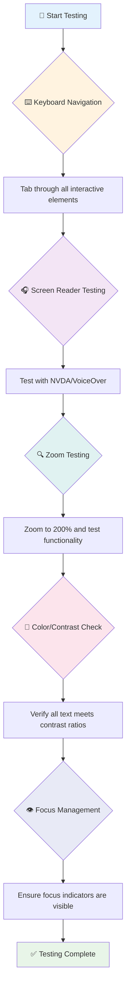

**चाचणी तपासणी सूची चरण-दर-चरण:**
1. **कीबोर्ड नेव्हिगेशन**: फक्त Tab, Shift+Tab, Enter, Space आणि Arrow की वापरा
2. **स्क्रीन रीडर चाचणी**: NVDA, VoiceOver किंवा Narrator सक्षम करा आणि डोळे बंद करून नेव्हिगेट करा
3. **झूम चाचणी**: 200% आणि 400% झूम स्तरांवर चाचणी करा
4. **रंग विरोधाभास पडताळणी**: सर्व मजकूर आणि UI घटक तपासा
5. **फोकस इंडिकेटर चाचणी**: सर्व परस्परसंवादी घटकांमध्ये दृश्यमान फोकस स्टेट्स आहेत याची खात्री करा

✅ **Lighthouse सह प्रारंभ करा**: तुमच्या ब्राउझरचे DevTools उघडा, Lighthouse प्रवेशयोग्यता ऑडिट चालवा आणि नंतर तुमच्या मॅन्युअल चाचणी फोकस क्षेत्रांचे मार्गदर्शन करण्यासाठी परिणाम वापरा.

### झूम आणि वाढीव साधने

तुम्ही कधी तुमच्या फोनवर मजकूर खूप लहान असल्यास झूम करण्यासाठी पिंच केले आहे किंवा उज्ज्वल सूर्यप्रकाशात तुमच्या लॅपटॉप स्क्रीनवर डोळे मिचकावले आहेत का? अनेक वापरकर्ते दररोज सामग्री वाचनीय बनवण्यासाठी वाढीव साधनांवर अवलंबून असतात. यामध्ये कमी दृष्टी असलेले लोक, वृद्ध व्यक्ती आणि कधीही बाहेर वेबसाइट वाचण्याचा प्रयत्न करणारे कोणीही समाविष्ट आहे.

आधुनिक झूम तंत्रज्ञान फक्त गोष्टी मोठ्या करण्यापेक्षा पुढे गेले आहे. ही साधने कशी कार्य करतात हे समजून घेणे तुम्हाला प्रतिसादात्मक डिझाइन तयार करण्यात मदत करेल जे कोणत्याही वाढीव स्तरावर कार्यक्षम आणि आकर्षक राहील.

**आधुनिक ब्राउझर झूम क्षमता:**
- **पृष्ठ झूम**: सर्व सामग्री प्रमाणानुसार स्केल करते (मजकूर, प्रतिमा, लेआउट) - ही प्राधान्य दिलेली पद्धत आहे
- **फक्त मजकूर झूम**: मूळ लेआउट राखून फॉन्ट आकार वाढवतो
- **पिंच-टू-झूम**: तात्पुरत्या वाढीसाठी मोबाइल गेस्चर समर्थन
- **ब्राउझर समर्थन**: सर्व आधुनिक ब्राउझर 500% पर्यंत झूम समर्थन देतात ज्यामुळे कार्यक्षमता बिघडत नाही

**विशेषीकृत वाढीव सॉफ्टवेअर:**
- **Windows**: [Magnifier](https://support.microsoft.com/windows/use-magnifier-to-make-things-on-the-screen-easier-to-see-414948ba-8b1c-d3bd-8615-0e5e32204198) (इन-बिल्ट), [ZoomText](https://www.freedomscientific.com/training/zoomtext/getting-started/)
- **macOS/iOS**: [Zoom](https://www.apple.com/accessibility/mac/vision/) (इन-बिल्ट आणि प्रगत वैशिष्ट्यांसह)

> ⚠️ **डिझाइन विचार**: WCAG ची आवश्यकता आहे की सामग्री 200% पर्यंत झूम केल्यावर कार्यक्षम राहावी. या स्तरावर, आडव्या स्क्रोलिंग किमान असावी आणि सर्व परस्परसंवादी घटक प्रवेशयोग्य राहावेत.

✅ **तुमचा प्रतिसादात्मक डिझाइन तपासा**: तुमचा ब्राउझर 200% आणि 400% झूम करा. तुमचा लेआउट सुंदरपणे जुळतो का? तुम्ही अजूनही अत्यधिक स्क्रोलिंगशिवाय सर्व कार्यक्षमता वापरू शकता का?

## आधुनिक प्रवेशयोग्यता चाचणी साधने

आता तुम्हाला सहाय्यक तंत्रज्ञानासह लोक वेब कसे नेव्हिगेट करतात हे समजले आहे, चला तुम्हाला प्रवेशयोग्य वेबसाइट्स तयार करण्यात आणि चाचणी घेण्यात मदत करणारी साधने शोधूया.

याचा विचार करा: स्वयंचलित साधने स्पष्ट समस्या (जसे की गहाळ alt मजकूर) शोधण्यात उत्कृष्ट आहेत, तर प्रत्यक्ष चाचणी तुम्हाला तुमची साइट वास्तविक जगात वापरण्यास चांगली वाटते याची खात्री करण्यास मदत करते. एकत्रितपणे, ते तुम्हाला तुमच्या साइट्स सर्वांसाठी कार्यक्षम आहेत याचा आत्मविश्वास देतात.

### रंग विरोधाभास चाचणी

चांगली बातमी: रंग विरोधाभास ही सर्वात सामान्य प्रवेशयोग्यता समस्या आहे, परंतु ती सोडवणे सर्वात सोपे आहे. चांगला विरोधाभास सर्वांना फायदेशीर ठरतो—दृष्टीदोष असलेल्या वापरकर्त्यांपासून ते समुद्रकिनारी फोन वाचण्याचा प्रयत्न करणाऱ्या लोकांपर्यंत.

**WCAG विरोधाभास आवश्यकता:**

| मजकूर प्रकार | WCAG AA (किमान) | WCAG AAA (वाढीव) |
|--------------|------------------|------------------|
| **सामान्य मजकूर** (18pt पेक्षा कमी) | 4.5:1 विरोधाभास गुणोत्तर | 7:1 विरोधाभास गुणोत्तर |
| **मोठा मजकूर** (18pt+ किंवा 14pt+ ठळक) | 3:1 विरोधाभास गुणोत्तर | 4.5:1 विरोधाभास गुणोत्तर |
| **UI घटक** (बटणे, फॉर्म बॉर्डर्स) | 3:1 विरोधाभास गुणोत्तर | 3:1 विरोधाभास गुणोत्तर |

**आवश्यक चाचणी साधने:**
- [Colour Contrast Analyser](https://www.tpgi.com/color-contrast-checker/) - रंग पिकरसह डेस्कटॉप अ‍ॅप
- [WebAIM Contrast Checker](https://webaim.org/resources/contrastchecker/) - वेब-आधारित त्वरित अभिप्रायासह
- [Stark](https://www.getstark.co/) - Figma, Sketch, Adobe XD साठी डिझाइन टूल प्लगइन
- [Accessible Colors](https://accessible-colors.com/) - प्रवेशयोग्य रंग पॅलेट शोधा

✅ **चांगले रंग पॅलेट तयार करा**: तुमच्या ब्रँड रंगांसह प्रारंभ करा आणि प्रवेशयोग्य भिन्नता तयार करण्यासाठी विरोधाभास तपासक वापरा. यांना तुमच्या डिझाइन सिस्टमच्या प्रवेशयोग्य रंग टोकन म्हणून दस्तऐवजीकरण करा.

### सर्वसमावेशक प्रवेशयोग्यता ऑडिटिंग

सर्वात प्रभावी प्रवेशयोग्यता चाचणी अनेक दृष्टिकोन एकत्रित करते. एकही साधन सर्वकाही पकडत नाही, त्यामुळे विविध पद्धतींसह चाचणी दिनचर्या तयार करणे व्यापक कव्हरेज सुनिश्चित करते.

**ब्राउझर-आधारित चाचणी (DevTools मध्ये समाविष्ट):**
- **Chrome/Edge**: Lighthouse प्रवेशयोग्यता ऑडिट + प्रवेशयोग्यता पॅनेल
- **Firefox**: तपशीलवार ट्री व्ह्यूसह प्रवेशयोग्यता निरीक्षक
- **Safari**: Web Inspector मधील ऑडिट टॅब VoiceOver सिम्युलेशनसह

**व्यावसायिक चाचणी विस्तार:**
- [axe DevTools](https://www.deque.com/axe/devtools/) - उद्योग-मानक स्वयंचलित चाचणी
- [WAVE](https://wave.webaim.org/extension/) - त्रुटी हायलाइटिंगसह व्हिज्युअल अभिप्राय
- [Accessibility Insights](https://accessibilityinsights.io/) - Microsoft चे सर्वसमावेशक चाचणी संच

**कमांड-लाइन आणि CI/CD एकत्रीकरण:**
- [axe-core](https://github.com/dequelabs/axe-core) - स्वयंचलित चाचणीसाठी JavaScript लायब्ररी
- [Pa11y](https://pa11y.org/) - कमांड-लाइन प्रवेशयोग्यता चाचणी साधन
- [Lighthouse CI](https://github.com/GoogleChrome/lighthouse-ci) - स्वयंचलित प्रवेशयोग्यता स्कोअरिंग

> 🎯 **चाचणी उद्दिष्ट**: 95+ च्या Lighthouse प्रवेशयोग्यता स्कोअरला तुमचा आधार म्हणून लक्ष्य करा. लक्षात ठेवा, स्वयंचलित साधने फक्त 30-40% प्रवेशयोग्यता समस्या शोधतात—मॅन्युअल चाचणी अजूनही आवश्यक आहे!

### 🧠 **चाचणी कौशल्य तपासणी: समस्या शोधण्यासाठी तयार आहात?**

**चला पाहूया की तुम्ही प्रवेशयोग्यता चाचणीबद्दल कसे वाटत आहात:**
- सध्या तुम्हाला कोणती चाचणी पद्धत सर्वात सोपी वाटते?
- तुम्ही संपूर्ण दिवसासाठी फक्त कीबोर्ड-नेव्हिगेशन वापरण्याची कल्पना करू शकता का?
- तुम्ही ऑनलाइन वैयक्तिकरित्या अनुभवलेली एक प्रवेशयोग्यता अडथळा कोणती आहे?

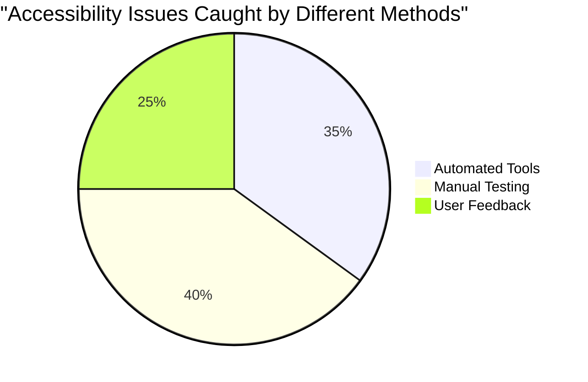

> **आत्मविश्वास वाढवणारा**: व्यावसायिक प्रवेशयोग्यता परीक्षक याच पद्धतींचा वापर करतात. तुम्ही उद्योग-मानक पद्धती शिकत आहात!

## सुरुवातीपासून प्रवेशयोग्यता तयार करणे

प्रवेशयोग्यता यशस्वी होण्याची गुरुकिल्ली म्हणजे पहिल्या दिवसापासून ती तुमच्या पाया मध्ये समाविष्ट करणे. मला माहित आहे की "मी नंतर प्रवेशयोग्यता जोडेन" असे विचार करणे मोहक आहे, परंतु ते आधीच बांधलेल्या घरात रॅम्प जोडण्याचा प्रयत्न करण्यासारखे आहे. शक्य आहे? होय. सोपे? नाही.

प्रवेशयोग्यतेचा विचार घराच्या नियोजनासारखा करा—तुमच्या सुरुवातीच्या वास्तुशास्त्रीय योजनांमध्ये व्हीलचेअर प्रवेशयोग्यता समाविष्ट करणे खूप सोपे आहे, नंतर सर्वकाही बदलणे कठीण आहे.

### POUR तत्त्वे: तुमचा प्रवेशयोग्यता पाया

वेब सामग्री प्रवेशयोग्यता मार्गदर्शक तत्त्वे (WCAG) चार मूलभूत तत्त्वांभोवती तयार केली गेली आहेत जी POUR असे लिहितात. काळजी करू नका—हे कठोर शैक्षणिक संकल्पना नाहीत! ते प्रत्यक्षात सर्वांसाठी कार्य करणारी सामग्री
- **वेगवेगळ्या ब्राउझर, उपकरणे आणि सहाय्यक साधनांवर चाचणी करा**
- **अग्रगण्य वैशिष्ट्ये समर्थित नसल्यास सामग्री अशा प्रकारे संरचित करा की ती सहजपणे कार्य करेल**

### 🎯 **POUR तत्त्वे तपासणी: लक्षात ठेवण्यासाठी**

**मूलभूत गोष्टींचा जलद विचार:**
- तुम्ही POUR तत्त्वांपैकी प्रत्येकाचे अपयश दर्शवणारे वेबसाइट वैशिष्ट्य विचार करू शकता का?
- तुमच्यासाठी, एक विकसक म्हणून कोणते तत्त्व सर्वात नैसर्गिक वाटते?
- ही तत्त्वे केवळ अपंग वापरकर्त्यांसाठीच नव्हे तर सर्वांसाठी डिझाइन सुधारण्यात कशी मदत करू शकतात?

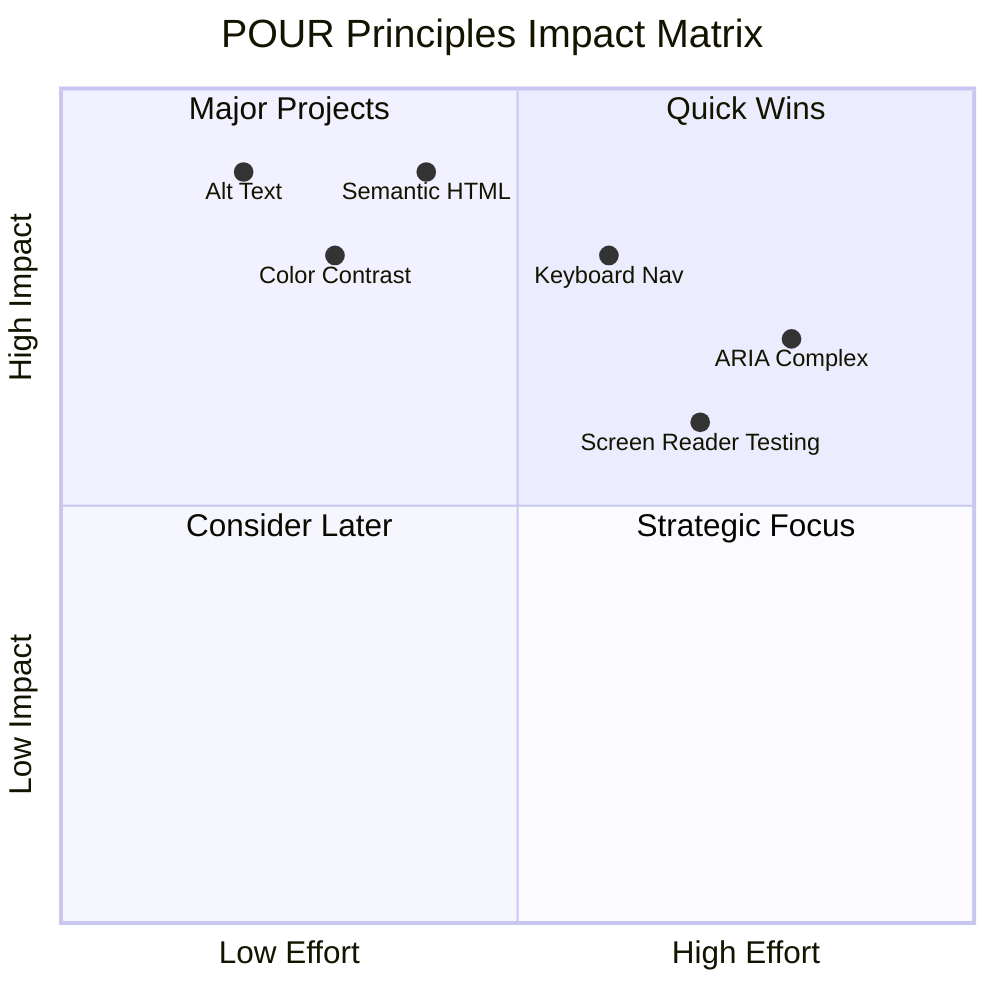

> **लक्षात ठेवा**: उच्च-प्रभाव, कमी-प्रयत्न सुधारणा पासून सुरुवात करा. सेमॅंटिक HTML आणि alt टेक्स्ट तुम्हाला सर्वात कमी प्रयत्नात सर्वात मोठा प्रवेशयोग्यता फायदा देतात!

## प्रवेशयोग्य व्हिज्युअल डिझाइन तयार करणे

चांगले व्हिज्युअल डिझाइन आणि प्रवेशयोग्यता हातात हात घालून जातात. जेव्हा तुम्ही प्रवेशयोग्यतेचा विचार करून डिझाइन करता, तेव्हा तुम्हाला असे आढळते की या मर्यादा स्वच्छ, अधिक मोहक उपाय शोधण्यात मदत करतात जे सर्व वापरकर्त्यांना फायदेशीर ठरतात.

चला सर्वांसाठी, त्यांच्या दृश्य क्षमतेसाठी किंवा तुमची सामग्री पाहण्याच्या परिस्थितींसाठी कार्य करणारे व्हिज्युअली आकर्षक डिझाइन तयार कसे करायचे ते शोधूया.

### रंग आणि व्हिज्युअल प्रवेशयोग्यता धोरणे

रंग संवादासाठी शक्तिशाली आहे, परंतु महत्त्वाची माहिती देण्यासाठी तो कधीही एकमेव मार्ग असू नये. रंगाच्या पलीकडे डिझाइन करणे अधिक मजबूत, समावेशक अनुभव तयार करते जे अधिक परिस्थितींमध्ये कार्य करते.

**रंग दृष्टिकोनातील फरकांसाठी डिझाइन करा:**

सुमारे 8% पुरुष आणि 0.5% महिला काही प्रकारच्या रंग दृष्टिकोनातील फरक (सामान्यतः "रंग अंधत्व" म्हणतात) अनुभवतात. सर्वात सामान्य प्रकार आहेत:
- **Deuteranopia**: लाल आणि हिरवा ओळखण्यात अडचण
- **Protanopia**: लाल अधिक मंद दिसतो
- **Tritanopia**: निळा आणि पिवळा ओळखण्यात अडचण (दुर्मिळ)

**समावेशक रंग धोरणे:**

```css
/* ❌ Bad: Using only color to indicate status */
.error { color: red; }
.success { color: green; }

/* ✅ Good: Color plus icons and context */
.error {
  color: #d32f2f;
  border-left: 4px solid #d32f2f;
}
.error::before {
  content: "⚠️";
  margin-right: 8px;
}

.success {
  color: #2e7d32;
  border-left: 4px solid #2e7d32;
}
.success::before {
  content: "✅";
  margin-right: 8px;
}
```

**मूलभूत कॉन्ट्रास्ट आवश्यकता पलीकडे:**
- रंग अंधत्व सिम्युलेटरसह तुमच्या रंग निवडीची चाचणी करा
- रंग कोडिंगसह नमुने, पोत किंवा आकार वापरा
- परस्परसंवादी स्थिती रंगाशिवाय वेगळ्या राहतील याची खात्री करा
- उच्च कॉन्ट्रास्ट मोडमध्ये तुमचे डिझाइन कसे दिसते याचा विचार करा

✅ **तुमच्या रंग प्रवेशयोग्यतेची चाचणी करा**: [Coblis](https://www.color-blindness.com/coblis-color-blindness-simulator/) सारख्या साधनांचा वापर करून तुमची साइट वेगवेगळ्या प्रकारच्या रंग दृष्टिकोन असलेल्या वापरकर्त्यांना कशी दिसते ते पहा.

### फोकस इंडिकेटर्स आणि परस्परसंवाद डिझाइन

फोकस इंडिकेटर्स डिजिटल कर्सरच्या समतुल्य आहेत—ते कीबोर्ड वापरकर्त्यांना पृष्ठावर कुठे आहेत हे दर्शवतात. चांगल्या प्रकारे डिझाइन केलेले फोकस इंडिकेटर्स सर्वांसाठी अनुभव वाढवतात, परस्परसंवाद स्पष्ट आणि अंदाज करण्यायोग्य बनवतात.

**आधुनिक फोकस इंडिकेटर सर्वोत्तम पद्धती:**

```css
/* Enhanced focus styles that work across browsers */
button:focus-visible {
  outline: 2px solid #0066cc;
  outline-offset: 2px;
  box-shadow: 0 0 0 4px rgba(0, 102, 204, 0.25);
}

/* Remove focus outline for mouse users, preserve for keyboard users */
button:focus:not(:focus-visible) {
  outline: none;
}

/* Focus-within for complex components */
.card:focus-within {
  box-shadow: 0 0 0 3px rgba(74, 144, 164, 0.5);
  border-color: #4A90A4;
}

/* Ensure focus indicators meet contrast requirements */
.custom-focus:focus-visible {
  outline: 3px solid #ffffff;
  outline-offset: 2px;
  box-shadow: 0 0 0 6px #000000;
}
```

**फोकस इंडिकेटर आवश्यकता:**
- **दृश्यमानता**: सभोवतालच्या घटकांसह किमान 3:1 कॉन्ट्रास्ट गुणोत्तर असणे आवश्यक आहे
- **रुंदी**: संपूर्ण घटकाभोवती किमान 2px जाडी असणे आवश्यक आहे
- **स्थिरता**: फोकस दुसरीकडे हलवले जाईपर्यंत दृश्यमान राहावे
- **भिन्नता**: इतर UI स्थितींपेक्षा दृश्यमानपणे वेगळे असणे आवश्यक आहे

> 💡 **डिझाइन टिप**: उत्कृष्ट फोकस इंडिकेटर्स अनेकदा दृश्यता सुनिश्चित करण्यासाठी outline, box-shadow आणि रंग बदलांचा संयोजन वापरतात.

✅ **फोकस इंडिकेटर्सचे ऑडिट करा**: तुमच्या वेबसाइटवर टॅब करा आणि कोणते घटक स्पष्ट फोकस इंडिकेटर्स आहेत ते नोंदवा. काही पाहणे कठीण आहे किंवा पूर्णपणे गहाळ आहेत का?

### सेमॅंटिक HTML: प्रवेशयोग्यतेचा पाया

सेमॅंटिक HTML म्हणजे तुमच्या वेबसाइटसाठी सहाय्यक तंत्रज्ञानासाठी GPS प्रणाली देणे. जेव्हा तुम्ही योग्य HTML घटक त्याच्या उद्देशासाठी वापरता, तेव्हा तुम्ही स्क्रीन रीडर्स, कीबोर्ड्स आणि इतर साधनांना वापरकर्त्यांना प्रभावीपणे नेव्हिगेट करण्यात मदत करण्यासाठी तपशीलवार रोडमॅप प्रदान करता.

माझ्यासाठी खरोखर क्लिक केलेली एक उपमा येथे आहे: सेमॅंटिक HTML म्हणजे स्पष्ट श्रेणी आणि उपयुक्त चिन्हांसह चांगल्या प्रकारे आयोजित केलेल्या लायब्ररी आणि पुस्तके यादृच्छिकपणे विखुरलेल्या गोदामातील फरक. दोन्ही ठिकाणी समान पुस्तके आहेत, परंतु तुम्हाला त्यामध्ये काहीतरी शोधण्याचा प्रयत्न करायचा असेल तर तुम्हाला कोणते ठिकाण अधिक चांगले वाटेल? अगदी!

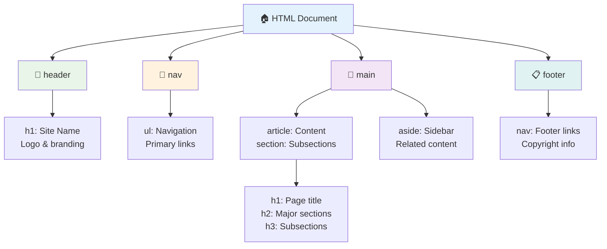

**प्रवेशयोग्य पृष्ठ संरचनेचे बांधकाम ब्लॉक्स:**

```html
<!-- Landmark elements provide page navigation structure -->
<header>
  <h1>Your Site Name</h1>
  <nav aria-label="Main navigation">
    <ul>
      <li><a href="/home">Home</a></li>
      <li><a href="/about">About</a></li>
      <li><a href="/services">Services</a></li>
    </ul>
  </nav>
</header>

<main>
  <article>
    <header>
      <h1>Article Title</h1>
      <p>Published on <time datetime="2024-10-14">October 14, 2024</time></p>
    </header>
    
    <section>
      <h2>First Section</h2>
      <p>Content that relates to this section...</p>
    </section>
    
    <section>
      <h2>Second Section</h2>
      <p>More related content...</p>
    </section>
  </article>
  
  <aside>
    <h2>Related Links</h2>
    <nav aria-label="Related articles">
      <ul>
        <li><a href="/related-1">First related article</a></li>
        <li><a href="/related-2">Second related article</a></li>
      </ul>
    </nav>
  </aside>
</main>

<footer>
  <p>&copy; 2024 Your Site Name. All rights reserved.</p>
  <nav aria-label="Footer links">
    <ul>
      <li><a href="/privacy">Privacy Policy</a></li>
      <li><a href="/contact">Contact Us</a></li>
    </ul>
  </nav>
</footer>
```

**सेमॅंटिक HTML प्रवेशयोग्यता कशी बदलते:**

| सेमॅंटिक घटक | उद्देश | स्क्रीन रीडर फायदा |
|------------------|---------|----------------------|
| `<header>` | पृष्ठ किंवा विभाग शीर्षलेख | "बॅनर लँडमार्क" - शीर्षस्थानी जलद नेव्हिगेशन |
| `<nav>` | नेव्हिगेशन लिंक | "नेव्हिगेशन लँडमार्क" - नेव्हिगेशन विभागांची यादी |
| `<main>` | प्राथमिक पृष्ठ सामग्री | "मुख्य लँडमार्क" - थेट सामग्रीवर जा |
| `<article>` | स्वयंपूर्ण सामग्री | लेखाच्या सीमा जाहीर करते |
| `<section>` | थीम असलेले सामग्री गट | सामग्री संरचना प्रदान करते |
| `<aside>` | संबंधित साइडबार सामग्री | "पूरक लँडमार्क" |
| `<footer>` | पृष्ठ किंवा विभाग फूटर्स | "Contentinfo लँडमार्क" |

**सेमॅंटिक HTML सह स्क्रीन रीडर सुपरपॉवर्स:**
- **लँडमार्क नेव्हिगेशन**: प्रमुख पृष्ठ विभागांमध्ये त्वरित उडी
- **हेडिंग आउटलाइन**: तुमच्या हेडिंग संरचनेतून सामग्रीची सूची तयार करा
- **घटक यादी**: सर्व लिंक, बटणे किंवा फॉर्म नियंत्रणांची यादी तयार करा
- **संदर्भ जागरूकता**: सामग्री विभागांमधील संबंध समजून घ्या

> 🎯 **जलद चाचणी**: लँडमार्क शॉर्टकट (NVDA/JAWS मध्ये D लँडमार्कसाठी, H हेडिंगसाठी, K लिंकसाठी) वापरून स्क्रीन रीडरसह तुमच्या साइटवर नेव्हिगेट करण्याचा प्रयत्न करा. नेव्हिगेशन अर्थपूर्ण आहे का?

### 🏗️ **सेमॅंटिक HTML मास्टरी तपासणी: मजबूत पाया तयार करणे**

**तुमच्या सेमॅंटिक समजाचे मूल्यांकन करूया:**
- तुम्ही HTML पाहून वेबपृष्ठावरील लँडमार्क ओळखू शकता का?
- तुम्ही तुमच्या मित्राला `<section>` आणि `<div>` मधील फरक कसा समजावून सांगाल?
- स्क्रीन रीडर वापरकर्त्याने नेव्हिगेशन समस्यांची तक्रार केल्यास तुम्ही प्रथम काय तपासाल?

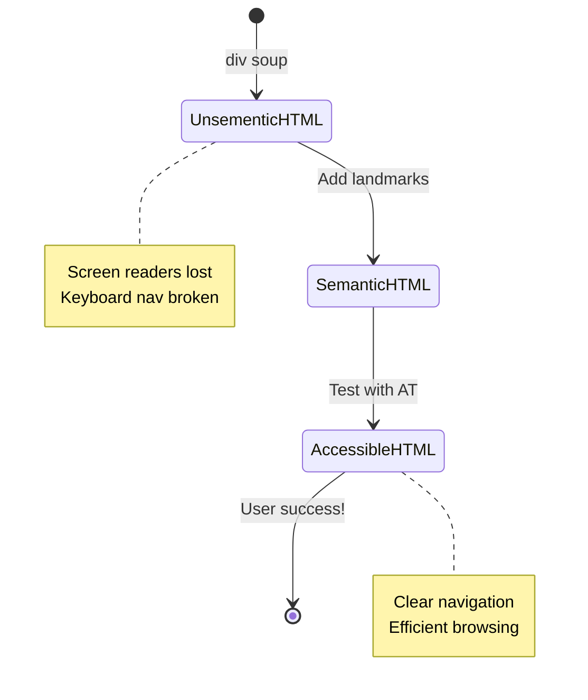

> **प्रो अंतर्दृष्टी**: चांगले सेमॅंटिक HTML स्वयंचलितपणे सुमारे 70% प्रवेशयोग्यता समस्या सोडवते. हा पाया मास्टर करा आणि तुम्ही चांगल्या मार्गावर आहात!

✅ **तुमची सेमॅंटिक संरचना तपासा**: तुमच्या ब्राउझरच्या DevTools मधील प्रवेशयोग्यता पॅनेल वापरून प्रवेशयोग्यता झाड पहा आणि तुमचे मार्कअप तर्कसंगत संरचना तयार करते याची खात्री करा.

### हेडिंग हायरार्की: तर्कसंगत सामग्रीची रूपरेखा तयार करणे

हेडिंग्स प्रवेशयोग्य सामग्रीसाठी अत्यंत महत्त्वाचे आहेत—ते सर्वकाही एकत्र ठेवणाऱ्या कण्यासारखे आहेत. स्क्रीन रीडर वापरकर्ते तुमची सामग्री समजून घेण्यासाठी आणि नेव्हिगेट करण्यासाठी हेडिंगवर मोठ्या प्रमाणावर अवलंबून असतात. हे तुमच्या पृष्ठासाठी सामग्रीची सूची प्रदान करण्यासारखे आहे.

**हेडिंगसाठी सुवर्ण नियम येथे आहे:**
कधीही स्तर वगळू नका. नेहमी `<h1>` ते `<h2>` ते `<h3>` पर्यंत तर्कसंगतपणे प्रगती करा. शाळेत रूपरेखा तयार करणे लक्षात आहे का? हे अगदी त्याच तत्त्व आहे—तुम्ही "I. मुख्य मुद्दा" पासून थेट "C. उप-उप मुद्दा" कडे "A. उप मुद्दा" न घेता उडी मारणार नाही, बरोबर?

**परिपूर्ण हेडिंग संरचना उदाहरण:**

```html
<!-- ✅ Excellent: Logical, hierarchical progression -->
<main>
  <h1>Complete Guide to Web Accessibility</h1>
  
  <section>
    <h2>Understanding Screen Readers</h2>
    <p>Introduction to screen reader technology...</p>
    
    <h3>Popular Screen Reader Software</h3>
    <p>NVDA, JAWS, and VoiceOver comparison...</p>
    
    <h3>Testing with Screen Readers</h3>
    <p>Step-by-step testing instructions...</p>
  </section>
  
  <section>
    <h2>Color and Contrast Guidelines</h2>
    <p>Designing with sufficient contrast...</p>
    
    <h3>WCAG Contrast Requirements</h3>
    <p>Understanding the different contrast levels...</p>
    
    <h3>Testing Tools and Techniques</h3>
    <p>Tools for verifying contrast ratios...</p>
  </section>
</main>
```

```html
<!-- ❌ Problematic: Skipping levels, inconsistent structure -->
<h1>Page Title</h1>
<h3>Subsection</h3> <!-- Skipped h2 -->
<h2>This should come before h3</h2>
<h1>Another main heading?</h1> <!-- Multiple h1s -->
```

**हेडिंग सर्वोत्तम पद्धती:**
- **प्रत्येक पृष्ठावर एक `<h1>`**: सामान्यतः तुमचे मुख्य पृष्ठ शीर्षक किंवा प्राथमिक सामग्री शीर्षलेख
- **तर्कसंगत प्रगती**: स्तर कधीही वगळू नका (h1 → h2 → h3, h1 → h3 नाही)
- **वर्णनात्मक सामग्री**: हेडिंग्स संदर्भाशिवाय वाचल्यावर अर्थपूर्ण बनवा
- **CSS सह व्हिज्युअल स्टाइलिंग**: स्वरूपासाठी CSS वापरा, संरचनेसाठी HTML स्तर

**स्क्रीन रीडर नेव्हिगेशन आकडेवारी:**
- 68% स्क्रीन रीडर वापरकर्ते हेडिंगद्वारे नेव्हिगेट करतात ([WebAIM सर्वेक्षण](https://webaim.org/projects/screenreadersurvey9/#finding))
- वापरकर्त्यांना तर्कसंगत हेडिंग रूपरेखा शोधण्याची अपेक्षा आहे
- हेडिंग्स पृष्ठ संरचना समजून घेण्याचा सर्वात वेगवान मार्ग प्रदान करतात

> 💡 **प्रो टिप**: तुमच्या हेडिंग संरचनेचे व्हिज्युअलायझेशन करण्यासाठी "HeadingsMap" सारख्या ब्राउझर एक्सटेंशनचा वापर करा. ते चांगल्या प्रकारे आयोजित केलेल्या सामग्रीच्या रूपरेखेसारखे वाचले पाहिजे.

✅ **तुमची हेडिंग संरचना तपासा**: स्क्रीन रीडरच्या हेडिंग नेव्हिगेशन (NVDA मध्ये H की) वापरून तुमच्या हेडिंग्समधून उडी मारा. प्रगती तुमच्या सामग्रीची कथा तर्कसंगतपणे सांगते का?

### प्रगत व्हिज्युअल प्रवेशयोग्यता तंत्र

कॉन्ट्रास्ट आणि रंगाच्या मूलभूत गोष्टींपलीकडे, खरोखर समावेशक व्हिज्युअल अनुभव तयार करण्यात मदत करणारी परिष्कृत तंत्रे आहेत. ही पद्धती वेगवेगळ्या पाहण्याच्या परिस्थिती आणि सहाय्यक तंत्रज्ञानावर तुमची सामग्री कार्य करते याची खात्री करतात.

**महत्त्वाच्या व्हिज्युअल संवाद धोरणे:**

- **मल्टी-मोडल फीडबॅक**: व्हिज्युअल, टेक्स्ट आणि कधीकधी ऑडिओ संकेतांचे संयोजन
- **प्रोग्रेसिव्ह डिस्क्लोजर**: माहिती पचण्यायोग्य तुकड्यांमध्ये सादर करा
- **सुसंगत परस्परसंवाद नमुने**: परिचित UI परंपरा वापरा
- **प्रतिसादात्मक टायपोग्राफी**: उपकरणांमध्ये मजकूर योग्य प्रकारे स्केल करा
- **लोडिंग आणि त्रुटी स्थिती**: सर्व वापरकर्ता क्रियांसाठी स्पष्ट फीडबॅक प्रदान करा

**प्रवेशयोग्यतेसाठी CSS उपयोगिता:**

```css
/* Screen reader only text - visually hidden but accessible */
.sr-only {
  position: absolute;
  width: 1px;
  height: 1px;
  padding: 0;
  margin: -1px;
  overflow: hidden;
  clip: rect(0, 0, 0, 0);
  white-space: nowrap;
  border: 0;
}

/* Skip link for keyboard navigation */
.skip-link {
  position: absolute;
  top: -40px;
  left: 6px;
  background: #000000;
  color: #ffffff;
  padding: 8px 16px;
  text-decoration: none;
  border-radius: 4px;
  font-weight: bold;
  transition: top 0.3s ease;
  z-index: 1000;
}

.skip-link:focus {
  top: 6px;
}

/* Reduced motion respect */
@media (prefers-reduced-motion: reduce) {
  .skip-link {
    transition: none;
  }
  
  * {
    animation-duration: 0.01ms !important;
    animation-iteration-count: 1 !important;
    transition-duration: 0.01ms !important;
  }
}

/* High contrast mode support */
@media (prefers-contrast: high) {
  .button {
    border: 2px solid;
  }
}
```

> 🎯 **प्रवेशयोग्यता नमुना**: "स्किप लिंक" कीबोर्ड वापरकर्त्यांसाठी आवश्यक आहे. हे तुमच्या पृष्ठावर प्रथम फोकस करण्यायोग्य घटक असावे आणि मुख्य सामग्री क्षेत्रावर थेट उडी मारावी.

✅ **स्किप नेव्हिगेशन अंमलात आणा**: तुमच्या पृष्ठांवर स्किप लिंक जोडा आणि पृष्ठ लोड झाल्यावर टॅब दाबून त्यांची चाचणी करा. ते दिसले पाहिजे आणि तुम्हाला मुख्य सामग्रीवर उडी मारण्याची परवानगी दिली पाहिजे.

## अर्थपूर्ण लिंक टेक्स्ट तयार करणे

लिंक्स म्हणजे वेबचे महामार्ग आहेत, परंतु खराब लिहिलेले लिंक टेक्स्ट म्हणजे "जागा" ऐवजी "डाउनटाउन शिकागो" म्हणणारे रोड साइन असणे. फारसे उपयुक्त नाही, बरोबर?

जेव्हा मी प्रथम हे शिकलो तेव्हा माझे मन उडाले: स्क्रीन रीडर्स पृष्ठावरील सर्व लिंक्स काढून त्यांना एक मोठी यादी म्हणून दाखवू शकतात. कल्पना करा की कोणीतरी तुम्हाला तुमच्या पृष्ठावरील प्रत्येक लिंकची निर्देशिका दिली आहे. प्रत्येकाला स्वतःहून अर्थ होईल का? तुमच्या लिंक टेक्स्टला पास करायची गरज असलेली चाचणी ही आहे!

### लिंक नेव्हिगेशन नमुने समजून घेणे

स्क्रीन रीडर्स चांगल्या प्रकारे लिहिलेल्या लिंक टेक्स्टवर अवलंबून असलेल्या शक्तिशाली लिंक नेव्हिगेशन वैशिष्ट्ये ऑफर करतात:

**लिंक नेव्हिगेशन पद्धती:**
- **क्रमिक वाचन**: लिंक सामग्री प्रवाहाचा भाग म्हणून संदर्भात वाचले जातात
- **लिंक यादी निर्मिती**: सर्व पृष्ठ लिंक शोधण्यायोग्य निर्देशिकेत संकलित
- **जलद नेव्हिगेशन**: कीबोर्ड शॉर्टकट वापरून लिंक दरम्यान उडी (NVDA मध्ये K)
- **शोध कार्यक्षमता**: आंशिक मजकूर टाइप करून विशिष्ट लिंक शोधा

**संदर्भ का महत्त्वाचा आहे:**
जेव्हा स्क्रीन रीडर वापरकर्ते लिंक यादी तयार करतात, तेव्हा त्यांना असे काहीतरी दिसते:
- "अहवाल डाउनलोड करा"
- "अधिक जाणून घ्या"
- "येथे क्लिक करा"
- "गोपनीयता धोरण"
- "येथे क्लिक करा"

यापैकी फक्त दोन लिंक संदर्भाशिवाय उपयुक्त माहिती प्रदान करतात!

> 📊 **वापरकर्ता प्रभाव**: स्क्रीन रीडर वापरकर्ते पृष्ठ सामग्री जलद समजून घेण्यासाठी लिंक यादी स्कॅन करतात. सामान्य लिंक टेक्स्ट त्यांना प्रत्येक लिंकच्या संदर्भात परत नेव्हिगेट करण्यास भाग पाडते, त्यांच्या ब्राउझिंग अनुभवाला लक्षणीयपणे धीमा करते.

### सामान्य लिंक टेक्स्ट चुका टाळा

काय कार्य करत नाही ते समजून घेणे तुम्हाला विद्यमान सामग्रीतील प्रवेशयोग्यता समस्या ओळखण्यात आणि दुरुस्त करण्यात मदत करते.

**❌ संदर्भ प्रदान न करणारे सामान्य लिंक टेक्स्ट:**

```html
<!-- Meaningless when read from a link list -->
<p>Our sustainability efforts are detailed in our recent report. 
   <a href="/sustainability-2024.pdf">Click here</a> to view it.</p>

<!-- Repeated generic text throughout the page -->
<div class="article-card">
  <h3>Web Accessibility Guide</h3>
  <p>Learn the fundamentals...</p>
  <a href="/accessibility-guide">Read more</a>
</div>
<div class="article-card">
  <h3>Color Contrast Tips</h3>
  <p>Improve your design...</p>
  <a href="/color-contrast">Read more</a>
</div>

<!-- URLs as link text (difficult for screen readers to announce) -->
<p>Visit https://www.w3.org/WAI/WCAG21/quickref/ for WCAG guidelines.</p>

<!-- Vague action words -->
<a href="/contact">Go</a> | <a href="/about">See</a> | <a href="/help">View</a>
```

**हे नमुने का अपयशी ठरतात:**
- **"येथे क्लिक करा"** वापरकर्त्यांना गंतव्यस्थानाबद्दल काहीही सांगत नाही
- **"अधिक वाचा"** अनेक वेळा पुनरावृत्ती केल्याने गोंधळ निर्माण होतो
- **कच्चे URL** स्क्रीन रीडर्ससाठी स्पष्टपणे उच्चारणे कठीण आहे
- **एकल शब्द** जसे "जा" किंवा "पहा" वर्णनात्मक संदर्भाचा अभाव आहे

### उत्कृष्ट लिंक टेक्स्ट लिहिणे

वर्णनात्मक लिंक टेक्स्ट सर्वांना फायदेशीर ठरते—दृष्टी असलेले वापरकर्ते लिंक्स जलद स्कॅन करू शकतात आणि स्क्रीन रीडर वापरकर्ते गंतव्यस्थान त्वरित समजतात.

**✅ स्पष्ट, वर्णनात्मक लिंक टेक्स्ट उदाहरणे:**

```html
<!-- Descriptive text that explains the destination -->
<p>Our comprehensive <a href="/sustainability-2024.pdf">2024 sustainability report (PDF, 2.1MB)</a> details our environmental initiatives.</p>

<!-- Specific, unique link text for each card -->
<div class="article-card">
  <h3>Web Accessibility Guide</h3>
  <p>Learn the fundamentals of inclusive design...</p>
  <a href="/accessibility-guide">Read our complete web accessibility guide</a>
</div>
<div class="article-card">
  <h3>Color Contrast Tips</h3>
  <p>Improve your design with better color choices...</p>
  <a href="/color-contrast">Explore color contrast best practices</a>
</div>

<!-- Meaningful text instead of raw URLs -->
<p>The <a href="https://www.w3.org/WAI/WCAG21/quickref/">WCAG 2.1 Quick Reference guide</a> provides comprehensive accessibility guidelines.</p>

<!-- Descriptive action links -->
<a href="/contact">Contact our support team</a> | 
<a href="/about">About our company</a> | 
<a href="/help">Get help with your account</a>
```

**लिंक टेक्स्ट सर्वोत्तम पद्धती:**
- **विशिष्ट व्हा**: "तिमाही आर्थिक अहवाल डाउनलोड करा" विरुद्ध "डाउनलोड"
- **फाइल प्रकार आणि आकार समाविष्ट करा**: "(PDF, 1.2MB)" डाउनलोड करण्यायोग्य फाइलसाठी
- **लिंक्स बाहेरून उघडल्यास उल्लेख करा**: "(नवीन विंडोमध्ये उघडते)" योग्य असल्यास
- **सक्रिय भाषा वापरा**: "आमच्याशी संपर्क साधा" विरुद्ध "संपर्क पृष्ठ"
- **संक्ष
**ARIA च्या पाच श्रेणी:**

1. **Roles**: हा घटक काय आहे? (`button`, `tab`, `dialog`)
2. **Properties**: त्याची वैशिष्ट्ये काय आहेत? (`aria-required`, `aria-haspopup`)
3. **States**: त्याची सध्याची स्थिती काय आहे? (`aria-expanded`, `aria-checked`)
4. **Landmarks**: पृष्ठाच्या संरचनेत तो कुठे आहे? (`banner`, `navigation`, `main`)
5. **Live regions**: बदल कसे जाहीर केले पाहिजेत? (`aria-live`, `aria-atomic`)

### आधुनिक वेब अॅप्ससाठी आवश्यक ARIA पॅटर्न

हे पॅटर्न परस्परसंवादी वेब अॅप्लिकेशन्समधील सर्वसामान्य अॅक्सेसिबिलिटी आव्हाने सोडवतात:

**घटकांचे नाव आणि वर्णन देणे:**

```html
<!-- aria-label: Provides accessible name when visible text isn't sufficient -->
<button aria-label="Close newsletter subscription dialog">×</button>

<!-- aria-labelledby: References existing text as the accessible name -->
<section aria-labelledby="news-heading">
  <h2 id="news-heading">Latest News</h2>
  <!-- news content -->
</section>

<!-- aria-describedby: Links to additional descriptive text -->
<input type="password" 
       aria-describedby="pwd-requirements pwd-strength"
       required>
<div id="pwd-requirements">
  Password must contain at least 8 characters, including uppercase, lowercase, and numbers.
</div>
<div id="pwd-strength" aria-live="polite">
  <!-- Dynamic password strength indicator -->
</div>
```

**डायनॅमिक सामग्रीसाठी Live regions:**

```html
<!-- Polite announcements (don't interrupt current speech) -->
<div aria-live="polite" id="status-updates">
  <!-- Status messages appear here -->
</div>

<!-- Assertive announcements (interrupt and announce immediately) -->
<div aria-live="assertive" id="urgent-alerts">
  <!-- Error messages and critical alerts -->
</div>

<!-- Loading states with live regions -->
<button id="submit-btn" aria-describedby="loading-status">
  Submit Application
</button>
<div id="loading-status" aria-live="polite" aria-atomic="true">
  <!-- "Processing your application..." appears here -->
</div>
```

**परस्परसंवादी विजेट उदाहरण (accordion):**

```html
<div class="accordion">
  <h3>
    <button aria-expanded="false" 
            aria-controls="panel-1" 
            id="accordion-trigger-1"
            class="accordion-trigger">
      Accessibility Guidelines
    </button>
  </h3>
  <div id="panel-1" 
       role="region"
       aria-labelledby="accordion-trigger-1" 
       hidden>
    <p>WCAG 2.1 provides comprehensive guidelines...</p>
  </div>
</div>
```

```javascript
// JavaScript to manage accordion state
function toggleAccordion(trigger) {
  const panel = document.getElementById(trigger.getAttribute('aria-controls'));
  const isExpanded = trigger.getAttribute('aria-expanded') === 'true';
  
  // Toggle states
  trigger.setAttribute('aria-expanded', !isExpanded);
  panel.hidden = isExpanded;
  
  // Announce change to screen readers
  const status = document.getElementById('status-updates');
  status.textContent = isExpanded ? 'Section collapsed' : 'Section expanded';
}
```

### ARIA अंमलबजावणीसाठी सर्वोत्तम पद्धती

ARIA प्रभावी आहे परंतु काळजीपूर्वक अंमलबजावणीची आवश्यकता आहे. या मार्गदर्शक तत्त्वांचे पालन केल्याने तुमचे ARIA अॅक्सेसिबिलिटी सुधारण्यास मदत करते:

**🛡️ मुख्य तत्त्वे:**

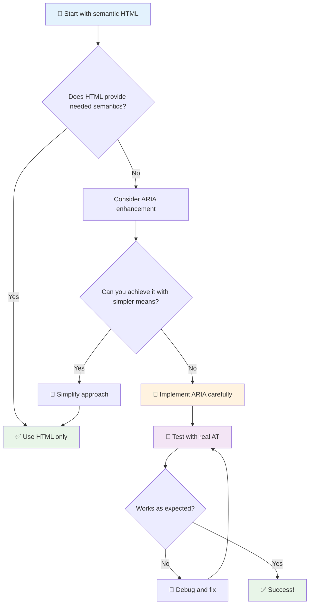

1. **प्रथम सेमॅंटिक HTML**: नेहमी `<button>` ला `<div role="button">` वर प्राधान्य द्या
2. **सेमॅंटिक्स खराब करू नका**: विद्यमान HTML अर्थ ओव्हरराइड करू नका (जसे `<h1 role="button">`)
3. **कीबोर्ड अॅक्सेसिबिलिटी राखा**: सर्व परस्परसंवादी ARIA घटक पूर्णपणे कीबोर्ड अॅक्सेसिबल असले पाहिजेत
4. **खऱ्या वापरकर्त्यांसह चाचणी करा**: सहाय्यक तंत्रज्ञानांमध्ये ARIA समर्थन लक्षणीयपणे बदलते
5. **सोप्या गोष्टींनी सुरुवात करा**: जटिल ARIA अंमलबजावणीमध्ये त्रुटी होण्याची शक्यता जास्त असते

**🔍 चाचणी कार्यप्रवाह:**

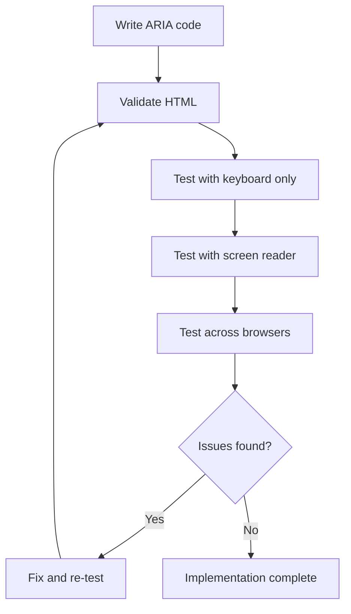

**🚫 टाळण्याच्या सामान्य ARIA चुका:**

- **विरोधाभासी माहिती**: HTML सेमॅंटिक्सशी विरोधाभास करू नका
- **अतिरिक्त लेबलिंग**: खूप जास्त ARIA माहिती वापरकर्त्यांना गोंधळात टाकते
- **स्थिर ARIA**: सामग्री बदलल्यावर ARIA स्टेट्स अपडेट करणे विसरणे
- **अचाचणी केलेली अंमलबजावणी**: सिद्धांतात कार्य करणारे ARIA परंतु प्रत्यक्षात अयशस्वी
- **कीबोर्ड समर्थनाचा अभाव**: ARIA roles शिवाय संबंधित कीबोर्ड परस्परसंवाद

> 💡 **चाचणी संसाधने**: [accessibility-checker](https://www.npmjs.com/package/accessibility-checker) सारख्या साधनांचा वापर ARIA च्या स्वयंचलित पडताळणीसाठी करा, परंतु संपूर्ण अनुभवासाठी नेहमी खऱ्या स्क्रीन रीडर्ससह चाचणी करा.

### 🎭 **ARIA कौशल्य तपासणी: जटिल परस्परसंवादासाठी तयार आहात का?**

**तुमचा ARIA आत्मविश्वास मोजा:**
- तुम्ही सेमॅंटिक HTML ऐवजी ARIA कधी निवडाल? (सूचना: जवळजवळ कधीच नाही!)
- तुम्ही स्पष्ट करू शकता का की `<div role="button">` सहसा `<button>` पेक्षा वाईट का आहे?
- ARIA चाचणीबद्दल लक्षात ठेवण्यासारखी सर्वात महत्त्वाची गोष्ट काय आहे?

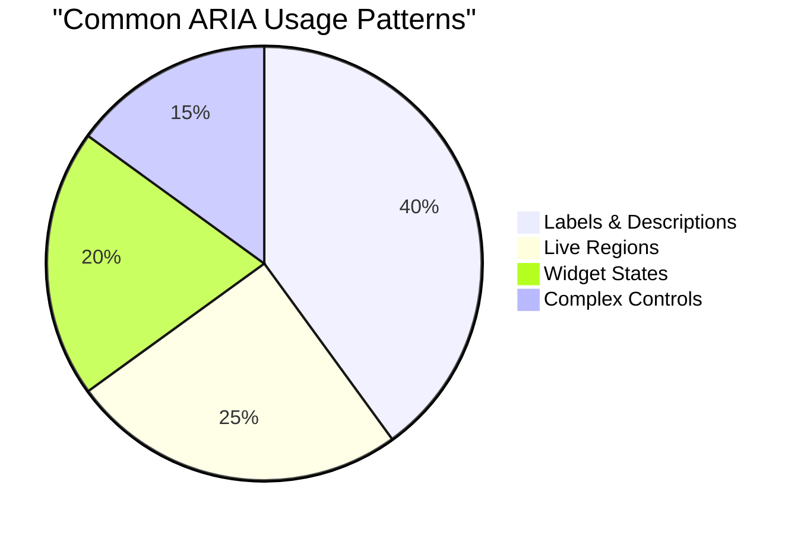

> **महत्त्वाचा दृष्टिकोन**: ARIA चा सर्वाधिक वापर घटकांचे लेबलिंग आणि वर्णन करण्यासाठी केला जातो. जटिल विजेट पॅटर्न अपेक्षेपेक्षा कमी सामान्य आहेत!

✅ **तज्ञांकडून शिका**: [ARIA Authoring Practices Guide](https://w3c.github.io/aria-practices/) अभ्यास करा जटिल परस्परसंवादी विजेट्ससाठी चाचणी केलेले पॅटर्न आणि अंमलबजावणी.

## प्रतिमा आणि माध्यमे अॅक्सेसिबल बनवणे

दृश्य आणि ऑडिओ सामग्री आधुनिक वेब अनुभवांचा महत्त्वाचा भाग आहे, परंतु विचारपूर्वक अंमलबजावणी न केल्यास ती अडथळे निर्माण करू शकते. उद्दिष्ट म्हणजे तुमच्या माध्यमाची माहिती आणि भावनिक प्रभाव प्रत्येक वापरकर्त्यापर्यंत पोहोचवणे. एकदा तुम्हाला त्याची सवय झाली की, ते सहज होते.

वेगवेगळ्या प्रकारच्या माध्यमांसाठी वेगवेगळ्या अॅक्सेसिबिलिटी पद्धती आवश्यक असतात. हे स्वयंपाकासारखे आहे—तुम्ही नाजूक मासा जसा हाताळता तसा मजबूत स्टेक हाताळणार नाही. या फरकांची समज तुम्हाला प्रत्येक परिस्थितीसाठी योग्य उपाय निवडण्यास मदत करते.

### रणनीतिक प्रतिमा अॅक्सेसिबिलिटी

तुमच्या वेबसाइटवरील प्रत्येक प्रतिमेचा एक उद्देश असतो. त्या उद्देशाची समज तुम्हाला चांगला पर्यायी मजकूर लिहिण्यास आणि अधिक समावेशक अनुभव तयार करण्यास मदत करते.

**प्रतिमांचे चार प्रकार आणि त्यांचे alt text धोरण:**

**माहितीपूर्ण प्रतिमा** - महत्त्वाची माहिती देतात:
```html

```

**सजावटीच्या प्रतिमा** - फक्त दृश्यात्मक, कोणतेही माहितीपूर्ण मूल्य नाही:
```html

```

**कार्यात्मक प्रतिमा** - बटणे किंवा नियंत्रण म्हणून कार्य करतात:
```html
<button>
  
</button>
```

**जटिल प्रतिमा** - चार्ट, आकृतिबंध, माहितीपूर्ण ग्राफिक्स:
```html

<div id="chart-description">
  <p>Detailed description: Sales data shows a steady increase across all quarters...</p>
</div>
```

### व्हिडिओ आणि ऑडिओ अॅक्सेसिबिलिटी

**व्हिडिओसाठी आवश्यकता:**
- **कॅप्शन्स**: बोललेल्या सामग्रीचा आणि ध्वनी प्रभावांचा मजकूर आवृत्ती
- **ऑडिओ वर्णन**: अंध वापरकर्त्यांसाठी दृश्य घटकांचे वर्णन
- **ट्रान्सक्रिप्ट्स**: सर्व ऑडिओ आणि व्हिज्युअल सामग्रीची संपूर्ण मजकूर आवृत्ती

```html
<video controls>
  <source src="video.mp4" type="video/mp4">
  <track kind="captions" src="captions.vtt" srclang="en" label="English">
  <track kind="descriptions" src="descriptions.vtt" srclang="en" label="Audio descriptions">
</video>
```

**ऑडिओसाठी आवश्यकता:**
- **ट्रान्सक्रिप्ट्स**: सर्व बोललेल्या सामग्रीची मजकूर आवृत्ती
- **दृश्य निर्देशक**: फक्त ऑडिओ सामग्रीसाठी, दृश्य संकेत प्रदान करा

### आधुनिक प्रतिमा तंत्र

**सजावटीच्या प्रतिमांसाठी CSS चा वापर:**
```css
.hero-section {
  background-image: url('decorative-hero.jpg');
  /* Decorative images in CSS don't need alt text */
}
```

**अॅक्सेसिबिलिटीसह प्रतिसादात्मक प्रतिमा:**
```html
<picture>
  <source media="(min-width: 800px)" srcset="large-chart.png">
  <source media="(min-width: 400px)" srcset="medium-chart.png">
  
</picture>
```

✅ **प्रतिमा अॅक्सेसिबिलिटी चाचणी करा**: स्क्रीन रीडर वापरून प्रतिमांसह पृष्ठ नेव्हिगेट करा. तुम्हाला सामग्री समजण्यासाठी पुरेशी माहिती मिळत आहे का?

## कीबोर्ड नेव्हिगेशन आणि फोकस व्यवस्थापन

अनेक वापरकर्ते पूर्णपणे कीबोर्डसह वेब नेव्हिगेट करतात. यामध्ये मोटर अपंगत्व असलेले लोक, कीबोर्डला माऊसपेक्षा जलद मानणारे पॉवर वापरकर्ते आणि ज्यांचा माऊस काम करत नाही असे कोणीही समाविष्ट आहे. तुमची साइट कीबोर्ड इनपुटसह चांगले कार्य करते याची खात्री करणे आवश्यक आहे आणि अनेकदा तुमची साइट सर्वांसाठी अधिक कार्यक्षम बनवते.

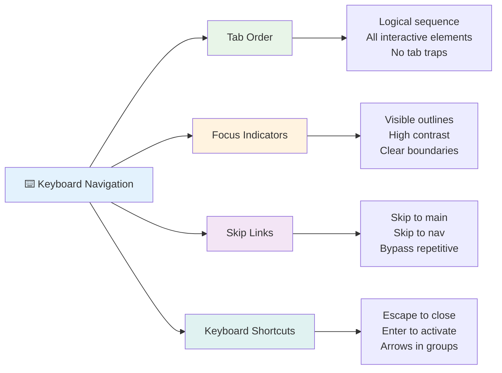

### आवश्यक कीबोर्ड नेव्हिगेशन पॅटर्न

**मानक कीबोर्ड परस्परसंवाद:**
- **Tab**: परस्परसंवादी घटकांमधून पुढे फोकस हलवा
- **Shift + Tab**: फोकस मागे हलवा
- **Enter**: बटणे आणि दुवे सक्रिय करा
- **Space**: बटणे सक्रिय करा, चेकबॉक्स तपासा
- **Arrow keys**: घटक गटांमध्ये नेव्हिगेट करा (रेडिओ बटणे, मेनू)
- **Escape**: मोडाल्स, ड्रॉपडाउन बंद करा किंवा ऑपरेशन्स रद्द करा

### फोकस व्यवस्थापन सर्वोत्तम पद्धती

**दृश्यमान फोकस निर्देशक:**
```css
/* Ensure focus is always visible */
button:focus-visible {
  outline: 2px solid #4A90A4;
  outline-offset: 2px;
}

/* Custom focus styles for different components */
.card:focus-within {
  box-shadow: 0 0 0 3px rgba(74, 144, 164, 0.5);
}
```

**कार्यक्षम नेव्हिगेशनसाठी Skip links:**
```html
<a href="#main-content" class="skip-link">Skip to main content</a>
<a href="#navigation" class="skip-link">Skip to navigation</a>

<nav id="navigation">
  <!-- navigation content -->
</nav>
<main id="main-content">
  <!-- main content -->
</main>
```

**योग्य टॅब ऑर्डर:**
```html
<!-- Use semantic HTML for natural tab order -->
<form>
  <label for="name">Name:</label>
  <input type="text" id="name" tabindex="0">
  
  <label for="email">Email:</label>
  <input type="email" id="email" tabindex="0">
  
  <button type="submit" tabindex="0">Submit</button>
</form>
```

### मोडाल्समध्ये फोकस ट्रॅपिंग

मोडाल डायलॉग उघडताना, फोकस मोडालमध्ये अडकले पाहिजे:

```javascript
// Modern focus trap implementation
function trapFocus(element) {
  const focusableElements = element.querySelectorAll(
    'button, [href], input, select, textarea, [tabindex]:not([tabindex="-1"])'
  );
  
  const firstElement = focusableElements[0];
  const lastElement = focusableElements[focusableElements.length - 1];

  element.addEventListener('keydown', (e) => {
    if (e.key === 'Tab') {
      if (e.shiftKey && document.activeElement === firstElement) {
        e.preventDefault();
        lastElement.focus();
      } else if (!e.shiftKey && document.activeElement === lastElement) {
        e.preventDefault();
        firstElement.focus();
      }
    }
    
    if (e.key === 'Escape') {
      closeModal();
    }
  });
  
  // Focus first element when modal opens
  firstElement.focus();
}
```

✅ **कीबोर्ड नेव्हिगेशन चाचणी करा**: फक्त Tab की वापरून तुमची वेबसाइट नेव्हिगेट करण्याचा प्रयत्न करा. तुम्ही सर्व परस्परसंवादी घटकांपर्यंत पोहोचू शकता का? फोकस ऑर्डर तार्किक आहे का? फोकस निर्देशक स्पष्टपणे दृश्यमान आहेत का?

## फॉर्म अॅक्सेसिबिलिटी

फॉर्म वापरकर्त्यांच्या परस्परसंवादासाठी महत्त्वाचे आहेत आणि अॅक्सेसिबिलिटीसाठी विशेष लक्ष देणे आवश्यक आहे.

### लेबल आणि फॉर्म नियंत्रण संघटना

**प्रत्येक फॉर्म नियंत्रणाला लेबल आवश्यक आहे:**
```html
<!-- Explicit labeling (preferred) -->
<label for="username">Username:</label>
<input type="text" id="username" name="username" required>

<!-- Implicit labeling -->
<label>
  Password:
  <input type="password" name="password" required>
</label>

<!-- Using aria-label when visual label isn't desired -->
<input type="search" aria-label="Search products" placeholder="Search...">
```

### त्रुटी हाताळणी आणि पडताळणी

**अॅक्सेसिबल त्रुटी संदेश:**
```html
<label for="email">Email Address:</label>
<input type="email" id="email" name="email" 
       aria-describedby="email-error" 
       aria-invalid="true" required>
<div id="email-error" role="alert">
  Please enter a valid email address
</div>
```

**फॉर्म पडताळणी सर्वोत्तम पद्धती:**
- `aria-invalid` चा वापर करून अवैध फील्ड दर्शवा
- स्पष्ट, विशिष्ट त्रुटी संदेश प्रदान करा
- महत्त्वाच्या त्रुटी घोषणांसाठी `role="alert"` वापरा
- त्रुटी त्वरित आणि फॉर्म सबमिशनवर दर्शवा

### Fieldsets आणि गटबद्धीकरण

**संबंधित फॉर्म नियंत्रण गटबद्ध करा:**
```html
<fieldset>
  <legend>Shipping Address</legend>
  <label for="street">Street Address:</label>
  <input type="text" id="street" name="street">
  
  <label for="city">City:</label>
  <input type="text" id="city" name="city">
</fieldset>

<fieldset>
  <legend>Preferred Contact Method</legend>
  <input type="radio" id="contact-email" name="contact" value="email">
  <label for="contact-email">Email</label>
  
  <input type="radio" id="contact-phone" name="contact" value="phone">
  <label for="contact-phone">Phone</label>
</fieldset>
```

## तुमचा अॅक्सेसिबिलिटी प्रवास: मुख्य मुद्दे

अभिनंदन! तुम्ही खऱ्या अर्थाने समावेशक वेब अनुभव तयार करण्यासाठी मूलभूत ज्ञान मिळवले आहे. हे खूप रोमांचक आहे! वेब अॅक्सेसिबिलिटी फक्त अनुपालन बॉक्स तपासण्याबद्दल नाही—हे लोक डिजिटल सामग्रीशी संवाद साधण्याच्या विविध मार्गांची ओळख करून देणे आणि त्या अद्भुत जटिलतेसाठी डिझाइन करण्याबद्दल आहे.

तुम्ही आता विकसकांच्या वाढत्या समुदायाचा भाग आहात ज्यांना समजते की उत्कृष्ट डिझाइन सर्वांसाठी कार्य करते. क्लबमध्ये स्वागत आहे!

**🎯 तुमच्या अॅक्सेसिबिलिटी टूलकिटमध्ये आता समाविष्ट आहे:**

| मुख्य तत्त्व | अंमलबजावणी | परिणाम |
|----------------|----------------|---------|
| **सेमॅंटिक HTML पाया** | HTML घटक योग्य उद्देशासाठी वापरा | स्क्रीन रीडर्स कार्यक्षमतेने नेव्हिगेट करू शकतात, कीबोर्ड स्वयंचलितपणे कार्य करतात |
| **समावेशक दृश्य डिझाइन** | पुरेसा कॉन्ट्रास्ट, अर्थपूर्ण रंग वापर, दृश्यमान फोकस निर्देशक | कोणत्याही प्रकाश परिस्थितीत सर्वांसाठी स्पष्ट |
| **वर्णनात्मक सामग्री** | अर्थपूर्ण लिंक मजकूर, alt text, headings | वापरकर्त्यांना दृश्य संदर्भाशिवाय सामग्री समजते |
| **कीबोर्ड अॅक्सेसिबिलिटी** | टॅब ऑर्डर, कीबोर्ड शॉर्टकट्स, फोकस व्यवस्थापन | मोटर अॅक्सेसिबिलिटी आणि पॉवर वापरकर्ता कार्यक्षमता |
| **ARIA सुधारणा** | सेमॅंटिक अंतर भरण्यासाठी रणनीतिक वापर | जटिल अॅप्लिकेशन्स सहाय्यक तंत्रज्ञानासह कार्य करतात |
| **संपूर्ण चाचणी** | स्वयंचलित साधने + मॅन्युअल पडताळणी + खऱ्या वापरकर्त्यांसह चाचणी | वापरकर्त्यांवर परिणाम होण्यापूर्वी समस्या शोधा |

**🚀 तुमचे पुढील पाऊल:**

1. **तुमच्या कार्यप्रवाहात अॅक्सेसिबिलिटी तयार करा**: चाचणी तुमच्या विकास प्रक्रियेचा नैसर्गिक भाग बनवा
2. **खऱ्या वापरकर्त्यांकडून शिका**: सहाय्यक तंत्रज्ञान वापरणाऱ्या लोकांकडून अभिप्राय शोधा
3. **सध्याच्या तंत्रज्ञानाशी अद्ययावत रहा**: अॅक्सेसिबिलिटी तंत्र नवीन तंत्रज्ञान आणि मानकांसह विकसित होते
4. **समावेशासाठी वकिली करा**: तुमचे ज्ञान सामायिक करा आणि अॅक्सेसिबिलिटीला टीम प्राधान्य बनवा

> 💡 **लक्षात ठेवा**: अॅक्सेसिबिलिटी मर्यादा अनेकदा नाविन्यपूर्ण, मोहक उपाय तयार करतात जे सर्वांसाठी फायदेशीर ठरतात. कर्ब कट्स, कॅप्शन्स आणि व्हॉइस कंट्रोल्स हे सर्व अॅक्सेसिबिलिटी वैशिष्ट्ये म्हणून सुरू झाले आणि मुख्य प्रवाहातील सुधारणा बनले.

**व्यवसायाचा मुद्दा स्पष्ट आहे**: अॅक्सेसिबल वेबसाइट्स अधिक वापरकर्त्यांपर्यंत पोहोचतात, शोध इंजिनमध्ये चांगले रँक करतात, कमी देखभाल खर्च करतात आणि कायदेशीर जोखमी टाळतात. पण प्रामाणिकपणे? अॅक्सेसिबिलिटीची काळजी घेण्याचे खरे कारण खूप खोलवर जाते. अॅक्सेसिबल वेबसाइट्स वेबच्या सर्वोत्तम मूल्यांचे प्रतीक आहेत—उघडलेपणा, समावेशिता आणि प्रत्येकाला माहिती समान प्रवेश मिळावा ही कल्पना.

तुम्ही आता भविष्यातील समावेशक वेब तयार करण्यासाठी सुसज्ज आहात. तुम्ही तयार केलेली प्रत्येक अॅक्सेसिबल साइट इंटरनेटला सर्वांसाठी अधिक स्वागतार्ह जागा बनवते. हे विचार केल्यावर खूप आश्चर्यकारक आहे!

## अतिरिक्त संसाधने

तुमच्या अॅक्सेसिबिलिटी शिकण्याच्या प्रवासाला या आवश्यक संसाधनांसह सुरू ठेवा:

**📚 अधिकृत मानके आणि मार्गदर्शक तत्त्वे:**
- [WCAG 2.1 Guidelines](https://www.w3.org/WAI/WCAG21/quickref/) - अधिकृत अॅक्सेसिबिलिटी मानक जलद संदर्भासह
- [ARIA Authoring Practices Guide](https://w3c.github.io/aria-practices/) - परस्परसंवादी विजेट्ससाठी व्यापक पॅटर्न
- [WebAIM Guidelines](https://webaim.org/) - व्यावहारिक, नवशिक्यांसाठी अनुकूल अॅक्सेसिबिलिटी मार्गदर्शन

**🛠️ साधने आणि चाचणी संसाधने:**
- [axe DevTools](https://www.deque.com/axe/devtools/) - उद्योग-मानक अॅक्सेसिबिलिटी चाचणी
- [A11y Project Checklist](https://www.a11yproject.com/checklist/) - अॅक्सेसिबिलिटी पडताळणीसाठी चरण-दर-चरण तपासणी
- [Accessibility Insights](https://accessibilityinsights.io/) - मायक्रोसॉफ्टचे सर्वसमावेशक चाचणी सूट
- [Color Oracle](https://colororacle.org/) - डिझाइन चाचणीसाठी रंग आंधळेपणा सिम्युलेटर

**🎓 शिक्षण आणि समुदाय:**
- [WebAIM Screen Reader Survey](https://webaim.org/projects/screenreadersurvey9/) - खऱ्या वापरकर्त्यांच्या प्राधान्ये आणि वर्तन
- [Inclusive Components](https://inclusive-components.design/) - आधुनिक अॅक्सेसिबल घटक पॅटर्न
- [A11y Coffee](https://a11y.coffee/) - जलद अॅक्सेसिबिलिटी टिप्स आणि अंतर्दृष्टी
- [Web Accessibility Initiative (WAI)](https://www.w3.org/WAI/) - W3C चे सर्वसमावेशक अॅक्सेसिबिलिटी संसाधने

**🎥 हाताळणी शिकणे:**
- [Accessibility Developer Guide](https://www.accessibility-developer-guide.com/) - व्यावहारिक अंमलबजावणी मार्गदर्शन
- [Deque University](https://dequeuniversity.com/) - व्यावसायिक अॅक्सेसिबिलिटी प्रशिक्षण अभ्यासक्रम

## GitHub Copilot Agent Challenge 🚀

Agent मोड वापरून खालील आव्हान पूर्ण करा:

**वर्णन:** योग्य फोकस व्यवस्थापन, ARIA गुणधर्म आणि कीबोर्ड नेव्हिगेशन पॅटर्न दर्शविणारा अॅक्सेसिबल मोडाल डायलॉग घटक तयार करा.

**प्रॉम्प्ट:** HTML, CSS आणि JavaScript सह पूर्ण मोडाल डायलॉग घटक तयार करा ज्यामध्ये: योग्य फोकस ट्रॅपिंग, ESC कीने बंद करणे, बाहेर क्लिक करून बंद करणे, स्क्रीन रीडर्ससाठी ARIA गुणधर्म आणि दृश्यमान फोकस निर्देशक समाविष्ट आहेत. मोडालमध्ये योग्य लेबल्स आणि त्रुटी हाताळ
- [ ] ५ वेगवेगळ्या जटिल वेबसाइट्सवर कीबोर्ड नेव्हिगेशनचा सराव करा  
- [ ] योग्य लेबल्स, त्रुटी हाताळणी आणि ARIA सह एक साधा फॉर्म तयार करा  
- [ ] अॅक्सेसिबिलिटी समुदायामध्ये सामील व्हा (A11y Slack, WebAIM फोरम)  
- [ ] अपंगत्व असलेल्या वास्तविक वापरकर्त्यांना वेबसाइट्स नेव्हिगेट करताना पाहा (YouTube वर उत्कृष्ट उदाहरणे आहेत)  

### 🌟 **तुमचा महिनाभराचा बदल**
- [ ] तुमच्या विकास कार्यप्रवाहात अॅक्सेसिबिलिटी चाचणी समाविष्ट करा  
- [ ] अॅक्सेसिबिलिटी समस्यांचे निराकरण करून ओपन सोर्स प्रकल्पात योगदान द्या  
- [ ] सहाय्यक तंत्रज्ञान वापरणाऱ्या व्यक्तीसह वापरयोग्यता चाचणी करा  
- [ ] तुमच्या टीमसाठी अॅक्सेसिबल घटकांची लायब्ररी तयार करा  
- [ ] तुमच्या कार्यस्थळावर किंवा समुदायात अॅक्सेसिबिलिटीसाठी समर्थन करा  
- [ ] अॅक्सेसिबिलिटी संकल्पनांमध्ये नवीन असलेल्या व्यक्तीला मार्गदर्शन करा  

### 🏆 **अंतिम अॅक्सेसिबिलिटी चॅम्पियन चेक-इन**

**तुमच्या अॅक्सेसिबिलिटी प्रवासाचा उत्सव साजरा करा:**  
- लोक वेब कसे वापरतात याबद्दल तुम्हाला सर्वात आश्चर्यकारक गोष्ट काय वाटली?  
- कोणता अॅक्सेसिबिलिटी तत्त्व तुमच्या विकास शैलीशी सर्वाधिक जुळतो?  
- अॅक्सेसिबिलिटीबद्दल शिकल्यामुळे डिझाइनबद्दल तुमची दृष्टीकोन कशी बदलली आहे?  
- वास्तविक प्रकल्पावर तुम्ही कोणते पहिले अॅक्सेसिबिलिटी सुधारणा करायचे आहे?  

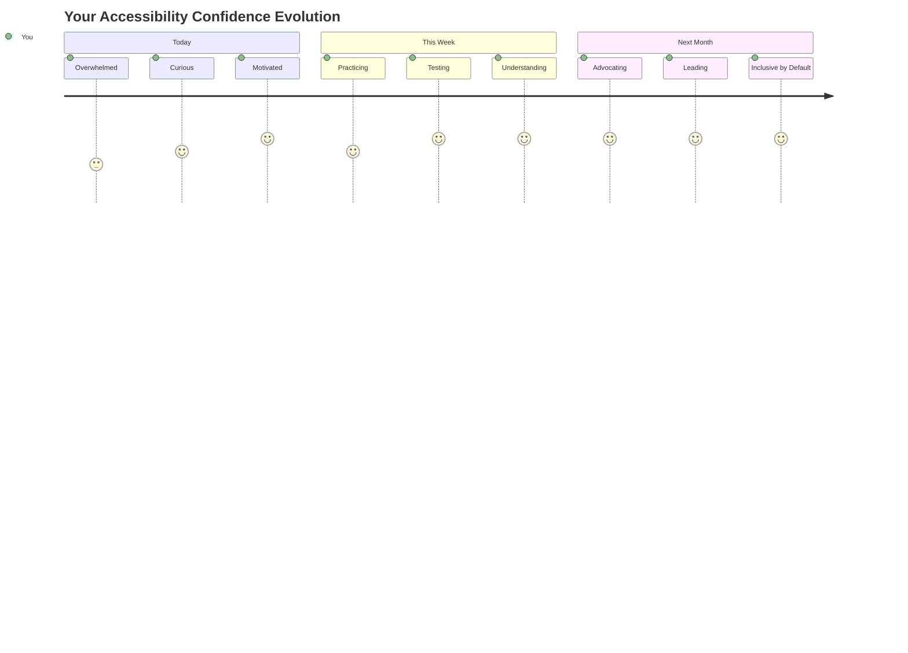
  
> 🌍 **तुम्ही आता अॅक्सेसिबिलिटी चॅम्पियन आहात!** तुम्हाला समजले आहे की उत्कृष्ट वेब अनुभव प्रत्येकासाठी कार्य करतात, लोक वेब कसेही वापरत असले तरी. तुम्ही तयार केलेली प्रत्येक अॅक्सेसिबल सुविधा इंटरनेटला अधिक समावेशक बनवते. वेबला तुमच्यासारख्या विकसकांची गरज आहे जे अॅक्सेसिबिलिटीला मर्यादा म्हणून पाहत नाहीत, तर सर्व वापरकर्त्यांसाठी चांगले अनुभव तयार करण्याची संधी म्हणून पाहतात. या चळवळीत तुमचे स्वागत आहे! 🎉  

---

**अस्वीकरण**:  
हा दस्तऐवज AI भाषांतर सेवा [Co-op Translator](https://github.com/Azure/co-op-translator) वापरून भाषांतरित करण्यात आला आहे. आम्ही अचूकतेसाठी प्रयत्नशील असलो तरी, कृपया लक्षात ठेवा की स्वयंचलित भाषांतरे त्रुटी किंवा अचूकतेच्या अभावाने युक्त असू शकतात. मूळ भाषेतील दस्तऐवज हा अधिकृत स्रोत मानला जावा. महत्त्वाच्या माहितीसाठी, व्यावसायिक मानवी भाषांतराची शिफारस केली जाते. या भाषांतराचा वापर करून उद्भवलेल्या कोणत्याही गैरसमज किंवा चुकीच्या अर्थासाठी आम्ही जबाबदार राहणार नाही.