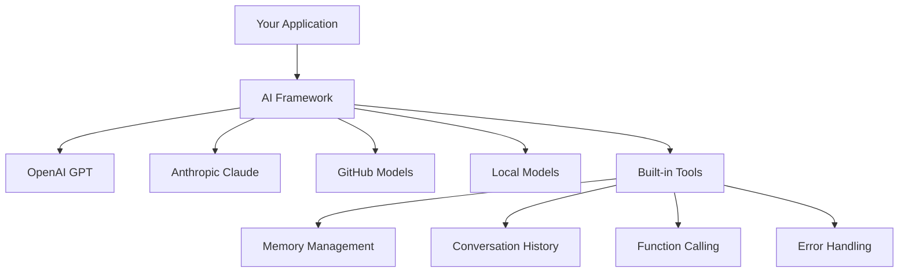
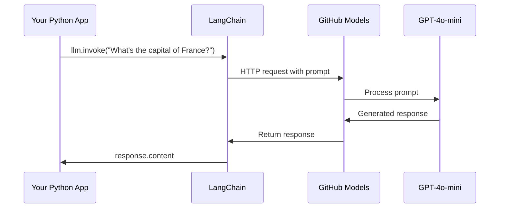
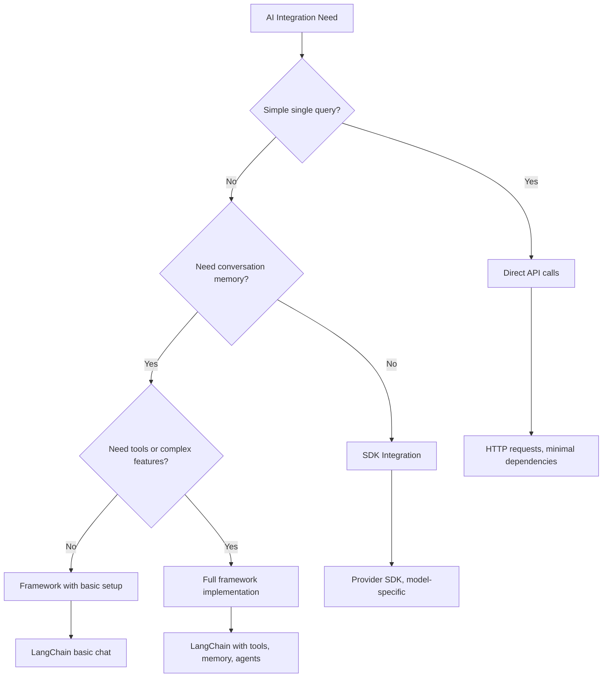

<!--
CO_OP_TRANSLATOR_METADATA:
{
  "original_hash": "e2c4ae5688e34b4b8b09d52aec56c79e",
  "translation_date": "2025-10-22T16:04:36+00:00",
  "source_file": "10-ai-framework-project/README.md",
  "language_code": "mr"
}
-->
# एआय फ्रेमवर्क

कधी तुम्हाला शून्यातून एआय अॅप्लिकेशन्स तयार करताना गोंधळ वाटला आहे का? तुम्ही एकटे नाही! एआय फ्रेमवर्क म्हणजे एआय विकासासाठी स्विस आर्मी नाइफसारखे आहेत - हे शक्तिशाली साधने आहेत जी तुम्हाला बुद्धिमान अॅप्लिकेशन्स तयार करताना वेळ आणि त्रास वाचवू शकतात. एआय फ्रेमवर्कला एक व्यवस्थित लायब्ररी म्हणून विचार करा: हे पूर्व-निर्मित घटक, मानक एपीआय आणि स्मार्ट अब्स्ट्रॅक्शन्स प्रदान करते जेणेकरून तुम्ही अंमलबजावणीच्या तपशीलांशी झगडण्याऐवजी समस्यांचे निराकरण करण्यावर लक्ष केंद्रित करू शकता.

या धड्यात, आपण LangChain सारख्या फ्रेमवर्क्स कसे जटिल एआय इंटिग्रेशन कार्ये स्वच्छ, वाचनीय कोडमध्ये बदलू शकतात हे शोधू. तुम्ही संभाषणांचा मागोवा ठेवणे, टूल कॉलिंग अंमलात आणणे आणि एकसंध इंटरफेसद्वारे विविध एआय मॉडेल्स हाताळणे यासारख्या वास्तविक-जगातील आव्हानांचा सामना कसा करायचा ते शोधाल.

जेव्हा आपण पूर्ण करू, तेव्हा तुम्हाला कधी फ्रेमवर्क्सचा वापर करायचा आणि कधी कच्च्या एपीआय कॉल्सचा वापर करायचा हे माहित असेल, त्यांचे अब्स्ट्रॅक्शन्स प्रभावीपणे कसे वापरायचे आणि वास्तविक-जगातील वापरासाठी तयार एआय अॅप्लिकेशन्स कसे तयार करायचे हे समजेल. चला पाहूया की एआय फ्रेमवर्क्स तुमच्या प्रकल्पांसाठी काय करू शकतात.

## फ्रेमवर्क का निवडावे?

तुम्ही एआय अॅप तयार करण्यासाठी तयार आहात - छान! पण गोष्ट अशी आहे: तुम्ही अनेक वेगवेगळ्या मार्गांनी जाऊ शकता आणि प्रत्येकाचा स्वतःचा फायदा आणि तोटा आहे. हे कुठेतरी जाण्यासाठी चालणे, सायकल चालवणे किंवा गाडी चालवणे निवडण्यासारखे आहे - ते तुम्हाला तिथे पोहोचवतील, परंतु अनुभव (आणि प्रयत्न) पूर्णपणे वेगळे असतील.

चला पाहूया की तुम्ही तुमच्या प्रकल्पांमध्ये एआय कसा समाविष्ट करू शकता याचे तीन मुख्य मार्ग:

| दृष्टिकोन | फायदे | सर्वोत्तम उपयोग | विचार |
|----------|------------|----------|--------------|
| **डायरेक्ट HTTP रिक्वेस्ट्स** | पूर्ण नियंत्रण, कोणतेही डिपेंडन्सी नाही | साधे क्वेरी, मूलभूत गोष्टी शिकणे | अधिक विस्तृत कोड, मॅन्युअल एरर हँडलिंग |
| **SDK इंटिग्रेशन** | कमी बायलरप्लेट, मॉडेल-विशिष्ट ऑप्टिमायझेशन | सिंगल-मॉडेल अॅप्लिकेशन्स | विशिष्ट प्रदात्यांपुरते मर्यादित |
| **एआय फ्रेमवर्क्स** | एकसंध एपीआय, अंगभूत अब्स्ट्रॅक्शन्स | मल्टी-मॉडेल अॅप्स, जटिल वर्कफ्लोज | शिकण्याचा वक्र, संभाव्य अति-अब्स्ट्रॅक्शन |

### फ्रेमवर्क्सचे फायदे प्रत्यक्षात



**फ्रेमवर्क्स का महत्त्वाचे आहेत:**
- **एकत्रित करते** अनेक एआय प्रदात्यांना एकाच इंटरफेसखाली
- **स्वतःहून** संभाषणाची मेमरी हाताळते
- **सुलभ करते** सामान्य कार्यांसाठी तयार केलेली साधने जसे की एम्बेडिंग्ज आणि फंक्शन कॉलिंग
- **व्यवस्थापित करते** एरर हँडलिंग आणि रिट्राय लॉजिक
- **जटिल वर्कफ्लोज** वाचनीय मेथड कॉल्समध्ये बदलते

> 💡 **प्रो टिप**: फ्रेमवर्क्सचा वापर वेगवेगळ्या एआय मॉडेल्समध्ये स्विच करताना किंवा एजंट्स, मेमरी, किंवा टूल कॉलिंगसारख्या जटिल वैशिष्ट्ये तयार करताना करा. मूलभूत गोष्टी शिकताना किंवा साधे, लक्ष केंद्रित अॅप्लिकेशन्स तयार करताना डायरेक्ट एपीआय वापरा.

**तळटीप**: एखाद्या कुशल कारागीराच्या विशेष साधनांमध्ये आणि संपूर्ण कार्यशाळेत निवड करण्यासारखे, हे कार्याशी साधन जुळवण्याबद्दल आहे. फ्रेमवर्क्स जटिल, वैशिष्ट्य-समृद्ध अॅप्लिकेशन्ससाठी उत्कृष्ट आहेत, तर डायरेक्ट एपीआय सोप्या उपयोग प्रकरणांसाठी चांगले काम करतात.

## परिचय

या धड्यात, आपण शिकू:

- सामान्य एआय फ्रेमवर्कचा वापर कसा करायचा.
- चॅट संभाषणे, टूल वापर, मेमरी आणि संदर्भ यासारख्या सामान्य समस्यांचे निराकरण कसे करायचे.
- एआय अॅप्स तयार करण्यासाठी याचा उपयोग कसा करायचा.

## तुमचा पहिला एआय प्रॉम्प्ट

चला मूलभूत गोष्टींनी सुरुवात करूया, एक प्रश्न पाठवून उत्तर मिळवणारा तुमचा पहिला एआय अॅप्लिकेशन तयार करून. आर्किमिडीजने आपल्या बाथमध्ये विस्थापनाचा तत्त्व शोधल्याप्रमाणे, कधी कधी सर्वात सोप्या निरीक्षणांमधून सर्वात शक्तिशाली अंतर्दृष्टी मिळते - आणि फ्रेमवर्क्स या अंतर्दृष्टी सुलभ करतात.

### GitHub मॉडेल्ससह LangChain सेट करणे

आम्ही GitHub मॉडेल्सशी कनेक्ट करण्यासाठी LangChain वापरणार आहोत, जे खूप छान आहे कारण ते तुम्हाला विविध एआय मॉडेल्ससाठी विनामूल्य प्रवेश देते. सर्वात चांगली गोष्ट? सुरुवात करण्यासाठी तुम्हाला फक्त काही सोप्या कॉन्फिगरेशन पॅरामीटर्सची आवश्यकता आहे:

```python
from langchain_openai import ChatOpenAI
import os

llm = ChatOpenAI(
    api_key=os.environ["GITHUB_TOKEN"],
    base_url="https://models.github.ai/inference",
    model="openai/gpt-4o-mini",
)

# Send a simple prompt
response = llm.invoke("What's the capital of France?")
print(response.content)
```

**इथे काय घडत आहे याचे विश्लेषण करूया:**
- **LangChain क्लायंट तयार करते** `ChatOpenAI` क्लास वापरून - हे तुमचे एआयसाठी गेटवे आहे!
- **GitHub मॉडेल्सशी कनेक्शन कॉन्फिगर करते** तुमच्या ऑथेंटिकेशन टोकनसह
- **कुठला एआय मॉडेल वापरायचा ते निर्दिष्ट करते** (`gpt-4o-mini`) - याला तुमचा एआय सहाय्यक निवडणे समजा
- **तुमचा प्रश्न पाठवते** `invoke()` मेथड वापरून - इथेच जादू घडते
- **उत्तर काढते आणि प्रदर्शित करते** - आणि voilà, तुम्ही एआयशी गप्पा मारत आहात!

> 🔧 **सेटअप नोट**: जर तुम्ही GitHub Codespaces वापरत असाल, तर तुम्ही भाग्यवान आहात - `GITHUB_TOKEN` आधीच सेट केले आहे! स्थानिकपणे काम करत आहात? काळजी करू नका, तुम्हाला योग्य परवानग्यांसह वैयक्तिक प्रवेश टोकन तयार करावे लागेल.

**अपेक्षित आउटपुट:**
```text
The capital of France is Paris.
```



## संभाषणात्मक एआय तयार करणे

पहिले उदाहरण मूलभूत गोष्टी दाखवते, पण ते फक्त एकच विनिमय आहे - तुम्ही प्रश्न विचारता, उत्तर मिळवता, आणि ते संपते. वास्तविक अॅप्लिकेशन्समध्ये, तुम्हाला तुमच्या एआयने तुम्ही काय चर्चा करत आहात ते लक्षात ठेवायचे आहे, जसे वॉटसन आणि होम्स यांनी त्यांच्या तपासात्मक संभाषणांची रचना केली.

इथेच LangChain विशेषतः उपयुक्त ठरते. हे वेगवेगळ्या संदेश प्रकार प्रदान करते जे संभाषणांची रचना करण्यात मदत करतात आणि तुम्हाला तुमच्या एआयला व्यक्तिमत्त्व देण्याची परवानगी देतात. तुम्ही संदर्भ आणि पात्रता राखणारे चॅट अनुभव तयार कराल.

### संदेश प्रकार समजून घेणे

या संदेश प्रकारांना संभाषणात सहभागी होणाऱ्या व्यक्तींच्या वेगवेगळ्या "टोपी" म्हणून विचार करा. LangChain वेगवेगळ्या संदेश वर्गांचा वापर करते जे कोण काय म्हणत आहे याचा मागोवा ठेवतात:

| संदेश प्रकार | उद्देश | उदाहरण उपयोग प्रकरण |
|--------------|---------|------------------|
| `SystemMessage` | एआयचे व्यक्तिमत्त्व आणि वर्तन परिभाषित करते | "तुम्ही एक उपयुक्त कोडिंग सहाय्यक आहात" |
| `HumanMessage` | वापरकर्त्याचा इनपुट दर्शवते | "फंक्शन्स कसे कार्य करतात ते समजावून सांगा" |
| `AIMessage` | एआय प्रतिसाद साठवते | संभाषणातील मागील एआय प्रतिसाद |

### तुमचे पहिले संभाषण तयार करणे

चला एक संभाषण तयार करूया जिथे आमचा एआय विशिष्ट भूमिका घेतो. आम्ही त्याला कॅप्टन पिकार्डचे रूप धारण करू देऊ - एक पात्र जे त्याच्या राजनैतिक शहाणपण आणि नेतृत्वासाठी ओळखले जाते:

```python
messages = [
    SystemMessage(content="You are Captain Picard of the Starship Enterprise"),
    HumanMessage(content="Tell me about you"),
]
```

**या संभाषण सेटअपचे विश्लेषण:**
- **एआयची भूमिका आणि व्यक्तिमत्त्व स्थापन करते** `SystemMessage` द्वारे
- **प्रारंभिक वापरकर्ता क्वेरी प्रदान करते** `HumanMessage` द्वारे
- **मल्टी-टर्न संभाषणासाठी पाया तयार करते**

या उदाहरणाचा संपूर्ण कोड असा दिसतो:

```python
from langchain_core.messages import HumanMessage, SystemMessage
from langchain_openai import ChatOpenAI
import os

llm = ChatOpenAI(
    api_key=os.environ["GITHUB_TOKEN"],
    base_url="https://models.github.ai/inference",
    model="openai/gpt-4o-mini",
)

messages = [
    SystemMessage(content="You are Captain Picard of the Starship Enterprise"),
    HumanMessage(content="Tell me about you"),
]


# works
response  = llm.invoke(messages)
print(response.content)
```

तुम्हाला असे काहीतरी आउटपुट दिसेल:

```text
I am Captain Jean-Luc Picard, the commanding officer of the USS Enterprise (NCC-1701-D), a starship in the United Federation of Planets. My primary mission is to explore new worlds, seek out new life and new civilizations, and boldly go where no one has gone before. 

I believe in the importance of diplomacy, reason, and the pursuit of knowledge. My crew is diverse and skilled, and we often face challenges that test our resolve, ethics, and ingenuity. Throughout my career, I have encountered numerous species, grappled with complex moral dilemmas, and have consistently sought peaceful solutions to conflicts.

I hold the ideals of the Federation close to my heart, believing in the importance of cooperation, understanding, and respect for all sentient beings. My experiences have shaped my leadership style, and I strive to be a thoughtful and just captain. How may I assist you further?
```

संभाषणाची सातत्यता राखण्यासाठी (प्रत्येक वेळी संदर्भ रीसेट करण्याऐवजी), तुम्हाला तुमच्या संदेश यादीत प्रतिसाद जोडत राहावे लागेल. जसे मौखिक परंपरा कथा पिढ्यानपिढ्या जतन करत होत्या, तसेच हा दृष्टिकोन टिकाऊ मेमरी तयार करतो:

```python
from langchain_core.messages import HumanMessage, SystemMessage
from langchain_openai import ChatOpenAI
import os

llm = ChatOpenAI(
    api_key=os.environ["GITHUB_TOKEN"],
    base_url="https://models.github.ai/inference",
    model="openai/gpt-4o-mini",
)

messages = [
    SystemMessage(content="You are Captain Picard of the Starship Enterprise"),
    HumanMessage(content="Tell me about you"),
]


# works
response  = llm.invoke(messages)

print(response.content)

print("---- Next ----")

messages.append(response)
messages.append(HumanMessage(content="Now that I know about you, I'm Chris, can I be in your crew?"))

response  = llm.invoke(messages)

print(response.content)

```

खूप छान, बरोबर? इथे काय घडत आहे ते म्हणजे आम्ही LLM दोनदा कॉल करत आहोत - प्रथम फक्त आमच्या प्रारंभिक दोन संदेशांसह, पण नंतर पुन्हा संपूर्ण संभाषण इतिहासासह. असे वाटते की एआय खरोखरच आमच्या चॅटचा मागोवा घेत आहे!

जेव्हा तुम्ही हा कोड चालवता, तेव्हा तुम्हाला दुसरा प्रतिसाद मिळेल जो काहीसा असा वाटेल:

```text
Welcome aboard, Chris! It's always a pleasure to meet those who share a passion for exploration and discovery. While I cannot formally offer you a position on the Enterprise right now, I encourage you to pursue your aspirations. We are always in need of talented individuals with diverse skills and backgrounds. 

If you are interested in space exploration, consider education and training in the sciences, engineering, or diplomacy. The values of curiosity, resilience, and teamwork are crucial in Starfleet. Should you ever find yourself on a starship, remember to uphold the principles of the Federation: peace, understanding, and respect for all beings. Your journey can lead you to remarkable adventures, whether in the stars or on the ground. Engage!
```

मी याला "कदाचित" म्हणून घेईन ;)

## स्ट्रीमिंग प्रतिसाद

कधी लक्षात आले की ChatGPT त्याचे प्रतिसाद रिअल-टाइममध्ये "टाइप" करत आहे? ते स्ट्रीमिंग आहे. जसे एखाद्या कुशल कॅलिग्राफरला काम करताना पाहणे - अक्षरे स्ट्रोक बाय स्ट्रोक दिसतात, एकदम नाही - स्ट्रीमिंग संवाद अधिक नैसर्गिक वाटतो आणि त्वरित फीडबॅक प्रदान करतो.

### LangChain सह स्ट्रीमिंग अंमलात आणणे

```python
from langchain_openai import ChatOpenAI
import os

llm = ChatOpenAI(
    api_key=os.environ["GITHUB_TOKEN"],
    base_url="https://models.github.ai/inference",
    model="openai/gpt-4o-mini",
    streaming=True
)

# Stream the response
for chunk in llm.stream("Write a short story about a robot learning to code"):
    print(chunk.content, end="", flush=True)
```

**स्ट्रीमिंग का छान आहे:**
- **सामग्री दाखवते** ती तयार होत असताना - आता अधिक वेळ थांबणे नाही!
- **वापरकर्त्यांना वाटते** की काहीतरी खरोखरच घडत आहे
- **जलद वाटते**, जरी तांत्रिकदृष्ट्या तसे नसले तरी
- **वापरकर्त्यांना वाचायला सुरुवात करू देते** एआय अजूनही "विचार करत असताना"

> 💡 **वापरकर्ता अनुभव टिप**: स्ट्रीमिंग खूप चांगले काम करते जेव्हा तुम्ही कोड स्पष्टीकरण, सर्जनशील लेखन, किंवा तपशीलवार ट्यूटोरियल्ससारख्या लांब प्रतिसादांशी व्यवहार करत असता. तुमचे वापरकर्ते रिकाम्या स्क्रीनकडे पाहण्याऐवजी प्रगती पाहून आनंदित होतील!

## प्रॉम्प्ट टेम्पलेट्स

प्रॉम्प्ट टेम्पलेट्स क्लासिकल वक्तृत्वात वापरल्या जाणाऱ्या भाषण संरचनांसारखे काम करतात - जसे सिसेरो वेगवेगळ्या प्रेक्षकांसाठी त्याच्या भाषणाच्या पद्धतींमध्ये बदल करत असे, तरीही त्याच प्रभावी फ्रेमवर्कला टिकवून ठेवत असे. ते तुम्हाला पुनर्वापर करण्यायोग्य प्रॉम्प्ट तयार करू देतात जिथे तुम्ही वेगवेगळ्या माहितीचे तुकडे पुन्हा लिहिल्याशिवाय बदलू शकता. एकदा टेम्पलेट सेट केल्यावर, तुम्ही फक्त व्हेरिएबल्समध्ये आवश्यक मूल्ये भरता.

### पुनर्वापर करण्यायोग्य प्रॉम्प्ट तयार करणे

```python
from langchain_core.prompts import ChatPromptTemplate

# Define a template for code explanations
template = ChatPromptTemplate.from_messages([
    ("system", "You are an expert programming instructor. Explain concepts clearly with examples."),
    ("human", "Explain {concept} in {language} with a practical example for {skill_level} developers")
])

# Use the template with different values
questions = [
    {"concept": "functions", "language": "JavaScript", "skill_level": "beginner"},
    {"concept": "classes", "language": "Python", "skill_level": "intermediate"},
    {"concept": "async/await", "language": "JavaScript", "skill_level": "advanced"}
]

for question in questions:
    prompt = template.format_messages(**question)
    response = llm.invoke(prompt)
    print(f"Topic: {question['concept']}\n{response.content}\n---\n")
```

**टेम्पलेट्स वापरणे का आवडेल:**
- **तुमचे प्रॉम्प्ट** तुमच्या संपूर्ण अॅपमध्ये सुसंगत ठेवते
- **गोंधळलेली स्ट्रिंग कन्सॅटनेशन नाही** - फक्त स्वच्छ, सोपे व्हेरिएबल्स
- **तुमचा एआय** अंदाजे वागतो कारण संरचना समान राहते
- **अपडेट्स** सोपे आहेत - एकदा टेम्पलेट बदला, आणि ते सर्वत्र निश्चित आहे

## संरचित आउटपुट

कधी एआय प्रतिसाद परत येणाऱ्या असंरचित मजकुराचा अर्थ लावण्याचा प्रयत्न करताना निराशा वाटली आहे का? संरचित आउटपुट म्हणजे तुमच्या एआयला जैविक वर्गीकरणासाठी लिनिअसने वापरलेल्या प्रणालीबद्ध दृष्टिकोनाचे अनुसरण करण्यास शिकवणे - व्यवस्थित, अंदाजे, आणि काम करण्यास सोपे. तुम्ही JSON, विशिष्ट डेटा संरचना, किंवा तुम्हाला आवश्यक असलेला कोणताही फॉर्मॅट विनंती करू शकता.

### आउटपुट स्कीम्स परिभाषित करणे

```python
from langchain_core.prompts import ChatPromptTemplate
from langchain_core.output_parsers import JsonOutputParser
from pydantic import BaseModel, Field

class CodeReview(BaseModel):
    score: int = Field(description="Code quality score from 1-10")
    strengths: list[str] = Field(description="List of code strengths")
    improvements: list[str] = Field(description="List of suggested improvements")
    overall_feedback: str = Field(description="Summary feedback")

# Set up the parser
parser = JsonOutputParser(pydantic_object=CodeReview)

# Create prompt with format instructions
prompt = ChatPromptTemplate.from_messages([
    ("system", "You are a code reviewer. {format_instructions}"),
    ("human", "Review this code: {code}")
])

# Format the prompt with instructions
chain = prompt | llm | parser

# Get structured response
code_sample = """
def calculate_average(numbers):
    return sum(numbers) / len(numbers)
"""

result = chain.invoke({
    "code": code_sample,
    "format_instructions": parser.get_format_instructions()
})

print(f"Score: {result['score']}")
print(f"Strengths: {', '.join(result['strengths'])}")
```

**संरचित आउटपुट का गेम-चेंजर आहे:**
- **अंदाज लावणे नाही** तुम्हाला परत कोणता फॉर्मॅट मिळेल - ते प्रत्येक वेळी सुसंगत आहे
- **तुमच्या डेटाबेस आणि एपीआयमध्ये थेट प्लग करते** अतिरिक्त कामाशिवाय
- **विचित्र एआय प्रतिसाद पकडते** तुमचे अॅप खराब होण्यापूर्वी
- **तुमचा कोड स्वच्छ बनवते** कारण तुम्हाला नेमके काय काम करायचे आहे ते माहित आहे

## टूल कॉलिंग

आता आपण सर्वात शक्तिशाली वैशिष्ट्यांपैकी एकावर पोहोचतो: टूल्स. हे असे आहे की तुम्ही तुमच्या एआयला संभाषणाच्या पलीकडे व्यावहारिक क्षमता देता. जसे मध्ययुगीन गिल्ड्स विशिष्ट हस्तकलेसाठी विशेष साधने विकसित करत होते, तसे तुम्ही तुमच्या एआयला केंद्रित साधनांनी सुसज्ज करू शकता. तुम्ही कोणती साधने उपलब्ध आहेत ते वर्णन करता, आणि जेव्हा कोणी काहीतरी विनंती करते जे जुळते, तुमचा एआय कृती करू शकतो.

### Python वापरणे

चला काही साधने जोडूया:

```python
from typing_extensions import Annotated, TypedDict

class add(TypedDict):
    """Add two integers."""

    # Annotations must have the type and can optionally include a default value and description (in that order).
    a: Annotated[int, ..., "First integer"]
    b: Annotated[int, ..., "Second integer"]

tools = [add]

functions = {
    "add": lambda a, b: a + b
}
```

तर इथे काय घडत आहे? आम्ही `add` नावाच्या टूलसाठी ब्लूप्रिंट तयार करत आहोत. `TypedDict` पासून वारसा घेऊन आणि `Annotated` प्रकारांसारख्या फॅन्सी प्रकारांचा `a` आणि `b` साठी वापर करून, आम्ही LLM ला या टूलचे कार्य आणि त्याला काय आवश्यक आहे याची स्पष्ट कल्पना देत आहोत. `functions` डिक्शनरी म्हणजे आमचे टूलबॉक्स - ते आमच्या कोडला सांगते की एआयने विशिष्ट टूल वापरण्याचा निर्णय घेतल्यावर काय करायचे.

चला पुढे पाहूया की आम्ही LLM कसे कॉल करतो:

```python
llm = ChatOpenAI(
    api_key=os.environ["GITHUB_TOKEN"],
    base_url="https://models.github.ai/inference",
    model="openai/gpt-4o-mini",
)

llm_with_tools = llm.bind_tools(tools)
```

इथे आम्ही `bind_tools` आमच्या `tools` अ‍ॅरेसह कॉल करतो आणि त्यामुळे LLM `llm_with_tools` आता या टूलचे ज्ञान आहे.

हे नवीन LLM वापरण्यासाठी, आम्ही खालील कोड टाइप करू शकतो:

```python
query = "What is 3 + 12?"

res = llm_with_tools.invoke(query)
if(res.tool_calls):
    for tool in res.tool_calls:
        print("TOOL CALL: ", functions[tool["name"]](../../../10-ai-framework-project/**tool["args"]))
print("CONTENT: ",res.content)
```

आता आम्ही `invoke` या नवीन llm वर कॉल करतो, ज्यामध्ये टूल्स आहेत, आम्हाला कदाचित `tool_calls` प्रॉपर्टी भरलेली दिसेल. जर तसे असेल, तर कोणत्याही ओळखलेल्या टूलमध्ये `name` आणि `args` प्रॉपर्टी असते जी कोणते टूल कॉल केले पाहिजे आणि कोणत्या अर्ग्युमेंट्ससह. संपूर्ण कोड असा दिसतो:

```python
from langchain_core.messages import HumanMessage, SystemMessage
from langchain_openai import ChatOpenAI
import os
from typing_extensions import Annotated, TypedDict

class add(TypedDict):
    """Add two integers."""

    # Annotations must have the type and can optionally include a default value and description (in that order).
    a: Annotated[int, ..., "First integer"]
    b: Annotated[int, ..., "Second integer"]

tools = [add]

functions = {
    "add": lambda a, b: a + b
}

llm = ChatOpenAI(
    api_key=os.environ["GITHUB_TOKEN"],
    base_url="https://models.github.ai/inference",
    model="openai/gpt-4o-mini",
)

llm_with_tools = llm.bind_tools(tools)

query = "What is 3 + 12?"

res = llm_with_tools.invoke(query)
if(res.tool_calls):
    for tool in res.tool_calls:
        print("TOOL CALL: ", functions[tool["name"]](../../../10-ai-framework-project/**tool["args"]))
print("CONTENT: ",res.content)
```

हा कोड चालवल्यावर, तुम्हाला असे आउटपुट दिसेल:

```text
TOOL CALL:  15
CONTENT: 
```

एआयने "What is 3 + 12" चे परीक्षण केले आणि हे `add` टूलसाठी कार्य म्हणून ओळखले. जसे कुशल ग्रंथपाल प्रश्नाच्या प्रकारावर आधारित कोणते संदर्भ सल्ला घ्यायचे ते जाणतो, तसेच टूलचे नाव, वर्णन, आणि फील्ड स्पेसिफिकेशन्समधून हे ठरवले. 15 चा परिणाम आमच्या `functions` डिक्शनरीमधून टूल अंमलात आण
3. **वैयक्तिकृत शिक्षण**: वेगवेगळ्या कौशल्य स्तरांनुसार प्रतिसाद देण्यासाठी प्रणाली संदेशांचा वापर करा  
4. **प्रतिसाद स्वरूपन**: क्विझ प्रश्नांसाठी संरचित आउटपुट लागू करा  

### अंमलबजावणी चरण  

**चरण 1: तुमचे वातावरण सेट करा**  
```bash
pip install langchain langchain-openai
```
  
**चरण 2: मूलभूत चॅट कार्यक्षमता**  
- `StudyAssistant` वर्ग तयार करा  
- संवादाची स्मृती अंमलात आणा  
- शैक्षणिक सहाय्यासाठी व्यक्तिमत्व कॉन्फिगरेशन जोडा  

**चरण 3: शैक्षणिक साधने जोडा**  
- **कोड एक्सप्लेनर**: कोड समजण्यास सोपे भागांमध्ये विभागतो  
- **क्विझ जनरेटर**: प्रोग्रामिंग संकल्पनांवर आधारित प्रश्न तयार करतो  
- **प्रगती ट्रॅकर**: कव्हर केलेल्या विषयांचा मागोवा ठेवतो  

**चरण 4: सुधारित वैशिष्ट्ये (पर्यायी)**  
- चांगल्या वापरकर्ता अनुभवासाठी स्ट्रीमिंग प्रतिसाद अंमलात आणा  
- अभ्यासक्रम सामग्री समाविष्ट करण्यासाठी दस्तऐवज लोडिंग जोडा  
- समानता-आधारित सामग्री पुनर्प्राप्तीसाठी एम्बेडिंग तयार करा  

### मूल्यांकन निकष  

| वैशिष्ट्य | उत्कृष्ट (4) | चांगले (3) | समाधानकारक (2) | सुधारणा आवश्यक (1) |  
|-----------|---------------|------------|----------------|--------------------|  
| **संवाद प्रवाह** | नैसर्गिक, संदर्भ-जाणकार प्रतिसाद | चांगला संदर्भ टिकवून ठेवणे | मूलभूत संवाद | संवादांमध्ये कोणतीही स्मृती नाही |  
| **साधन एकत्रीकरण** | अनेक उपयुक्त साधने सुरळीत कार्यरत | 2+ साधने योग्य प्रकारे अंमलात आणली | 1-2 मूलभूत साधने | साधने कार्यक्षम नाहीत |  
| **कोड गुणवत्ता** | स्वच्छ, चांगले दस्तऐवजीकरण, त्रुटी हाताळणी | चांगली रचना, काही दस्तऐवजीकरण | मूलभूत कार्यक्षमता कार्य करते | खराब रचना, त्रुटी हाताळणी नाही |  
| **शैक्षणिक मूल्य** | शिकण्यासाठी खरोखर उपयुक्त, अनुकूल | चांगले शिक्षण समर्थन | मूलभूत स्पष्टीकरण | मर्यादित शैक्षणिक लाभ |  

### नमुना कोड रचना  

```python
class StudyAssistant:
    def __init__(self, skill_level="beginner"):
        # Initialize LLM, tools, and conversation memory
        pass
    
    def explain_code(self, code, language):
        # Tool: Explain how code works
        pass
    
    def generate_quiz(self, topic, difficulty):
        # Tool: Create practice questions
        pass
    
    def chat(self, user_input):
        # Main conversation interface
        pass

# Example usage
assistant = StudyAssistant(skill_level="intermediate")
response = assistant.chat("Explain how Python functions work")
```
  
**अतिरिक्त आव्हाने:**  
- आवाज इनपुट/आउटपुट क्षमता जोडा  
- Streamlit किंवा Flask वापरून वेब इंटरफेस अंमलात आणा  
- एम्बेडिंग वापरून अभ्यासक्रम सामग्रीमधून ज्ञानाचा आधार तयार करा  
- प्रगती ट्रॅकिंग आणि वैयक्तिकृत शिक्षण मार्ग जोडा  

## सारांश  

🎉 तुम्ही आता AI फ्रेमवर्क विकासाची मूलभूत तत्त्वे आत्मसात केली आहेत आणि LangChain वापरून प्रगत AI अनुप्रयोग कसे तयार करायचे ते शिकले आहे. जसे की एक व्यापक प्रशिक्षण पूर्ण केल्यावर, तुम्ही कौशल्यांचा एक मोठा संच मिळवला आहे. चला, तुम्ही काय साध्य केले आहे ते पुनरावलोकन करूया.  

### तुम्ही काय शिकलात  

**कोर फ्रेमवर्क संकल्पना:**  
- **फ्रेमवर्कचे फायदे**: थेट API कॉल्सच्या तुलनेत फ्रेमवर्क कधी निवडायचे ते समजून घेणे  
- **LangChain मूलभूत गोष्टी**: AI मॉडेल कनेक्शन सेट अप आणि कॉन्फिगर करणे  
- **संदेश प्रकार**: संरचित संवादांसाठी `SystemMessage`, `HumanMessage`, आणि `AIMessage` चा वापर  

**प्रगत वैशिष्ट्ये:**  
- **साधन कॉलिंग**: प्रगत AI क्षमता वाढवण्यासाठी सानुकूल साधने तयार करणे आणि एकत्रित करणे  
- **संवाद स्मृती**: अनेक संवादांमध्ये संदर्भ टिकवून ठेवणे  
- **स्ट्रीमिंग प्रतिसाद**: रिअल-टाइम प्रतिसाद वितरण अंमलात आणणे  
- **प्रॉम्प्ट टेम्पलेट्स**: पुनर्वापरयोग्य, गतिशील प्रॉम्प्ट तयार करणे  
- **संरचित आउटपुट**: सुसंगत, पार्स करण्यायोग्य AI प्रतिसाद सुनिश्चित करणे  
- **एम्बेडिंग्स**: सेमॅंटिक शोध आणि दस्तऐवज प्रक्रिया क्षमता तयार करणे  

**व्यावहारिक अनुप्रयोग:**  
- **पूर्ण अॅप्स तयार करणे**: उत्पादन-तयार अनुप्रयोगांमध्ये अनेक वैशिष्ट्ये एकत्र करणे  
- **त्रुटी हाताळणी**: मजबूत त्रुटी व्यवस्थापन आणि सत्यापन अंमलात आणणे  
- **साधन एकत्रीकरण**: AI क्षमता वाढवणारी सानुकूल साधने तयार करणे  

### मुख्य मुद्दे  

> 🎯 **लक्षात ठेवा**: LangChain सारखी AI फ्रेमवर्क्स तुमचे जटिलता लपवणारे, वैशिष्ट्यांनी भरलेले सर्वोत्तम मित्र आहेत. संवाद स्मृती, साधन कॉलिंग आवश्यक असताना किंवा अनेक AI मॉडेल्ससह कार्य करताना ते परिपूर्ण आहेत.  

**AI एकत्रीकरणासाठी निर्णय फ्रेमवर्क:**  


  
### पुढे काय कराल?  

**आता तयार करायला सुरुवात करा:**  
- या संकल्पना घ्या आणि तुम्हाला उत्साहित करणारी काहीतरी तयार करा!  
- LangChain द्वारे वेगवेगळ्या AI मॉडेल्ससह खेळा - हे AI मॉडेल्सचे खेळाचे मैदान आहे  
- तुमच्या कामात किंवा प्रकल्पांमध्ये तुम्हाला भेडसावणाऱ्या वास्तविक समस्यांचे निराकरण करणारी साधने तयार करा  

**पुढील स्तरासाठी तयार आहात?**  
- **AI एजंट्स**: स्वतःहून जटिल कार्ये योजना आणि अंमलात आणू शकणारी AI प्रणाली तयार करा  
- **RAG (Retrieval-Augmented Generation)**: AI ला तुमच्या स्वतःच्या ज्ञानाच्या आधारासह एकत्र करा आणि सुपर-पॉवर्ड अनुप्रयोग तयार करा  
- **मल्टी-मोडल AI**: मजकूर, प्रतिमा आणि ऑडिओ एकत्र वापरा - शक्यता अमर्याद आहेत!  
- **उत्पादन तैनाती**: तुमचे AI अॅप्स स्केल कसे करायचे आणि वास्तविक जगात त्यांचे निरीक्षण कसे करायचे ते शिका  

**समुदायामध्ये सामील व्हा:**  
- LangChain समुदाय अद्ययावत राहण्यासाठी आणि सर्वोत्तम पद्धती शिकण्यासाठी उत्कृष्ट आहे  
- GitHub Models तुम्हाला अत्याधुनिक AI क्षमता प्रदान करते - प्रयोगासाठी परिपूर्ण  
- वेगवेगळ्या उपयोग प्रकरणांसह सराव करत रहा - प्रत्येक प्रकल्प तुम्हाला काहीतरी नवीन शिकवेल  

तुमच्याकडे आता बुद्धिमान, संवादात्मक अनुप्रयोग तयार करण्याचे ज्ञान आहे जे लोकांना वास्तविक समस्यांचे निराकरण करण्यात मदत करू शकते. जसे पुनर्जागरण काळातील कारागीरांनी कलात्मक दृष्टिकोन तांत्रिक कौशल्यासह एकत्र केला, तसे तुम्ही आता AI क्षमता व्यावहारिक अनुप्रयोगासह एकत्र करू शकता. प्रश्न असा आहे: तुम्ही काय तयार कराल? 🚀  

## GitHub Copilot Agent Challenge 🚀  

Agent मोड वापरून खालील आव्हान पूर्ण करा:  

**वर्णन:** अनेक LangChain वैशिष्ट्ये समाविष्ट करणारा प्रगत AI-संचालित कोड पुनरावलोकन सहाय्यक तयार करा ज्यामध्ये साधन कॉलिंग, संरचित आउटपुट आणि संवाद स्मृती यांचा समावेश आहे, जे कोड सबमिशनवर व्यापक अभिप्राय प्रदान करते.  

**प्रॉम्प्ट:** `CodeReviewAssistant` वर्ग तयार करा जो अंमलात आणतो:  
1. कोडची जटिलता विश्लेषण करण्यासाठी आणि सुधारणा सुचवण्यासाठी साधन  
2. सर्वोत्तम पद्धतींविरुद्ध कोड तपासण्यासाठी साधन  
3. सुसंगत पुनरावलोकन स्वरूपासाठी Pydantic मॉडेल्स वापरून संरचित आउटपुट  
4. पुनरावलोकन सत्रांचा मागोवा ठेवण्यासाठी संवाद स्मृती  
5. कोड सबमिशन हाताळू शकणारा आणि तपशीलवार, कृतीयोग्य अभिप्राय प्रदान करणारा मुख्य चॅट इंटरफेस  

सहाय्यकाने अनेक प्रोग्रामिंग भाषांमध्ये कोड पुनरावलोकन करण्यास सक्षम असावे, सत्रामध्ये अनेक कोड सबमिशनमध्ये संदर्भ टिकवून ठेवावा आणि सारांश स्कोअर तसेच तपशीलवार सुधारणा सूचना प्रदान कराव्यात.  

[agent mode](https://code.visualstudio.com/blogs/2025/02/24/introducing-copilot-agent-mode) बद्दल अधिक जाणून घ्या.  

---

**अस्वीकरण**:  
हा दस्तऐवज AI भाषांतर सेवा [Co-op Translator](https://github.com/Azure/co-op-translator) वापरून भाषांतरित करण्यात आला आहे. आम्ही अचूकतेसाठी प्रयत्नशील असलो तरी कृपया लक्षात ठेवा की स्वयंचलित भाषांतरे त्रुटी किंवा अचूकतेच्या अभावाने युक्त असू शकतात. मूळ भाषेतील दस्तऐवज हा अधिकृत स्रोत मानला जावा. महत्त्वाच्या माहितीसाठी व्यावसायिक मानवी भाषांतराची शिफारस केली जाते. या भाषांतराचा वापर करून उद्भवलेल्या कोणत्याही गैरसमज किंवा चुकीच्या अर्थासाठी आम्ही जबाबदार राहणार नाही.