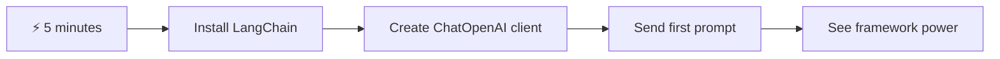
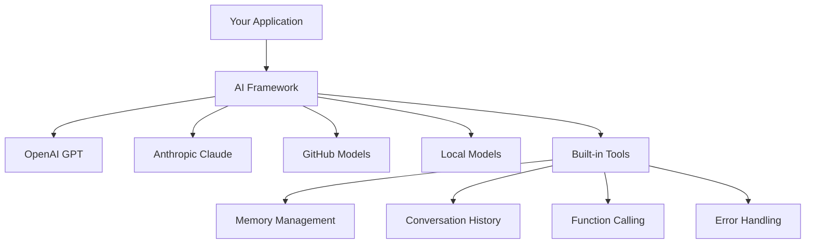
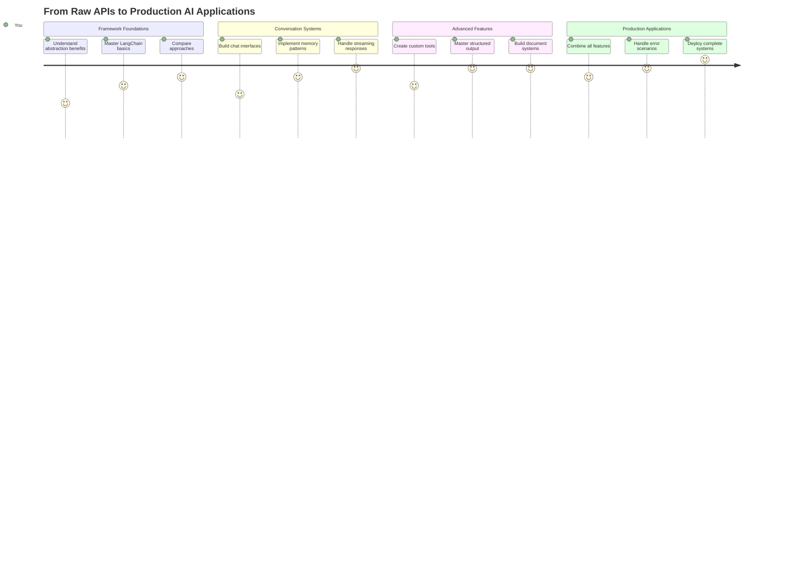
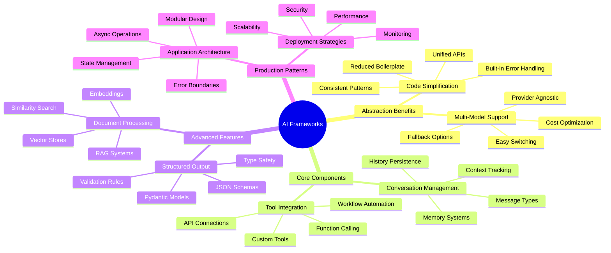
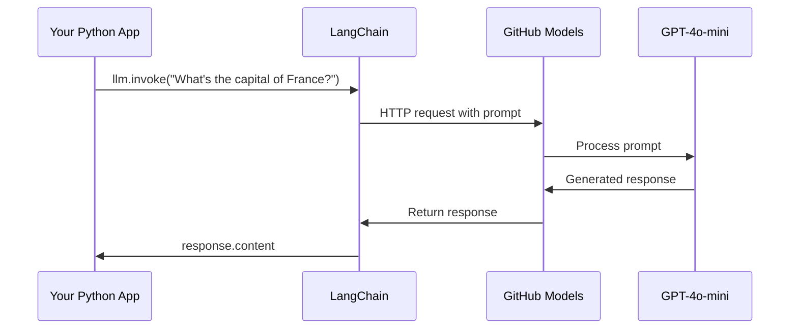
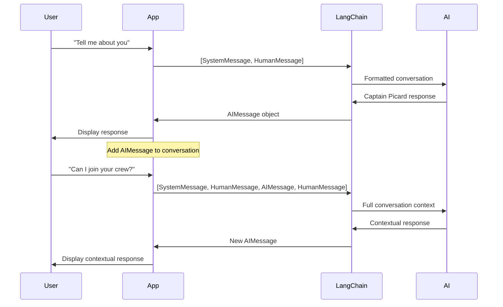
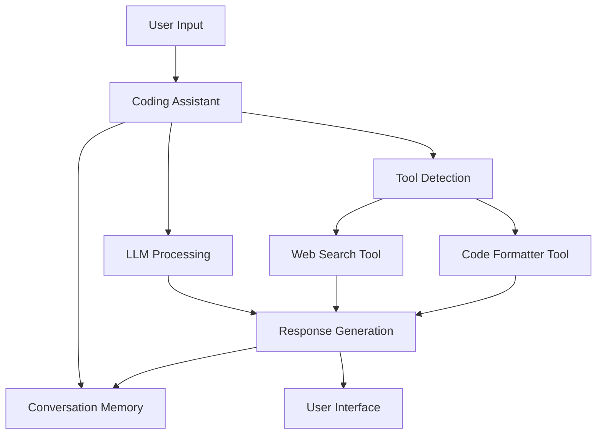
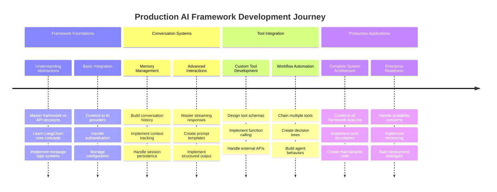
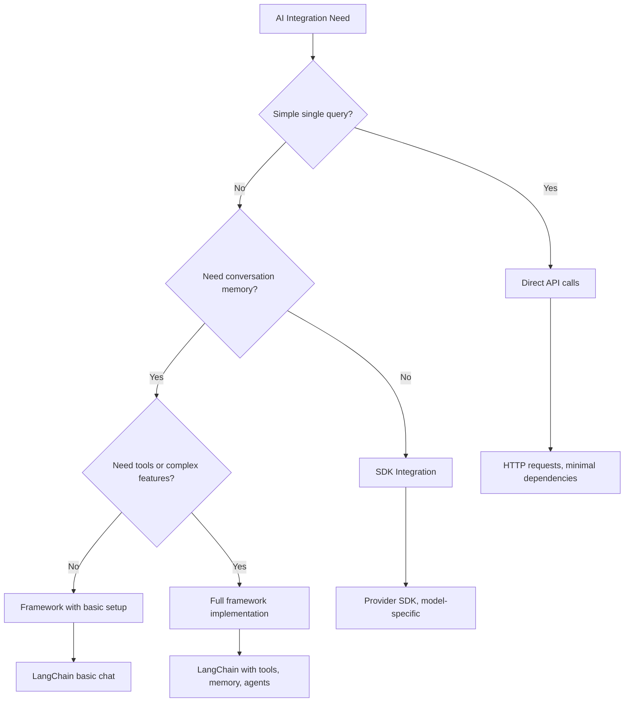

<!--
CO_OP_TRANSLATOR_METADATA:
{
  "original_hash": "3925b6a1c31c60755eaae4d578232c25",
  "translation_date": "2025-11-03T14:30:40+00:00",
  "source_file": "10-ai-framework-project/README.md",
  "language_code": "mr"
}
-->
# एआय फ्रेमवर्क

कधी तुम्हाला शून्यातून एआय अ‍ॅप्लिकेशन्स तयार करताना गोंधळ वाटला आहे का? तुम्ही एकटे नाही! एआय फ्रेमवर्क म्हणजे एआय विकासासाठी स्विस आर्मी नाईफसारखे - हे शक्तिशाली साधने आहेत जी बुद्धिमान अ‍ॅप्लिकेशन्स तयार करताना तुमचा वेळ आणि त्रास वाचवू शकतात. एआय फ्रेमवर्कला एक व्यवस्थित लायब्ररी म्हणून विचार करा: हे पूर्व-निर्मित घटक, मानक एपीआय आणि स्मार्ट अब्स्ट्रॅक्शन्स प्रदान करते जेणेकरून तुम्ही अंमलबजावणीच्या तपशीलांशी झगडण्याऐवजी समस्यांचे निराकरण करण्यावर लक्ष केंद्रित करू शकता.

या धड्यात, आपण LangChain सारख्या फ्रेमवर्क्स कसे जटिल एआय एकत्रीकरण कार्ये स्वच्छ, वाचनीय कोडमध्ये बदलू शकतात हे शोधू. तुम्ही वास्तविक-जगातील आव्हाने कशी हाताळायची ते शोधाल, जसे की संभाषणांचा मागोवा ठेवणे, टूल कॉलिंग अंमलात आणणे आणि एकसंध इंटरफेसद्वारे विविध एआय मॉडेल्स हाताळणे.

जेव्हा आपण समाप्त करू, तेव्हा तुम्हाला फ्रेमवर्क्स कधी वापरायचे ते कळेल, कच्च्या एपीआय कॉल्सऐवजी, त्यांच्या अब्स्ट्रॅक्शन्स प्रभावीपणे कसे वापरायचे आणि वास्तविक-जगातील वापरासाठी तयार एआय अ‍ॅप्लिकेशन्स कसे तयार करायचे. चला पाहूया की एआय फ्रेमवर्क्स तुमच्या प्रकल्पांसाठी काय करू शकतात.

## ⚡ पुढील ५ मिनिटांत तुम्ही काय करू शकता

**व्यस्त डेव्हलपर्ससाठी जलद सुरुवात मार्ग**



- **पहिला मिनिट**: LangChain इंस्टॉल करा: `pip install langchain langchain-openai`
- **दुसरा मिनिट**: तुमचा GitHub टोकन सेट करा आणि ChatOpenAI क्लायंट आयात करा
- **तिसरा मिनिट**: सिस्टम आणि मानव संदेशांसह एक साधे संभाषण तयार करा
- **चौथा मिनिट**: एक मूलभूत टूल (जसे की add फंक्शन) जोडा आणि एआय टूल कॉलिंग पहा
- **पाचवा मिनिट**: कच्च्या एपीआय कॉल्स आणि फ्रेमवर्क अब्स्ट्रॅक्शनमधील फरक अनुभव

**जलद चाचणी कोड**:
```python
from langchain_openai import ChatOpenAI
from langchain_core.messages import SystemMessage, HumanMessage

llm = ChatOpenAI(
    api_key=os.environ["GITHUB_TOKEN"],
    base_url="https://models.github.ai/inference",
    model="openai/gpt-4o-mini"
)

response = llm.invoke([
    SystemMessage(content="You are a helpful coding assistant"),
    HumanMessage(content="Explain Python functions briefly")
])
print(response.content)
```

**महत्त्व का आहे**: ५ मिनिटांत, तुम्ही अनुभवाल की एआय फ्रेमवर्क्स जटिल एआय एकत्रीकरण कसे सोप्या पद्धतींमध्ये बदलतात. हे उत्पादन एआय अ‍ॅप्लिकेशन्सला शक्ती देणारे मूलभूत तत्त्व आहे.

## फ्रेमवर्क का निवडायचे?

तुम्ही एआय अ‍ॅप तयार करण्यासाठी तयार आहात - छान! पण गोष्ट अशी आहे: तुम्ही अनेक वेगवेगळ्या मार्गांनी जाऊ शकता, आणि प्रत्येकाचा स्वतःचा फायदा आणि तोटा आहे. हे चालणे, सायकल चालवणे किंवा गाडी चालवणे यामधील निवडीसारखे आहे - ते तुम्हाला तिथे पोहोचवतील, पण अनुभव (आणि प्रयत्न) पूर्णपणे वेगळे असतील.

चला तुमच्या प्रकल्पांमध्ये एआय एकत्रित करण्याच्या तीन मुख्य मार्गांचे विश्लेषण करूया:

| दृष्टिकोन | फायदे | सर्वोत्तम उपयोग | विचार |
|----------|------------|----------|--------------|
| **थेट HTTP विनंत्या** | पूर्ण नियंत्रण, कोणतेही अवलंबित्व नाही | साधे क्वेरी, मूलभूत गोष्टी शिकणे | अधिक विस्तृत कोड, मॅन्युअल एरर हँडलिंग |
| **SDK एकत्रीकरण** | कमी बायलरप्लेट, मॉडेल-विशिष्ट ऑप्टिमायझेशन | सिंगल-मॉडेल अ‍ॅप्लिकेशन्स | विशिष्ट प्रदात्यांपुरते मर्यादित |
| **एआय फ्रेमवर्क्स** | एकसंध एपीआय, अंगभूत अब्स्ट्रॅक्शन्स | मल्टी-मॉडेल अ‍ॅप्स, जटिल कार्यप्रवाह | शिकण्याचा वक्र, संभाव्य अतिशय अब्स्ट्रॅक्शन |

### फ्रेमवर्क फायदे प्रत्यक्षात



**फ्रेमवर्क्स का महत्त्वाचे आहेत:**
- **एकत्रित करते** अनेक एआय प्रदाते एका इंटरफेसखाली
- **स्वयंचलितपणे हाताळते** संभाषण मेमरी
- **सामान्य कार्यांसाठी तयार केलेली साधने प्रदान करते** जसे की एम्बेडिंग्स आणि फंक्शन कॉलिंग
- **एरर हँडलिंग आणि रीट्राय लॉजिक व्यवस्थापित करते**
- **जटिल कार्यप्रवाह वाचनीय पद्धतींमध्ये बदलते**

> 💡 **प्रो टिप**: वेगवेगळ्या एआय मॉडेल्समध्ये स्विच करताना किंवा एजंट्स, मेमरी, किंवा टूल कॉलिंगसारख्या जटिल वैशिष्ट्ये तयार करताना फ्रेमवर्क्स वापरा. मूलभूत गोष्टी शिकताना किंवा साधे, लक्ष केंद्रित अ‍ॅप्लिकेशन्स तयार करताना थेट एपीआय वापरा.

**तळटीप**: एखाद्या कारागीराच्या विशेष साधनांमध्ये आणि संपूर्ण कार्यशाळेत निवड करण्यासारखे, हे कार्याशी साधन जुळवण्याबद्दल आहे. जटिल, वैशिष्ट्य-समृद्ध अ‍ॅप्लिकेशन्ससाठी फ्रेमवर्क्स उत्कृष्ट आहेत, तर थेट एपीआय साध्या उपयोग प्रकरणांसाठी चांगले कार्य करतात.

## 🗺️ एआय फ्रेमवर्क मास्टरीद्वारे तुमचा शिकण्याचा प्रवास



**तुमचा प्रवास गंतव्य**: या धड्याच्या शेवटी, तुम्ही एआय फ्रेमवर्क विकासात पारंगत व्हाल आणि व्यावसायिक एआय सहाय्यकांशी स्पर्धा करणारी प्रगत, उत्पादन-तयार एआय अ‍ॅप्लिकेशन्स तयार करू शकाल.

## परिचय

या धड्यात, आपण शिकू:

- एक सामान्य एआय फ्रेमवर्क वापरणे.
- चॅट संभाषणे, टूल वापर, मेमरी आणि संदर्भ यासारख्या सामान्य समस्यांचे निराकरण करणे.
- एआय अ‍ॅप्स तयार करण्यासाठी याचा उपयोग करणे.

## 🧠 एआय फ्रेमवर्क विकास इकोसिस्टम



**मूलभूत तत्त्व**: एआय फ्रेमवर्क्स जटिलतेचे अब्स्ट्रॅक्शन करतात आणि संभाषण व्यवस्थापन, टूल एकत्रीकरण, आणि दस्तऐवज प्रक्रिया यासाठी शक्तिशाली अब्स्ट्रॅक्शन्स प्रदान करतात, ज्यामुळे डेव्हलपर्स स्वच्छ, देखभाल करण्यायोग्य कोडसह प्रगत एआय अ‍ॅप्लिकेशन्स तयार करू शकतात.

## तुमचा पहिला एआय प्रॉम्प्ट

चला मूलभूत गोष्टींनी सुरुवात करूया आणि तुमचा पहिला एआय अ‍ॅप्लिकेशन तयार करूया जो एक प्रश्न पाठवतो आणि उत्तर मिळवतो. जसे आर्किमिडीजने आपल्या स्नानात विस्थापनाचा तत्त्व शोधला, कधीकधी सर्वात सोप्या निरीक्षणांमधून सर्वात शक्तिशाली अंतर्दृष्टी मिळते - आणि फ्रेमवर्क्स ही अंतर्दृष्टी सुलभ करतात.

### GitHub मॉडेल्ससह LangChain सेट करणे

आम्ही GitHub मॉडेल्सशी कनेक्ट होण्यासाठी LangChain वापरणार आहोत, जे खूप छान आहे कारण ते तुम्हाला विविध एआय मॉडेल्ससाठी विनामूल्य प्रवेश देते. सर्वात चांगली गोष्ट म्हणजे? सुरुवात करण्यासाठी तुम्हाला फक्त काही सोप्या कॉन्फिगरेशन पॅरामीटर्सची आवश्यकता आहे:

```python
from langchain_openai import ChatOpenAI
import os

llm = ChatOpenAI(
    api_key=os.environ["GITHUB_TOKEN"],
    base_url="https://models.github.ai/inference",
    model="openai/gpt-4o-mini",
)

# Send a simple prompt
response = llm.invoke("What's the capital of France?")
print(response.content)
```

**चला पाहूया येथे काय घडत आहे:**
- **LangChain क्लायंट तयार करते** `ChatOpenAI` वर्ग वापरून - हे तुमचे एआयसाठी प्रवेशद्वार आहे!
- **GitHub मॉडेल्सशी कनेक्शन कॉन्फिगर करते** तुमच्या ऑथेंटिकेशन टोकनसह
- **कोणता एआय मॉडेल वापरायचा ते निर्दिष्ट करते** (`gpt-4o-mini`) - याला तुमचा एआय सहाय्यक निवडणे समजा
- **तुमचा प्रश्न पाठवते** `invoke()` पद्धती वापरून - येथेच जादू घडते
- **उत्तर काढते आणि प्रदर्शित करते** - आणि voilà, तुम्ही एआयशी संभाषण करत आहात!

> 🔧 **सेटअप नोट**: जर तुम्ही GitHub Codespaces वापरत असाल, तर तुम्ही भाग्यवान आहात - `GITHUB_TOKEN` आधीच सेट केले आहे! स्थानिकपणे काम करत आहात? काळजी करू नका, तुम्हाला योग्य परवानग्यांसह वैयक्तिक प्रवेश टोकन तयार करावे लागेल.

**अपेक्षित आउटपुट**:
```text
The capital of France is Paris.
```



## संभाषणात्मक एआय तयार करणे

पहिले उदाहरण मूलभूत गोष्टी दाखवते, पण ते फक्त एकच विनिमय आहे - तुम्ही एक प्रश्न विचारता, उत्तर मिळवता, आणि तेच. वास्तविक अ‍ॅप्लिकेशन्समध्ये, तुम्हाला तुमच्या एआयने तुम्ही काय चर्चा करत आहात ते लक्षात ठेवायचे आहे, जसे वॉटसन आणि होम्सने त्यांच्या तपासात्मक संभाषणांची रचना केली.

LangChain येथे विशेषतः उपयुक्त ठरते. हे वेगवेगळ्या संदेश प्रकार प्रदान करते जे संभाषणांची रचना करण्यात मदत करतात आणि तुम्हाला तुमच्या एआयला व्यक्तिमत्त्व देण्याची परवानगी देतात. तुम्ही संदर्भ आणि पात्रता राखणारे चॅट अनुभव तयार कराल.

### संदेश प्रकार समजून घेणे

या संदेश प्रकारांना संभाषणात सहभागी असलेल्या वेगवेगळ्या "टोपी" म्हणून विचार करा. LangChain वेगवेगळ्या संदेश वर्गांचा वापर करते जे कोण काय बोलत आहे याचा मागोवा ठेवतात:

| संदेश प्रकार | उद्देश | उदाहरण उपयोग प्रकरण |
|--------------|---------|------------------|
| `SystemMessage` | एआय व्यक्तिमत्त्व आणि वर्तन परिभाषित करते | "तुम्ही एक उपयुक्त कोडिंग सहाय्यक आहात" |
| `HumanMessage` | वापरकर्ता इनपुट दर्शवते | "फंक्शन्स कसे कार्य करतात ते स्पष्ट करा" |
| `AIMessage` | एआय प्रतिसाद साठवते | संभाषणातील मागील एआय प्रतिसाद |

### तुमचे पहिले संभाषण तयार करणे

चला एक संभाषण तयार करूया जिथे आमचा एआय विशिष्ट भूमिका घेतो. आम्ही त्याला कॅप्टन पिकार्डचे रूप देऊ - एक पात्र जो त्याच्या राजनैतिक शहाणपण आणि नेतृत्वासाठी ओळखला जातो:

```python
messages = [
    SystemMessage(content="You are Captain Picard of the Starship Enterprise"),
    HumanMessage(content="Tell me about you"),
]
```

**या संभाषण सेटअपचे विश्लेषण करणे:**
- **एआयची भूमिका आणि व्यक्तिमत्त्व स्थापित करते** `SystemMessage` द्वारे
- **प्रारंभिक वापरकर्ता क्वेरी प्रदान करते** `HumanMessage` द्वारे
- **मल्टी-टर्न संभाषणासाठी पाया तयार करते**

या उदाहरणासाठी संपूर्ण कोड असे दिसते:

```python
from langchain_core.messages import HumanMessage, SystemMessage
from langchain_openai import ChatOpenAI
import os

llm = ChatOpenAI(
    api_key=os.environ["GITHUB_TOKEN"],
    base_url="https://models.github.ai/inference",
    model="openai/gpt-4o-mini",
)

messages = [
    SystemMessage(content="You are Captain Picard of the Starship Enterprise"),
    HumanMessage(content="Tell me about you"),
]


# works
response  = llm.invoke(messages)
print(response.content)
```

तुम्हाला असे काहीतरी परिणाम दिसेल:

```text
I am Captain Jean-Luc Picard, the commanding officer of the USS Enterprise (NCC-1701-D), a starship in the United Federation of Planets. My primary mission is to explore new worlds, seek out new life and new civilizations, and boldly go where no one has gone before. 

I believe in the importance of diplomacy, reason, and the pursuit of knowledge. My crew is diverse and skilled, and we often face challenges that test our resolve, ethics, and ingenuity. Throughout my career, I have encountered numerous species, grappled with complex moral dilemmas, and have consistently sought peaceful solutions to conflicts.

I hold the ideals of the Federation close to my heart, believing in the importance of cooperation, understanding, and respect for all sentient beings. My experiences have shaped my leadership style, and I strive to be a thoughtful and just captain. How may I assist you further?
```

संभाषण सातत्य राखण्यासाठी (प्रत्येक वेळी संदर्भ रीसेट करण्याऐवजी), तुम्हाला तुमच्या संदेश यादीत प्रतिसाद जोडत राहावे लागेल. जसे मौखिक परंपरा ज्यांनी पिढ्यानपिढ्या कथा जतन केल्या, ही पद्धत टिकाऊ मेमरी तयार करते:

```python
from langchain_core.messages import HumanMessage, SystemMessage
from langchain_openai import ChatOpenAI
import os

llm = ChatOpenAI(
    api_key=os.environ["GITHUB_TOKEN"],
    base_url="https://models.github.ai/inference",
    model="openai/gpt-4o-mini",
)

messages = [
    SystemMessage(content="You are Captain Picard of the Starship Enterprise"),
    HumanMessage(content="Tell me about you"),
]


# works
response  = llm.invoke(messages)

print(response.content)

print("---- Next ----")

messages.append(response)
messages.append(HumanMessage(content="Now that I know about you, I'm Chris, can I be in your crew?"))

response  = llm.invoke(messages)

print(response.content)

```

खूप छान, बरोबर? येथे काय घडत आहे ते म्हणजे आम्ही LLM दोनदा कॉल करत आहोत - प्रथम फक्त आमच्या प्रारंभिक दोन संदेशांसह, पण नंतर पुन्हा संपूर्ण संभाषण इतिहासासह. असे वाटते की एआय प्रत्यक्षात आमच्या चॅटचे अनुसरण करत आहे!

जेव्हा तुम्ही हा कोड चालवता, तेव्हा तुम्हाला दुसरे उत्तर मिळेल जे असे काहीतरी वाटते:

```text
Welcome aboard, Chris! It's always a pleasure to meet those who share a passion for exploration and discovery. While I cannot formally offer you a position on the Enterprise right now, I encourage you to pursue your aspirations. We are always in need of talented individuals with diverse skills and backgrounds. 

If you are interested in space exploration, consider education and training in the sciences, engineering, or diplomacy. The values of curiosity, resilience, and teamwork are crucial in Starfleet. Should you ever find yourself on a starship, remember to uphold the principles of the Federation: peace, understanding, and respect for all beings. Your journey can lead you to remarkable adventures, whether in the stars or on the ground. Engage!
```



मी याला "कदाचित" म्हणून घेईन ;)

## स्ट्रीमिंग प्रतिसाद

कधी लक्षात आले की ChatGPT त्याचे प्रतिसाद रिअल-टाइममध्ये "टाइप" करत आहे? ते स्ट्रीमिंग आहे. जसे एखाद्या कुशल कॅलिग्राफरला काम करताना पाहणे - अक्षरे स्ट्रोक बाय स्ट्रोक दिसतात, एकदम प्रकट होण्याऐवजी - स्ट्रीमिंग संवाद अधिक नैसर्गिक वाटतो आणि त्वरित अभिप्राय प्रदान करतो.

### LangChain सह स्ट्रीमिंग अंमलात आणणे

```python
from langchain_openai import ChatOpenAI
import os

llm = ChatOpenAI(
    api_key=os.environ["GITHUB_TOKEN"],
    base_url="https://models.github.ai/inference",
    model="openai/gpt-4o-mini",
    streaming=True
)

# Stream the response
for chunk in llm.stream("Write a short story about a robot learning to code"):
    print(chunk.content, end="", flush=True)
```

**स्ट्रीमिंग का छान आहे:**
- **सामग्री दाखवते** ती तयार होत असताना - आता अधिक विचित्र प्रतीक्षा नाही!
- **वापरकर्त्यांना वाटते** की काहीतरी प्रत्यक्षात घडत आहे
- **जलद वाटते**, जरी तांत्रिकदृष्ट्या तसे नसले तरी
- **वापरकर्त्यांना वाचायला सुरुवात करू देते** एआय अजूनही "विचार करत असताना"

> 💡 **वापरकर्ता अनुभव टिप**: स्ट्रीमिंग खरोखर चमकते जेव्हा तुम्ही कोड स्पष्टीकरण, सर्जनशील लेखन, किंवा तपशीलवार ट्यूटोरियल्ससारख्या लांब प्रतिसादांशी व्यवहार करत असता. तुमचे वापरकर्ते रिकाम्या स्क्रीनकडे पाहण्याऐवजी प्रगती पाहून आनंदित होतील!

### 🎯 शैक्षणिक तपासणी: फ्रेमवर्क अब्स्ट्रॅक्शन फायदे

**थांबा आणि विचार करा**: तुम्ही नुकतेच एआय फ्रेमवर्क अब्स्ट्रॅक्शन्सची ताकद अनुभवली आहे. मागील धड्यांमधील कच्च्या एपीआय कॉल्सशी तुम्ही काय शिकलात याची तुलना करा.

**जलद स्व-मूल्यमापन**:
- तुम्ही स्पष्ट करू शकता की LangChain संभाषण व्यवस्थापन कसे सोपे करते तुलनेत मॅन्युअल संदेश ट्रॅकिंग?
- `invoke()` आणि `stream()` पद्धतींमधील फरक काय आहे, आणि तुम्ही प्रत्येकाचा वापर कधी कराल?
- फ्रेमवर्कचा संदेश प्रकार प्रणाली कोड संघटन कसे सुधारते?

**वास्तविक-जगाशी कनेक्शन**: तुम्ही शिकलेले अब्स्ट्रॅक्शन पॅटर्न (मेसेज प्रकार, स्ट्रीमिंग इंटरफेस, संभाषण मेमरी) प्रत्येक प्रमुख एआय अ‍ॅप्लिकेशनमध्ये वापरले जातात - ChatGPT च्या इंटरफेसपासून GitHub Copilot च्या कोड सहाय्यापर्यंत. तुम्ही व्यावसायिक एआय विकास संघांनी वापरलेले समान आर्किटेक्चरल पॅटर्न्स मास्टर करत आहात.

**चॅलेंज प्रश्न**: वेगवेगळ्या एआय मॉडेल प्रदात्यांसाठी (OpenAI, Anthropic, Google) एकसंध इंटरफेस हाताळण्यासाठी फ्रेमवर्क अब्स्ट्रॅक्शन कसे डिझाइन कराल? फायदे आणि तोटे विचार करा.

## प्रॉम्प्ट टेम्पलेट्स

प्रॉम्प्ट टेम्पलेट्स क्लासिकल वक्तृत्वात वापरल्या जाणाऱ्या भाषण संरचनांसारखे कार्य करतात - जसे सिसेरो वेगवेगळ्या प्रेक्षकांसाठी त्याचे भाषण नमुने कसे अनुकूल करेल तरीही समान प्रभावी फ्रेमवर्क राखेल. ते तुम्हाला पुनर्वापरयोग्य प्रॉम्प्ट तयार करू देतात जिथे तुम्ही सर्वकाही पुन्हा लिहिल्याशिवाय वेगवेगळ्या माहितीचे तुकडे बदलू शकता. एकदा तुम्ही टेम्पलेट सेट केल्यावर, तुम्ही फक्त आवश्यक मूल्यांसह व्हेरिएबल्स भरता.

### पुनर्वापरयोग्य प्रॉम्प्ट तयार करणे

```python
from langchain_core.prompts import ChatPromptTemplate

# Define a template for code explanations
template = ChatPromptTemplate.from_messages([
    ("system", "You are an expert programming instructor. Explain concepts clearly with examples."),
    ("human", "Explain {concept} in {language} with a practical example for {skill_level} developers")
])

# Use the template with different values
questions = [
    {"concept": "functions", "language": "JavaScript", "skill_level": "beginner"},
    {"concept": "classes", "language": "Python", "skill_level": "intermediate"},
    {"concept": "async/await", "language": "JavaScript", "skill_level": "advanced"}
]

for question in questions:
    prompt = template.format_messages(**question)
    response = llm.invoke(prompt)
    print(f"Topic: {question['concept']}\n{response.content}\n---\n")
```

**तुम्हाला टेम्पलेट्स वापरणे का आवडेल:**
- **तुमचे प्रॉम्प्ट तुमच्या संपूर्ण अ‍ॅपमध्ये सुसंगत ठेवते**
- **आता गोंधळलेली स्ट्रिंग कन्सॅटनेशन नाही** - फक्त स्वच्छ, सोपे व्हेरिएबल्स
- **तुमचा एआय** अंदाजे वागतो कारण रचना समान राहते
- **अपडेट्स सोपे आहेत** - एकदा टेम्पलेट बदला, आणि ते सर्वत्र निश्चित आहे

## संरचित आउटपुट

कधी एआय प्रतिसाद परत येणाऱ्या असंरचित मजकुराचा अर्थ लावण्याचा प्रयत्न करताना निराश झाला आहे का? संरचित आउटपुट म्हणजे तुमच्या एआयला लिनिअसने जैविक वर्गीकरणासाठी वापरलेल्या प्रणालीबद्ध दृष्टिकोनाचे अनुसरण करण्यास शिकवणे - व्यवस्थित, अंदाजे, आणि काम करण्यास सोपे. तुम्ही JSON, विश
संख्या जोडणे ही संकल्पना स्पष्ट करते, परंतु वास्तविक साधने सामान्यतः अधिक जटिल कार्ये करतात, जसे की वेब API कॉल करणे. चला आपले उदाहरण विस्तृत करूया आणि AI इंटरनेटवरून सामग्री आणेल - जसे की टेलिग्राफ ऑपरेटर एकेकाळी दूरस्थ ठिकाणे जोडत असत:

```python
class joke(TypedDict):
    """Tell a joke."""

    # Annotations must have the type and can optionally include a default value and description (in that order).
    category: Annotated[str, ..., "The joke category"]

def get_joke(category: str) -> str:
    response = requests.get(f"https://api.chucknorris.io/jokes/random?category={category}", headers={"Accept": "application/json"})
    if response.status_code == 200:
        return response.json().get("value", f"Here's a {category} joke!")
    return f"Here's a {category} joke!"

functions = {
    "add": lambda a, b: a + b,
    "joke": lambda category: get_joke(category)
}

query = "Tell me a joke about animals"

# the rest of the code is the same
```

आता जर तुम्ही हा कोड चालवला तर तुम्हाला काहीतरी असे उत्तर मिळेल:

```text
TOOL CALL:  Chuck Norris once rode a nine foot grizzly bear through an automatic car wash, instead of taking a shower.
CONTENT:  
```

```mermaid
flowchart TD
    A[User Query: "Tell me a joke about animals"] --> B[LangChain Analysis]
    B --> C{Tool Available?}
    C -->|Yes| D[Select joke tool]
    C -->|No| E[Generate direct response]
    
    D --> F[Extract Parameters]
    F --> G[Call joke(category="animals")]
    G --> H[API Request to chucknorris.io]
    H --> I[Return joke content]
    I --> J[Display to user]
    
    E --> K[AI-generated response]
    K --> J
    
    subgraph "Tool Definition Layer"
        L[TypedDict Schema]
        M[Function Implementation]
        N[Parameter Validation]
    end
    
    D --> L
    F --> N
    G --> M
```

संपूर्ण कोड येथे आहे:

```python
from langchain_openai import ChatOpenAI
import requests
import os
from typing_extensions import Annotated, TypedDict

class add(TypedDict):
    """Add two integers."""

    # Annotations must have the type and can optionally include a default value and description (in that order).
    a: Annotated[int, ..., "First integer"]
    b: Annotated[int, ..., "Second integer"]

class joke(TypedDict):
    """Tell a joke."""

    # Annotations must have the type and can optionally include a default value and description (in that order).
    category: Annotated[str, ..., "The joke category"]

tools = [add, joke]

def get_joke(category: str) -> str:
    response = requests.get(f"https://api.chucknorris.io/jokes/random?category={category}", headers={"Accept": "application/json"})
    if response.status_code == 200:
        return response.json().get("value", f"Here's a {category} joke!")
    return f"Here's a {category} joke!"

functions = {
    "add": lambda a, b: a + b,
    "joke": lambda category: get_joke(category)
}

llm = ChatOpenAI(
    api_key=os.environ["GITHUB_TOKEN"],
    base_url="https://models.github.ai/inference",
    model="openai/gpt-4o-mini",
)

llm_with_tools = llm.bind_tools(tools)

query = "Tell me a joke about animals"

res = llm_with_tools.invoke(query)
if(res.tool_calls):
    for tool in res.tool_calls:
        # print("TOOL CALL: ", tool)
        print("TOOL CALL: ", functions[tool["name"]](../../../10-ai-framework-project/**tool["args"]))
print("CONTENT: ",res.content)
```

## एम्बेडिंग्ज आणि दस्तऐवज प्रक्रिया

एम्बेडिंग्ज आधुनिक AI मधील सर्वात सुंदर उपायांपैकी एक आहेत. कल्पना करा की तुम्ही कोणताही मजकूर घेऊन त्याचा अर्थ पकडणाऱ्या संख्यात्मक निर्देशांकांमध्ये रूपांतर करू शकता. हेच एम्बेडिंग्ज करतात - ते मजकूराला बहुआयामी जागेत बिंदूंमध्ये रूपांतरित करतात जिथे समान संकल्पना एकत्रित होतात. हे कल्पनांसाठी समन्वय प्रणाली असल्यासारखे आहे, जसे मेंडेलीवने अणु गुणधर्मांद्वारे आवर्त सारणी आयोजित केली.

### एम्बेडिंग्ज तयार करणे आणि वापरणे

```python
from langchain_openai import OpenAIEmbeddings
from langchain_community.vectorstores import FAISS
from langchain_community.document_loaders import TextLoader
from langchain.text_splitter import CharacterTextSplitter

# Initialize embeddings
embeddings = OpenAIEmbeddings(
    api_key=os.environ["GITHUB_TOKEN"],
    base_url="https://models.github.ai/inference",
    model="text-embedding-3-small"
)

# Load and split documents
loader = TextLoader("documentation.txt")
documents = loader.load()

text_splitter = CharacterTextSplitter(chunk_size=1000, chunk_overlap=0)
texts = text_splitter.split_documents(documents)

# Create vector store
vectorstore = FAISS.from_documents(texts, embeddings)

# Perform similarity search
query = "How do I handle user authentication?"
similar_docs = vectorstore.similarity_search(query, k=3)

for doc in similar_docs:
    print(f"Relevant content: {doc.page_content[:200]}...")
```

### विविध स्वरूपांसाठी दस्तऐवज लोडर्स

```python
from langchain_community.document_loaders import (
    PyPDFLoader,
    CSVLoader,
    JSONLoader,
    WebBaseLoader
)

# Load different document types
pdf_loader = PyPDFLoader("manual.pdf")
csv_loader = CSVLoader("data.csv")
json_loader = JSONLoader("config.json")
web_loader = WebBaseLoader("https://example.com/docs")

# Process all documents
all_documents = []
for loader in [pdf_loader, csv_loader, json_loader, web_loader]:
    docs = loader.load()
    all_documents.extend(docs)
```

**एम्बेडिंग्जसह तुम्ही काय करू शकता:**
- **सर्च तयार करा** जो फक्त कीवर्ड जुळवण्यापेक्षा तुमचा अर्थ समजतो
- **AI तयार करा** जो तुमच्या दस्तऐवजांबद्दल प्रश्नांची उत्तरे देतो
- **शिफारस प्रणाली तयार करा** जी खरोखर संबंधित सामग्री सुचवते
- **स्वयंचलितपणे** तुमची सामग्री आयोजित आणि वर्गीकृत करा

```mermaid
flowchart LR
    A[Documents] --> B[Text Splitter]
    B --> C[Create Embeddings]
    C --> D[Vector Store]
    
    E[User Query] --> F[Query Embedding]
    F --> G[Similarity Search]
    G --> D
    D --> H[Relevant Documents]
    H --> I[AI Response]
    
    subgraph "Vector Space"
        J[Document A: [0.1, 0.8, 0.3...]]
        K[Document B: [0.2, 0.7, 0.4...]]
        L[Query: [0.15, 0.75, 0.35...]]
    end
    
    C --> J
    C --> K
    F --> L
    G --> J
    G --> K
```

## संपूर्ण AI अनुप्रयोग तयार करणे

आता आपण शिकलेल्या सर्व गोष्टी एका व्यापक अनुप्रयोगात समाकलित करूया - एक कोडिंग सहाय्यक जो प्रश्नांची उत्तरे देतो, साधने वापरतो आणि संभाषणाची स्मृती राखतो. जसे छपाई यंत्राने विद्यमान तंत्रज्ञान (मूव्हेबल टाइप, शाई, कागद आणि दाब) एकत्रित करून काहीतरी परिवर्तनात्मक तयार केले, तसेच आपण आपल्या AI घटकांना काहीतरी व्यावहारिक आणि उपयुक्त बनवण्यासाठी एकत्र करूया.

### संपूर्ण अनुप्रयोग उदाहरण

```python
from langchain_openai import ChatOpenAI, OpenAIEmbeddings
from langchain_core.prompts import ChatPromptTemplate
from langchain_core.messages import HumanMessage, SystemMessage, AIMessage
from langchain_community.vectorstores import FAISS
from typing_extensions import Annotated, TypedDict
import os
import requests

class CodingAssistant:
    def __init__(self):
        self.llm = ChatOpenAI(
            api_key=os.environ["GITHUB_TOKEN"],
            base_url="https://models.github.ai/inference",
            model="openai/gpt-4o-mini"
        )
        
        self.conversation_history = [
            SystemMessage(content="""You are an expert coding assistant. 
            Help users learn programming concepts, debug code, and write better software.
            Use tools when needed and maintain a helpful, encouraging tone.""")
        ]
        
        # Define tools
        self.setup_tools()
    
    def setup_tools(self):
        class web_search(TypedDict):
            """Search for programming documentation or examples."""
            query: Annotated[str, "Search query for programming help"]
        
        class code_formatter(TypedDict):
            """Format and validate code snippets."""
            code: Annotated[str, "Code to format"]
            language: Annotated[str, "Programming language"]
        
        self.tools = [web_search, code_formatter]
        self.llm_with_tools = self.llm.bind_tools(self.tools)
    
    def chat(self, user_input: str):
        # Add user message to conversation
        self.conversation_history.append(HumanMessage(content=user_input))
        
        # Get AI response
        response = self.llm_with_tools.invoke(self.conversation_history)
        
        # Handle tool calls if any
        if response.tool_calls:
            for tool_call in response.tool_calls:
                tool_result = self.execute_tool(tool_call)
                print(f"🔧 Tool used: {tool_call['name']}")
                print(f"📊 Result: {tool_result}")
        
        # Add AI response to conversation
        self.conversation_history.append(response)
        
        return response.content
    
    def execute_tool(self, tool_call):
        tool_name = tool_call['name']
        args = tool_call['args']
        
        if tool_name == 'web_search':
            return f"Found documentation for: {args['query']}"
        elif tool_name == 'code_formatter':
            return f"Formatted {args['language']} code: {args['code'][:50]}..."
        
        return "Tool execution completed"

# Usage example
assistant = CodingAssistant()

print("🤖 Coding Assistant Ready! Type 'quit' to exit.\n")

while True:
    user_input = input("You: ")
    if user_input.lower() == 'quit':
        break
    
    response = assistant.chat(user_input)
    print(f"🤖 Assistant: {response}\n")
```

**अनुप्रयोग आर्किटेक्चर:**



**आम्ही अंमलात आणलेल्या मुख्य वैशिष्ट्ये:**
- **तुमचे संपूर्ण संभाषण लक्षात ठेवते** संदर्भ सातत्यासाठी
- **क्रिया करते** साधन कॉलिंगद्वारे, फक्त संभाषण नाही
- **अनुमानित संवाद पॅटर्नचे अनुसरण करते**
- **स्वयंचलितपणे त्रुटी हाताळणी आणि जटिल कार्यप्रवाह व्यवस्थापित करते**

### 🎯 शैक्षणिक तपासणी: उत्पादन AI आर्किटेक्चर

**आर्किटेक्चर समज**: तुम्ही संभाषण व्यवस्थापन, साधन कॉलिंग आणि संरचित कार्यप्रवाह एकत्रित करणारा संपूर्ण AI अनुप्रयोग तयार केला आहे. हे उत्पादन-स्तरीय AI अनुप्रयोग विकासाचे प्रतिनिधित्व करते.

**मास्टर केलेले मुख्य संकल्पना**:
- **क्लास-आधारित आर्किटेक्चर**: आयोजित, देखभाल करण्यायोग्य AI अनुप्रयोग संरचना
- **साधन समाकलन**: संभाषणाच्या पलीकडे सानुकूल कार्यक्षमता
- **स्मृती व्यवस्थापन**: सतत संभाषण संदर्भ
- **त्रुटी हाताळणी**: मजबूत अनुप्रयोग वर्तन

**उद्योग कनेक्शन**: तुम्ही अंमलात आणलेल्या आर्किटेक्चर पॅटर्न (संभाषण वर्ग, साधन प्रणाली, स्मृती व्यवस्थापन) हेच पॅटर्न एंटरप्राइझ AI अनुप्रयोगांमध्ये वापरले जातात जसे की Slack चा AI सहाय्यक, GitHub Copilot आणि Microsoft Copilot. तुम्ही व्यावसायिक-स्तरीय आर्किटेक्चरल विचारांसह तयार करत आहात.

**चिंतन प्रश्न**: तुम्ही हा अनुप्रयोग अनेक वापरकर्त्यांना, सतत संचय किंवा बाह्य डेटाबेससह समाकलन हाताळण्यासाठी कसा विस्तृत कराल? स्केलेबिलिटी आणि राज्य व्यवस्थापन आव्हानांचा विचार करा.

## असाइनमेंट: तुमचा स्वतःचा AI-सक्षम अभ्यास सहाय्यक तयार करा

**उद्दिष्ट**: विद्यार्थ्यांना प्रोग्रामिंग संकल्पना शिकण्यास मदत करणारा AI अनुप्रयोग तयार करा जो स्पष्टीकरणे, कोड उदाहरणे आणि परस्पर क्विझ प्रदान करतो.

### आवश्यकता

**कोर वैशिष्ट्ये (आवश्यक):**
1. **संवादी इंटरफेस**: अनेक प्रश्नांमध्ये संदर्भ राखणारी चॅट प्रणाली अंमलात आणा
2. **शैक्षणिक साधने**: शिकण्यास मदत करणारी किमान दोन साधने तयार करा:
   - कोड स्पष्टीकरण साधन
   - संकल्पना क्विझ जनरेटर
3. **वैयक्तिकृत शिक्षण**: वेगवेगळ्या कौशल्य स्तरांनुसार प्रतिसाद अनुकूल करण्यासाठी प्रणाली संदेश वापरा
4. **प्रतिसाद स्वरूपन**: क्विझ प्रश्नांसाठी संरचित आउटपुट अंमलात आणा

### अंमलबजावणी चरण

**चरण 1: तुमचे वातावरण सेट करा**
```bash
pip install langchain langchain-openai
```

**चरण 2: मूलभूत चॅट कार्यक्षमता**
- `StudyAssistant` वर्ग तयार करा
- संभाषणाची स्मृती अंमलात आणा
- शैक्षणिक समर्थनासाठी व्यक्तिमत्व कॉन्फिगरेशन जोडा

**चरण 3: शैक्षणिक साधने जोडा**
- **कोड स्पष्टीकरण करणारे**: कोड समजण्याजोग्या भागांमध्ये विभागते
- **क्विझ जनरेटर**: प्रोग्रामिंग संकल्पनांबद्दल प्रश्न तयार करते
- **प्रगती ट्रॅकर**: कव्हर केलेल्या विषयांचा मागोवा ठेवतो

**चरण 4: सुधारित वैशिष्ट्ये (पर्यायी)**
- चांगल्या वापरकर्ता अनुभवासाठी स्ट्रीमिंग प्रतिसाद अंमलात आणा
- अभ्यासक्रम सामग्री समाविष्ट करण्यासाठी दस्तऐवज लोडिंग जोडा
- समानता-आधारित सामग्री पुनर्प्राप्तीसाठी एम्बेडिंग्ज तयार करा

### मूल्यांकन निकष

| वैशिष्ट्य | उत्कृष्ट (4) | चांगले (3) | समाधानकारक (2) | सुधारणा आवश्यक (1) |
|-----------|---------------|------------|----------------|--------------------|
| **संभाषण प्रवाह** | नैसर्गिक, संदर्भ-जाणकार प्रतिसाद | चांगला संदर्भ टिकवून ठेवणे | मूलभूत संभाषण | एक्सचेंजेस दरम्यान कोणतीही स्मृती नाही |
| **साधन समाकलन** | अनेक उपयुक्त साधने सुरळीतपणे कार्यरत | 2+ साधने योग्य प्रकारे अंमलात आणली | 1-2 मूलभूत साधने | साधने कार्यक्षम नाहीत |
| **कोड गुणवत्ता** | स्वच्छ, चांगले दस्तऐवजीकरण, त्रुटी हाताळणी | चांगली रचना, काही दस्तऐवजीकरण | मूलभूत कार्यक्षमता कार्य करते | खराब रचना, त्रुटी हाताळणी नाही |
| **शैक्षणिक मूल्य** | शिकण्यासाठी खरोखर उपयुक्त, अनुकूल | चांगले शिक्षण समर्थन | मूलभूत स्पष्टीकरण | मर्यादित शैक्षणिक लाभ |

### नमुना कोड संरचना

```python
class StudyAssistant:
    def __init__(self, skill_level="beginner"):
        # Initialize LLM, tools, and conversation memory
        pass
    
    def explain_code(self, code, language):
        # Tool: Explain how code works
        pass
    
    def generate_quiz(self, topic, difficulty):
        # Tool: Create practice questions
        pass
    
    def chat(self, user_input):
        # Main conversation interface
        pass

# Example usage
assistant = StudyAssistant(skill_level="intermediate")
response = assistant.chat("Explain how Python functions work")
```

**अतिरिक्त आव्हाने:**
- व्हॉइस इनपुट/आउटपुट क्षमता जोडा
- Streamlit किंवा Flask वापरून वेब इंटरफेस अंमलात आणा
- एम्बेडिंग्ज वापरून अभ्यासक्रम सामग्रीमधून ज्ञानाचा आधार तयार करा
- प्रगती ट्रॅकिंग आणि वैयक्तिकृत शिक्षण मार्ग तयार करा

## 📈 तुमचा AI फ्रेमवर्क विकास कौशल्य कालक्रम



**🎓 पदवी मिळवण्याचा टप्पा**: तुम्ही LangChain वापरून AI फ्रेमवर्क विकासात यशस्वीरित्या प्रभुत्व मिळवले आहे. आधुनिक AI अनुप्रयोगांना चालना देणारे समान साधने आणि पॅटर्न वापरून तुम्ही कौशल्ये मिळवली आहेत. हे कौशल्ये एंटरप्राइझ-स्तरीय बुद्धिमान प्रणाली तयार करण्यासाठी तुम्हाला तयार करतात.

**🔄 पुढील स्तर क्षमता**:
- प्रगत AI आर्किटेक्चर (एजंट्स, मल्टी-एजंट सिस्टम्स) एक्सप्लोर करण्यासाठी तयार
- RAG प्रणाली तयार करण्यासाठी सज्ज (व्हेक्टर डेटाबेससह पुनर्प्राप्ती-वर्धित निर्मिती)
- मल्टी-मोडल AI अनुप्रयोग तयार करण्यासाठी सुसज्ज
- AI अनुप्रयोग स्केलिंग आणि ऑप्टिमायझेशनसाठी पाया तयार

## सारांश

🎉 तुम्ही आता AI फ्रेमवर्क विकासाची मूलभूत तत्त्वे आत्मसात केली आहेत आणि LangChain वापरून परिष्कृत AI अनुप्रयोग कसे तयार करायचे ते शिकले आहे. जसे की व्यापक प्रशिक्षण पूर्ण केल्यावर, तुम्ही कौशल्यांचा मोठा संच मिळवला आहे. चला तुम्ही काय साध्य केले आहे ते पुनरावलोकन करूया.

### तुम्ही काय शिकलात

**कोर फ्रेमवर्क संकल्पना:**
- **फ्रेमवर्कचे फायदे**: थेट API कॉल्सच्या तुलनेत फ्रेमवर्क निवडण्याची गरज समजून घेणे
- **LangChain मूलभूत गोष्टी**: AI मॉडेल कनेक्शन सेट अप आणि कॉन्फिगर करणे
- **संदेश प्रकार**: संरचित संभाषणासाठी `SystemMessage`, `HumanMessage`, आणि `AIMessage` वापरणे

**प्रगत वैशिष्ट्ये:**
- **साधन कॉलिंग**: AI क्षमता वाढवण्यासाठी सानुकूल साधने तयार करणे आणि समाकलित करणे
- **संभाषण स्मृती**: अनेक संभाषण वळणांमध्ये संदर्भ राखणे
- **स्ट्रीमिंग प्रतिसाद**: रिअल-टाइम प्रतिसाद वितरण अंमलात आणणे
- **प्रॉम्प्ट टेम्पलेट्स**: पुनर्वापर करण्यायोग्य, डायनॅमिक प्रॉम्प्ट्स तयार करणे
- **संरचित आउटपुट**: सुसंगत, पार्स करण्यायोग्य AI प्रतिसाद सुनिश्चित करणे
- **एम्बेडिंग्ज**: सिमॅंटिक सर्च आणि दस्तऐवज प्रक्रिया क्षमता तयार करणे

**व्यावहारिक अनुप्रयोग:**
- **पूर्ण अनुप्रयोग तयार करणे**: उत्पादन-तयार अनुप्रयोगांमध्ये अनेक वैशिष्ट्ये एकत्रित करणे
- **त्रुटी हाताळणी**: मजबूत त्रुटी व्यवस्थापन आणि सत्यापन अंमलात आणणे
- **साधन समाकलन**: AI क्षमता वाढवणारी सानुकूल साधने तयार करणे

### मुख्य मुद्दे

> 🎯 **लक्षात ठेवा**: LangChain सारखे AI फ्रेमवर्क मूलतः तुमचे जटिलता लपवणारे, वैशिष्ट्यांनी भरलेले सर्वोत्तम मित्र आहेत. ते परिपूर्ण आहेत जेव्हा तुम्हाला संभाषण स्मृती, साधन कॉलिंग आवश्यक असते किंवा अनेक AI मॉडेल्ससह काम करायचे असते.

**AI समाकलनासाठी निर्णय फ्रेमवर्क:**



### पुढे कुठे जायचे?

**आता तयार करायला सुरुवात करा:**
- या संकल्पना घ्या आणि तुम्हाला उत्साहित करणारी काहीतरी तयार करा!
- LangChain द्वारे वेगवेगळ्या AI मॉडेल्ससह खेळा - हे AI मॉडेल्सचे खेळाचे मैदान असल्यासारखे आहे
- तुमच्या कामात किंवा प्रकल्पांमध्ये तुम्हाला भेडसावणाऱ्या वास्तविक समस्यांचे निराकरण करणारी साधने तयार करा

**पुढील स्तरासाठी तयार?**
- **AI एजंट्स**: AI प्रणाली तयार करा जी स्वतःच जटिल कार्ये योजना आणि अंमलात आणू शकते
- **RAG (पुनर्प्राप्ती-वर्धित निर्मिती)**: AI ला तुमच्या स्वतःच्या ज्ञानाच्या आधारांसह एकत्रित करा सुपर-पॉवर्ड अनुप्रयोगांसाठी
- **मल्टी-मोडल AI**: मजकूर, प्रतिमा आणि ऑडिओ एकत्र काम करा - शक्यता अमर्याद आहेत!
- **उत्पादन तैनाती**: तुमचे AI अनुप्रयोग कसे स्केल करायचे आणि वास्तविक जगात त्यांचे निरीक्षण कसे करायचे ते शिका

**समुदायात सामील व्हा:**
- LangChain समुदाय अद्ययावत राहण्यासाठी आणि सर्वोत्तम पद्धती शिकण्यासाठी उत्कृष्ट आहे
- GitHub Models तुम्हाला अत्याधुनिक AI क्षमता प्रदान करते - प्रयोगासाठी परिपूर्ण
- वेगवेगळ्या उपयोग प्रकरणांसह सराव करत रहा - प्रत्येक प्रकल्प तुम्हाला काहीतरी नवीन शिकवेल

तुमच्याकडे आता बुद्धिमान, संवादात्मक अनुप्रयोग तयार करण्याचे ज्ञान आहे जे लोकांना वास्तविक समस्यांचे निराकरण करण्यात मदत करू शकते. जसे पुनर्जागरण कारागीरांनी कलात्मक दृष्टिकोन तांत्रिक कौशल्यासह एकत्रित केला, तसे तुम्ही आता AI क्षमता व्यावहारिक अनुप्रयोगासह एकत्र करू शकता. प्रश्न आहे: तुम्ही काय तयार कराल? 🚀

## GitHub Copilot Agent Challenge 🚀

Agent मोड वापरून खालील आव्हान पूर्ण करा:

**वर्णन:** अनेक LangChain वैशिष्ट्ये समाविष्ट करणारा प्रगत AI-सक्षम कोड पुनरावलोकन सहाय्यक तयार करा ज्यामध्ये साधन कॉलिंग, संरचित आउटपुट आणि संभाषण स्मृती समाविष्ट आहे जे कोड सबमिशनवर व्यापक अभिप्राय प्रदान करते.

**प्रॉम्प्ट:** CodeReviewAssistant वर्ग तयार करा जो अंमलात आणतो:
1. कोडची जटिलता विश्लेषण करण्यासाठी आणि सुधारणा सुचवण्यासाठी साधन
2. सर्वोत्तम पद्धतींविरुद्ध कोड तपासण्यासाठी साधन
3. सुसंगत पुनरावलोकन स्वरूपासाठी Pydantic मॉडेल्स वापरून संरचित आउटपुट
4. पुनरावलोकन सत्रांचा मागोवा ठेवण्यासाठी संभाषण स्मृती
5. मुख्य चॅट इंटरफेस जो कोड सबमिशन हाताळू शकतो आणि तपशीलवार, कृतीक्षम अभिप्राय प्रदान करू शकतो

सहाय्यकाने अनेक प्रोग्रामिंग भाषांमध्ये कोड पुनरावलोकन करण्यास सक्षम असावे, सत्रातील अनेक कोड सबमिशनमध्ये संदर्भ राखावा आणि सारांश स्कोअर तसेच सुधारणा सुचवण्यासाठी तपशीलवार सूचना प्रदान कराव्या.

[Agent मोड](https://code.visualstudio.com/blogs/2025/02/24/introducing-copilot-agent-mode) बद्दल अधिक जाणून घ्या.

---

**अस्वीकरण**:  
हा दस्तऐवज AI भाषांतर सेवा [Co-op Translator](https://github.com/Azure/co-op-translator) वापरून भाषांतरित करण्यात आला आहे. आम्ही अचूकतेसाठी प्रयत्नशील असलो तरी, कृपयास लक्षात ठेवा की स्वयंचलित भाषांतरे त्रुटी किंवा अचूकतेच्या अभावाने युक्त असू शकतात. मूळ भाषेतील दस्तऐवज हा अधिकृत स्रोत मानला जावा. महत्त्वाच्या माहितीसाठी, व्यावसायिक मानवी भाषांतराची शिफारस केली जाते. या भाषांतराचा वापर करून उद्भवलेल्या कोणत्याही गैरसमज किंवा चुकीच्या अर्थासाठी आम्ही जबाबदार राहणार नाही.