<!--
CO_OP_TRANSLATOR_METADATA:
{
  "original_hash": "672b0bb6e8b431075f3bdb7130590d2d",
  "translation_date": "2025-11-03T14:11:07+00:00",
  "source_file": "2-js-basics/1-data-types/README.md",
  "language_code": "mr"
}
-->
# JavaScript मूलभूत गोष्टी: डेटा प्रकार

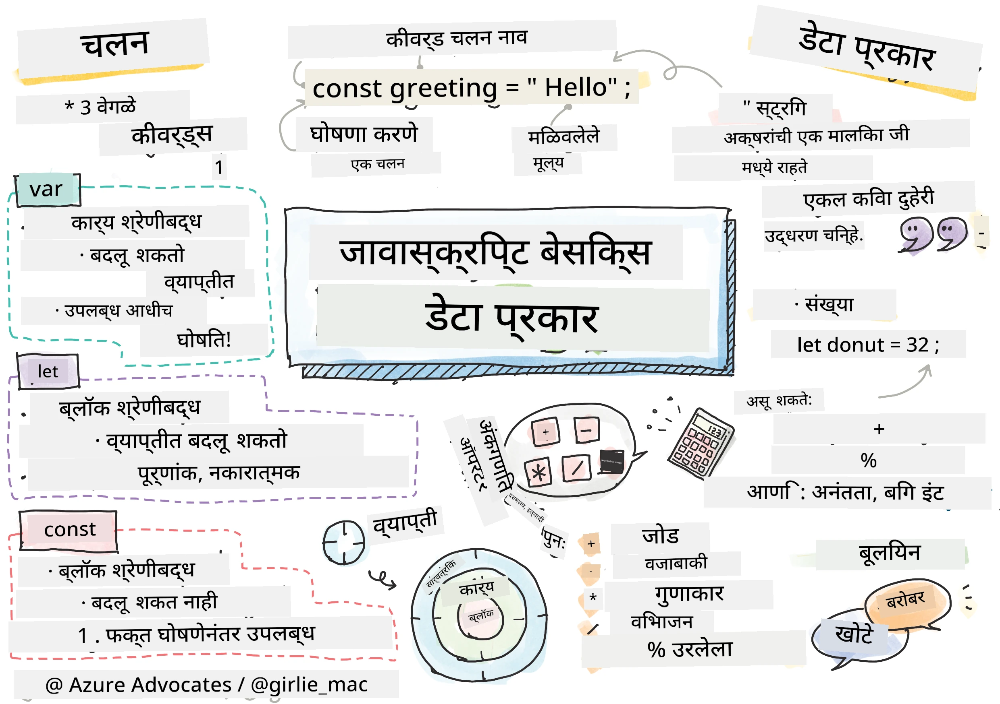
> स्केच नोट [Tomomi Imura](https://twitter.com/girlie_mac) यांनी तयार केले आहे

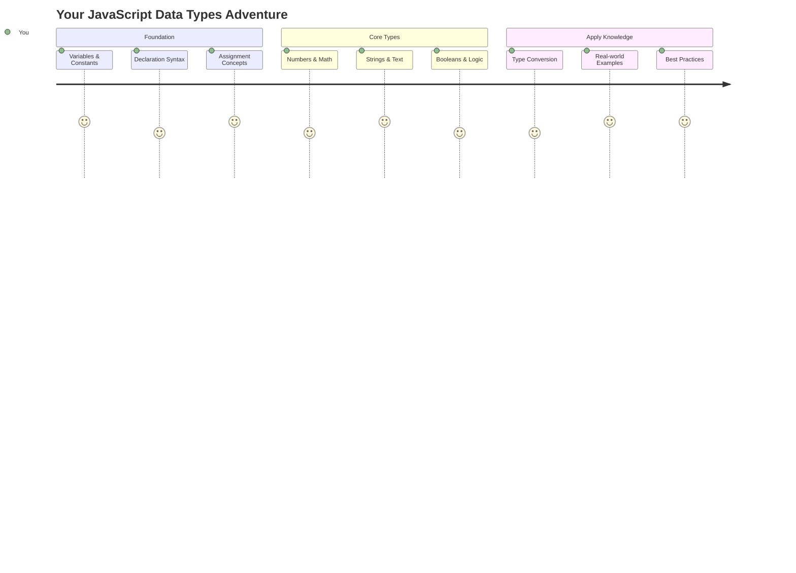

डेटा प्रकार हे JavaScript मधील मूलभूत संकल्पनांपैकी एक आहेत, जे तुम्ही लिहिलेल्या प्रत्येक प्रोग्राममध्ये तुम्हाला भेटतील. डेटा प्रकारांना अलेक्झांड्रियातील प्राचीन ग्रंथालयातील फाइलिंग सिस्टमसारखे समजून घ्या – त्यांनी कविता, गणित आणि ऐतिहासिक नोंदी असलेल्या स्क्रोल्ससाठी विशिष्ट जागा ठेवल्या होत्या. JavaScript माहिती वेगवेगळ्या प्रकारच्या डेटासाठी वेगवेगळ्या श्रेणींमध्ये अशाच प्रकारे आयोजित करते.

या धड्यात, आपण JavaScript कार्य करण्यासाठी मुख्य डेटा प्रकारांचा अभ्यास करू. तुम्ही संख्या, मजकूर, खरे/खोटे मूल्ये हाताळण्यास शिकाल आणि योग्य प्रकार निवडणे तुमच्या प्रोग्रामसाठी का आवश्यक आहे हे समजून घ्याल. सुरुवातीला हे संकल्पना थोड्या गोंधळात टाकणाऱ्या वाटू शकतात, परंतु सरावाने, त्या सहजपणे समजतील.

डेटा प्रकार समजून घेणे JavaScript मधील इतर सर्व गोष्टी अधिक स्पष्ट करेल. जसे की वास्तुविशारदांना कॅथेड्रल बांधण्यापूर्वी वेगवेगळ्या बांधकाम साहित्याचा अभ्यास करावा लागतो, तसेच हे मूलभूत गोष्टी तुम्ही पुढे जे काही तयार कराल त्यासाठी आधार देतील.

## प्री-लेक्चर क्विझ
[प्री-लेक्चर क्विझ](https://ff-quizzes.netlify.app/web/)

हा धडा JavaScript च्या मूलभूत गोष्टींचा समावेश करतो, ही भाषा वेबवर संवाद साधण्यासाठी वापरली जाते.

> तुम्ही हा धडा [Microsoft Learn](https://docs.microsoft.com/learn/modules/web-development-101-variables/?WT.mc_id=academic-77807-sagibbon) वर घेऊ शकता!

[](https://youtube.com/watch?v=JNIXfGiDWM8 "JavaScript मधील Variables")

[](https://youtube.com/watch?v=AWfA95eLdq8 "JavaScript मधील डेटा प्रकार")

> 🎥 वरील प्रतिमांवर क्लिक करा, variables आणि डेटा प्रकारांवरील व्हिडिओसाठी

चला variables आणि त्यामध्ये असलेल्या डेटा प्रकारांपासून सुरुवात करूया!

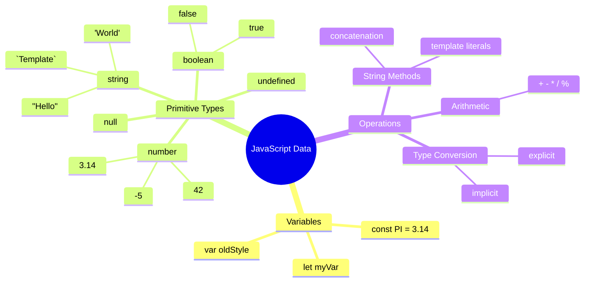

## Variables

प्रोग्रामिंगमध्ये variables हे मूलभूत घटक आहेत. जसे की मध्ययुगीन अल्केमिस्ट्सने वेगवेगळ्या पदार्थांसाठी लेबल असलेल्या जार्सचा वापर केला, तसेच variables तुम्हाला माहिती साठवण्याची आणि त्याला वर्णनात्मक नाव देण्याची परवानगी देतात जेणेकरून तुम्ही नंतर त्याचा संदर्भ घेऊ शकता. कोणाचे वय लक्षात ठेवायचे आहे? `age` नावाच्या variable मध्ये साठवा. वापरकर्त्याचे नाव ट्रॅक करायचे आहे? `userName` नावाच्या variable मध्ये ठेवा.

JavaScript मध्ये variables तयार करण्यासाठी आधुनिक दृष्टिकोनावर आपण लक्ष केंद्रित करू. तुम्ही येथे शिकाल त्या तंत्रांमध्ये भाषा उत्क्रांती आणि प्रोग्रामिंग समुदायाने विकसित केलेल्या सर्वोत्तम पद्धतींचा समावेश आहे.

Variable तयार करणे आणि **declare** करणे खालील syntax मध्ये आहे **[keyword] [name]**. हे दोन भागांपासून बनलेले आहे:

- **Keyword**. बदलू शकणाऱ्या variables साठी `let` वापरा, किंवा कायमस्वरूपी राहणाऱ्या मूल्यांसाठी `const` वापरा.
- **Variable name**, हे एक वर्णनात्मक नाव आहे जे तुम्ही स्वतः निवडता.

✅ ES6 मध्ये `let` keyword सादर केले गेले आणि तुमच्या variable ला तथाकथित _block scope_ देते. `let` किंवा `const` वापरण्याची शिफारस केली जाते, जुन्या `var` keyword च्या ऐवजी. आपण पुढील भागांमध्ये block scopes अधिक सविस्तरपणे कव्हर करू.

### कार्य - variables सोबत काम करणे

1. **Variable declare करा**. चला आपला पहिला variable तयार करूया:

    ```javascript
    let myVariable;
    ```

   **याने काय साध्य होते:**
   - हे JavaScript ला `myVariable` नावाचे एक स्टोरेज स्थान तयार करण्यास सांगते
   - JavaScript या variable साठी मेमरीमध्ये जागा वाटप करते
   - सध्या या variable ला कोणतेही मूल्य नाही (undefined)

2. **त्याला एक मूल्य द्या**. आता आपल्या variable मध्ये काहीतरी ठेऊया:

    ```javascript
    myVariable = 123;
    ```

   **Assignment कसे कार्य करते:**
   - `=` ऑपरेटर आमच्या variable ला 123 मूल्य असाइन करते
   - variable आता undefined ऐवजी हे मूल्य ठेवते
   - तुम्ही तुमच्या कोडमध्ये `myVariable` वापरून या मूल्याचा संदर्भ घेऊ शकता

   > टीप: या धड्यात `=` चा वापर "assignment operator" म्हणून केला जातो, जो variable ला मूल्य सेट करण्यासाठी वापरला जातो. याचा समानतेचा अर्थ नाही.

3. **स्मार्ट पद्धतीने करा**. प्रत्यक्षात, चला त्या दोन चरणांना एकत्र करूया:

    ```javascript
    let myVariable = 123;
    ```

    **हा दृष्टिकोन अधिक कार्यक्षम आहे:**
    - तुम्ही एकाच विधानात variable declare आणि मूल्य असाइन करत आहात
    - हे विकसकांमध्ये मानक पद्धत आहे
    - कोडची लांबी कमी करते आणि स्पष्टता राखते

4. **तुमचे मन बदला**. जर आपल्याला वेगळी संख्या साठवायची असेल तर काय?

   ```javascript
   myVariable = 321;
   ```

   **Reassignment समजून घेणे:**
   - variable आता 123 ऐवजी 321 ठेवते
   - पूर्वीचे मूल्य बदलले जाते – variables एकावेळी फक्त एकच मूल्य साठवतात
   - `let` ने घोषित केलेल्या variables ची ही बदलण्याची क्षमता मुख्य वैशिष्ट्य आहे

   ✅ प्रयत्न करा! तुम्ही तुमच्या ब्राउझरमध्ये JavaScript लिहू शकता. ब्राउझर विंडो उघडा आणि Developer Tools मध्ये जा. कन्सोलमध्ये तुम्हाला एक prompt सापडेल; `let myVariable = 123` टाइप करा, return दाबा, नंतर `myVariable` टाइप करा. काय होते? लक्षात ठेवा, तुम्ही पुढील धड्यांमध्ये या संकल्पनांबद्दल अधिक शिकाल.

### 🧠 **Variables Mastery Check: आरामदायक होणे**

**चला पाहूया तुम्ही variables बद्दल कसे वाटत आहात:**
- तुम्ही variable declare करणे आणि assign करणे यातील फरक स्पष्ट करू शकता का?
- जर तुम्ही variable declare करण्यापूर्वी वापरण्याचा प्रयत्न केला तर काय होते?
- तुम्ही variable साठी `let` ऐवजी `const` कधी निवडाल?

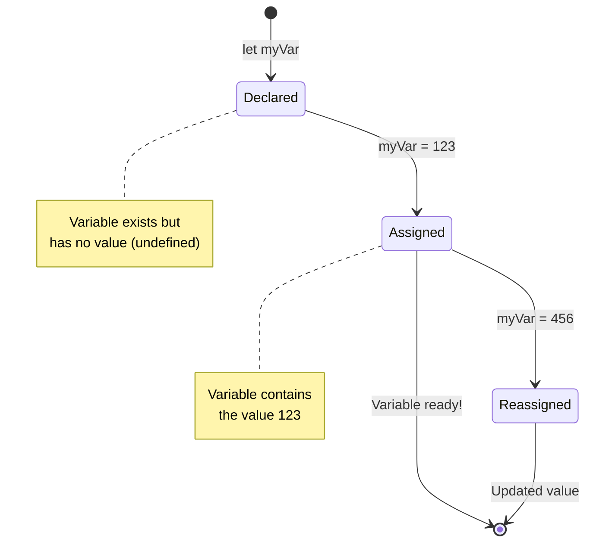

> **जलद टिप**: Variables ला लेबल असलेल्या स्टोरेज बॉक्स म्हणून विचार करा. तुम्ही बॉक्स तयार करता (`let`), त्यात काहीतरी ठेवता (`=`), आणि नंतर आवश्यक असल्यास सामग्री बदलू शकता!

## Constants

कधी कधी तुम्हाला अशी माहिती साठवायची असते जी प्रोग्राम चालू असताना कधीही बदलू नये. Constants म्हणजे गणितीय तत्त्वांसारखे आहेत जे युक्लिडने प्राचीन ग्रीस मध्ये स्थापन केले – एकदा सिद्ध आणि दस्तऐवजीकरण केल्यानंतर, ते सर्व भविष्यातील संदर्भासाठी निश्चित राहिले.

Constants variables प्रमाणेच कार्य करतात, परंतु एक महत्त्वाचे बंधन आहे: एकदा तुम्ही त्यांचे मूल्य असाइन केले की, ते बदलले जाऊ शकत नाही. ही स्थिरता तुमच्या प्रोग्राममधील महत्त्वाच्या मूल्यांमध्ये चुकून बदल होण्यापासून प्रतिबंधित करते.

Constant च्या declaration आणि initialization चा variable प्रमाणेच विचार केला जातो, फक्त `const` keyword चा अपवाद वगळता. Constants सामान्यतः सर्व uppercase अक्षरांमध्ये घोषित केले जातात.

```javascript
const MY_VARIABLE = 123;
```

**या कोडने काय करते:**
- **एक constant तयार करते** ज्याचे नाव `MY_VARIABLE` आहे आणि मूल्य 123 आहे
- **Uppercase naming convention** चा constants साठी वापर करते
- **भविष्यातील कोणतेही बदल प्रतिबंधित करते** या मूल्यावर

Constants साठी दोन मुख्य नियम आहेत:

- **तुम्हाला त्यांना लगेच मूल्य द्यावे लागेल** – रिक्त constants परवानगी नाही!
- **तुम्ही ते मूल्य कधीही बदलू शकत नाही** – जर तुम्ही प्रयत्न केला तर JavaScript एक त्रुटी फेकते. याचा अर्थ काय आहे ते पाहूया:

   **साधे मूल्य** - खालील गोष्ट परवानगी नाही:
   
      ```javascript
      const PI = 3;
      PI = 4; // परवानगी नाही
      ```

   **तुम्हाला काय लक्षात ठेवायचे आहे:**
   - **पुन्हा असाइन करण्याचा प्रयत्न** केल्यास त्रुटी येईल
   - **महत्त्वाच्या मूल्यांना** चुकून बदलण्यापासून संरक्षण देते
   - **मूल्य** प्रोग्राममध्ये सातत्याने राहते याची खात्री करते
 
   **Object reference संरक्षित आहे** - खालील गोष्ट परवानगी नाही:
   
      ```javascript
      const obj = { a: 3 };
      obj = { b: 5 } // परवानगी नाही
      ```

   **या संकल्पना समजून घेणे:**
   - **संपूर्ण object बदलण्यापासून प्रतिबंधित करते**
   - **मूळ object च्या reference चे संरक्षण करते**
   - **मेमरीमध्ये object ची ओळख कायम ठेवते**

    **Object value संरक्षित नाही** - खालील गोष्ट परवानगी आहे:
    
      ```javascript
      const obj = { a: 3 };
      obj.a = 5;  // परवानगी आहे
      ```

      **येथे काय होते ते समजून घेणे:**
      - **Object च्या property value बदलते**
      - **समान object reference ठेवते**
      - **दर्शवते** की object contents बदलू शकतात परंतु reference स्थिर राहते

   > टीप, `const` म्हणजे reference पुनः असाइन करण्यापासून संरक्षित आहे. मूल्य _immutable_ नाही आणि बदलू शकते, विशेषतः जर ते object सारखे जटिल construct असेल.

## डेटा प्रकार

JavaScript माहिती वेगवेगळ्या श्रेणींमध्ये आयोजित करते ज्याला डेटा प्रकार म्हणतात. ही संकल्पना प्राचीन विद्वानांनी ज्ञान वर्गीकृत करण्याच्या पद्धतीशी जुळते – अरिस्टॉटलने वेगवेगळ्या प्रकारच्या विचारसरणीमध्ये फरक केला, हे जाणून की तर्कशास्त्रीय तत्त्वे कविता, गणित आणि नैसर्गिक तत्त्वज्ञानावर समान रीतीने लागू केली जाऊ शकत नाहीत.

डेटा प्रकार महत्त्वाचे आहेत कारण वेगवेगळ्या प्रकारच्या माहितीवर वेगवेगळ्या प्रकारचे ऑपरेशन्स कार्य करतात. जसे तुम्ही एखाद्या व्यक्तीच्या नावावर गणित करू शकत नाही किंवा गणितीय समीकरणाचे वर्णमालानुसार वर्गीकरण करू शकत नाही, तसेच JavaScript प्रत्येक ऑपरेशनसाठी योग्य डेटा प्रकार आवश्यक आहे. हे समजून घेणे त्रुटी टाळते आणि तुमचा कोड अधिक विश्वासार्ह बनवते.

Variables अनेक प्रकारच्या मूल्ये साठवू शकतात, जसे की संख्या आणि मजकूर. या विविध प्रकारच्या मूल्यांना **डेटा प्रकार** म्हणून ओळखले जाते. डेटा प्रकार सॉफ्टवेअर विकासाचा महत्त्वाचा भाग आहे कारण यामुळे विकसकांना कोड कसा लिहायचा आणि सॉफ्टवेअर कसे चालवायचे यावर निर्णय घेण्यास मदत होते. याशिवाय, काही डेटा प्रकारांमध्ये अशी अनोखी वैशिष्ट्ये असतात जी मूल्यामध्ये अतिरिक्त माहिती रूपांतरित किंवा काढण्यास मदत करतात.

✅ डेटा प्रकारांना JavaScript डेटा प्रिमिटिव्ह्स असेही म्हणतात, कारण ते भाषेद्वारे प्रदान केलेले सर्वात कमी-स्तरीय डेटा प्रकार आहेत. 7 प्रिमिटिव्ह डेटा प्रकार आहेत: string, number, bigint, boolean, undefined, null आणि symbol. प्रत्येक प्रिमिटिव्ह काय दर्शवते याची कल्पना करण्यासाठी एक मिनिट घ्या. `zebra` म्हणजे काय? `0` कसे आहे? `true`?

### Numbers

Numbers हे JavaScript मधील सर्वात सोपे डेटा प्रकार आहेत. तुम्ही 42 सारख्या पूर्णांकांवर काम करत असाल, 3.14 सारख्या दशांशांवर किंवा -5 सारख्या नकारात्मक संख्यांवर, JavaScript त्यांना एकसमानपणे हाताळते.

आपल्या पूर्वीच्या variable ला लक्षात ठेवा? आपण साठवलेले 123 प्रत्यक्षात एक number डेटा प्रकार होते:

```javascript
let myVariable = 123;
```

**महत्त्वाचे वैशिष्ट्ये:**
- JavaScript आपोआप संख्यात्मक मूल्ये ओळखते
- तुम्ही या variables सह गणितीय ऑपरेशन्स करू शकता
- कोणत्याही प्रकारची स्पष्ट प्रकार घोषणा आवश्यक नाही

Variables सर्व प्रकारच्या संख्यांना साठवू शकतात, ज्यामध्ये दशांश किंवा नकारात्मक संख्या समाविष्ट आहे. Numbers arithmetic operators सह वापरले जाऊ शकतात, जे [पुढील विभागात](../../../../2-js-basics/1-data-types) कव्हर केले आहे.

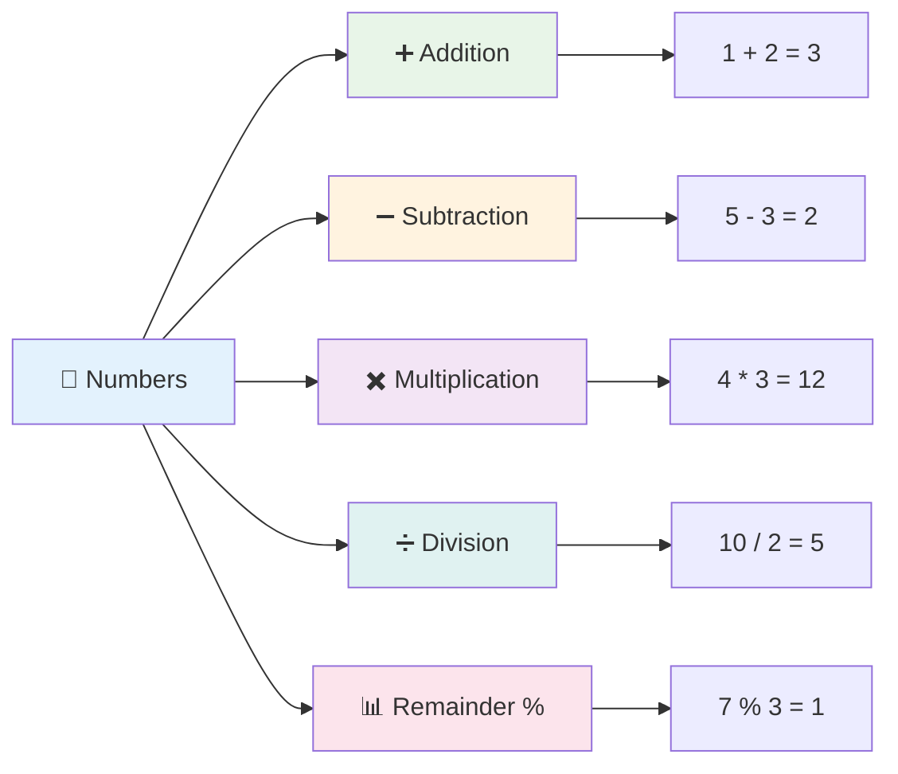

### Arithmetic Operators

Arithmetic operators तुम्हाला JavaScript मध्ये गणितीय गणना करण्याची परवानगी देतात. हे ऑपरेटर शतकानुशतके गणितज्ञांनी वापरलेल्या तत्त्वांचे अनुसरण करतात – अल-ख्वारिज्मी सारख्या विद्वानांच्या कार्यांमध्ये दिसणारे समान चिन्ह, ज्यांनी बीजगणितीय संकेतन विकसित केले.

ऑपरेटर पारंपरिक गणिताप्रमाणे कार्य करतात: बेरीजसाठी प्लस, वजाबाकीसाठी मायनस, इत्यादी.

गणितीय कार्ये करताना वापरण्यासाठी अनेक प्रकारचे ऑपरेटर आहेत, आणि त्यापैकी काही येथे सूचीबद्ध आहेत:

| चिन्ह | वर्णन                                                                  | उदाहरण                          |
| ------ | ------------------------------------------------------------------------ | -------------------------------- |
| `+`    | **Addition**: दोन संख्यांची बेरीज काढते                                  | `1 + 2 // अपेक्षित उत्तर 3 आहे`   |
| `-`    | **Subtraction**: दोन संख्यांचा फरक काढते                                | `1 - 2 // अपेक्षित उत्तर -1 आहे`  |
| `*`    | **Multiplication**: दोन संख्यांचा गुणाकार काढते                         | `1 * 2 // अपेक्षित उत्तर 2 आहे`   |
| `/`    | **Division**: दोन संख्यांचा भागाकार काढते                              | `1 / 2 // अपेक्षित उत्तर 0.5 आहे` |
| `%`    | **Remainder**: दोन संख्यांच्या भागाकारातून उरलेला भाग काढते            | `1 % 2 // अपेक्षित उत्तर 1 आहे`   |

✅ प्रयत्न करा! तुमच्या ब्राउझरच्या कन्सोलमध्ये एक arithmetic operation करून पहा. परिणाम तुम्हाला आश्चर्यचकित करतो का?

### 🧮 **Math Skills Check: आत्मविश्वासाने गणना करणे**

**तुमच्या arithmetic समजून घेण्याची चाचणी करा:**
- `/` (division) आणि `%` (remainder) यामधील फरक काय आहे?
- तुम्ही अंदाज लावू शकता का की `10 % 3` काय आहे? (सूचना: ते 3.33 नाही...)
- remainder operator प्रोग्रामिंगमध्ये उपयुक्त का असू शकतो?

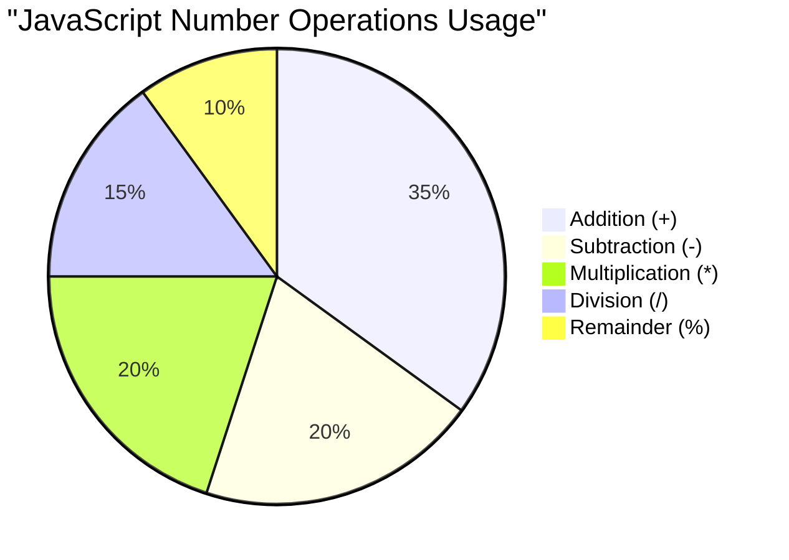

> **वास्तविक जगातील अंतर्दृष्टी**: remainder operator (%) अगदी उपयुक्त आहे, जसे की संख्यांचे even/odd तपासणे, pattern तयार करणे, किंवा arrays मधून cycling करणे!

### Strings

JavaScript मध्ये, मजकूर डेटा strings म्हणून दर्शवला जातो. "String" हा शब्द अक्षरे अनुक्रमाने जोडण्याच्या संकल्पनेतून आला आहे, जसे की मध्ययुगीन मठांतील लेखक त्यांच्या हस्तलिखितांमध्ये शब्द आणि वाक्य तयार करण्यासाठी अक्षरे जोडत असत.

Strings वेब विकासासाठी मूलभूत आहेत. वेबसाइटवर प्रदर्शित होणारा प्रत्येक मजकूर – usernames, बटण लेबल्स, त्रुटी संदेश, सामग्री – string डेटा म्हणून हाताळला जातो. कार्यक्षम वापरकर्ता इंटरफेस तयार करण्यासाठी strings समजून घेणे आवश्यक आहे.

Strings ही अक्षरे आहेत जी single किंवा double quotes मध्ये असतात.

```javascript
'This is a string'
"This is also a string"
let myString = 'This is a string value stored in a variable';
```

**या संकल्पना समजून घेणे:**
- **Single quotes `'` किंवा double quotes `"` वापरते** strings define करण्यासाठी
- **मजकूर डेटा साठवते** ज्यामध्ये अक्षरे, संख्या आणि चिन्हे समाविष्ट असतात
- **Strings ला variables मध्ये assign करते** जे नंतर वापरले जाऊ शकतात
- **Quotes आवश्यक आहेत** मजकूर variable नावांपासून वेगळा करण्यासाठी

Strings लिहिताना quotes वापरणे लक्षात ठेवा, अन्यथा JavaScript त्याला variable नाव समजेल.

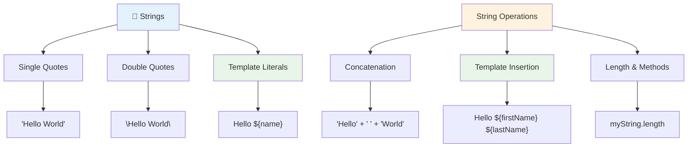

### Strings चे स्वरूप

String manipulation तुम्हाला मजकूर घटक एकत्र करण्याची, variables समाविष्ट करण्याची आणि प्रोग्रामच्या स्थितीला प्रतिसाद देणारी dynamic सामग्री तयार करण्याची परवानगी देते. ही तंत्रज्ञान तुम्हाला प्रोग्रामेटिक पद्धतीने मजकूर तयार करण्य
दोन किंवा अधिक स्ट्रिंग्स **जोडण्यासाठी**, किंवा त्यांना एकत्र करण्यासाठी, `+` ऑपरेटर वापरा.

```javascript
let myString1 = "Hello";
let myString2 = "World";

myString1 + myString2 + "!"; //HelloWorld!
myString1 + " " + myString2 + "!"; //Hello World!
myString1 + ", " + myString2 + "!"; //Hello, World!
```

**पायरी-पायरीने काय घडत आहे ते समजून घ्या:**
- **एकत्र करते** अनेक स्ट्रिंग्स `+` ऑपरेटर वापरून
- **जोडते** स्ट्रिंग्स थेट एकत्र, पहिल्या उदाहरणात जागा न ठेवता
- **जोडते** वाचनीयतेसाठी स्ट्रिंग्समध्ये जागा `" "` 
- **घालते** योग्य स्वरूपासाठी अल्पविरामासारखे चिन्ह

✅ का `1 + 1 = 2` जावास्क्रिप्टमध्ये, पण `'1' + '1' = 11?` विचार करा. `'1' + 1` बद्दल काय?

**टेम्पलेट लिटरल्स** स्ट्रिंग्स स्वरूपित करण्याचा आणखी एक मार्ग आहे, परंतु कोट्सऐवजी बॅकटिक वापरला जातो. जे काही साधा मजकूर नाही ते `${ }` प्लेसहोल्डरमध्ये ठेवले पाहिजे. यामध्ये स्ट्रिंग्स असलेल्या कोणत्याही व्हेरिएबल्सचा समावेश होतो.

```javascript
let myString1 = "Hello";
let myString2 = "World";

`${myString1} ${myString2}!` //Hello World!
`${myString1}, ${myString2}!` //Hello, World!
```

**प्रत्येक भाग समजून घेऊया:**
- **वापरते** बॅकटिक्स `` ` `` नियमित कोट्सऐवजी टेम्पलेट लिटरल्स तयार करण्यासाठी
- **थेट समाविष्ट करते** व्हेरिएबल्स `${}` प्लेसहोल्डर सिंटॅक्स वापरून
- **जतन करते** जागा आणि स्वरूप जसे लिहिले आहे तसेच
- **सुलभ करते** व्हेरिएबल्ससह जटिल स्ट्रिंग्स तयार करण्याचा स्वच्छ मार्ग

तुमच्या स्वरूपनाच्या उद्दिष्टांसाठी तुम्ही कोणताही पद्धत वापरू शकता, परंतु टेम्पलेट लिटरल्स जागा आणि ओळींचे ब्रेक जसे आहे तसे ठेवतील.

✅ तुम्ही टेम्पलेट लिटरल्स कधी वापराल आणि साधा स्ट्रिंग कधी वापराल?

### 🔤 **स्ट्रिंग मास्टरी चेक: टेक्स्ट मॅनिप्युलेशन आत्मविश्वास**

**तुमच्या स्ट्रिंग कौशल्यांचे मूल्यांकन करा:**
- तुम्ही स्पष्ट करू शकता का की `'1' + '1'` का `'11'` आहे `2` ऐवजी?
- कोणती स्ट्रिंग पद्धत तुम्हाला अधिक वाचनीय वाटते: कन्सॅटनेशन की टेम्पलेट लिटरल्स?
- जर तुम्ही स्ट्रिंगभोवती कोट्स विसरलात तर काय होईल?

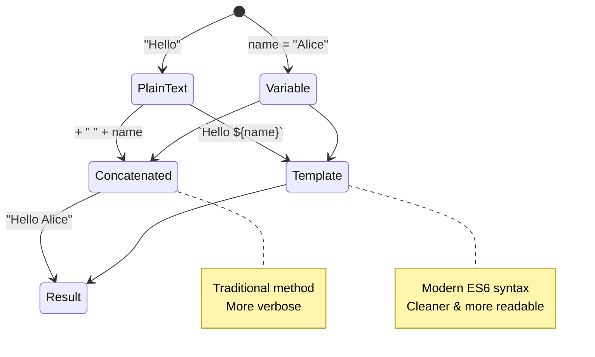

> **प्रो टिप**: टेम्पलेट लिटरल्स सामान्यतः जटिल स्ट्रिंग बिल्डिंगसाठी प्राधान्य दिले जातात कारण ते अधिक वाचनीय आहेत आणि मल्टी-लाइन स्ट्रिंग्स उत्तम प्रकारे हाताळतात!

### बूलियन्स

बूलियन्स डेटा प्रकारातील सर्वात सोपी फॉर्म दर्शवतात: ते फक्त दोन मूल्ये ठेवू शकतात – `true` किंवा `false`. ही बायनरी लॉजिक प्रणाली 19व्या शतकातील गणितज्ञ जॉर्ज बूल यांच्या कार्याशी संबंधित आहे, ज्यांनी बूलियन बीजगणित विकसित केले.

त्यांच्या साधेपणानंतरही, बूलियन्स प्रोग्राम लॉजिकसाठी अत्यावश्यक आहेत. ते तुमच्या कोडला अटींवर आधारित निर्णय घेण्यास सक्षम करतात – वापरकर्ता लॉग इन आहे का, बटण क्लिक केले गेले आहे का, किंवा विशिष्ट निकष पूर्ण झाले आहेत का.

बूलियन्स फक्त दोन मूल्ये असू शकतात: `true` किंवा `false`. बूलियन्स विशिष्ट अटी पूर्ण झाल्यावर कोणत्या ओळींचा कोड चालवायचा आहे हे ठरविण्यास मदत करू शकतात. अनेक प्रकरणांमध्ये, [ऑपरेटर](../../../../2-js-basics/1-data-types) बूलियनचे मूल्य सेट करण्यासाठी मदत करतात आणि तुम्ही अनेकदा व्हेरिएबल्स सुरू करताना किंवा त्यांचे मूल्य ऑपरेटरसह अपडेट करताना पाहाल.

```javascript
let myTrueBool = true;
let myFalseBool = false;
```

**वरील उदाहरणात, आम्ही:**
- **तयार केले** एक व्हेरिएबल जे बूलियन मूल्य `true` साठवते
- **दाखवले** बूलियन मूल्य `false` कसे साठवायचे
- **वापरले** अचूक कीवर्ड्स `true` आणि `false` (कोट्सची गरज नाही)
- **तयार केले** हे व्हेरिएबल्स अटींच्या विधानांमध्ये वापरण्यासाठी

✅ जर एखाद्या व्हेरिएबलला बूलियन `true` म्हणून मूल्यांकन केले गेले तर त्याला 'truthy' मानले जाऊ शकते. गंमत म्हणजे, जावास्क्रिप्टमध्ये, [सर्व मूल्ये truthy असतात जोपर्यंत ती स्पष्टपणे falsy म्हणून परिभाषित केलेली नसतात](https://developer.mozilla.org/docs/Glossary/Truthy).

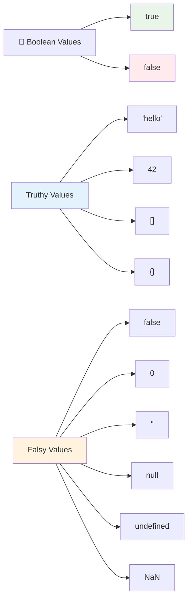

### 🎯 **बूलियन लॉजिक चेक: निर्णय घेण्याची कौशल्ये**

**तुमच्या बूलियन समजून घेण्याची चाचणी करा:**
- तुम्हाला का वाटते की जावास्क्रिप्टमध्ये `true` आणि `false` व्यतिरिक्त "truthy" आणि "falsy" मूल्ये आहेत?
- तुम्ही अंदाज लावू शकता का की यापैकी कोणते falsy आहे: `0`, `"0"`, `[]`, `"false"`?
- बूलियन्स प्रोग्राम फ्लो नियंत्रित करण्यात कसे उपयुक्त ठरू शकतात?

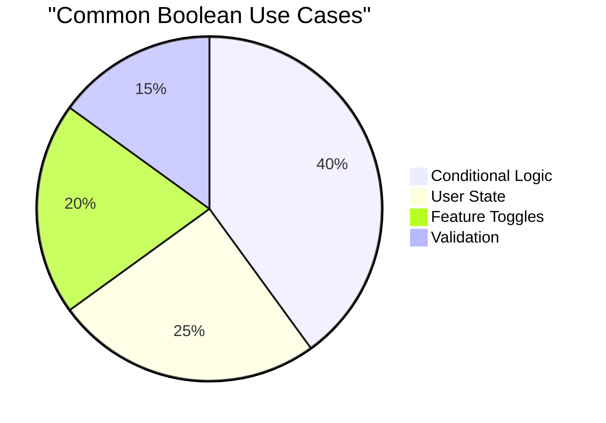

> **लक्षात ठेवा**: जावास्क्रिप्टमध्ये फक्त 6 मूल्ये falsy आहेत: `false`, `0`, `""`, `null`, `undefined`, आणि `NaN`. बाकी सर्व truthy आहेत!

---

## 📊 **तुमचे डेटा प्रकार टूलकिट सारांश**

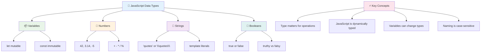

## GitHub Copilot Agent Challenge 🚀

Agent मोड वापरून खालील आव्हान पूर्ण करा:

**वर्णन:** एक वैयक्तिक माहिती व्यवस्थापक तयार करा जो तुम्ही या धड्यात शिकलेल्या सर्व जावास्क्रिप्ट डेटा प्रकारांचे प्रदर्शन करतो आणि वास्तविक डेटा परिस्थिती हाताळतो.

**प्रॉम्प्ट:** एक जावास्क्रिप्ट प्रोग्राम तयार करा जो एक युजर प्रोफाइल ऑब्जेक्ट तयार करतो ज्यामध्ये समाविष्ट आहे: व्यक्तीचे नाव (स्ट्रिंग), वय (संख्या), विद्यार्थी स्थिती (बूलियन), आवडते रंग एक अ‍ॅरे म्हणून, आणि एक पत्ता ऑब्जेक्ट ज्यामध्ये स्ट्रीट, शहर, आणि झिप कोड गुणधर्म आहेत. प्रोफाइल माहिती प्रदर्शित करण्यासाठी आणि वैयक्तिक फील्ड्स अपडेट करण्यासाठी फंक्शन्स समाविष्ट करा. स्ट्रिंग कन्सॅटनेशन, टेम्पलेट लिटरल्स, वयासह अंकगणितीय ऑपरेशन्स, आणि विद्यार्थी स्थितीसाठी बूलियन लॉजिक प्रदर्शित करा.

[Agent मोड](https://code.visualstudio.com/blogs/2025/02/24/introducing-copilot-agent-mode) बद्दल अधिक जाणून घ्या.

## 🚀 आव्हान

जावास्क्रिप्टमध्ये काही वर्तन आहेत जे विकसकांना गोंधळात टाकू शकतात. येथे एक क्लासिक उदाहरण आहे: तुमच्या ब्राउझर कन्सोलमध्ये हे टाइप करा: `let age = 1; let Age = 2; age == Age` आणि परिणाम पाहा. ते `false` परत करते – तुम्ही का ते ठरवू शकता?

हे जावास्क्रिप्टच्या अनेक वर्तनांपैकी एक आहे जे समजून घेण्यासारखे आहे. या विचित्र गोष्टींची ओळख तुम्हाला अधिक विश्वासार्ह कोड लिहिण्यास आणि समस्यांचे निराकरण अधिक प्रभावीपणे करण्यास मदत करेल.

## पोस्ट-लेक्चर क्विझ
[पोस्ट-लेक्चर क्विझ](https://ff-quizzes.netlify.app)

## पुनरावलोकन आणि स्व-अभ्यास

[जावास्क्रिप्ट सराव यादी](https://css-tricks.com/snippets/javascript/) पहा आणि एक प्रयत्न करा. तुम्ही काय शिकलात?

## असाइनमेंट

[डेटा प्रकार सराव](assignment.md)

## 🚀 तुमचा जावास्क्रिप्ट डेटा प्रकार मास्टरी टाइमलाइन

### ⚡ **पुढील 5 मिनिटांत तुम्ही काय करू शकता**
- [ ] तुमच्या ब्राउझर कन्सोलमध्ये 3 वेगवेगळ्या डेटा प्रकारांसह व्हेरिएबल्स तयार करा
- [ ] आव्हानाचा प्रयत्न करा: `let age = 1; let Age = 2; age == Age` आणि का false आहे ते शोधा
- [ ] तुमचे नाव आणि आवडता क्रमांक वापरून स्ट्रिंग कन्सॅटनेशन सराव करा
- [ ] जेव्हा तुम्ही स्ट्रिंगमध्ये संख्या जोडता तेव्हा काय होते ते तपासा

### 🎯 **तुम्ही या तासात काय साध्य करू शकता**
- [ ] पोस्ट-लेसन क्विझ पूर्ण करा आणि कोणतेही गोंधळात टाकणारे संकल्पना पुनरावलोकन करा
- [ ] दोन संख्यांची बेरीज, वजाबाकी, गुणाकार, आणि भागाकार करणारा एक मिनी कॅल्क्युलेटर तयार करा
- [ ] टेम्पलेट लिटरल्स वापरून एक साधा नाव स्वरूपक तयार करा
- [ ] `==` आणि `===` तुलना ऑपरेटरमधील फरक एक्सप्लोर करा
- [ ] वेगवेगळ्या डेटा प्रकारांमध्ये रूपांतर सराव करा

### 📅 **तुमचा आठवडाभराचा जावास्क्रिप्ट पाया**
- [ ] आत्मविश्वासाने आणि सर्जनशीलतेने असाइनमेंट पूर्ण करा
- [ ] शिकलेल्या सर्व डेटा प्रकारांचा वापर करून वैयक्तिक प्रोफाइल ऑब्जेक्ट तयार करा
- [ ] [CSS-Tricks मधील जावास्क्रिप्ट सराव](https://css-tricks.com/snippets/javascript/) करा
- [ ] बूलियन लॉजिक वापरून एक साधा फॉर्म व्हॅलिडेटर तयार करा
- [ ] अ‍ॅरे आणि ऑब्जेक्ट डेटा प्रकारांसह प्रयोग करा (आगामी धड्यांचा पूर्वावलोकन)
- [ ] जावास्क्रिप्ट समुदायात सामील व्हा आणि डेटा प्रकारांबद्दल प्रश्न विचारा

### 🌟 **तुमचा महिनाभराचा बदल**
- [ ] मोठ्या प्रोग्रामिंग प्रोजेक्ट्समध्ये डेटा प्रकार ज्ञान समाकलित करा
- [ ] वास्तविक अनुप्रयोगांमध्ये प्रत्येक डेटा प्रकार कधी आणि का वापरायचा ते समजून घ्या
- [ ] इतर नवशिक्यांना जावास्क्रिप्ट मूलभूत गोष्टी समजून घेण्यास मदत करा
- [ ] विविध प्रकारच्या युजर डेटाचा व्यवस्थापन करणारा एक छोटा अनुप्रयोग तयार करा
- [ ] टाइप कोएर्शन आणि स्ट्रिक्ट इक्वॅलिटीसारख्या प्रगत डेटा प्रकार संकल्पना एक्सप्लोर करा
- [ ] ओपन सोर्स जावास्क्रिप्ट प्रोजेक्ट्समध्ये दस्तऐवज सुधारणा करून योगदान द्या

### 🧠 **अंतिम डेटा प्रकार मास्टरी चेक-इन**

**तुमच्या जावास्क्रिप्ट पायाचा उत्सव साजरा करा:**
- कोणता डेटा प्रकार तुम्हाला त्याच्या वर्तनाच्या दृष्टीने सर्वात जास्त आश्चर्यचकित करतो?
- तुम्ही व्हेरिएबल्स आणि कॉन्स्टंट्स मित्राला स्पष्ट करण्यात किती आरामदायक आहात?
- जावास्क्रिप्टच्या टाइप सिस्टमबद्दल तुम्हाला सर्वात मनोरंजक गोष्ट काय सापडली?
- तुम्ही या मूलभूत गोष्टींसह कोणता वास्तविक अनुप्रयोग तयार करण्याची कल्पना करू शकता?

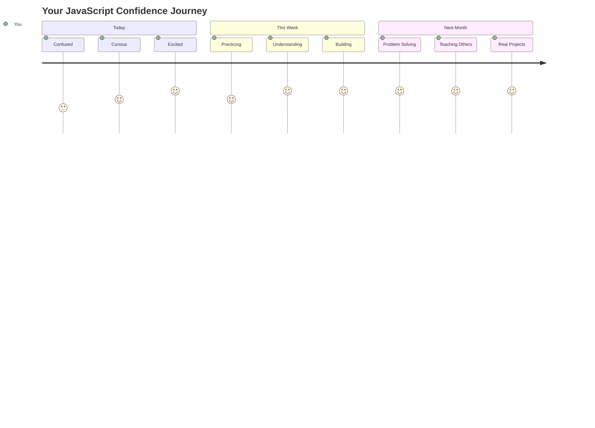

> 💡 **तुम्ही पाया तयार केला आहे!** डेटा प्रकार समजून घेणे म्हणजे कथा लिहिण्यापूर्वी वर्णमाला शिकणे. तुम्ही लिहिलेला प्रत्येक जावास्क्रिप्ट प्रोग्राम या मूलभूत संकल्पनांचा वापर करेल. तुम्हाला आता परस्परसंवादी वेबसाइट्स, डायनॅमिक अनुप्रयोग तयार करण्यासाठी आणि कोडसह वास्तविक समस्यांचे निराकरण करण्यासाठी बिल्डिंग ब्लॉक्स मिळाले आहेत. जावास्क्रिप्टच्या अद्भुत जगात स्वागत आहे! 🎉

---

**अस्वीकरण**:  
हा दस्तऐवज AI भाषांतर सेवा [Co-op Translator](https://github.com/Azure/co-op-translator) वापरून भाषांतरित करण्यात आला आहे. आम्ही अचूकतेसाठी प्रयत्नशील असलो तरी, कृपया लक्षात ठेवा की स्वयंचलित भाषांतरे त्रुटी किंवा अचूकतेच्या अभावाने युक्त असू शकतात. मूळ भाषेतील दस्तऐवज हा अधिकृत स्रोत मानला जावा. महत्त्वाच्या माहितीसाठी व्यावसायिक मानवी भाषांतराची शिफारस केली जाते. या भाषांतराचा वापर करून निर्माण झालेल्या कोणत्याही गैरसमज किंवा चुकीच्या अर्थासाठी आम्ही जबाबदार राहणार नाही.