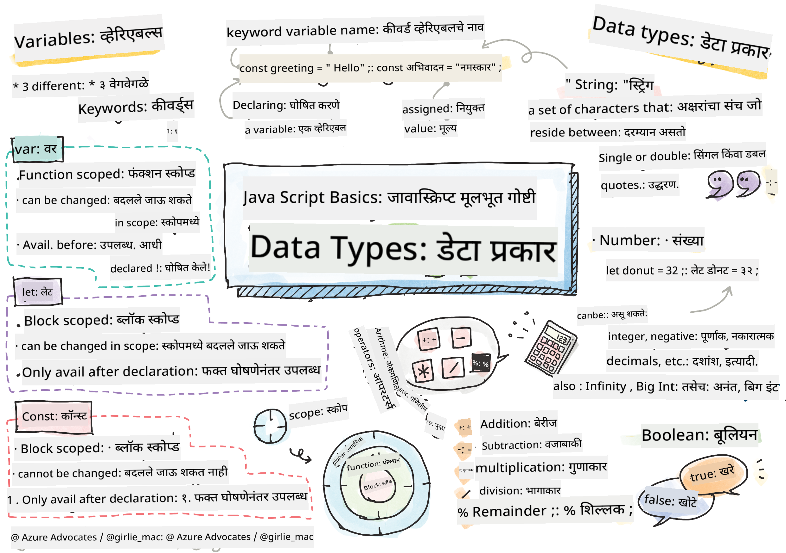

<!--
CO_OP_TRANSLATOR_METADATA:
{
  "original_hash": "d0092f6533ae3ec3adad5b5ece68efaf",
  "translation_date": "2025-10-22T15:46:41+00:00",
  "source_file": "2-js-basics/1-data-types/README.md",
  "language_code": "mr"
}
-->
# JavaScript मूलभूत गोष्टी: डेटा प्रकार


> स्केच नोट [Tomomi Imura](https://twitter.com/girlie_mac) यांच्याकडून

डेटा प्रकार हे JavaScript मधील मूलभूत संकल्पनांपैकी एक आहेत, जे तुम्ही लिहिलेल्या प्रत्येक प्रोग्राममध्ये तुम्हाला भेटतील. डेटा प्रकारांना अलेक्झांड्रिया येथील प्राचीन ग्रंथपालांनी वापरलेल्या फाइलिंग सिस्टमसारखे समजून घ्या – त्यांच्याकडे कविता, गणित आणि ऐतिहासिक नोंदी असलेल्या स्क्रोल्ससाठी विशिष्ट जागा होती. JavaScript माहिती वेगवेगळ्या प्रकारच्या डेटासाठी वेगवेगळ्या श्रेणींसह अशाच प्रकारे आयोजित करते.

या धड्यात, आपण JavaScript कार्य करण्यासाठी आवश्यक असलेल्या मुख्य डेटा प्रकारांचा अभ्यास करू. तुम्ही संख्या, मजकूर, खरे/खोटे मूल्ये हाताळणे शिकाल आणि योग्य प्रकार निवडणे तुमच्या प्रोग्रामसाठी का आवश्यक आहे हे समजून घ्याल. सुरुवातीला हे संकल्पना थोड्या गूढ वाटू शकतात, परंतु सरावाने, त्या सहजपणे समजतील.

डेटा प्रकार समजून घेतल्याने JavaScript मधील इतर सर्व गोष्टी अधिक स्पष्ट होतील. जसे की वास्तुविशारदांना कॅथेड्रल बांधण्यापूर्वी वेगवेगळ्या बांधकाम साहित्याचा अभ्यास करावा लागतो, तसेच या मूलभूत गोष्टी तुम्ही पुढे जे काही तयार कराल त्यासाठी आधार देतील.

## पूर्व-व्याख्यान प्रश्नमंजुषा
[पूर्व-व्याख्यान प्रश्नमंजुषा](https://ff-quizzes.netlify.app/web/)

हा धडा JavaScript च्या मूलभूत गोष्टींचा समावेश करतो, ही भाषा वेबवर संवादात्मकता प्रदान करते.

> तुम्ही हा धडा [Microsoft Learn](https://docs.microsoft.com/learn/modules/web-development-101-variables/?WT.mc_id=academic-77807-sagibbon) वर घेऊ शकता!

[](https://youtube.com/watch?v=JNIXfGiDWM8 "Variables in JavaScript")

[](https://youtube.com/watch?v=AWfA95eLdq8 "Data Types in JavaScript")

> 🎥 वरील प्रतिमांवर क्लिक करा, व्हेरिएबल्स आणि डेटा प्रकारांवरील व्हिडिओसाठी

चला व्हेरिएबल्स आणि त्यामध्ये असलेल्या डेटा प्रकारांपासून सुरुवात करूया!

## व्हेरिएबल्स

प्रोग्रामिंगमध्ये व्हेरिएबल्स हे मूलभूत घटक आहेत. जसे की मध्ययुगीन रसायनशास्त्रज्ञांनी वेगवेगळ्या पदार्थ साठवण्यासाठी लेबल केलेल्या जार्स वापरल्या, तसेच व्हेरिएबल्स तुम्हाला माहिती साठवण्याची आणि त्याला वर्णनात्मक नाव देण्याची परवानगी देतात जेणेकरून तुम्ही नंतर त्याचा संदर्भ घेऊ शकता. कोणाचे वय लक्षात ठेवायचे आहे? `age` नावाच्या व्हेरिएबलमध्ये साठवा. वापरकर्त्याचे नाव ट्रॅक करायचे आहे? `userName` नावाच्या व्हेरिएबलमध्ये ठेवा.

आम्ही JavaScript मध्ये व्हेरिएबल्स तयार करण्याच्या आधुनिक दृष्टिकोनावर लक्ष केंद्रित करू. तुम्ही येथे शिकाल त्या तंत्रांमध्ये भाषा उत्क्रांती आणि प्रोग्रामिंग समुदायाने विकसित केलेल्या सर्वोत्तम पद्धतींचा समावेश आहे.

व्हेरिएबल तयार करणे आणि **घोषित करणे** खालील सिंटॅक्स आहे **[keyword] [name]**. यामध्ये दोन भाग असतात:

- **कीवर्ड**. बदलू शकणाऱ्या व्हेरिएबल्ससाठी `let` वापरा किंवा कायमस्वरूपी मूल्यांसाठी `const` वापरा.
- **व्हेरिएबलचे नाव**, हे तुम्ही स्वतः निवडलेले वर्णनात्मक नाव आहे.

✅ ES6 मध्ये `let` कीवर्ड सादर केला गेला आणि तुमच्या व्हेरिएबलला तथाकथित _ब्लॉक स्कोप_ दिला. जुना `var` कीवर्ड वापरण्याऐवजी `let` किंवा `const` वापरण्याची शिफारस केली जाते. आम्ही पुढील भागांमध्ये ब्लॉक स्कोप्स अधिक सविस्तरपणे कव्हर करू.

### कार्य - व्हेरिएबल्ससह काम करणे

1. **व्हेरिएबल घोषित करा**. चला आपला पहिला व्हेरिएबल तयार करूया:

    ```javascript
    let myVariable;
    ```

   **याने काय साध्य होते:**
   - हे JavaScript ला `myVariable` नावाचे स्टोरेज स्थान तयार करण्यास सांगते
   - JavaScript या व्हेरिएबलसाठी मेमरीमध्ये जागा वाटप करते
   - सध्या व्हेरिएबलकडे कोणतेही मूल्य नाही (undefined)

2. **त्याला मूल्य द्या**. आता आपल्या व्हेरिएबलमध्ये काहीतरी ठेवूया:

    ```javascript
    myVariable = 123;
    ```

   **असाइनमेंट कसे कार्य करते:**
   - `=` ऑपरेटर आमच्या व्हेरिएबलला 123 मूल्य असाइन करतो
   - व्हेरिएबल आता undefined ऐवजी हे मूल्य ठेवते
   - तुम्ही तुमच्या कोडमध्ये `myVariable` वापरून या मूल्याचा संदर्भ घेऊ शकता

   > टीप: या धड्यात `=` चा वापर म्हणजे आम्ही "असाइनमेंट ऑपरेटर" वापरतो, जो व्हेरिएबलला मूल्य सेट करण्यासाठी वापरला जातो. याचा समानतेचा अर्थ नाही.

3. **स्मार्ट पद्धतीने करा**. प्रत्यक्षात, चला त्या दोन चरणांना एकत्र करूया:

    ```javascript
    let myVariable = 123;
    ```

    **हा दृष्टिकोन अधिक कार्यक्षम आहे:**
    - तुम्ही एका विधानात व्हेरिएबल घोषित करत आहात आणि मूल्य असाइन करत आहात
    - हे विकसकांमध्ये मानक पद्धत आहे
    - कोडची लांबी कमी करते आणि स्पष्टता राखते

4. **तुमचे मत बदला**. जर आपल्याला वेगळी संख्या साठवायची असेल तर काय?

   ```javascript
   myVariable = 321;
   ```

   **पुनःअसाइनमेंट समजून घेणे:**
   - व्हेरिएबल आता 123 ऐवजी 321 ठेवते
   - पूर्वीचे मूल्य बदलले जाते – व्हेरिएबल्स एकावेळी फक्त एकच मूल्य साठवतात
   - `let` सह घोषित केलेल्या व्हेरिएबल्सची ही बदलण्याची क्षमता मुख्य वैशिष्ट्य आहे

   ✅ प्रयत्न करा! तुम्ही तुमच्या ब्राउझरमध्ये थेट JavaScript लिहू शकता. ब्राउझर विंडो उघडा आणि Developer Tools मध्ये जा. कन्सोलमध्ये तुम्हाला एक प्रॉम्प्ट सापडेल; `let myVariable = 123` टाइप करा, रिटर्न दाबा, नंतर `myVariable` टाइप करा. काय होते? लक्षात ठेवा, तुम्ही पुढील धड्यांमध्ये या संकल्पनांबद्दल अधिक शिकाल.

## Constants

कधीकधी तुम्हाला अशी माहिती साठवण्याची आवश्यकता असते जी प्रोग्राम चालू असताना कधीही बदलू नये. गणितीय तत्त्वांप्रमाणेच, जे युक्लिडने प्राचीन ग्रीसमध्ये स्थापित केले – एकदा सिद्ध आणि दस्तऐवजीकरण केल्यानंतर, ते भविष्यातील सर्व संदर्भांसाठी निश्चित राहिले.

Constants व्हेरिएबल्ससारखेच कार्य करतात, परंतु एक महत्त्वाचे प्रतिबंध आहे: एकदा तुम्ही त्यांचे मूल्य असाइन केल्यानंतर, ते बदलले जाऊ शकत नाही. ही स्थिरता तुमच्या प्रोग्राममधील महत्त्वाच्या मूल्यांमध्ये अनवधानाने बदल होण्यापासून प्रतिबंधित करते.

Constant ची घोषणा आणि प्रारंभ व्हेरिएबलप्रमाणेच संकल्पनांचे अनुसरण करते, `const` कीवर्डच्या अपवादासह. Constants सामान्यतः सर्व अपरकेस अक्षरांमध्ये घोषित केले जातात.

```javascript
const MY_VARIABLE = 123;
```

**या कोडने काय केले:**
- **निर्मिती** केली `MY_VARIABLE` नावाचा constant ज्याचे मूल्य 123 आहे
- **वापरले** constants साठी अपरकेस नामकरण पद्धत
- **प्रतिबंधित** भविष्यातील कोणतेही मूल्य बदल

Constants साठी दोन मुख्य नियम आहेत:

- **तुम्हाला त्यांना लगेच मूल्य द्यावे लागेल** – रिक्त constants परवानगी नाही!
- **तुम्ही ते मूल्य कधीही बदलू शकत नाही** – तुम्ही प्रयत्न केल्यास JavaScript त्रुटी फेकते. याचा अर्थ काय ते पाहूया:

   **साधे मूल्य** - खालील गोष्ट परवानगी नाही:
   
      ```javascript
      const PI = 3;
      PI = 4; // परवानगी नाही
      ```

   **तुम्हाला काय लक्षात ठेवायचे आहे:**
   - **पुनःअसाइन करण्याचे प्रयत्न** त्रुटी निर्माण करतात
   - **महत्त्वाच्या मूल्यांचे संरक्षण करते** अनवधानाने बदलांपासून
   - **सुनिश्चित करते** की मूल्य तुमच्या प्रोग्राममध्ये सुसंगत राहते
 
   **ऑब्जेक्ट संदर्भ संरक्षित आहे** - खालील गोष्ट परवानगी नाही:
   
      ```javascript
      const obj = { a: 3 };
      obj = { b: 5 } // परवानगी नाही
      ```

   **या संकल्पना समजून घेणे:**
   - **प्रतिबंधित करते** मूळ ऑब्जेक्ट नवीन ऑब्जेक्टने बदलणे
   - **मूळ ऑब्जेक्टचा संदर्भ संरक्षित करते**
   - **ऑब्जेक्टची ओळख मेमरीमध्ये कायम ठेवते**

    **ऑब्जेक्ट मूल्य संरक्षित नाही** - खालील गोष्ट परवानगी आहे:
    
      ```javascript
      const obj = { a: 3 };
      obj.a = 5;  // परवानगी आहे
      ```

      **येथे काय होते ते समजून घेणे:**
      - **ऑब्जेक्टमधील प्रॉपर्टी मूल्य बदलते**
      - **सारखा ऑब्जेक्ट संदर्भ ठेवते**
      - **दर्शवते** की ऑब्जेक्टची सामग्री बदलू शकते परंतु संदर्भ स्थिर राहतो

   > टीप, `const` म्हणजे संदर्भ पुनःअसाइनमेंटपासून संरक्षित आहे. मूल्य _immutable_ नाही आणि बदलू शकते, विशेषतः जर ते ऑब्जेक्टसारखे जटिल रचना असेल.

## डेटा प्रकार

JavaScript माहिती वेगवेगळ्या श्रेणींमध्ये आयोजित करते ज्याला डेटा प्रकार म्हणतात. ही संकल्पना प्राचीन विद्वानांनी ज्ञान वर्गीकृत कसे केले यासारखी आहे – अरिस्टॉटलने वेगवेगळ्या प्रकारच्या विचारांमध्ये फरक केला, हे जाणून की तार्किक तत्त्वे कविता, गणित आणि नैसर्गिक तत्त्वज्ञानावर समान रीतीने लागू केली जाऊ शकत नाहीत.

डेटा प्रकार महत्त्वाचे आहेत कारण वेगवेगळ्या प्रकारची माहिती वेगवेगळ्या ऑपरेशन्ससह कार्य करते. जसे तुम्ही एखाद्या व्यक्तीच्या नावावर अंकगणित करू शकत नाही किंवा गणितीय समीकरणाचे वर्णमालानुसार वर्गीकरण करू शकत नाही, तसेच JavaScript प्रत्येक ऑपरेशनसाठी योग्य डेटा प्रकार आवश्यक आहे. हे समजून घेतल्याने त्रुटी टाळता येतात आणि तुमचा कोड अधिक विश्वासार्ह बनतो.

व्हेरिएबल्समध्ये संख्या आणि मजकूरासारख्या अनेक प्रकारच्या मूल्ये साठवता येतात. या विविध प्रकारच्या मूल्यांना **डेटा प्रकार** म्हणून ओळखले जाते. डेटा प्रकार सॉफ्टवेअर विकासाचा एक महत्त्वाचा भाग आहे कारण यामुळे विकसकांना कोड कसा लिहावा आणि सॉफ्टवेअर कसे चालवावे याबद्दल निर्णय घेण्यास मदत होते. याशिवाय, काही डेटा प्रकारांमध्ये अद्वितीय वैशिष्ट्ये असतात जी मूल्यामध्ये अतिरिक्त माहिती रूपांतरित करण्यास किंवा काढण्यास मदत करतात.

✅ डेटा प्रकारांना JavaScript डेटा प्रिमिटिव्ह्स असेही म्हणतात, कारण ते भाषेद्वारे प्रदान केलेले सर्वात कमी-स्तरीय डेटा प्रकार आहेत. 7 प्रिमिटिव्ह डेटा प्रकार आहेत: string, number, bigint, boolean, undefined, null आणि symbol. प्रत्येक प्रिमिटिव्ह काय दर्शवू शकतो याची कल्पना करण्यासाठी एक मिनिट घ्या. `zebra` म्हणजे काय? `0` कसे? `true`?

### संख्या

संख्या हा JavaScript मधील सर्वात सोपा डेटा प्रकार आहे. तुम्ही 42 सारख्या पूर्णांकांसह काम करत असाल, 3.14 सारख्या दशांशांसह किंवा -5 सारख्या नकारात्मक संख्यांसह, JavaScript त्यांना एकसमानपणे हाताळते.

आमच्या आधीच्या व्हेरिएबलला लक्षात ठेवा? आम्ही साठवलेले 123 प्रत्यक्षात एक संख्या डेटा प्रकार होते:

```javascript
let myVariable = 123;
```

**मुख्य वैशिष्ट्ये:**
- JavaScript आपोआप संख्यात्मक मूल्ये ओळखते
- तुम्ही या व्हेरिएबल्ससह गणितीय ऑपरेशन्स करू शकता
- कोणत्याही स्पष्ट प्रकाराची घोषणा आवश्यक नाही

व्हेरिएबल्स सर्व प्रकारच्या संख्यांचा समावेश करू शकतात, ज्यामध्ये दशांश किंवा नकारात्मक संख्या समाविष्ट आहे. संख्या अंकगणितीय ऑपरेटरसह देखील वापरली जाऊ शकते, [पुढील विभागात](../../../../2-js-basics/1-data-types) कव्हर केले आहे.

### अंकगणितीय ऑपरेटर

अंकगणितीय ऑपरेटर तुम्हाला JavaScript मध्ये गणितीय गणना करण्याची परवानगी देतात. हे ऑपरेटर गणितज्ञांनी शतकानुशतके वापरलेल्या समान तत्त्वांचे अनुसरण करतात – अल-क्वारिझ्मी सारख्या विद्वानांच्या कामांमध्ये दिसणारे समान चिन्ह, ज्यांनी बीजगणितीय संकेतन विकसित केले.

ऑपरेटर पारंपरिक गणिताप्रमाणे कार्य करतात: बेरीजसाठी प्लस, वजाबाकीसाठी मायनस, इत्यादी.

अंकगणितीय कार्ये करताना वापरण्यासाठी अनेक प्रकारचे ऑपरेटर आहेत आणि त्यापैकी काही येथे सूचीबद्ध आहेत:

| चिन्ह | वर्णन                                                               | उदाहरण                          |
| ------ | -------------------------------------------------------------------- | -------------------------------- |
| `+`    | **बेरीज**: दोन संख्यांची बेरीज काढते                                | `1 + 2 // अपेक्षित उत्तर 3 आहे`   |
| `-`    | **वजाबाकी**: दोन संख्यांचा फरक काढते                               | `1 - 2 // अपेक्षित उत्तर -1 आहे`  |
| `*`    | **गुणाकार**: दोन संख्यांचा गुणाकार काढते                           | `1 * 2 // अपेक्षित उत्तर 2 आहे`   |
| `/`    | **भागाकार**: दोन संख्यांचा भागाकार काढते                           | `1 / 2 // अपेक्षित उत्तर 0.5 आहे` |
| `%`    | **शिल्लक**: दोन संख्यांच्या भागाकारातून शिल्लक काढते               | `1 % 2 // अपेक्षित उत्तर 1 आहे`   |

✅ प्रयत्न करा! तुमच्या ब्राउझरच्या कन्सोलमध्ये अंकगणितीय ऑपरेशन करून पहा. परिणाम तुम्हाला आश्चर्यचकित करतो का?

### स्ट्रिंग्स

JavaScript मध्ये, मजकूर डेटा स्ट्रिंग्स म्हणून दर्शविला जातो. "स्ट्रिंग" हा शब्द अक्षरे अनुक्रमाने जोडण्याच्या संकल्पनेतून आला आहे, जसे की मध्ययुगीन मठांतील लेखक त्यांच्या हस्तलिखितांमध्ये शब्द आणि वाक्य तयार करण्यासाठी अक्षरे जोडत असत.

वेब विकासासाठी स्ट्रिंग्स मूलभूत आहेत. वेबसाइटवर प्रदर्शित होणारा प्रत्येक मजकूर – वापरकर्त्यांची नावे, बटण लेबल्स, त्रुटी संदेश, सामग्री – स्ट्रिंग डेटा म्हणून हाताळला जातो. कार्यशील वापरकर्ता इंटरफेस तयार करण्यासाठी स्ट्रिंग्स समजून घेणे आवश्यक आहे.

स्ट्रिंग्स ही अक्षरे आहेत जी सिंगल किंवा डबल कोट्समध्ये असतात.

```javascript
'This is a string'
"This is also a string"
let myString = 'This is a string value stored in a variable';
```

**या संकल्पना समजून घेणे:**
- **वापरते** सिंगल कोट्स `'` किंवा डबल कोट्स `"` स्ट्रिंग्स परिभाषित करण्यासाठी
- **साठवते** मजकूर डेटा ज्यामध्ये अक्षरे, संख्या आणि चिन्हे समाविष्ट असू शकतात
- **असाइन करते** स्ट्रिंग मूल्ये व्हेरिएबल्समध्ये नंतर वापरण्यासाठी
- **आवश्यक आहे** मजकूर आणि व्हेरिएबल नावे वेगळे करण्यासाठी कोट्स

स्ट्रिंग लिहिताना कोट्स वापरणे लक्षात ठेवा, अन्यथा JavaScript त्याला व्हेरिएबल नाव समजेल.

### स्ट्रिंग्सचे स्वरूपन

स्ट्रिंग मॅनिप्युलेशन तुम्हाला मजकूर घटक एकत्र करण्याची, व्हेरिएबल्स समाविष्ट करण्याची आणि प्रोग्रामच्या स्थितीला प्रतिसाद देणारी डायनॅमिक सामग्री तयार करण्याची परवानगी देते. ही तंत्रज्ञान तुम्हाला प्रोग्रामॅटिक पद्धतीने मजकूर तयार करण्यास सक्षम करते.

अनेकदा तुम्हाला अनेक स्ट्रिंग्स एकत्र जोडण्याची आवश्यकता असते – या प्रक्रियेला कन्सॅटिनेशन म्हणतात.

दोन किंवा अधिक स्ट्रिंग्स **जोडण्यासाठी
तुम्ही तुमचे फॉर्मॅटिंग उद्दिष्टे कोणत्याही पद्धतीने साध्य करू शकता, परंतु टेम्पलेट लिटरल्स जागा आणि ओळींचे ब्रेक्स जसे आहेत तसे ठेवतात.

✅ टेम्पलेट लिटरल्स आणि साध्या स्ट्रिंगचा वापर कधी कराल?

### बूलियन

बूलियन डेटा प्रकार सर्वात सोपा आहे: यात फक्त दोन मूल्ये असू शकतात – `true` किंवा `false`. ही बायनरी लॉजिक प्रणाली 19व्या शतकातील गणितज्ञ जॉर्ज बूल यांच्या कार्यावर आधारित आहे, ज्यांनी बूलियन बीजगणित विकसित केले.

त्यांच्या साधेपणामुळेही, बूलियन प्रोग्राम लॉजिकसाठी अत्यावश्यक आहेत. ते तुमच्या कोडला अटींवर आधारित निर्णय घेण्यास सक्षम करतात – जसे की वापरकर्ता लॉग इन आहे का, बटण क्लिक केले आहे का, किंवा विशिष्ट निकष पूर्ण झाले आहेत का.

बूलियन फक्त दोन मूल्ये असू शकतात: `true` किंवा `false`. बूलियन अटी पूर्ण झाल्यावर कोणते कोड चालवायचे हे ठरवण्यासाठी मदत करतात. अनेक वेळा, [ऑपरेटर](../../../../2-js-basics/1-data-types) बूलियनचे मूल्य सेट करण्यासाठी मदत करतात आणि तुम्ही अनेकदा पाहाल की व्हेरिएबल्स इनिशियलाइज केले जात आहेत किंवा त्यांचे मूल्य ऑपरेटरसह अपडेट केले जात आहे.

```javascript
let myTrueBool = true;
let myFalseBool = false;
```

**वरील उदाहरणात, आम्ही:**
- **निर्मिती केली** एक व्हेरिएबल ज्यामध्ये बूलियन मूल्य `true` साठवले आहे
- **प्रदर्शन केले** बूलियन मूल्य `false` कसे साठवायचे
- **वापरले** अचूक कीवर्ड्स `true` आणि `false` (कोट्सची गरज नाही)
- **तयार केले** हे व्हेरिएबल्स अटींवर आधारित स्टेटमेंट्ससाठी

✅ एखाद्या व्हेरिएबलला 'truthy' मानले जाऊ शकते जर ते बूलियन `true` म्हणून मूल्यांकन करते. मजेशीर गोष्ट म्हणजे, JavaScript मध्ये, [सर्व मूल्ये truthy असतात जोपर्यंत त्यांना falsy म्हणून परिभाषित केले जात नाही](https://developer.mozilla.org/docs/Glossary/Truthy).

---

## GitHub Copilot Agent Challenge 🚀

Agent मोड वापरून खालील आव्हान पूर्ण करा:

**वर्णन:** एक वैयक्तिक माहिती व्यवस्थापक तयार करा जो तुम्ही या धड्यात शिकलेल्या सर्व JavaScript डेटा प्रकारांचे प्रदर्शन करतो आणि वास्तविक जीवनातील डेटा परिस्थिती हाताळतो.

**प्रॉम्प्ट:** एक JavaScript प्रोग्राम तयार करा जो एक वापरकर्ता प्रोफाइल ऑब्जेक्ट तयार करतो ज्यामध्ये: व्यक्तीचे नाव (string), वय (number), विद्यार्थी स्थिती (boolean), आवडते रंग एक array म्हणून, आणि एक पत्ता ऑब्जेक्ट ज्यामध्ये स्ट्रीट, शहर, आणि झिप कोड गुणधर्म आहेत. प्रोफाइल माहिती प्रदर्शित करण्यासाठी आणि वैयक्तिक फील्ड्स अपडेट करण्यासाठी फंक्शन्स समाविष्ट करा. स्ट्रिंग कन्सॅटनेशन, टेम्पलेट लिटरल्स, वयासह अंकगणितीय ऑपरेशन्स, आणि विद्यार्थी स्थितीसाठी बूलियन लॉजिक प्रदर्शित करा.

[agent mode](https://code.visualstudio.com/blogs/2025/02/24/introducing-copilot-agent-mode) बद्दल अधिक जाणून घ्या.

## 🚀 Challenge

JavaScript मध्ये काही वर्तन आहेत जे डेव्हलपर्सना गोंधळात टाकू शकतात. येथे एक क्लासिक उदाहरण आहे: तुमच्या ब्राउझर कन्सोलमध्ये हे टाइप करून पहा: `let age = 1; let Age = 2; age == Age` आणि परिणाम पाहा. ते `false` परत करते – तुम्ही कारण शोधू शकता का?

हे JavaScript मधील अनेक वर्तनांपैकी एक आहे जे समजून घेण्यासारखे आहे. या विचित्र गोष्टींची ओळख तुम्हाला अधिक विश्वासार्ह कोड लिहिण्यास आणि समस्यांचे निराकरण अधिक प्रभावीपणे करण्यास मदत करेल.

## Post-Lecture Quiz
[Post-lecture quiz](https://ff-quizzes.netlify.app)

## पुनरावलोकन आणि स्व-अभ्यास

[JavaScript सरावासाठी या यादीवर](https://css-tricks.com/snippets/javascript/) एक नजर टाका आणि एक प्रयत्न करा. तुम्ही काय शिकलात?

## असाइनमेंट

[डेटा प्रकार सराव](assignment.md)

---

**अस्वीकरण**:  
हा दस्तऐवज AI भाषांतर सेवा [Co-op Translator](https://github.com/Azure/co-op-translator) वापरून भाषांतरित करण्यात आला आहे. आम्ही अचूकतेसाठी प्रयत्नशील असलो तरी, कृपया लक्षात ठेवा की स्वयंचलित भाषांतरे त्रुटी किंवा अचूकतेच्या अभावाने युक्त असू शकतात. मूळ भाषेतील दस्तऐवज हा अधिकृत स्रोत मानला जावा. महत्त्वाच्या माहितीसाठी व्यावसायिक मानवी भाषांतराची शिफारस केली जाते. या भाषांतराचा वापर करून निर्माण झालेल्या कोणत्याही गैरसमज किंवा चुकीच्या अर्थासाठी आम्ही जबाबदार राहणार नाही.