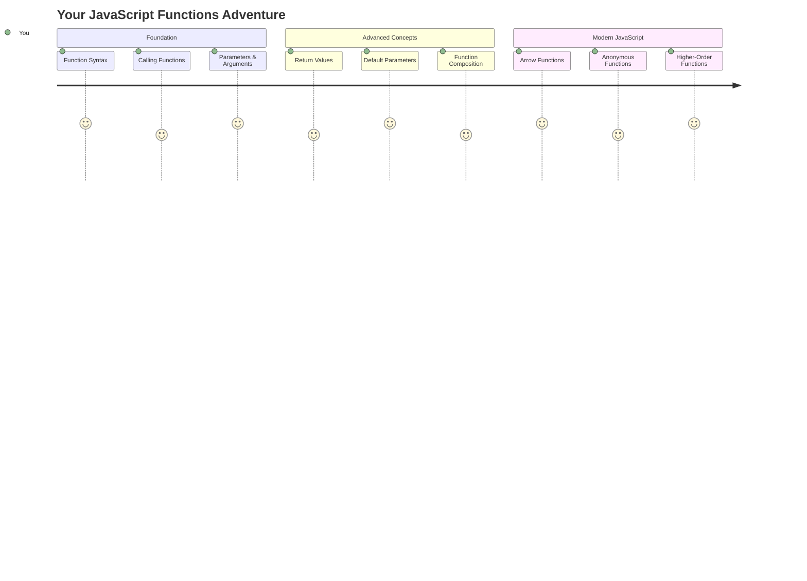
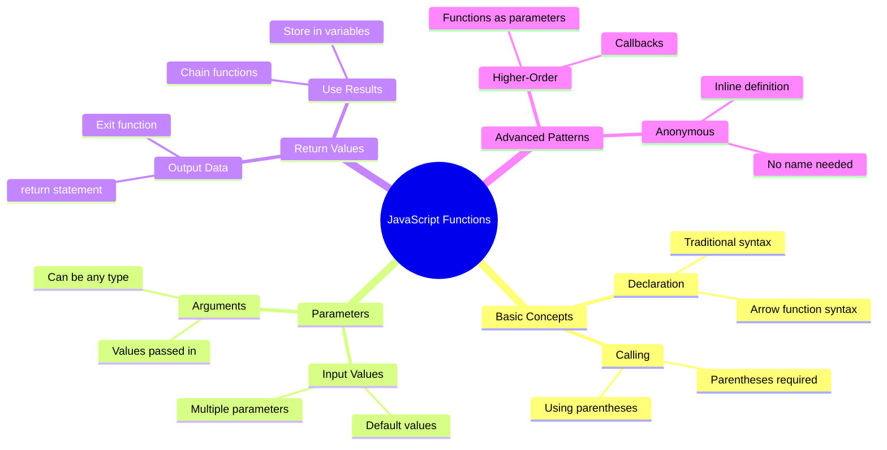
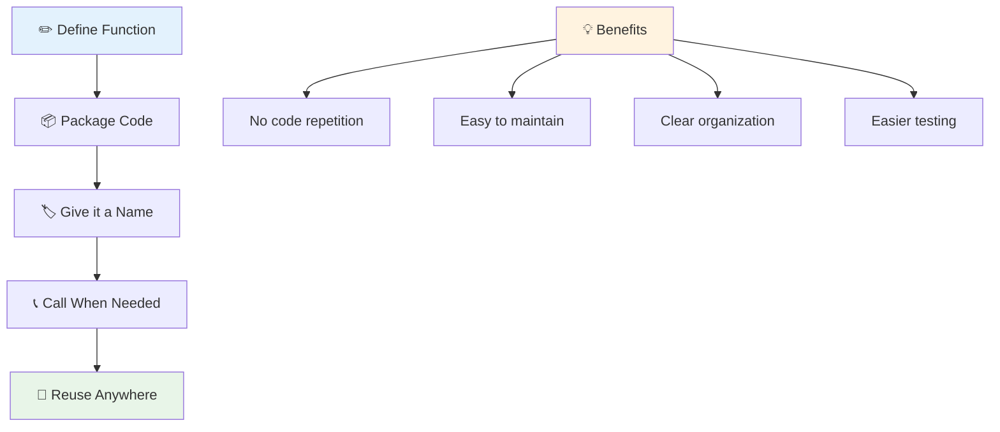
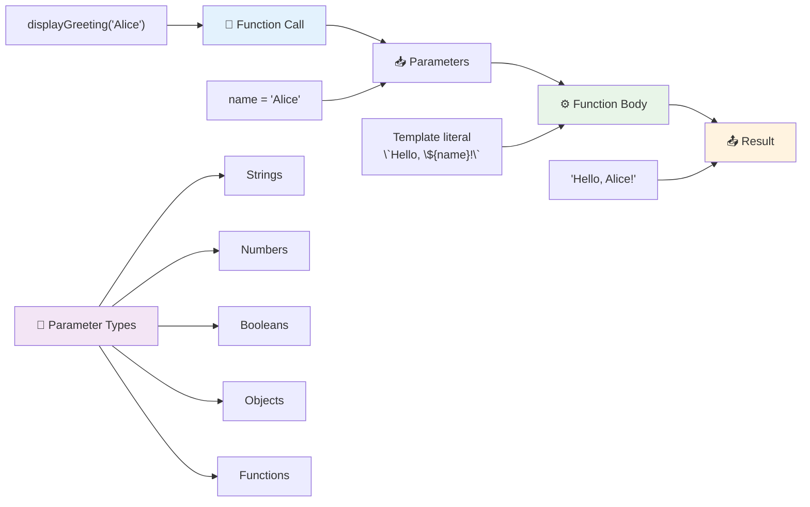
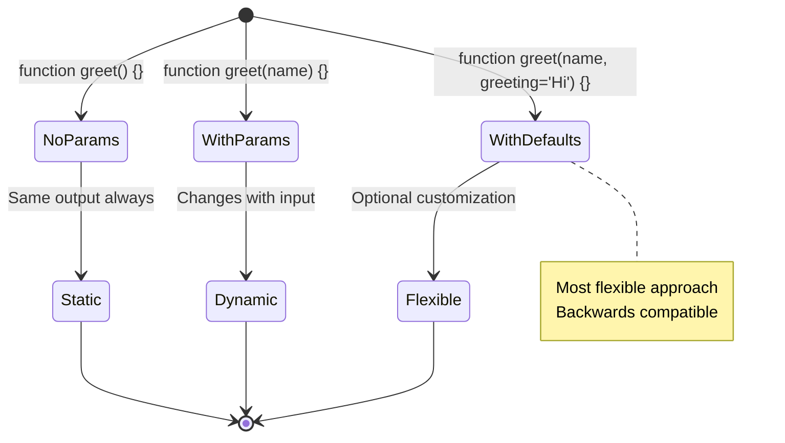
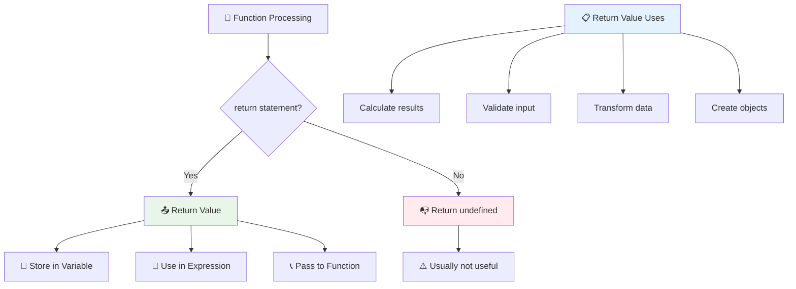
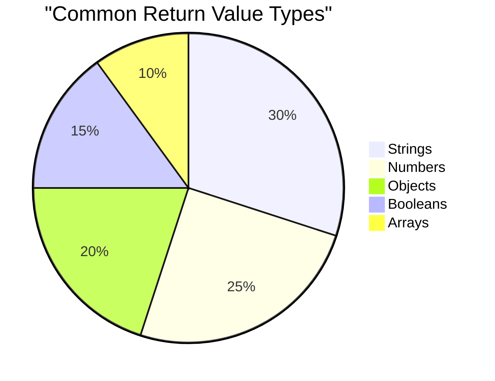
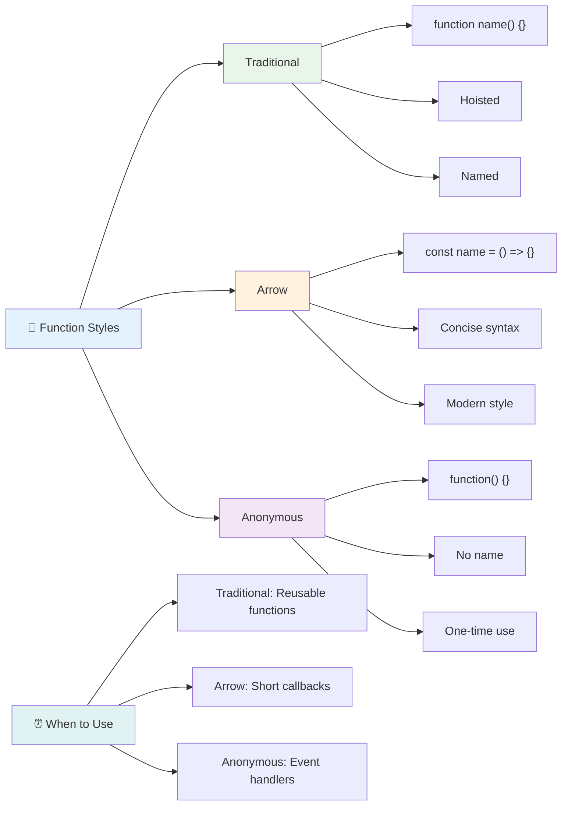
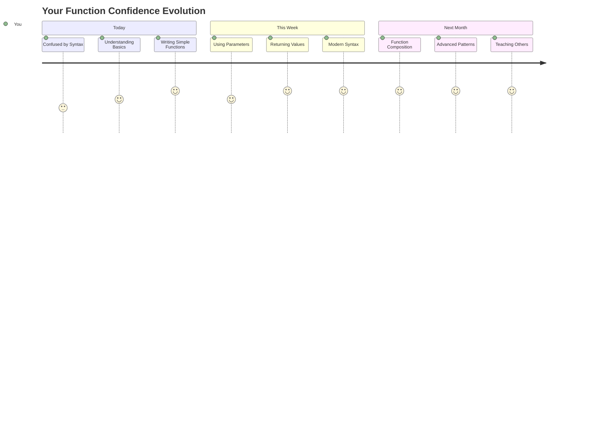

<!--
CO_OP_TRANSLATOR_METADATA:
{
  "original_hash": "71f7d7dafa1c7194d79ddac87f669ff9",
  "translation_date": "2025-11-03T14:12:55+00:00",
  "source_file": "2-js-basics/2-functions-methods/README.md",
  "language_code": "mr"
}
-->
# जावास्क्रिप्ट मूलभूत गोष्टी: पद्धती आणि फंक्शन्स


> स्केच नोट [Tomomi Imura](https://twitter.com/girlie_mac) यांनी तयार केले आहे



## व्याख्यानपूर्व प्रश्नमंजुषा
[व्याख्यानपूर्व प्रश्नमंजुषा](https://ff-quizzes.netlify.app)

प्रोग्रामिंगमध्ये वारंवार एकच कोड लिहिणे ही एक सामान्य निराशा आहे. फंक्शन्स या समस्येचे निराकरण करतात कारण ते कोड पुनर्वापर करण्यायोग्य ब्लॉक्समध्ये पॅकेज करण्याची परवानगी देतात. फंक्शन्स म्हणजे हेन्री फोर्डच्या असेंब्ली लाइनला क्रांतिकारी बनवणाऱ्या मानक भागांसारखे – एकदा तुम्ही विश्वासार्ह घटक तयार केला की, तुम्ही तो पुन्हा तयार न करता जिथे आवश्यक असेल तिथे वापरू शकता.

फंक्शन्स तुम्हाला कोडचे तुकडे एकत्र करण्याची परवानगी देतात जेणेकरून तुम्ही ते तुमच्या प्रोग्राममध्ये पुन्हा वापरू शकता. एकाच लॉजिकची कॉपी आणि पेस्ट करण्याऐवजी, तुम्ही एकदा फंक्शन तयार करू शकता आणि आवश्यकतेनुसार ते कॉल करू शकता. ही पद्धत तुमचा कोड व्यवस्थित ठेवते आणि अपडेट्स करणे खूप सोपे बनवते.

या धड्यात, तुम्ही स्वतःचे फंक्शन्स कसे तयार करायचे, त्यांना माहिती कशी द्यायची आणि उपयुक्त परिणाम कसे मिळवायचे हे शिकाल. तुम्ही फंक्शन्स आणि पद्धतींमधील फरक शोधाल, आधुनिक सिंटॅक्स पद्धती शिकाल आणि फंक्शन्स इतर फंक्शन्ससह कसे कार्य करू शकतात हे पाहाल. आपण या संकल्पना टप्प्याटप्प्याने तयार करू.

[](https://youtube.com/watch?v=XgKsD6Zwvlc "पद्धती आणि फंक्शन्स")

> 🎥 वरील प्रतिमेवर क्लिक करा पद्धती आणि फंक्शन्सबद्दल व्हिडिओसाठी.

> तुम्ही हा धडा [Microsoft Learn](https://docs.microsoft.com/learn/modules/web-development-101-functions/?WT.mc_id=academic-77807-sagibbon) वर घेऊ शकता!



## फंक्शन्स

फंक्शन म्हणजे विशिष्ट कार्य करणारा स्वयंपूर्ण कोड ब्लॉक. हे लॉजिक समाविष्ट करते जे तुम्ही आवश्यकतेनुसार अंमलात आणू शकता.

तुमच्या प्रोग्राममध्ये एकच कोड अनेक वेळा लिहिण्याऐवजी, तुम्ही तो फंक्शनमध्ये पॅकेज करू शकता आणि तुम्हाला आवश्यक असताना ते फंक्शन कॉल करू शकता. ही पद्धत तुमचा कोड स्वच्छ ठेवते आणि अपडेट्स करणे खूप सोपे बनवते. विचार करा की तुम्हाला तुमच्या कोडबेसमधील 20 वेगवेगळ्या ठिकाणी विखुरलेले लॉजिक बदलायचे असल्यास देखभाल करणे किती आव्हानात्मक होईल.

तुमच्या फंक्शन्सचे वर्णनात्मक नाव देणे आवश्यक आहे. चांगल्या नावाचा फंक्शन त्याचा हेतू स्पष्टपणे सांगतो – जेव्हा तुम्ही `cancelTimer()` पाहता, तेव्हा तुम्हाला लगेच समजते की ते काय करते, जसे की स्पष्टपणे लेबल केलेले बटण तुम्हाला सांगते की तुम्ही त्यावर क्लिक केल्यावर काय होईल.

## फंक्शन तयार करणे आणि कॉल करणे

आम्ही फंक्शन कसे तयार करायचे ते तपासूया. सिंटॅक्स एकसारख्या पद्धतीचे अनुसरण करते:

```javascript
function nameOfFunction() { // function definition
 // function definition/body
}
```

याचे विश्लेषण करूया:
- `function` कीवर्ड जावास्क्रिप्टला सांगतो "अरे, मी एक फंक्शन तयार करत आहे!"
- `nameOfFunction` हे तुमच्या फंक्शनला वर्णनात्मक नाव देण्याचे ठिकाण आहे
- कंस `()` हे जिथे तुम्ही पॅरामीटर्स जोडू शकता (आम्ही लवकरच त्यावर येऊ)
- कर्ली ब्रेसेस `{}` वास्तविक कोड समाविष्ट करतात जेव्हा तुम्ही फंक्शन कॉल करता तेव्हा चालते

चला एक साधे ग्रीटिंग फंक्शन तयार करूया आणि ते कसे कार्य करते ते पाहूया:

```javascript
function displayGreeting() {
  console.log('Hello, world!');
}
```

हे फंक्शन "Hello, world!" कन्सोलवर प्रिंट करते. एकदा तुम्ही ते परिभाषित केल्यानंतर, तुम्ही ते आवश्यकतेनुसार कितीही वेळा वापरू शकता.

तुमचे फंक्शन अंमलात आणण्यासाठी (किंवा "कॉल" करण्यासाठी), त्याचे नाव कंसासह लिहा. जावास्क्रिप्ट तुम्हाला तुमचे फंक्शन कॉल करण्यापूर्वी किंवा नंतर परिभाषित करण्याची परवानगी देते – जावास्क्रिप्ट इंजिन अंमलबजावणी क्रम हाताळेल.

```javascript
// calling our function
displayGreeting();
```

जेव्हा तुम्ही ही ओळ चालवता, तेव्हा तुमच्या `displayGreeting` फंक्शनमधील सर्व कोड अंमलात आणते, तुमच्या ब्राउझरच्या कन्सोलमध्ये "Hello, world!" प्रदर्शित करते. तुम्ही हे फंक्शन वारंवार कॉल करू शकता.

### 🧠 **फंक्शन मूलभूत गोष्टी तपासणी: तुमचे पहिले फंक्शन्स तयार करणे**

**चला पाहूया की तुम्हाला मूलभूत फंक्शन्सबद्दल कसे वाटते:**
- तुम्ही फंक्शन डिफिनिशन्समध्ये कर्ली ब्रेसेस `{}` का वापरतो हे स्पष्ट करू शकता का?
- जर तुम्ही `displayGreeting` कंसांशिवाय लिहिले तर काय होईल?
- तुम्ही एकाच फंक्शनला अनेक वेळा कॉल का करू इच्छिता?



> **टीप:** तुम्ही या धड्यांमध्ये **पद्धती** वापरत आहात. `console.log()` ही एक पद्धत आहे – मूलत: एक फंक्शन जे `console` ऑब्जेक्टशी संबंधित आहे. मुख्य फरक म्हणजे पद्धती ऑब्जेक्ट्सशी जोडलेल्या असतात, तर फंक्शन्स स्वतंत्रपणे उभे असतात. अनेक विकसक अनौपचारिक संभाषणात हे शब्द परस्पर बदलून वापरतात.

### फंक्शन सर्वोत्तम पद्धती

उत्तम फंक्शन्स लिहिण्यासाठी काही टिप्स येथे आहेत:

- तुमच्या फंक्शन्सना स्पष्ट, वर्णनात्मक नावे द्या – तुमचे भविष्याचे स्वतः तुम्हाला धन्यवाद देतील!
- मल्टी-वर्ड नावांसाठी **camelCasing** वापरा (उदा. `calculateTotal` ऐवजी `calculate_total`)
- प्रत्येक फंक्शन एकाच गोष्टीवर लक्ष केंद्रित करून चांगले करण्यावर लक्ष केंद्रित करा

## फंक्शनला माहिती देणे

आमचे `displayGreeting` फंक्शन मर्यादित आहे – ते प्रत्येकासाठी फक्त "Hello, world!" प्रदर्शित करू शकते. पॅरामीटर्स आम्हाला फंक्शन्स अधिक लवचिक आणि उपयुक्त बनवण्याची परवानगी देतात.

**पॅरामीटर्स** प्लेसहोल्डर्ससारखे कार्य करतात जिथे तुम्ही प्रत्येक वेळी फंक्शन वापरता तेव्हा वेगवेगळ्या मूल्ये घालू शकता. अशा प्रकारे, समान फंक्शन प्रत्येक कॉलवर वेगवेगळ्या माहितीवर कार्य करू शकते.

तुम्ही तुमचे फंक्शन परिभाषित करताना पॅरामीटर्स कंसामध्ये सूचीबद्ध करता, एकाधिक पॅरामीटर्स अल्पविरामाने वेगळे करतात:

```javascript
function name(param, param2, param3) {

}
```

प्रत्येक पॅरामीटर प्लेसहोल्डरप्रमाणे कार्य करते – जेव्हा कोणी तुमचे फंक्शन कॉल करतो, तेव्हा ते वास्तविक मूल्ये प्रदान करतात जी या ठिकाणी प्लग इन केली जातात.

चला आमचे ग्रीटिंग फंक्शन अपडेट करूया जेणेकरून ते कोणाचे तरी नाव स्वीकारेल:

```javascript
function displayGreeting(name) {
  const message = `Hello, ${name}!`;
  console.log(message);
}
```

लक्षात घ्या की आम्ही नाव थेट आमच्या संदेशात घालण्यासाठी बॅकटिक्स (`` ` ``) आणि `${}` वापरत आहोत – याला टेम्पलेट लिटरल म्हणतात आणि व्हेरिएबल्स मिसळलेल्या स्ट्रिंग्स तयार करण्याचा हा एक खूप उपयुक्त मार्ग आहे.

आता जेव्हा आम्ही आमचे फंक्शन कॉल करतो, तेव्हा आम्ही कोणतेही नाव पास करू शकतो:

```javascript
displayGreeting('Christopher');
// displays "Hello, Christopher!" when run
```

जावास्क्रिप्ट स्ट्रिंग `'Christopher'` घेते, ते `name` पॅरामीटरला असाइन करते आणि वैयक्तिकृत संदेश तयार करते "Hello, Christopher!"



## डीफॉल्ट मूल्ये

आपण काही पॅरामीटर्स वैकल्पिक बनवू इच्छित असल्यास काय करावे? तेथे डीफॉल्ट मूल्ये उपयुक्त ठरतात!

म्हणून म्हणायचे आहे की लोकांना ग्रीटिंग शब्द सानुकूलित करण्यास सक्षम करायचे आहे, परंतु जर त्यांनी एक निर्दिष्ट केले नाही तर, आम्ही फक्त "Hello" बॅकअप म्हणून वापरू. तुम्ही डीफॉल्ट मूल्ये सेट करू शकता ज्याप्रमाणे व्हेरिएबल सेट करतो:

```javascript
function displayGreeting(name, salutation='Hello') {
  console.log(`${salutation}, ${name}`);
}
```

येथे, `name` अजूनही आवश्यक आहे, परंतु `salutation` ला बॅकअप मूल्य `'Hello'` आहे जर कोणी वेगळा ग्रीटिंग प्रदान केला नाही.

आता आम्ही हे फंक्शन दोन वेगवेगळ्या प्रकारे कॉल करू शकतो:

```javascript
displayGreeting('Christopher');
// displays "Hello, Christopher"

displayGreeting('Christopher', 'Hi');
// displays "Hi, Christopher"
```

पहिल्या कॉलमध्ये, जावास्क्रिप्ट डीफॉल्ट "Hello" वापरते कारण आम्ही ग्रीटिंग निर्दिष्ट केले नाही. दुसऱ्या कॉलमध्ये, ते आमचे सानुकूल "Hi" वापरते. ही लवचिकता फंक्शन्सना वेगवेगळ्या परिस्थितींशी जुळवून घेण्यास सक्षम करते.

### 🎛️ **पॅरामीटर्स मास्टरी तपासणी: फंक्शन्स लवचिक बनवणे**

**तुमच्या पॅरामीटर्सची समज तपासा:**
- पॅरामीटर आणि आर्ग्युमेंटमध्ये काय फरक आहे?
- वास्तविक-जगातील प्रोग्रामिंगमध्ये डीफॉल्ट मूल्ये का उपयुक्त आहेत?
- जर तुम्ही पॅरामीटर्सपेक्षा जास्त आर्ग्युमेंट्स पास केले तर काय होईल याचा अंदाज तुम्ही लावू शकता का?



> **प्रो टिप**: डीफॉल्ट पॅरामीटर्स तुमचे फंक्शन्स अधिक वापरकर्ता-अनुकूल बनवतात. वापरकर्ते सेन्सिबल डीफॉल्ट्ससह पटकन सुरुवात करू शकतात, परंतु आवश्यक असल्यास सानुकूलित करू शकतात!

## रिटर्न मूल्ये

आमचे फंक्शन्स आतापर्यंत फक्त कन्सोलवर संदेश प्रिंट करत आहेत, पण जर तुम्हाला फंक्शन काहीतरी गणना करायचे असेल आणि तुम्हाला परिणाम परत द्यायचा असेल तर काय?

तेथे **रिटर्न मूल्ये** येतात. काहीतरी प्रदर्शित करण्याऐवजी, फंक्शन तुम्हाला एक मूल्य परत देऊ शकते जे तुम्ही व्हेरिएबलमध्ये संग्रहित करू शकता किंवा तुमच्या कोडच्या इतर भागांमध्ये वापरू शकता.

मूल्य परत पाठवण्यासाठी, तुम्ही `return` कीवर्ड वापरता आणि त्यानंतर तुम्हाला जे परत करायचे आहे ते लिहा:

```javascript
return myVariable;
```

येथे एक महत्त्वाची गोष्ट आहे: जेव्हा फंक्शन `return` स्टेटमेंटवर पोहोचते, तेव्हा ते त्वरित चालणे थांबवते आणि ते मूल्य परत पाठवते ज्याने ते कॉल केले आहे.

चला आमचे ग्रीटिंग फंक्शन बदलूया जेणेकरून ते संदेश परत पाठवेल त्याऐवजी प्रिंट करेल:

```javascript
function createGreetingMessage(name) {
  const message = `Hello, ${name}`;
  return message;
}
```

आता ग्रीटिंग प्रिंट करण्याऐवजी, हे फंक्शन संदेश तयार करते आणि तो आम्हाला परत देतो.

परत दिलेले मूल्य वापरण्यासाठी, आम्ही ते इतर कोणत्याही मूल्याप्रमाणे व्हेरिएबलमध्ये संग्रहित करू शकतो:

```javascript
const greetingMessage = createGreetingMessage('Christopher');
```

आता `greetingMessage` मध्ये "Hello, Christopher" आहे आणि आम्ही ते आमच्या कोडमध्ये कुठेही वापरू शकतो – वेबपेजवर प्रदर्शित करण्यासाठी, ईमेलमध्ये समाविष्ट करण्यासाठी किंवा दुसऱ्या फंक्शनला पास करण्यासाठी.



### 🔄 **रिटर्न मूल्ये तपासणी: परिणाम परत मिळवणे**

**तुमच्या रिटर्न मूल्ये समजून घ्या:**
- फंक्शनमधील `return` स्टेटमेंटनंतर कोडला काय होते?
- फक्त कन्सोलवर प्रिंट करण्याऐवजी मूल्ये परत करणे का चांगले आहे?
- फंक्शन वेगवेगळ्या प्रकारची मूल्ये परत करू शकते का (स्ट्रिंग, नंबर, बूलियन)?



> **महत्त्वाची अंतर्दृष्टी**: मूल्ये परत करणारे फंक्शन्स अधिक अष्टपैलू असतात कारण कॉल करणारा परिणामासह काय करायचे ते ठरवतो. यामुळे तुमचा कोड अधिक मॉड्युलर आणि पुनर्वापर करण्यायोग्य बनतो!

## फंक्शन्स फंक्शन्ससाठी पॅरामीटर्स म्हणून

फंक्शन्स इतर फंक्शन्ससाठी पॅरामीटर्स म्हणून पास केले जाऊ शकतात. सुरुवातीला ही संकल्पना जटिल वाटू शकते, परंतु हे एक शक्तिशाली वैशिष्ट्य आहे जे लवचिक प्रोग्रामिंग पॅटर्न सक्षम करते.

जेव्हा तुम्हाला "काहीतरी घडते तेव्हा हे दुसरे काहीतरी करा" असे म्हणायचे असते तेव्हा हा पॅटर्न खूप सामान्य असतो. उदाहरणार्थ, "जेव्हा टाइमर संपतो, तेव्हा हा कोड चालवा" किंवा "जेव्हा वापरकर्ता बटणावर क्लिक करतो, तेव्हा हे फंक्शन कॉल करा."

चला `setTimeout` पाहूया, जे एक बिल्ट-इन फंक्शन आहे जे काही वेळ थांबते आणि नंतर काही कोड चालवते. आम्हाला ते कोणता कोड चालवायचा आहे ते सांगावे लागेल – फंक्शन पास करण्यासाठी योग्य केस!

हा कोड वापरून पहा – 3 सेकंदांनंतर तुम्हाला एक संदेश दिसेल:

```javascript
function displayDone() {
  console.log('3 seconds has elapsed');
}
// timer value is in milliseconds
setTimeout(displayDone, 3000);
```

लक्षात घ्या की आम्ही `displayDone` (कंसांशिवाय) `setTimeout` ला पास करतो. आम्ही स्वतः फंक्शन कॉल करत नाही – आम्ही ते `setTimeout` ला देत आहोत आणि म्हणत आहोत "हे 3 सेकंदात कॉल करा."

### अनामिक फंक्शन्स

कधी कधी तुम्हाला फक्त एका गोष्टीसाठी फंक्शनची आवश्यकता असते आणि त्याला नाव देण्याची इच्छा नसते. विचार करा – जर तुम्ही फक्त एकदाच फंक्शन वापरत असाल, तर अतिरिक्त नावाने तुमचा कोड का भरावा?

जावास्क्रिप्ट तुम्हाला **अनामिक फंक्शन्स** तयार करण्याची परवानगी देते – नाव नसलेले फंक्शन्स जे तुम्ही जिथे आवश्यक असेल तिथे परिभाषित करू शकता.

आमच्या टाइमर उदाहरणाला अनामिक फंक्शन वापरून पुन्हा लिहिण्यासाठी येथे आहे:

```javascript
setTimeout(function() {
  console.log('3 seconds has elapsed');
}, 3000);
```

हे समान परिणाम साध्य करते, परंतु फंक्शन थेट `setTimeout` कॉलमध्ये परिभाषित केले जाते, स्वतंत्र फंक्शन डिक्लरेशनची आवश्यकता दूर करते.

### फॅट अरो फंक्शन्स

आधुनिक जावास्क्रिप्टमध्ये फंक्शन्स लिहिण्याचा आणखी एक संक्षिप्त मार्ग आहे ज्याला **अरो फंक्शन्स** म्हणतात. ते `=>` वापरतात (जे अरोसारखे दिसते – समजले का?) आणि विकसकांमध्ये खूप लोकप्रिय आहेत.

अरो फंक्शन्स तुम्हाला `function` कीवर्ड वगळण्याची आणि अधिक संक्षिप्त कोड लिहिण्याची परवानगी देतात.

आमच्या टाइमर उदाहरणाला अरो फंक्शन वापरून येथे आहे:

```javascript
setTimeout(() => {
  console.log('3 seconds has elapsed');
}, 3000);
```

`()` हे जिथे पॅरामीटर्स जातील (या प्रकरणात रिक्त), नंतर अरो `=>` येते आणि शेवटी कर्ली ब्रेसेसमध्ये फंक्शन बॉडी. हे अधिक संक्षिप्त सिंटॅक्ससह समान कार्यक्षमता प्रदान करते.



### प्रत्येक रणनीती कधी वापरायची

प्रत्येक दृष्टिकोन कधी वापरायचा? एक व्यावहारिक मार्गदर्शक: जर तुम्ही फंक्शन अनेक वेळा वापरणार असाल, तर त्याला नाव द्या आणि वेगळे परिभाषित करा. जर ते एका विशिष्ट वापरासाठी असेल, तर अनामिक फंक्शन विचारात घ्या. अरो फंक्शन्स आणि पारंपरिक सिंटॅक्स दोन्ही वैध पर्याय आहेत, जरी अरो फंक्शन्स आधुनिक जावास्क्रिप्ट कोडबेसमध्ये प्रचलित आहेत.

### 🎨 **फंक
- [ ] पारंपरिक फंक्शनला अॅरो फंक्शन सिंटॅक्समध्ये रूपांतरित करण्याचा प्रयत्न करा  
- [ ] आव्हानाचा सराव करा: फंक्शन्स आणि मेथड्समधील फरक समजावून सांगा  

### 🎯 **या तासात तुम्ही काय साध्य करू शकता**  
- [ ] पोस्ट-लेसन क्विझ पूर्ण करा आणि कोणतेही गोंधळात टाकणारे संकल्पना पुनरावलोकन करा  
- [ ] GitHub Copilot चॅलेंजमधून गणित युटिलिटी लायब्ररी तयार करा  
- [ ] दुसऱ्या फंक्शनला पॅरामीटर म्हणून वापरणारा फंक्शन तयार करा  
- [ ] डिफॉल्ट पॅरामीटर्ससह फंक्शन्स लिहिण्याचा सराव करा  
- [ ] फंक्शन रिटर्न व्हॅल्यूमध्ये टेम्प्लेट लिटरल्स वापरण्याचा प्रयोग करा  

### 📅 **तुमचा आठवडाभराचा फंक्शन मास्टरी**  
- [ ] "Fun with Functions" असाइनमेंट सर्जनशीलतेने पूर्ण करा  
- [ ] तुम्ही लिहिलेल्या पुनरावृत्ती कोडचे पुनरावलोकन करा आणि त्याला पुनर्वापर करण्यायोग्य फंक्शन्समध्ये रूपांतरित करा  
- [ ] फक्त फंक्शन्स वापरून एक छोटा कॅल्क्युलेटर तयार करा (कोणतेही ग्लोबल व्हेरिएबल्स नाहीत)  
- [ ] `map()` आणि `filter()` सारख्या अॅरे मेथड्ससह अॅरो फंक्शन्सचा सराव करा  
- [ ] सामान्य कार्यांसाठी युटिलिटी फंक्शन्सचा संग्रह तयार करा  
- [ ] हायर-ऑर्डर फंक्शन्स आणि फंक्शनल प्रोग्रामिंग संकल्पनांचा अभ्यास करा  

### 🌟 **तुमचा महिनाभराचा परिवर्तन**  
- [ ] क्लोजर्स आणि स्कोपसारख्या प्रगत फंक्शन संकल्पनांमध्ये प्राविण्य मिळवा  
- [ ] फंक्शन कंपोझिशनचा मोठ्या प्रमाणावर वापर करणारा प्रकल्प तयार करा  
- [ ] फंक्शन डोक्युमेंटेशन सुधारण्यासाठी ओपन सोर्समध्ये योगदान द्या  
- [ ] इतरांना फंक्शन्स आणि वेगवेगळ्या सिंटॅक्स शैलींबद्दल शिकवा  
- [ ] जावास्क्रिप्टमधील फंक्शनल प्रोग्रामिंग पॅराडाइम्स एक्सप्लोर करा  
- [ ] भविष्यातील प्रकल्पांसाठी पुनर्वापर करण्यायोग्य फंक्शन्सची वैयक्तिक लायब्ररी तयार करा  

### 🏆 **अंतिम फंक्शन्स चॅम्पियन चेक-इन**  

**तुमच्या फंक्शन मास्टरीचा उत्सव साजरा करा:**  
- आतापर्यंत तुम्ही तयार केलेला सर्वात उपयुक्त फंक्शन कोणता आहे?  
- फंक्शन्सबद्दल शिकल्यामुळे कोडचे आयोजन करण्याबद्दल तुमच्या विचारांमध्ये कसा बदल झाला आहे?  
- तुम्हाला कोणता फंक्शन सिंटॅक्स जास्त आवडतो आणि का?  
- कोणती वास्तविक समस्या तुम्ही फंक्शन लिहून सोडवाल?  


  
> 🎉 **तुम्ही प्रोग्रामिंगच्या सर्वात शक्तिशाली संकल्पनांपैकी एकावर प्रभुत्व मिळवले आहे!** फंक्शन्स हे मोठ्या प्रोग्राम्सचे मुख्य घटक आहेत. तुम्ही तयार कराल असा प्रत्येक अॅप्लिकेशन फंक्शन्सचा वापर कोडचे आयोजन, पुनर्वापर आणि संरचना करण्यासाठी करेल. तुम्ही आता लॉजिकला पुनर्वापर करण्यायोग्य घटकांमध्ये पॅकेज कसे करायचे हे समजून घेतले आहे, ज्यामुळे तुम्ही अधिक कार्यक्षम आणि प्रभावी प्रोग्रामर बनता. मॉड्युलर प्रोग्रामिंगच्या जगात तुमचे स्वागत आहे! 🚀  

---

**अस्वीकरण**:  
हा दस्तऐवज AI भाषांतर सेवा [Co-op Translator](https://github.com/Azure/co-op-translator) वापरून भाषांतरित करण्यात आला आहे. आम्ही अचूकतेसाठी प्रयत्नशील असलो तरी कृपया लक्षात ठेवा की स्वयंचलित भाषांतरांमध्ये त्रुटी किंवा अचूकतेचा अभाव असू शकतो. मूळ भाषेतील दस्तऐवज हा अधिकृत स्रोत मानला जावा. महत्त्वाच्या माहितीसाठी व्यावसायिक मानवी भाषांतराची शिफारस केली जाते. या भाषांतराचा वापर करून निर्माण झालेल्या कोणत्याही गैरसमज किंवा चुकीच्या अर्थासाठी आम्ही जबाबदार राहणार नाही.