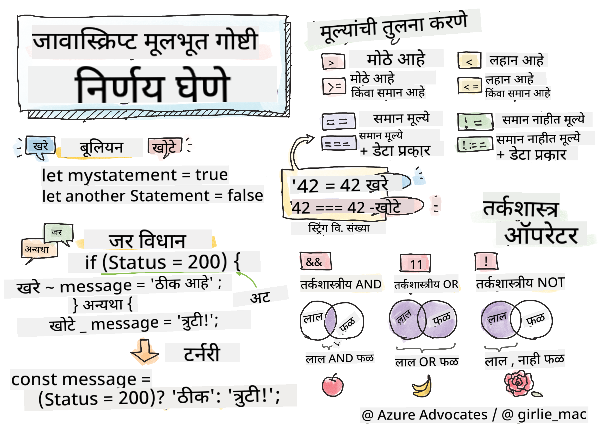

<!--
CO_OP_TRANSLATOR_METADATA:
{
  "original_hash": "888609c48329c280ca2477d2df40f2e5",
  "translation_date": "2025-08-25T21:34:56+00:00",
  "source_file": "2-js-basics/3-making-decisions/README.md",
  "language_code": "mr"
}
-->
# JavaScript मूलभूत गोष्टी: निर्णय घेणे



> स्केच नोट [Tomomi Imura](https://twitter.com/girlie_mac) यांनी तयार केलेली

## व्याख्यानपूर्व प्रश्नमंजुषा

[व्याख्यानपूर्व प्रश्नमंजुषा](https://ashy-river-0debb7803.1.azurestaticapps.net/quiz/11)

निर्णय घेणे आणि तुमच्या कोडची कार्यप्रवाह नियंत्रित करणे तुमच्या कोडला पुनर्वापरयोग्य आणि मजबूत बनवते. या विभागात JavaScript मधील डेटा प्रवाह नियंत्रित करण्यासाठी लागणाऱ्या सिंटॅक्सबद्दल आणि Boolean डेटा प्रकारांसोबत त्याचे महत्त्व याबद्दल चर्चा केली आहे.

[](https://youtube.com/watch?v=SxTp8j-fMMY "निर्णय घेणे")

> 🎥 वरील प्रतिमेवर क्लिक करून निर्णय घेण्याविषयीचा व्हिडिओ पाहा.

> तुम्ही हा धडा [Microsoft Learn](https://docs.microsoft.com/learn/modules/web-development-101-if-else/?WT.mc_id=academic-77807-sagibbon) वर घेऊ शकता!

## Boolean वर थोडक्यात पुनरावलोकन

Boolean मध्ये फक्त दोनच मूल्ये असू शकतात: `true` किंवा `false`. Boolean विशिष्ट अटी पूर्ण झाल्यावर कोणत्या कोड ओळी चालवायच्या याचा निर्णय घेण्यास मदत करतात.

तुमचा Boolean `true` किंवा `false` असा सेट करा:

`let myTrueBool = true`  
`let myFalseBool = false`

✅ Boolean हे इंग्रजी गणितज्ञ, तत्त्वज्ञ आणि तर्कशास्त्रज्ञ George Boole (1815–1864) यांच्या नावावरून आले आहे.

## तुलना ऑपरेटर आणि Boolean

ऑपरेटरचा उपयोग अटींचे मूल्यांकन करण्यासाठी केला जातो, ज्यामुळे Boolean मूल्य तयार होते. खाली वारंवार वापरल्या जाणाऱ्या ऑपरेटरची यादी दिली आहे.

| चिन्ह  | वर्णन                                                                                                                                                     | उदाहरण             |
| ------ | --------------------------------------------------------------------------------------------------------------------------------------------------------- | ------------------ |
| `<`    | **कमी आहे**: दोन मूल्यांची तुलना करते आणि डाव्या बाजूचे मूल्य उजव्या बाजूपेक्षा कमी असल्यास `true` Boolean डेटा प्रकार परत करते                          | `5 < 6 // true`    |
| `<=`   | **कमी किंवा समान आहे**: दोन मूल्यांची तुलना करते आणि डाव्या बाजूचे मूल्य उजव्या बाजूपेक्षा कमी किंवा समान असल्यास `true` Boolean डेटा प्रकार परत करते     | `5 <= 6 // true`   |
| `>`    | **जास्त आहे**: दोन मूल्यांची तुलना करते आणि डाव्या बाजूचे मूल्य उजव्या बाजूपेक्षा जास्त असल्यास `true` Boolean डेटा प्रकार परत करते                     | `5 > 6 // false`   |
| `>=`   | **जास्त किंवा समान आहे**: दोन मूल्यांची तुलना करते आणि डाव्या बाजूचे मूल्य उजव्या बाजूपेक्षा जास्त किंवा समान असल्यास `true` Boolean डेटा प्रकार परत करते | `5 >= 6 // false`  |
| `===`  | **कठोर समानता**: दोन मूल्यांची तुलना करते आणि डाव्या व उजव्या बाजूचे मूल्य समान आणि त्याच डेटा प्रकाराचे असल्यास `true` Boolean डेटा प्रकार परत करते   | `5 === 6 // false` |
| `!==`  | **असमानता**: दोन मूल्यांची तुलना करते आणि कठोर समानता ऑपरेटरने परत केलेल्या उलट Boolean मूल्य परत करते                                                  | `5 !== 6 // true`  |

✅ तुमच्या ब्राउझरच्या कन्सोलमध्ये काही तुलना लिहून तुमचे ज्ञान तपासा. परत आलेल्या डेटामध्ये काही आश्चर्यकारक वाटते का?

## If स्टेटमेंट

`if` स्टेटमेंट अट `true` असल्यास त्याच्या ब्लॉक्समधील कोड चालवते.

```javascript
if (condition) {
  //Condition is true. Code in this block will run.
}
```

तार्किक ऑपरेटर अट तयार करण्यासाठी वापरले जातात.

```javascript
let currentMoney;
let laptopPrice;

if (currentMoney >= laptopPrice) {
  //Condition is true. Code in this block will run.
  console.log("Getting a new laptop!");
}
```

## If..Else स्टेटमेंट

`else` स्टेटमेंट अट `false` असल्यास त्याच्या ब्लॉक्समधील कोड चालवते. `if` स्टेटमेंटसह `else` वैकल्पिक आहे.

```javascript
let currentMoney;
let laptopPrice;

if (currentMoney >= laptopPrice) {
  //Condition is true. Code in this block will run.
  console.log("Getting a new laptop!");
} else {
  //Condition is false. Code in this block will run.
  console.log("Can't afford a new laptop, yet!");
}
```

✅ या कोडचे आणि पुढील कोडचे तुमचे ज्ञान तपासा. ब्राउझर कन्सोलमध्ये हे चालवून पाहा. `currentMoney` आणि `laptopPrice` व्हेरिएबल्सचे मूल्य बदलून `console.log()` चे आउटपुट बदला.

## Switch स्टेटमेंट

`switch` स्टेटमेंट विविध अटींवर आधारित वेगवेगळ्या क्रिया करण्यासाठी वापरले जाते. अनेक कोड ब्लॉक्सपैकी एक निवडण्यासाठी `switch` स्टेटमेंट वापरा.

```javascript
switch (expression) {
  case x:
    // code block
    break;
  case y:
    // code block
    break;
  default:
  // code block
}
```

```javascript
// program using switch statement
let a = 2;

switch (a) {
  case 1:
    a = "one";
    break;
  case 2:
    a = "two";
    break;
  default:
    a = "not found";
    break;
}
console.log(`The value is ${a}`);
```

✅ या कोडचे आणि पुढील कोडचे तुमचे ज्ञान तपासा. ब्राउझर कन्सोलमध्ये हे चालवून पाहा. `a` व्हेरिएबलचे मूल्य बदलून `console.log()` चे आउटपुट बदला.

## तार्किक ऑपरेटर आणि Boolean

निर्णय घेण्यासाठी कधीकधी एकापेक्षा जास्त तुलना आवश्यक असते आणि तार्किक ऑपरेटरसह एकत्र करून Boolean मूल्य तयार करता येते.

| चिन्ह  | वर्णन                                                                                     | उदाहरण                                                                  |
| ------ | ----------------------------------------------------------------------------------------- | ----------------------------------------------------------------------- |
| `&&`   | **तार्किक AND**: दोन Boolean अभिव्यक्तींची तुलना करते. दोन्ही बाजू `true` असल्यासच `true` परत करते | `(5 > 6) && (5 < 6 ) // एक बाजू false आहे, दुसरी true आहे. false परत करते` |
| `\|\|` | **तार्किक OR**: दोन Boolean अभिव्यक्तींची तुलना करते. किमान एक बाजू `true` असल्यास `true` परत करते | `(5 > 6) \|\| (5 < 6) // एक बाजू false आहे, दुसरी true आहे. true परत करते` |
| `!`    | **तार्किक NOT**: Boolean अभिव्यक्तीचे उलट मूल्य परत करते                              | `!(5 > 6) // 5 हे 6 पेक्षा मोठे नाही, पण "!" true परत करेल`             |

## तार्किक ऑपरेटरसह अटी आणि निर्णय

तार्किक ऑपरेटर `if..else` स्टेटमेंटमध्ये अटी तयार करण्यासाठी वापरले जाऊ शकतात.

```javascript
let currentMoney;
let laptopPrice;
let laptopDiscountPrice = laptopPrice - laptopPrice * 0.2; //Laptop price at 20 percent off

if (currentMoney >= laptopPrice || currentMoney >= laptopDiscountPrice) {
  //Condition is true. Code in this block will run.
  console.log("Getting a new laptop!");
} else {
  //Condition is true. Code in this block will run.
  console.log("Can't afford a new laptop, yet!");
}
```

### नकार ऑपरेटर

आत्तापर्यंत तुम्ही पाहिले आहे की `if...else` स्टेटमेंट वापरून अटींवर आधारित लॉजिक कसे तयार करता येते. `if` मध्ये जाणारे काहीही `true/false` मध्ये मूल्यांकन केले पाहिजे. `!` ऑपरेटर वापरून तुम्ही अभिव्यक्तीला _नकार_ देऊ शकता. हे असे दिसेल:

```javascript
if (!condition) {
  // runs if condition is false
} else {
  // runs if condition is true
}
```

### टर्नरी अभिव्यक्ती

`if...else` हा निर्णय लॉजिक व्यक्त करण्याचा एकमेव मार्ग नाही. तुम्ही टर्नरी ऑपरेटर नावाचा पर्याय देखील वापरू शकता. त्याचा सिंटॅक्स असा दिसतो:

```javascript
let variable = condition ? <return this if true> : <return this if false>
```

खाली एक अधिक स्पष्ट उदाहरण दिले आहे:

```javascript
let firstNumber = 20;
let secondNumber = 10;
let biggestNumber = firstNumber > secondNumber ? firstNumber : secondNumber;
```

✅ या कोडला काही वेळा वाचा. तुम्हाला या ऑपरेटर कसे कार्य करतात हे समजते का?

वरील कोड असे सांगते की:

- जर `firstNumber` `secondNumber` पेक्षा मोठा असेल
- तर `firstNumber` ला `biggestNumber` मध्ये असाइन करा
- अन्यथा `secondNumber` ला असाइन करा.

टर्नरी अभिव्यक्ती ही खालील कोड लिहिण्याचा फक्त एक संक्षिप्त मार्ग आहे:

```javascript
let biggestNumber;
if (firstNumber > secondNumber) {
  biggestNumber = firstNumber;
} else {
  biggestNumber = secondNumber;
}
```

---

## 🚀 आव्हान

तार्किक ऑपरेटर वापरून प्रथम एक प्रोग्राम तयार करा आणि नंतर ते टर्नरी अभिव्यक्ती वापरून पुन्हा लिहा. तुम्हाला कोणता सिंटॅक्स जास्त आवडतो?

---

## व्याख्यानानंतरची प्रश्नमंजुषा

[व्याख्यानानंतरची प्रश्नमंजुषा](https://ashy-river-0debb7803.1.azurestaticapps.net/quiz/12)

## पुनरावलोकन आणि स्व-अभ्यास

वापरकर्त्यासाठी उपलब्ध असलेल्या अनेक ऑपरेटरबद्दल अधिक वाचा [MDN वर](https://developer.mozilla.org/docs/Web/JavaScript/Reference/Operators).

Josh Comeau यांचे अप्रतिम [ऑपरेटर लुकअप](https://joshwcomeau.com/operator-lookup/) पाहा!

## असाइनमेंट

[ऑपरेटर](assignment.md)

**अस्वीकरण**:  
हा दस्तऐवज AI भाषांतर सेवा [Co-op Translator](https://github.com/Azure/co-op-translator) चा वापर करून भाषांतरित करण्यात आला आहे. आम्ही अचूकतेसाठी प्रयत्नशील असलो तरी, कृपया लक्षात घ्या की स्वयंचलित भाषांतरांमध्ये त्रुटी किंवा अचूकतेचा अभाव असू शकतो. मूळ भाषेतील मूळ दस्तऐवज हा अधिकृत स्रोत मानला जावा. महत्त्वाच्या माहितीसाठी, व्यावसायिक मानवी भाषांतराची शिफारस केली जाते. या भाषांतराचा वापर करून उद्भवलेल्या कोणत्याही गैरसमज किंवा चुकीच्या अर्थासाठी आम्ही जबाबदार राहणार नाही.