<!--
CO_OP_TRANSLATOR_METADATA:
{
  "original_hash": "c688385d15dd3645e924ea0ffee8967f",
  "translation_date": "2025-11-03T14:15:17+00:00",
  "source_file": "2-js-basics/3-making-decisions/README.md",
  "language_code": "mr"
}
-->
# JavaScript मूलभूत गोष्टी: निर्णय घेणे


> स्केच नोट [Tomomi Imura](https://twitter.com/girlie_mac) यांच्याकडून

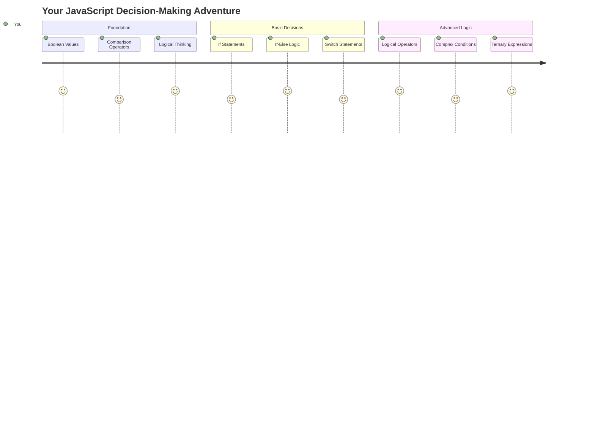

कधी तुम्हाला विचार आला आहे का की अ‍ॅप्लिकेशन्स स्मार्ट निर्णय कसे घेतात? जसे की नेव्हिगेशन सिस्टम सर्वात जलद मार्ग निवडते किंवा थर्मोस्टॅट उष्णता चालू करण्याचा निर्णय कसा घेतो? प्रोग्रामिंगमधील निर्णय घेण्याची ही मूलभूत संकल्पना आहे.

जसे चार्ल्स बॅबेजच्या अ‍ॅनालिटिकल इंजिनला परिस्थितीनुसार वेगवेगळ्या ऑपरेशन्सचे अनुक्रम अनुसरण करण्यासाठी डिझाइन केले गेले होते, आधुनिक JavaScript प्रोग्राम्सला बदलत्या परिस्थितीनुसार निवडी करणे आवश्यक आहे. स्थिर कोडला प्रतिसाद देणाऱ्या, बुद्धिमान अ‍ॅप्लिकेशन्समध्ये रूपांतरित करण्यासाठी ही शाखा आणि निर्णय घेण्याची क्षमता महत्त्वाची आहे.

या धड्यात, तुम्ही तुमच्या प्रोग्राम्समध्ये अटींचा वापर कसा करायचा ते शिकाल. आम्ही अटींचे विधान, तुलना ऑपरेटर आणि लॉजिकल एक्सप्रेशन्स एक्सप्लोर करू जे तुमच्या कोडला परिस्थितीचे मूल्यांकन करण्यास आणि योग्य प्रतिसाद देण्यास सक्षम करतात.

## व्याख्यानपूर्व प्रश्नमंजुषा

[व्याख्यानपूर्व प्रश्नमंजुषा](https://ff-quizzes.netlify.app/web/quiz/11)

निर्णय घेण्याची आणि प्रोग्राम फ्लो नियंत्रित करण्याची क्षमता प्रोग्रामिंगचा मूलभूत पैलू आहे. या विभागात Boolean मूल्ये आणि अटींचा वापर करून तुमच्या JavaScript प्रोग्राम्सच्या अंमलबजावणीचा मार्ग कसा नियंत्रित करायचा ते समाविष्ट आहे.

[](https://youtube.com/watch?v=SxTp8j-fMMY "निर्णय घेणे")

> 🎥 वरच्या प्रतिमेवर क्लिक करा निर्णय घेण्याबद्दल व्हिडिओसाठी.

> तुम्ही हा धडा [Microsoft Learn](https://docs.microsoft.com/learn/modules/web-development-101-if-else/?WT.mc_id=academic-77807-sagibbon) वर घेऊ शकता!

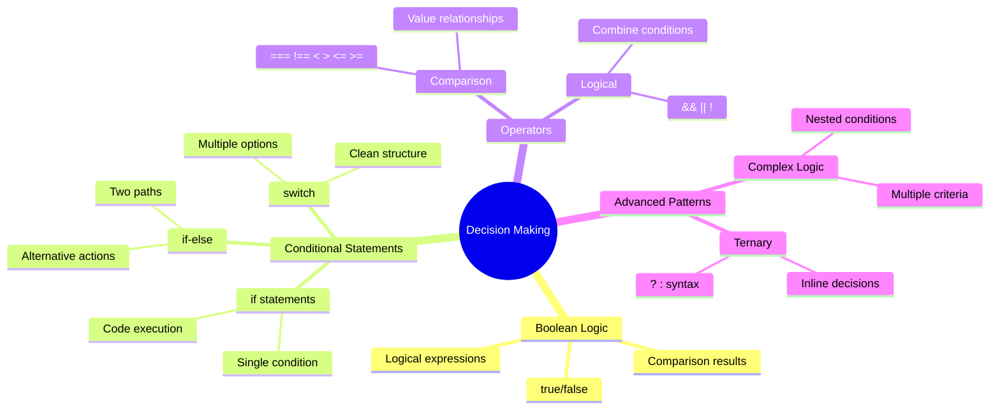

## Boolean बद्दल थोडक्यात पुनरावलोकन

निर्णय घेण्यापूर्वी, आपल्या मागील धड्यातील Boolean मूल्ये पुन्हा पाहूया. गणितज्ञ जॉर्ज बूल यांच्या नावावरून ठेवलेली ही मूल्ये द्वि-राज्ये दर्शवतात – `true` किंवा `false`. यात कोणतीही अस्पष्टता नाही, कोणतेही मध्यम क्षेत्र नाही.

ही द्वि-मूल्ये सर्व संगणकीय तर्कशास्त्राचा पाया आहेत. तुमचा प्रोग्राम घेत असलेला प्रत्येक निर्णय शेवटी Boolean मूल्यांकनावर आधारित असतो.

Boolean व्हेरिएबल्स तयार करणे सोपे आहे:

```javascript
let myTrueBool = true;
let myFalseBool = false;
```

हे दोन व्हेरिएबल्स स्पष्ट Boolean मूल्यांसह तयार करते.

✅ Boolean हे इंग्रजी गणितज्ञ, तत्त्वज्ञ आणि तर्कशास्त्रज्ञ जॉर्ज बूल (1815–1864) यांच्या नावावरून ठेवले गेले आहे.

## तुलना ऑपरेटर आणि Boolean

प्रत्यक्षात, तुम्ही क्वचितच Boolean मूल्ये मॅन्युअली सेट कराल. त्याऐवजी, तुम्ही अटींचे मूल्यांकन करून ती तयार कराल: "हा नंबर त्या नंबरपेक्षा मोठा आहे का?" किंवा "ही मूल्ये समान आहेत का?"

तुलना ऑपरेटर या मूल्यांकनांना सक्षम करतात. ते मूल्यांची तुलना करतात आणि ऑपरेटरच्या संबंधांवर आधारित Boolean परिणाम परत करतात.

| चिन्ह | वर्णन                                                                                                                                                   | उदाहरण            |
| ------ | ------------------------------------------------------------------------------------------------------------------------------------------------------------- | ------------------ |
| `<`    | **कमी आहे**: दोन मूल्यांची तुलना करते आणि डाव्या बाजूचे मूल्य उजव्या बाजूच्या मूल्यापेक्षा कमी असल्यास `true` Boolean डेटा प्रकार परत करते                              | `5 < 6 // true`    |
| `<=`   | **कमी किंवा समान आहे**: दोन मूल्यांची तुलना करते आणि डाव्या बाजूचे मूल्य उजव्या बाजूच्या मूल्यापेक्षा कमी किंवा समान असल्यास `true` Boolean डेटा प्रकार परत करते      | `5 <= 6 // true`   |
| `>`    | **मोठा आहे**: दोन मूल्यांची तुलना करते आणि डाव्या बाजूचे मूल्य उजव्या बाजूच्या मूल्यापेक्षा मोठे असल्यास `true` Boolean डेटा प्रकार परत करते                         | `5 > 6 // false`   |
| `>=`   | **मोठा किंवा समान आहे**: दोन मूल्यांची तुलना करते आणि डाव्या बाजूचे मूल्य उजव्या बाजूच्या मूल्यापेक्षा मोठे किंवा समान असल्यास `true` Boolean डेटा प्रकार परत करते | `5 >= 6 // false`  |
| `===`  | **कठोर समानता**: दोन मूल्यांची तुलना करते आणि डाव्या आणि उजव्या बाजूची मूल्ये समान आहेत आणि समान डेटा प्रकार आहेत तर `true` Boolean डेटा प्रकार परत करते       | `5 === 6 // false` |
| `!==`  | **असमानता**: दोन मूल्यांची तुलना करते आणि कठोर समानता ऑपरेटर परत करेल त्याच्या उलट Boolean मूल्य परत करते                                    | `5 !== 6 // true`  |

✅ तुमच्या ब्राउझरच्या कन्सोलमध्ये काही तुलना लिहून तुमचे ज्ञान तपासा. परत आलेल्या डेटाने तुम्हाला आश्चर्य वाटले का?

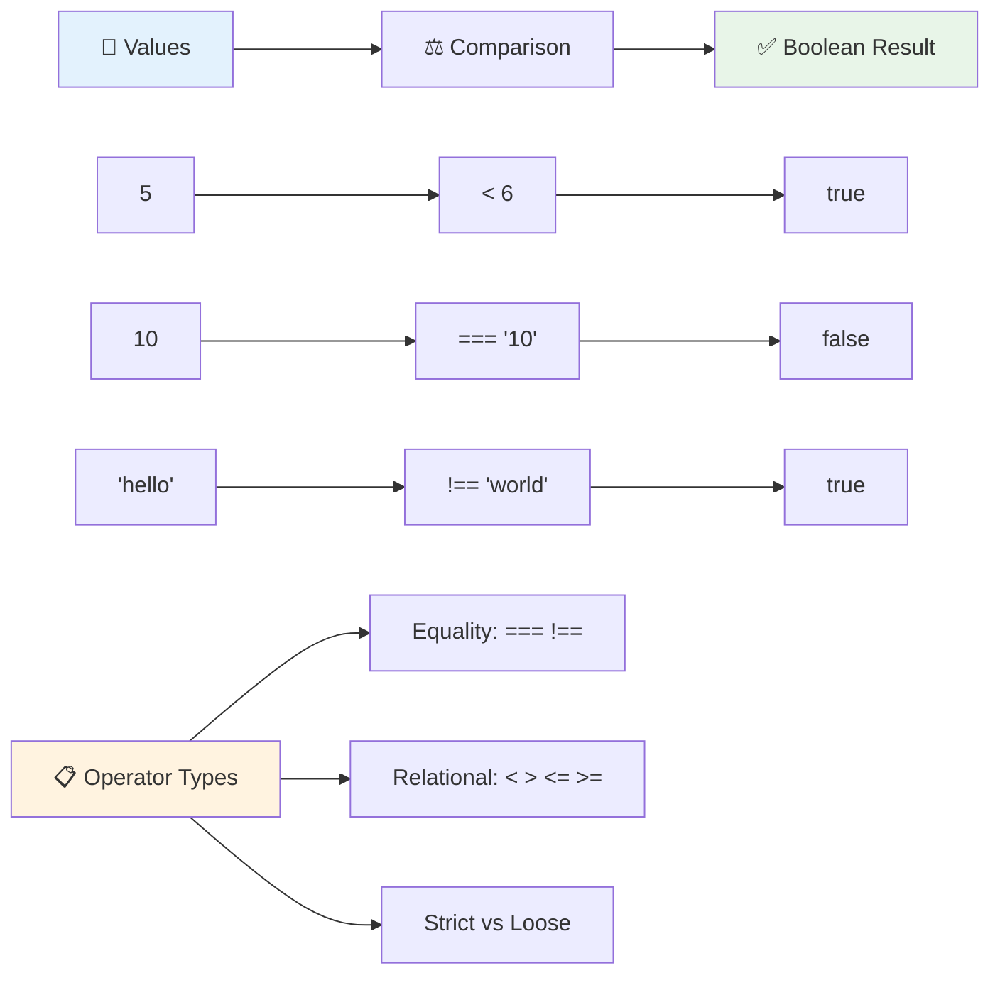

### 🧠 **तुलना तज्ञ तपासणी: Boolean तर्कशास्त्र समजून घेणे**

**तुमचे तुलना समजून घेणे तपासा:**
- तुम्हाला का वाटते की `===` (कठोर समानता) सामान्यतः `==` (सैल समानता) पेक्षा प्राधान्य दिले जाते?
- तुम्ही अंदाज लावू शकता का की `5 === '5'` काय परत करेल? `5 == '5'` बद्दल काय?
- `!==` आणि `!=` यामध्ये काय फरक आहे?

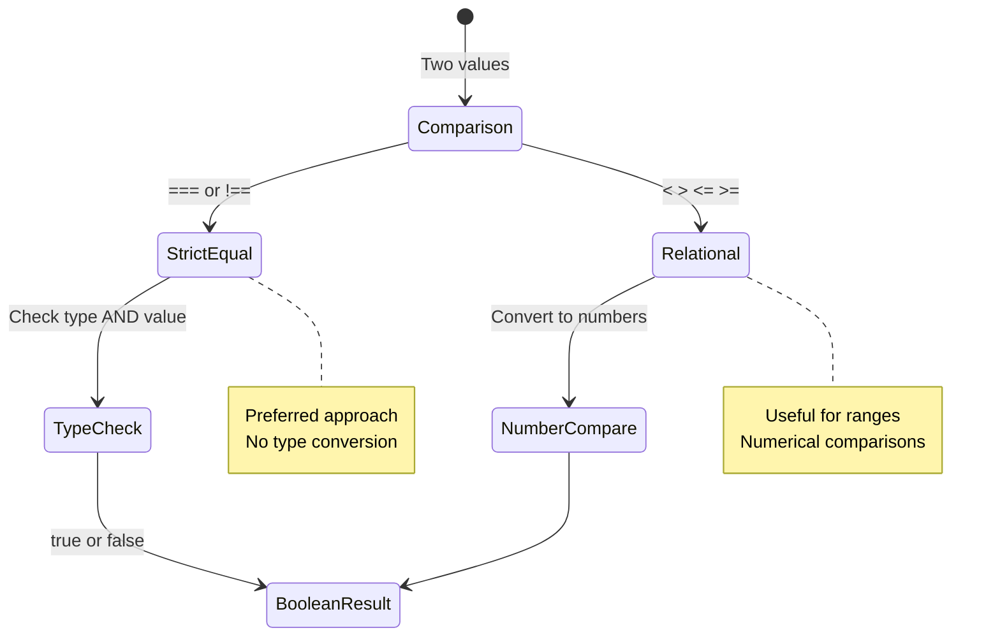

> **प्रो टिप**: समानता तपासण्यासाठी नेहमी `===` आणि `!==` वापरा जोपर्यंत तुम्हाला विशिष्ट प्रकारांत रूपांतरण आवश्यक नाही. हे अनपेक्षित वर्तन टाळते!

## If विधान

`if` विधान म्हणजे तुमच्या कोडमध्ये प्रश्न विचारण्यासारखे आहे. "जर ही अट खरी असेल, तर हे काम करा." JavaScript मध्ये निर्णय घेण्यासाठी तुम्ही वापरणारे हे कदाचित सर्वात महत्त्वाचे साधन आहे.

हे कसे कार्य करते ते येथे आहे:

```javascript
if (condition) {
  // Condition is true. Code in this block will run.
}
```

अट कंसात जाते आणि जर ती `true` असेल तर JavaScript कर्ली ब्रेसेसच्या आत कोड चालवते. जर ती `false` असेल, तर JavaScript संपूर्ण ब्लॉक वगळते.

तुम्ही या अटी तयार करण्यासाठी तुलना ऑपरेटर वापराल. व्यावहारिक उदाहरण पाहूया:

```javascript
let currentMoney = 1000;
let laptopPrice = 800;

if (currentMoney >= laptopPrice) {
  // Condition is true. Code in this block will run.
  console.log("Getting a new laptop!");
}
```

`1000 >= 800` हे `true` म्हणून मूल्यांकन करते, त्यामुळे ब्लॉकमधील कोड अंमलात आणला जातो, कन्सोलमध्ये "Getting a new laptop!" प्रदर्शित होते.

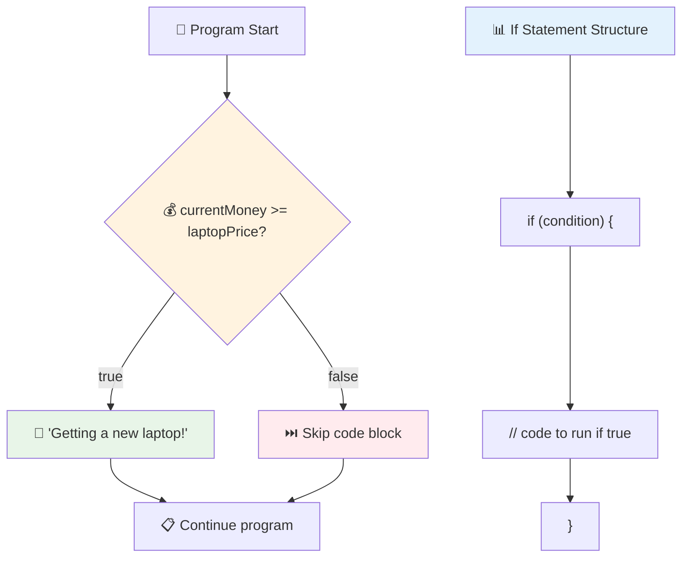

## If..Else विधान

पण जर तुम्हाला तुमच्या प्रोग्रामला अट खोटी असल्यावर काहीतरी वेगळे करायचे असेल तर? तिथे `else` येते – जणू तुमच्याकडे बॅकअप योजना आहे.

`else` विधान तुम्हाला "जर ही अट खरी नसेल, तर त्याऐवजी हे दुसरे काम करा" असे सांगण्याचा मार्ग देते.

```javascript
let currentMoney = 500;
let laptopPrice = 800;

if (currentMoney >= laptopPrice) {
  // Condition is true. Code in this block will run.
  console.log("Getting a new laptop!");
} else {
  // Condition is false. Code in this block will run.
  console.log("Can't afford a new laptop, yet!");
}
```

आता `500 >= 800` हे `false` असल्याने, JavaScript पहिला ब्लॉक वगळते आणि त्याऐवजी `else` ब्लॉक चालवते. तुम्हाला कन्सोलमध्ये "Can't afford a new laptop, yet!" दिसेल.

✅ तुमच्या ब्राउझर कन्सोलमध्ये हे कोड चालवून तुमचे ज्ञान तपासा. `currentMoney` आणि `laptopPrice` व्हेरिएबल्सच्या मूल्यांमध्ये बदल करा आणि परत आलेल्या `console.log()` मध्ये बदल पहा.

### 🎯 **If-Else लॉजिक तपासणी: शाखा मार्ग**

**तुमचे अटींचे तर्कशास्त्र समजून घेणे तपासा:**
- काय होते जर `currentMoney` नेमके `laptopPrice` च्या बरोबर असेल?
- तुम्ही वास्तविक जीवनातील परिस्थिती विचार करू शकता जिथे if-else तर्कशास्त्र उपयुक्त ठरेल?
- तुम्ही हे अनेक किंमतींच्या श्रेणींना हाताळण्यासाठी कसे वाढवू शकता?

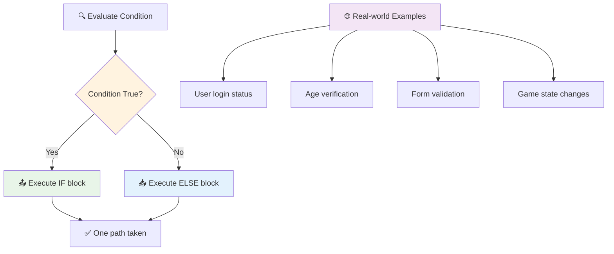

> **महत्त्वाचा दृष्टिकोन**: If-else ने अचूक एक मार्ग घेतला जातो. हे तुमच्या प्रोग्रामला कोणत्याही अटीला नेहमी प्रतिसाद देण्याची हमी देते!

## Switch विधान

कधी कधी तुम्हाला एक मूल्य अनेक पर्यायांशी तुलना करायचे असते. तुम्ही अनेक `if..else` विधानांची साखळी तयार करू शकता, परंतु हा दृष्टिकोन अव्यवस्थित होतो. अनेक विशिष्ट मूल्ये हाताळण्यासाठी स्वच्छ रचना प्रदान करण्यासाठी `switch` विधान उपयुक्त आहे.

हा संकल्पना सुरुवातीच्या टेलिफोन एक्सचेंजमध्ये वापरल्या जाणाऱ्या यांत्रिक स्विचिंग सिस्टमसारखी आहे – एक इनपुट मूल्य अंमलबजावणी कोणत्या विशिष्ट मार्गाने जाईल ते ठरवते.

```javascript
switch (expression) {
  case x:
    // code block
    break;
  case y:
    // code block
    break;
  default:
    // code block
}
```

हे कसे संरचित आहे:
- JavaScript एकदा अभिव्यक्तीचे मूल्यांकन करते
- प्रत्येक `case` शोधते जो जुळतो
- जुळणारा कोड ब्लॉक चालवते
- `break` JavaScript ला थांबवते आणि switch मधून बाहेर पडते
- जर कोणतेही केस जुळत नसतील, तर ते `default` ब्लॉक चालवते (जर तुम्ही तो ठेवला असेल तर)

```javascript
// Program using switch statement for day of week
let dayNumber = 2;
let dayName;

switch (dayNumber) {
  case 1:
    dayName = "Monday";
    break;
  case 2:
    dayName = "Tuesday";
    break;
  case 3:
    dayName = "Wednesday";
    break;
  default:
    dayName = "Unknown day";
    break;
}
console.log(`Today is ${dayName}`);
```

या उदाहरणात, JavaScript पाहते की `dayNumber` `2` आहे, जुळणारा `case 2` शोधते, `dayName` ला "Tuesday" सेट करते आणि नंतर switch मधून बाहेर पडते. परिणाम? "Today is Tuesday" कन्सोलमध्ये लॉग केले जाते.

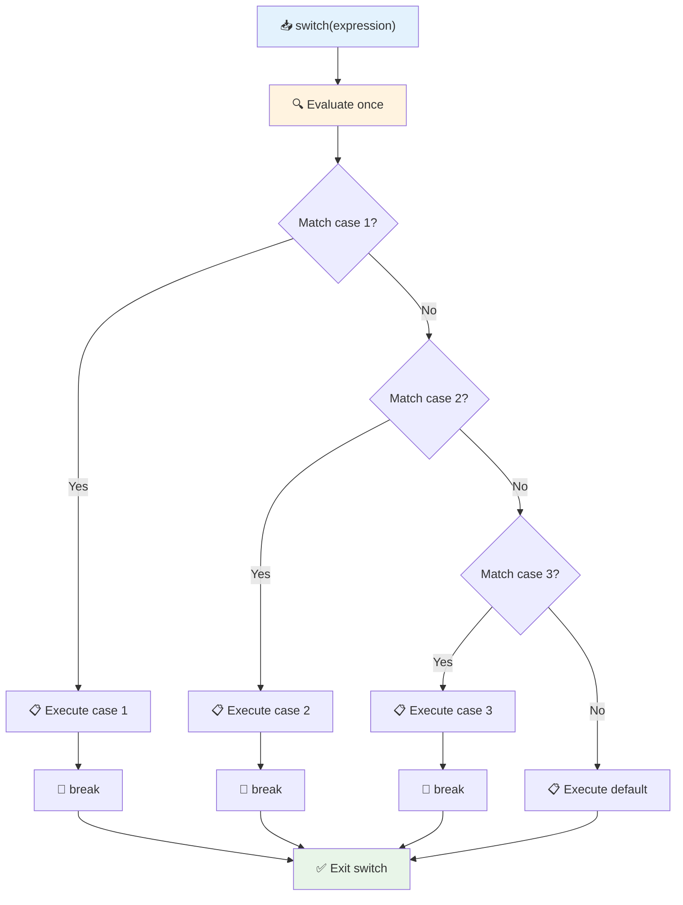

✅ तुमच्या ब्राउझर कन्सोलमध्ये हे कोड चालवून तुमचे ज्ञान तपासा. व्हेरिएबल a च्या मूल्यांमध्ये बदल करा आणि परत आलेल्या `console.log()` मध्ये बदल पहा.

### 🔄 **Switch विधान तज्ञ: अनेक पर्याय**

**तुमचे switch समजून घेणे तपासा:**
- काय होते जर तुम्ही `break` विधान विसरला?
- तुम्ही अनेक `if-else` विधानांऐवजी `switch` कधी वापराल?
- तुम्ही विचार करता की तुम्ही सर्व शक्यता कव्हर केल्या आहेत तरीही `default` केस का उपयुक्त आहे?

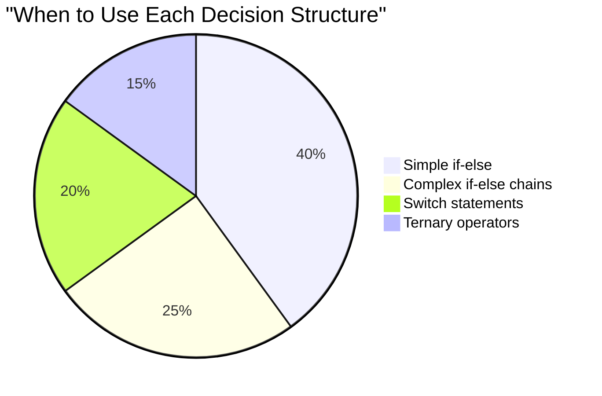

> **सर्वोत्तम सराव**: अनेक विशिष्ट मूल्यांशी एक व्हेरिएबलची तुलना करताना `switch` वापरा. श्रेणी तपासणी किंवा जटिल अटींसाठी `if-else` वापरा!

## लॉजिकल ऑपरेटर आणि Boolean

जटिल निर्णयांमध्ये अनेक अटी एकाच वेळी मूल्यांकन करणे आवश्यक असते. जसे Boolean बीजगणित गणितज्ञांना लॉजिकल अभिव्यक्ती एकत्र करण्यास अनुमती देते, प्रोग्रामिंग लॉजिकल ऑपरेटर प्रदान करते जे अनेक Boolean अटींना जोडतात.

हे ऑपरेटर साध्या true/false मूल्यांकन एकत्र करून परिष्कृत अटींचा तर्कशास्त्र सक्षम करतात.

| चिन्ह | वर्णन                                                                                     | उदाहरण                                                                 |
| ------ | ----------------------------------------------------------------------------------------------- | ----------------------------------------------------------------------- |
| `&&`   | **लॉजिकल AND**: दोन Boolean अभिव्यक्तींची तुलना करते. दोन्ही बाजू true असल्यासच true परत करते | `(5 > 3) && (5 < 10) // दोन्ही बाजू true आहेत. true परत करते` |
| `\|\|` | **लॉजिकल OR**: दोन Boolean अभिव्यक्तींची तुलना करते. किमान एक बाजू true असल्यास true परत करते     | `(5 > 10) \|\| (5 < 10) // एक बाजू false आहे, दुसरी true आहे. true परत करते` |
| `!`    | **लॉजिकल NOT**: Boolean अभिव्यक्तीचे उलट मूल्य परत करते                             | `!(5 > 10) // 5 10 पेक्षा मोठा नाही, त्यामुळे "!" ते true बनवते`         |

हे ऑपरेटर तुम्हाला अटी उपयुक्त पद्धतीने एकत्र करण्यास अनुमती देतात:
- AND (`&&`) म्हणजे दोन्ही अटी true असणे आवश्यक आहे
- OR (`||`) म्हणजे किमान एक अट true असणे आवश्यक आहे  
- NOT (`!`) true ला false मध्ये बदलते (आणि उलट)

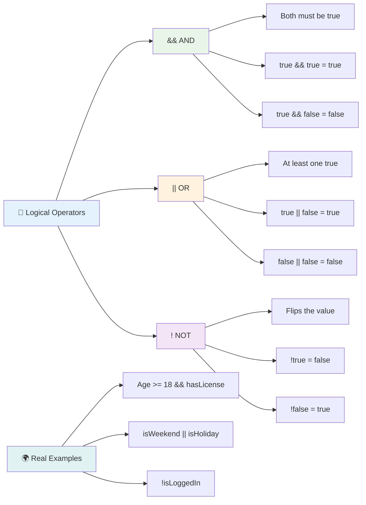

## लॉजिकल ऑपरेटरसह अटी आणि निर्णय

चला या लॉजिकल ऑपरेटरचा वापर करून अधिक वास्तववादी उदाहरण पाहूया:

```javascript
let currentMoney = 600;
let laptopPrice = 800;
let laptopDiscountPrice = laptopPrice - (laptopPrice * 0.2); // Laptop price at 20 percent off

if (currentMoney >= laptopPrice || currentMoney >= laptopDiscountPrice) {
  // Condition is true. Code in this block will run.
  console.log("Getting a new laptop!");
} else {
  // Condition is false. Code in this block will run.
  console.log("Can't afford a new laptop, yet!");
}
```

या उदाहरणात: आम्ही 20% डिस्काउंट किंमत (640) मोजतो, नंतर मूल्यांकन करतो की आमची उपलब्ध निधी पूर्ण किंमत किंवा सवलतीच्या किंमतीसाठी पुरेशी आहे का. कारण 600 सवलतीच्या किंमतीच्या मर्यादेत (640) बसते, अट true म्हणून मूल्यांकन करते.

### 🧮 **लॉजिकल ऑपरेटर तपासणी: अटी एकत्र करणे**

**तुमचे लॉजिकल ऑपरेटर समजून घेणे तपासा:**
- अभिव्यक्ती `A && B` मध्ये, काय होते जर A false असेल? B चे मूल्यांकन केले जाते का?
- तुम्ही अशी परिस्थिती विचार करू शकता जिथे तुम्हाला सर्व तीन ऑपरेटर (&&, ||, !) एकत्र आवश्यक असतील?
- `!user.isActive` आणि `user.isActive !== true` यामध्ये काय फरक आहे?

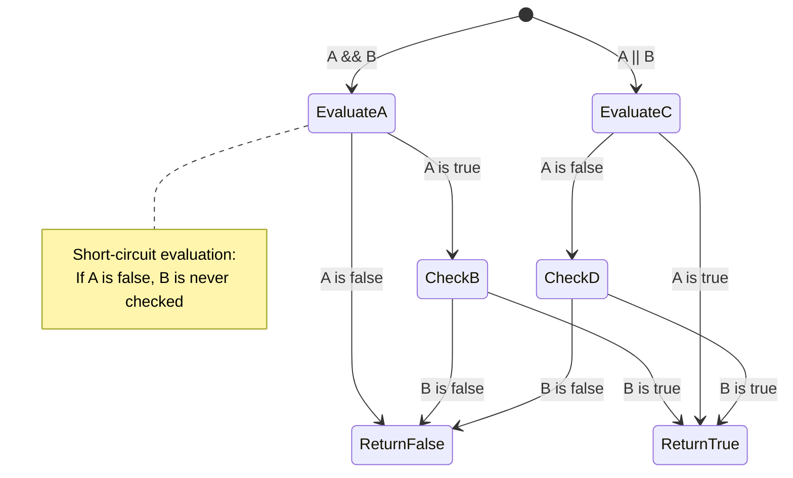

> **कामगिरी टिप**: JavaScript "शॉर्ट-सर्किट मूल्यांकन" वापरते - `A && B` मध्ये, जर A false असेल, तर B चे मूल्यांकन केले जात नाही. याचा फायदा घ्या!

### नकार ऑपरेटर

कधी कधी काहीतरी खरे नाही ते विचारणे सोपे असते. जसे "वापरकर्ता लॉग इन आहे का?" विचारण्याऐवजी, तुम्ही विचार करू शकता "वापरकर्ता लॉग इन नाही का?" उद्गार चिन्ह (`!`) ऑपरेटर तुमच्यासाठी तर्कशास्त्र उलटवतो.

```javascript
if (!condition) {
  // runs if condition is false
} else {
  // runs if condition is true
}
```

`!` ऑपरेटर म्हणजे "त्याच्या उलट..." असे म्हणणे – जर काहीतरी `true` असेल, तर `!` त्याला `false` बनवते आणि उलट.

### टर्नरी अभिव्यक्ती

सोप्या अटींच्या असाइनमेंटसाठी, JavaScript **टर्नरी ऑपरेटर** प्रदान करते. ही संक्षिप्त सिंटॅक्स तुम्हाला एकाच ओळीत अटींची अभिव्यक्ती लिहिण्याची परवानगी देते, जेव्हा तुम्हाला अटीवर आधारित दोन मूल्यांपैकी एक असाइन करायचा असेल तेव्हा उपयुक्त.

```javascript
let variable = condition ? returnThisIfTrue : returnThisIfFalse;
```

हे प्रश्नासारखे वाचते: "ही अट खरी आहे का? जर होय, तर हे मूल्य वापरा. जर नाही, तर ते मूल्य वापरा."

खाली एक अधिक ठोस उदाहरण आहे:

```javascript
let firstNumber = 20;
let secondNumber = 10;
let biggestNumber = firstNumber > secondNumber ? firstNumber : secondNumber;
```

✅ या कोडला काही वेळा वाचा. तुम्हाला समजते का की हे ऑपरेटर कसे कार्य करत आहेत?

या ओळीत काय सांगितले आहे: "`firstNumber` `secondNumber` पेक्षा मोठा आहे का? जर होय, तर `firstNumber` `biggestNumber` मध्ये ठेवा. जर नाही, तर `secondNumber` `biggestNumber` मध्ये ठेवा."

टर्नरी ऑपरेटर हा पारंपरिक `if..else` विधान लिहिण्याचा फक्त एक छोटा मार्ग आहे:

```javascript
let biggestNumber;
if (firstNumber > secondNumber) {
  biggestNumber = firstNumber;
} else {
  biggestNumber = secondNumber;
}
```

दोन्ही दृष्टिकोन समान परिणाम तयार करतात. टर्नरी ऑपरेटर संक्षिप्तता प्रदान करतो, तर पारंपरिक if-else रचना जटिल अटींसाठी अधिक वाचनीय असू शकते.

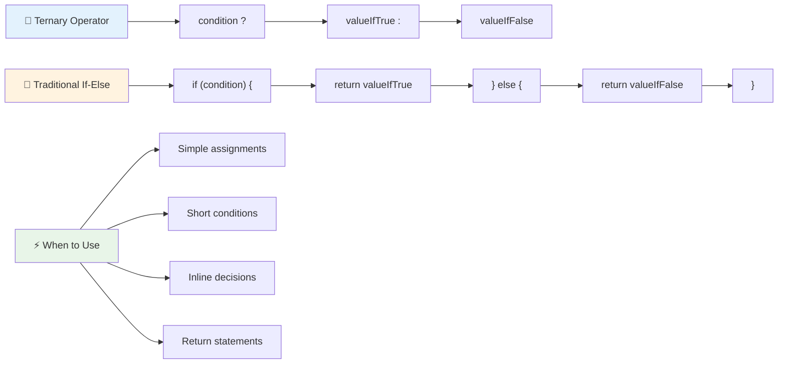

---

## 🚀 आव्हान

लॉजिकल ऑपरेटरसह प्रथम लिहिलेले प्रोग्राम तयार करा आणि नंतर ते टर्नरी अभिव्यक्ती वापरून पुन्हा लिहा. तुमची पसंतीची सिंटॅक्स कोणती आहे?

---

## GitHub Copilot Agent Challenge 🚀

Agent मोड वापरून खालील आव्हान पूर्ण करा:

**वर्णन:** या धड्याच्या अनेक निर्णय घेण्याच्या संकल्पनांचा समावेश करणारा व्यापक ग्रेड कॅल्क्युलेटर तयार करा, ज्यामध्ये if-else विधान, switch विधान, लॉजिकल ऑपरेटर आणि टर्नरी अभिव्यक्ती समाविष्ट आहे.

**प्रॉम्प्ट:** JavaScript प्रोग्राम लिहा जो विद्यार्थ्याच्या संख्यात्मक स्कोअर (0-100) घेतो आणि खालील निकषांनुसार त्यांचा लेटर ग्रेड ठरवतो:
- A: 90-100
- B: 80-89  
- C: 70-79
- D: 60-69
- F: 60 च्या खाली

आवश्यकता:
1. लेटर ग्रेड ठ
2. विद्यार्थ्याने पास होतो का (grade >= 60) आणि त्याला सन्मान मिळतो का (grade >= 90) हे तपासण्यासाठी लॉजिकल ऑपरेटर वापरा.
3. प्रत्येक अक्षर ग्रेडसाठी विशिष्ट फीडबॅक देण्यासाठी switch स्टेटमेंट वापरा.
4. विद्यार्थ्याला पुढच्या कोर्ससाठी पात्रता आहे का (grade >= 70) हे ठरवण्यासाठी टर्नरी ऑपरेटर वापरा.
5. स्कोअर 0 ते 100 दरम्यान आहे याची खात्री करण्यासाठी इनपुट व्हॅलिडेशन समाविष्ट करा.

59, 60, 89, 90 आणि अमान्य इनपुट्स यासारख्या विविध स्कोअर्ससह तुमचा प्रोग्राम टेस्ट करा.

[एजंट मोड](https://code.visualstudio.com/blogs/2025/02/24/introducing-copilot-agent-mode) बद्दल अधिक जाणून घ्या.

## पोस्ट-लेक्चर क्विझ

[पोस्ट-लेक्चर क्विझ](https://ff-quizzes.netlify.app/web/quiz/12)

## पुनरावलोकन आणि स्व-अभ्यास

वापरकर्त्यासाठी उपलब्ध असलेल्या अनेक ऑपरेटरबद्दल अधिक वाचा [MDN वर](https://developer.mozilla.org/docs/Web/JavaScript/Reference/Operators).

जॉश कोमाऊच्या अप्रतिम [ऑपरेटर लुकअप](https://joshwcomeau.com/operator-lookup/) वरून जा!

## असाइनमेंट

[ऑपरेटर](assignment.md)

---

## 🧠 **तुमचे निर्णय घेण्याचे टूलकिट सारांश**

```mermaid
graph TD
    A["🎯 JavaScript Decisions"] --> B["🔍 Boolean Logic"]
    A --> C["📊 Conditional Statements"]
    A --> D["🔗 Logical Operators"]
    A --> E["⚡ Advanced Patterns"]
    
    B --> B1["true/false values"]
    B --> B2["Comparison operators"]
    B --> B3["Truthiness concepts"]
    
    C --> C1["if statements"]
    C --> C2["if-else chains"]
    C --> C3["switch statements"]
    
    D --> D1["&& (AND)"]
    D --> D2["|| (OR)"]
    D --> D3["! (NOT)"]
    
    E --> E1["Ternary operator"]
    E --> E2["Short-circuit evaluation"]
    E --> E3["Complex conditions"]
    
    F["💡 Key Principles"] --> F1["Clear readable conditions"]
    F --> F2["Consistent comparison style"]
    F --> F3["Proper operator precedence"]
    F --> F4["Efficient evaluation order"]
    
    style A fill:#e3f2fd
    style B fill:#e8f5e8
    style C fill:#fff3e0
    style D fill:#f3e5f5
    style E fill:#e0f2f1
    style F fill:#fce4ec
```

---

## 🚀 तुमचा जावास्क्रिप्ट निर्णय घेण्याचा मास्टरी टाइमलाइन

### ⚡ **पुढील 5 मिनिटांत तुम्ही काय करू शकता**
- [ ] तुमच्या ब्राउझर कन्सोलमध्ये तुलना ऑपरेटर सराव करा
- [ ] तुमचे वय तपासणारे साधे if-else स्टेटमेंट लिहा
- [ ] आव्हानाचा प्रयत्न करा: टर्नरी ऑपरेटर वापरून if-else पुन्हा लिहा
- [ ] वेगवेगळ्या "truthy" आणि "falsy" मूल्यांसह काय होते ते तपासा

### 🎯 **तुम्ही या तासात काय साध्य करू शकता**
- [ ] पोस्ट-लेसन क्विझ पूर्ण करा आणि कोणतेही गोंधळात टाकणारे संकल्पना पुनरावलोकन करा
- [ ] GitHub Copilot चॅलेंजमधून सर्वसमावेशक ग्रेड कॅल्क्युलेटर तयार करा
- [ ] वास्तविक जीवनातील परिस्थितीसाठी साधा निर्णय वृक्ष तयार करा (जसे की काय घालायचे ते निवडणे)
- [ ] लॉजिकल ऑपरेटरसह एकाधिक अटी एकत्र करण्याचा सराव करा
- [ ] विविध उपयोगांसाठी switch स्टेटमेंट्ससह प्रयोग करा

### 📅 **तुमचा आठवडाभराचा लॉजिक मास्टरी**
- [ ] सर्जनशील उदाहरणांसह ऑपरेटर असाइनमेंट पूर्ण करा
- [ ] विविध सशर्त संरचना वापरून मिनी क्विझ अॅप्लिकेशन तयार करा
- [ ] एक फॉर्म व्हॅलिडेटर तयार करा जो एकाधिक इनपुट अटी तपासतो
- [ ] जॉश कोमाऊच्या [ऑपरेटर लुकअप](https://joshwcomeau.com/operator-lookup/) सराव करा
- [ ] अधिक योग्य सशर्त संरचना वापरण्यासाठी विद्यमान कोड पुनर्रचना करा
- [ ] शॉर्ट-सर्किट मूल्यांकन आणि कार्यप्रदर्शन परिणामांचा अभ्यास करा

### 🌟 **तुमचा महिनाभराचा परिवर्तन**
- [ ] जटिल नेस्टेड अटींमध्ये प्रभुत्व मिळवा आणि कोड वाचनीयता टिकवा
- [ ] परिष्कृत निर्णय घेण्याच्या लॉजिकसह अॅप्लिकेशन तयार करा
- [ ] विद्यमान प्रकल्पांमध्ये सशर्त लॉजिक सुधारण्यासाठी ओपन सोर्समध्ये योगदान द्या
- [ ] वेगवेगळ्या सशर्त संरचनांबद्दल आणि प्रत्येकाचा वापर कधी करायचा याबद्दल इतरांना शिकवा
- [ ] सशर्त लॉजिकसाठी फंक्शनल प्रोग्रामिंग दृष्टिकोन एक्सप्लोर करा
- [ ] सशर्त सर्वोत्तम पद्धतींसाठी वैयक्तिक संदर्भ मार्गदर्शक तयार करा

### 🏆 **अंतिम निर्णय घेण्याचा चॅम्पियन चेक-इन**

**तुमच्या लॉजिकल थिंकिंग मास्टरीचा उत्सव साजरा करा:**
- तुम्ही यशस्वीरित्या अंमलात आणलेला सर्वात जटिल निर्णय लॉजिक कोणता आहे?
- कोणती सशर्त रचना तुम्हाला सर्वात नैसर्गिक वाटते आणि का?
- लॉजिकल ऑपरेटरबद्दल शिकल्याने तुमच्या समस्या सोडवण्याच्या दृष्टिकोनात कसा बदल झाला आहे?
- कोणत्या वास्तविक जीवनातील अॅप्लिकेशनला परिष्कृत निर्णय घेण्याच्या लॉजिकचा फायदा होईल?

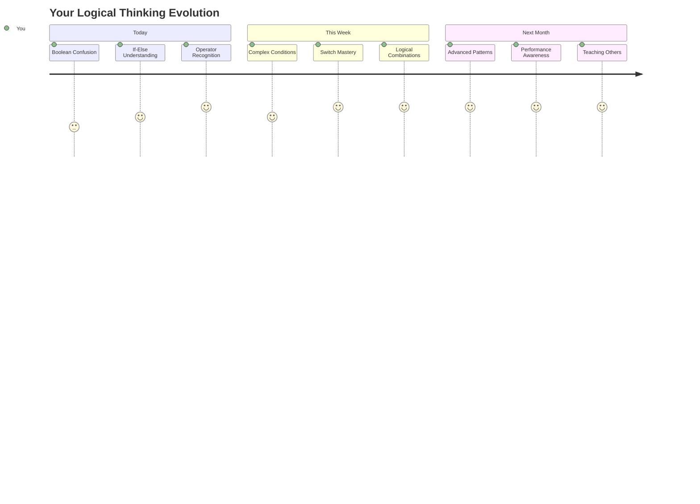

> 🧠 **तुम्ही डिजिटल निर्णय घेण्याच्या कलेत प्रभुत्व मिळवले आहे!** प्रत्येक परस्परसंवादी अॅप्लिकेशन वापरकर्त्याच्या कृती आणि बदलत्या परिस्थितींना हुशारीने प्रतिसाद देण्यासाठी सशर्त लॉजिकवर अवलंबून असते. तुम्हाला आता तुमचे प्रोग्राम विचार करण्यासाठी, मूल्यांकन करण्यासाठी आणि योग्य प्रतिसाद निवडण्यासाठी कसे बनवायचे हे समजले आहे. ही लॉजिकल पायाभूत सुविधा तुम्ही तयार केलेल्या प्रत्येक डायनॅमिक अॅप्लिकेशनला शक्ती देईल! 🎉

---

**अस्वीकरण**:  
हा दस्तऐवज AI भाषांतर सेवा [Co-op Translator](https://github.com/Azure/co-op-translator) वापरून भाषांतरित करण्यात आला आहे. आम्ही अचूकतेसाठी प्रयत्नशील असलो तरी, कृपया लक्षात ठेवा की स्वयंचलित भाषांतरे त्रुटी किंवा अचूकतेच्या अभावाने युक्त असू शकतात. मूळ भाषेतील दस्तऐवज हा अधिकृत स्रोत मानला जावा. महत्त्वाच्या माहितीसाठी, व्यावसायिक मानवी भाषांतराची शिफारस केली जाते. या भाषांतराचा वापर करून झालेल्या कोणत्याही गैरसमज किंवा चुकीच्या अर्थासाठी आम्ही जबाबदार राहणार नाही.