<!--
CO_OP_TRANSLATOR_METADATA:
{
  "original_hash": "1710a50a519a6e4a1b40a5638783018d",
  "translation_date": "2025-11-03T14:14:30+00:00",
  "source_file": "2-js-basics/4-arrays-loops/README.md",
  "language_code": "mr"
}
-->
# JavaScript मूलभूत गोष्टी: Arrays आणि Loops


> स्केच नोट [Tomomi Imura](https://twitter.com/girlie_mac) यांनी तयार केले

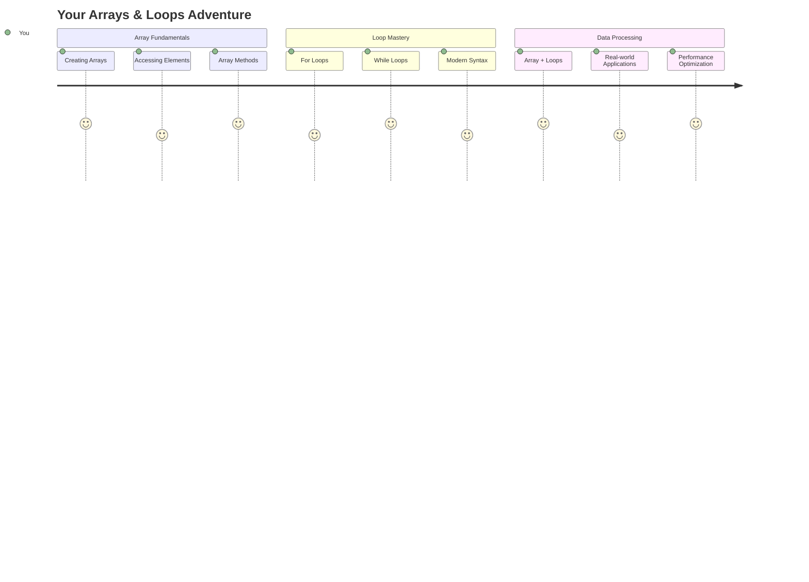

## व्याख्यानपूर्व प्रश्नमंजुषा
[व्याख्यानपूर्व प्रश्नमंजुषा](https://ff-quizzes.netlify.app/web/quiz/13)

कधी विचार केला आहे की वेबसाइट्स शॉपिंग कार्ट आयटम कसे ट्रॅक करतात किंवा तुमची मित्र यादी कशी दाखवतात? यासाठी arrays आणि loops उपयोगी ठरतात. Arrays म्हणजे डिजिटल कंटेनर आहेत जे अनेक माहितीचे तुकडे ठेवतात, तर loops तुम्हाला ती माहिती कार्यक्षमतेने हाताळण्यास मदत करतात, पुनरावृत्ती कोडशिवाय.

एकत्रितपणे, हे दोन संकल्पना तुमच्या प्रोग्राम्समध्ये माहिती हाताळण्यासाठी पाया तयार करतात. तुम्ही प्रत्येक पायरी मॅन्युअली लिहिण्यापासून स्मार्ट, कार्यक्षम कोड तयार करण्याकडे जाल, जो शेकडो किंवा हजारो आयटम जलद प्रक्रिया करू शकतो.

या धड्याच्या शेवटी, तुम्ही काही ओळींच्या कोडसह जटिल डेटा कार्ये कशी साध्य करायची ते समजून घ्याल. चला या महत्त्वाच्या प्रोग्रामिंग संकल्पनांचा अभ्यास करूया.

[](https://youtube.com/watch?v=1U4qTyq02Xw "Arrays")

[](https://www.youtube.com/watch?v=Eeh7pxtTZ3k "Loops")

> 🎥 वरच्या प्रतिमांवर क्लिक करा arrays आणि loops बद्दल व्हिडिओसाठी.

> तुम्ही हा धडा [Microsoft Learn](https://docs.microsoft.com/learn/modules/web-development-101-arrays/?WT.mc_id=academic-77807-sagibbon) वर घेऊ शकता!

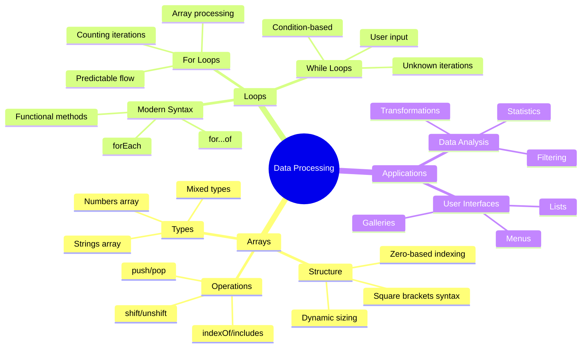

## Arrays

Arrays म्हणजे डिजिटल फाइलिंग कॅबिनेटसारखे - एका ड्रॉवरमध्ये एक दस्तऐवज साठवण्याऐवजी, तुम्ही एकाच संरचित कंटेनरमध्ये अनेक संबंधित आयटम व्यवस्थित करू शकता. प्रोग्रामिंगच्या दृष्टीने, arrays तुम्हाला अनेक माहितीचे तुकडे एका व्यवस्थित पॅकेजमध्ये साठवण्याची परवानगी देतात.

तुम्ही फोटो गॅलरी तयार करत असाल, टू-डू लिस्ट व्यवस्थापित करत असाल किंवा गेममध्ये उच्च स्कोर्स ट्रॅक करत असाल, arrays डेटा संघटनासाठी पाया प्रदान करतात. चला ते कसे कार्य करतात ते पाहूया.

✅ Arrays सर्वत्र आहेत! तुम्ही arrays चा वास्तविक जीवनातील उदाहरण विचार करू शकता का, जसे की सौर पॅनेल array?

### Arrays तयार करणे

Array तयार करणे खूप सोपे आहे - फक्त चौकोनी कंस वापरा!

```javascript
// Empty array - like an empty shopping cart waiting for items
const myArray = [];
```

**इथे काय घडत आहे?**
तुम्ही चौकोनी कंस `[]` वापरून एक रिकामे कंटेनर तयार केले आहे. याचा विचार रिकाम्या लायब्ररी शेल्फसारखा करा - ते तुम्हाला हवे असलेले कोणतेही पुस्तक व्यवस्थित ठेवण्यासाठी तयार आहे.

तुम्ही तुमच्या array ला सुरुवातीपासूनच प्रारंभिक मूल्ये भरून देखील तयार करू शकता:

```javascript
// Your ice cream shop's flavor menu
const iceCreamFlavors = ["Chocolate", "Strawberry", "Vanilla", "Pistachio", "Rocky Road"];

// A user's profile info (mixing different types of data)
const userData = ["John", 25, true, "developer"];

// Test scores for your favorite class
const scores = [95, 87, 92, 78, 85];
```

**थंड गोष्टी लक्षात ठेवा:**
- तुम्ही एकाच array मध्ये मजकूर, संख्या किंवा अगदी true/false मूल्ये साठवू शकता
- प्रत्येक आयटमला अल्पविरामाने वेगळे करा - सोपे!
- संबंधित माहिती एकत्र ठेवण्यासाठी arrays योग्य आहेत

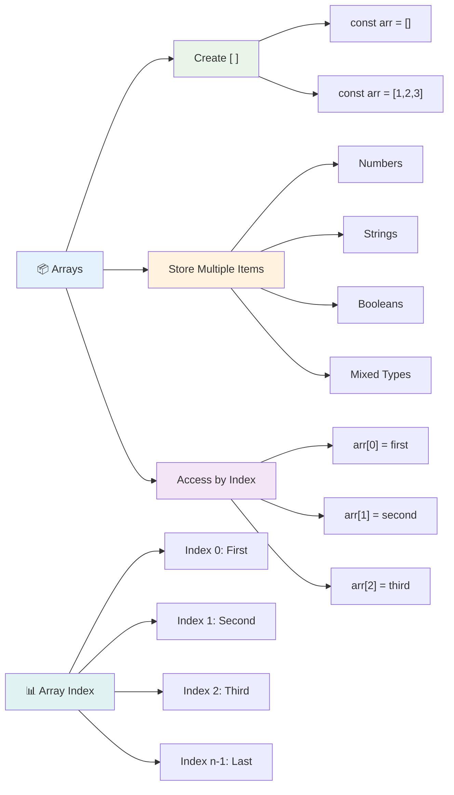

### Array Indexing

इथे काहीतरी असामान्य वाटू शकते: arrays त्यांच्या आयटम्सची संख्या 0 पासून सुरू करतात, 1 पासून नाही. ही zero-based indexing संगणक मेमरी कशी कार्य करते याच्या मुळाशी आहे - प्रोग्रामिंग भाषांमध्ये C सारख्या सुरुवातीच्या दिवसांपासून ही एक परंपरा आहे. Array मधील प्रत्येक जागेला **index** नावाचा स्वतःचा पत्ता क्रमांक मिळतो.

| Index | Value | वर्णन |
|-------|-------|-------------|
| 0 | "Chocolate" | पहिला घटक |
| 1 | "Strawberry" | दुसरा घटक |
| 2 | "Vanilla" | तिसरा घटक |
| 3 | "Pistachio" | चौथा घटक |
| 4 | "Rocky Road" | पाचवा घटक |

✅ तुम्हाला आश्चर्य वाटते का की arrays 0 index पासून सुरू होतात? काही प्रोग्रामिंग भाषांमध्ये indexes 1 पासून सुरू होतात. यामागे एक मनोरंजक इतिहास आहे, जो तुम्ही [Wikipedia वर वाचू शकता](https://en.wikipedia.org/wiki/Zero-based_numbering).

**Array घटकांमध्ये प्रवेश करणे:**

```javascript
const iceCreamFlavors = ["Chocolate", "Strawberry", "Vanilla", "Pistachio", "Rocky Road"];

// Access individual elements using bracket notation
console.log(iceCreamFlavors[0]); // "Chocolate" - first element
console.log(iceCreamFlavors[2]); // "Vanilla" - third element
console.log(iceCreamFlavors[4]); // "Rocky Road" - last element
```

**इथे काय घडते ते समजून घ्या:**
- **वापरते** square bracket notation index क्रमांकासह घटकांमध्ये प्रवेश करण्यासाठी
- **परत करते** त्या विशिष्ट स्थानावर साठवलेले मूल्य
- **सुरू करते** 0 पासून मोजणे, पहिला घटक index 0 बनवणे

**Array घटक बदलणे:**

```javascript
// Change an existing value
iceCreamFlavors[4] = "Butter Pecan";
console.log(iceCreamFlavors[4]); // "Butter Pecan"

// Add a new element at the end
iceCreamFlavors[5] = "Cookie Dough";
console.log(iceCreamFlavors[5]); // "Cookie Dough"
```

**वर दिलेल्या उदाहरणात, आम्ही:**
- **बदलले** index 4 वरील घटक "Rocky Road" वरून "Butter Pecan" मध्ये
- **जोडले** नवीन घटक "Cookie Dough" index 5 वर
- **स्वतःहून वाढवले** array लांबी जेव्हा विद्यमान मर्यादेपेक्षा जास्त जोडले

### Array लांबी आणि सामान्य पद्धती

Arrays मध्ये अंगभूत गुणधर्म आणि पद्धती असतात जे डेटा हाताळणे खूप सोपे करतात.

**Array लांबी शोधणे:**

```javascript
const iceCreamFlavors = ["Chocolate", "Strawberry", "Vanilla", "Pistachio", "Rocky Road"];
console.log(iceCreamFlavors.length); // 5

// Length updates automatically as array changes
iceCreamFlavors.push("Mint Chip");
console.log(iceCreamFlavors.length); // 6
```

**लक्षात ठेवण्याचे महत्त्वाचे मुद्दे:**
- **परत करते** array मधील एकूण घटकांची संख्या
- **स्वतःहून अपडेट होते** जेव्हा घटक जोडले किंवा काढले जातात
- **प्रदान करते** loops आणि validation साठी एक गतिशील संख्या

**महत्त्वाच्या Array पद्धती:**

```javascript
const fruits = ["apple", "banana", "orange"];

// Add elements
fruits.push("grape");           // Adds to end: ["apple", "banana", "orange", "grape"]
fruits.unshift("strawberry");   // Adds to beginning: ["strawberry", "apple", "banana", "orange", "grape"]

// Remove elements
const lastFruit = fruits.pop();        // Removes and returns "grape"
const firstFruit = fruits.shift();     // Removes and returns "strawberry"

// Find elements
const index = fruits.indexOf("banana"); // Returns 1 (position of "banana")
const hasApple = fruits.includes("apple"); // Returns true
```

**या पद्धती समजून घ्या:**
- **जोडते** घटक `push()` (शेवटी) आणि `unshift()` (सुरुवातीला) सह
- **काढते** घटक `pop()` (शेवटी) आणि `shift()` (सुरुवातीला) सह
- **शोधते** घटक `indexOf()` सह आणि अस्तित्व तपासते `includes()` सह
- **परत करते** उपयुक्त मूल्ये जसे की काढलेले घटक किंवा स्थान क्रमांक

✅ स्वतः प्रयत्न करा! तुमच्या ब्राउझरच्या कन्सोलमध्ये स्वतः तयार केलेल्या array वर प्रक्रिया करा.

### 🧠 **Array मूलभूत गोष्टी तपासणी: तुमचा डेटा व्यवस्थित करणे**

**तुमच्या array समज तपासा:**
- तुम्हाला का वाटते की arrays 0 पासून मोजायला सुरुवात करतात, 1 पासून नाही?
- जर तुम्ही अस्तित्वात नसलेल्या index वर प्रवेश करण्याचा प्रयत्न केला (जसे की `arr[100]` एका 5-घटकांच्या array मध्ये) तर काय होते?
- तुम्ही arrays च्या उपयोगासाठी तीन वास्तविक जीवनातील परिस्थिती विचार करू शकता का?

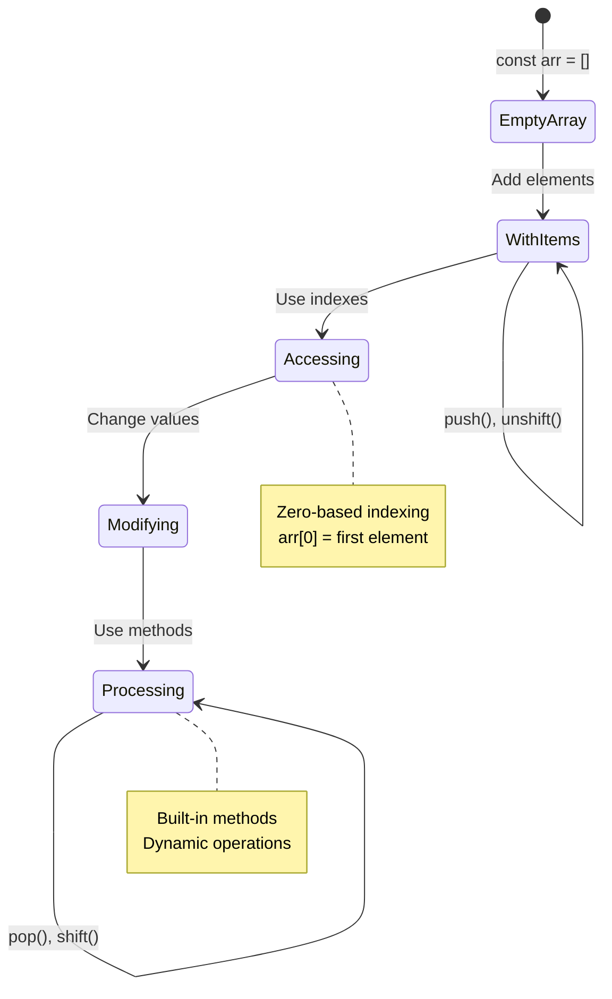

> **वास्तविक जगातील अंतर्दृष्टी**: प्रोग्रामिंगमध्ये arrays सर्वत्र आहेत! सोशल मीडिया फीड्स, शॉपिंग कार्ट्स, फोटो गॅलरी, प्लेलिस्ट गाणी - ते सर्व arrays आहेत!

## Loops

चार्ल्स डिकन्सच्या कादंबऱ्यांमधील प्रसिद्ध शिक्षा विचार करा जिथे विद्यार्थ्यांना स्लेटवर ओळी वारंवार लिहाव्या लागायच्या. कल्पना करा की तुम्ही कोणाला "ही वाक्ये 100 वेळा लिहा" असे सांगू शकता आणि ते आपोआप पूर्ण होईल. Loops तुमच्या कोडसाठी हेच करतात.

Loops म्हणजे एक tireless सहायक आहे जो कार्ये पुनरावृत्तीशिवाय अचूकपणे करू शकतो. तुम्हाला शॉपिंग कार्टमधील प्रत्येक आयटम तपासायचा असेल किंवा अल्बममधील सर्व फोटो दाखवायचे असतील, loops पुनरावृत्ती कार्यक्षमतेने हाताळतात.

JavaScript अनेक प्रकारचे loops प्रदान करते. प्रत्येक प्रकार तपासूया आणि ते कधी वापरायचे ते समजून घेऊया.

```mermaid
flowchart TD
    A["🔄 Loop Types"] --> B["For Loop"]
    A --> C["While Loop"]
    A --> D["For...of Loop"]
    A --> E["forEach Method"]
    
    B --> B1["Known iterations"]
    B --> B2["Counter-based"]
    B --> B3["for(init; condition; increment)"]
    
    C --> C1["Unknown iterations"]
    C --> C2["Condition-based"]
    C --> C3["while(condition)"]
    
    D --> D1["Modern ES6+"]
    D --> D2["Array iteration"]
    D --> D3["for(item of array)"]
    
    E --> E1["Functional style"]
    E --> E2["Array method"]
    E --> E3["array.forEach(callback)"]
    
    F["⏰ When to Use"] --> F1["For: Counting, indexes"]
    F --> F2["While: User input, searching"]
    F --> F3["For...of: Simple iteration"]
    F --> F4["forEach: Functional programming"]
    
    style A fill:#e3f2fd
    style B fill:#e8f5e8
    style C fill:#fff3e0
    style D fill:#f3e5f5
    style E fill:#e0f2f1
    style F fill:#fce4ec
```

### For Loop

`for` loop म्हणजे टाइमर सेट करणे - तुम्हाला नक्की किती वेळा काहीतरी घडायचे आहे ते माहित आहे. हे खूप व्यवस्थित आणि अंदाजानुसार आहे, जेव्हा तुम्ही arrays सह काम करत असता किंवा गोष्टी मोजण्याची गरज असते तेव्हा ते परिपूर्ण बनते.

**For Loop संरचना:**

| घटक | उद्देश | उदाहरण |
|-----------|---------|----------|
| **Initialization** | सुरुवातीचा बिंदू सेट करते | `let i = 0` |
| **Condition** | कधी सुरू ठेवायचे | `i < 10` |
| **Increment** | कसे अपडेट करायचे | `i++` |

```javascript
// Counting from 0 to 9
for (let i = 0; i < 10; i++) {
  console.log(`Count: ${i}`);
}

// More practical example: processing scores
const testScores = [85, 92, 78, 96, 88];
for (let i = 0; i < testScores.length; i++) {
  console.log(`Student ${i + 1}: ${testScores[i]}%`);
}
```

**पायरी-पायरीने, इथे काय घडत आहे:**
- **सुरुवात करते** counter variable `i` ला 0 वर सेट करून
- **तपासते** condition `i < 10` प्रत्येक iteration च्या आधी
- **अंमलात आणते** code block जेव्हा condition true असते
- **वाढवते** `i` प्रत्येक iteration नंतर 1 ने `i++` सह
- **थांबते** जेव्हा condition false होते (जेव्हा `i` 10 वर पोहोचते)

✅ हा कोड ब्राउझर कन्सोलमध्ये चालवा. Counter, condition किंवा iteration expression मध्ये छोटे बदल केल्यावर काय होते? तुम्ही ते उलट चालवू शकता का, countdown तयार करत?

### 🗓️ **For Loop मास्टरी तपासणी: नियंत्रित पुनरावृत्ती**

**तुमच्या for loop समज तपासा:**
- For loop चे तीन भाग कोणते आहेत आणि प्रत्येक भाग काय करतो?
- तुम्ही array मधून उलट कसे loop करू शकता?
- Increment भाग (`i++`) विसरल्यास काय होते?

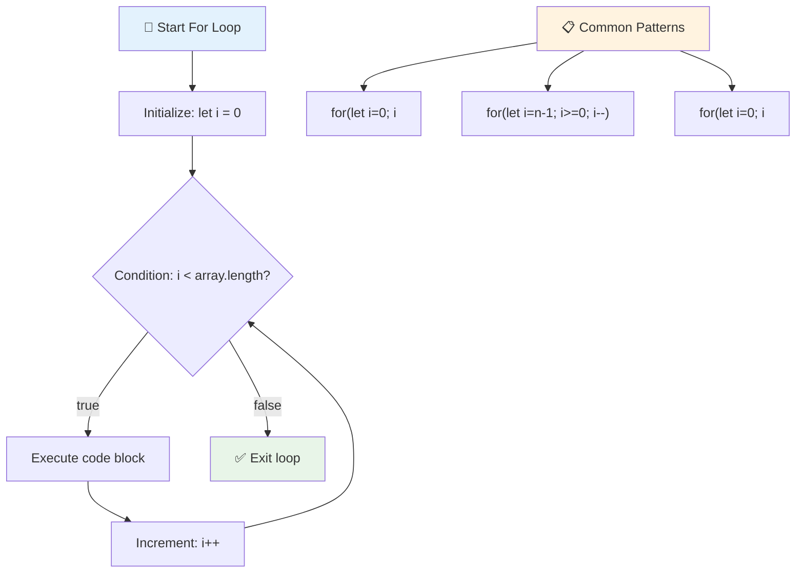

> **Loop ज्ञान**: For loops परिपूर्ण आहेत जेव्हा तुम्हाला नक्की किती वेळा काहीतरी पुनरावृत्ती करायचे आहे ते माहित असते. Array प्रक्रिया करण्यासाठी ते सर्वात सामान्य निवड आहेत!

### While Loop

`while` loop म्हणजे "हे करत रहा जोपर्यंत..." - तुम्हाला नक्की किती वेळा ते चालेल हे माहित नसते, पण तुम्हाला कधी थांबायचे आहे ते माहित असते. हे अशा गोष्टींसाठी परिपूर्ण आहे जसे की वापरकर्त्याला आवश्यक इनपुट देईपर्यंत विचारणे किंवा तुम्हाला हवे असलेले डेटा शोधेपर्यंत शोधणे.

**While Loop वैशिष्ट्ये:**
- **सुरू ठेवते** condition true असताना अंमलात आणणे
- **मागणी करते** कोणत्याही counter variables चे मॅन्युअल व्यवस्थापन
- **तपासते** condition प्रत्येक iteration च्या आधी
- **धोक्याचा** सामना करते infinite loops चा जर condition कधी false होत नसेल

```javascript
// Basic counting example
let i = 0;
while (i < 10) {
  console.log(`While count: ${i}`);
  i++; // Don't forget to increment!
}

// More practical example: processing user input
let userInput = "";
let attempts = 0;
const maxAttempts = 3;

while (userInput !== "quit" && attempts < maxAttempts) {
  userInput = prompt(`Enter 'quit' to exit (attempt ${attempts + 1}):`);
  attempts++;
}

if (attempts >= maxAttempts) {
  console.log("Maximum attempts reached!");
}
```

**या उदाहरणे समजून घ्या:**
- **व्यवस्थापित करते** counter variable `i` loop body मध्ये मॅन्युअली
- **वाढवते** counter infinite loops टाळण्यासाठी
- **प्रात्यक्षिक देते** वापरकर्ता इनपुट आणि प्रयत्न मर्यादेसह व्यावहारिक उपयोग केस
- **सुरक्षितता यंत्रणा समाविष्ट करते** अंतहीन अंमलात टाळण्यासाठी

### ♾️ **While Loop ज्ञान तपासणी: Condition-Based पुनरावृत्ती**

**तुमच्या while loop समज तपासा:**
- While loops वापरताना मुख्य धोका काय आहे?
- तुम्ही for loop ऐवजी while loop कधी निवडाल?
- तुम्ही infinite loops कसे टाळू शकता?

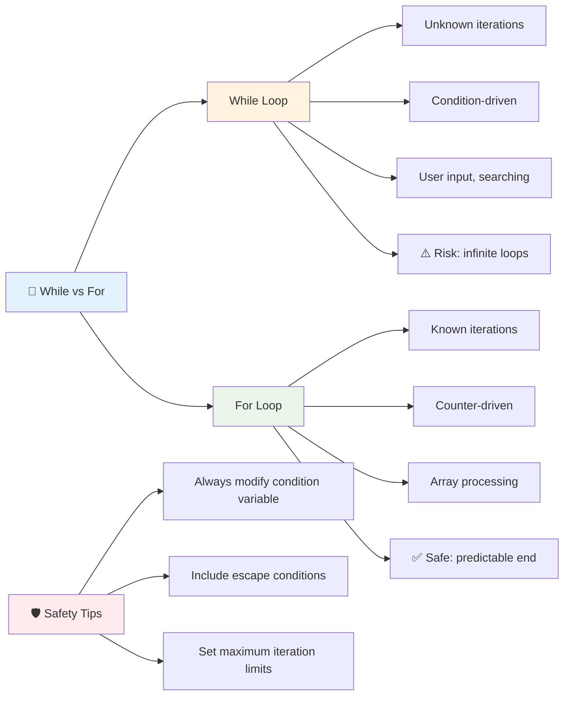

> **सुरक्षितता प्रथम**: While loops शक्तिशाली आहेत पण काळजीपूर्वक condition व्यवस्थापनाची आवश्यकता आहे. तुमचे loop condition शेवटी false होईल याची खात्री करा!

### आधुनिक Loop पर्याय

JavaScript आधुनिक loop syntax प्रदान करते जे तुमचा कोड अधिक वाचनीय आणि कमी त्रुटी-प्रवण बनवू शकतो.

**For...of Loop (ES6+):**

```javascript
const colors = ["red", "green", "blue", "yellow"];

// Modern approach - cleaner and safer
for (const color of colors) {
  console.log(`Color: ${color}`);
}

// Compare with traditional for loop
for (let i = 0; i < colors.length; i++) {
  console.log(`Color: ${colors[i]}`);
}
```

**For...of चे मुख्य फायदे:**
- **काढून टाकते** index व्यवस्थापन आणि संभाव्य off-by-one त्रुटी
- **प्रदान करते** array घटकांमध्ये थेट प्रवेश
- **सुधारते** कोड वाचनीयता आणि syntax जटिलता कमी करते

**forEach पद्धत:**

```javascript
const prices = [9.99, 15.50, 22.75, 8.25];

// Using forEach for functional programming style
prices.forEach((price, index) => {
  console.log(`Item ${index + 1}: $${price.toFixed(2)}`);
});

// forEach with arrow functions for simple operations
prices.forEach(price => console.log(`Price: $${price}`));
```

**forEach बद्दल तुम्हाला काय माहित असणे आवश्यक आहे:**
- **अंमलात आणते** प्रत्येक array घटकासाठी एक function
- **प्रदान करते** घटक मूल्य आणि index दोन्ही parameters म्हणून
- **थांबवू शकत नाही** लवकर (पारंपरिक loops च्या विपरीत)
- **परत करते** undefined (नवीन array तयार करत नाही)

✅ तुम्ही for loop vs. while loop का निवडाल? StackOverflow वर 17K दर्शकांना याच प्रश्नाचे उत्तर हवे होते, आणि काही मते [तुमच्यासाठी मनोरंजक असू शकतात](https://stackoverflow.com/questions/39969145/while-loops-vs-for-loops-in-javascript).

### 🎨 **आधुनिक Loop Syntax तपासणी: ES6+ स्वीकारणे**

**तुमच्या आधुनिक JavaScript समज तपासा:**
- पारंपरिक for loops च्या तुलनेत `for...of` चे फायदे काय आहेत?
- तुम्ही अजूनही पारंपरिक for loops का निवडाल?
- `forEach` आणि `map` मध्ये काय फरक आहे?

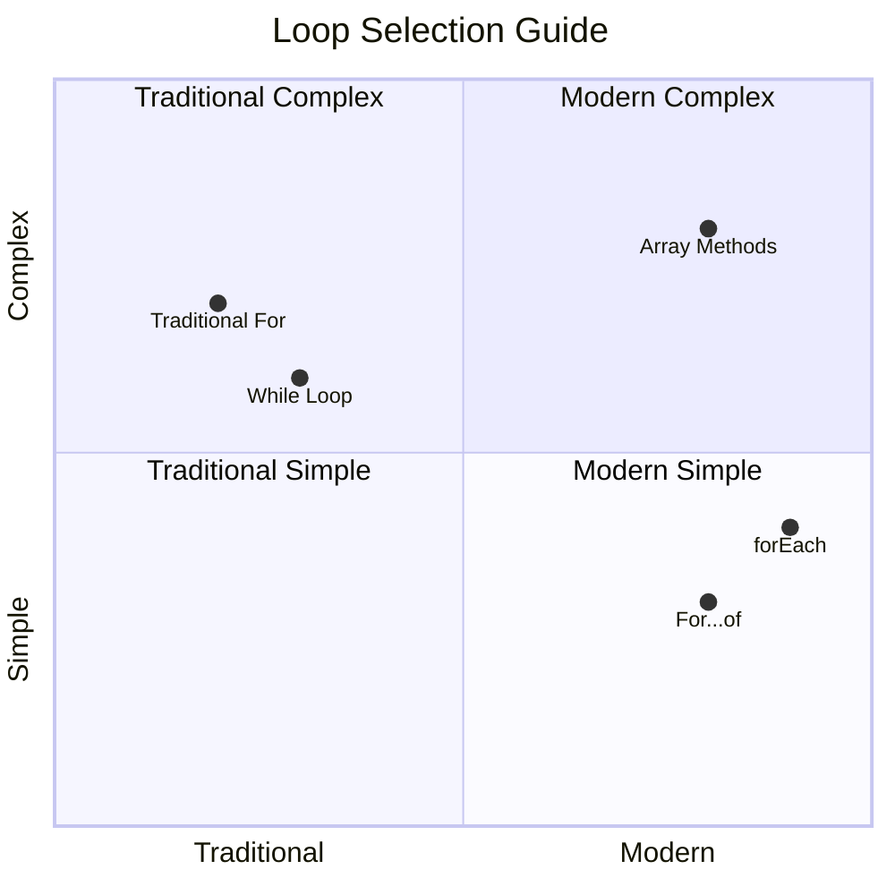

> **आधुनिक प्रवृत्ती**: ES6+ syntax जसे की `for...of` आणि `forEach` array iteration साठी प्राधान्य दिले जाते कारण ते स्वच्छ आणि कमी त्रुटी-प्रवण आहे!

## Loops आणि Arrays

Arrays सह loops एकत्र करणे शक्तिशाली डेटा प्रक्रिया क्षमता तयार करते. ही जोडणी अनेक प्रोग्रामिंग कार्यांसाठी मूलभूत आहे, यादी दाखवण्यापासून ते आकडेवारी मोजण्यापर्यंत.

**पारंपरिक Array प्रक्रिया:**

```javascript
const iceCreamFlavors = ["Chocolate", "Strawberry", "Vanilla", "Pistachio", "Rocky Road"];

// Classic for loop approach
for (let i = 0; i < iceCreamFlavors.length; i++) {
  console.log(`Flavor ${i + 1}: ${iceCreamFlavors[i]}`);
}

// Modern for...of approach
for (const flavor of iceCreamFlavors) {
  console.log(`Available flavor: ${flavor}`);
}
```

**प्रत्येक दृष्टिकोन समजून घ्या:**
- **वापरते** array लांबी गुणधर्म loop सीमा निश्चित करण्यासाठी
- **प्रवेश करते** घटक index द्वारे पारंपरिक for loops मध्ये
- **प्रदान करते** थेट घटक प्रवेश for...of loops मध्ये
- **प्रक्रिया करते** प्रत्येक array घटक एकदाच अचूकपणे

**व्यावहारिक डेटा प्रक्रिया उदाहरण:**

```javascript
const studentGrades = [85, 92, 78, 96, 88, 73, 89];
let total = 0;
let highestGrade = studentGrades[0];
let lowestGrade = studentGrades[0];

// Process all grades with a single loop
for (let i = 0; i < studentGrades.length; i++) {
  const grade = studentGrades[i];
  total += grade;
  
  if (grade > highestGrade) {
    highestGrade = grade;
  }
  
  if (grade < lowestGrade) {
    lowestGrade = grade;
  }
}

const average = total / studentGrades.length;
console.log(`Average: ${average.toFixed(1)}`);
console.log(`Highest: ${highestGrade}`);
console.log(`Lowest: ${lowestGrade}`);
```

**हा कोड कसा कार्य करतो:**
- **सुरुवात करते** sum आणि extremes साठी tracking variables
- **प्रक्रिया करते** प्रत्येक grade एकाच कार्यक्षम loop सह
- **संचयित करते** average calculation साठी एकूण
- **ट्रॅक करते** iteration दरम्यान उच्चतम आणि न्यूनतम मूल्ये
- **मोजते** अंतिम आकडेवारी loop पूर्ण झाल्यानंतर

✅ तुमच्या ब्राउझरच्या कन्सोलमध्ये स्वतः तयार केलेल्या array वर loop करून प्रयोग करा.

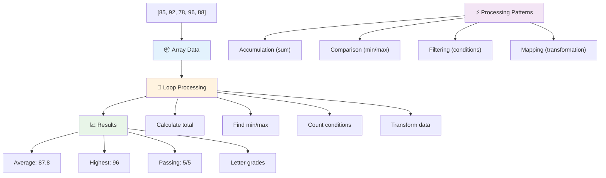

---

## GitHub Copilot Agent Challenge 🚀

Agent mode वापरून खालील challenge पूर्ण करा:

**वर्णन:** एक व्यापक डेटा प्रक्रिया function तयार करा जे arrays आणि loops एकत्र करून dataset चे विश्लेषण करते आणि अर्थपूर्ण अंतर्दृष्टी निर्माण करते.

**Prompt:** `analyzeGrades` नावाचे function तयार करा जे student grade objects च्या array (प्रत्येकात name आणि score गुणधर्म असतो) घेते आणि statistics सह object परत करते ज्यामध्ये उच्चतम score, न्यूनतम score, सरासरी score, पास झालेल्या विद्यार्थ्यांची संख्या (score >= 70), आणि सरासरीपेक्षा जास्त score असलेल्या विद्यार्थ्यांची नावे असलेला array समाविष्ट आहे. तुमच्या solution मध्ये किमान दोन वेगवेगळ्या loop प्रकारांचा वापर करा.

Agent mode बद्दल अधिक जाणून घ्या [इथे](https://code.visualstudio.com/blogs/2025/02/24/introducing-copilot-agent-mode).

## 🚀 Challenge
JavaScript अनेक आधुनिक array पद्धती प्रदान करते ज्या विशिष्ट कार्यांसाठी पारंपरिक loops ची जागा घेऊ शकतात. [forEach](https://developer.mozilla.org/docs/Web/JavaScript/Reference/Global_Objects/Array/forEach), [for-of](https://developer.mozilla.org/docs/Web/JavaScript/Reference/Statements/for...of), [map](https://developer.mozilla.org/docs/Web/JavaScript/Reference/Global_Objects/Array/map), [filter](https://developer.mozilla.org/docs/Web/JavaScript/Reference/Global_Objects/Array/filter), आणि [reduce](https://developer.mozilla.org/docs/Web/JavaScript/Reference/Global_Objects/Array/reduce) यांचा अभ्यास करा.

**तुमचं आव्हान:** कमीतकमी तीन वेगवेगळ्या array पद्धती वापरून विद्यार्थ्यांच्या गुणांचे उदाहरण पुन्हा लिहा. आधुनिक JavaScript सिंटॅक्ससह कोड किती स्वच्छ आणि वाचनीय होतो ते लक्षात घ्या.

## व्याख्यानानंतरचा क्विझ
[व्याख्यानानंतरचा क्विझ](https://ff-quizzes.netlify.app/web/quiz/14)

## पुनरावलोकन आणि स्व-अभ्यास

JavaScript मधील arrays मध्ये अनेक पद्धती असतात ज्या डेटा manipulation साठी अत्यंत उपयुक्त असतात. [या पद्धतींबद्दल वाचा](https://developer.mozilla.org/docs/Web/JavaScript/Reference/Global_Objects/Array) आणि तुमच्या स्वतःच्या array वर काही पद्धती (जसे की push, pop, slice आणि splice) वापरून पहा.

## असाइनमेंट

[Loop an Array](assignment.md)

---

## 📊 **तुमचं Arrays & Loops टूलकिट सारांश**

```mermaid
graph TD
    A["🎯 Arrays & Loops Mastery"] --> B["📦 Array Fundamentals"]
    A --> C["🔄 Loop Types"]
    A --> D["🔗 Data Processing"]
    A --> E["🎨 Modern Techniques"]
    
    B --> B1["Creation: [ ]"]
    B --> B2["Indexing: arr[0]"]
    B --> B3["Methods: push, pop"]
    B --> B4["Properties: length"]
    
    C --> C1["For: Known iterations"]
    C --> C2["While: Condition-based"]
    C --> C3["For...of: Direct access"]
    C --> C4["forEach: Functional"]
    
    D --> D1["Statistics calculation"]
    D --> D2["Data transformation"]
    D --> D3["Filtering & searching"]
    D --> D4["Real-time processing"]
    
    E --> E1["Arrow functions"]
    E --> E2["Method chaining"]
    E --> E3["Destructuring"]
    E --> E4["Template literals"]
    
    F["💡 Key Benefits"] --> F1["Efficient data handling"]
    F --> F2["Reduced code repetition"]
    F --> F3["Scalable solutions"]
    F --> F4["Cleaner syntax"]
    
    style A fill:#e3f2fd
    style B fill:#e8f5e8
    style C fill:#fff3e0
    style D fill:#f3e5f5
    style E fill:#e0f2f1
    style F fill:#fce4ec
```

---

## 🚀 तुमचं Arrays & Loops मास्टरी टाइमलाइन

### ⚡ **पुढील ५ मिनिटांत तुम्ही काय करू शकता**
- [ ] तुमच्या आवडत्या चित्रपटांचा एक array तयार करा आणि विशिष्ट घटक access करा
- [ ] १ ते १० पर्यंत मोजणारा एक for loop लिहा
- [ ] व्याख्यानातील आधुनिक array पद्धतींचं आव्हान पूर्ण करा
- [ ] तुमच्या ब्राउझर कन्सोलमध्ये array indexing सराव करा

### 🎯 **तुमच्या एका तासात साध्य होणाऱ्या गोष्टी**
- [ ] व्याख्यानानंतरचा क्विझ पूर्ण करा आणि कोणतेही आव्हानात्मक संकल्पना पुनरावलोकन करा
- [ ] GitHub Copilot चॅलेंजमधील comprehensive grade analyzer तयार करा
- [ ] एक साधा shopping cart तयार करा जो वस्तू add आणि remove करतो
- [ ] वेगवेगळ्या loop प्रकारांमध्ये रूपांतर करण्याचा सराव करा
- [ ] `push`, `pop`, `slice`, आणि `splice` सारख्या array पद्धतींचा प्रयोग करा

### 📅 **तुमचा आठवडाभराचा डेटा प्रोसेसिंग प्रवास**
- [ ] "Loop an Array" असाइनमेंट क्रिएटिव enhancements सह पूर्ण करा
- [ ] arrays आणि loops वापरून एक to-do list application तयार करा
- [ ] संख्यात्मक डेटासाठी एक साधा statistics calculator तयार करा
- [ ] [MDN array पद्धती](https://developer.mozilla.org/docs/Web/JavaScript/Reference/Global_Objects/Array) वापरून सराव करा
- [ ] एक photo gallery किंवा music playlist interface तयार करा
- [ ] `map`, `filter`, आणि `reduce` सह functional programming चा अभ्यास करा

### 🌟 **तुमचा महिनाभराचा परिवर्तन**
- [ ] प्रगत array ऑपरेशन्स आणि कार्यक्षमता ऑप्टिमायझेशनमध्ये प्रावीण्य मिळवा
- [ ] एक पूर्ण डेटा व्हिज्युअलायझेशन डॅशबोर्ड तयार करा
- [ ] डेटा प्रोसेसिंगसाठी ओपन सोर्स प्रोजेक्ट्समध्ये योगदान द्या
- [ ] व्यावहारिक उदाहरणांसह कोणाला तरी arrays आणि loops बद्दल शिकवा
- [ ] पुन्हा वापरता येणाऱ्या डेटा प्रोसेसिंग फंक्शन्सची वैयक्तिक लायब्ररी तयार करा
- [ ] arrays वर आधारित अल्गोरिदम आणि डेटा स्ट्रक्चर्सचा अभ्यास करा

### 🏆 **अंतिम डेटा प्रोसेसिंग चॅम्पियन चेक-इन**

**तुमच्या array आणि loop प्रावीण्याचा उत्सव साजरा करा:**
- वास्तविक जगातील अनुप्रयोगांसाठी तुम्हाला शिकलेली सर्वात उपयुक्त array ऑपरेशन कोणती आहे?
- कोणता loop प्रकार तुम्हाला सर्वात नैसर्गिक वाटतो आणि का?
- arrays आणि loops समजून घेतल्यामुळे डेटा आयोजित करण्याच्या तुमच्या दृष्टिकोनात कसा बदल झाला आहे?
- पुढे कोणते जटिल डेटा प्रोसेसिंग कार्य तुम्ही हाताळू इच्छिता?

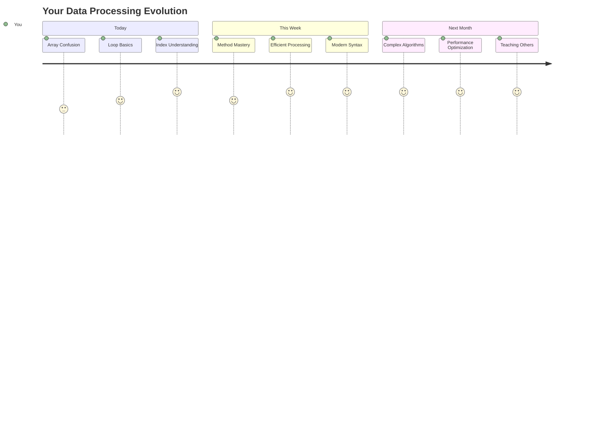

> 📦 **तुम्ही डेटा आयोजित करण्याची आणि प्रोसेसिंगची ताकद अनलॉक केली आहे!** Arrays आणि loops हे तुम्ही कधीही तयार कराल अशा जवळजवळ प्रत्येक अनुप्रयोगाचा पाया आहेत. साध्या यादींपासून ते जटिल डेटा विश्लेषणापर्यंत, माहिती कार्यक्षमतेने आणि सुंदरपणे हाताळण्यासाठी तुमच्याकडे आता साधने आहेत. प्रत्येक डायनॅमिक वेबसाइट, मोबाइल अॅप, आणि डेटा-ड्रिव्हन अनुप्रयोग या मूलभूत संकल्पनांवर अवलंबून असतो. स्केलेबल डेटा प्रोसेसिंगच्या जगात तुमचं स्वागत आहे! 🎉

---

**अस्वीकरण**:  
हा दस्तऐवज AI भाषांतर सेवा [Co-op Translator](https://github.com/Azure/co-op-translator) वापरून भाषांतरित करण्यात आला आहे. आम्ही अचूकतेसाठी प्रयत्नशील असलो तरी, कृपयास लक्षात ठेवा की स्वयंचलित भाषांतरे त्रुटी किंवा अचूकतेच्या अभावाने युक्त असू शकतात. मूळ भाषेतील दस्तऐवज हा अधिकृत स्रोत मानला जावा. महत्त्वाच्या माहितीसाठी, व्यावसायिक मानवी भाषांतराची शिफारस केली जाते. या भाषांतराचा वापर करून उद्भवलेल्या कोणत्याही गैरसमज किंवा चुकीच्या अर्थासाठी आम्ही जबाबदार राहणार नाही.