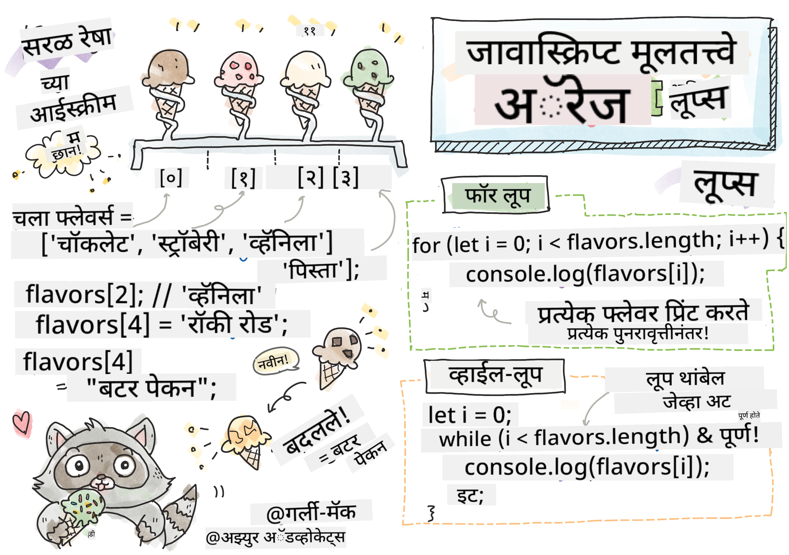

<!--
CO_OP_TRANSLATOR_METADATA:
{
  "original_hash": "9197f8af0fef9be6e81d4dbda23c7e7d",
  "translation_date": "2025-10-22T15:48:19+00:00",
  "source_file": "2-js-basics/4-arrays-loops/README.md",
  "language_code": "mr"
}
-->
# जावास्क्रिप्ट मूलभूत गोष्टी: ऍरे आणि लूप्स


> स्केच नोट [Tomomi Imura](https://twitter.com/girlie_mac) यांच्याकडून

## व्याख्यानपूर्व प्रश्नमंजुषा
[व्याख्यानपूर्व प्रश्नमंजुषा](https://ff-quizzes.netlify.app/web/quiz/13)

कधी विचार केला आहे का की वेबसाइट्स शॉपिंग कार्ट आयटम्स कसे ट्रॅक करतात किंवा तुमची मित्र यादी कशी दाखवतात? यासाठी ऍरे आणि लूप्स उपयोगी ठरतात. ऍरे म्हणजे डिजिटल कंटेनर ज्यामध्ये अनेक माहितीचे तुकडे साठवता येतात, तर लूप्स तुम्हाला ती माहिती कार्यक्षमतेने हाताळण्याची परवानगी देतात, पुनरावृत्ती कोड न वापरता.

हे दोन संकल्पना एकत्र येऊन तुमच्या प्रोग्राम्समध्ये माहिती हाताळण्यासाठीचा पाया तयार करतात. तुम्ही प्रत्येक पायरी मॅन्युअली लिहिण्यापासून ते शेकडो किंवा हजारो आयटम्स जलद प्रक्रिया करण्यासाठी स्मार्ट, कार्यक्षम कोड तयार करण्यापर्यंत पोहोचाल.

या धड्याच्या शेवटी, तुम्ही काही ओळींच्या कोडसह जटिल डेटा कार्ये कशी साध्य करायची ते समजून घ्याल. चला या महत्त्वाच्या प्रोग्रामिंग संकल्पनांचा अभ्यास करूया.

[](https://youtube.com/watch?v=1U4qTyq02Xw "ऍरे")

[](https://www.youtube.com/watch?v=Eeh7pxtTZ3k "लूप्स")

> 🎥 वरील प्रतिमांवर क्लिक करा ऍरे आणि लूप्सबद्दल व्हिडिओ पाहण्यासाठी.

> तुम्ही हा धडा [Microsoft Learn](https://docs.microsoft.com/learn/modules/web-development-101-arrays/?WT.mc_id=academic-77807-sagibbon) वर घेऊ शकता!

## ऍरे

ऍरे म्हणजे डिजिटल फाइलिंग कॅबिनेटसारखे - एका ड्रॉवरमध्ये एक दस्तऐवज साठवण्याऐवजी, तुम्ही एकाच संरचित कंटेनरमध्ये अनेक संबंधित आयटम्स व्यवस्थित करू शकता. प्रोग्रामिंगच्या दृष्टीने, ऍरे तुम्हाला अनेक माहितीचे तुकडे एका पॅकेजमध्ये साठवण्याची परवानगी देतात.

तुम्ही फोटो गॅलरी तयार करत असाल, टू-डू लिस्ट व्यवस्थापित करत असाल किंवा गेममध्ये उच्च स्कोर्स ट्रॅक करत असाल, ऍरे डेटा संघटनासाठी पाया प्रदान करतात. चला ते कसे कार्य करतात ते पाहूया.

✅ ऍरे सर्वत्र आहेत! तुम्ही ऍरेचा वास्तविक जीवनातील उदाहरण विचार करू शकता का, जसे की सौर पॅनेल ऍरे?

### ऍरे तयार करणे

ऍरे तयार करणे खूप सोपे आहे - फक्त चौकोनी कंस वापरा!

```javascript
// Empty array - like an empty shopping cart waiting for items
const myArray = [];
```

**इथे काय घडत आहे?**
तुम्ही फक्त चौकोनी कंस `[]` वापरून रिकामे कंटेनर तयार केले आहे. याचा विचार रिकाम्या लायब्ररी शेल्फसारखा करा - ते तुम्हाला हवे असलेले कोणतेही पुस्तक व्यवस्थित ठेवण्यासाठी तयार आहे.

तुम्ही सुरुवातीपासूनच तुमच्या ऍरेमध्ये प्रारंभिक मूल्ये भरू शकता:

```javascript
// Your ice cream shop's flavor menu
const iceCreamFlavors = ["Chocolate", "Strawberry", "Vanilla", "Pistachio", "Rocky Road"];

// A user's profile info (mixing different types of data)
const userData = ["John", 25, true, "developer"];

// Test scores for your favorite class
const scores = [95, 87, 92, 78, 85];
```

**थंड गोष्टी लक्षात ठेवा:**
- तुम्ही एकाच ऍरेमध्ये मजकूर, संख्या किंवा खरे/खोटे मूल्ये साठवू शकता
- प्रत्येक आयटमला अल्पविरामाने वेगळे करा - सोपे!
- संबंधित माहिती एकत्र ठेवण्यासाठी ऍरे योग्य आहेत

### ऍरे इंडेक्सिंग

इथे काहीतरी असामान्य वाटू शकते: ऍरे त्यांच्या आयटम्सची संख्या 0 पासून सुरू करतात, 1 पासून नाही. ही शून्य-आधारित इंडेक्सिंग संगणक मेमरी कशी कार्य करते याच्या मुळाशी आहे - प्रोग्रामिंग भाषांमध्ये जसे की C मध्ये सुरुवातीपासूनच ही पद्धत आहे. ऍरेमधील प्रत्येक जागेला **इंडेक्स** नावाचा स्वतःचा पत्ता क्रमांक मिळतो.

| इंडेक्स | मूल्य | वर्णन |
|-------|-------|-------------|
| 0 | "चॉकलेट" | पहिला घटक |
| 1 | "स्ट्रॉबेरी" | दुसरा घटक |
| 2 | "व्हॅनिला" | तिसरा घटक |
| 3 | "पिस्ता" | चौथा घटक |
| 4 | "रॉकी रोड" | पाचवा घटक |

✅ तुम्हाला आश्चर्य वाटते का की ऍरे शून्य इंडेक्सपासून सुरू होतात? काही प्रोग्रामिंग भाषांमध्ये इंडेक्स 1 पासून सुरू होतो. यामागे एक मनोरंजक इतिहास आहे, जो तुम्ही [विकिपीडियावर वाचू शकता](https://en.wikipedia.org/wiki/Zero-based_numbering).

**ऍरे घटकांमध्ये प्रवेश करणे:**

```javascript
const iceCreamFlavors = ["Chocolate", "Strawberry", "Vanilla", "Pistachio", "Rocky Road"];

// Access individual elements using bracket notation
console.log(iceCreamFlavors[0]); // "Chocolate" - first element
console.log(iceCreamFlavors[2]); // "Vanilla" - third element
console.log(iceCreamFlavors[4]); // "Rocky Road" - last element
```

**इथे काय घडते ते समजून घ्या:**
- **वापरते** चौकोनी कंस नोटेशनसह इंडेक्स क्रमांक घटकांमध्ये प्रवेश करण्यासाठी
- **परत करते** त्या विशिष्ट स्थानावर साठवलेले मूल्य
- **सुरू करते** 0 पासून मोजणे, ज्यामुळे पहिला घटक इंडेक्स 0 बनतो

**ऍरे घटक बदलणे:**

```javascript
// Change an existing value
iceCreamFlavors[4] = "Butter Pecan";
console.log(iceCreamFlavors[4]); // "Butter Pecan"

// Add a new element at the end
iceCreamFlavors[5] = "Cookie Dough";
console.log(iceCreamFlavors[5]); // "Cookie Dough"
```

**वरील उदाहरणात आम्ही:**
- **बदलले** इंडेक्स 4 वरील घटक "रॉकी रोड" ते "बटर पेकन"
- **जोडले** नवीन घटक "कुकी डो" इंडेक्स 5 वर
- **स्वतःहून वाढवले** ऍरेची लांबी जेव्हा विद्यमान मर्यादेपलीकडे आयटम जोडले

### ऍरेची लांबी आणि सामान्य पद्धती

ऍरेमध्ये अंगभूत गुणधर्म आणि पद्धती असतात ज्यामुळे डेटा हाताळणे खूप सोपे होते.

**ऍरेची लांबी शोधणे:**

```javascript
const iceCreamFlavors = ["Chocolate", "Strawberry", "Vanilla", "Pistachio", "Rocky Road"];
console.log(iceCreamFlavors.length); // 5

// Length updates automatically as array changes
iceCreamFlavors.push("Mint Chip");
console.log(iceCreamFlavors.length); // 6
```

**लक्षात ठेवण्याचे महत्त्वाचे मुद्दे:**
- **परत करते** ऍरेमधील एकूण घटकांची संख्या
- **स्वतःहून अपडेट होते** जेव्हा घटक जोडले किंवा काढले जातात
- **प्रदान करते** लूप्स आणि सत्यापनासाठी उपयुक्त गतिशील संख्या

**महत्त्वाच्या ऍरे पद्धती:**

```javascript
const fruits = ["apple", "banana", "orange"];

// Add elements
fruits.push("grape");           // Adds to end: ["apple", "banana", "orange", "grape"]
fruits.unshift("strawberry");   // Adds to beginning: ["strawberry", "apple", "banana", "orange", "grape"]

// Remove elements
const lastFruit = fruits.pop();        // Removes and returns "grape"
const firstFruit = fruits.shift();     // Removes and returns "strawberry"

// Find elements
const index = fruits.indexOf("banana"); // Returns 1 (position of "banana")
const hasApple = fruits.includes("apple"); // Returns true
```

**या पद्धती समजून घ्या:**
- **जोडते** घटक `push()` (शेवटी) आणि `unshift()` (सुरुवातीला)
- **काढते** घटक `pop()` (शेवटी) आणि `shift()` (सुरुवातीला)
- **शोधते** घटक `indexOf()` सह आणि अस्तित्व तपासते `includes()` सह
- **परत करते** उपयुक्त मूल्ये जसे की काढलेले घटक किंवा स्थान इंडेक्स

✅ स्वतः प्रयत्न करा! तुमच्या ब्राउझरच्या कन्सोलमध्ये ऍरे तयार करा आणि त्यावर प्रक्रिया करा.

## लूप्स

चार्ल्स डिकन्सच्या कादंबऱ्यांमधील प्रसिद्ध शिक्षा आठवा जिथे विद्यार्थ्यांना स्लेटवर ओळी वारंवार लिहाव्या लागायच्या. कल्पना करा की तुम्ही कोणाला "ही वाक्ये 100 वेळा लिहा" असे सांगू शकता आणि ते आपोआप पूर्ण होईल. लूप्स तुमच्या कोडसाठी हेच करतात.

लूप्स म्हणजे एक थकवा न जाणवणारा सहाय्यक जो कामे पुनरावृत्तीशिवाय अचूकपणे करू शकतो. तुम्हाला शॉपिंग कार्टमधील प्रत्येक आयटम तपासायचा असेल किंवा अल्बममधील सर्व फोटो दाखवायचे असतील, लूप्स ही पुनरावृत्ती कार्यक्षमतेने हाताळतात.

जावास्क्रिप्टमध्ये निवडण्यासाठी अनेक प्रकारचे लूप्स आहेत. प्रत्येक प्रकार कधी वापरायचा ते समजून घेऊया.

### फॉर लूप

`for` लूप म्हणजे टाइमर सेट करण्यासारखे आहे - तुम्हाला नक्की किती वेळा काहीतरी घडायला हवे आहे ते माहित आहे. हे खूप व्यवस्थित आणि अंदाजानुसार आहे, ज्यामुळे ते ऍरेसह काम करताना किंवा गोष्टी मोजण्याची आवश्यकता असताना योग्य बनते.

**फॉर लूप संरचना:**

| घटक | उद्देश | उदाहरण |
|-----------|---------|----------|
| **प्रारंभ** | सुरुवातीचा बिंदू सेट करते | `let i = 0` |
| **अट** | कधी सुरू ठेवायचे | `i < 10` |
| **वाढ** | कसे अपडेट करायचे | `i++` |

```javascript
// Counting from 0 to 9
for (let i = 0; i < 10; i++) {
  console.log(`Count: ${i}`);
}

// More practical example: processing scores
const testScores = [85, 92, 78, 96, 88];
for (let i = 0; i < testScores.length; i++) {
  console.log(`Student ${i + 1}: ${testScores[i]}%`);
}
```

**पायरी-पायरीने काय घडते ते येथे आहे:**
- **प्रारंभ करते** काउंटर व्हेरिएबल `i` 0 वर
- **तपासते** अट `i < 10` प्रत्येक पुनरावृत्तीपूर्वी
- **अंमलात आणते** कोड ब्लॉक जेव्हा अट खरी असते
- **वाढवते** `i` प्रत्येक पुनरावृत्तीनंतर `i++` सह
- **थांबते** जेव्हा अट खोटी होते (जेव्हा `i` 10 पोहोचते)

✅ हे कोड ब्राउझर कन्सोलमध्ये चालवा. काउंटर, अट किंवा पुनरावृत्ती अभिव्यक्तीमध्ये छोटे बदल केल्यावर काय होते? तुम्ही ते उलट चालवू शकता का, काउंटडाउन तयार करत?

### व्हाइल लूप

`while` लूप म्हणजे "हे करत रहा जोपर्यंत..." असे सांगण्यासारखे आहे - तुम्हाला नक्की किती वेळा ते चालेल हे माहित नसते, पण तुम्हाला कधी थांबायचे ते माहित असते. हे अशा गोष्टींसाठी योग्य आहे जसे की वापरकर्त्याने तुम्हाला आवश्यक असलेले इनपुट दिले नाही तोपर्यंत विचारणे किंवा तुम्हाला हवे असलेले डेटा शोधणे.

**व्हाइल लूप वैशिष्ट्ये:**
- **सुरू ठेवते** अट खरी असेपर्यंत अंमलात आणणे
- **आवश्यक आहे** कोणत्याही काउंटर व्हेरिएबल्सचे मॅन्युअल व्यवस्थापन
- **तपासते** अट प्रत्येक पुनरावृत्तीपूर्वी
- **जोखीम** घेते अनंत लूप्सची जर अट कधी खोटी झाली नाही

```javascript
// Basic counting example
let i = 0;
while (i < 10) {
  console.log(`While count: ${i}`);
  i++; // Don't forget to increment!
}

// More practical example: processing user input
let userInput = "";
let attempts = 0;
const maxAttempts = 3;

while (userInput !== "quit" && attempts < maxAttempts) {
  userInput = prompt(`Enter 'quit' to exit (attempt ${attempts + 1}):`);
  attempts++;
}

if (attempts >= maxAttempts) {
  console.log("Maximum attempts reached!");
}
```

**या उदाहरणे समजून घ्या:**
- **व्यवस्थापित करते** काउंटर व्हेरिएबल `i` लूप बॉडीमध्ये मॅन्युअली
- **वाढवते** काउंटर अनंत लूप्स टाळण्यासाठी
- **प्रात्यक्षिक देते** वापरकर्ता इनपुट आणि प्रयत्न मर्यादेसह व्यावहारिक उपयोग केस
- **सुरक्षा यंत्रणा समाविष्ट करते** अंतहीन अंमलबजावणी टाळण्यासाठी

### आधुनिक लूप पर्याय

जावास्क्रिप्ट आधुनिक लूप सिंटॅक्स ऑफर करते ज्यामुळे तुमचा कोड अधिक वाचनीय आणि कमी त्रुटी-प्रवण होतो.

**फॉर...ऑफ लूप (ES6+):**

```javascript
const colors = ["red", "green", "blue", "yellow"];

// Modern approach - cleaner and safer
for (const color of colors) {
  console.log(`Color: ${color}`);
}

// Compare with traditional for loop
for (let i = 0; i < colors.length; i++) {
  console.log(`Color: ${colors[i]}`);
}
```

**फॉर...ऑफचे मुख्य फायदे:**
- **काढून टाकते** इंडेक्स व्यवस्थापन आणि संभाव्य ऑफ-बाय-वन त्रुटी
- **प्रदान करते** ऍरे घटकांमध्ये थेट प्रवेश
- **सुधारते** कोड वाचनीयता आणि सिंटॅक्सची गुंतागुंत कमी करते

**forEach पद्धत:**

```javascript
const prices = [9.99, 15.50, 22.75, 8.25];

// Using forEach for functional programming style
prices.forEach((price, index) => {
  console.log(`Item ${index + 1}: $${price.toFixed(2)}`);
});

// forEach with arrow functions for simple operations
prices.forEach(price => console.log(`Price: $${price}`));
```

**forEachबद्दल तुम्हाला काय माहित असणे आवश्यक आहे:**
- **अंमलात आणते** प्रत्येक ऍरे घटकासाठी एक फंक्शन
- **प्रदान करते** घटक मूल्य आणि इंडेक्स दोन्ही पॅरामीटर्स म्हणून
- **थांबवू शकत नाही** लवकर (पारंपरिक लूप्सच्या विपरीत)
- **परत करते** अनिर्दिष्ट (नवीन ऍरे तयार करत नाही)

✅ तुम्ही फॉर लूप आणि व्हाइल लूप का निवडाल? 17K दर्शकांना याच प्रश्नाचे उत्तर हवे होते StackOverflow वर, आणि काही मते [तुमच्यासाठी मनोरंजक असू शकतात](https://stackoverflow.com/questions/39969145/while-loops-vs-for-loops-in-javascript).

## लूप्स आणि ऍरे

ऍरेसह लूप्स एकत्र करणे शक्तिशाली डेटा प्रक्रिया क्षमता तयार करते. ही जोडणी अनेक प्रोग्रामिंग कार्यांसाठी मूलभूत आहे, यादी दाखवण्यापासून ते आकडेवारी मोजण्यापर्यंत.

**पारंपरिक ऍरे प्रक्रिया:**

```javascript
const iceCreamFlavors = ["Chocolate", "Strawberry", "Vanilla", "Pistachio", "Rocky Road"];

// Classic for loop approach
for (let i = 0; i < iceCreamFlavors.length; i++) {
  console.log(`Flavor ${i + 1}: ${iceCreamFlavors[i]}`);
}

// Modern for...of approach
for (const flavor of iceCreamFlavors) {
  console.log(`Available flavor: ${flavor}`);
}
```

**प्रत्येक दृष्टिकोन समजून घ्या:**
- **वापरते** ऍरे लांबी गुणधर्म लूप सीमा निश्चित करण्यासाठी
- **प्रवेश करते** घटकांमध्ये पारंपरिक फॉर लूप्समध्ये इंडेक्सद्वारे
- **प्रदान करते** थेट घटक प्रवेश फॉर...ऑफ लूप्समध्ये
- **प्रक्रिया करते** प्रत्येक ऍरे घटक एकदाच अचूकपणे

**व्यावहारिक डेटा प्रक्रिया उदाहरण:**

```javascript
const studentGrades = [85, 92, 78, 96, 88, 73, 89];
let total = 0;
let highestGrade = studentGrades[0];
let lowestGrade = studentGrades[0];

// Process all grades with a single loop
for (let i = 0; i < studentGrades.length; i++) {
  const grade = studentGrades[i];
  total += grade;
  
  if (grade > highestGrade) {
    highestGrade = grade;
  }
  
  if (grade < lowestGrade) {
    lowestGrade = grade;
  }
}

const average = total / studentGrades.length;
console.log(`Average: ${average.toFixed(1)}`);
console.log(`Highest: ${highestGrade}`);
console.log(`Lowest: ${lowestGrade}`);
```

**हा कोड कसा कार्य करतो ते येथे आहे:**
- **प्रारंभ करते** ट्रॅकिंग व्हेरिएबल्स साठी एकूण आणि टोक
- **प्रक्रिया करते** प्रत्येक ग्रेड एका कार्यक्षम लूपसह
- **संचयित करते** सरासरी गणनेसाठी एकूण
- **ट्रॅक करते** उच्च आणि कमी मूल्ये पुनरावृत्ती दरम्यान
- **गणना करते** अंतिम आकडेवारी लूप पूर्ण झाल्यानंतर

✅ तुमच्या स्वतःच्या ऍरेवर लूपिंग करून ब्राउझरच्या कन्सोलमध्ये प्रयोग करा.

---

## GitHub Copilot Agent Challenge 🚀

Agent मोड वापरून खालील आव्हान पूर्ण करा:

**वर्णन:** ऍरे आणि लूप्स एकत्र करून डेटासेटचे विश्लेषण करण्यासाठी आणि अर्थपूर्ण अंतर्दृष्टी निर्माण करण्यासाठी एक व्यापक डेटा प्रक्रिया फंक्शन तयार करा.

**प्रॉम्प्ट:** `analyzeGrades` नावाचे एक फंक्शन तयार करा जे विद्यार्थ्यांच्या ग्रेड ऑब्जेक्ट्सचा ऍरे घेते (प्रत्येकामध्ये नाव आणि स्कोअर गुणधर्म असतो) आणि आकडेवारीसह एक ऑब्जेक्ट परत करते ज्यामध्ये उच्चतम स्कोअर, सर्वात कमी स्कोअर, सरासरी स्कोअर, पास झालेल्या विद्यार्थ्यांची संख्या (स्कोअर >= 70), आणि सरासरीपेक्षा जास्त स्कोअर असलेल्या विद्यार्थ्यांची नावे असलेला ऍरे समाविष्ट आहे. तुमच्या समाधानात किमान दोन वेगवेगळ्या लूप प्रकारांचा वापर करा.

Agent मोडबद्दल अधिक जाणून घ्या [इथे](https://code.visualstudio.com/blogs/2025/02/24/introducing-copilot-agent-mode).

## 🚀 आव्हान

जावास्क्रिप्ट अनेक आधुनिक ऍरे पद्धती ऑफर करते ज्या विशिष्ट कार्यांसाठी पारंपरिक लूप्सची जागा घेऊ शकतात. [forEach](https://developer.mozilla.org/docs/Web/JavaScript/Reference/Global_Objects/Array/forEach), [for-of](https://developer.mozilla.org/docs/Web/JavaScript/Reference/Statements/for...of), [map](https://developer.mozilla.org/docs/Web/JavaScript/Reference/Global_Objects/Array/map), [filter](https://developer.mozilla.org/docs/Web/JavaScript/Reference/Global_Objects/Array/filter), आणि [reduce](https://developer.mozilla.org/docs/Web/JavaScript/Reference/Global_Objects/Array/reduce) यांचा अभ्यास करा.

**तुमचे आव्हान:** विद्यार्थ्यांच्या ग्रेड्सचे उदाहरण किमान तीन वेगवेगळ्या ऍरे पद्धतींचा वापर करून पुन्हा तयार करा. आधुनिक जावास्क्रिप्ट सिंटॅक्ससह कोड किती स्वच्छ आणि अधिक वाचनीय होतो ते लक्षात घ्या.

## व्याख्यानोत्तर प्रश्नमंजुषा
[व्याख्यानोत्तर प्रश्नमंजुषा](https://ff-quizzes.netlify.app/web/quiz/14)

## पुनरावलोकन आणि स्व-अभ्यास

जावास्क्रिप्टमधील ऍरेमध्ये अनेक पद्धती असतात, ज्या डेटा हाताळण्यासाठी अत्यंत उपयुक्त असतात. [या पद्धतींबद्दल वाचा](https://developer.mozilla.org/docs/Web/JavaScript/Reference/Global_Objects/Array) आणि तुमच्या स्वतःच्या ऍरेवर काही पद्धती वापरून पहा (जसे की push, pop, slice आणि splice).

## असाइनमेंट

[ऍरेवर लूप करा](assignment.md)

---

**अस्वीकरण**:  
हा दस्तऐवज AI भाषांतर सेवा [Co-op Translator](https://github.com/Azure/co-op-translator) वापरून भाषांतरित करण्यात आला आहे. आम्ही अचूकतेसाठी प्रयत्नशील असलो तरी कृपया लक्षात ठेवा की स्वयंचलित भाषांतरांमध्ये त्रुटी किंवा अचूकतेचा अभाव असू शकतो. मूळ भाषेतील दस्तऐवज हा अधिकृत स्रोत मानला जावा. महत्त्वाच्या माहितीसाठी व्यावसायिक मानवी भाषांतराची शिफारस केली जाते. या भाषांतराचा वापर करून उद्भवलेल्या कोणत्याही गैरसमज किंवा चुकीच्या अर्थासाठी आम्ही जबाबदार राहणार नाही.