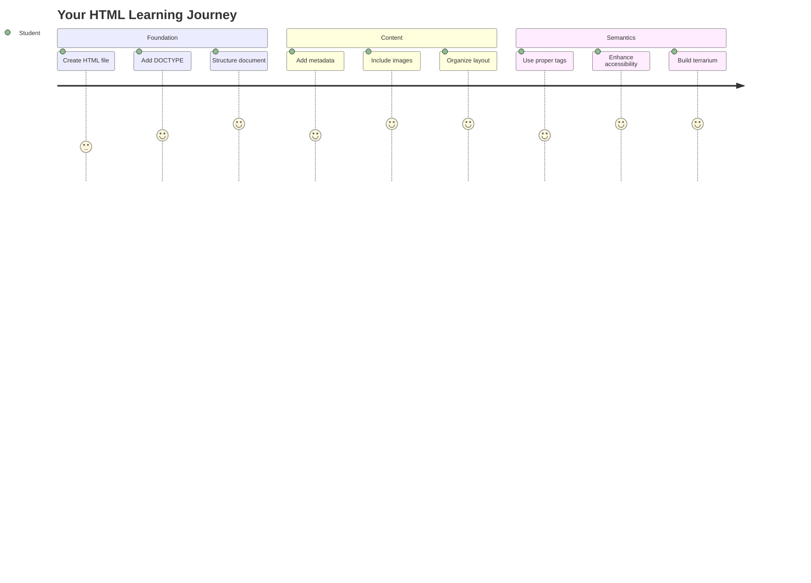
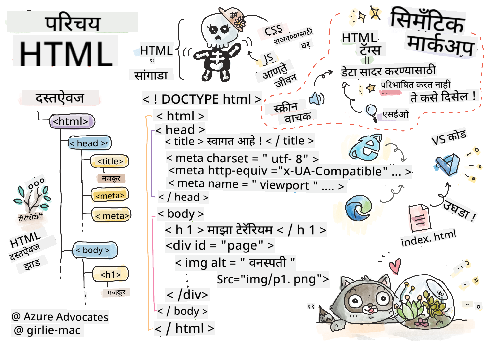
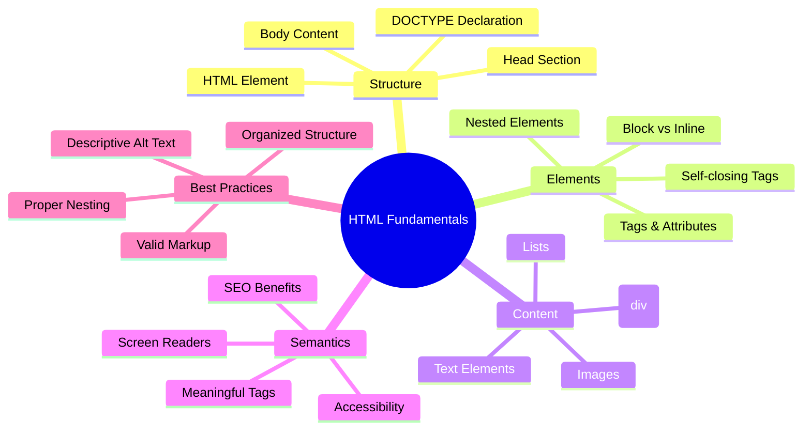
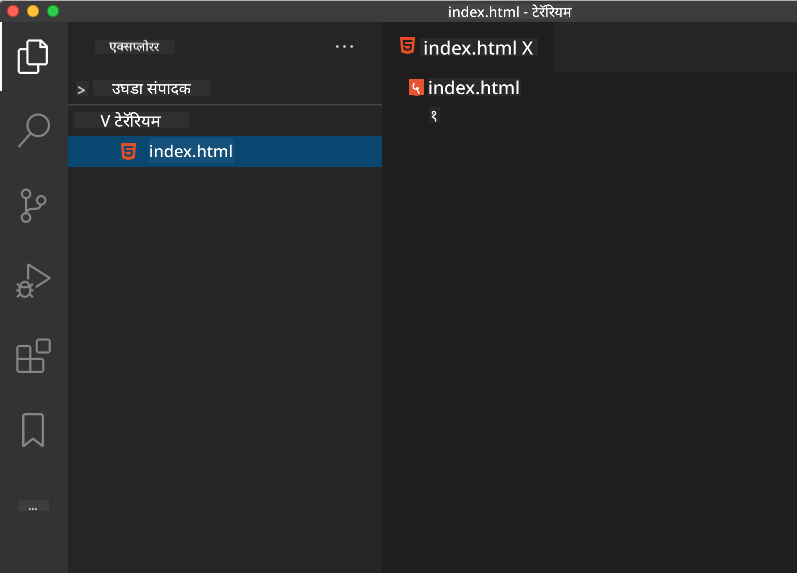
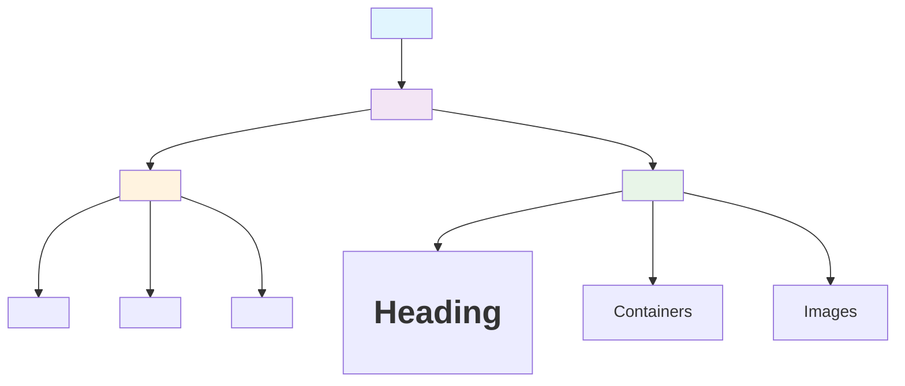
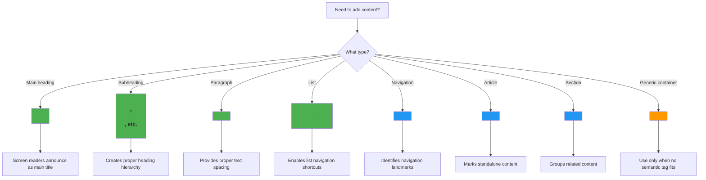
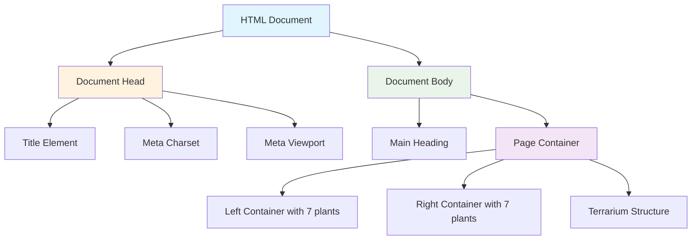
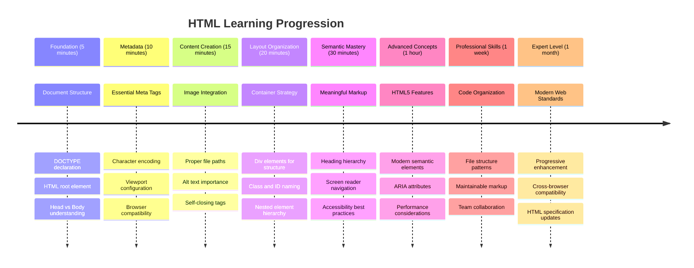

<!--
CO_OP_TRANSLATOR_METADATA:
{
  "original_hash": "3fcfa99c4897e051b558b5eaf1e8cc74",
  "translation_date": "2025-11-03T14:40:47+00:00",
  "source_file": "3-terrarium/1-intro-to-html/README.md",
  "language_code": "mr"
}
-->
# टेरॅरियम प्रकल्प भाग 1: HTML ची ओळख




> स्केच नोट [Tomomi Imura](https://twitter.com/girlie_mac) यांच्याकडून

HTML, म्हणजेच हायपरटेक्स्ट मार्कअप भाषा, ही तुम्ही कधीही भेट दिलेल्या प्रत्येक वेबसाइटची पायाभूत रचना आहे. HTML ला वेब पृष्ठांचे सांगाडा म्हणून विचार करा – ते सामग्री कुठे जाते, ती कशी आयोजित केली जाते आणि प्रत्येक भाग काय दर्शवतो हे परिभाषित करते. CSS नंतर तुमच्या HTML ला रंग आणि लेआउटसह "सजवेल", आणि JavaScript त्याला परस्परसंवादी बनवेल, HTML ही मूलभूत रचना प्रदान करते ज्यामुळे बाकी सर्व शक्य होते.

या धड्यात, तुम्ही आभासी टेरॅरियम इंटरफेससाठी HTML रचना तयार कराल. हा प्रकल्प तुम्हाला मूलभूत HTML संकल्पना शिकवेल आणि काहीतरी आकर्षक तयार करायला शिकवेल. तुम्ही सामग्रीला अर्थपूर्ण घटकांमध्ये कसे आयोजित करायचे, प्रतिमांसोबत कसे काम करायचे आणि परस्परसंवादी वेब अनुप्रयोगासाठी पाया कसा तयार करायचा हे शिकाल.

या धड्याच्या शेवटी, तुम्ही वनस्पतींच्या प्रतिमा व्यवस्थित स्तंभांमध्ये प्रदर्शित करणारे कार्यरत HTML पृष्ठ तयार केले असेल, जे पुढील धड्यात शैलीसाठी तयार असेल. सुरुवातीला ते मूलभूत दिसत असल्यास काळजी करू नका – CSS दृश्यात्मक आकर्षण जोडण्यापूर्वी HTML नेमके तेच करायला हवे.



## प्री-लेक्चर क्विझ

[प्री-लेक्चर क्विझ](https://ff-quizzes.netlify.app/web/quiz/15)

> 📺 **पहा आणि शिका**: या उपयुक्त व्हिडिओचा आढावा पहा
> 
> [](https://www.youtube.com/watch?v=1TvxJKBzhyQ)

## तुमचा प्रकल्प सेट अप करणे

HTML कोडमध्ये जाण्यापूर्वी, तुमच्या टेरॅरियम प्रकल्पासाठी योग्य कार्यक्षेत्र सेट अप करूया. सुरुवातीपासूनच व्यवस्थित फाइल संरचना तयार करणे ही एक महत्त्वाची सवय आहे जी तुमच्या वेब विकास प्रवासात तुम्हाला चांगली सेवा देईल.

### कार्य: तुमची प्रकल्प संरचना तयार करा

तुम्ही तुमच्या टेरॅरियम प्रकल्पासाठी एक समर्पित फोल्डर तयार कराल आणि तुमची पहिली HTML फाइल जोडाल. तुम्ही वापरू शकता अशा दोन पद्धती येथे आहेत:

**पर्याय 1: व्हिज्युअल स्टुडिओ कोड वापरणे**
1. व्हिज्युअल स्टुडिओ कोड उघडा
2. "File" → "Open Folder" वर क्लिक करा किंवा `Ctrl+K, Ctrl+O` (Windows/Linux) किंवा `Cmd+K, Cmd+O` (Mac) वापरा
3. `terrarium` नावाचा नवीन फोल्डर तयार करा आणि निवडा
4. Explorer पॅनमध्ये, "New File" आयकॉनवर क्लिक करा
5. तुमच्या फाइलचे नाव `index.html` ठेवा



**पर्याय 2: टर्मिनल कमांड्स वापरणे**
```bash
mkdir terrarium
cd terrarium
touch index.html
code index.html
```

**या कमांड्सने काय साध्य होते:**
- **नवीन डिरेक्टरी तयार करते** ज्याचे नाव `terrarium` आहे
- **टेरॅरियम डिरेक्टरीमध्ये जाते**
- **रिक्त `index.html` फाइल तयार करते**
- **फाइल संपादित करण्यासाठी व्हिज्युअल स्टुडिओ कोडमध्ये उघडते**

> 💡 **प्रो टिप**: वेब विकासात `index.html` फाइलचे नाव विशेष आहे. जेव्हा कोणी वेबसाइटला भेट देतो, तेव्हा ब्राउझर आपोआप `index.html` ला डिफॉल्ट पृष्ठ म्हणून प्रदर्शित करण्यासाठी शोधतात. याचा अर्थ असा की `https://mysite.com/projects/` सारखा URL आपोआप `projects` फोल्डरमधून `index.html` फाइल सर्व्ह करेल, URL मध्ये फाइलचे नाव निर्दिष्ट करण्याची गरज नाही.

## HTML दस्तऐवज रचना समजून घेणे

प्रत्येक HTML दस्तऐवज विशिष्ट रचनेचे अनुसरण करतो ज्याला ब्राउझर योग्य प्रकारे समजून घेण्यासाठी आणि प्रदर्शित करण्यासाठी आवश्यक असते. या रचनेला औपचारिक पत्रासारखे विचार करा – त्यात विशिष्ट क्रमाने आवश्यक घटक असतात जे प्राप्तकर्ता (या प्रकरणात, ब्राउझर) सामग्री योग्य प्रकारे प्रक्रिया करण्यास मदत करतात.



चला प्रत्येक HTML दस्तऐवजाला आवश्यक असलेला मूलभूत पाया जोडण्यास सुरुवात करूया.

### DOCTYPE घोषणा आणि मूळ घटक

HTML फाइलच्या पहिल्या दोन ओळी ब्राउझरला दस्तऐवजाची "ओळख" म्हणून काम करतात:

```html
<!DOCTYPE html>
<html></html>
```

**या कोडचे कार्य समजून घेणे:**
- **HTML5 दस्तऐवज प्रकार घोषित करते** `<!DOCTYPE html>` वापरून
- **मूळ `<html>` घटक तयार करते** जे सर्व पृष्ठ सामग्री समाविष्ट करेल
- **योग्य ब्राउझर रेंडरिंगसाठी आधुनिक वेब मानके स्थापित करते**
- **विविध ब्राउझर आणि उपकरणांमध्ये सुसंगत प्रदर्शन सुनिश्चित करते**

> 💡 **VS कोड टिप**: VS कोडमध्ये कोणत्याही HTML टॅगवर होवर करा आणि MDN वेब डॉक्समधून उपयुक्त माहिती पहा, ज्यामध्ये वापर उदाहरणे आणि ब्राउझर सुसंगतता तपशील समाविष्ट आहेत.

> 📚 **अधिक जाणून घ्या**: DOCTYPE घोषणा ब्राउझरला "quirks mode" मध्ये प्रवेश करण्यापासून प्रतिबंधित करते, जे खूप जुन्या वेबसाइट्सना समर्थन देण्यासाठी वापरले जात होते. आधुनिक वेब विकास साध्या `<!DOCTYPE html>` घोषणेसह [मानक-अनुरूप रेंडरिंग](https://developer.mozilla.org/docs/Web/HTML/Quirks_Mode_and_Standards_Mode) सुनिश्चित करतो.

### 🔄 **शैक्षणिक तपासणी**
**थांबा आणि विचार करा**: पुढे जाण्यापूर्वी, सुनिश्चित करा:
- ✅ प्रत्येक HTML दस्तऐवजाला DOCTYPE घोषणेची आवश्यकता का आहे
- ✅ `<html>` मूळ घटक काय समाविष्ट करतो
- ✅ ही रचना ब्राउझर पृष्ठे योग्य प्रकारे रेंडर करण्यात कशी मदत करते

**जलद स्व-परीक्षण**: "मानक-अनुरूप रेंडरिंग" म्हणजे काय हे तुम्ही स्वतःच्या शब्दात स्पष्ट करू शकता का?

## आवश्यक दस्तऐवज मेटाडेटा जोडणे

HTML दस्तऐवजाचा `<head>` विभाग महत्त्वाची माहिती समाविष्ट करतो जी ब्राउझर आणि शोध इंजिनला आवश्यक असते, परंतु अभ्यागतांना थेट पृष्ठावर दिसत नाही. याचा विचार "पृष्ठामागील" माहिती म्हणून करा जी तुमचे वेबपृष्ठ योग्य प्रकारे कार्य करण्यास आणि विविध उपकरणे आणि प्लॅटफॉर्मवर योग्यरित्या दिसण्यास मदत करते.

हे मेटाडेटा ब्राउझरला तुमचे पृष्ठ कसे प्रदर्शित करायचे, कोणते कॅरेक्टर एन्कोडिंग वापरायचे आणि वेगवेगळ्या स्क्रीन आकारांशी कसे हाताळायचे हे सांगते – व्यावसायिक, प्रवेशयोग्य वेब पृष्ठे तयार करण्यासाठी सर्व आवश्यक.

### कार्य: दस्तऐवज हेड जोडा

तुमच्या उघडणाऱ्या आणि बंद `<html>` टॅगमध्ये हा `<head>` विभाग घाला:

```html
<head>
	<title>Welcome to my Virtual Terrarium</title>
	<meta charset="utf-8" />
	<meta http-equiv="X-UA-Compatible" content="IE=edge" />
	<meta name="viewport" content="width=device-width, initial-scale=1" />
</head>
```

**प्रत्येक घटक काय साध्य करतो याचे विश्लेषण:**
- **पृष्ठ शीर्षक सेट करते** जे ब्राउझर टॅब आणि शोध परिणामांमध्ये दिसते
- **UTF-8 कॅरेक्टर एन्कोडिंग निर्दिष्ट करते** जागतिक स्तरावर योग्य मजकूर प्रदर्शनासाठी
- **आधुनिक इंटरनेट एक्सप्लोरर आवृत्त्यांसह सुसंगतता सुनिश्चित करते**
- **डिव्हाइसच्या रुंदीशी जुळण्यासाठी व्ह्यूपोर्ट कॉन्फिगर करते**
- **प्रारंभिक झूम स्तर नियंत्रित करते** नैसर्गिक आकारात सामग्री प्रदर्शित करण्यासाठी

> 🤔 **याचा विचार करा**: जर तुम्ही व्ह्यूपोर्ट मेटा टॅग असे सेट केले: `<meta name="viewport" content="width=600">` तर काय होईल? यामुळे पृष्ठ नेहमी 600 पिक्सेल रुंद असेल, प्रतिसादात्मक डिझाइन तुटेल! [योग्य व्ह्यूपोर्ट कॉन्फिगरेशन](https://developer.mozilla.org/docs/Web/HTML/Viewport_meta_tag) बद्दल अधिक जाणून घ्या.

## दस्तऐवज बॉडी तयार करणे

HTML च्या `<body>` घटकात तुमच्या वेबपृष्ठाची सर्व दृश्यमान सामग्री असते – वापरकर्ते पाहतील आणि संवाद साधतील अशा सर्व गोष्टी. `<head>` विभागाने ब्राउझरला सूचना दिल्या, तर `<body>` विभागात प्रत्यक्ष सामग्री असते: मजकूर, प्रतिमा, बटणे आणि इतर घटक जे तुमचे वापरकर्ता इंटरफेस तयार करतात.

चला बॉडी रचना जोडूया आणि HTML टॅग एकत्र कसे कार्य करतात ते समजून घेऊया.

### HTML टॅग रचना समजून घेणे

HTML जोडलेल्या टॅगचा वापर करून घटक परिभाषित करते. बहुतेक टॅगमध्ये `<p>` सारखा उघडणारा टॅग आणि `</p>` सारखा बंद करणारा टॅग असतो, ज्यामध्ये सामग्री असते: `<p>Hello, world!</p>`. यामुळे "Hello, world!" मजकूर असलेला परिच्छेद घटक तयार होतो.

### कार्य: बॉडी घटक जोडा

तुमच्या HTML फाइलला `<body>` घटक समाविष्ट करण्यासाठी अद्यतनित करा:

```html
<!DOCTYPE html>
<html>
	<head>
		<title>Welcome to my Virtual Terrarium</title>
		<meta charset="utf-8" />
		<meta http-equiv="X-UA-Compatible" content="IE=edge" />
		<meta name="viewport" content="width=device-width, initial-scale=1" />
	</head>
	<body></body>
</html>
```

**ही संपूर्ण रचना काय प्रदान करते:**
- **HTML5 दस्तऐवजाचा मूलभूत फ्रेमवर्क स्थापित करते**
- **योग्य ब्राउझर रेंडरिंगसाठी आवश्यक मेटाडेटा समाविष्ट करते**
- **दृश्यमान सामग्रीसाठी रिक्त बॉडी तयार करते**
- **आधुनिक वेब विकास सर्वोत्तम पद्धतींचे अनुसरण करते**

आता तुम्ही तुमच्या टेरॅरियमचे दृश्यमान घटक जोडण्यासाठी तयार आहात. आम्ही सामग्रीचे वेगवेगळे विभाग आयोजित करण्यासाठी कंटेनर म्हणून `<div>` घटक वापरू आणि वनस्पतींच्या प्रतिमा प्रदर्शित करण्यासाठी `` घटक वापरू.

### प्रतिमा आणि लेआउट कंटेनरसह काम करणे

HTML मध्ये प्रतिमा विशेष आहेत कारण त्या "स्वत: बंद करणारे" टॅग वापरतात. `<p></p>` सारख्या घटकांप्रमाणे सामग्रीभोवती लपेटण्याऐवजी, `` टॅग स्वतःच आवश्यक असलेल्या सर्व माहितीचा समावेश करतो, जसे की `src` प्रतिमा फाइल पथासाठी आणि `alt` प्रवेशयोग्यतेसाठी.

तुमच्या HTML मध्ये प्रतिमा जोडण्यापूर्वी, तुमच्या प्रकल्प फाइल्स व्यवस्थित करण्यासाठी प्रतिमांचे फोल्डर तयार करा आणि वनस्पतींच्या ग्राफिक्स जोडा.

**प्रथम, तुमच्या प्रतिमा सेट करा:**
1. तुमच्या टेरॅरियम प्रकल्प फोल्डरमध्ये `images` नावाचा फोल्डर तयार करा
2. [सोल्यूशन फोल्डर](../../../../3-terrarium/solution/images) मधून वनस्पतींच्या प्रतिमा डाउनलोड करा (एकूण 14 वनस्पतींच्या प्रतिमा)
3. सर्व वनस्पतींच्या प्रतिमा तुमच्या नवीन `images` फोल्डरमध्ये कॉपी करा

### कार्य: वनस्पती प्रदर्शन लेआउट तयार करा

आता तुमच्या `<body></body>` टॅगमध्ये दोन स्तंभांमध्ये आयोजित केलेल्या वनस्पतींच्या प्रतिमा जोडा:

```html
<div id="page">
	<div id="left-container" class="container">
		<div class="plant-holder">
			
		</div>
		<div class="plant-holder">
			
		</div>
		<div class="plant-holder">
			
		</div>
		<div class="plant-holder">
			
		</div>
		<div class="plant-holder">
			
		</div>
		<div class="plant-holder">
			
		</div>
		<div class="plant-holder">
			
		</div>
	</div>
	<div id="right-container" class="container">
		<div class="plant-holder">
			
		</div>
		<div class="plant-holder">
			
		</div>
		<div class="plant-holder">
			
		</div>
		<div class="plant-holder">
			
		</div>
		<div class="plant-holder">
			
		</div>
		<div class="plant-holder">
			
		</div>
		<div class="plant-holder">
			
		</div>
	</div>
</div>
```

**पायरी-पायरीने, या कोडमध्ये काय घडत आहे:**
- **`id="page"` सह मुख्य पृष्ठ कंटेनर तयार करते** सर्व सामग्री ठेवण्यासाठी
- **दोन स्तंभ कंटेनर स्थापित करते**: `left-container` आणि `right-container`
- **डाव्या स्तंभात 7 वनस्पती आणि उजव्या स्तंभात 7 वनस्पती आयोजित करते**
- **प्रत्येक वनस्पती प्रतिमेला `plant-holder` div मध्ये लपेटते** वैयक्तिक स्थितीसाठी
- **CSS शैलीसाठी सुसंगत वर्ग नावे लागू करते** पुढील धड्यात
- **प्रत्येक वनस्पती प्रतिमेला अद्वितीय ID असाइन करते** JavaScript परस्परसंवादासाठी नंतर
- **प्रतिमा फोल्डरकडे निर्देश करणारे योग्य फाइल पथ समाविष्ट करते**

> 🤔 **याचा विचार करा**: लक्षात घ्या की सर्व प्रतिमांमध्ये सध्या समान alt मजकूर "plant" आहे. हे प्रवेशयोग्यतेसाठी आदर्श नाही. स्क्रीन रीडर वापरकर्त्यांना "plant" 14 वेळा ऐकायला मिळेल, प्रत्येक प्रतिमा कोणती विशिष्ट वनस्पती दर्शवते हे न कळता. प्रत्येक प्रतिमेसाठी चांगला, अधिक वर्णनात्मक alt मजकूर तुम्ही विचार करू शकता का?

> 📝 **HTML घटक प्रकार**: `<div>` घटक "ब्लॉक-स्तरीय" असतात आणि पूर्ण रुंदी घेतात, तर `<span>` घटक "इनलाइन" असतात आणि फक्त आवश्यक रुंदी घेतात. जर तुम्ही सर्व `<div>` टॅग `<span>` टॅगमध्ये बदलले तर काय होईल असे तुम्हाला वाटते?

### 🔄 **शैक्षणिक तपासणी**
**रचना समजून घेणे**: तुमची HTML रचना पुनरावलोकन करण्यासाठी एक क्षण घ्या:
- ✅ तुम्ही तुमच्या लेआउटमधील मुख्य कंटेनर ओळखू शकता का?
- ✅ प्रत्येक प्रतिमेला अद्वितीय ID का आहे हे तुम्हाला समजते का?
- ✅ तुम्ही `plant-holder` div चा उद्देश कसा वर्णन कराल?

**दृश्य तपासणी**: तुमची HTML फाइल ब्राउझरमध्ये उघडा. तुम्हाला दिसले पाहिजे:
- वनस्पतींच्या प्रतिमांची मूलभूत यादी
- प्रतिमा दोन स्तंभांमध्ये आयोजित केल्या आहेत
- साधा, शैली नसलेला लेआउट

**लक्षात ठेवा**: CSS शैली जोडण्यापूर्वी HTML नेमके असेच दिसायला हवे!

या मार्कअपसह, वनस्पती स्क्रीनवर दिसतील, जरी त्या अद्याप आकर्षक दिसणार नाहीत – पुढील धड्यात CSS साठी ते आहे! सध्या, तुमच्याकडे तुमची सामग्री व्यवस्थित करणारी आणि प्रवेशयोग्यता सर्वोत्तम पद्धतींचे अनुसरण करणारी ठोस HTML रचना आहे.

## प्रवेशयोग्यतेसाठी सेमॅंटिक HTML वापरणे

सेमॅंटिक HTML म्हणजे HTML घटक त्यांच्या अर्थ आणि उद्देशावर आधारित निवडणे, फक्त त्यांच्या स्वरूपावर नाही. जेव्हा तुम्ही सेमॅंटिक मार्कअप वापरता, तेव्हा तुम्ही तुमच्या सामग्रीची रचना आणि अर्थ ब्राउझर, शोध इंजिन आणि स्क्रीन रीडर सारख्या सहाय्यक तंत्रज्ञानाला सांगता.



हा दृष्टिकोन अपंगत्व असलेल्या वापरकर्त्यांसाठी तुमच्या वेबसाइट्स अधिक प्रवेशयोग्य बनवतो आणि शोध इंजिनांना तुमची सामग्री अधिक चांगल्या प्रकारे समजण्यास मदत करतो. आधुनिक वेब विकासाचा हा मूलभूत तत्त्व आहे जो सर्वांसाठी चांगले अनुभव तयार करतो.

### सेमॅंटिक पृष्ठ शीर्षक जोडणे

चला तुमच्या टेरॅरियम पृष्ठाला योग्य शीर्षक जोडूया. तुमच्या उघडणाऱ्या `<body>` टॅगनंतर ही ओळ घाला:

```html
<h1>My Terrarium</h1>
```

**सेमॅंटिक मार्कअप का महत्त्वाचे आहे:**
- **स्क्रीन रीडरला पृष्ठ रचना नेव्हिगेट करण्यात आणि समजून घेण्यात मदत करते**
- **SEO सुधारते** सामग्री श्रेणी स्पष्ट करून
- **दृष्टीदोष किंवा संज्ञानात्मक फरक असलेल्या वापरकर्त्यांसाठी प्रवेशयोग्यता वाढवते**
- **सर्व उपकरणे आणि प्लॅटफॉर्मवर चांगले वापरकर्ता अनुभव तयार करते**
- **व्यावसायिक विकासासाठी वेब मानके आणि सर्वोत्तम पद्धतींचे अनुसरण करते**

**सेमॅंटिक विरुद्ध गैर-सेमॅंटिक निवडींची उदाहरणे:**

| उद्देश | ✅ सेमॅंटिक निवड | ❌ गैर-सेमॅंटिक निवड |
|---------|-------------------|------------------------|
| मुख्य शीर्षक | `<h1>Title</h1>` | `<div class="big-text">Title</div>` |
| नेव्हिगेशन | `<nav><ul><li></li></ul></nav>` | `<div class="menu"><div></div></div>` |
| बटण | `<button>Click me</button>` | `<span onclick="...">Click me</span>` |
| लेख सामग्री | `<article><p></p></article>` | `<div class="content"><div></div
- **प्रत्येक दृश्य घटकासाठी स्वतंत्र घटक परिभाषित करते** (वरचा भाग, भिंती, माती, तळाचा भाग)
- **काच प्रतिबिंब प्रभावांसाठी अंतर्गत घटक समाविष्ट करते** (चमकदार घटक)
- **वर्णनात्मक वर्ग नावे वापरते** जी प्रत्येक घटकाचा उद्देश स्पष्ट करतात
- **ग्लास टेरॅरियम दिसण्यासाठी CSS शैलीसाठी संरचना तयार करते**

> 🤔 **काहीतरी लक्षात आले का?**: तुम्ही हे मार्कअप जोडले असले तरी, तुम्हाला पृष्ठावर काही नवीन दिसत नाही! हे उत्तम प्रकारे स्पष्ट करते की HTML संरचना प्रदान करते तर CSS स्वरूप प्रदान करते. हे `<div>` घटक अस्तित्वात आहेत पण त्यांना अद्याप कोणतीही दृश्य शैली नाही – ती पुढच्या धड्यात येणार आहे!



### 🔄 **शैक्षणिक तपासणी**
**HTML संरचना कौशल्य**: पुढे जाण्यापूर्वी, खात्री करा की तुम्ही खालील गोष्टी करू शकता:
- ✅ HTML संरचना आणि दृश्य स्वरूप यामधील फरक स्पष्ट करा
- ✅ सिमॅंटिक आणि नॉन-सिमॅंटिक HTML घटक ओळखा
- ✅ योग्य मार्कअप कसे प्रवेशयोग्यता फायदे देते ते वर्णन करा
- ✅ संपूर्ण दस्तऐवज वृक्ष संरचना ओळखा

**तुमच्या समजाची चाचणी**: तुमची HTML फाइल ब्राउझरमध्ये JavaScript अक्षम करून आणि CSS काढून उघडून पहा. यामुळे तुम्ही तयार केलेली शुद्ध सिमॅंटिक संरचना दिसेल!

---

## GitHub Copilot Agent Challenge

Agent मोड वापरून खालील आव्हान पूर्ण करा:

**वर्णन:** टेरॅरियम प्रकल्पात समाविष्ट करता येईल अशा वनस्पती काळजी मार्गदर्शक विभागासाठी सिमॅंटिक HTML संरचना तयार करा.

**प्रॉम्प्ट:** "Plant Care Guide" मुख्य शीर्षक असलेला सिमॅंटिक HTML विभाग तयार करा, ज्यामध्ये "Watering", "Light Requirements", आणि "Soil Care" या तीन उपविभागांसह प्रत्येक वनस्पती काळजी माहिती असलेला परिच्छेद असावा. `<section>`, `<h2>`, `<h3>`, आणि `<p>` सारख्या योग्य सिमॅंटिक HTML टॅग्स वापरून सामग्री योग्य प्रकारे संरचित करा.

Agent मोडबद्दल अधिक जाणून घ्या [इथे](https://code.visualstudio.com/blogs/2025/02/24/introducing-copilot-agent-mode).

## HTML इतिहास आव्हान

**वेब उत्क्रांतीबद्दल शिकणे**

HTML मध्ये 1990 मध्ये CERN येथे टिम बर्नर्स-लीने पहिला वेब ब्राउझर तयार केल्यापासून लक्षणीय बदल झाले आहेत. काही जुन्या टॅग्स जसे की `<marquee>` आता अप्रचलित आहेत कारण ते आधुनिक प्रवेशयोग्यता मानकांशी आणि प्रतिसादक्षम डिझाइन तत्त्वांशी चांगले जुळत नाहीत.

**हा प्रयोग करून पहा:**
1. तुमच्या `<h1>` शीर्षकाला तात्पुरते `<marquee>` टॅगमध्ये गुंडाळा: `<marquee><h1>My Terrarium</h1></marquee>`
2. तुमचे पृष्ठ ब्राउझरमध्ये उघडा आणि स्क्रोलिंग प्रभाव पाहा
3. विचार करा की हा टॅग का अप्रचलित झाला (सूचना: वापरकर्ता अनुभव आणि प्रवेशयोग्यता विचार करा)
4. `<marquee>` टॅग काढा आणि सिमॅंटिक मार्कअपवर परत जा

**चिंतन प्रश्न:**
- स्क्रोलिंग शीर्षकाचा दृष्टीदोष असलेल्या किंवा हालचाल संवेदनशीलता असलेल्या वापरकर्त्यांवर कसा परिणाम होऊ शकतो?
- समान दृश्य प्रभाव अधिक प्रवेशयोग्यतेने साध्य करण्यासाठी कोणती आधुनिक CSS तंत्रे वापरता येतील?
- अप्रचलित घटकांऐवजी वर्तमान वेब मानकांचा वापर का महत्त्वाचा आहे?

[अप्रचलित आणि अप्रचलित HTML घटकांबद्दल](https://developer.mozilla.org/docs/Web/HTML/Element#Obsolete_and_deprecated_elements) अधिक जाणून घ्या जेणेकरून वेब मानक कसे विकसित होतात ते वापरकर्ता अनुभव सुधारण्यासाठी समजून घेता येईल.

## पोस्ट-लेक्चर क्विझ

[पोस्ट-लेक्चर क्विझ](https://ff-quizzes.netlify.app/web/quiz/16)

## पुनरावलोकन आणि स्व-अभ्यास

**HTML ज्ञान सखोल करा**

HTML वेबचा पाया आहे आणि 30 वर्षांहून अधिक काळापासून विकसित होत आहे, साध्या दस्तऐवज मार्कअप भाषेपासून परस्परसंवादी अनुप्रयोग तयार करण्यासाठी एक प्रगत व्यासपीठ बनले आहे. या उत्क्रांतीचा अभ्यास केल्याने तुम्हाला आधुनिक वेब मानकांचे कौतुक करण्यास मदत होते आणि चांगले विकास निर्णय घेता येतात.

**शिफारस केलेले शिक्षण मार्ग:**

1. **HTML इतिहास आणि उत्क्रांती**
   - HTML 1.0 ते HTML5 पर्यंतची टाइमलाइन संशोधन करा
   - विशिष्ट टॅग्स का अप्रचलित झाले (प्रवेशयोग्यता, मोबाइल-अनुकूलता, देखभालक्षमता) याचा अभ्यास करा
   - उदयोन्मुख HTML वैशिष्ट्ये आणि प्रस्ताव तपासा

2. **सिमॅंटिक HTML सखोल अभ्यास**
   - [HTML5 सिमॅंटिक घटकांची संपूर्ण यादी](https://developer.mozilla.org/docs/Web/HTML/Element) अभ्यासा
   - `<article>`, `<section>`, `<aside>`, आणि `<main>` कधी वापरायचे ते ओळखण्याचा सराव करा
   - प्रवेशयोग्यता वाढवण्यासाठी ARIA गुणधर्मांबद्दल जाणून घ्या

3. **आधुनिक वेब विकास**
   - Microsoft Learn वर [प्रतिसादक्षम वेबसाइट तयार करणे](https://docs.microsoft.com/learn/modules/build-simple-website/?WT.mc_id=academic-77807-sagibbon) एक्सप्लोर करा
   - HTML कसे CSS आणि JavaScript सह एकत्रित होते ते समजून घ्या
   - वेब कार्यक्षमता आणि SEO सर्वोत्तम पद्धतींबद्दल जाणून घ्या

**चिंतन प्रश्न:**
- तुम्हाला कोणते अप्रचलित HTML टॅग्स सापडले आणि ते का काढून टाकले गेले?
- भविष्यातील आवृत्त्यांसाठी कोणती नवीन HTML वैशिष्ट्ये प्रस्तावित केली जात आहेत?
- सिमॅंटिक HTML वेब प्रवेशयोग्यता आणि SEO मध्ये कसा योगदान देतो?

### ⚡ **पुढील 5 मिनिटांत तुम्ही काय करू शकता**
- [ ] DevTools (F12) उघडा आणि तुमच्या आवडत्या वेबसाइटची HTML संरचना तपासा
- [ ] मूलभूत टॅग्ससह एक साधी HTML फाइल तयार करा: `<h1>`, `<p>`, आणि ``
- [ ] W3C HTML Validator ऑनलाइन वापरून तुमची HTML वैधता तपासा
- [ ] `<!-- comment -->` वापरून तुमच्या HTML मध्ये एक टिप्पणी जोडा

### 🎯 **तुम्ही या तासात काय साध्य करू शकता**
- [ ] पोस्ट-लेसन क्विझ पूर्ण करा आणि सिमॅंटिक HTML संकल्पना पुनरावलोकन करा
- [ ] योग्य HTML संरचनेसह स्वतःबद्दल एक साधे वेबपृष्ठ तयार करा
- [ ] वेगवेगळ्या शीर्षक स्तर आणि मजकूर स्वरूपन टॅग्ससह प्रयोग करा
- [ ] मल्टीमीडिया एकत्रीकरणाचा सराव करण्यासाठी प्रतिमा आणि दुवे जोडा
- [ ] तुम्ही अद्याप प्रयत्न केलेले नाहीत अशा HTML5 वैशिष्ट्यांबद्दल संशोधन करा

### 📅 **तुमचा आठवडाभराचा HTML प्रवास**
- [ ] सिमॅंटिक मार्कअपसह टेरॅरियम प्रकल्प असाइनमेंट पूर्ण करा
- [ ] ARIA लेबल्स आणि भूमिका वापरून प्रवेशयोग्य वेबपृष्ठ तयार करा
- [ ] विविध इनपुट प्रकारांसह फॉर्म तयार करण्याचा सराव करा
- [ ] localStorage किंवा geolocation सारख्या HTML5 APIs एक्सप्लोर करा
- [ ] प्रतिसादक्षम HTML नमुने आणि मोबाइल-प्रथम डिझाइनचा अभ्यास करा
- [ ] सर्वोत्तम पद्धतींसाठी इतर विकसकांचे HTML कोड पुनरावलोकन करा

### 🌟 **तुमचा महिनाभराचा वेब पाया**
- [ ] तुमच्या HTML कौशल्याचे प्रदर्शन करणारी पोर्टफोलिओ वेबसाइट तयार करा
- [ ] Handlebars सारख्या फ्रेमवर्कसह HTML टेम्पलेटिंग शिकणे
- [ ] HTML दस्तऐवजीकरण सुधारून ओपन सोर्स प्रकल्पांमध्ये योगदान द्या
- [ ] कस्टम घटकांसारख्या प्रगत HTML संकल्पना मास्टर करा
- [ ] CSS फ्रेमवर्क आणि JavaScript लायब्ररीसह HTML एकत्रित करा
- [ ] HTML मूलभूत गोष्टी शिकणाऱ्यांना मार्गदर्शन करा

## 🎯 तुमची HTML कौशल्य टाइमलाइन



### 🛠️ तुमचा HTML टूलकिट सारांश

या धड्याचा अभ्यास केल्यानंतर, तुमच्याकडे आता आहे:
- **दस्तऐवज संरचना**: योग्य DOCTYPE सह संपूर्ण HTML5 पाया
- **सिमॅंटिक मार्कअप**: प्रवेशयोग्यता आणि SEO सुधारण्यासाठी अर्थपूर्ण टॅग्स
- **प्रतिमा एकत्रीकरण**: योग्य फाइल संघटन आणि alt टेक्स्ट पद्धती
- **लेआउट कंटेनर**: वर्णनात्मक वर्ग नावे असलेल्या divs चा धोरणात्मक वापर
- **प्रवेशयोग्यता जागरूकता**: स्क्रीन रीडर नेव्हिगेशनची समज
- **आधुनिक मानक**: वर्तमान HTML5 पद्धती आणि अप्रचलित टॅग्सचे ज्ञान
- **प्रकल्प पाया**: CSS शैली आणि JavaScript परस्परसंवादासाठी ठोस आधार

**पुढील पायऱ्या**: तुमची HTML संरचना CSS शैलीसाठी तयार आहे! तुम्ही तयार केलेला सिमॅंटिक पाया पुढील धडा समजून घेणे सोपे करेल.

## असाइनमेंट

[तुमची HTML सराव करा: ब्लॉग मॉकअप तयार करा](assignment.md)

---

**अस्वीकरण**:  
हा दस्तऐवज AI भाषांतर सेवा [Co-op Translator](https://github.com/Azure/co-op-translator) वापरून भाषांतरित करण्यात आला आहे. आम्ही अचूकतेसाठी प्रयत्नशील असलो तरी, कृपयास लक्षात ठेवा की स्वयंचलित भाषांतरांमध्ये त्रुटी किंवा अचूकतेचा अभाव असू शकतो. मूळ भाषेतील दस्तऐवज हा अधिकृत स्रोत मानला जावा. महत्त्वाच्या माहितीसाठी, व्यावसायिक मानवी भाषांतराची शिफारस केली जाते. या भाषांतराचा वापर करून निर्माण झालेल्या कोणत्याही गैरसमज किंवा चुकीच्या अर्थासाठी आम्ही जबाबदार नाही.