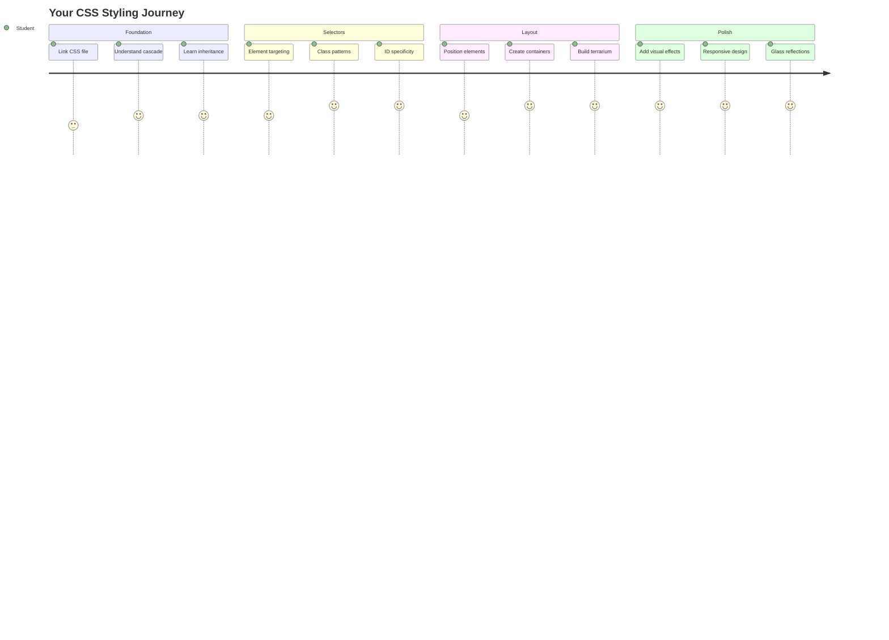
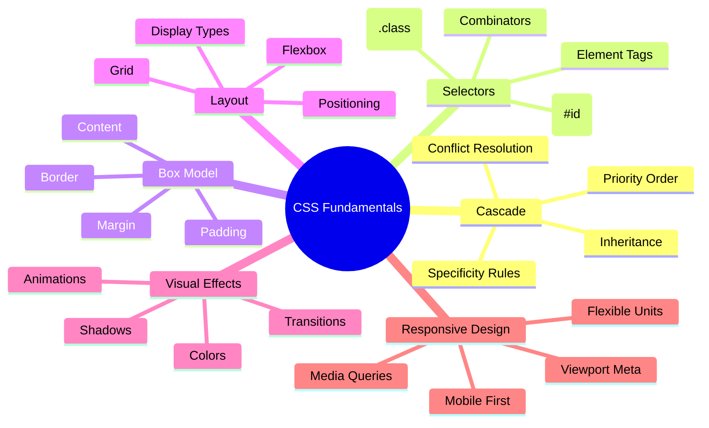
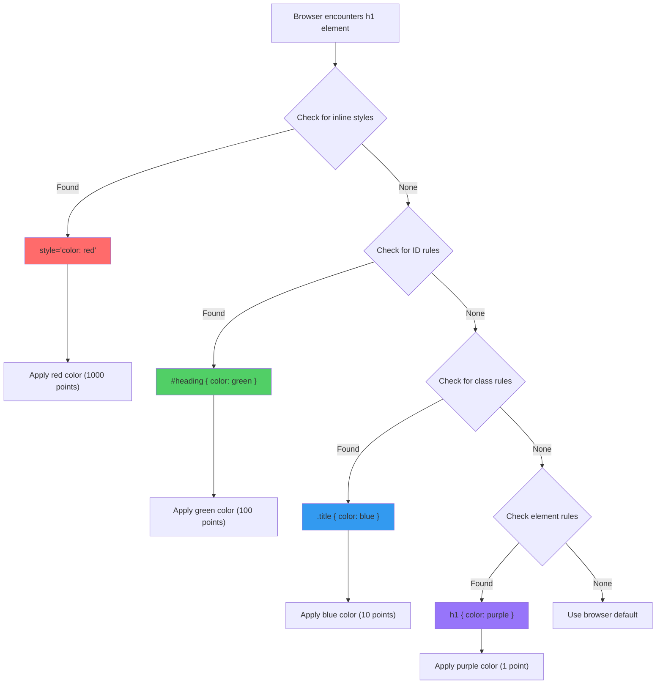
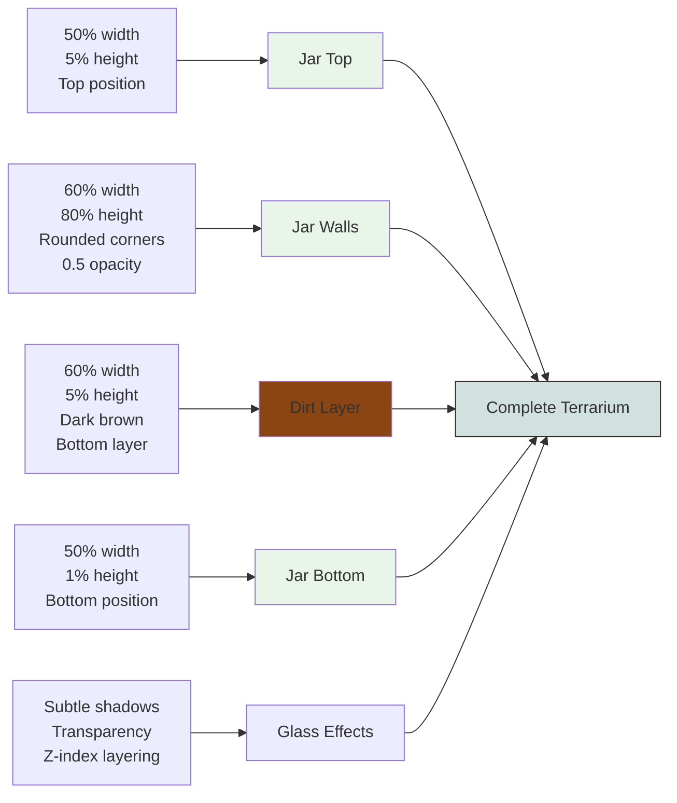
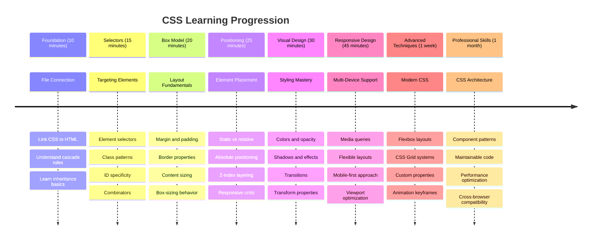

<!--
CO_OP_TRANSLATOR_METADATA:
{
  "original_hash": "e39f3a4e3bcccf94639e3af1248f8a4d",
  "translation_date": "2025-11-03T14:39:45+00:00",
  "source_file": "3-terrarium/2-intro-to-css/README.md",
  "language_code": "mr"
}
-->
# टेरॅरियम प्रकल्प भाग 2: CSS ची ओळख




> स्केच नोट [Tomomi Imura](https://twitter.com/girlie_mac) यांनी तयार केले आहे

तुमचा HTML टेरॅरियम किती साधा दिसत होता हे लक्षात आहे का? CSS च्या मदतीने आपण त्या साध्या संरचनेला आकर्षक बनवतो.

जर HTML घराचा फ्रेम तयार करण्यासारखा असेल, तर CSS म्हणजे घराला घरासारखे वाटण्यासाठी आवश्यक सर्व गोष्टी - रंग, फर्निचरची मांडणी, प्रकाशयोजना आणि खोल्यांची रचना. व्हर्सायचा राजवाडा सुरुवातीला एक साधा शिकारीचा निवास होता, पण सजावट आणि रचनेवर लक्ष केंद्रित करून तो जगातील सर्वात भव्य इमारतींपैकी एक बनला.

आज आपण तुमचा टेरॅरियम कार्यक्षमतेपासून आकर्षकतेकडे बदलू. तुम्ही घटक अचूकपणे कसे ठेवायचे, वेगवेगळ्या स्क्रीन आकारांसाठी लेआउट कसे प्रतिसाद देईल आणि वेबसाइट्स आकर्षक बनवणारी दृश्यात्मकता कशी तयार करायची हे शिकाल.

या धड्याच्या शेवटी, तुम्हाला दिसेल की रणनीतिक CSS स्टाइलिंग तुमच्या प्रकल्पाला किती सुधारू शकते. चला तुमच्या टेरॅरियमला थोडा स्टाइल देऊया.



## प्री-लेक्चर क्विझ

[प्री-लेक्चर क्विझ](https://ff-quizzes.netlify.app/web/quiz/17)

## CSS सुरू करण्याची प्रक्रिया

CSS फक्त "सौंदर्य वाढवणे" म्हणून ओळखले जाते, परंतु त्याचा उद्देश खूप व्यापक आहे. CSS म्हणजे एखाद्या चित्रपटाचा दिग्दर्शक असण्यासारखे आहे - तुम्ही फक्त कसे दिसते हेच नाही तर ते कसे हलते, संवाद साधते आणि वेगवेगळ्या परिस्थितींशी कसे जुळवून घेते हे नियंत्रित करता.

आधुनिक CSS खूप सक्षम आहे. तुम्ही फोन, टॅब्लेट आणि डेस्कटॉप संगणकांसाठी लेआउट आपोआप समायोजित करणारा कोड लिहू शकता. तुम्ही गुळगुळीत अॅनिमेशन तयार करू शकता जे वापरकर्त्यांचे लक्ष आवश्यक ठिकाणी केंद्रित करतात. जेव्हा सर्वकाही एकत्र काम करते तेव्हा परिणाम खूप प्रभावी असतो.

> 💡 **प्रो टिप**: CSS सतत नवीन वैशिष्ट्ये आणि क्षमता सह विकसित होत आहे. उत्पादन प्रकल्पांमध्ये वापरण्यापूर्वी नवीन CSS वैशिष्ट्यांसाठी ब्राउझर समर्थन सत्यापित करण्यासाठी नेहमी [CanIUse.com](https://caniuse.com) तपासा.

**या धड्यात आपण काय साध्य करू:**
- **तयार करतो** आधुनिक CSS तंत्रांचा वापर करून तुमच्या टेरॅरियमसाठी संपूर्ण दृश्यात्मक डिझाइन
- **शोधतो** कॅस्केड, वारसा आणि CSS सिलेक्टर्स यासारखी मूलभूत संकल्पना
- **अंमलात आणतो** प्रतिसादात्मक पोझिशनिंग आणि लेआउट रणनीती
- **बांधतो** CSS आकार आणि स्टाइलिंग वापरून टेरॅरियम कंटेनर

### पूर्वतयारी

तुम्ही मागील धड्यातून तुमच्या टेरॅरियमसाठी HTML संरचना पूर्ण केली पाहिजे आणि ती स्टाइल करण्यासाठी तयार असावी.

> 📺 **व्हिडिओ संसाधन**: या उपयुक्त व्हिडिओ वॉकथ्रूला पहा
>
> [](https://www.youtube.com/watch?v=6yIdOIV9p1I)

### तुमचा CSS फाइल सेट करणे

स्टाइलिंग सुरू करण्यापूर्वी, आपल्याला CSS HTML शी जोडणे आवश्यक आहे. ही कनेक्शन ब्राउझरला तुमच्या टेरॅरियमसाठी स्टाइलिंग सूचना कुठे शोधायच्या ते सांगते.

तुमच्या टेरॅरियम फोल्डरमध्ये, `style.css` नावाची नवीन फाइल तयार करा आणि ती तुमच्या HTML डॉक्युमेंटच्या `<head>` विभागात लिंक करा:

```html
<link rel="stylesheet" href="./style.css" />
```

**या कोडचे कार्य:**
- **तयार करते** तुमच्या HTML आणि CSS फाइल्समधील कनेक्शन
- **ब्राउझरला सांगते** `style.css` मधून स्टाइल्स लोड आणि लागू करायला
- **वापरते** `rel="stylesheet"` अॅट्रिब्युट CSS फाइल असल्याचे निर्दिष्ट करण्यासाठी
- **संदर्भ देते** फाइल पथ `href="./style.css"` सह

## CSS कॅस्केड समजून घेणे

CSS ला "कॅस्केडिंग" स्टाइल शीट्स का म्हणतात याचा विचार केला आहे का? स्टाइल्स पाण्याच्या धबधब्यासारखे खाली वाहतात आणि कधीकधी एकमेकांशी संघर्ष करतात.

लष्करी आदेश संरचना कशी कार्य करते याचा विचार करा - एक सामान्य आदेश म्हणू शकतो "सर्व सैनिक हिरवा पोशाख घाला," परंतु तुमच्या युनिटसाठी विशिष्ट आदेश म्हणू शकतो "समारंभासाठी ड्रेस ब्लूज घाला." अधिक विशिष्ट सूचना प्राधान्य घेते. CSS समान तर्काचे अनुसरण करते आणि ही श्रेणी समजून घेणे डीबगिंग अधिक व्यवस्थापनीय बनवते.

### कॅस्केड प्राधान्याचा प्रयोग

स्टाइल संघर्ष तयार करून कॅस्केड अॅक्शनमध्ये पाहूया. प्रथम, तुमच्या `<h1>` टॅगमध्ये इनलाइन स्टाइल जोडा:

```html
<h1 style="color: red">My Terrarium</h1>
```

**या कोडचे कार्य:**
- **लागू करते** इनलाइन स्टाइलिंग वापरून `<h1>` घटकावर थेट लाल रंग
- **वापरते** `style` अॅट्रिब्युट HTML मध्ये CSS थेट एम्बेड करण्यासाठी
- **तयार करते** या विशिष्ट घटकासाठी सर्वोच्च प्राधान्य स्टाइल नियम

यानंतर, तुमच्या `style.css` फाइलमध्ये हा नियम जोडा:

```css
h1 {
  color: blue;
}
```

**वरीलमध्ये आपण:**
- **परिभाषित केले** CSS नियम जो सर्व `<h1>` घटकांना लक्ष्य करतो
- **सेट केले** बाह्य स्टाइलशीट वापरून मजकूराचा रंग निळा
- **तयार केले** इनलाइन स्टाइल्सच्या तुलनेत कमी प्राधान्य नियम

✅ **ज्ञान तपासणी**: तुमच्या वेब अॅपमध्ये कोणता रंग दिसतो? तो रंग का जिंकतो? तुम्ही स्टाइल्स ओव्हरराइड करण्याच्या परिस्थितींचा विचार करू शकता का?



> 💡 **CSS प्राधान्य क्रम (सर्वोच्च ते निम्न):**
> 1. **इनलाइन स्टाइल्स** (style attribute)
> 2. **IDs** (#myId)
> 3. **क्लासेस** (.myClass) आणि अॅट्रिब्युट्स
> 4. **घटक सिलेक्टर्स** (h1, div, p)
> 5. **ब्राउझर डीफॉल्ट्स**

## CSS वारसा क्रियेत

CSS वारसा अनुवांशिकतेसारखे कार्य करते - घटक त्यांच्या पालक घटकांकडून विशिष्ट गुणधर्म वारसाहक्काने घेतात. जर तुम्ही बॉडी घटकावर फॉन्ट फॅमिली सेट केली, तर आतला सर्व मजकूर आपोआप तोच फॉन्ट वापरतो. हे हॅब्सबर्ग कुटुंबाच्या विशिष्ट जबड्याच्या रेषेसारखे आहे जे प्रत्येक व्यक्तीसाठी निर्दिष्ट न करता पिढ्यानपिढ्या दिसते.

तथापि, सर्वकाही वारसाहक्काने मिळत नाही. फॉन्ट्स आणि रंगांसारख्या मजकूर शैली वारसाहक्काने मिळतात, परंतु मार्जिन आणि बॉर्डरसारख्या लेआउट गुणधर्म वारसाहक्काने मिळत नाहीत. जसे मुलांना शारीरिक वैशिष्ट्ये वारसाहक्काने मिळू शकतात पण त्यांच्या पालकांची फॅशन निवड नाही.

### फॉन्ट वारसा निरीक्षण करणे

बॉडी घटकावर फॉन्ट फॅमिली सेट करून वारसा अॅक्शनमध्ये पाहूया:

```css
body {
  font-family: 'Segoe UI', Tahoma, Geneva, Verdana, sans-serif;
}
```

**येथे काय होते ते समजून घेणे:**
- **सेट करते** संपूर्ण पृष्ठासाठी फॉन्ट फॅमिली बॉडी घटकाला लक्ष्य करून
- **वापरते** फॉन्ट स्टॅक फॉलबॅक पर्यायांसह चांगल्या ब्राउझर सुसंगततेसाठी
- **लागू करते** आधुनिक सिस्टम फॉन्ट्स जे वेगवेगळ्या ऑपरेटिंग सिस्टमवर चांगले दिसतात
- **सुनिश्चित करते** सर्व चाइल्ड घटक हा फॉन्ट वारसाहक्काने घेतात जोपर्यंत विशेषतः ओव्हरराइड केलेला नाही

तुमच्या ब्राउझरचे डेव्हलपर टूल्स (F12) उघडा, एलिमेंट्स टॅबवर जा आणि तुमच्या `<h1>` घटकाची तपासणी करा. तुम्हाला दिसेल की ते बॉडीकडून फॉन्ट फॅमिली वारसाहक्काने घेतात:


✅ **प्रयोग वेळ**: `<body>` वर `color`, `line-height`, किंवा `text-align` सारखी इतर वारसाहक्काने मिळणारी गुणधर्म सेट करण्याचा प्रयत्न करा. तुमच्या हेडिंग आणि इतर घटकांवर काय परिणाम होतो?

> 📝 **वारसाहक्काने मिळणारे गुणधर्म समाविष्ट करतात**: `color`, `font-family`, `font-size`, `line-height`, `text-align`, `visibility`
>
> **वारसाहक्काने न मिळणारे गुणधर्म समाविष्ट करतात**: `margin`, `padding`, `border`, `width`, `height`, `position`

### 🔄 **शैक्षणिक तपासणी**
**CSS फाउंडेशन समजून घेणे**: सिलेक्टर्सकडे जाण्यापूर्वी, सुनिश्चित करा की तुम्ही:
- ✅ कॅस्केड आणि वारसाहक्कातील फरक स्पष्ट करू शकता
- ✅ विशिष्टता संघर्षात कोणती स्टाइल जिंकेल हे अंदाज करू शकता
- ✅ कोणते गुणधर्म पालक घटकांकडून वारसाहक्काने मिळतात हे ओळखू शकता
- ✅ CSS फाइल्स HTML शी योग्य प्रकारे जोडू शकता

**जलद चाचणी**: जर तुमच्याकडे हे स्टाइल्स असतील, तर `<div class="special">` मध्ये असलेल्या `<h1>` चा रंग काय असेल?
```css
div { color: blue; }
.special { color: green; }
h1 { color: red; }
```
*उत्तर: लाल (घटक सिलेक्टर थेट h1 ला लक्ष्य करतो)*

## CSS सिलेक्टर्समध्ये प्रावीण्य मिळवणे

CSS सिलेक्टर्स विशिष्ट घटकांना स्टाइल करण्याचा तुमचा मार्ग आहे. ते अचूक दिशानिर्देश देण्यासारखे कार्य करतात - "घर" म्हणण्याऐवजी तुम्ही "मॅपल स्ट्रीटवरील लाल दरवाजा असलेले निळे घर" म्हणू शकता.

CSS वेगवेगळ्या प्रकारे विशिष्ट असण्याचे मार्ग प्रदान करते आणि योग्य सिलेक्टर निवडणे म्हणजे कार्यासाठी योग्य साधन निवडणे. कधी कधी तुम्हाला संपूर्ण परिसरातील प्रत्येक दरवाजा स्टाइल करायचा असतो, तर कधी फक्त एक विशिष्ट दरवाजा.

### घटक सिलेक्टर्स (टॅग्स)

घटक सिलेक्टर्स HTML घटकांना त्यांच्या टॅग नावाने लक्ष्य करतात. ते तुमच्या पृष्ठावर व्यापकपणे लागू होणारे बेस स्टाइल्स सेट करण्यासाठी योग्य आहेत:

```css
body {
  font-family: 'Segoe UI', Tahoma, Geneva, Verdana, sans-serif;
  margin: 0;
  padding: 0;
}

h1 {
  color: #3a241d;
  text-align: center;
  font-size: 2.5rem;
  margin-bottom: 1rem;
}
```

**या स्टाइल्स समजून घेणे:**
- **सेट करते** संपूर्ण पृष्ठावर सुसंगत टायपोग्राफी `body` सिलेक्टरसह
- **काढून टाकते** ब्राउझरचे डीफॉल्ट मार्जिन आणि पॅडिंग चांगल्या नियंत्रणासाठी
- **स्टाइल करते** सर्व हेडिंग घटक रंग, संरेखन आणि स्पेसिंगसह
- **वापरते** `rem` युनिट्स स्केलेबल, अॅक्सेसिबल फॉन्ट साइजिंगसाठी

घटक सिलेक्टर्स सामान्य स्टाइलिंगसाठी चांगले कार्य करतात, परंतु तुम्हाला टेरॅरियममधील झाडांसारख्या वैयक्तिक घटकांना स्टाइल करण्यासाठी अधिक विशिष्ट सिलेक्टर्सची आवश्यकता असेल.

### अद्वितीय घटकांसाठी ID सिलेक्टर्स

ID सिलेक्टर्स `#` चिन्ह वापरतात आणि विशिष्ट `id` अॅट्रिब्युट्स असलेल्या घटकांना लक्ष्य करतात. IDs पृष्ठावर अद्वितीय असणे आवश्यक असल्याने, ते टेरॅरियमच्या डाव्या आणि उजव्या बाजूच्या वनस्पती कंटेनरसारख्या वैयक्तिक, विशेष घटकांना स्टाइल करण्यासाठी योग्य आहेत.

चला टेरॅरियमच्या बाजूच्या कंटेनरसाठी स्टाइल तयार करूया जिथे वनस्पती राहतील:

```css
#left-container {
  background-color: #f5f5f5;
  width: 15%;
  left: 0;
  top: 0;
  position: absolute;
  height: 100vh;
  padding: 1rem;
  box-sizing: border-box;
}

#right-container {
  background-color: #f5f5f5;
  width: 15%;
  right: 0;
  top: 0;
  position: absolute;
  height: 100vh;
  padding: 1rem;
  box-sizing: border-box;
}
```

**या कोडने काय साध्य केले आहे:**
- **स्थिती** कंटेनरला `absolute` पोझिशनिंग वापरून डाव्या आणि उजव्या कडांवर ठेवते
- **वापरते** `vh` (व्ह्यूपोर्ट हाइट) युनिट्स प्रतिसादात्मक उंचीसाठी जी स्क्रीन आकाराशी जुळवून घेते
- **लागू करते** `box-sizing: border-box` जेणेकरून पॅडिंग एकूण रुंदीमध्ये समाविष्ट होईल
- **काढून टाकते** शून्य मूल्यांमधून अनावश्यक `px` युनिट्स स्वच्छ कोडसाठी
- **सेट करते** सूक्ष्म पार्श्वभूमी रंग जो गडद ग्रेच्या तुलनेत डोळ्यांसाठी सोपा आहे

✅ **कोड गुणवत्ता आव्हान**: लक्षात घ्या की हा CSS DRY (डोंट रिपीट युअरसेल्फ) तत्त्वाचे उल्लंघन करतो. तुम्ही ID आणि क्लास दोन्ही वापरून याला कसे सुधारित करू शकता?

**सुधारित दृष्टिकोन:**
```html
<div id="left-container" class="container"></div>
<div id="right-container" class="container"></div>
```

```css
.container {
  background-color: #f5f5f5;
  width: 15%;
  top: 0;
  position: absolute;
  height: 100vh;
  padding: 1rem;
  box-sizing: border-box;
}

#left-container {
  left: 0;
}

#right-container {
  right: 0;
}
```

### पुनर्वापरयोग्य स्टाइलसाठी क्लास सिलेक्टर्स

क्लास सिलेक्टर्स `.` चिन्ह वापरतात आणि तुम्हाला एकाच स्टाइल्स अनेक घटकांवर लागू करायच्या असतील तेव्हा योग्य असतात. IDs च्या विपरीत, क्लासेस तुमच्या HTML मध्ये पुन्हा वापरता येतात, ज्यामुळे ते सुसंगत स्टाइलिंग पॅटर्नसाठी आदर्श बनतात.

आपल्या टेरॅरियममध्ये, प्रत्येक वनस्पतीला समान स्टाइलिंगची आवश्यकता आहे परंतु वैयक्तिक पोझिशनिंगची आवश्यकता आहे. आम्ही सामायिक स्टाइलसाठी क्लासेस आणि अद्वितीय पोझिशनिंगसाठी IDs चा संयोजन वापरू.

**प्रत्येक वनस्पतीसाठी HTML संरचना येथे आहे:**
```html
<div class="plant-holder">
  
</div>
```

**महत्त्वाचे घटक स्पष्ट केले:**
- **वापरते** `class="plant-holder"` सर्व वनस्पतींसाठी सुसंगत कंटेनर स्टाइलिंगसाठी
- **लागू करते** `class="plant"` सामायिक प्रतिमा स्टाइलिंग आणि वर्तनासाठी
- **समाविष्ट करते** अद्वितीय `id="plant1"` वैयक्तिक पोझिशनिंग आणि JavaScript संवादासाठी
- **प्रदान करते** स्क्रीन रीडर अॅक्सेसिबिलिटीसाठी वर्णनात्मक alt टेक्स्ट

आता तुमच्या `style.css` फाइलमध्ये हे स्टाइल्स जोडा:

```css
.plant-holder {
  position: relative;
  height: 13%;
  left: -0.6rem;
}

.plant {
  position: absolute;
  max-width: 150%;
  max-height: 150%;
  z-index: 2;
  transition: transform 0.3s ease;
}

.plant:hover {
  transform: scale(1.05);
}
```

**या स्टाइल्सचे विश्लेषण:**
- **तयार करते** वनस्पती होल्डरसाठी सापेक्ष पोझिशनिंग जे पोझिशनिंग संदर्भ तयार करते
- **सेट करते** प्रत्येक वनस्पती होल्डर 13% उंचीवर, सर्व वनस्पती स्क्रोलिंगशिवाय उभ्या फिट होण्यासाठी
- **थोडे हलवते** होल्डर्स डावीकडे वनस्पतींना त्यांच्या कंटेनरमध्ये चांगले केंद्रित करण्यासाठी
- **परवानगी देते** वनस्पतींना प्रतिसादात्मकपणे स्केल करण्यासाठी `max-width` आणि `max-height` गुणधर्मांसह
- **वापरते** `z-index` टेरॅरियममधील इतर घटकांवर वनस्पतींना स्तरित करण्यासाठी
- **जोडते** CSS ट्रांझिशन्ससह सूक्ष्म हवर इफेक्ट चांगल्या वापरकर्ता संवादासाठी

✅ **गंभीर विचार**: आपल्याला `.plant-holder` आणि `.plant` सिलेक्टर्स दोन्ही का आवश्यक आहेत? जर आपण फक्त एक वापरण्याचा प्रयत्न केला तर काय होईल?

> 💡 **डिझाइन पॅटर्न**: कंटेनर (`.plant-holder`) लेआउट आणि पोझिशनिंग नियंत्रित करते, तर सामग्री (`.plant`) स्वरूप आणि स्केलिंग नियंत्रित करते. हा विभाजन कोड अधिक देखभालक्षम आणि लवचिक बनवतो.

## CSS पोझिशनिंग समजून घेणे

CSS पोझिशनिंग म्हणजे नाटकासाठी स्टेज डायरेक्टर असण्यासारखे आहे - तुम्ही प्रत्येक अभिनेता कुठे उभा
- `.plant-holder` जर `relative` ऐवजी `absolute` वापरत असेल तर लेआउट कसे बदलते?
- `.plant` ला `relative` पोझिशनिंगमध्ये बदलल्यावर काय होते?

### 🔄 **शैक्षणिक तपासणी**
**CSS पोझिशनिंग कौशल्य**: तुमचे समज तपासण्यासाठी थांबा:
- ✅ तुम्ही स्पष्ट करू शकता का की ड्रॅग-आणि-ड्रॉपसाठी प्लांट्सना absolute पोझिशनिंग का आवश्यक आहे?
- ✅ तुम्हाला समजते का की relative कंटेनर्स पोझिशनिंग संदर्भ कसे तयार करतात?
- ✅ साइड कंटेनर्स absolute पोझिशनिंग का वापरतात?
- ✅ जर तुम्ही पोझिशन डिक्लेरेशन पूर्णपणे काढून टाकले तर काय होईल?

**वास्तविक जगाशी संबंध**: विचार करा की CSS पोझिशनिंग वास्तविक जगातील लेआउटशी कसे जुळते:
- **Static**: शेल्फवर ठेवलेली पुस्तके (नैसर्गिक क्रम)
- **Relative**: पुस्तक थोडे हलवणे पण त्याच जागेवर ठेवणे
- **Absolute**: एखाद्या पानावर बुकमार्क अचूकपणे ठेवणे
- **Fixed**: पानं उलटताना दिसणारी स्टिकी नोट

## CSS सह टेरॅरियम तयार करणे

आता आपण फक्त CSS वापरून काचेचा जार तयार करू - कोणत्याही इमेजेस किंवा ग्राफिक्स सॉफ्टवेअरशिवाय.

पोझिशनिंग आणि ट्रान्सपेरन्सी वापरून वास्तववादी काच, सावल्या आणि खोलीचे प्रभाव तयार करणे हे CSS च्या व्हिज्युअल क्षमता दर्शवते. ही तंत्रे बाऊहाऊस चळवळीतील आर्किटेक्ट्सने साध्या जियोमेट्रिक फॉर्म्स वापरून जटिल, सुंदर संरचना तयार करण्याच्या पद्धतीशी जुळतात. एकदा तुम्ही हे तत्त्व समजून घेतल्यावर, तुम्हाला अनेक वेब डिझाइन्समागील CSS तंत्रे ओळखता येतील.



### काचेच्या जारचे घटक तयार करणे

आता आपण टेरॅरियम जार टप्प्याटप्प्याने तयार करू. प्रत्येक भाग absolute पोझिशनिंग आणि टक्केवारी-आधारित साइजिंग वापरतो जेणेकरून डिझाइन प्रतिसादक्षम असेल:

```css
.jar-walls {
  height: 80%;
  width: 60%;
  background: #d1e1df;
  border-radius: 1rem;
  position: absolute;
  bottom: 0.5%;
  left: 20%;
  opacity: 0.5;
  z-index: 1;
  box-shadow: inset 0 0 2rem rgba(0, 0, 0, 0.1);
}

.jar-top {
  width: 50%;
  height: 5%;
  background: #d1e1df;
  position: absolute;
  bottom: 80.5%;
  left: 25%;
  opacity: 0.7;
  z-index: 1;
  border-radius: 0.5rem 0.5rem 0 0;
}

.jar-bottom {
  width: 50%;
  height: 1%;
  background: #d1e1df;
  position: absolute;
  bottom: 0;
  left: 25%;
  opacity: 0.7;
  border-radius: 0 0 0.5rem 0.5rem;
}

.dirt {
  width: 60%;
  height: 5%;
  background: #3a241d;
  position: absolute;
  border-radius: 0 0 1rem 1rem;
  bottom: 1%;
  left: 20%;
  opacity: 0.7;
  z-index: -1;
}
```

**टेरॅरियम बांधकाम समजून घेणे:**
- **वापरते** टक्केवारी-आधारित परिमाणे जेणेकरून सर्व स्क्रीन साइजवर स्केलिंग होईल
- **पोझिशन करते** घटक अचूकपणे स्टॅक आणि अलाईन करण्यासाठी
- **लागू करते** वेगवेगळ्या अपॅसिटी व्हॅल्यूज जेणेकरून काचेचा ट्रान्सपेरन्सी इफेक्ट तयार होईल
- **अंमलात आणते** `z-index` लेयरिंग जेणेकरून प्लांट्स जारच्या आत दिसतील
- **जोडते** सूक्ष्म बॉक्स-शॅडो आणि परिष्कृत बॉर्डर-रेडियस जेणेकरून अधिक वास्तववादी दिसेल

### टक्केवारीसह प्रतिसादक्षम डिझाइन

सर्व परिमाणे निश्चित पिक्सेल व्हॅल्यूजऐवजी टक्केवारी वापरत असल्याचे लक्षात घ्या:

**याचे महत्त्व:**
- **सुनिश्चित करते** की टेरॅरियम कोणत्याही स्क्रीन साइजवर प्रमाणानुसार स्केल होईल
- **जपते** जार घटकांमधील व्हिज्युअल संबंध
- **प्रदान करते** मोबाइल फोनपासून मोठ्या डेस्कटॉप मॉनिटर्सपर्यंत एकसारखा अनुभव
- **परवानगी देते** डिझाइनला व्हिज्युअल लेआउट न मोडता अडॅप्ट होण्यासाठी

### CSS युनिट्सचा वापर

आम्ही बॉर्डर-रेडियससाठी `rem` युनिट्स वापरत आहोत, जे रूट फॉन्ट साइजच्या तुलनेत स्केल होतात. यामुळे अधिक अॅक्सेसिबल डिझाइन्स तयार होतात जे वापरकर्त्याच्या फॉन्ट प्राधान्यांचा आदर करतात. [CSS relative units](https://www.w3.org/TR/css-values-3/#font-relative-lengths) बद्दल अधिक जाणून घ्या.

✅ **व्हिज्युअल प्रयोग**: या व्हॅल्यूज बदलून परिणाम पाहा:
- जारची अपॅसिटी 0.5 वरून 0.8 करा – यामुळे काचेच्या दिसण्यावर काय परिणाम होतो?
- मातीचा रंग `#3a241d` वरून `#8B4513` करा – याचा व्हिज्युअल प्रभाव काय आहे?
- मातीचा `z-index` 2 वर बदला – लेयरिंगवर काय परिणाम होतो?

### 🔄 **शैक्षणिक तपासणी**
**CSS व्हिज्युअल डिझाइन समजून घेणे**: तुमचे समज तपासण्यासाठी:
- ✅ टक्केवारी-आधारित परिमाणे प्रतिसादक्षम डिझाइन कसे तयार करतात?
- ✅ अपॅसिटी काचेचा ट्रान्सपेरन्सी इफेक्ट कसा तयार करते?
- ✅ लेयरिंग घटकांमध्ये z-index ची भूमिका काय आहे?
- ✅ बॉर्डर-रेडियस व्हॅल्यूज जारचा आकार कसा तयार करतात?

**डिझाइन तत्त्व**: लक्षात घ्या की आपण साध्या आकारांपासून जटिल व्हिज्युअल्स तयार करत आहोत:
1. **आयत** → **गोलसर आयत** → **जारचे घटक**
2. **सपाट रंग** → **अपॅसिटी** → **काचेचा प्रभाव**
3. **स्वतंत्र घटक** → **लेयर केलेली रचना** → **3D दिसणे**

---

## GitHub Copilot Agent Challenge 🚀

Agent मोड वापरून खालील आव्हान पूर्ण करा:

**वर्णन:** CSS अॅनिमेशन तयार करा जे टेरॅरियम प्लांट्सला हळूवारपणे डुलवते, नैसर्गिक वाऱ्याचा प्रभाव निर्माण करते. हे तुम्हाला CSS अॅनिमेशन, ट्रान्सफॉर्म्स आणि कीफ्रेम्सचा सराव करण्यास मदत करेल आणि तुमच्या टेरॅरियमची व्हिज्युअल आकर्षकता वाढवेल.

**प्रॉम्प्ट:** टेरॅरियममधील प्लांट्सला हळूवारपणे डावीकडे आणि उजवीकडे डुलवण्यासाठी CSS कीफ्रेम अॅनिमेशन जोडा. प्रत्येक प्लांटला थोडेसे (2-3 डिग्री) डावीकडे आणि उजवीकडे फिरवणारे डुलण्याचे अॅनिमेशन तयार करा, ज्याचा कालावधी 3-4 सेकंद असेल, आणि ते `.plant` क्लासला लागू करा. अॅनिमेशन अनंत वेळा लूप होईल आणि नैसर्गिक हालचालीसाठी ईझिंग फंक्शन असेल याची खात्री करा.

[agent mode](https://code.visualstudio.com/blogs/2025/02/24/introducing-copilot-agent-mode) बद्दल अधिक जाणून घ्या.

## 🚀 Challenge: काचेच्या प्रतिबिंबांची भर घालणे

तुमच्या टेरॅरियममध्ये वास्तववादी काचेच्या प्रतिबिंबांसह सुधारणा करण्यासाठी तयार आहात का? ही तंत्रज्ञान तुमच्या डिझाइनमध्ये खोली आणि वास्तववाद जोडेल.

तुम्ही काचेच्या पृष्ठभागांवर प्रकाश कसा प्रतिबिंबित होतो हे अनुकरण करणारे सूक्ष्म हायलाइट्स तयार कराल. ही पद्धत रेनासन्स चित्रकार जॅन व्हॅन आयक यांनी काचेच्या पेंटिंगला त्रिमितीय बनवण्यासाठी प्रकाश आणि प्रतिबिंब कसे वापरले यासारखी आहे. तुम्ही यासाठी प्रयत्न कराल:


**तुमचे आव्हान:**
- **तयार करा** काचेच्या प्रतिबिंबांसाठी सूक्ष्म पांढऱ्या किंवा हलक्या रंगाचे अंडाकृती आकार
- **त्यांना** जारच्या डाव्या बाजूला रणनीतिकरीत्या पोझिशन करा
- **लागू करा** योग्य अपॅसिटी आणि ब्लर इफेक्ट्स जेणेकरून वास्तववादी प्रकाश प्रतिबिंब तयार होईल
- **वापरा** `border-radius` जेणेकरून सजीव, बबलसारखे आकार तयार होतील
- **प्रयोग करा** ग्रेडियंट्स किंवा बॉक्स-शॅडोसह अधिक वास्तववादासाठी

## पोस्ट-लेक्चर क्विझ

[Post-lecture quiz](https://ff-quizzes.netlify.app/web/quiz/18)

## तुमचे CSS ज्ञान वाढवा

CSS सुरुवातीला जटिल वाटू शकते, परंतु या मुख्य संकल्पना समजून घेतल्याने अधिक प्रगत तंत्रज्ञानासाठी मजबूत पाया तयार होतो.

**तुमचे पुढील CSS शिकण्याचे क्षेत्र:**
- **Flexbox** - घटकांचे अलाईनमेंट आणि वितरण सोपे करते
- **CSS Grid** - जटिल लेआउट तयार करण्यासाठी शक्तिशाली साधने प्रदान करते
- **CSS Variables** - पुनरावृत्ती कमी करते आणि देखभाल सुधारते
- **Responsive design** - साइट्स वेगवेगळ्या स्क्रीन साइजवर चांगल्या प्रकारे कार्य करतात याची खात्री करते

### इंटरॅक्टिव्ह लर्निंग रिसोर्सेस

या संकल्पनांचा सराव खालील आकर्षक, हाताळण्यायोग्य गेम्ससह करा:
- 🐸 [Flexbox Froggy](https://flexboxfroggy.com/) - मजेदार आव्हानांद्वारे Flexbox मास्टर करा
- 🌱 [Grid Garden](https://codepip.com/games/grid-garden/) - CSS Grid शिकण्यासाठी आभासी गाजर वाढवा
- 🎯 [CSS Battle](https://cssbattle.dev/) - कोडिंग आव्हानांसह तुमचे CSS कौशल्य तपासा

### अतिरिक्त शिक्षण

CSS मूलभूत गोष्टींसाठी Microsoft Learn मॉड्यूल पूर्ण करा: [Style your HTML app with CSS](https://docs.microsoft.com/learn/modules/build-simple-website/4-css-basics/?WT.mc_id=academic-77807-sagibbon)

### ⚡ **पुढील 5 मिनिटांत तुम्ही काय करू शकता**
- [ ] DevTools उघडा आणि Elements पॅनेल वापरून कोणत्याही वेबसाइटवरील CSS स्टाइल्स तपासा
- [ ] एक साधी CSS फाइल तयार करा आणि ती HTML पेजशी लिंक करा
- [ ] वेगवेगळ्या पद्धती वापरून रंग बदलण्याचा प्रयत्न करा: hex, RGB, आणि नामांकित रंग
- [ ] बॉक्स मॉडेलचा सराव करा आणि padding आणि margin div ला जोडा

### 🎯 **तुम्ही या तासात काय साध्य करू शकता**
- [ ] पोस्ट-लेसन क्विझ पूर्ण करा आणि CSS मूलभूत गोष्टींचा आढावा घ्या
- [ ] तुमच्या HTML पेजला फॉन्ट्स, रंग, आणि स्पेसिंगसह स्टाइल करा
- [ ] Flexbox किंवा Grid वापरून एक साधा लेआउट तयार करा
- [ ] CSS ट्रान्सिशन्ससह गुळगुळीत प्रभाव तयार करण्याचा प्रयत्न करा
- [ ] मीडिया क्वेरीसह प्रतिसादक्षम डिझाइनचा सराव करा

### 📅 **तुमचा CSS आठवड्याचा प्रवास**
- [ ] सर्जनशीलतेसह टेरॅरियम स्टाइलिंग असाइनमेंट पूर्ण करा
- [ ] फोटो गॅलरी लेआउट तयार करून CSS Grid मास्टर करा
- [ ] CSS अॅनिमेशन शिकून तुमच्या डिझाइन्सला जीवंत करा
- [ ] Sass किंवा Less सारख्या CSS प्रीप्रोसेसर्स एक्सप्लोर करा
- [ ] डिझाइन तत्त्वांचा अभ्यास करा आणि त्यांना तुमच्या CSS मध्ये लागू करा
- [ ] ऑनलाइन सापडलेल्या मनोरंजक डिझाइन्सचे विश्लेषण करा आणि पुन्हा तयार करा

### 🌟 **तुमचा महिनाभराचा डिझाइन मास्टरी प्रवास**
- [ ] एक संपूर्ण प्रतिसादक्षम वेबसाइट डिझाइन सिस्टम तयार करा
- [ ] CSS-in-JS किंवा Tailwind सारख्या युटिलिटी-फर्स्ट फ्रेमवर्क्स शिका
- [ ] CSS सुधारणा करून ओपन सोर्स प्रोजेक्ट्समध्ये योगदान द्या
- [ ] CSS कस्टम प्रॉपर्टीज आणि कंटेनमेंटसारख्या प्रगत CSS संकल्पना मास्टर करा
- [ ] मॉड्युलर CSS सह पुनर्वापरयोग्य घटक लायब्ररी तयार करा
- [ ] CSS शिकणाऱ्यांना मार्गदर्शन करा आणि डिझाइन ज्ञान सामायिक करा

## 🎯 तुमचा CSS मास्टरी टाइमलाइन



### 🛠️ तुमचा CSS टूलकिट सारांश

या लेसननंतर, तुमच्याकडे आता आहे:
- **Cascade Understanding**: स्टाइल्स कसे वारसाहक्काने मिळतात आणि एकमेकांना ओव्हरराइड करतात
- **Selector Mastery**: घटक, क्लासेस, आणि IDs सह अचूक टार्गेटिंग
- **Positioning Skills**: घटकांचे धोरणात्मक प्लेसमेंट आणि लेयरिंग
- **Visual Design**: काचेचे प्रभाव, सावल्या, आणि ट्रान्सपेरन्सी तयार करणे
- **Responsive Techniques**: टक्केवारी-आधारित लेआउट्स जे कोणत्याही स्क्रीनवर अडॅप्ट होतात
- **Code Organization**: स्वच्छ, देखभाल करण्यायोग्य CSS रचना
- **Modern Practices**: रिलेटिव युनिट्स आणि अॅक्सेसिबल डिझाइन पॅटर्न्स वापरणे

**पुढील पायऱ्या**: तुमच्या टेरॅरियममध्ये आता रचना (HTML) आणि शैली (CSS) आहे. अंतिम लेसनमध्ये JavaScript सह इंटरॅक्टिव्हिटी जोडली जाईल!

## असाइनमेंट

[CSS Refactoring](assignment.md)

---

**अस्वीकरण**:  
हा दस्तऐवज AI भाषांतर सेवा [Co-op Translator](https://github.com/Azure/co-op-translator) वापरून भाषांतरित करण्यात आला आहे. आम्ही अचूकतेसाठी प्रयत्नशील असलो तरी, कृपया लक्षात ठेवा की स्वयंचलित भाषांतरे त्रुटी किंवा अचूकतेच्या अभावाने युक्त असू शकतात. मूळ भाषेतील दस्तऐवज हा अधिकृत स्रोत मानला जावा. महत्त्वाच्या माहितीसाठी, व्यावसायिक मानवी भाषांतराची शिफारस केली जाते. या भाषांतराचा वापर करून उद्भवलेल्या कोणत्याही गैरसमज किंवा चुकीच्या अर्थासाठी आम्ही जबाबदार राहणार नाही.