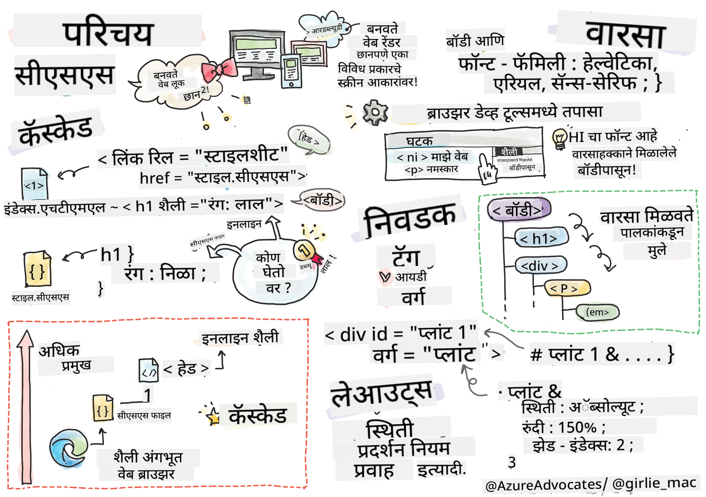
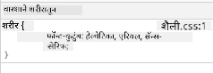
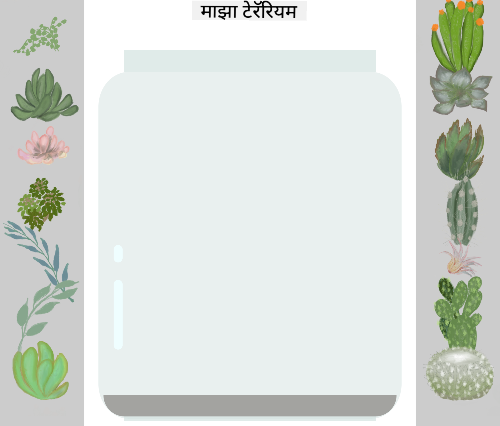

<!--
CO_OP_TRANSLATOR_METADATA:
{
  "original_hash": "92c4431eac70670b0450b02c1d11279a",
  "translation_date": "2025-10-22T16:13:01+00:00",
  "source_file": "3-terrarium/2-intro-to-css/README.md",
  "language_code": "mr"
}
-->
# टेरॅरियम प्रकल्प भाग २: CSS ची ओळख


> स्केच नोट [Tomomi Imura](https://twitter.com/girlie_mac) यांच्याकडून

आपले HTML टेरॅरियम किती साधे दिसत होते ते लक्षात आहे का? CSS च्या मदतीने आपण त्या साध्या संरचनेला आकर्षक स्वरूपात बदलतो.

जर HTML घराचा फ्रेम तयार करण्यासारखे असेल, तर CSS म्हणजे त्या घराला घरासारखे वाटण्यासाठी आवश्यक असलेले सर्व काही - रंग, फर्निचरची मांडणी, प्रकाशयोजना आणि खोल्यांची रचना. व्हर्सायच्या राजवाड्याचा विचार करा, जो सुरुवातीला एक साधा शिकारीचा निवास होता, परंतु सजावट आणि रचनेवर लक्ष केंद्रित करून तो जगातील सर्वात भव्य इमारतींपैकी एक बनला.

आज आपण आपल्या टेरॅरियमला कार्यक्षमतेपासून परिपूर्णतेकडे बदलणार आहोत. आपण घटकांची अचूकपणे मांडणी कशी करायची, वेगवेगळ्या स्क्रीन आकारांनुसार लेआउट कसे प्रतिसाद देईल आणि वेबसाइट्स आकर्षक बनवण्यासाठी दृश्यात्मक आकर्षण कसे तयार करायचे हे शिकणार आहोत.

या धड्याच्या शेवटी, आपण पाहाल की रणनीतिक CSS स्टाइलिंग आपल्या प्रकल्पाला किती प्रभावीपणे सुधारू शकते. चला आपल्या टेरॅरियमला थोडा स्टाइल देऊया.

## पूर्व-व्याख्यान प्रश्नमंजूषा

[पूर्व-व्याख्यान प्रश्नमंजूषा](https://ff-quizzes.netlify.app/web/quiz/17)

## CSS सुरू करण्याची प्रक्रिया

CSS फक्त "सौंदर्य वाढवणे" म्हणून ओळखले जाते, परंतु त्याचा उद्देश खूप व्यापक आहे. CSS म्हणजे एखाद्या चित्रपटाचा दिग्दर्शक असण्यासारखे आहे - आपण फक्त कसे दिसते हेच नाही तर कसे हलते, परस्परसंवादाला कसे प्रतिसाद देते आणि वेगवेगळ्या परिस्थितींशी कसे जुळवून घेते हे नियंत्रित करता.

आधुनिक CSS खूप सक्षम आहे. आपण फोन, टॅब्लेट आणि डेस्कटॉप संगणकांसाठी लेआउट आपोआप समायोजित करणारा कोड लिहू शकता. आपण वापरकर्त्यांचे लक्ष आवश्यक ठिकाणी नेण्यासाठी गुळगुळीत अॅनिमेशन तयार करू शकता. जेव्हा सर्वकाही एकत्र काम करते तेव्हा परिणाम खूप प्रभावी होऊ शकतो.

> 💡 **प्रो टिप**: CSS सतत नवीन वैशिष्ट्ये आणि क्षमता सह विकसित होत आहे. उत्पादन प्रकल्पांमध्ये वापरण्यापूर्वी नवीन CSS वैशिष्ट्यांसाठी ब्राउझर समर्थन सत्यापित करण्यासाठी नेहमी [CanIUse.com](https://caniuse.com) तपासा.

**या धड्यात आपण काय साध्य करू:**
- **संपूर्ण दृश्यात्मक डिझाइन तयार करणे** आधुनिक CSS तंत्रांचा वापर करून
- **मूलभूत संकल्पना शोधणे** जसे की कॅस्केड, वारसा आणि CSS निवडक
- **प्रतिसादात्मक स्थिती आणि लेआउट रणनीती अंमलात आणणे**
- **टेरॅरियम कंटेनर तयार करणे** CSS आकार आणि स्टाइलिंग वापरून

### पूर्वअट

आपण मागील धडातून आपल्या टेरॅरियमसाठी HTML संरचना पूर्ण केली पाहिजे आणि ती स्टाइल करण्यासाठी तयार असावी.

> 📺 **व्हिडिओ संसाधन**: या उपयुक्त व्हिडिओ वॉकथ्रूला पहा
>
> [](https://www.youtube.com/watch?v=6yIdOIV9p1I)

### CSS फाइल सेट करणे

स्टाइलिंग सुरू करण्यापूर्वी, आपल्याला CSS आपल्या HTML शी जोडणे आवश्यक आहे. ही कनेक्शन ब्राउझरला आपल्या टेरॅरियमसाठी स्टाइलिंग सूचना कुठे शोधायच्या ते सांगते.

आपल्या टेरॅरियम फोल्डरमध्ये, `style.css` नावाची नवीन फाइल तयार करा आणि ती आपल्या HTML दस्तऐवजाच्या `<head>` विभागात लिंक करा:

```html
<link rel="stylesheet" href="./style.css" />
```

**या कोडचे कार्य:**
- **HTML आणि CSS फाइल्समध्ये कनेक्शन तयार करणे**
- **ब्राउझरला `style.css` मधील स्टाइल्स लोड आणि लागू करण्यास सांगणे**
- **`rel="stylesheet"` गुणधर्माचा वापर करून CSS फाइल असल्याचे निर्दिष्ट करणे**
- **फाइल पथ `href="./style.css"` सह संदर्भित करणे**

## CSS कॅस्केड समजून घेणे

CSS ला "कॅस्केडिंग" स्टाइल शीट्स का म्हणतात याचा विचार केला आहे का? स्टाइल्स पाण्याच्या धबधब्यासारखे खाली वाहतात आणि कधीकधी एकमेकांशी संघर्ष करतात.

लष्करी आदेश संरचना कशी कार्य करते याचा विचार करा - एक सामान्य आदेश म्हणतो "सर्व सैनिकांनी हिरवा रंग घालावा," परंतु आपल्या युनिटसाठी विशिष्ट आदेश म्हणतो "समारंभासाठी ड्रेस ब्लूज घाला." अधिक विशिष्ट सूचना प्राधान्य घेते. CSS समान तर्काचे अनुसरण करते आणि ही श्रेणी समजून घेणे डीबगिंग अधिक व्यवस्थापनीय बनवते.

### कॅस्केड प्राधान्याचा प्रयोग

चला कॅस्केड अॅक्शनमध्ये पाहूया आणि एक स्टाइल संघर्ष तयार करूया. प्रथम, आपल्या `<h1>` टॅगमध्ये एक इनलाइन स्टाइल जोडा:

```html
<h1 style="color: red">My Terrarium</h1>
```

**या कोडचे कार्य:**
- **इनलाइन स्टाइलिंग वापरून `<h1>` घटकावर थेट लाल रंग लागू करणे**
- **HTML मध्ये CSS एम्बेड करण्यासाठी `style` गुणधर्म वापरणे**
- **या विशिष्ट घटकासाठी सर्वाधिक प्राधान्य असलेला स्टाइल नियम तयार करणे**

यानंतर, आपल्या `style.css` फाइलमध्ये हा नियम जोडा:

```css
h1 {
  color: blue;
}
```

**वरीलमध्ये आपण:**
- **सर्व `<h1>` घटकांना लक्ष्य करणारा CSS नियम परिभाषित केला आहे**
- **बाह्य स्टाइलशीट वापरून मजकूराचा रंग निळा सेट केला आहे**
- **इनलाइन स्टाइल्सच्या तुलनेत कमी प्राधान्य असलेला नियम तयार केला आहे**

✅ **ज्ञान तपासणी**: आपल्या वेब अॅपमध्ये कोणता रंग दिसतो? तो रंग का जिंकतो? अशा परिस्थितींचा विचार करा जिथे आपण स्टाइल्स ओव्हरराइड करू इच्छिता.

> 💡 **CSS प्राधान्य क्रम (सर्वाधिक ते कमी):**
> 1. **इनलाइन स्टाइल्स** (style गुणधर्म)
> 2. **IDs** (#myId)
> 3. **क्लासेस** (.myClass) आणि गुणधर्म
> 4. **घटक निवडक** (h1, div, p)
> 5. **ब्राउझर डीफॉल्ट्स**

## CSS वारसा कृतीत

CSS वारसा म्हणजे अनुवांशिकतेसारखे कार्य करते - घटक त्यांच्या पालक घटकांकडून विशिष्ट गुणधर्म वारसाहक्काने घेतात. जर आपण बॉडी घटकावर फॉन्ट फॅमिली सेट केली, तर आतला सर्व मजकूर आपोआप तोच फॉन्ट वापरतो. हे जसे हॅब्सबर्ग कुटुंबाच्या विशिष्ट जबड्याची रचना पिढ्यानपिढ्या दिसून आली, परंतु प्रत्येक व्यक्तीसाठी निर्दिष्ट केली गेली नाही.

तथापि, सर्वकाही वारसाहक्काने मिळत नाही. फॉन्ट आणि रंग यासारख्या मजकूर शैली वारसाहक्काने मिळतात, परंतु मार्जिन आणि बॉर्डर यासारख्या लेआउट गुणधर्म मिळत नाहीत. जसे मुलांना शारीरिक वैशिष्ट्ये वारसाहक्काने मिळतात पण त्यांच्या पालकांची फॅशन निवड नाही.

### फॉन्ट वारसा निरीक्षण करणे

चला `<body>` घटकावर फॉन्ट फॅमिली सेट करून वारसा कृतीत पाहूया:

```css
body {
  font-family: 'Segoe UI', Tahoma, Geneva, Verdana, sans-serif;
}
```

**येथे काय होते ते समजून घेणे:**
- **संपूर्ण पृष्ठासाठी फॉन्ट फॅमिली सेट करते** `<body>` घटकाला लक्ष्य करून
- **फॉलबॅक पर्यायांसह फॉन्ट स्टॅक वापरते** चांगल्या ब्राउझर सुसंगततेसाठी
- **वेगवेगळ्या ऑपरेटिंग सिस्टमवर चांगले दिसणारे आधुनिक सिस्टम फॉन्ट लागू करते**
- **सर्व चाइल्ड घटकांना हा फॉन्ट वारसाहक्काने मिळतो** जोपर्यंत विशेषतः ओव्हरराइड केले जात नाही

आपल्या ब्राउझरचे डेव्हलपर टूल्स (F12) उघडा, एलिमेंट्स टॅबवर जा आणि आपल्या `<h1>` घटकाची तपासणी करा. आपण पाहाल की ते बॉडीकडून फॉन्ट फॅमिली वारसाहक्काने घेत आहे:



✅ **प्रयोग वेळ**: `<body>` वर `color`, `line-height`, किंवा `text-align` सारखी इतर वारसाहक्काने मिळणारी गुणधर्म सेट करण्याचा प्रयत्न करा. आपल्या हेडिंग आणि इतर घटकांवर काय परिणाम होतो?

> 📝 **वारसाहक्काने मिळणारे गुणधर्म समाविष्ट करतात**: `color`, `font-family`, `font-size`, `line-height`, `text-align`, `visibility`
>
> **वारसाहक्काने न मिळणारे गुणधर्म समाविष्ट करतात**: `margin`, `padding`, `border`, `width`, `height`, `position`

## CSS निवडक मास्टर करणे

CSS निवडक विशिष्ट घटकांना स्टाइलिंगसाठी लक्ष्य करण्याचा आपला मार्ग आहे. ते अचूक दिशानिर्देश देण्यासारखे कार्य करतात - "घर" म्हणण्याऐवजी आपण "निळ्या रंगाचे घर ज्याचे लाल दरवाजे आहेत आणि मेपल स्ट्रीटवर आहे" असे म्हणू शकता.

CSS विविध प्रकारे विशिष्ट असण्याचे मार्ग प्रदान करते, आणि योग्य निवडक निवडणे म्हणजे कार्यासाठी योग्य साधन निवडण्यासारखे आहे. कधी कधी आपल्याला संपूर्ण परिसरातील दरवाजे स्टाइल करायचे असतात, तर कधी फक्त एक विशिष्ट दरवाजा.

### घटक निवडक (टॅग्स)

घटक निवडक HTML घटकांना त्यांच्या टॅग नावाने लक्ष्य करतात. ते आपल्या पृष्ठावर व्यापकपणे लागू होणाऱ्या बेस स्टाइल्स सेट करण्यासाठी योग्य आहेत:

```css
body {
  font-family: 'Segoe UI', Tahoma, Geneva, Verdana, sans-serif;
  margin: 0;
  padding: 0;
}

h1 {
  color: #3a241d;
  text-align: center;
  font-size: 2.5rem;
  margin-bottom: 1rem;
}
```

**या स्टाइल्स समजून घेणे:**
- **संपूर्ण पृष्ठावर सुसंगत टायपोग्राफी सेट करते** `body` निवडक वापरून
- **डिफॉल्ट ब्राउझर मार्जिन आणि पॅडिंग काढून टाकते** चांगल्या नियंत्रणासाठी
- **सर्व हेडिंग घटकांना रंग, संरेखन आणि अंतरासह स्टाइल करते**
- **स्केलेबल, अॅक्सेसिबल फॉन्ट साइजिंगसाठी `rem` युनिट्स वापरते**

घटक निवडक सामान्य स्टाइलिंगसाठी चांगले कार्य करतात, परंतु आपल्याला टेरॅरियममधील झाडांसारख्या वैयक्तिक घटकांना स्टाइल करण्यासाठी अधिक विशिष्ट निवडकांची आवश्यकता असेल.

### अद्वितीय घटकांसाठी ID निवडक

ID निवडक `#` चिन्ह वापरतात आणि विशिष्ट `id` गुणधर्म असलेल्या घटकांना लक्ष्य करतात. IDs पृष्ठावर अद्वितीय असणे आवश्यक असल्याने, ते आपल्या डाव्या आणि उजव्या झाडांच्या कंटेनरसारख्या वैयक्तिक, विशेष घटकांना स्टाइल करण्यासाठी योग्य आहेत.

चला आपल्या टेरॅरियमच्या बाजूच्या कंटेनरसाठी स्टाइल तयार करूया जिथे झाडे राहतील:

```css
#left-container {
  background-color: #f5f5f5;
  width: 15%;
  left: 0;
  top: 0;
  position: absolute;
  height: 100vh;
  padding: 1rem;
  box-sizing: border-box;
}

#right-container {
  background-color: #f5f5f5;
  width: 15%;
  right: 0;
  top: 0;
  position: absolute;
  height: 100vh;
  padding: 1rem;
  box-sizing: border-box;
}
```

**या कोडने काय साध्य केले आहे:**
- **कंटेनर्सला `absolute` पोझिशनिंग वापरून डाव्या आणि उजव्या कडांवर ठेवते**
- **`vh` (व्ह्यूपोर्ट हाइट) युनिट्स वापरून प्रतिसादात्मक उंची सेट करते** जी स्क्रीन आकारानुसार जुळते
- **`box-sizing: border-box` लागू करते** जेणेकरून पॅडिंग एकूण रुंदीमध्ये समाविष्ट होईल
- **शून्य मूल्यांमधून अनावश्यक `px` युनिट्स काढून टाकते** स्वच्छ कोडसाठी
- **एक सूक्ष्म पार्श्वभूमी रंग सेट करते** जो चमकदार ग्रे पेक्षा डोळ्यांना अधिक आरामदायक वाटतो

✅ **कोड गुणवत्ता आव्हान**: लक्षात घ्या की हा CSS DRY (Don't Repeat Yourself) तत्त्वाचे उल्लंघन करतो. आपण ID आणि क्लास दोन्ही वापरून याची पुनर्रचना करू शकता का?

**सुधारित दृष्टिकोन:**
```html
<div id="left-container" class="container"></div>
<div id="right-container" class="container"></div>
```

```css
.container {
  background-color: #f5f5f5;
  width: 15%;
  top: 0;
  position: absolute;
  height: 100vh;
  padding: 1rem;
  box-sizing: border-box;
}

#left-container {
  left: 0;
}

#right-container {
  right: 0;
}
```

### पुनर्वापरयोग्य स्टाइलसाठी क्लास निवडक

क्लास निवडक `.` चिन्ह वापरतात आणि जेव्हा आपल्याला एकाच स्टाइल्स अनेक घटकांवर लागू करायच्या असतात तेव्हा योग्य असतात. IDs च्या विपरीत, क्लासेस आपल्या HTML मध्ये पुन्हा वापरता येतात, ज्यामुळे ते सुसंगत स्टाइलिंग पॅटर्नसाठी आदर्श बनतात.

आपल्या टेरॅरियममध्ये, प्रत्येक झाडाला समान स्टाइलिंगची आवश्यकता आहे परंतु वैयक्तिक स्थितीची आवश्यकता आहे. आम्ही सामायिक स्टाइल्ससाठी क्लासेस आणि अद्वितीय पोझिशनिंगसाठी IDs चा संयोजन वापरणार आहोत.

**प्रत्येक झाडासाठी HTML संरचना येथे आहे:**
```html
<div class="plant-holder">
  
</div>
```

**महत्त्वाचे घटक स्पष्ट केले:**
- **सर्व झाडांसाठी सुसंगत कंटेनर स्टाइलिंगसाठी `class="plant-holder"` वापरते**
- **सामायिक प्रतिमा स्टाइलिंग आणि वर्तनासाठी `class="plant"` लागू करते**
- **अद्वितीय `id="plant1"` समाविष्ट करते** वैयक्तिक पोझिशनिंग आणि JavaScript परस्परसंवादासाठी
- **स्क्रीन रीडर अॅक्सेसिबिलिटीसाठी वर्णनात्मक alt मजकूर प्रदान करते**

आता हे स्टाइल्स आपल्या `style.css` फाइलमध्ये जोडा:

```css
.plant-holder {
  position: relative;
  height: 13%;
  left: -0.6rem;
}

.plant {
  position: absolute;
  max-width: 150%;
  max-height: 150%;
  z-index: 2;
  transition: transform 0.3s ease;
}

.plant:hover {
  transform: scale(1.05);
}
```

**या स्टाइल्सचे विश्लेषण:**
- **सापेक्ष पोझिशनिंग तयार करते** प्लांट होल्डरसाठी पोझिशनिंग संदर्भ स्थापित करण्यासाठी
- **प्रत्येक प्लांट होल्डरला 13% उंची सेट करते** जेणेकरून सर्व झाडे स्क्रोलिंगशिवाय उभ्या फिट होतील
- **कंटेनर्समध्ये झाडे चांगल्या प्रकारे केंद्रित करण्यासाठी थोडेसे डावीकडे सरकवते**
- **`max-width` आणि `max-height` गुणधर्मांसह झाडांना प्रतिसादात्मकपणे स्केल करण्यास अनुमती देते**
- **`z-index` वापरते** टेरॅरियममधील इतर घटकांवर झाडे थर लावण्यासाठी
- **CSS ट्रांझिशन्ससह सूक्ष्म हवर प्रभाव जोडते** चांगल्या वापरकर्ता परस्परसंवादासाठी

✅ **गंभीर विचार**: आपल्याला दोन्ही `.plant-holder` आणि `.plant` निवडकांची आवश्यकता का आहे? जर आपण फक्त एक वापरण्याचा प्रयत्न केला तर काय होईल?

> 💡 **डिझाइन पॅटर्न**: कंटेनर (`.plant-holder`) लेआउट आणि पोझिशनिंग नियंत्रित करते, तर सामग्री (`.plant`) स्वरूप आणि स्केलिंग नियंत्रित करते. हा विभाजन कोड अधिक देखभालक्षम आणि लवचिक बनवतो.

## CSS पोझिशनिंग समजून घेणे

CSS पोझिशनिंग म्हणजे नाटकासाठी स्टेज दिग्दर्शक असण्यासारखे आहे - आपण प्रत्येक पात्र कुठे उभे राहते आणि स्टेजवर कसे फिरते हे निर्देशित करता. काही पात्रे मानक स्वरूपाचे अनुसरण करतात, तर काही नाट्यमय परिणामासाठी विशिष्ट पोझिशनिंगची आवश्यकता असते.

पोझिशनिंग समजून घेतल्यानंतर, अनेक लेआउट आव्हाने व्यवस्थापनीय बनतात. वापरकर्ते स्क्रोल करत असताना शीर्षस्थानी राहणारी नेव्हिगेशन बार आवश्यक आहे? पोझिशनिंग त्याचा सामना करते. विशिष्ट ठिकाणी दिसणारे टूलटिप हवे आहे? ते देखील पोझिशनिंगद्वारे शक्य आहे.

### पाच पोझिशन मूल्ये

| पोझिशन मूल्य | वर्तन | उपयोग प्रकरण |
|----------------|----------|----------|
| `static` | डिफॉल्ट प्रवाह, top/left/right/bottom ला दुर्लक्ष करते | सामान्य दस्तऐवज लेआउट |
| `relative` | त्याच्या सामान्य स्थितीच्या तुलनेत स्थित | लहान समायोजन, पोझिशनिंग संदर्भ तयार करणे |
| `absolute` | जवळच्या पोझिशन केलेल्या पूर्वजाच्या तुलनेत स्थित | अचूक प्लेसमेंट, ओव्हरलॅज |
| `fixed` | व्ह्यूपोर्टच्या तुलनेत स्थित | नेव्हिगेशन
चला टेरॅरियम जार टप्प्याटप्प्याने तयार करूया. प्रत्येक भागासाठी absolute positioning आणि टक्केवारी-आधारित आकारमान वापरले जाते, ज्यामुळे डिझाइन प्रतिसादक्षम होते:

```css
.jar-walls {
  height: 80%;
  width: 60%;
  background: #d1e1df;
  border-radius: 1rem;
  position: absolute;
  bottom: 0.5%;
  left: 20%;
  opacity: 0.5;
  z-index: 1;
  box-shadow: inset 0 0 2rem rgba(0, 0, 0, 0.1);
}

.jar-top {
  width: 50%;
  height: 5%;
  background: #d1e1df;
  position: absolute;
  bottom: 80.5%;
  left: 25%;
  opacity: 0.7;
  z-index: 1;
  border-radius: 0.5rem 0.5rem 0 0;
}

.jar-bottom {
  width: 50%;
  height: 1%;
  background: #d1e1df;
  position: absolute;
  bottom: 0;
  left: 25%;
  opacity: 0.7;
  border-radius: 0 0 0.5rem 0.5rem;
}

.dirt {
  width: 60%;
  height: 5%;
  background: #3a241d;
  position: absolute;
  border-radius: 0 0 1rem 1rem;
  bottom: 1%;
  left: 20%;
  opacity: 0.7;
  z-index: -1;
}
```

**टेरॅरियम बांधकाम समजून घेणे:**
- **वापरते** टक्केवारी-आधारित परिमाणे, जे सर्व स्क्रीन आकारांवर प्रतिसादक्षम स्केलिंगसाठी उपयुक्त आहेत
- **स्थिती** घटकांना अचूकपणे स्टॅक आणि संरेखित करण्यासाठी absolute positioning वापरते
- **लागू करते** वेगवेगळ्या अपारदर्शकता मूल्ये, ज्यामुळे काचेचा पारदर्शकता प्रभाव तयार होतो
- **अंमलात आणते** `z-index` लेयरिंग, ज्यामुळे झाडे जारच्या आत दिसतात
- **जोडते** सूक्ष्म बॉक्स-शॅडो आणि परिष्कृत बॉर्डर-रेडियस, ज्यामुळे अधिक वास्तववादी स्वरूप मिळते

### टक्केवारीसह प्रतिसादक्षम डिझाइन

सर्व परिमाण टक्केवारी वापरतात, निश्चित पिक्सेल मूल्यांऐवजी:

**हे का महत्त्वाचे आहे:**
- **सुनिश्चित करते** की टेरॅरियम कोणत्याही स्क्रीन आकारावर प्रमाणबद्धपणे स्केल होते
- **जपते** जार घटकांमधील दृश्यात्मक संबंध
- **प्रदान करते** मोबाइल फोनपासून मोठ्या डेस्कटॉप मॉनिटर्सपर्यंत एकसंध अनुभव
- **परवानगी देते** डिझाइनला दृश्यात्मक लेआउट न मोडता अनुकूल होण्यासाठी

### CSS युनिट्सचा वापर

आम्ही बॉर्डर-रेडियससाठी `rem` युनिट्स वापरत आहोत, जे मूळ फॉन्ट आकाराच्या तुलनेत स्केल होतात. यामुळे अधिक प्रवेशयोग्य डिझाइन तयार होतात, जे वापरकर्त्याच्या फॉन्ट प्राधान्यांचा आदर करतात. [CSS relative units](https://www.w3.org/TR/css-values-3/#font-relative-lengths) बद्दल अधिक जाणून घ्या अधिकृत स्पेसिफिकेशनमध्ये.

✅ **दृश्यात्मक प्रयोग**: या मूल्यांमध्ये बदल करून परिणाम पाहा:
- जारची अपारदर्शकता 0.5 वरून 0.8 पर्यंत बदला – यामुळे काचेच्या स्वरूपावर काय परिणाम होतो?
- मातीचा रंग `#3a241d` वरून `#8B4513` पर्यंत बदला – याचा दृश्यात्मक प्रभाव काय आहे?
- मातीचा `z-index` 2 वर बदला – लेयरिंगवर काय परिणाम होतो?

---

## GitHub Copilot Agent Challenge 🚀

Agent मोड वापरून खालील आव्हान पूर्ण करा:

**वर्णन:** CSS अॅनिमेशन तयार करा ज्यामुळे टेरॅरियममधील झाडे हळूवारपणे डुलत राहतील, नैसर्गिक वाऱ्याचा प्रभाव निर्माण करण्यासाठी. CSS अॅनिमेशन, ट्रान्सफॉर्म्स आणि कीफ्रेम्सचा सराव करताना टेरॅरियमच्या दृश्यात्मक आकर्षणात सुधारणा करा.

**प्रॉम्प्ट:** टेरॅरियममधील झाडांना हळूवारपणे एका बाजूने दुसऱ्या बाजूला डुलवण्यासाठी CSS कीफ्रेम अॅनिमेशन जोडा. प्रत्येक झाडाला किंचित (2-3 डिग्री) डावीकडे आणि उजवीकडे फिरवणारी डुलण्याची अॅनिमेशन तयार करा, ज्याचा कालावधी 3-4 सेकंद असेल, आणि `.plant` वर्गावर लागू करा. अॅनिमेशन अनंत वेळा लूप होईल आणि नैसर्गिक हालचालीसाठी easing फंक्शन असेल याची खात्री करा.

[agent mode](https://code.visualstudio.com/blogs/2025/02/24/introducing-copilot-agent-mode) बद्दल अधिक जाणून घ्या येथे.

## 🚀 Challenge: काचेच्या प्रतिबिंबांची भर घालणे

तुमच्या टेरॅरियममध्ये वास्तववादी काचेच्या प्रतिबिंबांसह सुधारणा करण्यासाठी तयार आहात का? ही तंत्रज्ञान डिझाइनमध्ये खोली आणि वास्तववाद जोडेल.

तुम्ही प्रकाश काचेच्या पृष्ठभागावर कसा प्रतिबिंबित होतो ते अनुकरण करणारे सूक्ष्म हायलाइट्स तयार कराल. ही पद्धत जॅन व्हॅन आयक सारख्या पुनर्जागरण चित्रकारांनी काचेचे त्रिमितीय स्वरूप तयार करण्यासाठी वापरलेल्या तंत्रासारखी आहे. तुम्ही यासाठी प्रयत्न करत आहात:



**तुमचे आव्हान:**
- **तयार करा** काचेच्या प्रतिबिंबांसाठी सूक्ष्म पांढऱ्या किंवा हलक्या रंगाचे अंडाकृती आकार
- **स्थिती** त्यांना जारच्या डाव्या बाजूला रणनीतिकरित्या ठेवा
- **लागू करा** योग्य अपारदर्शकता आणि ब्लर प्रभाव वास्तववादी प्रकाश प्रतिबिंबासाठी
- **वापरा** `border-radius` सेंद्रिय, बबलसारखे आकार तयार करण्यासाठी
- **प्रयोग करा** ग्रेडियंट्स किंवा बॉक्स-शॅडोच्या मदतीने वास्तववाद वाढवण्यासाठी

## पोस्ट-लेक्चर क्विझ

[Post-lecture quiz](https://ff-quizzes.netlify.app/web/quiz/18)

## तुमचे CSS ज्ञान वाढवा

CSS सुरुवातीला क्लिष्ट वाटू शकते, परंतु या मुख्य संकल्पनांचे समज अधिक प्रगत तंत्रांसाठी मजबूत पाया प्रदान करते.

**तुमचे पुढील CSS शिकण्याचे क्षेत्र:**
- **Flexbox** - घटकांचे संरेखन आणि वितरण सुलभ करते
- **CSS Grid** - जटिल लेआउट तयार करण्यासाठी शक्तिशाली साधने प्रदान करते
- **CSS Variables** - पुनरावृत्ती कमी करते आणि देखभाल सुधारते
- **Responsive design** - साइट्स वेगवेगळ्या स्क्रीन आकारांवर चांगले कार्य करतात याची खात्री करते

### इंटरएक्टिव लर्निंग संसाधने

या आकर्षक, हाताळण्यायोग्य गेम्ससह या संकल्पनांचा सराव करा:
- 🐸 [Flexbox Froggy](https://flexboxfroggy.com/) - मजेदार आव्हानांद्वारे Flexbox मास्टर करा
- 🌱 [Grid Garden](https://codepip.com/games/grid-garden/) - CSS Grid शिकून आभासी गाजरे उगवा
- 🎯 [CSS Battle](https://cssbattle.dev/) - कोडिंग आव्हानांसह तुमचे CSS कौशल्य तपासा

### अतिरिक्त शिक्षण

CSS मूलभूत गोष्टींसाठी, Microsoft Learn मॉड्यूल पूर्ण करा: [Style your HTML app with CSS](https://docs.microsoft.com/learn/modules/build-simple-website/4-css-basics/?WT.mc_id=academic-77807-sagibbon)

## असाइनमेंट

[CSS Refactoring](assignment.md)

---

**अस्वीकरण**:  
हा दस्तऐवज AI भाषांतर सेवा [Co-op Translator](https://github.com/Azure/co-op-translator) वापरून भाषांतरित करण्यात आला आहे. आम्ही अचूकतेसाठी प्रयत्नशील असलो तरी, कृपया लक्षात ठेवा की स्वयंचलित भाषांतरांमध्ये त्रुटी किंवा अचूकतेचा अभाव असू शकतो. मूळ भाषेतील दस्तऐवज हा अधिकृत स्रोत मानला जावा. महत्त्वाच्या माहितीसाठी व्यावसायिक मानवी भाषांतराची शिफारस केली जाते. या भाषांतराचा वापर करून निर्माण झालेल्या कोणत्याही गैरसमज किंवा चुकीच्या अर्थासाठी आम्ही जबाबदार नाही.