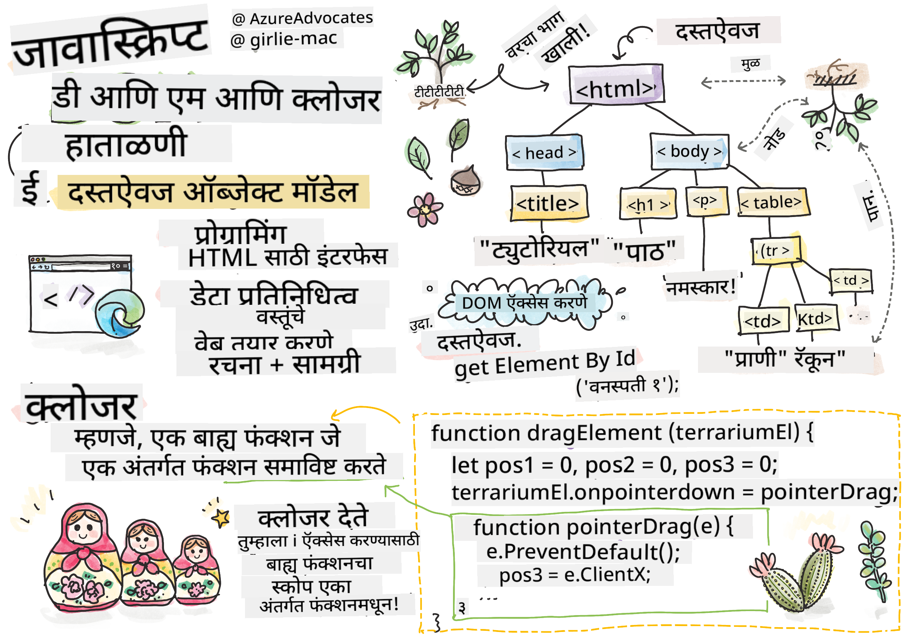
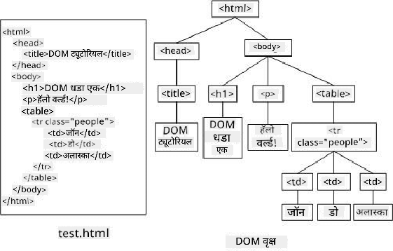

<!--
CO_OP_TRANSLATOR_METADATA:
{
  "original_hash": "61c14b27044861e5e69db35dd52c4403",
  "translation_date": "2025-08-28T16:20:57+00:00",
  "source_file": "3-terrarium/3-intro-to-DOM-and-closures/README.md",
  "language_code": "mr"
}
-->
# टेरॅरियम प्रकल्प भाग ३: DOM मॅनिप्युलेशन आणि क्लोजर


> स्केच नोट [टोमोमी इमुरा](https://twitter.com/girlie_mac) यांच्याकडून

## प्री-लेक्चर क्विझ

[प्री-लेक्चर क्विझ](https://ff-quizzes.netlify.app/web/quiz/19)

### परिचय

DOM म्हणजे "डॉक्युमेंट ऑब्जेक्ट मॉडेल" मॅनिप्युलेट करणे हे वेब डेव्हलपमेंटमधील एक महत्त्वाचा भाग आहे. [MDN](https://developer.mozilla.org/docs/Web/API/Document_Object_Model/Introduction) नुसार, "डॉक्युमेंट ऑब्जेक्ट मॉडेल (DOM) ही वेबवरील डॉक्युमेंटच्या संरचनेत आणि सामग्रीत समाविष्ट असलेल्या ऑब्जेक्ट्सचे डेटा प्रतिनिधित्व आहे." DOM मॅनिप्युलेशनमधील आव्हाने अनेकदा जावास्क्रिप्ट फ्रेमवर्क्स वापरण्याचे कारण बनतात, परंतु आपण व्हॅनिला जावास्क्रिप्ट वापरून स्वतःच हे व्यवस्थापित करू!

याशिवाय, या धड्यात [जावास्क्रिप्ट क्लोजर](https://developer.mozilla.org/docs/Web/JavaScript/Closures) या संकल्पनेची ओळख करून दिली जाईल, ज्याला तुम्ही एका फंक्शनने दुसऱ्या फंक्शनला वेढलेले असे समजू शकता, ज्यामुळे आतील फंक्शनला बाहेरील फंक्शनच्या स्कोपमध्ये प्रवेश मिळतो.

> जावास्क्रिप्ट क्लोजर ही एक विस्तृत आणि गुंतागुंतीची संकल्पना आहे. या धड्यात आपण फक्त मूलभूत कल्पना पाहणार आहोत. या टेरॅरियमच्या कोडमध्ये तुम्हाला एक क्लोजर सापडेल: एक आतील फंक्शन आणि एक बाहेरील फंक्शन, ज्यामुळे आतील फंक्शनला बाहेरील फंक्शनच्या स्कोपमध्ये प्रवेश मिळतो. याबद्दल अधिक माहिती हवी असल्यास [सविस्तर दस्तऐवज](https://developer.mozilla.org/docs/Web/JavaScript/Closures) वाचा.

आपण DOM मॅनिप्युलेट करण्यासाठी क्लोजर वापरणार आहोत.

DOM म्हणजे एक झाड, जे वेब पेज डॉक्युमेंट कसे मॅनिप्युलेट करता येईल याचे प्रतिनिधित्व करते. विविध API (अ‍ॅप्लिकेशन प्रोग्राम इंटरफेस) लिहिले गेले आहेत, ज्यामुळे प्रोग्रामर त्यांच्या पसंतीच्या प्रोग्रामिंग भाषेचा वापर करून DOM मध्ये प्रवेश करू शकतात आणि त्याचे संपादन, बदल, पुनर्रचना आणि व्यवस्थापन करू शकतात.



> DOM आणि त्याचा संदर्भ देणाऱ्या HTML मार्कअपचे प्रतिनिधित्व. [ओल्फा नासरौई](https://www.researchgate.net/publication/221417012_Profile-Based_Focused_Crawler_for_Social_Media-Sharing_Websites) यांच्याकडून

या धड्यात, आपण आपल्या इंटरॅक्टिव्ह टेरॅरियम प्रकल्पाला पूर्ण करणार आहोत, ज्यामध्ये वापरकर्त्याला पानांवर मॅनिप्युलेट करण्याची परवानगी देणारा जावास्क्रिप्ट तयार करणार आहोत.

### पूर्वअट

तुमच्याकडे टेरॅरियमसाठी HTML आणि CSS तयार असले पाहिजे. या धड्याच्या शेवटी, तुम्ही पानांना टेरॅरियममध्ये ड्रॅग करून हलवू शकणार आहात.

### कार्य

तुमच्या टेरॅरियम फोल्डरमध्ये `script.js` नावाची नवीन फाईल तयार करा. ती फाईल `<head>` विभागात इम्पोर्ट करा:

```html
	<script src="./script.js" defer></script>
```

> [!NOTE] बाह्य जावास्क्रिप्ट फाईल HTML पूर्णपणे लोड झाल्यानंतरच चालवण्यासाठी `defer` वापरा. तुम्ही `async` अ‍ॅट्रिब्युट देखील वापरू शकता, ज्यामुळे स्क्रिप्ट HTML पार्स करत असताना चालते, परंतु आपल्या प्रकरणात, ड्रॅग स्क्रिप्ट चालवण्यापूर्वी HTML घटक पूर्णपणे उपलब्ध असणे महत्त्वाचे आहे.
---

## DOM घटक

सर्वप्रथम, तुम्हाला DOM मध्ये मॅनिप्युलेट करायच्या घटकांचे संदर्भ तयार करावे लागतील. आपल्या प्रकरणात, ते १४ झाडे आहेत जी सध्या साइड बारमध्ये आहेत.

### कार्य

```html
dragElement(document.getElementById('plant1'));
dragElement(document.getElementById('plant2'));
dragElement(document.getElementById('plant3'));
dragElement(document.getElementById('plant4'));
dragElement(document.getElementById('plant5'));
dragElement(document.getElementById('plant6'));
dragElement(document.getElementById('plant7'));
dragElement(document.getElementById('plant8'));
dragElement(document.getElementById('plant9'));
dragElement(document.getElementById('plant10'));
dragElement(document.getElementById('plant11'));
dragElement(document.getElementById('plant12'));
dragElement(document.getElementById('plant13'));
dragElement(document.getElementById('plant14'));
```

इथे काय चालले आहे? तुम्ही डॉक्युमेंटचा संदर्भ घेत आहात आणि त्याच्या DOM मध्ये विशिष्ट Id असलेला घटक शोधत आहात. लक्षात ठेवा, HTML च्या पहिल्या धड्यात तुम्ही प्रत्येक झाडाच्या प्रतिमेला वैयक्तिक Id दिले होते (`id="plant1"`)? आता तुम्ही त्या प्रयत्नाचा उपयोग करणार आहात. प्रत्येक घटक ओळखल्यानंतर, तुम्ही त्या आयटमला `dragElement` नावाच्या फंक्शनमध्ये पास करता, जे तुम्ही थोड्याच वेळात तयार कराल. त्यामुळे HTML मधील घटक आता ड्रॅग-एनेबल्ड होतो किंवा लवकरच होईल.

✅ आपण Id ने घटकांचा संदर्भ का घेतो? CSS क्लासने का नाही? याचे उत्तर देण्यासाठी CSS च्या मागील धडाचा संदर्भ घ्या.

---

## क्लोजर

आता तुम्ही `dragElement` क्लोजर तयार करण्यास तयार आहात, जे एक बाह्य फंक्शन आहे जे एका किंवा अधिक आतील फंक्शन्सना वेढते (आपल्या प्रकरणात, तीन फंक्शन्स असतील).

क्लोजर उपयुक्त असतात जेव्हा एका किंवा अधिक फंक्शन्सना बाह्य फंक्शनच्या स्कोपमध्ये प्रवेश करायचा असतो. उदाहरण:

```javascript
function displayCandy(){
	let candy = ['jellybeans'];
	function addCandy(candyType) {
		candy.push(candyType)
	}
	addCandy('gumdrops');
}
displayCandy();
console.log(candy)
```

या उदाहरणात, `displayCandy` फंक्शन एका फंक्शनला वेढते जे आधीपासून फंक्शनमध्ये असलेल्या अ‍ॅरेमध्ये नवीन कँडी प्रकार ढकलते. जर तुम्ही हा कोड चालवला, तर `candy` अ‍ॅरे अज्ञात असेल, कारण ते एक स्थानिक व्हेरिएबल आहे (क्लोजरच्या स्थानिक स्कोपमध्ये).

✅ `candy` अ‍ॅरे कसे प्रवेशयोग्य बनवता येईल? ते क्लोजरच्या बाहेर हलवून पहा. यामुळे अ‍ॅरे स्थानिक राहण्याऐवजी जागतिक होईल.

### कार्य

`script.js` मध्ये घटक डिक्लेरेशनच्या खाली एक फंक्शन तयार करा:

```javascript
function dragElement(terrariumElement) {
	//set 4 positions for positioning on the screen
	let pos1 = 0,
		pos2 = 0,
		pos3 = 0,
		pos4 = 0;
	terrariumElement.onpointerdown = pointerDrag;
}
```

`dragElement` ला त्याचा `terrariumElement` ऑब्जेक्ट स्क्रिप्टच्या शीर्षस्थानी असलेल्या डिक्लेरेशनमधून मिळतो. नंतर, तुम्ही फंक्शनमध्ये पास केलेल्या ऑब्जेक्टसाठी स्थानिक पोझिशन्स `0` वर सेट करता. हे स्थानिक व्हेरिएबल्स आहेत, जे प्रत्येक घटकासाठी मॅनिप्युलेट केले जातील, कारण तुम्ही प्रत्येक घटकात ड्रॅग आणि ड्रॉप फंक्शनॅलिटी जोडता. टेरॅरियम या ड्रॅग केलेल्या घटकांनी भरले जाईल, त्यामुळे अ‍ॅप्लिकेशनला त्यांची जागा कुठे आहे हे ट्रॅक करणे आवश्यक आहे.

याशिवाय, या फंक्शनला पास केलेल्या `terrariumElement` ला `pointerdown` इव्हेंट असाइन केले जाते, जो [वेब API](https://developer.mozilla.org/docs/Web/API) चा भाग आहे, जो DOM व्यवस्थापनासाठी डिझाइन केला आहे. `onpointerdown` इव्हेंट तेव्हा फायर होतो जेव्हा बटण दाबले जाते किंवा आपल्या प्रकरणात, ड्रॅग करण्यायोग्य घटकाला स्पर्श केला जातो. हा इव्हेंट हँडलर [वेब आणि मोबाइल ब्राउझर](https://caniuse.com/?search=onpointerdown) वर काम करतो, काही अपवाद वगळता.

✅ [इव्हेंट हँडलर `onclick`](https://developer.mozilla.org/docs/Web/API/GlobalEventHandlers/onclick) ला अधिक ब्राउझर सपोर्ट आहे; तुम्ही इथे तो का वापरत नाही? तुम्ही तयार करायच्या स्क्रीन इंटरॅक्शनच्या प्रकाराबद्दल विचार करा.

---

## पॉइंटरड्रॅग फंक्शन

`terrariumElement` आता ड्रॅग करण्यासाठी तयार आहे; जेव्हा `onpointerdown` इव्हेंट फायर होतो, तेव्हा `pointerDrag` फंक्शन चालते. हा फंक्शन या ओळीखाली जोडा: `terrariumElement.onpointerdown = pointerDrag;`:

### कार्य 

```javascript
function pointerDrag(e) {
	e.preventDefault();
	console.log(e);
	pos3 = e.clientX;
	pos4 = e.clientY;
}
```

काही गोष्टी घडतात. प्रथम, तुम्ही `e.preventDefault();` वापरून `pointerdown` वर सामान्यतः घडणाऱ्या डिफॉल्ट इव्हेंट्सना होऊ देत नाही. यामुळे इंटरफेसच्या वर्तनावर अधिक नियंत्रण मिळते.

> स्क्रिप्ट फाईल पूर्णपणे तयार झाल्यावर या ओळीवर परत या आणि `e.preventDefault()` वगळून पहा - काय होते?

दुसरे म्हणजे, `index.html` ब्राउझर विंडोमध्ये उघडा आणि इंटरफेस तपासा. जेव्हा तुम्ही झाडावर क्लिक करता, तेव्हा 'e' इव्हेंट कसा कॅप्चर होतो ते पाहू शकता. इव्हेंटमध्ये किती माहिती गोळा केली जाते ते तपासा!  

यानंतर, स्थानिक व्हेरिएबल्स `pos3` आणि `pos4` ला `e.clientX` आणि `e.clientY` सेट केले जातात. हे मूल्ये झाडाच्या x आणि y कोऑर्डिनेट्स कॅप्चर करतात, जेव्हा तुम्ही त्यावर क्लिक करता किंवा स्पर्श करता. 

✅ आता हे अ‍ॅप एका मोठ्या क्लोजरने का बांधले आहे हे अधिक स्पष्ट होत आहे का? जर तसे नसते, तर तुम्ही १४ ड्रॅग करण्यायोग्य झाडांसाठी स्कोप कसा राखला असता?

`pos4 = e.clientY` नंतर दोन अधिक पॉइंटर इव्हेंट मॅनिप्युलेशन जोडा:

```html
document.onpointermove = elementDrag;
document.onpointerup = stopElementDrag;
```

आता तुम्ही झाडाला पॉइंटरसोबत हलवण्याची परवानगी देत आहात आणि झाड सोडल्यावर ड्रॅगिंग थांबवण्याची व्यवस्था करत आहात. `onpointermove` आणि `onpointerup` हे `onpointerdown` प्रमाणेच API चा भाग आहेत. 

---

## `elementDrag` आणि `stopElementDrag` फंक्शन्स

तुम्ही तुमच्या क्लोजरला दोन अंतर्गत फंक्शन्स जोडून पूर्ण कराल, जे झाड ड्रॅग केल्यावर आणि ड्रॅग थांबवल्यावर काय होते ते हाताळतील. 

### कार्य

`pointerDrag` च्या बंद करणाऱ्या कर्ली ब्रॅकेटच्या खाली `elementDrag` फंक्शन जोडा:

```javascript
function elementDrag(e) {
	pos1 = pos3 - e.clientX;
	pos2 = pos4 - e.clientY;
	pos3 = e.clientX;
	pos4 = e.clientY;
	console.log(pos1, pos2, pos3, pos4);
	terrariumElement.style.top = terrariumElement.offsetTop - pos2 + 'px';
	terrariumElement.style.left = terrariumElement.offsetLeft - pos1 + 'px';
}
```

या फंक्शनमध्ये, तुम्ही `pos1` आणि `pos2` च्या सुरुवातीच्या पोझिशन्समध्ये बरेच बदल करता. 

> `offsetTop` आणि `offsetLeft` ही CSS प्रॉपर्टीज आहेत, जी एखाद्या घटकाची स्थिती त्याच्या पालकाच्या स्थितीच्या आधारावर सेट करतात.

### कार्य 

`elementDrag` च्या बंद करणाऱ्या कर्ली ब्रॅकेटच्या खाली `stopElementDrag` फंक्शन जोडा:

```javascript
function stopElementDrag() {
	document.onpointerup = null;
	document.onpointermove = null;
}
```

हे छोटे फंक्शन `onpointerup` आणि `onpointermove` इव्हेंट्स रीसेट करते, ज्यामुळे तुम्ही पुन्हा झाड ड्रॅग करू शकता किंवा नवीन झाड ड्रॅग करू शकता.

✅ जर तुम्ही हे इव्हेंट्स null वर सेट केले नाहीत तर काय होते?

आता तुमचा प्रकल्प पूर्ण झाला आहे!

🥇 अभिनंदन! तुम्ही तुमचे सुंदर टेरॅरियम पूर्ण केले आहे. 

---

## 🚀चॅलेंज

तुमच्या क्लोजरमध्ये नवीन इव्हेंट हँडलर जोडा, जसे की झाडावर डबल-क्लिक केल्यावर ते पुढे आणणे. क्रिएटिव्ह व्हा!

## पोस्ट-लेक्चर क्विझ

[पोस्ट-लेक्चर क्विझ](https://ff-quizzes.netlify.app/web/quiz/20)

## पुनरावलोकन आणि स्व-अभ्यास

स्क्रीनवर घटक ड्रॅग करणे सोपे वाटत असले तरी, हे करण्याचे अनेक मार्ग आहेत आणि त्यावर अवलंबून अनेक अडचणी येऊ शकतात. [ड्रॅग आणि ड्रॉप API](https://developer.mozilla.org/docs/Web/API/HTML_Drag_and_Drop_API) वापरून पहा. 

पॉइंटर इव्हेंट्सबद्दल अधिक माहिती [W3C डॉक्युमेंट्स](https://www.w3.org/TR/pointerevents1/) आणि [MDN वेब डॉक्युमेंट्स](https://developer.mozilla.org/docs/Web/API/Pointer_events) वर मिळवा.

नेहमी ब्राउझर क्षमतांची तपासणी [CanIUse.com](https://caniuse.com/) वापरून करा.

## असाइनमेंट

[DOM सह आणखी काम करा](assignment.md)

---

**अस्वीकरण**:  
हा दस्तऐवज AI भाषांतर सेवा [Co-op Translator](https://github.com/Azure/co-op-translator) चा वापर करून भाषांतरित करण्यात आला आहे. आम्ही अचूकतेसाठी प्रयत्नशील असलो तरी कृपया लक्षात ठेवा की स्वयंचलित भाषांतरे त्रुटी किंवा अचूकतेच्या अभावाने युक्त असू शकतात. मूळ भाषेतील दस्तऐवज हा अधिकृत स्रोत मानला जावा. महत्त्वाच्या माहितीसाठी व्यावसायिक मानवी भाषांतराची शिफारस केली जाते. या भाषांतराचा वापर करून उद्भवलेल्या कोणत्याही गैरसमज किंवा चुकीच्या अर्थासाठी आम्ही जबाबदार राहणार नाही.