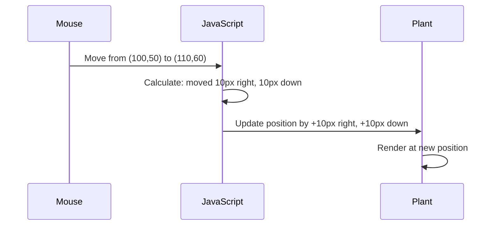

<!--
CO_OP_TRANSLATOR_METADATA:
{
  "original_hash": "bc93f6285423033ebf5b8abeb5282888",
  "translation_date": "2025-10-22T16:11:01+00:00",
  "source_file": "3-terrarium/3-intro-to-DOM-and-closures/README.md",
  "language_code": "mr"
}
-->
# टेरॅरियम प्रकल्प भाग 3: DOM मॅनिप्युलेशन आणि जावास्क्रिप्ट क्लोजर्स


> स्केच नोट [Tomomi Imura](https://twitter.com/girlie_mac) यांच्याकडून

वेब डेव्हलपमेंटमधील सर्वात आकर्षक पैलूंच्या स्वागत आहे - गोष्टी परस्परसंवादी बनवणे! डॉक्युमेंट ऑब्जेक्ट मॉडेल (DOM) हे तुमच्या HTML आणि जावास्क्रिप्टमधील एक पूल आहे, आणि आज आपण त्याचा उपयोग तुमच्या टेरॅरियमला जिवंत करण्यासाठी करू. जेव्हा टिम बर्नर्स-लीने पहिला वेब ब्राउझर तयार केला, तेव्हा त्यांनी एक वेब कल्पना केली जिथे दस्तऐवज गतिशील आणि परस्परसंवादी असू शकतात - DOM त्या दृष्टिकोनाला शक्य बनवते.

आपण जावास्क्रिप्ट क्लोजर्स देखील एक्सप्लोर करू, जे सुरुवातीला थोडे कठीण वाटू शकतात. क्लोजर्स म्हणजे तुमच्या फंक्शन्ससाठी "मेमरी पॉकेट्स" तयार करणे जिथे ते महत्त्वाची माहिती लक्षात ठेवू शकतात. हे असे आहे जसे की तुमच्या टेरॅरियममधील प्रत्येक वनस्पतीने तिच्या स्थानाचा स्वतःचा डेटा रेकॉर्ड ठेवला आहे. या धड्याच्या शेवटी, तुम्हाला समजेल की ते किती नैसर्गिक आणि उपयुक्त आहेत.

आम्ही काय तयार करणार आहोत: एक टेरॅरियम जिथे वापरकर्ते वनस्पती कुठेही ड्रॅग आणि ड्रॉप करू शकतात. तुम्ही DOM मॅनिप्युलेशन तंत्र शिकाल जे ड्रॅग-एंड-ड्रॉप फाइल अपलोड्सपासून परस्परसंवादी गेम्सपर्यंत सर्वकाही शक्य करतात. चला तुमचे टेरॅरियम जिवंत करूया.

## प्री-लेक्चर क्विझ

[प्री-लेक्चर क्विझ](https://ff-quizzes.netlify.app/web/quiz/19)

## DOM समजून घेणे: परस्परसंवादी वेब पृष्ठांसाठी तुमचा प्रवेशद्वार

डॉक्युमेंट ऑब्जेक्ट मॉडेल (DOM) हे जावास्क्रिप्ट तुमच्या HTML घटकांशी संवाद साधण्याचा मार्ग आहे. जेव्हा तुमचा ब्राउझर HTML पृष्ठ लोड करतो, तेव्हा तो मेमरीमध्ये त्या पृष्ठाचे संरचित प्रतिनिधित्व तयार करतो - ते म्हणजे DOM. याला कुटुंबाच्या झाडासारखे समजा जिथे प्रत्येक HTML घटक हा एक कुटुंब सदस्य आहे ज्याला जावास्क्रिप्ट प्रवेश करू शकते, बदलू शकते किंवा पुन्हा व्यवस्थापित करू शकते.

DOM मॅनिप्युलेशन स्थिर पृष्ठांना परस्परसंवादी वेबसाइट्समध्ये बदलते. तुम्ही जेव्हा बटणावर होवर केल्यावर रंग बदलताना, पृष्ठ रीफ्रेश न करता सामग्री अपडेट करताना किंवा तुम्ही ड्रॅग करू शकता असे घटक पाहता, तेव्हा DOM मॅनिप्युलेशन कार्य करत असते.


> DOM आणि त्याचा संदर्भ देणारा HTML मार्कअपचे प्रतिनिधित्व. [Olfa Nasraoui](https://www.researchgate.net/publication/221417012_Profile-Based_Focused_Crawler_for_Social_Media-Sharing_Websites) यांच्याकडून

**DOM शक्तिशाली बनवणाऱ्या गोष्टी:**
- **प्रदान करते** तुमच्या पृष्ठावरील कोणत्याही घटकावर प्रवेश करण्याचा संरचित मार्ग
- **सक्षम करते** पृष्ठ रीफ्रेश न करता गतिशील सामग्री अपडेट्स
- **परवानगी देते** वापरकर्त्याच्या परस्परसंवादांना रिअल-टाइम प्रतिसाद देणे जसे की क्लिक्स आणि ड्रॅग्स
- **निर्माण करते** आधुनिक परस्परसंवादी वेब अनुप्रयोगांसाठी पाया

## जावास्क्रिप्ट क्लोजर्स: व्यवस्थित, शक्तिशाली कोड तयार करणे

[जावास्क्रिप्ट क्लोजर](https://developer.mozilla.org/docs/Web/JavaScript/Closures) म्हणजे फंक्शनला त्याचे स्वतःचे खाजगी कार्यक्षेत्र देणे ज्यामध्ये सतत मेमरी असते. विचार करा की गॅलापागोस बेटांवरील डार्विनच्या फिंचेसने त्यांच्या विशिष्ट वातावरणावर आधारित विशेष चोच कशा विकसित केल्या - क्लोजर्स त्याचप्रमाणे कार्य करतात, विशेष फंक्शन्स तयार करतात जे त्यांच्या विशिष्ट संदर्भाची "आठवण" ठेवतात जरी त्यांचे पॅरेंट फंक्शन पूर्ण झाले तरी.

आमच्या टेरॅरियममध्ये, क्लोजर्स प्रत्येक वनस्पतीला स्वतंत्रपणे तिचे स्थान लक्षात ठेवण्यास मदत करतात. व्यावसायिक जावास्क्रिप्ट डेव्हलपमेंटमध्ये हा पॅटर्न वारंवार दिसतो, त्यामुळे तो समजून घेणे महत्त्वाचे आहे.

> 💡 **क्लोजर्स समजून घेणे**: जावास्क्रिप्टमधील क्लोजर्स हा एक महत्त्वाचा विषय आहे, आणि अनेक डेव्हलपर्स त्याचा पूर्णतः सैद्धांतिक पैलू समजण्याआधी अनेक वर्षे त्याचा वापर करतात. आज, आम्ही व्यावहारिक अनुप्रयोगावर लक्ष केंद्रित करत आहोत - तुम्ही परस्परसंवादी वैशिष्ट्ये तयार करताना क्लोजर्स नैसर्गिकरित्या उदयास येताना पाहाल. समजून घेणे विकसित होईल कारण तुम्ही पाहाल की ते वास्तविक समस्यांचे निराकरण कसे करतात.


> DOM आणि त्याचा संदर्भ देणारा HTML मार्कअपचे प्रतिनिधित्व. [Olfa Nasraoui](https://www.researchgate.net/publication/221417012_Profile-Based_Focused_Crawler_for_Social_Media-Sharing_Websites) यांच्याकडून

या धड्यात, आपण परस्परसंवादी टेरॅरियम प्रकल्प पूर्ण करू जिथे वापरकर्त्याला पृष्ठावरील वनस्पतींमध्ये फेरफार करण्याची परवानगी देणारे जावास्क्रिप्ट तयार करू.

## सुरुवात करण्यापूर्वी: यशासाठी तयारी

तुमच्याकडे मागील टेरॅरियम धड्यांमधील HTML आणि CSS फायली असणे आवश्यक आहे - आपण त्या स्थिर डिझाइनला परस्परसंवादी बनवणार आहोत. जर तुम्ही प्रथमच सामील होत असाल, तर त्या धडे पूर्ण करणे महत्त्वपूर्ण संदर्भ प्रदान करेल.

आम्ही काय तयार करू:
- **स्मूथ ड्रॅग-एंड-ड्रॉप** सर्व टेरॅरियम वनस्पतींसाठी
- **कोऑर्डिनेट ट्रॅकिंग** जेणेकरून वनस्पती त्यांची स्थानं लक्षात ठेवतील
- **पूर्ण परस्परसंवादी इंटरफेस** व्हॅनिला जावास्क्रिप्ट वापरून
- **स्वच्छ, व्यवस्थित कोड** क्लोजर पॅटर्न वापरून

## तुमचा जावास्क्रिप्ट फाइल सेट करणे

चला तुमचा टेरॅरियम परस्परसंवादी बनवणारी जावास्क्रिप्ट फाइल तयार करूया.

**पायरी 1: तुमची स्क्रिप्ट फाइल तयार करा**

तुमच्या टेरॅरियम फोल्डरमध्ये, `script.js` नावाची एक नवीन फाइल तयार करा.

**पायरी 2: जावास्क्रिप्टला तुमच्या HTML शी लिंक करा**

तुमच्या `index.html` फाइलच्या `<head>` विभागात खालील स्क्रिप्ट टॅग जोडा:

```html
<script src="./script.js" defer></script>
```

**`defer` अॅट्रिब्युट का महत्त्वाचे आहे:**
- **सुनिश्चित करते** की तुमची जावास्क्रिप्ट सर्व HTML लोड होईपर्यंत थांबते
- **टाळते** अशा त्रुटी जिथे जावास्क्रिप्ट अशा घटकांचा शोध घेते जे अद्याप तयार नाहीत
- **हमी देते** की तुमचे सर्व वनस्पती घटक परस्परसंवादासाठी उपलब्ध आहेत
- **उत्तम कार्यक्षमता प्रदान करते** पृष्ठाच्या तळाशी स्क्रिप्ट्स ठेवण्यापेक्षा

> ⚠️ **महत्त्वाची टीप**: `defer` अॅट्रिब्युट सामान्य टाइमिंग समस्यांना टाळते. त्याशिवाय, जावास्क्रिप्ट HTML घटक लोड होण्याआधी त्यांचा प्रवेश करण्याचा प्रयत्न करू शकते, ज्यामुळे त्रुटी निर्माण होतात.

---

## जावास्क्रिप्टला तुमच्या HTML घटकांशी जोडणे

आपण घटक ड्रॅग करण्यायोग्य बनवू शकण्यापूर्वी, जावास्क्रिप्टला DOM मध्ये त्यांचा शोध घेणे आवश्यक आहे. याला लायब्ररी कॅटलॉगिंग सिस्टीमसारखे समजा - एकदा तुम्हाला कॅटलॉग क्रमांक मिळाला की, तुम्ही नेमका हवा असलेला पुस्तक शोधू शकता आणि त्यातील सर्व सामग्रीचा प्रवेश करू शकता.

आपण `document.getElementById()` पद्धतीचा उपयोग करून या कनेक्शनचा उपयोग करू. हे जसे अचूक फाइलिंग सिस्टीम आहे - तुम्ही एक ID प्रदान करता आणि ते तुमच्या HTML मधील नेमका घटक शोधते.

### सर्व वनस्पतींसाठी ड्रॅग फंक्शनलिटी सक्षम करणे

तुमच्या `script.js` फाइलमध्ये खालील कोड जोडा:

```javascript
// Enable drag functionality for all 14 plants
dragElement(document.getElementById('plant1'));
dragElement(document.getElementById('plant2'));
dragElement(document.getElementById('plant3'));
dragElement(document.getElementById('plant4'));
dragElement(document.getElementById('plant5'));
dragElement(document.getElementById('plant6'));
dragElement(document.getElementById('plant7'));
dragElement(document.getElementById('plant8'));
dragElement(document.getElementById('plant9'));
dragElement(document.getElementById('plant10'));
dragElement(document.getElementById('plant11'));
dragElement(document.getElementById('plant12'));
dragElement(document.getElementById('plant13'));
dragElement(document.getElementById('plant14'));
```

**हा कोड काय साध्य करतो:**
- **DOM मध्ये** प्रत्येक वनस्पती घटकाचा त्याच्या अद्वितीय ID चा उपयोग करून शोध घेतो
- **प्राप्त करते** प्रत्येक HTML घटकाचा जावास्क्रिप्ट संदर्भ
- **प्रत्येक घटकाला** `dragElement` फंक्शनमध्ये पास करते (जे आपण पुढे तयार करू)
- **प्रत्येक वनस्पतीला** ड्रॅग-एंड-ड्रॉप परस्परसंवादासाठी तयार करते
- **तुमच्या HTML संरचनेला** जावास्क्रिप्ट फंक्शनलिटीशी जोडते

> 🎯 **ID चा वापर का करावा वर्गाऐवजी?** ID विशिष्ट घटकांसाठी अद्वितीय ओळख प्रदान करतात, तर CSS वर्ग गटातील घटकांचे स्टाइलिंग करण्यासाठी डिझाइन केले आहेत. जावास्क्रिप्टला वैयक्तिक घटकांमध्ये फेरफार करायचे असल्यास, ID आम्हाला आवश्यक अचूकता आणि कार्यक्षमता प्रदान करतात.

> 💡 **प्रो टिप**: लक्षात घ्या की आपण प्रत्येक वनस्पतीसाठी स्वतंत्रपणे `dragElement()` कॉल करत आहोत. हा दृष्टिकोन सुनिश्चित करतो की प्रत्येक वनस्पतीला तिचे स्वतःचे स्वतंत्र ड्रॅगिंग वर्तन मिळते, जे गुळगुळीत वापरकर्ता परस्परसंवादासाठी आवश्यक आहे.

---

## ड्रॅग एलिमेंट क्लोजर तयार करणे

आता आपण आमच्या ड्रॅगिंग फंक्शनलिटीचा मुख्य भाग तयार करू: एक क्लोजर जो प्रत्येक वनस्पतीसाठी ड्रॅगिंग वर्तन व्यवस्थापित करतो. हा क्लोजर अनेक अंतर्गत फंक्शन्स समाविष्ट करेल जे माउस मूव्हमेंट ट्रॅक करण्यासाठी आणि घटक स्थान अपडेट करण्यासाठी एकत्र काम करतात.

क्लोजर्स या कार्यासाठी योग्य आहेत कारण ते आम्हाला "खाजगी" व्हेरिएबल्स तयार करण्याची परवानगी देतात जे फंक्शन कॉल्स दरम्यान टिकून राहतात, प्रत्येक वनस्पतीसाठी स्वतंत्र समन्वय ट्रॅकिंग सिस्टम देतात.

### क्लोजर्स समजून घेण्यासाठी एक साधा उदाहरण

क्लोजर्सची संकल्पना स्पष्ट करणारे एक साधे उदाहरण देतो:

```javascript
function createCounter() {
    let count = 0; // This is like a private variable
    
    function increment() {
        count++; // The inner function remembers the outer variable
        return count;
    }
    
    return increment; // We're giving back the inner function
}

const myCounter = createCounter();
console.log(myCounter()); // 1
console.log(myCounter()); // 2
```

**या क्लोजर पॅटर्नमध्ये काय घडत आहे:**
- **खाजगी `count` व्हेरिएबल तयार करते** जे फक्त या क्लोजरमध्ये अस्तित्वात आहे
- **अंतर्गत फंक्शन** त्या बाह्य व्हेरिएबलमध्ये प्रवेश करू शकते आणि त्यात बदल करू शकते (क्लोजर यंत्रणा)
- **जेव्हा आपण परत करतो** अंतर्गत फंक्शन, ते त्या खाजगी डेटाशी त्याचा संबंध टिकवून ठेवते
- **जरी `createCounter()` कार्यान्वित होणे संपले तरीही**, `count` टिकून राहते आणि त्याची किंमत लक्षात ठेवते

### ड्रॅग फंक्शनलिटीसाठी क्लोजर्स का योग्य आहेत

आमच्या टेरॅरियमसाठी, प्रत्येक वनस्पतीला तिच्या वर्तमान स्थानाच्या समन्वयाची आठवण ठेवणे आवश्यक आहे. क्लोजर्स परिपूर्ण उपाय प्रदान करतात:

**आमच्या प्रकल्पासाठी मुख्य फायदे:**
- **स्वतंत्रपणे टिकवून ठेवते** प्रत्येक वनस्पतीसाठी खाजगी स्थान व्हेरिएबल्स
- **ड्रॅग इव्हेंट्स दरम्यान** समन्वय डेटा टिकवून ठेवते
- **वेगवेगळ्या ड्रॅग करण्यायोग्य घटकांमधील व्हेरिएबल्सच्या संघर्षांना** प्रतिबंधित करते
- **स्वच्छ, व्यवस्थित कोड संरचना तयार करते**

> 🎯 **शिकण्याचे उद्दिष्ट**: तुम्हाला सध्या क्लोजर्सच्या प्रत्येक पैलूचे मास्टर होण्याची गरज नाही. ते आमच्या कोडला कसे व्यवस्थित ठेवतात आणि आमच्या ड्रॅगिंग फंक्शनलिटीसाठी स्टेट कसे टिकवून ठेवतात हे पाहण्यावर लक्ष केंद्रित करा.

### ड्रॅग एलिमेंट फंक्शन तयार करणे

आता आपण मुख्य फंक्शन तयार करू जे सर्व ड्रॅगिंग लॉजिक हाताळेल. तुमच्या वनस्पती घटक घोषणांच्या खाली हा फंक्शन जोडा:

```javascript
function dragElement(terrariumElement) {
    // Initialize position tracking variables
    let pos1 = 0,  // Previous mouse X position
        pos2 = 0,  // Previous mouse Y position  
        pos3 = 0,  // Current mouse X position
        pos4 = 0;  // Current mouse Y position
    
    // Set up the initial drag event listener
    terrariumElement.onpointerdown = pointerDrag;
}
```

**स्थान ट्रॅकिंग सिस्टम समजून घेणे:**
- **`pos1` आणि `pos2`**: जुन्या आणि नवीन माउस स्थानांमधील फरक साठवते
- **`pos3` आणि `pos4`**: वर्तमान माउस समन्वय ट्रॅक करते
- **`terrariumElement`**: विशिष्ट वनस्पती घटक ज्याला आपण ड्रॅग करण्यायोग्य बनवत आहोत
- **`onpointerdown`**: वापरकर्ता ड्रॅगिंग सुरू करताना ट्रिगर होणारी घटना

**क्लोजर पॅटर्न कसे कार्य करते:**
- **प्रत्येक वनस्पती घटकासाठी** खाजगी स्थान व्हेरिएबल्स तयार करते
- **ड्रॅगिंग लाइफसायकल दरम्यान** हे व्हेरिएबल्स टिकवून ठेवते
- **प्रत्येक वनस्पतीला** स्वतंत्रपणे तिचे समन्वय ट्रॅक करण्यास सक्षम करते
- **स्वच्छ इंटरफेस प्रदान करते** `dragElement` फंक्शनद्वारे

### पॉइंटर इव्हेंट्स का वापरावे?

तुम्हाला आश्चर्य वाटेल की आपण `onclick` च्या ऐवजी `onpointerdown` का वापरतो. यामागील कारण येथे आहे:

| इव्हेंट प्रकार | सर्वोत्तम उपयोग | अडचण |
|------------|----------|-------------|
| `onclick` | साधे बटण क्लिक | ड्रॅगिंग हाताळू शकत नाही (फक्त क्लिक आणि रिलीज) |
| `onpointerdown` | माउस आणि टच दोन्ही | नवीन, परंतु सध्या चांगले समर्थित |
| `onmousedown` | डेस्कटॉप माउससाठी फक्त | मोबाइल वापरकर्त्यांना वगळते |

**आपण जे तयार करत आहोत त्यासाठी पॉइंटर इव्हेंट्स योग्य आहेत:**
- **उत्तम प्रकारे कार्य करते** जरी कोणी माउस, बोट किंवा स्टायलस वापरत असेल
- **समान वाटते** लॅपटॉप, टॅबलेट किंवा फोनवर
- **ड्रॅगिंग मोशन हाताळते** (फक्त क्लिक-आणि-डन नाही)
- **गुळगुळीत अनुभव तयार करते** जो वापरकर्त्यांना आधुनिक वेब अॅप्सकडून अपेक्षित आहे

> 💡 **भविष्यातील तयारी**: पॉइंटर इव्हेंट्स वापरकर्त्याच्या परस्परसंवाद हाताळण्याचा आधुनिक मार्ग आहेत. माउस आणि टचसाठी स्वतंत्र कोड लिहिण्याऐवजी, तुम्हाला दोन्ही विनामूल्य मिळतात. खूप छान, बरोबर?
- **`pos3` आणि `pos4`**: पुढील गणनेसाठी सध्याचा माऊसचा स्थान साठवा  
- **`offsetTop` आणि `offsetLeft`**: पृष्ठावर घटकाचे सध्याचे स्थान मिळवा  
- **वजाबाकी तर्क**: माऊस जितके हलते तितकेच घटक हलवते  

**चळवळीच्या गणनेचे विहंगावलोकन:**  
1. जुन्या आणि नवीन माऊस स्थानांमधील फरक **मोजतो**  
2. माऊसच्या चळवळीच्या आधारे घटक किती हलवायचा ते **गणना करतो**  
3. घटकाच्या CSS स्थान गुणधर्मांना रिअल-टाइममध्ये **अपडेट करतो**  
4. पुढील चळवळीच्या गणनेसाठी नवीन स्थान **साठवतो**  

### गणिताचा दृश्यात्मक आढावा  


  
### stopElementDrag फंक्शन: साफसफाई  

`elementDrag` च्या बंद करणाऱ्या कर्ली ब्रॅकेटनंतर साफसफाई फंक्शन जोडा:  

```javascript
function stopElementDrag() {
    // Remove the document-level event listeners
    document.onpointerup = null;
    document.onpointermove = null;
}
```
  
**साफसफाई का आवश्यक आहे:**  
- **टाळते** मेमरी लीक्स जे शिल्लक इव्हेंट लिसनर्समुळे होऊ शकतात  
- **थांबवते** वापरकर्त्याने प्लांट सोडल्यावर ड्रॅगिंग वर्तन  
- **परवानगी देते** इतर घटक स्वतंत्रपणे ड्रॅग करण्यासाठी  
- **पुढील ड्रॅग ऑपरेशनसाठी** प्रणाली रीसेट करते  

**साफसफाई न केल्यास काय होते:**  
- ड्रॅगिंग थांबल्यानंतरही इव्हेंट लिसनर्स चालू राहतात  
- न वापरलेल्या लिसनर्स जमा झाल्यामुळे कार्यक्षमता कमी होते  
- इतर घटकांशी संवाद साधताना अनपेक्षित वर्तन  
- अनावश्यक इव्हेंट हँडलिंगवर ब्राउझर संसाधने वाया जातात  

### CSS स्थान गुणधर्म समजून घेणे  

आपली ड्रॅगिंग प्रणाली दोन मुख्य CSS गुणधर्मांवर कार्य करते:  

| गुणधर्म | काय नियंत्रित करते | आपण कसे वापरतो |
|----------|------------------|---------------|
| `top` | वरच्या कडेकडून अंतर | ड्रॅग दरम्यान उभ्या स्थितीकरणासाठी |
| `left` | डाव्या कडेकडून अंतर | ड्रॅग दरम्यान आडव्या स्थितीकरणासाठी |

**ऑफसेट गुणधर्मांबद्दल महत्त्वाची माहिती:**  
- **`offsetTop`**: स्थित पॅरेंट घटकाच्या वरच्या कडेकडून सध्याचे अंतर  
- **`offsetLeft`**: स्थित पॅरेंट घटकाच्या डाव्या कडेकडून सध्याचे अंतर  
- **स्थितीकरण संदर्भ**: ही मूल्ये सर्वात जवळच्या स्थित पूर्वजाच्या संदर्भात असतात  
- **रिअल-टाइम अपडेट्स**: CSS गुणधर्म बदलल्यावर त्वरित बदल होतो  

> 🎯 **डिझाइन तत्त्वज्ञान**: ही ड्रॅग प्रणाली हेतुपुरस्सर लवचिक आहे – येथे "ड्रॉप झोन" किंवा निर्बंध नाहीत. वापरकर्ते प्लांट्स कुठेही ठेवू शकतात, ज्यामुळे त्यांना त्यांच्या टेरॅरियम डिझाइनवर पूर्ण सर्जनशील नियंत्रण मिळते.  

## सर्वकाही एकत्र आणणे: तुमची संपूर्ण ड्रॅग प्रणाली  

अभिनंदन! तुम्ही व्हॅनिला जावास्क्रिप्ट वापरून एक परिष्कृत ड्रॅग-एंड-ड्रॉप प्रणाली तयार केली आहे. तुमचे संपूर्ण `dragElement` फंक्शन आता एक शक्तिशाली क्लोजर समाविष्ट करते जे व्यवस्थापित करते:  

**तुमचे क्लोजर काय साध्य करते:**  
- **खाजगी स्थान व्हेरिएबल्स** स्वतंत्रपणे प्रत्येक प्लांटसाठी राखून ठेवते  
- **पूर्ण ड्रॅग लाइफसायकल** सुरुवातीपासून शेवटपर्यंत हाताळते  
- **संपूर्ण स्क्रीनवर** गुळगुळीत, प्रतिसादात्मक चळवळ प्रदान करते  
- **योग्यरित्या संसाधने साफ करते** मेमरी लीक टाळण्यासाठी  
- **सर्जनशील, अंतर्ज्ञानी इंटरफेस तयार करते** टेरॅरियम डिझाइनसाठी  

### तुमचे इंटरएक्टिव टेरॅरियम चाचणी करा  

आता तुमचे इंटरएक्टिव टेरॅरियम चाचणी करा! तुमची `index.html` फाइल वेब ब्राउझरमध्ये उघडा आणि कार्यक्षमता तपासा:  

1. **क्लिक करा आणि धरून ठेवा** कोणताही प्लांट ड्रॅग सुरू करण्यासाठी  
2. **तुमचा माऊस किंवा बोट हलवा** आणि प्लांट गुळगुळीतपणे पाठलाग करताना पहा  
3. **सोडा** प्लांट त्याच्या नवीन स्थानावर ठेवण्यासाठी  
4. **प्रयोग करा** वेगवेगळ्या व्यवस्था करून इंटरफेस एक्सप्लोर करण्यासाठी  

🥇 **साध्य**: तुम्ही कोर संकल्पना वापरून एक पूर्णपणे इंटरएक्टिव वेब अॅप्लिकेशन तयार केले आहे जे व्यावसायिक विकसक दररोज वापरतात. त्या ड्रॅग-एंड-ड्रॉप कार्यक्षमतेत फाइल अपलोड्स, कॅनबन बोर्ड्स आणि इतर अनेक इंटरएक्टिव इंटरफेसच्या मागे असलेल्या समान तत्त्वांचा समावेश आहे.  

  

---

## GitHub Copilot Agent Challenge 🚀  

Agent मोड वापरून खालील आव्हान पूर्ण करा:  

**वर्णन:** टेरॅरियम प्रकल्पात रीसेट कार्यक्षमता जोडून सुधारणा करा जी सर्व प्लांट्सला त्यांच्या मूळ स्थानावर गुळगुळीत अॅनिमेशनसह परत आणते.  

**प्रॉम्प्ट:** एक रीसेट बटण तयार करा जे क्लिक केल्यावर सर्व प्लांट्सला त्यांच्या मूळ साइडबार स्थानावर CSS ट्रान्झिशन्स वापरून 1 सेकंदात गुळगुळीतपणे परत आणते. फंक्शन पृष्ठ लोड झाल्यावर मूळ स्थान साठवेल आणि रीसेट बटण दाबल्यावर त्या स्थानांवर प्लांट्स गुळगुळीतपणे परत जातील.  

[agent mode](https://code.visualstudio.com/blogs/2025/02/24/introducing-copilot-agent-mode) बद्दल अधिक जाणून घ्या.  

## 🚀 अतिरिक्त आव्हान: तुमचे कौशल्य वाढवा  

तुमचे टेरॅरियम पुढील स्तरावर नेण्यासाठी तयार आहात? या सुधारणा अंमलात आणण्याचा प्रयत्न करा:  

**सर्जनशील विस्तार:**  
- **डबल-क्लिक करा** प्लांटला पुढे आणण्यासाठी (z-index manipulation)  
- **दृश्य अभिप्राय जोडा** जसे की प्लांट्सवर होल्ड करताना हलका प्रकाश  
- **मर्यादा अंमलात आणा** टेरॅरियमच्या बाहेर प्लांट्स ड्रॅग होण्यापासून रोखण्यासाठी  
- **सेव्ह फंक्शन तयार करा** जे स्थान स्थानिक स्टोरेज वापरून लक्षात ठेवते  
- **ध्वनी प्रभाव जोडा** प्लांट उचलताना आणि ठेवताना  

> 💡 **शिकण्याची संधी**: या प्रत्येक आव्हानामुळे तुम्हाला DOM मॅनिप्युलेशन, इव्हेंट हँडलिंग आणि वापरकर्ता अनुभव डिझाइनबद्दल नवीन पैलू शिकायला मिळतील.  

## पोस्ट-लेक्चर क्विझ  

[पोस्ट-लेक्चर क्विझ](https://ff-quizzes.netlify.app/web/quiz/20)  

## पुनरावलोकन आणि स्व-अभ्यास: तुमची समज वाढवा  

तुम्ही DOM मॅनिप्युलेशन आणि क्लोजर्सचे मूलभूत तत्त्वे आत्मसात केली आहेत, परंतु नेहमीच अधिक एक्सप्लोर करण्यासारखे असते! तुमचे ज्ञान आणि कौशल्य वाढवण्यासाठी येथे काही मार्ग आहेत.  

### पर्यायी ड्रॅग आणि ड्रॉप पद्धती  

जास्तीत जास्त लवचिकतेसाठी आम्ही पॉइंटर इव्हेंट्स वापरले, परंतु वेब डेव्हलपमेंटमध्ये अनेक पद्धती आहेत:  

| पद्धत | सर्वोत्तम उपयोगासाठी | शिकण्याचे मूल्य |
|----------|----------|----------------|
| [HTML Drag and Drop API](https://developer.mozilla.org/docs/Web/API/HTML_Drag_and_Drop_API) | फाइल अपलोड्स, औपचारिक ड्रॅग झोन | ब्राउझरच्या मूळ क्षमतांची समज |
| [Touch Events](https://developer.mozilla.org/docs/Web/API/Touch_events) | मोबाइल-विशिष्ट संवाद | मोबाइल-प्रथम विकास पॅटर्न |
| CSS `transform` गुणधर्म | गुळगुळीत अॅनिमेशन | कार्यक्षमता ऑप्टिमायझेशन तंत्र |

### प्रगत DOM मॅनिप्युलेशन विषय  

**तुमच्या शिकण्याच्या प्रवासातील पुढील पायऱ्या:**  
- **इव्हेंट डेलीगेशन**: अनेक घटकांसाठी इव्हेंट्स कार्यक्षमतेने हाताळणे  
- **इंटरसेक्शन ऑब्झर्वर**: घटक व्ह्यूपोर्टमध्ये प्रवेश करताना/सोडताना शोधणे  
- **म्युटेशन ऑब्झर्वर**: DOM संरचनेत बदल पाहणे  
- **वेब घटक**: पुनर्वापरयोग्य, इनकॅप्स्युलेटेड UI घटक तयार करणे  
- **व्हर्च्युअल DOM संकल्पना**: फ्रेमवर्क्स DOM अपडेट्स कसे ऑप्टिमाइझ करतात ते समजून घेणे  

### सतत शिकण्यासाठी आवश्यक संसाधने  

**तांत्रिक दस्तऐवज:**  
- [MDN Pointer Events Guide](https://developer.mozilla.org/docs/Web/API/Pointer_events) - व्यापक पॉइंटर इव्हेंट संदर्भ  
- [W3C Pointer Events Specification](https://www.w3.org/TR/pointerevents1/) - अधिकृत मानक दस्तऐवज  
- [JavaScript Closures Deep Dive](https://developer.mozilla.org/docs/Web/JavaScript/Closures) - प्रगत क्लोजर पॅटर्न  

**ब्राउझर सुसंगतता:**  
- [CanIUse.com](https://caniuse.com/) - ब्राउझरमध्ये वैशिष्ट्य समर्थन तपासा  
- [MDN Browser Compatibility Data](https://github.com/mdn/browser-compat-data) - तपशीलवार सुसंगतता माहिती  

**सराव संधी:**  
- **तयार करा** ड्रॅग मेकॅनिक्स वापरून एक पझल गेम  
- **तयार करा** ड्रॅग-एंड-ड्रॉप टास्क व्यवस्थापनासह कॅनबन बोर्ड  
- **डिझाइन करा** ड्रॅग करण्यायोग्य फोटो व्यवस्था असलेली इमेज गॅलरी  
- **प्रयोग करा** मोबाइल इंटरफेससाठी टच जेस्चर वापरून  

> 🎯 **शिकण्याची रणनीती**: या संकल्पना ठोस करण्याचा सर्वोत्तम मार्ग म्हणजे सराव. ड्रॅग करण्यायोग्य इंटरफेसचे प्रकार तयार करण्याचा प्रयत्न करा – प्रत्येक प्रकल्प तुम्हाला वापरकर्ता संवाद आणि DOM मॅनिप्युलेशनबद्दल काहीतरी नवीन शिकवेल.  

## असाइनमेंट  

[DOM सह थोडे अधिक काम करा](assignment.md)  

---

**अस्वीकरण**:  
हा दस्तऐवज AI भाषांतर सेवा [Co-op Translator](https://github.com/Azure/co-op-translator) वापरून भाषांतरित करण्यात आला आहे. आम्ही अचूकतेसाठी प्रयत्नशील असलो तरी, कृपया लक्षात ठेवा की स्वयंचलित भाषांतरांमध्ये त्रुटी किंवा अचूकतेचा अभाव असू शकतो. मूळ भाषेतील दस्तऐवज हा अधिकृत स्रोत मानला जावा. महत्त्वाच्या माहितीसाठी व्यावसायिक मानवी भाषांतराची शिफारस केली जाते. या भाषांतराचा वापर करून निर्माण झालेल्या कोणत्याही गैरसमज किंवा चुकीच्या अर्थासाठी आम्ही जबाबदार राहणार नाही.